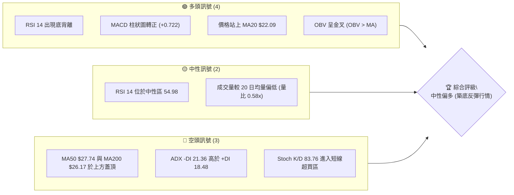
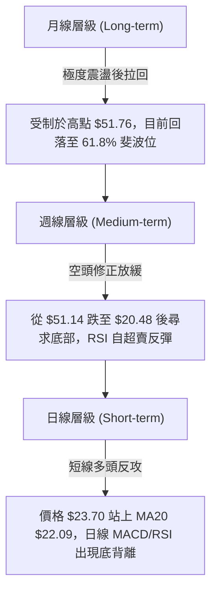
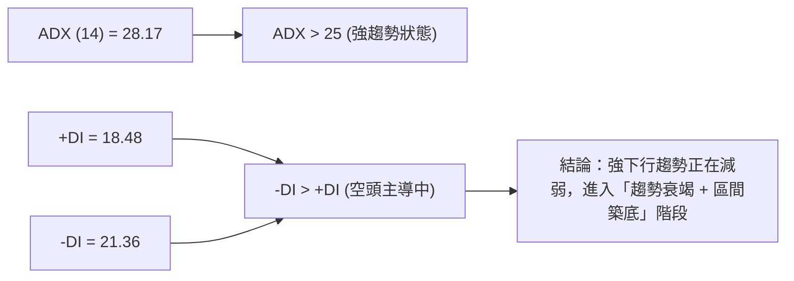
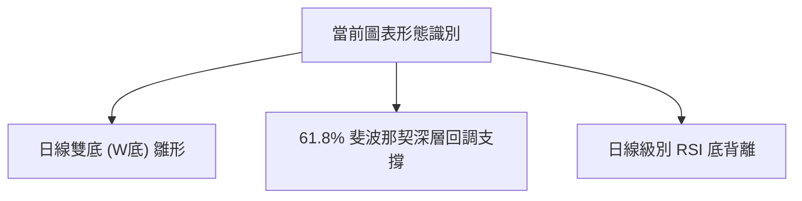
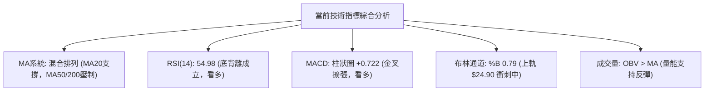
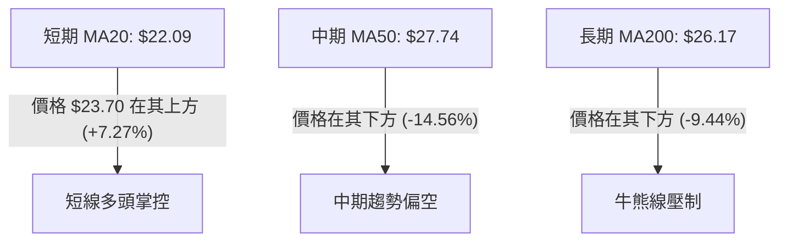
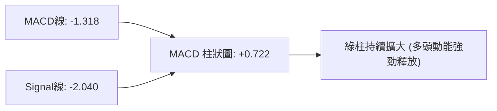
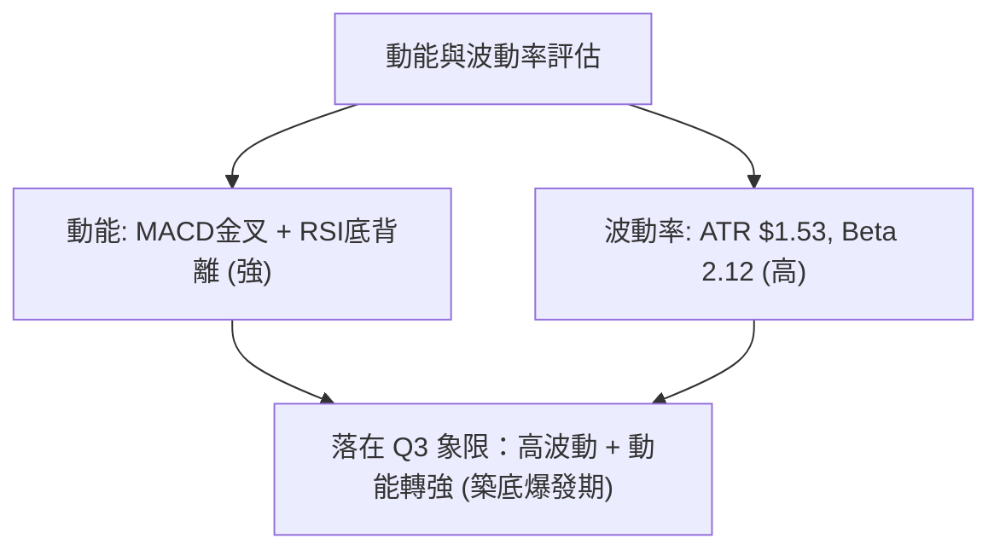
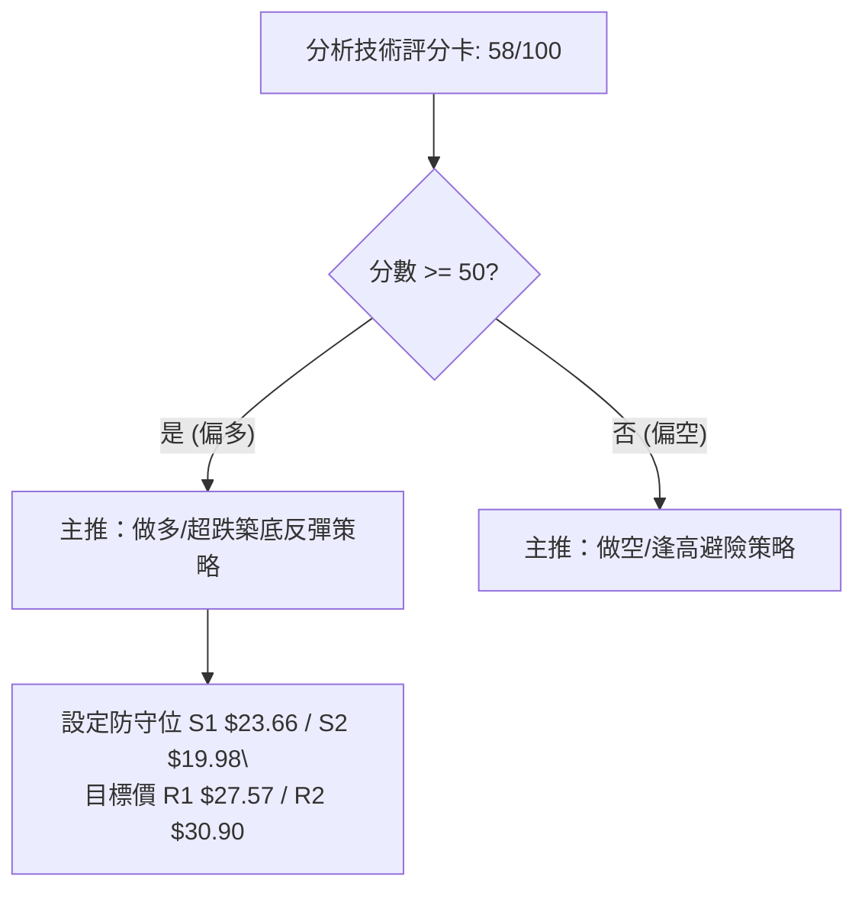
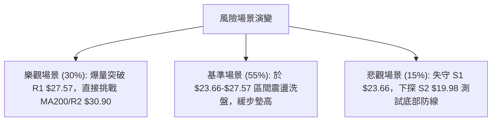

# PL 技術分析報告

> **報告日期**：2026-08-11 ｜ **語言**：繁體中文 ｜ **數據來源**：Yahoo Finance ｜ **當前價格**：$23.70

---

## 目錄

| 章節 | 內容 |
|------|------|
| [1. 技術面概覽](#1-技術面概覽) | 訊號儀表板、核心指標、評分卡 |
| [2. 趨勢分析](#2-趨勢分析) | 多時框趨勢、長中短期走勢 |
| [3. 圖表形態分析](#3-圖表形態分析) | 形態識別、K線組合、目標價 |
| [4. 支撐與阻力](#4-支撐與阻力) | 關鍵價位、斐波那契回調 |
| [5. 技術指標深度解讀](#5-技術指標深度解讀) | MA/RSI/MACD/布林/成交量 |
| [6. 動能與波動率](#6-動能與波動率) | 動能評估、ATR、Beta |
| [7. 多時框架總結](#7-多時框架總結) | 時框架評分矩陣 |
| [8. 交易策略建議](#8-交易策略建議) | 多空策略、風險報酬比 |
| [9. 風險提示與監控](#9-風險提示與監控) | 監控指標、風險場景 |

---

## 1. 技術面概覽

### 🎯 技術訊號儀表板



### 📊 核心指標速覽表

| 指標類別 | 指標名稱 | 當前數值 | 訊號 | 解讀 |
|----------|----------|----------|------|------|
| **價格** | 當前價格 | $23.70 | 🟡 中性 | 52週區間 38.5% 位置，落於 61.8% 斐波那契位 ($23.54) 附近 |
| **均線** | MA20 | $22.09 | 🟢 看多 | 價格突破並站穩 MA20 上方 (+7.27%)，短線轉強 |
| **均線** | MA50 | $27.74 | 🔴 看空 | 價格位於 MA50 下方 (-14.56%)，中軌反彈面臨中期均線壓力 |
| **均線** | MA200 | $26.17 | 🔴 看空 | 價格位於 MA200 下方 (-9.44%)，長期走勢仍受制於牛熊分界線 |
| **動能** | RSI(14) | 54.98 | 🟢 看多 | 中性偏強，日線層級確認「底背離」訊號，反彈動能積聚 |
| **動能** | MACD | -1.318 (柱狀 +0.722) | 🟢 看多 | MACD 慢線快線低位金叉，柱狀圖持續擴大，看多動能釋放 |
| **波動** | ATR(14) | $1.53 (6.46%) | 🟡 中性 | 日均波動幅度達 $1.53，屬於中高波動，交易需留意風控 |

### 🏆 技術評分卡

```
╔══════════════════════════════════════════════════════════════════╗
║              技術評分卡 — PL (2026-08-11)                        ║
╠══════════════════════════════════════════════════════════════════╣
║ 趨勢強度      ▓▓▓▓▓▓▓▓▓▓░░░░░░░░░░  50/100  🟡 ADX 28.17 空頭趨勢趨緩 ║
║ 動能指標      ▓▓▓▓▓▓▓▓▓▓▓▓▓░░░░░░░  68/100  🟢 RSI底背離 + MACD金叉  ║
║ 支撐穩定度    ▓▓▓▓▓▓▓▓▓▓▓▓▓▓░░░░░░  72/100  🟢 61.8% 斐波位 $23.54 支撐 ║
║ 成交量配合    ▓▓▓▓▓▓▓▓▓▓▓░░░░░░░░░  55/100  🟡 縮量上漲，OBV微幅向上  ║
║ 形態完整度    ▓▓▓▓▓▓▓▓▓▓▓▓░░░░░░░░  60/100  🟢 底背離築底反彈形態     ║
║ 均線排列      ▓▓▓▓▓▓▓▓░░░░░░░░░░░░  45/100  🔴 均線呈混合空頭排列     ║
╠══════════════════════════════════════════════════════════════════╣
║ 綜合評分      ▓▓▓▓▓▓▓▓▓▓▓▓░░░░░░░░  58/100  ⚖️ 偏多 (超跌反彈築底)    ║
╚══════════════════════════════════════════════════════════════════╝
```

---

## 2. 趨勢分析

### 🌐 多時框趨勢分析



### 📈 長期趨勢 — 12個月走勢圖（Unicode）

```
PL 月線走勢圖（2025-08 至 2026-08）
價格軸 ($)
$55.00 ┤                                      ● (2026-05 Peak $51.14)
$45.00 ┤                                    ●   
$35.00 ┤                                  ●       ●
$25.00 ┤                            ●   ●           ●       ● (現在 $23.70)
$15.00 ┤                  ●   ●   ●                   ●   ●
$5.00  ┤●   ●   ●   ●   ●                                 
        └─┬───┬───┬───┬───┬───┬───┬───┬───┬───┬───┬───┬───► 時間
         08  09  10  11  12  01  02  03  04  05  06  07  08 (月份/年份: 2025-2026)
```

**走勢特徵分析表格**：

| 階段 | 時間區間 | 價格變動 | 漲跌幅 | 走勢特徵描述 |
|------|----------|----------|--------|--------------|
| **奠基期** | 2025-08 ～ 2025-10 | $7.09 → $13.45 | +89.7% | 底部爆量突破，估值修復開端 |
| **主升段** | 2025-11 ～ 2026-05 | $11.90 → $51.14 | +329.7% | 強勢牛市主升浪，創下 52 週高點 $51.76 |
| **崩跌段** | 2026-06 ～ 2026-07 | $51.14 → $20.48 | -59.9% | 高位恐慌性獲利回吐，快速下殺至 61.8% 斐波那契支撐 |
| **築底期** | 2026-08 當前 | $20.48 → $23.70 | +15.7% | 止跌築底，MACD/RSI 出現底背離，短線打出次低點反彈 |

### 📊 中期趨勢（週線分析）

從 2020 週歷史數據來看，PL 在 2026 年 5 月底觸及 $51.14 高點後，經歷了連續 8 週的劇烈洗盤，週線 RSI 一度跌至 10.2（極度超賣）。近兩週（2026-08-02 及 2026-08-09）收盤價自 $20.48 回升至 $23.93，週線 MACD 柱狀圖自 -0.176 轉正至 +0.682，顯示中期下行暴跌動能已經耗盡，價格在 $19.98–$23.66 區間建立沉澱基地。

### ⚡ 趨勢強度評估（ADX 解讀）



| ADX 數值區間 | 當前讀數 | 趨勢狀態判斷 | 交易策略指導 |
|--------------|----------|--------------|--------------|
| **> 25 (強趨勢)** | **28.17** | **空頭強趨勢末期** | 順勢空單應逢低獲利了結，中長線投資人可尋找底背離做多機會 |

---

## 3. 圖表形態分析

### 🔍 形態識別系統



| 形態名稱 | 信心度 | 判斷依據（引用數據） | 完成度 | 目標價（附計算式） |
|----------|--------|----------------------|--------|--------------------|
| **雙底 (W底)** | 65% | 第一底 $20.47 (07-26)，第二底 $20.48 (08-02)， neck 線突破位 R1 $27.57 | 60% | 由形態高度推算：頸線 $27.57 + (頸線 $27.57 - 低點 $20.47) = $34.67（接近 R3 $34.25） |
| **底背離** | 85% | 7/26 價格 $20.47 (RSI 10.2) vs 8/02 價格 $20.48 (RSI 25.6)，價格持平而 RSI 大幅抬升 | 100% | 均值回歸目標：MA200 $26.17 ~ R1 $27.57 |

### 🕯️ 重要K線形態分析

| 月份/日期 | 收盤價 | K線形態 | 解讀 | 訊號 |
|-----------|--------|---------|------|------|
| **2026-05** | $51.14 | 長上影大陽線 | 多頭竭盡衝高回落，高位賣壓沉重 | 🔴 見頂訊號 |
| **2026-06** | $33.13 | 爆量長陰線 | 主力獲利了結，破位下殺，成交量破億 | 🔴 停損恐慌賣壓 |
| **2026-07** | $20.48 | 超賣錘頭線 | 下探 52 週低點區間，底部承接盤湧入 | 🟢 築底止跌訊號 |
| **2026-08 (最新)**| $23.70 | 低位小陽線 | 震盪反彈，站上 MA20，短期均線扭轉 | 🟢 多頭反攻訊號 |

### 📉 ASCII 走勢形態示意圖

```
PL 日線雙底 (W底) 與底背離示意圖
價位 ($)
$27.57 ┤───────────────────────預測頸線突破位 (R1)
       │                      /
$23.70 ┤─────────● (現價)────/  ◄ 突破 MA20 ($22.09)
       │        / \         /
       │       /   \       /
$20.48 ┤──────●─────●─────/     ◄ 雙底測試 ($20.47 / $20.48)
       └──────┼─────┼──────────► 時間
RSI(14)│     10.2  25.6  54.98  ◄ RSI 底部明顯抬升（底背離 confirm）
```

### 🎯 形態目標價計算

1. **底背離第一目標價**：均值回歸至 MA200 扣抵位置與阻力位 **R1: $27.57**。
2. **雙底突破第二目標價**：若成功突破頸線 $27.57，形態高度 $27.57 - $20.47 = $7.10。由形態高度推算目標價為 $27.57 + $7.10 = **$34.67**（與波段高點阻力位 **R3: $34.25** 及 38.2% 斐波位 **$34.32** 高度重合）。

---

## 4. 支撐與阻力

### 🗺️ 關鍵價位分布圖（Unicode）

```
PL 價位結構分布圖
════════════════════════════════════════════════════════════════
$51.76 ║████████████████████████████████║ 52W High / 0.0% Fib
$40.98 ║██████████████████              ║ 23.6% Fib
$34.25 ║████████████████                ║ 強阻力 R3 / 38.2% Fib ($34.32)
$30.90 ║████████████                    ║ 阻力 R2 / 50.0% Fib ($28.93)
$27.57 ║████████                        ║ 關鍵阻力 R1 / MA50 ($27.74)
$26.17 ║██████                          ║ MA200 牛熊線
$23.70 ╠════════════════════════════════╣ ◄ 當前價格
$23.66 ║▓▓▓▓▓▓▓▓▓▓▓▓▓▓▓▓▓▓▓▓▓▓▓▓▓▓▓▓▓▓▓▓║ 近期支撐 S1 / 61.8% Fib ($23.54)
$19.98 ║████████████████████████████████║ 強支撐 S2 (7/26 低點 $20.47 護城河)
$19.16 ║████████████████████████████████║ 鐵板支撐 S3
$06.10 ║████████████████████████████████║ 52W Low / 100.0% Fib
════════════════════════════════════════════════════════════════
```

### 🚧 阻力位分析表

| 阻力級別 | 價位 | 形成原因 | 突破難度 | 重要性 |
|----------|------|----------|----------|--------|
| **阻力 R1** | **$27.57** | 近一年波段高點聚類、接近 MA50 ($27.74) 與 MA200 ($26.17) | 🔴 高 | ★★★★☆ 短線反彈生死線，突破將打開上升空間 |
| **阻力 R2** | **$30.90** | 波段密集成交區、接近 50.0% 斐波那契回調位 ($28.93) | 🟡 中 | ★★★☆☆ 中期解套賣壓密集區 |
| **阻力 R3** | **$34.25** | 近一年波段高點聚類、與 38.2% 斐波位 ($34.32) 重合 | 🔴 極高 | ★★★★★ 雙底形態理論目標位，多頭中期終極目標 |

### 🛡️ 支撐位分析表

| 支撐級別 | 價位 | 形成原因 | 守住機率 | 重要性 |
|----------|------|----------|----------|--------|
| **支撐 S1** | **$23.66** | 近一年波段低點聚類、極度接近 61.8% 斐波位 ($23.54) | 🟢 75% | ★★★★☆ 短線多頭防守第一線，現價即在此處 |
| **支撐 S2** | **$19.98** | 近一年波段低點聚類、包含 7/26 低點 $20.47 支撐 | 🟢 85% | ★★★★★ 底部核心護城河，失守宣告築底失敗 |
| **支撐 S3** | **$19.16** | 歷史波段密集成交低點聚類 | 🟢 95% | ★★★☆☆ 極端賣壓下的最後鐵板支撐 |

### 📐 斐波那契回調位分析

依據 52 週高低價區間（$6.10 → $51.76）計算：

- **0.0% (52W High)**: $51.76
- **23.6%**: $40.98
- **38.2%**: $34.32
- **50.0%**: $28.93
- **61.8%**: $23.54 ◄ **當前價格 $23.70 完美落於此關鍵黃金分割位點**
- **78.6%**: $15.87
- **100.0% (52W Low)**: $6.10

**解讀**：價格在從 $51.76 回落的過程中，精確地在 **61.8% 斐波那契回調位 ($23.54)** 及 **S1 ($23.66)** 尋獲強烈買盤支撐。在技術分析中，61.8% 是黃金回調的黃金防線，若能在此處完成籌碼換手，極易引發結構性的波段反彈。

---

## 5. 技術指標深度解讀

### 🎛️ 指標訊號總覽



### 📈 移動平均線排列分析



- **均線排列狀態**：當前 MA5 ($23.16)、MA10 ($22.03)、MA20 ($22.09) 開始由下向上交叉，形成短線金叉排列；但扣抵上方 MA50 ($27.74)、MA60 ($30.71) 與 MA200 ($26.17) 仍處於下行段，呈現典型的「**短線反彈、長線壓制**」混合排列。
- **均線扣抵提示**：MA200 位於 $26.17，是多頭反彈的第一個強壓區，反彈至此需密切注意解套賣壓。

### 📉 RSI(14) 分析

```
RSI(14) 強度條: [█████████████░░░░░░░] 54.98 (中性偏多)
```

- **超買超賣判斷**：RSI 目前處於 54.98，脫離了 7 月底 10.2 的極度超賣區，進入多頭可攻可守的中性偏強區間。
- **背離確認**：⚠️ **明確底背離 (Bullish Divergence) 成立**。
  - 價格軌跡：7/26 觸及低點 $20.47，8/02 再次下探低點 $20.48（價格未創新低，呈雙底）。
  - RSI 軌跡：7/26 RSI 為 10.2，8/02 RSI 為 25.6（RSI 顯著抬升）。
  - **結論**：賣壓枯竭，動能指標領先價格發出強烈反彈訊號。

### 📊 MACD(12/26/9) 訊號解讀



- **快慢線位置**：MACD 線 (-1.318) 已上穿 Signal 線 (-2.040)，形成低位黃金交叉。
- **柱狀圖表現**：柱狀圖持續擴大至 +0.722，顯示空頭下行動態已徹底瓦解，多頭短線掌控發言權。

### 📦 布林通道分析

```
PL 布林通道結構圖
════════════════════════════════════════════════════════════════
$24.90 ┤---------------------------------- Upper Band (BB上軌)
$23.70 ┤                   ● (現價, %B = 0.79)
$22.09 ┤================================== Middle Band (MA20中軌)
$19.29 ┤---------------------------------- Lower Band (BB下軌)
════════════════════════════════════════════════════════════════
```

- **通道位置**：%B 讀數為 **0.79**，價格自布林下軌 $19.29 向上反彈，已越過中軌 $22.09，正在向布林上軌 $24.90 推進。
- **通道形態**：帶寬開始收斂後微微向上張口，若能強勢突破上軌 $24.90，將引發布林帶擴張行情。

### 💹 成交量分析（量價配合度）

- **最新成交量**：4,224,485 股，相較於 20 日均量 7,338,484 股（量比 0.58x），呈縮量反彈特徵。
- **OBV 趨勢**：OBV > MA，量能指標呈金叉，顯示籌碼沉澱良好，主力並未在反彈中大量拋售，量價配合屬於「**惜售型沉澱反彈**」。

---

## 6. 動能與波動率

### ⚡ 動能評估四象限

| 象限 | 動能強度 | 波動率 | 當前狀態 | 技術面評估 |
|------|----------|--------|----------|------------|
| **Q1** | 強 | 低 | — | 穩健主升段 (最適宜加碼) |
| **Q2** | 弱 | 低 | — | 沉悶盤整段 |
| **Q3** | 強 | 高 | **✓ (當前)** | **爆發性反彈段 (高勝率短線機會)** |
| **Q4** | 弱 | 高 | — | 恐慌主跌段 (嚴禁盲目抄底) |



### 📊 ATR 波動率分析

- **ATR(14) 數值**：**$1.53**（佔當前股價 6.46%）。
- **交易風控涵義**：PL 屬於高波動標的，每日正常價格擺幅約為 $1.53。
- **止損距離建議**：短線交易止損距離應至少設為 1.5 倍 ATR（約 $2.30），以防範無效噪音震盪踢離出場。

### 📐 Beta 與市場相關性

- **Beta 係數**：**2.123**。
- **市場特性**：PL 屬於高 Beta 成長型航太國防/地緣空間數據股，波動度為標普 500 指數的 2.12 倍。在大盤反彈時具有強烈的放大槓桿效應，適合追求高 Alpha 的高風險承受度資金。

---

## 7. 多時框架總結

### 📋 時框架評分表

| 時框架 | 趨勢方向 | 動能指標 | 均線排列 | 圖表形態 | 綜合評分 | 交易建議 |
|--------|----------|----------|----------|----------|----------|----------|
| **日線 (Short-term)** | 🟢 築底反彈 | 🟢 底背離/MACD金叉 | 🟡 站上 MA20 | 🟢 雙底雛形 | **68/100** | 偏多操作 / 尋找買點 |
| **週線 (Medium-term)**| 🟡 震盪整理 | 🟢 MACD柱轉正 | 🔴 壓制於 MA50 | 🟡 超賣回升 | **52/100** | 區間觀望 / 逢低佈局 |
| **月線 (Long-term)**  | 🔴 高位拉回 | 🟡 中性 | 🟡 61.8% 斐波位 | 🟡 大區間震盪 | **50/100** | 長線沉澱 / 觀察支撐 |

### 🔲 綜合訊號矩陣

| 維度 | 短期 (日線) | 中期 (週線) | 長期 (月線) | 一致性評估 |
|------|-------------|-------------|-------------|------------|
| **方向** | 多頭反彈 | 空頭收斂 | 高位回調 | 🟡 跨時框出現動能轉折（短期領先轉多） |
| **關鍵位** | 站穩 S1 $23.66 | 守住 $20.47 低點 | 站在 61.8% 斐波位 | 🟢 關鍵價位收斂於 $23.54-$23.66 區域 |

### ⚖️ 多時框收斂結論

依據多時框收斂規則：當前 **ADX = 28.17 (> 25)**，雖仍顯示中長期空頭力道未完全消退，但日線級別發生的 **RSI 底背離** 與 **MACD 低位金叉** 正強烈驅動一波「均值回歸」反彈。

**收斂結論**：**中性偏多 (偏向多頭反彈)**。主導時框為日線反彈帶動週線打底，交易策略應以「**以 S1 $23.66 為防守底線，做多入場尋求向 R1 $27.57 及 R2 $30.90 的均值回歸反彈**」為主軸。

---

## 8. 交易策略建議

### 🗺️ 策略決策流程圖



### 🧭 策略路由

**當前主策略方向 = 🟢 多頭超跌築底反彈策略（依評分 58/100）**

基於日線 RSI 底背離及價格守住 61.8% 斐波那契回調位 ($23.54)，短期多頭勝率較高，本報告主推**多頭反彈策略**。

### 🎯 價格情境階梯（Price Scenarios）

| 觸發條件 | 下一目標 | 後續延伸 | 情境含義 |
|----------|----------|----------|----------|
| **突破 R1 $27.57** | R2 $30.90 | R3 $34.25 | 短線築底成功，發動中級反彈浪 |
| **站穩現價 $23.70 區間** | R1 $27.57 | — | 區間沉澱，打底打基 |
| **跌破 S1 $23.66** | S2 $19.98 | S3 $19.16 | 短線反彈失敗，再次測試底部護城河 |

### 📊 情境機率分佈

| 情境 | 機率 | 主要依據 |
|------|------|----------|
| **強勢反彈 (衝擊 R1/R2)** | **55%** | 日線 RSI 底背離確認、MACD 金叉擴張、OBV 支撐 |
| **區間震盪 ($22.00–$25.00)**| **30%** | ADX 28.17 顯示中期壓制仍存、成交量比偏低 (0.58x) |
| **跌破破位 (再探 S2/S3)** | **15%** | MA50/MA200 上方蓋頂，若大盤系統性風險引爆 |

### 🟢 主策略詳情（多頭佈局）

| 策略要素 | 策略 A：現價激進布局 | 策略 B：拉回支撐穩健布局 |
|----------|----------------------|--------------------------|
| **進場條件** | 現價突破 MA20 直接進場 | 待價格回測 S1 支撐不破 |
| **進場價格** | **$23.70** | **$23.66** |
| **目標價 T1** | **$27.57** (R1 阻力位, +16.32%) | **$27.57** (R1 阻力位, +16.53%) |
| **目標價 T2** | **$30.90** (R2 阻力位, +30.38%) | **$30.90** (R2 阻力位, +30.60%) |
| **止損價格** | **$22.00** (跌破 MA20 $22.09, -7.17%)| **$19.98** (跌破 S2 強支撐, -15.55%) |
| **風險報酬比**| **2.28 : 1** (以 T1 計算) | **2.08 : 1** (以 T2 計算) |
| **勝率估計** | 55% | 65% |
| **建議倉位** | **10% - 15%** | **15% - 20%** |

*計算式範例 (策略 A 以 T1 計算)*：  
$\text{潛在收益} = \$27.57 - \$23.70 = \$3.87$ (+16.32%)  
$\text{潛在風險} = \$23.70 - \$22.00 = \$1.70$ (-7.17%)  
$\text{風險報酬比} = \frac{\$3.87}{\$1.70} = 2.28 : 1$

### 🔴 反向風險觸發點（對沖提示）

若價格不幸跌破 **S2 $19.98**，代表日線底背離失效且雙底宣告破位，多頭應**立即全數停損離場**；偏空交易者可於跌破 $19.98 後順勢建立避險空單，目標下看 S3 $19.16 甚至 52W 低點 $6.10。

### ⭐ 整體訊號強度評星

```
做多訊號強度：★★★☆☆  (3.5/5星 - 底背離+黃金分割位，但受制中期均線)
做空訊號強度：★★☆☆☆  (2.0/5星 - 下行趨勢衰竭，短線不宜追空)
整體可信度：  ★★★★☆  (4.0/5星 - 價量與動能指標高度一致)
```

---

## 9. 風險提示與監控

### ✅ 關鍵監控指標 Checklist

```
╔══════════════════════════════════════════════════════════════════╗
║                    每日交易監控 Checklist                         ║
╠══════════════════════════════════════════════════════════════════╣
║ [ ] 價格是否持續站穩 MA20 ($22.09) 上方                          ║
║ [ ] RSI(14) 能否順利突破 60 衝向超買區                           ║
║ [ ] 成交量是否放大至 20 日均量 (7.33M) 以上以確認突破效率        ║
║ [ ] MACD 綠柱是否持續擴大，慢線快線能否突破 0 軸                  ║
║ [ ] 價格接近 R1 $27.57 時，觀察是否有長上影線解套賣壓           ║
╚══════════════════════════════════════════════════════════════════╝
```

### ⚠️ 風險場景分析



### 🛡️ 風險管理重要提醒

1. **高 Beta 波動風險**：PL Beta 高達 2.123，且 ATR 為 $1.53 (6.46%)，盤中擺幅劇烈，建議採取「分批建倉」策略，避免一次性滿倉。
2. **財報與大盤地緣風險**：國防航太板塊易受政府合約撥款與地緣政治新聞影響，請隨時留意公司最新重大公告。

---

## 📋 報告總結

```
╔══════════════════════════════════════════════════════════════════╗
║                     PL 技術分析報告總結                          ║
════════════════════════════════════════════════════════════════════
報告日期：2026-08-11
當前價格：$23.70
分析評級：⚖️ 中性偏多 (超跌底背離築底反彈行情)

關鍵結論：
├─ 長期趨勢：🟡 經歷 60% 暴跌後落於 61.8% 斐波那契強支撐 ($23.54)
├─ 中期趨勢：🟡 空頭 ADX 趨勢減弱，週線 MACD 柱狀圖轉正
├─ 短期趨勢：🟢 日線 RSI 出現典型「底背離」，站上 MA20 $22.09
├─ 關鍵支撐：S1 $23.66 ｜ S2 $19.98
├─ 關鍵阻力：R1 $27.57 ｜ R2 $30.90 ｜ R3 $34.25
└─ 分析師共識目標價：$40.10 (Mean)

最優策略組合：
1. 🥇 最佳機會：現價 $23.70 或回測 S1 $23.66 逢低分批做多，防守 $22.00。
2. 🥈 次選機會：突破頸線/阻力位 R1 $27.57 後順勢加碼，目標下一個阻力位 R2 $30.90。
3. 🥉 保守選擇：等待價格向上突破並站穩 MA200 ($26.17) 後再行入場。
════════════════════════════════════════════════════════════════════
```

---

> ⚠️ **免責聲明**：本報告為 AI 自動生成之技術分析，所有數據及估算均基於提供的歷史價格資訊。本報告**僅供研究與學術參考**，**不構成任何投資建議**。投資有風險，入市需謹慎。

---

*報告生成時間：2026-08-11 ｜ 數據來源：Yahoo Finance ｜ 分析框架：多時框技術分析*