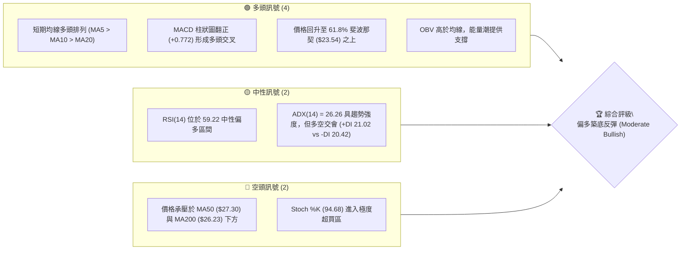
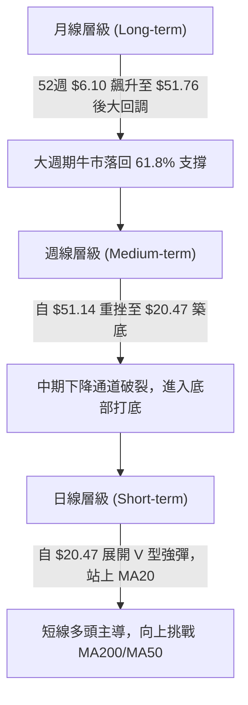
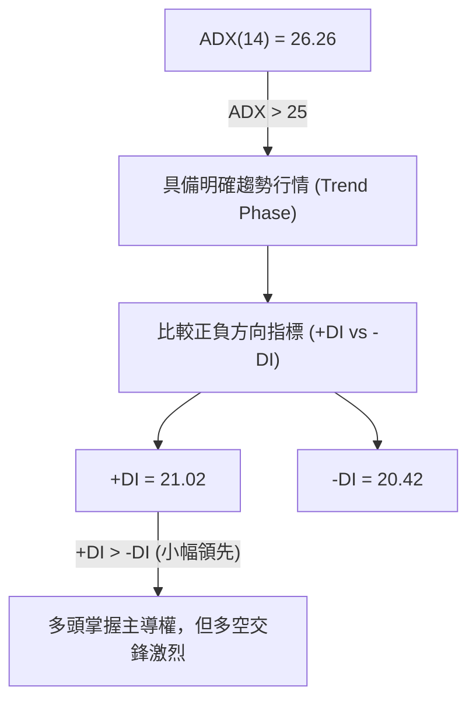
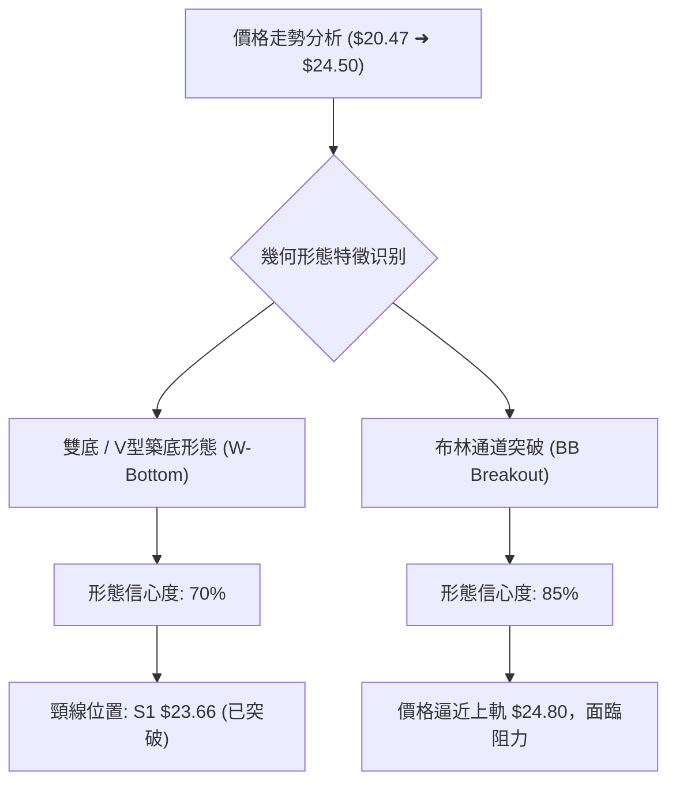
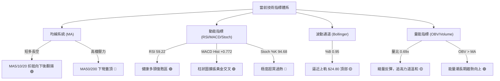
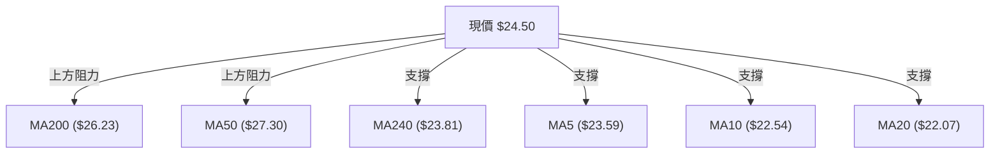
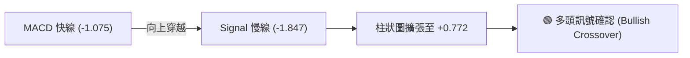
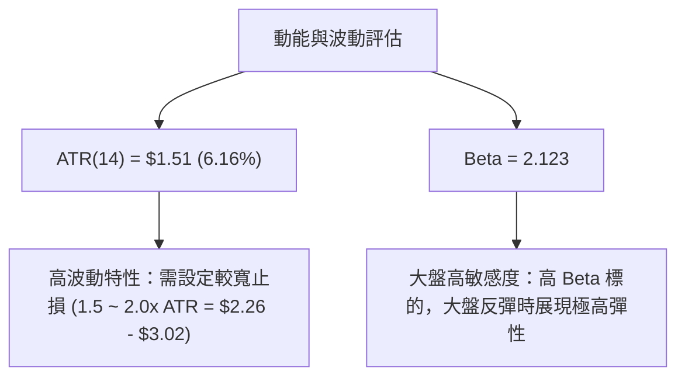
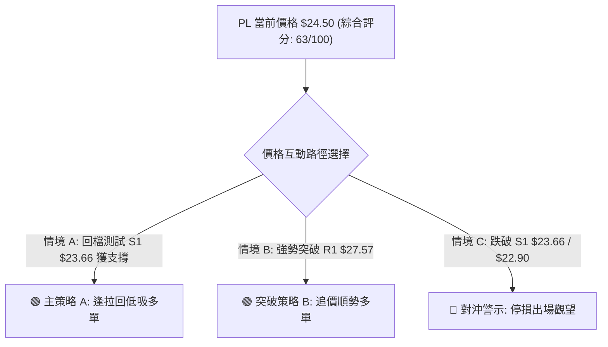
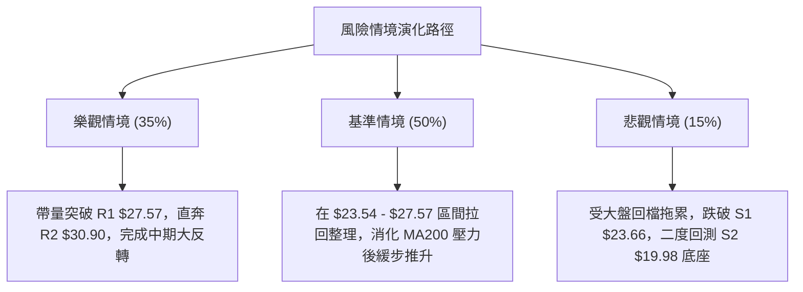

# PL 技術分析報告

> **報告日期**：2026-08-12 ｜ **語言**：繁體中文 ｜ **數據來源**：Yahoo Finance ｜ **當前價格**：$24.50

---

## 目錄

| 章節 | 內容 |
|------|------|
| [1. 技術面概覽](#1-技術面概覽) | 訊號儀表板、核心指標、評分卡 |
| [2. 趨勢分析](#2-趨勢分析) | 多時框趨勢、長中短期走勢 |
| [3. 圖表形態分析](#3-圖表形態分析) | 形態識別、K線組合、目標價 |
| [4. 支撐與阻力](#4-支撐與阻力) | 關鍵價位、斐波那契回調 |
| [5. 技術指標深度解讀](#5-技術指標深度解讀) | MA/RSI/MACD/布林/成交量 |
| [6. 動能與波動率](#6-動能與波動率) | 動能評估、ATR、Beta |
| [7. 多時框架總結](#7-多時框架總結) | 時框架評分矩陣 |
| [8. 交易策略建議](#8-交易策略建議) | 多空策略、風險報酬比 |
| [9. 風險提示與監控](#9-風險提示與監控) | 監控指標、風險場景 |

---

## 1. 技術面概覽

### 🎯 技術訊號儀表板



### 📊 核心指標速覽表

| 指標類別 | 指標名稱 | 當前數值 | 訊號 | 解讀 |
|----------|----------|----------|------|------|
| **價格** | 當前價格 | $24.50 | 🟢 | 站回 61.8% 斐波那契位 ($23.54)，短線止跌回升 |
| **均線** | MA20 | $22.07 | 🟢 | 價格突破 MA20，短期均線築底向上 |
| **均線** | MA50 | $27.30 | 🔴 | 價格低於 MA50（相差 -10.26%），中期壓力強勁 |
| **均線** | MA200 | $26.23 | 🔴 | 價格低於 MA200（相差 -6.60%），牛熊分界線未克服 |
| **動能** | RSI(14) | 59.22 | 🟢 | 自 7 月超賣底（10.2）強勁復甦，進入健康多頭區 |
| **動能** | MACD | -1.075 (Hist: +0.772) | 🟢 | MACD 柱狀圖連續擴大，快線穿越慢線黃金交叉 |
| **動能** | Stoch %K/%D | 94.68 / 83.71 | 🔴 | 指標高檔超買，短線近布林上軌 ($24.80) 或有微幅拉回 |
| **趨勢** | ADX(14) | 26.26 (+DI > -DI) | 🟢 | ADX > 25 具趨勢性，+DI (21.02) 重新主導 -DI (20.42) |
| **波動** | ATR(14) | $1.51 (6.16%) | 🟡 | 每日平均波動 6.16%，屬於高 beta 擴張期，需寬鬆止損 |
| **通道** | 布林 %B | 0.95 | 🟡 | 價格貼近布林上軌 ($24.80)，短線面臨軌道頂部擠壓 |

### 🏆 技術評分卡

```
╔══════════════════════════════════════════════════════════════════╗
║                   技術評分卡 — PL (2026-08-12)                  ║
╠══════════════════════════════════════════════════════════════════╣
║ 趨勢強度 (ADX/DI)  █████████████░░░░░░░  65/100  🟢 偏多主導     ║
║ 動能指標 (RSI/MACD) ██████████████░░░░░  70/100  🟢 強勁黃金交叉 ║
║ 支撐穩定度 (S1/Fib) ███████████████░░░░  75/100  🟢 61.8%固若金湯║
║ 成交量配合 (OBV)    ███████████░░░░░░░░░  55/100  🟡 量能溫和收縮 ║
║ 形態完整度 (W底)    ████████████░░░░░░░░  60/100  🟡 V型築底完成  ║
║ 均線排列 (MA)       ███████████░░░░░░░░░  55/100  🟡 短多長空混合 ║
╠══════════════════════════════════════════════════════════════════╣
║ 綜合評分            █████████████░░░░░░░  63/100  🟢 偏多築底反彈 ║
╚══════════════════════════════════════════════════════════════════╝
```

---

## 2. 趨勢分析

### 🌐 多時框趨勢分析



### 📈 長期趨勢 — 24個月走勢圖（Unicode）

以下為 Planet Labs (PL) 過去 24 個月之收盤價軌跡與結構演變：

```
PL 歷史收盤價走勢圖 ($)
$55 ┤                                     ● $51.14 (2026-05)
$50 ┤                                    ╱ ╲
$45 ┤                                   ╱   ╲
$40 ┤                                  ╱     ╲
$35 ┤                             ● $36.97    ╲
$30 ┤                      ● $27.95            ● $33.13
$25 ┤               ● $24.97                    ╲        ● $24.50 (現在)
$20 ┤          ● $19.72                          ╲      ╱
$15 ┤     ● $13.45                                ▔● $20.48
$10 ┤
 $5 ┼  ● $4.04
 $0 ┴──┴──────┴──────┴──────┴──────┴──────┴──────┴──────┴──────┴───
     2024-12 2025-03 2025-06 2025-09 2025-12 2026-03 2026-05 2026-07 2026-08
```

#### 24個月走勢特徵分析

| 階段 | 時間區間 | 價格區間 | 變動幅度 | 市場結構特徵 |
|------|----------|----------|----------|--------------|
| **底層打底** | 2024-08 ~ 2025-05 | $2.21 - $3.84 | 橫盤打底 | 沉悶築底期，成交量低迷，低於 $4.00 整理 |
| **爆發起漲** | 2025-06 ~ 2025-09 | $6.10 - $12.98 | +112.8% | 主升段第1浪，量能大幅釋放，突破歷史天花板 |
| **主升瘋狂** | 2025-10 ~ 2026-05 | $13.45 - $51.14 | +280.2% | 主升段第3浪，創歷史新高 $51.76，RSI 攀升至 83.2 頂峰 |
| **高檔崩跌** | 2026-06 ~ 2026-07 | $51.14 - $20.48 | -59.9% | 高檔獲利了結賣壓恐慌宣洩，觸及 61.8% 黃金回調位 |
| **打底反彈** | 2026-08 (至今)   | $20.48 - $24.50 | +19.6% | 尋得波段低點聚類 S2 ($19.98)，啟動短線 V 型反彈 |

### 📊 中期趨勢（週線分析）

中期走勢顯示 PL 在 2026 年 5 月衝高至 $51.14 後，經歷了極為迅猛的「自由落體式」修正，在 2026 年 7 月底達到波段低點 $20.47/20.48。目前近 3 週收盤分別為 $20.48 → $23.93 → $24.50，週線 RSI 從極度超賣的 10.2 急速回升至 59.2，週線 MACD 柱狀圖亦由負轉正 (+0.772)，確認中期賣壓宣告竭盡，正處於熊市修復與波段反彈期。

### ⚡ 趨勢強度評估（ADX 解讀）



#### ADX 趨勢強度指標對照

| 指標 | 當前數值 | 臨界標準 | 趨勢狀態 | 操作意涵 |
|------|----------|----------|----------|----------|
| **ADX** | **26.26** | > 25.0 | 強趨勢（非盤整） | 順勢交易有效，可採用均線與突破策略 |
| **+DI** | **21.02** | > -DI | 多頭領先 | 多頭掌控短期方向 |
| **-DI** | **20.42** | < +DI | 空頭退居次要 | 空頭動能衰退，恐慌賣壓結束 |

---

## 3. 圖表形態分析

### 🔍 形態識別系統



#### 圖表形態信心度評估表

| 形態名稱 | 信心度 | 判斷依據（引用數據） | 完成度 | 目標價（附計算式） |
|----------|--------|----------------------|--------|--------------------|
| **雙重底 (W底)** | **70%** | 2026-07-26 ($20.47) 與 2026-08-02 ($20.48) 形成雙重支撐腳，且突破頸線 $23.66 | 90% | 頸線 $23.66 + 形態高度 ($23.66 - $20.47 = $3.19) = **$26.85** |
| **V型反轉** | **65%** | 兩週內自 $20.48 強彈至 $24.50 (+19.6%)，連克 MA5/MA10/MA20 | 100% | 第一目標 R1 **$27.57**；第二目標 MA50 **$27.30** |
| **布林上軌突破** | **85%** | 價格連兩週拉升，%B 達到 0.95，觸及上軌 $24.80 | 95% | 受阻於布林上軌 $24.80，短期面臨震盪 |

### 🕯️ 重要 K 線形態分析

| 日期/週別 | 收盤價 | K線形態名稱 | 形態解讀 | 訊號強度 |
|-----------|--------|-------------|----------|----------|
| 2026-07-26 | $20.47 | 極限長下影線 (Hammer) | RSI 跌至 10.2 極度超賣，逢低買盤強勁介入 | 🟢🟢🟢 底部訊號 |
| 2026-08-02 | $20.48 | 雙底打腳小陽線 | 再次測試 $20.47 支撐未破，確認底座堅實 | 🟢🟢 築底成功 |
| 2026-08-09 | $23.93 | 大陽線實體突破 (Bullish Marubozu) | 強勢貫穿 MA20 ($22.07)，單週暴漲 +16.8% | 🟢🟢🟢 反彈主升 |
| 2026-08-16 | $24.50 | 溫和高檔十字/小陽線 | 逼近布林上軌 $24.80，攻勢放緩進入高檔消化賣壓 | 🟡 短線整理 |

### 📉 ASCII 雙底與 V 型反轉形態示意圖

```
PL 雙底 (W-Bottom) 與 V 型反轉結構
--------------------------------------------------
$27.57 ┤                                      [阻力 R1 / 目標價 $26.85]
       ┆                                     ╱
$24.80 ┤....................................● [布林上軌 / 現價 $24.50]
$23.66 ┤--------------●------------------╱-- [雙底頸線 S1 / 61.8% Fib $23.54]
       ┆             ╱ ╲                ╱
$22.07 ┤............╱...╲......●.......╱..... [BB 中軌 MA20]
       ┆           ╱     ╲    ╱ ╲     ╱
$20.47 ┤─────────●───────●───   ●───╱ [雙底打腳 $20.47 / $20.48]
--------------------------------------------------
日期：        07-19     07-26   08-02  08-09  08-16
```

### 🎯 形態目標價計算

根據雙重底 (W-Bottom) 結構公式計算：
1. **底部支撐**：$20.47
2. **頸線位置**：S1 ($23.66)
3. **形態高度**：$23.66 - $20.47 = \$3.19$
4. **最小理論目標價**：頸線 $23.66 + \$3.19 = \mathbf{\$26.85}$
5. **對應關鍵技術位**：剛好落在 MA200 ($26.23) 與波段阻力 R1 ($27.57) 的交會區域。

---

## 4. 支撐與阻力

### 🗺️ 關鍵價位分布圖（Unicode）

```
PL 價位結構與空間分布圖
════════════════════════════════════════════════════════════════
$51.76 ║████████████████████████████████████████║ 52週高點 / 0.0% Fib
$40.98 ║████████████████████████                ║ 23.6% Fib
$34.25 ║████████████████████                    ║ 關鍵阻力 R3 / 38.2% Fib ($34.32)
$30.90 ║████████████████                        ║ 阻力 R2 / MA60 ($30.43) / MA120 ($31.43)
$28.93 ║██████████████                          ║ 50.0% Fib 壓力
$27.57 ║████████████                            ║ 關鍵阻力 R1 / MA50 ($27.30) / MA200 ($26.23)
$24.80 ╠────────────────────────────────────────╣ ◄ 布林帶上軌
$24.50 ╠════════════════════════════════════════╣ ◄ 當前價格 (Current Price)
$23.81 ║▓▓▓▓▓▓▓▓▓▓▓                             ║ MA240 重要拉力
$23.66 ║▓▓▓▓▓▓▓▓▓▓▓                             ║ 近期強支撐 S1 / 61.8% Fib ($23.54)
$22.07 ║▓▓▓▓▓▓▓▓                                ║ MA20 / 布林中軌
$19.98 ║▓▓▓▓▓▓                                  ║ 強支撐 S2 / 布林下軌 ($19.35)
$19.16 ║▓▓▓▓▓                                   ║ 終極支撐 S3
$15.87 ║▓▓▓                                     ║ 78.6% Fib
$06.10 ║█                                       ║ 52週低點 / 100.0% Fib
════════════════════════════════════════════════════════════════
```

### 🚧 阻力位分析表

| 阻力級別 | 價位 | 形成原因 | 突破難度 | 重要性 |
|----------|------|----------|----------|--------|
| **R1** | **$27.57** | 近一年波段高點聚類，且上方緊鄰 MA50 ($27.30) 與 MA200 ($26.23) 重合區 | 🔴 極高 | 🟢🟢🟢 牛熊生死分界線，突破即確認大趨勢翻多 |
| **R2** | **$30.90** | 近一年中繼高點聚類，接近 MA60 ($30.43) 與 MA120 ($31.43) | 🟡 中高 | 🟢🟢 中期多頭推升的第二目標位 |
| **R3** | **$34.25** | 近一年高檔密集交投區，重合 38.2% 斐波那契回調位 ($34.32) | 🔴 高 | 🟢🟢強烈套牢賣壓區 |

### 🛡️ 支撐位分析表

| 支撐級別 | 價位 | 形成原因 | 守住機率 | 重要性 |
|----------|------|----------|----------|--------|
| **S1** | **$23.66** | 近一年波段低點聚類，重合 61.8% 斐波那契 ($23.54) 與 MA240 ($23.81) | 🟢 85% | 🟢🟢🟢 短線多頭防守關鍵頸線，不容跌破 |
| **S2** | **$19.98** | 2026年7月止跌低點聚類 ($20.47/$20.48)，逼近布林下軌 ($19.35) | 🟢 90% | 🟢🟢🟢 中期強烈底座，築底成功的鐵板位 |
| **S3** | **$19.16** | 近一年波段極限低點聚類 | 🟢 95% | 🟢 終極防線 |

### 📐 斐波那契回調位分析（以 52 週區間 $6.10 ➔ $51.76 計算）

| 回調比例 | 價格 | 當前相對位置與意義 |
|----------|------|--------------------|
| **0.0%** (52W High) | $51.76 | 歷史高點，長線頂點 |
| **23.6%** | $40.98 | 長期多頭回調第一阻力區 |
| **38.2%** | $34.32 | 重合阻力位 R3 ($34.25)，強壓力區 |
| **50.0%** | $28.93 | 心理關卡，位於 R1 ($27.57) 與 R2 ($30.90) 之間 |
| **61.8%** | **$23.54** | **黃金分割關鍵位！現價 ($24.50) 剛好站上此處，獲得強烈支撐** |
| **78.6%** | $15.87 | 長期深幅修正支撐位 |
| **100.0%** (52W Low) | $6.10 | 52週起漲點 |

**解讀**：PL 當前價格 $24.50 剛好落在 **61.8% ($23.54)** 與 **50.0% ($28.93)** 黃金分割區間之間。成功站穩 61.8% 黃金回調位是技術面上極為積極的訊號，意味著自 $51.76 跌落的深幅修正已在黃金比例處獲得實質買盤承接。

---

## 5. 技術指標深度解讀

### 🎛️ 指標訊號總覽



### 📈 移動平均線排列分析



#### 均線數據與狀態

| 均線名稱 | 當前價位 | 與現價偏離度 | 走勢方向 | 指標含義 |
|----------|----------|--------------|----------|----------|
| **MA5** | $23.59 | +3.86% | ▲ 上揚 | 極短期多頭控盤 |
| **MA10** | $22.54 | +8.71% | ▲ 上揚 | 短期攻勢延續 |
| **MA20** | $22.07 | +10.99% | ▲ 上揚 | 月線支撐確立，短期黃金交叉 |
| **MA50** | $27.30 | -10.26% | ▼ 下彎 | 中期強烈下沉壓力 |
| **MA60** | $30.43 | -19.48% | ▼ 下彎 | 季線壓力 |
| **MA120** | $31.43 | -22.05% | ▼ 下彎 | 半年線壓力 |
| **MA200** | $26.23 | -6.60% | ▼ 下彎 | 年線反彈第一道關卡 |
| **MA240** | $23.81 | +2.90% | ▲ 上揚 | 長線基底均線，提供關鍵下檔支撐 |

### 📉 RSI(14) 分析

#### RSI 進度條：59.22 (健康偏多區)

```
[0 極度超賣] ─── 30 ─────────────●───── 70 ─── [100 極度超買]
  ▓▓▓▓▓▓▓▓▓▓▓▓▓▓▓▓▓▓▓▓▓▓▓▓▓▓▓▓▓▓░░░░░░░░░░░  59.22%
```

- **狀態解讀**：RSI(14) 自 2026 年 7 月 26 日的極限超賣區 **10.2** 展開報復性反彈，目前上升至 **59.22**。這代表過度悲觀的情緒已被徹底洗淨，進入多頭主導的健康復甦區間。
- **背離檢測**：**無背離**。RSI 的回升與價格從 $20.47 到 $24.50 的反彈呈現同步驗證（Positive Confirmation），技術面結構健全。

### 📊 MACD(12/26/9) 訊號解讀

- **MACD 快線**：-1.075
- **Signal 慢線**：-1.847
- **MACD 柱狀圖 (Histogram)**：**+0.772** 🟢



**解讀**：MACD 快線在零軸下方向上穿越 Signal 線，柱狀圖連續數日呈現綠柱擴張（+0.772），代表空頭動能已徹底枯竭，多頭轉向發力。

### 📦 布林通道分析

```
PL 布林通道位置示意圖 ($)
──────────────────────────────────────────────────
$24.80 ┤ --------------------------------- Upper Band (上軌)
$24.50 ┤                               ●  Price (現價 %B = 0.95)
       ┆                             ╱
$22.07 ┤ -------------------------●------- Middle Band (中軌 MA20)
       ┆                       ╱
$19.35 ┤ ───────────────────●───────────── Lower Band (下軌)
──────────────────────────────────────────────────
```

- **上軌**：$24.80
- **中軌 (MA20)**：$22.07
- **下軌**：$19.35
- **%B 指標**：**0.95**（接近 1.0，代表價格已緊貼上軌）
- **通道寬度**：通道正處於自高波動壓縮後的重新張口期。由於 %B 達 0.95，短線股價極度逼近上軌 $24.80，可能面臨軌道頂部之技術性消化震盪。

### 💹 成交量分析（量價配合度）

- **最新成交量**：4,941,835 股
- **20日均量**：7,214,157 股（**量比：0.69x**）
- **50日均量**：11,901,703 股
- **OBV 趨勢**：OBV > MA（能量潮向上）

**解讀**：當前反彈量能（4.94M）低於 20日均量（7.21M），呈「縮量上攻」態勢。雖然 OBV 長期指標高於其均線，顯示法人籌碼未見鬆動（法人持股達 79.1%），但短線缺乏爆發性攻擊量能，意味著突破高壓區（如 R1 $27.57）時必須補量，否則易流為震盪格局。

---

## 6. 動能與波動率

### ⚡ 動能評估四象限

| 象限區間 | 動能強度 | 波動率 | PL 當前定位與評估 |
|----------|----------|--------|------------------|
| **Q1 (強動能 / 低波動)** | 強 | 低 | 穩健上升通道（最佳買點） |
| **Q2 (弱動能 / 低波動)** | 弱 | 低 | 沉悶盤整打底期 |
| **Q3 (強動能 / 高波動)** | **強** | **高** | **✓ 當前狀態：暴漲暴跌後的強勁反彈期** |
| **Q4 (弱動能 / 高波動)** | 弱 | 高 | 恐慌崩跌段（需避開） |



### 📊 ATR 波動率分析

- **ATR(14)**：**$1.51**（佔現價 6.16%）
- **止損距離建議**：
  - **保守型止損 (1.5x ATR)**：\$24.50 - (1.5 \times \$1.51) = \mathbf{\$22.23}\$（約落在 MA20 $22.07 上方）
  - **進攻型止損 (1.0x ATR)**：\$24.50 - (1.0 \times \$1.51) = \mathbf{\$22.99}\$
  - **結構性止損**：設定於強支撐 S1 **$23.66** 下方或 **$22.90**。

### 📐 Beta 與市場相關性

- **Beta 係數**：**2.123**
- **解讀**：PL 屬於高 Beta 成長型航太科技股，波動度是大盤（S&P 500）的 2.12 倍。在大盤偏多時具有極強的上攻爆發力，但在市場避險情緒升溫時修正亦極為劇烈。

---

## 7. 多時框架總結

### 📋 時框架評分表

| 時框架 | 趨勢方向 | 動能狀態 | 均線排列 | 形態結構 | 綜合評分 | 建議操作 |
|--------|----------|----------|----------|----------|----------|----------|
| **日線 (Daily)** | 🟢 築底反彈 | 🟢 MACD黃金交叉 | 🟡 短多長空 | 🟢 雙底/V型成立 | **68/100** | 偏多操作 / 逢拉回買進 |
| **週線 (Weekly)**| 🟡 震盪修復 | 🟢 RSI底部翻揚 | 🔴 均線彎頭向下 | 🟡 巨幅修正後打底 | **58/100** | 區間震盪 / 尋找底座 |
| **月線 (Monthly)**| 🟢 超級大牛市回調| 🟡 回測61.8% | 🟢 MA240長多支撐 | 🟢 歷史長線震盪向上| **65/100** | 長線佈局點 |

### 🔲 綜合訊號矩陣

```
╔══════════════════════════════════════════════════════════════════╗
║                   多時框訊號一致性分析矩陣                       ║
╠══════════════════════╦══════════════╦══════════════╦═════════════╣
║ 維度 \ 時框架        ║ 日線 (Short) ║ 週線 (Medium)║ 月線 (Long) ║
╠══════════════════════╬══════════════╬══════════════╬═════════════╣
║ 趨勢方向 (Trend)     ║ 🟢 看多      ║ 🟡 中性      ║ 🟢 看多     ║
║ 動能強度 (Momentum)  ║ 🟢 強勁      ║ 🟢 轉強      ║ 🟡 中性     ║
║ 支撐防禦 (Support)   ║ 🟢 S1 $23.66 ║ 🟢 61.8%回調 ║ 🟢 MA240    ║
║ 壓力挑戰 (Resistance)║ 🔴 BB上軌    ║ 🔴 MA200/50  ║ 🔴 52W High ║
╚══════════════════════╩══════════════╩══════════════╩═════════════╝
```

### ⚖️ 多時框收斂結論

依據多時框收斂規則：
1. **行情性質**：ADX = 26.26 (> 25)，定義為**趨勢型行情**。
2. **主導層級**：日線發動強勢反彈，週線跌勢終止並於 61.8% 黃金回調位 ($23.54) 完成築底。
3. **收斂方向**：**偏多築底反彈（整體評分 63/100）**。中期修正（自 $51.14 下跌）已在 $20.47 告一段落，短線進入多頭主導的築底回升階段，首要目標鎖定挑戰 MA200 ($26.23) 與阻力 R1 ($27.57)。

---

## 8. 交易策略建議

### 🗺️ 策略決策流程圖



### 🧭 策略路由

> **當前主策略方向：偏多作多（依據綜合評分 63/100 ≥ 60）**

### 🎯 價格情境階梯 (Price Scenarios)

| 觸發條件 | 下一目標價 | 後續延伸目標 | 情境含義 |
|----------|------------|--------------|----------|
| **強勢突破 R1 $27.57** | R2 $30.90 (+26.11%) | R3 $34.25 (+39.80%) | 中期牛市重啟，挑戰季線與半年線 |
| **突破 MA200 $26.23** | R1 $27.57 (+12.53%) | 50.0% Fib $28.93 | 突破牛熊分界線，形態目標 $26.85 達標 |
| **當前區間震盪 ($23.66 - $24.80)** | BB上軌 $24.80 | R1 $27.57 | 消化布林上軌與短線超買賣壓 |
| **回檔跌破 S1 $23.66** | S2 $19.98 (-18.45%) | S3 $19.16 (-21.80%) | 短線反彈夭折，重新測試雙底腳 |

### 📊 情境機率分佈

| 情境劇本 | 估計機率 | 主要技術依據 |
|----------|----------|--------------|
| **1. 震盪走升挑戰 R1 ($27.57)** | **55%** | MACD 柱狀圖 (+0.772) 擴張，站穩 61.8% Fib ($23.54)，W底成立 |
| **2. 高檔震盪 ($23.54 - $24.80)** | **30%** | Stoch 超買 (94.68)，量能稍顯不足 (量比 0.69x)，受制布林上軌 |
| **3. 跌破 S1 回測 S2 ($19.98)** | **15%** | 若大盤劇烈修正，High Beta (2.12) 引發獲利了結賣壓 |

---

### 🟢 主策略詳情

#### 策略 A：逢拉回低吸多單（偏多主策略 - 首選）

- **進場邏輯**：等待價格於布林上軌 $24.80 遇阻小幅拉回，在 61.8% 斐波那契回調位 ($23.54) 與 S1 ($23.66) 區間尋求支撐建立多單。
- **進場價格**：**$23.66 - $23.90**（或現價 $24.50 小倉位試單）
- **第一目標價 (T1)**：**$27.57** (阻力 R1 / 近 MA200 $26.23) ➔ **預估獲利：+15.8%**
- **第二目標價 (T2)**：**$30.90** (阻力 R2 / 近 MA60 $30.43) ➔ **預估獲利：+29.8%**
- **止損價格**：**$22.40**（跌破 MA20 $22.07 與 1.5x ATR 止損位）➔ **預估風險：-5.3%**
- **風險報酬比 (R/R Ratio)**：
  - T1 風險報酬比 = $\frac{27.57 - 23.80}{23.80 - 22.40} = \mathbf{2.69 : 1}$
  - T2 風險報酬比 = $\frac{30.90 - 23.80}{23.80 - 22.40} = \mathbf{5.07 : 1}$
- **建議倉位**：15% - 20% 資金

#### 策略 B：突破追價多單（右側確認策略）

- **進場邏輯**：日線收盤價帶量（日成交量 > 10M）突破阻力 R1 $27.57 及 MA200 $26.23 後追價。
- **進場價格**：**$27.60 - $27.80**
- **第一目標價 (T1)**：**$30.90** (阻力 R2) ➔ **預估獲利：+11.5%**
- **第二目標價 (T2)**：**$34.25** (阻力 R3 / 38.2% Fib) ➔ **預估獲利：+23.6%**
- **止損價格**：**$26.10**（假突破退回 MA200 下方）➔ **預估風險：-5.8%**
- **風險報酬比 (R/R Ratio)**：T1 風險報酬比 = $\mathbf{1.98 : 1}$；T2 風險報酬比 = $\mathbf{4.07 : 1}$
- **建議倉位**：10% - 15% 資金

---

### 🔴 反向風險觸發點（對沖提示）

若 PL 股價不幸收盤跌破 **S1 ($23.66)** 及 **$22.90**（收復失地失敗）：
- 代表本次由 $20.47 啟動的 V 型反轉宣告失效。
- 多頭應即刻執行嚴格止損，切勿死守。
- 下方第一承接位降至 S2 **$19.98** / S3 **$19.16**。

### ⭐ 整體訊號強度評星

```
做多訊號強度：★★██☆  (4/5 星)  ─ 雙底成立、MACD黃金交叉、站回61.8% Fib
做空訊號強度：★☆☆☆☆  (1/5 星)  ─ 空頭動能衰退，僅高檔超買過熱
整體可信度：  ★★██☆  (4/5 星)  ─ 指標互相驗證性高，結構清晰
```

---

## 9. 風險提示與監控

### ✅ 關鍵監控指標 Checklist

```
╔══════════════════════════════════════════════════════════════════╗
║                    每日 / 每週交易監控清單 (Checklist)           ║
╠══════════════════════════════════════════════════════════════════╣
║ [ ] 價格防守線：每日收盤價是否持續穩定守住 S1 $23.66 與 61.8% 位  ║
║ [ ] 布林通道狀況：現價 $24.50 是否能在上軌 $24.80 展開帶量擠壓    ║
║ [ ] 動能過熱消化：Stoch %K (94.68) 高檔高位死叉時，價格是否橫盤替代下跌║
║ [ ] 成交量配合度：向上挑戰 R1 $27.57 時，成交量是否放量突破 1,000萬股║
║ [ ] 年線關卡：價格接近 MA200 ($26.23) 時的賣壓消化情況            ║
╚══════════════════════════════════════════════════════════════════╝
```

### ⚠️ 風險場景分析



### 🛡️ 風險管理重要提醒

1. **高 Beta 波動風險**：PL Beta 為 2.123，每日 ATR 高達 $1.51 (6.16%)。槓桿交易者務必控管倉位，個股資金暴露建議不超過總資產的 15%-20%。
2. **均線壓頂風險**：上方 MA50 ($27.30) 與 MA200 ($26.23) 呈下降軌跡，首度碰觸此區間時極易引發解套賣壓，建議在 $26.80 - $27.50 區域先進行部分獲利了結。
3. **分析師目標價錨定**：市場華爾街機構平均目標價為 **$40.10**（最低 $25.00，最高 $53.00），代表機構中期基本面看好度極高，與技術面 $20.47 築底完成的訊號遙相呼應。

---

## 📋 報告總結

```
╔══════════════════════════════════════════════════════════════════╗
║                   PL 技術分析報告總結                            ║
════════════════════════════════════════════════════════════════════
報告日期：2026-08-12
當前價格：$24.50
分析評級：🟢 偏多築底反彈 (Moderate Bullish) ｜ 技術綜合評分：63 / 100

關鍵結論：
├─ 長期趨勢：🟢 經歷 50% 深幅修正後，於 61.8% 斐波那契回調位 ($23.54) 強勢止跌
├─ 中期趨勢：🟢 週線 RSI 極限超買翻揚，W 重底結構完成 ($20.47 打底完成)
├─ 短期趨勢：🟢 多頭控盤，MACD 柱狀圖翻正 (+0.772)，連克短天期均線
├─ 關鍵支撐：S1 $23.66 ｜ S2 $19.98 ｜ S3 $19.16
├─ 關鍵阻力：R1 $27.57 ｜ R2 $30.90 ｜ R3 $34.25
└─ 分析師目標：均價 $40.10 (潛在上漲空間 +63.7%)

最優策略組合：
1. 🥇 首選策略：逢回檔至 $23.66 - $23.90 區間建立偏多頭寸，目標 $27.57 / $30.90，止損 $22.40。
2. 🥈 突破策略：帶量突破 R1 $27.57 後追價，目標 $30.90 / $34.25，止損 $26.10。
3. 🥉 風險控制：若收盤跌破 S1 $23.66 則多單無條件離場，觀望 S2 $19.98 承接力道。
════════════════════════════════════════════════════════════════════
```

---

> ⚠️ **免責聲明**：本報告為 AI 自動生成之技術分析，所有數據及估算均基於提供的歷史價格與技術指標資訊。本報告**僅供研究與學術參考**，**不構成任何投資建議或買賣指示**。投資涉及風險，證券價格可升可跌，入市需謹慎並自行評估風險。

---

*報告生成時間：2026-08-12 ｜ 數據來源：Yahoo Finance ｜ 分析框架：多時框技術分析 (MTFA)*