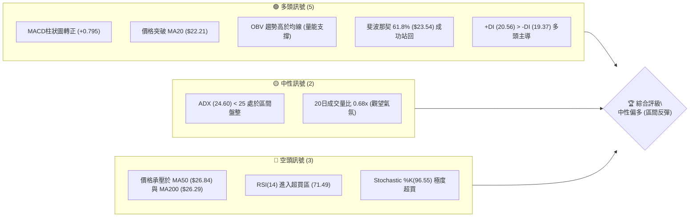
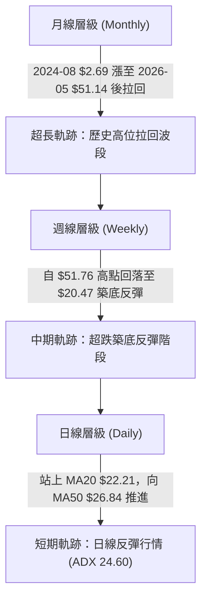
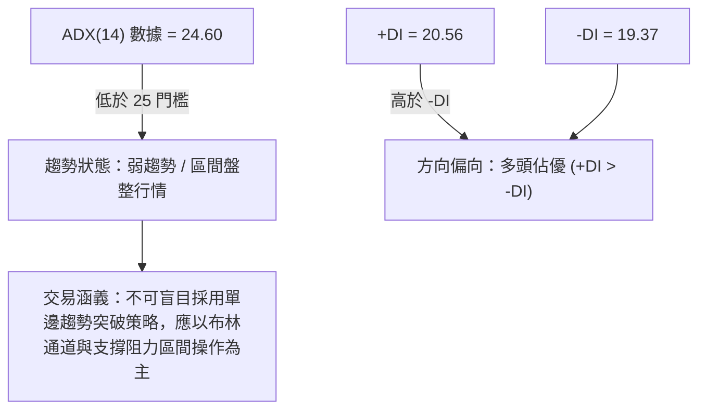
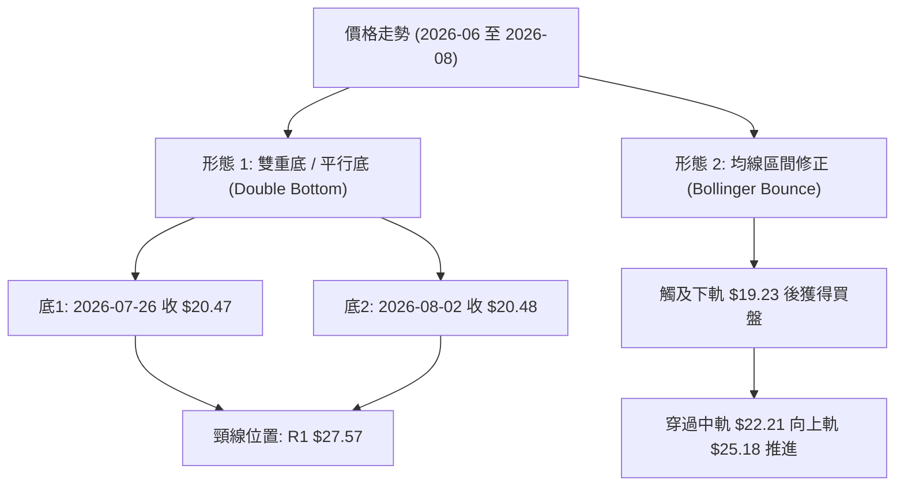
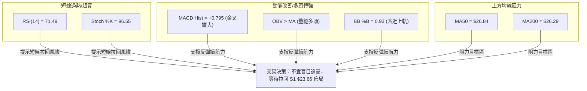
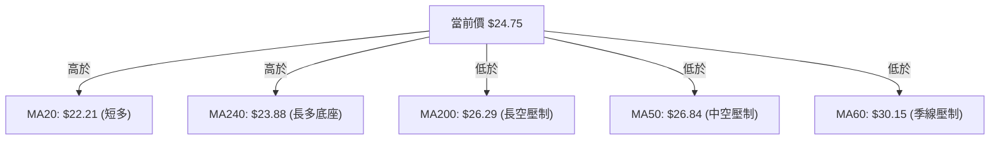
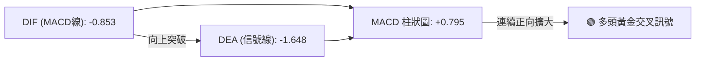
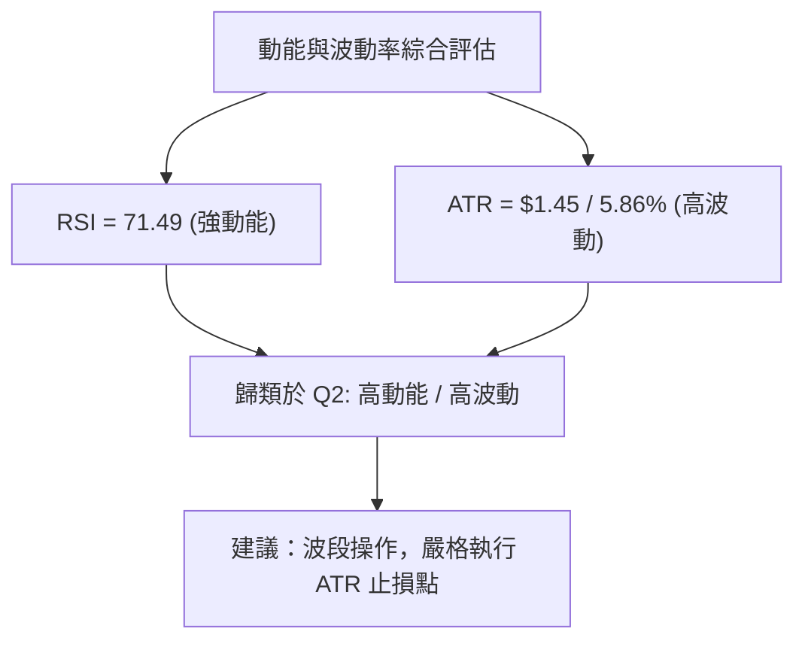
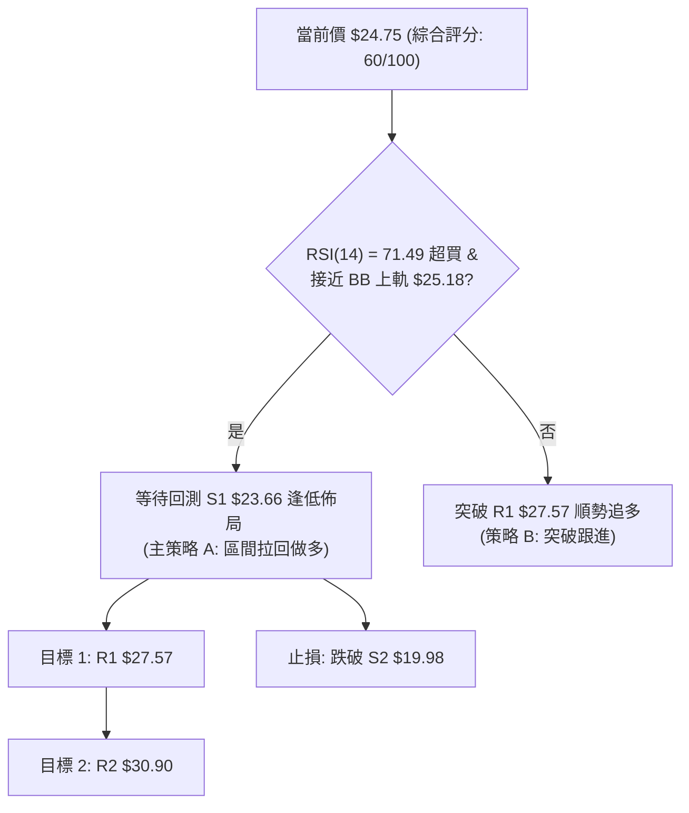
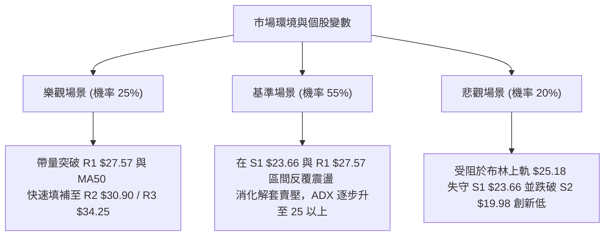

# PL 技術分析報告

> **報告日期**：2026-08-13 ｜ **語言**：繁體中文 ｜ **數據來源**：Yahoo Finance ｜ **當前價格**：$24.75

---

## 目錄

| 章節 | 內容 |
|------|------|
| [1. 技術面概覽](#1-技術面概覽) | 訊號儀表板、核心指標、評分卡 |
| [2. 趨勢分析](#2-趨勢分析) | 多時框趨勢、長中短期走勢 |
| [3. 圖表形態分析](#3-圖表形態分析) | 形態識別、K線組合、目標價 |
| [4. 支撐與阻力](#4-支撐與阻力) | 關鍵價位、斐波那契回調 |
| [5. 技術指標深度解讀](#5-技術指標深度解讀) | MA/RSI/MACD/布林/成交量 |
| [6. 動能與波動率](#6-動能與波動率) | 動能評估、ATR、Beta |
| [7. 多時框架總結](#7-多時框架總結) | 時框架評分矩陣 |
| [8. 交易策略建議](#8-交易策略建議) | 多空策略、風險報酬比 |
| [9. 風險提示與監控](#9-風險提示與監控) | 監控指標、風險場景 |

---

## 1. 技術面概覽

### 🎯 技術訊號儀表板



### 📊 核心指標速覽表

| 指標類別 | 指標名稱 | 當前數值 | 訊號 | 解讀 |
|----------|----------|----------|------|------|
| **價格** | 當前價格 | $24.75 | 🟢 多頭 | 較最近波段低點 $20.47 反彈 +20.9%，站在 MA20 上方 |
| **均線** | MA20 | $22.21 | 🟢 多頭 | 價格位於 MA20 上方 (+11.45%)，短期均線呈上升走勢 |
| **均線** | MA50 | $26.84 | 🔴 空頭 | 價格位於 MA50 下方 (-7.79%)，中期上方存在壓力 |
| **均線** | MA200 | $26.29 | 🔴 空頭 | 價格位於 MA200 下方 (-5.86%)，長期趨勢未正式轉強 |
| **動能** | RSI(14) | 71.49 | 🔴 短線超買 | 突破 70 警戒線，短線追高風險提升 |
| **動能** | MACD | -0.853 | 🟢 多頭轉強 | DIF 與 DEA 仍在零軸下方，但柱狀圖 (+0.795) 連續擴大 |
| **波動** | ATR(14) | $1.45 | 🟡 中度波動 | 佔股價 5.86%，提供精確的波段止損參考 |

### 🏆 技術評分卡

```
╔══════════════════════════════════════════════════════════════════╗
║                   技術評分卡 — PL (2026-08-13)                   ║
╠══════════════════════════════════════════════════════════════════╣
║ 趨勢強度      ██████████░░░░░░░░░░  50/100  🟡 中性 (ADX=24.6)    ║
║ 動能指標      █████████████░░░░░░░  65/100  🟢 看多 (MACD金叉)    ║
║ 支撐穩定度    ██████████████░░░░░░  70/100  🟢 良好 ($20.48底座)   ║
║ 成交量配合    ██████████░░░░░░░░░░  50/100  🟡 偏低 (0.68x 均量)   ║
║ 形態完整度    ████████████░░░░░░░░  60/100  🟢 區間築底反彈      ║
║ 均線排列      █████████░░░░░░░░░░░  45/100  🟡 混合排列          ║
╠══════════════════════════════════════════════════════════════════╣
║ 綜合評分      ████████████░░░░░░░░  60/100  🟢 偏多 (區間反彈)    ║
╚══════════════════════════════════════════════════════════════════╝
```

---

## 2. 趨勢分析

### 🌐 多時框趨勢分析



### 📈 長期趨勢 — 12個月走勢圖（Unicode）

```
PL 月線走勢圖（過去12個月：2025-08 至 2026-08）
價格軸 ($)
$51.76 ┤                                  ● 52W High ($51.76)
$45.00 ┤                                 ╱ ╲
$38.00 ┤                                ╱   ╲
$31.00 ┤                         ●     ╱     ╲
$24.75 ┤                        ╱ ╲   ╱       ╲           ● 現在 ($24.75)
$18.00 ┤               ●       ╱   ╲ ╱         ╲         ╱
$12.00 ┤       ●      ╱ ╲     ╱                 ╲       ╱
$6.10  ┤ ●    ╱ ╲    ╱   ╲   ╱                   ●─────● 波段底部 ($20.47)
       └─┴────┴──┴───┴───┴───┴───┴───┴───┴───┴───┴───┴───┴───
        08   09 10  11  12  01  02  03  04  05  06  07  08 (月份)
```

**走勢特徵分析表格**：

| 階段 | 時間區間 | 價格變動 | 階段特徵與量能表現 |
|------|----------|----------|-------------------|
| **第一階段：初段主升** | 2025-08 至 2026-01 | $7.09 → $24.97 (+252%) | 突破低位整合區，機構資金進場，換手充分 |
| **第二階段：主升衝頂** | 2026-02 至 2026-05 | $24.14 → $51.14 (+111.8%) | 創下 52 週新高 $51.76，RSI(週線)一度高達 83.2，呈現瘋狂噴出 |
| **第三階段：暴跌拉回** | 2026-06 至 2026-07 | $51.14 → $20.47 (-60.0%) | 週成交量激增至 1億 股以上，獲利盤與停損盤湧出，跌破 MA50 |
| **第四階段：築底反彈** | 2026-08 至今 | $20.47 → $24.75 (+20.9%) | 在 $20.47–$20.48 雙重扣底，日線出現連續收陽，反彈挑戰阻力 |

### 📊 中期趨勢（週線分析）

```
週線支撐與阻力結構示意圖：
$51.76 ═════════════════════════════════════════════ 52W 歷史高點 (0.0% 斐波那契)
$40.98 --------------------------------------------- 23.6% 斐波那契回調位
$34.32 / $34.25 ════════════════════════════════════ 38.2% 斐波那契 / 關鍵阻力 R3
$30.90 --------------------------------------------- 關鍵阻力 R2
$28.93 / $27.57 ════════════════════════════════════ 50.0% 斐波那契 / 關鍵阻力 R1
$24.75 ◄──────────────────────────────────────────── [當前收盤價]
$23.54 ───────────────────────────────────────────── 61.8% 斐波那契黃金分割
$23.66 ═════════════════════════════════════════════ 關鍵支撐 S1
$19.98 / $19.16 ════════════════════════════════════ 關鍵支撐 S2 / S3
```

### ⚡ 趨勢強度評估（ADX 解讀）



**ADX 趨勢強度對照表**：

| ADX 數值 | 趨勢強度狀態 | PL 當前狀況 (24.60) | 建議操作策略 |
|----------|--------------|---------------------|--------------|
| 0 – 20 | 無趨勢 / 橫盤震盪 | - | 高拋低吸，網格交易 |
| **20 – 25** | **弱趨勢 / 盤整邊緣** | **✓ (24.60)** | **區間反彈，留意布林上下軌** |
| 25 – 50 | 強趨勢發動 | - | 順勢單邊操作，突破追價 |
| 50 – 100 | 極強趨勢 / 末升段 | - | 緊貼均線移動止損 |

---

## 3. 圖表形態分析

### 🔍 形態識別系統



**形態信心度評估表**：

| 形態 | 信心度 | 判斷依據（引用數據） | 完成度 | 目標價（附計算式） |
|------|--------|----------------------|--------|--------------------|
| **雙重底 (Double Bottom)** | 68% | 2026-07-26 收盤 $20.47 與 2026-08-02 收盤 $20.48 形成雙底打腳，且 MACD 柱狀圖轉正 (+0.795) | 65% (未突破頸線) | 頸線 $27.57 + (頸線 $27.57 - 低點 $20.47) = $34.67 (接近阻力 R3 $34.25) |
| **布林下軌反彈 (BB Bounce)** | 85% | 2026-07底 股價靠近布林下軌 $19.23，帶動 RSI 自 10.2 超賣反彈至 71.49，觸及上軌 $25.18 | 90% (接近完成) | 布林上軌 $25.18（已精確達成） |

*註：由於 ADX 為 24.60 (<25)，未進入強趨勢階段，形態突破需要成交量進一步放大確認。*

### 🕯️ 重要K線形態分析

| 日期/週別 | 收盤價 | K線形態 | 解讀 | 訊號 |
|-----------|--------|---------|------|------|
| 2026-07-26 | $20.47 | 極度超賣長陰線 | RSI 降至 10.2，探尋波段極致低點 | 🔴 恐慌拋售 |
| 2026-08-02 | $20.48 | 底層十字星/鎚子線 | 賣壓耗盡，買盤於 $20.48 重新架築支撐 | 🟢 轉向訊號 |
| 2026-08-09 | $23.93 | 中陽線突破 | 一舉收復 MA20 ($22.21)，MACD 柱轉正 (+0.682) | 🟢 多頭確認 |
| 2026-08-16 | $24.75 | 續漲短陽線 | 站穩 61.8% 斐波那契位 ($23.54)，直逼布林上軌 | 🟢 短線強勢 |

### 📉 ASCII 走勢形態示意圖

```
PL 雙重底 (Double Bottom) 與區間反彈形態示意圖
-----------------------------------------------------------------
$27.57 ────────────────────────────────── 頸線 / 阻力 R1 (W底頸線)
                                 ▲
                                ╱ ╲
                               ╱   ╲
$24.75 ───────────────────────●─────●─── 當前價格 ($24.75)
                             ╱
$22.21 ─────────────────────●─────────── MA20 中軌支撐
                           ╱
$20.47 / $20.48 ──────────●─────────●─── 雙底支撐 (底1: $20.47 / 底2: $20.48)
                          2026-07-26  2026-08-02
-----------------------------------------------------------------
```

### 🎯 形態目標價計算

1. **雙底形態測量目標價**：
   - 形態底部低點：$20.47（2026-07-26）
   - 形態頸線高點：阻力位 R1 = $27.57
   - 形態垂直高度：$27.57 - $20.47 = $7.10
   - **預測目標價** = 頸線 $27.57 + 高度 $7.10 = **$34.67**（與數據庫中 R3 阻力位 $34.25 及 38.2% 斐波那契 $34.32 高度重合）。

---

## 4. 支撐與阻力

### 🗺️ 關鍵價位分布圖（Unicode）

```
PL 價位結構分布圖
════════════════════════════════════════════════════════════════
$51.76 ║████████████████████████████████████████║ 52W 最高價 (0.0%)
$40.98 ║████████████████████████                ║ 斐波那契 23.6%
$34.25 ║██████████████████                      ║ 強阻力 R3 / 斐波那契 38.2% ($34.32)
$30.90 ║██████████████                          ║ 阻力 R2 / MA60 ($30.15)
$28.93 ║████████████                            ║ 斐波那契 50.0%
$27.57 ║██████████                              ║ 關鍵阻力 R1 / MA50 ($26.84)
$25.18 ║████████                                ║ 布林上軌 BB Upper
$24.75 ╠════════════════════════════════════════╣ ◄ 當前價格 ($24.75)
$23.66 ║▓▓▓▓▓▓▓▓                                ║ 關鍵支撐 S1 / 斐波那契 61.8% ($23.54)
$22.21 ║▓▓▓▓▓▓▓▓▓▓                              ║ MA20 均線支撐 / 布林中軌
$19.98 ║▓▓▓▓▓▓▓▓▓▓▓▓▓▓                          ║ 強支撐 S2 / 布林下軌 ($19.23)
$19.16 ║▓▓▓▓▓▓▓▓▓▓▓▓▓▓▓▓                        ║ 強支撐 S3
$15.87 ║▓▓▓▓▓▓▓▓▓▓▓▓▓▓▓▓▓▓▓▓                    ║ 斐波那契 78.6%
$6.10  ║▓▓▓▓▓▓▓▓▓▓▓▓▓▓▓▓▓▓▓▓▓▓▓▓▓▓▓▓▓▓▓▓        ║ 52W 最低價 (100.0%)
════════════════════════════════════════════════════════════════
```

### 🚧 阻力位分析表

| 阻力級別 | 價位 | 形成原因 | 突破難度 | 重要性 |
|----------|------|----------|----------|--------|
| **阻力 R1** | **$27.57** | 近一年波段高點聚類；接近 MA50 ($26.84) 與 MA200 ($26.29) 解套賣壓區 | 🔴 困難 | ★★★★☆ |
| **阻力 R2** | **$30.90** | 近一年中段密集套牢區；與 MA60 ($30.15) 共振 | 🔴 極難 | ★★★☆☆ |
| **阻力 R3** | **$34.25** | 近一年波段頂點聚類；與 38.2% 斐波那契 ($34.32) 高度重合 | 🔴 極難 | ★★★★★ |

### 🛡️ 支撐位分析表

| 支撐級別 | 價位 | 形成原因 | 守住機率 | 重要性 |
|----------|------|----------|----------|--------|
| **支撐 S1** | **$23.66** | 近一年波段低點聚類；上方相鄰 61.8% 斐波那契 ($23.54) 與 MA5 ($24.00) | 🟢 高 (75%) | ★★★★☆ |
| **支撐 S2** | **$19.98** | 近一年多次打腳低點；鄰近 2026-07/08 低點 ($20.47/$20.48) 與布林下軌 ($19.23) | 🟢 極高 (85%) | ★★★★★ |
| **支撐 S3** | **$19.16** | 近一年波段極致低點聚類；築底保護最後防線 | 🟢 極高 (90%) | ★★★☆☆ |

### 📐 斐波那契回調位分析

依據 52 週高點 $51.76 與低點 $6.10 計算之黃金分割回調位：

- **0.0% (52W High)**: $51.76
- **23.6%**: $40.98
- **38.2%**: $34.32
- **50.0%**: $28.93
- **61.8% (黃金分割位)**: $23.54
- **78.6%**: $15.87
- **100.0% (52W Low)**: $6.10

**現價位置與解讀**：
當前價格 **$24.75** 精確落於 **61.8% ($23.54)** 與 **50.0% ($28.93)** 之間。
股價於 2026 年 7 月末回落至 61.8% 關鍵黃金分割位 $23.54 下方（最低探至 $20.47），但隨即強勢拉回並重返 $23.54 上方。這表明 **61.8% ($23.54)** 已由先前的跌破轉化為有效支撐，多頭正向 50.0% 關鍵分水嶺 **$28.93**（以及 R1 $27.57）展開推升。

---

## 5. 技術指標深度解讀

### 🎛️ 指標訊號總覽



### 📈 移動平均線排列分析



**均線排列狀態**：
均線呈 **混合排列**（Short-term Bullish, Medium-term Bearish）。
- 短期均線（MA5 $24.00 / MA10 $22.99 / MA20 $22.21）呈多頭向上發散，顯示短線買盤強勁。
- 長期均線（MA240 $23.88）在下方提供基底支撐。
- 中長期均線（MA50 $26.84 / MA200 $26.29 / MA60 $30.15）位於上方，形成強大的「死亡交叉」壓力帶（MA50 < MA200），價格首次解套反彈至 $26.29–$26.84 區間將面臨沉重拋壓。

### 📉 RSI(14) 分析

**RSI 強度進度條**：
```
RSI(14): [███████████████████████████████████████████████████████████████████████░░░░░░░░░░░░░░░] 71.49 / 100
```

- **超買超賣區間判斷**：RSI 達 **71.49**，進入 >70 之超買區域。
- **背離判斷**：檢視 2026-07-26 至 2026-08-16 走勢，股價自 $20.47 上升至 $24.75，RSI 自 10.2 飆升至 71.49，**無明顯頂背離或底背離**，屬於典型的跌深強勢V型反彈。然而，超買指標提示短線上衝動能可能在布林上軌 $25.18 附近暫告段落。

### 📊 MACD(12/26/9) 訊號解讀



- **MACD 線**：-0.853
- **Signal 線**：-1.648
- **柱狀圖 (Histogram)**：+0.795
- **解讀**：DIF 與 DEA 雖位處零軸下方（代表中線仍屬於空頭反彈格局），但 MACD 柱狀圖已持續擴大至 +0.795，且由負轉正，發出明確的**低位黃金交叉看多訊號**，動能正快速修復。

### 📦 布林通道分析

```
PL 日線布林通道示意圖
===================================================================
$25.18 ────────────────────────────────── Upper Band (上軌) ◄ 現價極度接近
$24.75 ────────────────────────────────── [當前價格 $24.75] (%B = 0.93)
$22.21 ────────────────────────────────── Middle Band (中軌 / MA20)
$19.23 ────────────────────────────────── Lower Band (下軌)
===================================================================
```

- **BB %B 指標**：**0.93**（極度接近上軌 1.0）。
- **帶寬與狀態**：布林帶寬呈現中度收縮後向上開口，當前股價已逼近上軌 $25.18。在 ADX = 24.60 (<25) 的盤整/弱趨勢環境下，股價觸及布林上軌往往容易受阻，出現向中軌 $22.21 回檔扣底的現象。

### 💹 成交量分析（量價配合度）

- **最新成交量**：4,406,274 股
- **20日均量**：6,491,039 股（量比 **0.68x**）
- **50日均量**：11,762,413 股
- **OBV 趨勢**：OBV > MA（能量潮高於其移動平均線）
- **量價配合解讀**：當前反彈成交量為 20日均量的 0.68 倍，顯示縮量反彈特徵。雖然 OBV 指標總體呈現向上且高於均線，說明主力資金無大規模流出，但「無量上漲」意味著突破前方關鍵阻力 R1 $27.57 缺乏足夠換手，短線易出現帶量回測。

---

## 6. 動能與波動率

### ⚡ 動能評估四象限

| 象限 | 動能強度 | 波動率 | 當前狀態 | 評估與策略 |
|------|----------|--------|----------|------------|
| Q1 (高動能/低波動) | 強 | 低 | - | 最佳趨勢加碼區 |
| **Q2 (高動能/高波動)** | **強** | **高** | **✓ (當前位置)** | **RSI>70, MACD金叉, ATR=5.86%。高波動下動能強勁，宜短線逢高獲利或等拉回** |
| Q3 (低動能/低波動) | 弱 | 低 | - | 沉悶盤整，觀望 |
| Q4 (低動能/高波動) | 弱 | 高 | - | 恐慌殺跌區 |



### 📊 ATR 波動率分析

- **ATR(14)**：**$1.45**
- **ATR 佔股價比**：**5.86%**
- **止損距離建議**：
  - **短線交易 (1.5x ATR)**：止損距 = $1.45 × 1.5 = $2.18
  - **波段交易 (2.0x ATR)**：止損距 = $1.45 × 2.0 = $2.90
- **實務應用**：若在現價 $24.75 進場，波段多單止損應設於 $24.75 - $2.18 = $22.57，或參考關鍵支撐 S1 **$23.66**。

### 📐 Beta 與市場相關性

- **Beta 係數**：**2.123**（高 Beta 成長型/太空科技股）
- **特徵**：PL 波動度為美股大盤（S&P 500）的 2.12 倍。在美股大盤反彈時，PL 將呈現放大倍數的上漲，但在大盤回檔時亦承擔雙倍下行風險。交易者須依此調降倉位權重。

---

## 7. 多時框架總結

### 📋 時框架評分表

| 時框架 | 趨勢方向 | 動能 | 均線排列 | 形態 | 綜合評分 | 建議 |
|--------|----------|------|----------|------|----------|------|
| **月線 (Long Term)** | 🟡 中性 | 🟡 中性 | 🟢 偏多 (高於240月) | 區間震盪 | 55/100 | 長期高位震盪，尋求底座 |
| **週線 (Medium Term)** | 🔴 偏空 | 🟢 轉強 | 🔴 空頭 (MA50壓制) | 超跌反彈 | 48/100 | 承壓於 $26.84–$30.90 壓力區 |
| **日線 (Short Term)** | 🟢 看多 | 🔴 超買 | 🟢 短多 (站上MA20) | 雙底反彈 | 68/100 | 短線逼近布林上軌，逢高避險 |

### 🔲 綜合訊號矩陣

| 維度 | 短期 (日線) | 中期 (週線) | 長期 (月線) | 一致性評估 |
|------|-------------|-------------|-------------|------------|
| **方向** | 🟢 向上反彈 | 🔴 下行修正中 | 🟡 橫盤震盪 | ⚠️ 多空分歧 |
| **動能** | 🟢 MACD金叉 | 🟡 柱狀圖修復 | 🟡 中性 | 🟡 逐漸改善 |
| **成交量** | 🔴 縮量 (0.68x) | 🟡 均量交投 | 🟢 歷史換手充分 | 🟡 買盤謹慎 |

### ⚖️ 多時框收斂結論

根據**多時框收斂規則（規則 14）**：
1. **行情性質**：ADX(14) 為 **24.60 (<25)**，定性為 **區間盤整行情**。
2. **主導規則**：盤整行情下，以日線布林通道上下軌（$19.23 – $25.18）與關鍵支撐阻力為主要交易區間。
3. **優先級取捨**：週線與 MA50 ($26.84) / MA200 ($26.29) 仍呈現中期偏空壓制，日線雖短線強勢（RSI 71.49 超買），但受限於布林上軌 $25.18 與無量反彈，**無法直接發動單邊突破**。
4. **唯一方向結論**：**中性偏多（區間反彈，接近波段頂部，等待回測支撐）**。

---

## 8. 交易策略建議

### 🗺️ 策略決策流程圖



### 🧭 策略路由

**當前主策略方向 = 🟢 多頭區間拉回逢低佈局（依技術評分 60/100）**

由於 ADX < 25 且短線 RSI 達 71.49 超買，現價 $24.75 距離布林上軌 $25.18 極近，直接追高風險報酬比較差。最適策略為「等待股價拉回至關鍵支撐 S1 $23.66 附近建立多單」。

### 🎯 價格情境階梯（Price Scenarios）

| 觸發條件 | 下一目標 | 後續延伸 | 情境含義 |
|----------|----------|----------|----------|
| **突破 R1 $27.57** | R2 $30.90 | R3 $34.25 | 中期轉強，攻克 MA50/MA200 壓力區 |
| **站穩 S1 $23.66** | 布林上軌 $25.18 | R1 $27.57 | 健康的區間震盪墊高格局 |
| **跌破 S1 $23.66** | S2 $19.98 | S3 $19.16 | 反彈結束，再次向下探查底座 |

### 📊 情境機率分佈

| 情境 | 機率 | 主要依據 |
|------|------|----------|
| **拉回站穩後繼續上行** | **55%** | MACD 柱狀圖 (+0.795) 續強，OBV 高於均線，雙底構造形成 |
| **區間震盪 ($22.21–$25.18)** | **30%** | ADX = 24.60 (<25) 顯示趨勢疲弱，量能 0.68x 不足 |
| **跌破 $20.47 再次探底** | **15%** | 上方 MA50 ($26.84) 與 MA200 ($26.29) 形成強烈空頭反壓 |

### 🟢 主策略詳情

| 策略要素 | 策略 A（主推：低吸區間波段） | 策略 B（次選：強勢突破跟進） |
|----------|------------------------------|------------------------------|
| **策略類型** | 支撐位拉回買進 (Pullback Buy) | 阻力位突破追價 (Breakout Buy) |
| **進場觸發條件** | 股價拉回至 S1 $23.66 附近且止跌 | 帶量突破 R1 $27.57 且日線收上 |
| **進場價格** | **$23.66** | **$27.60** |
| **目標價 T1** | **$27.57** (阻力 R1) | **$30.90** (阻力 R2) |
| **目標價 T2** | **$30.90** (阻力 R2) | **$34.25** (阻力 R3) |
| **止損價格** | **$19.98** (支撐 S2，跌破雙底失敗) | **$26.29** (跌回 MA200 下方) |
| **風險報酬比** | **(27.57 - 23.66) / (23.66 - 19.98) = 1.06:1 (T1)**<br/>**(30.90 - 23.66) / (23.66 - 19.98) = 1.97:1 (T2)** | **(30.90 - 27.60) / (27.60 - 26.29) = 2.52:1 (T1)** |
| **預估成功機率** | **65%** | **45%**（受限於 ADX 指標） |
| **建議倉位** | **10% - 15% 資金** | **5% - 8% 輕倉** |

### 🔴 反向風險觸發點（對沖提示）

- **做空/對沖觸發價位**：若股價向上推進至 **R1 $27.57** 附近，出現長上影線且成交量無法放大，或 RSI 突破 80 出現頂背離，可考慮多單平倉避險或建立對沖空單。
- **對沖止損價**：$28.93 (50.0% 斐波那契)。
- **對沖目標價**：$23.66 (S1)。

### ⭐ 整體訊號強度評星

```
做多訊號強度：★★★☆☆  (3/5星)  — 動能修復，但受限於上方重重均線阻力
做空訊號強度：★★☆☆☆  (2/5星)  — MACD柱狀擴大，短線做空勝率降低
整體可信度：  ★★★☆☆  (3/5星)  — ADX<25 盤整特徵，遵循區間上下軌操作
```

---

## 9. 風險提示與監控

### ✅ 關鍵監控指標 Checklist

```
╔══════════════════════════════════════════════════════════════════╗
║                   每日交易前監控清單 (Checklist)                 ║
╠══════════════════════════════════════════════════════════════════╣
║ [ ] 1. 價格是否拉回至 S1 $23.66 支撐區？                        ║
║ [ ] 2. 日線成交量是否升至 20日均量 (6.49M) 以上？               ║
║ [ ] 3. RSI(14) 是否自 71.49 回落至 50–60 健康區域？             ║
║ [ ] 4. MACD 柱狀圖是否持續保持在正數 (+0.795 以上)？            ║
║ [ ] 5. 價格是否挑戰 MA50 ($26.84) 與 MA200 ($26.29) 關鍵均線區？ ║
╚══════════════════════════════════════════════════════════════════╝
```

### ⚠️ 風險場景分析



### 🛡️ 風險管理重要提醒

1. **高 Beta 波動風險**：PL Beta 達 2.123，單日波動幅度較大，ATR 為 $1.45 (5.86%)。單筆交易止損額度不得超過總資產的 2%。
2. **無量反彈警訊**：當前成交量比僅 0.68x，無量推升至布林上軌 $25.18 容易誘多，切忌在 $24.75 附近追高。
3. **均線壓制效應**：MA50 ($26.84) 與 MA200 ($26.29) 形成中期「死亡交叉」蓋頂，初次測試該區域將帶來強烈拋壓，多單到達 R1 $27.57 應分批停利。

---

## 📋 報告總結

```
╔══════════════════════════════════════════════════════════════════╗
║                     PL 技術分析報告總結                          ║
════════════════════════════════════════════════════════════════════
報告日期：2026-08-13
當前價格：$24.75
分析評級：🟢 中性偏多（區間反彈，接近上軌阻力）

關鍵結論：
├─ 長期趨勢：🟡 中性橫盤 (自 $51.76 高位大幅修正後築底)
├─ 中期趨勢：🔴 偏空壓制 (承壓於 MA50 $26.84 與 MA200 $26.29)
├─ 短期趨勢：🟢 強勢反彈 (站上 MA20 $22.21，MACD 柱狀圖 +0.795)
├─ 關鍵支撐：S1 $23.66 ｜ S2 $19.98
├─ 關鍵阻力：R1 $27.57 ｜ R2 $30.90
└─ 分析師目標價：Mean $40.10 (Low $25.00 / High $53.00)

最優策略組合：
1. 🥇 最佳機會：等待股價拉回至 S1 $23.66 附近分批建倉做多，目標 R1 $27.57，止損 $19.98。
2. 🥈 次選機會：若帶量突破 R1 $27.57，順勢追多至 R2 $30.90，止損設於 $26.29。
3. 🥉 保守選擇：現價 $24.75 接近布林上軌 $25.18，觀望等待量能放大或回測確認。
════════════════════════════════════════════════════════════════════
```

---

> ⚠️ **免責聲明**：本報告為 AI 自動生成之技術分析，所有數據及估算均基於提供的歷史價格資訊。本報告**僅供研究與學術參考**，**不構成任何投資建議**。投資有風險，入市需謹慎。

---

*報告生成時間：2026-08-13 ｜ 數據來源：Yahoo Finance ｜ 分析框架：多時框技術分析*