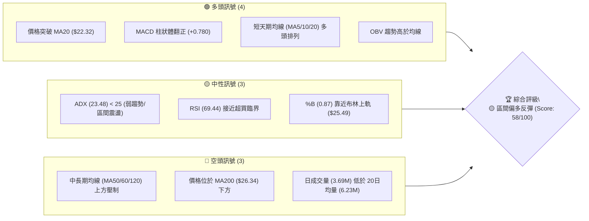
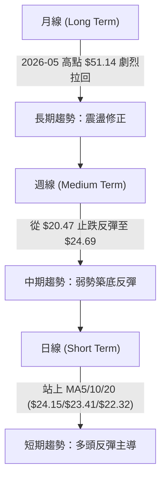
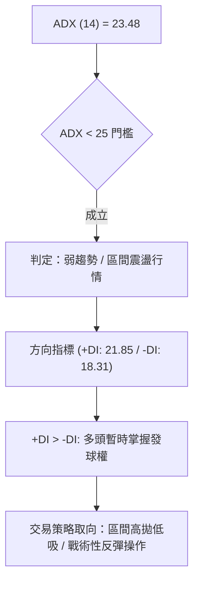
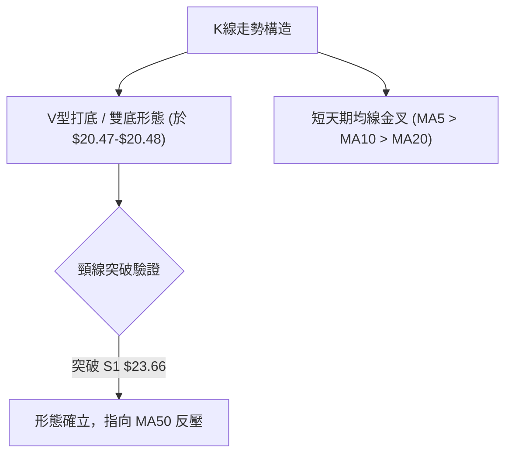
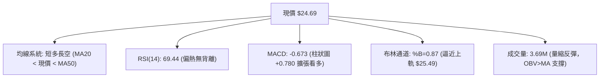
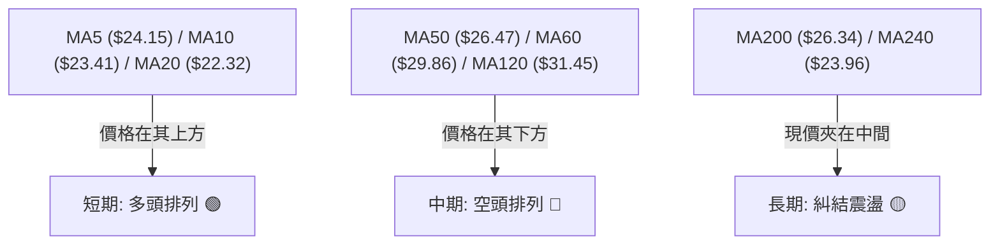
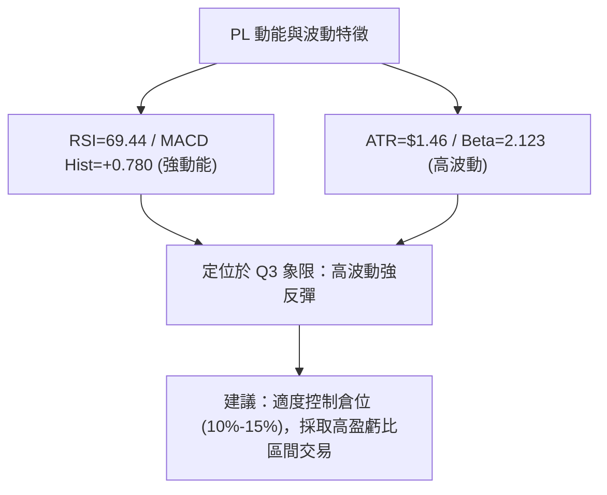
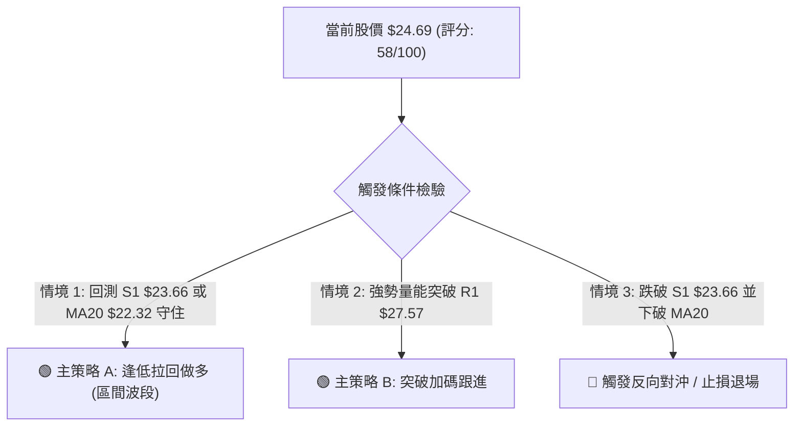
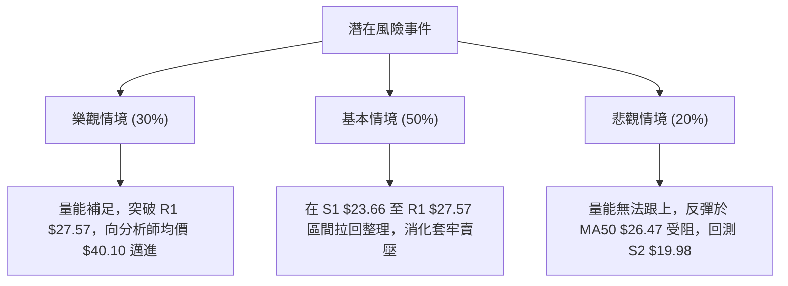

# PL 技術分析報告

> **報告日期**：2026-08-14 ｜ **語言**：繁體中文 ｜ **數據來源**：Yahoo Finance ｜ **當前價格**：$24.69

---

## 目錄

| 章節 | 內容 |
|------|------|
| [1. 技術面概覽](#1-技術面概覽) | 訊號儀表板、核心指標、評分卡 |
| [2. 趨勢分析](#2-趨勢分析) | 多時框趨勢、長中短期走勢 |
| [3. 圖表形態分析](#3-圖表形態分析) | 形態識別、K線組合、目標價 |
| [4. 支撐與阻力](#4-支撐與阻力) | 關鍵價位、斐波那契回調 |
| [5. 技術指標深度解讀](#5-技術指標深度解讀) | MA/RSI/MACD/布林/成交量 |
| [6. 動能與波動率](#6-動能與波動率) | 動能評估、ATR、Beta |
| [7. 多時框架總結](#7-多時框架總結) | 時框架評分矩陣 |
| [8. 交易策略建議](#8-交易策略建議) | 多空策略、風險報酬比 |
| [9. 風險提示與監控](#9-風險提示與監控) | 監控指標、風險場景 |

---

## 1. 技術面概覽

### 🎯 技術訊號儀表板



### 📊 核心指標速覽表

| 指標類別 | 指標名稱 | 當前數值 | 訊號 | 解讀 |
|----------|----------|----------|------|------|
| **價格** | 當前價格 | $24.69 | 🟢 多頭反彈 | 自 52W 低點附近 ($20.47) 強勢反彈，站上 MA20 |
| **均線** | MA20 | $22.32 | 🟢 看多 | 價格在 MA20 上方 (+10.63%)，短線支撐確立 |
| **均線** | MA50 | $26.47 | 🔴 看空 | 價格在 MA50 下方 (-6.72%)，形成中期首要反壓 |
| **均線** | MA200 | $26.34 | 🔴 看空 | 價格在 MA200 下方 (-6.26%)，長線牛熊分界線壓制 |
| **動能** | RSI(14) | 69.44 | 🟡 中性偏熱 | 逼近 70 超買區，短線多頭動能強但需防回檔 |
| **動能** | MACD | -0.673 (Hist: +0.780) | 🟢 看多 | 零軸下黃金交叉，柱狀體擴大展現反彈力道 |
| **動能** | Stochastic | %K: 86.81 / %D: 92.62 | 🔴 超買 | 極短線進入超買區，隨時可能出現指標修復 |
| **趨勢** | ADX(14) | 23.48 (+DI: 21.85 / -DI: 18.31) | 🟡 盤整/弱趨勢 | ADX < 25 表明非強烈單邊趨勢，屬區間反彈 |
| **通道** | 布林通道 | 上軌 $25.49 / 中軌 $22.32 | 🟡 接近上軌 | %B = 0.87，受制於上軌 $25.49 壓力 |
| **波動** | ATR(14) | $1.46 (5.89%) | 🟡 中高波動 | 日均波幅 $1.46，提供波段交易足夠空間 |

### 🏆 技術評分卡

```
╔══════════════════════════════════════════════════════════════╗
║                技術評分卡 — PL (2026-08-14)                  ║
╠══════════════════════════════════════════════════════════════╣
║ 趨勢強度      █████████░░░░░░░░░░░  45/100  🟡 中性 (ADX=23.48)║
║ 動能指標      ███████████████░░░░░  75/100  🟢 強勁 (MACD翻正) ║
║ 支撐穩定度    █████████████░░░░░░░  65/100  🟢 穩定 (S1=$23.66)║
║ 成交量配合    ████████░░░░░░░░░░░░  40/100  🔴 量縮 (量比0.59x)║
║ 形態完整度    ████████████░░░░░░░░  60/100  🟡 V型反彈格局     ║
║ 均線排列      ██████████░░░░░░░░░░  50/100  🟡 短多長空混合    ║
╠══════════════════════════════════════════════════════════════╣
║ 綜合評分      ███████████6░░░░░░░░  58/100  🟡 區間偏多反彈    ║
╚══════════════════════════════════════════════════════════════╝
```

---

## 2. 趨勢分析

### 🌐 多時框趨勢分析



### 📈 長期趨勢 — 12個月走勢圖（Unicode）

```
PL 月線走勢圖（2025-09 至 2026-08）
價格軸 ($)
$52 ┤                                   ● (2026-05 $51.14, 52W High $51.76)
$44 ┤                                 ●
$36 ┤                             ●       ● (2026-06 $33.13)
$28 ┤                         ●             
$20 ┤                 ●   ●                   ● (2026-07 $20.48) ───● 現價 $24.69
$12 ┤ ●   ●   ●   ●                             
$04 └─┬───┬───┬───┬───┬───┬───┬───┬───┬───┬───┬───
     09  10  11  12  01  02  03  04  05  06  07  08 (月份)
```

#### 走勢特徵分析表格

| 階段 | 時間區間 | 價格變動 | 漲跌幅 | 主要驅動因素與技術特徵 |
|------|----------|----------|--------|------------------------|
| **主升段** | 2025-09 至 2026-05 | $12.98 → $51.14 | **+293.99%** | 衛星數據需求爆發，伴隨天量換手，創下 52 週高點 $51.76 |
| **劇烈拉回** | 2026-05 至 2026-07 | $51.14 → $20.48 | **-59.95%** | 獲利賣壓湧現，連續三個月重挫，觸及 61.8% 斐波那契回調位 ($23.54) 下方 |
| **打底反彈** | 2026-07 至 2026-08 | $20.48 → $24.69 | **+20.56%** | 在 $20.47 形成短期雙底打底成功，突破 MA20 ($22.32) 展開反彈 |

### 📊 中期趨勢（週線分析）

中期走勢顯示，PL 從 2026-05 高點 $51.14 下滑至 2026-07-26 低點 $20.47 後，週線 RSI 曾一度打入極端超賣區 (10.2)，引發強烈的技術性撕裂反彈。

```
週線壓力與支撐結構示意圖
─────────────────────────────────────────────────────────────
$34.25  ════════════════════════════════════  阻力 R3 / 38.2% Fibo
$30.90  ────────────────────────────────────  阻力 R2 / MA60 ($29.86)
$27.57  ────────────────────────────────────  阻力 R1 / MA50 ($26.47) & MA200 ($26.34)
$24.69  ───────────── ▲ 現價 ───────────────  (突破 61.8% Fibo $23.54)
$23.66  ────────────────────────────────────  支撐 S1 / MA5 ($24.15) 近郊
$19.98  ════════════════════════════════════  強支撐 S2 / 近一年波段低點聚類
─────────────────────────────────────────────────────────────
```

### ⚡ 趨勢強度評估（ADX 解讀）



#### ADX 強度對照與 PL 現狀

| ADX 數值區間 | 趨勢狀態 | PL 當前定位 (23.48) | 最佳交易策略 |
|--------------|----------|----------------------|--------------|
| **0 – 20** | 無趨勢 / 極度盤整 | — | 觀望或網格交易 |
| **20 – 25** | **弱趨勢 / 區間發展** | **★ 當前位置 (23.48)** | **布林通道 / 支撐阻力戰術操作** |
| **25 – 50** | 強勁單邊趨勢 | — | 順勢突破 / 均線跟蹤 |
| **50 – 100** | 極端強烈趨勢 | — | 緊縮止損 / 提防反轉 |

---

## 3. 圖表形態分析

### 🔍 形態識別系統



#### 形態信心度與目標價評估

| 形態名稱 | 信心度 | 判斷依據（引用數據） | 完成度 | 目標價（附計算式） |
|----------|--------|----------------------|--------|--------------------|
| **短期雙底/V型反彈** | **65%** | 在 2026-07-26 ($20.47) 與 2026-08-02 ($20.48) 兩度測試低點不破 | 85% | 頸線 $23.66 + (頸線 $23.66 - 低點 $20.48) = **$26.84** (接近 MA50 $26.47) |
| **中長線頭肩頂右肩反彈** | **55%** | 2026-05 高點 $51.14 為頭部，當前反彈屬右肩修復 | 40% | 若反彈受阻於 R1 $27.57，下行測 S2 $19.98 |

### 🕯️ 重要K線形態分析

| 月份/週別 | 收盤價 | K線形態 | 解讀 | 訊號 |
|-----------|--------|---------|------|------|
| **2026-05** | $51.14 | 帶長上影大陽線 | 攻頂 $51.76 後遭強烈拋壓，多頭力竭 | 🔴 看空 |
| **2026-06** | $33.13 | 長陰殺多大棒 | 跌破多條均線，成交量突破 1億股，主力棄守 | 🔴 崩跌 |
| **2026-07-26週** | $20.47 | 極端打底十字星 | 週 RSI 跌至 10.2，賣壓耗盡，形成短期鐵底 | 🟢 築底 |
| **2026-08-09週** | $23.93 | 長陽突破棒 | 單週大漲 +16.85%，RSI 迅速拉升至 58.0，奠定反彈 | 🟢 看多 |
| **2026-08-16週** | $24.69 | 中陽續揚 (當前) | 站穩 MA20 ($22.32)，向上方 MA200/MA50 壓力區推進 | 🟢 偏多 |

### 📉 ASCII 走勢形態示意圖

```
PL 日線/週線 K線與雙底反彈示意圖
─────────────────────────────────────────────────────────────
$27.57 ┤                                     [R1 / MA50/200 壓力區]
$26.84 ┤                                   -- 目標價 (形態推算)
$24.69 ┤                               ● (現價)
$23.66 ┤                      ●───────●  [頸線突破位 S1]
$22.32 ┤                  ●───           [MA20 中軌支撐]
$20.48 ┤        ●───────●                [雙底支撐 $20.47/$20.48]
       └────────┼───────┼───────────────► 時間軸
             7/26    8/02    當前(8/14)
─────────────────────────────────────────────────────────────
```

### 🎯 形態目標價計算

1. **W底/V型反彈目標價計算**：
   - **低點（基期）**：$20.48 (2026-08-02 收盤價)
   - **頸線（確認點）**：$23.66 (S1 支撐位/突破轉換位)
   - **形態高度 ($H$)**：$23.66 - $20.48 = $3.18
   - **第一波形態目標價**：$23.66 + $3.18 = **$26.84**
   - *註：該目標價精確位於 MA200 ($26.34) 與 MA50 ($26.47) 密集阻力區附近，具備極高技術共振意義。*

---

## 4. 支撐與阻力

### 🗺️ 關鍵價位分布圖（Unicode）

```
PL 價位結構分布圖 (2026-08-14)
═════════════════════════════════════════════════════════════
$51.76 ║████████████████████████████████████████║ 52週高點 (0.0% Fibo)
$40.98 ║████████████████████████████            ║ 23.6% Fibo 回調位
$34.25 ║████████████████████                    ║ 強阻力 R3 / 38.2% Fibo ($34.32)
$30.90 ║██████████████                          ║ 阻力 R2 / MA60 ($29.86)
$27.57 ║██████████                              ║ 關鍵阻力 R1 / MA50 ($26.47) & MA200 ($26.34)
$24.69 ╠════════════════════════════════════════╣ ◄ 現價 $24.69
$23.66 ║▓▓▓▓▓▓▓▓▓▓▓▓▓▓▓                         ║ 近期關鍵支撐 S1 / 61.8% Fibo ($23.54)
$19.98 ║████████████████████                    ║ 強支撐 S2 (波段低點聚類)
$19.16 ║████████████████████████                ║ 極限支撐 S3 / 布林下軌 ($19.15)
$06.10 ║████████████████████████████████████████║ 52週低點 (100.0% Fibo)
═════════════════════════════════════════════════════════════
```

### 🚧 阻力位分析表

| 阻力級別 | 價位 | 形成原因（引用數據） | 突破難度 | 重要性 |
|----------|------|----------------------|----------|--------|
| **R1** | **$27.57** | 近一年波段高點聚類，並與 MA50 ($26.47) 及 MA200 ($26.34) 形成密集均線反壓區 | 🔴 極高 | ★★★★★ (牛熊分界線) |
| **R2** | **$30.90** | 近一年波段高點聚類，靠近 MA60 ($29.86) 及 MA120 ($31.45) 均線密集帶 | 🟡 中高 | ★★★★☆ (中期反彈極限) |
| **R3** | **$34.25** | 近一年波段高點聚類，完美共振 38.2% 斐波那契回調位 ($34.32) | 🔴 高 | ★★★☆☆ (解套套牢區) |

### 🛡️ 支撐位分析表

| 支撐級別 | 價位 | 形成原因（引用數據） | 守住機率 | 重要性 |
|----------|------|----------------------|----------|--------|
| **S1** | **$23.66** | 近一年波段低點聚類，共振 61.8% 斐波那契回調位 ($23.54) 及 MA5 ($24.15) | 🟢 80% | ★★★★☆ (短線防守線) |
| **S2** | **$19.98** | 近一年波段低點聚類，接近 2026-07/08 打底低點 ($20.47/$20.48) | 🟢 85% | ★★★★★ (波段生命線) |
| **S3** | **$19.16** | 近一年波段低點聚類，與當前布林通道下軌 ($19.15) 完全重合 | 🟢 90% | ★★★☆☆ (極限止損位) |

### 📐 斐波那契回調位分析

基於 52 週高點 **$51.76** 至 52 週低點 **$6.10**（總波幅 $45.66）進行計算：

- **0.0% (52W High)**: $51.76
- **23.6%**: $40.98
- **38.2%**: $34.32 （與阻力 R3 $34.25 高度共振）
- **50.0%**: $28.93 （中樞位置，介於 R1 與 R2 之間）
- **61.8%**: $23.54 （與支撐 S1 $23.66 高度共振）
- **78.6%**: $15.87
- **100.0% (52W Low)**: $6.10

**當前位置解讀**：現價 **$24.69** 精確位於 **61.8% ($23.54)** 與 **50.0% ($28.93)** 黃金分割區間之內。成功站穩 61.8% ($23.54) 代表從 $51.76 下滑的凶猛跌勢已獲得初步控制，價格正嘗試向上挑戰 50.0% 回調位 ($28.93) 與 R1 ($27.57)。

---

## 5. 技術指標深度解讀

### 🎛️ 指標訊號總覽



### 📈 移動平均線排列分析



- **短期均線**：MA5 ($24.15)、MA10 ($23.41)、MA20 ($22.32) 呈現標準多頭發散，且 MA20 扣抵位置有利，支撐現價持續走高。
- **中長期均線**：MA50 ($26.47) 與 MA200 ($26.34) 在 $26.34-$26.47 區域形成死亡交叉後下行，該處為多頭反彈的「天花板」重壓區。

### 📉 RSI(14) 分析

- **當前數值**：**69.44**
- **進度條**：`███████████████░░░░░` 69.44%
- **超買超賣判斷**：RSI(14) 從 7 月底極端超賣區 (10.2) 一路拉升至 69.44，已極度接近 70 超買警戒線。
- **背離分析**：**無明顯背離**。RSI 創出近期新高，配合價格由 $20.48 反彈至 $24.69，屬於標準的動能跟隨行情，未出現頂背離或底背離。

### 📊 MACD(12/26/9) 訊號解讀

- **MACD 線**：-0.673
- **Signal 線**：-1.453
- **柱狀圖 (Histogram)**：**+0.780** 🟢
- **分析**：MACD 線在零軸下方向上突破 Signal 線，形成「零軸下黃金交叉」。柱狀圖持續擴大（從 8/2 的 +0.032 連續放量至 +0.780），顯示中短線空頭力量急劇消退，買盤動能主導短線撕裂性反彈。

### 📦 布林通道分析

```
布林通道現狀示意圖 (日線)
─────────────────────────────────────────────────────────────
$25.49 ┤ ════════════════════════════════════ 布林上軌 (BB Upper)
$24.69 ┤ ─────────────── ▲ 現價 (%B = 0.87)
$22.32 ┤ ──────────────────────────────────── 布林中軌 (MA20)
$19.15 ┤ ════════════════════════════════════ 布林下軌 (BB Lower / S3 $19.16)
─────────────────────────────────────────────────────────────
```

- **布林帶寬**：$25.49 - $19.15 = $6.34，帶寬收窄後開始開口。
- **%B 指標**：**0.87**，顯示價格已推升至通道上軌附近。在 ADX < 25 的盤整/弱趨勢環境下，%B 接近 0.90 往往意味著短線推升空間受限，常伴隨回測中軌 MA20 ($22.32) 的需求。

### 💹 成交量分析（量價配合度）

- **最新成交量**：3,688,059 股
- **20日均量**：6,233,748 股 (量比：**0.59x**)
- **50日均量**：11,520,065 股
- **量價診斷**：價格在上揚過程中，成交量卻僅有 20日均量的 59%，呈現「**價漲量縮**」的背離特徵。這表明當前反彈主要由賣壓衰竭（籌碼鎖死）帶動，而非強烈的主力追價買盤。
- **OBV 趨勢**：OBV > MA，量能指標維持上行，對價格反彈提供基本底座支撐，但需補量才能有效突破 R1 ($27.57)。

---

## 6. 動能與波動率

### ⚡ 動能評估四象限

| 象限 | 動能強度 | 波動率 | 當前 PL 定位 | 交易戰術評估 |
|------|----------|--------|--------------|--------------|
| **Q1 (高動能 / 低波動)** | 強 | 低 | — | 最佳順勢加碼區 |
| **Q2 (弱動能 / 低波動)** | 弱 | 低 | — | 沉悶盤整，蓄勢待發 |
| **Q3 (強動能 / 高波動)** | 強 | 高 | **★ PL 當前位置** | **戰術性反彈交易，嚴格設止損** |
| **Q4 (弱動能 / 高波動)** | 弱 | 高 | — | 高風險殺跌區，應避免進場 |



### 📊 ATR 波動率分析

- **ATR(14)**：**$1.46**（佔當前股價 **5.89%**）
- **每日波幅參考**：$1.46 的日均波幅表明 PL 具備高彈性特徵。
- **動態止損距推薦**：
  - **保守型止損 (1.5 × ATR)**：$1.46 × 1.5 = **$2.19**（約距進場點 -8.87%）
  - **戰術型止損 (1.0 × ATR)**：$1.46 × 1.0 = **$1.46**（約距進場點 -5.91%）

### 📐 Beta 與市場相關性

- **Beta 係數**：**2.123**
- **市場特徵**：PL 的波動幅度約為整體美股大盤 (S&P 500) 的 **2.12 倍**，屬於典型的高 Beta 高科技/國防航太成長股。在市場大盤走強時具備強勁的大盤槓桿放大效應，但在市場修整時亦會面臨放大的回檔風險。

---

## 7. 多時框架總結

### 📋 時框架評分表

| 時框架 | 趨勢方向 | 動能指標 | 均線排列 | 圖表形態 | 綜合評分 | 戰術建議 |
|--------|----------|----------|----------|----------|----------|----------|
| **日線 (Short)** | 🟢 多頭反彈 | 🟢 MACD金叉 / RSI 69.4 | 🟢 短期多頭 (MA5/10/20) | 🟢 V型反彈 | **72/100** | 逢低順勢短多 |
| **週線 (Medium)** | 🟡 區間築底 | 🟡 RSI 40-50 / MACD柱轉正 | 🔴 中期空頭 (MA50壓制) | 🟡 雙底測試 | **52/100** | 尋找 R1 附近獲利了結點 |
| **月線 (Long)** | 🔴 劇烈修整 | 🔴 高位拉回 | 🟡 混合排列 (MA240支撐) | 🔴 頭肩拉回 | **40/100** | 長線靜待籌碼洗淨 |

### 🔲 綜合訊號矩陣

```
        日線 (Short)    週線 (Medium)   月線 (Long)
均線系統     🟢 多           🔴 空           🟡 混合
動能指標     🟢 強           🟡 中           🔴 弱
形態架構     🟢 多           🟡 中           🔴 空
成交量能     🔴 弱           🟡 中           🟡 中
─────────────────────────────────────────────────
最終判定     🟢 短多反彈     🟡 區間震盪     🔴 長空修正
```

### ⚖️ 多時框收斂結論

依據多時框收斂規則（規則 14）：
1. **行情性質**：當前 ADX(14) 為 **23.48 (< 25)**，明確指示市場處於 **盤整 / 區間反彈行情**，非強烈單邊牛市。
2. **主導時框**：由日線布林通道 ($19.15 – $25.49) 與週線關鍵阻力位 R1 ($27.57) 共同支配行情區間。
3. **最終收斂方向**：**🟡 戰術性區間偏多反彈**。日線級別多頭動能強勁，但受到週線及月線重壓（MA50 $26.47 / MA200 $26.34），空間受限於 R1 $27.57 前。第 8 章交易策略將完全以此區間偏多反彈結論進行構建。

---

## 8. 交易策略建議

### 🗺️ 策略決策流程圖



### 🧭 策略路由

> **當前主策略方向 = 🟡 區間偏多波段反彈策略（依評分卡 58/100 路由）**
> 鑑於 ADX < 25 且價格接近布林上軌 ($25.49) 與 R1 阻力 ($27.57)，不宜在 $24.69 現價盲目追高，首選「逢拉回測試支撐買進」或「突破 R1 確認後跟進」。

### 🎯 價格情境階梯 (Price Scenarios)

| 觸發條件 | 下一目標 | 後續延伸 | 情境含義 |
|----------|----------|----------|----------|
| **突破 R1 $27.57** (帶量放量) | **R2 $30.90** | **R3 $34.25** | 帶量攻克牛熊分界線，中期轉強 |
| **站穩現價區間 $23.66 – $25.49** | **$26.47 (MA50)** | — | 布林通道高位震盪，時間換取空間 |
| **跌破 S1 $23.66** | **S2 $19.98** | **S3 $19.16** | 宣告反彈結束，重回打底或下探探底 |

### 📊 情境機率分佈

| 情境 | 機率 | 主要依據 |
|------|------|----------|
| **續揚測試 R1 ($27.57)** | **50%** | MACD 柱狀圖 (+0.780) 強勁發散，短期 MA5/10/20 多頭排列 |
| **高位區間震盪 ($22.32 – $25.49)** | **35%** | ADX = 23.48 (< 25)，日成交量縮 (0.59x)，RSI 逼近超買臨界 (69.44) |
| **反彈受阻回落探底 (S2 $19.98)** | **15%** | MA50 ($26.47) 及 MA200 ($26.34) 長期均線密集壓制 |

### 🟢 主策略詳情

#### 策略 A：逢低拉回承接（首選低風險策略）
- **進場條件**：價格回測 S1 **$23.66** 或布林中軌 MA20 **$22.32** 獲得 K線止跌訊號
- **進場價格**：**$23.66**（第一彈藥包） / **$22.32**（第二彈藥包）
- **目標價 T1**：**$26.47**（MA50 反壓點，預期收益 +11.87%）
- **目標價 T2**：**$27.57**（阻力 R1，預期收益 +16.53%）
- **止損價格**：**$22.00**（跌破 MA20 $22.32 及 S1 後 1.0x ATR 止損，風險 -7.02%）
- **風險報酬比**：**(26.47 - 23.66) / (23.66 - 22.00) = 2.81 / 1.66 = 1.69 : 1** (以 T2 計為 **2.36 : 1**)
- **成功機率**：**65%**
- **建議倉位**：**15%** 總權益

#### 策略 B：突破 R1 右側跟進（動能追擊策略）
- **進場條件**：日線收盤價強勢帶量（單日成交量 > 8.0M 股）突破 R1 **$27.57**
- **進場價格**：**$27.60**
- **目標價 T1**：**$30.90**（阻力 R2，預期收益 +11.96%）
- **目標價 T2**：**$34.25**（阻力 R3，預期收益 +24.09%）
- **止損價格**：**$26.10**（假突破防守，跌破 MA200 $26.34，風險 -5.43%）
- **風險報酬比**：**(30.90 - 27.60) / (27.60 - 26.10) = 3.30 / 1.50 = 2.20 : 1**
- **成功機率**：**55%**
- **建議倉位**：**10%** 總權益

### 🔴 反向風險觸發點（對沖提示）

若持有多頭部位，當出現以下情境時應立即清倉或進行反向對沖：
1. **價格跌破 S1 $23.66 且收盤低於 MA20 ($22.32)**：宣告本輪 V型反彈失敗。
2. **MACD 柱狀體由正轉負 (Hist < 0)**：代表短期反彈動能衰竭。

### ⭐ 整體訊號強度評星

```
做多訊號強度：★★★☆☆  (3/5星 - 短線反彈強，受制中長線均線)
做空訊號強度：★★☆☆☆  (2/5星 - 短線動能正熱，空單宜等待 R1 阻力)
整體可信度：  ★★██☆  (3.5/5星 - 價位共振良好，但缺乏成交量配合)
```

---

## 9. 風險提示與監控

### ✅ 關鍵監控指標 Checklist

```
╔══════════════════════════════════════════════════════════════╗
║              PL 技術面每日/每週監控 Checklist                 ║
╠══════════════════════════════════════════════════════════════╣
║ [ ] 1. 價格是否站穩 S1 ($23.66) 及 MA20 ($22.32)             ║
║ [ ] 2. 向上挑戰 R1 ($27.57) 時，單日成交量能否放大至 > 6.2M ║
║ [ ] 3. RSI(14) 是否在 > 70 超買區出現頂背離訊號              ║
║ [ ] 4. MACD 柱狀體 (+0.780) 是否維持擴張上升態勢             ║
║ [ ] 5. 布林通道 (%B = 0.87) 是否沿上軌 $25.49 開口擴張       ║
║ [ ] 6. 機構持股比例 (85.0%) 與 Short Float (9.7%) 變動       ║
╚══════════════════════════════════════════════════════════════╝
```

### ⚠️ 風險場景分析



### 🛡️ 風險管理重要提醒

1. **高 Beta (2.123) 與高波動性**：PL 每日 ATR 高達 $1.46 (5.89%)，單日波幅劇烈，交易者務必嚴格執行單筆交易虧損不超過總資金 2% 的資金管理原則。
2. **量價背離風險**：目前反彈成交量（3.69M）顯著低於 20日均量（6.23M），若後續無法補量，R1 $27.57 附近的套牢盤將施加龐大賣壓。
3. **空頭避險比例 (Short % Float)**：當前 Short % Float 為 9.7%，Short Ratio 為 3.33 天，存在一定程度的回補拉升（Short Squeeze）潛力，但若大盤重挫亦可能觸發空頭加碼發力。

---

## 📋 報告總結

```
╔══════════════════════════════════════════════════════════════╗
║                    PL 技術分析報告總結                       ║
════════════════════════════════════════════════════════════════
報告日期：2026-08-14
當前價格：$24.69
分析評級：🟡 區間偏多反彈 (Score: 58/100)

關鍵結論：
├─ 長期趨勢：🔴 修正格局 (2026-05 高點 $51.14 重挫後尋求打底)
├─ 中期趨勢：🟡 區間築底 (於 $20.47 打底，反彈挑戰 MA50 $26.47)
├─ 短期趨勢：🟢 強勁反彈 (站上 MA5/10/20，MACD 柱狀體擴張 +0.780)
├─ 關鍵支撐：S1 $23.66 ｜ S2 $19.98 ｜ S3 $19.16
├─ 關鍵阻力：R1 $27.57 ｜ R2 $30.90 ｜ R3 $34.25
└─ 分析師目標價：均價 $40.10 (最低 $25.00 / 最高 $53.00)

最優策略組合：
1. 🥇 最佳機會：策略 A — 逢低拉回至 S1 $23.66 附近分批做多，止損 $22.00，目標 $26.47 / $27.57
2. 🥈 次選機會：策略 B — 帶量突破 R1 $27.57 後右側跟進做多，目標 $30.90
3. 🥉 保守選擇：觀望等待價格拉回布林中軌 MA20 ($22.32) 附近打底確認再行布局
════════════════════════════════════════════════════════════════
```

---

> ⚠️ **免責聲明**：本報告為 AI 自動生成之技術分析報告，所有數據及價位均基於提供的市場歷史資訊嚴格計算。本報告**僅供研究與學術參考**，**不構成任何形式的投資建議或買賣邀約**。金融市場投資具備極高風險，投資人應獨立思考並自行承擔交易風險。

---

*報告生成時間：2026-08-14 ｜ 數據來源：Yahoo Finance ｜ 分析框架：多時框技術分析 (MTFA)*