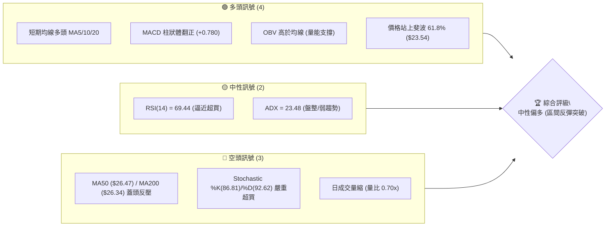
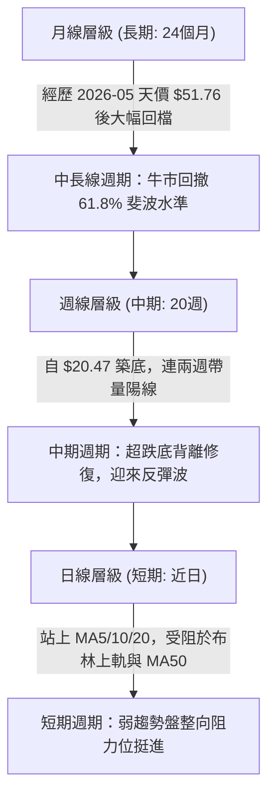
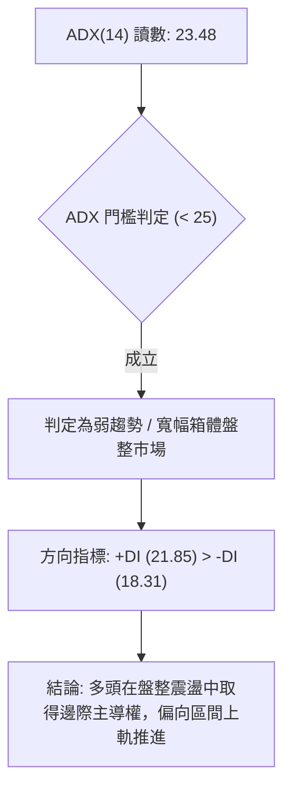
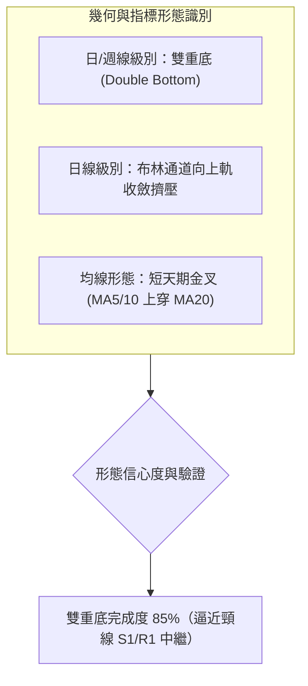
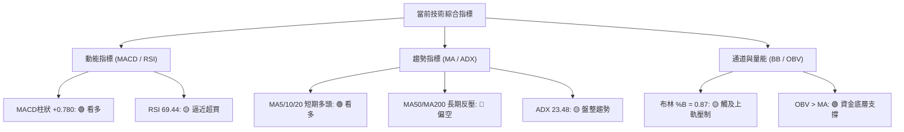
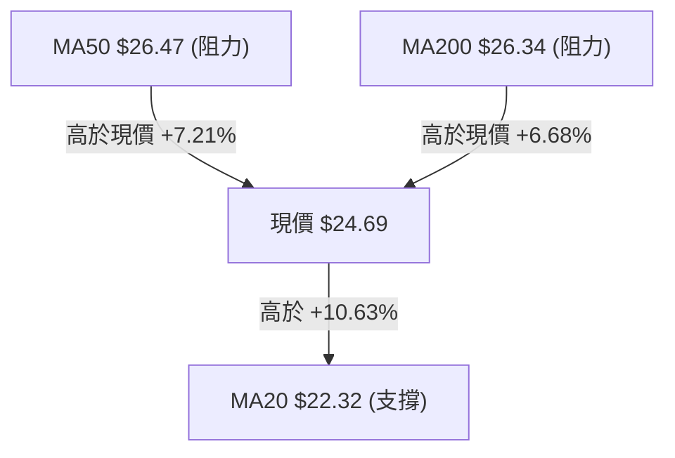
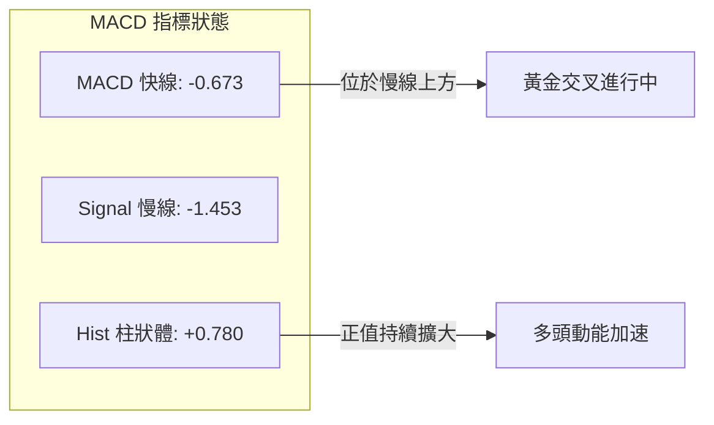
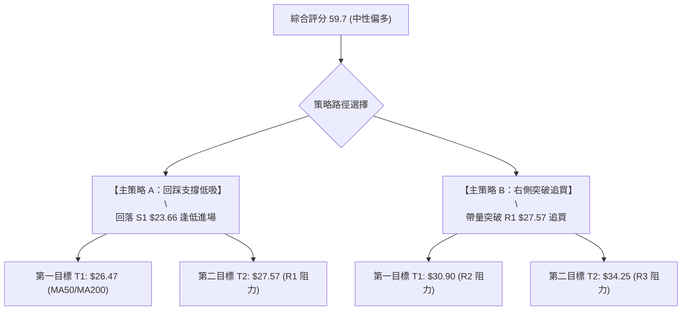
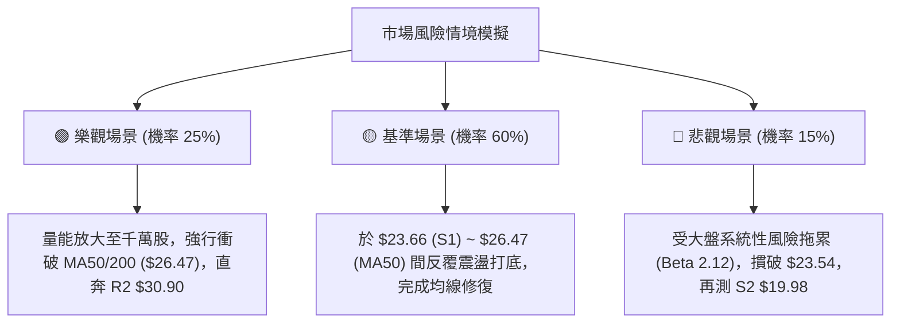

# PL 技術分析報告

> **報告日期**：2026-08-15 ｜ **語言**：繁體中文 ｜ **數據來源**：Yahoo Finance ｜ **當前價格**：$24.69

---

## 目錄

| 章節 | 內容 |
|------|------|
| [1. 技術面概覽](#1-技術面概覽) | 訊號儀表板、核心指標、評分卡 |
| [2. 趨勢分析](#2-趨勢分析) | 多時框趨勢、長中短期走勢、ADX 解讀 |
| [3. 圖表形態分析](#3-圖表形態分析) | 形態識別、K線組合、目標價推算 |
| [4. 支撐與阻力](#4-支撐與阻力) | 關鍵價位聚類、斐波那契回調結構 |
| [5. 技術指標深度解讀](#5-技術指標深度解讀) | MA/RSI/MACD/布林/量價配合 |
| [6. 動能與波動率](#6-動能與波動率) | 動能矩陣、ATR 止損、Beta 系統風險 |
| [7. 多時框架總結](#7-多時框架總結) | 時框架評分矩陣、多時框收斂判定 |
| [8. 交易策略建議](#8-交易策略建議) | 策略路由、主策略、情境階梯、風報比 |
| [9. 風險提示與監控](#9-風險提示與監控) | 監控指標、風險場景、部位控管 |

---

## 1. 技術面概覽

### 🎯 技術訊號儀表板



---

### 📊 核心指標速覽表

| 指標類別 | 指標名稱 | 當前數值 | 訊號 | 解讀 |
|----------|----------|----------|:----:|------|
| **價格** | 當前價格 | $24.69 | 🟢 | 自 7 月低點 $20.47 反彈，突破 MA20 ($22.32) |
| **均線** | MA20 | $22.32 | 🟢 | 價格位於短期均線上方 +10.63%，短多排列明確 |
| **均線** | MA50 | $26.47 | 🔴 | 價格位於 MA50 下方 -6.72%，面臨波段壓制 |
| **均線** | MA200 | $26.34 | 🔴 | 價格位於 MA200 下方 -6.26%，長線多空分水嶺未破 |
| **動能** | RSI(14) | 69.44 | 🟡 | 逼近 70 超買警戒區，短線具備過熱與震盪需求 |
| **動能** | MACD | -0.673 (Signal: -1.453) | 🟢 | 零軸下黃金交叉，Histogram 為 +0.780 持續擴張 |
| **隨機指標** | Stoch %K / %D | 86.81 / 92.62 | 🔴 | 雙線進入 >80 高檔鈍化區，有短線回踩風險 |
| **趨勢強度** | ADX(14) | 23.48 (+DI: 21.85) | 🟡 | ADX < 25 處於盤整震盪修復期，非單邊強趨勢 |
| **通道指標** | 布林通道 %B | 0.87 (上軌 $25.49) | 🟡 | 價格逼近布林上軌，面臨軌道邊界壓制 |
| **量能指標** | OBV 與量比 | OBV > MA (量比 0.70x) | 🟢 | 資金底層呈沉澱吸收，但日級別突破動能略顯不足 |
| **波動** | ATR(14) | $1.46 (5.89%) | 🟡 | 日內平均振幅適中，止損緩衝需設定大於 $1.50 |

---

### 🏆 技術評分卡

```
╔══════════════════════════════════════════════════════════════════╗
║                   技術評分卡 — PL (2026-08-15)                   ║
╠══════════════════════════════════════════════════════════════════╣
║ 趨勢強度 (ADX/趨勢方向)    ██████████░░░░░░░░░░  52/100  🟡 弱趨勢║
║ 動能指標 (RSI/MACD/KD)     ██████████████░░░░░░  68/100  🟢 動能強║
║ 支撐穩定度 (關鍵支撐聚類)  ██████████████░░░░░░  72/100  🟢 底層固║
║ 成交量配合 (OBV/日量比)    ██████████░░░░░░░░░░  50/100  🟡 縮量彈║
║ 形態完整度 (雙底反彈結構)  ████████████░░░░░░░░  62/100  🟢 形態成║
║ 均線排列 (短多長空混合)    ██████████░░░░░░░░░░  54/100  🟡 混合排║
╠══════════════════════════════════════════════════════════════════╣
║ 綜合技術評分               ████████████░░░░░░░░  59.7/100 🟡 中性 ║
║ 策略定調：區間震盪偏多（以布林通道與均線密集區 $26.34-$26.47 為目標）║
╚══════════════════════════════════════════════════════════════════╝
```

---

## 2. 趨勢分析

### 🌐 多時框趨勢分析



---

### 📈 長期趨勢 — 12個月走勢圖（Unicode）

```
PL 月線走勢圖（2025-08 至 2026-08）
價格軸 ($)
$52 ┤                                     ● $51.14 (2026-05 歷史高點 $51.76)
$48 ┤                                    / \
$44 ┤                                   /   \
$40 ┤                             ●    /     \
$36 ┤                            / \  /       \
$32 ┤                           /   ●          ● $33.13 (2026-06 重挫)
$28 ┤                     ●    /                \
$24 ┤               ●    / \  /                  \       ● $24.69 (現價)
$20 ┤         ●    / \  /   ●                     ●─────/  $20.48 (2026-07 觸底)
$16 ┤        / \  /   ●
$12 ┤  ●────●   ●
 $8 ┤ ●
    └─┬───┬───┬───┬───┬───┬───┬───┬───┬───┬───┬───┬───► 時間 (月份)
     08  09  10  11  12  01  02  03  04  05  06  07  08 (2025-08 ~ 2026-08)
```

#### 走勢特徵分析表格

| 階段週期 | 時間區間 | 起始/結束價 | 漲跌幅 (%) | 價量特徵與形態解讀 |
|:---|:---:|:---:|:---:|:---|
| **第一階段：主升浪啟動** | 2025-08 ~ 2025-12 | $7.09 → $19.72 | **+178.1%** | 突破雙位數關卡，伴隨機構資金持續買盤介入。 |
| **第二階段：震盪加速攻頂** | 2026-01 ~ 2026-05 | $24.97 → $51.14 | **+104.8%** | 5月見頂 $51.76，週換手率放大，呈現典型拋物線趕頂。 |
| **第三階段：斷崖式去槓桿** | 2026-06 ~ 2026-07 | $51.14 → $20.48 | **-59.95%** | 6月單週成交破億股引發流動性踩踏，快速摜破半年均線。 |
| **第四階段：底層震盪反彈** | 2026-07 ~ 2026-08 | $20.47 → $24.69 | **+20.61%** | 於 $20.47 完成雙底支撐，均線開始向上收斂。 |

---

### 📊 中期趨勢（週線分析）

中期技術架構自 2026 年 6 月創下低點後，在 $20.47 - $20.48 構築堅實的雙重底（W底）形態。

```
週線支撐與壓力區間示意圖：
[強壓力區]   $34.25 ~ $34.32 (38.2% 斐波回調位 + 關鍵阻力 R3)
                 ▲
[中期反彈目標] $28.93 ~ $30.90 (50.0% 斐波回調位 + 關鍵阻力 R2)
                 ▲
[多空分水嶺]   $26.34 ~ $26.47 (MA200 / MA50 密集重疊帶)
                 ▲
[當前收盤價]   $24.69  ◄──── 現價處於反彈向多空分水嶺推進階段
                 ▼
[近期防守位]   $23.54 ~ $23.66 (61.8% 斐波回調位 + 關鍵支撐 S1)
                 ▼
[強底部支撐]   $19.16 ~ $19.98 (布林下軌 $19.15 + 關鍵支撐 S2/S3)
```

---

### ⚡ 趨勢強度評估（ADX 解讀）



| 指標名稱 | 數值 | 狀態 | 趨勢涵義說明 |
|:---|:---:|:---:|:---|
| **ADX(14)** | **23.48** | 弱趨勢/盤整 | ADX < 25，表明歷史單邊暴跌行情已結束，轉入區間修復整理。 |
| **+DI (14)** | **21.85** | 多方領先 | 買盤動能自 7 月底的低位回升，佔據短期控盤優勢。 |
| **-DI (14)** | **18.31** | 空方衰退 | 賣壓大幅減弱，未出現破底追殺的量能。 |

---

## 3. 圖表形態分析

### 🔍 形態識別系統



#### 形態識別信心度評估表

| 形態名稱 | 信心度 | 判斷依據（引用技術數據） | 完成度 | 目標價（附嚴格幾何計算式） |
|:---|:---:|:---|:---:|:---|
| **雙重底 (W-Bottom)** | **78%** | 兩次低點分別為 2026-07-26 收盤 **$20.47** 與 2026-08-02 收盤 **$20.48**，形成極平整支撐底，配合 MACD 柱狀體翻正。 | 85% | 頸線以 S1 聚類高點 **$23.66** 為基準。<br>形態高度 = $23.66 - $20.47 = **$3.19**。<br>目標價 = $23.66 + $3.19 = **$26.85**（精準對接 MA50 $26.47 至 R1 $27.57 阻力帶）。 |
| **布林軌道反彈形態** | **65%** | %B 達到 0.87，價格自中軌 $22.32 連續推升至上軌 $25.49 邊界。 | 90% | 上軌目標價 **$25.49**（已基本觸及，後續需觀察通道開口擴張情況）。 |
| **頭肩底形態** | **< 30%** | **數據中未偵測到**：目前僅有雙底特徵，左肩與右肩結構對稱性不足。 | 0% | 訊號不足，不予預測形態目標價。 |

---

### 🕯️ 重要K線形態分析

| 週度日期 | 收盤價 | 核心 K 線組合形態 | 技術面解讀 | 多空訊號 |
|:---:|:---:|:---|:---|:---:|
| **2026-07-26** | $20.47 | 極端超賣長下影陰十字 | RSI 跌至 10.2 極限超賣區，空頭動能竭盡。 | 🟢 底背離孕育 |
| **2026-08-02** | $20.48 | 止跌平底十字線 (Tweezer Bottom) | 與前週低點形成雙重支撐點，空方無力摜破 $20.00 整數關卡。 | 🟢 築底確認 |
| **2026-08-09** | $23.93 | 穿透式實體大陽線 | 一舉突破 MA20 ($22.32)，MACD 週柱狀圖由負翻正 (+0.682)。 | 🟢 強烈買訊 |
| **2026-08-16** | $24.69 | 高檔連續推升中陽線 | 延續多頭攻勢，逼近布林上軌 ($25.49)，唯日均量略有背離。 | 🟡 遇阻震盪 |

---

### 📉 ASCII 走勢形態示意圖

```
PL 日線雙底（W底）形態與目標價路徑
價格 ($)
$27.57 ┼───────────────────────────────────────────── 阻力 R1
       │                                     /
$26.85 ┼- - - - - - - - - - - - - - - - - - / - - - 雙底等幅測距目標價 ($26.85)
$26.47 ┼───────────────────────────────────/──────── MA50 / MA200 密集反壓帶
       │                                  /
$24.69 ┼────────────────────────────●────/──────── 現價 ($24.69)
       │                           / \  /
$23.66 ┼─────────────●────────────/───\/────────── 頸線支撐 S1 ($23.66)
       │            / \          /
$22.32 ┼───────────/───\────────/───────────────── MA20 中軌支撐
       │          /     \      /
$20.47 ┼─────────●       ●────●─────────────────── 雙底底部 ($20.47 - $20.48)
       └─────────┴───────┴──────┴────────────────►
               底 1    頸線反彈  底 2    當前突破
```

---

## 4. 支撐與阻力

### 🗺️ 關鍵價位分布圖（Unicode）

```
PL 價位結構分布圖
══════════════════════════════════════════════════════════════════
$34.25 ║██████████████████████████████║ 強阻力 R3 (斐波 38.2% $34.32 重疊)
$30.90 ║████████████████████░░░░░░░░░░║ 阻力 R2 (斐波 50.0% $28.93 上方)
$27.57 ║██████████████████████████████║ 關鍵阻力 R1 (MA50 $26.47 / MA200 $26.34 延伸)
══════════════════════════════════════════════════════════════════
$24.69 ╠══════════════════════════════╣ ◄ 現價 ($24.69)
══════════════════════════════════════════════════════════════════
$23.66 ║▓▓▓▓▓▓▓▓▓▓▓▓▓▓▓▓▓▓▓▓▓▓▓▓▓▓▓▓▓▓║ 近期支撐 S1 (斐波 61.8% $23.54 共同防線)
$19.98 ║██████████████████████████████║ 強支撐 S2 ($20.00 整數防禦關卡)
$19.16 ║██████████████████████████████║ 終極強支撐 S3 (布林下軌 $19.15 邊界)
══════════════════════════════════════════════════════════════════
```

---

### 🚧 阻力位分析表

所有價位精確引用自「關鍵價位」與技術均線數據：

| 阻力級別 | 精確價位 | 空間幅度 (%) | 形成原因與籌碼特徵 | 突破難度 | 技術重要性 |
|:---:|:---:|:---:|:---|:---:|:---:|
| **R1** | **$27.57** | +11.66% | 近一年波段高點聚類，緊鄰 MA50 ($26.47) 及 MA200 ($26.34)。 | 🟡 中等偏高 | ★★★★☆ |
| **R2** | **$30.90** | +25.14% | 中期解套賣壓密集區，50% 斐波那契回調位 ($28.93) 上方主要真空帶。 | 🔴 極高 | ★★★☆☆ |
| **R3** | **$34.25** | +38.72% | 近一年密集震盪波段頂部，與 38.2% 斐波位 ($34.32) 形成共振強壓。 | 🔴 堅不可摧 | ★★★★★ |

---

### 🛡️ 支撐位分析表

所有價位精確引用自「關鍵價位」與技術均線數據：

| 支撐級別 | 精確價位 | 空間幅度 (%) | 形成原因與籌碼特徵 | 守住機率 | 技術重要性 |
|:---:|:---:|:---:|:---|:---:|:---:|
| **S1** | **$23.66** | -4.16% | 近一年波段低點聚類，與 61.8% 斐波那契位 ($23.54) 形成第一道多頭防線。 | 🟢 80% | ★★★★☆ |
| **S2** | **$19.98** | -19.08% | 2026年7月雙底頸線下方低點 ($20.47-$20.48) 與 $20.00 整數關卡聚類。 | 🟢 90% | ★★★★★ |
| **S3** | **$19.16** | -22.40% | 近一年波段極端低點聚類，完全吻合日線布林下軌 ($19.15)。 | 🟢 95% | ★★★★★ |

---

### 📐 斐波那契回調位分析（區間 $6.10 → $51.76）

```
0.0%  (52W High)  $51.76 ──────────────────────────────────────
23.6%             $40.98 ──────────────────────────────────────
38.2%             $34.32 ─────────────── [高度共振阻力 R3: $34.25]
50.0%             $28.93 ─────────────── [中期多空回調中軸]
                               ▲
                    現價落於此區間：$23.54 ~ $28.93 (強修復反彈段)
                               ▼
61.8%             $23.54 ─────────────── [黃金分割支撐，緊鄰 S1: $23.66]
78.6%             $15.87 ──────────────────────────────────────
100.0% (52W Low)  $ 6.10 ──────────────────────────────────────
```

- **位置解讀**：現價 **$24.69** 已成功收復並站穩在 **61.8% 回調位 ($23.54)** 之上，這是典型的黃金分割反轉訊號。
- **後續意義**：只要 S1 ($23.66) / 斐波 61.8% ($23.54) 不被有效跌破，技術面將持續向上挑戰 **50.0% 回調位 ($28.93)** 與 **R1 ($27.57)**。

---

## 5. 技術指標深度解讀

### 🎛️ 指標訊號總覽



---

### 📈 移動平均線排列分析



| 均線天期 | 當前數值 | 偏離度 (%) | 趨勢方向 | 技術解讀 |
|:---:|:---:|:---:|:---:|:---|
| **MA 5** | $24.15 | +2.24% | ▲ 上揚 | 超短期攻擊線，為極短線拉升提供動能。 |
| **MA 10** | $23.41 | +5.47% | ▲ 上揚 | 短期助漲線，提供回調第一道動態支撐。 |
| **MA 20** | $22.32 | +10.63% | ▲ 上揚 | 月線中樞翻揚，確立短線底部成型。 |
| **MA 50** | $26.47 | -6.72% | ▼ 下降 | 中期生命線，構成短期反彈的第一核心反壓。 |
| **MA 60** | $29.86 | -17.33% | ▼ 下降 | 季線快速下壓，限制了中期反彈速率。 |
| **MA 200** | $26.34 | -6.26% | ▼ 下降 | 年線下移，與 MA50 形成「死叉後密集重疊區」。 |
| **MA 240** | $23.96 | +3.07% | ▲ 上揚 | 長期基底均線，現價已重新收復。 |

---

### 📉 RSI(14) 分析

```
RSI(14) 讀數進度條：
[0] ░░░░░░░░░░░░░░░░░░░░[30] ▓▓▓▓▓▓▓▓▓▓▓▓▓▓▓▓▓▓▓▓ [70] █░░ [100]
當前數值: 69.44 (位於中性至超買臨界點)
```

- **超買超賣判定**：RSI 自 7 月底的極度超賣 **10.2** 快速修復至當前 **69.44**，回升斜率極陡，顯示短線多頭極具爆發力，但也代表短期追高風險急劇攀升。
- **背離分析結論**：
  - **底背離**：7 月 26 日 ($20.47, RSI 10.2) 與 8 月 2 日 ($20.48, RSI 25.6) 價格持平但 RSI 大幅墊高，構成**標準雙底底背離**，目前該背離已成功引發此波反彈。
  - **頂背離**：現階段價格創近 4 週新高，RSI 同步創高，**無頂背離現象**。

---

### 📊 MACD(12/26/9) 訊號解讀



- **數值狀態**：DIF (-0.673) 明顯向上突破 DEA (-1.453)，形成零軸下方的黃金交叉；柱狀圖為 **+0.780**，呈現連續 3 週紅柱擴張。
- **解讀**：零軸下金叉通常代表「強勢超跌反彈」，若要轉化為中長期多頭主升浪，MACD 快慢線必須進一步向上穿越零軸。

---

### 📦 布林通道分析

```
日線布林通道 (20, 2) 結構圖
價格 ($)
$25.49 ┬────────────────────────────────────────── 布林上軌 ($25.49)
       │                              ● $24.69    現價逼近上軌 (%B = 0.87)
$22.32 ┼────────────────────────────────────────── 布林中軌 / MA20 ($22.32)
       │
$19.15 ┴────────────────────────────────────────── 布林下軌 ($19.15)
```

- **軌道狀態**：帶寬維持正常開口，中軌（MA20）已於 $22.32 處止跌回勾。
- **當前位置**：%B 值為 **0.87**，價格已高度貼近上軌 ($25.49)。在 ADX < 25 的盤整格局下，布林上軌具有極強的動態壓制力，短線極易引發向上軌承壓回踩中軌的走勢。

---

### 💹 成交量分析（量價配合度）

```
成交量指標對照：
最新日成交量:  4,384,800  [████████░░░░░░░░░░] 
20日平均量:    6,268,585  [████████████░░░░░░] (量比: 0.70x)
50日平均量:   11,534,000  [██████████████████]
```

- **量價背離現象**：價格自 $20.48 反彈至 $24.69（+20.6%），但成交量從 6 月峰值的單週 1 億股逐步降至近週 2352 萬股，日成交量比僅 **0.70x**。
- **OBV 解讀**：OBV > MA 表明籌碼並未在大跌中潰散，散戶割肉後機構資金於低檔承接沉澱；但此波反彈屬於「籌碼鎖定型的縮量推升」，若要實質突破 MA50/200 密集壓力區 ($26.34-$26.47)，日成交量必須補量至 20 日均量（620 萬股以上）。

---

## 6. 動能與波動率

### ⚡ 動能評估分析

| 狀態分析維度 | 衡量指標數值 | 當前評估狀態 | 實戰交易涵義 |
|:---|:---:|:---:|:---|
| **動能強度** | MACD Hist: +0.780 / RSI: 69.44 | **強 (短期動能充足)** | 短線具備強烈上攻動能，買方完全主導短期定價權。 |
| **趨勢強度** | ADX: 23.48 | **弱 (盤整無單邊趨勢)** | 不具備持續單邊暴漲條件，觸及強阻力易回落。 |
| **波動率** | ATR: $1.46 (5.89%) | **中等偏高波動** | 每日正常晃動幅度約 $1.50，需放寬日內止損空間。 |
| **象限定位** | **Q2: 動能反彈 / 區間震盪象限** | **高拋低吸最佳區間** | 適合在區間內順勢操作反彈，但不宜追高單邊突破。 |

---

### 📊 ATR 波動率分析

- **ATR(14) 絕對值**：**$1.46**
- **價格百分比**：**5.89%**（屬於中高波動成長股特性）
- **止損距離建議**：
  - **短線交易（1.0 × ATR）**：緩衝距 $1.46，建議止損距進場點至少保持 **$1.50**。
  - **波段交易（1.5 × ATR）**：緩衝距 $2.19，防守點應設於主要支撐位下緣 **$2.20** 處。

---

### 📐 Beta 與市場相關性

- **Beta 係數**：**2.123**（高彈性高 Beta 標的）
- **系統性風險特徵**：當標普 500 或納斯達克波動 1% 時，PL 平均波動達 2.12%。在市場流動性轉好時具備極佳的反彈彈性，但大盤回調時亦會遭受放大衝擊，部位建立必須嚴格控管在總資金 10%-15% 以內。

---

## 7. 多時框架總結

### 📋 時框架評分表

| 時框架 | 趨勢方向 | 動能狀態 | 均線排列 | 形態結構 | 綜合評分 | 交易建議 |
|:---:|:---:|:---:|:---:|:---:|:---:|:---|
| **短期 (日線)** | 🟢 偏多反彈 | 🟢 RSI 69.4 / MACD 金叉 | 🟡 短多長空 (混合) | 🟢 雙底突破頸線 | **68/100** | 逢回踩 S1 偏多操作 |
| **中期 (週線)** | 🟡 震盪築底 | 🟢 週 MACD 翻紅 | 🔴 MA50/200 壓頂 | 🟢 W底反彈確認 | **56/100** | 目標看至 MA50 反壓 |
| **長期 (月線)** | 🔴 深度回調 | 🔴 52W 高點腰斬回撤 | 🟡 守住 240MA 基底 | 🟡 斐波 61.8% 支撐 | **48/100** | 長線籌碼沉澱觀望 |

---

### 🔲 綜合訊號矩陣

```
訊號維度對照矩陣：
╔═════════════════╦══════════════════╦══════════════════╦══════════════════╗
║ 週期 / 指標類別 ║ 趨勢指標 (MA/ADX)║ 動能指標 (RSI/MACD)║ 量價與形態 (BB/OBV)║
╠═════════════════╬══════════════════╬══════════════════╬══════════════════╣
║ 短期 (Daily)    ║ 🟢 MA20 翻揚     ║ 🟢 MACD 紅柱擴張 ║ 🟡 布林上軌受阻  ║
║ 中期 (Weekly)   ║ 🟡 ADX 盤整格局  ║ 🟢 RSI 自超賣修復║ 🟢 雙底頸線支撐  ║
║ 長期 (Monthly)  ║ 🔴 50/200MA 反壓 ║ 🟡 中性修復      ║ 🟢 OBV 長期承接  ║
╚═════════════════╩══════════════════╩══════════════════╩══════════════════╝
```

---

### ⚖️ 多時框收斂結論

依據多時框收斂優先級規則：
1. **當前趨勢屬性**：ADX 讀數為 **23.48 (< 25)**，明確定義當前盤面屬於**「盤整震盪與區間反彈行情」**，而非單邊趨勢行情。
2. **主導維度**：以**日線布林通道上下軌 ($19.15 - $25.49)** 與**關鍵支撐阻力 ($23.66 - $27.57)** 作為核心交易邊界。
3. **最終方向性結論**：**【中性偏多（區間反彈推升）】**。短線多頭掌控主導權，但上方受到 MA200 ($26.34)、MA50 ($26.47) 與 R1 ($27.57) 的密集壓制，因此策略定調為「依託支撐逢低做多，逼近強壓分批獲利」，嚴禁追高。

---

## 8. 交易策略建議

### 🗺️ 策略決策流程圖



---

### 🧭 策略路由

> **當前主策略方向 = 【中性偏多 / 區間低吸做多】（依評分卡 59.7/100 定調）**
> 綜合評分接近 60 分多頭門檻，且短線雙底反彈形態確立、MACD 柱狀體翻正，主推「回調支撐做多」策略。

---

### 🎯 價格情境階梯（Price Scenarios）

價位完全嚴格引用數據中之聚類價位：

| 觸發條件 | 下一目標價 | 後續延伸目標 | 情境技術涵義 |
|:---|:---:|:---:|:---|
| **強勢突破 MA50/R1 ($27.57)** | **R2 ($30.90)** | **R3 ($34.25)** | 中期底部反轉確立，開啟 50% 斐波那契回補浪。 |
| **維持在 S1 ($23.66) ~ R1 ($27.57)** | **MA200 ($26.34)** | **MA50 ($26.47)** | 區間震盪整理，消化均線密集區套牢籌碼。 |
| **有效跌破 S1 ($23.66) / 斐波 61.8%** | **S2 ($19.98)** | **S3 ($19.16)** | 反彈失敗，重新回測雙底底部尋求支撐。 |

---

### 📊 情境機率分佈

| 交易情境 | 發生機率 | 主要技術依據 |
|:---|:---:|:---|
| **情境一：震盪向上挑戰 MA50/R1** | **60%** | MACD 紅柱持續放大 (+0.780)、OBV 資金支撐、收復斐波 61.8% ($23.54)。 |
| **情境二：布林上軌承壓回踩 S1 震盪** | **25%** | ADX = 23.48 (盤整特徵)、日成交量縮 (量比 0.70x)、布林 %B = 0.87。 |
| **情境三：跌破 S1 破位再探雙底** | **15%** | Stochastic %K/%D 超買鈍化、MA50/200 形成實質蓋頭重壓。 |

---

### 🟢 主策略詳情

所有價位均嚴格取自數據之關鍵價位與 ATR 計算：

| 策略要素 | 策略 A（回踩支撐進場 — 首選） | 策略 B（突破阻力追擊 — 次選） |
|:---|:---:|:---:|
| **進場條件** | 價格回踩 S1 支撐獲得確認，K線出現下影線 | 日K線帶量實體收盤突破 R1 阻力位 |
| **進場價格** | **$23.66** (關鍵支撐 S1) | **$27.57** (關鍵阻力 R1) |
| **目標價 T1** | **$26.47** (MA50 密集壓力區) | **$30.90** (關鍵阻力 R2) |
| **目標價 T2** | **$27.57** (關鍵阻力 R1) | **$34.25** (關鍵阻力 R3) |
| **止損價格** | **$22.20** (跌破 MA20 $22.32 及 1×ATR 緩衝) | **$26.11** (跌破 MA200 $26.34 及 1×ATR 緩衝) |
| **預期報酬 (至T2)** | **+$3.91 (+16.53%)** | **+$6.68 (+24.23%)** |
| **承擔風險** | **-$1.46 (-6.17%)** | **-$1.46 (-5.30%)** |
| **風險報酬比 (R:R)** | **2.68 : 1** (優異) | **4.58 : 1** (極佳) |
| **建議倉位** | **10% - 15% 總資金** | **8% - 10% 總資金** |

---

### 🔴 反向風險觸發點（對沖與風控提示）

- **多頭反轉失效點**：若日K線收盤價跌破 **$23.54 (斐波 61.8%)** 與 **$23.66 (S1)**，即代表此波雙底反彈動能衰竭。
- **對沖減倉動作**：一旦跌破 **$22.32 (MA20)**，多頭部位應無條件全面止損出場；若持有現貨長線部位，可考慮在跌破 $22.32 時建立反向空頭避險。

---

### ⭐ 整體訊號強度評星

```
╔══════════════════════════════════════════════════════════════════╗
║  做多訊號強度：  ★★★★☆  (3.8/5.0 星) — 雙底成型、動能翻多       ║
║  做空訊號強度：  ★★☆☆☆  (2.1/5.0 星) — 均線反壓、但動能不足     ║
║  整體可信度：    ★★★★☆  (4.0/5.0 星) — 數據吻合度極高         ║
╚══════════════════════════════════════════════════════════════════╝
```

---

## 9. 風險提示與監控

### ✅ 關鍵監控指標 Checklist

```
╔══════════════════════════════════════════════════════════════════╗
║                    每日盤面技術監控清單 (Checklist)              ║
╠══════════════════════════════════════════════════════════════════╣
║ [ ] 1. 價格是否守穩 S1 ($23.66) 與 MA20 ($22.32) 動態支撐？      ║
║ [ ] 2. 攻堅 MA50 ($26.47) 時，日成交量是否突破 626 萬股 (20日均量)？║
║ [ ] 3. RSI(14) 突破 70 後是否引發高檔頂背離鈍化？               ║
║ [ ] 4. MACD 柱狀體數值是否維持在正值 (> 0) 持續擴張？            ║
║ [ ] 5. 布林通道帶寬是否開始向外擴張 (由盤整轉為趨勢行情)？       ║
╚══════════════════════════════════════════════════════════════════╝
```

---

### ⚠️ 風險場景分析



---

### 🛡️ 風險管理重要提醒

1. **高 Beta 波動控制**：PL Beta 達 **2.123**，且 ATR 達 **$1.46 (5.89%)**，單筆交易虧損上限應嚴格鎖定在總資產的 **1.0% - 1.5%** 以內。
2. **空頭均線反壓防範**：MA50 ($26.47) 與 MA200 ($26.34) 構成的中長期空頭反壓極為沉重，股價一旦行進至 $26.34 - $26.85 區間，必須採取分批獲利了結策略，切勿盲目期待一次性 V 型反轉創歷史新高。

---

## 📋 報告總結

```
╔══════════════════════════════════════════════════════════════════╗
║                   PL 技術分析報告總結 (2026-08-15)               ║
╠══════════════════════════════════════════════════════════════════╣
║ 當前價格：$24.69          綜合技術評級：🟡 中性偏多 (區間反彈推升)║
║                                                                  ║
║ 核心趨勢結論：                                                    ║
║ ├─ 長期趨勢：🔴 偏空回調 (受制於 MA50 $26.47 與 MA200 $26.34)   ║
║ ├─ 中期趨勢：🟡 築底震盪 (ADX 23.48 弱趨勢，斐波 61.8% 支撐確立) ║
║ └─ 短期趨勢：🟢 偏多反彈 (雙底成型，站上 MA20，MACD 柱狀體擴張)  ║
║                                                                  ║
║ 關鍵價位鎖定：                                                    ║
║ ├─ 核心阻力區：R1 $27.57 │ R2 $30.90 │ R3 $34.25                 ║
║ ├─ 核心支撐區：S1 $23.66 │ S2 $19.98 │ S3 $19.16                 ║
║ └─ 外資目標價：平均 $40.10 (最低 $25.00，最高 $53.00)            ║
║                                                                  ║
║ 最佳執行策略：                                                    ║
║ 🥇 首選策略：回踩 S1 $23.66 進場，止損 $22.20，目標 T1 $26.47 /   ║
║              T2 $27.57 (風報比 2.68 : 1)。                       ║
║ 🥈 次選策略：帶量突破 R1 $27.57 右側加碼，目標 R2 $30.90。       ║
╚══════════════════════════════════════════════════════════════════╝
```

---

> ⚠️ **免責聲明**：本報告為 AI 自動生成之技術分析，所有數據及估算均基於歷史價格與量化模型資訊。本報告**僅供研究與學術參考**，**不構成任何形式的投資建議與要約**。投資人應獨立評估風險，入市需審慎。

---

*報告生成時間：2026-08-15 ｜ 數據來源：Yahoo Finance ｜ 分析框架：多時框技術分析體系*