# PL 技術分析報告

> **報告日期**：2026-08-16 ｜ **語言**：繁體中文 ｜ **數據來源**：Yahoo Finance ｜ **當前價格**：$24.69

---

## 目錄

| 章節 | 內容 |
|------|------|
| [1. 技術面概覽](#1-技術面概覽) | 訊號儀表板、核心指標、評分卡 |
| [2. 趨勢分析](#2-趨勢分析) | 多時框趨勢、長中短期走勢 |
| [3. 圖表形態分析](#3-圖表形態分析) | 形態識別、K線組合、目標價 |
| [4. 支撐與阻力](#4-支撐與阻力) | 關鍵價位、斐波那契回調 |
| [5. 技術指標深度解讀](#5-技術指標深度解讀) | MA/RSI/MACD/布林/成交量 |
| [6. 動能與波動率](#6-動能與波動率) | 動能評估、ATR、Beta |
| [7. 多時框架總結](#7-多時框架總結) | 時框架評分矩陣 |
| [8. 交易策略建議](#8-交易策略建議) | 多空策略、風險報酬比 |
| [9. 風險提示與監控](#9-風險提示與監控) | 監控指標、風險場景 |

---

## 1. 技術面概覽

### 🎯 技術訊號儀表板

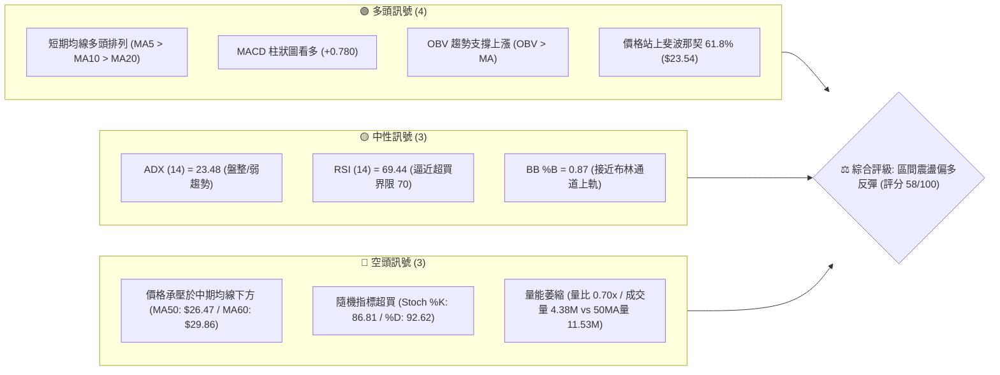

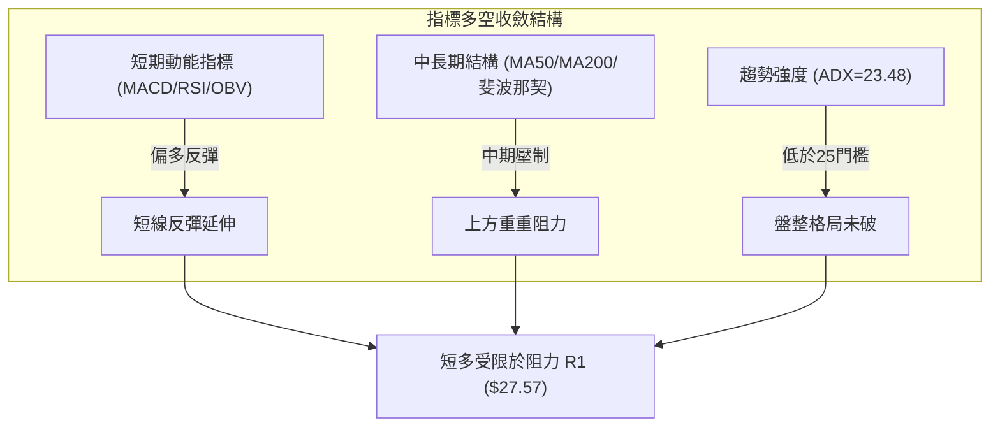

### 📊 核心指標速覽表

| 指標類別 | 指標名稱 | 當前數值 | 訊號 | 解讀 |
|----------|----------|----------|------|------|
| **價格** | 當前價格 | $24.69 | 🟡 | 位於52週區間40.7%，自$20.47底部反彈約20.6% |
| **均線** | MA20 | $22.32 | 🟢 | 價格在MA20上方+10.63%，短期底部支撐確立 |
| **均線** | MA50 | $26.47 | 🔴 | 價格在MA50下方-6.72%，中期下行壓力未解 |
| **均線** | MA200 | $26.34 | 🔴 | 價格在MA200下方-6.26%，長期多空分水嶺受阻 |
| **動能** | RSI(14) | 69.44 | 🟡 | 位於中性區間頂部，接近70超買門檻，無頂背離 |
| **動能** | MACD Hist | +0.780 | 🟢 | MACD線(-0.673)上穿訊號線(-1.453)，紅柱擴張 |
| **動能** | Stoch %K/%D | 86.81 / 92.62 | 🔴 | 隨機指標深度超買，短線有高檔頓化或回踩需求 |
| **趨勢** | ADX(14) | 23.48 | 🟡 | ADX < 25 表明處於盤整或弱趨勢，非單邊行情 |
| **通道** | BB 上軌 | $25.49 | 🟡 | 價格貼近上軌(%B=0.87)，短線上面臨通道頂部壓制 |
| **量能** | 量比 / OBV | 0.70x / 看多 | 🟡 | OBV支撐反彈，但成交量(4.38M)低於20日均量(6.27M) |
| **波動** | ATR(14) | $1.46 | 🟡 | 每日波幅佔股價5.89%，屬於中高波動標的 |

### 🏆 技術評分卡

```
╔══════════════════════════════════════════════════════════════╗
║              技術評分卡 — PL (Planet Labs PBC)               ║
║              評估日期：2026-08-16 ｜ 當前價格：$24.69         ║
╠══════════════════════════════════════════════════════════════╣
║ 趨勢強度 (ADX=23.48)   ███████████░░░░░░░░░  54/100  🟡 盤整 ║
║ 動能指標 (RSI/MACD)    █████████████░░░░░░░  65/100  🟢 偏多 ║
║ 支撐穩定度 (S1/Fib)    ██████████████░░░░░░  70/100  🟢 強固 ║
║ 成交量配合 (OBV/量比)  █████████░░░░░░░░░░░  48/100  🟡 縮量 ║
║ 形態完整度 (雙底雛形)  ████████████░░░░░░░░  60/100  🟡 構築 ║
║ 均線排列 (短多長空)    ██████████░░░░░░░░░░  52/100  🟡 混合 ║
╠══════════════════════════════════════════════════════════════╣
║ 綜合技術評分           ███████████░░░░░░░░░  58/100  ⚖️ 中性 ║
║ 總結策略定位：中性偏多（區間反彈操作，以布林與均線壓制為界） ║
╚══════════════════════════════════════════════════════════════╝
```

---

## 2. 趨勢分析

### 🌐 多時框趨勢分析

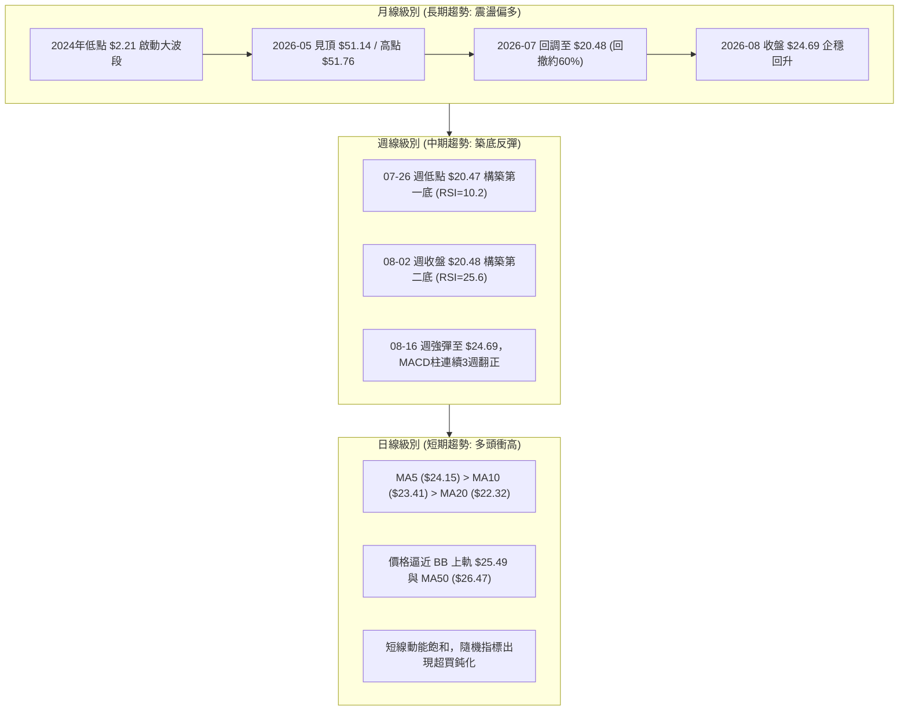

### 📈 長期趨勢 — 12個月走勢圖（Unicode）

```
PL 月線走勢圖（過去12個月：2025-08 至 2026-08）
價格軸 ($)
$52.00 ┤                                      ● (05月 $51.14 / 最高 $51.76)
$46.00 ┤                                     / \
$40.00 ┤                                    /   \
$34.00 ┤                                   ●     ● (06月 $33.13)
$28.00 ┤                             ●    (04月)   \
$22.00 ┤                       ●   (03月)           ●←現價 $24.69 (08月)
$16.00 ┤                 ●   (01月)                 /
$10.00 ┤           ●   (12月)                     ● (07月 $20.48)
 $4.00 ┤●    ●    (09月)
 $0.00 └─────────────────────────────────────────────────────────────
       08月 09月 10月 11月 12月 01月 02月 03月 04月 05月 06月 07月 08月
       2025 ───────────────────────────────────────────────> 2026
```

**走勢特徵分析表格**：

| 階段 | 期間 | 起迄價格 ($) | 漲跌幅 (%) | 主要技術特徵與驅動因素 |
|------|------|-------------|------------|------------------------|
| **起漲主升段** | 2025-08 → 2025-12 | $7.09 → $19.72 | +178.14% | 突破個位數平台，放量大陽線推升，均線多頭發散 |
| **加速噴出段** | 2025-12 → 2026-05 | $19.72 → $51.14 | +159.33% | 週線連續放量，05-31週成交量超61M，見52W高點$51.76 |
| **瀑布式回撤** | 2026-05 → 2026-07 | $51.14 → $20.48 | -59.95% | 獲利了結與流動性抽離，06-07週成交破1億股重挫出貨 |
| **底部回升段** | 2026-07 → 2026-08 | $20.48 → $24.69 | +20.56% | 於斐波那契61.8%($23.54)與S1($23.66)上方展開超跌反彈 |

### 📊 中期趨勢（週線分析）

```
PL 週線結構與關鍵壓力支撐示意圖
══════════════════════════════════════════════════════════════════
 52W 高點: $51.76 ════════════════════════════════════════════════
                  \
                   \ 
                    \ 06-07 週破位大陰線 (100.6M 巨量出貨區)
  中期阻力區 R2: $30.90 ───┬──────────────────────────────────────
  中期阻力區 R1: $27.57 ───┼─ MA50 ($26.47) / MA200 ($26.34)
                           │  ▲
  當前現價:    $24.69 ─────┴──┼── 斐波那契 61.8% ($23.54) / S1: $23.66
                              ▼
  雙重底支撐 S2: $19.98 ──────┬── 07-26週低 $20.47 / 08-02週收 $20.48
  極限支撐區 S3: $19.16 ──────┴── BB 下軌 $19.15
══════════════════════════════════════════════════════════════════
```

### ⚡ 趨勢強度評估（ADX 解讀）

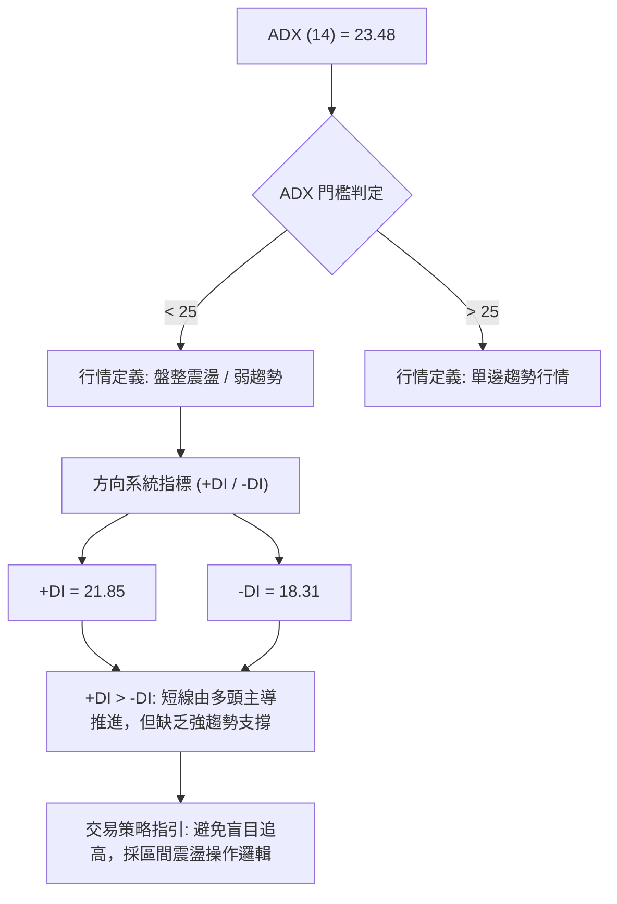

| 指標 | 數值 | 狀態區間 | 技術意義 |
|------|------|----------|----------|
| **ADX(14)** | 23.48 | < 25 (弱趨勢/盤整) | 過去急速下跌趨勢已鈍化，新一輪單邊上升趨勢尚未成形 |
| **+DI** | 21.85 | 多頭力量 | 買盤力道小幅領先賣盤 |
| **-DI** | 18.31 | 空頭力量 | 空頭動能自7月極限值顯著衰退 |
| **綜合判定** | +DI > -DI 且 ADX < 25 | **弱多頭震盪** | 以區間震盪思路操作，多頭目標受制於上方均線阻力 |

---

## 3. 圖表形態分析

### 🔍 形態識別系統

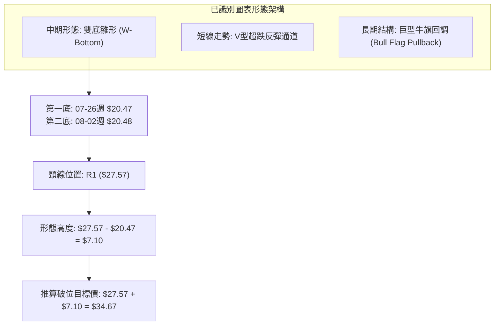

**形態信心度與參數解析表**：

| 形態名稱 | 信心度 | 判斷依據（引用數據） | 完成度 | 目標價（附計算式） |
|----------|--------|----------------------|--------|--------------------|
| **週線雙底雛形 (W-Bottom)** | 65% | 兩次週收盤低點於 07-26 ($20.47) 與 08-02 ($20.48) 獲得 S2 ($19.98) 支撐 | 70% | 頸線 R1 ($27.57) + 形態高度 ($27.57 - $20.47 = $7.10) = **$34.67**（註：接近 R3 $34.25 / Fib 38.2% $34.32） |
| **布林通道上軌突破測試** | 75% | BB %B 達 0.87，價格 $24.69 逼近 BB 上軌 $25.49 | 85% | 上軌目標 $25.49，若放量突破看 MA50 **$26.47** |
| **頭肩底形態** | 30% | 數據中未偵測到完整右肩結構，僅有左側與底部 | 30% | 訊號不足，僅做指標型解讀，不預設目標價 |

### 🕯️ 重要K線形態分析

| 週/月份 | 收盤價 ($) | K線形態 | 技術解讀 | 多空訊號 |
|---------|-----------|---------|----------|----------|
| **2026-05-31** | 51.14 | 高位長上影放量頂部線 | 觸及 52W 高點 $51.76 後遭強烈拋壓，成交量 61.48M | 🔴 極度看空 |
| **2026-06-07** | 32.22 | 破位光頭大陰線 | 破位爆量出貨 (週量 100.62M)，多頭主力全面撤退 | 🔴 極度看空 |
| **2026-07-26** | 20.47 | 縮量恐慌極端錘子線 | RSI 跌至 10.2 極端超賣，下影線探底 S2 附近完成賣盤力竭 | 🟢 觸底反轉 |
| **2026-08-09** | 23.93 | 底部包覆放量中陽線 | 連續兩週企穩 $20.48 後長陽推升，MACD 柱由負翻正 (+0.682) | 🟢 強烈看多 |
| **2026-08-16** | 24.69 | 連續推升小陽線 | 價格站穩 Fib 61.8% ($23.54) 與 S1 ($23.66)，但週量萎縮至 23.52M | 🟡 謹慎偏多 |

### 📉 ASCII 走勢形態示意圖

```
PL 週線「雙底雛形 (W-Bottom)」結構示意圖
價格 ($)
$28.00 ┤                       (頸線阻力 R1: $27.57)
$27.00 ┤                     ..---------..
$26.00 ┤                    /             \
$25.00 ┤                   /               \      ● 現價 $24.69
$24.00 ┤                  /                 \    /
$23.00 ┤                 /                   \  /
$22.00 ┤                /                     \/
$21.00 ┤  \            /                       
$20.00 ┤   \__________/                         
            底1: $20.47                          底2: $20.48
           (2026-07-26)                         (2026-08-02)
       └───────────────────────────────────────────────────────────► 時間
```

### 🎯 形態目標價計算

```
╔══════════════════════════════════════════════════════════════╗
║              雙底形態目標價測算公式與分步解析                ║
╠══════════════════════════════════════════════════════════════╣
║ 1. 形態底部基準低點 (Bottom Low)   = $20.47 (2026-07-26 週低)║
║ 2. 形態頸線阻力位 (Neckline)       = $27.57 (關鍵阻力 R1)    ║
║ 3. 形態垂直高度 (Pattern Height, H)= $27.57 - $20.47 = $7.10 ║
║ 4. 突破第1目標價 (Conservative T1) = $27.57 (頸線位置)       ║
║ 5. 等幅測量第2目標價 (Target T2)   = 頸線 + H                ║
║    計算式：$27.57 + $7.10 = $34.67 (精確契合 R3: $34.25 /    ║
║            Fib 38.2%: $34.32 共振區間)                       ║
╚══════════════════════════════════════════════════════════════╝
```

---

## 4. 支撐與阻力

### 🗺️ 關鍵價位分布圖（Unicode）

```
PL 價位結構分布圖（引用 OHLCV 聚類與斐波那契計算值）
═════════════════════════════════════════════════════════════════
$51.76 ║██████████████████████████████║ 52W 最高點 (Fib 0.0%)
$40.98 ║██████████████████            ║ 斐波那契 23.6% 回調位
$34.25 ║████████████████████████      ║ 強阻力 R3 / Fib 38.2% ($34.32)
$30.90 ║████████████████              ║ 中期阻力 R2 (06月震盪平台)
$27.57 ║████████████████████████      ║ 關鍵阻力 R1 (MA50/MA200 聚類區)
$26.47 ║▓▓▓▓▓▓▓▓▓▓▓▓▓▓▓▓▓▓▓▓          ║ MA50 ($26.47) / MA200 ($26.34)
═══════╠══════════════════════════════╣ ◄ 現價 $24.69 (BB %B: 0.87)
$23.66 ║▓▓▓▓▓▓▓▓▓▓▓▓▓▓▓▓              ║ 近期支撐 S1 / Fib 61.8% ($23.54)
$22.32 ║▓▓▓▓▓▓▓▓▓▓▓▓                  ║ 短期支撐 MA20 / BB 中軌
$19.98 ║████████████████████████      ║ 強支撐 S2 (07月雙底區域 $20.47)
$19.16 ║██████████████████████████████║ 極限支撐 S3 / BB 下軌 ($19.15)
 $6.10 ║██████████████████████████████║ 52W 最低點 (Fib 100.0%)
═════════════════════════════════════════════════════════════════
```

### 🚧 阻力位分析表

| 阻力級別 | 價位 ($) | 距現價幅寬 | 形成原因與技術共振 | 突破難度 | 重要性評級 |
|----------|----------|------------|-------------------|----------|------------|
| **R1** | **$27.57** | +11.66% | 近一年波段高點聚類；上方緊貼 MA50 ($26.47) 與 MA200 ($26.34) 及 Fib 50% ($28.93) | 中高 | 🔴 核心分水嶺 (決定能否翻轉為大級別多頭) |
| **R2** | **$30.90** | +25.14% | 06月瀑布下跌後的首個反彈高點聚類；MA60 ($29.86) 與 MA120 ($31.45) 均線壓制帶 | 高 | 🟡 中期目標位 (套牢籌碼密集區) |
| **R3** | **$34.25** | +38.72% | 04月密集成交區高點聚類；與斐波那契 38.2% ($34.32) 形成完美價格共振 | 極高 | 🔴 強阻力 (雙底形態最終測量目標) |

### 🛡️ 支撐位分析表

| 支撐級別 | 價位 ($) | 距現價幅寬 | 形成原因與技術共振 | 守住機率 | 重要性評級 |
|----------|----------|------------|-------------------|----------|------------|
| **S1** | **$23.66** | -4.16% | 近期回調低點聚類；與斐波那契 61.8% ($23.54) 及 MA5 ($24.15) 重合 | 75% | 🟢 短線生命線 (多頭回踩不破則反彈持續) |
| **S2** | **$19.98** | -19.08% | 近一年波段低點聚類；07-26 與 08-02 雙底 ($20.47 / $20.48) 結構性頸線底 | 85% | 🟢 中期強支撐 (跌破代表形態失效) |
| **S3** | **$19.16** | -22.40% | 極端超賣波段低點；與日線布林下軌 ($19.15) 形成動態共振 | 95% | 🟢 長期防線 (最後防守位) |

### 📐 斐波那契回調位分析

依據 52 週完整波動區間（低點 $6.10 至 高點 $51.76，總落差 $45.66）計算之黃金分割水準如下：

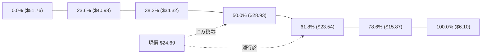

- **現價相對位置**：當前價格 **$24.69** 位於 **61.8% ($23.54)** 與 **50.0% ($28.93)** 回調區間內。
- **黃金分割意義解讀**：
  1. 股價在回調精確觸及 61.8%（$23.54）下方極端恐慌區後，迅速收復該線，證明 $23.54 具備極強的「黃金支撐」效應。
  2. 現價已成功站穩 61.8% 之上，技術面滿足「大波段深度回調後之有效企穩」。
  3. 上方第一回調阻力為 50.0% 關鍵心理關卡 **$28.93**，與阻力位 R1（$27.57）構成上行主要阻力緩衝區。

---

## 5. 技術指標深度解讀

### 🎛️ 指標訊號總覽

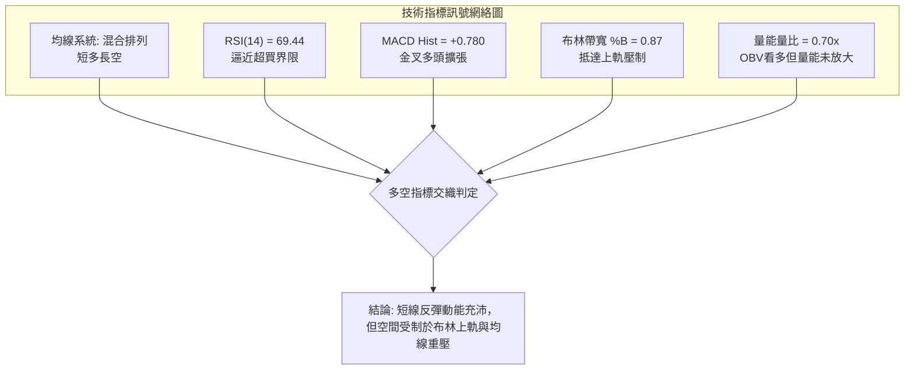

### 📈 移動平均線排列分析

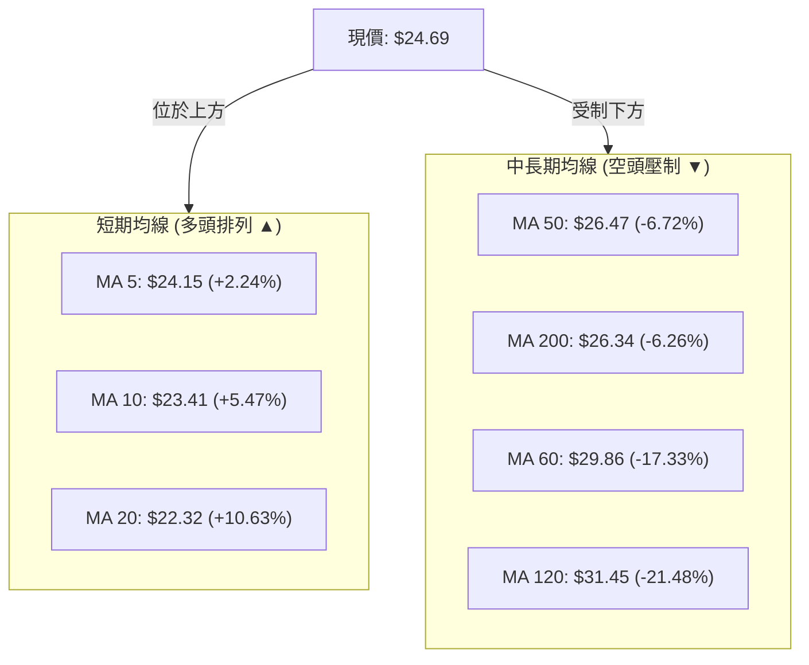

- **均線排列狀態**：當前呈現典型的「短均多頭排列（MA5 > MA10 > MA20）+ 中長均空頭壓制（MA50 < MA60 < MA120）」之**混合排列**。
- **交叉訊號解讀**：
  - 短天期 MA5/MA10/MA20 向上昂頭，提供短期下檔強固支撐（$22.32–$24.15）。
  - MA50 ($26.47) 與 MA200 ($26.34) 形成微幅「死亡交叉」死結壓制區，且價格尚未突破此區，中長期技術面仍屬修復格局。

### 📉 RSI(14) 分析

- **當前數值**：**69.44**（位於中性偏多上限）
- **數值進度條**：`[██████████████████░░]` 69.44%
- **超買超賣判斷**：
  - 數值逼近 70 超買警戒線。
  - 觀察近 20 週歷史：07-26 週 RSI 曾觸底 10.2（極端超賣），08-09 週修復至 58.0，最新週回升至 69.4，動能呈現 V 型復甦。
- **背離判斷**：
  - **底背離**：07-26 週價格 $20.47 (RSI 10.2) vs 08-02 週價格 $20.48 (RSI 25.6)，價格持平而 RSI 顯著墊高，構成標準**週線級別底背離**，此為本次反彈的核心動能來源。
  - **頂背離**：當前日線與週線均**無明顯頂背離**，反彈動能尚未衰竭，但逼近超買區需防範震盪。

### 📊 MACD(12/26/9) 訊號解讀

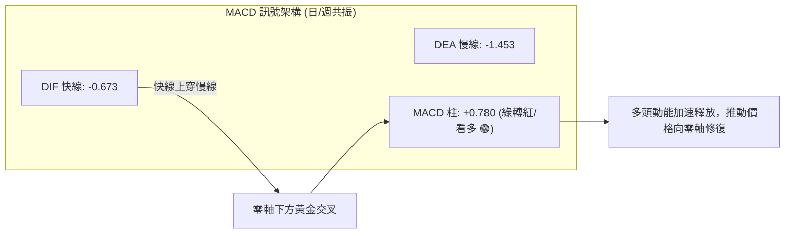

- **數據狀態**：DIF (-0.673) > DEA (-1.453)，柱狀圖值為 **+0.780**。
- **訊號解析**：週線 MACD 柱連續 3 週擴張（+0.032 → +0.682 → +0.780），顯示零下黃金交叉動能充沛，中短期空頭壓制正被逐步瓦解。

### 📦 布林通道分析

```
PL 日線布林通道 (Bollinger Bands) 位置示意圖
══════════════════════════════════════════════════════════════════
 $25.49 ─────── BB 上軌 (Upper Band)  ───────────────────────────
   ▲             
   │            ● 現價 $24.69 (BB %B = 0.87，逼近通道頂部)
   │
 $22.32 ─────── BB 中軌 / MA20 (Middle Band)  ──────────────────
   │
   │
   ▼
 $19.15 ─────── BB 下軌 (Lower Band)  ───────────────────────────
══════════════════════════════════════════════════════════════════
 通道帶寬 (Bandwidth) = ($25.49 - $19.15) / $22.32 = 28.4%
```

- **通道位置**：%B 為 **0.87**，表示股價運行於中軌至上軌的強勢區間頂端。
- **操作意涵**：觸及上軌 $25.49 易產生技術性回踩，但只要收盤不破中軌 MA20 ($22.32)，多頭通道格局維持完整。

### 💹 成交量分析（量價配合度）

- **最新成交量**：4,384,800 股
- **均量對比**：20 日均量 6,268,585 股（量比 0.70x）；50 日均量 11,534,000 股。
- **量價特徵**：
  - **量能萎縮反彈**：最新週成交量縮減至 23,523,100 股（相較 06 月破位週 100.6M 顯著萎縮），呈現「量縮價漲」之籌碼沉澱特徵。
  - **OBV 指標**：OBV 趨勢高於其均線，確認資金呈現淨流入格局，量能雖未爆發但基礎籌碼穩定。
  - **警示**：缺乏巨量配合代表追價意願謹慎，若欲向上突破 R1 ($27.57)，單日成交量需回升至 50 日均量（>11.5M）方能有效化解套牢盤。

---

## 6. 動能與波動率

### ⚡ 動能評估四象限

| 象限 | 動能維度 (RSI / MACD) | 波動維度 (ATR / Beta) | PL 當前狀態定位 | 策略指引 |
|------|----------------------|----------------------|----------------|----------|
| **Q1 (最佳擴張)** | 強動能 (MACD紅柱) | 低波動 (ATR壓縮) | — | 穩定加碼點 |
| **Q2 (震盪沉澱)** | 弱動能 (ADX<25) | 低波動 (量縮) | — | 區間高拋低吸 |
| **Q3 (強勢波動)** | **強動能 (MACD+0.78)** | **高波動 (Beta=2.12)** | **PL 處於此區 (✓)** | **高波段反彈，嚴設動態止損** |
| **Q4 (恐慌出逃)** | 弱動能 (超賣破位) | 高波動 (恐慌拋售) | — (已於07月脫離) | 避免進場 |

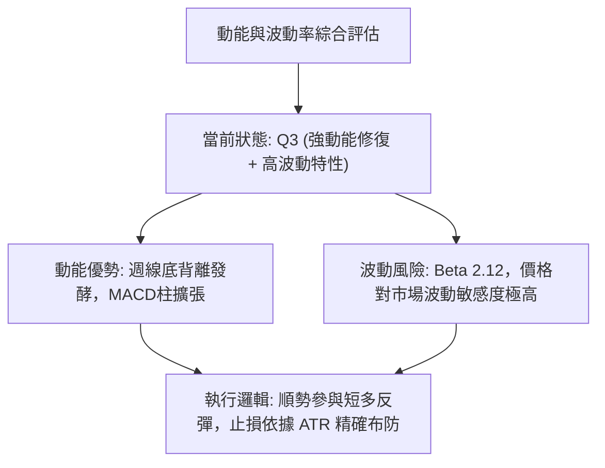

### 📊 ATR 波動率分析

- **ATR(14) 數值**：**$1.46**
- **波動率佔比**：佔當前股價之 **5.89%**（每日預期波幅達 ±$1.46）。
- **止損與風控參數設定**：
  - **短線緊密止損 (1.0 × ATR)**：$24.69 - $1.46 = **$23.23**（位於 S1 $23.66 下方，防止假跌破）。
  - **波段標準止損 (1.5 × ATR)**：$24.69 - ($1.46 × 1.5) = **$22.50**（貼近 MA20 $22.32 防守）。
  - **最大容忍止損 (2.0 × ATR)**：$24.69 - ($1.46 × 2.0) = **$21.77**。

### 📐 Beta 與市場相關性

- **Beta 係數**：**2.123**
- **市場特徵解析**：
  - 屬於典型**高貝塔、高彈性**之成長型太空科技/工業板塊標的。
  - 當標普 500 或納斯達克指數變動 1.0% 時，PL 理論波動幅度達 2.12%。
  - 在大盤多頭反彈背景下具備顯著超額收益潛力（Alpha）；但在市場回調時需承擔加倍下行風險。

---

## 7. 多時框架總結

### 📋 時框架評分表

| 時框架 | 趨勢方向 | 動能狀態 | 均線排列 | 形態結構 | 綜合評分 | 操作建議 |
|--------|----------|----------|----------|----------|----------|----------|
| **月線 (長期)** | 🟡 寬幅震盪 | RSI 偏中性，高點回落企穩 | 位於 MA240 ($23.96) 之上 | 巨型牛旗回調至 Fib 61.8% | 60/100 | 長線具備估值修復價值 |
| **週線 (中期)** | 🟢 築底回升 | MACD 連續3週擴張，底背離 | 承壓於 MA50/MA200 下方 | 雙底雛形 (W-Bottom) | 62/100 | 波段多頭持股，目標看頸線 |
| **日線 (短期)** | 🟡 衝高受阻 | RSI=69.44 / Stoch超買 | 短多排列 (MA5>10>20) | 貼近布林上軌 $25.49 | 52/100 | 嚴禁追高，等待回踩進場 |

### 🔲 綜合訊號矩陣

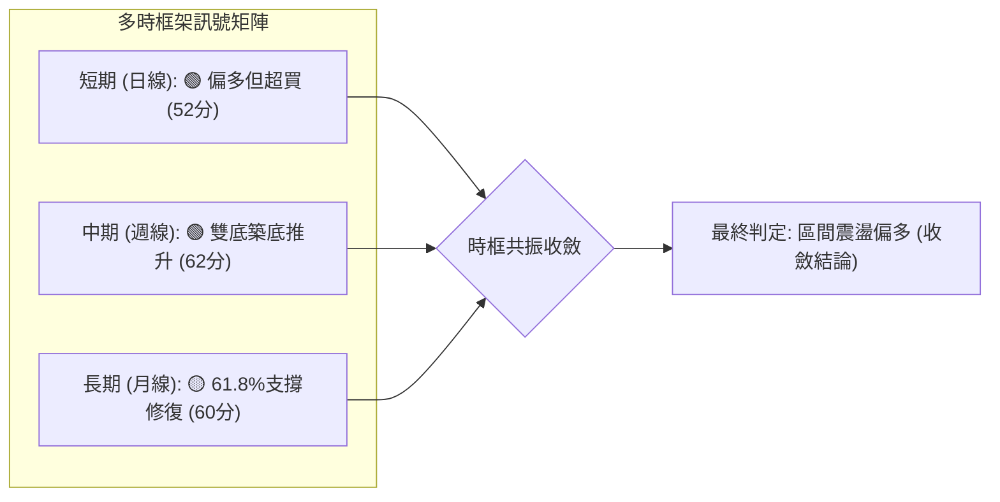

### ⚖️ 多時框收斂結論

依據多時框收斂規則：
1. **行情模式判斷**：ADX(14) 為 **23.48 (<25)**，技術面嚴格定義為**盤整行情（震盪市）**，而非單邊趨勢市。
2. **主導維度確立**：在盤整行情中，日線布林通道上下軌（$19.15–$25.49）與中長期均線（MA50 $26.47 / MA200 $26.34）構成主交易區間。
3. **衝突收斂**：日線短多動能強勁但逼近布林上軌，週線具備雙底反彈結構但受阻於 R1 ($27.57)。綜合收斂方向確立為**唯一結論：偏多區間震盪反彈**。交易主軸為「利用回踩支撐做多，於阻力位階梯獲利了結」，與第 8 章主策略完全一致。

---

## 8. 交易策略建議

### 🗺️ 策略決策流程圖

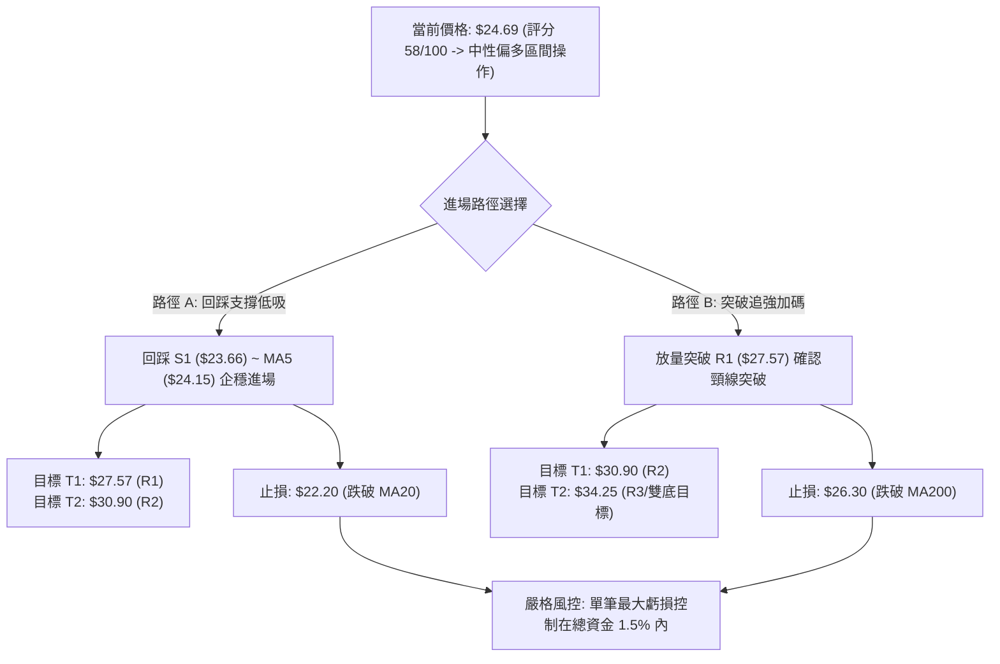

### 🧭 策略路由

> **當前主策略方向 = 中性偏多反彈（依綜合技術評分 58/100 確立為區間回踩做多主策略）**

### 🎯 價格情境階梯（Price Scenarios）

| 觸發條件 | 下一目標 | 後續延伸 | 情境含義與操作指引 |
|----------|----------|----------|-------------------|
| **放量突破 R1 ($27.57)** | R2 ($30.90) | R3 ($34.25) | 突破 MA50/MA200 壓制，雙底頸線成形，波段主升展開 |
| **站穩現價區間 ($23.66–$25.49)** | R1 ($27.57) | — | 消化布林上軌與超買壓力，維持緩步墊高格局 |
| **跌破 S1 ($23.66)** | S2 ($19.98) | S3 ($19.16) | 短線反彈夭折，重回雙底尋求二次回踩確認 |

### 📊 情境機率分佈

| 情境劇本 | 估計機率 | 主要技術依據 |
|----------|----------|--------------|
| **延續反彈挑戰 R1** | **55%** | MACD 柱連續 3 週擴張 (+0.780)，OBV 維持多頭，站穩 Fib 61.8% |
| **區間震盪整理** | **30%** | ADX=23.48 缺乏單邊推力，RSI 逼近超買，量能萎縮 (0.70x) 需要籌碼換手 |
| **回落探底 S2** | **15%** | 遭遇布林上軌與 MA50 重壓，若大盤重挫可能引發高 Beta 拋壓 |

### 🟢 主策略詳情（方向：偏多區間操作）

| 策略要素 | 策略 A（回踩低吸 — 穩健型） | 策略 B（突破追強 — 動能型） |
|----------|----------------------------|----------------------------|
| **進場條件** | 股價回踩 S1 / MA20 獲得支撐時介入 | 日線放量（成交量>10M）實體突破 R1 |
| **進場價格** | **$23.70**（S1 $23.66 上方） | **$27.60**（突破 R1 $27.57 後確認） |
| **目標價 T1** | **$27.57**（阻力 R1 / +16.33%） | **$30.90**（阻力 R2 / +11.96%） |
| **目標價 T2** | **$30.90**（阻力 R2 / +30.38%） | **$34.25**（阻力 R3 / +24.09%） |
| **止損價格** | **$22.20**（跌破 MA20 $22.32 / -6.33%） | **$26.30**（跌破 MA200 $26.34 / -4.71%） |
| **風險報酬比 (R:R)** | **1 : 2.58**（以 T1 計） / **1 : 4.80**（T2） | **1 : 2.54**（以 T1 計） / **1 : 5.11**（T2） |
| **預估勝率** | **65%** | **55%** |
| **建議倉位** | 總投資資金之 **10%–15%** | 總投資資金之 **5%–8%** |

### 🔴 反向風險觸發點（對沖提示）

若出現以下訊號，主多頭策略宣告失效，應立即停損或建立避險空單：
1. **實體跌破 S1 ($23.66)** 且收盤跌破 MA20 ($22.32)，代表短多動能瓦解。
2. **週線跌破雙底防線 S2 ($19.98)**，技術形態將演化為下行中繼，下看 52W 低點 $6.10 方向。

### ⭐ 整體訊號強度評星

```
╔══════════════════════════════════════════════════════════════╗
║ 做多訊號強度：★★★☆☆  (3.5/5星 — 底背離反彈，但受制均線重壓) ║
║ 做空訊號強度：★★☆☆☆  (2.0/5星 — 跌勢趨緩，空頭動能衰退)     ║
║ 整體可信度：  ★★★★☆  (4.0/5星 — 多時框指標收斂性良好)       ║
╚══════════════════════════════════════════════════════════════╝
```

---

## 9. 風險提示與監控

### ✅ 關鍵監控指標 Checklist

```
╔══════════════════════════════════════════════════════════════╗
║             PL 核心技術監控清單 (Trading Checklist)          ║
╠══════════════════════════════════════════════════════════════╣
║ [ ] 價位防守：每日收盤價是否守穩 S1 ($23.66) 與 MA20 ($22.32)  ║
║ [ ] 均線突破：日線是否成功收復 MA50 ($26.47) 與 MA200 ($26.34)║
║ [ ] 動能監控：RSI(14) 突破 70 後是否出現量價頂背離          ║
║ [ ] 量能驗證：挑戰 R1 ($27.57) 時單日成交量是否放大至 >10M 股║
║ [ ] 通道狀況：布林通道帶寬是否開始擴張（突破震盪區間）       ║
║ [ ] 大盤關聯：Beta=2.12 下，標普/納指是否出現系統性回調風險   ║
╚══════════════════════════════════════════════════════════════╝
```

### ⚠️ 風險場景分析

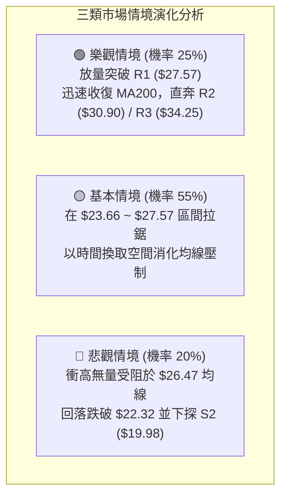

### 🛡️ 風險管理重要提醒

1. **高 Beta 波動控制**：PL 的 Beta 值高達 **2.123**，每日 ATR 波動佔比達 **5.89%**。在持倉過程中嚴禁使用高槓桿，單筆交易的最大止損虧損金額務必嚴格限制在總帳戶淨值的 **1.0%–1.5%** 以內。
2. **財報與基本面空窗期**：Planet Labs 當前處於營收高成長（YoY +42.1%）但淨利潤率仍為負值（-111.2%）之階段，雖然具備 $242.80M 之淨現金緩衝，但股價極易受市場流動性與防禦情緒衝擊。
3. **分批止盈紀律**：當股價抵達第一目標位 R1（$27.57）時，建議至少減倉 **50%** 並將剩餘部位之止損價上移至保本點（進場價），鎖定波段利潤以防高檔震盪洗盤。

---

## 📋 報告總結

```
╔══════════════════════════════════════════════════════════════════╗
║                   PL 技術分析報告總結 (Executive Summary)       ║
╠══════════════════════════════════════════════════════════════════╣
║ 報告日期：2026-08-16                                            ║
║ 當前價格：$24.69                                                ║
║ 分析評級：⚖️ 區間震盪偏多反彈（綜合評分：58/100）                ║
║                                                                  ║
║ 關鍵技術結論：                                                   ║
║ ├─ 長期趨勢：🟡 巨型回調企穩於黃金分割 61.8% ($23.54) 之上       ║
║ ├─ 中期趨勢：🟢 週線雙底雛形確立 ($20.47 / $20.48)，MACD 柱翻紅 ║
║ ├─ 短期趨勢：🟡 短均多頭但日線 RSI(69.44) 逼近超買與布林上軌    ║
║ ├─ 關鍵支撐：S1: $23.66 ｜ S2: $19.98 ｜ S3: $19.16              ║
║ ├─ 關鍵阻力：R1: $27.57 ｜ R2: $30.90 ｜ R3: $34.25              ║
║ └─ 分析師共識目標：均價 $40.10（區間 $25.00 - $53.00）           ║
║                                                                  ║
║ 最優策略組合：                                                   ║
║ 1. 🥇 最佳機會：策略 A — 回踩 S1 ($23.70) 進場，目標 R1/R2，    ║
║                 止損 $22.20 (風報比 1:2.58 ~ 1:4.80)             ║
║ 2. 🥈 次選機會：策略 B — 放量突破 R1 ($27.60) 追強，目標 R3     ║
║                 止損 $26.30 (風報比 1:2.54)                     ║
║ 3. 🥉 保守選擇：等待股價回踩 MA20 ($22.32) 附近縮量企穩再行布局  ║
╚══════════════════════════════════════════════════════════════════╝
```

---

> ⚠️ **免責聲明**：本報告為 AI 自動生成之技術分析，所有數據及估算均基於提供的歷史價格資訊。本報告**僅供研究與學術參考**，**不構成任何投資建議**。投資有風險，入市需謹慎。

---

*報告生成時間：2026-08-16 ｜ 數據來源：Yahoo Finance ｜ 分析框架：多時框技術分析*