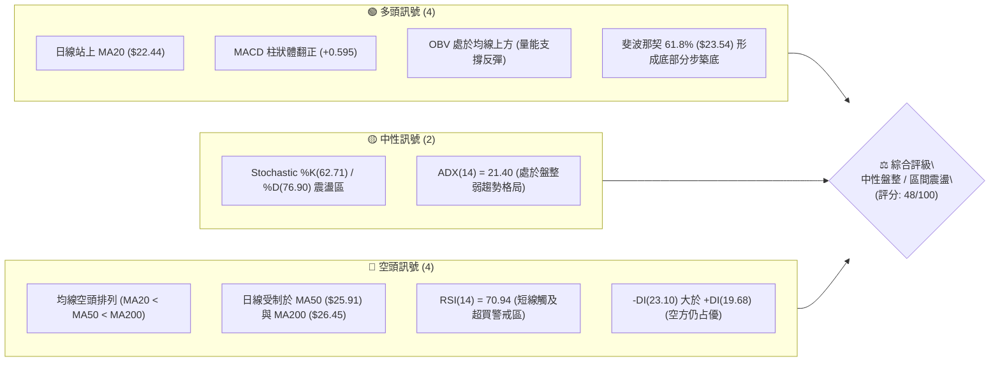
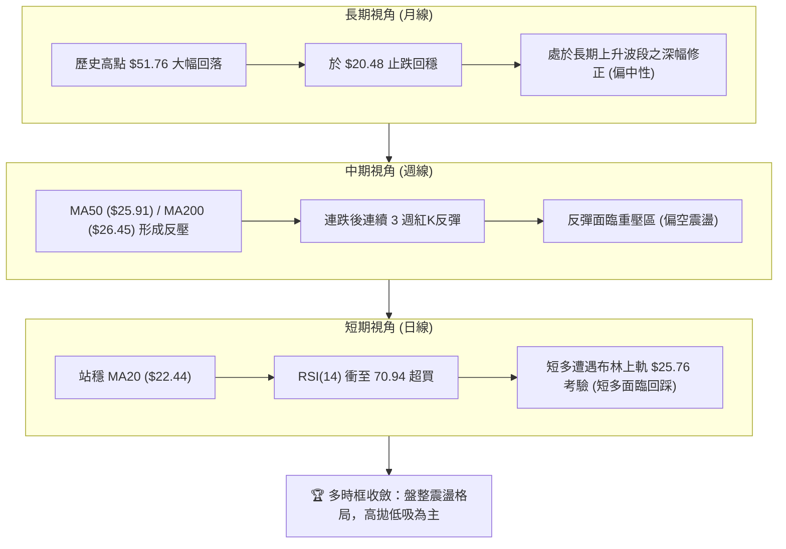
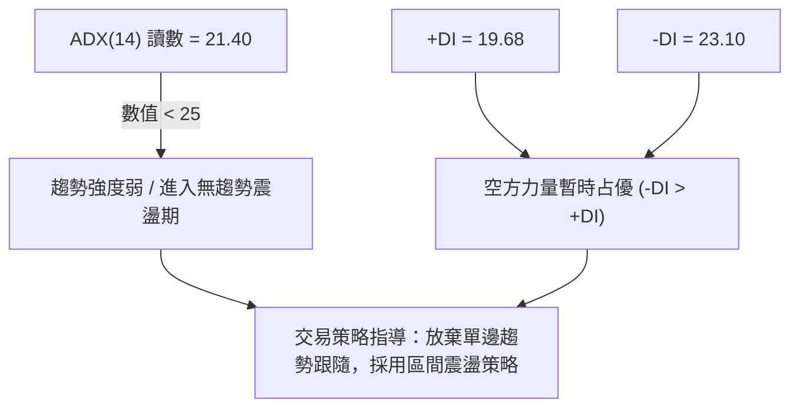
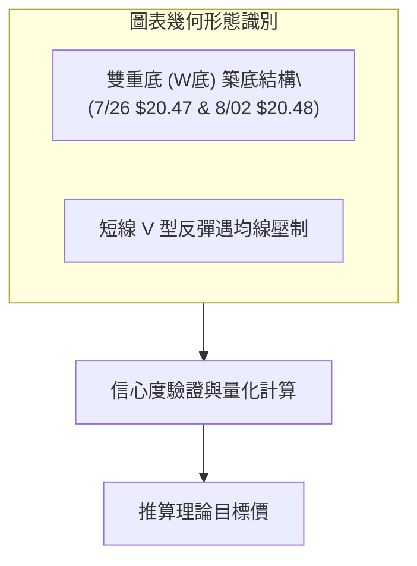
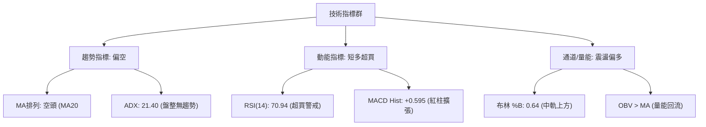
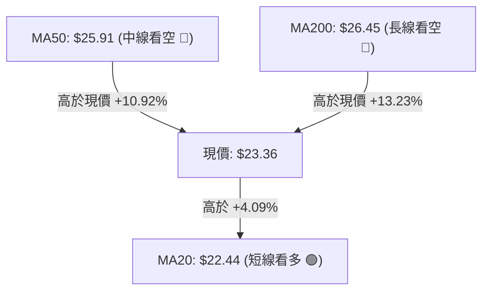
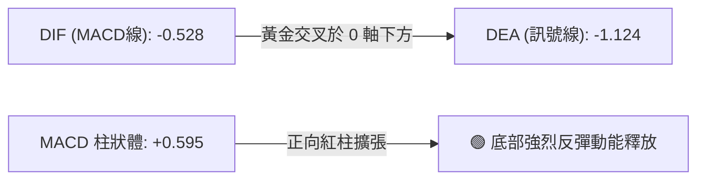
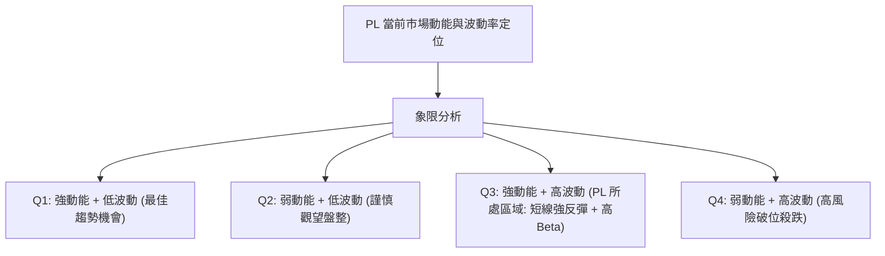
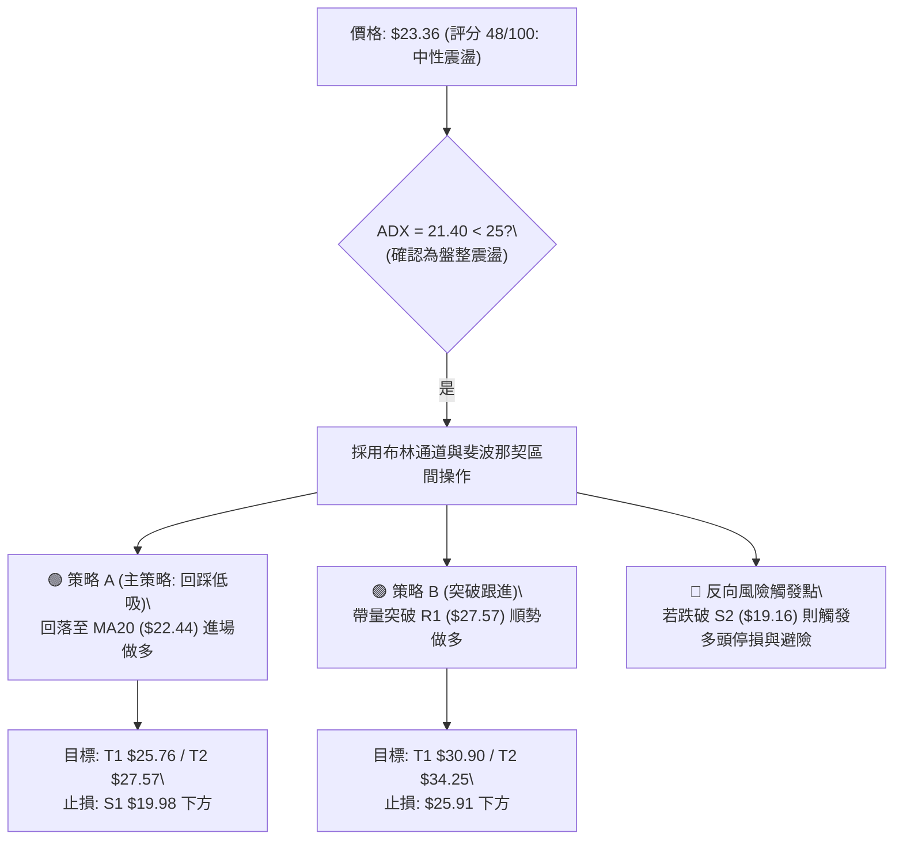
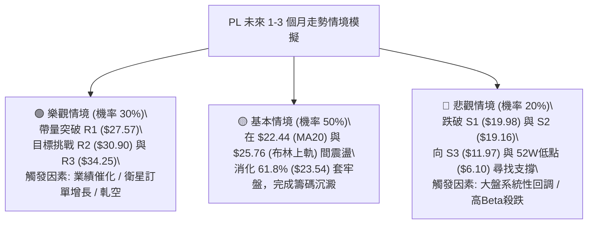

# PL 技術分析報告

> **報告日期**：2026-08-18 ｜ **語言**：繁體中文 ｜ **數據來源**：Yahoo Finance ｜ **當前價格**：$23.36

---

## 目錄

| 章節 | 內容 |
|------|------|
| [1. 技術面概覽](#1-技術面概覽) | 訊號儀表板、核心指標、評分卡 |
| [2. 趨勢分析](#2-趨勢分析) | 多時框趨勢、長中短期走勢、ADX解讀 |
| [3. 圖表形態分析](#3-圖表形態分析) | 形態識別、信心度評估、K線組合、目標價推算 |
| [4. 支撐與阻力](#4-支撐與阻力) | 關鍵價位結構、斐波那契回調精確分析 |
| [5. 技術指標深度解讀](#5-技術指標深度解讀) | 均線系統、RSI/MACD、布林通道與量能OBV |
| [6. 動能與波動率](#6-動能與波動率) | 動能四象限、ATR波動率、Beta值風險解構 |
| [7. 多時框架總結](#7-多時框架總結) | 時框架評分矩陣、多時框收斂定調 |
| [8. 交易策略建議](#8-交易策略建議) | 策略路由、情境階梯、主策略詳情與風控 |
| [9. 風險提示與監控](#9-風險提示與監控) | 監控清單、情境模擬與倉位管理提醒 |

---

## 1. 技術面概覽

### 🎯 技術訊號儀表板



---

### 📊 核心指標速覽表

| 指標類別 | 指標名稱 | 當前數值 | 訊號 | 技術解讀 |
|:---|:---|:---|:---:|:---|
| **價格** | 當前收盤價 | **$23.36** | 🟡 | 位於52週區間 37.8% 處，反彈至斐波那契 61.8% ($23.54) 關鍵防線邊緣 |
| **均線** | 短期 MA20 | **$22.44** | 🟢 | 現價高於 MA20 (+4.09%)，短線反彈動能延續 |
| **均線** | 中期 MA50 | **$25.91** | 🔴 | 現價低於 MA50 (-9.84%)，中期反彈首要強阻力密集區 |
| **均線** | 長期 MA200 | **$26.45** | 🔴 | 現價低於 MA200 (-11.68%)，中長期牛熊分水嶺壓制 |
| **均線結構** | 均線系統排列 | **MA20 < MA50 < MA200** | 🔴 | 典型空頭排列，中長期趨勢尚未正式扭轉 |
| **動能** | RSI(14) | **70.94** | 🔴 | 進入超買臨界區間，短線連續上攻後面臨獲利回吐壓力 |
| **動能** | MACD (12,26,9) | **-0.528 / -1.124** | 🟢 | MACD 線黃金交叉訊號線，柱狀體 +0.595 持續擴張看多 |
| **趨勢強度**| ADX (14) | **21.40** | 🟡 | ADX < 25 指標顯示無強趨勢，市場定調為區間盤整震盪 |
| **通道指標**| 布林通道 (%B) | **%B = 0.64** | 🟡 | 位於中軌 ($22.44) 與上軌 ($25.76) 之間，偏向多頭試探上軌 |
| **成交量能**| 20日均量比 | **0.72x (4.35M / 6.04M)** | 🔴 | 反彈過程量能略顯不足，呈現量價背離隱憂 |
| **量能趨勢**| OBV (能量潮) | **OBV > MA** | 🟢 | 資金流向回暖，量能維持在均線之上支撐短線反彈 |
| **波動率** | ATR (14) | **$1.39 (5.94%)** | 🟡 | 每日平均波幅適中，具備波段操作空間 |

---

### 🏆 技術評分卡

```
╔══════════════════════════════════════════════════════════════════╗
║                技術評分卡 — PL (2026-08-18)                      ║
╠══════════════════════════════════════════════════════════════════╣
║ 趨勢強度 (ADX/DMI)   █████░░░░░░░░░░░░░░░  32/100  🔴 弱勢盤整    ║
║ 動能指標 (RSI/MACD)  ████████████░░░░░░░░  60/100  🟢 短多但超買  ║
║ 支撐穩定度 (Support) ████████████░░░░░░░░  58/100  🟡 S1有守      ║
║ 成交量配合 (OBV/Vol) █████████░░░░░░░░░░░  45/100  🟡 量能略縮    ║
║ 形態完整度 (Pattern) ██████████░░░░░░░░░░  50/100  🟡 區間築底    ║
║ 均線排列 (MA System) ████████░░░░░░░░░░░░  40/100  🔴 空頭排列    ║
╠══════════════════════════════════════════════════════════════════╣
║ 綜合技術評分         █████████░░░░░░░░░░░  48/100  ⚖️ 區間震盪   ║
╚══════════════════════════════════════════════════════════════════╝
```

---

## 2. 趨勢分析

### 🌐 多時框趨勢分析



---

### 📈 長期趨勢 — 12個月走勢圖（Unicode）

```
PL 月線走勢圖（過去12個月：2025-09 至 2026-08）
價格軸 ($)
$52 ┤                                                 ● (2026-05 $51.14 / 高點$51.76)
$48 ┤                                               ╱   ╲
$44 ┤                                              ╱     ╲
$40 ┤                                             ╱       ╲
$36 ┤                                   ● (04 $36.97)      ╲
$32 ┤                                  ╱                    ● (2026-06 $33.13)
$28 ┤                         ● (03 $27.95)                  ╲
$24 ┤              ● (01 $24.97) ─── ● (02 $24.14)            ╲           ● 現價 $23.36
$20 ┤          ● (12 $19.72)                                   ● (07 $20.48)
$16 ┤          ╱
$12 ┤● (09 $12.98) ─ ● (10 $13.45) ─ ● (11 $11.90)
    └─────────────────────────────────────────────────────────────────────────────
     25-09   25-10   25-11   25-12   26-01   26-02   26-03   26-04   26-05   26-06   26-07   26-08
```

#### 走勢特徵分析表格

| 階段區間 | 時間跨度 | 起訖收盤價 | 漲跌幅 | 主要技術特徵與驅動因素 |
|:---|:---|:---|:---:|:---|
| **第一階段：底部築底盤整** | 2025-09 ~ 2025-11 | $12.98 → $11.90 | -8.32% | $12.00 附近窄幅整理，完成籌碼換手 |
| **第二階段：主升浪爆發** | 2025-12 ~ 2026-05 | $19.72 → $51.14 | **+159.33%** | 連續5個月強勁上攻，創下52週新高 $51.76 |
| **第三階段：深幅回撤釋放** | 2026-06 ~ 2026-07 | $51.14 → $20.48 | **-59.95%** | 兩月內回吐超過六成漲幅，快速宣洩獲利盤 |
| **第四階段：觸底技術反彈** | 2026-08 (當前) | $20.48 → $23.36 | **+14.06%** | 在 S1 ($19.98) / S2 ($19.16) 獲得支撐回升 |

---

### 📊 中期趨勢（週線分析）

中期走勢自 2026 年 5 月底見頂 $51.76 後出現巨量殺跌（2026-06-07 單週成交 1.006 億股）。然而，近三週成交量逐步萎縮至 23.53M 與 9.04M，顯示殺跌動能枯竭，週線 MACD 柱狀圖由 -1.972 快速回升至 +0.595，暗示中期下行趨勢已轉為橫盤築底。

```
PL 近期週線關鍵壓力與支撐示意圖
阻力區 2 ─────── $30.90 (R2 阻力區 / MA60 $29.24)
阻力區 1 ─────── $25.91 (MA50) / $26.45 (MA200) / $27.57 (R1)
現價位 ═════════ $23.36 ◄ (斐波那契 61.8% 回調位 $23.54)
支撐區 1 ─────── $22.44 (MA20 / 布林中軌)
支撐區 2 ─────── $19.98 (S1) / $19.16 (S2) / $19.13 (布林下軌)
```

---

### ⚡ 趨勢強度評估（ADX 解讀）



#### ADX 與 DMI 強度對照表

| 指標名稱 | 當前讀數 | 門檻標準 | 狀態評估 | 戰術含義 |
|:---|:---:|:---:|:---:|:---|
| **ADX(14)** | **21.40** | < 25: 弱趨勢/震盪<br>25-50: 強趨勢<br>> 50: 極強趨勢 | 🟡 弱趨勢/盤整 | 市場處於無方向盤整，均線易反覆糾纏，不宜追漲殺跌 |
| **+DI (多方)** | **19.68** | > 20 為多方活躍 | 🔴 偏弱 | 多頭買盤力道尚不足以發動持續性主升浪 |
| **-DI (空方)** | **23.10** | > 20 為空方活躍 | 🟡 溫和主導 | 空方雖主導但已跌破 25 強空門檻，拋壓已大幅減弱 |

---

## 3. 圖表形態分析

### 🔍 形態識別系統



#### 形態信心度與目標價評估表

| 形態名稱 | 信心度 | 判斷依據（引用數據） | 完成度 | 理論目標價（附計算式） |
|:---|:---:|:---|:---:|:---|
| **短週期雙底 (W-Bottom)** | **65%** | 2026-07-26 低點 $20.47 與 2026-08-02 低點 $20.48 形成雙底，且高於支撐 S1 ($19.98) | 75% | 頸線 $24.69 - 底部 $20.48 = $4.21。<br>目標價 = $24.69 + $4.21 = **$28.90**（剛好貼合 50% 回調位 $28.93） |
| **布林通道中軌突破形態** | **70%** | 價格由下軌 ($19.13) 反彈並連續站上中軌 ($22.44) | 85% | 目標價為布林通道上軌 = **$25.76** |
| **大型頭肩頂（反轉形態）** | **40%** | 2026-05 見頂後暴跌，但當前已完成深幅回調並止跌，形態已進入後期修復階段 | 100% (已完成) | 訊號不足以繼續向下測距，僅做指標型超跌解讀 |

---

### 🕯️ 重要K線形態分析

| 週期/日期 | 收盤價 | K線形態 | 技術解讀 | 訊號 |
|:---|:---:|:---|:---|:---:|
| **2026-07-26 (週)** | $20.47 | **長下影錘頭線 (Hammer)** | RSI 跌至 10.2 極度超賣，低檔爆量承接，確認 $20.47 堅固底部 | 🟢 |
| **2026-08-09 (週)** | $23.93 | **大陽線突破 (Bullish Breakout)** | 單週大漲 +16.8%，收復 MA20，週線 MACD 柱狀體翻正至 +0.682 | 🟢 |
| **2026-08-16 (週)** | $24.69 | **上影十字星 (Doji Star)** | 衝高遭遇 MA50 ($25.91) 心理關卡壓制，短線多空產生分歧 | 🟡 |
| **2026-08-23 (最新)** | $23.36 | **小陰線回踩 (Pullback)** | 正常技術性回調，測試斐波那契 61.8% ($23.54) 與 MA20 支撐 | 🟡 |

---

### 📉 ASCII 走勢形態示意圖

```
PL 雙底形態與均線阻力結構圖
  價格 ($)
  $28.93 ──────────────────────────────────────── 斐波那契 50.0% / 形態理論目標價 $28.90
  $27.57 ──────────────────────────────────────── 關鍵阻力 R1
  $26.45 ──────────────────────────────────────── MA200
  $25.91 ──────────────────────────────────────── MA50 / 近期頸線阻力區 ($24.69-$25.91)
  $24.69 ─────────────────────── 頸線高點 ● (08/16)
                                 ╱     ╲
  $23.36 ═══════════════════════╱═══════● 現價 ($23.36) ◄ 61.8% 回調位 ($23.54)
                               ╱
  $22.44 ─────────────────────● (MA20 / 布林中軌支撐)
                            ╱   ╲
  $20.48 ────────── 底1 ● (07/26 $20.47) ── 底2 ● (08/02 $20.48) ◄ 雙底結構完成
                   (S1: $19.98 / S2: $19.16)
```

---

## 4. 支撐與阻力

### 🗺️ 關鍵價位分布圖（Unicode）

```
PL 價位結構分布圖
═══════════════════════════════════════════════════════════════════
$34.25 ║██████████████████████████████║ 強阻力 R3 (斐波那契 38.2% $34.32 疊合)
$30.90 ║██████████████████████        ║ 阻力 R2 (MA60 $29.24 上方阻力)
$27.57 ║██████████████████████████████║ 關鍵阻力 R1 (MA200 $26.45 與 MA50 $25.91 密集群)
═══════╬══════════════════════════════╬════════════════════════════
$25.76 ║░░░░░░░░░░░░░░░░░░░░░░░░      ║ 布林通道上軌
$23.54 ║▓▓▓▓▓▓▓▓▓▓▓▓▓▓▓▓▓▓▓▓▓▓▓▓▓▓▓▓  ║ 斐波那契 61.8% 回調位
$23.36 ╠══════════════════════════════╣ ◄ 現價 ($23.36)
$22.44 ║▓▓▓▓▓▓▓▓▓▓▓▓▓▓▓▓▓▓            ║ MA20 動態支撐 / 布林中軌
═══════╬══════════════════════════════╬════════════════════════════
$19.98 ║████████████████████          ║ 近期波段支撐 S1 (雙底頸線下方防禦點)
$19.16 ║██████████████████████████████║ 強支撐 S2 (布林下軌 $19.13 疊合)
$11.97 ║██████████████████████████████║ 歷史強支撐 S3 (2025年起漲平台)
═══════════════════════════════════════════════════════════════════
```

---

### 🚧 阻力位分析表

| 阻力級別 | 精確價位 | 距離現價 | 形成原因與技術重疊 | 突破難度 | 重要性評級 |
|:---|:---:|:---:|:---|:---:|:---:|
| **阻力 R1** | **$27.57** | +18.02% | 近一年波段高點聚類；上方緊鄰 MA200 ($26.45) 及 MA50 ($25.91) 重合壓制 | 🔴 極高 | 🟢🟢🟢 (關鍵生命線) |
| **阻力 R2** | **$30.90** | +32.27% | 近一年成交密集套牢區高點；MA120 ($31.43) 位於其附近 | 🟡 高 | 🟢🟢 (中期多頭目標) |
| **阻力 R3** | **$34.25** | +46.62% | 近一年大型籌碼套牢頂部；與斐波那契 38.2% ($34.32) 形成共振強壓 | 🔴 極高 | 🟢 (長期反轉目標) |

---

### 🛡️ 支撐位分析表

| 支撐級別 | 精確價位 | 距離現價 | 形成原因與技術重疊 | 守住機率 | 重要性評級 |
|:---|:---:|:---:|:---|:---:|:---:|
| **動態支撐** | **$22.44** | -3.94% | 20日移動平均線 (MA20) 與布林通道中軌重合位 | 70% | 🟢🟢 (短線防守線) |
| **支撐 S1** | **$19.98** | -14.47% | 近一年波段低點聚類；2026年7-8月雙底結構底部防禦區間 | 80% | 🟢🟢🟢 (多頭最後底線) |
| **支撐 S2** | **$19.16** | -17.98% | 近一年波段低點聚類；與布林通道下軌 ($19.13) 形成黃金共振支撐 | 85% | 🟢🟢🟢 (極強防禦牆) |
| **支撐 S3** | **$11.97** | -48.76% | 2025年四季度牛市起漲起點之結構平台聚類低點 | 95% | 🟢 (極限終極支撐) |

---

### 📐 斐波那契回調位分析

依據 52 週極值區間（低點 **$6.10** → 高點 **$51.76**，波幅 **$45.66**）之精確回調位計算：

```
斐波那契回調位階梯 (52W Range: $6.10 → $51.76)
  0.0%  (52W High)   $51.76  ═════════════════════════════════════ 牛市最高點
 23.6%               $40.98  ───────────────────────────────────── 第一深層阻力
 38.2%               $34.32  ───────────────────────────────────── 與 R3 ($34.25) 共振
 50.0%               $28.93  ───────────────────────────────────── 中樞分水嶺
 61.8% (黃金分割)    $23.54  ◄ 現價 $23.36 緊貼於此 (關鍵爭奪點)
 78.6%               $15.87  ───────────────────────────────────── 深度回調防線
100.0%  (52W Low)    $ 6.10  ═════════════════════════════════════ 歷史起漲點
```

- **位置解讀**：現價 **$23.36** 剛好緊貼於 **61.8% 黃金回調位 ($23.54)**。技術分析理論中，61.8% 乃牛市回調之極限健康防線，此處能否有效站穩，決定了 PL 屬於「長期牛市正常回踩」還是「轉入長期熊市」。目前股價在此展開爭奪，多空在此陷入勢均力敵的盤整。

---

## 5. 技術指標深度解讀

### 🎛️ 指標訊號總覽



---

### 📈 移動平均線排列分析



#### 完整移動平均線矩陣

| 均線名稱 | 數值 | 偏離率 | 走勢方向 | 技術意涵 |
|:---|:---:|:---:|:---:|:---|
| **MA 5** | **$24.34** | -4.01% | 走平回落 | 短線極速拉升後的微幅休整，跌破 MA5 進入短線整理 |
| **MA 10** | **$23.75** | -1.63% | 向上發散 | 短線多頭護航線，現價貼近 MA10 尋找支撐 |
| **MA 20** | **$22.44** | **+4.09%** | 向上揚升 | 站穩 20 日線，確立短線自 $20.48 以來的反彈架構 |
| **MA 50** | **$25.91** | -9.84% | 向下傾斜 | 中期第一道關鍵空頭防線，空方主要防守陣地 |
| **MA 60** | **$29.24** | -20.11% | 向下傾斜 | 中期波段重壓，與 R2 ($30.90) 形成雙重阻力 |
| **MA 120** | **$31.43** | -25.68% | 向下傾斜 | 半年線下行壓制，代表半年內套牢籌碼沉重 |
| **MA 200** | **$26.45** | -11.68% | 走平向下 | 長期牛熊分界線，未收復前不宜盲目宣告長期反轉 |
| **MA 240** | **$24.10** | -3.07% | 持平微升 | 年線位置就在現價上方不遠處，構成短中期過渡帶阻力 |

---

### 📉 RSI(14) 分析

- **當前讀數**：`70.94` 🔴 **短線超買**
- **進度條展示**：
```
超賣區 (0-30)          中性平衡區 (30-70)          超買區 (70-100)
░░░░░░░░░░░░░░░░░░░░░░░▓▓▓▓▓▓▓▓▓▓▓▓▓▓▓▓▓▓▓▓▓▓▓▓▓▓▓▓▓█░░░░░░░░░░░░░░░░
0                     30                    70 ▲ 100
                                           (70.94)
```
- **超買超賣與背離判定**：
  - **背離診斷**：經比對 2026-07-26 低點 $20.47（RSI=10.2）至當前 $23.36（RSI=70.94），價格創反彈新高，RSI 亦創反彈新高，**「無明顯頂背離或底背離」**。
  - **指標結論**：RSI 突破 70 警戒線，顯示短線買盤力量達到極致，但在大趨勢為盤整弱勢（ADX=21.40）的情況下，RSI > 70 往往引發短線獲利盤回吐，技術上需要 1-3 天的回踩消化。

---

### 📊 MACD(12/26/9) 訊號解讀



- **MACD 線**：`-0.528`
- **Signal 訊號線**：`-1.124`
- **Histogram 柱狀圖**：`+0.595`（正值擴張）
- **解讀**：MACD 在 0 軸下方出現低位黃金交叉，且柱狀體連續多日擴張（+0.595），代表底部買盤動能正在積聚。然而，由於雙線依然處於 0 軸下方，本質上仍定義為「零軸下方的超跌反彈」，唯有 DIF 向上有效突破 0 軸，方能確認全面由空翻多。

---

### 📦 布林通道分析

```
PL 日線布林通道結構示意圖 (Bandwidth: 寬幅震盪)
  $25.76 ┬────────────────────────────────────────── 布林上軌 (阻力區)
         │                                   
  $23.36 ┼─────────────────────────● 現價 (%B = 0.64，位於中上軌區間)
         │                                   
  $22.44 ┼────────────────────────────────────────── 布林中軌 (MA20 動態支撐)
         │                                   
  $19.13 ┴────────────────────────────────────────── 布林下軌 (強支撐 S2 疊合區)
```

- **當前布林參數**：上軌 **$25.76** ｜ 中軌 **$22.44** ｜ 下軌 **$19.13**
- **%B 指標**：`0.64`（介於 0.5 到 1.0 之間，多方佔優）
- **通道走勢**：布林通道上下軌開口維持寬幅（帶寬約 $6.63，佔股價 28%），目前價格從下軌反彈穿過中軌，正在朝上軌 $25.76 試探。在上軌未被帶量突破前，股價極高機率將在 **$19.13 - $25.76** 的布林箱體內維持區間震盪。

---

### 💹 成交量分析（量價配合度）

- **當前成交量**：4,349,386 股
- **20日平均量**：6,039,189 股（量比 **0.72x**）
- **50日平均量**：10,518,440 股
- **OBV 能量潮**：`OBV > MA` 🟢
- **量價診斷**：
  1. **短線量能背離**：現價自 $20.48 反彈至 $23.36 過程中，成交量由 3,822 萬股/週逐步萎縮至最新 904 萬股/週，日均量比僅 0.72x，顯示追高意願不足，呈現典型的「縮量反彈」特徵。
  2. **OBV 資金沉澱**：OBV 維持在均線上方，顯示主力機構在 $20.00 附近的建倉籌碼並未在大跌中出逃，機構持股比例仍高達 85.2%，量能結構支持底部震盪築底，但不支援立即發動突破性暴漲。

---

## 6. 動能與波動率

### ⚡ 動能評估四象限



| 象限分佈 | 動能強度 | 波動率水準 | 標的當前狀態 | 交易戰術評估 |
|:---:|:---:|:---:|:---:|:---|
| **Q1** | 強 | 低 | — | 趨勢穩健加碼區 |
| **Q2** | 弱 | 低 | — | 窄幅休眠期，觀望待變 |
| **Q3 (PL定位)** | **強 (短線反彈)** | **高 (Beta 2.12)** | **✓ 當前狀態** | **高風險高回報：適合短線波段操作，嚴設停損，利潤達標即走** |
| **Q4** | 弱 | 高 | — | 破位恐慌期，嚴禁持股 |

---

### 📊 ATR 波動率分析

- **ATR(14)**：**$1.39**（佔現價 **5.94%**）
- **日內預期波動區間**：$23.36 ± $1.39 → **[$21.97, $24.75]**
- **止損與部位管理建議**：
  - **保守型止損距離 (2.0 × ATR)**：$1.39 × 2.0 = **$2.78**（止損設於 $20.58，剛好保護在雙底 $20.48 上方）
  - **激進型短線止損 (1.0 × ATR)**：$1.39 × 1.0 = **$1.39**（止損設於 $21.97，緊靠 MA20 $22.44 之下）

---

### 📐 Beta 與市場相關性

- **Beta 係數**：`2.123` 🔴 **高波動屬性**
- **解讀**：PL 屬於超高彈性標的，當標普500指數波動 1.0% 時，PL 平均同向波動 2.12%。在市場環境向好時具備極高上攻爆發力，但在市場震盪或回調時承受雙倍下行風險。
- **機構持股與放空壓力**：
  - **機構持股**：`85.2%`（籌碼高度集中於法人手中）
  - **做空比率 (Short % Float)**：`9.7%`（空單平倉天數 Short Ratio = 3.33 天），若股價帶量突破 MA50 ($25.91)，可能引發局部軋空行情。

---

## 7. 多時框架總結

### 📋 時框架評分表

| 時框架 | 趨勢方向 | 動能指標 | 均線排列狀態 | 關鍵形態 | 綜合評分 | 戰術建議 |
|:---|:---:|:---:|:---:|:---:|:---:|:---|
| **日線 (Daily)** | 🟢 短期偏多 | RSI=70.94 (超買)<br>MACD柱=+0.595 | 站上 MA20<br>受阻於 MA50 | 布林中軌突破<br>測試斐波 61.8% | **62 / 100** | 逢回踩 MA20 輕倉做多，遇阻力分批獲利 |
| **週線 (Weekly)** | 🟡 區間震盪 | RSI=58.0-70.9<br>MACD柱翻正 | MA20 < MA50<br>空頭排列壓制 | 雙底結構完成 ($20.48)<br>回測頸線 | **48 / 100** | 以布林箱體 ($19.13 - $25.76) 區間操作 |
| **月線 (Monthly)** | 🔴 長期休整 | 歷史高點大幅回撤<br>進入築底期 | MA60/120 重壓<br>長均線傾斜向下 | $51.76 頂部回調 60%<br>61.8% 處企穩 | **35 / 100** | 長線投資者等待 MA50 走平收復後再建倉 |

---

### 🔲 綜合訊號矩陣

```
┌─────────────────────────────────────────────────────────────┐
│ 多時框指標共振分析矩陣                                       │
├──────────────┬─────────────┬─────────────┬──────────────────┤
│ 維度         │ 短期 (日線)  │ 中期 (週線)  │ 長期 (月線)      │
├──────────────┼─────────────┼─────────────┼──────────────────┤
│ 均線系統     │ 🟢 站上MA20 │ 🔴 空頭排列 │ 🔴 受制長均線    │
│ 震盪動能     │ 🔴 RSI超買  │ 🟢 MACD翻紅 │ 🟡 跌勢趨緩      │
│ 形態位置     │ 🟢 突破中軌 │ 🟢 雙底成形 │ 🟡 61.8%防禦區   │
│ 成交量配合   │ 🔴 縮量反彈 │ 🟡 賣壓枯竭 │ 🟢 主力籌碼未散  │
├──────────────┴─────────────┴─────────────┴──────────────────┤
│ 總體共振判定：多時框衝突，日線短多但中長線受壓，確認為「盤整行情」│
└─────────────────────────────────────────────────────────────┘
```

---

### ⚖️ 多時框收斂結論

> **依據多時框收斂規則（嚴格要求 14）**：
> 1. **趨勢強度判定**：當前日線 ADX(14) 讀數為 **21.40 (< 25)**，明確屬於**「盤整行情 (Range-bound Market)」**而非單邊趨勢行情。
> 2. **主導規則**：在盤整行情中，依規則應**以日線布林通道上下軌（$19.13 至 $25.76）及關鍵斐波那契位 ($23.54) 為主要交易區間**。
> 3. **方向性唯一結論**：**中性觀望 / 區間高拋低吸（偏向區間操作）**。
> 
> 短期雖然站上 MA20 並受 MACD 柱翻紅激勵，但日線 RSI(14) 已高達 70.94 進入超買，且上方即將遭遇布林上軌 ($25.76)、MA50 ($25.91) 及 R1 ($27.57) 的重重壓制。因此，拒絕盲目追高，交易核心策略定調為「等待回踩支撐低吸，或在阻力區逢高減磅」。

---

## 8. 交易策略建議

### 🗺️ 策略決策流程圖



---

### 🧭 策略路由（依評分卡分流）

- **當前技術評分**：`48 / 100`（落於 40–60 中性區間）
- **當前主策略方向**：**【中性區間操作 — 以回踩支撐做多為主，嚴禁追高】**

---

### 🎯 價格情境階梯（Price Scenarios）

價位嚴格引用技術數據計算之真實關鍵點位：

| 觸發條件 | 下一目標 | 後續延伸目標 | 情境技術含義 |
|:---|:---|:---|:---|
| **強勢突破 R1 ($27.57)** | **R2 ($30.90)** | **R3 ($34.25)** | 帶量站上 MA200，空頭排列徹底被破壞，確認反轉進入牛市第二波 |
| **突破布林上軌 ($25.76)** | **R1 ($27.57)** | **R2 ($30.90)** | 攻克 MA50 ($25.91)，短線空頭回補，展開延伸性反彈 |
| **維持在 [$22.44, $25.76]** | **布林上軌 ($25.76)** | **布林下軌 ($19.13)** | 在 MA20 與 MA50 之間進行箱體窄幅震盪洗盤 |
| **跌破 MA20 ($22.44)** | **S1 ($19.98)** | **S2 ($19.16)** | 短線超買反彈結束，再次回測雙底支撐帶 |
| **跌破 S2 ($19.16)** | **S3 ($11.97)** | **52W低點 ($6.10)** | 跌破布林下軌與雙底防線，牛市結構徹底破裂，下看歷史起漲點 |

---

### 📊 情境機率分佈

```
情境機率分佈圓餅圖 (估算總和 100%)
  ██████████████████████████  [50%] 情境 1: 區間震盪整理 (回踩 MA20 後在 $22.44-$25.76 震盪)
  █████████████               [30%] 情境 2: 突破上行反彈 (攻破 $25.76 試探 R1 $27.57)
  ██████████                  [20%] 情境 3: 回落再探底 (失守 $22.44 再次下測 S1 $19.98)
```

| 演化情境 | 機率 | 主要技術依據 |
|:---|:---:|:---|
| **情境 1：區間震盪整理** | **50%** | ADX=21.40 顯示無趨勢，布林通道寬幅限制股價，量能縮小不支持單邊暴漲 |
| **情境 2：突破上攻反彈** | **30%** | MACD 紅柱持續放大 (+0.595)，OBV 處於均線之上，機構持股 85.2% 具備反彈動能 |
| **情境 3：破位回落探底** | **20%** | RSI=70.94 超買，且均線呈空頭排列，-DI > +DI 空方隨時可能藉由阻力反撲 |

---

### 🟢 主策略詳情（區間波段策略）

| 策略要素 | 策略 A（回踩 MA20 低吸策略）⭐ 主推 | 策略 B（突破阻力追擊策略）|
|:---|:---|:---|
| **策略類型** | 箱體下沿回踩買入 (Pullback Buy) | 右側動量突破買入 (Breakout Buy) |
| **進場條件** | 股價自超買回調，在 MA20 / $22.44 附近出現企穩 K 線 | 日線收盤帶量（> 8.0M 股）突破 R1 ($27.57) |
| **精確進場價格** | **$22.44** | **$27.60**（突破 $27.57 後進場） |
| **第一目標價 (T1)** | **$25.76**（布林上軌 / 潛在獲利 +14.79%） | **$30.90**（阻力 R2 / 潛在獲利 +11.96%） |
| **第二目標價 (T2)** | **$27.57**（阻力 R1 / 潛在獲利 +22.86%） | **$34.25**（阻力 R3 / 潛在獲利 +24.09%） |
| **精確止損價格** | **$19.90**（跌破 S1 $19.98 / 潛在風險 -11.32%） | **$25.80**（跌破 MA50 $25.91 / 潛在風險 -6.52%） |
| **風險報酬比 (R:R)**| **1 : 2.02** (以 T2 計算) | **1 : 3.70** (以 T2 計算) |
| **預估勝率** | **65%** | **45%** |
| **建議倉位** | **15% - 20%**（輕中度倉位） | **10%**（突破確認輕倉參與） |

---

### 🔴 反向風險觸發點（對沖與風控提示）

若發生以下情況，意味著震盪築底結構失敗，應立即終止多頭策略：
1. **關鍵支撐失守**：日線收盤價跌破 **S1 ($19.98)**，特別是跌破 **S2 ($19.16)**。
2. **量能空方放大**：若在 $23.00 下方出現日成交量超過 1,000 萬股的實體大陰線。
3. **對沖建議**：跌破 $19.16 後，應將多頭剩餘部位全數清倉，並可透過衍生性商品或減碼降低投資組合 Beta 曝險。

---

### ⭐ 整體訊號強度評星

```
╔══════════════════════════════════════════════════════════════════╗
║ 做多訊號強度：  ★★★☆☆  (3.0 / 5 星 — 短線有動能，但受阻於均線)    ║
║ 做空訊號強度：  ★★☆☆☆  (2.5 / 5 星 — 賣壓枯竭，但不可盲目做空)    ║
║ 整體訊號可信度：★★★★☆  (3.5 / 5 星 — 支撐阻力清晰，盤整特徵明確)  ║
╚══════════════════════════════════════════════════════════════════╝
```

---

## 9. 風險提示與監控

### ✅ 關鍵監控指標 Checklist

```
╔══════════════════════════════════════════════════════════════════╗
║                   PL 每日盤面監控清單 (Checklist)                 ║
╠══════════════════════════════════════════════════════════════════╣
║ [ ] 1. RSI(14) 是否在 70 上方出現頂背離或迅速跌落 50 以下？     ║
║ [ ] 2. 股價回踩時，MA20 ($22.44) 是否能提供有效實體支撐？        ║
║ [ ] 3. 向上測試 MA50 ($25.91) 與 R1 ($27.57) 時成交量是否 > 6M？║
║ [ ] 4. MACD 柱狀體數值是否維持在正值 (>0) 區間持續擴張？        ║
║ [ ] 5. ADX(14) 讀數是否突破 25（預示著單邊新趨勢的成形）？        ║
║ [ ] 6. 雙底頸線下方 S1 ($19.98) 與 S2 ($19.16) 防線是否完好？   ║
╚══════════════════════════════════════════════════════════════════╝
```

---

### ⚠️ 風險場景分析



---

### 🛡️ 風險管理重要提醒

1. **高 Beta 屬性控制**：PL 的 Beta 值高達 **2.123**，屬於極高波動度標的。在整體投資組合中，單一持有 PL 的資金部位建議**嚴格控制在總資產的 5% 至 10% 以內**，避免因個股大幅回撤影響整體淨值。
2. **嚴格執行 ATR 止損紀律**：PL 的 ATR(14) 高達 **$1.39 (5.94%)**，盤中震盪劇烈。所有入場交易必須在下單同時預設停損價（策略 A 設於 **$19.90**），絕不容許在虧損時向下凹單或盲目攤平。
3. **盈利保護原則**：一旦股價自進場點上漲達 1.5 倍 ATR（約 +$2.10，即到達 **$24.54** 以上），應立即將停損點上移至損益兩平點（進場成本價 $22.44），鎖定本金安全。

---

## 📋 報告總結

```
╔══════════════════════════════════════════════════════════════════╗
║                     PL 技術分析報告總結                          ║
╠══════════════════════════════════════════════════════════════════╣
║ 報告日期：2026-08-18                                             ║
║ 當前價格：$23.36 (位於 52週區間 37.8%)                           ║
║ 技術評級：⚖️ 中性觀望 / 區間震盪 (綜合評分: 48/100)              ║
╠══════════════════════════════════════════════════════════════════╣
║ 關鍵結論：                                                       ║
║ ├─ 長期趨勢：🔴 空頭修正中 (自 $51.76 回撤 60%，於 61.8% 處企穩) ║
║ ├─ 中期趨勢：🟡 區間築底 (受制於 MA50 $25.91 與 MA200 $26.45)   ║
║ ├─ 短期趨勢：🟢 跌深反彈 (站上 MA20 $22.44，但 RSI 70.94 觸超買)║
║ ├─ 關鍵支撐：S1: $19.98 ｜ S2: $19.16 ｜ MA20: $22.44            ║
║ ├─ 關鍵阻力：R1: $27.57 ｜ R2: $30.90 ｜ BB上軌: $25.76          ║
║ └─ 分析師目標價：均值 $40.10 ｜ 最低 $25.00 ｜ 最高 $53.00       ║
╠══════════════════════════════════════════════════════════════════╣
║ 最優策略組合：                                                   ║
║ 1. 🥇 最佳機會：策略 A (回踩 MA20 $22.44 低吸，目標 $25.76/$27.57)║
║ 2. 🥈 次選機會：策略 B (帶量突破 R1 $27.57 順勢跟進，目標 $30.90) ║
║ 3. 🥉 保守選擇：場外觀望，等待 ADX > 25 且站穩 MA50 後再行介入    ║
╚══════════════════════════════════════════════════════════════════╝
```

---

> ⚠️ **免責聲明**：本報告為 AI 自動生成之技術分析研究報告，所有數據及技術位階均基於提供的市場公開資訊與客觀技術指標計算。本報告**僅供學術研究與投資參考**，**不構成任何形式的要約、招攬或個人化投資建議**。金融市場投資具有高風險性，資產價格可升亦可跌，投資人應獨立評估自身風險承受能力並自行承擔交易結果。

---

*報告生成時間：2026-08-18 ｜ 數據來源：Yahoo Finance ｜ 分析框架：多時框量化技術分析系統*