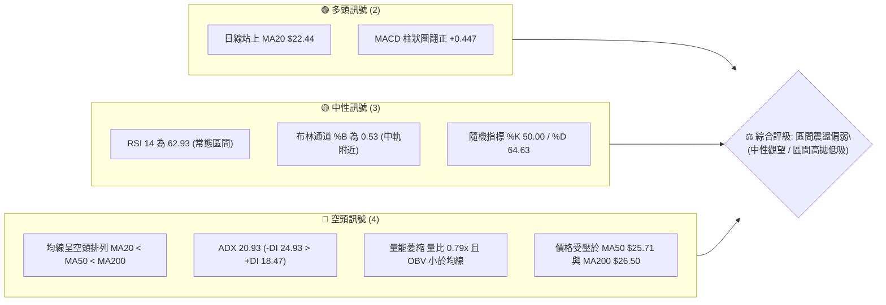
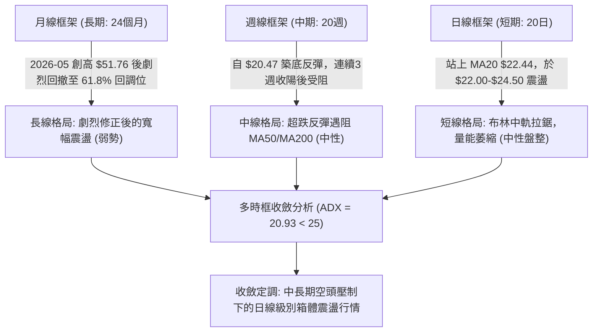
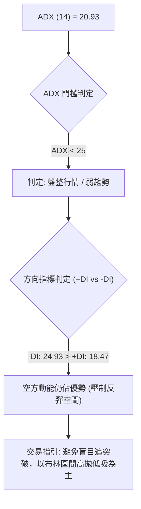
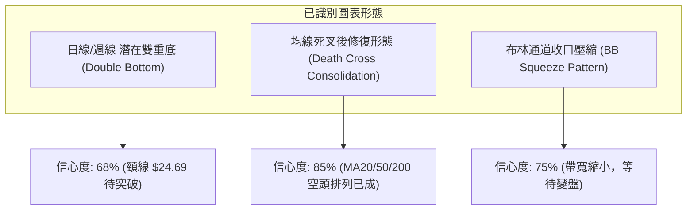
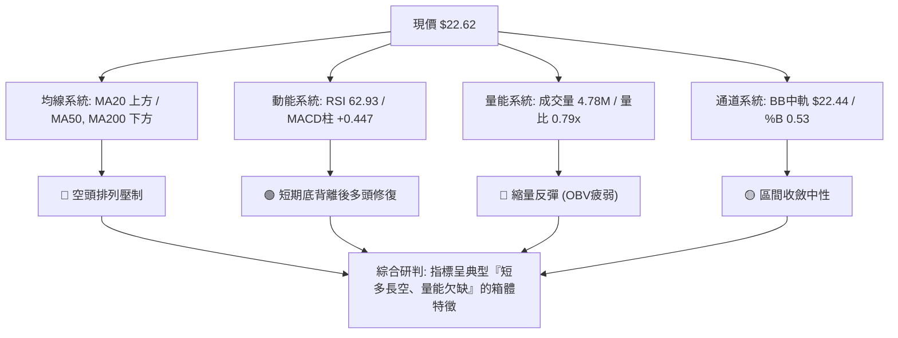
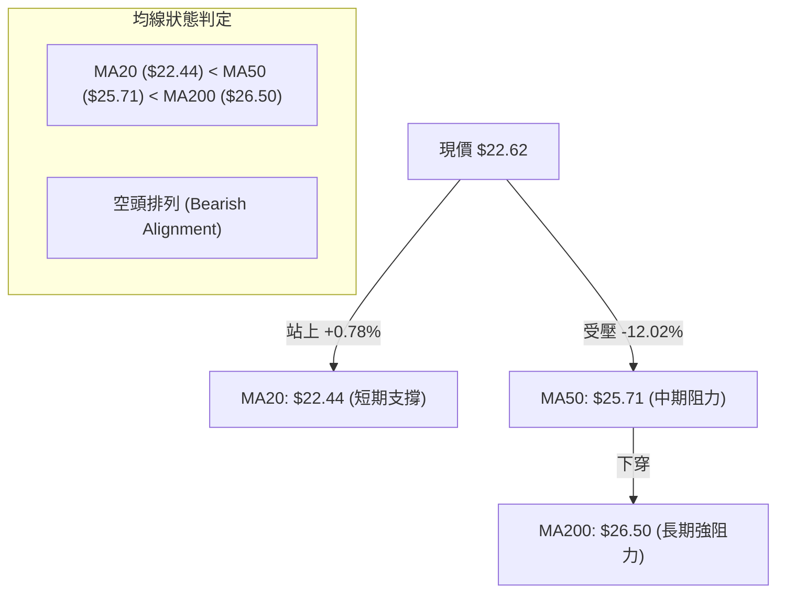
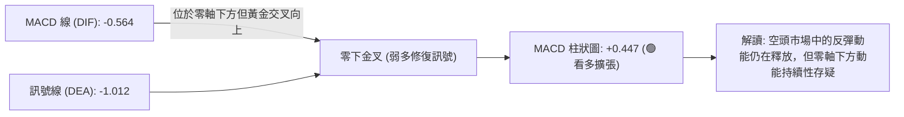
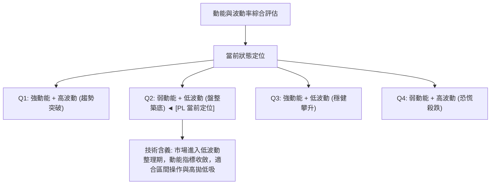
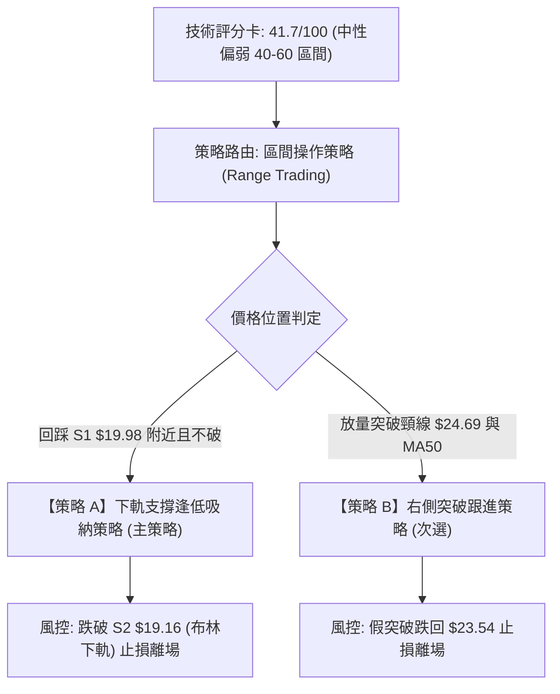
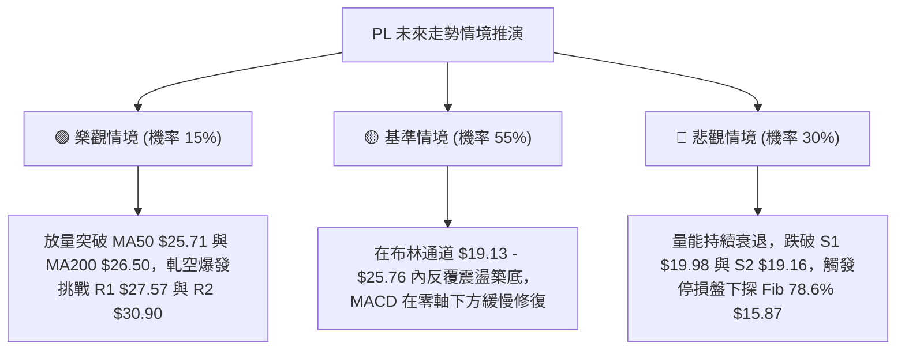

# PL 技術分析報告

> **報告日期**：2026-08-19 ｜ **語言**：繁體中文 ｜ **數據來源**：Yahoo Finance ｜ **當前價格**：$22.62

---

## 目錄

| 章節 | 內容 |
|------|------|
| [1. 技術面概覽](#1-技術面概覽) | 訊號儀表板、核心指標、評分卡 |
| [2. 趨勢分析](#2-趨勢分析) | 多時框趨勢、長中短期走勢、ADX 分析 |
| [3. 圖表形態分析](#3-圖表形態分析) | 形態識別、K線組合、目標價計算 |
| [4. 支撐與阻力](#4-支撐與阻力) | 關鍵價位、斐波那契回調結構 |
| [5. 技術指標深度解讀](#5-技術指標深度解讀) | MA/RSI/MACD/布林/成交量 |
| [6. 動能與波動率](#6-動能與波動率) | 動能四象限、ATR、Beta 與風險溢價 |
| [7. 多時框架總結](#7-多時框架總結) | 時框架評分矩陣與收斂結論 |
| [8. 交易策略建議](#8-交易策略建議) | 策略路由、區間操作、情境機率 |
| [9. 風險提示與監控](#9-風險提示與監控) | 監控清單、情境推演、風控指引 |
| [📋 報告總結](#-報告總結) | 全文核心結論與策略配置總結 |

---

## 1. 技術面概覽

### 🎯 技術訊號儀表板



### 📊 核心指標速覽表

| 指標類別 | 指標名稱 | 當前數值 | 訊號 | 解讀 |
|:---|:---|:---|:---:|:---|
| **價格** | 當前價格 | $22.62 | 🟡 | 位於52週區間 36.2% 位置，自高點 $51.76 回落後處於築底階段 |
| **短期均線** | MA20 | $22.44 | 🟢 | 價格在 MA20 上方 (+0.78%)，短線具備下檔支撐 |
| **中期均線** | MA50 | $25.71 | 🔴 | 價格在 MA50 下方 (-12.02%)，中期趨勢受壓 |
| **長期均線** | MA200 | $26.50 | 🔴 | 價格在 MA200 下方 (-14.64%)，長期技術面處於熊市格局 |
| **動能震盪** | RSI(14) | 62.93 | 🟡 | 位於中性偏強區間，未進入超買區（>70），無明顯背離 |
| **動能趨勢** | MACD | -0.564 (柱 +0.447) | 🟢 | MACD 線高於訊號線 (-1.012)，柱狀圖擴張，短線反彈動能持續 |
| **擺動指標** | Stochastic (14,3) | %K: 50.00 / %D: 64.63 | 🟡 | 指標處於中軸區間，短線動能平緩，無極端超買超賣 |
| **趨勢強度** | ADX(14) | 20.93 (-DI 24.93) | 🔴 | ADX < 25 表明處於盤整行情；-DI > +DI 表明空方力量仍佔優勢 |
| **通道指標** | Bollinger Bands | 中軌 $22.44 (%B: 0.53) | 🟡 | 價格貼近中軌運行，上下軌區間為 $19.13 - $25.76，帶寬收窄 |
| **成交量能** | 20日均量比 | 0.79x (OBV < MA) | 🔴 | 成交量 4.78M 低於均量 6.04M，量能未確認反彈，量價配合疲弱 |
| **波動指標** | ATR(14) | $1.40 (6.21%) | 🟡 | 每日平均波動幅度較大，短線操作須預留足夠止損緩衝空間 |

### 🏆 技術評分卡

```
╔══════════════════════════════════════════════════════════════════╗
║              技術評分卡 — PL (Planet Labs PBC) 2026-08-19        ║
╠══════════════════════════════════════════════════════════════════╣
║ 趨勢強度 (Trend)      ██████░░░░░░░░░░░░░░  30/100  🔴 空頭佔優  ║
║ 動能指標 (Momentum)   ████████████░░░░░░░░  58/100  🟡 短多延續  ║
║ 支撐穩定度 (Support)  ████████████░░░░░░░░  60/100  🟡 S1有守    ║
║ 成交量配合 (Volume)   ██████░░░░░░░░░░░░░░  32/100  🔴 量能匱乏  ║
║ 形態完整度 (Pattern)  ██████████░░░░░░░░░░  48/100  🟡 弱勢築底  ║
║ 均線排列 (MA System)  ████░░░░░░░░░░░░░░░░  22/100  🔴 空頭排列  ║
╠══════════════════════════════════════════════════════════════════╣
║ 綜合評分 (Overall)    ████████░░░░░░░░░░░░  41.7/100 🟡 中性偏弱 ║
║ 策略定調: ADX<25 盤整行情，主推布林通道 $19.13–$25.76 區間波段   ║
╚══════════════════════════════════════════════════════════════════╝
```

---

## 2. 趨勢分析

### 🌐 多時框趨勢分析



### 📈 長期趨勢 — 12個月走勢圖（Unicode）

```
PL 月線走勢圖（2025-08 至 2026-08）
價格軸 ($)
$55 ┤                                  ● $51.14 (2026-05 歷史高點附近)
$50 ┤                                 ╱ ╲
$45 ┤                                ╱   ╲
$40 ┤                               ╱     ╲
$35 ┤                         ●    ╱       ● $33.13 (2026-06 暴跌)
$30 ┤                   ●    ╱ ╲  ╱
$25 ┤             ●    ╱ ╲  ╱   ╲╱
$20 ┤       ●    ╱ ╲  ╱   ╲● $24.14         ● $20.48 ───● $22.62 (現在)
$15 ┤ ●    ╱ ╲  ╱   ╲● $19.72                 (2026-07築底)
$10 ┤  ╲  ╱   ╲● $11.90
 $5 ┤   ● $7.09
    └────────────────────────────────────────────────────────────
       08   09   10   11   12   01   02   03   04   05   06   07   08 (月份)
      (2025)                                               (2026)
```

#### 走勢特徵分析表格

| 階段 | 時間區間 | 起止價格 | 漲跌幅 | 趨勢特徵與量價表現 |
|:---|:---|:---|:---|:---|
| **啟動突破期** | 2025-08 ~ 2025-10 | $7.09 → $13.45 | +89.70% | 脫離低部平台，成交量放大，突破多條長期均線 |
| **主升浪推進** | 2025-11 ~ 2026-05 | $11.90 → $51.14 | +329.75% | 沿上升通道加速拉升，月線連陽，2026-05 創波段高點 $51.76 |
| **獲利回吐潰退**| 2026-06 ~ 2026-07 | $51.14 → $20.48 | -59.95% | 高位恐慌性拋售，週量一度放大至 100M，跌破 MA50 與 MA200 |
| **低位企穩修復**| 2026-07 ~ 2026-08 | $20.48 → $22.62 | +10.45% | 在斐波那契 61.8% ($23.54) 附近震盪築底，量能縮減至 14.5M |

### 📊 中期趨勢（週線分析）

```
近20週壓力與支撐走勢示意圖
價位 ($)
$55 ┤      ▲ 51.14 (05-31 週頂部)
$50 ┤     ╱ ╲
$45 ┤    ╱   ╲
$40 ┤   ╱     ╲
$35 ┤  ╱       ╲                                  ═══ 阻力區 R3: $34.25
$30 ┤ ╱         ● 32.22 ──● 31.38                 ═══ 阻力區 R1: $27.57 / MA50 $25.71
$25 ┤╱                   ╲     ╲      ● 24.69
$20 ┤                     ╲     ● 22.47 ╲╱  ● 22.62 (現價) ═══ 支撐區 S1: $19.98
$15 ┤                      ● 20.47 ───────● 20.48 (雙重底支撐 S2: $19.16)
    └─────────────────────────────────────────────────────
     05-17  05-31  06-14  06-28  07-12  07-26  08-09  08-23 (週)
```

週線數據顯示，PL 在經歷 6 月的大幅修正後，於 2026-07-26 週（收盤 $20.47）與 2026-08-02 週（收盤 $20.48）構築了扎實的底部支撐，隨後在 8 月初展開弱勢反彈，最高觸及 2026-08-16 週的 $24.69，隨後回落至 $22.62。

### ⚡ 趨勢強度評估（ADX 解讀）



#### ADX 強度與市場狀態對照

| 指標 | 數值 | 參考標準 | 狀態評估 | 策略意義 |
|:---|:---:|:---:|:---|:---|
| **ADX(14)** | **20.93** | < 25 (弱趨勢/盤整) | 趨勢動能耗盡，市場進入收斂整理 | 禁止使用單邊趨勢跟蹤策略，改用震盪策略 |
| **+DI** | **18.47** | 多方買盤推動力 | 買盤力量偏弱，難以發動主升浪 | 向上突破阻力難度高，預期高度受限 |
| **-DI** | **24.93** | 空方拋壓推動力 | 空方力量高於多方 (+DI 差值 -6.46) | 下檔仍有反覆測試支撐的風險 |

---

## 3. 圖表形態分析

### 🔍 形態識別系統



#### 形態識別與信心度評估表

| 形態名稱 | 信心度 | 判斷依據（引用數據） | 完成度 | 目標價（附計算式） |
|:---|:---:|:---|:---:|:---|
| **潛在雙重底** | **68%** | 兩次低點分別為 2026-07-26 ($20.47) 與 2026-08-02 ($20.48)，形成於 S1 ($19.98) 與 S2 ($19.16) 支撐區上方 | 70% | 頸線為 2026-08-16 高點 $24.69。<br>形態高度 = $24.69 - $20.47 = $4.22。<br>突破目標價 = $24.69 + $4.22 = **$28.91**（高度重合 50% 回調位 $28.93） |
| **均線空頭壓制** | **85%** | MA20 ($22.44) < MA50 ($25.71) < MA200 ($26.50)，長中期均線下行斜率陡峭 | 100% | 下行壓制目標區間：MA50 **$25.71** ~ MA200 **$26.50** |
| **頭肩頂形態** | **35%** | 歷史數據高位 $51.76 回落雖具頭肩結構，但已完全跌破頸線並釋放跌幅，當前進入次級整理 | 訊號不足 | 數據不足以支撐新頭肩頂，僅做指標型解讀 |

### 🕯️ 重要K線形態分析

| 週/月份 | 收盤價 | K線形態 | 解讀 | 訊號 |
|:---|:---:|:---|:---|:---:|
| **2026-05-31 週** | $51.14 | 長上影流星線 (頂部反轉) | 觸及 52W 高點 $51.76 後放量滯漲，多頭動能竭盡 | 🔴 強烈看空 |
| **2026-06-07 週** | $32.22 | 巨量大陰線 (破位崩跌) | 週成交量爆出 100.6M 歷史天量，主力資金出逃 | 🔴 極度看空 |
| **2026-07-26 週** | $20.47 | 低檔長下影十字星 | RSI 跌至 10.2 極度超賣，空頭拋壓衰竭，探底回升 | 🟢 觸底信號 |
| **2026-08-02 週** | $20.48 | 縮量平底陽線 (Double Bottom) | 連續兩週守住 $20.47-$20.48，確立下檔關鍵支撐 | 🟢 築底確認 |
| **2026-08-16 週** | $24.69 | 上影小陽線 (遇阻回落) | 反彈觸及 $24.69 後遭遇 MA50 與布林上軌壓制回落 | 🟡 阻力確認 |
| **2026-08-23 當前**| $22.62 | 縮量回踩小陰線 | 量能萎縮至 14.5M，回踩 MA20 $22.44 尋求二次確認 | 🟡 震盪整理 |

### 📉 ASCII 走勢形態示意圖

```
PL 雙底形態與均線壓制示意圖
價位 ($)
$29.00 ┤                                           [形態破位理論目標 $28.91 / 50% $28.93]
$27.50 ┤                                           ═══ 強阻力 R1 $27.57
$26.50 ┤                                           ─── MA200 $26.50 (強壓)
$25.70 ┤                                           ─── MA50  $25.71 / BB上軌 $25.76
$24.69 ┤                  ● [頸線 Neckline $24.69]
$23.50 ┤                 ╱ ╲                       ─── 斐波那契 61.8% $23.54
$22.62 ┤                ╱   ●◄──現價 $22.62 (MA20 $22.44)
$21.50 ┤               ╱     ╲
$20.48 ┤   ●──────────╱───────● [低點2: $20.48]
$19.98 ┤  [低點1: $20.47]                          ═══ 支撐位 S1 $19.98 / BB下軌 $19.13
       └────────────────────────────────────────────────────────
          2026-07-26         2026-08-16   2026-08-19 (今日)
```

---

## 4. 支撐與阻力

### 🗺️ 關鍵價位分布圖（Unicode）

```
PL 價位結構分布圖
═══════════════════════════════════════════════════════════════════
$51.76 ║████████████████████████████████║ 52週歷史高點 (0.0% Fib)
$40.98 ║████████████████████████        ║ 斐波那契 23.6% 回調位
$34.32 ║████████████████████████████    ║ 阻力 R3 $34.25 / 38.2% Fib $34.32
$30.90 ║████████████████████            ║ 阻力 R2 $30.90 (波段高點聚類)
$28.93 ║██████████████████              ║ 斐波那契 50.0% 回調位
$27.57 ║████████████████████████████████║ 強阻力 R1 $27.57 (近一年波段高點)
$26.50 ║████████████████                ║ 長期均線 MA200
$25.71 ║████████████                    ║ 中期均線 MA50 / BB上軌 $25.76
$23.54 ║████████                        ║ 斐波那契 61.8% 回調位 (多空平衡分水嶺)
$22.62 ╠════════════════════════════════╣ ◄ 現價 $22.62 (MA20: $22.44)
$19.98 ║▓▓▓▓▓▓▓▓▓▓▓▓▓▓▓▓▓▓▓▓▓▓▓▓▓▓▓▓    ║ 關鍵支撐 S1 $19.98 (波段低點聚類)
$19.16 ║████████████████████████████████║ 強支撐 S2 $19.16 / BB下軌 $19.13
$15.87 ║████████████                    ║ 斐波那契 78.6% 回調位
$11.97 ║████████████████████████████████║ 終極防守支撐 S3 $11.97
 $6.10 ║████████████████████████████████║ 52週歷史低點 (100.0% Fib)
═══════════════════════════════════════════════════════════════════
```

### 🚧 阻力位分析表

| 阻力級別 | 價位 | 距離現價 | 形成原因與技術共振 | 突破難度 | 重要性 |
|:---|:---:|:---:|:---|:---:|:---:|
| **動態阻力** | **$25.71 - $25.76** | +13.66% | 中期 MA50 ($25.71) 與 布林通道上軌 ($25.76) 共振區 | 🟡 中等 | ★★★☆☆ |
| **動態強壓** | **$26.50** | +17.15% | 長期牛熊分水嶺 MA200，空頭趨勢核心壓制線 | 🔴 困難 | ★★★★☆ |
| **R1 (關鍵阻力)** | **$27.57** | +21.88% | 近一年波段高點聚類區，前期多頭套牢密集籌碼峰 | 🔴 極難 | ★★★★★ |
| **R2 (中期阻力)** | **$30.90** | +36.60% | 2026年6-7月反彈高點聚類，斐波那契 50% ($28.93) 上方延伸 | 🔴 極難 | ★★★★☆ |
| **R3 (強阻力)** | **$34.25** | +51.41% | 近一年波段高點聚類，與斐波那契 38.2% ($34.32) 高度重合 | 🔴 極難 | ★★★★★ |

### 🛡️ 支撐位分析表

| 支撐級別 | 價位 | 距離現價 | 形成原因與技術共振 | 守住機率 | 重要性 |
|:---|:---:|:---:|:---|:---:|:---:|
| **動態支撐** | **$22.44** | -0.80% | 短期生命線 MA20 與 布林中軌共振點 | 65% | ★★★☆☆ |
| **S1 (關鍵支撐)** | **$19.98** | -11.67% | 近一年波段低點聚類，整數心理關卡 $20.00 防線 | 80% | ★★★★★ |
| **S2 (強支撐)** | **$19.16** | -15.30% | 近一年波段低點聚類，與布林下軌 ($19.13) 形成雙重共振 | 85% | ★★★★★ |
| **結構防守** | **$15.87** | -29.84% | 斐波那契 78.6% 回調位，黃金分割終極多頭防線 | 90% | ★★★★☆ |
| **S3 (極限支撐)** | **$11.97** | -47.08% | 2025年11月啟動平台低點聚類，長期多頭結構底 | 95% | ★★★★★ |

### 📐 斐波那契回調位分析

依據 52 週高低點區間（$6.10 → $51.76，波幅 $45.66）計算之精確回調位：

```
0.0%  (52W High) : $51.76  ── 歷史極值頂部
23.6% 回調位     : $40.98  ── 高位回撤第一緩衝區
38.2% 回調位     : $34.32  ── 與阻力 R3 ($34.25) 形成共振強阻力
50.0% 回調位     : $28.93  ── 多空中期強弱分水嶺 (形態測幅目標 $28.91)
61.8% 回調位     : $23.54  ── [關鍵黃金分割位] ◄ 現價 $22.62 位於 61.8% 與 78.6% 之間
78.6% 回調位     : $15.87  ── 極深回撤防守位
100.0%(52W Low)  : $ 6.10  ── 歷史起漲點
```

**回調位深度解讀**：
當前價格 $22.62 緊貼黃金分割 61.8% 位（$23.54）下方運行。在經典技術分析中，61.8% 回調位是多頭趨勢是否轉化為徹底反轉的最關鍵防守線。PL 於 7 月底短暫跌破並探至 $20.47 後迅速收復，目前在 61.8%（$23.54）與 78.6%（$15.87）之間的上半區間進行沉澱。若後續能有效放量站穩 $23.54，則有望向 50.0%（$28.93）發起修復性衝擊；反之，若跌破 $19.98（S1），將有進一步測試 78.6%（$15.87）的風險。

---

## 5. 技術指標深度解讀

### 🎛️ 指標訊號總覽



### 📈 移動平均線排列分析



#### 均線系統詳細參數表

| 均線名稱 | 數值 | 偏離度 | 走勢微型圖 | 斜率與技術含義 |
|:---|:---:|:---:|:---|:---|
| **MA 5** | $23.96 | -5.59% | `██▇▆▆▅▄▃▃▂▃▂▂▁▁▁▁▁▁▂▂▃▃▃▃▄▄▄▄▄` | 短線自高點回落，短均走平微曲 |
| **MA 10** | $23.78 | -4.86% | `████▇▆▅▄▄▃▃▂▂▁▁▁▁▁▁▁▁▁▁▁▂▂▃▃▃▃` | 扣抵低位，正嘗試拐頭向上 |
| **MA 20** | $22.44 | +0.78% | `████▇▇▇▆▆▆▅▅▅▄▃▃▂▂▁▁▁▁▁▁▁▁▁▁▁▁` | 走平回升，現價位於其上，提供下檔支撐 |
| **MA 60** | $28.88 | -21.67% | `█████▇▇▇▇▆▆▆▆▅▅▅▄▄▄▄▃▃▃▂▂▂▂▁▁▁` | 持續向下傾斜，上方沉重中期套牢區 |
| **MA 120** | $31.41 | -27.98% | `███▇▇▇▆▅▄▄▃▂▂▂▁▁▁▁▁▁▁▁▁▁▁▁▁▁▁▁` | 中長期下壓趨勢明顯，中期反彈天花板 |
| **MA 240** | $24.17 | -6.40% | `▁▁▁▁▂▂▂▃▃▃▃▄▄▄▄▅▅▅▅▆▆▆▆▇▇▇████` | 年線走平微下彎，構成第一道重要結構壓力 |

### 📉 RSI(14) 分析

```
RSI(14) 當前數值: 62.93
0        20        40        60        80       100
├────────┼─────────┼─────────┼─────────┼────────┤
█████████████████████████████░░░░░░░░░░░░░░░░░ (62.93)
[極度超賣] [弱勢區間]      [中性]    [多頭偏強] [超買]
```

- **超買超賣狀態**：RSI(14) 讀數為 **62.93**，脫離 7 月底的極端超賣區（當時週線 RSI 達 10.2），目前處於 50–70 的常態強勢修復區間，尚未觸及 70 超買警戒線。
- **背離分析判斷**：
  - **日線/週線底背離修復完成**：2026-07-26 週價格創低 $20.47（RSI 10.2），2026-08-02 週價格平底 $20.48 但 RSI 上升至 25.6，構成標準的**雙底形態底背離**，該背離已引發本輪反彈至 $24.69。
  - **當前背離結論**：目前 RSI(14) 與價格走勢保持同步回調，**無顯著頂背離或底背離訊號**，動能屬常態波動。

### 📊 MACD(12/26/9) 訊號解讀



- **MACD 線**：-0.564
- **Signal 線**：-1.012
- **MACD Histogram**：**+0.447**（持續處於正值區間，且柱狀體連續3週擴張）
- **技術意義**：雖然 MACD 仍處於零軸下方的空頭控制區，但 DIF 自低位上穿 DEA 形成黃金交叉後，柱狀圖持續翻紅，表明短期空頭殺跌動能消退，市場處於修復性反彈週期。

### 📦 布林通道分析

```
PL 布林通道結構示意圖 (20日, 2.0σ)
價位 ($)
$25.76 ┬────────────────────────────────────────── BB 上軌 ($25.76)
       │                                          (接近 MA50 $25.71)
$24.00 ┤
$22.62 ┼─────────────────● 現價 $22.62 (%B: 0.53)
$22.44 ┼────────────────────────────────────────── BB 中軌 / MA20 ($22.44)
$21.00 ┤
$19.13 ┴────────────────────────────────────────── BB 下軌 ($19.13)
       └────────────────────────────────────────── (接近 S2 $19.16)
```

- **帶寬與位置**：上軌 $25.76、中軌 $22.44、下軌 $19.13。帶寬（Bandwidth）顯著收窄，表明歷經 6-7 月的大幅波動後，波動率已大幅下降。
- **%B 指標**：**0.53**。現價精準運行於中軌（$22.44）上方微幅位置，顯示市場處於極度平衡狀態，正在中軌附近尋求方向選擇。
- **通道策略解讀**：在 ADX < 25 的盤整市中，布林通道上下軌構成天然的交易邊界，下軌 $19.13 配合 S2 ($19.16) 為強支撐，上軌 $25.76 配合 MA50 ($25.71) 為強阻力。

### 💹 成交量分析（量價配合度）

```
成交量結構分析
今日成交量 : 4,775,418 股   ███████░░░░░░░░░░░ (4.78M)
20日均量   : 6,038,211 股   █████████░░░░░░░░░ (6.04M) ── 量比: 0.79x
50日均量   : 10,225,316 股  ████████████████░░ (10.23M)
```

- **量價關係**：最新成交量 4.78M 較 20 日均量萎縮 21%（量比 0.79x），較 50 日均量萎縮超過 53%。週成交量亦從 6 月峰值的 100.6M 銳減至當前週的 14.5M。
- **OBV 趨勢解讀**：數據明確顯示 **OBV < MA**，能量潮指標低於其均線，反映資金在反彈過程中追高意願極度匱乏。
- **量價診斷結論**：當前呈現典型的**「縮量弱勢反彈」**特徵。缺乏增量資金介入意味著價格難以直接向上突破 MA50/MA200 等重壓區，一旦遭遇阻力，容易因買盤承接不足而再度回落。

---

## 6. 動能與波動率

### ⚡ 動能評估四象限



#### 動能四象限分析表

| 象限 | 動能強度 | 波動率水準 | 當前狀態 | 評估與應對策略 |
|:---|:---:|:---:|:---:|:---|
| **Q1 (主升/主跌)** | 強 (ADX>25) | 高 (ATR% > 8%) | ─ | 趨勢行情，順勢追突破 |
| **Q2 (盤整沉澱)** | **弱 (ADX=20.93)** | **中低 (ATR%=6.21%)** | **✓ PL 當前** | **底部箱體震盪，波動率收斂，宜以區間高拋低吸為主** |
| **Q3 (強勢慢牛)** | 強 (MACD零上) | 低 (ATR% < 4%) | ─ | 最佳持股波段，穩健加碼 |
| **Q4 (恐慌出逃)** | 弱 (量能失控) | 高 (ATR% > 10%) | ─ | 6月份崩跌狀態，應嚴格空倉觀望 |

### 📊 ATR 波動率分析

```
ATR(14) 波動率指標解讀
數值: $1.40 ｜ 價格佔比: 6.21%
████████████░░░░░░░░ (中等偏高波動度)
```

- **絕對與相對波動**：ATR(14) 為 **$1.40**，佔當前價格（$22.62）的 **6.21%**。儘管較 6 月份的高波動有所下降，但每日平均仍有接近 6% 的擺動空間。
- **止損距離建議**：
  - **日內/短線交易**：建議止損距離為 $1.0 \times \text{ATR} = \mathbf{\$1.40}$（對應下檔保護價約 $21.22）。
  - **波段交易**：建議止損距離為 $1.5 \times \text{ATR} = \mathbf{\$2.10}$（對應下檔保護價約 $20.52，剛好覆蓋前低 $20.48 外圍）。
  - **寬鬆結構止損**：建議止損距離為 $2.0 \times \text{ATR} = \mathbf{\$2.80}$（對應下檔保護價約 $19.82，有效設於關鍵支撐 S1 $19.98 下方）。

### 📐 Beta 與市場相關性

- **Beta 係數**：**2.123**（高 Beta 屬性）。
- **市場敏感度解讀**：PL 的波動幅度約為標普 500 指數的 2.12 倍。在大盤處於多頭或反彈環境中，其向上彈性較大；但在市場避險情緒升溫或大盤回調時，其下行風險亦會被顯著放大。
- **機構持股與空頭部位**：機構持股佔比高達 85.2%，空頭部位（Short % Float）為 9.7%（Short Ratio 3.33）。較高的空頭比例意味著若價格能放量突破關鍵阻力（如 R1 $27.57），可能引發短線軋空（Short Squeeze）；但在未突破前，空方壓制依然存在。

---

## 7. 多時框架總結

### 📋 時框架評分表

| 時框架 | 趨勢方向 | 動能狀態 | 均線排列 | 形態結構 | 綜合評分 | 操作建議 |
|:---|:---:|:---:|:---:|:---:|:---:|:---|
| **長期 (月線)** | 🔴 下行修正 | 弱勢 (自高位腰斬) | 跌破多條長期均線 | 歷史頂部回撤 61.8% | **30/100** | 逢高減磅，不宜盲目長線做多 |
| **中期 (週線)** | 🟡 止跌築底 | 中性 (MACD柱微增) | 受壓於 MA50/MA200 | 雙底構築中 (頸線 $24.69) | **45/100** | 區間震盪對待，等待突破確認 |
| **短期 (日線)** | 🟢 弱勢反彈 | 偏強 (站上MA20/RSI 62)| MA20 走平向上支撐 | 布林中軌拉鋸整理 | **55/100** | 短線波段低吸，嚴格執行止損 |

### 🔲 綜合訊號矩陣

```
時框架訊號矩陣與多空衝突分析
┌──────────────┬──────────────┬──────────────┬──────────────┐
│  分析維度    │  短期 (日線) │  中期 (週線) │  長期 (月線) │
├──────────────┼──────────────┼──────────────┼──────────────┤
│ 均線系統     │  🟢 站上MA20 │  🔴 跌破MA50 │  🔴 空頭排列 │
│ 動能指標     │  🟢 MACD翻紅 │  🟡 RSI 中性 │  🔴 動能大幅衰退│
│ 成交量能     │  🔴 縮量 0.79x│ 🔴 量能疲弱  │  🔴 爆量後萎縮│
│ 形態位置     │  🟡 中軌震盪 │  🟡 潛在雙底 │  🔴 深度回撤中│
└──────────────┴──────────────┴──────────────┴──────────────┘
```

### ⚖️ 多時框收斂結論

依據多時框收斂規則（規則 14）：
1. **行情性質判定**：當前 ADX(14) 數值為 **20.93 (< 25)**，且 -DI (24.93) > +DI (18.47)，確立市場處於**「盤整行情（Range-bound Market）」**而非單邊趨勢行情。
2. **時框優先級收斂**：在盤整行情中，日線級別的布林通道上下軌（$19.13 - $25.76）與波段支撐阻力為主要交易依據。週線與月線的空頭排列限制了上行高度，使中期阻力 MA50 ($25.71) 與 MA200 ($26.50) 成為反彈的強大天花板。
3. **唯一方向性結論**：**中性偏弱、區間震盪（Neutral to Range-bound Bearish）**。
   - 價格既不具備展開單邊主升浪的量能（OBV 疲弱），也已在 S1 ($19.98) 與 S2 ($19.16) 獲得初步支撐。
   - 交易的核心邏輯收斂為：**以布林通道下軌與 S1 支撐區為防守進行逢低吸納，並在 MA50 及 R1 阻力區前果斷獲利了結**。

---

## 8. 交易策略建議

### 🗺️ 策略決策流程圖



### 🧭 策略路由

> **當前主策略方向 = 區間震盪操作（依評分 41.7/100，處於 40–60 震盪中性區間）**  
> 綜合評分未達 60 分（不宜激進單邊追多），亦未低於 40 分（不宜盲目低位追空）。核心交易戰術為圍繞布林通道（$19.13 – $25.76）及關鍵支撐阻力位進行**「下軌低吸、上軌高拋」**的網格波段操作。

### 🎯 價格情境階梯（Price Scenarios）

| 觸發條件 | 下一目標 | 後續延伸目標 | 情境含義與操作指引 |
|:---|:---:|:---:|:---|
| **放量突破 R1 $27.57** | **R2 $30.90** | **R3 $34.25** | 中期反轉確認，多頭空間打開，挑戰 38.2% 回調位 |
| **突破 MA50 / 頸線 $25.71** | **R1 $27.57** | **R2 $30.90** | 雙底形態確立，短線轉強，空頭回補動能釋放 |
| **維持於現價 $22.62 區間** | **$23.54 (61.8%)**| **$25.71 (MA50)** | 區間拉鋸，中軌附近震盪沉澱，維持高拋低吸 |
| **跌破 MA20 $22.44** | **S1 $19.98** | **S2 $19.16** | 短線轉弱，價格回踩測試下軌支撐區 |
| **跌破 S2 $19.16** | **Fib $15.87** | **S3 $11.97** | 雙底構築失敗，破位下行，長期趨勢嚴重惡化 |

### 📊 情境機率分佈

| 情境劇本 | 機率 | 主要依據與技術指標支撐 |
|:---|:---:|:---|
| **情境一：區間震盪（$19.98 – $25.71）** | **55%** | ADX 20.93 確認無單邊趨勢；布林帶寬收窄；量比 0.79x 顯示無大資金打破平衡 |
| **情境二：回落測試支撐（探底 S1/S2）** | **30%** | -DI (24.93) > +DI (18.47)；均線呈空頭排列；OBV < MA 量能匱乏壓制買盤 |
| **情境三：放量向上突破（突破 R1）** | **15%** | MACD 柱翻紅雖釋放動能，但上方 MA50、MA200 重重套牢阻力，缺乏爆發量難以直接攻克 |

### 🟢 主策略詳情（區間波段策略）

```
╔══════════════════════════════════════════════════════════════════╗
║                    PL 交易策略執行矩陣表                         ║
╠══════════════════════════════════════════════════════════════════╣
║ 項目            ║ 策略 A (左側支撐低吸 - 主推) ║ 策略 B (右側突破跟進) ║
╠═════════════════╬═════════════════════════════╬══════════════════════╣
║ 進場條件        ║ 回踩 S1 企穩，日線收下影線   ║ 放量突破 MA50 及 $24.69║
║ 進場價格        ║ $20.50 (S1 $19.98 上方)     ║ $25.80 (站穩MA50上方)║
║ 目標價 T1       ║ $23.54 (61.8% 阻力位)       ║ $27.57 (關鍵阻力 R1) ║
║ 目標價 T2       ║ $25.71 (MA50 / BB上軌)      ║ $30.90 (波段阻力 R2) ║
║ 止損價格        ║ $19.10 (跌破 S2 $19.16)     ║ $23.50 (跌破 61.8% 位)║
║ 風險空間        ║ $1.40 (6.83%)               ║ $2.30 (8.91%)        ║
║ 報酬空間 (至T2) ║ $5.21 (25.41%)              ║ $5.10 (19.77%)       ║
║ 風險報酬比 (R:R)║ 1 : 3.72                    ║ 1 : 2.22             ║
║ 預估成功機率    ║ 65%                         ║ 45%                  ║
║ 建議倉位        ║ 10% - 15% (輕倉波段)         ║ 5% - 8% (突破試倉)   ║
╚══════════════════════════════════════════════════════════════════╝
```

### 🔴 反向風險觸發點（對沖與風控提示）

- **多頭全面止損點**：若日線收盤價**實質跌破 S2 $19.16（以及布林下軌 $19.13）**，宣告雙底形態徹底破裂，市場將向下開啟至 $15.87（78.6% 回調位）甚至 S3 $11.97 的空間。此時應無條件清倉所有多頭部位，或反手建立空頭對沖部位。
- **空頭回補止損點**：若市場出現放量長陽，**日線收盤價突破並站穩 MA200 $26.50**，則意味著長期均線空頭排列被化解，空頭部位必須立即止損回補。

### ⭐ 整體訊號強度評星

```
做多訊號強度：★★☆☆☆  (2.5/5 星 - 僅限支撐位波段操作，缺乏趨勢做多動能)
做空訊號強度：★★★☆☆  (3.0/5 星 - 長期空頭壓制明確，但低位具備雙底支撐)
整體可信度：  ★★★★☆  (4.0/5 星 - ADX 與布林通道明確指向低波動區間收斂)
```

---

## 9. 風險提示與監控

### ✅ 關鍵監控指標 Checklist

```
╔══════════════════════════════════════════════════════════════════╗
║                 PL 日常技術面監控清單 (Checklist)                 ║
╠══════════════════════════════════════════════════════════════════╣
║ [ ] 1. MA20 支撐有效性: 每日收盤是否維持在 $22.44 之上？         ║
║ [ ] 2. 頸線與 MA50 壓制: 反彈至 $24.69 - $25.71 是否放量滯漲？   ║
║ [ ] 3. 成交量突變監控: 日成交量是否突破 10.2M (50日均量)？       ║
║ [ ] 4. MACD 柱狀圖: 正值是否持續擴張 (當前 +0.447) 或出現萎縮？  ║
║ [ ] 5. 布林通道帶寬: %B 是否突破 1.0 (上軌 $25.76) 或破 0 (下軌)？║
║ [ ] 6. 雙底防守線: 盤中價格是否跌破 S1 $19.98 關鍵心理關卡？     ║
║ [ ] 7. ADX 動態: ADX 是否由 20.93 拐頭上穿 25，預示單邊行情啟動？║
╚══════════════════════════════════════════════════════════════════╝
```

### ⚠️ 風險場景分析



### 🛡️ 風險管理重要提醒

1. **高 Beta 特性控倉**：PL 的 Beta 值為 **2.123**，屬於極高彈性標的。在非單邊牛市中，單一帳戶在該標的上的配置**強烈建議不超過總資產的 10%–15%**，避免因市場整體回調引發不可承受的淨值波動。
2. **ATR 波動保護原則**：每日波動 ATR 達 **$1.40 (6.21%)**，日內雜訊較大。在進場掛單時應避免市價追高，建議採用「限價單分批掛單於支撐位附近」的策略，嚴禁重倉無止損抗單。
3. **假突破防範**：由於均線（MA50/MA200）呈空頭排列且 OBV 處於弱勢，若日線短暫衝高上穿 $24.69 但成交量未放大至 8M 以上，極易形成「假突破頂背離」，切忌在阻力位盲目追多。

---

## 📋 報告總結

```
╔══════════════════════════════════════════════════════════════════╗
║                     PL 技術分析報告核心總結                      ║
╠══════════════════════════════════════════════════════════════════╣
║ 報告日期: 2026-08-19           當前價格: $22.62                  ║
║ 分析評級: ⚖️ 中性偏弱 (41.7/100) ─ 區間震盪築底格局              ║
╠══════════════════════════════════════════════════════════════════╣
║ 核心趨勢結論:                                                    ║
║ ├─ 長期趨勢: 🔴 弱勢空頭 (自高點 $51.76 回撤，受壓於 MA200 $26.50)║
║ ├─ 中期趨勢: 🟡 築底震盪 (在 $20.47-$20.48 形成雙底，受制 MA50)  ║
║ ├─ 短期趨勢: 🟢 超跌反彈 (站上 MA20 $22.44，MACD 柱狀圖翻紅)     ║
║ ├─ 關鍵支撐: S1: $19.98 ｜ S2: $19.16 ｜ Fib 78.6%: $15.87       ║
║ ├─ 關鍵阻力: MA50: $25.71 ｜ R1: $27.57 ｜ R2: $30.90            ║
║ └─ 機構共識目標: $40.10 (區間 $25.00 - $53.00, 10 位分析師)     ║
╠══════════════════════════════════════════════════════════════════╣
║ 最優策略配置:                                                    ║
║ 1. 🥇 最佳機會 (策略 A): 待價格回踩 S1 區間 ($20.50 附近) 逢低進場║
║    目標 $23.54 / $25.71，止損 $19.10，風險報酬比 1 : 3.72        ║
║ 2. 🥈 次選機會 (策略 B): 待放量有效站穩 MA50 $25.71 後右側跟進   ║
║    目標 $27.57 / $30.90，止損 $23.50，風險報酬比 1 : 2.22        ║
║ 3. 🥉 保守選擇: 在 ADX < 25 且價格處於中軌附近時暫時空倉觀望，   ║
║    等待布林通道開口或明確測試 S1/S2 邊界後再行介入。             ║
╚══════════════════════════════════════════════════════════════════╝
```

---

> ⚠️ **免責聲明**：本報告為 AI 自動生成之技術分析研究報告，所有數據、圖表及價位推算均基於歷史價格及量化模型分析。本報告**僅供研究與學術參考**，**不構成任何形式的投資要約、招攬或具體操作建議**。金融市場具有高度風險，投資人應獨立評估風險並自負盈虧。

---

*報告生成時間：2026-08-19 ｜ 數據來源：Yahoo Finance ｜ 分析框架：資深多時框量化技術分析系統*