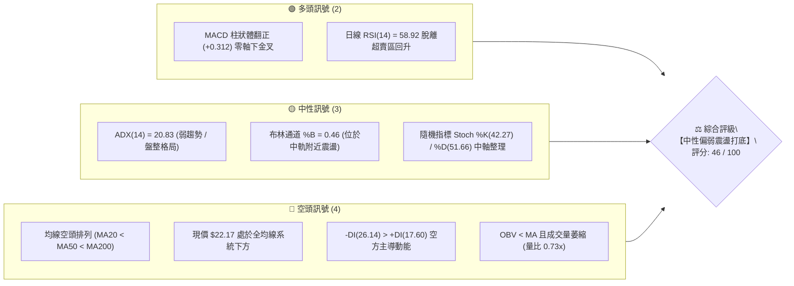
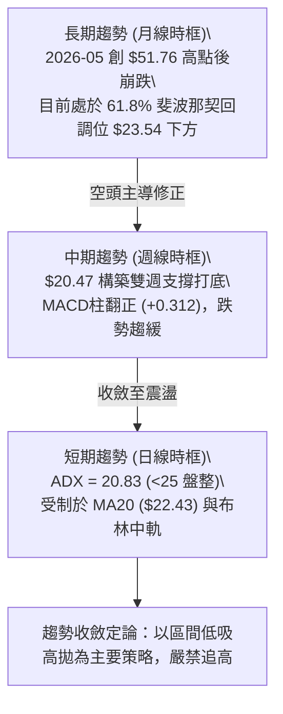
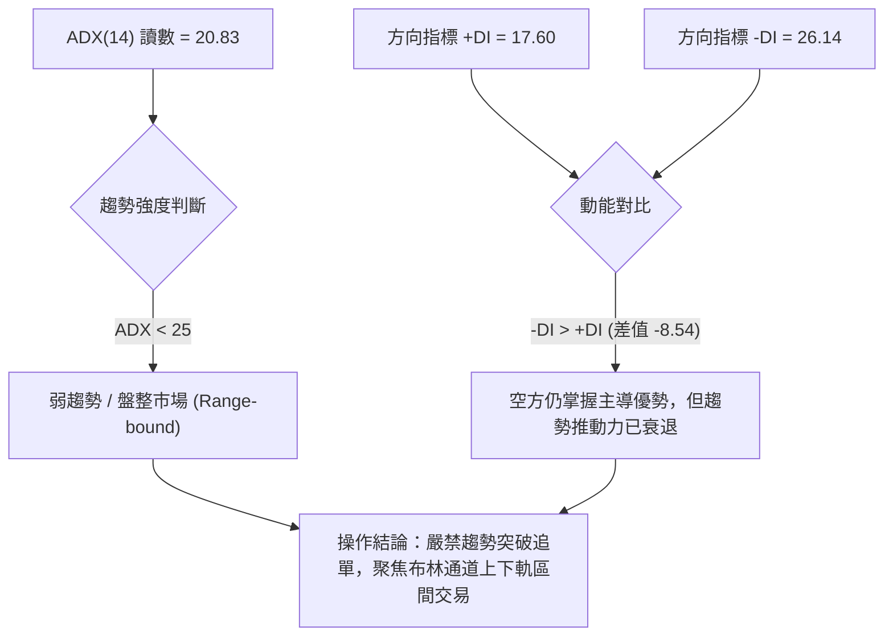
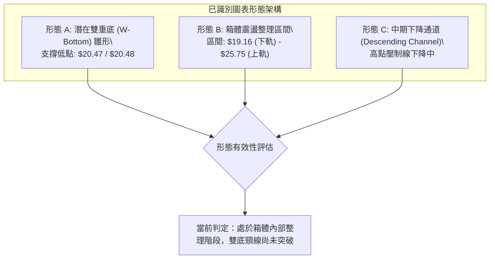
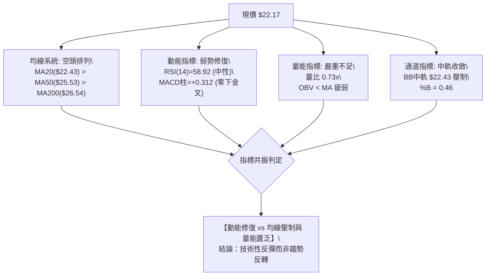
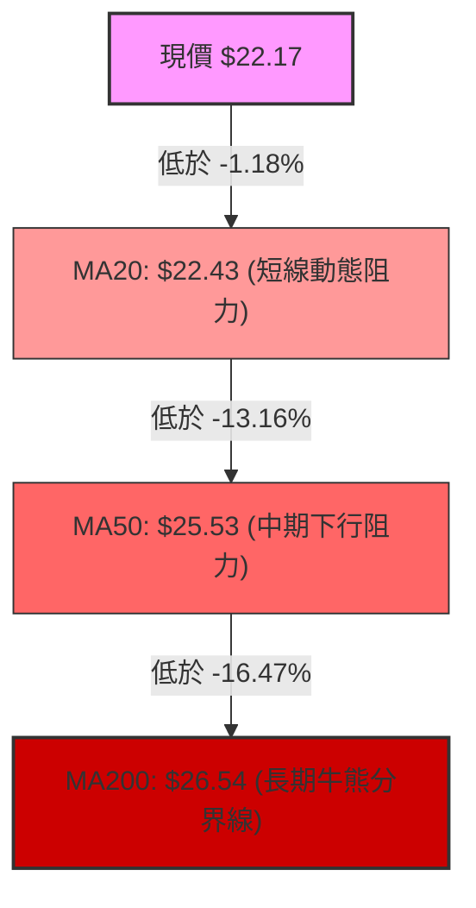
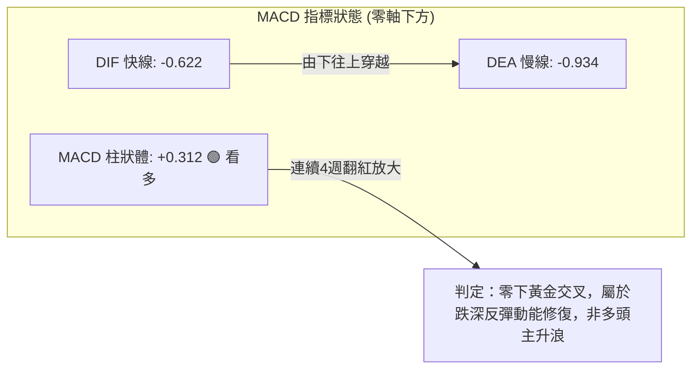
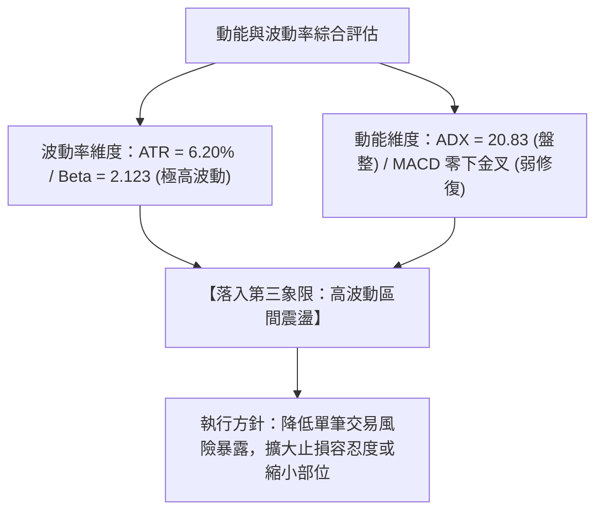
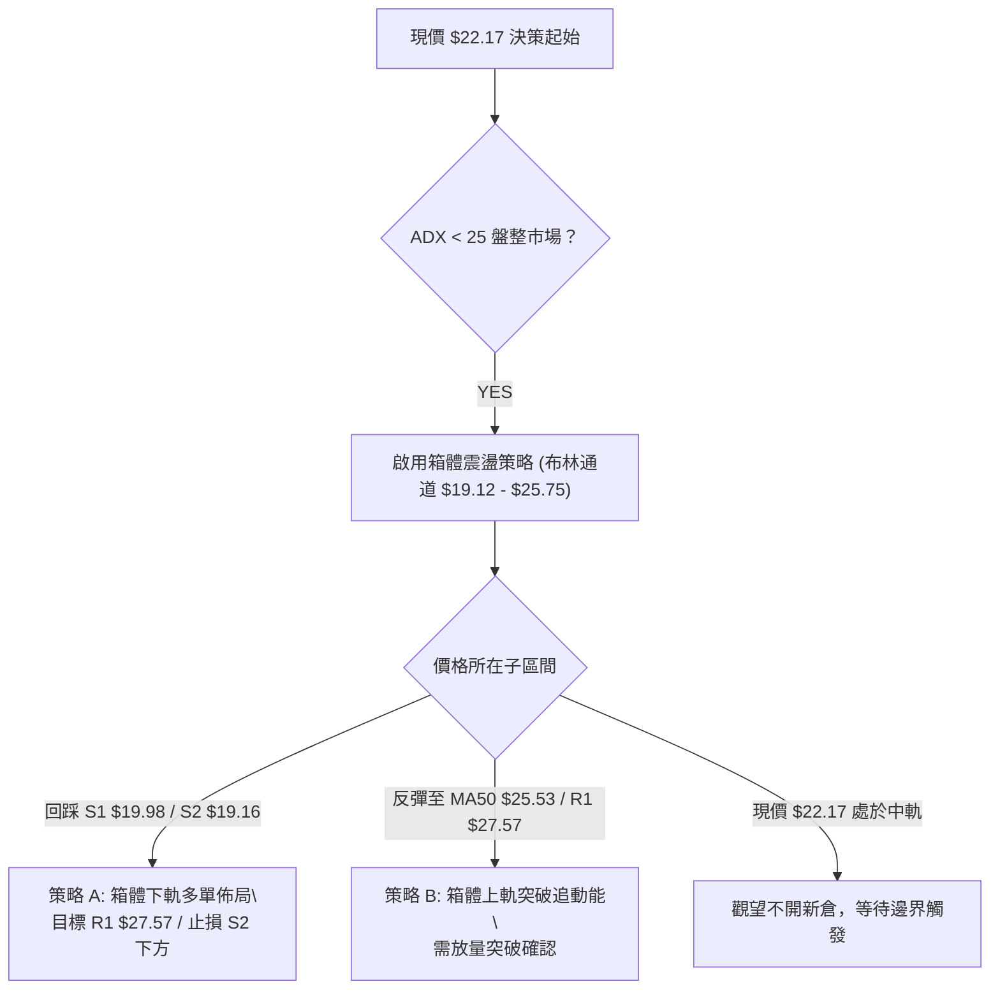
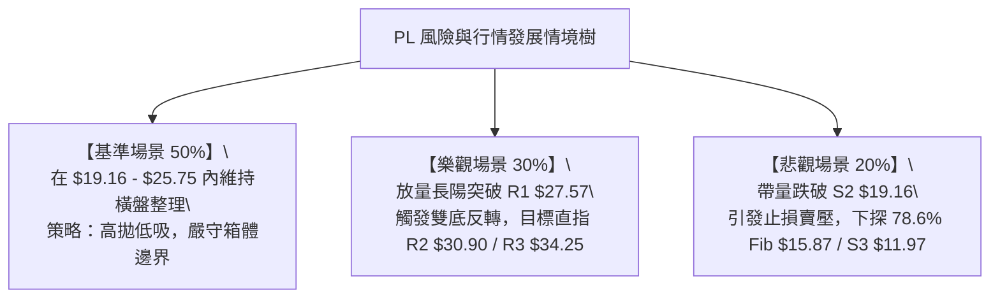

# PL 技術分析報告

> **報告日期**：2026-08-20 ｜ **語言**：繁體中文 ｜ **數據來源**：Yahoo Finance ｜ **當前價格**：$22.17

---

## 目錄

| 章節 | 內容 |
|------|------|
| [1. 技術面概覽](#1-技術面概覽) | 訊號儀表板、核心指標、評分卡 |
| [2. 趨勢分析](#2-趨勢分析) | 多時框趨勢、長中短期走勢、ADX趨勢強度 |
| [3. 圖表形態分析](#3-圖表形態分析) | 形態識別、K線組合、目標價計算 |
| [4. 支撐與阻力](#4-支撐與阻力) | 關鍵價位分布、阻力支撐表、斐波那契回調 |
| [5. 技術指標深度解讀](#5-技術指標深度解讀) | 均線系統、RSI、MACD、布林通道、量能OBV |
| [6. 動能與波動率](#6-動能與波動率) | 動能四象限、ATR波動率、Beta市場敏感度 |
| [7. 多時框架總結](#7-多時框架總結) | 時框矩陣評分、多時框收斂定論 |
| [8. 交易策略建議](#8-交易策略建議) | 策略路由、情境階梯、主策略與風控參數 |
| [9. 風險提示與監控](#9-風險提示與監控) | 監控指標Checklist、風險情境樹、部位管理 |
| [10. 報告總結](#10-報告總結) | 核心結論與執行決策儀表板 |

---

## 1. 技術面概覽

### 🎯 技術訊號儀表板



---

### 📊 核心指標速覽表

| 指標類別 | 指標名稱 | 當前數值 | 訊號 | 專業技術解讀 |
|:---|:---|:---|:---:|:---|
| **價格結構** | 現行收盤價 | $22.17 | 🟡 | 位於52週區間（$6.10 - $51.76）之 35.2% 分位，處於中低檔震盪區 |
| **短期均線** | MA20 | $22.43 | 🔴 | 現價低於中軌 MA20（距離 -1.18%），短線面臨動態反壓 |
| **中期均線** | MA50 | $25.53 | 🔴 | 中期趨勢偏空，MA50 呈下行斜率，構成強烈上方蓋頂壓力 |
| **長期均線** | MA200 | $26.54 | 🔴 | 跌破年線/長期生命線，MA20 < MA50 < MA200 形成標準空頭排列 |
| **震盪動能** | RSI(14) | 58.92 | 🟡 | 自7月低點（10.2）強勁修復至中性偏強區，目前未見頂背離或底背離 |
| **趨勢動能** | MACD (12,26,9) | -0.622 / -0.934 | 🟢 | 快線由下往上穿越慢線，柱狀體 +0.312，零軸下方底背離反彈發酵中 |
| **趨勢強度** | ADX / ±DI | 20.83 (ADX) | 🟡 | ADX < 25 表明無顯著單邊趨勢；-DI (26.14) > +DI (17.60) 顯示空方佔優 |
| **通道指標** | 布林通道 (BB) | $19.12 - $25.75 | 🟡 | 帶寬收窄，%B為0.46，價格由下軌回升至中軌 $22.43 附近整理 |
| **波動風險** | ATR(14) | $1.37 | 🔴 | 每日波動佔股價 6.20%，Beta 高達 2.123，具高波動與高風險特性 |
| **量能指標** | 成交量 / OBV | 4.35M (0.73x) | 🔴 | 20日均量5.97M，量能萎縮且 OBV < MA，反彈動能缺乏增量買盤配合 |

---

### 🏆 技術評分卡

```
╔══════════════════════════════════════════════════════════════╗
║              PL 技術面量化評分卡 (2026-08-20)                ║
╠══════════════════════════════════════════════════════════════╣
║ 趨勢強度 (ADX/DI)   ████████░░░░░░░░░░░░  40/100  🟡 弱勢盤整║
║ 動能指標 (RSI/MACD) ████████████░░░░░░░░  60/100  🟢 低檔金叉║
║ 支撐穩定度 (S1/S2)  ██████████████░░░░░░  70/100  🟢 雙重底部║
║ 成交量配合 (OBV/Vol)██████░░░░░░░░░░░░░░  30/100  🔴 量能背離║
║ 形態完整度 (Pattern)██████████░░░░░░░░░░  50/100  🟡 區間箱體║
║ 均線排列 (MA System)████░░░░░░░░░░░░░░░░  25/100  🔴 空頭排列║
╠══════════════════════════════════════════════════════════════╣
║ 綜合技術評分        █████████░░░░░░░░░░░  46/100  ⚖️ 區間震盪║
╚══════════════════════════════════════════════════════════════╝
```

---

## 2. 趨勢分析

### 🌐 多時框趨勢分析



---

### 📈 長期趨勢 — 12個月走勢圖（Unicode）

```
PL 月線走勢圖（2025-08 至 2026-08）
價格軸 ($)
$52 ┤                                      ● ($51.14 / 歷史高點 $51.76)
$48 ┤                                     ╱ ╲
$44 ┤                                    ╱   ╲
$40 ┤                              ●    ╱     ╲
$36 ┤                             ╱ ╲  ╱       ╲
$32 ┤                            ╱   ●          ● ($33.13)
$28 ┤                      ●    ╱                ╲
$24 ┤                ●───●  ╲  ╱                  ╲       ● ($22.17 現價)
$20 ┤          ●    ╱        ╲╱                    ●───● ╱ ($20.48 打底)
$16 ┤         ╱ ╲  ╱
$12 ┤   ●───●    ╲╱
$08 ┤  ●
$04 ┤
    └─┬───┬───┬───┬───┬───┬───┬───┬───┬───┬───┬───┬───
     08  09  10  11  12  01  02  03  04  05  06  07  08 (月份: 2025-08 至 2026-08)
```

#### 走勢階段特徵深度分析

| 階段區間 | 價格變動 | 期間漲跌幅 | 量能特徵 | 技術結構與形態特徵解讀 |
|:---|:---|:---:|:---|:---|
| **主升浪一期** (2025.08 - 2025.12) | $7.09 → $19.72 | +178.14% | 溫和放量 | 脫離長期底部，突破歷史頸線，均線呈現完美多頭發散。 |
| **主升浪二期** (2026.01 - 2026.05) | $24.97 → $51.14 | +104.81% | 鉅量推升 | 狂暴主升段，RSI 週線飆升至 83.2（極端超買），5月見頂 $51.76。 |
| **斷崖式崩跌** (2026.06 - 2026.07) | $51.14 → $20.48 | -59.95% | 爆量恐慌殺盤 | 6月單週成交量破億股，高檔籌碼瓦解，跌破 MA20、MA50，RSI 暴跌至 10.2。 |
| **築底修復期** (2026.07 - 2026.08) | $20.47 → $22.17 | +8.30% | 縮量整理 | 於 $20.47 - $20.48 區域獲得雙重支撐（S1/S2），MACD 柱狀體翻紅修復。 |

---

### 📊 中期趨勢（週線結構分析）

```
週線結構示意圖（近 8 週價格路徑）：
$31.38 (07-05 高點) 
   │
   └──► $26.05 (07-12)
           │
           └──► $22.47 (07-19)
                   │
                   └──► $20.47 ──► $20.48 (雙底支撐區 S1: $19.98 / S2: $19.16)
                                       │
                                       └──► $23.93 ──► $24.69 ──► $22.17 (現價回踩中軌)
```

中期週線在歷經 6-7 月的大幅去槓桿化後，於 $20.47 附近形成止跌平台。8月第二週反彈至 $24.69 遇阻（受制於 MA20 $22.43 與 61.8% 斐波那契回調位 $23.54），目前呈現「階梯式下跌後的弱勢橫盤築底」。

---

### ⚡ 趨勢強度評估（ADX 解讀）



| 指標名稱 | 當前讀數 | 基準閥值 | 趨勢狀態判定 | 交易策略指導 |
|:---|:---:|:---:|:---:|:---|
| **ADX (14)** | **20.83** | < 25.00 | **無方向性趨勢 / 盤整** | 順勢指標失效，均線策略易遭雙巴，啟用震盪指標 |
| **+DI (14)** | **17.60** | - | 多頭動能偏弱 | 買盤缺乏連續性，攻擊力道不足 |
| **-DI (14)** | **26.14** | - | 空頭仍具相對優勢 | 價格受上方均線反壓，反彈逢高易引發解套賣壓 |

---

## 3. 圖表形態分析

### 🔍 形態識別系統



#### 形態信心度與目標價評估表

| 圖表形態 | 信心度 | 判斷依據（嚴格引用數據） | 完成度 | 形態目標價（計算式） |
|:---|:---:|:---|:---:|:---|
| **潛在雙重底 (W-Bottom)** | **62%** | 2026-07-26 低點 $20.47 與 2026-08-02 低點 $20.48 形成雙底測試，獲 S1 ($19.98)/S2 ($19.16) 支撐。 | 65% | 頸線取 R1 $27.57，底部位於 $20.47；<br>理論目標價 = 頸線 $27.57 + ($27.57 - $20.47) = **$34.67**（接近 R3 $34.25） |
| **箱體震盪 (Rectangle)** | **85%** | 價格受限於布林下軌 $19.12（S2 $19.16）與布林上軌 $25.75（MA50 $25.53），ADX = 20.83 確認無趨勢。 | 80% | 箱頂突破目標 = $25.75 + ($25.75 - $19.12) = **$32.38**（接近 R2 $30.90 / R3 $34.25） |
| **均線死叉空頭排列** | **90%** | MA20 ($22.43) < MA50 ($25.53) < MA200 ($26.54)，全均線下彎扣高。 | 100% | 指標型形態，確認反彈上方層層阻力，目標價受壓於 MA200 **$26.54** |

---

### 🕯️ 重要K線形態分析

| 觀測週期 | 結算收盤價 | K線形態識別 | 技術意涵解讀 | 訊號方向 |
|:---|:---:|:---|:---|:---:|
| **2026-05 (月線)** | $51.14 | 長上影流星線 (Shooting Star) | 觸及 $51.76 歷史天價後遭遇極端拋壓，確認波段大頂成立 | 🔴 強烈看空 |
| **2026-07-26 (週線)** | $20.47 | 低檔長下影十字錘頭線 | RSI 殺至 10.2 極端超賣後收出長下影線，主力資金初步進場護盤 | 🟢 觸底反彈 |
| **2026-08-02 (週線)** | $20.48 | 平底雙針探底線 (Tweezers Bottom) | 連續兩週低點精確重疊於 $20.47-$20.48，確立 $20 關卡具強大結構支撐 | 🟢 底部確認 |
| **2026-08-16 (週線)** | $24.69 | 上影小陽線 (Inverted Hammer) | 向上衝擊 MA50 ($25.53) 與布林上軌失敗，反彈動能衰竭 | 🟡 逢高遇阻 |
| **2026-08-23 (最新)** | $22.17 | 回踩中軌中陰線 | 由 $24.69 回調至 MA20 ($22.43) 下方，考驗中軌支撐有效性 | 🔴 短線偏弱 |

---

### 📉 ASCII 走勢形態示意圖

```
PL 雙底築底與阻力架構圖：
$34.25 ────────────────────────────── R3 強阻力 / 雙底理論延伸目標
         ▲
         │ (形態高度 +$7.10)
$27.57 ──┼─────────────────────────── R1 關鍵頸線阻力 / 波段反轉點
         │                           ┌─ 2026-08-16 高點 $24.69
$22.43 ──┼─────────────●─────────────┼─ MA20 / 布林中軌 ($22.17 現價在此震盪)
         │           ╱   ╲         ╱
         │          ╱     ╲       ╱
$20.47 ──┴─────────●───────●─────┘── S1 ($19.98) / S2 ($19.16) 強力底部支撐
               (第一底 07-26) (第二底 08-02)
```

---

## 4. 支撐與阻力

### 🗺️ 關鍵價位分布圖（Unicode）

```
PL 價位結構分布圖
═════════════════════════════════════════════════════════════════════════
$51.76 ║████████████████████████████████████████║ 52W 歷史天價 (0.0% Fib)
$40.98 ║████████████████████████                ║ 斐波那契 23.6% 回調位
$34.25 ║████████████████████████████████        ║ 強阻力 R3 / 斐波 38.2% ($34.32)
$30.90 ║████████████████████                    ║ 阻力 R2 / 中期密集套牢區
$27.57 ║████████████████████████████            ║ 關鍵阻力 R1 / 頸線重壓
$26.54 ║▓▓▓▓▓▓▓▓▓▓▓▓▓▓▓▓▓▓▓▓                    ║ 長期生命線 MA200 反壓
$25.75 ║▓▓▓▓▓▓▓▓▓▓▓▓▓▓▓▓                        ║ 布林通道上軌
$23.54 ║▓▓▓▓▓▓▓▓▓▓▓▓                            ║ 斐波那契 61.8% 關鍵黃金分割位
$22.17 ╠════════════════════════════════════════╣ ◄── 現價 ($22.17)
$19.98 ║████████████████████                    ║ 近期支撐 S1 (雙底平台)
$19.16 ║████████████████████████████████        ║ 強支撐 S2 / 布林下軌 ($19.12)
$15.87 ║████████████                            ║ 斐波那契 78.6% 回調位
$11.97 ║████████████████████████████████████    ║ 終極強支撐 S3 (前期起漲平台)
$06.10 ║████████████████████████████████████████║ 52W 歷史低點 (100.0% Fib)
═════════════════════════════════════════════════════════════════════════
```

---

### 🚧 阻力位分析表

| 阻力級別 | 精確價位 | 距現價空間 | 形成技術原因 | 突破難度評估 | 戰略重要性 |
|:---|:---:|:---:|:---|:---:|:---:|
| **動態反壓** | **$22.43** | +1.17% | 日線 MA20 與布林通道中軌重合位 | 🟡 中等 (易反覆穿梭) | 短線多空分水嶺 |
| **結構阻力 R1** | **$27.57** | +24.35% | 近一年波段高點聚類、MA200 ($26.54) 上方防線、雙底潛在頸線 | 🔴 極高 (需巨量突破) | 決定中期反轉的關鍵樞紐 |
| **結構阻力 R2** | **$30.90** | +39.37% | 2026年6月崩跌前夕次高點密集整理套牢區 | 🔴 極高 (籌碼密集解套) | 波段反彈中繼壓力 |
| **強阻力 R3** | **$34.25** | +54.49% | 波段高點聚類、斐波那契 38.2% 回調位 ($34.32) 雙重重合 | 🔴 極大 (中期強天花板) | 多頭大級別反轉目標 |

---

### 🛡️ 支撐位分析表

| 支撐級別 | 精確價位 | 距現價空間 | 形成技術原因 | 守住機率評估 | 戰略重要性 |
|:---|:---:|:---:|:---|:---:|:---:|
| **近期支撐 S1** | **$19.98** | -9.88% | 近一年波段低點聚類、$20整數心理關卡、07-26/08-02 週線實體底部 | 🟢 75% (短期極強) | 短線防守第一道防線 |
| **強支撐 S2** | **$19.16** | -13.58% | 近一年波段極限低點聚類、日線布林通道下軌 ($19.12) | 🟢 85% (中期底線) | 箱體震盪區間下邊界 |
| **終極支撐 S3** | **$11.97** | -46.01% | 2025年9-11月起漲平台聚類區、長期籌碼沉積核心區 | 🟢 95% (崩潰防線) | 結構性多空崩塌臨界點 |

---

### 📐 斐波那契回調位深度解讀（基準：$6.10 → $51.76）

```
斐波那契回調層級分布：
 0.0% ─── $51.76 (52W High)
23.6% ─── $40.98
38.2% ─── $34.32 (與 R3 $34.25 重疊)
50.0% ─── $28.93
61.8% ─── $23.54 (黃金分割關鍵反壓) ◄─── 現價 $22.17 處於 61.8% 與 78.6% 之間
78.6% ─── $15.87
100.0%─── $06.10 (52W Low)
```

1. **現價位置解讀**：現價 **$22.17** 目前精確運行於 **61.8% ($23.54)** 與 **78.6% ($15.87)** 回調區間內。在經典技術分析中，61.8% 回調位被視為多頭牛市防守的「黃金生命線」。
2. **反壓意涵**：PL 於 6-7 月跌破 $23.54，代表前期主升浪結構已遭實質破壞；8月反彈最高達 $24.69 後迅速受制回落，確認 $23.54 已由支撐轉化為強大反壓。
3. **區間意涵**：目前價格在 61.8% ($23.54) 下方進行籌碼沉澱，若無法有效放量收復 $23.54，價格存在向下尋求 78.6% ($15.87) 或 S1/S2 測試的需求。

---

## 5. 技術指標深度解讀

### 🎛️ 指標訊號總覽



---

### 📈 移動平均線排列分析



| 均線名稱 | 數值 | 距現價差距 | 趨勢斜率 | 技術意涵 |
|:---|:---:|:---:|:---:|:---|
| **MA 5** | $23.44 | -5.43% | 下彎 █▇▆▅ | 短線獲利盤湧出，短多力道受挫 |
| **MA 10** | $23.72 | -6.53% | 下彎 ███▇ | 10日短均線反壓，壓抑反彈空間 |
| **MA 20** | $22.43 | -1.18% | 走平 ▁▁▁▁ | 布林中軌，多空短線爭奪焦點 |
| **MA 60** | $28.44 | -22.06% | 陡峭下行 | 季線下蓋，中線套牢籌碼沉重 |
| **MA 120** | $31.39 | -29.38% | 陡峭下行 | 半年線向下發散，中期趨勢極度疲弱 |
| **MA 200** | $26.54 | -16.47% | 下彎 | 跌破年線，確立長期空頭修正週期 |
| **MA 240** | $24.23 | -8.51% | 上行減速 | 兩年線處於上方，長期支撐轉阻力 |

**均線綜合判定**：全週期均線呈現經典空頭排列（MA20 < MA50 < MA200），短中長期扣抵位置均處於高檔，均線系統對當前價格形成「層層蓋頂」格局。

---

### 📉 RSI(14) 動能分析

```
RSI(14) 數值儀表板：
當前讀數：58.92 (中性偏多修復區間)
0 ──────── 30 (超賣) ────── 50 (中軸) ──── 58.92 ────── 70 (超買) ──────── 100
░░░░░░░░░░░░░░░░░░░░░░░░░░░░░░░░░░░░░░░███████████░░░░░░░░░░░░░░░░░░░░░
```

1. **數值解讀**：RSI(14) 自 2026-07-26 極度超賣之 **10.2** 快速回升至目前的 **58.92**，順利脫離超賣區，反映空頭砸盤力道竭盡，短線進入多頭技術性修復行情。
2. **背離檢驗**：
   - **底背離檢驗**：7-26 低點 $20.47（RSI 10.2）與 8-02 低點 $20.48（RSI 25.6），價格持平但 RSI 大幅抬升，構成標準的**雙底動能底背離**，促成後續反彈至 $24.69。
   - **當前背離判斷**：目前最新收盤價 $22.17 對應 RSI 58.92，未出現頂背離訊號，屬於反彈後的正常技術性回吐。

---

### 📊 MACD(12/26/9) 訊號解讀



- **快慢線位置**：DIF (-0.622) > DEA (-0.934)，呈現**低檔黃金交叉**。
- **柱狀體狀態**：Histogram 連續由 -1.972（6月中旬谷底）收斂並於8月翻正至 **+0.312**，顯示下行動能已徹底衰竭，多頭反彈動能正在釋放。但因雙線均在零軸下方運行，此訊號定義為「熊市中的強反彈」，不可誤判為多頭趨勢反轉。

---

### 📦 布林通道分析（Bollinger Bands）

```
PL 日線布林通道結構圖：
$25.75 ────────────────────────────── 布林上軌 (強阻力 / 逢高減碼區)
         ▲
         │ (通道寬度: $6.63)
$22.43 ──┼─── ◄ MA20 / 中軌 ($22.43) ─── 現價 $22.17 (%B = 0.46)
         │
         ▼
$19.12 ────────────────────────────── 布林下軌 (強支撐 / 逢低吸納區 / 接近 S2 $19.16)
```

- **通道帶寬與形態**：布林通道經歷 6 月的大幅擴張後，目前帶寬收窄，上下軌區間為 **$19.12 - $25.75**。
- **%B 指標**：當前 %B 為 **0.46**，價格位於中軌下方微幅震盪，反映市場處於區間平衡態。
- **邊界效應**：下軌 $19.12 與支撐位 S2 ($19.16) 形成完美共振防線；上軌 $25.75 與 MA50 ($25.53) 形成共振反壓，構築當前最有效的交易箱體。

---

### 💹 成交量分析（量價配合度）

1. **量能萎縮**：最新單日成交量為 **4,345,660 股**，相較 20 日均量（5,967,408 股）量比僅為 **0.73x**，相較 50 日均量（9,867,555 股）更大幅縮水超過 50%。
2. **量價背離現象**：價格自 $20.48 反彈至 $24.69 的過程中，週成交量自 35.1M 逐週萎縮至 23.5M、18.8M，呈現典型的「**價漲量縮**」量價頂背離特徵。
3. **OBV 能量潮**：OBV 持續低於其移動平均線（OBV < MA），證實主力資金僅為場內被動護盤，並無長線增量機構資金進場建倉，反彈高度將受限於量能天花板。

---

## 6. 動能與波動率

### ⚡ 動能評估四象限

| 象限標籤 | 動能狀態 | 波動率狀態 | 當前市場狀態判定 | 交易策略建議 |
|:---:|:---:|:---:|:---:|:---|
| **Quadrant 1** | 強動能 (Bullish) | 低波動 (Low Vol) | 穩定上升趨勢 | 積極順勢做多 |
| **Quadrant 2** | 弱動能 (Bearish) | 低波動 (Low Vol) | 窄幅盤整打底 | 區間震盪低吸高拋 |
| **Quadrant 3 (★ PL位置)** | **修復動能 (Moderate)** | **高波動 (High Vol)** | **高波動弱勢修復** | **嚴格控制部位，波段操作** |
| **Quadrant 4** | 極弱動能 (Weak) | 高波動 (High Vol) | 恐慌主跌浪 | 堅決空倉觀望 |



---

### 📊 ATR 波動率分析

- **ATR(14) 絕對值**：**$1.37**
- **ATR 相對百分比**：**6.20%**（屬超高波動標的）
- **風控參數推算**：
  - **超短線動態止損 (1.0x ATR)**：$1.37
  - **波段交易安全止損 (1.5x ATR)**：$2.06（建議以進場點向下跌破 $2.06 作為標準防守）
  - **極限趨勢容忍止損 (2.0x ATR)**：$2.74

---

### 📐 Beta 與市場相關性分析

- **Beta 係數**：**2.123**
- **市場敏感度解讀**：PL 具備大盤（S&P 500）兩倍以上的系統性波動敏感度。當標普 500 指數波動 1% 時，PL 理論波動達 2.12%。在高 Beta 屬性下，當前無趨勢盤整屬於典型的「暴風雨後的平靜」，一旦放量突破 $25.75 或跌破 $19.16，將引發高達 20% 以上的劇烈方向性變盤。

---

## 7. 多時框架總結

### 📋 時框架評分表

| 時框架 | 趨勢方向 | 動能狀態 | 均線排列 | 形態特徵 | 綜合評分 | 戰術建議 |
|:---:|:---:|:---:|:---:|:---:|:---:|:---|
| **長期 (月線)** | 🔴 偏空修正 | RSI 脫離高檔回落 | 跌破 MA200 反壓 | 歷史天價流星線崩跌 | **35 / 100** | 長期投資者觀望，等待籌碼沉澱 |
| **中期 (週線)** | 🟡 弱勢築底 | MACD 柱翻紅修復 | 均線空頭發散 | 雙底探底雛形 ($20.48) | **52 / 100** | 逢低佈局區間反彈，設定嚴格目標 |
| **短期 (日線)** | 🟡 箱體震盪 | RSI 58.92 / ADX 20.83 | 受制 MA20 ($22.43) | 布林中軌收斂整理 | **48 / 100** | 區間交易：下軌低吸、上軌高拋 |

---

### 🔲 綜合訊號矩陣

```
時框訊號收斂矩陣：
┌───────────┬──────────────┬──────────────┬──────────────┐
│  分析維度 │  短期 (日線) │  中期 (週線) │  長期 (月線) │
├───────────┼──────────────┼──────────────┼──────────────┤
│  趨勢強度 │  🟡 弱 (20.83)│  🔴 空方主導 │  🔴 下行修正 │
│  動能方向 │  🟢 底背離修復│  🟢 MACD金叉 │  🔴 動能衰退 │
│  均線結構 │  🔴 空頭排列 │  🔴 空頭排列 │  🔴 跌破年線 │
│  量價結構 │  🔴 量縮反彈 │  🔴 量能萎縮 │  🔴 爆量見頂 │
│  關鍵定位 │  布林中軌震盪│  $20.47 雙底 │  61.8% 斐波下│
└───────────┴──────────────┴──────────────┴──────────────┘
```

---

### ⚖️ 多時框收斂定論（嚴格執行規則 14）

1. **市場狀態判定**：當前 ADX(14) 讀數為 **20.83 (< 25)**，嚴格定義為**盤整震盪行情**（非趨勢行情）。
2. **多時框收斂優先級**：依據收斂規則，盤整行情中中長期均線趨勢暫時鈍化，交易邏輯**收斂至以日線布林通道上下軌（$19.12 - $25.75）及核心支撐阻力（S1/S2/R1）為主要操作區間**。
3. **唯一方向性結論**：**中性觀望偏區間高拋低吸（Neutral Range-bound）**。在量能未能放大且未有效突破布林上下軌前，不預設立場做單邊趨勢押注。

---

## 8. 交易策略建議

### 🗺️ 策略決策流程圖



---

### 🧭 策略路由

> **當前主策略方向 = 【區間震盪低吸高拋策略（中性評分 46/100）】**  
> 說明：評分處於 40–60 區間，主推箱體震盪操作，嚴禁追價，以回踩核心支撐低吸為主，空頭僅列為關鍵支撐跌破時之對沖防禦提示。

---

### 🎯 價格情境階梯（Price Scenarios）

| 觸發條件 | 第一目標 (T1) | 第二目標 (T2) | 後續延伸 (T3) | 技術情境結構含義 |
|:---|:---:|:---:|:---:|:---|
| **向上突破 R1 ($27.57)** | **R2 ($30.90)** | **R3 ($34.25)** | **Fib 23.6% ($40.98)** | 雙底形態確立，突破年線與季線，波段大反轉展開 |
| **維持現價區間 ($22.17)**| **布林上軌 ($25.75)**| **MA50 ($25.53)** | **-** | 中軌蓄勢整理，維持 $19.16 - $25.75 箱體擺動 |
| **向下跌破 S1 ($19.98)** | **S2 ($19.16)** | **Fib 78.6% ($15.87)** | **S3 ($11.97)** | 雙底失敗，箱體下破，觸發停損盤引發新一輪探底 |

---

### 📊 情境機率分佈

| 運行情境 | 預估機率 | 主要技術依據與指標支撐 |
|:---|:---:|:---|
| **情境一：箱體區間震盪** | **50%** | ADX = 20.83 無趨勢，布林帶寬收窄，成交量極度萎縮，多空在 $19.16 - $25.75 達成動態平衡。 |
| **情境二：觸底反彈上攻** | **30%** | MACD 零下金叉柱狀體放大，RSI(14) 脫離超賣回升至 58.92，具備測試 R1 ($27.57) 的修復動能。 |
| **情境三：跌破支撐下探** | **20%** | 均線空頭排列，-DI (26.14) > +DI (17.60) 空方佔優，若大盤重挫可能拖累跌破 S1/S2。 |

---

### 🟢 主策略詳情（區間與突破雙配置）

| 策略要素 | 策略 A：箱體下軌逢低吸納 (主策略) | 策略 B：突破頸線右側追買 (順勢策略) |
|:---|:---|:---|
| **操作邏輯** | 依託雙底支撐 S1/S2，於布林下軌低吸 | 放量突破關鍵阻力 R1，確認雙底反轉成立 |
| **進場條件** | 價格回踩至 S1 附近出現日線收下影線止跌 | 日線實體突破 R1 $27.57 且單日成交量 > 8.0M |
| **精確進場價** | **$20.48** (回踩第二底支撐確認點) | **$27.80** (突破 R1 $27.57 濾網點) |
| **目標價 T1** | **$25.75** (布林通道上軌 / +25.73%) | **$30.90** (阻力位 R2 / +11.15%) |
| **目標價 T2** | **$27.57** (關鍵阻力 R1 / +34.62%) | **$34.25** (強阻力 R3 / +23.20%) |
| **精確止損價** | **$18.90** (跌破 S2 $19.16 與布林下軌 / -7.71%) | **$25.90** (跌破突破點兼假突破止損 / -6.83%) |
| **風險報酬比 (R:R)**| **1 : 3.82** (以 T1 計算為 1:3.34，T2 計算為 1:4.49) | **1 : 2.50** (以 T2 計算為 1:3.40) |
| **成功機率估計** | **65%** (震盪環境下邊界成功率高) | **50%** (受制於整體空頭均線環境) |
| **建議配置倉位** | **8% - 10%** 總投資資金 | **5% - 8%** 總投資資金 |

---

### 🔴 反向風險觸發點（對沖提示）

若發生以下任一觸發事件，主策略全面失效，應無條件執行風控或反向避險：
1. **多單全面止損點**：日線收盤價跌破 **$19.16 (S2)**。此處為 52 週低檔築底的最關鍵防線，跌破代表雙底失敗，價格將直奔 78.6% 斐波那契回調位 **$15.87**。
2. **反轉做空觸發點**：若價格反彈至 **$25.53 (MA50)** 至 **$25.75 (布林上軌)** 遭遇長上影線阻擊，且成交量無法放大至 600 萬股以上，可輕倉建立空單對沖，止損設於 **$26.60**（MA200 上方），目標回看 **$20.48**。

---

### ⭐ 整體訊號強度評星

```
╔══════════════════════════════════════════════════════════════╗
║ 做多訊號強度：★★☆☆☆  (2.5 / 5 星 — 動能修復但受制均線)       ║
║ 做空訊號強度：★★☆☆☆  (2.5 / 5 星 — 處於箱體下部跌勢趨緩)     ║
║ 整體可信度：  ★★★☆☆  (3.5 / 5 星 — 盤整震盪指標共振度高)     ║
╚══════════════════════════════════════════════════════════════╝
```

---

## 9. 風險提示與監控

### ✅ 關鍵監控指標 Checklist

```
╔══════════════════════════════════════════════════════════════╗
║              PL 盤面每日關鍵技術監控 Checklist                ║
╠══════════════════════════════════════════════════════════════╣
║ [ ] 價格是否跌破 S1 ($19.98) 或 S2 ($19.16) 核心防守底線      ║
║ [ ] 日成交量是否放大突破 20 日均量 (5.97M 股)                 ║
║ [ ] MACD 柱狀體是否持續維持在零軸上方正值 (+0.312 以上)      ║
║ [ ] RSI(14) 是否跌破 50 中軸（跌破代表多頭修復動能終結）      ║
║ [ ] ADX(14) 是否升破 25（升破代表單邊趨勢即將爆發啟動）      ║
║ [ ] 價格能否有效實體站穩 MA20 ($22.43) 與 61.8% Fib ($23.54) ║
╚══════════════════════════════════════════════════════════════╝
```

---

### ⚠️ 風險場景分析



---

### 🛡️ 風險管理重要提醒

1. **極端波動風險防範**：PL 的 **ATR 為 $1.37（佔比 6.20%）**，且 **Beta 高達 2.123**。任何常規交易的止損空間必須給予至少 1.5x ATR（約 $2.06），以避免被日內雜訊洗盤出場。
2. **倉位管理剛性原則**：在均線空頭排列（MA20 < MA50 < MA200）且 ADX < 25 的震盪行情中，**總持倉暴露嚴禁超過總資金的 10%**。單筆交易最大虧損風險必須嚴格控制在總帳戶權益的 **1.0% 以內**。
3. **流動性與量能限制**：當前成交量僅 4.35M（萎縮至均量 73%），在量能未放大至 8.0M 以上之前，任何突破均有高度概率為「假突破陷阱」，切忌在阻力位附近盲目市價追多。

---

## 10. 報告總結

```
╔══════════════════════════════════════════════════════════════╗
║                 PL 技術分析報告執行總結                      ║
╠══════════════════════════════════════════════════════════════╣
║ 報告日期：2026-08-20           現行價格：$22.17               ║
║ 綜合技術評級：⚖️ 46/100 (中性偏弱區間震盪整理)              ║
╠══════════════════════════════════════════════════════════════╣
║ 關鍵結構結論：                                               ║
║ ├─ 長期趨勢：🔴 空頭修正 (自 $51.76 崩跌，處於年線 $26.54 下)║
║ ├─ 中期趨勢：🟡 築底打底 ($20.47-$20.48 雙底測試，MACD金叉)  ║
║ ├─ 短期趨勢：🟡 箱體震盪 (ADX=20.83，受制 MA20 $22.43 中軌)  ║
║ ├─ 關鍵支撐：S1: $19.98 ｜ S2: $19.16 ｜ S3: $11.97          ║
║ ├─ 關鍵阻力：R1: $27.57 ｜ R2: $30.90 ｜ R3: $34.25          ║
║ └─ 華爾街目標：均價 $40.10 (最低 $25.00 / 最高 $53.00)       ║
╠══════════════════════════════════════════════════════════════╣
║ 最優交易策略組合：                                           ║
║ 1. 🥇 最佳機會 (策略 A)：回踩 $20.48 附近低吸，止損 $18.90， ║
║    第一目標 $25.75，第二目標 $27.57 (風報比 1:3.82)。        ║
║ 2. 🥈 次選機會 (策略 B)：放量突破 R1 $27.57 追買，止損       ║
║    $25.90，目標看至 R2 $30.90 及 R3 $34.25。                 ║
║ 3. 🥉 保守選擇：現價 $22.17 處於中軌不做交易，等待觸及邊界。 ║
╚══════════════════════════════════════════════════════════════╝
```

---

> ⚠️ **免責聲明**：本報告為依據量化技術指標與多時框架模型生成之專業技術分析，報告內所有數據、支撐阻力位及策略推算均基於歷史價格資訊。本報告**僅供學術研究與投資參考**，**不構成任何形式的要約或投資建議**。金融市場具高度風險，投資人應獨立評估自身風險承受能力並自負盈虧。

---

*報告生成時間：2026-08-20 ｜ 數據來源：Yahoo Finance ｜ 分析框架：多時框技術分析模型 (MTFA)*