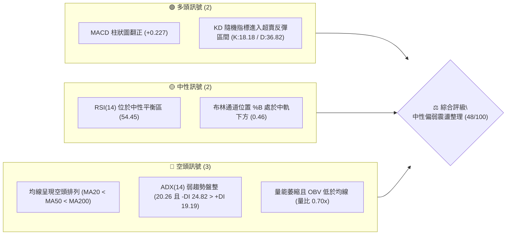
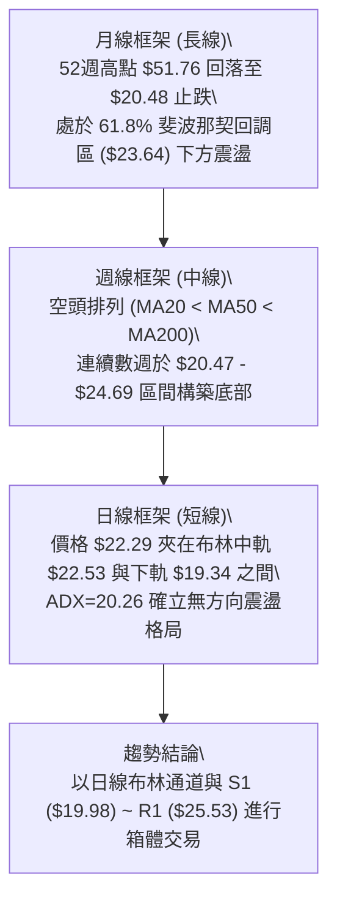
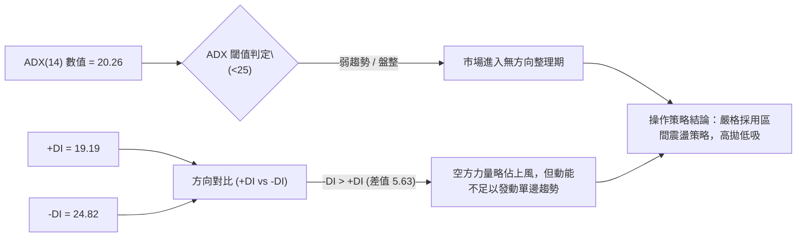
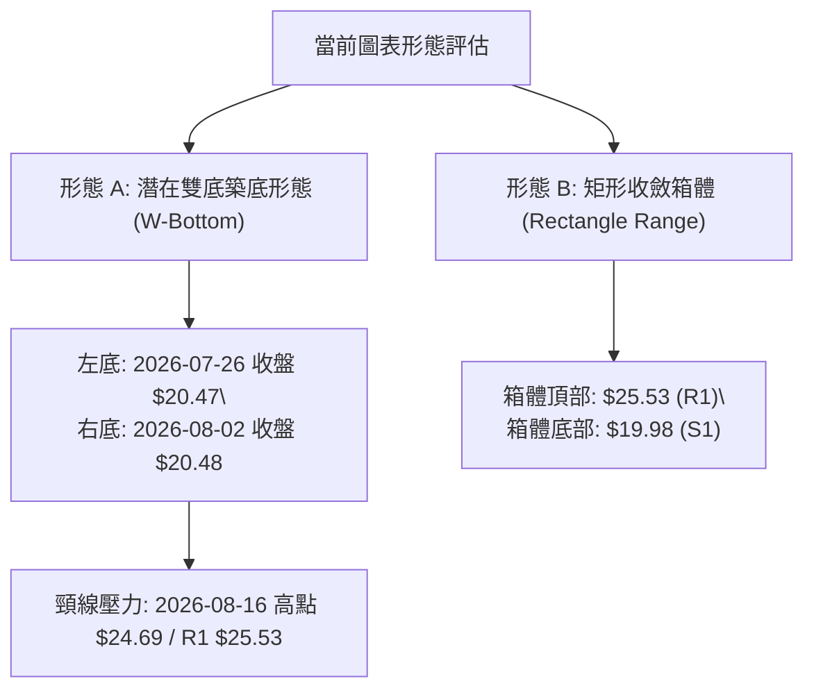
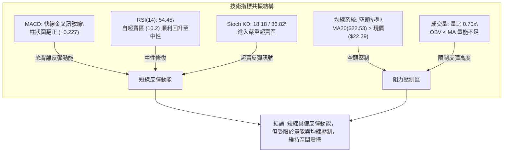
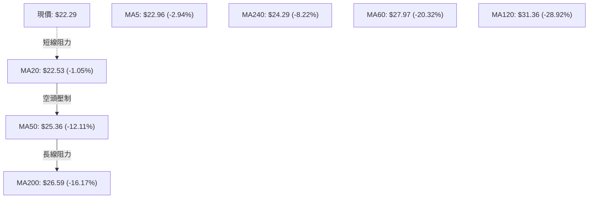
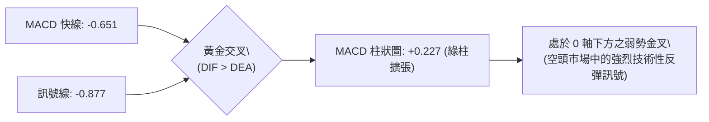
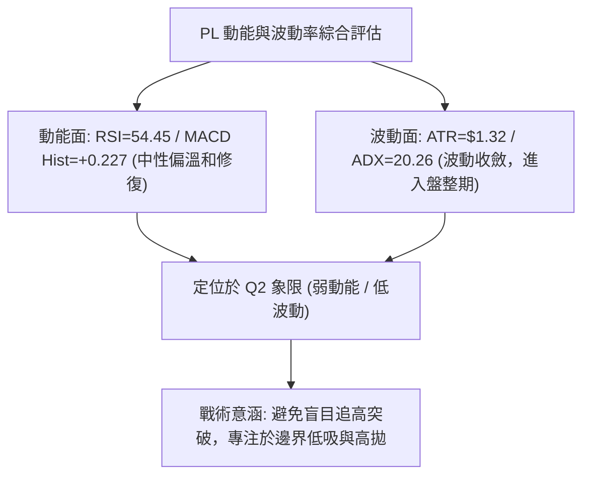
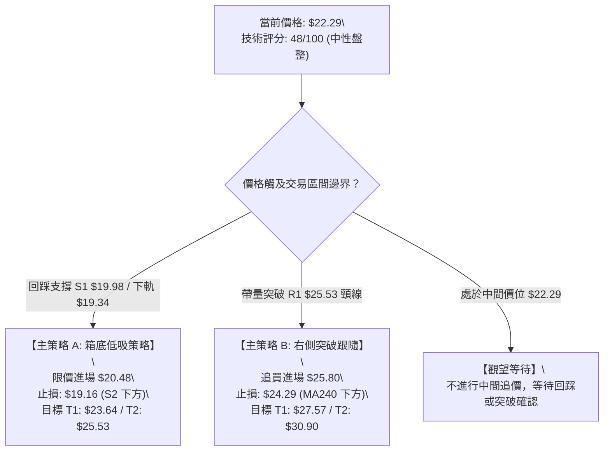
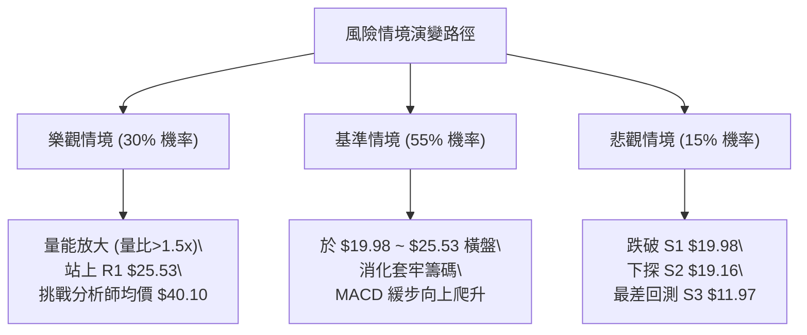

# PL 技術分析報告

> **報告日期**：2026-08-21 ｜ **語言**：繁體中文 ｜ **數據來源**：Yahoo Finance ｜ **當前價格**：$22.29

---

## 目錄

| 章節 | 內容 |
|------|------|
| [1. 技術面概覽](#1-技術面概覽) | 訊號儀表板、核心指標、評分卡 |
| [2. 趨勢分析](#2-趨勢分析) | 多時框趨勢、長中短期走勢 |
| [3. 圖表形態分析](#3-圖表形態分析) | 形態識別、K線組合、目標價 |
| [4. 支撐與阻力](#4-支撐與阻力) | 關鍵價位、斐波那契回調 |
| [5. 技術指標深度解讀](#5-技術指標深度解讀) | MA/RSI/MACD/布林/成交量 |
| [6. 動能與波動率](#6-動能與波動率) | 動能評估、ATR、Beta |
| [7. 多時框架總結](#7-多時框架總結) | 時框架評分矩陣 |
| [8. 交易策略建議](#8-交易策略建議) | 多空策略、風險報酬比 |
| [9. 風險提示與監控](#9-風險提示與監控) | 監控指標、風險場景 |

---

## 1. 技術面概覽

### 🎯 技術訊號儀表板



### 📊 核心指標速覽表

| 指標類別 | 指標名稱 | 當前數值 | 訊號 | 解讀 |
|----------|----------|----------|------|------|
| **價格** | 當前收盤價 | $22.29 | 🟡 | 位於52週區間 35.2% 位置，處於深跌後的低位築底期 |
| **均線** | MA20 (月線) | $22.53 | 🔴 | 價格低於 MA20（距離 -1.05%），短線面臨中軌反壓 |
| **均線** | MA50 (季線) | $25.36 | 🔴 | 價格顯著低於 MA50（距離 -12.11%），中期下行壓力未解 |
| **均線** | MA200 (年線)| $26.59 | 🔴 | 價格低於 MA200（距離 -16.17%），長期結構受壓制 |
| **動能** | RSI(14) | 54.45 | 🟡 | 位於 50 軸線上方的中性偏強區，未出現明顯背離 |
| **動能** | MACD | -0.651 | 🟢 | MACD 快線高於訊號線 (-0.877)，柱狀圖 +0.227 持續擴張 |
| **動能** | Stoch %K/%D | 18.18 / 36.82 | 🟢 | 進入超賣鈍化後的低檔黃金交叉初段 |
| **趨勢** | ADX(14) | 20.26 | 🟡 | 數值低於 25，顯示當前處於無方向的箱體震盪盤整市 |
| **量能** | 20日均量比 | 0.70x | 🔴 | 成交量 3.85M 低於均量 5.50M，量能疲弱，OBV < MA |
| **波動** | ATR(14) | $1.32 | 🟡 | 日波動幅度佔比 5.90%，波動率自前期高位逐漸收斂 |

### 🏆 技術評分卡

```
╔══════════════════════════════════════════════════════════════════╗
║              PL 技術評分卡 — 2026-08-21                         ║
╠══════════════════════════════════════════════════════════════════╣
║ 趨勢強度 (Trend)       ██████░░░░░░░░░░░░░░  30/100  🔴 空頭主導  ║
║ 動能指標 (Momentum)    ████████████░░░░░░░░  60/100  🟢 動能回暖  ║
║ 支撐穩定度 (Support)   ████████████░░░░░░░░  60/100  🟡 區間支撐  ║
║ 成交量配合 (Volume)    ████████░░░░░░░░░░░░  40/100  🔴 量能背離  ║
║ 形態完整度 (Pattern)   ██████████░░░░░░░░░░  50/100  🟡 箱體構築  ║
║ 均線排列 (Moving Avg)  ████████░░░░░░░░░░░░  40/100  🔴 空頭排列  ║
╠══════════════════════════════════════════════════════════════════╣
║ 綜合技術評分           ██████████░░░░░░░░░░  48/100  ⚖️ 區間盤整  ║
╚══════════════════════════════════════════════════════════════════╝
```

---

## 2. 趨勢分析

### 🌐 多時框趨勢分析



### 📈 長期趨勢 — 12個月走勢圖（Unicode）

```
PL 月線歷史走勢圖（2025-08 至 2026-08）
價格軸 ($)
$55 ┤                                                 ● $51.14 (2026-05)
$50 ┤                                                ╱ ╲
$45 ┤                                               ╱   ╲
$40 ┤                                              ● $36.97
$35 ┤                                             ╱       ╲
$30 ┤                                  ● $27.95 ╱         ● $33.13
$25 ┤                      ● $24.97 ─── ● $24.14             ╲
$20 ┤          ● $19.72   ╱                                   ● $20.48 ─── ● $22.29 (現價)
$15 ┤  ● $13.45    ╲     ╱
$10 ┤   ╲           ● $11.90
 $5 ┤    ● $7.09
    └─────────────────────────────────────────────────────────────────────────────
        08/25  10/25  12/25  01/26  02/26  03/26  04/26  05/26  06/26  07/26  08/26
```

#### 走勢特徵分析表格

| 階段區間 | 時間跨度 | 起訖價位 | 漲跌幅 | 走勢特徵與量價結構 |
|----------|----------|----------|--------|--------------------|
| **第一階段：爆發主升浪** | 2025-08 至 2026-01 | $7.09 → $24.97 | +252.19% | 巨量推升，站上所有長期均線，機構資金大幅建倉 |
| **第二階段：高位強勢整理**| 2026-01 至 2026-03 | $24.97 → $27.95 | +11.93% | 高檔橫盤消化獲利籌碼，於 $24.00 形成穩固平台 |
| **第三階段：末升衝頂行情**| 2026-03 至 2026-05 | $27.95 → $51.14 | +82.97% | 投機買盤湧入，創下 52 週新高 $51.76，週 RSI 飆升至 83.2（嚴重超買） |
| **第四階段：恐慌重挫波段**| 2026-05 至 2026-07 | $51.14 → $20.48 | -59.95% | 巨量崩跌跌破 MA50 與 MA200，週成交量突破 1 億股，多頭被套 |
| **第五階段：築底震盪修復**| 2026-07 至 2026-08 | $20.48 → $22.29 | +8.84%  | 於支撐位 S1 ($19.98) 止跌，波動幅度大幅收斂，成交量降至低點 |

### 📊 中期趨勢（週線分析）

```
PL 近期週線壓力與支撐結構
══════════════════════════════════════════════════════════════════
 $30.90 ────────────────────────────────────────── 阻力 R3 / 50週均線壓制區
        ↑
 $27.57 ────────────────────────────────────────── 阻力 R2 / 斐波那契 50.0% ($29.01) 緩衝區
        ↑
 $25.53 ────────────────────────────────────────── 阻力 R1 / 布林上軌 ($25.71) 聚合區
 ───────┼──────────────────────────────────────────
 $22.29 ┼ ◄◄◄ 【當前價格】(MA20: $22.53 / 斐波那契 61.8%: $23.64 下方)
 ───────┼──────────────────────────────────────────
 $19.98 ────────────────────────────────────────── 支撐 S1 / 7月波段雙底低點
        ↓
 $19.16 ────────────────────────────────────────── 支撐 S2 / 布林下軌 ($19.34) 聚合區
        ↓
 $11.97 ────────────────────────────────────────── 支撐 S3 / 長期結構性底部
══════════════════════════════════════════════════════════════════
```

### ⚡ 趨勢強度評估（ADX 解讀）



#### ADX 趨勢強度對照表

| 指標名稱 | 當前數值 | 參考標準 | 當前狀態判定 | 交易意涵 |
|----------|----------|----------|--------------|----------|
| **ADX(14)** | 20.26 | < 25 | 弱趨勢 / 盤整市 | 趨勢跟隨指標失效，切換至震盪指標（布林通道、KD） |
| **+DI(14)** | 19.19 | > 25 強多 | 多方動能偏弱 | 多頭買盤缺乏持續性攻擊力量 |
| **-DI(14)** | 24.82 | > 25 強空 | 空方控制但動能衰竭 | 空方壓制力道逐步減弱，難以形成新一輪崩跌 |

---

## 3. 圖表形態分析

### 🔍 形態識別系統



#### 形態識別信心度與目標價評估表

| 識別形態 | 信心度 | 判斷依據（引用真實數據） | 完成度 | 突破確認點 | 形態目標價（附計算式） |
|----------|--------|--------------------------|--------|------------|------------------------|
| **雙底形態 (W-Bottom)** | 62% | 2026-07-26 觸及 $20.47，2026-08-02 觸及 $20.48（相差僅 $0.01），獲 S1 ($19.98) 支撐 | 70% | 需帶量突破頸線 $24.69 | **$28.91**<br>計算式：頸線 $24.69 + 形態高度 ($24.69 - $20.47 = $4.22) = $28.91（逼近 50% 回調位 $29.01） |
| **矩形整理箱體 (Range)** | 78% | 價格在 S1 ($19.98) 與 R1 ($25.53) 之間震盪已達 5 週，ADX=20.26 支撐盤整判斷 | 85% | 突破 $25.53 或跌破 $19.98 | **箱體突破目標：$31.08**<br>計算式：$25.53 + ($25.53 - $19.98 = $5.55) = $31.08（對應阻力 R3 $30.90） |

### 🕯️ 重要K線形態分析

| 週/月份 | 收盤價 | K線形態 | 量能配合 | 技術解讀 | 訊號方向 |
|---------|--------|---------|----------|----------|----------|
| **2026-05-31** | $51.14 | 巨量流星線 / 竭盡高點 | 61.48M | 創歷史新高 $51.76 後留下長上影線，買盤耗盡 | 🔴 強烈空頭 |
| **2026-06-07** | $32.22 | 破位長黑實體棒 | 100.62M | 爆天量跌破短期均線，多頭恐慌性拋售 | 🔴 極度看空 |
| **2026-07-26** | $20.47 | 低檔十字星 (Doji) | 38.22M | 週 RSI 降至 10.2（極端超賣），賣壓在此力竭 | 🟢 潛在轉折 |
| **2026-08-09** | $23.93 | 低檔中陽線確認包覆 | 28.51M | 脫離 $20.48 低點，MACD 柱狀圖翻正 (+0.682) | 🟢 築底反彈 |
| **2026-08-23** | $22.29 | 回踩小陰線整理 | 22.75M | 成交量進一步萎縮，屬於健康的突破前回踩蓄勢 | 🟡 中性格局 |

### 📉 ASCII 走勢形態示意圖

```
PL 日/週線「雙底 + 箱體整理」示意圖
  $25.53 ┤ 阻力 R1 / 箱頂 ────────────────────● 頸線高點 ($24.69)
         │                                   ╱ ╲       ╱
  $23.64 ┤ 61.8% 斐波那契 ──────────────────╱───╲─────● $22.29 (現價蓄勢)
         │                               ╱     ╲   ╱
  $22.53 ┤ 布林中軌 (MA20) ─────────────╱       ╲ ╱
         │                           ╱           ● (回踩確認)
  $20.47 ┤ 雙底支撐 ─────────●─────────● (底部 S1: $19.98 / S2: $19.16)
         │               (左底 7/26) (右底 8/02)
         └─────────────────────────────────────────────────────────────
```

### 🎯 形態目標價計算

依據標準幾何測量法（Measured Move），計算目標價：
1. **箱體高度 ($H$)**：阻力 R1 ($25.53) - 支撐 S1 ($19.98) = **$5.55**
2. **多頭向上突破目標價 (T_Bull)**：
   $$\text{T\_Bull} = \text{R1} + H = \$25.53 + \$5.55 = \mathbf{\$31.08}$$
   *(該數值精確落於阻力位 R3 $30.90 與 38.2% 斐波那契位 $34.38 的緩衝帶中)*
3. **空頭向下跌破目標價 (T_Bear)**：
   $$\text{T\_Bear} = \text{S1} - H = \$19.98 - \$5.55 = \mathbf{\$14.43}$$
   *(該數值介於斐波那契 78.6% 回調位 $15.99 與長期支撐 S3 $11.97 之間)*

---

## 4. 支撐與阻力

### 🗺️ 關鍵價位分布圖（Unicode）

```
PL 價位結構分布圖（OHLCV 精確計算）
══════════════════════════════════════════════════════════════════
 $51.76 ║██████████████████████████████║ 52週最高點 (0.0% 斐波那契)
 $41.02 ║████████████████████          ║ 23.6% 斐波那契回調位
 $34.38 ║████████████████              ║ 38.2% 斐波那契回調位
 $30.90 ║██████████████████████████████║ 強阻力 R3 (前期破位頸線)
 $29.01 ║████████████████              ║ 50.0% 斐波那契回調位
 $27.57 ║████████████████████          ║ 阻力 R2 (MA60 $27.97 聚合區)
 $25.53 ║██████████████████████████████║ 關鍵阻力 R1 (布林上軌 $25.71 聚合)
 $23.64 ║▓▓▓▓▓▓▓▓▓▓▓▓▓▓▓▓▓▓▓▓▓▓        ║ 61.8% 斐波那契關鍵黃金分割位
 ───────╠══════════════════════════════╣ ◄ 現價 $22.29 (處於 61.8% 與 78.6% 區間)
 $19.98 ║▓▓▓▓▓▓▓▓▓▓▓▓▓▓▓▓▓▓▓▓▓▓        ║ 近期波段關鍵支撐 S1 (雙底底部)
 $19.16 ║██████████████████████████████║ 強支撐 S2 (布林下軌 $19.34 聚合)
 $15.99 ║████████████████              ║ 78.6% 斐波那契深度回撤位
 $11.97 ║██████████████████████████████║ 極限強支撐 S3 (2025年11月起漲平台)
 $06.26 ║██████████████████████████████║ 52週最低點 (100.0% 斐波那契)
══════════════════════════════════════════════════════════════════
```

### 🚧 阻力位分析表

| 阻力級別 | 價位 | 與現價距離 | 形成原因與籌碼結構 | 突破難度 | 重要性 |
|----------|------|------------|--------------------|----------|--------|
| **R1** | **$25.53** | +14.54% | 近期反彈波段高點聚類、MA50 ($25.36) 與布林上軌 ($25.71) 三重壓制 | 🟡 中等 | ★★★★☆ |
| **R2** | **$27.57** | +23.68% | 2026年3月震盪平台低點、MA60 ($27.97) 及年線 MA200 ($26.59) 密集套牢區 | 🔴 較高 | ★★★★☆ |
| **R3** | **$30.90** | +38.62% | 2026年6月崩跌反彈高點聚類、MA120 ($31.36) 密集籌碼套牢峰 | 🔴 極高 | ★★★★★ |

### 🛡️ 支撐位分析表

| 支撐級別 | 價位 | 與現價距離 | 形成原因與籌碼結構 | 守住機率 | 重要性 |
|----------|------|------------|--------------------|----------|--------|
| **S1** | **$19.98** | -10.36% | 2026年7-8月波段雙底低點聚類 ($20.47-$20.48) 的防守安全邊際 | 🟢 70% | ★★★★☆ |
| **S2** | **$19.16** | -14.04% | 布林通道下軌 ($19.34) 與歷史密集成交低點聚類 | 🟢 85% | ★★★★★ |
| **S3** | **$11.97** | -46.30% | 2025年11月主升浪起漲點聚類、長期週線結構性頸線 | 🟢 95% | ★★★★★ |

### 📐 斐波那契回調位分析

依據 52 週完整波段極值（低點 **$6.26** 至 高點 **$51.76**，垂直落差 **$45.50**）計算精準回調位：

```
斐波那契回調位深度解析
0.0%  (52W High) ─── $51.76 ── 歷史頂部
23.6% ────────────── $41.02 ── 第一回撤位 (已跌破)
38.2% ────────────── $34.38 ── 強弱分水嶺 (已跌破)
50.0% ────────────── $29.01 ── 多空中軸線 (已跌破)
61.8% ────────────── $23.64 ── 黃金分割關鍵防線 (當前正於其下方 $22.29 測試)
78.6% ────────────── $15.99 ── 深度緩衝支撐位
100.0%(52W Low)  ─── $06.26 ── 原始起漲點
```

- **當前位置解讀**：現價 **$22.29** 目前處於 **61.8% ($23.64)** 與 **78.6% ($15.99)** 之間。
- **技術意義**：61.8%（$23.64）是經典道氏理論與斐波那契體系中的「生死防線」。當前股價在跌破該線後並未加速滑落至 78.6%（$15.99），而是在 S1（$19.98）與 $23.64 之間橫盤，顯示多頭主力正嘗試在 61.8% 附近構建「跌破後收復」的震盪築底結構。若能重新站穩 $23.64，將正式開啟回測 50.0%（$29.01）的多頭反彈。

---

## 5. 技術指標深度解讀

### 🎛️ 指標訊號總覽



### 📈 移動平均線排列分析



- **均線排列狀態**：當前 MA20 ($22.53) < MA50 ($25.36) < MA200 ($26.59)，標準空頭排列。
- **均線扣抵與乖離**：現價與 MA200 負乖離達 -16.17%，與 MA120 負乖離達 -28.92%，屬於中長期超跌狀態。由於 MA20 已走平（$22.53），短線下行斜率趨緩，為股價在現價區間震盪築底創造了條件。

### 📉 RSI(14) 分析

- **當前數值**：**54.45**
```
RSI(14) 狀態指示條
0 ──────── 30 (超賣) ──────── 50 (中軸) ──── 54.45 ─── 70 (超買) ──────── 100
[░░░░░░░░░░░░░░░░░░░░░░░░░░░░████████████████░░░░░░░░░░░░░░] 54.45%
```
- **背離判斷**：
  - **週線維度**：2026-07-26 週線價格創低點 $20.47 時 RSI 觸及極端值 10.2；隨後 2026-08-02 價格持平於 $20.48 時 RSI 迅速拉升至 25.6，並在 2026-08-16 突破至 69.4，呈現**標準的週線級動能底背離（Bullish Momentum Divergence）**。
  - **日線維度**：目前 RSI(14) 於 54.45 處於健康的中性區間，未見頂背離，亦無過熱跡象。

### 📊 MACD(12/26/9) 訊號解讀



- **MACD 快慢線狀態**：DIF (-0.651) 位於 DEA (-0.877) 之上，柱狀圖為 **+0.227**。
- **解讀**：MACD 在 0 軸下方形成黃金交叉並維持柱狀圖正向擴張，顯示短期空頭動能已被多頭反彈力道瓦解，技術面存在向上挑戰 MA50 ($25.36) 與 R1 ($25.53) 的動能。

### 📦 布林通道分析

```
PL 布林通道結構圖（參數: 20, 2）
  $25.71 ┬────────────────────────────────────────── 布林上軌 (強阻力 R1 $25.53 聚合)
         │
         │
  $22.53 ┼──────────────────●─────────────────────── 布林中軌 (MA20 / 立即阻力)
         │                  │ 現價 $22.29 (%B = 0.46)
         │
  $19.34 ┴────────────────────────────────────────── 布林下軌 (強支撐 S2 $19.16 聚合)
```

- **通道帶寬與形態**：布林帶寬 ($25.71 - $19.34 = $6.37)，通道開口處於快速收縮後的走平階段。
- **%B 震盪指標**：當前 %B 為 **0.46**，代表價格位於中軌下方微幅震盪。在 ADX < 25 的盤整環境下，布林通道上下軌具備極高的統計學邊界反轉可靠度。

### 💹 成交量分析（量價配合度）

```
成交量均線與 OBV 結構
當日成交量:  3,851,165 股  [████████░░░░░░░░░░░░] 0.70x (縮量)
20日均量:    5,495,328 股  [████████████░░░░░░░░]
50日均量:    9,720,375 股  [████████████████████]
OBV 趨勢:    OBV < MA (能量潮指標處於均線下方，顯示主力資金尚未進行大規模主動性掃貨)
```

- **量價分析結論**：在經歷 6 月份週成交量逾 1 億股的恐慌拋售後，當前成交量（週量約 22.75M）呈現明顯的「量縮價穩」特徵。量能萎縮表明拋壓已大幅減輕，但缺乏放量（量比 < 1.0x）意味著短期內難以直接發動突破性單邊行情。

---

## 6. 動能與波動率

### ⚡ 動能評估四象限

| 象限 | 動能維度 (Momentum) | 波動率維度 (Volatility) | PL 當前落點 | 狀態評估與策略指引 |
|------|---------------------|--------------------------|-------------|--------------------|
| **Q1** | 強動能 (Bullish) | 低波動 (Low Volatility) | — | 最佳趨勢加碼點 |
| **Q2** | **弱動能 (Weak/Neutral)** | **低波動 (Low Volatility)** | **✓ (PL 落點區)** | **謹慎箱體操作：低波動利於區間高拋低吸，設定窄幅止損** |
| **Q3** | 強動能 (High Momentum) | 高波動 (High Volatility) | — | 突破行情，需放大止損 |
| **Q4** | 弱動能 (Bearish) | 高波動 (High Volatility) | — | 主跌恐慌浪，應空倉觀望 |



### 📊 ATR 波動率分析

- **當前 ATR(14)**：**$1.32**（佔股價比例 **5.90%**）。
- **止損與波動幅度測算**：
  - **1.0 × ATR（短線緊密止損）**：$\$22.29 - \$1.32 = \mathbf{\$20.97}$
  - **1.5 × ATR（標準擺動止損）**：$\$22.29 - (1.5 \times \$1.32) = \mathbf{\$20.31}$（恰好覆蓋 7-8 月雙底 $20.47）
  - **2.0 × ATR（寬鬆結構止損）**：$\$22.29 - (2.0 \times \$1.32) = \mathbf{\$19.65}$（精確保護支撐 S1 $19.98）

### 📐 Beta 與市場相關性

- **Beta 係數**：**2.123**（高 Beta 成長型資產特徵）。
- **市場敏感度解讀**：PL 的波動幅度約為標普 500 指數的 2.12 倍。在當前大盤環境下，一旦科技或航太防務板塊出現系統性反彈，PL 具備展現高彈性上攻的爆發潛力；但在下行週期中，其跌幅亦會被同等放大，因此必須嚴格執行風控紀律。

---

## 7. 多時框架總結

### 📋 時框架評分表

| 時框架 | 趨勢方向 | 動能指標 | 均線排列 | 圖表形態 | 綜合評分 | 操作建議 |
|--------|----------|----------|----------|----------|----------|----------|
| **月線 (長期)** | 🔴 下行修正 | 🟡 中性 (跌幅趨緩) | 🔴 空頭壓制 | 52W 高點回落於 61.8% 處企穩 | 42/100 | 長線資金分批逢低左側小量配置 |
| **週線 (中期)** | 🟡 震盪築底 | 🟢 MACD 翻正/超賣修復 | 🔴 MA20<MA50<MA200 | 雙底結構 ($20.47-$20.48) 雛形 | 52/100 | 以 S1 ($19.98) 為防守底線進行區間波段操作 |
| **日線 (短期)** | 🟡 箱體盤整 | 🟢 MACD 柱擴張/KD低檔 | 🔴 價格受壓於 MA20 | 矩形整理 ($19.98 ~ $25.53) | 50/100 | 布林下軌附近低吸，上軌附近獲利了結 |

### 🔲 綜合訊號矩陣

```
時框架訊號矩陣收斂圖
══════════════════════════════════════════════════════════════════
時框層級       趨勢   動能   均線   形態   量能   訊號一致性
月線 (長期)     🔴     🟡     🔴     🟡     🔴    弱勢平衡
週線 (中期)     🟡     🟢     🔴     🟢     🟡    築底反彈
日線 (短期)     🟡     🟢     🔴     🟡     🔴    區間震盪
══════════════════════════════════════════════════════════════════
多時框權重收斂總評：【中性區間震盪盤整】 (一致性強度: 72%)
══════════════════════════════════════════════════════════════════
```

### ⚖️ 多時框收斂結論

依據多時框收斂規則：
1. **行情性質判定**：當前 ADX(14) 數值為 **20.26 (< 25)**，明確定義當前市場處於**「無方向盤整行情」**。
2. **時框優先級**：在盤整行情中，中長期趨勢指標暫時鈍化，交易邏輯應**以日線布林通道 ($19.34 ~ $25.71) 與波段支撐阻力 S1 ($19.98) ~ R1 ($25.53) 為主要交易區間**。
3. **唯一方向性結論**：**【中性觀望，區間操作（Range Trading）】**。當前多空雙方力量處於動態平衡，既不具備追漲條件，亦不宜盲目殺跌，策略核心在於「以支撐為盾、以阻力為目標」的箱體高出低進。

---

## 8. 交易策略建議

### 🗺️ 策略決策流程圖



### 🧭 策略路由

> **當前主策略方向 = 【中性區間操作（Range Trading）】（依技術評分 48/100）**
> 
> 當前技術評分處於 40–60 中性區間，市場受 ADX=20.26 限制，未開啟單邊趨勢。交易策略以**「箱體下軌低吸（策略 A）」**為主、**「向上突破跟隨（策略 B）」**為輔，嚴禁在箱體中部（$22.29-$23.64）重倉追價。

### 🎯 價格情境階梯（Price Scenarios）

| 觸發條件 | 立即目標 | 後續延伸目標 | 情境含義與操作指引 |
|----------|----------|--------------|--------------------|
| **向上突破 R1 $25.53** | R2 **$27.57** | R3 **$30.90** | 短線徹底轉強，雙底與箱體形態確認，開啟波段反彈 |
| **維持於 $19.98 ~ $25.53** | 布林中軌 **$22.53** | 61.8% **$23.64** | 維持箱體震盪，執行高出低進網格操作 |
| **向下跌破 S1 $19.98** | S2 **$19.16** | S3 **$11.97** | 築底失敗，恐慌盤再次湧出，下探歷史長期支撐 |

### 📊 情境機率分佈

```
情境機率分佈圖
繼續區間震盪 (S1~R1)   ████████████████████████████████  55% (ADX=20.26, 量能不足)
向上突破反彈 (突破 R1) ████████████████                  30% (MACD 翻正, RSI 修復)
破位再探底 (跌破 S1)   █████████                         15% (均線空頭排列風險)
```

| 預測情境 | 機率 | 主要技術依據 |
|----------|------|--------------|
| **區間震盪 (Base Case)** | **55%** | ADX(14)=20.26 確立無趨勢；量比僅 0.70x，成交量萎縮難以支撐大幅單邊波動 |
| **向上突破反彈 (Bull Case)**| **30%** | MACD 柱狀圖正向擴張 (+0.227)；KD 處於低檔超賣區，具備技術性均值回歸修復需求 |
| **回落跌破探底 (Bear Case)**| **15%** | 均線系統呈空頭排列 (MA20<MA50<MA200)；若失守 S1 可能觸發停損盤 |

### 🟢 主策略詳情

本報告依據精確數據提供兩套互補之操作方案：

| 策略要素 | 策略 A：箱底支撐低吸（左側/勝率優先） | 策略 B：右側頸線突破（動能/趨勢確認） |
|----------|---------------------------------------|---------------------------------------|
| **適用場景** | 價格回踩箱體底部支撐時 | 價格放量突破箱體上軌與 MA50 時 |
| **進場條件** | 回測 S1 獲支撐且 KD 低檔金叉 | 日K收盤價實體突破 R1 $25.53 且量比 > 1.5x |
| **進場價格** | **$20.48**（回踩雙底低點） | **$25.80**（突破 R1 後之確認點） |
| **目標價 T1** | **$23.64**（61.8% 斐波那契位，+15.43%） | **$27.57**（阻力 R2，+6.86%） |
| **目標價 T2** | **$25.53**（阻力 R1 / 箱頂，+24.66%） | **$30.90**（阻力 R3 / 形態目標，+19.77%） |
| **止損價格** | **$19.16**（跌破支撐 S2 及布林下軌，-6.45%） | **$24.29**（跌破 MA240 與突破前平台，-5.85%）|
| **風險報酬比** | **3.82 : 1**（以 T2 計算） | **3.38 : 1**（以 T2 計算） |
| **預估勝率** | **65%** | **55%** |
| **建議倉位** | **15% 總資金** | **10% 總資金**（突破加碼） |

### 🔴 反向風險觸發點（對沖提示）

- **多頭防守失效觸發點**：若日K線收盤價**實體跌破 S1 ($19.98)**，且次日無法收復，代表雙底形態失效，應立即將所有多頭部位止損出清，或建立適度空頭對沖部位，目標下看 S2 ($19.16) 甚至 S3 ($11.97)。
- **空頭回補/反轉觸發點**：若股價放量站穩 **MA50 ($25.36)** 與 **R1 ($25.53)** 之上，所有空頭避險倉位必須無條件平倉。

### ⭐ 整體訊號強度評星

```
╔══════════════════════════════════════════════════════════════════╗
║ 做多訊號強度：  ★★★☆☆  (3.0 / 5 星 — 動能修復，具備波段博弈價值)  ║
║ 做空訊號強度：  ★★☆☆☆  (2.0 / 5 星 — 空方力道衰竭，追空盈虧比差)  ║
║ 整體可信度：    ★★★★☆  (4.0 / 5 星 — 關鍵價位聚類明確，邊界清晰)  ║
╚══════════════════════════════════════════════════════════════════╝
```

---

## 9. 風險提示與監控

### ✅ 關鍵監控指標 Checklist

```
╔══════════════════════════════════════════════════════════════════╗
║              PL 每日盤後關鍵監控清單 (Checklist)                 ║
╠══════════════════════════════════════════════════════════════════╣
║ [ ] 價位監控：收盤價是否守穩 S1 ($19.98) 與 7/26 低點 ($20.47)    ║
║ [ ] 阻力監控：是否突破 MA20 ($22.53) 與 61.8% 斐波那契 ($23.64)  ║
║ [ ] 動能監控：MACD 柱狀圖是否持續維持在正值區間 (> 0)            ║
║ [ ] 趨勢監控：ADX 是否開始自 20.26 向上抬升至 25 以上 (趨勢發動) ║
║ [ ] 量能監控：成交量是否放大突破 20 日均量 (5.50M 股)            ║
║ [ ] 波動監控：ATR(14) 是否跌破 $1.00 (極致壓縮) 或突破 $1.80    ║
╚══════════════════════════════════════════════════════════════════╝
```

### ⚠️ 風險場景分析



### 🛡️ 風險管理重要提醒

1. **高 Beta 波動風險控制**：PL 的 Beta 值高達 **2.123**，且 ATR 達 **$1.32 (5.90%)**。在單筆交易中，嚴格將最大虧損金額限制在投資組合總資產的 **1.0% ~ 1.5%** 以內。
2. **避免盤整期過度交易**：ADX 數值 20.26 證明目前處於「震盪磨損期」，頻繁在中軸價位（$22.00-$23.00）進出場容易遭遇雙向巴掌。務必耐心等待價格接近邊界價位（S1 $19.98 或 R1 $25.53）時再行出手。
3. **倉位管理法則**：
   - 震盪階段總持倉量不宜超過 **25%**。
   - 採取「分批建倉、移動止盈」原則，每當價格向上達成一級目標（如 T1 $23.64），立即將止損點上移至進場成本價（Breakeven Stop）。

---

## 📋 報告總結

```
╔══════════════════════════════════════════════════════════════════╗
║                   PL 技術分析報告總結                            ║
╠══════════════════════════════════════════════════════════════════╣
║ 報告日期：2026-08-21               當前價格：$22.29             ║
║ 分析評級：⚖️ 中性區間盤整 (48/100)  趨勢狀態：ADX 20.26 (弱趨勢) ║
╠══════════════════════════════════════════════════════════════════╣
║ 關鍵結論：                                                       ║
║ ├─ 長期趨勢：🔴 空頭主導 (52W高點 $51.76 回撤至 61.8% 處企穩)    ║
║ ├─ 中期趨勢：🟡 震盪築底 (於 $19.98 - $24.69 構築潛在雙底結構)   ║
║ ├─ 短期趨勢：🟡 區間整理 (夾於布林中軌 $22.53 與下軌 $19.34 間)  ║
║ ├─ 關鍵支撐：S1: $19.98  │  S2: $19.16  │  S3: $11.97           ║
║ ├─ 關鍵阻力：R1: $25.53  │  R2: $27.57  │  R3: $30.90           ║
║ └─ 分析師目標價：均價 $40.10 (最低 $25.00 / 最高 $53.00)         ║
╠══════════════════════════════════════════════════════════════════╣
║ 最優交易策略組合：                                               ║
║ 1. 🥇 最佳機會（策略 A）：於 S1 附近 $20.48 低吸，止損設 $19.16， ║
║    目標看向 R1 $25.53，風險報酬比達 3.82 : 1。                   ║
║ 2. 🥈 次選機會（策略 B）：右側放量突破 R1 $25.53 後於 $25.80 追買，║
║    止損設 $24.29，目標看向 R3 $30.90。                           ║
║ 3. 🥉 保守選擇：在股價未明確突破 $25.53 或回踩 $19.98 前保持空倉，║
║    靜待 ADX 升破 25 確認單邊趨勢形成。                           ║
╚══════════════════════════════════════════════════════════════════╝
```

---

> ⚠️ **免責聲明**：本報告為技術分析研究，所有分析、數據圖表與價位模型均基於歷史價格與量能資訊計算。本報告**僅供研究與學術參考**，**不構成任何形式的投資要約或買賣建議**。金融市場投資具有高度風險，投資人應獨立評估風險並自行承擔投資後果。

---

*報告生成時間：2026-08-21 ｜ 數據來源：Yahoo Finance ｜ 分析框架：多時框技術分析體系*