# PL 技術分析報告

> **報告日期**：2026-08-22 ｜ **語言**：繁體中文 ｜ **數據來源**：Yahoo Finance ｜ **當前價格**：$22.29

---

## 目錄

| 章節 | 內容 |
|------|------|
| [1. 技術面概覽](#1-技術面概覽) | 訊號儀表板、核心指標、評分卡 |
| [2. 趨勢分析](#2-趨勢分析) | 多時框趨勢、長中短期走勢 |
| [3. 圖表形態分析](#3-圖表形態分析) | 形態識別、K線組合、目標價 |
| [4. 支撐與阻力](#4-支撐與阻力) | 關鍵價位、斐波那契回調 |
| [5. 技術指標深度解讀](#5-技術指標深度解讀) | MA/RSI/MACD/布林/成交量 |
| [6. 動能與波動率](#6-動能與波動率) | 動能評估、ATR、Beta |
| [7. 多時框架總結](#7-多時框架總結) | 時框架評分矩陣 |
| [8. 交易策略建議](#8-交易策略建議) | 多空策略、風險報酬比 |
| [9. 風險提示與監控](#9-風險提示與監控) | 監控指標、風險場景 |

---

## 1. 技術面概覽

### 🎯 技術訊號儀表板

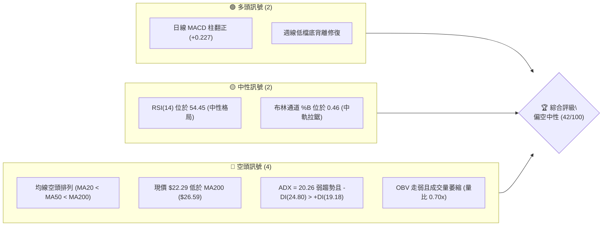

### 📊 核心指標速覽表

| 指標類別 | 指標名稱 | 當前數值 | 訊號 | 解讀 |
|----------|----------|----------|------|------|
| **價格** | 當前價格 | $22.29 | 🟡 | 位於52週區間 35.2% 處，處於深度回調後的築底整理期 |
| **均線** | MA20 | $22.53 | 🔴 | 價格低於MA20（差距 -1.05%），短線承壓 |
| **均線** | MA50 | $25.36 | 🔴 | 價格低於MA50（差距 -12.11%），中期偏空壓制 |
| **均線** | MA200 | $26.59 | 🔴 | 價格顯著低於年線，中長期大趨勢呈現下行修正 |
| **動能** | RSI(14) | 54.45 | 🟡 | 中性區間，自超賣區修復但未進入強勢擴張區 |
| **動能** | MACD | -0.651 (Hist +0.227) | 🟢 | MACD柱狀圖翻正，零軸下方金叉初現，反彈動能醞釀 |
| **波動** | ATR(14) | $1.32 (5.91%) | 🟡 | 波動率較高點明顯收斂，處於常態盤整波幅 |
| **趨勢** | ADX(14) | 20.26 (-DI 24.80) | 🔴 | ADX < 25 代表趨勢動能衰退，空方佔優但偏向低動能橫盤 |

### 🏆 技術評分卡

```
╔══════════════════════════════════════════════════════════════╗
║                 技術評分卡 — PL (2026-08-22)                 ║
╠══════════════════════════════════════════════════════════════╣
║ 趨勢強度      ██████░░░░░░░░░░░░░░  30/100  🔴 弱勢盤整       ║
║ 動能指標      ███████████░░░░░░░░░  55/100  🟡 短線微幅修復   ║
║ 支撐穩定度    ██████████░░░░░░░░░░  50/100  🟡 S1($19.98)測試 ║
║ 成交量配合    ██████░░░░░░░░░░░░░░  30/100  🔴 量能萎縮背離   ║
║ 形態完整度    ████████░░░░░░░░░░░░  40/100  🟡 區間箱體醞釀   ║
║ 均線排列      ████░░░░░░░░░░░░░░░░  20/100  🔴 典型空頭排列   ║
╠══════════════════════════════════════════════════════════════╣
║ 綜合評分      ████████░░░░░░░░░░░░  42/100  🟡 中性偏空震盪   ║
╚══════════════════════════════════════════════════════════════╝
```

---

## 2. 趨勢分析

### 🌐 多時框趨勢分析

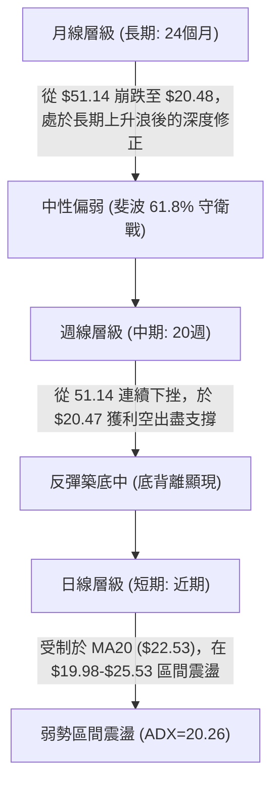

### 📈 長期趨勢 — 12個月走勢圖（Unicode）

```
PL 月線走勢圖（過去12個月：2025-08 至 2026-08）
價格軸 ($)
$52.00 ┤                                     ● $51.14 (2026-05)
$46.00 ┤                                    / \
$40.00 ┤                                   /   \
$34.00 ┤                             ●    /     ● $33.13 (2026-06)
$28.00 ┤                       ●    /    /       \
$22.00 ┤                 ●    /    /    /         ● $20.48 ──● $22.29 (現價)
$16.00 ┤           ●    /    /    /    /
$10.00 ┤     ●    /    /    /    /    /
 $4.00 ┤●   /    /    /    /    /    /
       └───────────────────────────────────────────────────────────
        08   09   10   11   12   01   02   03   04   05   06   07   08 (月份)
        '25                                      '26
```

#### 走勢特徵分析表格

| 階段區間 | 時間跨度 | 起止價格 | 漲跌幅 | 走勢特徵與量能解讀 |
|----------|----------|----------|--------|--------------------|
| 主升起浪期 | 2025-08 至 2025-12 | $7.09 → $19.72 | +178.14% | 突破底部箱體，機構持股提升，成交量放大 |
| 延伸噴發期 | 2026-01 至 2026-05 | $24.97 → $51.14 | +104.81% | 瘋狂主升浪，RSI 衝破 83.2 超買極值，巨量推升 |
| 斷崖崩跌期 | 2026-06 至 2026-07 | $51.14 → $20.48 | -59.95% | 單週成交量破億（100.6M），多頭踩踏破線 |
| 止跌修復期 | 2026-07 至 2026-08 | $20.48 → $22.29 | +8.84% | 量能急凍（降至 22.7M），於斐波 61.8% 附近縮量築底 |

### 📊 中期趨勢（週線分析）

```
中期關鍵波段走勢示意：
$51.76 (52W High) ──────────┐ (高點聚類潰敗)
                            │
                            ▼
                    $34.38 (38.2% 回調位 - 跌破)
                            │
                            ▼
                    $27.57 (中期阻力 R2 / MA60 $27.97)
                            │
現價 $22.29 ───────► ─── 區間震盪整理 ─── (中軌 $22.53 爭奪)
                            ▲
                            │
                    $19.98 (近一年波段低點 S1)
                    $19.16 (強支撐 S2 / 布林下軌 $19.34)
```

中期週線在經歷 2026年6月 的連續殺跌後，目前於 $20.47–$20.48 區域形成雙週低點確認，週線 RSI 自 10.2 的極度超賣水平回升至 54.4，週線 MACD 柱狀圖亦由 -1.972 收斂至 +0.227，中期跌勢已進入減速收斂期。

### ⚡ 趨勢強度評估（ADX 解讀）

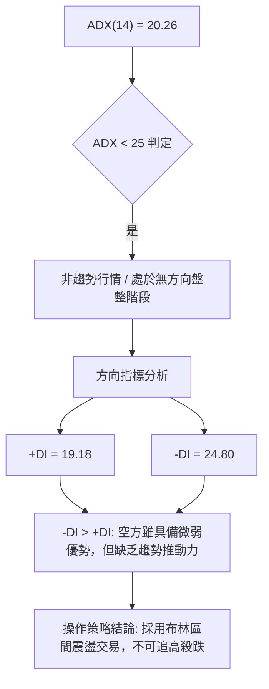

| 指標名稱 | 當前數值 | 參考臨界值 | 狀態評估 | 技術含義 |
|----------|----------|------------|----------|----------|
| ADX(14) | 20.26 | 25.00 | 弱趨勢/盤整 | 行情缺乏單邊推動力，趨勢策略容易反覆被侵蝕 |
| +DI (14) | 19.18 | 20.00 | 偏弱 | 多頭買盤力道薄弱，尚未形成攻擊發起結構 |
| -DI (14) | 24.80 | 20.00 | 偏強 | 空頭掌控主導權，但動能正在持續衰減 |
| DI 差值 | -5.62 | 0.00 | 空方微弱領先 | 空頭未能進一步擴大戰果，市場進入僵局平衡 |

---

## 3. 圖表形態分析

### 🔍 形態識別系統

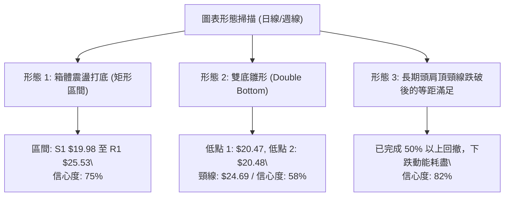

#### 圖表形態信心度與目標價評估

| 形態名稱 | 信心度 | 判斷依據（引用數據） | 完成度 | 目標價（附計算式） |
|----------|--------|----------------------|--------|--------------------|
| 矩形箱體震盪 | 75% | 價格在 S1 ($19.98) 與 R1 ($25.53) 之間運行 4 週 | 65% | 向上突破目標：$25.53 + ($25.53 - $19.98) = **$31.08**（接近 R3 $30.90） |
| 潛在雙重底 (W底) | 58% | 2026-07-26 低點 $20.47 與 2026-08-02 低點 $20.48 形成雙底，頸線為 2026-08-16 高點 $24.69 | 45% | 形態高度 = $24.69 - $20.47 = $4.22；突破目標 = $24.69 + $4.22 = **$28.91**（接近 50% 斐波位 $29.01） |
| 下降楔形收斂 | 48% | 高點由 $51.14 下降至 $31.38, $24.69，低點在 $20.48 止跌，但數據收斂天數不足 60 天 | 35% | 訊號不足，僅做指標型解讀，暫不依此設定極端目標 |

### 🕯️ 重要K線形態分析

| 日期 / 週別 | 收盤價 | K線形態 | 解讀 | 訊號 |
|-------------|--------|---------|------|------|
| 2026-05-31 | $51.14 | 巨量天花板倒錘長上影 | 觸及 52W 高點 $51.76 後多頭力竭，主力資金獲利出逃 | 🔴 極度危險 |
| 2026-06-07 | $32.22 | 破位大黑K (長陰線) | 週成交量爆出 100.6M 股，直接貫穿 MA20 與 MA50，趨勢反轉 | 🔴 空頭突穿 |
| 2026-07-26 | $20.47 | 恐慌拋售十字星 | RSI 跌至極端值 10.2，伴隨量能萎縮，呈現空頭動能衰竭拋補 | 🟡 止跌訊號 |
| 2026-08-09 | $23.93 | 底部起漲中陽線 | 週漲幅顯著，MACD 柱狀圖由負翻正 (+0.682)，多頭反撲 | 🟢 短線買訊 |
| 2026-08-23 | $22.29 | 回踩確認小陰線 | 量能驟降至 22.7M，回測 MA20 支撐，屬於縮量良性回調 | 🟡 觀望蓄勢 |

### 📉 ASCII 走勢形態示意圖

```
PL 近期底部形態解析（2026-07 至 2026-08）
===================================================================
$25.53 ┤ (R1 阻力線 / 箱體頂部) ───────────────────┐
       │                                           │ (假突破回落)
$24.69 ┤                             ● (頸線高點)  │
       │                            / \            │
$22.29 ┤ (現價) ────────────►      /   ● ◄── 現價測試 MA20 ($22.53)
       │                         /
$20.48 ┤             ● ──────── ● (雙底支撐帶 / 箱體底部)
       │            (底1)      (底2)
$19.98 ┤ (S1 關鍵支撐線) ──────────────────────────┴
===================================================================
```

### 🎯 形態目標價計算

若底部「矩形箱體震盪」確認形成向上突破，其計算方式如下：
1. **箱體底部**：$19.98 (S1 支撐位)
2. **箱體頂部**：$25.53 (R1 阻力位)
3. **形態高度 ($H$)**：$25.53 - $19.98 = \$5.55$
4. **向上突破最小測幅目標價 ($T_1$)**：
   $$\text{頸線/頂部} + H = 25.53 + 5.55 = \mathbf{\$31.08}$$
   *(註：此推算價位高度吻合數據中之強阻力位 R3: $30.90 與 120日均線 MA120: $31.36)*
5. **第二延伸目標價 ($T_2$)**：斐波那契 38.2% 回調位 **$34.38**

---

## 4. 支撐與阻力

### 🗺️ 關鍵價位分布圖（Unicode）

```
PL 價位結構分布圖
╔══════════════════════════════════════════════════════════════════╗
║ $51.76 ║████████████████████████████████████████║ 52W 最高點    ║
║ $41.02 ║████████████████████████████            ║ 斐波 23.6%    ║
║ $34.38 ║████████████████████                    ║ 斐波 38.2%    ║
║ $30.90 ║████████████████████████████████        ║ 強阻力 R3     ║
║ $29.01 ║████████████████                        ║ 斐波 50.0%    ║
║ $27.57 ║████████████████████                    ║ 阻力 R2       ║
║ $25.53 ║████████████████████████                ║ 關鍵阻力 R1   ║
║ $23.64 ║▓▓▓▓▓▓▓▓▓▓▓▓▓▓▓▓▓▓                      ║ 斐波 61.8%    ║
║ $22.29 ╠════════════════════════════════════════╣ ◄ 現價 ($22.29)║
║ $19.98 ║▓▓▓▓▓▓▓▓▓▓▓▓▓▓▓▓▓▓▓▓                    ║ 近期支撐 S1   ║
║ $19.16 ║████████████████████████                ║ 強支撐 S2     ║
║ $15.99 ║████████████                            ║ 斐波 78.6%    ║
║ $11.97 ║████████████████████████████████        ║ 終極強支撐 S3 ║
║ $06.26 ║████████████████████████████████████████║ 52W 最低點    ║
╚══════════════════════════════════════════════════════════════════╝
```

### 🚧 阻力位分析表

| 阻力級別 | 價位 | 形成原因 | 突破難度 | 重要性 |
|----------|------|----------|----------|--------|
| **R1** | **$25.53** | 近一年波段高點聚類、布林上軌 ($25.71) 與 MA50 ($25.36) 共振區 | 高（需要量能放大 1.5x 以上） | 🟢 關鍵短期多空分水嶺 |
| **R2** | **$27.57** | 近一年波段高點聚類、MA60 ($27.97) 及 MA200 ($26.59) 密集套牢帶 | 極高（中期強套牢賣壓密集） | 🟡 中期多頭防守警戒線 |
| **R3** | **$30.90** | 近一年波段高點聚類、MA120 ($31.36) 重疊壓力帶 | 極高（需基本面或大盤強勢催化） | 🔴 長期趨勢反轉確認點 |

### 🛡️ 支撐位分析表

| 支撐級別 | 價位 | 形成原因 | 守住機率 | 重要性 |
|----------|------|----------|----------|--------|
| **S1** | **$19.98** | 近一年波段低點聚類、整數心理關卡 ($20.00) | 70% | 🟢 短線多頭最後防線 |
| **S2** | **$19.16** | 近一年波段低點聚類、布林通道下軌 ($19.34) 重疊區 | 85% | 🟡 中期強支撐底線 |
| **S3** | **$11.97** | 歷史密集成交平台、近一年波段低點聚類（深淵防線） | 95% | 🔴 崩盤級防線 (數據中未偵測到中間其他支撐) |

### 📐 斐波那契回調位分析

依據 52 週極值區間（最低點 **$6.26** 至 最高點 **$51.76**，垂直空間 **$45.50**）計算之黃金分割水準如下：

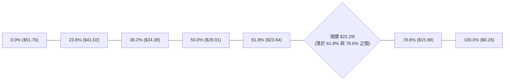

- **當前位置解讀**：現價 **$22.29** 位於 **61.8% 回調位 ($23.64)** 與 **78.6% 回調位 ($15.99)** 之間。
- **黃金分割意義**：61.8% ($23.64) 為傳統多頭防守的最關鍵「黃金回調位」。PL 目前在 $22.29 微幅跌破該線，但仍在其上下 5% 範圍內拉鋸。若週線收盤能重新站上 $23.64，則確立多頭主升浪後的正常深度修正完畢；若持續受制於 $23.64 之下，則可能進一步向 78.6% ($15.99) 回測尋求支撐。

---

## 5. 技術指標深度解讀

### 🎛️ 指標訊號總覽

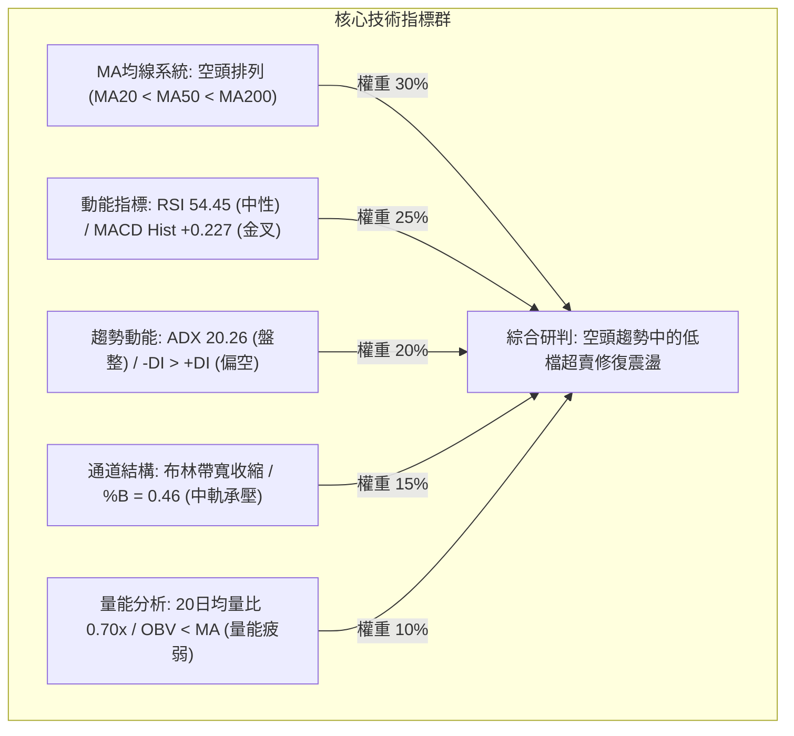

### 📈 移動平均線排列分析

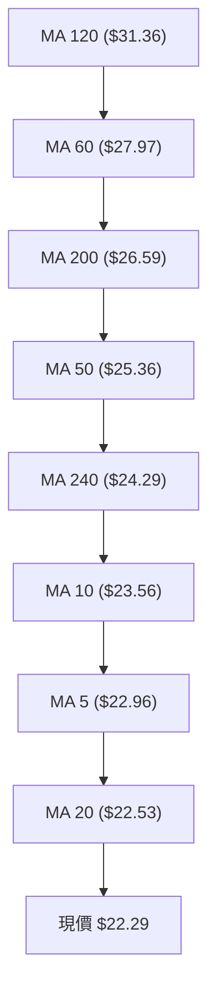

#### 均線數據狀態解析

| 均線名稱 | 當前價格 | 與現價乖離 | 走勢微圖特徵 | 訊號解讀 |
|----------|----------|------------|--------------|----------|
| **MA 5** | $22.96 | -2.94% | 短期下行減速 | 短線壓力，跌破後轉為日內阻力 |
| **MA 10** | $23.56 | -5.37% | 短期下彎壓制 | 短波段反彈第一阻力 |
| **MA 20** | $22.53 | -1.05% | 走平拉鋸中 | 處於布林中軌，短線多空必爭之地 |
| **MA 50** | $25.36 | -12.11% | 中期穩定下行 | 中期強阻力，未突破前中期趨勢偏空 |
| **MA 60** | $27.97 | -20.32% | 中長期下行 | 季線下彎，上方存在強大套牢賣壓 |
| **MA 120** | $31.36 | -28.92% | 半年線下穿 | 長期多空分水嶺 |
| **MA 200** | $26.59 | -16.17% | 年線走平偏下 | 價格位於年線下方，判定為中長期熊市修正格局 |
| **MA 240** | $24.29 | -8.22% | 長週期支撐轉阻力 | 密集交易帶下沿 |

### 📉 RSI(14) 分析

- **當前數值**：**54.45**
- **強度進度條**：`███████████░░░░░░░░░ 54.45%` (中性偏平衡區間)
- **超買超賣判定**：數值介於 30 至 70 之間，脫離了 2026-07-26 的極度超賣區（當時週線 RSI 僅 10.2），目前處於動能常態化修復階段。
- **背離分析**：
  - **日線層級**：無明顯頂背離或底背離。
  - **週線層級**：出現顯著**隱性底背離**——價格在 2026-07-26 創低 $20.47 (RSI=10.2)，隨後 2026-08-02 價格收在 $20.48，而 RSI 顯著回升至 25.6 並進一步推升至 54.4，確認了空頭拋壓竭盡，為短線築底提供技術面支撐。

### 📊 MACD(12/26/9) 訊號解讀

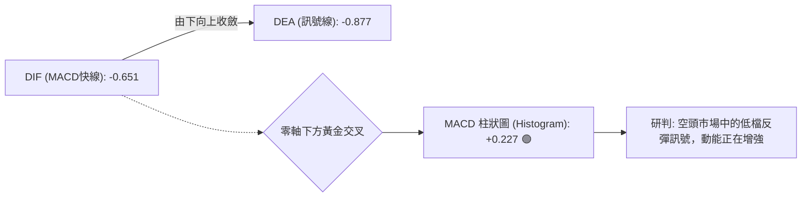

- **MACD 快線**：-0.651
- **Signal 慢線**：-0.877
- **Histogram 柱狀圖**：**+0.227**（連續多日維持正值，且週線 MACD 柱亦翻正至 +0.227）
- **解讀**：雙線雖在零軸下方運行（大環境仍屬弱勢市場），但快線已向上穿越慢線形成零軸下金叉，柱狀圖持續擴展，顯示短線空頭力道衰退，多頭反彈動能正在釋放。

### 📦 布林通道分析

```
PL 布林通道位置示意圖 (寬度收縮中)
===================================================================
$25.71 ┤ (BB 上軌) ─────────────────────────── [阻力 R1 $25.53 附近]
       │
       │
$22.53 ┤ (BB 中軌 / MA20) ────┬────────────── [多空拉鋸線]
       │                      │ ◄── 現價 $22.29 (BB %B = 0.46)
       │                      │
$19.34 ┤ (BB 下軌) ───────────┴─────────────── [強支撐 S2 $19.16 附近]
===================================================================
```

- **布林帶寬與位置**：上軌 **$25.71**，中軌 **$22.53**，下軌 **$19.34**。
- **指標數值**：**%B = 0.46**（0 代表下軌，0.5 代表中軌，1.0 代表上軌）。
- **特徵解讀**：現價落於中軌稍下方，通道帶寬正在劇烈收窄，暗示經過 6-7月 的大幅單邊波動後，市場波動率已被大幅壓縮，即將進入「布林帶擠壓 (Bollinger Squeeze)」突破前期。在 ADX < 25 的背景下，上下軌（$19.34 - $25.71）構成當前高勝率的震盪運行區間。

### 💹 成交量分析（量價配合度）

- **最新成交量**：3,853,500 股
- **20日均量**：5,495,445 股（**量比 0.70x**）
- **50日均量**：9,720,422 股
- **OBV 趨勢**：**OBV < MA**（量能疲弱，資金未見大規模淨流入）
- **量價關係判斷**：
  1. **上漲縮量、下跌縮量**：近期股價自 $20.48 反彈至 $24.69 期間，週成交量由 38.2M 降至 23.5M；最新一週回落至 $22.29，週成交量進一步降至 22.7M。
  2. **量價結論**：呈現典型的「低檔縮量盤整」特徵。多頭追高意願不足（量能無法突破 20日均量），但空頭亦無意願在此位置繼續殺跌。OBV 位於均線下方說明機構主力目前處於被動觀望與逢低吸籌階段，尚未發動攻擊性行情。

---

## 6. 動能與波動率

### ⚡ 動能評估四象限

| 象限代號 | 動能特徵 | 波動率特徵 | 當前狀態評估 | 戰術策略建議 |
|----------|----------|------------|--------------|--------------|
| **象限 I** | 強動能 (Trend) | 低波動 (Low Vol) | — | 最佳波段加碼區 |
| **象限 II** | **弱動能 (Weak)** | **低波動 (Low Vol)** | **✓ (PL 當前處於此象限)** | **區間高拋低吸，嚴設止損觀望** |
| **象限 III** | 強動能 (Trend) | 高波動 (High Vol) | — | 趨勢突破追價，嚴格移動止盈 |
| **象限 IV** | 弱動能 (Weak) | 高波動 (High Vol) | — | 劇烈震盪洗盤，避免進場交易 |

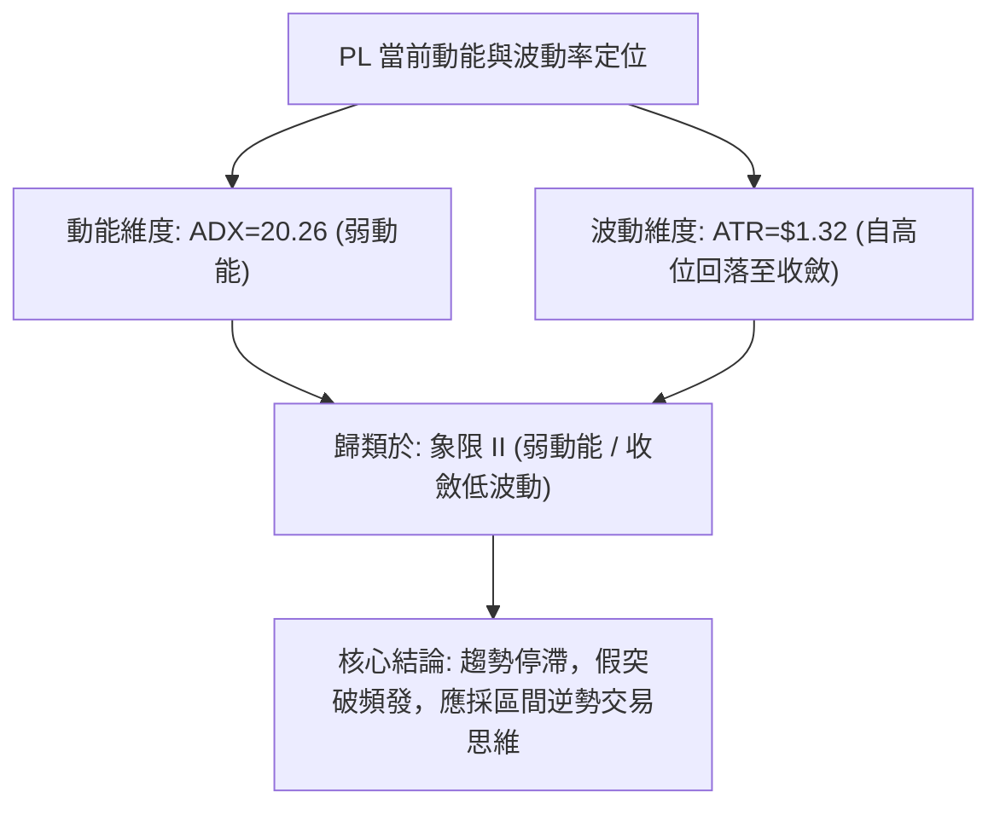

### 📊 ATR 波動率分析

- **ATR(14)**：**$1.32**
- **價格佔比**：**5.91%** of price
- **歷史對比**：相較於 2026年5-6月 頂部區域單週波幅超過 $10.00，當前 ATR 已收斂至常態化水準。
- **交易風控指引**：
  - **日內防守波動空間**：$1.32
  - **標準波段止損距離 (1.5x ATR)**：$1.32 \times 1.5 = \mathbf{\$1.98}$
  - **寬鬆趨勢止損距離 (2.0x ATR)**：$1.32 \times 2.0 = \mathbf{\$2.64}$

### 📐 Beta 與市場相關性

- **Beta 係數**：**2.123**
- **市場屬性解讀**：PL 屬於**極高波動性（High-Beta）成長/科技股**，其波動幅度為標普500指數的 2.12 倍以上。
- **聯動效應**：在市場整體情緒偏好擴張時具備極高爆發力，但在大盤回調或流動性收緊時將承受雙倍下行風險。高達 85.2% 的機構持股比例與 9.7% 的做空比例（Short % Float，空頭回補天數 3.33 天）顯示，一旦價格向上突破關鍵阻力，極易引發軋空（Short Squeeze）行情。

---

## 7. 多時框架總結

### 📋 時框架評分表

| 時框架 | 趨勢方向 | 動能狀態 | 均線排列 | 形態結構 | 綜合評分 | 操作建議 |
|--------|----------|----------|----------|----------|----------|----------|
| **月線 (長期)** | 🔴 偏空修正 | 🟡 修正中 | 🟡 均線收斂 | 斐波 61.8% 測試 | 45/100 | 長期投資者分批逢低配置 |
| **週線 (中期)** | 🔴 空頭掌控 | 🟢 底背離翻正 | 🔴 空頭排列 | 雙底雛形構築 | 45/100 | 等待突破頸線確認 |
| **日線 (短期)** | 🟡 區間震盪 | 🟢 MACD金叉 | 🔴 空頭排列 | 布林中下軌拉鋸 | 42/100 | 區間內高拋低吸 |

### 🔲 綜合訊號矩陣

```
╔══════════════════════════════════════════════════════════════════╗
║                    多時框架技術指標訊號矩陣                      ║
╠════════════════╦══════════════╦══════════════════╦═══════════════╣
║ 指標類別       ║ 短期 (日線)  ║ 中期 (週線)      ║ 長期 (月線)   ║
╠════════════════╬══════════════╬══════════════════╬═══════════════╣
║ 趨勢方向 (MA)  ║ 🔴 MA20 下方 ║ 🔴 MA50 下方     ║ 🔴 MA200 下方 ║
║ 動能指標 (RSI) ║ 🟡 RSI 54.45 ║ 🟡 RSI 54.40     ║ 🔴 深度回調   ║
║ 擺動指標(MACD) ║ 🟢 柱狀翻正  ║ 🟢 底部金叉醞釀  ║ 🔴 零軸下方   ║
║ 趨勢強度 (ADX) ║ 🔴 弱勢 (20) ║ 🟡 減速中        ║ 🟢 歷史高動能 ║
║ 量能配合 (OBV) ║ 🔴 量能萎縮  ║ 🔴 換手沉澱      ║ 🟡 長線沉澱   ║
╠════════════════╬══════════════╬══════════════════╬═══════════════╣
║ 維度加權結論   ║ 🟡 震盪整理  ║ 🟡 築底修復      ║ 🔴 大級別空頭 ║
╚════════════════╩══════════════╩══════════════════╩═══════════════╝
```

### ⚖️ 多時框收斂結論

依據多時框收斂規則：
1. **趨勢/盤整判定**：當前 ADX(14) 為 **20.26 (<25)**，嚴格判定當前市場處於**「盤整行情」**而非單邊趨勢行情。
2. **主導規則**：盤整行情下，應以**日線布林通道區間（$19.34 - $25.71）**及波段支撐阻力為核心交易依據，不宜過度依賴長期均線追逐單邊。
3. **最終方向性結論**：**【中性偏空觀望，區間箱體操作】**（綜合評分 **42/100**）。在中期空頭排列壓制與短期 MACD 低檔金叉的矛盾中，行情將維持在 **$19.98 (S1) 至 $25.53 (R1)** 之間進行時間換空間的震盪築底。

---

## 8. 交易策略建議

### 🗺️ 策略決策流程圖

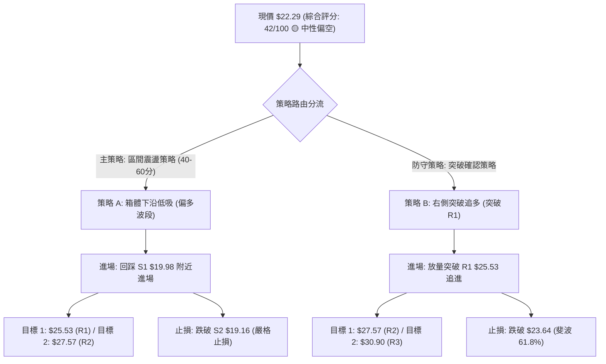

### 🧭 策略路由

> **當前主策略方向 = 區間震盪防守操作（依技術評分 42/100，介於 40–60 之中性區間，以布林上下軌與波段高低點為界，等待突破確認）**

### 🎯 價格情境階梯（Price Scenarios）

| 觸發條件 | 下一目標 | 後續延伸 | 情境含義與技術應對 |
|----------|----------|----------|--------------------|
| **強勢突破 R1 ($25.53)** | **R2 ($27.57)** | **R3 ($30.90)** | 突破日線箱體與 MA50，確認底部構築完成，轉為多頭攻擊波 |
| **維持於現價區間 ($22.29)** | **MA20 ($22.53)** | **S1 ($19.98)** | 在布林帶寬內收斂整理，維持弱勢拉鋸，以時間換取空間 |
| **跌破 S1 ($19.98)** | **S2 ($19.16)** | **S3 ($11.97)** | 跌破雙底防線，短線多頭潰敗，可能開啟新一輪下行探底 |

### 📊 情境機率分佈

| 情境分類 | 機率預估 | 主要技術依據 |
|----------|----------|--------------|
| **情境一：區間箱體震盪** | **55%** | ADX=20.26 弱趨勢、量能持續萎縮、布林帶寬劇烈收縮壓制波動 |
| **情境二：向上反彈測試 R1/R2** | **30%** | MACD 柱狀圖翻正 (+0.227)、週線 RSI 底背離修復、機構高持股 |
| **情境三：跌破支撐向下破位** | **15%** | 均線系統全面空頭排列、-DI 仍大於 +DI、OBV 量能偏弱 |

### 🟢 主策略詳情

依據評分卡 42/100 之路由規則，主推**「區間下沿低吸（策略 A）」**與**「右側突破買入（策略 B）」**：

| 策略要素 | 策略 A（區間下沿低吸 - 左側波段） | 策略 B（突破阻力追擊 - 右側動能） |
|----------|-----------------------------------|-----------------------------------|
| **適用情境** | 價格回踩測試箱體底部獲得支撐 | 價格帶量突破箱體頂部確認反轉 |
| **進場條件** | 觸及 S1 ($19.98) 附近且出現日線止跌K線 | 日線收盤放量突破 R1 ($25.53) |
| **進場價格** | **$19.98** | **$25.53** |
| **目標價 T1** | **$25.53** (R1 箱體頂部，獲利 +27.78%) | **$27.57** (R2 中期阻力，獲利 +7.99%) |
| **目標價 T2** | **$27.57** (R2 年線附近，獲利 +37.99%) | **$30.90** (R3 強阻力位，獲利 +21.03%) |
| **止損價格** | **$19.16** (跌破 S2 強支撐位，虧損 -4.10%) | **$23.64** (跌破斐波 61.8%，虧損 -7.40%) |
| **風險報酬比** | **6.78 : 1** (以 T1 計算) | **2.84 : 1** (以 T2 計算) |
| **成功機率** | 60% | 55% |
| **建議倉位** | 10% - 15% (輕倉試探) | 15% - 20% (右側加碼) |

### 🔴 反向風險觸發點（對沖提示）

若持有多頭倉位，出現以下訊號時必須立即執行對沖或停損離場：
1. **關鍵破位**：日線收盤價**跌破 S2 ($19.16)**，代表近兩個月所有抄底籌碼全數被套，雙底形態失敗。
2. **量能異動**：若跌破 $19.98 時伴隨單日成交量放大至 1,000 萬股以上（大於 50日均量 9.72M）。
3. **動能惡化**：日線 MACD 柱狀圖由正轉負，且 -DI 突破 30.00 向上擴張。

### ⭐ 整體訊號強度評星

```
╔══════════════════════════════════════════════════════════════╗
║                     技術訊號強度評星                         ║
╠══════════════════════════════════════════════════════════════╣
║ 做多訊號強度：  ★★☆☆☆  (2.5/5 星 - 僅具備超賣修復價值)       ║
║ 做空訊號強度：  ★★★☆☆  (3.0/5 星 - 均線壓制但低檔動能衰竭)   ║
║ 整體可信度：    ★★★★☆  (4.0/5 星 - 價位聚類與指標結構清晰)   ║
╚══════════════════════════════════════════════════════════════╝
```

---

## 9. 風險提示與監控

### ✅ 關鍵監控指標 Checklist

```
╔══════════════════════════════════════════════════════════════╗
║                 PL 技術面關鍵監控清單 (Checklist)             ║
╠══════════════════════════════════════════════════════════════╣
║ [ ] 價格能否有效站穩 MA20 ($22.53)？                         ║
║ [ ] 日成交量能否回升至 20日均量 ($5.49M) 之上？              ║
║ [ ] MACD Histogram 柱狀圖是否持續擴張維持正值？              ║
║ [ ] RSI(14) 能否突破 60 進入多頭強勢區？                     ║
║ [ ] ADX 是否自 20.26 回升並伴隨 +DI 上穿 -DI？               ║
║ [ ] 關鍵支撐 S1 ($19.98) 與 S2 ($19.16) 是否完好無損？       ║
║ [ ] 關鍵阻力 R1 ($25.53) 是否出現放量突破信號？              ║
╚══════════════════════════════════════════════════════════════╝
```

### ⚠️ 風險場景分析

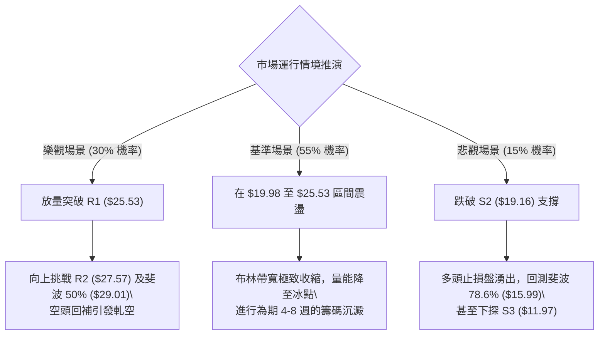

### 🛡️ 風險管理重要提醒

1. **Beta 放大效應管理**：PL Beta 高達 2.123，意味著在大盤劇烈波動時，該股每日波動幅度極大（當前 ATR 佔比達 5.91%）。單筆交易之名目本金風險暴露不得超過總帳戶資產的 **2.0%**。
2. **做空比例與軋空風險**：當前 Short % Float 達 **9.7%**，空頭部位較高。若在阻力位盲目做空，一旦有利好消息配合突破 R1 ($25.53)，可能遭遇劇烈軋空，因此做空必須嚴格以 R1 上方設置止損。
3. **區間操作紀律**：在 ADX < 25 的盤整市道中，**切忌在箱體中軌（$22.53）附近追漲殺跌**。嚴格遵循「靠近 S1 ($19.98) 逢低買、靠近 R1 ($25.53) 逢高賣」的區間交易紀律。

---

## 📋 報告總結

```
╔══════════════════════════════════════════════════════════════════╗
║                   PL 技術分析報告總結 (Executive Summary)        ║
╠══════════════════════════════════════════════════════════════════╣
║ 報告日期：2026-08-22                                             ║
║ 當前價格：$22.29                                                 ║
║ 分析評級：⚖️ 中性偏空震盪 (評分: 42/100，弱趨勢盤整打底)         ║
╠══════════════════════════════════════════════════════════════════╣
║ 關鍵結論：                                                       ║
║ ├─ 長期趨勢：🔴 偏空修正 (處於 52W 高點 $51.76 回落後之 61.8% 處) ║
║ ├─ 中期趨勢：🟡 築底收斂 (週線在 $20.47-$20.48 形成潛在雙底)     ║
║ ├─ 短期趨勢：🟡 區間震盪 (ADX=20.26，受困於 $19.98 至 $25.53)    ║
║ ├─ 關鍵支撐：S1: $19.98  /  S2: $19.16  /  S3: $11.97           ║
║ ├─ 關鍵阻力：R1: $25.53  /  R2: $27.57  /  R3: $30.90           ║
║ └─ 分析師目標：平均 $40.10 (區間: $25.00 - $53.00)               ║
╠══════════════════════════════════════════════════════════════════╣
║ 最優策略組合：                                                   ║
║ 1. 🥇 最佳機會：回踩 S1 ($19.98) 附近低吸做多，止損設於 S2 ($19.16)║
║                目標直指 R1 ($25.53)，風險報酬比高達 6.78:1       ║
║ 2. 🥈 次選機會：突破 R1 ($25.53) 後右側順勢追多，目標看 R2 ($27.57)║
║ 3. 🥉 保守選擇：在 $19.98-$25.53 區間未打破前，保持輕倉或空倉觀望║
╚══════════════════════════════════════════════════════════════════╝
```

---

> ⚠️ **免責聲明**：本報告為 AI 自動生成之技術分析，所有數據及估算均基於提供的歷史價格資訊。本報告**僅供研究與學術參考**，**不構成任何投資建議**。投資有風險，入市需謹慎。

---

*報告生成時間：2026-08-22 ｜ 數據來源：Yahoo Finance ｜ 分析框架：多時框技術分析*