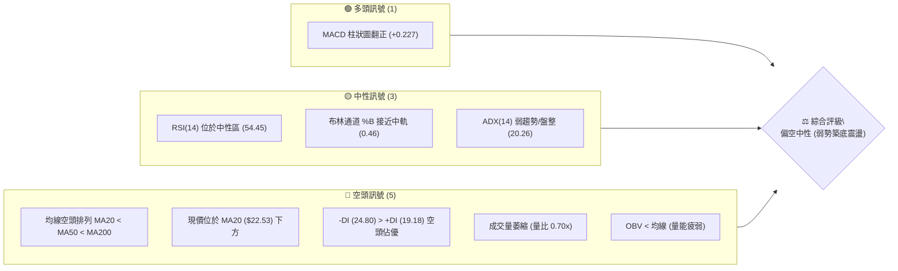
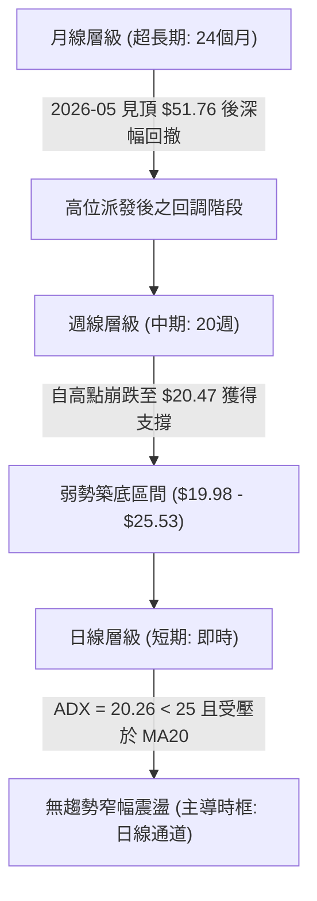
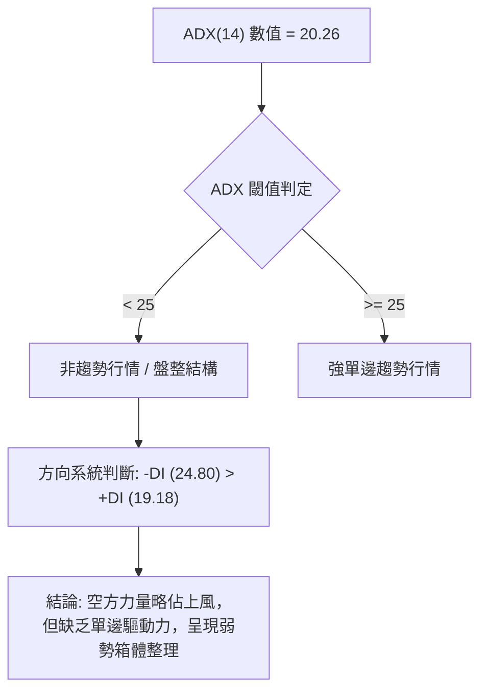
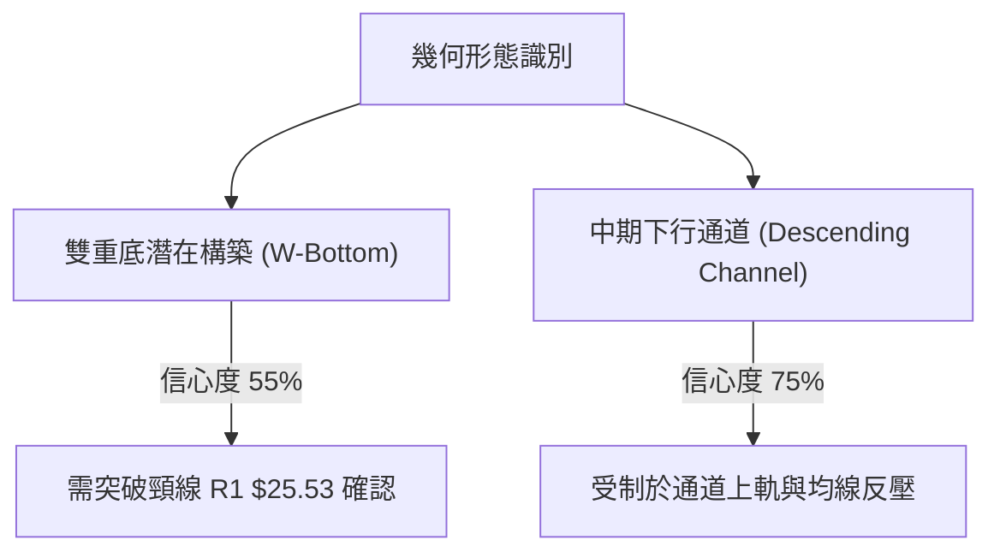
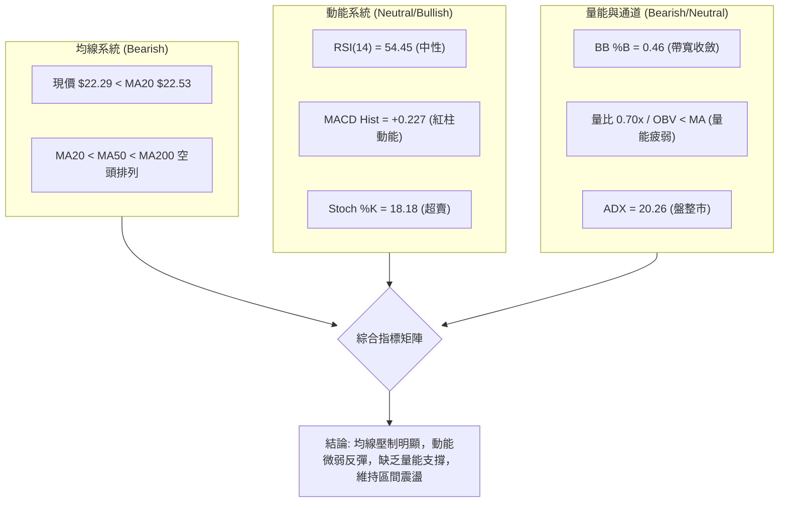
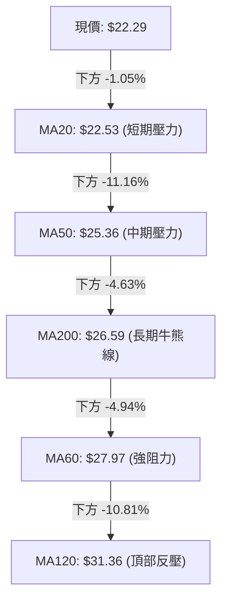
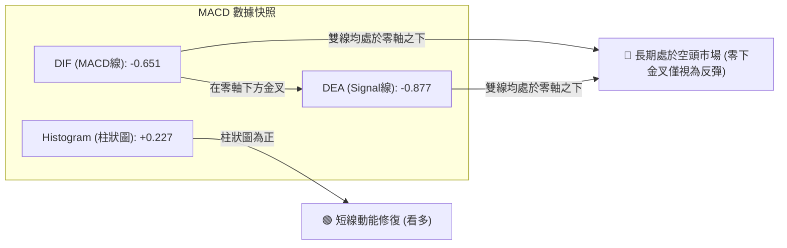
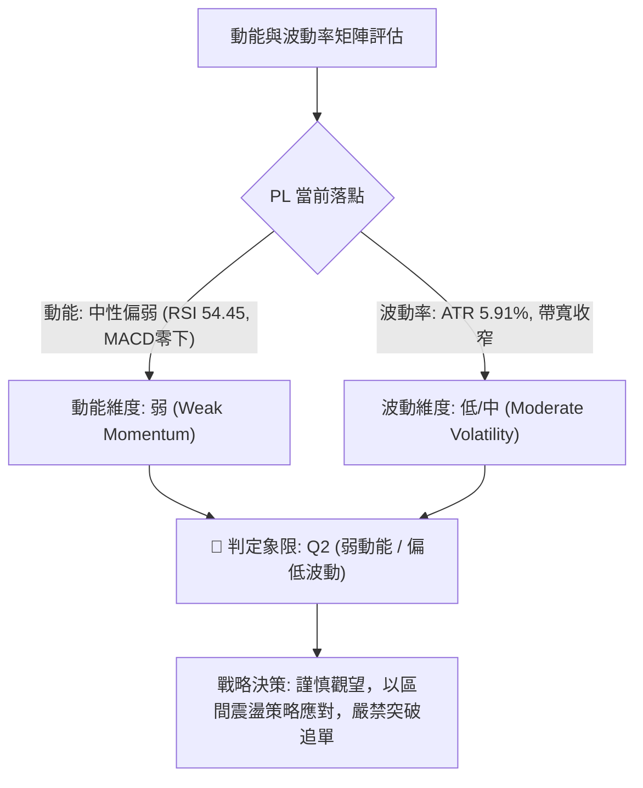
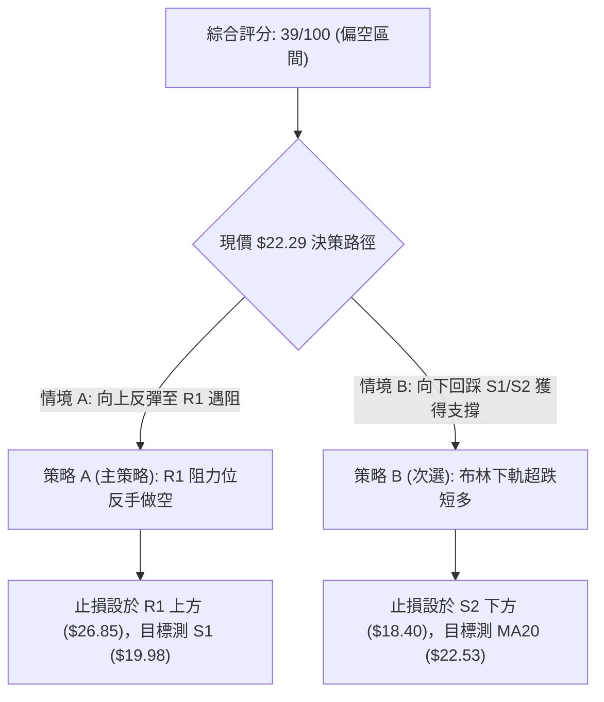
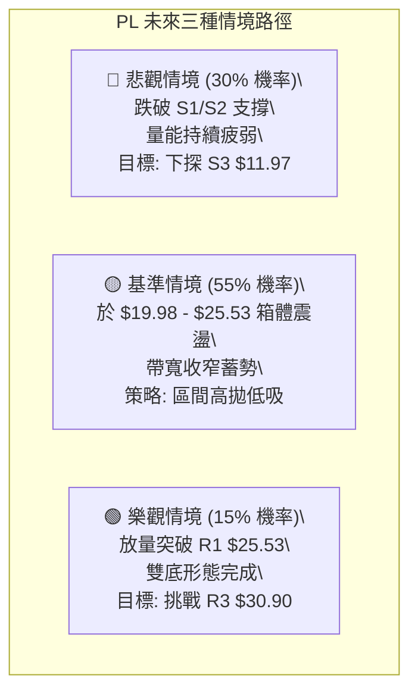

# PL 技術分析報告

> **報告日期**：2026-08-23 ｜ **語言**：繁體中文 ｜ **數據來源**：Yahoo Finance ｜ **當前價格**：$22.29

---

## 目錄

| 章節 | 內容 |
|------|------|
| [1. 技術面概覽](#1-技術面概覽) | 訊號儀表板、核心指標、評分卡 |
| [2. 趨勢分析](#2-趨勢分析) | 多時框趨勢、長中短期走勢、ADX 解讀 |
| [3. 圖表形態分析](#3-圖表形態分析) | 形態識別、K線組合、目標價計算 |
| [4. 支撐與阻力](#4-支撐與阻力) | 關鍵價位分布、阻力/支撐表、斐波那契分析 |
| [5. 技術指標深度解讀](#5-技術指標深度解讀) | MA/RSI/MACD/布林/成交量全面剖析 |
| [6. 動能與波動率](#6-動能與波動率) | 動能四象限、ATR 止損距離、Beta 敏感度 |
| [7. 多時框架總結](#7-多時框架總結) | 時框架評分矩陣、收斂裁決結論 |
| [8. 交易策略建議](#8-交易策略建議) | 策略決策流程、情境階梯、主策略詳解 |
| [9. 風險提示與監控](#9-風險提示與監控) | 監控清單、情境模擬、風控準則 |
| [10. 報告總結](#10-報告總結) | 儀表板總覽與操作摘要 |

---

## 1. 技術面概覽

### 🎯 技術訊號儀表板



### 📊 核心指標速覽表

| 指標類別 | 指標名稱 | 當前數值 | 訊號 | 解讀 |
|----------|----------|----------|------|------|
| **價格** | 當前收盤價 | $22.29 | 🔴 | 位於 52 週高低區間 35.2%，受壓於短中長期均線下 |
| **均線** | MA20 (短) | $22.53 | 🔴 | 現價低於 MA20 約 1.05%，面臨第一道即時均線反壓 |
| **均線** | MA50 (中) | $25.36 | 🔴 | 現價大幅低於 MA50，中期趨勢仍處於修正結構 |
| **均線** | MA200 (長) | $26.59 | 🔴 | 現價低於 MA200，長期趨勢受制於熊市下行通道 |
| **動能** | RSI(14) | 54.45 | 🟡 | 脫離超賣區回升至中性區間，暫無頂/底背離現象 |
| **動能** | MACD Hist | +0.227 | 🟢 | MACD 線 (-0.651) 位於 Signal (-0.877) 上方，短線動能修復 |
| **震盪** | Stoch %K/%D | 18.18 / 36.82 | 🟡 | 進入超賣警戒區，具備短線反彈動能但尚未黃金交叉 |
| **趨勢** | ADX(14) | 20.26 | 🟡 | ADX < 25 表明非單邊趨勢，當前為無方向性盤整/弱勢震盪 |
| **通道** | Bollinger Bands | $19.34 - $25.71 | 🟡 | %B = 0.46，位於中軌 ($22.53) 下方窄幅震盪，帶寬收斂 |
| **量能** | 20日量比 / OBV | 0.70x / OBV<MA | 🔴 | 成交量 3.85M 顯著低於均量，量價配合不佳，買盤動能不足 |
| **波動** | ATR(14) | $1.32 (5.91%) | 🟡 | 每日平均波動幅度中等，適合區間內高拋低吸風控 |

### 🏆 技術評分卡

```
╔══════════════════════════════════════════════════════════════╗
║              技術評分卡 — PL (2026-08-23)                    ║
╠══════════════════════════════════════════════════════════════╣
║ 趨勢強度 (ADX/方向)   ██████░░░░░░░░░░░░░░  30/100  🔴 空頭主導/弱盤整 ║
║ 動能指標 (RSI/MACD)   ███████████░░░░░░░░░  55/100  🟡 動能中性修復   ║
║ 支撐穩定度 (S1/S2)    ████████████░░░░░░░░  60/100  🟡 關鍵支撐暫守   ║
║ 成交量配合 (Volume)   ██████░░░░░░░░░░░░░░  30/100  🔴 量能萎縮無動能 ║
║ 形態完整度 (Pattern)  ████████░░░░░░░░░░░░  40/100  🔴 下行通道整理   ║
║ 均線排列 (MA System)  ████░░░░░░░░░░░░░░░░  20/100  🔴 標準空頭排列   ║
╠══════════════════════════════════════════════════════════════╣
║ 綜合評分              ████████░░░░░░░░░░░░  39/100  🔴 偏空弱勢震盪   ║
╚══════════════════════════════════════════════════════════════╝
```

---

## 2. 趨勢分析

### 🌐 多時框趨勢分析



### 📈 長期趨勢 — 12個月走勢圖（Unicode）

```
PL 月線走勢圖（2025-08 至 2026-08）
價格 ($)
$55 ┤                                                 ● (2026-05 $51.14)
$50 ┤                                                ╱ ╲
$45 ┤                                               ╱   ╲
$40 ┤                                     ●(04 $36.97)   ╲
$35 ┤                                    ╱         ╲      ●(06 $33.13)
$30 ┤                          ●(03 $27.95)         ╲      ╲
$25 ┤                ●(01 $24.97)                    ╲      ●←現價 $22.29
$20 ┤      ●(12 $19.72)                               ╲    ╱ (07 $20.48)
$15 ┤  ●(10 $13.45)                                    ●(07)
$10 ┤ ╱
 $5 ┤●(08 $7.09)
    └─┬───┬───┬───┬───┬───┬───┬───┬───┬───┬───┬───┬───┬─
     08  09  10  11  12  01  02  03  04  05  06  07  08 (月份)
```

**走勢特徵分析表格**：

| 階段區間 | 時間跨度 | 價格起訖 | 漲跌幅 | 主要結構特徵 |
|----------|----------|----------|--------|--------------|
| **第一階段：初升啟動** | 2025-08 ~ 2025-10 | $7.09 → $13.45 | +89.70% | 脫離底部放量拉升，形成穩健上升階梯 |
| **第二階段：主升暴漲** | 2025-11 ~ 2026-05 | $11.90 → $51.14 | +329.75% | 機構加速推升，創 52 週歷史高點 $51.76，量能極度放大 |
| **第三階段：高位派發** | 2026-06 ~ 2026-07 | $51.14 → $20.48 | -59.95% | 頂部快速崩塌，週量爆出 100.6M 派發籌碼，跌破多道關鍵均線 |
| **第四階段：底部震盪** | 2026-07 ~ 2026-08 | $20.48 → $22.29 | +8.84% | 於 S1 ($19.98) 附近展開超跌修復，量能急劇萎縮，進入盤整 |

### 📊 中期趨勢（週線分析）

```
PL 近期週線壓力與支撐結構圖
═════════════════════════════════════════════════════════════════
$30.90 ────────────────────────────────────────── 阻力 R3 (強阻力區)
         ▲
$27.57 ──┼─────────────────────────────────────── 阻力 R2 (反彈高點)
         │       週線均線死叉反壓帶 (MA50/MA60)
$25.53 ──┼─────────────────────────────────────── 阻力 R1 (頸線壓力)
         │
$22.29 ──┼────────────────────────────── [ 現價 $22.29 ] ──
         │       震盪緩衝區間 (BB %B = 0.46)
$19.98 ──┴─────────────────────────────────────── 支撐 S1 (近期週線低點)
$19.16 ────────────────────────────────────────── 支撐 S2 (波段強支撐)
═════════════════════════════════════════════════════════════════
```

### ⚡ 趨勢強度評估（ADX 解讀）



| ADX 區間 | 趨勢強度定義 | 當前 PL 狀態 | 交易策略意涵 |
|----------|--------------|--------------|--------------|
| 00 - 20 | 無趨勢 / 極度收斂 | 20.26 (邊界) | 避免順勢突破策略，假突破機率極高 |
| **20 - 25** | **弱趨勢 / 區間盤整** | **✓ 當前判定 (20.26)** | **嚴格執行通道與區間高拋低吸，以支撐阻力為界** |
| 25 - 50 | 強趨勢形成 | - | 若突破 $25.53 且 ADX>25 則可轉為順勢追多 |
| 50 - 100 | 極強單邊 / 趨勢竭盡 | - | 暫無此極端現象 |

---

## 3. 圖表形態分析

### 🔍 形態識別系統



**形態信心度與判斷依據**：

| 形態名稱 | 信心度 | 判斷依據（引用數據） | 完成度 | 目標價（附嚴格計算式） |
|----------|--------|----------------------|--------|------------------------|
| **潛在雙重底 (Double Bottom)** | 55% | 2026-07-26 低點 $20.47 與 2026-08-02 低點 $20.48 形成雙低點，獲 S1 ($19.98) 支撐 | 60% | 頸線 R1 ($25.53) + 形態高度 ($25.53 - $20.47 = $5.06) = **$30.59** (極接近 R3 $30.90) |
| **中期下行通道 (Descending Channel)** | 75% | 高點由 $51.14 降至 $31.38 再降至 $24.69；低點由 $31.15 跌至 $20.47，均線空頭排列 | 85% | 跌破 S1 則測下軌 S2 (**$19.16**)，若深幅下破則測 S3 (**$11.97**) |
| **頭肩頂/底等複雜幾何形態** | <30% | 數據中未偵測到完整左右肩結構，不可通靈繪製 | 0% | 訊號不足，僅做指標型解讀 |

### 🕯️ 重要K線形態分析

| 週期/月份 | 收盤價 | K線形態特徵 | 技術解讀 | 訊號 |
|-----------|--------|-------------|----------|------|
| **2026-05** | $51.14 | 長上影大陽線 (月線高點 $51.76) | 衝高受阻，主力籌碼於 $50 以上實施高位派發 | 🔴 強烈見頂 |
| **2026-06** | $33.13 | 實體大陰線 (月跌幅 -35.22%) | 恐慌性拋盤湧現，週成交量突破 100M，多頭防線全面瓦解 | 🔴 空頭吞噬 |
| **2026-07** | $20.48 | 長下影錘頭陰線 (低點 $20.47) | 觸及 52 週低點回調支撐，低檔出現逢低承接買盤 | 🟡 止跌信號 |
| **2026-08 (即時)**| $22.29 | 窄幅十字星/小陽線 | 多空雙方於 MA20 ($22.53) 下方僵持，量能急劇萎縮 | 🟡 方向未明 |

### 📉 ASCII 走勢形態示意圖

```
PL 中期下行通道與潛在雙底結構示意圖
價格 ($)
$51.76 ┬───● 52W High (2026-05)
       │    ╲
$36.97 ┼     ╲  下行通道上軌反壓線
       │      ╲
$31.38 ┼───────●───────── [ 反彈高點 ]
       │         ╲               ╲
$25.53 ┼──────────● 頸線 R1 ───────╲─────── R1: $25.53 (突破點)
       │            ╲               ╲     ▲
$22.29 ┼─────────────╲───────────────●───┼─ 現價 $22.29
       │              ╲             ╱     │ (W底築底中)
$20.47 ┼───────────────●───────────●──────┴─ 雙底低點 ($20.47 / $20.48)
       │            (底 1)       (底 2)     支撐 S1: $19.98
$19.16 ┴───────────────────────────────────── 強支撐 S2: $19.16
```

### 🎯 形態目標價計算

1. **若雙底形態確認成立**：
   - 觸發條件：日線實體陽線放量突破頸線 **R1: $25.53**。
   - 形態垂直高度 $H = \text{頸線 } \$25.53 - \text{雙底最低價 } \$20.47 = \$5.06$。
   - 量度目標價 $T1 = \text{頸線 } \$25.53 + \$5.06 = \mathbf{\$30.59}$（此價位精確指向關鍵阻力聚類 **R3: $30.90** 區域）。
2. **若下行通道延續破位**：
   - 觸發條件：跌破第一波段支撐 **S1: $19.98** 與強支撐 **S2: $19.16**。
   - 下行量度目標價：回測下行通道支撐極限 **S3: $11.97**（亦為歷史起漲平台聚類）。

---

## 4. 支撐與阻力

### 🗺️ 關鍵價位分布圖（Unicode）

```
PL 價位結構分布圖
═══════════════════════════════════════════════════════════════
$51.76 ║██████████████████████████████║ 52W 最高點 / 斐波那契 0.0%
$41.02 ║████████████████████░░░░░░░░░░║ 斐波那契 23.6% 回調位
$34.38 ║████████████████████░░░░░░░░░░║ 斐波那契 38.2% 回調位
$30.90 ║██████████████████████████████║ 強阻力 R3 / 形態量度目標 ($30.59)
$29.01 ║██████████████░░░░░░░░░░░░░░░░║ 斐波那契 50.0% 強度平衡位
$27.57 ║████████████████████          ║ 中期阻力 R2 / MA60 ($27.97) 反壓
$25.53 ║████████████████████████      ║ 關鍵阻力 R1 / 頸線 / MA50 ($25.36)
$23.64 ║▓▓▓▓▓▓▓▓▓▓▓▓▓▓▓▓▓▓▓▓          ║ 斐波那契 61.8% 黃金分割阻力位
$22.29 ╠══════════════════════════════╣ ◄ 現價 $22.29 (BB %B: 0.46)
$19.98 ║▓▓▓▓▓▓▓▓▓▓▓▓▓▓▓▓              ║ 近期關鍵支撐 S1 (週線波段低點)
$19.16 ║████████████████████████      ║ 強支撐 S2 / 布林下軌 ($19.34)
$15.99 ║░░░░░░░░░░░░░░░░░░░░░░░░░░░░░░║ 斐波那契 78.6% 回調位
$11.97 ║██████████████████████████████║ 終極深幅支撐 S3 (歷史籌碼平台)
$06.26 ║██████████████████████████████║ 52W 最低點 / 斐波那契 100.0%
═══════════════════════════════════════════════════════════════
```

### 🚧 阻力位分析表

所有阻力位數值嚴格引用 OHLCV 聚類計算數據：

| 阻力級別 | 精確價位 | 距離現價 | 形成原因與技術重疊 | 突破難度 | 重要性 |
|----------|----------|----------|--------------------|----------|--------|
| **R1** | **$25.53** | +14.54% | 近一年波段高點聚類、潛在雙底頸線、MA50 ($25.36) 及布林上軌 ($25.71) 匯聚 | 🔴 極高 | 關鍵分水嶺 |
| **R2** | **$27.57** | +23.68% | 2026-06 破位反彈高點、MA60 ($27.97) 及長期均線 MA200 ($26.59) 重疊區 | 🟡 高 | 中期多空樞紐 |
| **R3** | **$30.90** | +38.62% | 2026-07 週線反彈高點聚類 ($31.38)、雙底量度目標 ($30.59) 及 MA120 ($31.36) | 🔴 極高 | 波段反轉目標 |

### 🛡️ 支撐位分析表

所有支撐位數值嚴格引用 OHLCV 聚類計算數據：

| 支撐級別 | 精確價位 | 距離現價 | 形成原因與技術重疊 | 守住機率 | 重要性 |
|----------|----------|----------|--------------------|----------|--------|
| **S1** | **$19.98** | -10.36% | 2026-07 與 2026-08 連續兩週探底之波段低點聚類 ($20.47-$20.48) | 🟡 65% | 短期防守線 |
| **S2** | **$19.16** | -14.04% | 近一年強支撐聚類、日線布林通道下軌 ($19.34) 重疊防禦區 | 🟢 80% | 箱體底部強防線 |
| **S3** | **$11.97** | -46.30% | 2025-11 歷史起漲平台低點聚類，長期多頭最後防禦堡壘 | 🟢 95% | 終極結構支撐 |

### 📐 斐波那契回調位分析

依據 52 週極值區間（低點 **$6.26** 至 高點 **$51.76**，垂直空間 **$45.50**）計算：

| 斐波那契水平 | 精確價位 | 與現價關係 | 技術意涵與結構解讀 |
|--------------|----------|------------|--------------------|
| **0.0% (高點)** | **$51.76** | +132.21% | 歷史頂部派發極值，形成長期巨量套牢壓區 |
| **23.6%** | **$41.02** | +84.03% | 下跌初期的第一道回撤位，目前已轉為遠端阻力 |
| **38.2%** | **$34.38** | +54.24% | 弱勢修正回撤位，上方累積大量套牢籌碼 |
| **50.0%** | **$29.01** | +30.15% | 多空強弱平衡中軸，站上此位方可確認中級多頭反轉 |
| **61.8% (黃金分割)**| **$23.64** | **+6.06%** | **關鍵黃金分割位。現價 ($22.29) 緊貼於 61.8% 下方，構成直接上方壓力** |
| **78.6%** | **$15.99** | -28.26% | 深幅回撤防線，若跌破 S1/S2 則將考驗此一位置 |
| **100.0% (低點)** | **$6.26** | -71.92% | 52 週起漲原點 |

> **現價位置解讀**：現價 **$22.29** 處於 **61.8% ($23.64)** 與 **78.6% ($15.99)** 之間。在技術分析中，股價跌破 61.8% 代表自 $6.26 啟動的上升行情已遭遇嚴重破壞，當前僅能視為超跌後的「弱勢震盪打底」階段，尚未具備反轉至 50% ($29.01) 以上的動能。

---

## 5. 技術指標深度解讀

### 🎛️ 指標訊號總覽



### 📈 移動平均線排列分析



**移動平均線詳細數據解讀**：
- **MA5 ($22.96)** & **MA10 ($23.56)**：短週期均線於現價上方下彎，短線反彈在 $23.00-$23.60 面臨第一層阻力。
- **MA20 ($22.53)**：布林中軌所在，現價略低於此，尚未有效站穩。
- **MA50 ($25.36)** 與 **MA200 ($26.59)**：呈現標準「死亡交叉」後的空頭排列，表明中長期持倉者整體處於虧損狀態，反彈至此必有解套拋壓。

### 📉 RSI(14) 分析

```
RSI(14) 指標狀態: 54.45 (中性區間)
0 ──────────── 30 ────────────────────── 50 ────── 54.45 ─────── 70 ──────────── 100
[  極度超賣區  ] [       弱勢區間       ] [      中性偏多       ] [  極度超買區  ]
進度條: ███████████████████████████████░░░░░░░░░░░░░░░░░░░░░░  54.45%
```

- **背離判斷**：
  - **頂背離**：無。股價並未創出新高。
  - **底背離**：2026-07-26 週線價格低點 **$20.47** 對應 RSI 為 **10.2**（極度超賣）；2026-08-02 週線價格低點 **$20.48** 對應 RSI 回升至 **25.6**；當前價格 **$22.29** 對應 RSI 為 **54.45**。週線級別出現微幅「動能底背離」雛形，促成了近三週自低檔的超跌反彈。
- **結論**：RSI 脫離超賣區後回到 50 中軸上方，顯示短期下行慣性暫歇，但尚未進入 >70 的強勢多頭推升區。

### 📊 MACD(12/26/9) 訊號解讀



- **MACD 現況**：MACD 線 (-0.651) 向上穿越訊號線 (-0.877)，柱狀圖報 **+0.227**。
- **背離分析**：MACD 於零軸下方出現柱狀圖連續翻紅擴張，為標準的「零下黃金交叉」，代表空頭殺跌動能竭盡，轉為超跌反彈修復。然而，由於雙線仍在零軸之下深處，未突破零軸前不具備單邊反轉條件。

### 📦 布林通道分析

```
PL 日線布林通道示意圖
價格 ($)
$25.71 ┬────────────────────────────────────────── BB 上軌 (壓力 R1 附近)
       │
$24.00 ┼
       │
$22.53 ┼─────────────────── 中軌 (MA20) ──────────── BB 中軌 ($22.53)
       │                 ▲
$22.29 ┼─── [ 現價 $22.29 (BB %B = 0.46) ] ────────
       │
$20.00 ┼
       │
$19.34 ┴────────────────────────────────────────── BB 下軌 (支撐 S2 附近)
```

- **帶寬與位置**：上軌 **$25.71**、中軌 **$22.53**、下軌 **$19.34**，通道帶寬正在劇烈收窄（Squeeze）。
- **%B 指標**：數值為 **0.46**，代表價格處於中軌與下軌之間的正中微偏下方。在 ADX < 25 的環境下，布林通道上下軌構成最精確的區間邊界：**$19.34（買方防線）至 $25.71（賣方阻力）**。

### 💹 成交量分析（量價配合度）

```
成交量萎縮示意圖 (Volume Shrinkage)
50日均量: 9,720,422  ████████████████████████████████████████
20日均量: 5,495,445  ███████████████████████
最新成交: 3,853,500  ████████████████ (量比 0.70x)
```

- **量比與均量**：當前成交量 3.85M，僅為 20 日均量的 70%、50 日均量的 39.6%。
- **OBV 趨勢**：OBV 指標持續位於其均線下方，呈現「價漲量縮、價跌量增」後的量能真空狀態。
- **量價背離結論**：近期價格自 $20.48 反彈至 $22.29，但週成交量由 35.1M 連續萎縮至 22.7M。**量能未能同步放大，確認本次上漲僅為無量空抽（Dead Cat Bounce），無法支撐突破 R1 ($25.53) 的行情**。

---

## 6. 動能與波動率

### ⚡ 動能評估四象限



| 象限 | 動能維度 | 波動維度 | 標的特徵 | 當前狀態 | 交易應對策略 |
|------|----------|----------|----------|----------|--------------|
| **Q1** | 強動能 | 低波動 | 穩健單邊趨勢 | - | 最佳順勢加碼機會 |
| **Q2** | **弱動能** | **偏低波動** | **弱勢築底 / 窄幅盤整** | **✓ PL (當前落點)** | **區間高拋低吸，嚴格控制倉位與止損** |
| **Q3** | 強動能 | 高波動 | 主升浪 / 主跌浪 | - | 高風險高收益，緊跟趨勢交易 |
| **Q4** | 弱動能 | 高波動 | 恐慌派發 / 無序震盪 | - | 避免進場，極易遭雙向雙巴 |

### 📊 ATR 波動率分析

- **ATR(14) 數值**：**$1.32**（佔現價比率 **5.91%**）。
- **止損距離建議**：
  - **日內交易 / 短線震盪**：使用 $1.0 \times \text{ATR} = \mathbf{\$1.32}$ 作為動態跟蹤止損間距。
  - **波段交易進場**：使用 $1.5 \times \text{ATR} = \mathbf{\$1.98}$ 作為硬止損空間。
  - **止損保護邏輯**：現價 $22.29 減去 $1.5 \times \text{ATR} ($1.98) = **$20.31**，剛好覆蓋前低 $20.47 之外，並受 S1 ($19.98) 的結構保護，此設置具備高度統計學防禦合理性。

### 📐 Beta 與市場相關性

- **Beta 係數**：**2.123**（高 Beta 屬性）。
- **市場敏感度解讀**：
  - PL 具備顯著的高彈性成長股特徵，其波動幅度為標普500大盤的 2.12 倍。
  - 在大盤回調時，PL 具有超額下行風險（如 2026-06 期間暴跌）；在大盤反彈時，亦能展現高度爆發力。
  - **風控要求**：因 Beta > 2.0，個股總持倉曝險上限應嚴格壓制在總投資組合的 **5% - 8%** 以內。

---

## 7. 多時框架總結

### 📋 時框架評分表

| 時框架 | 趨勢方向 | 動能指標 | 均線排列 | 形態結構 | 綜合評分 | 戰略建議 |
|--------|----------|----------|----------|----------|----------|----------|
| **長期 (月線)** | 🔴 強烈看空 | 🔴 零軸向下 | 🔴 空頭排列 | 高位派發大陰線 | 25/100 | 長線資金不可建倉 |
| **中期 (週線)** | 🔴 偏空震盪 | 🟡 底部鈍化 | 🔴 MA50/200死叉 | 潛在雙底測試中 | 38/100 | 等待頸線突破確認 |
| **短期 (日線)** | 🟡 區間盤整 | 🟢 MACD翻紅 | 🔴 受壓於MA20 | 布林帶寬收斂震盪 | 48/100 | 布林通道內高拋低吸 |

### 🔲 綜合訊號矩陣

```
時框一致性分析矩陣
═════════════════════════════════════════════════════════════════
指標系統          短期 (日線)        中期 (週線)        長期 (月線)
─────────────────────────────────────────────────────────────────
均線趨勢 (MA)     🔴 MA20 下方       🔴 MA50/200 壓制   🔴 均線空頭排列
動能系統 (MACD)   🟢 柱狀圖翻正      🔴 零下死叉修復    🔴 柱狀深幅收縮
震盪指標 (RSI)    🟡 54.45 (中性)    🟡 36-54 (低檔)    🔴 自超買區暴跌
趨勢強度 (ADX)    🟡 20.26 (盤整)    🔴 -DI > +DI       🔴 下行趨勢主導
形態結構          🟡 布林帶收窄      🟡 測試 S1 支撐    🔴 頂部崩塌形態
═════════════════════════════════════════════════════════════════
時框衝突狀態：短期指標修復（反彈） vs 中長期均線結構嚴重受損（空頭）
```

### ⚖️ 多時框收斂結論

依據多時框收斂規則（嚴格要求 14）：
1. **趨勢/盤整行情判定**：當前日線 **ADX(14) = 20.26 < 25**，明確判定當前市場為**「盤整行情」**，而非單邊趨勢行情。
2. **主導時框裁決**：在盤整行情中，**以日線布林通道上下軌 ($19.34 - $25.71) 與關鍵支撐阻力 S1/R1 為主要交易區間**。中長期空頭趨勢限制了向上反彈的高度，短期反彈僅能視為箱體內部震盪。
3. **唯一方向性結論**：**【偏空中性 — 箱體區間操作，嚴禁突破追多】**。整體評級得分 **39/100**，主策略將嚴格採用偏空防禦型的「區間高拋低吸 / 阻力位逢高布空」架構。

---

## 8. 交易策略建議

### 🗺️ 策略決策流程圖



### 🧭 策略路由（依評分卡分流）

> **當前主策略方向 = 【偏空弱勢震盪 — 阻力位高拋/反彈逢高布空為主，支撐位超短線搏反彈為輔】（依評分 39/100）**

因技術評分低於 40 分，均線呈現標準空頭排列，量能持續萎縮，任何向上衝擊 R1 ($25.53) 的動作在未放量前均視為「誘多派發」，因此主推策略為**阻力位反彈布空策略**；同時提供於強支撐位 S1/S2 的**超跌短多策略**作為次選。

### 🎯 價格情境階梯（Price Scenarios）

價位數值嚴格引用第 4 章計算之關鍵價位：

| 觸發條件 | 第一目標 | 後續延伸 | 情境含義與操作指引 |
|----------|----------|----------|--------------------|
| **向上放量突破 R1 ($25.53)** | **R2 ($27.57)** | **R3 ($30.90)** | 短線結構反轉，空單全面停損，順勢轉多追擊雙底目標 |
| **受阻於 R1 ($25.53) 回落** | **中軌 ($22.53)** | **S1 ($19.98)** | 箱體震盪延續，為最佳高拋布空情境 |
| **跌破 S1 ($19.98)** | **S2 ($19.16)** | **S3 ($11.97)** | 中期破位下行，開啟新一輪主跌浪，測試長期歷史低位 |

### 📊 情境機率分佈

```
情境機率分佈圓餅圖
區間震盪 (55%):  ███████████████████████████░░░░░░░░░░░░░░░░░░░░░░
向下回落 (30%):  ███████████████░░░░░░░░░░░░░░░░░░░░░░░░░░░░░░░░░
強勢反轉 (15%):  ███████░░░░░░░░░░░░░░░░░░░░░░░░░░░░░░░░░░░░░░░░░
```

| 情境劇本 | 預估機率 | 主要技術依據 |
|----------|----------|--------------|
| **區間震盪 (Range-bound)** | **55%** | ADX=20.26 (無趨勢)、布林帶寬急劇收縮、成交量萎縮至均量 70% |
| **回落再探底 (Downside Test)** | **30%** | 均線空頭排列 (MA20<MA50<MA200)、OBV 疲弱、-DI 壓制 +DI |
| **強勢突破反轉 (Bullish Reversal)** | **15%** | MACD 柱狀圖雖為正，但量能嚴重不足，無法突破 R1 ($25.53) 密集套牢區 |

### 🟢 交易策略詳情

所有進出場與止損價位均依據 ATR 與第 4 章關鍵價位精確計算：

| 策略要素 | 策略 A：阻力位高拋布空 (主策略 🥇) | 策略 B：支撐位超跌短多 (次選策略 🥈) |
|----------|-----------------------------------|-----------------------------------|
| **進場邏輯** | 股價反彈至 R1 遇阻，K線出現長上影 | 股價回踩 S1/S2 止跌，出現底分型支撐 |
| **進場價格** | **$25.30 - $25.50** (逼近 R1 $25.53) | **$19.50 - $19.98** (回踩 S1 區域) |
| **目標價 T1** | **$22.53** (布林中軌 / MA20) | **$22.53** (布林中軌 / MA20) |
| **目標價 T2** | **$19.98** (支撐 S1 / 波段低點) | **$25.53** (阻力 R1 / 頸線壓力) |
| **止損價格** | **$26.85** (R1 上方 + 1.0×ATR $1.32) | **$18.66** (S1 下方 - 1.0×ATR $1.32) |
| **風險報酬比** | **1 : 3.58** (風險 $1.45 vs 獲利 $5.20) | **1 : 4.54** (風險 $1.14 vs 獲利 $5.17) |
| **預估勝率** | **65%** | **50%** |
| **建議倉位** | **5% - 8%** (標準波段倉位) | **3% - 5%** (輕倉逆勢搏反彈) |

### 🔴 反向風險觸發點（對沖與風控提示）

1. **多頭破位警報**：若股價收盤有效跌破 **S2: $19.16**，所有左側抄底多單必須無條件離場，下方空間將直指 **S3: $11.97**。
2. **空頭止損警報**：若日線放量（單日成交量突破 9.7M 50日均量）實體陽線收於 **R1: $25.53** 之上，且 ADX 翻轉向上突破 25，代表雙底形態確立，空頭部位必須立即止損平倉，反手跟進多單。

### ⭐ 整體訊號強度評星

```
╔══════════════════════════════════════════════════════════════╗
║ 做多訊號強度：★★☆☆☆  (2.0/5 星) — 僅限支撐位輕倉博弈短彈     ║
║ 做空訊號強度：★★★★☆  (4.0/5 星) — 順應長中均線空頭趨勢高拋   ║
║ 整體可信度：  ★★★☆☆  (3.5/5 星) — 盤整期訊號雜訊偏多需嚴設損 ║
╚══════════════════════════════════════════════════════════════╝
```

---

## 9. 風險提示與監控

### ✅ 關鍵監控指標 Checklist

```
╔══════════════════════════════════════════════════════════════╗
║              PL 核心交易監控清單 (Checklist)                 ║
╠══════════════════════════════════════════════════════════════╣
║ [ ] 價格是否突破/跌破關鍵防線？                               ║
║     ├─ 上方突破警戒線：$25.53 (R1 / 頸線)                     ║
║     └─ 下方破位警戒線：$19.98 (S1) 與 $19.16 (S2)             ║
║ [ ] 成交量是否異常放大？                                      ║
║     └─ 單日成交量 > 5.50M (突破 20日均量確認有效性)          ║
║ [ ] 動能指標背離與極值監控：                                  ║
║     ├─ RSI(14) 是否跌破 30 (超賣) 或 突破 70 (超買)           ║
║     └─ MACD 柱狀圖是否由紅翻綠 (動能再度衰竭)                ║
║ [ ] 趨勢強度指標 ADX 狀態：                                   ║
║     └─ ADX 是否升破 25 (由盤整轉為單邊趨勢之訊號)             ║
║ [ ] 高 Beta 波動風險控管：                                    ║
║     └─ 單筆交易最大虧損是否控制在總資產 1% 以內 (Beta = 2.12)  ║
╚══════════════════════════════════════════════════════════════╝
```

### ⚠️ 風險場景分析



### 🛡️ 風險管理重要提醒

1. **流動性與量能陷阱**：PL 最新成交量僅 3.85M，量比 0.70x，在成交量大幅萎縮期間，價格容易被少量買賣單打出假突破或假跌破。**所有突破信號必須等待日線收盤確認，盤中切忌盲目市價追單**。
2. **高 Beta 槓桿效應**：PL 的 Beta 值高達 **2.123**，意味著大盤若出現 2% 的常規回調，PL 可能引發 4%-6% 以上的劇烈震盪。**嚴禁使用高融資槓桿操作**，單一個股部位不得超過投資組合總資金的 8%。
3. **嚴格執行價格紀律**：
   - 多頭止損底線：**$18.66**（S1 關鍵支撐下緣）。
   - 空頭止損底線：**$26.85**（R1 頸線阻力上緣）。

---

## 10. 報告總結

```
╔══════════════════════════════════════════════════════════════╗
║              PL 技術分析報告總結 (Executive Summary)         ║
╠══════════════════════════════════════════════════════════════╣
║ 報告日期：2026-08-23                                         ║
║ 當前價格：$22.29                                             ║
║ 分析評級：⚖️ 偏空中性 (弱勢箱體整理，綜合評分 39/100)        ║
╠══════════════════════════════════════════════════════════════╣
║ 關鍵結論：                                                   ║
║ ├─ 長期趨勢：🔴 看空 (月線自 $51.76 高位派發深幅回調)        ║
║ ├─ 中期趨勢：🔴 偏空 (均線呈空頭排列 MA20<MA50<MA200)        ║
║ ├─ 短期趨勢：🟡 盤整 (ADX=20.26 < 25，布林通道帶寬收窄)      ║
║ ├─ 關鍵支撐：S1: $19.98 ｜ S2: $19.16 ｜ S3: $11.97          ║
║ ├─ 關鍵阻力：R1: $25.53 ｜ R2: $27.57 ｜ R3: $30.90          ║
║ └─ 分析師目標價：均價 $40.10 (最低 $25.00 / 最高 $53.00)     ║
╠══════════════════════════════════════════════════════════════╣
║ 最優策略組合：                                               ║
║ 1. 🥇 最佳機會：反彈至 R1 ($25.30-$25.50) 遇阻布空，止損      ║
║                 $26.85，目標看 $22.53 及 $19.98 (風報比 1:3.6)║
║ 2. 🥈 次選機會：回踩 S1 ($19.50-$19.98) 輕倉博弈反彈，止損    ║
║                 $18.66，目標看 $22.53 (風報比 1:4.5)         ║
║ 3. 🥉 保守選擇：完全空倉觀望，靜待股價放量突破 R1 ($25.53)   ║
║                 或跌破 S2 ($19.16) 走出單邊方向後再行介入    ║
╚══════════════════════════════════════════════════════════════╝
```

---

> ⚠️ **免責聲明**：本報告為技術分析研究，所有數據、圖表及價位推算均基於歷史量價資訊（Yahoo Finance）。本報告**僅供學術研究與投資架構參考**，**不構成任何形式的個別投資諮詢或買賣建議**。金融市場瞬息萬變，高 Beta 成長股具備極高波動風險，投資人應獨立審慎評估並自負盈虧。

---

*報告生成時間：2026-08-23 ｜ 數據來源：Yahoo Finance ｜ 分析框架：多時框量化技術分析體系*