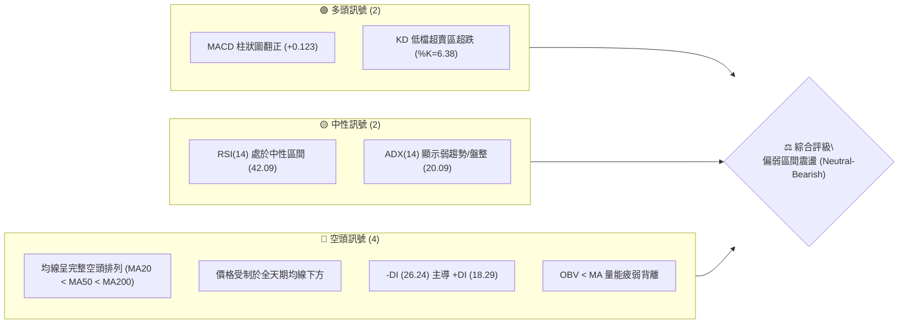
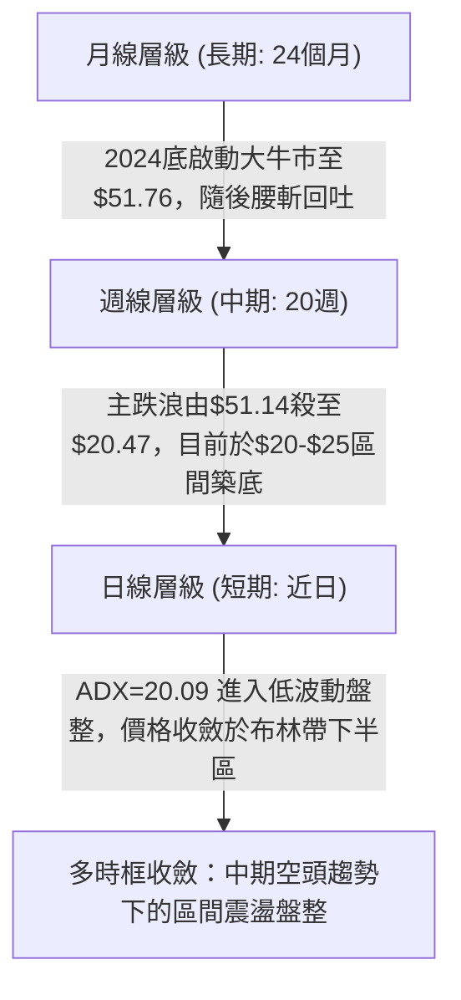
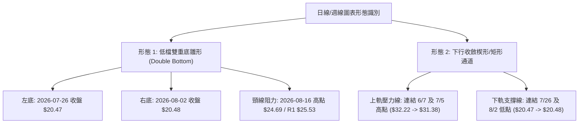
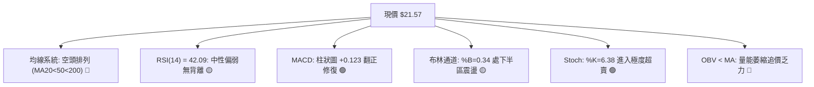
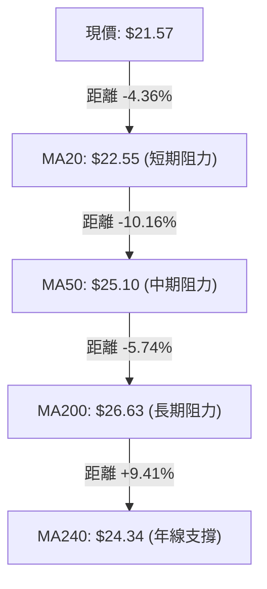
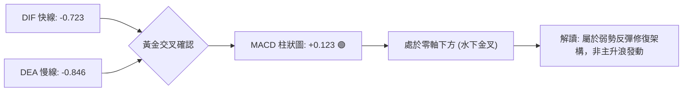
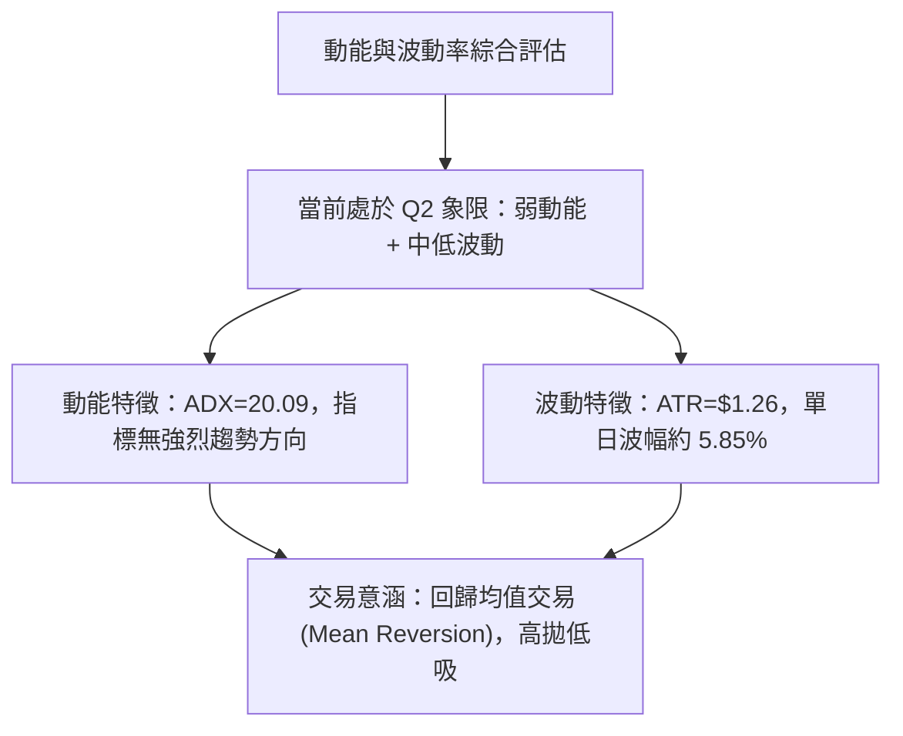
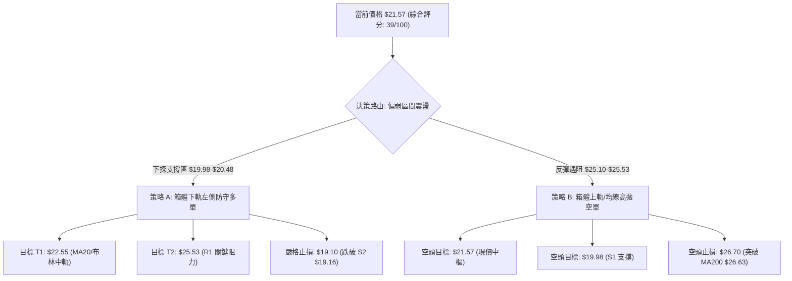
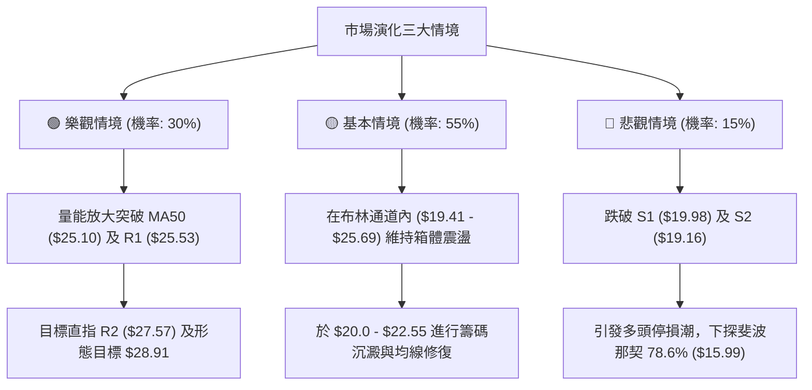

# PL 技術分析報告

> **報告日期**：2026-08-24 ｜ **語言**：繁體中文 ｜ **數據來源**：Yahoo Finance ｜ **當前價格**：$21.57

---

## 目錄

| 章節 | 內容 |
|------|------|
| [1. 技術面概覽](#1-技術面概覽) | 訊號儀表板、核心指標、評分卡 |
| [2. 趨勢分析](#2-趨勢分析) | 多時框趨勢、長中短期走勢 |
| [3. 圖表形態分析](#3-圖表形態分析) | 形態識別、K線組合、目標價 |
| [4. 支撐與阻力](#4-支撐與阻力) | 關鍵價位、斐波那契回調 |
| [5. 技術指標深度解讀](#5-技術指標深度解讀) | MA/RSI/MACD/布林/成交量 |
| [6. 動能與波動率](#6-動能與波動率) | 動能評估、ATR、Beta |
| [7. 多時框架總結](#7-多時框架總結) | 時框架評分矩陣 |
| [8. 交易策略建議](#8-交易策略建議) | 多空策略、風險報酬比 |
| [9. 風險提示與監控](#9-風險提示與監控) | 監控指標、風險場景 |

---

## 1. 技術面概覽

### 🎯 技術訊號儀表板



---

### 📊 核心指標速覽表

| 指標類別 | 指標名稱 | 當前數值 | 訊號 | 解讀 |
|:---|:---|:---|:---:|:---|
| **價格** | 當前價格 | $21.57 | 🔴 | 位於 52 週區間 33.7% 低位，短線處於主跌段後的築底期 |
| **均線** | MA20 (短) | $22.55 | 🔴 | 價格低於 MA20（乖離率 -4.36%），短期受壓明顯 |
| **均線** | MA50 (中) | $25.10 | 🔴 | 價格顯著低於 MA50，中期趨勢仍處於下行通道 |
| **均線** | MA200 (長) | $26.63 | 🔴 | 價格低於長期牛熊分界線，長線結構轉弱 |
| **動能** | RSI(14) | 42.09 | 🟡 | 位於 40–50 中性偏弱區，無頂底背離，下行動能有所減緩 |
| **動能** | MACD (12/26/9)| -0.723 / -0.846 | 🟢 | 快線位於慢線上方，柱狀圖 +0.123 呈現低檔黃金交叉修復 |
| **動能** | Stoch %K / %D | 6.38 / 22.28 | 🟢 | KD 進入極度超賣區間，具備短線技術性反彈動能 |
| **趨勢** | ADX / ±DI | 20.09 (-DI: 26.24) | 🟡 | ADX < 25 進入弱趨勢盤整，-DI 大於 +DI 空方主導但力度衰竭 |
| **通道** | Bollinger %B | 0.34 (寬度 $6.28) | 🟡 | 位於中軌 ($22.55) 與下軌 ($19.41) 之間震盪 |
| **成交量** | 量比 / OBV | 0.78x (OBV < MA) | 🔴 | 20日均量縮減至 5.36M，量能萎縮反映追價意願不足 |
| **波動** | ATR(14) | $1.26 (5.85%) | 🟡 | 波動率較 5 月高點大幅收斂，逐步進入低波動整理 |

---

### 🏆 技術評分卡

```
╔══════════════════════════════════════════════════════════════╗
║                PL 技術綜合評分卡 (2026-08-24)                 ║
╠══════════════════════════════════════════════════════════════╣
║ 趨勢強度 (Trend)      ███████░░░░░░░░░░░░░  35/100  🔴 空頭主導 ║
║ 動能指標 (Momentum)   █████████░░░░░░░░░░░  45/100  🟡 短線超賣 ║
║ 支撐穩定度 (Support)  ███████████░░░░░░░░░  55/100  🟡 $20.0 守穩║
║ 成交量配合 (Volume)   ███████░░░░░░░░░░░░░  35/100  🔴 量能萎縮 ║
║ 形態完整度 (Pattern)  ████████░░░░░░░░░░░░  40/100  🟡 築底雛形 ║
║ 均線排列 (MA System)  █████░░░░░░░░░░░░░░░  25/100  🔴 死亡排列 ║
╠══════════════════════════════════════════════════════════════╣
║ 綜合技術得分          ████████░░░░░░░░░░░░  39/100  🔴 偏弱盤整 ║
╚══════════════════════════════════════════════════════════════╝
```

---

## 2. 趨勢分析

### 🌐 多時框趨勢分析



---

### 📈 長期趨勢 — 12 個月走勢圖（Unicode）

```
PL 月線走勢圖（2025-08 至 2026-08）
價格軸 ($)
$52 ┤                                     ● $51.14 (2026-05 歷史高點)
$46 ┤                                    / \
$40 ┤                              ● $36.97   \
$34 ┤                                          ● $33.13 (2026-06 重挫)
$28 ┤                        ● $27.95           \
$22 ┤            ● $19.72   /                    \        ● $21.57 (現價)
$16 ┤      ● $13.45        /                      ● $20.48
$10 ┤  ● $7.09            /
 $4 ┤─●──────────────────●───────────────────────────────────────
    └┬────────┬────────┬────────┬────────┬────────┬────────┬─────
   25-08    25-10    25-12    26-02    26-04    26-06    26-08
```

#### 走勢特徵分析表格

| 階段 | 時間跨度 | 價格區間 | 累計漲跌幅 | 走勢特徵與量價結構 |
|:---|:---:|:---:|:---:|:---|
| **第一階段：爆發主升浪** | 2025-08 → 2026-01 | $7.09 → $24.97 | +252.2% | 突破底部平台，量能逐月放大，均線呈多頭發散。 |
| **第二階段：高檔加速頂** | 2026-02 → 2026-05 | $24.14 → $51.14 | +111.8% | 狂熱主升浪末期，5 月見頂 $51.76，週成交量放大至 61.48M。 |
| **第三階段：恐慌主跌段** | 2026-06 → 2026-07 | $51.14 → $20.48 | -59.95% | 斷崖式暴跌，連續跌破 MA20、MA50、MA200，單週爆量 100.6M 殺多。 |
| **第四階段：低檔震盪築底** | 2026-07 → 2026-08 | $20.47 → $21.57 | +5.37% | 在 $19.98–$20.48 區域獲得初步支撐，波動與量能同步收斂。 |

---

### 📊 中期趨勢（週線分析）

```
中期週線壓力與支撐結構圖 ($)
$35 ┤═════════════════════════════════════════ 斐波那契 38.2% 回調位 ($34.38)
$31 ┤----------------------------------------- MA120 下行阻力 ($31.33) / R3 ($30.90)
$27 ┤----------------------------------------- MA60 阻力 ($27.48) / R2 ($27.57)
$25 ┤═════════════════════════════════════════ R1 ($25.53) / MA50 ($25.10)
$22 ┤- - - - - - - - - - - - - - - - - - - - - MA20 短壓 ($22.55) ◄ 現價 $21.57
$20 ┤========================================= 近期波段底部 / S1 ($19.98)
$19 ┤═════════════════════════════════════════ 布林下軌 ($19.41) / S2 ($19.16)
```

中期走勢顯示，PL 自 2026 年 5 月底創下 $51.14（最高 $51.76）後，於 6 月至 7 月經歷了極端的主跌浪。近 6 週（7 月底至 8 月底）收盤價在 $20.47 至 $24.69 間震盪，週線 MACD 柱狀圖連續 3 週維持正值（最新 +0.123），表明拋壓已大幅減輕，進入中期盤整築底階段。

---

### ⚡ 趨勢強度評估（ADX 解讀）

```mermaid
graph LR
    A["ADX(14) = 20.09"] --> B{"ADX 門檻判定"}
    B -->|"< 25 (弱趨勢/無方向)|" C["市場進入區間震盪 (Consolidation)"]
    D["+DI = 18.29"] --> F{"DI 方向判定"}
    E["-DI = 26.24"] --> F
    F -->|"-DI > +DI (差值 7.95)|" G["空方仍具相對主導權，但動能衰減"]
    C --> H["操作結論：嚴格執行區間高拋低吸，禁用突破追價策略"]
    G --> H
```

#### ADX 強度對照與解讀

| 指標 | 數值 | 狀態 | 意涵與操作指引 |
|:---|:---:|:---:|:---|
| **ADX(14)** | 20.09 | 弱趨勢 / 盤整 | 數值低於 25，表明先前的單邊下跌趨勢已告一段落，行情轉入橫盤震盪。 |
| **+DI(14)** | 18.29 | 多方動能偏弱 | 買盤缺乏連續推升力道，無法發動趨勢性攻擊。 |
| **-DI(14)** | 26.24 | 空方動能減弱 | 雖高於 +DI，但較 6 月暴跌時顯著回落，空頭摜壓力道衰竭。 |

---

## 3. 圖表形態分析

### 🔍 形態識別系統



#### 形態信心度與量化評估表

| 形態名稱 | 信心度 | 判斷依據（引用數據） | 完成度 | 目標價（附精確計算式） |
|:---|:---:|:---|:---:|:---|
| **雙重底雛形 (W底)** | **62%** | 兩次下探低點 $20.47（07/26）與 $20.48（08/02）守穩於 S1 ($19.98) 之上，且 MACD 柱狀圖在右底翻正 (+0.032)。 | **50%**（尚未突破頸線） | 頸線高點 $24.69 + 形態高度 ($24.69 - $20.47 = $4.22) = **$28.91**（接近斐波那契 50% 回調位 $29.01）。 |
| **下行通道收斂** | **70%** | 高點持續下移（$32.22 → $31.38 → $24.69），但低點在 $20.47 處獲得水平支撐，形成下降三角形/收斂通道。 | **75%** | 若向下破位，量度跌幅為 $20.47 - ($24.69 - $20.47) = **$16.25**（逼近斐波那契 78.6% 回調位 $15.99）。 |

---

### 🕯️ 重要 K 線形態分析

| 週期 / 日期 | 收盤價 | K 線形態與組合 | 技術解讀 | 訊號強度 |
|:---|:---:|:---|:---|:---:|
| **2026-05-31** | $51.14 | 爆量長上影天劍線（最高 $51.76） | 歷史天價處嚴重量價背離，多頭力竭形成頂部反轉。 | 🔴 強烈看空 |
| **2026-06-07** | $32.22 | 破位跳空大陰線（單週 100.6M 量） | 跌破多道中期均線，機構恐慌盤湧出，確認主跌段展開。 | 🔴 強烈看空 |
| **2026-07-26** | $20.47 | 極度縮量長下影線（RSI 跌至 10.2） | 嚴重超賣後拋壓枯竭，形成波段左底支撐。 | 🟢 看多反彈 |
| **2026-08-02** | $20.48 | 縮量十字星平底線 | 與前一週低點構成平底雙底雛形，確認 $20.0 關卡防守有效。 | 🟢 看多築底 |
| **2026-08-16** | $24.69 | 上碰均線受阻倒狀錘子線 | 反彈觸及 MA50 ($25.10) 及 R1 ($25.53) 遭遇強解套賣壓回落。 | 🟡 中性偏弱 |
| **2026-08-30** | $21.57 | 量縮窄幅陰線（成交量僅 4.16M） | 測試短期布林帶下半區，進入觀望蓄勢狀態。 | 🟡 中性盤整 |

---

### 📉 ASCII 走勢形態示意圖

```
PL 雙重底雛形與頸線阻力結構示意圖
價格 ($)
$26.00 ┤                                  阻力區間 R1 ($25.53) / MA50 ($25.10)
$25.00 ┤                     ● (08/16 頸線高點 $24.69)
$24.00 ┤                    / \
$23.00 ┤                   /   \
$22.00 ┤                  /     \      ● 現價 ($21.57)
$21.00 ┤                 /       \    /
$20.00 ┤● (07/26 左底 $20.47)     ● (08/02 右底 $20.48)
$19.00 ┤────────────────────────────────── 強支撐區 S1 ($19.98) / S2 ($19.16)
       └──────────────────────────────────────────────────────────
```

---

### 🎯 形態目標價計算

依據標準幾何形態理論計算兩大演化路徑：

1. **多頭向上突破情境（突破頸線 $24.69）**：
   $$\text{形態高度 } H = \text{頸線 } \$24.69 - \text{底部最低點 } \$20.47 = \$4.22$$
   $$\text{量度目標價 } T_1 = \text{頸線 } \$24.69 + H = \$24.69 + \$4.22 = \mathbf{\$28.91}$$
   *(註：該目標價精確共振於關鍵阻力 R2 \$27.57 與 斐波那契 50.0% 回調位 \$29.01 之間)*

2. **空頭向下破位情境（跌破支撐 $19.98）**：
   $$\text{下破目標價 } T_{\text{down}} = \text{支撐 } \$19.98 - H = \$19.98 - \$4.22 = \mathbf{\$15.76}$$
   *(註：該目標價高度契合斐波那契 78.6% 回調位 \$15.99)*

---

## 4. 支撐與阻力

### 🗺️ 關鍵價位分布圖（Unicode）

```
PL 價位結構分布圖（OHLCV 聚類與斐波那契對照）
══════════════════════════════════════════════════════════════════════
$51.76 ║████████████████████████████████████████║ 52W 歷史最高點 (0.0%)
$41.02 ║████████████████████                    ║ 斐波那契 23.6% 回調位
$34.38 ║████████████████████████                ║ 斐波那契 38.2% 回調位
$30.90 ║████████████████████████████████        ║ 關鍵強阻力 R3
$29.01 ║████████████████████                    ║ 斐波那契 50.0% 關鍵平衡位
$27.57 ║██████████████████████████              ║ 中期阻力 R2 (共振 MA60 $27.48)
$25.53 ║████████████████████████████████████    ║ 關鍵頸線阻力 R1 (共振 MA50 $25.10)
$23.64 ║████████████████                        ║ 斐波那契 61.8% 黃金分割位
$22.55 ║----------------------------------------║ 布林中軌 / MA20 短壓
$21.57 ╠════════════════════════════════════════╣ ◄ 現價 ($21.57)
$19.98 ║▓▓▓▓▓▓▓▓▓▓▓▓▓▓▓▓▓▓▓▓▓▓▓▓▓▓▓▓▓▓▓▓        ║ 近期波段核心支撐 S1
$19.41 ║----------------------------------------║ 布林下軌支撐
$19.16 ║████████████████████████████████████    ║ 強支撐 S2 (波段低點聚類)
$15.99 ║██████████████                          ║ 斐波那契 78.6% 極限回調位
$11.97 ║████████████████████████                ║ 長期深層支撐 S3 (2025Q4 起漲區)
$06.26 ║████████████████████████████████████████║ 52W 歷史最低點 (100.0%)
══════════════════════════════════════════════════════════════════════
```

---

### 🚧 阻力位分析表

| 阻力級別 | 精確價位 | 形成原因與技術共振 | 突破難度 | 重要性 |
|:---|:---:|:---|:---:|:---:|
| **短壓 (MA20)** | **$22.55** | 日線 20 日移動平均線暨布林通道中軌，短線多空分水嶺。 | 中等 | 🟡 次要 |
| **強阻力 (R1)** | **$25.53** | 近一年波段高點聚類區，高度共振 50日均線 ($25.10) 及 08/16 波段高點 ($24.69)。 | 極高 | 🔴 核心關鍵 |
| **阻力 (R2)** | **$27.57** | 前期密集成交套牢區，共振 60日均線 ($27.48) 與 200日均線 ($26.63)。 | 高 | 🔴 重要 |
| **強阻力 (R3)** | **$30.90** | 2026 年 6 月底至 7 月初反彈平台高點聚類，共振 120日均線 ($31.33)。 | 極高 | 🔴 強烈 |

---

### 🛡️ 支撐位分析表

| 支撐級別 | 精確價位 | 形成原因與技術共振 | 守住機率 | 重要性 |
|:---|:---:|:---|:---:|:---:|
| **近期支撐 (S1)** | **$19.98** | 近一年波段低點聚類核心，整數心理關卡，07/26 ($20.47) 及 08/02 ($20.48) 底部護盤線。 | 70% | 🟢 核心防線 |
| **通道下軌** | **$19.41** | 日線布林通道下軌動態支撐，偏離過大時具備均值回歸拉力。 | 75% | 🟡 次要 |
| **強支撐 (S2)** | **$19.16** | 近一年極端波段低點聚類，跌破將引發新一輪止損恐慌盤。 | 60% | 🟢 極重要 |
| **深層支撐 (S3)** | **$11.97** | 2025 年 11 月爆發性起漲平台低點聚類，長期牛市起點結構位。 | 85% | 🟢 戰略級 |

---

### 📐 斐波那契回調位分析

依據 52 週完整波段（低點 $6.26 → 高點 $51.76，波幅 $45.50）計算：

| 斐波那契回調層級 | 精確價位 | 技術意涵與現價關係 |
|:---:|:---:|:---|
| **0.0% (52W High)** | **$51.76** | 歷史極值，本輪超級牛市天花板。 |
| **23.6%** | **$41.02** | 主跌浪第一回踩支撐，跌破後轉為長期強阻力。 |
| **38.2%** | **$34.38** | 關鍵弱勢反彈位，多頭若能收復方能扭轉中期空頭架構。 |
| **50.0%** | **$29.01** | 多空力量對稱中樞，牛熊分水嶺。 |
| **61.8%** | **$23.64** | **黃金分割回調位**。現價 ($21.57) 落於 61.8% ($23.64) 與 78.6% ($15.99) 之間。 |
| **78.6%** | **$15.99** | 深度回調極限防守位，若失守 S1/S2 則將尋求此處支撐。 |
| **100.0% (52W Low)** | **$6.26** | 52 週最低點，原始起漲基石。 |

**解讀**：當前價格 $21.57 處於 61.8% ($23.64) 回調位下方，表明技術結構處於「深度超跌回調」狀態。由於 61.8% 跌破，上方 $23.64–$25.53 形成了密集的解套壓力帶；但下方受到 78.6% ($15.99) 及 S1 ($19.98) 的強力牽引，使得下行空間受到壓縮。

---

## 5. 技術指標深度解讀

### 🎛️ 指標訊號總覽



---

### 📈 移動平均線排列分析



#### 全天期均線排列明細表

| 均線名稱 | 數值 | 價格與均線距離 | 均線斜率與走勢 | 訊號解讀 |
|:---|:---:|:---:|:---:|:---|
| **MA 5** | $22.40 | -3.71% | 下行 (██▆▆▅▄▃) | 極短線受壓，反彈受阻 |
| **MA 10** | $23.40 | -7.83% | 下行 (██▇▆▅▄▄) | 扣高壓力重，形成下壓蓋頭 |
| **MA 20** | $22.55 | -4.36% | 下行 (███▇▇▇▆) | 短期多空分水嶺，尚未站穩 |
| **MA 50** | $25.10 | -14.06% | 陡峭向下 | 中期空頭生命線 |
| **MA 60** | $27.48 | -21.50% | 陡峭向下 (█████▇) | 季線阻力沉重 |
| **MA 120**| $31.33 | -31.14% | 走平轉下 | 半年線失守，長期走勢受損 |
| **MA 200**| $26.63 | -18.99% | 下行 | 長期牛熊分界線失守 |
| **MA 240**| $24.34 | -11.37% | 緩步上行 (▁▁▁▂▂▃) | 年線仍具長期基底支撐效果 |

**結論**：均線系統呈現標準的「死亡空頭排列」（MA20 < MA50 < MA200），短中期均線全數下行，對價格形成層層蓋頂壓力。唯有先帶量長陽突破 MA20 ($22.55)，才有機會挑戰 MA50 ($25.10) 及 R1 ($25.53)。

---

### 📉 RSI(14) 分析

```
RSI(14) 當前數值: 42.09
0 ──────────── 30 ────────────────────── 50 ───────────── 70 ──────────── 100
[  超賣區 (<30)  ] [  當前位置: 42.09 🟡  ] [      中性偏強區      ] [ 超買區 (>70) ]
▓▓▓▓▓▓▓▓▓▓▓▓▓▓▓▓▓▓▓▓▓▓░░░░░░░░░░░░░░░░░░░░░░░░░░░░░░░░░░░
```

- **區間評估**：RSI(14) 目前為 42.09，自 7 月底的極端超賣區（07/26 週 RSI 為 10.2）修復回升至 40–50 中性偏弱常態區間。
- **背離判斷**：
  - 價格在 07/26 低點 $20.47、08/02 低點 $20.48 時，週線 RSI 分別由 10.2 回升至 25.6，日線 RSI 亦逐步墊高，形成了局部的**隱性動能修復**。
  - 目前未見典型的大級別頂背離或底背離，指標與價格維持同步震盪格局。

---

### 📊 MACD(12/26/9) 訊號解讀



- **參數狀態**：MACD 快線 (-0.723) 向上穿越慢線 (-0.846)，MACD 柱狀圖維持為 **+0.123**。
- **訊號解析**：柱狀圖在零軸下方持續收紅，顯示短線下行拋壓已獲遏制，空頭回補動能支撐價格於 $20.0 上方運行；但由於 DIF 與 DEA 仍處於零軸之下甚遠，屬於「水下弱勢金叉」，反彈空間受制於上方均線。

---

### 📦 布林通道分析

```
PL 日線布林通道結構圖 (20日, 2.0σ)
$26.00 ┤                                  ─── 上軌: $25.69 (共振 R1 $25.53)
$25.00 ┤
$24.00 ┤
$23.00 ┤
$22.55 ┤ - - - - - - - - - - - - - - - -  ─── 中軌: $22.55 (MA20 短壓)
$22.00 ┤
$21.57 ┤ ◄ 現價: $21.57 (%B = 0.34)
$21.00 ┤
$20.00 ┤
$19.41 ┤                                  ─── 下軌: $19.41 (共振 S2 $19.16)
       └──────────────────────────────────
```

- **通道帶寬**：上軌 $25.69 與下軌 $19.41 形成寬度為 $6.28 的震盪箱體。
- **%B 指標**：%B 為 **0.34**（位於 0 與 0.5 之間），價格處於中軌至下軌的弱勢整理區。
- **布林特徵**：通道口呈現收斂走平態勢，預示劇烈單邊行情暫告段落，價格將在中軌與下軌間進行區間波動。

---

### 💹 成交量分析（量價配合度）

- **量能萎縮**：最新成交量為 **4,166,171 股**，相較 20 日均量 (5,363,679 股) 量比僅 **0.78x**，相較 50 日均量 (9,473,495 股) 更顯著萎縮。
- **量價關係**：
  - 5 月天價區週均量達 61.48M，6 月暴跌區週均量達 100.62M，反映主力籌碼大量派發。
  - 近兩週成交量降至 22.75M 及 4.16M（單日），「跌勢量縮」顯示殺跌動能接近真空，但也意味著買盤極度觀望，缺乏推升價格突破阻力的增量資金。
- **OBV 趨勢**：OBV 位於其均線下方（OBV < MA），量能指標確認整體格局仍屬弱勢整理。

---

## 6. 動能與波動率

### ⚡ 動能評估四象限

| 象限 | 動能維度 (Momentum) | 波動維度 (Volatility) | 當前判定 | 策略意涵 |
|:---:|:---:|:---:|:---:|:---|
| **Q1 (最佳擴張)** | 強動能 (ADX>25, +DI主導) | 低波動 (ATR收斂) | ─ | 趨勢突破初期，最佳追價進場點 |
| **Q2 (盤整沉澱)** | **弱動能 (ADX=20.09)** | **中低波動 (ATR收斂至5.85%)** | **✓ PL 當前狀態** | **防守築底期，適合區間網格或觀望** |
| **Q3 (狂熱失控)** | 強動能 (超買/超賣) | 高波動 (ATR>10%) | ─ | 2026年5-6月狀態，高風險博弈 |
| **Q4 (恐慌出清)** | 弱動能 (主跌段崩塌) | 高波動 (巨量長黑) | ─ | 主跌浪末期，嚴禁左側抄底 |



---

### 📊 ATR 波動率分析

- **ATR(14) 數值**：**$1.26**（佔當前股價之 **5.85%**）。
- **風控止損距離建議**：
  - **保守型交易者（1.5 倍 ATR）**：止損緩衝距離為 $1.26 \times 1.5 = \mathbf{\$1.89}$。若以現價 $21.57 進場，保護性止損應設於 $21.57 - $1.89 = **$19.68**（略低於 S1 $19.98）。
  - **波段型交易者（2.0 倍 ATR）**：止損緩衝距離為 $1.26 \times 2.0 = \mathbf{\$2.52}$。保護性止損設於 $21.57 - $2.52 = **$19.05**（略低於 S2 $19.16）。

---

### 📐 Beta 與市場相關性

- **Beta 係數**：**2.123**（高 Beta 成長型資產）。
- **市場敏感度解讀**：
  - PL 的價格波動劇烈程度約為標普 500 指數的 **2.12 倍**。
  - 在大盤（美股整體市場）處於風險偏好（Risk-on）環境時，PL 具備強大的彈升槓桿；但當大盤承壓時，PL 容易引發超額回撤。
  - 當前高 Beta 屬性配合低量能，暗示股價容易受到小規模資金衝擊而產生洗盤震盪，交易倉位必須嚴格控制。

---

## 7. 多時框架總結

### 📋 時框架評分表

| 時框架 | 趨勢方向 | 動能指標 | 均線系統 | 形態結構 | 綜合評分 | 操作建議 |
|:---|:---:|:---:|:---:|:---:|:---:|:---|
| **月線 (長期)** | 🟡 中性回調 | 偏弱 (高檔回落) | 偏多 (年線之上) | 爆發浪後的深幅回踩 | **50/100** | 長線長線分批建倉點尚未確立 |
| **週線 (中期)** | 🔴 空頭下行 | 築底 (MACD柱翻正) | 🔴 空頭排列 | $20.47 雙底雛形 | **40/100** | 耐心等待週線均線收斂走平 |
| **日線 (短期)** | 🟡 區間震盪 | 🟡 中性 (RSI 42) | 🔴 受制 MA20 | 布林帶中下軌震盪 | **38/100** | 嚴格執行箱體下軌低吸高拋 |
| **4小時 (極短)** | 🟢 局部反彈 | 🟢 KD 低檔超賣 | 🟡 測試短均線 | 窄幅區間收斂 | **45/100** | 適合極短線日內博弈反彈 |

---

### 🔲 綜合訊號矩陣

```
時框一致性分析矩陣
┌──────────────┬──────────────┬──────────────┬──────────────┐
│   長期 (月線) │   中期 (週線) │   短期 (日線) │   一致性結論 │
├──────────────┼──────────────┼──────────────┼──────────────┤
│  52W 區間 33%│  主跌浪後盤整 │  布林帶下半區 │  總體趨勢偏弱 │
│  年線上方支撐│  均線空頭排列 │  ADX<25 弱震盪│  中短期受制  │
│  評級: 🟡中性 │  評級: 🔴偏空 │  評級: 🟡震盪 │  以震盪市對待│
└──────────────┴──────────────┴──────────────┴──────────────┘
```

---

### ⚖️ 多時框收斂結論

> **依據「多時框收斂規則」進行最終裁決**：
> 1. **行情屬性判定**：當前 ADX(14) = **20.09 (< 25)**，明確定義當前市場處於 **「盤整震盪行情」**，非單邊趨勢行情。
> 2. **主導維度**：依據規則，盤整行情應以 **日線布林通道上下軌 ($19.41 – $25.69) 與關鍵聚類支撐阻力 (S1 $19.98 – R1 $25.53)** 作為核心交易邊界。
> 3. **唯一方向結論**：**【中性偏弱震盪，區間下軌防守反彈】**。日線級別在 $20.0 關卡具備堅實的波段低點支撐，但上方受制於 MA20 ($22.55) 與 MA50 ($25.10) 的沉重套牢盤，不具備走出單邊大牛市條件，核心策略為「依託 S1 支撐低吸，受阻 R1 止盈」的區間震盪操作。

---

## 8. 交易策略建議

### 🗺️ 策略決策流程圖



---

### 🧭 策略路由

**當前主策略方向 = 【偏弱區間操作：低吸高拋震盪策略】（依據技術評分 39/100 及 ADX=20.09 弱趨勢定義）**

---

### 🎯 價格情境階梯（Price Scenarios）

所有價位均嚴格引用第 4 章及數據庫之精確計算值：

| 觸發條件 | 第一目標 | 後續延伸 | 情境含義與技術應對 |
|:---|:---:|:---:|:---|
| **強勢突破 R1 $25.53** | R2 $27.57 | R3 $30.90 | 短線轉強，W底形態確認，帶量突破方可順勢追多。 |
| **站穩現價區間 $21.57** | MA20 $22.55 | R1 $25.53 | 區間震盪，價格在布林中軌與下軌間進行均值修復。 |
| **有效跌破 S1 $19.98** | S2 $19.16 | S3 $11.97 | 築底失敗，開啟新一輪破位殺跌，直指斐波那契 78.6% ($15.99)。 |

---

### 📊 情境機率分佈

| 情境劇本 | 機率估計 | 主要技術指標依據 |
|:---|:---:|:---|
| **區間震盪築底 (主情境)** | **55%** | ADX=20.09 (<25) 顯示無方向，布林通道收斂，MACD 翻正但受制水下。 |
| **向上反彈測試阻力 (次情境)** | **30%** | KD 極度超賣 (%K=6.38)，RSI(14)=42 自低檔修復，機構評級均價 $40.10 提供估值底。 |
| **跌破支撐向下探底 (風險情境)** | **15%** | 均線呈空頭排列，OBV 疲弱成交量萎縮，若大盤重挫可能引發高 Beta 補跌。 |

---

### 🟢 主策略詳情

#### 策略 A：箱體下軌低吸多單（順應超跌反彈） vs 策略 B：箱體上軌反壓空單（順應均線趨勢）

| 策略要素 | 策略 A（區間低多） | 策略 B（阻力高空） |
|:---|:---:|:---:|
| **進場條件** | 價格回踩 S1 區域守穩或現價輕倉試單 | 價格反彈至 R1 / MA50 遭遇阻力滯漲 |
| **進場價格** | **$20.48** (或現價 $21.57 分批) | **$25.53** (R1 阻力位) |
| **第一目標價 (T1)** | **$22.55** (MA20 / 布林中軌) | **$22.55** (MA20 / 布林中軌) |
| **第二目標價 (T2)** | **$25.53** (R1 阻力位) | **$19.98** (S1 支撐位) |
| **止損價格** | **$19.10** (跌破 S2 $19.16 及 1.5x ATR) | **$26.70** (突破 MA200 $26.63) |
| **風險報酬比 (R/R)** | **3.66 : 1** (以進場 $20.48, 止損 $19.10, T2 $25.53 計) | **4.74 : 1** (以進場 $25.53, 止損 $26.70, T2 $19.98 計) |
| **預估勝率** | **55%** | **60%** |
| **建議倉位** | **8% - 12%** (低倉位防守) | **8% - 12%** (嚴控右側進場) |

---

### 🔴 反向風險觸發點（風控對沖提示）

- **多頭部位防守紅線**：若日線收盤價跌破 **$19.16 (S2)**，代表 $20.0 雙底築底結構徹底破裂，必須無條件執行止損出局，防範跌向 **$15.99** 或 **$11.97 (S3)**。
- **空頭部位止損紅線**：若日線帶量（單日量 > 9.47M 即 50日均量）實體陽線站上 **$26.63 (MA200)**，代表長期空頭架構被粉碎，所有空單必須止損並轉為順勢多頭。

---

### ⭐ 整體訊號強度評星

```
╔══════════════════════════════════════════════════════════════╗
║ 做多訊號強度：  ★★☆☆☆  (2.5/5 星 — 僅限超賣反彈博弈)        ║
║ 做空訊號強度：  ★★★☆☆  (3.5/5 星 — 順應長中均線壓制)        ║
║ 整體技術可信度：★★★☆☆  (3.5/5 星 — 處於震盪築底觀察期)      ║
╚══════════════════════════════════════════════════════════════╝
```

---

## 9. 風險提示與監控

### ✅ 關鍵監控指標 Checklist

```
╔══════════════════════════════════════════════════════════════╗
║               PL 每日交易決策關鍵監控清單 (Checklist)        ║
╠══════════════════════════════════════════════════════════════╣
║ [ ] 價格能否守穩於 S1 ($19.98) 之上？                        ║
║ [ ] 日成交量是否放大至 20日均量 (5.36M) 以上？              ║
║ [ ] 日線 RSI(14) 是否站穩 50 多空分界點？                   ║
║ [ ] MACD 柱狀圖是否持續擴大正值 (+0.123 擴張)？             ║
║ [ ] 價格是否觸及並突破 MA20 ($22.55)？                      ║
║ [ ] ADX(14) 是否自 20.09 拐頭向上並突破 25？               ║
╚══════════════════════════════════════════════════════════════╝
```

---

### ⚠️ 風險場景分析



---

### 🛡️ 風險管理重要提醒

1. **Beta 風險與波動管理**：PL 的 Beta 值高達 **2.123**，單日 ATR 高達 **$1.26 (5.85%)**。在震盪行情中，切忌使用高槓桿，單筆交易虧損金額應嚴格限制在總交易資本的 **1.0% – 1.5%** 以內。
2. **量能萎縮陷阱**：當前成交量僅 4.16M，低於 20 日均量。流動性收縮時，掛單深度較淺，避免使用市價單（Market Order）進出，應一律採用限價單（Limit Order）以防滑價損失。
3. **重大基本面事件防範**：儘管分析師目標價均值高達 $40.10（最高 $53.00，最低 $25.00），但技術面均線修復需要數週至數月時間，切勿盲目依賴基本面目標價而忽視跌破支撐位的硬性止損紀律。

---

## 📋 報告總結

```
╔══════════════════════════════════════════════════════════════════╗
║                    PL 技術分析報告總結                           ║
╠══════════════════════════════════════════════════════════════════╣
║ 報告日期：2026-08-24                                             ║
║ 當前價格：$21.57 (52W 高低: $51.76 / $6.26)                      ║
║ 分析評級：⚖️ 偏弱區間震盪 (Neutral-Bearish Consolidation)        ║
╠══════════════════════════════════════════════════════════════════╣
║ 關鍵結論：                                                       ║
║ ├─ 長期趨勢：🟡 中性回調 (年線上方回踩，回撤 52W 漲幅 61.8%)   ║
║ ├─ 中期趨勢：🔴 空頭排列 (MA20 < MA50 < MA200 死亡排列)        ║
║ ├─ 短期趨勢：🟡 區間震盪 (ADX=20.09 弱趨勢，布林下半區整理)     ║
║ ├─ 關鍵支撐：S1: $19.98 ｜ S2: $19.16 ｜ S3: $11.97              ║
║ ├─ 關鍵阻力：R1: $25.53 ｜ R2: $27.57 ｜ R3: $30.90              ║
║ └─ 分析師目標價：均價 $40.10 (最低 $25.00 / 最高 $53.00)         ║
╠══════════════════════════════════════════════════════════════════╣
║ 最優策略組合：                                                   ║
║ 1. 🥇 最佳機會：區間下軌防守低吸 — 於 $20.0-$20.5 分批布局，      ║
║                  停損設 $19.10，目標看 $22.55 及 $25.53。        ║
║ 2. 🥈 次選機會：反彈遇阻放空 — 若反彈至 R1 $25.53 滯漲，以       ║
║                  $26.70 止損進場做空，目標回測 $21.57 / $19.98。║
║ 3. 🥉 保守選擇：空倉觀望 — 等待價格放量站上 MA50 ($25.10)       ║
║                  或跌至 $15.99 極限支撐再行介入。                ║
╚══════════════════════════════════════════════════════════════════╝
```

---

> ⚠️ **免責聲明**：本報告為 AI 自動生成之技術分析研究，所有數據及估算均基於歷史價格與客觀技術指標計算。本報告**僅供研究與學術參考**，**不構成任何形式的投資要約或交易建議**。金融市場投資具有高風險性，投資人應獨立評估風險並自負盈虧。

---

*報告生成時間：2026-08-24 ｜ 數據來源：Yahoo Finance ｜ 分析框架：多時框量化技術分析系統*