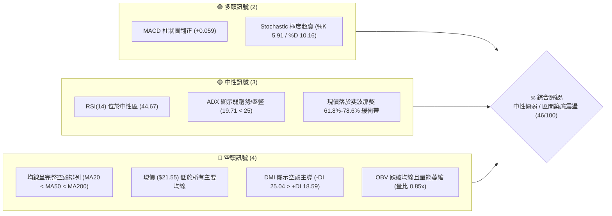
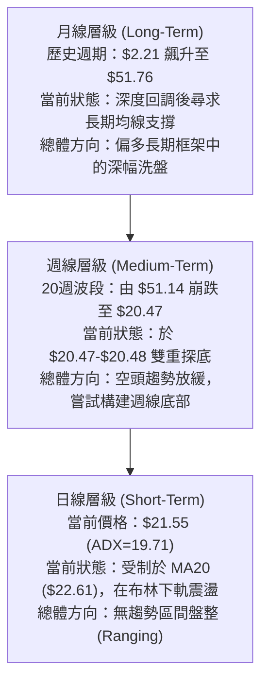
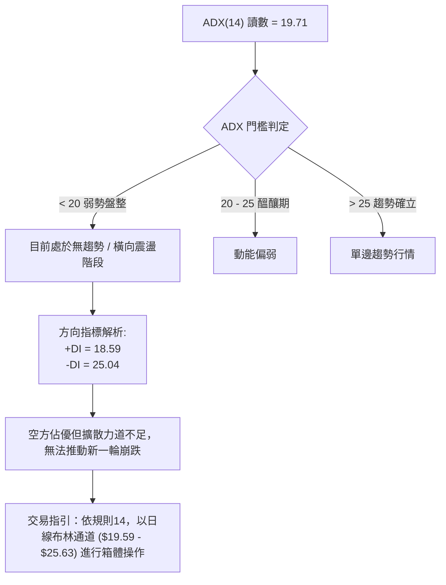
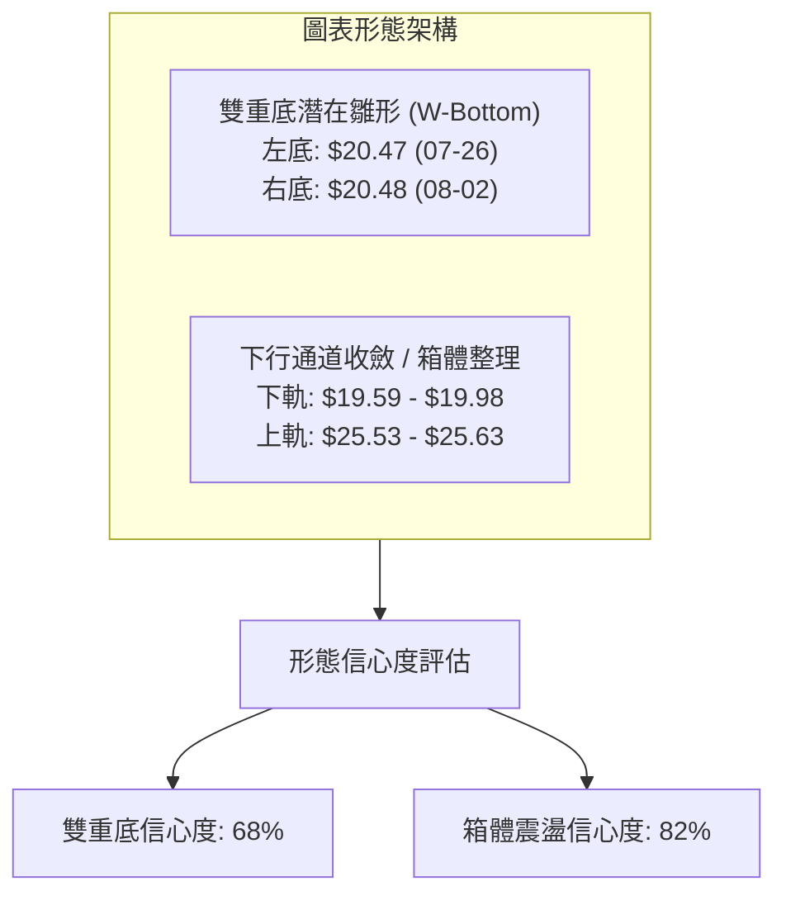
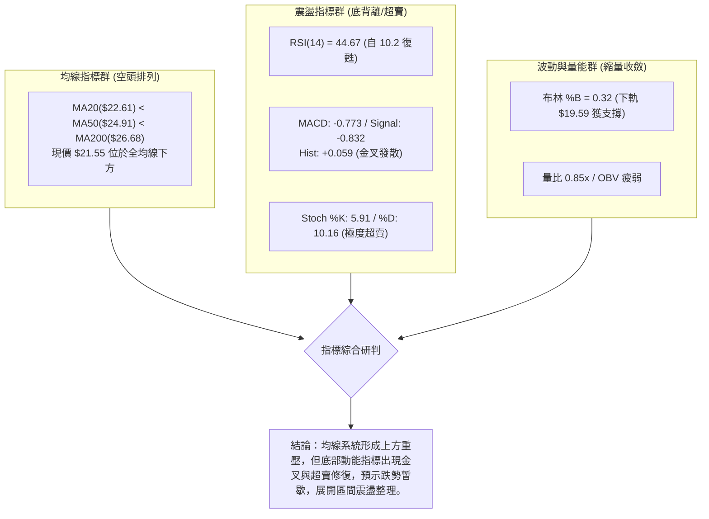
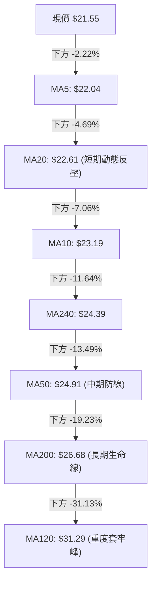
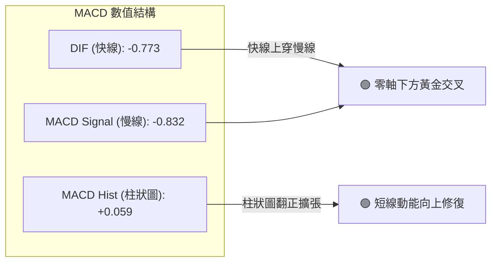
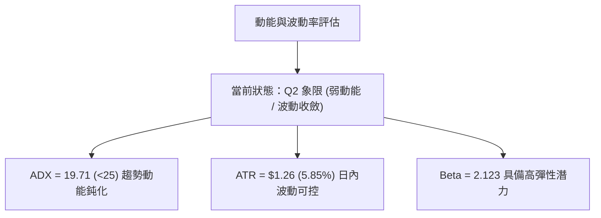
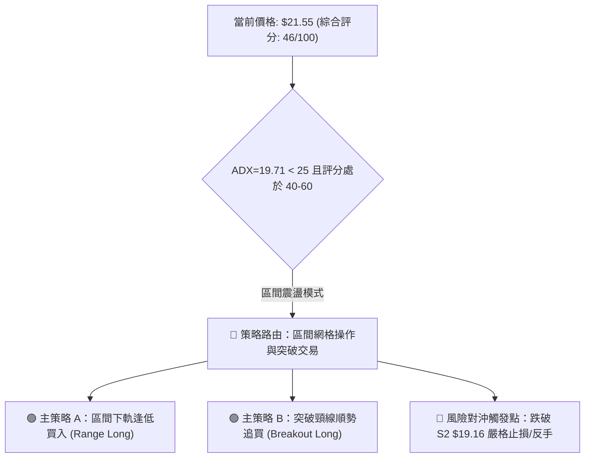
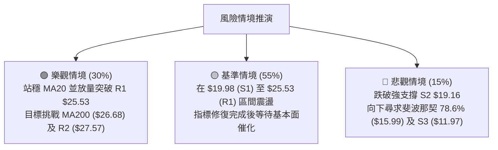

# PL 技術分析報告

> **報告日期**：2026-08-25 ｜ **語言**：繁體中文 ｜ **數據來源**：Yahoo Finance ｜ **當前價格**：$21.55

---

## 目錄

| 章節 | 內容 |
|------|------|
| [1. 技術面概覽](#1-技術面概覽) | 訊號儀表板、核心指標、評分卡 |
| [2. 趨勢分析](#2-趨勢分析) | 多時框趨勢、長中短期走勢、ADX 解讀 |
| [3. 圖表形態分析](#3-圖表形態分析) | 形態識別、K線組合、目標價推算 |
| [4. 支撐與阻力](#4-支撐與阻力) | 關鍵價位分佈、斐波那契回調 |
| [5. 技術指標深度解讀](#5-技術指標深度解讀) | MA/RSI/MACD/布林/成交量 |
| [6. 動能與波動率](#6-動能與波動率) | 動能評估、ATR、Beta 與市場關聯 |
| [7. 多時框架總結](#7-多時框架總結) | 時框架評分矩陣與收斂結論 |
| [8. 交易策略建議](#8-交易策略建議) | 策略路由、價格情境、多空操作細節 |
| [9. 風險提示與監控](#9-風險提示與監控) | 監控清單、極端情境與風控指南 |

---

## 1. 技術面概覽

### 🎯 技術訊號儀表板



---

### 📊 核心指標速覽表

| 指標類別 | 指標名稱 | 當前數值 | 訊號 | 專業解讀 |
|:---|:---|:---:|:---:|:---|
| **價格結構** | 當前收盤價 | **$21.55** | 🟡 | 位於52週區間 33.6% 分位，自高點回撤後進入築底期 |
| **短期均線** | MA20 | **$22.61** | 🔴 | 價格在MA20下方 -4.69%，構成即期動態反彈阻力 |
| **中期均線** | MA50 | **$24.91** | 🔴 | 中期趨勢偏空，下行斜率仍存，壓制多頭波段延伸 |
| **長期均線** | MA200 | **$26.68** | 🔴 | 長期牛熊分界線失守，整體格局仍受制於大級別下行壓力 |
| **動能震盪** | RSI(14) | **44.67** | 🟡 | 處於 30–70 中性常態區間，無極端超買，底背離隱現 |
| **趨勢動能** | MACD (12/26/9) | **-0.773 / -0.832** | 🟢 | 快線黃金交叉慢線，柱狀圖 +0.059 擴張，釋放止跌訊號 |
| **隨機指標** | Stoch %K / %D | **5.91 / 10.16** | 🟢 | 進入極端深度超賣區間，技術性反彈動能蓄積 |
| **趨勢強度** | ADX (14) | **19.71** | 🟡 | ADX < 25 表明單邊空頭趨勢動能衰竭，轉入箱體震盪 |
| **通道指標** | Bollinger Bands | **$19.59 – $25.63** | 🟡 | %B = 0.32，價格靠近下軌後獲支撐，帶寬收窄醞釀變盤 |
| **量能指標** | 成交量 / 20日均量 | **4.36M / 5.15M** | 🔴 | 量比 0.85x，OBV < MA，反彈量能不足，追價力道保守 |
| **波動率** | ATR (14) | **$1.26 (5.85%)** | 🟡 | 日內波動幅度中等，適合區間網格與波段防守部署 |

---

### 🏆 技術評分卡

```
╔══════════════════════════════════════════════════════════════════╗
║                   技術評分卡 — PL (2026-08-25)                   ║
╠══════════════════════════════════════════════════════════════════╣
║ 趨勢強度 (Trend)      ████████░░░░░░░░░░░░  38/100  🔴 空頭主導  ║
║ 動能指標 (Momentum)   ████████████░░░░░░░░  58/100  🟡 底部金叉  ║
║ 支撐穩定度 (Support)  ████████████░░░░░░░░  60/100  🟢 S1守穩    ║
║ 成交量配合 (Volume)   ███████░░░░░░░░░░░░░  35/100  🔴 量能疲弱  ║
║ 形態完整度 (Pattern)  ██████████░░░░░░░░░░  50/100  🟡 箱體整理  ║
║ 均線排列 (MA System)  ██████░░░░░░░░░░░░░░  32/100  🔴 空頭排列  ║
╠══════════════════════════════════════════════════════════════════╣
║ 綜合技術評分          █████████░░░░░░░░░░░  46/100  ⚖️ 區間震盪  ║
╚══════════════════════════════════════════════════════════════════╝
```

---

## 2. 趨勢分析

### 🌐 多時框趨勢架構



---

### 📈 長期趨勢 — 12個月走勢圖（ASCII）

```
PL 月線走勢圖（2025-08 至 2026-08）
價格軸 ($)
$52.00 ┤                                      ● $51.14 (2026-05)
$46.00 ┤                                     / \
$40.00 ┤                             ● $36.97   \
$34.00 ┤                                         ● $33.13 (2026-06)
$28.00 ┤                     ● $27.95             \
$22.00 ┤             ● $19.72                      \      ● $21.55 (現價)
$16.00 ┤     ● $13.45                               ● $20.48 (2026-07)
$10.00 ┤ ● $7.09
 $4.00 ┤
       └────────────────────────────────────────────────────────────►
        08/25 09/25 10/25 11/25 12/25 01/26 02/26 03/26 04/26 05/26 06/26 07/26 08/26
```

#### 走勢特徵階段分析

| 階段週期 | 時間區間 | 起止價格 | 漲跌幅 | 核心特徵與技術解讀 |
|:---|:---:|:---:|:---:|:---|
| **主升爆發期** | 2025-08 → 2026-05 | $7.09 → $51.14 | **+621.30%** | 衛星數據商業化推動估值重估，放量突破所有長期阻力 |
| **恐慌拋售期** | 2026-05 → 2026-06 | $51.14 → $33.13 | **-35.22%** | 月線形成烏雲蓋頂，機構資金高檔獲利了結，成交量破億 |
| **加速探底期** | 2026-06 → 2026-07 | $33.13 → $20.48 | **-38.18%** | 跌破多道中期均線，週線 RSI 降至 10.2 極度超賣 |
| **築底修復期** | 2026-07 → 2026-08 | $20.48 → $21.55 | **+5.22%** | 連續兩週於 $20.48 附近企穩，波動率收斂，進入橫盤整理 |

---

### 📊 中期趨勢（週線與日線關鍵位置）

```
                     中期價格架構與阻力支撐示意
┌────────────────────────────────────────────────────────────┐
│ $30.90  ════════════════════════════════════  強阻力 (R3)   │
│                                                            │
│ $27.57  ------------------------------------  波段阻力 (R2) │
│ $26.68  ~~~~~~~~~~~~~~~~~~~~~~~~~~~~~~~~~~~~  MA200 生命線 │
│ $25.53  ════════════════════════════════════  頸線阻力 (R1) │
│ $22.61  ....................................  MA20 / 布林中軌│
│                                                            │
│ $21.55  ►►► [ 當前收盤價位 ] ◄◄◄                           │
│                                                            │
│ $19.98  ════════════════════════════════════  第一支撐 (S1) │
│ $19.16  ------------------------------------  強支撐 (S2)   │
│ $11.97  ════════════════════════════════════  長期深層防線(S3)│
└────────────────────────────────────────────────────────────┘
```

---

### ⚡ 趨勢強度評估（ADX 解讀）



| 指標項 | 數值 | 狀態 | 交易含義 |
|:---|:---:|:---:|:---|
| **ADX (14)** | **19.71** | 弱趨勢 / 盤整 (<25) | 趨勢動能極弱，順勢突破策略易失效，震盪指標勝率較高 |
| **+DI (14)** | **18.59** | 多方動能不足 | 買盤暫未發起連續攻擊，多頭仍處於防守蓄勢階段 |
| **-DI (14)** | **25.04** | 空方相對主導 | 空方維持控制權，但因 ADX 疲軟，空方缺乏壓垮支撐的爆發力 |

---

## 3. 圖表形態分析

### 🔍 形態識別系統



#### 形態識別與信心度評估表

| 形態名稱 | 信心度 | 判斷依據（嚴格引用數據） | 完成度 | 目標價（附嚴謹計算式） |
|:---|:---:|:---|:---:|:---|
| **潛在雙重底 (W-Bottom)** | **68%** | 2026-07-26 低點 **$20.47** 與 2026-08-02 低點 **$20.48** 形成水平雙底支撐；頸線位於 2026-08-16 收盤高點 **$24.69**（接近阻力 R1 $25.53）。 | 60% | 頸線 $24.69 + 形態高度 ($24.69 - $20.47 = $4.22) = **$28.91**（接近斐波那契 50% 回調位 $29.01） |
| **矩形箱體整理 (Rectangle Range)** | **82%** | 價格在下檔支撐 S1 **$19.98**（布林下軌 $19.59）與上方阻力 R1 **$25.53**（布林上軌 $25.63）之間連續波動 4 週。 | 75% | 向上突破 R1 $25.53 測量目標：$25.53 + ($25.53 - $19.98) = **$31.08**（接近阻力 R3 $30.90） |

---

### 🕯️ 重要K線形態分析

| 日期 / 週期 | 收盤價 | 週成交量 | K線形態 | 技術解讀與多空隱義 | 訊號強度 |
|:---|:---:|:---:|:---:|:---|:---:|
| **2026-05-31** | $51.14 | 61.48M | **高檔長上影見頂線** | 創下 52 週高點 $51.76 後遭強烈拋壓，成交量放大，主力出貨標誌 | 🔴 強空 |
| **2026-06-07** | $32.22 | 100.62M | **放量長陰破位線** | 週跌幅逾 37%，成交量創歷史天量，確認中期多頭趨勢終結 | 🔴 極空 |
| **2026-07-26** | $20.47 | 38.22M | **止跌錘子線 (Hammer)** | 探底 $20.47 後收回，RSI 觸及極值 10.2，呈現超賣耗竭特徵 | 🟢 築底 |
| **2026-08-02** | $20.48 | 35.11M | **平底十字星 (Doji)** | 二次確認 $20.47-$20.48 支撐帶，成交量萎縮，拋壓實質出清 | 🟢 止跌 |
| **2026-08-16** | $24.69 | 23.53M | **反彈測試小陽線** | 測試 MA50 阻力未果，量能未放大，受阻於 R1 $25.53 附近回落 | 🟡 承壓 |
| **2026-08-30** | $21.55 | 8.53M | **窄幅縮量收斂線** | 於 MA20 下方窄幅整理，等待基本面或動能指標進一步催化 | 🟡 觀望 |

---

### 📉 ASCII 走勢形態示意圖

```
                 雙重底 (Double Bottom) 與箱體形態示意
$26.00 ┤
$25.53 ┤------------------ 阻力 R1 / 箱體頂部 --------------------
$24.69 ┤               ▲ (頸線位 Neckline: 08-16)
$24.00 ┤              / \
$23.00 ┤             /   \             ▲ (現價: $21.55)
$22.00 ┤            /     \           /
$21.00 ┤           /       \         /
$20.48 ┤   ● (左底)         ● (右底)/ 
$19.98 ┤=== 07-26 ========== 08-02 =============================== 支撐 S1
$19.00 ┤
       └─────────────────────────────────────────────────────────► 時間
```

---

## 4. 支撐與阻力

### 🗺️ 關鍵價位分布圖（ASCII）

```
PL 價位結構分布圖
═══════════════════════════════════════════════════════════════════════════
$51.76 ║████████████████████████████████████████║ 52W 歷史極值高點 (0.0%)
$41.02 ║████████████████████████                ║ 斐波那契 23.6% 回調位
$34.38 ║██████████████████                      ║ 斐波那契 38.2% 回調位
$30.90 ║████████████████████████████████        ║ 強阻力 R3 (波段高點聚類)
$29.01 ║████████████████                        ║ 斐波那契 50.0% 中樞平衡位
$27.57 ║████████████████████                    ║ 阻力 R2 (MA200 $26.68 聚集區)
$25.53 ║████████████████████████████████        ║ 關鍵阻力 R1 (布林上軌 $25.63)
$23.64 ║██████████████                          ║ 斐波那契 61.8% 黃金回調位
$21.55 ╠════════════════════════════════════════╣ ◄ 當前收盤價位 (Current Price)
$19.98 ║▓▓▓▓▓▓▓▓▓▓▓▓▓▓▓▓▓▓▓▓▓▓▓▓▓▓▓▓▓▓▓▓        ║ 近期核心支撐 S1 (雙底區域)
$19.16 ║████████████████████████████████        ║ 強支撐 S2 (波段低點聚類)
$15.99 ║████████████                            ║ 斐波那契 78.6% 深層支撐
$11.97 ║████████████████████████████████████████║ 長期極限防線 S3 (2025年平台)
═══════════════════════════════════════════════════════════════════════════
```

---

### 🚧 阻力位分析表

| 阻力級別 | 精確價位 | 距現價空間 | 形成技術原因（嚴格引用數據） | 突破難度 | 重要性評級 |
|:---|:---:|:---:|:---|:---:|:---:|
| **關鍵阻力 R1** | **$25.53** | +18.47% | 近一年波段高點聚類、布林通道上軌 ($25.63)、MA50 ($24.91) 密集反壓區 | 🟡 中等 | ★★★★☆ |
| **波段阻力 R2** | **$27.57** | +27.93% | 近一年成交密集區、長期牛熊分界線 MA200 ($26.68) 壓制位 | 🔴 較高 | ★★★★☆ |
| **強阻力 R3** | **$30.90** | +43.38% | 2026年6月崩跌前平台下沿、MA120 ($31.29) 歷史套牢籌碼峰 | 🔴 極高 | ★★★★★ |

---

### 🛡️ 支撐位分析表

| 支撐級別 | 精確價位 | 距現價空間 | 形成技術原因（嚴格引用數據） | 守住機率 | 重要性評級 |
|:---|:---:|:---:|:---|:---:|:---:|
| **近期核心支撐 S1** | **$19.98** | -7.29% | 近一年波段低點聚類、布林通道下軌 ($19.59) 緩衝帶、7-8月雙底防線 | 75% | ★★★★★ |
| **強支撐 S2** | **$19.16** | -11.09% | 2025年第4季起漲中繼平台、波段密集換手低點聚類 | 85% | ★★★★☆ |
| **長期極限防線 S3** | **$11.97** | -44.45% | 2025年11月收盤價 ($11.90) 平台、大週期牛市起點支撐區 | 95% | ★★★☆☆ |

---

### 📐 斐波那契回調位分析

依據 52 週完整波動區間（低點 **$6.26** → 高點 **$51.76**，波幅 $45.50）之回調位精確分佈如下：

```
斐波那契分佈階梯
0.0%  (52W High) : $51.76 ── 歷史峰值
23.6%             : $41.02 ── 第一道回撤位 (分析師平均目標價 $40.10 匯聚處)
38.2%             : $34.38 ── 弱勢回調位
50.0%             : $29.01 ── 多空多空平衡分水嶺
61.8%             : $23.64 ── 黃金分割關鍵回撤位 (目前上方主要壓力)
── 當前現價 $21.55 處於 61.8% ($23.64) 與 78.6% ($15.99) 之間 ──
78.6%             : $15.99 ── 深度回撤防守位
100.0% (52W Low)  : $6.26  ── 週期起點
```

- **位置解讀**：現價 **$21.55** 已跌破黃金分割位 61.8%（**$23.64**），但未觸及 78.6%（**$15.99**）。目前股價在 61.8% 下方進行時間換空間的橫盤築底。若能放量收復 $23.64，技術結構將由弱勢空頭轉為多頭修復。

---

## 5. 技術指標深度解讀

### 🎛️ 指標訊號總覽



---

### 📈 移動平均線排列分析



- **均線排列判定**：當前呈現典型的空頭排列（$MA20 < MA50 < MA200$），所有中長期均線下行，顯示過去 6 個月進場之均線持倉者處於普遍浮虧狀態。
- **正負乖離狀態**：現價距離 MA20 乖離率為 **-4.69%**，距離 MA200 乖離率為 **-19.23%**。負乖離已從 7 月底的極端值（> -35%）大幅收斂，技術面具備隨時回抽測試 MA20（$22.61）與 MA50（$24.91）的動力。

---

### 📉 RSI(14) 動能分析

```
RSI(14) 數值刻度展示：
0       10.2 (07-26低點)   30         44.67(現值)      70        83.2 (05-31高點)  100
├──────────●───────────────┼──────────────●───────────┼──────────●──────────────┤
  極端超賣區                 超賣區         中性平衡區       超買區     極端超買區
進度條：[█████████░░░░░░░░░░░] 44.67%
```

- **背離分析**：
  - **日/週線底背離判定**：2026-07-26 週線價格創下新低 **$20.47** 時，RSI 觸及極值 **10.2**；隨後於 2026-08-02 價格再次探底 **$20.48**，但 RSI 顯著回升至 **25.6**，最新一週進一步攀升至 **44.7**。此為**標準的週線級別動能底背離（Bullish Divergence）**，確認空頭下殺動能已耗盡。

---

### 📊 MACD (12/26/9) 訊號解讀



- **解讀**：DIF（**-0.773**）向上穿過 DEA（**-0.832**），形成零軸下方的黃金交叉；柱狀圖連續兩週維持正值（當前 **+0.059**）。雖然仍處於零軸下方的弱勢區，但交叉訊號確認了短期反彈波段的啟動。

---

### 📦 布林通道分析（Bollinger Bands）

```
布林通道結構示意圖 (Bandwidth = 27.98%)
$25.63 ┬────────────────────────────────────────── BB 上軌 (Upper Band)
       │
$22.61 ┼- - - - - - - - - - - - - - - - - - - - - -  BB 中軌 / MA20
       │
$21.55 ┼┈┈┈┈┈┈┈┈┈┈┈┈┈┈┈┈┈┈┈┈┈┈┈┈┈┈┈┈┈┈┈┈┈┈┈┈┈┈┈┈┈┈  現價 (%B = 0.32)
       │
$19.59 ┴────────────────────────────────────────── BB 下軌 (Lower Band)
```

- **帶寬與位置**：通道上軌 **$25.63**、中軌 **$22.61**、下軌 **$19.59**。%B 為 **0.32**，價格運行於中軌與下軌之間。下軌 **$19.59** 與支撐位 S1 **$19.98** 形成雙重保護墊，下行空間受限。

---

### 💹 成交量分析（量價配合度）

- **量價背離檢驗**：最新日成交量 **4.36M**，低於 20 日均量 **5.15M**（量比 **0.85x**），更遠低於 50 日均量 **9.17M**。
- **OBV（能量潮）狀態**：OBV 仍運行於其均線下方，顯示目前的反彈主要由空頭回補推動，缺乏機構增量資金的大舉進場（主動買盤不足）。因此，價格上行至阻力位 R1（**$25.53**）時，若無成交量放大至 1,000 萬股以上配合，將難以直接形成有效突破。

---

## 6. 動能與波動率

### ⚡ 動能評估四象限

```
                   動能與波動率象限分析表
┌───────────────────────────┬───────────────────────────┐
│     第二象限 (Q2)         │       第一象限 (Q1)       │
│    弱動能 ｜ 低波動       │      強動能 ｜ 低波動     │
│   【當前狀態：✓ 命中】     │      【最佳進攻機會】     │
│   ・ADX = 19.71 (弱趨勢)  │                           │
│   ・布林帶寬收斂          │                           │
│   ・策略：區間低吸高拋    │                           │
├───────────────────────────┼───────────────────────────┤
│     第四象限 (Q4)         │       第三象限 (Q3)       │
│    弱動能 ｜ 高波動       │      強動能 ｜ 高波動     │
│   【危險區：避免盲目抄底】│    【高風險高收益爆發】   │
│   ・前期 6月崩跌階段      │   ・前期 5月主升浪階段    │
└───────────────────────────┴───────────────────────────┘
```



---

### 📊 ATR 波動率分析與風控距離

- **ATR(14) 當前數值**：**$1.26**（佔股價比例 **5.85%**）。
- **止損距離計算**：
  - **保守型（2.0 × ATR）**：$2.0 \times 1.26 = \mathbf{\$2.52}$。以現價 $21.55 計算，下檔安全止損位應設於 **$19.03**（略低於支撐 S2 $19.16）。
  - **積極型（1.0 × ATR）**：$1.0 \times 1.26 = \mathbf{\$1.26}$。以現價 $21.55 計算，短線止損位設於 **$20.29**（位於支撐 S1 $19.98 上方）。

---

### 📐 Beta 與市場相關性

- **Beta 係數**：**2.123**。
- **特性解析**：PL 屬於高貝塔成長型航太國防科技股，其價格波動幅度約為標普 500 指數的 **2.12 倍**。當大盤處於風險偏好（Risk-On）環境時，PL 反彈彈性極大；但在大盤下挫時，跌幅亦會加劇。

---

## 7. 多時框架總結

### 📋 時框架評分表

| 時框架 | 趨勢方向 | 動能狀態 | 均線排列 | 圖表形態 | 綜合評分 | 交易建議 |
|:---|:---:|:---:|:---:|:---:|:---:|:---|
| **長期 (月線)** | 🟡 中性回撤 | RSI 自超買區降溫 | 回測長期均線 MA240 ($24.39) | 大級別回撤洗盤 | **52/100** | 長期投資者可分批建倉 |
| **中期 (週線)** | 🔴 偏空震盪 | MACD 柱翻正 / RSI 底背離 | 空頭排列 (壓制於 MA50) | 潛在雙重底 ($20.48) | **45/100** | 等待突破頸線確認 |
| **短期 (日線)** | 🟡 區間盤整 | Stoch 超賣 / MACD 金叉 | 壓制於 MA20 ($22.61) 下方 | 箱體整理 ($19.59-$25.63)| **46/100** | 區間高拋低吸操作 |

---

### 🔲 綜合訊號矩陣

| 分析維度 | 短期 (日線) | 中期 (週線) | 長期 (月線) | 權重維度結論 |
|:---|:---:|:---:|:---:|:---|
| **趨勢方向** | 橫向箱體 (19.98-25.53) | 下行趨勢趨緩 | 長期牛市深幅回撤 | 中期空頭壓制，短期尋求平衡 |
| **動能訊號** | 🟢 MACD金叉 / 超賣 | 🟢 RSI週線底背離 | 🟡 均值回歸中性區 | 動能自底部逐步修復 |
| **量能狀態** | 🔴 縮量 (量比 0.85x) | 🔴 萎縮至 8.5M 股 | 🟡 天量後正常沉澱 | 缺乏突破動能，利於區間震盪 |
| **支撐確認** | 🟢 S1 $19.98 守穩 | 🟢 $20.48 雙底成形 | 🟢 斐波那契 78.6% 上方 | 底部具備高度結構性支撐 |

---

### ⚖️ 多時框收斂結論（嚴格遵守規則 14）

1. **市場狀態判定**：當前 ADX(14) 讀數為 **19.71（< 25）**，明確定義為**「無趨勢之盤整行情 (Ranging Market)」**。
2. **時框優先級收斂**：依據規則 14，在盤整行情中，**以日線布林通道上下軌（$19.59 – $25.63）及關鍵支撐阻力（S1 $19.98 – R1 $25.53）為核心交易區間**。中長期空頭均線主要作為反彈的目標阻力位，而非持續追空的理由。
3. **唯一方向性結論**：**【中性觀望 / 區間震盪操作（Neutral Range-Bound）】**。綜合評分 **46/100**，操作重心在於區間下軌佈局反彈，或等待放量突破 R1 $25.53 後順勢跟進。

---

## 8. 交易策略建議

### 🗺️ 策略決策流程圖



---

### 🧭 策略路由說明

- **當前主策略方向**：**【區間操作 / 逢低佈局（依評分 46/100，處於 40–60 中性震盪區間）】**
- 主推兩套策略：**策略 A（區間下軌低吸）** 與 **策略 B（突破阻力追多）**。

---

### 🎯 價格情境階梯（Price Scenarios）

| 觸發條件 | 第一目標 | 第二目標 | 後續延伸 | 情境技術含義 |
|:---|:---:|:---:|:---:|:---|
| **強勢突破 R1 $25.53** | **R2 $27.57** | **R3 $30.90** | 斐波那契 38.2% $34.38 | 突破雙底頸線與布林上軌，中期反轉確立 |
| **維持於現價 $21.55 震盪** | 布林中軌 $22.61 | 阻力 R1 $25.53 | — | 於布林通道內部進行均值回歸與籌碼換手 |
| **跌破 S1 $19.98** | **S2 $19.16** | **斐波那契 78.6% $15.99** | 長期防線 S3 $11.97 | 雙底失敗，下行空間打開，空頭重掌主導權 |

---

### 📊 情境機率分佈

| 情境劇本 | 發生機率 | 主要技術依據（嚴格引用指標數據） |
|:---|:---:|:---|
| **區間震盪（$19.98 – $25.53）** | **55%** | ADX = 19.71 (<25) 顯示無單邊趨勢；布林帶寬收窄；量比 0.85x 難以形成爆發突破。 |
| **向上突破反彈至 R2/R3** | **30%** | MACD 柱狀圖翻正 (+0.059)；Stochastic 極度超賣；週線 RSI 出現底背離。 |
| **向下破位探底 S2/S3** | **15%** | 均線仍呈空頭排列；-DI (25.04) > +DI (18.59)；但因超賣支撐，直接崩跌機率較低。 |

---

### 🟢 主策略詳情

| 策略要素 | 策略 A：區間下軌低吸策略（左側/箱體） | 策略 B：突破頸線追多策略（右側/趨勢） |
|:---|:---:|:---:|
| **進場條件** | 價格回撤至支撐 S1 / 布林下軌獲支撐止跌 | 放量收盤站穩阻力位 R1 $25.53 之上 |
| **進場價格** | **$20.20**（位於現價與 S1 $19.98 之間） | **$25.60**（突破 R1 $25.53 後確認） |
| **目標價 T1** | **$22.61**（MA20 / 布林中軌） | **$27.57**（阻力 R2 / MA200 區域） |
| **目標價 T2** | **$25.53**（阻力 R1 / 箱體上軌） | **$30.90**（強阻力 R3 / 密集套牢峰） |
| **止損價格** | **$19.10**（跌破強支撐 S2 $19.16 止損） | **$24.50**（跌回 MA50 $24.91 及頸線下方） |
| **風險報酬比 (R:R)** | **1 : 4.85**（冒險 $1.10，獲利空間 $5.33） | **1 : 4.82**（冒險 $1.10，獲利空間 $5.30） |
| **預估勝率** | **65%** | **58%** |
| **建議倉位** | **10% – 15%** | **15% – 20%** |

---

### 🔴 反向風險觸發點（對沖與風控提示）

- **多頭全面棄守觸發價**：收盤價**實質跌破強支撐 S2 $19.16**。
- **對沖應對措施**：若觸發此價位，宣告雙底結構徹底破裂，應立即平倉所有多頭部位，或買入相應看跌期權（Put）對沖下行至斐波那契 78.6%（**$15.99**）與 S3（**$11.97**）之風險。

---

### ⭐ 整體訊號強度評星

```
╔══════════════════════════════════════════════════╗
║ 做多訊號強度：  ★★★☆☆  (3.0 / 5星 - 偏向區間反彈) ║
║ 做空訊號強度：  ★★☆☆☆  (2.0 / 5星 - 下行空間受限) ║
║ 整體訊號可信度：★★★☆☆  (3.5 / 5星 - 築底指標確認) ║
╚══════════════════════════════════════════════════╝
```

---

## 9. 風險提示與監控

### ✅ 關鍵監控指標 Checklist

```
╔══════════════════════════════════════════════════════════════════╗
║                   每日交易監控清單 (Checklist)                   ║
╠══════════════════════════════════════════════════════════════════╣
║ [ ] 價格是否跌破近期防線 S1 ($19.98) 與 S2 ($19.16)               ║
║ [ ] 日成交量是否放大至 9.17M 股 (50日均量) 以上以支撐反彈        ║
║ [ ] MACD 柱狀圖是否持續維持正值 (+0.059 以上擴張)                ║
║ [ ] RSI(14) 能否突破 50 中軸阻力進入多頭強勢區                  ║
║ [ ] ADX 讀數是否突破 25 (確認由無趨勢盤整進入單邊行情)            ║
║ [ ] 價格能否有效收復短期均線 MA20 ($22.61)                      ║
╚══════════════════════════════════════════════════════════════════╝
```

---

### ⚠️ 風險場景推演



---

### 🛡️ 風險管理重要提醒

1. **高 Beta 波動控制**：PL 的 Beta 值高達 **2.123**，極易受大盤市場情緒波動影響。單一持倉風險暴露不應超過總投資組合的 **5% - 8%**。
2. **嚴禁於阻力位盲目追高**：在 ADX < 25 的環境下，向上假突破機率較高。在未見連續兩日收盤站穩 R1 **$25.53** 且量能配合前，不可全倉追價。
3. **嚴格執行 ATR 止損**：以 1.5–2.0 倍 ATR（**$1.89 – $2.52**）作為動態移動止損基礎，鎖定下檔最大風險。

---

## 📋 報告總結

```
╔══════════════════════════════════════════════════════════════════╗
║                   PL 技術分析報告總結                            ║
╠══════════════════════════════════════════════════════════════════╣
║ 報告日期：2026-08-25                                             ║
║ 當前價格：$21.55                                                 ║
║ 分析評級：⚖️ 中性震盪 / 區間築底 (綜合評分 46/100)                ║
║                                                                  ║
║ 關鍵結論：                                                       ║
║ ├─ 長期趨勢：🟡 中性回撤，處於歷史大行情後的深幅沉澱期           ║
║ ├─ 中期趨勢：🔴 偏空震盪，受制於 MA50 ($24.91) 但週線 RSI 底背離  ║
║ ├─ 短期趨勢：🟡 區間盤整，ADX=19.71 顯示單邊動能耗盡             ║
║ ├─ 核心支撐：S1 $19.98 / S2 $19.16                              ║
║ ├─ 關鍵阻力：R1 $25.53 / R2 $27.57                              ║
║ └─ 分析師目標價：均值 $40.10 (最低 $25.00 / 最高 $53.00)         ║
║                                                                  ║
║ 最優交易策略組合：                                               ║
║ 1. 🥇 最佳機會（箱體操作）：於 $20.20 附近低吸，目標 $25.53     ║
║ 2. 🥈 右側機會（突破跟進）：放量突破 $25.53 後追多，目標 $27.57  ║
║ 3. 🥉 保守防守（嚴格風控）：跌破 $19.10 立即止損離場            ║
╚══════════════════════════════════════════════════════════════════╝
```

---

> ⚠️ **免責聲明**：本報告為技術分析研究成果，所有數據、圖表及價位推算均基於歷史價格與客觀技術指標。本報告**僅供學術研究與參考**，**不構成任何要約、招攬或投資建議**。投資人應獨立評估市場風險並自負盈虧。

---

*報告生成時間：2026-08-25 ｜ 數據來源：Yahoo Finance ｜ 分析架構：多時框架量化技術分析*