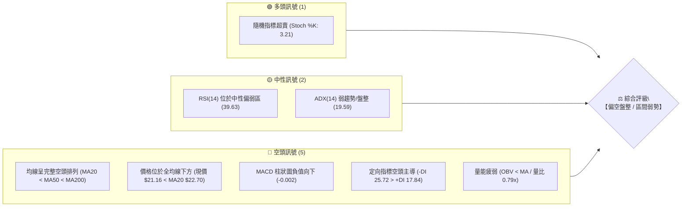
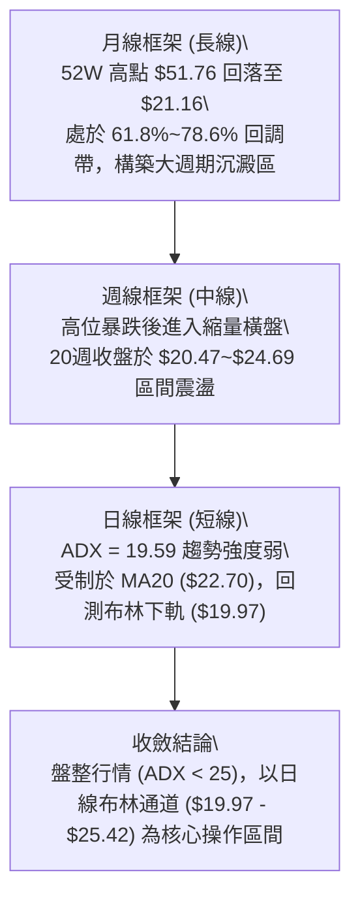
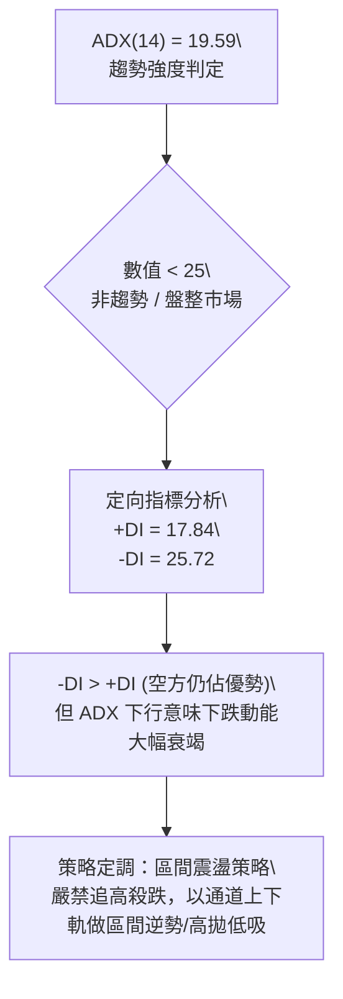
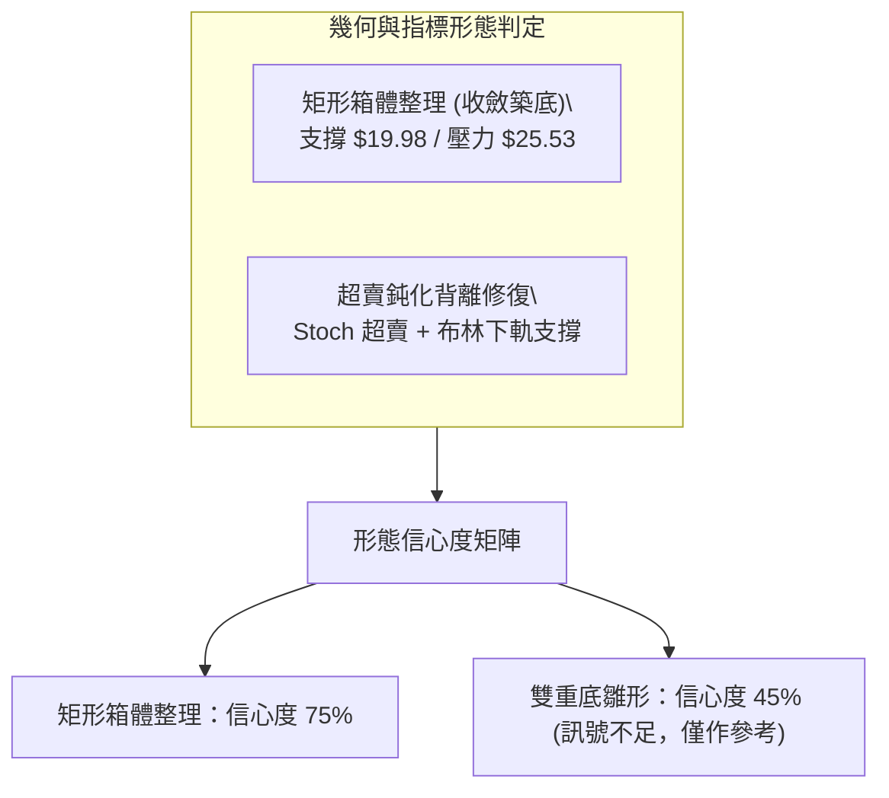
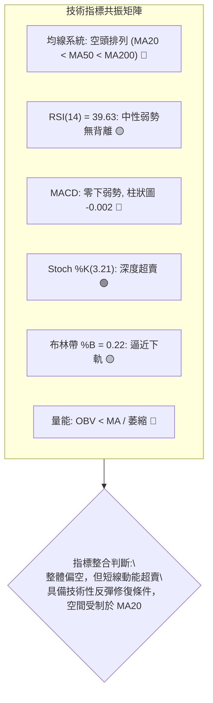
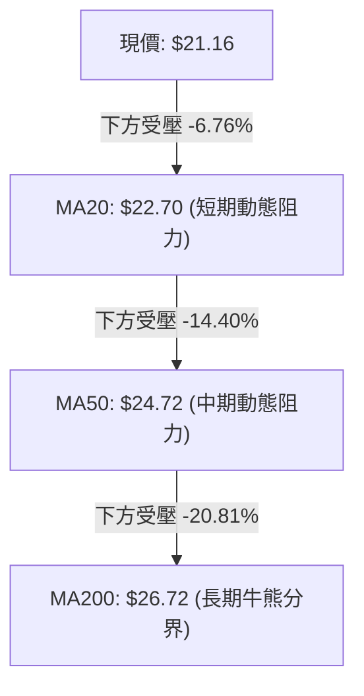
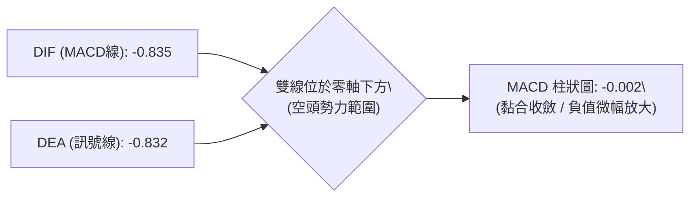
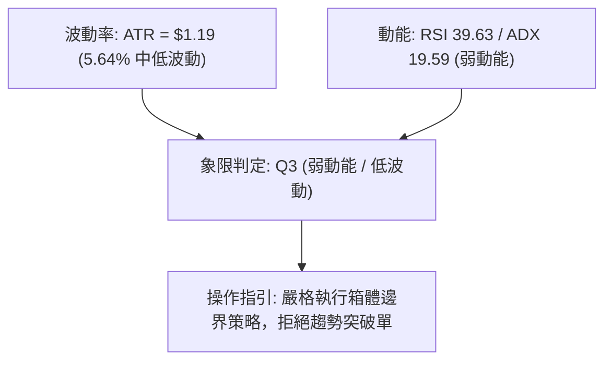
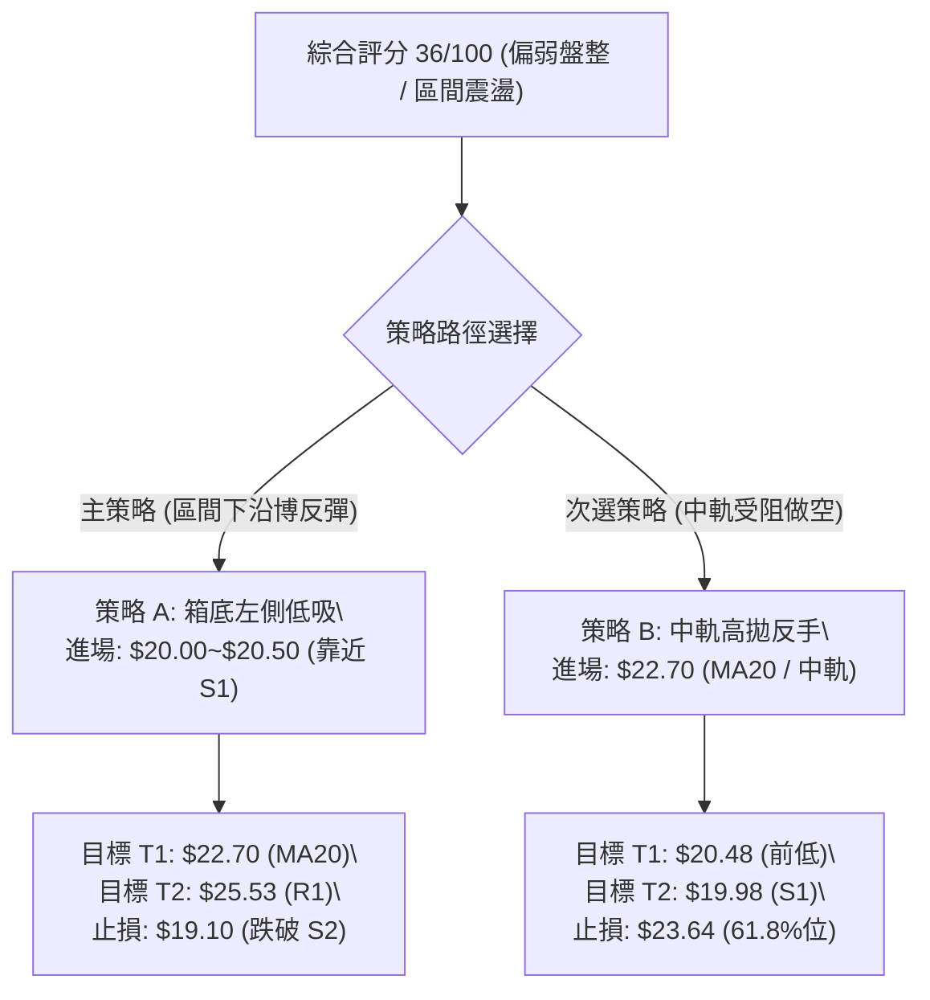
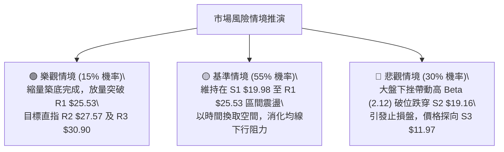

# PL 技術分析報告

> **報告日期**：2026-08-27 ｜ **語言**：繁體中文 ｜ **數據來源**：Yahoo Finance ｜ **當前價格**：$21.16

---

## 目錄

| 章節 | 內容 |
|------|------|
| [1. 技術面概覽](#1-技術面概覽) | 訊號儀表板、核心指標、評分卡 |
| [2. 趨勢分析](#2-趨勢分析) | 多時框趨勢、長中短期走勢、ADX 解讀 |
| [3. 圖表形態分析](#3-圖表形態分析) | 形態識別、信心度評估、目標價測算 |
| [4. 支撐與阻力](#4-支撐與阻力) | 關鍵價位結構、斐波那契回調 |
| [5. 技術指標深度解讀](#5-技術指標深度解讀) | MA/RSI/MACD/布林/量能背離 |
| [6. 動能與波動率](#6-動能與波動率) | 動能四象限、ATR 止損、Beta 敏感度 |
| [7. 多時框架總結](#7-多時框架總結) | 時框收斂規則、方向性定調 |
| [8. 交易策略建議](#8-交易策略建議) | 策略路由、區間操作、風險報酬比 |
| [9. 風險提示與監控](#9-風險提示與監控) | 監控清單、情境推演、風控參數 |

---

## 1. 技術面概覽

### 🎯 技術訊號儀表板



### 📊 核心指標速覽表

| 指標類別 | 指標名稱 | 當前數值 | 訊號 | 解讀 |
|:---|:---|:---|:---:|:---|
| **價格** | 當前價格 | $21.16 | 🔴 | 位於 52 週高低區間 32.8% 分位，處於中低檔震盪 |
| **均線** | MA20 | $22.70 | 🔴 | 現價位於 MA20 下方 (-6.76%)，短期承壓 |
| **均線** | MA50 | $24.72 | 🔴 | 現價位於 MA50 下方 (-14.40%)，中期趨勢偏弱 |
| **均線** | MA200 | $26.72 | 🔴 | 現價位於 MA200 下方 (-20.81%)，長期空頭壓制 |
| **動能** | RSI(14) | 39.63 | 🟡 | 位於 30–70 中性偏弱區間，未出現背離 |
| **動能** | MACD | -0.835 / Hist -0.002 | 🔴 | MACD 處於零軸下方且柱狀圖翻負，空方佔優 |
| **動能** | Stoch %K / %D | 3.21 / 5.17 | 🟢 | 深度超賣，短線存在技術性反彈動能 |
| **趨勢** | ADX(14) | 19.59 | 🟡 | 數值 < 25，顯示單邊趨勢衰竭，轉入盤整行情 |
| **通道** | Bollinger %B | 0.22 | 🟡 | 接近下軌 $19.97，通道中軌 $22.70 構成直接壓力 |
| **波動** | ATR(14) | $1.19 | 🟡 | 佔價格 5.64%，每日波動適中，提供明確風控空間 |
| **量能** | OBV / 量比 | 0.79x | 🔴 | 成交量萎縮（日量 395.6 萬股），OBV 弱於均線 |

### 🏆 技術評分卡

```
╔══════════════════════════════════════════════════════════════╗
║                 技術評分卡 — PL (2026-08-27)                 ║
╠══════════════════════════════════════════════════════════════╣
║ 趨勢強度 (Trend)     ██████░░░░░░░░░░░░░░  30/100  🔴 空頭主導║
║ 動能指標 (Momentum)  ████████░░░░░░░░░░░░  40/100  🟡 弱勢中性║
║ 支撐穩定度 (Support) ████████████░░░░░░░░  60/100  🟡 S1有守  ║
║ 成交量配合 (Volume)  ██████░░░░░░░░░░░░░░  30/100  🔴 量能萎縮║
║ 形態完整度 (Pattern) ████████░░░░░░░░░░░░  40/100  🟡 盤整築底║
║ 均線排列 (MA System) ████░░░░░░░░░░░░░░░░  20/100  🔴 空頭排列║
╠══════════════════════════════════════════════════════════════╣
║ 綜合技術評分         ███████░░░░░░░░░░░░░  36/100  🔴 偏弱盤整║
╚══════════════════════════════════════════════════════════════╝
```

---

## 2. 趨勢分析

### 🌐 多時框趨勢分析



### 📈 長期趨勢 — 12個月走勢圖（Unicode）

```
PL 月線走勢圖（2025-08 至 2026-08）
價格軸 ($)
$52.00 ┤                                      ● (2026-05: $51.14 / 高點 $51.76)
$46.00 ┤                                     / \
$40.00 ┤                                    /   \
$34.00 ┤                                ●  /     ● (2026-06: $33.13)
$28.00 ┤                        ●     /   /       \
$22.00 ┤                  ●  ●   \   /             ●───────● ◄ 現價 ($21.16)
$16.00 ┤               ●          \_/               (07:$20.48, 08:$21.16)
$10.00 ┤         ●  ●
$04.00 ┤● (08:$7.09)
       └────────────────────────────────────────────────────────────►
        08   09 10 11 12 01 02 03 04 05 06 07 08 (月份: 2025-08 ~ 2026-08)
```

**走勢特徵分析表格**：

| 階段區間 | 月份跨度 | 價格起迄 | 區間漲跌幅 | 核心特徵與技術含義 |
|:---|:---|:---:|:---:|:---|
| **第一階段：初級主升** | 2025-08 ~ 2025-10 | $7.09 → $13.45 | +89.70% | 脫離底部蓄勢區，成交量初次放大 |
| **第二階段：中繼整理** | 2025-11 ~ 2026-02 | $11.90 → $24.14 | +102.86% | 換手充分，多頭排列成形，機構建倉期 |
| **第三階段：狂熱主升** | 2026-03 ~ 2026-05 | $27.95 → $51.14 | +82.97% | 衝頂階段，創下 52 週高點 $51.76，週線 RSI 達 83.2 超買 |
| **第四階段：恐慌派發** | 2026-06 ~ 2026-07 | $33.13 → $20.48 | -60.03% | 放量暴跌，單週成交量破億，均線系統全面跌破 |
| **第五階段：底部震盪** | 2026-08 至今 | $20.48 → $21.16 | +3.32% | 成交量急劇萎縮，於 S1 ($19.98) 附近展開縮量築底 |

### 📊 中期趨勢（週線分析）

```
近期週線壓力與支撐結構示意圖：
$30.90 ────────────────────────────────────────── 阻力 R3 (強阻力 / 密集換手區)
$27.57 ────────────────────────────────────────── 阻力 R2 (MA200 $26.72 上方防線)
$25.53 ────────────────────────────────────────── 阻力 R1 (布林上軌 $25.42 匯合處)
$22.70 - - - - - - - - - - - - - - - - - - - - -  MA20 中軌動態壓力線
$21.16 ◄─── 現價位置 (縮量橫盤)
$19.98 ══════════════════════════════════════════ 支撐 S1 (近期波段低點 / 布林下軌 $19.97)
$19.16 ══════════════════════════════════════════ 支撐 S2 (波段核心強支撐)
$11.97 ────────────────────────────────────────── 支撐 S3 (歷史大級別防守底線)
```

中期週線在經歷 6 月的大幅去槓桿拋售後，7 月底於 $20.47 處出現第一道止跌信號（該週 RSI 跌至極端值 10.2）。8 月連續四週收盤價維持在 $20.48 至 $24.69 之間，週成交量由 1 億股萎縮至 1200 萬股，顯示主動性拋壓已顯著耗盡，中期進入休整尋底階段。

### ⚡ 趨勢強度評估（ADX 解讀）



| 指標參數 | 數值 | 狀態 | 技術解讀 |
|:---|:---:|:---:|:---|
| **ADX(14)** | 19.59 | 弱趨勢 / 盤整 | 趨勢強度低於 25 臨界點，單邊下跌行情結束，市場轉入橫盤震盪整理階段。 |
| **+DI (多方動向)** | 17.84 | 偏弱 | 多頭買盤力道尚不足以發動持續性攻擊。 |
| **-DI (空方動向)** | 25.72 | 偏強 | 空方仍具相對主導權，但動能已無延伸發散跡象。 |

---

## 3. 圖表形態分析

### 🔍 形態識別系統



**形態信心度評估表**（依嚴格要求 13、15）：

| 形態名稱 | 信心度 | 判斷依據（引用數據） | 完成度 | 目標價（附精確計算式） |
|:---|:---:|:---|:---:|:---|
| **矩形箱體整理** | 75% | 箱體下沿為支撐 S1 ($19.98)，箱體上沿為阻力 R1 ($25.53)，近 5 週價格完全封閉於此區間 | 70% | 向上突破 R1 目標價 = $25.53 + ($25.53 - $19.98) = **$31.08** (極度接近阻力 R3 $30.90) |
| **雙重底 (W底) 雛形** | 45% | 第一低點 2026-07-26 收盤 $20.47，第二低點 2026-08-02 收盤 $20.48，頸線暫定 2026-08-16 收盤 $24.69 | 40% | 訊號不足（信心度 < 50%），未有效突破頸線，僅做指標型解讀，不預先設定雙底完全成立 |

### 🕯️ 重要K線形態分析

| 週期/月份 | 收盤價 | K線形態 | 深度解讀 | 訊號 |
|:---|:---:|:---|:---|:---:|
| **2026-05** | $51.14 | 長上影大陽線 (爆量見頂) | 創歷史高點 $51.76 後遇強烈阻力，多頭力量耗盡 | 🔴 |
| **2026-06** | $33.13 | 斷頭巨陰線 (機構派發) | 跌幅達 -35.22%，跌破多道短期均線支撐，確立下行 | 🔴 |
| **2026-07** | $20.48 | 慣性下挫大陰線 | 跌勢延續但於 $20.47 一線出現長下影探底跡象 | 🟡 |
| **2026-08** | $21.16 | 縮量十字小陽星 (止跌星) | 波動區間收窄，實體極小，成交量銳減，呈現賣壓出盡特徵 | 🟢 |

### 📉 ASCII 走勢形態示意圖

```
箱體震盪與築底走勢結構 ($2026-07 ~ 2026-08$)
$26.00 ┤                     頸線/箱頂 R1 ($25.53)
       │                        ╭─╮
$24.00 ┤                  ╭─╮   │ │   ╭─╮
       │      ╭─╮         │ │   │ │   │ │
$22.00 ┤      │ │         │ │   │ │   │ ╰─── 現價 ($21.16)
       │      │ │   ╭─╮   │ │   │ │
$20.00 ┤──────┴─┴───┴─┴───┴─┴───┴─┴───────────────── 箱底 S1 ($19.98) / S2 ($19.16)
       │      低點1       低點2
       │     ($20.47)    ($20.48)
       └────────────────────────────────────────────► 時間軸 (週線維度)
```

### 🎯 形態目標價計算

1. **矩形箱體突破測幅計算**：
   - 箱體高點（阻力 R1）：$25.53
   - 箱體低點（支撐 S1）：$19.98
   - 箱體垂直高度 $H = \$25.53 - \$19.98 = \$5.55$
   - 向上突破理論目標價 $T_{Up} = \$25.53 + \$5.55 = \mathbf{\$31.08}$（與實質阻力 R3 $30.90 形成高度技術共振）
   - 向下跌破理論目標價 $T_{Down} = \$19.98 - \$5.55 = \mathbf{\$14.43}$（介於支撐 S2 $19.16 與 S3 $11.97 之間）

---

## 4. 支撐與阻力

### 🗺️ 關鍵價位分布圖（Unicode）

```
╔══════════════════════════════════════════════════════════════╗
║                   PL 價位結構分布圖                          ║
╠══════════════════════════════════════════════════════════════╣
║ $30.90 ║██████████████████████████████║ 強阻力 R3 (+46.02%) ║
║ $27.57 ║████████████████████          ║ 阻力 R2   (+30.29%) ║
║ $25.53 ║██████████████████████████    ║ 關鍵阻力 R1 (+20.65%) ║
║ $22.70 ║────────────────────────────  ║ MA20 中軌動態壓力   ║
║ $21.16 ╠══════════════════════════════╣ ◄ 現價位置           ║
║ $19.98 ║▓▓▓▓▓▓▓▓▓▓▓▓▓▓▓▓▓▓▓▓▓▓        ║ 關鍵支撐 S1 (-5.58%)  ║
║ $19.16 ║████████████████████████████  ║ 強支撐 S2   (-9.45%)  ║
║ $11.97 ║██████████████████████████████║ 終極支撐 S3 (-43.43%) ║
╚══════════════════════════════════════════════════════════════╝
```

### 🚧 阻力位分析表

| 阻力級別 | 價位 | 形成原因 | 突破難度 | 重要性 |
|:---|:---:|:---|:---:|:---:|
| **R1 (關鍵阻力)** | $25.53 | 近期反彈波段高點聚類、接近布林通道上軌 ($25.42) 及 MA50 ($24.72) | 中等偏高 | ★★★★☆ |
| **R2 (中期阻力)** | $27.57 | 長期均線 MA200 ($26.72) 壓制區上方聚類，前期破位成交密集帶 | 高 | ★★★★☆ |
| **R3 (強阻力)** | $30.90 | 2026-07 初反彈高點 ($31.38) 及 MA120 ($31.26) 共振區 | 極高 | ★★★★★ |

### 🛡️ 支撐位分析表

| 支撐級別 | 價位 | 形成原因 | 守住機率 | 重要性 |
|:---|:---:|:---|:---:|:---|
| **S1 (關鍵支撐)** | $19.98 | 近期波段雙底低點聚類 ($20.47/$20.48) 及布林通道下軌 ($19.97) 共振帶 | 70% | ★★★★☆ |
| **S2 (強支撐)** | $19.16 | 近一年波段低點聚類防守底線 | 80% | ★★★★☆ |
| **S3 (終極支撐)** | $11.97 | 2025-11 起漲前波段平台低點 | 95% | ★★★★★ |

### 📐 斐波那契回調位分析

依據 52 週完整波動區間（低點 $6.26 → 高點 $51.76，落差 $45.50）之精確回調點位分析：

```
$51.76 ─── 0.0% (52W High)
$41.02 ─── 23.6% 回調位
$34.38 ─── 38.2% 回調位
$29.01 ─── 50.0% 回調位
$23.64 ─── 61.8% 黃金分割回調位 ──┐
                                   ├── 現價 $21.16 處於 61.8% 與 78.6% 回調帶之間
$15.99 ─── 78.6% 回調位 ──────────┘
$06.26 ─── 100.0% (52W Low)
```

- **位置解讀**：現價 $21.16 跌破了多頭防禦核心「61.8% 黃金分割位 ($23.64)」，但穩守於「78.6% 深度回調位 ($15.99)」之上。
- **技術意義**：跌破 61.8% 確認了自 $51.76 開始的單邊多頭趨勢已經終結，行情由上升趨勢轉變為大級別週期震盪修復。目前價格在 $19.98~$23.64 間尋求建立底部支撐平台。

---

## 5. 技術指標深度解讀

### 🎛️ 指標訊號總覽



### 📈 移動平均線排列分析



| 均線名稱 | 當前數值 | 與現價乖離率 | 走勢特徵 | 訊號解讀 |
|:---|:---:|:---:|:---|:---:|
| **MA 5** | $21.75 | -2.70% | 短線下行趨緩 | 🟡 短期賣壓減弱 |
| **MA 10** | $22.85 | -7.41% | 持續壓制 | 🔴 短線阻力位 |
| **MA 20** | $22.70 | -6.76% | 平緩下彎 | 🔴 第一道反彈防線 |
| **MA 50** | $24.72 | -14.40% | 下行發散 | 🔴 中期空頭壓制 |
| **MA 60** | $26.56 | -20.34% | 加速向下 | 🔴 中期均線反壓 |
| **MA 120** | $31.26 | -32.31% | 走平轉下 | 🔴 半年線強阻力 |
| **MA 200** | $26.72 | -20.81% | 走平壓制 | 🔴 長期走勢轉弱 |
| **MA 240** | $24.44 | -13.41% | 向上鈍化 | 🟡 長期底層均線 |

均線系統呈標準「空頭排列」（MA20 < MA50 < MA200），價格運行於所有短中長期均線下方。現價與 MA200 乖離達 -20.81%，顯示中期超跌，但均線下壓趨勢明確，任何反彈若無法帶量突破 MA20 ($22.70) 及 MA50 ($24.72)，均視為空頭抵抗而非反轉。

### 📉 RSI(14) 分析

- **RSI(14) 數值**：39.63
- **強度進度條**：████████░░░░░░░░░░░░ 39.63% (弱勢區間)
- **區間評估**：RSI 處於 30–50 之偏弱整理區。
- **背離分析**：
  - 價格於 2026-07-26 創低 $20.47（RSI = 10.2 極度超賣）；
  - 2026-08-02 價格再度測試 $20.48（RSI 回升至 25.6）；
  - 現價 $21.16 時 RSI 升至 39.63。
  - **結論**：RSI 底部形成微幅抬升，確認空頭極端殺跌動能解除，但目前無典型底背離結構，屬於超賣後的技術性指標修復。

### 📊 MACD(12/26/9) 訊號解讀



MACD 雙線深陷零軸下方（DIF -0.835, DEA -0.832），柱狀圖由前週正值收斂至 -0.002。此狀態顯示中期動能仍為空方主控，但 DIF 與 DEA 緊密糾結，柱狀體極小，意味著空頭推動力度大幅減緩，價格已進入無趨勢的橫盤整固階段。

### 📦 布林通道分析

```
布林通道結構示意圖 (Bandwidth: $5.45)
$25.42 ┬────────────────────────────────────────── BB 上軌 (阻力 R1 $25.53 匯合)
       │
$22.70 ┼ - - - - - - - - - - - - - - - - - - - - - BB 中軌 (MA20 動態反壓)
       │                                     
$21.16 ┼ ◄ 現價位置 (%B = 0.22)
       │
$19.97 ┴────────────────────────────────────────── BB 下軌 (支撐 S1 $19.98 匯合)
```

- **通道帶寬**：上軌 $25.42 與下軌 $19.97 間距 $5.45，通道呈現收口橫盤特徵。
- **%B 指標**：0.22（位於中軌與下軌之間，偏向通道下緣）。
- **通道解讀**：價格在下軌 $19.97 獲得技術買盤支撐，未出現沿下軌單邊向下開口的「破軌走勢」，顯示區間下沿具備實質支撐效應。

### 💹 成交量分析（量價配合度）

```
成交量能階梯比較 (單位: 股)
最新成交量: 3,956,513  ███████░░░░░░░░░░░░░░ (量比: 0.79x)
20日均量:   5,006,451  ██████████░░░░░░░░░░
50日均量:   8,945,998  ██████████████████░░
歷史峰值量: 100,622,400 ████████████████████ (2026-06 放量崩跌)
```

- **量價特徵**：日成交量萎縮至 395.6 萬股，僅為 50 日均量的 44.2%，呈現典型的「暴跌後量極度萎縮」。
- **OBV 趨勢**：OBV 處於均線下方，指示大資金並未進場大舉建倉，量價配合呈現「無量弱勢築底」狀態。量能不足以支撐趨勢反轉，但有利於在 S1 ($19.98) 形成局部底部。

---

## 6. 動能與波動率

### ⚡ 動能評估四象限

| 象限 | 動能維度 | 波動維度 | 標的所屬 | 技術特徵與應對策略 |
|:---|:---:|:---:|:---:|:---|
| **第一象限 (Q1)** | 強動能 | 高波動 | — | 趨勢爆發期（突破順勢追擊） |
| **第二象限 (Q2)** | 強動能 | 低波動 | — | 穩健上升通道（持股續抱） |
| **第三象限 (Q3)** | 弱動能 | 低波動 | **✓ PL 當前位置** | **縮量橫盤修復，以震盪區間高拋低吸為主** |
| **第四象限 (Q4)** | 弱動能 | 高波動 | — | 恐慌崩跌期（觀望避免介入） |



### 📊 ATR 波動率分析

- **當前 ATR(14)**：$1.19（佔當前股價 5.64%）。
- **ATR 波動特性**：波動率已由 6 月高點大幅收斂，每日正常波動區間約在 $\pm \$1.19$ 內。
- **風控參數建議**：
  - 短線交易止損距離：$1.0 \times \text{ATR} = \mathbf{\$1.19}$
  - 波段交易止損距離：$1.5 \times \text{ATR} = \mathbf{\$1.79}$
  - 突破確認緩衝空間：$0.5 \times \text{ATR} = \mathbf{\$0.60}$

### 📐 Beta 與市場相關性

- **Beta 係數**：2.123（高 Beta 成長型資產）。
- **敏感度解讀**：該股對美股大盤（標普500 / 納斯達克）波動具備極高的放大效應。當大盤反彈時，該股理論彈性為大盤的 2.1 倍；但在大盤下挫時亦承擔加倍回撤風險。高空單比例（Short % Float = 9.4%, Short Ratio = 4.01）意味著一旦突破 R1 ($25.53)，可能引發局部軋空行情。

---

## 7. 多時框架總結

### 📋 時框架評分表

| 時框架 | 趨勢方向 | 動能狀態 | 均線排列 | 形態結構 | 綜合評分 | 操作建議 |
|:---|:---:|:---:|:---:|:---:|:---:|:---|
| **月線 (長期)** | 🔴 空頭修復 | 弱勢築底 | MA200 下方 | 深度回調 (78.6% 上方) | 35/100 | 觀望，等待底部形態成形 |
| **週線 (中期)** | 🟡 橫盤震盪 | 超賣修復 | 空頭發散 | 區間沉澱 ($20.48-$24.69) | 45/100 | 區間操作，嚴設防守 |
| **日線 (短期)** | 🔴 偏弱盤整 | 隨機超賣 | 空頭壓制 | 布林帶下軌支撐 ($19.98) | 36/100 | 支撐位輕倉博反彈 |

### 🔲 綜合訊號矩陣

```
時框一致性分析：
┌───────────┬──────────────┬──────────────┬──────────────┐
│  指標類別 │  長期 (月線) │  中期 (週線) │  短期 (日線) │
├───────────┼──────────────┼──────────────┼──────────────┤
│  趨勢信號 │   🔴 看空    │   🟡 中性    │   🔴 看空    │
│  動能信號 │   🟡 中性    │   🟡 中性    │   🟢 超賣    │
│  量價結構 │   🔴 縮量    │   🟡 萎縮    │   🔴 疲弱    │
│  支撐強度 │   🟢 強支撐  │   🟢 有守    │   🟢 S1 測試 │
└───────────┴──────────────┴──────────────┴──────────────┘
```

### ⚖️ 多時框收斂結論

依據多時框收斂優先級規則：
1. **行情屬性判定**：當前 ADX(14) = 19.59 (< 25)，確認市場處於**「非趨勢盤整行情」**。
2. **主導時框與區間**：中長期趨勢雖為空頭壓制，但單邊殺跌動能已衰竭；當前主導時框為**日線布林通道區間 ($19.97 - $25.42)**。
3. **唯一方向性定調**：**【中性偏空之區間震盪整理】**。交易重心應放在箱體下沿支撐 S1 ($19.98) 與上沿阻力 R1 ($25.53) 之間的區間交易，而非單邊趨勢追單。

---

## 8. 交易策略建議

### 🗺️ 策略決策流程圖



### 🧭 策略路由

**當前主策略方向 = 【中性偏空環境下之區間下沿高盈虧比反彈策略】（依綜合評分 36/100）**

因技術評分低於 40 但 ADX 顯示趨勢極弱且隨機指標深度超賣，不可盲目追空，主推**箱底支撐低吸策略**，並以**反彈受阻高拋策略**為輔。

### 🎯 價格情境階梯（Price Scenarios）

| 觸發條件 | 下一目標 | 後續延伸 | 情境含義 |
|:---|:---:|:---:|:---|
| **向上突破 R1 $25.53** | R2 $27.57 | R3 $30.90 | 中期反轉確認，啟動空頭回補（軋空）行情 |
| **突破 MA20 $22.70** | R1 $25.53 | R2 $27.57 | 短線轉強，朝布林通道上軌進攻 |
| **維持於 $19.98~$22.70** | — | — | **基本情境：縮量箱體窄幅震盪築底** |
| **跌破 S1 $19.98** | S2 $19.16 | — | 短期破位，測試近一年強支撐聚類帶 |
| **跌破 S2 $19.16** | S3 $11.97 | — | 結構全面崩塌，下行空間深度打開至 $11.97 |

### 📊 情境機率分佈

```
情境機率分佈比例圖：
區間震盪整理 (55%) ▓▓▓▓▓▓▓▓▓▓▓▓▓▓▓▓▓▓▓▓▓▓▓▓▓▓▓░░░░░░░░░░░░░░░░░░░░
向下破位尋底 (30%) ▓▓▓▓▓▓▓▓▓▓▓▓▓▓█░░░░░░░░░░░░░░░░░░░░░░░░░░░░░░░░
向上突破轉強 (15%) ▓▓▓▓▓▓█░░░░░░░░░░░░░░░░░░░░░░░░░░░░░░░░░░░░░░░
```

| 情境劇本 | 機率 | 主要依據 |
|:---|:---:|:---|
| **區間震盪整理** | **55%** | ADX = 19.59 處於無趨勢狀態，成交量極度萎縮，布林帶收口鎖定價格於 $19.97~$25.42 |
| **回落測試/破位** | **30%** | 均線系統完整空頭排列，-DI (25.72) 壓制 +DI (17.84)，長期賣壓未完全消化 |
| **向上強勢突破** | **15%** | 需放量站上 MA200 ($26.72) 及 R1 ($25.53)，在當前 0.79x 量比下短期難度極高 |

### 🟢 主策略詳情

| 策略要素 | 策略 A（主策略：箱底支撐博反彈） | 策略 B（次策略：反彈承壓短空） |
|:---|:---|:---|
| **交易邏輯** | 測試布林下軌 $19.97 及 S1 獲利回吐，Stoch 超賣修復 | 均線空頭排列，觸及 MA20 中軌受阻順勢開空 |
| **進場價格** | **$20.48**（回踩測試前低與 S1 支撐確認時） | **$22.70**（反抽受阻於 MA20 均線時） |
| **目標價 T1** | **$22.70**（MA20 中軌 / 第一阻力） | **$20.48**（箱體下沿支撐區） |
| **目標價 T2** | **$25.53**（阻力位 R1 / 布林上軌） | **$19.98**（支撐位 S1 / 布林下軌） |
| **止損價格** | **$19.16**（嚴格止損於支撐位 S2 下方） | **$23.64**（突破 61.8% 斐波那契回調位止損） |
| **風險報酬比** | **1 : 3.83**（風險 $1.32，潛在收益 $5.05） | **1 : 2.89**（風險 $0.94，潛在收益 $2.72） |
| **勝率預估** | 55% | 60% |
| **建議倉位** | **10% - 15%**（輕倉試單） | **10%**（嚴格防守） |

### 🔴 反向風險觸發點（對沖提示）

- **多頭轉空風控點**：若價格以日線收盤價跌破 **$19.16 (S2)**，箱體支撐失效，必須無條件止損所有多單，嚴防向 **$11.97 (S3)** 滑落。
- **空頭平倉避險點**：若放量突破 **$23.64**（61.8% 回調位）及 **$25.53 (R1)**，空單必須立即離場，預防高達 9.4% 空頭比例引發的軋空暴拉。

### ⭐ 整體訊號強度評星

```
╔══════════════════════════════════════════╗
║ 做多訊號強度：★★☆☆☆  (2.5/5 星 - 僅限超賣反彈) ║
║ 做空訊號強度：★★★☆☆  (3.0/5 星 - 順應大週期均線) ║
║ 整體可信度：  ★★★☆☆  (3.5/5 星 - 箱體結構清晰) ║
╚══════════════════════════════════════════╝
```

---

## 9. 風險提示與監控

### ✅ 關鍵監控指標 Checklist

```
╔══════════════════════════════════════════════════════════════╗
║               每日盤後技術監控清單 (Checklist)               ║
╠══════════════════════════════════════════════════════════════╣
║ [ ] 價格是否跌破關鍵防守支撐 S1 $19.98 / S2 $19.16？          ║
║ [ ] 日成交量是否放大至 50日均量 (8,945,998) 以上？            ║
║ [ ] MACD 柱狀圖是否由負轉正形成零下金叉？                    ║
║ [ ] RSI(14) 是否突破 50 中性分界線？                         ║
║ [ ] ADX(14) 是否向上突破 25，開啟新一輪單邊趨勢？            ║
║ [ ] 價格能否有效收復 MA20 ($22.70) 及 MA50 ($24.72)？         ║
╚══════════════════════════════════════════════════════════════╝
```

### ⚠️ 風險場景分析



### 🛡️ 風險管理重要提醒

1. **Beta 敏感度風控**：PL 具備 2.123 的超高 Beta，在大盤劇烈波動時嚴禁使用高槓桿，整體持倉不宜超過總資金的 15%。
2. **ATR 動態止損設置**：嚴格執行以 ATR ($1.19) 為基準的防守策略，任何策略進場後跌破 S2 ($19.16) 必須果斷停損。
3. **拒絕盤整追單**：ADX < 25 時，凡在區間中軸 ($22.70) 附近產生的突破訊號多為假突破，應堅持「買下軌、賣上軌」之紀律。

---

## 📋 報告總結

```
╔══════════════════════════════════════════════════════════════╗
║                   PL 技術分析報告總結                        ║
╠══════════════════════════════════════════════════════════════╣
║ 報告日期：2026-08-27                                         ║
║ 當前價格：$21.16                                             ║
║ 分析評級：⚖️ 偏弱盤整（區間震盪築底，ADX = 19.59 無單邊趨勢）║
╠══════════════════════════════════════════════════════════════╣
║ 關鍵結論：                                                   ║
║ ├─ 長期趨勢：🔴 弱勢修復（處於 61.8%~78.6% 斐波那契回調帶）  ║
║ ├─ 中期趨勢：🟡 橫盤震盪（週線於 $20.48~$24.69 縮量築底）    ║
║ ├─ 短期趨勢：🔴 偏弱盤整（承壓於 MA20 $22.70，下軌獲支撐）  ║
║ ├─ 關鍵支撐：S1 $19.98  /  S2 $19.16                        ║
║ ├─ 關鍵阻力：R1 $25.53  /  R2 $27.57                        ║
║ └─ 機構共識目標：均價 $40.10（低 $25.00 / 高 $53.00）       ║
╠══════════════════════════════════════════════════════════════╣
║ 最優策略組合：                                               ║
║ 1. 🥇 最佳機會：回踩 $20.48 (靠近 S1) 輕倉做多，止損設 $19.16║
║ 2. 🥈 次選機會：反彈至 MA20 ($22.70) 受阻順勢短空，博弈震盪 ║
║ 3. 🥉 保守選擇：空倉觀望，靜待放量突破 R1 $25.53 或右側信號 ║
╚══════════════════════════════════════════════════════════════╝
```

---

> ⚠️ **免責聲明**：本報告為技術分析研究，所有數據及點位均基於歷史量價與技術指標模型推算。本報告**僅供研究與學術參考**，**不構成任何形式的投資建議**。金融市場瞬息萬變，投資人應獨立評估風險並自負盈虧。

---

*報告生成時間：2026-08-27 ｜ 數據來源：Yahoo Finance ｜ 分析框架：多時框技術分析模型*