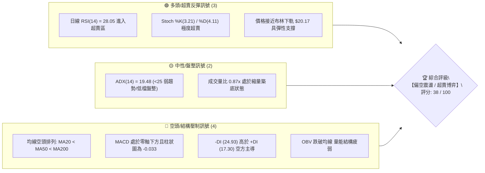
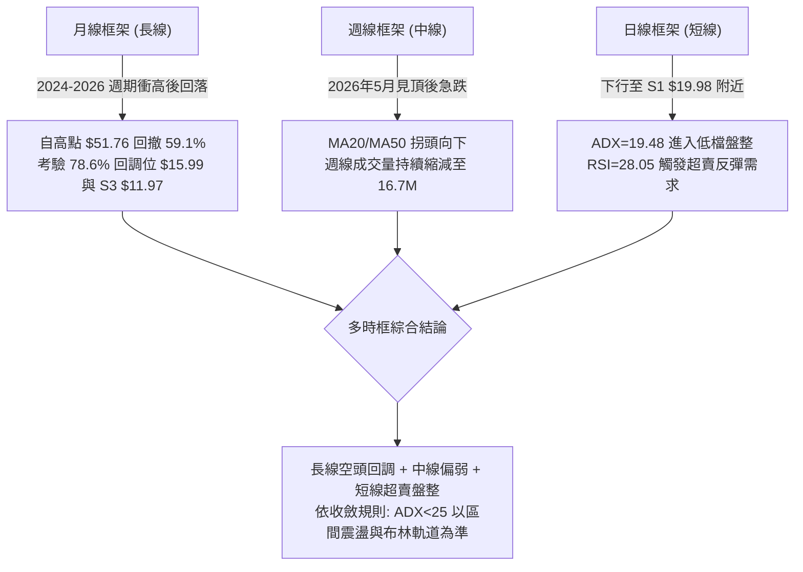
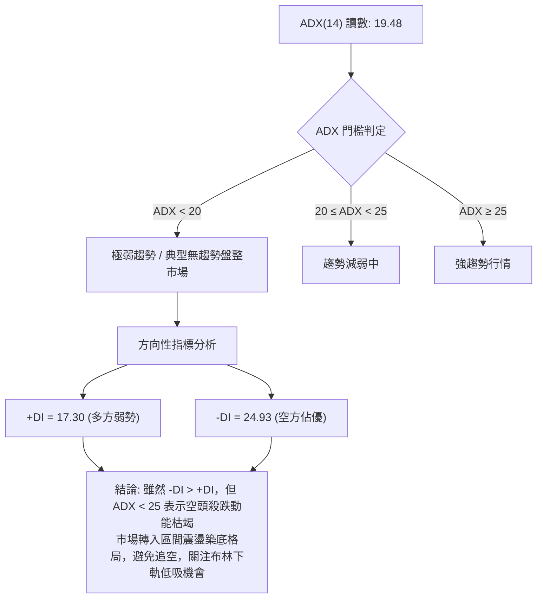
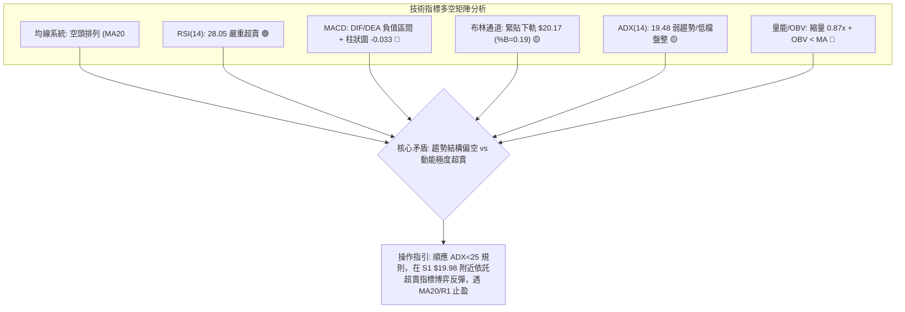
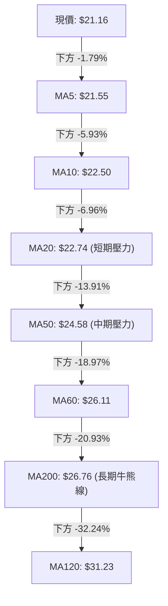
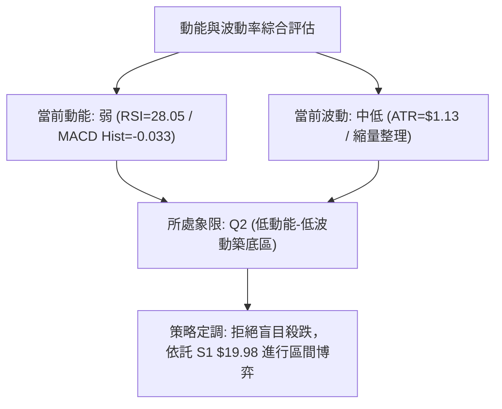
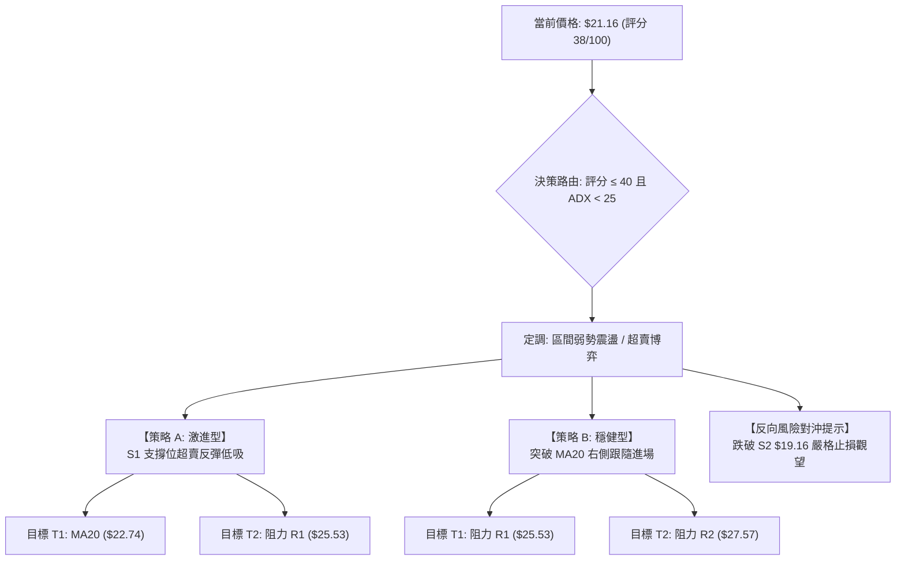
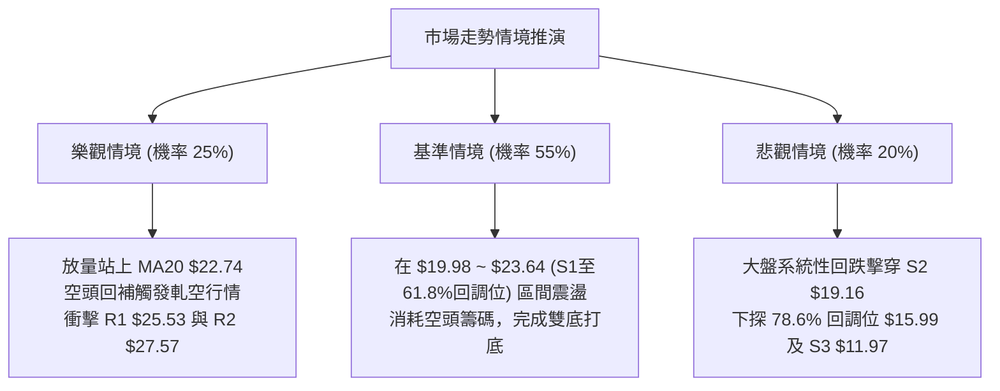

# PL 技術分析報告

> **報告日期**：2026-08-28 ｜ **語言**：繁體中文 ｜ **數據來源**：Yahoo Finance ｜ **當前價格**：$21.16

---

## 目錄

| 章節 | 內容 |
|------|------|
| [1. 技術面概覽](#1-技術面概覽) | 訊號儀表板、核心指標、評分卡 |
| [2. 趨勢分析](#2-趨勢分析) | 多時框趨勢、長中短期走勢 |
| [3. 圖表形態分析](#3-圖表形態分析) | 形態識別、K線組合、目標價 |
| [4. 支撐與阻力](#4-支撐與阻力) | 關鍵價位、斐波那契回調 |
| [5. 技術指標深度解讀](#5-技術指標深度解讀) | MA/RSI/MACD/布林/成交量 |
| [6. 動能與波動率](#6-動能與波動率) | 動能評估、ATR、Beta |
| [7. 多時框架總結](#7-多時框架總結) | 時框架評分矩陣 |
| [8. 交易策略建議](#8-交易策略建議) | 多空策略、風險報酬比 |
| [9. 風險提示與監控](#9-風險提示與監控) | 監控指標、風險場景 |

---

## 1. 技術面概覽

### 🎯 技術訊號儀表板



### 📊 核心指標速覽表

| 指標類別 | 指標名稱 | 當前數值 | 訊號 | 解讀 |
|----------|----------|----------|:----:|------|
| **價格** | 當前價格 | $21.16 | 🔴 | 位於 52 週區間 32.8%，自高點 $51.76 大幅回撤 |
| **均線** | MA20 | $22.74 | 🔴 | 價格低於 MA20（-6.96%），短線受壓制 |
| **均線** | MA50 | $24.58 | 🔴 | 價格低於 MA50（-13.91%），中期趨勢偏空 |
| **均線** | MA200 | $26.76 | 🔴 | 價格低於 MA200（-20.93%），長期牛熊分界線失守 |
| **動能** | RSI(14) | 28.05 | 🟢 | 跌破 30 超賣門檻，短線醞釀技術性反彈 |
| **動能** | MACD(12,26,9) | -0.873 / -0.841 | 🔴 | DIF < DEA，柱狀圖 -0.033，空頭動能尚未翻正 |
| **動能** | Stoch %K / %D | 3.21 / 4.11 | 🟢 | 極度超賣區間，隨時可能觸發低檔黃金交叉 |
| **趨勢** | ADX(14) | 19.48 | 🟡 | ADX < 25，主跌浪趨緩，進入低位震盪整理階段 |
| **通道** | 布林通道 %B | 0.19 | 🟡 | 緊貼布林下軌 $20.17，向下空間受壓制軌道收縮 |
| **波動** | ATR(14) | $1.13 (5.33%) | 🟡 | 每日平均波動幅度 $1.13，波動率處於中等水平 |
| **量能** | OBV 與量比 | 量比 0.87x | 🔴 | 20日均量縮減，OBV < MA 顯示主力資金買盤保守 |

### 🏆 技術評分卡

```
╔══════════════════════════════════════════════════════════════════╗
║                   技術評分卡 — PL (2026-08-28)                   ║
╠══════════════════════════════════════════════════════════════════╣
║ 趨勢強度 (Trend)     ██████░░░░░░░░░░░░░░  30/100   🔴 空頭主導  ║
║ 動能指標 (Momentum)  ████████░░░░░░░░░░░░  40/100   🟢 超賣修復  ║
║ 支撐穩定度 (Support) ██████████░░░░░░░░░░  50/100   🟡 考驗S1/S2 ║
║ 成交量配合 (Volume)  ██████░░░░░░░░░░░░░░  30/100   🔴 縮量觀望  ║
║ 形態完整度 (Pattern) ████████░░░░░░░░░░░░  40/100   🟡 低檔箱型  ║
║ 均線排列 (MAs)       ████░░░░░░░░░░░░░░░░  20/100   🔴 典型空頭  ║
╠══════════════════════════════════════════════════════════════════╣
║ 綜合技術評分         ████████░░░░░░░░░░░░  38/100   🔴 偏空震盪  ║
╚══════════════════════════════════════════════════════════════════╝
```

---

## 2. 趨勢分析

### 🌐 多時框趨勢分析



### 📈 長期趨勢 — 12個月走勢圖（Unicode）

```
PL 月線走勢圖（2025-08 至 2026-08）
價格軸 ($)
$55 ┤                                                 ● $51.14 (2026-05)
$50 ┤                                                ╱ ╲
$45 ┤                                               ╱   ╲
$40 ┤                                       ● $36.97     ╲
$35 ┤                                      ╱              ● $33.13 (2026-06)
$30 ┤                              ● $27.95                ╲
$25 ┤              ● $24.97  ● $24.14                       ╲
$20 ┤      ● $19.72                                          ● $20.48 ──● $21.16(現價)
$15 ┤  ● $13.45                                             (2026-07)  (2026-08)
$10 ┤  ● $12.98
 $5 ┤● $7.09 (2025-08)
    └─────────────────────────────────────────────────────────────────────────────
       08/25 09/25 10/25 11/25 12/25 01/26 02/26 03/26 04/26 05/26 06/26 07/26 08/26
```

#### 走勢特徵分析表格

| 階段週期 | 時間區間 | 起止價格 | 漲跌幅 | 主要走勢特徵與量能現象 |
|----------|----------|----------|:------:|------------------------|
| **長線主升浪** | 2025-08 ~ 2026-05 | $7.09 → $51.14 | +621.3% | 衛星商業數據放量爆發，機構持股激增至 85.2%，推動股價創歷史高點 $51.76 |
| **中線急速回撤** | 2026-05 ~ 2026-07 | $51.14 → $20.48 | -59.95% | 估值修復與獲利回吐引發踩踏，週成交量一度破億（100.6M），快速跌破 MA20/MA50/MA200 |
| **低檔築底震盪** | 2026-07 ~ 2026-08 | $20.48 → $21.16 | +3.32% | 成交量急劇萎縮（降至 16.7M），ADX 降至 19.48，股價於 $19.98~$24.69 區間構築底部結構 |

### 📊 中期趨勢（週線分析）

```
週線支撐與阻力階梯結構示意圖:
阻力 R3  $30.90 ────────────────────────────────────────── (歷史籌碼密集套牢區)
阻力 R2  $27.57 ────────────────────────────────────────── (MA200 長期均線壓制帶)
阻力 R1  $25.53 ────────────────────────────────────────── (8月中旬反彈高點 $24.69 聚類區)
現價     $21.16 ───►  [ 當前於 S1 與 MA20 之間收斂震盪 ]
支撐 S1  $19.98 ────────────────────────────────────────── (7月下旬與8月初雙重低點)
支撐 S2  $19.16 ────────────────────────────────────────── (52週次級波段防守點)
支撐 S3  $11.97 ────────────────────────────────────────── (2025年秋季起漲平台)
```

### ⚡ 趨勢強度評估（ADX 解讀）



| 指標名稱 | 當前數值 | 狀態分類 | 趨勢判定與操作指引 |
|----------|----------|:--------:|--------------------|
| **ADX(14)** | 19.48 | 無趨勢 / 盤整 | 趨勢強度低於 25，不適合順勢突破策略，適合網格或區間高拋低吸 |
| **+DI (14)** | 17.30 | 弱勢多頭 | 買方動能尚未形成合力，需等待 +DI 突破 20 |
| **-DI (14)** | 24.93 | 空方主導 | 賣方力量雖佔優但呈現下行發散減弱態勢，空頭衰竭跡象初顯 |

---

## 3. 圖表形態分析

### 🔍 形態識別系統

依據嚴格數據紀律與規則 15，當前圖表幾何結構與形態信心度評估如下：

| 形態類型 | 信心度 | 判斷依據（引用實際數據） | 完成度 | 目標價（附嚴格計算式） |
|----------|:------:|--------------------------|:------:|------------------------|
| **低檔雙重底 (Double Bottom)** | 62% | 2026-07-26 低點 $20.47 與 2026-08-02 低點 $20.48 形成雙底，守穩支撐位 S1 ($19.98) | 70% | 頸線阻力 R1 ($25.53) - 底部低點 ($20.47) = 形態高度 $5.06<br>向上突破目標 = 頸線 $25.53 + $5.06 = **$30.59**（接近 R3 $30.90） |
| **下行旗形 (Bear Flag)** | 48% | 自 5月 $51.14 急跌至 7月 $20.48 後，於 8月中旬反彈至 $24.69，隨後回落至 $21.16 | 45% | 若跌破支撐 S1 ($19.98) 與 S2 ($19.16)，旗形跌破目標 = $19.16 - ($51.14 - $31.15) = **訊號不足/未確認**，需嚴格以 S3 $11.97 為極限支撐 |
| **布林通道下軌收斂整理** | 85% | 價格 $21.16 貼近布林下軌 $20.17，%B 為 0.19，波動幅度 ATR 收窄至 $1.13 | 90% | 均值回歸目標 = 布林中軌 MA20 **$22.74**，進一步上看 MA50 **$24.58** |

### 🕯️ 重要K線形態分析

| 週/月份 | 收盤價 | K線形態 | 解讀與量價特徵 | 技術訊號 |
|---------|--------|---------|----------------|:--------:|
| **2026-05-31** | $51.14 | 歷史見頂長上影天量K線 | 週成交量 61.5M，RSI 衝至 83.2 極度超買，主力機構派發 | 🔴 強烈看空 |
| **2026-06-07** | $32.22 | 大陰線破位巨量暴跌 | 週成交量爆出 100.6M 歷史巨量，擊穿 MA20 與 MA50 多道防線 | 🔴 恐慌拋售 |
| **2026-07-26** | $20.47 | 低檔長下影十字星 | RSI 跌至 10.2 極度超賣，量能降至 38.2M，空方殺跌衰竭 | 🟢 潛在底部 |
| **2026-08-16** | $24.69 | 反彈遇阻倒錘頭線 | 反彈觸及 R1 阻力區間前緣，週成交量縮至 23.5M，量能不足回落 | 🟡 遇阻回洗 |
| **2026-08-30** | $21.16 | 縮量探底小陰線 | 週成交量降至 16.7M 近期地量，MACD 柱狀圖收窄至 -0.033，等待變盤 | 🟡 變盤前夕 |

### 📉 ASCII 走勢形態示意圖

```
PL 近期底部形態解析（2026年7月 - 8月）
價格 ($)
$25.53 ┤ (頸線阻力 R1) ───────────────────────● $24.69 (8/16 高點)
$24.00 ┤                                     ╱ ╲
$23.00 ┤                                    ╱   ╲
$22.00 ┤                                   ╱     ╲
$21.16 ┤ (現價) ──────────────────────────┼───────● $21.16 (現價測試支撐)
$20.48 ┤           ● $20.47 (7/26)        ╱
$20.17 ┤ (BB下軌)  ╲                    ╱
$19.98 ┤ (支撐 S1)   ●─────────────────● $20.48 (8/02)  <── [ 構築雙底 W 形態底座 ]
       └─────────────────────────────────────────────────────────────
          時間軸:  7月下旬            8月上旬      8月中旬     8月下旬
```

### 🎯 形態目標價計算

```
形態高度推算詳細公式（依據規則 13 & 15）：
-------------------------------------------------------------------------
1. 低檔雙底成立條件：價格需日線放量實體突破頸線阻力 R1 = $25.53
2. 形態垂直高度 (H) = 頸線阻力 ($25.53) - 雙底低點 ($20.47) = $5.06
3. 理論第一上漲目標 T1 = 頸線 ($25.53) + 0.5 × H ($2.53) = $28.06 (聚類於 R2 $27.57 與 MA200 $26.76 附近)
4. 理論完整目標價 T2   = 頸線 ($25.53) + 1.0 × H ($5.06) = $30.59 (聚類於 R3 $30.90)
-------------------------------------------------------------------------
```

---

## 4. 支撐與阻力

### 🗺️ 關鍵價位分布圖（Unicode）

```
PL 價位結構分布圖
═══════════════════════════════════════════════════════════════════
$30.90 ║████████████████████████████████║ 強阻力 R3 (歷史籌碼套牢平台)
$29.01 ║░░░░░░░░░░░░░░░░░░░░░░░░░░░░░░░░║ 斐波那契 50.0% 回調位
$27.57 ║████████████████████████        ║ 強阻力 R2 (MA200 均線聚集處)
$25.53 ║████████████████████████████████║ 關鍵阻力 R1 (頸線與波段高點聚類)
$23.64 ║░░░░░░░░░░░░░░░░░░░░░░░░░░░░░░░░║ 斐波那契 61.8% 黃金分割阻力位
$22.74 ║▒▒▒▒▒▒▒▒▒▒▒▒▒▒▒▒▒▒▒▒▒▒▒▒        ║ 布林中軌 (MA20 動態阻力)
$21.16 ╠════════════════════════════════╣ ◄ 當前價格 $21.16
$20.17 ║▒▒▒▒▒▒▒▒▒▒▒▒▒▒▒▒▒▒▒▒▒▒▒▒        ║ 布林下軌支撐
$19.98 ║▓▓▓▓▓▓▓▓▓▓▓▓▓▓▓▓▓▓▓▓▓▓▓▓▓▓▓▓    ║ 關鍵支撐 S1 (雙底平台防守位)
$19.16 ║████████████████████████████████║ 強支撐 S2 (52週次級波段低點)
$15.99 ║░░░░░░░░░░░░░░░░░░░░░░░░░░░░░░░░║ 斐波那契 78.6% 深度回調位
$11.97 ║████████████████████████████████║ 極限強支撐 S3 (2025年牛市起漲點)
═══════════════════════════════════════════════════════════════════
```

### 🚧 阻力位分析表

| 阻力級別 | 價位 | 距現價空間 | 形成原因（引用數據） | 突破難度 | 重要性 |
|----------|:----:|:----------:|----------------------|:--------:|:------:|
| **阻力 R1** | **$25.53** | +20.65% | 近一年波段高點聚類、雙底頸線位置、MA60 ($26.11) 壓制帶 | 🟡 中等 | ★★★★★ |
| **阻力 R2** | **$27.57** | +30.29% | 2026年3月收盤平台 $27.95、MA200 ($26.76) 牛熊分界線共振區 | 🔴 極高 | ★★★★☆ |
| **阻力 R3** | **$30.90** | +46.02% | 2026年6-7月反彈平台高點、MA120 ($31.23) 密集套牢籌碼峰 | 🔴 極高 | ★★★★★ |

### 🛡️ 支撐位分析表

| 支撐級別 | 價位 | 距現價空間 | 形成原因（引用數據） | 守住機率 | 重要性 |
|----------|:----:|:----------:|----------------------|:--------:|:------:|
| **支撐 S1** | **$19.98** | -5.58% | 7月與8月雙重低點（$20.47/$20.48）下方波段低點聚類 | 70% | ★★★★★ |
| **支撐 S2** | **$19.16** | -9.45% | 近一年波段低點聚類核心防線、布林下軌延伸支撐區 | 80% | ★★★★☆ |
| **支撐 S3** | **$11.97** | -43.43% | 2025年11月收盤價 $11.90 聚類平台、長線多頭最後防禦塹壕 | 95% | ★★★★★ |

### 📐 斐波那契回調位分析

依據 52 週波動區間（低點 **$6.26** → 高點 **$51.76**，垂直空間 **$45.50**）計算：

| 斐波那契回調層級 | 計算價位 | 當前相對位置與技術意義解讀 |
|------------------|:--------:|----------------------------|
| **0.0% (52W High)** | $51.76 | 歷史最高點（2026年5月見頂處） |
| **23.6%** | $41.02 | 第一波回調強支撐（已跌破，轉為長期強阻力） |
| **38.2%** | $34.38 | 中期強弱分水嶺（已跌破） |
| **50.0% (中位線)** | $29.01 | 心理整數關卡與中期多空平衡線 |
| **61.8% (黃金分割)**| **$23.64** | **關鍵多空界限**：現價 $21.16 位於 61.8% ($23.64) 下方，顯示此輪調整屬深度回撤 |
| **78.6% (極限回調)**| **$15.99** | **長線多頭防禦底線**：若跌破 S1/S2，股價將下探此黃金分割防禦位 |
| **100.0% (52W Low)**| $6.26 | 52 週週期起漲原點 |

> **回調位總結解讀**：當前價格 $21.16 精確運行於 **61.8% ($23.64)** 與 **78.6% ($15.99)** 之間。目前價格正於 61.8% 回調位下方試圖築底，若能反彈收復 $23.64，將正式開啟向 50.0% ($29.01) 與 R2 ($27.57) 的反彈修復行情。

---

## 5. 技術指標深度解讀

### 🎛️ 指標訊號總覽



### 📈 移動平均線排列分析



- **短均線系統**：MA5 ($21.55)、MA10 ($22.50)、MA20 ($22.74) 呈現向下發散但斜率趨緩，現價距 MA5 僅 -1.79%，短線隨時有向上靠攏 MA20 的均值回歸動能。
- **長均線系統**：MA200 ($26.76) 與 MA240 ($24.49) 出現倒掛，MA20 < MA50 < MA200 形成典型的中長期空頭排列，表明上方 $24.58~$26.76 存在強大解套拋壓。

### 📉 RSI(14) 分析

- **當前讀數**：**28.05**（進入 <30 超賣區間）
```
RSI(14) 狀態儀:
[████████████░░░░░░░░░░░░░░░░░░░░] 28.05%  (超賣門檻: 30)
 0             30               70         100
 ◀──【極度超賣】──┼──────【常態波動】──────┼──【超買】──▶
```
- **背離判斷**：
  - 2026-07-26 週低點 $20.47 時，週線 RSI 為 10.2。
  - 2026-08-30 現價 $21.16 時，日線 RSI 為 28.05，週線 RSI 為 28.1。
  - **結論**：日線與週線未出現典型頂/底背離，但 RSI 自極端低值（10.2）穩步回升，顯示殺跌動能正顯著收斂。

### 📊 MACD(12,26,9) 訊號解讀

```
MACD 指標數值快照:
DIF (MACD 線):     -0.873  (零軸下方運行)
DEA (Signal 線):   -0.841
MACD Histogram:    -0.033  (微幅空頭柱狀)
```
- **解讀**：DIF 與 DEA 均在零軸下方運行，屬於空方控制區域；然而 MACD 柱狀圖僅為 **-0.033**，柱體極短且持續收斂，反映下行加速度幾近歸零，預示若價格在 $20.00~$21.00 止跌，MACD 將在未來數日內形成零軸下方的「低檔黃金交叉」。

### 📦 布林通道分析

```
PL 布林通道位置示意圖 (週期: 20, 帶寬: 2σ)
══════════════════════════════════════════════════════════════
上軌 (Upper Band):   $25.32 ──────────────────────────── (強壓力帶)
                                 │
中軌 (MA20):         $22.74 ─────┼────────────────────── (反彈首要目標)
                                 │
現價 (Current Price):$21.16 ──► [●] (%B = 0.19)
                                 │
下軌 (Lower Band):   $20.17 ──────────────────────────── (動態強支撐)
══════════════════════════════════════════════════════════════
```
- **通道特徵**：布林帶寬度收窄，%B 為 **0.19**，現價緊貼下軌 $20.17 運行。當 %B < 0.20 且 ADX < 25 時，股價極少出現持續單邊暴跌，向下觸及下軌往往引發向中軌 $22.74 的反抽拉回。

### 💹 成交量分析（量價配合度）

- **量能數據**：最新成交量 **4,227,900**，20日均量 **4,866,075**，量比 **0.87x**；50日均量為 **8,563,560**。
- **量價特徵**：
  - 週線成交量自高峰期的 100.6M 驟降至 16.7M，呈現標準的「地量見地價」特徵。
  - **OBV 走勢**：OBV 處於均線下方，顯示機構買盤仍處於低位觀望與被動吸籌階段，尚未發起主動性進攻，因此反彈多以技術性修復為主。

---

## 6. 動能與波動率

### ⚡ 動能評估四象限

| 象限 | 動能強度 (RSI/MACD) | 波動率水準 (ATR/Beta) | PL 當前落點 | 操作策略評估 |
|:----:|:-------------------:|:---------------------:|:-----------:|--------------|
| **Q1** | 強 (高動能) | 低 (低波動) | — | 穩健主升浪，加碼持有 |
| **Q2** | 弱 (低動能) | 低 (低波動) | **✓ (PL 落點)** | **築底休眠期：縮量盤整、動能衰竭，適合低吸埋伏** |
| **Q3** | 強 (高動能) | 高 (高波動) | — | 突破暴漲暴跌，高風險短線博弈 |
| **Q4** | 弱 (低動能) | 高 (高波動) | — | 恐慌主跌浪，嚴格空倉觀望 |



### 📊 ATR 波動率分析

- **ATR(14) 數值**：**$1.13**（佔當前股價 **5.33%**）。
- **止損距離建議**：
  - 激進型短線交易：設置 1.0 × ATR = **$1.13** 防守空間。
  - 波段策略交易：設置 1.5 × ATR = **$1.70** 防守空間（現價 $21.16 - $1.70 = **$19.46**，剛好覆蓋 S1 $19.98 並受到 S2 $19.16 保護）。

### 📐 Beta 與市場相關性

- **Beta 係數**：**2.123**（高 Beta 成長型航太國防標的，波動性為標普 500 的 2.12 倍）。
- **空頭部位壓力 (Short Interest)**：
  - 空頭佔流通盤比例：**9.4%**。
  - 空頭回補天數 (Short Ratio)：**4.01 天**。
  - **解讀**：近 10% 的空頭部位與 4 天的平倉週期意味著，一旦股價放量突破 MA20 ($22.74) 與頸線 R1 ($25.53)，將可能觸發強烈的空頭回補（Short Squeeze）行情。

---

## 7. 多時框架總結

### 📋 時框架評分表

| 時框架 | 趨勢方向 | 動能狀態 | 均線排列 | 形態結構 | 綜合評分 | 操作建議 |
|--------|:--------:|:--------:|:--------:|:--------:|:--------:|----------|
| **月線 (長期)** | 🔴 下行修正 | 🟡 走平 (回調59%) | 🟡 跌破MA120 | 考驗78.6%回調 | **35/100** | 長線底倉觀望，不宜重倉 |
| **週線 (中期)** | 🔴 空頭壓制 | 🟡 空頭衰竭 | 🔴 MA20<MA50 | 雙底構築中 | **40/100** | 關注 $19.98 頸線支撐有效性 |
| **日線 (短期)** | 🟡 低檔震盪 | 🟢 極度超賣 | 🔴 空頭排列 | 布林下軌收斂 | **45/100** | 輕倉博弈超賣反彈 |

### 🔲 綜合訊號矩陣

```
時框訊號收斂矩陣:
┌──────────────┬──────────────┬──────────────┬──────────────┐
│   分析維度   │  短期 (日線) │  中期 (週線) │  長期 (月線) │
├──────────────┼──────────────┼──────────────┼──────────────┤
│ 趨勢方向     │ 🟡 震盪整理  │ 🔴 空頭主導  │ 🔴 深度調整  │
│ 均線系統     │ 🔴 壓制在下  │ 🔴 均線死叉  │ 🟡 跌破均線  │
│ 動能指標     │ 🟢 RSI超賣   │ 🟡 低檔收斂  │ 🔴 動能下行  │
│ 成交量配合   │ 🟡 地量收斂  │ 🟡 縮量沉澱  │ 🔴 派發後縮量│
│ 支撐阻力     │ 🟢 守住 S1   │ 🟡 考驗 S1/S2│ 🟢 遠高於 S3 │
└──────────────┴──────────────┴──────────────┴──────────────┘
```

### ⚖️ 多時框收斂結論

> **依據規則 14 嚴格收斂**：
> 1. **行情性質判定**：當前 ADX(14) 為 **19.48 (< 25)**，技術面嚴格定義為**「無趨勢 / 低檔盤整行情」**。
> 2. **主導規則**：在盤整行情中，中長期的趨勢殺跌力道衰竭，交易核心應轉向**日線布林通道上下軌（$20.17 ~ $25.32）與關鍵支撐阻力位（S1 $19.98 vs R1 $25.53）**作為主要博弈區間。
> 3. **唯一方向性結論**：**【中性偏空架構下的低檔區間超賣震盪】**。操作上不可盲目追空，而應依託 S1 ($19.98) 支撐執行「超賣低吸、遇阻高拋」的區間震盪策略。

---

## 8. 交易策略建議

### 🗺️ 策略決策流程圖



### 🧭 策略路由

**當前主策略方向 = 【區間操作 / 超賣反彈博弈】（依評分卡 38/100 判定為偏空震盪，ADX=19.48 確立區間震盪特徵，等待阻力位突破或支撐位確認）**

### 🎯 價格情境階梯（Price Scenarios）

| 觸發條件 | 第一目標 | 第二目標 | 情境技術含義 |
|----------|:--------:|:--------:|--------------|
| **強勢向上突破 R1 ($25.53)** | 阻力 R2 **$27.57** | 阻力 R3 **$30.90** | 雙底形態完全確立，突破 MA200 牛熊線，開啟波段反轉 |
| **向上收復 MA20 ($22.74)** | 斐波 61.8% **$23.64**| 阻力 R1 **$25.53** | 短線均值回歸，超賣修復，測試區間頂部 |
| **維持於現價 $21.16 震盪** | 布林中軌 **$22.74** | 布林下軌 **$20.17** | 縮量築底，低檔盤整，指標鈍化修復 |
| **跌破支撐 S1 ($19.98)** | 支撐 S2 **$19.16** | 斐波 78.6% **$15.99** | 雙底失敗，空頭尋求次級防守點，考驗長線底線 |
| **有效擊穿 S2 ($19.16)** | 斐波 78.6% **$15.99**| 支撐 S3 **$11.97** | 形態破位，主跌浪重啟，必須全面離場止損 |

### 📊 情境機率分佈

| 情境劇本 | 機率 | 主要依據與指標支撐 |
|----------|:----:|--------------------|
| **情境一：低檔區間反彈 (向上)** | **45%** | RSI(14) 處於 28.05 極度超賣、Stoch 低達 3.21、價格緊貼布林下軌 $20.17 |
| **情境二：窄幅橫盤震盪 (盤整)** | **35%** | ADX 降至 19.48 (<25)、成交量萎縮至 16.7M (量比 0.87x)、OBV 走平 |
| **情境三：破位向下探底 (下行)** | **20%** | 均線系統全面空頭排列、MACD 處於零軸下方、-DI (24.93) 主導 |

### 🟢 主策略詳情

依據數據紀律與精確數值規範，制定兩套交易策略：

| 策略要素 | 策略 A：左側超賣反彈低吸 (激進) | 策略 B：右側突破 MA20 跟隨 (穩健) |
|----------|---------------------------------|-----------------------------------|
| **進場條件** | 價格回踩 S1 ($19.98) 附近不破，出現 15M/1H 底分型 | 日線收盤價放量實體突破布林中軌 MA20 |
| **進場價格** | **$20.20**（介於現價與 S1 $19.98 之間） | **$22.80**（突破 MA20 $22.74 後確認） |
| **目標價 T1**| **$22.74**（布林中軌 / MA20，漲幅 +12.57%） | **$25.53**（關鍵阻力 R1，漲幅 +11.97%） |
| **目標價 T2**| **$25.53**（關鍵阻力 R1，漲幅 +26.38%） | **$27.57**（關鍵阻力 R2 / MA200，漲幅 +20.92%） |
| **止損價格** | **$19.10**（跌破 S2 $19.16 嚴格止損，空間 -5.44%）| **$21.50**（跌破 MA5 $21.55 止損，空間 -5.70%） |
| **風險報酬比**| **2.31 : 1** (目標T1) / **4.85 : 1** (目標T2) | **2.10 : 1** (目標T1) / **3.67 : 1** (目標T2) |
| **預估勝率** | **55%** | **60%** |
| **建議倉位** | **8% ~ 10%**（輕倉試單） | **12% ~ 15%**（右側標準倉位） |

### 🔴 反向風險觸發點（對沖與風控提示）

- **空頭破位做空/止損觸發點**：若日線收盤價跌破支撐位 **S1 ($19.98)** 且成交量放大，或直接擊穿 **S2 ($19.16)**，證明雙底支撐徹底失效，多頭部位應無條件止損出局。
- **融券/對沖參考點**：若股價反彈至阻力位 **R1 ($25.53)** 或 MA60 ($26.11) 出現長上影線滯漲信號，可作為空頭順勢回補或建立對沖空單的關鍵位置。

### ⭐ 整體訊號強度評星

```
╔═══════════════════════════════════════════════╗
║ 做多訊號強度：★★☆☆☆  (2.5/5 星 — 僅限超賣反彈)║
║ 做空訊號強度：★★★☆☆  (3.0/5 星 — 順應長線趨勢)║
║ 區間震盪強度：★★★★☆  (4.0/5 星 — ADX<25 主導) ║
║ 整體可信度：  ★★★☆☆  (3.5/5 星 — 縮量築底期)  ║
╚═══════════════════════════════════════════════╝
```

---

## 9. 風險提示與監控

### ✅ 關鍵監控指標 Checklist

```
╔══════════════════════════════════════════════════════════════════╗
║                   每日交易監控指標 CHECKLIST                     ║
╠══════════════════════════════════════════════════════════════════╣
║ [ ] 價格是否跌破關鍵支撐 S1 $19.98 或 S2 $19.16？ (破位即止損)   ║
║ [ ] 日線 RSI(14) 是否脫離超賣區（突破 30 並站上 40）？           ║
║ [ ] MACD Histogram 是否由負轉正（突破 0 軸形成金叉）？          ║
║ [ ] 日成交量是否回升突破 20日均量 4,866,075 股？ (確認放量)     ║
║ [ ] 價格能否有效突破並站穩布林中軌 MA20 ($22.74)？              ║
║ [ ] ADX(14) 是否自 19.48 向上抬頭突破 25？ (確認新趨勢啟動)     ║
╚══════════════════════════════════════════════════════════════════╝
```

### ⚠️ 風險場景分析



### 🛡️ 風險管理重要提醒

1. **高 Beta 波動風險控制**：PL 的 Beta 值高達 **2.123**，每日平均波動幅度達 **$1.13 (5.33%)**。在持倉過程中必須嚴格控制單筆交易風險，建議單筆虧損不得超過總資產的 **1.0%**。
2. **財報與基本面估值剪刀差**：PL 當前淨利潤率為 -111.2%，EV/Revenue 達 21.75 倍。雖然營收年增長達 42.1% 且機構持股比例高達 85.2%，但在高估值下市場容錯率極低，需警惕基本面消息導致的跳空破位風險。
3. **倉位管理守則**：在 ADX < 25 的盤整震盪市中，嚴禁使用槓桿或重倉押注；總持倉比例建議維持在 **10% ~ 15%** 以內，採取分批進場、觸及目標價分批止盈的紀律化操作。

---

## 📋 報告總結

```
╔══════════════════════════════════════════════════════════════════╗
║                     PL 技術分析報告總結卡                        ║
╠══════════════════════════════════════════════════════════════════╣
║ 報告日期：2026-08-28                                             ║
║ 當前價格：$21.16                                                 ║
║ 分析評級：⚖️ 偏空震盪 / 低檔超賣築底 (綜合評分: 38/100)           ║
╠══════════════════════════════════════════════════════════════════╣
║ 關鍵技術結論：                                                   ║
║ ├─ 長期趨勢：🔴 自高點 $51.76 深度回調，處於 61.8%~78.6% 斐波區間║
║ ├─ 中期趨勢：🔴 均線呈空頭排列，週線成交量降至地量 (16.7M)      ║
║ ├─ 短期趨勢：🟢 日線 RSI=28.05 極度超賣，緊貼布林下軌 $20.17    ║
║ ├─ 核心支撐：S1: $19.98 ｜ S2: $19.16 ｜ S3: $11.97              ║
║ ├─ 核心阻力：R1: $25.53 ｜ R2: $27.57 ｜ R3: $30.90              ║
║ └─ 分析師目標：華爾街平均目標價 $40.10 (最低 $25.00 / 最高 $53.00)║
╠══════════════════════════════════════════════════════════════════╣
║ 最優策略組合：                                                   ║
║ 1. 🥇 最佳機會（短線）：S1 支撐位附近 $20.20 低吸，目標 MA20 $22.74║
║ 2. 🥈 次選機會（波段）：放量突破 MA20 ($22.80) 後加碼，目標 R1 $25.53║
║ 3. 🥉 防守底線（風控）：跌破 S2 ($19.16) 嚴格無條件止損，防範破位  ║
╚══════════════════════════════════════════════════════════════════╝
```

---

> ⚠️ **免責聲明**：本報告為 AI 自動生成之技術分析，所有數據及估算均基於提供的歷史價格資訊。本報告**僅供研究與學術參考**，**不構成任何投資建議**。投資有風險，入市需謹慎。

---

*報告生成時間：2026-08-28 ｜ 數據來源：Yahoo Finance ｜ 分析框架：多時框技術分析*