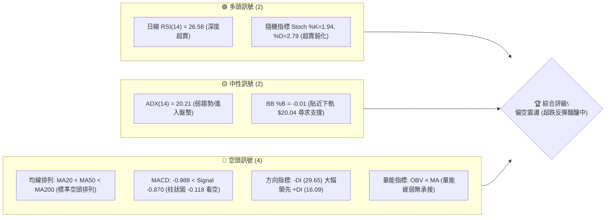
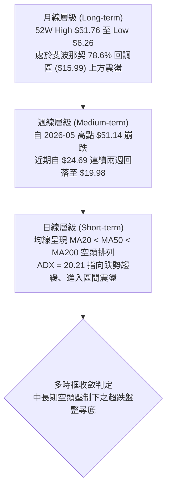
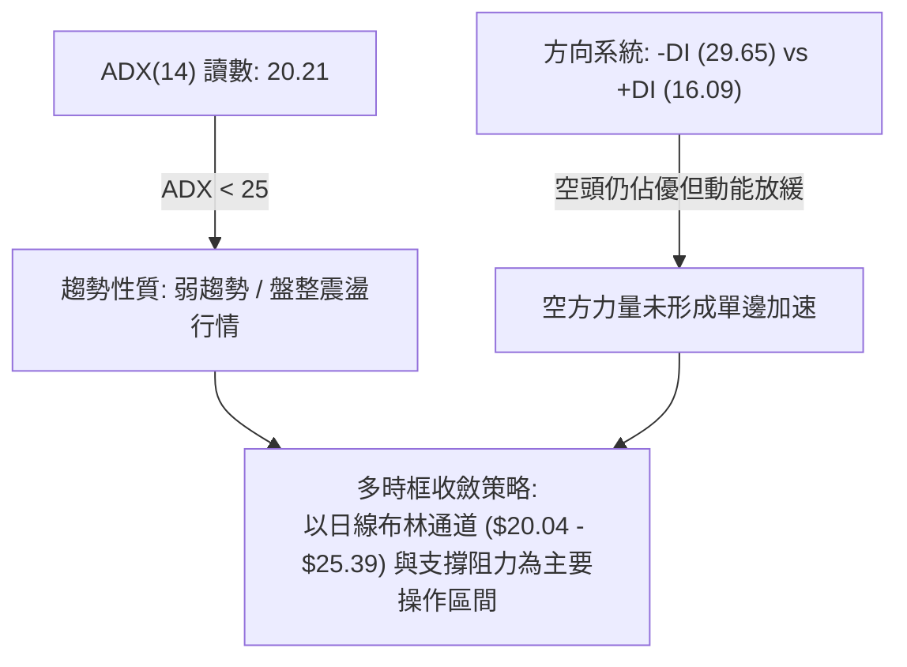
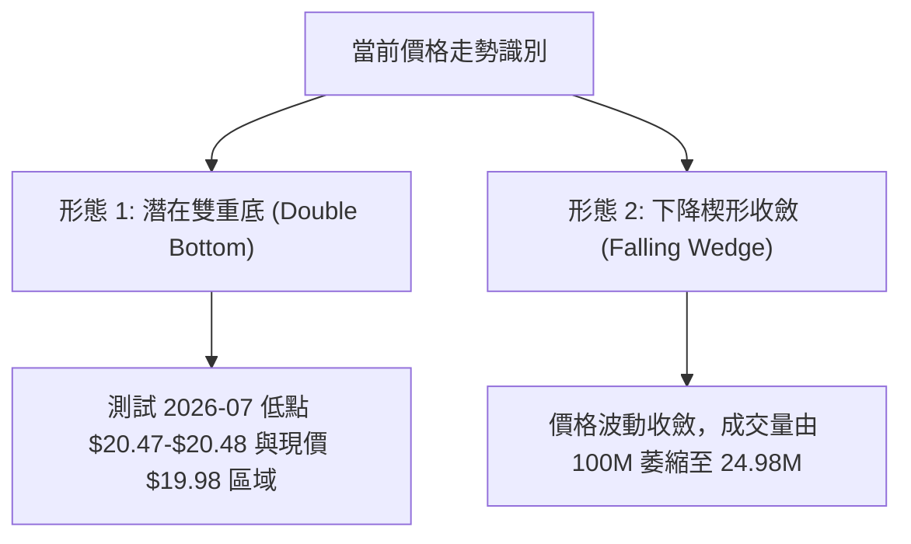
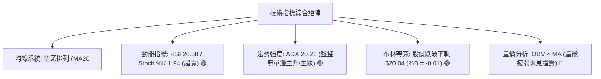
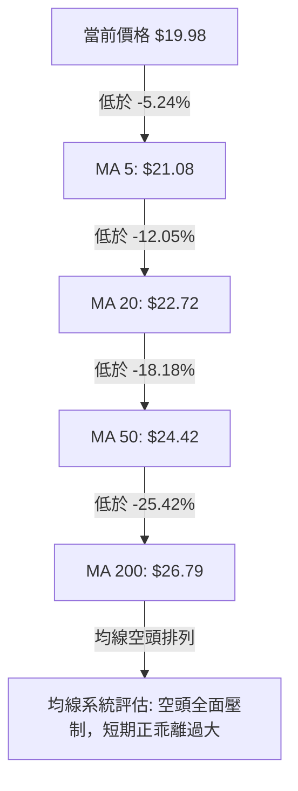
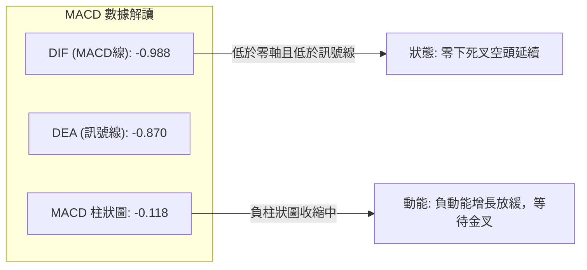
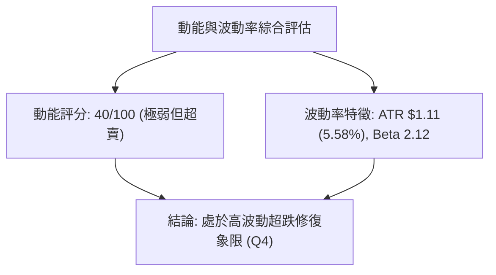
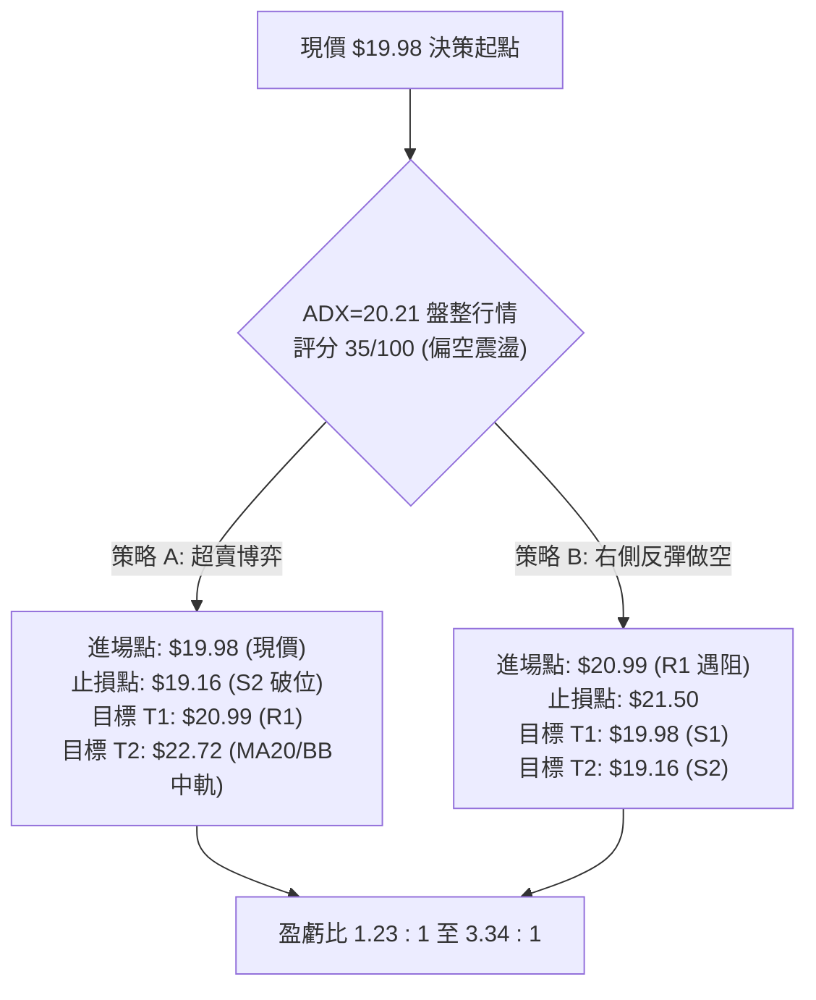
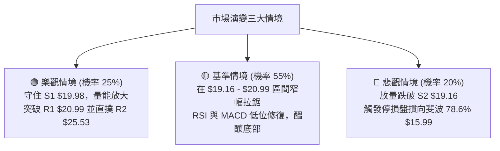

# PL 技術分析報告

> **報告日期**：2026-08-29 ｜ **語言**：繁體中文 ｜ **數據來源**：Yahoo Finance ｜ **當前價格**：$19.98

---

## 目錄

| 章節 | 內容 |
|------|------|
| [1. 技術面概覽](#1-技術面概覽) | 訊號儀表板、核心指標、評分卡 |
| [2. 趨勢分析](#2-趨勢分析) | 多時框趨勢、長中短期走勢 |
| [3. 圖表形態分析](#3-圖表形態分析) | 形態識別、K線組合、目標價 |
| [4. 支撐與阻力](#4-支撐與阻力) | 關鍵價位、斐波那契回調 |
| [5. 技術指標深度解讀](#5-技術指標深度解讀) | MA/RSI/MACD/布林/成交量 |
| [6. 動能與波動率](#6-動能與波動率) | 動能評估、ATR、Beta |
| [7. 多時框架總結](#7-多時框架總結) | 時框架評分矩陣 |
| [8. 交易策略建議](#8-交易策略建議) | 多空策略、風險報酬比 |
| [9. 風險提示與監控](#9-風險提示與監控) | 監控指標、風險場景 |

---

## 1. 技術面概覽

### 🎯 技術訊號儀表板



### 📊 核心指標速覽表

| 指標類別 | 指標名稱 | 當前數值 | 訊號 | 解讀 |
|----------|----------|----------|------|------|
| **價格** | 當前價格 | $19.98 | 🔴 | 位於 52 週區間 30.2%，處於深度回調階段 |
| **均線** | MA20 | $22.72 | 🔴 | 價格低於 MA20 達 -12.05%，短期下行趨勢顯著 |
| **均線** | MA50 | $24.42 | 🔴 | 價格低於 MA50，中期均線壓制強烈 |
| **均線** | MA200 | $26.79 | 🔴 | 價格低於 MA200，長期趨勢轉入空頭壓制區 |
| **動能** | RSI(14) | 26.58 | 🟢 | 進入極度超賣區（<30），隨時具備技術性反抽動能 |
| **動能** | MACD(12,26,9) | -0.988 | 🔴 | MACD 與 Signal 處於零軸下方且負擴散（柱狀 -0.118） |
| **波動** | ATR(14) | $1.11 | 🟡 | 佔股價 5.58%，屬於中高波動區間，利於波段博弈 |
| **趨勢** | ADX(14) | 20.21 | 🟡 | ADX < 25 表明單邊跌勢動能減緩，轉入低位盤整 |
| **通道** | Bollinger Bands | $20.04 (下軌) | 🟡 | 價格跌破下軌（%B = -0.01），存在通道內收斂修復需求 |
| **成交量** | 20日均量比 | 1.65x | 🔴 | 單日量能放量下跌（8.24M vs 4.99M），空頭拋壓仍存 |

### 🏆 技術評分卡

```
╔══════════════════════════════════════════════════════════════╗
║                技術評分卡 — PL (2026-08-29)                   ║
╠══════════════════════════════════════════════════════════════╣
║ 趨勢強度 (ADX/DI)   ██████░░░░░░░░░░░░░░  30/100  🔴 空頭壓制 ║
║ 動能指標 (RSI/MACD) ████████░░░░░░░░░░░░  40/100  🟡 超賣反彈 ║
║ 支撐穩定度 (S1/S2)  ██████████░░░░░░░░░░  50/100  🟡 考驗S1   ║
║ 成交量配合 (OBV/量) ██████░░░░░░░░░░░░░░  30/100  🔴 量能背離 ║
║ 形態完整度 (K線)    ████████░░░░░░░░░░░░  40/100  🟡 探底築底 ║
║ 均線系統 (MA排列)   ████░░░░░░░░░░░░░░░░  20/100  🔴 空頭排列 ║
╠══════════════════════════════════════════════════════════════╣
║ 綜合評分            ███████░░░░░░░░░░░░░  35/100  🔴 偏空震盪 ║
╚══════════════════════════════════════════════════════════════╝
```

---

## 2. 趨勢分析

### 🌐 多時框趨勢分析



### 📈 長期趨勢 — 12個月走勢圖（Unicode）

```
PL 月線走勢圖（過去12個月：2025-08 至 2026-08）
價格軸 ($)
$52 ┤                                      ● (2026-05: $51.14 / 52W High $51.76)
$46 ┤                                     ╱ ╲
$40 ┤                                    ╱   ╲
$34 ┤                              ●    ●     ● (2026-06: $33.13)
$28 ┤                        ●    ╱      ╲     ╲
$22 ┤                  ●    ╱           ╲     ● (2026-07: $20.48)
$16 ┤            ●    ╱                         ╲
$10 ┤      ●    ╱                                ╚═● 現價 $19.98 (2026-08)
 $4 ┤●────╱
     └─────────────────────────────────────────────────────────────
       08   09   10   11   12   01   02   03   04   05   06   07   08
      2025                                      2026
```

**走勢特徵分析表格**：

| 階段 | 時間區間 | 起止價位 | 漲跌幅 | 核心特徵與量價解讀 |
|------|----------|----------|--------|--------------------|
| **啟動突破期** | 2025-08 至 2025-12 | $7.09 → $19.72 | +178.14% | 放量脫離底部，站上長期均線，主升浪醞釀 |
| **主升加速期** | 2026-01 至 2026-05 | $24.97 → $51.14 | +104.81% | 2026-05 觸及 52W 高點 $51.76，週量放大至 61.48M，動能見頂 |
| **崩跌釋放期** | 2026-06 至 2026-07 | $33.13 → $20.48 | -60.00% | 獲利盤踩踏，2026-06 週量激增至 100.62M 巨量破位下殺 |
| **低位築底期** | 2026-08 (當前) | $20.48 → $19.98 | -2.44% | 波動率收斂，週成交量降至 24.98M，拋壓逐步衰竭 |

### 📊 中期趨勢（週線分析）

```
中期週線價格結構示意圖
════════════════════════════════════════════════════════════════
$27.57 ────────────────────────────────────────── 阻力 R3 (MA60 $25.73 上方強阻)
$25.53 ────────────────────────────────────────── 阻力 R2 (MA200 $26.79 / 斐波 61.8% $23.64 延伸)
$20.99 ────────────────────────────────────────── 阻力 R1 (短期反彈反壓位 / MA5 $21.08)
$19.98 ══════════════════════════════════════════ 支撐 S1 (當前價格 / 雙底頸線測試點)
$19.16 ────────────────────────────────────────── 支撐 S2 (近期關鍵波段低點聚類)
$11.97 ────────────────────────────────────────── 支撐 S3 (長期結構性防線)
════════════════════════════════════════════════════════════════
```

### ⚡ 趨勢強度評估（ADX 解讀）



| 指標變數 | 當前數值 | 強度門檻 | 趨勢解讀 |
|----------|----------|----------|----------|
| **ADX(14)** | 20.21 | < 25 (弱趨勢/盤整) | 單邊快速下跌階段結束，市場進入籌碼沉澱與區間收斂階段 |
| **+DI (14)** | 16.09 | 多頭動能參考線 | 多頭攻擊力道匱乏，尚未形成反轉向上穿越 |
| **-DI (14)** | 29.65 | 空頭動能參考線 | 空頭絕對值仍高於多頭，但斜率已開始走平 |

---

## 3. 圖表形態分析

### 🔍 形態識別系統



**圖表形態信心度與目標價評估表**：

| 形態名稱 | 信心度 | 判斷依據（引用數據） | 完成度 | 目標價（附計算式） |
|----------|--------|----------------------|--------|--------------------|
| **潛在雙重底** | 58% | 2026-07-26 低點 $20.47 與當前價位 $19.98 於支撐 S1 ($19.98) 形成雙低點測試 | 45% (尚未突破頸線) | 頸線阻力 R2 ($25.53) + 形態高度 ($25.53 - $19.16 = $6.37) = **$31.90**（若突破） |
| **布林下軌超賣反抽** | 72% | 股價觸及 BB 下軌 $20.04，%B = -0.01 且 RSI = 26.58 處於超賣 | 85% (處於反抽發動點) | 第一目標為 BB 中軌 (MA20) **$22.72**，第二目標為阻力 R2 **$25.53** |
| **長期頭肩頂回調** | 80% | 2026-05 築頂 $51.14 後破位，現已完全跌破頸線進入測幅滿足區 | 90% (已大幅釋放) | 形態測幅已達斐波 78.6% 回調位 ($15.99) 上方，目前於 S1/S2 止跌 |

### 🕯️ 重要K線形態分析

| 週/月份 | 收盤價 | K線形態 | 解讀 | 訊號 |
|---------|--------|---------|------|------|
| **2026-05-31** | $51.14 | 長上影大陽見頂線 | RSI 達 83.2 極度超買，主力資金高位出逃，形成歷史大頂 | 🔴 空頭反轉 |
| **2026-06-07** | $32.22 | 巨量破位長陰線 | 週成交量爆出 100.62M，摜破所有短期均線，趨勢轉空 | 🔴 強烈看空 |
| **2026-07-26** | $20.47 | 低檔長下影十字星 | 週 RSI 降至 10.2 極端值，空頭動能初次衰竭，探明第一底部 | 🟢 觸底訊號 |
| **2026-08-16** | $24.69 | 反彈遇阻中陽線 | 反彈受制於 MA60 ($25.73) 與阻力 R2 ($25.53)，量能未續放大 | 🟡 阻力確認 |
| **2026-08-30** | $19.98 | 低位縮量錘子/測試線 | 二次測試 S1 ($19.98) 與 S2 ($19.16)，成交量降至 24.98M | 🟢 二次築底 |

### 📉 ASCII 走勢形態示意圖

```
雙重底（潛在）與區間收斂形態示意圖
$26.00 ┤              頸線阻力 R2: $25.53 (MA60 $25.73)
       │                 ╭───────╮
$24.00 ┤                ╭╯ (08-16)╰╮
       │               ╭╯ $24.69   ╰╮
$22.00 ┤              ╭╯            ╰╮
       │  (07-26)    ╭╯               ╰╮   當前價位
$20.00 ┼───●─────────╯─────────────────●════ $19.98 (S1)
       │  $20.47 (低點 1)              $19.98 (低點 2 測試中)
$18.00 ┤                                 │
       │                                 ▼ 關鍵防守 S2: $19.16
       └─────────────────────────────────────────────────────
```

---

## 4. 支撐與阻力

### 🗺️ 關鍵價位分布圖（Unicode）

```
PL 價位結構分布圖
═════════════════════════════════════════════════════════════════════
$27.57 ║████████████████████████████████████████║ 強阻力 R3 (MA200 $26.79 上方)
$25.53 ║████████████████████████████            ║ 關鍵阻力 R2 (MA60 $25.73 區域)
$20.99 ║████████████████                        ║ 短線阻力 R1 (MA5 $21.08 / 突破第一道坎)
$19.98 ╠════════════════════════════════════════╣ ◄ 當前價格 $19.98 (支撐位 S1)
$19.16 ║▓▓▓▓▓▓▓▓▓▓▓▓▓▓▓▓▓▓▓▓▓▓▓▓▓▓▓▓            ║ 關鍵防守 S2 (-4.10% 近期波段低點)
$11.97 ║████████████████████████████████████████║ 終極深淵支撐 S3 (-40.09% 長期結構底)
═════════════════════════════════════════════════════════════════════
```

### 🚧 阻力位分析表

| 阻力級別 | 價位 | 形成原因 | 突破難度 | 重要性 |
|----------|------|----------|----------|--------|
| **R1** | **$20.99** | 近期 5 日均線 MA5 ($21.08) 重合區，短期下跌通道上緣 | 🟡 中等 (需日成交量放大至 6M 以上) | 短期多空分水嶺 |
| **R2** | **$25.53** | 8 月中旬反彈波段高點，密集成交區及 MA60 ($25.73) 重壓 | 🔴 極高 (需突破 BB 上軌 $25.39) | 中期反轉頸線位 |
| **R3** | **$27.57** | 2026 年 3-4 月起漲平台，MA200 ($26.79) 上方籌碼套牢區 | 🔴 極高 (強大解套拋壓) | 牛熊轉換關鍵帶 |

### 🛡️ 支撐位分析表

| 支撐級別 | 價位 | 形成原因 | 守住機率 | 重要性 |
|----------|------|----------|----------|--------|
| **S1** | **$19.98** | 當前現價精確重合點，BB 下軌 ($20.04) 支撐區間 | 🟡 60% (受 RSI 超賣保護) | 盤整下限防線 |
| **S2** | **$19.16** | 近一年波段低點聚類，空頭極限回撤緩衝墊 (-4.10%) | 🟢 75% (具備強買盤支撐) | 多頭最後防線 |
| **S3** | **$11.97** | 2025 年 11 月平台起漲點聚類，歷史結構性支撐 | 🟢 95% (極端黑天鵝防線) | 宏觀基本面底線 |

### 📐 斐波那契回調位分析

依據 52 週完整波動區間（高點 **$51.76** → 低點 **$6.26**，垂直高度差 $45.50）：

```
斐波那契回調層級分布：
  0.0%  (52W High)   $51.76  ── 歷史頂部
 23.6%               $41.02  ── 頂部破位第一反彈位
 38.2%               $34.38  ── 2026-06 平台阻力
 50.0%               $29.01  ── 多空強弱分界軸心
 61.8%               $23.64  ── 黃金分割關鍵阻力 (位於 MA20 $22.72 與 MA50 $24.42 之間)
 78.6%               $15.99  ── 深度回調支撐帶
100.0%  (52W Low)    $ 6.26  ── 歷史起漲底部
```

**現價落點解讀**：
當前價格 **$19.98** 處於斐波那契 **61.8% ($23.64)** 與 **78.6% ($15.99)** 回調區間內。股價自 61.8% 回調位跌破後，正在向下尋找 78.6% 與波段低點聚類 S2 ($19.16) 的聯合支撐。若能於 $19.16–$19.98 構築雙底，首要反彈目標即為 61.8% 回調位 **$23.64**。

---

## 5. 技術指標深度解讀

### 🎛️ 指標訊號總覽



### 📈 移動平均線排列分析



| 均線名稱 | 當前數值 | 價格與MA差距 | 趨勢斜率 | 技術意涵 |
|----------|----------|--------------|----------|----------|
| **MA 5** | $21.08 | -5.24% | 陡峭向下 | 短線極弱，首要突破目標 |
| **MA 10** | $22.02 | -9.28% | 向下延伸 | 短線反彈第一道反壓 |
| **MA 20** | $22.72 | -12.05% | 下行放緩 | 布林中軌，短線趨勢扭轉關鍵點 |
| **MA 60** | $25.73 | -22.34% | 穩定下行 | 中期強阻力，與 R2 ($25.53) 重疊 |
| **MA 120** | $31.18 | -35.92% | 下行 | 中長期套牢籌碼峰 |
| **MA 200** | $26.79 | -25.42% | 走平轉下 | 長期牛熊分水嶺 |

### 📉 RSI(14) 分析

```
RSI(14) 數值儀表：26.58  [極度超賣區]
0 ────────── 20 ────── 26.58 ── 30 ────────────────────── 70 ────────── 100
[ 極度超賣區 ] ▓▓▓▓▓▓▓░░░░░░░░░░░░░░░░░░░░░░░░░░░░░░░░░░░░░  [ 超買區 ]
```

- **超買超賣判定**：RSI(14) 讀數為 **26.58**（< 30），隨機指標 Stoch %K 為 **1.94**，%D 為 **2.79**。指標全面落入超賣區，表明近期空頭拋壓釋放已進入極限狀態，市場隨時具備均值回歸的技術性反抽動能。
- **背離判斷**：日線 RSI 目前無明顯底背離或頂背離；但從週線角度觀察，2026-07-26 價格在 $20.47 時 RSI 為 10.2，當前價格 $19.98 雖然微幅破底，但週線 RSI 為 26.6，呈現**週線級別潛在隱性底背離雛形**，暗示下跌動能正在衰減。

### 📊 MACD(12,26,9) 訊號解讀



- **MACD 現況**：DIF (-0.988) 位於 Signal (-0.870) 下方，柱狀圖為 -0.118。
- **背離結論**：MACD 線與柱狀圖並未創出 6 月份暴跌時的新低（-1.972），處於**大級別指標低位鈍化收斂**狀態。空頭動能已不復 6-7 月之強烈，只要價格在 S2 ($19.16) 企穩，DIF 有望在零下形成黃金交叉。

### 📦 布林通道分析

```
ASCII 布林通道示意圖（日線）
$25.39 ────────────────────────────────────────── BB 上軌 (Upper)
       │
$22.72 ────────────────────────────────────────── BB 中軌 / MA20 (Middle)
       │
$20.04 ────────────────────────────────────────── BB 下軌 (Lower)
$19.98 ═════════● 現價 (BB %B = -0.01，跌出下軌外)
```

- **通道帶寬與位置**：通道上軌 $25.39，中軌 $22.72，下軌 $20.04。
- **位置解讀**：%B 為 **-0.01**，價格已跌破下軌外側。統計學上，價格脫離布林通道下軌屬於異常波動事件，通常會引發向通道中軌（MA20 $22.72）的回抽修復。

### 💹 成交量分析（量價配合度）

- **量價特徵**：最新日成交量為 **8,243,700 股**，相較 20 日均量（4,989,330 股）放大至 **1.65 倍**，呈現「放量收低」格局，說明低位仍有恐慌盤湧出。
- **OBV 趨勢**：當前 OBV < OBV_MA，能量潮指標向下發散，表明大資金主力尚未發動主動性規模吸籌，當前成交量主要由散戶止損盤與量化平倉盤構成。量能尚未確認反轉，操作上需等待量縮企穩或放量長陽突破 R1 ($20.99)。

---

## 6. 動能與波動率

### ⚡ 動能評估四象限

| 象限 | 動能維度 | 波動率維度 | 當前標的狀態 | 交易戰術評估 |
|------|----------|------------|--------------|--------------|
| **Q1** | 強動能 (Bull) | 低波動 (Low Vol) | — | 穩定主升趨勢，順勢加碼 |
| **Q2** | 弱動能 (Bear) | 低波動 (Low Vol) | — | 窄幅盤整，觀望等待方向 |
| **Q3** | 強動能 (Bull) | 高波動 (High Vol) | — | 爆發突破行情，嚴格止盈 |
| **Q4 (當前)** | **弱動能 (Bear)** | **高波動 (High Vol)** | **✓ (PL 當前落點)** | **超跌區間，嚴禁追空，等待超賣反彈機會** |



### 📊 ATR 波動率分析

- **ATR(14) 數值**：**$1.11**（佔現價 $19.98 之 **5.58%**）。
- **止損距離建議**：
  - **日內/短線交易止損**：1.0 × ATR = **$1.11**（保護位設於 $18.87）。
  - **波段交易止損**：1.5 × ATR = **$1.67**（保護位設於 $18.31）。
  - **關鍵結構止損**：直接以關鍵支撐 S2 **$19.16** 下方 1 檔或 S2 - 0.5×ATR（$18.60）作為極限硬止損點。

### 📐 Beta 與市場相關性

- **Beta 係數**：**2.123**。PL 屬於高彈性、高貝塔成長型太空科技/國防工業股，其波動幅度為標普 500 指數的 2.12 倍以上。在市場風險偏好改善時具備極高反彈彈性，但大盤調整時亦將承受加倍下行壓力。

---

## 7. 多時框架總結

### 📋 時框架評分表

| 時框架 | 趨勢方向 | 動能狀態 | 均線排列 | 形態結構 | 綜合評分 | 戰術建議 |
|--------|----------|----------|----------|----------|----------|----------|
| **月線 (長期)** | 🔴 偏空回調 | 🟡 中性降溫 | 🟡 均線糾纏 | 52W 高點巨幅回撤 | 45/100 | 斐波 78.6% 上方尋求長期基石 |
| **週線 (中期)** | 🔴 空頭壓制 | 🟡 低位鈍化 | 🔴 空頭排列 | 巨量下跌後縮量尋底 | 35/100 | 關注 $19.16–$19.98 雙底形態確立 |
| **日線 (短期)** | 🟡 盤整超跌 | 🟢 極度超賣 | 🔴 空頭排列 | BB 下軌破位反抽 | 40/100 | 依布林通道與 S1/R1 進行區間博弈 |

### 🔲 綜合訊號矩陣

```
時框訊號收斂矩陣：
  [長期-月線] ──────────► 偏空回撤 (壓制)
                               │
  [中期-週線] ──────────► 尋底震盪 (ADX 20.21 無趨勢)
                               │
  [短期-日線] ──────────► 深度超賣 (RSI 26.58 / 布林破下軌)
                               │
                               ▼
            【最終收斂結論：偏空壓制下的超跌區間震盪】
```

### ⚖️ 多時框收斂結論

依據多時框收斂規則：
1. 當前趨勢強度指標 **ADX(14) = 20.21 (< 25)**，明確定義當前市場處於**盤整震盪行情**而非單邊主跌浪。
2. 在盤整格局下，主導交易邏輯由日線級別之**布林通道下軌 ($20.04)** 與**關鍵支撐聚類 S1 ($19.98) / S2 ($19.16)** 接管。
3. **唯一方向性結論**：**中性偏空、超跌區間震盪尋底**。操作上嚴禁在現價盲目殺跌追空，應以「低吸博超賣反彈」或「反彈遇阻 R1/R2 做空」為核心框架。第 8 章主策略將嚴格依評分卡（35/100 偏空震盪）展開區間與防守性佈局。

---

## 8. 交易策略建議

### 🗺️ 策略決策流程圖



### 🧭 策略路由

**當前主策略方向 = 偏空震盪格局下的「超跌反彈左側輕倉博弈（策略 A）」與「反彈遇阻順勢做空（策略 B）」**
*(依據綜合評分 35/100，大趨勢維持偏空，但因 RSI 處於 26.58 極端超賣且 ADX 進入盤整，主推防守型超跌反抽與阻力位空頭佈局)*

### 🎯 價格情境階梯（Price Scenarios）

| 觸發條件 | 下一目標 | 後續延伸 | 情境含義 |
|----------|----------|----------|----------|
| **強勢突破 R1 $20.99** | **R2 $25.53** | **R3 $27.57** | 短線空頭衰竭，發動奔向 MA60 與 MA200 的均值修復浪 |
| **守住現價 S1 $19.98** | **MA20 $22.72** | **R1 $20.99** | 於布林下軌展開箱體震盪築底 |
| **有效跌破 S2 $19.16** | **斐波 78.6% $15.99**| **S3 $11.97** | 雙底構築失敗，跌勢重啟並向下探尋長期結構底 |

### 📊 情境機率分佈

| 情境 | 機率 | 主要依據 |
|------|------|----------|
| **超跌反彈修復** | **45%** | 日線 RSI(14)=26.58 嚴重超賣，BB %B = -0.01 跌出通道，具備回抽 MA20 ($22.72) 動能 |
| **低位區間震盪** | **40%** | ADX(14)=20.21 指向弱趨勢，成交量萎縮，市場進入 $19.16–$20.99 籌碼沉澱期 |
| **破位再探深底** | **15%** | 均線空頭排列，若遭遇黑天鵝摜破 S2 ($19.16)，將引發止損盤下探 $15.99 |

### 🟢 主策略詳情

| 策略要素 | 策略 A（多頭：超賣反抽激進單） | 策略 B（空頭：反彈受阻順勢單） |
|----------|--------------------------------|--------------------------------|
| **進場條件** | 現價 S1 處 RSI<30 超賣確認，出現下影線 | 價格反彈至 R1 遇阻回落，成交量不濟 |
| **進場價格** | **$19.98** (現價/S1) | **$20.99** (阻力 R1) |
| **目標價 T1** | **$20.99** (阻力 R1，獲利 +5.06%) | **$19.98** (支撐 S1，獲利 +4.81%) |
| **目標價 T2** | **$22.72** (MA20/BB中軌，獲利 +13.71%) | **$19.16** (支撐 S2，獲利 +8.72%) |
| **止損價格** | **$19.16** (跌破 S2 支撐，虧損 -4.10%) | **$21.50** (突破 MA5/R1 上方，虧損 -2.43%) |
| **風險報酬比** | **1.23 : 1** (至T1) / **3.34 : 1** (至T2) | **1.98 : 1** (至T1) / **3.59 : 1** (至T2) |
| **成功機率** | 55% | 65% |
| **建議倉位** | **5% - 8%** (輕倉試探) | **10% - 15%** (標準波段) |

### 🔴 反向風險觸發點（對沖提示）

- **多頭轉向全面做空觸發點**：若日線收盤價**實體跌破 S2 ($19.16)**，代表雙底失敗，所有多頭多單必須無條件止損出局，並可反手做空下看 $15.99。
- **空頭全面平倉/停損觸發點**：若價格帶量**長陽突破 R2 ($25.53)** 且站穩 MA60，代表中期趨勢反轉，所有空頭頭寸必須全數平倉對沖。

### ⭐ 整體訊號強度評星

```
做多訊號強度：★★☆☆☆  (2.5/5星 - 僅限超賣反彈，非反轉)
做空訊號強度：★★★☆☆  (3.5/5星 - 趨勢順勢但需防反抽)
整體可信度：  ★★★★☆  (4.0/5星 - 價位聚類與指標收斂明確)
```

---

## 9. 風險提示與監控

### ✅ 關鍵監控指標 Checklist

```
╔══════════════════════════════════════════════════════════════╗
║                   每日交易監控 Checklist                     ║
╠══════════════════════════════════════════════════════════════╣
║ [ ] 價格是否跌破關鍵支撐 S2 ($19.16)？                       ║
║ [ ] RSI(14) 是否脫離超賣區站上 30.00？                       ║
║ [ ] 日成交量是否超越 20日均量 (4.99M) 且突破 R1 ($20.99)？  ║
║ [ ] MACD 柱狀圖是否由負轉正 (向上穿越零軸)？                 ║
║ [ ] 布林通道 %B 是否重新返回 0.00 以上 (站回 $20.04)？       ║
║ [ ] ADX 是否維持在 25 以下 (確認處於震盪而非加速跌勢)？      ║
╚══════════════════════════════════════════════════════════════╝
```

### ⚠️ 風險場景分析



### 🛡️ 風險管理重要提醒

1. **高 Beta 波動控制**：PL 的 Beta 達 **2.123**，每日平均波動空間 ATR 高達 **$1.11 (5.58%)**。單筆交易風險敞口嚴格控制在總資金的 **1.0% - 1.5%** 以內。
2. **均線壓制原則**：當前 MA20 ($22.72)、MA50 ($24.42)、MA200 ($26.79) 呈典型空頭排列。任何未放量突破 MA20 的上漲均視為「技術性反抽」，而非反轉，不可重倉追高。
3. **空頭回補陷阱**：在量能未放大至 20 日均量 1.5 倍以上（>7.5M）前，避免在阻力位 R1 ($20.99) 附近追多。

---

## 📋 報告總結

```
╔══════════════════════════════════════════════════════════════════╗
║                   PL 技術分析報告總結                            ║
╠══════════════════════════════════════════════════════════════════╣
║ 報告日期：2026-08-29                                             ║
║ 當前價格：$19.98                                                 ║
║ 分析評級：⚖️ 偏空震盪 (超跌反彈醞釀中)                           ║
║                                                                  ║
║ 關鍵結論：                                                       ║
║ ├─ 長期趨勢：🔴 偏空回調 (受制於 52W 高點 $51.76 回撤)          ║
║ ├─ 中期趨勢：🔴 空頭排列 (MA20 < MA50 < MA200)                  ║
║ ├─ 短期趨勢：🟢 深度超賣 (RSI 26.58 / 布林 %B -0.01)            ║
║ ├─ 關鍵支撐：S1: $19.98  /  S2: $19.16  /  S3: $11.97           ║
║ ├─ 關鍵阻力：R1: $20.99  /  R2: $25.53  /  R3: $27.57           ║
║ └─ 分析師目標價：均價 $40.10 (區間: $25.00 - $53.00)             ║
║                                                                  ║
║ 最優策略組合：                                                   ║
║ 1. 🥇 最佳機會：於現價 $19.98 輕倉博弈超賣反抽，目標 $20.99-$22.72║
║ 2. 🥈 次選機會：反彈至 R1 $20.99 遇阻時順勢做空，止損設 $21.50   ║
║ 3. 🥉 防守底線：若實體跌破 S2 $19.16，嚴格執行全線停損          ║
╚══════════════════════════════════════════════════════════════════╝
```

---

> ⚠️ **免責聲明**：本報告為技術分析研究成果，所有數據及關鍵價位均基於歷史量價數據（OHLCV）計算。本報告**僅供研究與學術參考**，**不構成任何要約、招攬或投資建議**。金融市場投資具有高風險性，投資人應獨立評估風險並自負盈虧。

---

*報告生成時間：2026-08-29 ｜ 數據來源：Yahoo Finance ｜ 分析框架：多時框量化技術分析*