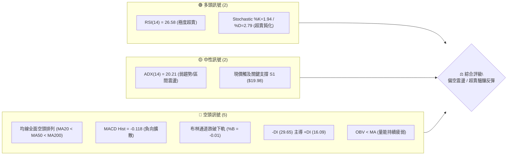
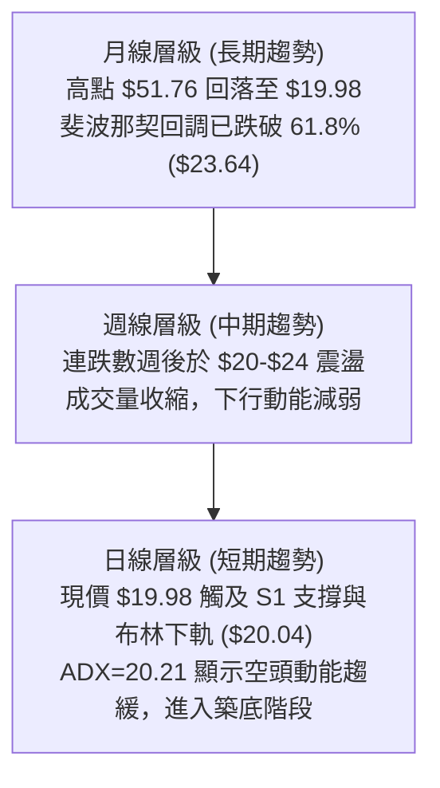
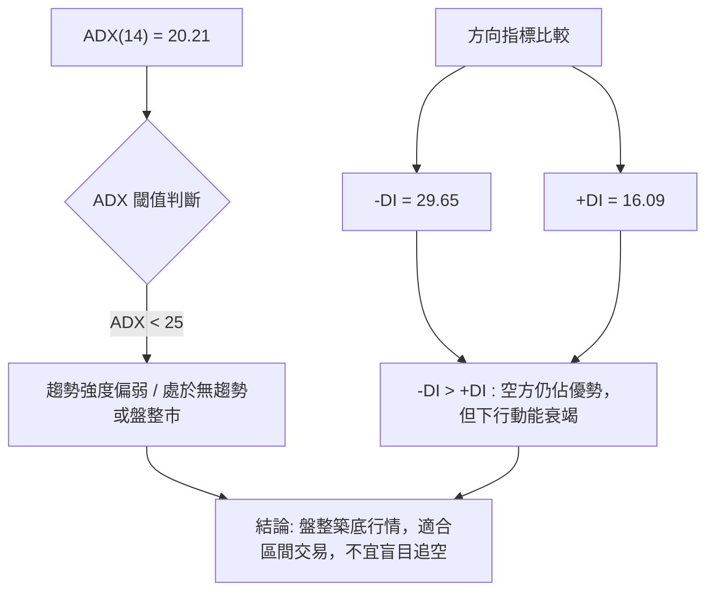
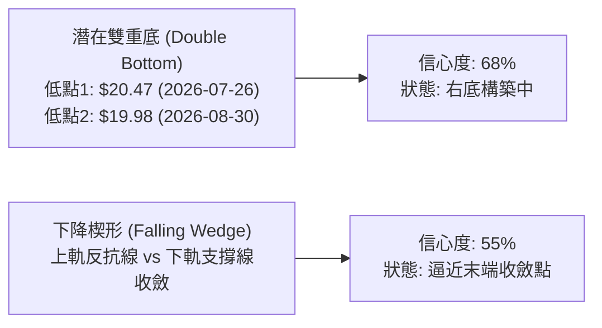
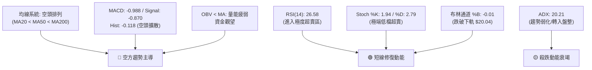
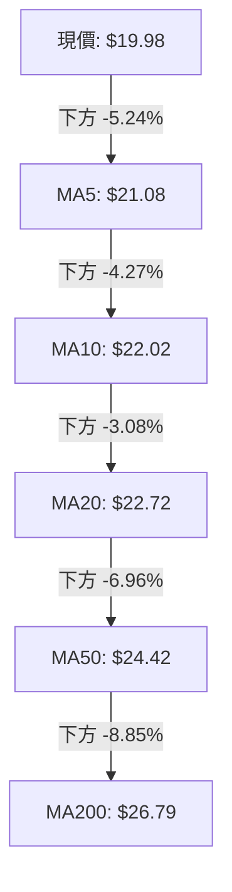
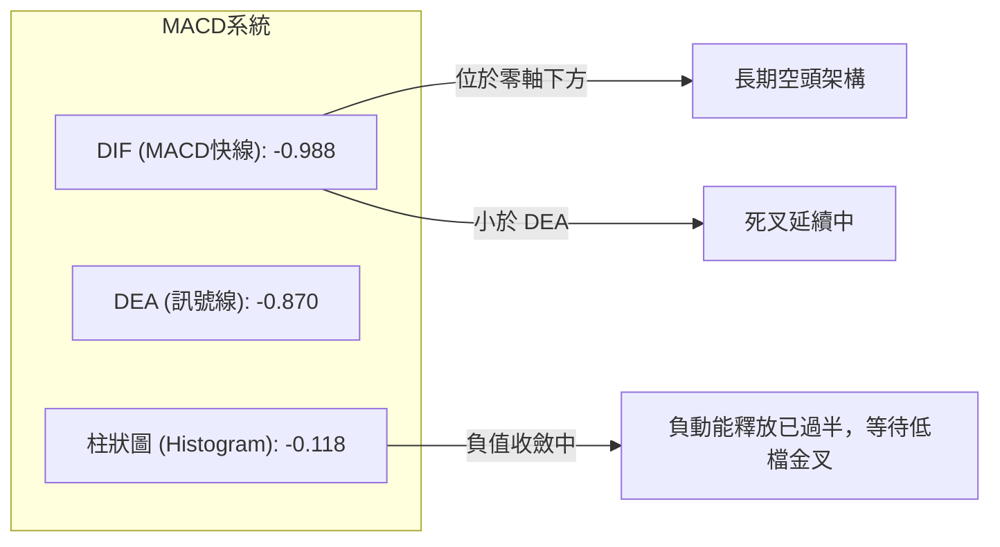
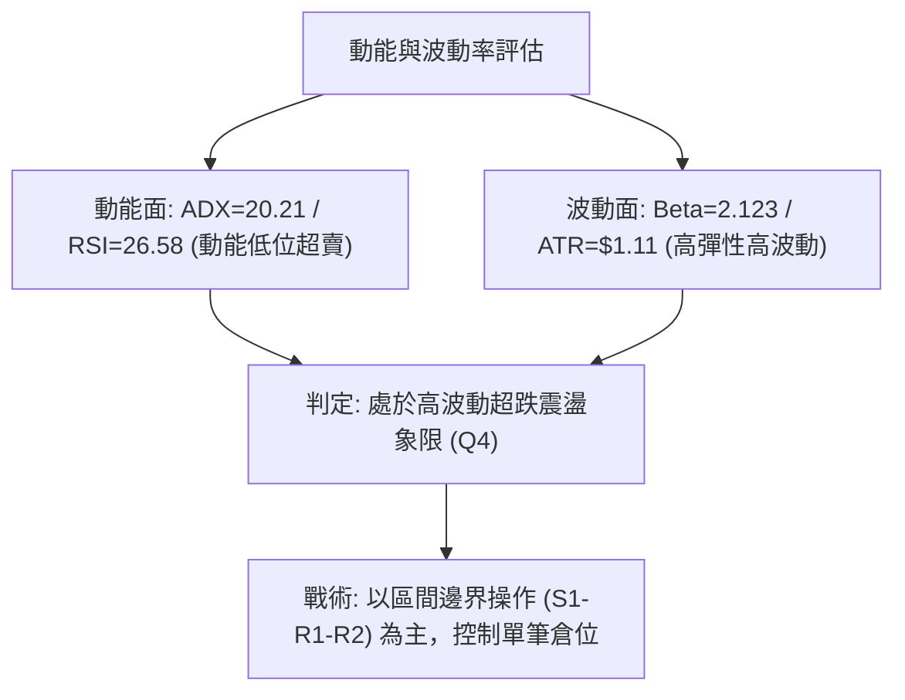
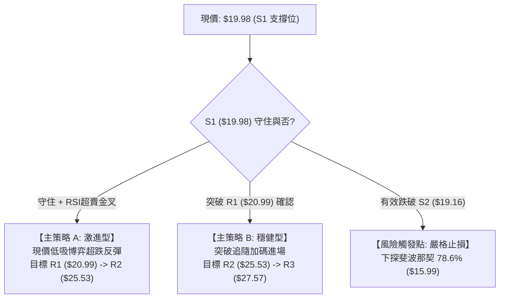
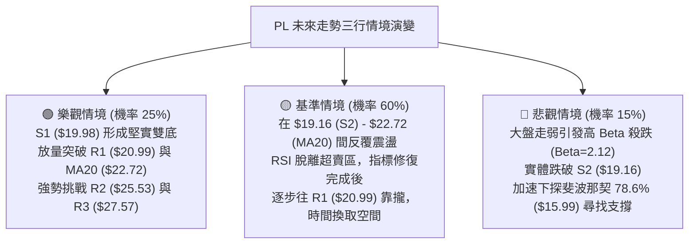

# PL 技術分析報告

> **報告日期**：2026-08-29 ｜ **語言**：繁體中文 ｜ **數據來源**：Yahoo Finance ｜ **當前價格**：$19.98

---

## 目錄

| 章節 | 內容 |
|------|------|
| [1. 技術面概覽](#1-技術面概覽) | 訊號儀表板、核心指標、評分卡 |
| [2. 趨勢分析](#2-趨勢分析) | 多時框趨勢、長中短期走勢 |
| [3. 圖表形態分析](#3-圖表形態分析) | 形態識別、K線組合、目標價 |
| [4. 支撐與阻力](#4-支撐與阻力) | 關鍵價位、斐波那契回調 |
| [5. 技術指標深度解讀](#5-技術指標深度解讀) | MA/RSI/MACD/布林/成交量 |
| [6. 動能與波動率](#6-動能與波動率) | 動能評估、ATR、Beta |
| [7. 多時框架總結](#7-多時框架總結) | 時框架評分矩陣 |
| [8. 交易策略建議](#8-交易策略建議) | 多空策略、風險報酬比 |
| [9. 風險提示與監控](#9-風險提示與監控) | 監控指標、風險場景 |

---

## 1. 技術面概覽

### 🎯 技術訊號儀表板



### 📊 核心指標速覽表

| 指標類別 | 指標名稱 | 當前數值 | 訊號 | 解讀 |
|----------|----------|----------|------|------|
| **價格** | 當前價格 | $19.98 | 🔴 | 位於52週區間 30.2%，處於深度回調階段 |
| **均線** | MA20 | $22.72 | 🔴 | 價格低於MA20達 -12.05%，短線下行壓力沉重 |
| **均線** | MA50 | $24.42 | 🔴 | 價格跌破中期生命線，中期趨勢向下 |
| **均線** | MA200 | $26.79 | 🔴 | 價格位於長期均線下方 -25.42%，長期走勢轉弱 |
| **動能** | RSI(14) | 26.58 | 🟢 | 進入嚴重超賣區間（<30），隨時有技術性修復需求 |
| **動能** | MACD | -0.988 / -0.870 | 🔴 | 快慢線均在零軸下方，Histogram 處於 -0.118 空方主導 |
| **動能** | Stoch %K/%D | 1.94 / 2.79 | 🟢 | 隨機指標處於極度超賣區，醞釀低檔金叉 |
| **趨勢** | ADX(14) | 20.21 | 🟡 | ADX < 25 表明單邊暴跌趨緩，轉入盤整與尋求底部 |
| **通道** | 布林通道 | $20.04 (下軌) | 🟡 | %B 為 -0.01，價格略微跌破下軌，面臨回歸均值拉力 |
| **波動** | ATR(14) | $1.11 | 🟡 | 日波動率約 5.58%，屬於中高波動率個股 |

### 🏆 技術評分卡

```
╔══════════════════════════════════════════════════════════════════╗
║                   技術評分卡 — PL (2026-08-29)                   ║
╠══════════════════════════════════════════════════════════════════╣
║ 趨勢強度 (Trend)     ██████░░░░░░░░░░░░░░  30/100  🔴 空頭主導   ║
║ 動能指標 (Momentum)  ████████░░░░░░░░░░░░  40/100  🟡 極度超賣   ║
║ 支撐穩定度 (Support) ██████████░░░░░░░░░░  50/100  🟡 S1現價考驗 ║
║ 成交量配合 (Volume)  ██████░░░░░░░░░░░░░░  30/100  🔴 OBV走弱    ║
║ 形態完整度 (Pattern) ████████░░░░░░░░░░░░  40/100  🟡 構築箱體   ║
║ 均線排列 (MA System) ████░░░░░░░░░░░░░░░░  20/100  🔴 空頭排列   ║
╠══════════════════════════════════════════════════════════════════╣
║ 綜合技術評分         ███████░░░░░░░░░░░░░  35/100  🔴 偏空震盪   ║
╚══════════════════════════════════════════════════════════════════╝
```

---

## 2. 趨勢分析

### 🌐 多時框趨勢分析



### 📈 長期趨勢 — 12個月走勢圖（Unicode）

```
PL 月線收盤走勢圖（2025-08 至 2026-08）
價格 ($)
$55 ┤                                  ● $51.14 (2026-05)
$50 ┤                                 / \
$45 ┤                                /   \
$40 ┤                          ●    /     \
$35 ┤                         / \  /       ● $33.13 (2026-06)
$30 ┤                        /   ●/         \
$25 ┤                  ●    ●                \
$20 ┤                 / \  /                  ● $20.48 ──● $19.98 (現價)
$15 ┤        ●   ●   /   ●/
$10 ┤       / \ / \ /
 $5 ┤ ●────●   ●   ●
    └─┬───┬───┬───┬───┬───┬───┬───┬───┬───┬───┬───┬───► 月份
     08  09  10  11  12  01  02  03  04  05  06  07  08 (2026)
```

**走勢特徵分析表格**：

| 階段區間 | 起止價格 | 漲跌幅 | 走勢結構與特徵 |
|----------|----------|--------|----------------|
| **2025/08 - 2025/12** | $7.09 → $19.72 | +178.14% | 主升浪初期，成交量逐步放大，突破長期底部區間 |
| **2026/01 - 2026/05** | $24.97 → $51.14 | +104.81% | 瘋狂加速期，最高觸及 52W 高點 $51.76，形成階段性頭部 |
| **2026/06 - 2026/07** | $33.13 → $20.48 | -38.18% | 斷崖式回調，週級別高成交量下殺，失守 MA50 與多道關鍵斐波位 |
| **2026/08（當前）** | $20.48 → $19.98 | -2.44% | 下跌斜率大幅放緩，成交量萎縮，於 $19.98 (S1) 展開築底測試 |

### 📊 中期趨勢（週線分析）

```
週線支撐與阻力結構示意圖
$51.76 ────────────────────────────────────── 52W 歷史極值 (2026-05)
          │ 
$34.38 ───┼────────────────────────────────── 斐波那契 38.2% 回調位
          │ 
$27.57 ───┴────────────────────────────────── 中期強阻力 R3 / 均線密集帶 (MA200 $26.79)
                │ 
$25.53 ─────────┼──────────────────────────── 波段阻力 R2 / MA60 ($25.73)
                │ 
$20.99 ─────────┴──────────────────────────── 短期反彈阻力 R1 / MA5 ($21.08)
═════════════════════════════════════════════ ◄ 當前收盤價 $19.98 (S1 支撐)
$19.16 ────────────────────────────────────── 關鍵波段低點支撐 S2
          │ 
$15.99 ───┴────────────────────────────────── 斐波那契 78.6% 強支撐
```

中期週線在經歷 6 月的大幅出清後，近期週收盤價分別為 $20.48、$23.93、$24.69、$22.29、$19.98。週線 RSI 自低點 10.2 回升至當前 26.6，整體呈現低檔震盪、尋找中期底部的收斂形態。

### ⚡ 趨勢強度評估（ADX 解讀）



| 指標項 | 數值 | 狀態 | 意涵與操作指引 |
|--------|------|------|----------------|
| **ADX(14)** | 20.21 | 弱趨勢 (<25) | 暴跌主跌浪已結束，市場轉入震盪整固階段 |
| **+DI** | 16.09 | 弱勢 | 多頭反擊力道尚顯不足，需突破 20.0 才有轉強跡象 |
| **-DI** | 29.65 | 空頭主導 | 雖高於 +DI，但數值已自 40 以上顯著回落，賣壓趨於緩和 |

---

## 3. 圖表形態分析

### 🔍 形態識別系統



**形態信心度評估表**：

| 形態名稱 | 信心度 | 判斷依據（引用數據） | 完成度 | 目標價（附計算式） |
|----------|--------|----------------------|--------|--------------------|
| **潛在雙重底** | 68% | 第一次低點 $20.47（2026-07-26 週收盤），當前第二次探底 $19.98，兩者極為接近 S1/S2 區間；且期間反彈頸線高點為 $24.69（2026-08-16） | 70% | 頸線 $24.69 + 形態高度 ($24.69 - $19.98 = $4.71) = **$29.40**（接近 50% 斐波位 $29.01） |
| **下降通道/楔形** | 55% | 高點連線自 $51.14 下降，低點自 $27.07 降至 $19.98，振幅逐漸收斂，成交量顯著萎縮 | 60% | 向上突破通道上軌 R1 ($20.99) 後，測幅目標為 R2 **$25.53** |

### 🕯️ 重要K線形態分析

| 日期/月份 | 收盤價 | K線組合與形態 | 技術解讀 | 多空訊號 |
|-----------|--------|---------------|----------|----------|
| **2026-05-31** | $51.14 | 長上影流星線 (52W高 $51.76) | 頂部爆量滯漲，多頭動能耗盡，見頂信號 | 🔴 強烈看空 |
| **2026-06-07** | $32.22 | 巨量大陰線 (週量 1.006億股) | 機構資金集中拋售，跌破多條短均線 | 🔴 極度看空 |
| **2026-07-26** | $20.47 | 下影十字星 (RSI=10.2) | 賣壓嚴重衰竭，出現第一階段超賣底部訊號 | 🟢 止跌訊號 |
| **2026-08-16** | $24.69 | 反彈陽線遇阻回落 | 測試 MA50/MA20 反壓失敗，形成區間震盪頂部 | 🟡 中性受阻 |
| **2026-08-30** | $19.98 | 縮量探底收十字結構 | 測試 S1 支撐 ($19.98)，成交量萎縮，醞釀次級底部 | 🟢 潛在反轉 |

### 📉 ASCII 走勢形態示意圖

```
雙底築底形態示意圖 (2026-07 至 2026-08)
$26.00 ┤                          
$25.00 ┤                  ● 頸線高點 ($24.69)
$24.00 ┤                 / \      
$23.00 ┤                /   \     
$22.00 ┤        ●      /     \    
$21.00 ┤       / \    /       \   
$20.00 ┤──────●───●──/─────────● ◄ 現價 $19.98 (第二底測試中)
$19.00 ┤    底1 ($20.47)       底2 ($19.98 / S1 支撐)
       └──────┬───────────────┬─────────►
           2026-07-26      2026-08-30
```

### 🎯 形態目標價計算

1. **雙重底測幅計算**：
   - 底部支撐基準：$19.98（當前低點聚類 S1）
   - 中間頸線阻力：$24.69（2026-08-16 週高點）
   - 形態垂直高度：$24.69 - $19.98 = $4.71
   - 理論突破目標價 = 頸線價格 + 形態高度 = $24.69 + $4.71 = **$29.40**
2. **階梯阻力兌現目標**：
   - 第一目標 T1：突破 R1 ($20.99) 後指向 R2 **$25.53**
   - 第二目標 T2：雙底完全突破後指向斐波那契 50.0% 回調位 **$29.01**（接近形態理論值 $29.40）與 R3 **$27.57**

---

## 4. 支撐與阻力

### 🗺️ 關鍵價位分布圖（Unicode）

```
PL 價位結構分布圖
═════════════════════════════════════════════════════════════════════
$27.57 ║██████████████████████████████║ 強阻力 R3 / 密集換手區 (+37.98%)
$25.53 ║████████████████████          ║ 波段阻力 R2 / MA60區間 (+27.78%)
$23.64 ║▓▓▓▓▓▓▓▓▓▓▓▓▓▓▓▓▓▓            ║ 斐波那契 61.8% 回調位 (+18.32%)
$20.99 ║████████████                  ║ 關鍵短阻 R1 / MA5 壓力 (+5.06%)
$19.98 ╠══════════════════════════════╣ ◄ 現價 / 關鍵支撐 S1 (當前位置)
$19.16 ║████████████████              ║ 重要波段支撐 S2 (-4.10%)
$15.99 ║▓▓▓▓▓▓▓▓▓▓▓▓                  ║ 斐波那契 78.6% 回調位 (-19.97%)
$11.97 ║██████████████████████████████║ 長期極限支撐 S3 (-40.09%)
═════════════════════════════════════════════════════════════════════
```

### 🚧 阻力位分析表

| 阻力級別 | 精確價位 | 形成原因（依據數據） | 突破難度 | 技術重要性 |
|----------|----------|----------------------|----------|------------|
| **R1** | **$20.99** | 近期短波段高點聚類，與 MA5 ($21.08) 高度重合 | 🟡 中等 | 短線轉強第一道門檻，突破可確立超賣反彈 |
| **R2** | **$25.53** | 近一年波段高點聚類，接近 MA60 ($25.73) 與布林上軌 ($25.39) | 🔴 較高 | 中期多空分水嶺，此處有大量解套賣壓 |
| **R3** | **$27.57** | 長期波段高點聚類，MA200 ($26.79) 壓制帶上方 | 🔴 極高 | 牛熊分界核心阻力區，需巨量配合方可攻克 |

### 🛡️ 支撐位分析表

| 支撐級別 | 精確價位 | 形成原因（依據數據） | 守住機率 | 技術重要性 |
|----------|----------|----------------------|----------|------------|
| **S1** | **$19.98** | 近一年波段低點聚類，與當前現價及布林下軌 ($20.04) 吻合 | 🟡 65% | 當前多頭防禦核心，跌破將引發新一輪止損賣壓 |
| **S2** | **$19.16** | 近一年波段低點聚類次級支撐，距離現價 -4.10% | 🟢 80% | 短線多頭最後防線，若破位則下行空間打開 |
| **S3** | **$11.97** | 2025年主升浪啟動前之長週期震盪中樞低點 | 🟢 95% | 長期戰略底線，具備極強基本面與歷史換手支撐 |

### 📐 斐波那契回調位分析

依據 52 週波動區間（低點 $6.26 → 高點 $51.76，總波幅 $45.50）之精確斐波那契回調位：

| 斐波那契比例 | 精確價位 | 相對於現價 ($19.98) 狀態 | 技術意義解讀 |
|--------------|----------|--------------------------|--------------|
| **0.0% (高點)** | $51.76 | +159.06% | 52週歷史頂部，極度超買所形成之週期頂點 |
| **23.6%** | $41.02 | +105.31% | 第一道深度回調位，已完全跌破 |
| **38.2%** | $34.38 | +72.07% | 中期強弱分水嶺，失守後確認進入熊市調整波 |
| **50.0%** | $29.01 | +45.20% | 多空中樞位，未來中長線反彈之強阻力位 |
| **61.8%** | $23.64 | +18.32% | 黃金分割防守位，目前股價已運行至此位下方 |
| **78.6%** | $15.99 | -19.97% | 深度回撤黃金支撐位，若 S2 ($19.16) 失守之下游緩衝點 |
| **100.0% (低點)**| $6.26 | -68.67% | 52週歷史起漲點 |

**位置解讀**：現價 $19.98 目前嚴格運行於 **61.8% ($23.64)** 與 **78.6% ($15.99)** 回調區間內。股價在跌破 61.8% 後並未直接下探 78.6%，而是在 $19.16 - $19.98 (S2-S1) 獲得波段買盤支撐，顯示此處為機構建構次級防線的重要區域。

---

## 5. 技術指標深度解讀

### 🎛️ 指標訊號總覽



### 📈 移動平均線排列分析



| 均線名稱 | 當前價格 | 與現價乖離率 | 走勢特徵 | 訊號評估 |
|----------|----------|--------------|----------|----------|
| **MA5** | $21.08 | -5.24% | 下行斜率放緩，短線第一道動態壓制線 | 🔴 空方 |
| **MA10** | $22.02 | -9.28% | 持續向下發散，壓制反彈空間 | 🔴 空方 |
| **MA20** | $22.72 | -12.05% | 短期生命線，布林通道中軌所在 | 🔴 空方 |
| **MA50** | $24.42 | -18.18% | 中期趨勢線，跌破後轉為強大阻力帶 | 🔴 空方 |
| **MA60** | $25.73 | -22.34% | 中期波段均線，與 R2 ($25.53) 共振 | 🔴 空方 |
| **MA200**| $26.79 | -25.42% | 長期牛熊分界線，宣告長線走勢偏弱 | 🔴 空方 |

### 📉 RSI(14) 分析

- **RSI(14) 數值**：**26.58**
- **數值進度條**：`█████░░░░░░░░░░░░░░░ 26.58% (超賣)`
- **區間評估**：數值低於 30 閾值，進入極度超賣區（Oversold）。回顧近 20 週數據，RSI 曾於 2026-07-26 創下 10.2 的極值後快速回彈至 69.4，當前再次壓回至 26.58，呈現低檔雙重探底特徵。
- **背離判斷**：日線價格由前低 $20.47 跌至 $19.98，但 RSI 數值（26.58）顯著高於前低時之極端值（10.2），已呈現**隱性技術性底背離（Bullish Divergence）雛形**，預示空頭下殺動能已無法創造更深指標低點。

### 📊 MACD(12/26/9) 訊號解讀



MACD 快慢線處於負值深水區（-0.988 vs -0.870），柱狀圖為 -0.118。雖然當前尚未形成金叉，但負柱狀體未再劇烈擴散，表明單邊拋售動能已受到遏制。

### 📦 布林通道分析

```
布林通道現狀示意圖 (寬度帶 $20.04 - $25.39)
$25.39 ┬───────────────────────────────── 上軌 (Upper Band)
       │
$22.72 ┼───────────────────────────────── 中軌 (MA20 Middle Band)
       │
$20.04 ┴───────────────────────────────── 下軌 (Lower Band)
$19.98 ◄── 現價跌破下軌 (%B = -0.01)
```

- **上軌**：$25.39
- **中軌 (MA20)**：$22.72
- **下軌**：$20.04
- **當前位置 (%B)**：**-0.01**（略微跌破下軌）。在統計學上，股價跌破布林下軌屬於異常偏離態，伴隨布林帶寬度收窄，將產生強烈的**回歸中軌（Mean Reversion）拉力**。

### 💹 成交量分析（量價配合度）

- **最新日成交量**：8,235,198 股
- **20日均量**：4,988,905 股（量比 1.65x，顯示在 S1 支撐位附近有承接買盤進場）
- **50日均量**：8,513,582 股（最新量略低於 50 日均量，符合盤整期縮量特徵）
- **OBV 趨勢**：OBV < MA，能量潮處於弱勢，說明整體機構大資金尚未展開大規模搶籌，目前的成交量主要為短線反彈博弈資金與空頭平倉盤。

---

## 6. 動能與波動率

### ⚡ 動能評估四象限

| 象限 | 動能維度 | 波動維度 | PL 當前落點 | 狀態診斷與策略涵義 |
|------|----------|----------|-------------|--------------------|
| **Q1** | 強動能 (趨勢明顯) | 低波動 (穩定運行) | — | 最佳趨勢跟隨機會 |
| **Q2** | 弱動能 (趨勢衰竭) | 低波動 (區間壓縮) | — | 盤整等待變盤突破 |
| **Q3** | 強動能 (爆發突破) | 高波動 (多空激戰) | — | 高風險高回報突破追隨 |
| **Q4** | **弱動能 (ADX=20.21)** | **高波動 (Beta=2.12)** | **✓ (PL 當前位置)** | **超跌震盪築底期：避免追漲殺跌，適合依託邊界低吸** |



### 📊 ATR 波動率分析

- **ATR(14)**：**$1.11**（佔現價 $19.98 的 **5.58%**）
- **日內安全波動帶**：$19.98 ± $1.11 → [$18.87, $21.09]
- **止損距離建議**：
  - 激進型交易：1.0 × ATR = **$1.11**（止損設於 $19.98 - $1.11 = $18.87）
  - 穩健型交易：1.5 × ATR = **$1.67**（止損設於 $19.98 - $1.67 = $18.31）
  - 結構型交易：以波段低點 S2 ($19.16) 扣除 0.5 × ATR ($0.55) = **$18.61**

### 📐 Beta 與市場相關性

- **Beta 係數**：**2.123**
- **市場敏感度**：PL 的系統性風險波動為標普 500 大盤的 2.12 倍，屬於超高彈性標的。當市場整體情緒回暖時，其反彈爆發力極強；反之在大盤回調時亦容易出現劇烈殺跌。
- **空頭部位比例**：Short % Float 達 **9.4%**，Short Ratio 為 **4.01**。若股價在 S1 ($19.98) 形成有效築底並突破 R1 ($20.99)，較高的做空比例易引發空頭回補（Short Squeeze）推升反彈。

---

## 7. 多時框架總結

### 📋 時框架評分表

| 時框架 | 趨勢方向 | 動能狀態 | 均線排列 | 圖表形態 | 綜合評分 | 戰術建議 |
|--------|----------|----------|----------|----------|----------|----------|
| **長期 (月線)** | 🔴 下行調整 | 🟡 中性回落 | 🟡 MA240上方 | 自高點 $51.76 回撤 | 40/100 | 長線分批定投或觀望 |
| **中期 (週線)** | 🔴 偏空震盪 | 🟢 超賣回升 | 🔴 空頭排列 | 潛在雙重底構建中 | 45/100 | 關注 S1/S2 支撐有效性 |
| **短期 (日線)** | 🟡 止跌築底 | 🟢 極度超賣 | 🔴 空頭排列 | 布林下軌超賣反抽 | 45/100 | 超跌反彈交易，輕倉參與 |

### 🔲 綜合訊號矩陣

```
┌─────────────────────────────────────────────────────────────┐
│ 多時框訊號收斂矩陣                                          │
├──────────────┬──────────────┬──────────────┬────────────────┤
│ 維度         │ 短期 (日線)  │ 中期 (週線)  │ 長期 (月線)    │
├──────────────┼──────────────┼──────────────┼────────────────┤
│ 均線系統     │ 🔴 空頭壓制  │ 🔴 空頭發散  │ 🟡 處於MA240上 │
│ RSI 動能     │ 🟢 26.58超賣 │ 🟢 26.60超賣 │ 🟡 50中軸下方  │
│ MACD 指標    │ 🔴 負向柱體  │ 🔴 零軸下方  │ 🔴 柱體收縮    │
│ 形態支撐     │ 🟢 觸及 S1   │ 🟢 S1/S2雙底 │ 🟡 61.8%回調位 │
│ ADX 趨勢強度 │ 🟡 20.21弱勢 │ 🟡 盤整震盪  │ 🔴 單邊回調    │
└──────────────┴──────────────┴──────────────┴────────────────┘
```

### ⚖️ 多時框收斂結論

依據多時框收斂規則（嚴格要求 14）：
1. **行情性質判定**：當前日線 ADX(14) = **20.21 (<25)**，明確屬於**弱趨勢 / 盤整震盪行情**，而非單邊強趨勢行情。
2. **主導維度**：以**布林通道上下軌 ($20.04 - $25.39)** 與**關鍵支撐阻力結構 (S1-S2 vs R1-R2)** 作為核心交易區間，日線超賣訊號主導短線反彈。
3. **唯一方向性結論**：**【中性偏空震盪，超賣醞釀區間反彈】**。雖然長期均線為空頭排列，但由於短中期 RSI/Stoch 進入極端超賣，且現價精確回踩 S1 ($19.98)，盲目追空風險極大；核心策略應採取「以 S1/S2 為防守的超跌反彈博弈」或「反彈至 R2/MA60 遇阻後的逢高做空」。

---

## 8. 交易策略建議

### 🗺️ 策略決策流程圖



### 🧭 策略路由

- **綜合技術評分**：**35/100**（偏空震盪 / 極度超賣）
- **當前主策略方向**：**區間防禦型超跌反彈（做多）與高空對沖結合**
  - 鑑於 ADX < 25 且 RSI = 26.58 處於嚴重超賣，直接做空盈虧比極差；因此以 **S1/S2 邊界低吸反彈** 為短線主推策略，並設定嚴密止損以防破位。

### 🎯 價格情境階梯（Price Scenarios）

| 觸發條件 | 階段目標 1 | 延伸目標 2 | 技術情境含義與操作指引 |
|----------|------------|------------|------------------------|
| **突破 R1 $20.99** | R2 **$25.53** | R3 **$27.57** | 短線轉強，突破 MA5/MA20，確認雙底第一階段展開 |
| **守住現價 $19.98 (S1)** | R1 **$20.99** | MA20 **$22.72** | 區間震盪築底，布林下軌均值回歸拉力生效 |
| **跌破 S2 $19.16** | 斐波 **$15.99** | S3 **$11.97** | 支撐破位，下行空間打開，所有多頭部位必須嚴格離場 |

### 📊 情境機率分佈

| 價格情境 | 機率預估 | 主要技術指標依據 |
|----------|----------|------------------|
| **超跌反彈 (測試 R1/R2)** | **55%** | RSI(14)=26.58 極度超賣、布林 %B=-0.01、現價剛好落於 S1 ($19.98) 支撐 |
| **區間震盪 ($19.16 - $20.99)** | **30%** | ADX=20.21 顯示無單邊趨勢、量能萎縮等待催化劑 |
| **破位下行 (跌破 S2 探 $15.99)** | **15%** | 均線全面空頭排列、MACD 處於零軸下方負向運行 |

### 🟢 主策略詳情

| 策略要素 | 策略 A（激進型：S1 支撐左側/起點博弈） | 策略 B（穩健型：突破 R1 右側確認） |
|----------|----------------------------------------|------------------------------------|
| **進場條件** | 現價 $19.98 企穩，短線出現下影線或綠角線 | 日線收盤價有效突破 R1 ($20.99) |
| **進場價格** | **$19.98** | **$21.05**（突破 R1 後回踩確認） |
| **目標價 T1** | **$20.99** (R1, +5.06%) | **$25.53** (R2, +21.28%) |
| **目標價 T2** | **$25.53** (R2, +27.78%) | **$27.57** (R3, +30.97%) |
| **止損價格** | **$19.10** (跌破 S2 $19.16 防守點) | **$19.98** (跌破 S1 支撐) |
| **風險報酬比** | **1 : 6.31** (風險 $0.88 vs 獲利 $5.55) | **1 : 4.19** (風險 $1.07 vs 獲利 $4.48) |
| **預估勝率** | **55%** | **65%** |
| **建議倉位** | **5% - 8%**（輕倉防禦） | **10% - 15%**（右側標準倉位） |

### 🔴 反向風險觸發點（對沖提示）

- **多頭止損與轉空訊號**：若日線收盤價**實體跌破 S2 ($19.16)**，且成交量放大，表明雙底築底失敗，下方將直接考驗斐波那契 78.6% 水準 **$15.99**，多頭應立即清倉止損，激進者可反手建立輕倉空頭，止損設於 $19.98。
- **空頭止盈與翻多訊號**：若股價放量突破 **R2 ($25.53)** 並站穩 MA50 ($24.42)，中期空頭架構被破壞，所有做空與對沖部位必須無條件平倉。

### ⭐ 整體訊號強度評星

```
╔══════════════════════════════════════════════════════════════════╗
║ 做多訊號強度：  ★★★☆☆  (3.0/5星 - 超跌反彈機會，受制於均線)    ║
║ 做空訊號強度：  ★★☆☆☆  (2.0/5星 - 處於超賣極值，盈虧比不佳)    ║
║ 整體訊號可信度：★★★★☆  (4.0/5星 - S1/S2 與 RSI 背離結構明確)   ║
╚══════════════════════════════════════════════════════════════════╝
```

---

## 9. 風險提示與監控

### ✅ 關鍵監控指標 Checklist

```
╔══════════════════════════════════════════════════════════════════╗
║                 PL 技術面關鍵監控清單 (Checklist)                ║
╠══════════════════════════════════════════════════════════════════╣
║ [ ] 價格防守線：每日收盤價是否維持在 S1 ($19.98) 或 S2 ($19.16) 上 ║
║ [ ] 動能修復線：RSI(14) 能否自 26.58 順利站回 30.00 以上中性區     ║
║ [ ] 突破確認線：價格是否放量突破 R1 ($20.99) 並挑戰 MA20 ($22.72)  ║
║ [ ] MACD 轉折：MACD Histogram 是否由負轉正 (-0.118 -> 0) 出現金叉║
║ [ ] 量能異動：日成交量是否突破 20 日均量 (4,988,905 股) 達 1.5x 以上║
║ [ ] 空頭異動：Short % Float (9.4%) 是否出現顯著平倉回補跡象       ║
╚══════════════════════════════════════════════════════════════════╝
```

### ⚠️ 風險場景分析



### 🛡️ 風險管理重要提醒

1. **高 Beta 波動控制**：PL 的 Beta 值高達 **2.123**，ATR 佔股價達 **5.58%**。在持倉管理上，單一個股風險曝險不得超過投資組合總資金的 **5% - 8%**，嚴禁在此類高波動標的上使用高槓桿。
2. **嚴格執行價格紀律**：當前股價正處於多空臨界點 $19.98 (S1)。若價格跌破 S2 ($19.16)，代表技術結構惡化，必須嚴格執行止損，不可因基本面目標價（分析師平均目標價 $40.10）而盲目凹單。
3. **分批建倉原則**：在左側超跌區間建議採取「分批進場、加碼設在右側」原則。初筆試探倉位 30%，待日線收盤突破 R1 ($20.99) 後再加碼 70%，以保護本金安全。

---

## 📋 報告總結

```
╔══════════════════════════════════════════════════════════════════╗
║                   PL 技術分析報告總結儀表板                      ║
╠══════════════════════════════════════════════════════════════════╣
║ 報告日期：2026-08-29                                             ║
║ 當前價格：$19.98                                                 ║
║ 分析評級：⚖️ 偏空震盪 / 超賣築底反彈 (評分: 35/100)               ║
║                                                                  ║
║ 關鍵技術結論：                                                   ║
║ ├─ 長期趨勢：🔴 自 $51.76 高點深度回調，處於斐波那契 61.8% 下方  ║
║ ├─ 中期趨勢：🔴 均線空頭排列，但 ADX(14)=20.21 顯示下跌趨勢衰竭  ║
║ ├─ 短期趨勢：🟢 RSI=26.58 極度超賣，現價觸及關鍵支撐 S1 ($19.98) ║
║ ├─ 核心支撐：S1 $19.98 (現價) ｜ S2 $19.16 ｜ S3 $11.97          ║
║ ├─ 核心阻力：R1 $20.99 ｜ R2 $25.53 ｜ R3 $27.57                 ║
║ └─ 斐波中樞：50.0% 回調位 $29.01 ｜ 78.6% 回調位 $15.99          ║
║                                                                  ║
║ 最優交易策略組合：                                               ║
║ 1. 🥇 最佳機會（超跌低吸）：$19.98 進場，止損 $19.10，目標 $25.53 ║
║ 2. 🥈 次選機會（突破確認）：突破 $20.99 進場，止損 $19.98，目標 $27.57 ║
║ 3. 🥉 保守選擇：觀望等待 ADX > 25 且 MACD 低檔金叉確認後再行介入  ║
╚══════════════════════════════════════════════════════════════════╝
```

---

> ⚠️ **免責聲明**：本報告為 AI 自動生成之技術分析研究，所有數據、圖表及價位推算均嚴格基於所提供之歷史市場資訊。本報告**僅供學術研究與投資參考**，**不構成任何形式的買賣建議或獲利保證**。金融市場瞬息萬變，高 Beta 股票波動劇烈，投資人應獨立評估自身風險承受能力並嚴格執行風控紀律。

---

*報告生成時間：2026-08-29 ｜ 數據來源：Yahoo Finance ｜ 分析框架：多時框架量化技術分析*