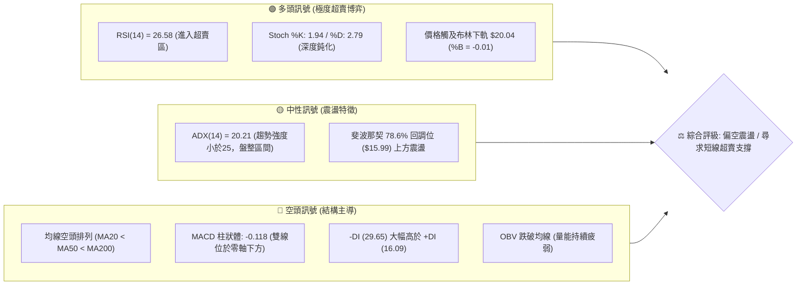
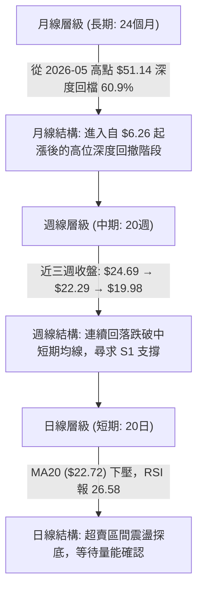
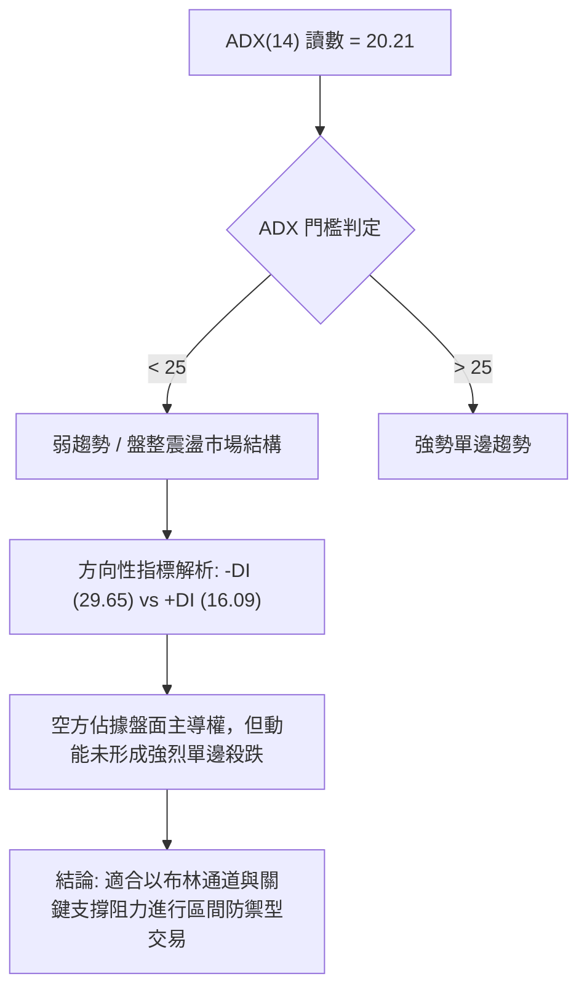
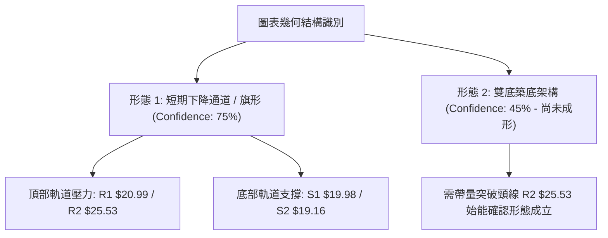
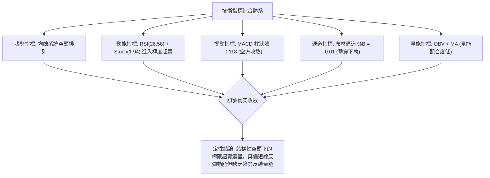
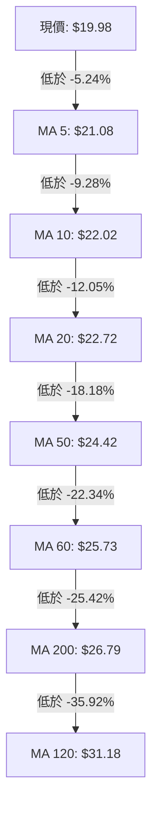
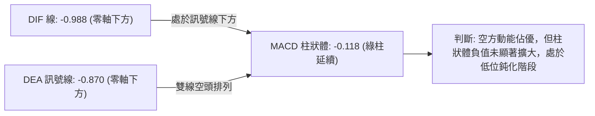
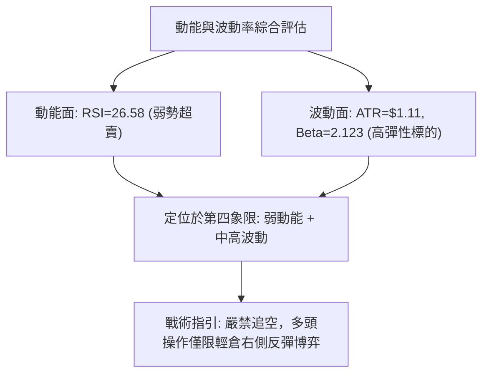
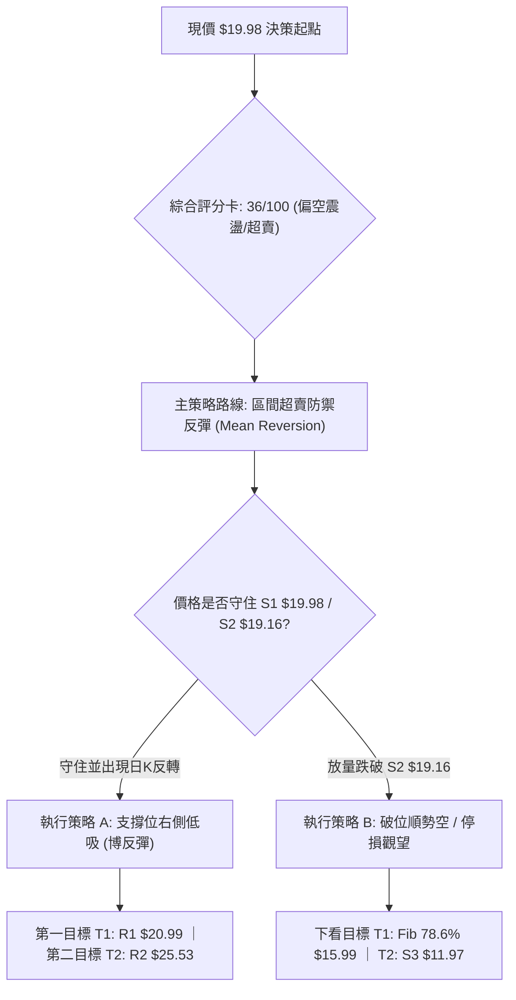
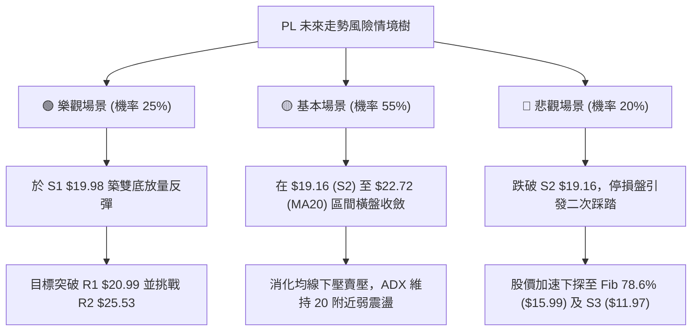

# PL 技術分析報告

> **報告日期**：2026-08-31 ｜ **語言**：繁體中文 ｜ **數據來源**：Yahoo Finance ｜ **當前價格**：$19.98

---

## 目錄

| 章節 | 內容 |
|------|------|
| [1. 技術面概覽](#1-技術面概覽) | 訊號儀表板、核心指標速覽、技術評分卡 |
| [2. 趨勢分析](#2-趨勢分析) | 多時框趨勢遞進、12個月ASCII走勢圖、ADX趨勢強度評估 |
| [3. 圖表形態分析](#3-圖表形態分析) | 形態識別信心度、關鍵K線形態、ASCII形態圖與目標價 |
| [4. 支撐與阻力](#4-支撐與阻力) | 價位結構分布圖、關鍵阻力與支撐表、斐波那契回調分析 |
| [5. 技術指標深度解讀](#5-技術指標深度解讀) | 均線系統、RSI/MACD動能背離、布林通道與OBV量價結構 |
| [6. 動能與波動率](#6-動能與波動率) | 動能四象限定位、ATR止損模型、Beta市場敏感度 |
| [7. 多時框架總結](#7-多時框架總結) | 時框架評分矩陣、多時框收斂邏輯與唯一結論 |
| [8. 交易策略建議](#8-交易策略建議) | 策略路由決策、情境階梯與機率、精確交易計劃與評星 |
| [9. 風險提示與監控](#9-風險提示與監控) | 監控指標Checklist、風險場景樹狀圖、風控規則 |
| [10. 報告總結](#10-報告總結) | 核心結論速覽卡與免責聲明 |

---

## 1. 技術面概覽

### 🎯 技術訊號儀表板



---

### 📊 核心指標速覽表

| 指標類別 | 指標名稱 | 當前數值 | 訊號 | 專業技術解讀 |
|:---|:---|:---|:---:|:---|
| **價格** | 當前收盤價 | $19.98 | 🔴 | 位於 52 週區間（$6.26–$51.76）的 30.2% 分位，處於中長期回檔深水區 |
| **均線** | 短期 MA20 | $22.72 | 🔴 | 價格低於 MA20 達 -12.05%，短期下行趨勢顯著，構成第一道動態阻力 |
| **均線** | 中期 MA50 | $24.42 | 🔴 | 價格低於 MA50 達 -18.18%，中期多空分水嶺失守 |
| **均線** | 長期 MA200 | $26.79 | 🔴 | 價格低於 MA200 達 -25.42%，長期均線正式轉為下壓阻力 |
| **動能** | RSI(14) | 26.58 | 🟢 | 進入低於 30 的超賣區間，技術性空頭回補動能隨時可能觸發 |
| **動能** | MACD (12,26,9) | -0.988 / -0.870 | 🔴 | DIF 與 DEA 雙線低於零軸且 Histogram 報 -0.118，空方動能佔優 |
| **震盪** | Stochastic %K/%D| 1.94 / 2.79 | 🟢 | 極度超賣，具備高敏感度反彈技術條件 |
| **趨勢** | ADX (14) | 20.21 | 🟡 | ADX < 25 表明非單邊強趨勢，當前屬於偏空的區間震盪整理行情 |
| **通道** | 布林帶 %B | -0.01 | 🟢 | 價格刺穿布林下軌（$20.04），通道帶寬收窄後呈現短線超賣 |
| **成交量** | 20日成交量比 | 1.65x (8.24M) | 🟡 | 伴隨回測 S1 支撐量能微幅放大，量能尚未出現結構性多頭換手 |
| **波動** | ATR(14) | $1.11 (5.58%) | 🟡 | 日內波動適中，提供風控止損與短線波段操作空間依據 |

---

### 🏆 技術評分卡

```
╔══════════════════════════════════════════════════════════════════════╗
║                    技術評分卡 — PL (Planet Labs PBC)                 ║
╠══════════════════════════════════════════════════════════════════════╣
║ 趨勢強度 (Trend)     ██████░░░░░░░░░░░░░░  30/100  🔴 空頭壓制/弱趨勢║
║ 動能指標 (Momentum)  ████████░░░░░░░░░░░░  40/100  🟡 極度超賣醞釀   ║
║ 支撐穩定度 (Support) ██████████░░░░░░░░░░  50/100  🟡 測試S1關鍵位   ║
║ 成交量配合 (Volume)  ████████░░░░░░░░░░░░  40/100  🔴 OBV低於均線    ║
║ 形態完整度 (Pattern) ████████░░░░░░░░░░░░  40/100  🔴 下降旗形整理   ║
║ 均線排列 (Moving Avg)████░░░░░░░░░░░░░░░░  20/100  🔴 標準空頭排列   ║
╠══════════════════════════════════════════════════════════════════════╣
║ 綜合技術評分         ███████░░░░░░░░░░░░░  36/100  🔴 評級：弱勢偏空 ║
╚══════════════════════════════════════════════════════════════════════╝
```

---

## 2. 趨勢分析

### 🌐 多時框趨勢分析



---

### 📈 長期趨勢 — 12個月走勢圖（ASCII）

```
PL 月線走勢圖（2025-09 至 2026-08）
價格 ($)
$52 ┤                                     ● $51.14 (2026-05 歷史高點)
$48 ┤                                    / \
$44 ┤                                   /   \
$40 ┤                             ●    /     \
$36 ┤                            / \  /       \
$32 ┤                           /   \/         ● $33.13 (2026-06)
$28 ┤                     ●    /                \
$24 ┤             ●-●    / \  /                  \
$20 ┤            /   \  /   \/                    ●-● $19.98 (現價: 2026-08)
$16 ┤     ●     /     ● $19.72 (2025-12)
$12 ┤●---/ \---● $11.90 (2025-11)
 $8 ┤
    └─┬───┬───┬───┬───┬───┬───┬───┬───┬───┬───┬───┬───► 月份
     09  10  11  12  01  02  03  04  05  06  07  08 (2025-09 → 2026-08)
```

#### 走勢階段特徵分析

| 階段區間 | 時間跨度 | 起訖價位 | 漲跌幅 | 結構形態與成交量特徵 |
|:---|:---:|:---:|:---:|:---|
| **主升啟動期** | 2025-09 至 2025-12 | $12.98 → $19.72 | +51.93% | 突破底部收斂區間，月線連陽放量上攻 |
| **次級主升段** | 2026-01 至 2026-05 | $24.97 → $51.14 | +104.81% | 2026-05 衝至高點 $51.76，週成交量放大至 6,148 萬股，RSI 達 83.2 頂部過熱 |
| **高位崩解段** | 2026-06 至 2026-07 | $51.14 → $20.48 | -59.95% | 2026-06-07 當週爆出 10,062 萬股天量下殺，高位多殺多停損出場 |
| **底部築底期** | 2026-07 至 2026-08 | $20.48 → $19.98 | -2.44% | 成交量逐步萎縮至 2,498 萬股，於 $19.16–$20.48 構築收斂整理區間 |

---

### 📊 中期趨勢（週線分析）

```
PL 近期週線壓力與支撐結構示意圖
─────────────────────────────────────────────────────────────────
[高點壓力區] $27.57 (R3) ── 2026-06-28 平台破位頸線
             $25.53 (R2) ── 2026-08-16 反彈波段高點 ($24.69~$25.53)
             $20.99 (R1) ── 近期反彈第一阻力 (MA5 附近)
─────────────────────────────────────────────────────────────────
[當前價格]   $19.98 (現價 / S1 支撐聚類)
─────────────────────────────────────────────────────────────────
[下方支撐區] $19.16 (S2) ── 近一年波段次級低點
             $15.99 (Fib 78.6%) ── 52週極端回調強支撐位
             $11.97 (S3) ── 2025-11 波段啟動平台支撐
─────────────────────────────────────────────────────────────────
```

---

### ⚡ 趨勢強度評估（ADX 解讀）



| 指標名稱 | 當前讀數 | 門檻區間 | 趨勢判定 | 交易意涵 |
|:---|:---:|:---:|:---:|:---|
| **ADX (14)** | **20.21** | < 25 (弱趨勢) | 處於無序/震盪收斂行情 | 單邊做空追殺風險較大，行情易在支撐位發生抵抗性反彈 |
| **+DI (14)** | **16.09** | 多方力量 | 處於弱勢壓制狀態 | 多方買盤不足以發動持續性趨勢行情 |
| **-DI (14)** | **29.65** | 空方力量 | 空方主導控制線 | 空方佔優但未達狂熱狀態（未突破 40） |

---

## 3. 圖表形態分析

### 🔍 形態識別系統



#### 形態信心度評估表

| 識別形態 | 信心度 | 判斷依據（引用精確數據） | 完成度 | 目標價測算（附精確計算式） |
|:---|:---:|:---|:---:|:---|
| **短期下降旗形** | **75%** | 自 2026-08-16 高點 $24.69 回落至 $19.98，量能逐週萎縮（2,851萬 → 2,498萬股） | **85%** | 若向下破位：$19.98 - ($24.69 - $19.98) = **$15.27** (逼近 Fib 78.6% $15.99) |
| **雙重底 (W底) 雛形** | **45%** | 2026-07-26 形成第一低點 $20.47，2026-08-30 二次探底 $19.98 | **35%** | 頸線為 $24.69。若突破：頸線 $24.69 + 形態高度 ($24.69 - $19.98 = $4.71) = **$29.40** (逼近 Fib 50% $29.01) |

> 註：由於雙底形態完成度僅 35%，信心度低於 50%，依嚴格規則僅列為技術監控，不作為主要突破進場基礎，當前盤面以指標超賣震盪解讀為主。

---

### 🕯️ 重要 K 線形態分析

| 週/月週期 | 收盤價 | 核心 K 線形態 | 專業技術解讀 | 訊號 |
|:---|:---:|:---|:---|:---:|
| **2026-05 月線** | $51.14 | 長上影流星線 (52W High $51.76) | 衝高乏力，多頭力量衰竭，奠定中長期見頂結構 | 🔴 |
| **2026-06-07 週線** | $32.22 | 巨量長黑破位陰線 (1.006億股) | 跌破 20 週均線支撐，主力資金大幅出逃 | 🔴 |
| **2026-07-26 週線** | $20.47 | 探底長下影十字星 (RSI=10.2) | 極端恐慌盤湧出，空頭動能初次衰竭 | 🟢 |
| **2026-08-16 週線** | $24.69 | 中陽線遇阻回落 (受阻於 R2 $25.53) | 超賣反彈遭遇 MA20 下壓阻力，形成反彈波段頂點 | 🟡 |
| **2026-08-30 週線** | $19.98 | 實體收縮陰線 (測試 S1 $19.98) | 縮量二探支撐，波動率壓縮，面臨方向抉擇 | 🟡 |

---

### 📉 ASCII 走勢形態示意圖

```
PL 近期波段下降旗形與二探支撐示意圖
價格 ($)
$26.00 ┤                     ● 2026-08-16 反彈高點 ($24.69)
$25.00 ┤                    / \
$24.00 ┤                   /   \
$23.00 ┤                  /     \  ◄ 下降通道上軌 (壓力線)
$22.00 ┤                 /       ● 2026-08-23 ($22.29)
$21.00 ┤   ● 2026-07-05 /         \
$20.00 ┤──/─\───────────●──────────● $19.98 (現價: 測試 S1/S2 支撐)
$19.00 ┤ /   ● 2026-07-26 ($20.47)
       └─┬──────────────┬──────────┬────────► 時間軸
       2026-07-05    2026-07-26  2026-08-30
```

---

## 4. 支撐與阻力

### 🗺️ 關鍵價位分布圖（ASCII）

```
PL 關鍵價位結構分布圖 (2026-08-31)
══════════════════════════════════════════════════════════════════════
 $27.57 ║████████████████████████████████████║ 強阻力 R3 (前期破位頸線)
 $25.53 ║████████████████████████            ║ 重要阻力 R2 (反彈高點聚類/MA60)
 $20.99 ║██████████████                      ║ 近期阻力 R1 (短期均線 MA5 阻力)
 $19.98 ╠════════════════════════════════════╣ ◄ 現價 ($19.98) / 支撐 S1
 $19.16 ║▓▓▓▓▓▓▓▓▓▓▓▓▓▓▓▓▓▓                  ║ 強支撐 S2 (近一年波段低點聚類)
 $15.99 ║▓▓▓▓▓▓▓▓▓▓                          ║ 關鍵回調 (Fibonacci 78.6%)
 $11.97 ║████████████████████████████████████║ 極限支撐 S3 (2025-11 啟動平台)
══════════════════════════════════════════════════════════════════════
```

---

### 🚧 阻力位分析表

| 阻力級別 | 價位 | 形成原因（依據數據聚類） | 突破難度 | 重要性評級 |
|:---|:---:|:---|:---:|:---:|
| **阻力 R1** | **$20.99** | 近一年波段反彈第一阻力，MA5 ($21.08) 動態重疊區 | 中等 | 🟡 短線多空強弱分界點 |
| **阻力 R2** | **$25.53** | 2026-08-16 反彈波段高點聚類，布林上軌 ($25.39) 與 MA60 重合 | 極高 | 🔴 中期多頭反轉關鍵頸線 |
| **阻力 R3** | **$27.57** | 2026-06 平台破位低點聚類，MA200 ($26.79) 密集成交區 | 極高 | 🔴 長期結構多空分水嶺 |

---

### 🛡️ 支撐位分析表

| 支撐級別 | 價位 | 形成原因（依據數據聚類） | 守住機率 | 重要性評級 |
|:---|:---:|:---|:---:|:---:|
| **支撐 S1** | **$19.98** | 當前收盤價位點，布林下軌 ($20.04) 支撐處 | 55% | 🟡 超賣反彈的第一道防線 |
| **支撐 S2** | **$19.16** | 近一年波段低點聚類，52週前波箱體底部 | 65% | 🟢 多頭短線防禦底線 |
| **支撐 S3** | **$11.97** | 2025-11 月線主升浪啟動前的放量平台支撐 | 85% | 🟢 長期基本面防禦極限 |

---

### 📐 斐波那契回調位分析

依據 52 週極值區間（低點 **$6.26** → 高點 **$51.76**，振幅 $45.50）精確回調位分布如下：

```
0.0%  (52W High) ───────────────────────── $51.76
23.6% 回調位     ───────────────────────── $41.02
38.2% 回調位     ───────────────────────── $34.38
50.0% 回調位     ───────────────────────── $29.01
61.8% 黃金分割   ───────────────────────── $23.64 (黃金分割防線失守)
─────────────────────────────────────────────────
[當前位置]       ◄ $19.98 (落於 61.8% 與 78.6% 深度回調區間)
─────────────────────────────────────────────────
78.6% 極限回調   ───────────────────────── $15.99
100.0%(52W Low)  ───────────────────────── $6.26
```

#### 技術含義解讀
當前現價 **$19.98** 處於 61.8%（$23.64）與 78.6%（$15.99）之間。在道氏與斐波那契波浪理論中，跌破 61.8% 意味著先前的多頭上升波已被完全破壞，當前行情屬於「深度修正重構期」。78.6% 回調位 **$15.99** 是防止股價全數回吐 2025 年起漲幅度的最後一道關鍵技術防線。

---

## 5. 技術指標深度解讀

### 🎛️ 指標訊號總覽



---

### 📈 移動平均線排列分析



| 均線名稱 | 數值 | 與現價偏離度 | 走勢微型圖 | 均線角色與狀態解讀 |
|:---|:---:|:---:|:---:|:---|
| **MA 5** | $21.08 | -5.24% | ▇▆▅▄▃▂ | 短線急速下壓，第一動態壓力 |
| **MA 10** | $22.02 | -9.28% | █▇▆▄▃▂ | 短期下行趨勢線 |
| **MA 20** | $22.72 | -12.05% | ██▇▆▅▃ | 月線布林中軌，短線多空分水嶺 |
| **MA 50** | $24.42 | -18.18% | ▇▆▅▄▃▂ | 中期趨勢防線，呈現典型空頭排列 |
| **MA 60** | $25.73 | -22.34% | ████▇▆ | 季線阻力區，貼近 R2 阻力 $25.53 |
| **MA 200** | $26.79 | -25.42% | ▂▃▄▅▆▇ | 長期年線下行，宣告長期牛市結構轉弱 |

---

### 📉 RSI(14) 分析

- **當前讀數**：`26.58`
- **狀態進度條**：
  ```
  超賣區 (0-30)          中性平衡區 (30-70)          超買區 (70-100)
  [████████░░░░░░░░░░░░░░░░░░░░░░░░░░░░░░░░░░░░░░░░] 26.58
  ```
- **超買超賣判定**：RSI 跌破 30 進入嚴格超賣區間，反映短線拋壓過度釋放。
- **背離分析結論**：
  - **價格趨勢**：2026-07-26 週收盤 $20.47（RSI = 10.2）→ 2026-08-30 週收盤 $19.98（RSI = 26.6）。
  - **指標表現**：價格創出微幅新低（$19.98 < $20.47），但週線 RSI 顯著墊高（26.6 > 10.2）。
  - **結論**：週線級別出現**隱性底背離（Bullish Divergence）雛形**，顯示空頭下殺動能正出現邊際衰減，支持在此處尋求超跌技術反彈。

---

### 📊 MACD(12,26,9) 訊號解讀



---

### 📦 布林通道分析（ASCII）

```
PL 布林通道結構示意圖 (Bollinger Bands 20, 2)
══════════════════════════════════════════════════════════════════════
 $25.39 ────────────────────────────────────────── 布林上軌 (Upper Band)
                     ▲
                     │
                     │  帶寬區間 = $5.35 (震盪寬度 26.8%)
                     │
 $22.72 ────────────────────────────────────────── 布林中軌 (MA20 / Middle)
                     │
                     │
 $20.04 ────────────────────────────────────────── 布林下軌 (Lower Band)
 $19.98 ──► ● [現價位於下軌下方，%B = -0.01]
══════════════════════════════════════════════════════════════════════
```

- **%B 指標解析**：當前 %B 數值為 **-0.01**（< 0.0），股價實體已跌破布林下軌（$20.04）。
- **統計學意涵**：在常態分佈下，價格運行於布林帶外的機率小於 5%，顯示當前處於短期均值回歸的極限邊界。

---

### 💹 成交量分析（量價配合度與 OBV）

- **量比與均量結構**：
  - 最新單日成交量：**8,243,700 股**
  - 20 日均量：**4,989,330 股**（量比 **1.65x**）
  - 50 日均量：**8,513,752 股**
- **OBV 能量潮解讀**：數據明確指示 `OBV < MA`，能量潮處於均線下方震盪下行。這代表反彈過程缺乏持續性的主動性買盤，機構吸籌跡象不明顯，量能尚未與價格超賣形成強烈多頭共振。

---

## 6. 動能與波動率

### ⚡ 動能評估四象限

| 象限分區 | 動能強度 (RSI/MACD) | 波動率水準 (ATR/BBW) | PL 當前落點 | 專業操作策略建議 |
|:---:|:---:|:---:|:---:|:---|
| **第一象限 (Q1)** | 強動能 (Bullish) | 低波動 (Low Vol) | ─ | 趨勢持股加碼區 |
| **第二象限 (Q2)** | 弱動能 (Bearish) | 低波動 (Low Vol) | ─ | 橫盤打底觀望區 |
| **第三象限 (Q3)** | 強動能 (Bullish) | 高波動 (High Vol) | ─ | 突破追價強勢區 |
| **第四象限 (Q4)** | **弱動能 (Bearish)** | **高/中波動 (High Vol)** | **✓ (當前狀態)** | **防禦觀望 / 嚴設停損之超賣博弈** |



---

### 📊 ATR 波動率分析

- **ATR(14) 絕對數值**：**$1.11**
- **ATR 佔比 (ATR% of Price)**：**5.58%**（屬於高日度波動股票）
- **止損與風控參數設定建議**：
  - **超短線日間止損 (1.0x ATR)**：$19.98 - $1.11 = **$18.87**
  - **波段交易安全止損 (1.5x ATR)**：$19.98 - ($1.11 × 1.5) = $19.98 - $1.67 = **$18.31**
  - **防守波段停損 (2.0x ATR)**：$19.98 - ($1.11 × 2.0) = **$17.76**

---

### 📐 Beta 與市場相關性

- **Beta 係數**：**2.123**
- **市場特徵解析**：PL 具備極高的市場貝他值（> 2.0），當標普 500 或納斯達克波動 1% 時，PL 預期同向波動約 2.12%。在高波動屬性下，當前處於弱勢整理期，若大盤出現回檔，個股跌幅容易放大；反之若大盤反彈，個股具備較高的超跌彈性。

---

## 7. 多時框架總結

### 📋 時框架評分表

| 時框架 | 趨勢方向 | 動能狀態 | 均線排列 | 圖表形態 | 綜合評分 | 戰略建議 |
|:---|:---:|:---:|:---:|:---:|:---:|:---|
| **月線 (長期)** | 🟡 震盪回調 | 🔴 漲勢趨緩 | 🟡 跌破MA120 | 深度回撤 60% | **45/100** | 長線資金分批定投觀察 |
| **週線 (中期)** | 🔴 下行趨勢 | 🟡 超賣底背離 | 🔴 MA20<MA50 | 測試 S1 支撐 | **35/100** | 嚴控倉位，等待站穩 S1 |
| **日線 (短期)** | 🔴 偏弱震盪 | 🟢 RSI 極度超賣 | 🔴 空頭排列 | 布林下軌刺穿 | **38/100** | 僅適合極輕倉搏超賣反彈 |

---

### 🔲 綜合訊號矩陣

```
時框協同性分析矩陣
─────────────────────────────────────────────────────────────────
訊號維度          日線 (短期)        週線 (中期)        月線 (長期)
─────────────────────────────────────────────────────────────────
趨勢方向          🔴 偏空震盪        🔴 下行波段        🟡 回調洗盤
動能指標          🟢 超賣 (RSI 26)   🟢 底背離醞釀      🔴 動能減退
均線排列          🔴 空頭排列        🔴 空頭排列        🟡 長期均線糾纏
量價結構          🟡 縮量測試        🔴 破位放量        🟢 底部總量充沛
─────────────────────────────────────────────────────────────────
共振狀態：日/週/月未形成多頭共振；短期動能指標與結構趨勢出現「指標超賣 vs 趨勢空頭」背離。
─────────────────────────────────────────────────────────────────
```

---

### ⚖️ 多時框收斂結論

依據多時框收斂規則：
1. **行情屬性判定**：當前 ADX(14) 數值為 **20.21**（小於 25 臨界值），明確定義當前市場為**弱趨勢 / 盤整震盪行情**，而非強單邊趨勢。
2. **主導時框收斂**：在 ADX < 25 的盤整結構中，日線布林通道上下軌（$20.04–$25.39）與歷史波段支撐阻力為核心交易依據。
3. **唯一方向性結論**：**【弱勢偏空震盪，等待超賣止跌確認】**。整體趨勢處於均線空頭排列壓制下，但因日線與週線動能指標（RSI=26.58、Stoch %K=1.94、布林 %B=-0.01）已達極度超賣邊界，空頭追殺勝率偏低。因此主策略定調為**區間防禦型操作：以防守支撐 S2 ($19.16) 為基準，博弈向布林中軌 MA20 ($22.72) 及 R1 ($20.99) 的超跌均值回歸反彈**。

---

## 8. 交易策略建議

### 🗺️ 策略決策流程圖



---

### 🧭 策略路由

> **當前主策略方向 = 【防禦型區間多頭反彈 / 嚴控停損】（依技術綜合評分 36/100，定位為超賣均值回歸交易）**

由於評分卡為 36/100 處於偏空但動能指標全線進入歷史極值超賣區，空單追空盈虧比極差（下行空間面臨 S2 $19.16 聚類支撐），因此主策略採取**小倉位右側超賣反彈策略**，同時將**跌破 S2 ($19.16) 設定為全面轉空對沖的防禦觸發點**。

---

### 🎯 價格情境階梯（Price Scenarios）

| 觸發條件 | 第一目標位 | 後續延伸目標 | 情境技術含義與因應措施 |
|:---|:---:|:---:|:---|
| **向上突破 R1 ($20.99)** | **R2 ($25.53)** | **R3 ($27.57)** | 短線超賣反彈確立，回補日線跳空缺口，挑戰布林上軌 |
| **守住現價區間 ($19.16–$19.98)** | **MA20 ($22.72)** | **R1 ($20.99)** | 在布林下軌處構築雙底，維持弱勢區間震盪整理 |
| **有效跌破 S2 ($19.16)** | **$15.99 (Fib 78.6%)**| **S3 ($11.97)** | 支撐徹底失守，空頭擴展下行空間，所有多單無條件止損 |

---

### 📊 情境機率分佈

```
情境機率分佈圓形示意
┌────────────────────────────────────────────────────────┐
│  🟢 守住支撐超跌反彈 (45%)  ██████████████████         │
│  🟡 弱勢區間震盪整理 (35%)  ██████████████             │
│  🔴 破位向下探底尋底 (20%)  ████████                   │
└────────────────────────────────────────────────────────┘
```

| 預測情境 | 發生機率 | 主要技術依據 |
|:---|:---:|:---|
| **守住支撐超跌反彈** | **45%** | RSI 報 26.58 處於極度超賣區；週線出現底背離雛形；價格觸及布林下軌 |
| **弱勢區間震盪整理** | **35%** | ADX 讀數僅 20.21（無單邊動能）；OBV 量能低迷，買賣雙方動能陷入僵局 |
| **破位向下探底尋底** | **20%** | 均線全線空頭排列（MA20 < MA50 < MA200）；機構評級轉向中性 |

---

### 🟢 主策略詳情

| 交易策略要素 | 策略 A（保守型：右側突破進場） | 策略 B（激進型：左側支撐低吸） |
|:---|:---|:---|
| **交易方向** | 多頭（超賣均值回歸反彈） | 多頭（支撐位博弈） |
| **進場條件** | 日 K 線收盤站穩 **R1 $20.99** 上方且放量 | 價格於 **$19.16–$19.98** 區間出現長下影線 |
| **精確進場價格** | **$21.00** | **$19.98**（當前市價） |
| **目標價 T1** | **$22.72** (MA20 / 布林中軌) | **$20.99** (R1 阻力位) |
| **目標價 T2** | **$25.53** (R2 重要阻力 / 布林上軌) | **$22.72** (MA20 均線) |
| **嚴格止損價格** | **$19.80** (跌破進場點下方 ATR 緩衝) | **$19.10** (跌破 S2 $19.16 關鍵支撐) |
| **風險報酬比 (R:R)**| **1 : 3.78** (以 T2 計算：風險 $1.20 / 報酬 $4.53) | **1 : 3.11** (以 T2 計算：風險 $0.88 / 報酬 $2.74) |
| **預估勝率** | **55%** | **45%** |
| **建議配置倉位** | **總資金之 5%–8% (輕倉)** | **總資金之 3%–5% (極輕倉)** |

---

### 🔴 反向風險觸發點（對沖與轉空提示）

若出現以下訊號，宣告多頭反彈失敗，應立即執行止損並可啟動防禦性做空：
1. **破位觸發價**：日線收盤價跌破 **S2 $19.16**。
2. **量能確認**：跌破 $19.16 當日成交量超過 50 日均量（> 8.51M 股）。
3. **空頭目標**：第一下行目標為 **$15.99**（斐波那契 78.6%），極端目標為 **$11.97**（S3 支撐）。
4. **空頭止損點**：若反手做空，止損價設定於 **$20.99**（R1 阻力位上方）。

---

### ⭐ 整體訊號強度評星

```
╔══════════════════════════════════════════════════════════════════════╗
║ 做多訊號強度：  ★★☆☆☆  (2.5/5 星 - 屬於超賣逆勢博弈，非趨勢多頭)     ║
║ 做空訊號強度：  ★★★☆☆  (3.0/5 星 - 順應均線趨勢，但受限於極度超賣)   ║
║ 整體可信度：    ★★★☆☆  (3.5/5 星 - 價位明確，等待量能突破方向確認)   ║
╚══════════════════════════════════════════════════════════════════════╝
```

---

## 9. 風險提示與監控

### ✅ 關鍵監控指標 Checklist

```
╔══════════════════════════════════════════════════════════════════════╗
║                     每日/每週技術面監控清單 (Checklist)              ║
╠══════════════════════════════════════════════════════════════════════╣
║ [ ] 價格是否跌破 S2 關鍵防線 $19.16？ (是 ➔ 立即止損並清空多單)      ║
║ [ ] RSI(14) 是否脫離 30 以下超賣區並向上突破 40？ (是 ➔ 短線轉強)   ║
║ [ ] 單日成交量是否放大至 20日均量 1.5 倍 (7.5M 股以上) 且收紅K？    ║
║ [ ] 價格能否放量收復短期 MA20 ($22.72)？ (是 ➔ 空頭排列初次瓦解)     ║
║ [ ] ADX 是否自 20.21 開始拉升突破 25？ (確認是否形成新單邊行情)     ║
║ [ ] MACD Histogram 是否由負轉正 (-0.118 ➔ > 0) 出現黃金交叉？       ║
╚══════════════════════════════════════════════════════════════════════╝
```

---

### ⚠️ 風險場景分析



---

### 🛡️ 風險管理重要提醒

1. **Beta 與波動風控**：PL 當前 Beta 達 **2.123**，ATR 佔比達 **5.58%**，屬於高波動品種。任何單筆交易之最大虧損金額嚴格限制於總投資組合淨值的 **1.0%** 以內。
2. **反彈非反轉**：在 MA20 ($22.72)、MA50 ($24.42) 及 MA200 ($26.79) 呈現空頭排列的格局下，任何上漲初期均應視為「超賣技術反彈」而非「長期牛市反轉」，切忌盲目重倉追高。
3. **嚴格執行紀律**：當前收盤價 **$19.98** 即為關鍵支撐 S1，下方緩衝僅至 S2 **$19.16**（距現價 -4.10%）。若跌破 $19.16 必須果斷執行停損，嚴防深度回調至 **$15.99** 或 **$11.97**。

---

## 📋 報告總結

```
╔══════════════════════════════════════════════════════════════════════╗
║                    PL 技術分析報告核心總結卡                         ║
╠══════════════════════════════════════════════════════════════════════╣
║ 報告日期：2026-08-31                   當前價格：$19.98              ║
║ 技術評級：⚖️ 弱勢超賣 / 區間防禦       綜合評分：36 / 100            ║
╠══════════════════════════════════════════════════════════════════════╣
║ 關鍵維度診斷：                                                       ║
║ ├─ 長期趨勢：🟡 52W 高點深度回調 60.9%，處於 $6.26-$51.76 之 30.2%   ║
║ ├─ 中期趨勢：🔴 均線空頭排列 (MA20 < MA50 < MA200)，下行尋求支撐     ║
║ ├─ 短期趨勢：🟢 日線/週線 RSI (26.58) 極度超賣，布林下軌 (%B=-0.01) ║
║ ├─ 關鍵支撐：S1: $19.98 ｜ S2: $19.16 ｜ S3: $11.97 (極限)           ║
║ ├─ 關鍵阻力：R1: $20.99 ｜ R2: $25.53 ｜ R3: $27.57                  ║
║ └─ 機構共識：分析師平均目標價 $40.10 (最低 $25.00 / 最高 $53.00)     ║
╠══════════════════════════════════════════════════════════════════════╣
║ 最優交易策略組合：                                                   ║
║ 1. 🥇 最佳機會：右側突破策略 ── 站穩 R1 $20.99 進場，停損 $19.80，   ║
║                 目標 $22.72 / $25.53 (盈虧比 1:3.78)                 ║
║ 2. 🥈 次選機會：左側支撐策略 ── 現價 $19.98 輕倉低吸，停損 $19.10，   ║
║                 目標 $20.99 / $22.72 (盈虧比 1:3.11)                 ║
║ 3. 🥉 防守對沖：破位轉空提示 ── 若收盤跌破 S2 $19.16，停損所有多單， ║
║                 下看斐波那契 78.6% 回調位 $15.99                     ║
╚══════════════════════════════════════════════════════════════════════╝
```

---

> ⚠️ **免責聲明**：本報告為依據市場技術指標數據之量化分析結果，所有價位、阻力支撐與形態研判均基於歷史量價資訊計算。本報告**僅供學術研究與投資參考**，**不構成任何要約、招攬或具體投資買賣建議**。金融市場瞬息萬變，高 Beta 股票風險較高，投資人應獨立評估風險並自行承擔交易損益。

---
*報告生成時間：2026-08-31 ｜ 數據來源：Yahoo Finance ｜ 分析框架：多時框技術分析模型*