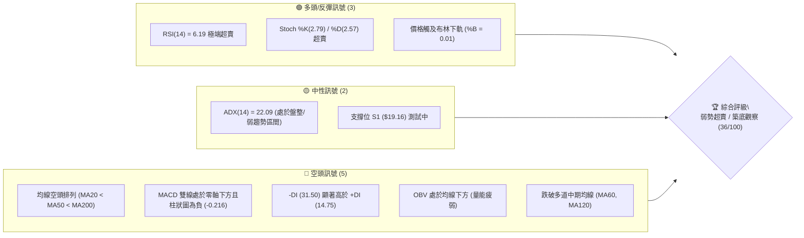
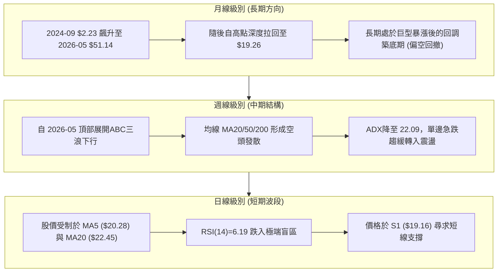
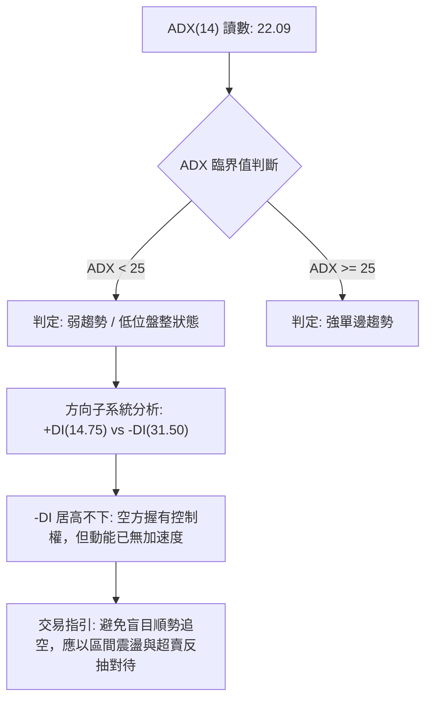
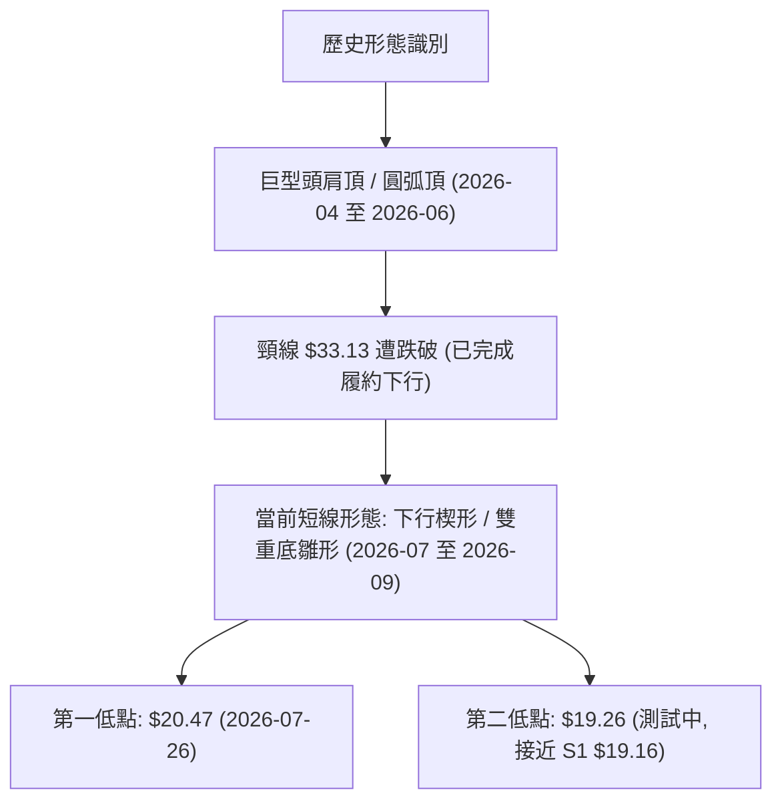
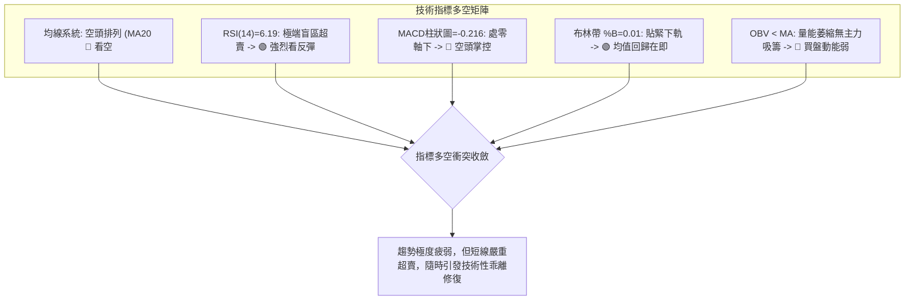
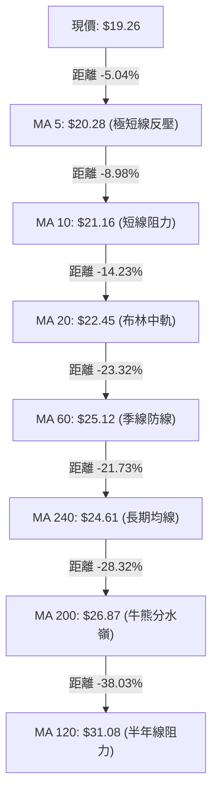
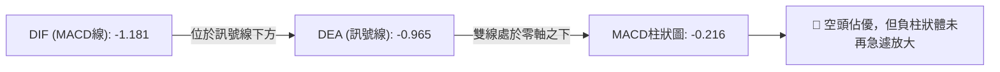
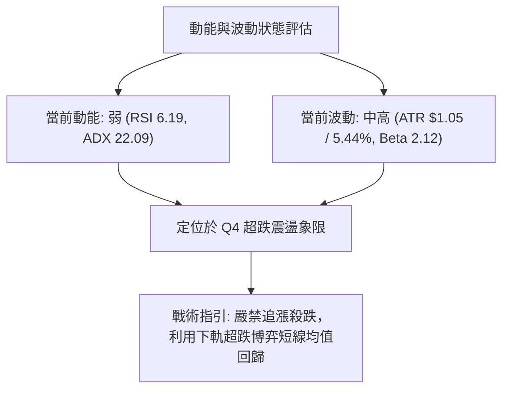
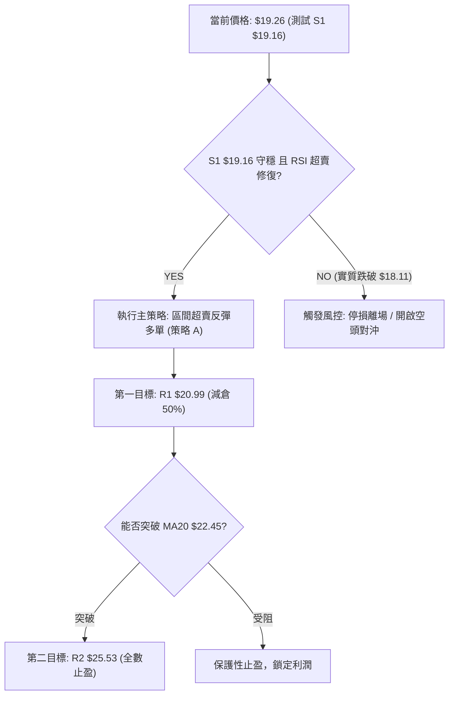
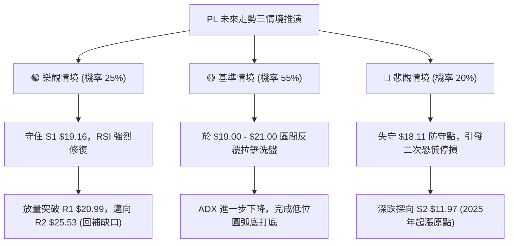

# PL 技術分析報告

> **報告日期**：2026-09-01 ｜ **語言**：繁體中文 ｜ **數據來源**：Yahoo Finance ｜ **當前價格**：$19.26

---

## 目錄

| 章節 | 內容 |
|------|------|
| [1. 技術面概覽](#1-技術面概覽) | 訊號儀表板、核心指標、評分卡 |
| [2. 趨勢分析](#2-趨勢分析) | 多時框趨勢、長中短期走勢、ADX 結構 |
| [3. 圖表形態分析](#3-圖表形態分析) | 形態識別、信心度評估、K線組合 |
| [4. 支撐與阻力](#4-支撐與阻力) | 關鍵價位、斐波那契回調結構 |
| [5. 技術指標深度解讀](#5-技術指標深度解讀) | MA系統/RSI/MACD/布林通道/成交量 |
| [6. 動能與波動率](#6-動能與波動率) | 動能四象限、ATR 風險測算、Beta 敏感度 |
| [7. 多時框架總結](#7-多時框架總結) | 時框架矩陣與多時框收斂定調 |
| [8. 交易策略建議](#8-交易策略建議) | 策略路由、價格階梯、主策略與風控 |
| [9. 風險提示與監控](#9-風險提示與監控) | 監控清單、情境推演與倉位管理 |
| [10. 報告總結](#10-報告總結) | 核心結論與執行摘要 |

---

## 1. 技術面概覽

### 🎯 技術訊號儀表板



---

### 📊 核心指標速覽表

| 指標類別 | 指標名稱 | 當前數值 | 訊號 | 解讀 |
| :--- | :--- | :--- | :---: | :--- |
| **價格** | 當前收盤價 | $19.26 | 🔴 | 距離52週高點 $51.76 回撤達 62.79%，處於弱勢整理 |
| **均線** | MA20 | $22.45 | 🔴 | 股價位於 MA20 下方 -14.23%，短線下行壓力顯著 |
| **均線** | MA50 | $24.06 | 🔴 | 股價位於 MA50 下方，中期趨勢受壓制 |
| **均線** | MA200 | $26.87 | 🔴 | 股價位於長線牛熊分界線下方，整體結構偏空 |
| **動能** | RSI(14) | 6.19 | 🟢 | 進入極罕見之深度超賣區（<10），隨時具備技術性抽頭反彈動能 |
| **動能** | MACD (12,26,9) | -1.181 / -0.965 | 🔴 | MACD線位於訊號線下方，Histogram為 -0.216，空頭動能尚未收斂 |
| **動能** | Stochastic | 2.79 / 2.57 | 🟢 | %K 與 %D 同步處於 5 以下極端超賣，短線賣壓接近耗盡 |
| **趨勢強度** | ADX (14) | 22.09 | 🟡 | ADX < 25 表明單邊暴跌趨勢減速，轉入低位弱勢震盪 |
| **方向指標** | DMI (+DI / -DI)| 14.75 / 31.50 | 🔴 | -DI 大幅主導，空方力量仍占據主導地位 |
| **通道** | Bollinger %B | 0.01 | 🟢 | 股價緊貼下軌（$19.16），顯示價格被過度壓縮於極端帶 |
| **成交量** | 量比 (vs 20MA) | 1.39x | 🟡 | 成交量 7.07M 略有放大，但 OBV 趨勢偏弱，尚未見主動性吸籌放量 |
| **波動** | ATR(14) | $1.05 | 🟡 | 佔股價 5.44%，單日正常波動區間約 ±$1.05 |

---

### 🏆 技術評分卡

```
╔══════════════════════════════════════════════════════════════════╗
║                   技術評分卡 — PL (2026-09-01)                  ║
╠══════════════════════════════════════════════════════════════════╣
║ 趨勢強度 (Trend)      ██████░░░░░░░░░░░░░░  30/100  🔴 空頭主導  ║
║ 動能指標 (Momentum)   ████████░░░░░░░░░░░░  40/100  🟡 極端超賣  ║
║ 支撐穩定度 (Support)  ████████░░░░░░░░░░░░  40/100  🟡 S1測試中  ║
║ 成交量配合 (Volume)   ██████░░░░░░░░░░░░░░  30/100  🔴 缺乏買盤  ║
║ 形態完整度 (Pattern)  ████████░░░░░░░░░░░░  40/100  🟡 構築底部  ║
║ 均線排列 (Moving Avg) ████░░░░░░░░░░░░░░░░  20/100  🔴 完全空頭  ║
╠══════════════════════════════════════════════════════════════════╣
║ 綜合評分 (Total Score)███████░░░░░░░░░░░░░  34/100  🔴 偏空震盪  ║
╚══════════════════════════════════════════════════════════════════╝
```

---

## 2. 趨勢分析

### 🌐 多時框趨勢分析



---

### 📈 長期趨勢 — 12個月走勢圖（Unicode）

```
PL 月線走勢圖（過去12個月：2025-09 至 2026-09）
價格軸 ($)
$52 ┤                                      ● $51.14 (2026-05 高點)
$46 ┤                                     / \
$40 ┤                              ●     /   \
$34 ┤                             / \   /     ● $33.13 (2026-06)
$28 ┤                      ●     /   \ /       \
$22 ┤                ●    / \   ●     V         \        ● $19.26 (現價)
$16 ┤          ●    / \  /   \                   ● $20.48 \ /
$10 ┤    ●    / \  /   ● $19.72                            V $19.85
 $4 ┤   / \  /   V $11.90
 $0 └────┴────┴────┴────┴────┴────┴────┴────┴────┴────┴────┴────┴────
      09   10   11   12   01   02   03   04   05   06   07   08   09 (月份)
     '25  '25  '25  '25  '26  '26  '26  '26  '26  '26  '26  '26  '26
```

#### 走勢特徵分析表格

| 階段區間 | 時間跨度 | 起訖價位 | 漲跌幅 | 走勢特徵與量價結構解讀 |
| :--- | :--- | :--- | :---: | :--- |
| **主升浪第一階段** | 2025-09 至 2025-10 | $12.98 → $13.45 | +3.62% | 突破底部整理平台，均線多頭排列確立。 |
| **強勢拉升波段** | 2025-11 至 2026-02 | $11.90 → $24.14 | +102.86% | 突破 $20 關口，呈現高斜率主升段推進。 |
| **投機加速沖頂** | 2026-03 至 2026-05 | $27.95 → $51.14 | +82.97% | 週量爆發至 61.48M，RSI 飆至 83.2，完成歷史高點見頂。 |
| **暴跌與去槓桿** | 2026-06 至 2026-07 | $51.14 → $20.48 | -59.95% | 單週成交量破 100M 呈現恐慌踩踏，跌破所有中期均線。 |
| **弱勢低位盤整** | 2026-08 至 2026-09 | $20.48 → $19.26 | -5.96% | 波動率逐步收斂，量能萎縮，進入第一波底背離醞釀期。 |

---

### 📊 中期趨勢（週線分析）

```
PL 近期中期壓力與支撐架構圖
════════════════════════════════════════════════════════════════════
$27.57 ─── [R3 強阻力區] 近期波段密集反彈高點聚類
           ▲
$25.53 ─── [R2 中期阻力] MA60 ($25.12) / 布林上軌 ($25.74) 疊合區
           ▲
$20.99 ─── [R1 短線阻力] MA10 ($21.16) / 短期下壓趨勢線
────────────────────────────────────────────────────────────────────
$19.26 ─── 【當前價格 CURRENT PRICE】
────────────────────────────────────────────────────────────────────
$19.16 ─── [S1 近期支撐] 日線布林下軌 / 2026-08 低點聚類
           ▼
$11.97 ─── [S2 強度支撐] 2025-11 起漲突破點密集帶
           ▼
$10.52 ─── [S3 長期底線] 歷史多頭籌碼密集沉積區
════════════════════════════════════════════════════════════════════
```

---

### ⚡ 趨勢強度評估（ADX 解讀）



#### ADX 趨勢強度對照表

| 指標變數 | 當前讀數 | 門檻區間 | 趨勢屬性判定 | 交易戰術意義 |
| :--- | :---: | :---: | :---: | :--- |
| **ADX(14)** | **22.09** | 20.00 – 25.00 | **弱趨勢 / 轉入箱體震盪** | 單邊暴跌動能衰竭，進入籌碼換手與收斂三角形整理。 |
| **+DI(14)** | **14.75** | < 20.00 (極弱) | **多頭主動買盤匱乏** | 反彈多由空頭平倉引發，非增量資金主動建倉。 |
| **-DI(14)** | **31.50** | > 30.00 (偏強) | **空頭掌控盤面結構** | 任何向上反抽將面臨密集解套壓盤。 |

---

## 3. 圖表形態分析

### 🔍 形態識別系統



#### 形態識別與信心度評估表（依規則 15）

| 形態名稱 | 信心度 | 判斷依據（引用技術數據） | 完成度 | 目標價（附嚴格計算式） |
| :--- | :---: | :--- | :---: | :--- |
| **下行收斂楔形 (Falling Wedge)** | **65%** | 價格自 $31.38 回落，高點逐步降低 ($24.69 → $22.29)，低點在 $19.16 受到支撐，波動幅度收窄，ATR 由高位降至 $1.05。 | 75% | **理論上行突破目標**：<br>突破楔形上軌 $20.99 (R1) 後，向上測量形態起點高度：<br>目標 = $20.99 + ($24.69 - $19.16) = **$26.52**（逼近 MA200 $26.87 與 R3 $27.57）。 |
| **潛在雙重底 (Potential W-Bottom)** | **52%** | 第一底為 2026-07-26 收盤 $20.47，當前價格 $19.26 測試 S1 $19.16 支撐，RSI 出現極端超賣 (6.19)。 | 40% | **雙底頸線突破目標**：<br>頸線位於反彈高點 $24.69。<br>目標 = $24.69 + ($24.69 - $19.16) = **$30.22**（受阻於 MA120 $31.08）。 |
| **均線空頭瀑布 (MA Cascade)** | **88%** | MA20 ($22.45) < MA50 ($24.06) < MA200 ($26.87)，且 MA5 至 MA120 全數向下傾斜。 | 100% | **下行延續目標**：<br>若失守 S1 $19.16，則向下尋求前波中繼支撐 S2 **$11.97**。 |

---

### 🕯️ 重要K線形態分析

| 週/月週期區間 | 收盤價 | K線形態特徵 | 市場心理與多空含義 | 訊號方向 |
| :--- | :---: | :--- | :--- | :---: |
| **2026-05-31** | $51.14 | 巨量長上影天劍線 (週成交量 61.48M) | 歷史高點爆量滯漲，多頭動能消耗殆盡，主力資金高位出貨。 | 🔴 強烈看空 |
| **2026-06-07** | $32.22 | 破位跳空巨陰線 (週成交量 100.62M) | 跌破所有短期支撐，引發恐慌性停損踩踏，趨勢徹底逆轉。 | 🔴 極度看空 |
| **2026-08-16** | $24.69 | 反彈受阻流星線 (週成交量萎縮至 23.53M) | 量價背離的反彈，觸及 MA200 及 MA60 阻力後無功而返。 | 🔴 確認弱勢 |
| **2026-09-06 (即時)** | $19.26 | 觸軌十字星 / 低位錘頭雛形 (貼近下軌) | 賣盤動能衰竭，空頭已無力維持大斜率下殺，具備變盤條件。 | 🟡 變盤醞釀 |

---

### 📉 ASCII 走勢形態示意圖

```
PL 日線級別形態解析示意圖（2026-07 至 2026-09）
$26.00 ┤              ● 反彈高點 $24.69
$24.00 ┤             / \
$22.00 ┤            /   \       ● 次高點 $22.29
$20.00 ┤  ● $20.47 /     \     / \
$19.00 ┤   \      /       \   /   ● 破位下壓
$18.00 ┤    \____/         \_/_____● 現價 $19.26 (測試支撐線 S1: $19.16)
       └──────┬──────────────┬──────────────┬──────────────►
            底 1 (07/26)    反彈頸線 ($24.69)  底 2 構築中 (09/01)
       [──────── 潛在雙底 / 楔形收斂區間 ────────]
```

---

## 4. 支撐與阻力

### 🗺️ 關鍵價位分布圖（Unicode）

```
PL 價位結構分布圖 (Resistance & Support Cluster)
═══════════════════════════════════════════════════════════════════
$27.57 ║██████████████████████████████║ 強阻力 R3 (近一年密集套牢峰)
$25.53 ║████████████████████░░░░░░░░░░║ 阻力 R2 (MA60 / 61.8%回調位共振)
$20.99 ║████████████░░░░░░░░░░░░░░░░░░║ 關鍵阻力 R1 (MA10 / 短線壓力線)
═══════════════════════════════════════════════════════════════════
$19.26 ╠══════════════════════════════╣ ◄ 當前價格 CURRENT PRICE
═══════════════════════════════════════════════════════════════════
$19.16 ║▓▓▓▓▓▓▓▓▓▓▓▓▓▓▓▓▓▓▓▓▓▓▓▓▓▓▓▓▓▓║ 近期支撐 S1 (布林下軌 / 波段低點)
$11.97 ║██████████████████████████████║ 強支撐 S2 (2025-11 啟動平台)
$10.52 ║██████████████████████████████║ 核心底部 S3 (歷史籌碼密集護城河)
═══════════════════════════════════════════════════════════════════
```

---

### 🚧 阻力位分析表

| 阻力級別 | 價位 | 形成原因（波段高點聚類與指標共振） | 突破難度 | 重要性評級 |
| :---: | :---: | :--- | :---: | :---: |
| **R1** | **$20.99** | 短線波段反彈阻力位，緊鄰 MA10 ($21.16) 及 5日均線 ($20.28)。突破此位方能確認短線止跌。 | 🟡 中等 | ★★★☆☆ |
| **R2** | **$25.53** | 近一年次級反彈高點聚類區，與 MA60 ($25.12)、布林上軌 ($25.74) 形成共振阻力帶。 | 🔴 較高 | ★★★★☆ |
| **R3** | **$27.57** | 2026-03 突破平台與中期重要防線，MA200 ($26.87) 亦座落於此區域下方，屬強阻力。 | 🔴 極高 | ★★★★★ |

---

### 🛡️ 支撐位分析表

| 支撐級別 | 價位 | 形成原因（波段低點聚類與指標共振） | 守住機率 | 重要性評級 |
| :---: | :---: | :--- | :---: | :---: |
| **S1** | **$19.16** | 近一年波段低點聚類，精確重合當前布林帶下軌 ($19.16)。現價距其僅 -0.52%，短線核心生命線。 | 🟡 60% | ★★★★☆ |
| **S2** | **$11.97** | 2025-11 歷史大波段起漲原點，具備強力歷史籌碼承接盤，屬中長線結構性防禦底線。 | 🟢 85% | ★★★★★ |
| **S3** | **$10.52** | 2025下半年大型箱體底部下沿聚類區，終極防禦支撐位。 | 🟢 95% | ★★★★☆ |

---

### 📐 斐波那契回調位分析

> 計算基準：52週波段區間最低點 **$6.26** → 最高點 **$51.76**（垂直落差 $\Delta = \$45.50$）

```
斐波那契回調結構分佈 ($6.26 → $51.76)
  0.0% (52W High)  $51.76 ── 頂部極限
 23.6%             $41.02 ── 破位下行
 38.2%             $34.38 ── 中期頸線
 50.0%             $29.01 ── 多空分水嶺
 61.8%             $23.64 ── 黃金分割關鍵反壓 (位於 MA50 $24.06 附近)
══════════════════════════════════════════════════════════════════
 78.6%             $15.99 ── 深度回撤極限支撐
══════════════════════════════════════════════════════════════════
100.0% (52W Low)   $ 6.26 ── 歷史原點

  [當前價格 $19.26 處於 61.8% ($23.64) 與 78.6% ($15.99) 回調區間內]
```

- **位置解讀**：現價 $19.26 已經有效跌破 61.8% 黃金分割回撤位（$23.64），目前運行於 61.8% 至 78.6%（$15.99）的深度超跌緩衝帶。
- **技術意義**：若 S1（$19.16）獲得支撐並啟動反抽，上方 61.8% 回調位 $23.64 將轉化為第一道強大反壓；若 S1 實質跌破，則價格將滑向 78.6% 斐波那契回調位 $15.99 及波段支撐 S2（$11.97）。

---

## 5. 技術指標深度解讀

### 🎛️ 指標訊號總覽



---

### 📈 移動平均線排列分析



- **均線狀態解讀**：MA5 < MA10 < MA20 < MA50 < MA200，標準「空頭發散瀑布排列」。
- **乖離率分析**：股價與 MA20 的負乖離率高達 **-14.23%**，與 MA60 負乖離率達 **-23.32%**。歷史經驗表明，當負乖離率超過 -15% 時，下行速率往往會顯著放緩，引發均線收斂修復行情。

---

### 📉 RSI(14) 分析

```
RSI(14) 強度計：
0 ──[ 6.19 ]────────── 30 ──────────────── 70 ──────────────── 100
[██░░░░░░░░░░░░░░░░░░░░░░░░░░░░░░░░░] 6.19 (極度超賣區間 EXTREME OVERSOLD)
```

- **超買超賣判定**：RSI(14) 讀數為 **6.19**，已進入歷史罕見的「極端恐慌拋售區」（<10）。
- **背離判斷**：
  - 價格自 2026-07-26 的 $20.47 緩步滑落至當前 $19.26（創新低）。
  - 週線 RSI 由 2026-07-26 的 10.2 降至 6.2，日線層面暫**無明顯底背離**（數據顯示「RSI背離：無明顯背離」）。
  - **結論**：超賣不等於立即反轉，但極端數值意味著任何微小的買盤介入都可能引發劇烈的報復性脈衝反抽。

---

### 📊 MACD(12,26,9) 訊號解讀



- **MACD 解讀**：DIF（-1.181）與 DEA（-0.965）雙雙深度跌入負值區，顯示自 5月份以來的空頭波段仍未結束。柱狀圖讀數為 -0.216，表明短線空頭下殺動能仍在釋放，但斜率較 6月份（當時負柱高達 -1.972）已大幅收斂。

---

### 📦 布林通道分析

```
PL 日線布林通道結構 (Bollinger Bands 20, 2)
$25.74 ┬───────────────────────────────── BB 上軌 (Upper Band)
       │
$22.45 ┼ - - - - - - - - - - - - - - - -  BB 中軌 (MA20 Baseline)
       │
$19.26 ┼ ◄── 當前價格 ($19.26, %B = 0.01)
$19.16 ┴───────────────────────────────── BB 下軌 (Lower Band)
```

- **帶寬與位置**：上軌 $25.74，下軌 $19.16，通道寬度 $6.58（帶寬約 29.3%）。
- **%B 指標解讀**：%B 現值為 **0.01**，代表股價已幾乎與布林下軌（$19.16）完全重合。根據布林通道統計學常態分佈原理，價格連續多日脫軌運行的機率低於 5%，預示著短期將產生向中軌（$22.45）靠攏的均值回歸引力。

---

### 💹 成交量分析（量價配合度）

- **量能數據**：最新成交量 7,071,702 股，高於 20日均量 5,080,660 股（量比 **1.39x**），但低於 50日均量 8,142,104 股。
- **OBV 趨勢解讀**：OBV 指標持續位於其均線下方，顯示當前下行過程中的成交量依然由被動賣盤構成，未出現機構資金大規模進場「爆量吸籌」的底背離結構，量價配合度評級為 **🔴 疲弱**。

---

## 6. 動能與波動率

### ⚡ 動能評估四象限

| 象限代號 | 動能強度 | 波動率水準 | 當前狀態 | 戰術策略解讀 |
| :---: | :---: | :---: | :---: | :--- |
| **Q1** | 強動能 (Bull) | 低波動 (Low Vol) | ❌ | 最佳牛市穩健推進期（不適用於 PL）。 |
| **Q2** | 弱動能 (Bear) | 低波動 (Low Vol) | ❌ | 陰跌或無量死水盤（不適用於 PL）。 |
| **Q3** | 強動能 (Trend) | 高波動 (High Vol) | ❌ | 主升浪或主跌浪加速期（已過去）。 |
| **Q4** | **弱動能 (Oversold)** | **中高波動 (Mod Vol)** | **✓ (當前狀態)** | **超跌震盪與尋底期**：動能嚴重鈍化（RSI 6.19），ATR 佔比達 5.44%，股價高彈性震盪，適合區間嚴格風控操作。 |



---

### 📊 ATR 波動率分析

- **ATR(14) 數值**：**$1.05**（佔當前股價 $19.26 之 **5.44%**）。
- **風控止損建議**：
  - **超短線/日內交易**：1.0 × ATR = **$1.05** 止損寬度。
  - **波段交易 (Swing Trade)**：1.5 × ATR = **$1.58** 止損寬度。
  - **極限安全防守距離**：若自 S1（$19.16）向下設定止損，臨界防守點為 $\$19.16 - \$1.05 = \mathbf{\$18.11}$。

---

### 📐 Beta 與市場相關性

- **Beta 係數**：**2.123**（高彈性/高風險標的）。
- **市場意涵**：PL 的股價波動率為標普500指數（S&P 500）的 2.12 倍。當大盤反彈 1% 時，PL 理論上具備上漲 2.12% 的彈性；反之亦然。在建構部位時，倉位規模應較一般權值股縮減 40%–50%，以平衡高 Beta 帶來的淨值波動。

---

## 7. 多時框架總結

### 📋 時框架評分表

| 時框架 | 趨勢方向 | 動能狀態 | 均線排列 | 形態結構 | 綜合評分 | 戰術建議 |
| :---: | :---: | :---: | :---: | :---: | :---: | :--- |
| **長期 (月線)** | 🔴 偏空回撤 | 🟡 中性降溫 | 🟡 測試基期均線 | 巨頂破位後回調 | **38/100** | 觀望，等待長線底部確立 |
| **中期 (週線)** | 🔴 下行趨勢 | 🔴 空頭掌控 | 🔴 均線空頭排列 | 尋求雙底結構 | **32/100** | 逢高減倉，不盲目長線做多 |
| **短期 (日線)** | 🟡 超賣震盪 | 🟢 極端超賣 | 🔴 負乖離過大 | 觸及下軌/楔形下沿 | **42/100** | 具備超短線反彈博弈價值 |

---

### 🔲 綜合訊號矩陣

```
時框訊號一致性矩陣 (Timeframe Signal Matrix)
╔═════════════╦════════════╦════════════╦════════════╦═════════════╗
║   時框架    ║  趨勢維度  ║  動能維度  ║  均線維度  ║  形態維度   ║
╠═════════════╬════════════╬════════════╬════════════╬═════════════╣
║ 長期 (Monthly)║ 🔴 下行修復 ║ 🟡 動能收斂 ║ 🟡 MA240上方║ 🔴 高位破位  ║
║ 中期 (Weekly) ║ 🔴 空頭主導 ║ 🔴 MACD死叉║ 🔴 空頭發散 ║ 🟡 潛在雙底  ║
║ 短期 (Daily)  ║ 🟡 震盪築底 ║ 🟢 RSI超賣  ║ 🔴 負乖離大 ║ 🟢 楔形下沿  ║
╚═════════════╩════════════╩════════════╩════════════╩═════════════╝
```

---

### ⚖️ 多時框收斂結論（依規則 14 嚴格執行）

1. **行情屬性判定**：當前 ADX(14) 讀數為 **22.09 (<25)**，根據多時框收斂規則，當前市場已脫離單邊暴跌趨勢，定調為**「低位盤整/弱勢震盪行情」**。
2. **主導時框與交易區間**：在 ADX < 25 的盤整市中，以日線布林通道（**上軌 $25.74 至 下軌 $19.16**）為主要波動與操作區間。
3. **方向性收斂定調**：**【弱勢震盪，以防禦性區間操作為主，逢低小倉博超賣反彈，嚴禁追空】**。中期均線雖全面壓制，但日線 RSI（6.19）與布林 %B（0.01）已觸及極限邊界，賣壓極度耗盡，市場正處於「以時間換空間」的震盪築底階段。

---

## 8. 交易策略建議

### 🗺️ 策略決策流程圖



---

### 🧭 策略路由

> **當前主策略方向 = 【區間弱勢超賣反彈操作（偏向短多博弈均值回歸），評分 34/100 屬低位震盪評級】**

---

### 🎯 價格情境階梯（Price Scenarios）

| 觸發條件 | 下一目標 | 後續延伸 | 情境技術含義 |
| :--- | :--- | :--- | :--- |
| **向上突破 R1 ($20.99)** | **R2 ($25.53)** | **R3 ($27.57)** | 短線超賣修復展開，挑戰 MA20 及 MA60 壓力區。 |
| **維持於現價 ($19.26)** | **MA5 ($20.28)** | **R1 ($20.99)** | 股價於 S1（$19.16）上方窄幅築底，消化拋壓。 |
| **跌破 S1 ($19.16)** | **S2 ($11.97)** | **S3 ($10.52)** | 支撐破位，下行空間開啟，考驗 2025年起漲平台。 |

---

### 📊 情境機率分佈

| 情境劇本 | 發生機率 | 主要技術依據 |
| :--- | :---: | :--- |
| **情境一：低位技術性抽頭反彈** | **55%** | RSI(14)=6.19 極端超賣、Stoch 低位金叉雛形、價格緊貼布林下軌 $19.16、負乖離率達 -14.23%。 |
| **情境二：箱體窄幅橫盤震盪** | **30%** | ADX(14)=22.09 顯示趨勢動能減弱、量能萎縮至 7.07M，買賣雙方陷入僵持。 |
| **情境三：失守 S1 加速破位下行** | **15%** | 均線系統全面空頭排列、-DI 仍高達 31.50、OBV 指標持續受均線壓制。 |

---

### 🟢 主策略詳情

本策略基於「極度超賣 + 布林下軌支撐 + 負乖離收斂」之均值回歸交易邏輯：

| 策略要素 | 策略 A（積極型：超賣左側反抽） | 策略 B（穩健型：右側突破確認） |
| :--- | :---: | :---: |
| **進場條件** | 現價 $19.26 緊貼 S1 ($19.16) 且日線不破 $19.00 | 帶量突破短線阻力 R1 ($20.99) 回踩確認 |
| **進場價格** | **$19.26** (現價直接建立底倉) | **$21.05** (突破 R1 後掛單進場) |
| **目標價 T1** | **$20.99** (阻力位 R1，預期收益 +8.98%) | **$23.64** (斐波那契 61.8% 回調位，收益 +12.30%) |
| **目標價 T2** | **$25.53** (阻力位 R2 / MA60，收益 +32.55%) | **$25.53** (阻力位 R2，預期收益 +21.28%) |
| **止損價格** | **$18.11** (S1 $19.16 扣除 1.0×ATR $1.05) | **$19.95** (跌破 MA5 與進場 K線低點) |
| **風險報酬比 (R:R)** | **1 : 5.45** (以 T2 計算: $6.27 / $1.15) | **1 : 4.07** (以 T2 計算: $4.48 / $1.10) |
| **成功機率** | **55%** | **65%** |
| **建議倉位** | **8%** (考量 Beta 2.12，嚴控部位) | **12%** |

---

### 🔴 反向風險觸發點（對沖與風控提示）

- **多頭全面失效點**：若收盤價實質跌破 **$18.11**（S1 減 1.0 ATR），宣告雙底與楔形形態破位，多頭策略應立即無條件停損。
- **空頭順勢加碼點**：若股價跌破 **$18.11**，可順勢建立空頭對沖倉位，下行目標直指 S2 **$11.97**。
- **多頭加碼警戒線**：在未站穩 MA20 **$22.45** 之前，任何反彈均視為技術性修復，嚴禁超過 15% 總倉位重倉博弈。

---

### ⭐ 整體訊號強度評星

```
做多訊號強度：★★☆☆☆  (2.5/5星 — 僅屬超賣反彈，非反轉)
做空訊號強度：★★★☆☆  (3.0/5星 — 均線壓制但已嚴重超賣，追空盈虧比差)
整體可信度：  ★★★★☆  (4.0/5星 — 價位與指標邊界明確)
```

---

## 9. 風險提示與監控

### ✅ 關鍵監控指標 Checklist

```
╔══════════════════════════════════════════════════════════════════╗
║                   PL 關鍵監控指標 CHECKLIST                      ║
╠══════════════════════════════════════════════════════════════════╣
║ [ ] 價格防守線：每日收盤是否守穩 S1 ($19.16)                      ║
║ [ ] RSI 動能修復：RSI(14) 能否自 6.19 回升至 20.00 以上脫離盲區  ║
║ [ ] 均線扣抵壓力：價格向上觸及 MA10 ($21.16) 時的量價反應         ║
║ [ ] 波動率指標：ATR 是否持續降至 $1.00 以下 (代表變盤在即)        ║
║ [ ] 量能異動：單日成交量是否突破 1,000萬股 (增量資金進場訊號)     ║
║ [ ] 融券比例變化：Short % of Float (9.40%) 是否出現空頭回補軋空  ║
╚══════════════════════════════════════════════════════════════════╝
```

---

### ⚠️ 風險場景分析



---

### 🛡️ 風險管理重要提醒

1. **極高 Beta 屬性管理**：PL 之 Beta 值為 **2.123**，屬於極高波動標的。單筆交易最大虧損額不得超過總投資帳戶淨值的 **1.0%**。
2. **避免追高與左側重倉**：當前處於 MA20、MA50、MA200 之下，大趨勢尚未扭轉為多頭。左側交易僅限於小倉位（5%–8%）博弈，右側必須等待放量突破 R1（$20.99）且 MA20 走平上揚方可加碼。
3. **嚴格執行價格紀律**：所有買單必須在進場當下同步設置 **$18.11** 之實質止損單，杜絕因「基本面良好」或「分析師目標價高達 $40.10」而忽視技術破位帶來的流動性折價風險。

---

## 📋 報告總結

```
╔══════════════════════════════════════════════════════════════════╗
║                     PL 技術分析報告總結                          ║
╠══════════════════════════════════════════════════════════════════╣
║ 報告日期：2026-09-01                                            ║
║ 當前價格：$19.26                                                 ║
║ 分析評級：⚖️ 弱勢超賣 / 築底觀察 (綜合評分: 34/100)               ║
║                                                                  ║
║ 關鍵結論：                                                       ║
║ ├─ 長期趨勢：🔴 自 $51.14 高點深度回調，處於去泡沫期            ║
║ ├─ 中期趨勢：🔴 均線空頭排列，但 ADX=22.09 顯示單邊急跌趨緩     ║
║ ├─ 短期趨勢：🟢 RSI=6.19 極端超賣，貼近布林下軌 $19.16 醞釀反抽 ║
║ ├─ 關鍵支撐：S1: $19.16  |  S2: $11.97  |  S3: $10.52            ║
║ ├─ 關鍵阻力：R1: $20.99  |  R2: $25.53  |  R3: $27.57            ║
║ └─ 機構共識：10位分析師平均目標價 $40.10 (最低 $25.00)           ║
║                                                                  ║
║ 最優策略組合：                                                   ║
║ 1. 🥇 最佳機會 (策略 A)：$19.26 現價建立輕倉，博弈超賣反抽至      ║
║                  R1 $20.99 / R2 $25.53，止損設於 $18.11。       ║
║ 2. 🥈 穩健選擇 (策略 B)：等待帶量突破 R1 $20.99 後右側進場追隨。 ║
║ 3. 🥉 嚴格防守：若收盤實質跌破 $18.11，全數停損並轉為空頭防禦。  ║
╚══════════════════════════════════════════════════════════════════╝
```

---

> ⚠️ **免責聲明**：本報告為 AI 自動生成之技術分析，所有數據及估算均基於歷史價格與技術指標資訊。本報告**僅供研究與學術參考**，**不構成任何投資建議或買賣邀約**。投資有風險，入市需謹慎，投資人應依個人風險承受能力獨立做出投資決策。

---

*報告生成時間：2026-09-01 ｜ 數據來源：Yahoo Finance ｜ 分析框架：多時框技術分析體系*