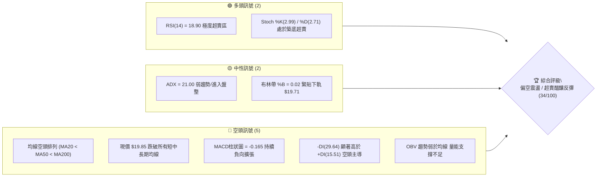
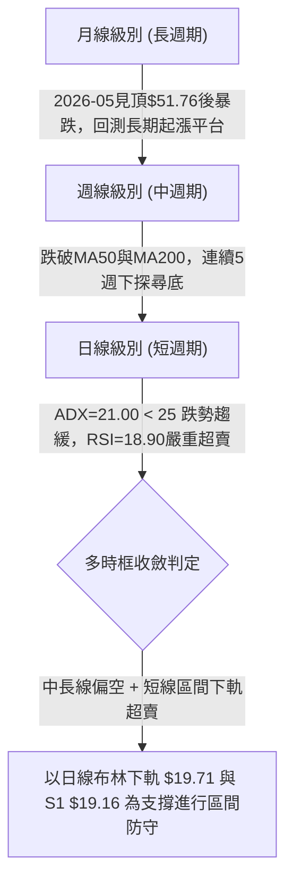
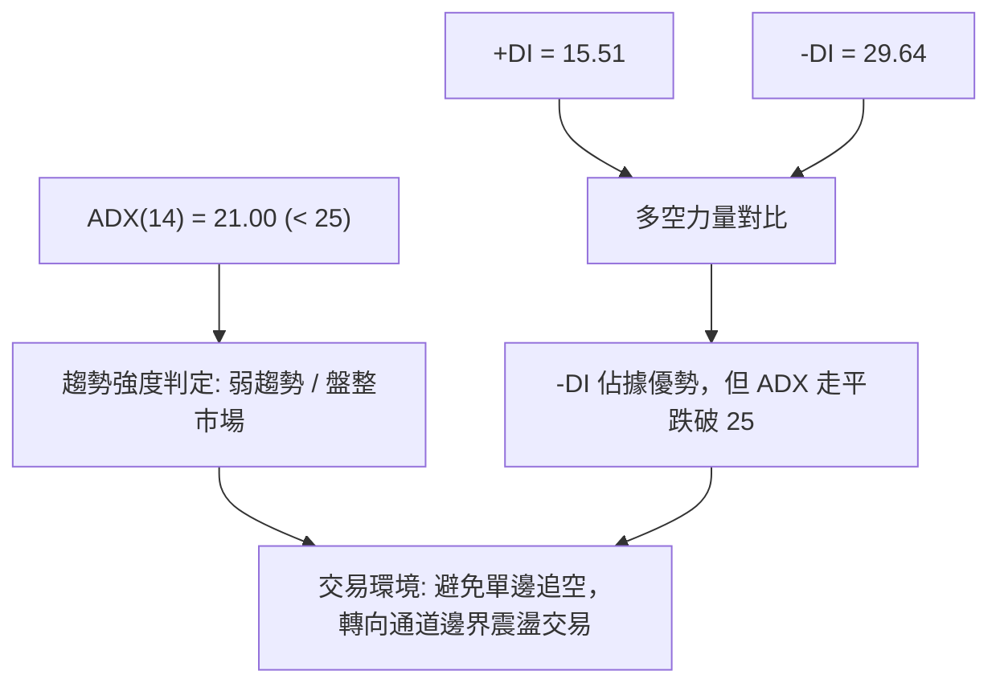
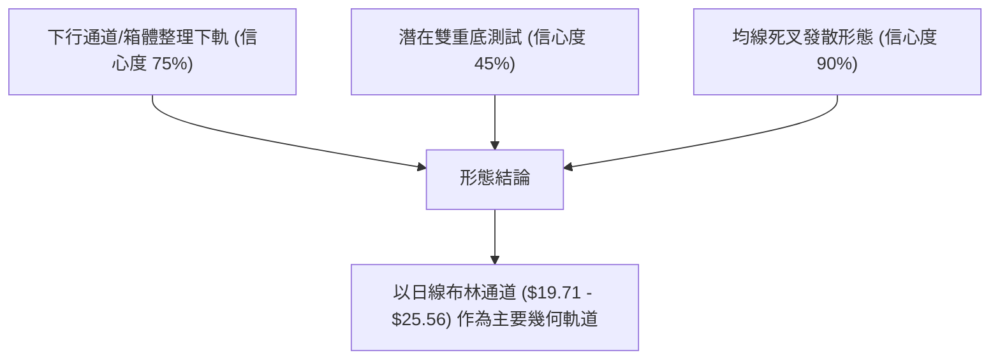
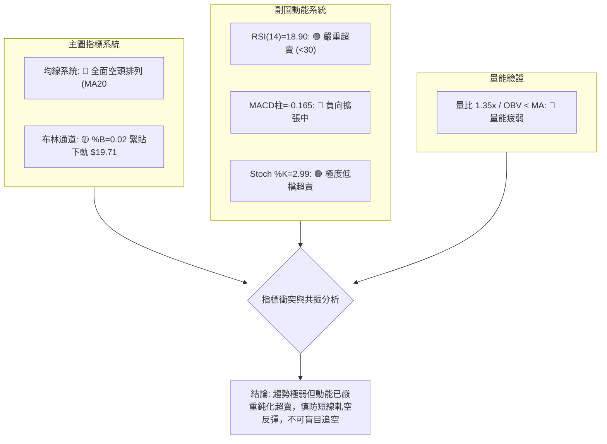
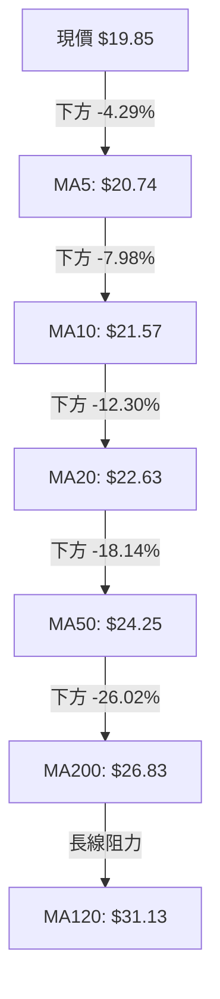
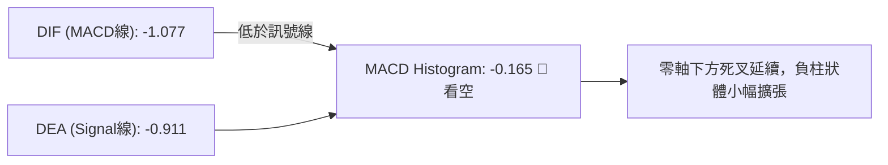
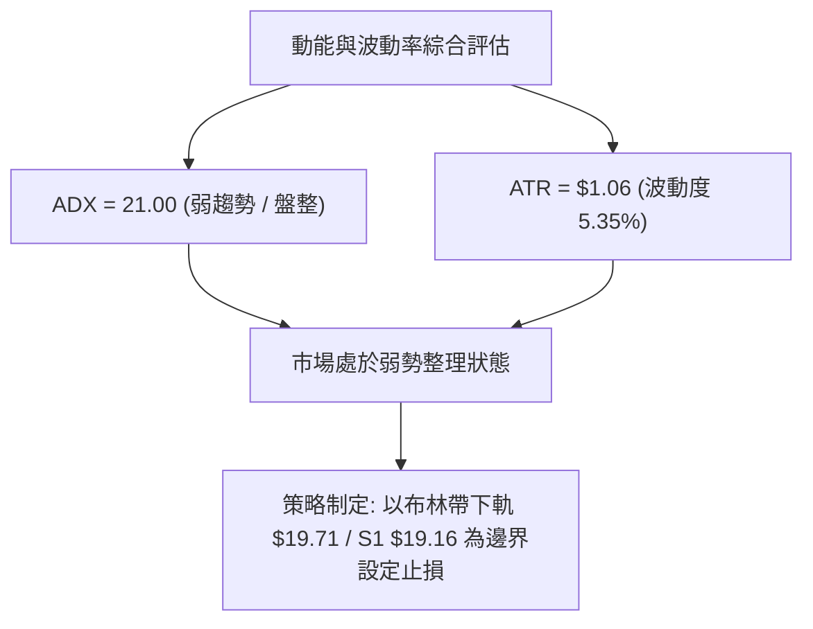
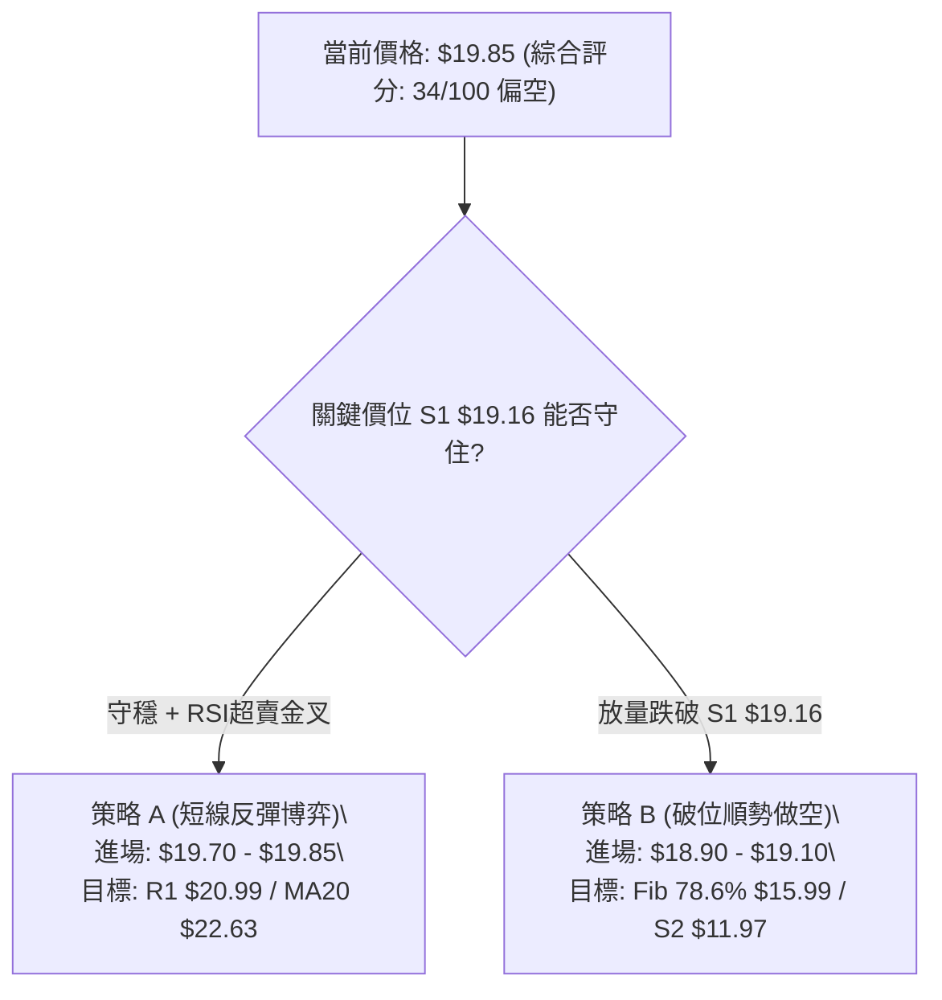
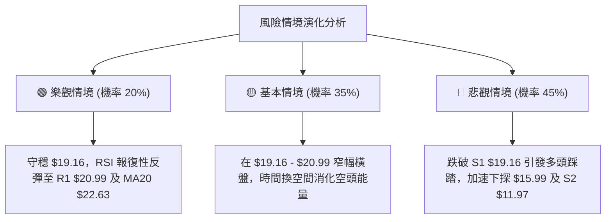

# PL 技術分析報告

> **報告日期**：2026-09-01 ｜ **語言**：繁體中文 ｜ **數據來源**：Yahoo Finance ｜ **當前價格**：$19.85

---

## 目錄

| 章節 | 內容 |
|------|------|
| [1. 技術面概覽](#1-技術面概覽) | 訊號儀表板、核心指標、評分卡 |
| [2. 趨勢分析](#2-趨勢分析) | 多時框趨勢、長中短期走勢、ADX解讀 |
| [3. 圖表形態分析](#3-圖表形態分析) | 形態識別、信心度評估、K線組合 |
| [4. 支撐與阻力](#4-支撐與阻力) | 關鍵價位、斐波那契回調結構 |
| [5. 技術指標深度解讀](#5-技術指標深度解讀) | 均線系統、RSI、MACD、布林通道、量價分析 |
| [6. 動能與波動率](#6-動能與波動率) | 動能象限、ATR波動度、Beta分析 |
| [7. 多時框架總結](#7-多時框架總結) | 時框架評分、收斂結論 |
| [8. 交易策略建議](#8-交易策略建議) | 策略路由、主策略詳解、情境機率 |
| [9. 風險提示與監控](#9-風險提示與監控) | 監控清單、情境分析、風險控管 |

---

## 1. 技術面概覽

### 🎯 技術訊號儀表板



### 📊 核心指標速覽表

| 指標類別 | 指標名稱 | 當前數值 | 訊號 | 解讀 |
|----------|----------|----------|------|------|
| **價格** | 當前價格 | $19.85 | 🔴 空頭 | 位於52週區間29.9%，自歷史高點$51.76大幅回落 |
| **均線** | MA20 | $22.63 | 🔴 空頭 | 價格在MA20下方 -12.30%，短線受制中軌壓制 |
| **均線** | MA50 | $24.25 | 🔴 空頭 | 價格在MA50下方 -18.14%，中期下行趨勢顯著 |
| **均線** | MA200 | $26.83 | 🔴 空頭 | 跌破長期生命線，長線結構轉入空方控盤 |
| **動能** | RSI(14) | 18.90 | 🟢 超賣 | 進入嚴重超賣區間（<20），短線存在技術性抽頭需求 |
| **動能** | MACD (12,26,9) | -1.077 / -0.911 | 🔴 空頭 | DIF低於DEA且負柱狀圖擴張（-0.165），動能疲弱 |
| **動能** | Stoch %K / %D | 2.99 / 2.71 | 🟢 超賣 | 處於極低位，隨時可能出現低檔黃金交叉 |
| **趨勢** | ADX / ±DI | 21.00 / -DI 29.64 | 🟡 中性偏空 | ADX < 25 指示單邊跌勢減速，進入弱勢震盪整固階段 |
| **通道** | Bollinger Bands | 下軌 $19.71 | 🟡 邊界支撐 | %B=0.02，現價緊貼下軌，具有通道邊界支撐效應 |
| **量能** | 20日成交量比 | 1.35x | 🟡 中性 | 最新量 6.78M 高於20日均量 5.02M，出現低檔放量跡象 |
| **波動** | ATR(14) | $1.06 (5.35%) | 🟡 中波動 | 每日平均波動幅度約 $1.06，波動度維持中等水準 |

### 🏆 技術評分卡

```
╔══════════════════════════════════════════════════════════════════╗
║                   技術評分卡 — PL (2026-09-01)                   ║
╠══════════════════════════════════════════════════════════════════╣
║ 趨勢強度      ██████░░░░░░░░░░░░░░  30/100  🔴 空方控盤          ║
║ 動能指標      ████████░░░░░░░░░░░░  40/100  🟡 極度超賣修復中    ║
║ 支撐穩定度    ████████░░░░░░░░░░░░  40/100  🟡 臨近S1考驗        ║
║ 成交量配合    ███████░░░░░░░░░░░░░  35/100  🔴 量能萎縮無主升    ║
║ 形態完整度    ███████░░░░░░░░░░░░░  35/100  🔴 下行通道整理      ║
║ 均線排列      ████░░░░░░░░░░░░░░░░  20/100  🔴 典型空頭排列      ║
╠══════════════════════════════════════════════════════════════════╣
║ 綜合評分      ███████░░░░░░░░░░░░░  34/100  🔴 偏空弱勢震盪      ║
╚══════════════════════════════════════════════════════════════════╝
```

---

## 2. 趨勢分析

### 🌐 多時框趨勢分析



### 📈 長期趨勢 — 12個月走勢圖（Unicode）

```
PL 月線走勢圖（2025-09 至 2026-08）
價格軸 ($)
$52.00 ┤                                      ● (2026-05 $51.14 歷史波段高點)
$46.00 ┤                                     / \
$40.00 ┤                                    /   \
$34.00 ┤                             ●     /     ● (2026-06 $33.13 急跌)
$28.00 ┤                      ●     /     /       \
$22.00 ┤               ●     /     /     /         ● (2026-07 $20.48)
$16.00 ┤        ●     /     /     /     /           \
$10.00 ┤ ●     /     /     /     /     /             ●←現價 $19.85 (2026-08)
       └─┬─────┬─────┬─────┬─────┬─────┬─────┬─────┬─────┬─────┬─────┬─────
       09/25 10/25 11/25 12/25 01/26 02/26 03/26 04/26 05/26 06/26 07/26 08/26
```

**走勢特徵分析表格**：

| 階段 | 時間區間 | 起始價 → 終止價 | 漲跌幅 | 走勢特徵與量價解讀 |
|------|----------|-----------------|--------|--------------------|
| 第一階段：主升起步 | 2025-09 ~ 2025-12 | $12.98 → $19.72 | +51.93% | 突破底部箱體，機構建倉，均線多頭發散 |
| 第二階段：加速趕頂 | 2026-01 ~ 2026-05 | $24.97 → $51.14 | +104.81% | 拋物線式拉升，成交量劇烈放大，RSI突破83超買極端 |
| 第三階段：斷崖回落 | 2026-06 ~ 2026-07 | $51.14 → $20.48 | -59.95% | 頂部破位，週成交量連續突破8,000萬股，機構大幅獲利了結 |
| 第四階段：低檔弱斂 | 2026-08 ~ 至今 | $20.48 → $19.85 | -3.08% | 跌勢放緩，成交量驟減至678萬股，於$19-$20區間構築低檔整理 |

### 📊 中期趨勢（週線分析）

```
PL 中期週線壓力支撐架構
$27.57 ──────────────────────────────── R3 (近一年密集壓力帶)
$25.53 ──────────────────────────────── R2 (MA60 / 近期反彈高點壓力)
$20.99 ──────────────────────────────── R1 (MA5 / 8月反彈次高點)
$19.85 ════════════════════════════════ 現價（測試支撐中）
$19.16 ──────────────────────────────── S1 (關鍵波段低點支撐)
$11.97 ──────────────────────────────── S2 (2025年秋季起漲強支撐)
```

近20週數據顯示，股價在2026年5月31日觸及 $51.14（RSI達83.2）見頂後，隨即引發流動性踩踏。6月第一週暴跌至 $32.22，單週爆出 100,622,400 股的天量。經過7月至8月的連續回調，週線MACD柱已由 -1.972 逐步收斂至 -0.165，且週線成交量顯著萎縮至 2,498 萬股水準，顯示空方摜壓動能已顯著消耗。

### ⚡ 趨勢強度評估（ADX 解讀）



| 指標變數 | 數值 | 臨界標準 | 狀態評估 | 實戰交易指引 |
|----------|------|----------|----------|--------------|
| **ADX(14)** | 21.00 | 25.00 | 弱趨勢 / 無顯著方向 | 不宜進行順勢突破追單，應以區間高拋低吸為主 |
| **+DI** | 15.51 | - | 多頭動能衰弱 | 買方缺乏主動推升力量，反彈空間受限 |
| **-DI** | 29.64 | - | 空頭主導力量 | 空方仍控制盤面，但動能已無加速跡象 |

---

## 3. 圖表形態分析

### 🔍 形態識別系統



**形態信心度評估表**：

| 形態名稱 | 信心度 | 判斷依據（數據引用） | 完成度 | 目標價（附計算式） |
|----------|--------|----------------------|--------|--------------------|
| **下行通道下軌測試** | 75% | 價格緊貼布林下軌 $19.71，且臨近S1 $19.16 | 85% | 通道反彈目標 = MA20 ($22.63) 及 R1 ($20.99) |
| **雙重底形態（雛形）**| 45% | 7月低點 $20.47 與當前 $19.85 形成潛在次低點 | 30% | 若守穩S1($19.16)，頸線為8/16高點$24.69；高度=$24.69-$19.16=$5.53；推算目標=$24.69+$5.53=$30.22（未確認前不採用） |
| **均線空頭排列** | 90% | MA20 ($22.63) < MA50 ($24.25) < MA200 ($26.83) | 100% | 下行壓制延續，阻力看至 MA20 ($22.63) 與 R2 ($25.53) |

*註：由於雙底形態完成度僅30%且信心度<50%，本報告將其列為觀察項目，不作為主要進場依據，主要操作依照下行通道與指標超賣修復進行解讀。*

### 🕯️ 重要K線形態分析

| 期間/月份 | 收盤價 | K線形態 | 解讀 | 訊號 |
|-----------|--------|---------|------|------|
| 2026-05 | $51.14 | 長上影大陽見頂線 | 觸及52週高點$51.76後遭遇極大獲利了結賣壓 | 🔴 強烈看跌 |
| 2026-06 | $33.13 | 斷頭鍘刀巨量長黑 | 單月暴跌-35.2%，跌破MA20與MA50，確立趨勢反轉 | 🔴 空頭吞噬 |
| 2026-07 | $20.48 | 空頭慣性下挫K線 | 連續擊穿多道斐波那契回調位，量能開始萎縮 | 🔴 弱勢延續 |
| 2026-08 | $19.85 | 低檔窄幅十字星孕線 | 實體極小，波動率壓縮，顯示多空在$19-$20達成短暫平衡 | 🟡 變盤待確認 |

### 📉 ASCII 走勢形態示意圖

```
PL 日線/週線下行收斂結構
價格
$25.56 ┬─ 上軌 / R2 阻力線 ───────────────────────────┐
       │      \                                         │
$22.63 ┼───────\───── 中軌 (MA20) 阻力 ───────────────┼ 反彈壓制區
       │        \            \                          │
$20.99 ┼─────────\────────────\─── R1 阻力 ────────────┤
       │          \            \                        │
$19.85 ┼───────────\────────────● 現價 $19.85 ──────────┤ 超賣修復點
$19.71 ┼────────────\─────────── 下軌 (BB Lower) ───────┤
$19.16 ┴─────────────┴──────────────── S1 支撐線 ───────┘ 關鍵多方防線
```

---

## 4. 支撐與阻力

### 🗺️ 關鍵價位分布圖（Unicode）

```
╔══════════════════════════════════════════════════════════════════╗
║                   PL 關鍵價位結構分布圖                          ║
╠══════════════════════════════════════════════════════════════════╣
║ $27.57 ║████████████████████████████████║ 強阻力 R3 (波段密集高點)
║ $25.53 ║████████████████████████        ║ 阻力 R2 (布林上軌/MA60) 
║ $23.64 ║▓▓▓▓▓▓▓▓▓▓▓▓▓▓▓▓▓▓▓▓            ║ 斐波那契 61.8% 回調位   
║ $20.99 ║████████████████                ║ 短線阻力 R1 (MA5/短高)  
║ $19.85 ╠════════════════════════════════╣ ◄ 現價 ($19.85)         
║ $19.71 ║░░░░░░░░░░░░░░░░░░░░░░░░░░░░░░░░║ 布林帶下軌支撐          
║ $19.16 ║▓▓▓▓▓▓▓▓▓▓▓▓▓▓▓▓▓▓▓▓▓▓▓▓▓▓▓▓▓▓▓▓║ 關鍵支撐 S1 (波段低點)  
║ $15.99 ║▒▒▒▒▒▒▒▒▒▒▒▒▒▒▒▒▒▒▒▒▒▒▒▒▒▒▒▒▒▒▒▒║ 斐波那契 78.6% 回調位   
║ $11.97 ║████████████████████████████████║ 強支撐 S2 (2025歷史平台)
║ $10.52 ║████████████████████████████████║ 終極支撐 S3 (底部密集成交)
╚══════════════════════════════════════════════════════════════════╝
```

### 🚧 阻力位分析表

| 阻力級別 | 價位 | 形成原因 | 突破難度 | 重要性 |
|----------|------|----------|----------|--------|
| **R1** | $20.99 | 近期波段反彈次高點、臨近MA5 ($20.74) 與 MA10 ($21.57) 密集區 | 🟡 中等 | 短線多頭反彈的第一道測試關卡 |
| **R2** | $25.53 | 近一年波段高點聚類、布林通道上軌 ($25.56) 與 MA60 ($25.33) 共振 | 🔴 極高 | 中期強弱分水嶺，未突破前中期空頭不變 |
| **R3** | $27.57 | 長期波段密集套牢區、MA200 ($26.83) 上方重壓區 | 🔴 極高 | 多頭牛熊轉換核心防線 |

### 🛡️ 支撐位分析表

| 支撐級別 | 價位 | 形成原因 | 守住機率 | 重要性 |
|----------|------|----------|----------|--------|
| **S1** | $19.16 | 近一年波段低點聚類、緊鄰布林下軌 ($19.71) | 60% | 短線多頭必須死守之底線，跌破將引發停損潮 |
| **S2** | $11.97 | 2025年秋季起漲前之波段整理低點聚類 | 80% | 中長線強力價值支撐，具極強買盤承接力 |
| **S3** | $10.52 | 2025年中期築底平台低點聚類 | 95% | 終極結構支撐，歷史長期籌碼成本區 |

### 📐 斐波那契回調位分析

依據52週極值區間（低點 $6.26 → 高點 $51.76，總跨度 $45.50）計算：

```
0.0%  (52W High)   $51.76 ─────────────────────── 歷史極值
23.6%              $41.02 ─────────────────────── 第一道回檔位
38.2%              $34.38 ─────────────────────── 弱勢回檔位 (6月跌破)
50.0%              $29.01 ─────────────────────── 中軸平衡位
61.8%              $23.64 ─────────────────────── 黃金分割防守位 (已跌破轉為阻力)
[現價]             $19.85 ═══════════════════════ (位於 61.8% 與 78.6% 之間)
78.6%              $15.99 ─────────────────────── 深度回撤支撐位
100.0% (52W Low)   $ 6.26 ─────────────────────── 起漲原點
```

**解讀**：現價 $19.85 處於 61.8% ($23.64) 至 78.6% ($15.99) 的深度回撤區間。股價在跌破黃金分割位 $23.64 後，此價位已轉化為強大反壓。若 S1 $19.16 失守，股價將朝 78.6% 斐波那契位 $15.99 尋求支撐。

---

## 5. 技術指標深度解讀

### 🎛️ 指標訊號總覽



### 📈 移動平均線排列分析



| 均線名稱 | 當前價格 | 偏離度 (現價vs均線) | 走勢斜率 | 狀態判定 |
|----------|----------|---------------------|----------|----------|
| **MA 5** | $20.74 | -4.29% | 陡峭向下 | 極短線壓制 |
| **MA 10** | $21.57 | -7.98% | 下行 | 短線下行導引線 |
| **MA 20** | $22.63 | -12.30% | 下行 | 月線級別主要阻力 |
| **MA 60** | $25.33 | -21.64% | 平緩下行 | 季線阻力 (共振R2 $25.53) |
| **MA 120** | $31.13 | -36.24% | 下行 | 半年線重壓 |
| **MA 200** | $26.83 | -26.02% | 走平轉下 | 年線/生命線破位 |
| **MA 240** | $24.57 | -19.21% | 向上趨緩 | 長期均線走平 |

### 📉 RSI(14) 分析

```
RSI(14) 當前數值: 18.90
0 ────────── 20 ────────── 50 ────────── 70 ────────── 100
[████░░░░░░░░░░░░░░░░░░░░░░░░░░░░░░░░░░░░░░░░] 18.90 (嚴重超賣區)
```

- **狀態判定**：RSI(14) 來到 18.90，已深入 20 以下的極端超賣區域。歷史數據顯示，PL 在 RSI < 20 時（如 2026-07-26 RSI=10.2），隨後均出現技術性抽頭反彈（8月中旬反彈至 $24.69）。
- **背離分析**：
  - **頂背離**：無。
  - **底背離**：目前日線與週線 RSI 與價格同步下挫，**未出現標準底背離**。但在超賣極值區，動能指標已顯現下行鈍化跡象。

### 📊 MACD(12/26/9) 訊號解讀



MACD 雙線維持在零軸下方運行，DIF (-1.077) 持續低於 Signal 線 (-0.911)，柱狀圖讀數為 -0.165。這確認了中期下行趨勢尚未正式扭轉，任何向上反抽在未突破零軸前均屬弱勢反彈。

### 📦 布林通道分析

```
PL 日線布林通道 (20, 2)
$25.56 ┬────────────────────────── 上軌 (BB Upper)
       │
$22.63 ┼────────────────────────── 中軌 (MA20)
       │
$19.85 ┼═════════════════════════► 現價 ($19.85, %B = 0.02)
$19.71 ┴────────────────────────── 下軌 (BB Lower)
```

- **帶寬與位置**：通道帶寬開口維持在中等水平，當前 %B 數值僅為 0.02，價格緊貼下軌 $19.71 運行。
- **統計學含義**：在常態分佈下，價格位於下軌外側或邊緣的機率低於 5%，顯示短期價格遭到過度拋售，存在向中軌 $22.63 回歸的均值回歸拉力。

### 💹 成交量分析（量價配合度）

- **最新成交量**：6,785,104 股，相較於 20 日均量 (5,024,060 股) 的量比為 **1.35x**，但顯著低於 50 日均量 (8,304,806 股)。
- **OBV 能量潮**：OBV 趨勢低於其均線，顯示資金仍在流出，尚未見到機構級別的主動性回補買盤。
- **量價關係**：週線上從頂部的單週 1 億股萎縮至當前 2,400 萬股，量能萎縮伴隨跌幅收斂，呈現「價跌量縮」的末跌段整理特徵。

---

## 6. 動能與波動率

### ⚡ 動能評估四象限

| 象限 | 動能維度 | 波動率維度 | PL 當前落點 | 狀態評估與操作意涵 |
|------|----------|------------|-------------|--------------------|
| **Q1 (突破區)** | 強動能 (ADX>25) | 低波動 (ATR壓縮) | — | 最佳趨勢進場機會 |
| **Q2 (盤整區)** | 弱動能 (ADX=21.00) | 低/中波動 (ATR 5.35%)| **落入此區 (✓)** | **空方動能減速，進入築底整固，宜區間操作** |
| **Q3 (主升/主跌)** | 強動能 (ADX>25) | 高波動 (ATR擴大) | — | 單邊強趨勢行情（如5-6月崩跌期） |
| **Q4 (衰竭區)** | 弱動能 (ADX<25) | 高波動 (異常劇烈) | — | 假突破頻發，高風險區域 |



### 📊 ATR 波動率分析

- **ATR(14) 數值**：**$1.06**（佔當前股價 5.35%）。
- **停損與風控設置**：
  - 短線交易保護止損距離建議設為 **1.5 × ATR = $1.59**。
  - 波段防守止損距離建議設為 **2.0 × ATR = $2.12**。
  - 以現價 $19.85 結合支撐位 S1 ($19.16) 計算，跌破 S1 緩衝區設在 $19.16 - $0.50 = $18.66（約 1.1x ATR）。

### 📐 Beta 與市場相關性

- **Beta 係數**：**2.123**（高 Beta 屬性）。
- **市場特徵**：PL 具備大盤波動 2.12 倍的彈性特徵。在科技股與大盤下挫時承壓劇烈，但一旦大盤企穩或出現空頭回補，其反彈爆發力亦將顯著放大。

---

## 7. 多時框架總結

### 📋 時框架評分表

| 時框架 | 趨勢方向 | 動能指標 | 均線排列 | 形態結構 | 綜合評分 | 操作建議 |
|--------|----------|----------|----------|----------|----------|----------|
| **月線 (長期)** | 🔴 偏空 | RSI 走低 / 動能轉弱 | 跌破多條短期月均 | 歷史大頂回調中 | 30/100 | 長線資金觀望，等待底部確立 |
| **週線 (中期)** | 🔴 偏空 | MACD 負向收斂中 | 空頭排列 (破MA50/200) | 下行通道延伸 | 35/100 | 反彈皆為減碼點，不盲目猜底 |
| **日線 (短期)** | 🟡 弱震盪 | RSI=18.90 極度超賣 | 均線全空頭壓制 | 緊貼布林下軌整理 | 38/100 | 嚴守S1支撐，博弈短線超賣修復 |

### 🔲 綜合訊號矩陣

```
時框矩陣分析：
┌───────────┬──────────────┬──────────────┬──────────────┐
│  維度     │  短期 (日線) │  中期 (週線) │  長期 (月線) │
├───────────┼──────────────┼──────────────┼──────────────┤
│ 趨勢方向  │ 🟡 弱勢盤整  │ 🔴 空頭下行  │ 🔴 深度修正  │
│ 均線系統  │ 🔴 空頭壓制  │ 🔴 空頭排列  │ 🟡 測試年線  │
│ 動能指標  │ 🟢 極度超賣  │ 🔴 負向運行  │ 🔴 頂部回落  │
│ 成交量能  │ 🟡 低檔放量  │ 🟡 顯著萎縮  │ 🔴 賣壓主導  │
│ 關鍵價位  │ 測試 S1$19.16│ 承壓 R1$20.99│ 承壓 R2$25.53│
└───────────┴──────────────┴──────────────┴──────────────┘
```

### ⚖️ 多時框收斂結論

依據多時框收斂規則（ADX = 21.00 < 25，確認當前屬於**盤整/弱趨勢修復行情**）：
- **主導結論**：**中長線偏空架構下的日線超賣區間震盪（唯一方向：中性偏空防守，以區間震盪視之）**。
- **收斂邏輯**：週線與月線均線空頭排列（MA20 < MA50 < MA200）決定了反彈空間受到強烈壓制；但日線 ADX < 25 且 RSI 深入 18.90 極端超賣區，表明當前價位已無追空性價比。主策略鎖定在「**布林通道下軌 $19.71 與支撐 S1 $19.16 之區間防守，逢反彈至阻力位 R1/MA20 分批減碼或佈局空單**」。

---

## 8. 交易策略建議

### 🗺️ 策略決策流程圖



### 🧭 策略路由

> **當前主策略方向 = 偏空防守 / 破位做空為主，超賣反彈為輔（依綜合評分 34/100，處於 ≤40 偏空區間）**

### 🎯 價格情境階梯（Price Scenarios）

| 觸發條件 | 第一目標 | 後續延伸 | 情境含義與操作指引 |
|----------|----------|----------|--------------------|
| **向上突破 R1 $20.99** | R2 $25.53 | R3 $27.57 | 超賣強烈修復，觸及布林上軌與MA60重壓區 |
| **站穩現價 $19.85 震盪** | MA20 $22.63 | R1 $20.99 | 區間築底消化賣壓，布林通道帶寬收窄 |
| **跌破 S1 $19.16** | $15.99 (Fib 78.6%) | S2 $11.97 | 底部防線瓦解，開啟新一輪主跌段探底 |

### 📊 情境機率分佈

| 情境劇本 | 機率 | 主要依據（數據引用） |
|----------|------|----------------------|
| **情境一：跌破支撐續探底** | **45%** | 均線空頭排列、-DI (29.64) 壓制 +DI、MACD柱 (-0.165) 持續為負 |
| **情境二：區間弱勢震盪** | **35%** | ADX = 21.00 (< 25) 趨勢減速、布林下軌 $19.71 發揮邊界約束力 |
| **情境三：超賣強烈反彈** | **20%** | RSI = 18.90 極度超賣、Stoch %K=2.99 / %D=2.71 處於歷史底部 |

### 🟢 主策略詳情

根據評分卡系統（34/100），本報告制定兩套具體執行方案：**策略 A（超賣反彈防守單）** 與 **策略 B（破位順勢空單）**。

| 策略要素 | 策略 A：短線超賣反抽單（左側防守） | 策略 B：破位順勢做空單（右側主推） |
|----------|-----------------------------------|-----------------------------------|
| **交易方向** | 多頭（短線反彈） | 空頭（主趨勢順勢） |
| **進場條件** | 現價緊貼布林下軌且守穩 S1 $19.16 | 日K實體收盤跌破 S1 $19.16 確認破位 |
| **進場價格** | **$19.85**（現價分批進場） | **$18.90**（破位回抽確認進場） |
| **目標價 T1** | **$20.99**（阻力位 R1） | **$15.99**（斐波那契 78.6% 回調位） |
| **目標價 T2** | **$22.63**（MA20 / 布林中軌） | **$11.97**（關鍵支撐 S2） |
| **止損價格** | **$18.66**（跌破 S1 緩衝 0.5x ATR）| **$19.85**（重回原支撐上方） |
| **風險報酬比** | **1 : 2.34**（風險 $1.19 / 獲利 $2.78） | **1 : 3.06**（風險 $0.95 / 獲利 $2.91） |
| **勝率預估** | 40% | 60% |
| **建議倉位** | 5% - 8%（輕倉試單） | 10% - 15%（標準風控倉位） |

### 🔴 反向風險觸發點（對沖與風控提示）

- **多頭反轉確認點**：若日線放量站上 **R1 $20.99** 且 MACD 出現零下金叉，所有空頭頭寸必須立即平倉或進行多頭對沖。
- **空頭加速觸發點**：若日線收盤跌破 **$19.16 (S1)**，多頭反彈邏輯徹底失效，必須無條件止損離場。

### ⭐ 整體訊號強度評星

```
╔══════════════════════════════════════════════════════════════════╗
║ 做多訊號強度：★★☆☆☆  (2/5星 - 僅限極端超賣技術性反抽)           ║
║ 做空訊號強度：★★★★☆  (4/5星 - 順應中長期均線與趨勢空頭排列)     ║
║ 整體可信度：  ★★★☆☆  (3/5星 - 震盪市ADX<25需提防假突破)       ║
╚══════════════════════════════════════════════════════════════════╝
```

---

## 9. 風險提示與監控

### ✅ 關鍵監控指標 Checklist

```
╔══════════════════════════════════════════════════════════════════╗
║                   每日交易監控清單 (Checklist)                   ║
╠══════════════════════════════════════════════════════════════════╣
║ [ ] 支撐有效性：每日收盤價是否嚴格維持在 S1 $19.16 之上?         ║
║ [ ] 動能修復：RSI(14) 能否自 18.90 回升突破 30.00 脫離超賣區?     ║
║ [ ] 均線動態：價格反彈接觸 MA5 ($20.74) 時是否出現量能承接?      ║
║ [ ] MACD變化：負柱狀圖 (-0.165) 是否開始縮短形成底背離雛形?      ║
║ [ ] 量能監控：成交量是否維持在 5.0M 均量以上，有無異常大額賣單?   ║
║ [ ] 通道收斂：布林通道下軌 $19.71 是否由向下開口轉為走平?        ║
╚══════════════════════════════════════════════════════════════════╝
```

### ⚠️ 風險場景分析



### 🛡️ 風險管理重要提醒

1. **Beta 風險溢價控管**：PL 的 Beta 值高達 **2.123**，屬於極高波動性品種。單筆交易最大虧損額度切勿超過總帳戶淨值的 **1.0%**。
2. **均線壓制原則**：在價格未能有效站穩 MA20 ($22.63) 之前，任何做多行為均屬於高風險的逆勢逆向交易，必須嚴格設定硬性止損。
3. **流動性陷阱防範**：若成交量跌破 300 萬股，將導致買賣價差（Bid-Ask Spread）擴大，應避免在盤前/盤後進行大額市價單交易。

---

## 📋 報告總結

```
╔══════════════════════════════════════════════════════════════════╗
║                   PL 技術分析報告總結                            ║
╠══════════════════════════════════════════════════════════════════╣
║ 報告日期：2026-09-01                                             ║
║ 當前價格：$19.85                                                 ║
║ 分析評級：🔴 偏空震盪 / 34分 (空方控盤，短期進入極度超賣整固)   ║
║                                                                  ║
║ 關鍵結論：                                                       ║
║ ├─ 長期趨勢：🔴 空頭主導 (自 $51.76 見頂回落，跌破年線 MA200)    ║
║ ├─ 中期趨勢：🔴 弱勢修正 (MA20 < MA50 < MA200 均線空頭排列)      ║
║ ├─ 短期趨勢：🟡 超賣震盪 (ADX=21.00 趨勢放緩，RSI=18.90 極度超賣)║
║ ├─ 關鍵支撐：S1 $19.16 ｜ S2 $11.97 ｜ S3 $10.52                 ║
║ ├─ 關鍵阻力：R1 $20.99 ｜ R2 $25.53 ｜ R3 $27.57                 ║
║ └─ 斐波那契：現價落於 61.8% ($23.64) 與 78.6% ($15.99) 之間      ║
║                                                                  ║
║ 最優策略組合：                                                   ║
║ 1. 🥇 最佳機會（順勢）：等待跌破 S1 $19.16 後進場做空，目標 $15.99║
║ 2. 🥈 次選機會（逆勢）：以 S1 $19.16 為防守博弈超賣反彈至 $20.99  ║
║ 3. 🥉 保守選擇：空倉觀望，等待日線突破 MA20 ($22.63) 趨勢明朗   ║
╚══════════════════════════════════════════════════════════════════╝
```

---

> ⚠️ **免責聲明**：本報告為 AI 自動生成之技術分析，所有數據及估算均基於提供的歷史價格資訊。本報告**僅供研究與學術參考**，**不構成任何投資建議**。投資有風險，入市需謹慎。

---

*報告生成時間：2026-09-01 ｜ 數據來源：Yahoo Finance ｜ 分析框架：多時框技術分析*