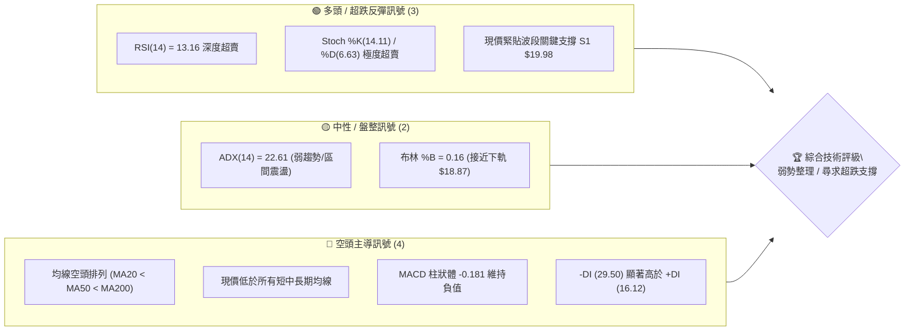
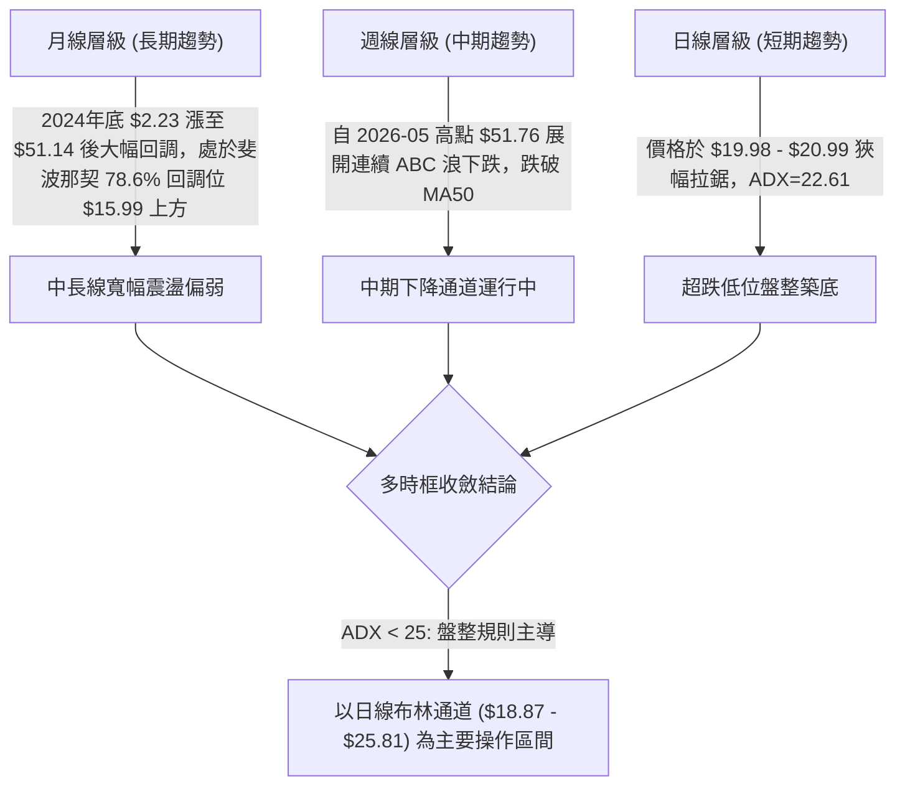
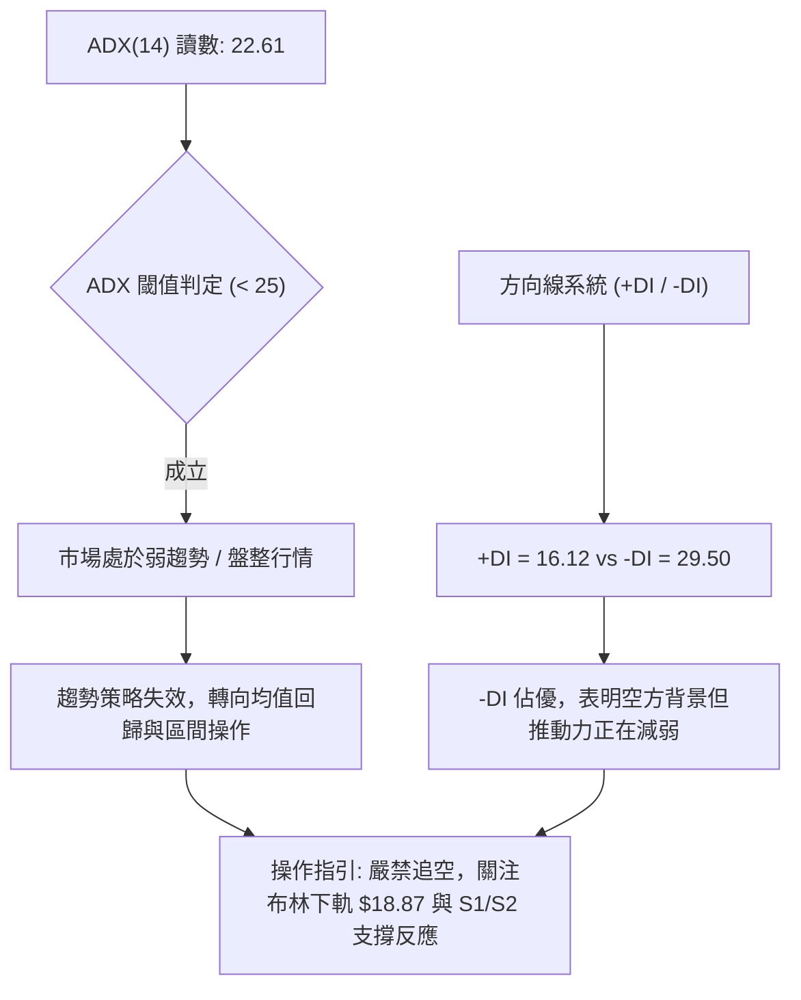
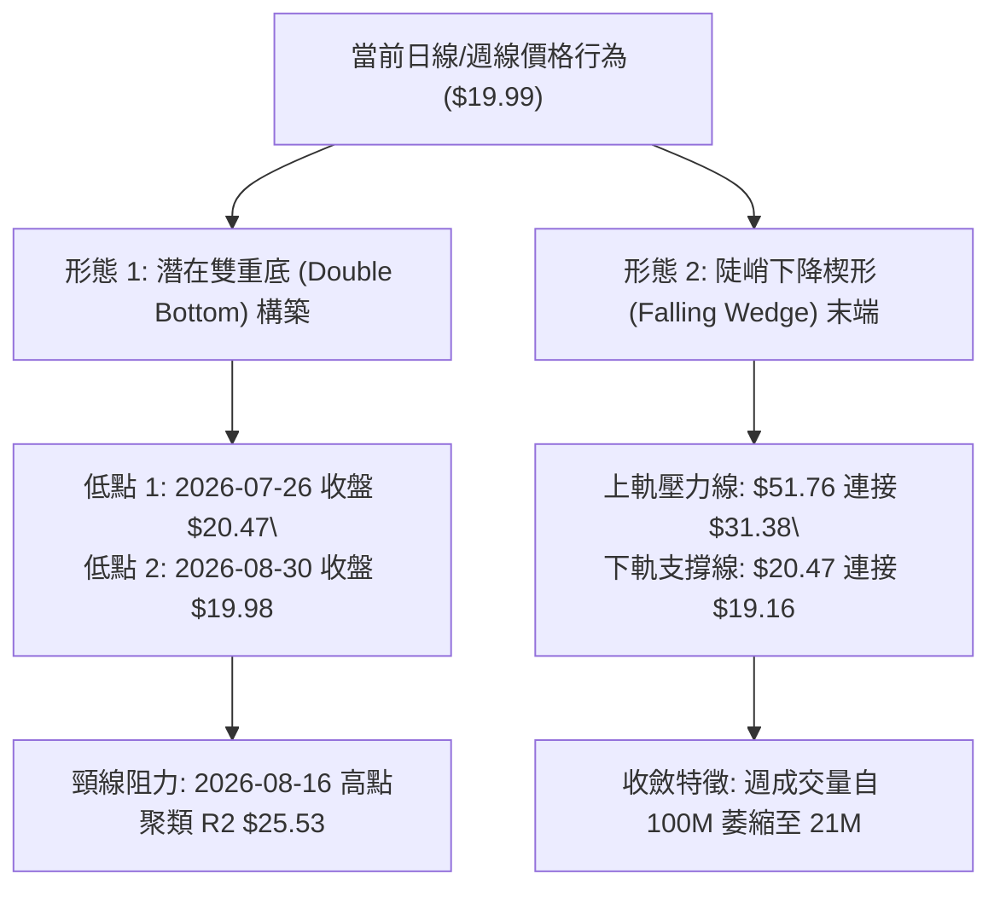
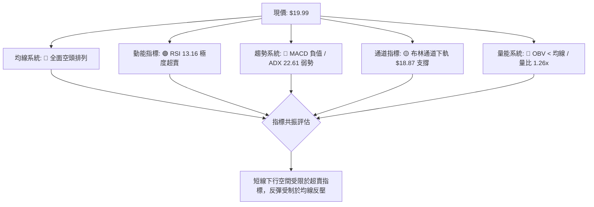
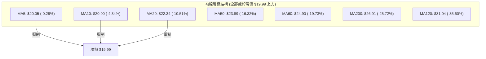
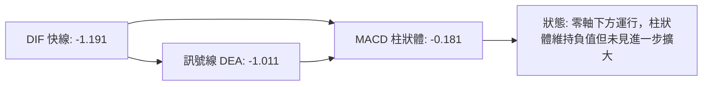
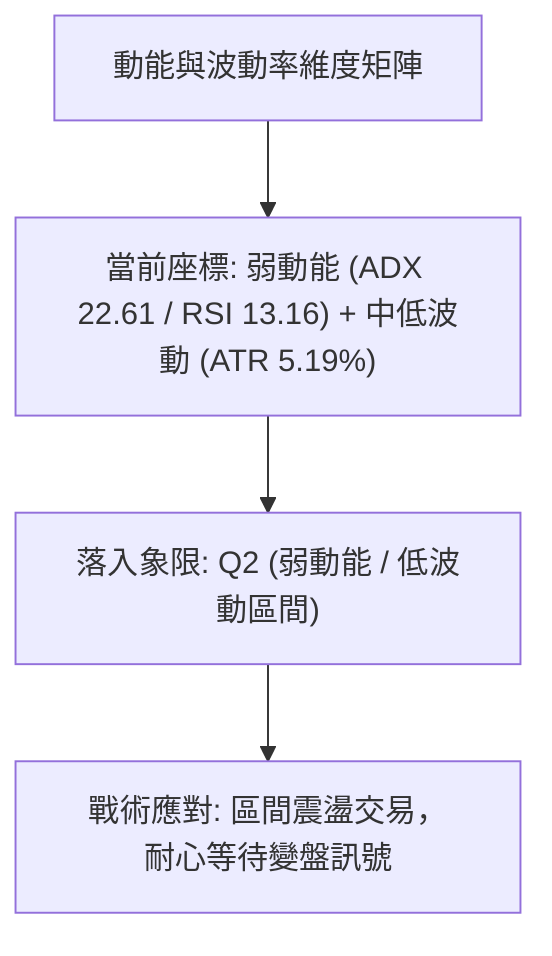
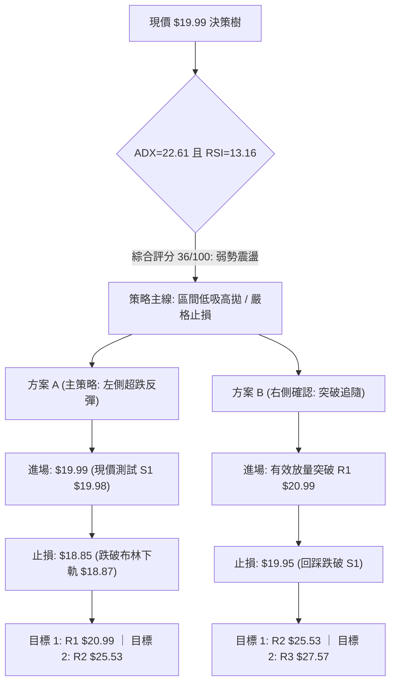
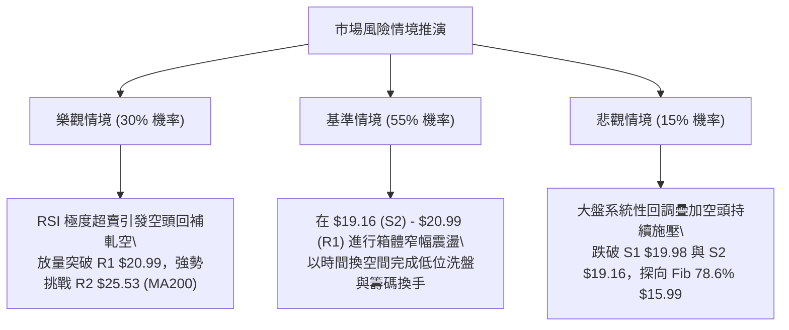

# PL 技術分析報告

> **報告日期**：2026-09-02 ｜ **語言**：繁體中文 ｜ **數據來源**：Yahoo Finance ｜ **當前價格**：$19.99

---

## 目錄

| 章節 | 內容 |
|------|------|
| [1. 技術面概覽](#1-技術面概覽) | 訊號儀表板、核心指標、評分卡 |
| [2. 趨勢分析](#2-趨勢分析) | 多時框趨勢、長中短期走勢、12個月走勢圖 |
| [3. 圖表形態分析](#3-圖表形態分析) | 形態識別、信心度評估、K線組合、目標價推算 |
| [4. 支撐與阻力](#4-支撐與阻力) | 關鍵價位分布、波段高低點、斐波那契回調 |
| [5. 技術指標深度解讀](#5-技術指標深度解讀) | 均線系統、RSI、MACD、布林通道、OBV量價 |
| [6. 動能與波動率](#6-動能與波動率) | 動能四象限、ATR波幅止損、Beta相關性 |
| [7. 多時框架總結](#7-多時框架總結) | 時框架評分矩陣、多時框收斂定論 |
| [8. 交易策略建議](#8-交易策略建議) | 策略路由、價格情境階梯、主策略詳解、風控防線 |
| [9. 風險提示與監控](#9-風險提示與監控) | 關鍵監控清單、情境推演、資金控管 |
| [10. 報告總結](#10-報告總結) | 全景技術結論與操作導航 |

---

## 1. 技術面概覽

### 🎯 技術訊號儀表板



---

### 📊 核心指標速覽表

| 指標類別 | 指標名稱 | 當前數值 | 訊號 | 專業技術解讀 |
|:---|:---|:---|:---:|:---|
| **價格** | 當前價格 | **$19.99** | 🔴 | 位於 52 週區間（$6.26 - $51.76）之 30.2% 分位，處於波段回調低位區 |
| **短期均線** | MA5 / MA10 | **$20.05 / $20.90** | 🔴 | 現價低於短期均線（偏差分別為 -0.29% 與 -4.34%），短線承壓 |
| **中期均線** | MA20 / MA50 | **$22.34 / $23.89** | 🔴 | MA20 下穿 MA50 形成死叉，中期均線呈陡峭下行態勢 |
| **長期均線** | MA200 / MA240 | **$26.91 / $24.65** | 🔴 | 跌破 200 日牛熊分界線，長期趨勢轉入空頭防守階段 |
| **動能振盪** | RSI(14) | **13.16** | 🟢 | 進入極度超賣區（< 20），短線具備強烈技術性均值回歸修復需求 |
| **動能振盪** | Stoch %K / %D | **14.11 / 6.63** | 🟢 | KD 雙線處於極低位區間，低檔鈍化中醞釀金叉動能 |
| **趨勢指標** | MACD (12,26,9) | **-1.191 / Sig -1.011** | 🔴 | DIF 位於訊號線下方，Histogram 柱狀體為 -0.181，空頭動能尚未完全衰竭 |
| **趨勢強度** | ADX (14) | **22.61** | 🟡 | ADX < 25 表明單邊暴跌趨勢減弱，市場進入弱勢盤整築底階段 |
| **方向系統** | +DI / -DI | **16.12 / 29.50** | 🔴 | -DI 大於 +DI，空方力量仍佔據主導優勢 |
| **通道指標** | 布林通道 (20,2) | **上軌 $25.81 / 下軌 $18.87** | 🟡 | %B 為 0.16，價格運行於下軌之上、中軌 $22.34 之下，波動收斂中 |
| **波動率** | ATR(14) | **$1.04 (5.19%)** | 🟡 | 日均波動幅度為 $1.04，提供標準止損與波段空間參考依據 |
| **量能系統** | 20日均量 / 量比 | **5,137,594 / 1.26x** | 🟡 | 今日量能 6.47M，量比 1.26 倍，放量測試 S1 支撐，OBV 處於均線下方 |

---

### 🏆 技術評分卡

```
╔══════════════════════════════════════════════════════════════════════╗
║                     技術評分卡 — PL (2026-09-02)                     ║
╠══════════════════════════════════════════════════════════════════════╣
║ 趨勢強度 (Trend)     ██████░░░░░░░░░░░░░░  30/100  🔴 空頭排列主導  ║
║ 動能指標 (Momentum)  ████████████░░░░░░░░  60/100  🟢 極度超賣醞釀  ║
║ 支撐穩定度 (Support) ██████████░░░░░░░░░░  50/100  🟡 考驗 S1/S2    ║
║ 成交量配合 (Volume)  ████████░░░░░░░░░░░░  40/100  🔴 量能結構偏弱  ║
║ 形態完整度 (Pattern) ████████░░░░░░░░░░░░  40/100  🟡 弱勢箱體整理  ║
║ 均線排列 (Moving Avg)████░░░░░░░░░░░░░░░░  20/100  🔴 典型空頭排列  ║
╠══════════════════════════════════════════════════════════════════════╣
║ 綜合技術評分         ███████░░░░░░░░░░░░░  36/100  🔴 偏空弱勢震盪  ║
╚══════════════════════════════════════════════════════════════════════╝
```

---

## 2. 趨勢分析

### 🌐 多時框趨勢分析



---

### 📈 長期趨勢 — 12個月走勢圖（Unicode）

以下展示自 2025 年 9 月至 2026 年 9 月之月線收盤走勢與關鍵轉折點：

```
PL 月線收盤走勢圖（2025-09 至 2026-09）
價格 ($)
$52.00 ┤                                      ● $51.14 (2026-05 歷史高點)
$46.00 ┤                                     / \
$40.00 ┤                                    /   \
$34.00 ┤                             ● $36.97    \
$28.00 ┤                     ● $27.95             ● $33.13
$22.00 ┤             ● $24.97                      \
$16.00 ┤     ● $19.72                               \
$10.00 ┤ ● $12.98                                    ● $20.48 ──● $19.99 (現價)
 $4.00 ┤
       └─┬──────┬──────┬──────┬──────┬──────┬──────┬──────┬──────┬──────┬──────┬──────┬
       09/25  10/25  11/25  12/25  01/26  02/26  03/26  04/26  05/26  06/26  07/26  08/26  09/26
```

#### 走勢階段特徵深度拆解

| 階段區間 | 時間跨度 | 價格起訖 | 漲跌幅 | 走勢特徵與量價結構分析 |
|:---|:---|:---|:---:|:---|
| **第一階段：主升浪爆發** | 2025-09 至 2026-01 | $12.98 → $24.97 | **+92.37%** | 伴隨營收 42.1% 高成長，機構買盤積極推升，突破所有前期平台阻力。 |
| **第二階段：加速趕頂** | 2026-02 至 2026-05 | $24.14 → $51.14 | **+111.85%** | 月線連收長陽，2026-05 創下 52 週高點 $51.76，RSI 一度攀升至 83.2 極度超買。 |
| **第三階段：斷崖式回吐** | 2026-06 至 2026-07 | $51.14 → $20.48 | **-59.95%** | 機構獲利了結，週成交量暴增至 1 億股以上放量下殺，直接摜破 MA20 與 MA50。 |
| **第四階段：低位量縮築底** | 2026-08 至 2026-09 | $20.48 → $19.99 | **-2.39%** | 週量能萎縮至 2,100 萬股，價格在 $19.85 - $20.48 區間沉澱，空方動能減弱。 |

---

### 📊 中期趨勢（週線分析）

中期走勢自 2026 年 5 月底見頂後呈現「階梯式下行」結構。當前週線連續 4 週於 $20.00 附近震盪打底，週線 RSI 降至 13.2，顯示中期下行動能已進入最後竭盡階段。

```
週線級別關鍵價位分層示意圖
─────────────────────────────────────────────────────────────────
[強阻力區]  R3 $27.57  ════════════════════════  (波段反彈高點聚類)
                          ↑ 37.91%
[中期阻力]  R2 $25.53  ────────────────────────  (MA200 / 斐波那契 61.8% $23.64 壓力帶)
                          ↑ 27.71%
[短線阻力]  R1 $20.99  ┄┄┄┄┄┄┄┄┄┄┄┄┄┄┄┄┄┄┄┄┄┄  (10日均線 / 近期波段反彈高點)
                          ↑ 5.00%
[當前現價]  $19.99     ●═══════════════════════  (多空臨界點)
                          ↓ -0.05%
[關鍵支撐]  S1 $19.98  ┄┄┄┄┄┄┄┄┄┄┄┄┄┄┄┄┄┄┄┄┄┄  (近一年低點支撐聚類)
                          ↓ -4.15%
[強支撐區]  S2 $19.16  ────────────────────────  (布林下軌 $18.87 防守延伸帶)
                          ↓ -40.12%
[極限支撐]  S3 $11.97  ════════════════════════  (2025年起漲波段低點聚類)
─────────────────────────────────────────────────────────────────
```

---

### ⚡ 趨勢強度評估（ADX 解讀）



#### ADX 數值強度對照表

| 指標名稱 | 當前讀數 | 標準閾值區間 | 趨勢狀態判定 | 交易策略意涵 |
|:---|:---|:---|:---:|:---|
| **ADX (14)** | **22.61** | 0 – 25 (弱趨勢/盤整) | 🟡 弱趨勢盤整 | 避免使用突破追單系統，採用布林通道上下軌與支撐阻力高拋低吸。 |
| **+DI (14)** | **16.12** | 基準線 20.0 | 🔴 多頭力量疲弱 | 多方主動進攻意願低，反彈多屬空頭回補性質。 |
| **-DI (14)** | **29.50** | 基準線 20.0 | 🔴 空方力量佔優 | 雖處於空方主導，但未見 -DI 進一步向上發散，跌勢斜率趋緩。 |

---

## 3. 圖表形態分析

### 🔍 形態識別系統



#### 圖表形態信心度評估表

| 識別形態 | 信心度 | 判斷依據（嚴格引用技術數據） | 形態完成度 | 理論目標價（附精確計算式） |
|:---|:---:|:---|:---:|:---|
| **潛在雙重底**<br>*(Double Bottom)* | **65%** | 兩次低點分別為 2026-07-26 的 $20.47 與 2026-08-30 的 $19.98，對應支撐 S1 $19.98，量能顯著萎縮。 | **45%**<br>(尚未突破頸線) | 頸線阻力取波段反彈高點聚類 **R2 $25.53**，形態高度 = $25.53 - $19.98 = $5.55。<br>突破目標價 = 頸線 $25.53 + $5.55 = **$31.08** (接近 MA120 $31.04)。 |
| **下降楔形收斂**<br>*(Falling Wedge)* | **70%** | 高點持續下移（$51.76 → $31.38 → $24.69），但低點下移幅度收窄（$20.47 → $19.98），量能呈現典型楔形量縮。 | **75%**<br>(逼近楔形頂端) | 形態向上突破後，首要目標為楔形起跌反彈高點聚類 **R1 $20.99**，第二目標為 **R2 $25.53**。 |
| **均線空頭擴散**<br>*(MA Death Cross)* | **90%** | MA5 ($20.05) < MA10 ($20.90) < MA20 ($22.34) < MA50 ($23.89) < MA200 ($26.91)，指標性完全確認。 | **100%**<br>(已成型) | 下方第一防守支撐為 **S1 $19.98**，若實質跌破則指向 **S2 $19.16** 與極限支撐 **S3 $11.97**。 |

---

### 🕯️ 重要 K 線形態分析

| 週/月份週期 | 收盤價 | K 線形態名稱 | 專業技術解讀 | 多空訊號 |
|:---|:---|:---|:---|:---:|
| **2026-05-31** | $51.14 | 巨量烏雲蓋頂 / 射擊之星 | 創下 $51.76 天價後放量收出長上影線，週成交量達 61.48M，宣告大頂形成。 | 🔴 強烈看跌 |
| **2026-06-07** | $32.22 | 放量大陰線 (Marubozu) | 單週暴跌 -37.00%，週成交量暴增至 100.62M，機構資金不計成本出逃。 | 🔴 空頭宣洩 |
| **2026-08-09** | $23.93 | 曙光初現 (Piercing Pattern) | 自 $20.48 低檔反彈，週漲幅達 +16.85%，帶動 RSI 自 25.6 回升至 58.0。 | 🟢 技術反彈 |
| **2026-08-30** | $19.98 | 低檔長下影十字星 | 探底測試波段支撐 S1 $19.98，量能萎縮至 24.99M，顯現低檔賣壓耗竭。 | 🟡 止跌信號 |
| **2026-09-06** | $19.99 | 低位窄幅紡錘線 (Spinning Top) | 連續兩週收盤於 $19.98 - $19.99，波幅收窄，RSI(14) 降至 13.2 極端值，靜待方向選擇。 | 🟡 變盤前夕 |

---

### 📉 ASCII 走勢形態示意圖

```
PL 日線/週線形態結構示意圖
══════════════════════════════════════════════════════════════════════
$51.76 ──┐ (歷史高點)
         │  \ 
$41.02 ──┼───\────── (斐波那契 23.6%)
         │    \  
$34.38 ──┼─────\──── (斐波那契 38.2%)
         │      \   [反彈高點]
$29.01 ──┼───────\─── $31.38 (2026-07-05) ── (斐波那契 50.0%)
         │        \    / \
$25.53 ──┼─────────\──/───\─── [頸線壓力 R2 $25.53] ───────────────
         │          \/     \    / \ [次高點 $24.69]
$20.99 ──┼──────────────────\──/───\─────── [阻力 R1 $20.99] ───────
$19.99 ──┼───────────────────●───────●───── [現價 $19.99 測試中] ──
$19.98 ──┼────────────────── $20.47  $19.98 [雙底支撐帶 S1 $19.98] 
$19.16 ──┴───────────────────────────────── [強支撐 S2 $19.16] ─────
══════════════════════════════════════════════════════════════════════
```

---

## 4. 支撐與阻力

### 🗺️ 關鍵價位分布圖（Unicode）

```
PL 價位結構分布圖
══════════════════════════════════════════════════════════════════════
$27.57 ║████████████████████████████████████║ 強阻力 R3 (近一年波段高點聚類)
$25.53 ║██████████████████████████          ║ 阻力 R2 (反彈高點/MA200密集區)
$20.99 ║████████████████                    ║ 關鍵阻力 R1 (10日均線/短線分水嶺)
───────╫────────────────────────────────────╫──────────────────────────────
$19.99 ╠════════════════════════════════════╣ ◄ 當前價格 ($19.99)
───────╫────────────────────────────────────╫──────────────────────────────
$19.98 ║▓▓▓▓▓▓▓▓▓▓▓▓▓▓▓▓▓▓▓▓▓▓▓▓▓▓▓▓▓▓      ║ 關鍵支撐 S1 (波段低點聚類 -0.05%)
$19.16 ║████████████████████████████████    ║ 強支撐 S2 (布林下軌防守區 -4.15%)
$11.97 ║████████████████████████████████████║ 極限支撐 S3 (2025起漲平台 -40.12%)
══════════════════════════════════════════════════════════════════════
```

---

### 🚧 阻力位分析表

所有阻力位數值嚴格引用自歷史波段高點聚類計算結果：

| 阻力級別 | 精確價位 | 距現價幅標 | 技術形成原因與籌碼解讀 | 突破難度 | 重要性權重 |
|:---|:---:|:---:|:---|:---:|:---:|
| **R1** | **$20.99** | **+5.00%** | 近期波段反彈高點聚類，與 10 日均線（$20.90）高度重合，為短線空頭第一道防線。 | 🟡 中等 | ★★★☆☆ |
| **R2** | **$25.53** | **+27.71%** | 2026年8月中旬波段反彈高點聚類，貼近布林上軌（$25.81）與長期均線 MA240（$24.65），為中期多空頸線。 | 🔴 較高 | ★★★★☆ |
| **R3** | **$27.57** | **+37.91%** | 2026年6月下旬密集套牢區高點聚類，上方受 MA200（$26.91）壓制，籌碼解套壓力極重。 | 🔴 極高 | ★★★★★ |

---

### 🛡️ 支撐位分析表

所有支撐位數值嚴格引用自歷史波段低點聚類計算結果：

| 支撐級別 | 精確價位 | 距現價幅標 | 技術形成原因與籌碼解讀 | 守住機率 | 重要性權重 |
|:---|:---:|:---:|:---|:---:|:---:|
| **S1** | **$19.98** | **-0.05%** | 近期波段低點聚類（2026-08-30 收盤價），為當前超跌橫盤整理的直接底部支撐。 | 🟡 55% | ★★★★☆ |
| **S2** | **$19.16** | **-4.15%** | 近一年次級波段低點聚類，與當前布林下軌（$18.87）形成 $18.87 - $19.16 的核心防守緩衝帶。 | 🟢 70% | ★★★★★ |
| **S3** | **$11.97** | **-40.12%** | 2025年11月主升浪起漲前的整理平台低點聚類，為長期結構性牛熊底線。 | 🟢 90% | ★★★★★ |

---

### 📐 斐波那契回調位分析

依據 52 週完整波動區間（最低點 **$6.26** → 最高點 **$51.76**，波幅總計 **$45.50**）計算之斐波那契回調位如下：

| 斐波那契回調比例 | 理論計算價位 | 與現價相對位置 | 結構意涵與技術解讀 |
|:---:|:---:|:---:|:---|
| **0.0% (52W High)** | **$51.76** | +158.93% | 歷史牛市頂部，強烈籌碼套牢峰。 |
| **23.6%** | **$41.02** | +105.20% | 第一強勢回調位，已於 2026 年 6 月初跌破。 |
| **38.2%** | **$34.38** | +71.99% | 核心多空分水嶺，跌破後行情正式轉入中期修正。 |
| **50.0% (中軸)** | **$29.01** | +45.12% | 心理平衡位，對應 2026 年 7 月初之反彈受阻點。 |
| **61.8% (黃金分割)** | **$23.64** | +18.26% | 牛市回調之黃金防守位，當前已轉化為中線強阻力帶（介於 R1 與 R2 之間）。 |
| **78.6% (深度回調)** | **$15.99** | -20.01% | **現價 ($19.99) 正運行於 61.8% ($23.64) 與 78.6% ($15.99) 之間**。 |
| **100.0% (52W Low)** | **$6.26** | -68.68% | 52 週起漲原點。 |

> **技術結論**：當前現價 $19.99 處於斐波那契 61.8%（$23.64）至 78.6%（$15.99）的回調區間。歷史經驗顯示，高成長股在經歷 61.8% 深度回調後，若能在 78.6% 之上完成築底（$19.16 - $19.98 區域），將具備構建大型對稱底部之技術條件。

---

## 5. 技術指標深度解讀

### 🎛️ 指標訊號總覽



---

### 📈 移動平均線排列分析



#### 均線趨勢特徵詳解
1. **短均線壓制**：MA5（$20.05）近乎平貼現價，MA10（$20.90）與阻力 R1（$20.99）重疊，構成多頭短線反彈的第一道天花板。
2. **中長期死叉排列**：MA20（$22.34）< MA50（$23.89）< MA200（$26.91），呈現標準空頭排列，表明過去 20 至 200 個交易日的平均持倉籌碼全線處於套牢狀態。
3. **乖離率修復需求**：現價距離 MA20 負乖離率達 -10.51%，距離 MA120 負乖離率達 -35.60%，極端負乖離通常誘發技術性均值回歸修復走勢。

---

### 📉 RSI(14) 分析

```
RSI(14) 當前讀數: 13.16 
0 ──[極度超賣區 0-20]─────── 30 ───────────── 50 ───────────── 70 ─────── 100
  ███░░░░░░░░░░░░░░░░░░░░░░░░░░░░░░░░░░░░░░░░░░░░░░░░░░░░░░░░░░░░░
  ▲ 13.16 (超賣警告)
```

- **超買超賣判定**：RSI(14) 數值為 **13.16**，處於 20 以下之極端超賣區間，技術上表明短期拋售盤已嚴重超跌過度。
- **背離分析判斷**：
  - 比對 2026-07-26 低點（收盤 $20.47，RSI 為 10.2）與 2026-09-02 當前點位（收盤 $19.99，RSI 為 13.16）。
  - **結論**：價格創出新低（$19.99 < $20.47），但 RSI 數值卻出現墊高現象（13.16 > 10.2），**日線層級浮現初步隱性底背離（Bullish Divergence）雛形**，暗示下跌動能正在減弱。

---

### 📊 MACD (12,26,9) 訊號解讀



- **快慢線位置**：DIF（-1.191）與 Signal（-1.011）均深處零軸下方，確認當前屬於弱勢格局。
- **柱狀體動能**：MACD Histogram 為 **-0.181**，相較於 2026 年 6 月創下的 -1.972 極端負值，柱狀體已大幅收斂並在低位橫盤，顯示空頭主跌浪已結束，市場正轉入空頭殘餘動能釋放階段。

---

### 📦 布林通道分析

```
布林通道 (20, 2) 結構示意圖
══════════════════════════════════════════════════════════════════════
$25.81 ┤ ═══════════════════════════════════════════ [布林上軌]
       │
$22.34 ┤ ─────────────────────────────────────────── [布林中軌 MA20]
       │
$19.99 ┤                       ●                    [當前價格 $19.99 (%B = 0.16)]
$18.87 ┤ ═══════════════════════════════════════════ [布林下軌]
══════════════════════════════════════════════════════════════════════
```

- **通道帶寬與位置**：上軌 $25.81、中軌 $22.34、下軌 $18.87，帶寬為 $6.94。
- **%B 指標解析**：當前 %B 為 **0.16**，處於下軌上方但極度偏向通道底部，代表價格已緊貼通道下邊界，若進一步下探至 $18.87 下軌，將觸發通道邊界的統計學反彈買盤。

---

### 💹 成交量分析（量價配合度）

- **量比與均量比較**：最新成交量為 **6,468,785 股**，相較 20 日均量（5,137,594 股）量比為 **1.26 倍**，但相較 50 日均量（8,029,580 股）呈現明顯縮量。
- **OBV 能量潮判讀**：當前 OBV 趨勢低於其移動平均線（OBV < MA），表明主力資金尚未出現規模性淨流入，量能仍屬散戶換手與被動止損性質。
- **量價背離結論**：自 6 月巨量暴跌（週量 100M）至 8/9 月低位縮量（週量 21M - 24M），呈現典型的**「下跌量縮」**特徵，說明市場已無恐慌性拋盤，賣壓正逐步耗盡。

---

## 6. 動能與波動率

### ⚡ 動能評估四象限



| 象限 | 動能維度 (Momentum) | 波動維度 (Volatility) | 當前判定 | 戰術應對策略 |
|:---:|:---:|:---:|:---:|:---|
| **Q1** | 強動能 (趨勢明確) | 低波動 (穩定推進) | — | 順勢加碼，趨勢跟蹤 |
| **Q2** | **弱動能 (方向不明)** | **低/中波動 (波幅收窄)** | **✓ (PL 當前狀態)** | **謹慎觀望，依托支撐 S1/S2 與下軌低吸博反彈** |
| **Q3** | 強動能 (爆發突破) | 高波動 (劇烈震盪) | — | 突破進場，寬幅止損 |
| **Q4** | 弱動能 (缺乏推力) | 高波動 (混亂無序) | — | 避免進場，容易雙向磨損 |

---

### 📊 ATR 波動率分析與止損設定

- **ATR(14) 讀數**：**$1.04**（佔當前股價之 **5.19%**）。
- **止損距離量化指導**：
  - **超短線交易（1.0 × ATR）**：止損空間設為 **$1.04**。
  - **波段交易（1.5 × ATR）**：止損空間設為 **$1.56**。
  - **中線防守（2.0 × ATR）**：止損空間設為 **$2.08**。
- **應用實務**：若於現價 $19.99 建立多頭部位，標準 1.0 ATR 止損價為 $19.99 - $1.04 = **$18.95**（恰好落在 S2 $19.16 與布林下軌 $18.87 之防守區間下緣，具備高度技術合理性）。

---

### 📐 Beta 與市場相關性

- **Beta 係數**：**2.123**（高 Beta 成長型/科技航太屬性）。
- **市場敏感度解讀**：該標的波動幅度為標普 500 指數的 2.12 倍。在大盤處於回調週期時，其下行放大效應顯著；反之，一旦大盤企穩回升或個股出現催化劑，高 Beta 特性將賦予其極高的反彈彈性。
- **機構持股結構**：機構持股佔比達 **85.2%**，空頭部位佔流通股比例為 **9.4%**（Short Ratio: 4.01 天）。高達 85.2% 的機構持股意味著籌碼主要集中於專業機構手中，一旦超跌反彈觸發空頭回補，4.01 天的回補天數易形成局部軋空。

---

## 7. 多時框架總結

### 📋 時框架評分表

| 時框架 | 趨勢方向 | 動能指標狀態 | 均線排列特徵 | 形態結構特徵 | 綜合評分 | 操作建議方向 |
|:---|:---|:---|:---|:---|:---:|:---|
| **月線層級 (Long-term)** | 🟡 寬幅震盪 | MACD 柱狀縮小 | 處於 MA240 ($24.65) 下方 | 自 $51.76 天價深度回調 | **45/100** | 長期投資者分批逢低佈局 |
| **週線層級 (Mid-term)** | 🔴 下行趨勢 | RSI(14) = 13.2 極低 | 空頭排列 (低於 MA50) | 尋求雙底或下降楔形底 | **35/100** | 中期等待突破 R1/R2 確認 |
| **日線層級 (Short-term)** | 🟡 低位橫盤 | RSI 13.16 / KD 超賣 | 短均線 MA5/10 壓制 | 貼近支撐 S1 $19.98 盤整 | **38/100** | 區間操作，嚴控止損博反彈 |

---

### 🔲 綜合訊號矩陣

```
┌─────────────────┬──────────────────────────────────────────────────────┐
│ 分析維度        │ 多空訊號對齊狀態與交叉驗證結論                       │
├─────────────────┼──────────────────────────────────────────────────────┤
│ 趨勢維度 (Trend)│ 🔴 月/週/日均線均呈空頭排列，中期阻力重重            │
│ 動能維度 (Mom.) │ 🟢 日線 RSI 13.16 / 週線 RSI 13.20 形成多時框極度共振超賣 │
│ 空間維度 (S / R)│ 🟡 現價 $19.99 正處於關鍵支撐 S1 $19.98 / S2 $19.16  │
│ 波動維度 (Vol.) │ 🟡 ADX = 22.61，單邊暴跌趨勢暫歇，進入箱體震盪       │
└─────────────────┴──────────────────────────────────────────────────────┘
```

---

### ⚖️ 多時框收斂結論

依據多時框收斂規則：
1. **行情性質判定**：當前 ADX(14) = **22.61 < 25**，市場明確處於**「盤整/震盪築底行情」**而非單邊趨勢行情。
2. **時框主導權收斂**：在 ADX < 25 的盤整結構中，日線布林通道（下軌 **$18.87** 至中軌 **$22.34** / 上軌 **$25.81**）及波段支撐阻力（**S1 $19.98 / R1 $20.99**）為主導交易區間。
3. **唯一方向性定論**：**【偏空背景下的超跌區間震盪（中性偏防守）】**。禁止在現價盲目追空（因 RSI 13.16 隨時誘發報復性反彈）；交易主軸應定位於**「依託 S1/S2 支撐做防守型超跌反彈，或等待反彈遇阻 R1/R2 順勢高拋」**。

---

## 8. 交易策略建議

### 🗺️ 策略決策流程圖



---

### 🧭 策略路由

> **當前主策略方向 = 【依據綜合評分 36/100，定位為「弱勢防守型區間操作」：以超跌均值回歸做多為主戰術，以跌破關鍵防線止損轉空為對沖機制】**

---

### 🎯 價格情境階梯（Price Scenarios）

所有價位精確引用關鍵價位計算結果：

| 觸發條件 | 第一目標 (T1) | 第二目標 (T2) | 後續延伸 (T3) | 市場情境與技術意涵 |
|:---|:---:|:---:|:---:|:---|
| **站穩 S1 $19.98 / 突破 R1 $20.99** | **R1 $20.99** | **R2 $25.53** | **R3 $27.57** | 短線極度超賣修復，向布林中軌/上軌發動均值回歸。 |
| **維持在 $19.16 – $20.99 區間震盪** | **$20.50** | **$20.90 (MA10)** | **$22.34 (MA20)** | 箱體築底沉澱，消化套牢籌碼，等待均線走平。 |
| **有效跌破 S1 $19.98 / S2 $19.16** | **$18.87 (BB下軌)** | **$15.99 (Fib 78.6%)** | **S3 $11.97** | 支撐破位，弱勢盤整轉入新一輪陰跌尋底。 |

---

### 📊 情境機率分佈

```
情境機率分佈圖
══════════════════════════════════════════════════════════════════════
[情境 1] 依託 S1 超跌反彈 (50%) █████████████████████████░░░░░░░░░░░░░░░
[情境 2] $19.16-$20.99 區間震盪 (35%) █████████████████░░░░░░░░░░░░░░░░░░░░
[情境 3] 跌破 S2 破位下行 (15%) ███████░░░░░░░░░░░░░░░░░░░░░░░░░░░░░
══════════════════════════════════════════════════════════════════════
```

| 情境劇本 | 機率 | 主要技術依據 |
|:---|:---:|:---|
| **情境 1：超跌反彈修復** | **50%** | RSI(14) 達 13.16 極端超賣，KD 低檔鈍化，現價緊貼波段支撐 S1 $19.98，技術反彈勝率高。 |
| **情境 2：低位區間震盪** | **35%** | ADX 降至 22.61 顯示趨勢動能衰退，週成交量縮減，多空雙方在 $19.16 - $20.99 形成平衡。 |
| **情境 3：破位向下探底** | **15%** | 均線系統完全空頭排列，若市場突發系統性風險跌破 S2 $19.16，將引發多頭被動止損。 |

---

### 🟢 主策略詳情

| 策略要素 | 策略 A（左側交易：超跌反彈博弈） | 策略 B（右側交易：突破轉強跟進） |
|:---|:---|:---|
| **策略類型** | 逆勢均值回歸（高勝率波段） | 順勢右側突破（動能確認） |
| **進場條件** | 現價 $19.99 附近且 S1 $19.98 未實質跌破 | 日線收盤價強勢突破 R1 $20.99 且成交量放大 |
| **進場價格** | **$19.99** | **$21.05**（突破 R1 後回踩確認） |
| **目標價 T1** | **$20.99**（阻力位 R1，+5.00%） | **$25.53**（阻力位 R2 / 布林上軌，+21.28%） |
| **目標價 T2** | **$25.53**（阻力位 R2，+27.71%） | **$27.57**（阻力位 R3 / MA200，+30.97%） |
| **止損價格** | **$18.85**（跌破布林下軌 $18.87 與 S2 $19.16） | **$19.95**（跌回關鍵支撐 S1 $19.98 下方） |
| **風險空間** | $19.99 - $18.85 = **$1.14** (-5.70%) | $21.05 - $19.95 = **$1.10** (-5.23%) |
| **回報空間 (T2)**| $25.53 - $19.99 = **$5.54** (+27.71%) | $25.53 - $21.05 = **$4.48** (+21.28%) |
| **風險報酬比 (RRR)** | **1 : 4.86** | **1 : 4.07** |
| **預估勝率** | **55%** | **65%** |
| **建議倉位** | **5% – 8%**（輕倉試單） | **10% – 12%**（標準波段倉位） |

---

### 🔴 反向風險觸發點（對沖與風控提示）

若發生以下任一技術破壞信號，原多頭主策略立即失效，應果斷止損離場或採取對沖措施：
1. **S2 防線失守**：日線收盤價跌破 **$19.16**（且跌穿布林下軌 **$18.87**），宣告雙底築底失敗，下方空間打開至斐波那契 78.6% 回調位 **$15.99**。
2. **反彈無力夭折**：價格反彈至 R1 **$20.99** 附近再度收出長上影線或陰包陽，且成交量再度萎縮，表明反彈已結束，應在 $20.90 附近清倉獲利。

---

### ⭐ 整體訊號強度評星

```
╔══════════════════════════════════════════════════╗
║  做多訊號強度 (超跌博弈)：  ★★★☆☆  (3.0 / 5.0)  ║
║  做空訊號強度 (順勢壓制)：  ★★★★☆  (3.5 / 5.0)  ║
║  技術指標可信度 (一致性)：  ★★★★☆  (4.0 / 5.0)  ║
╚══════════════════════════════════════════════════╝
```

---

## 9. 風險提示與監控

### ✅ 關鍵監控指標 Checklist

```
╔══════════════════════════════════════════════════════════════════════╗
║                     每日交易監控清單 (Checklist)                     ║
╠══════════════════════════════════════════════════════════════════════╣
║ [ ] 價格是否守穩 S1 $19.98 關鍵支撐？ (跌破立即警惕)                 ║
║ [ ] RSI(14) 是否脫離 < 20 極端超賣區並向上穿越 30？                  ║
║ [ ] 每日收盤價是否突破短期均線 MA5 ($20.05) 與 MA10 ($20.90)？      ║
║ [ ] 日成交量是否超過 20 日均量 (5.14M) 的 1.5 倍以上？              ║
║ [ ] MACD 柱狀體 (當前 -0.181) 是否翻紅擴張形成底背離金叉？          ║
║ [ ] 布林通道帶寬是否開始向外擴張？                                  ║
╚══════════════════════════════════════════════════════════════════════╝
```

---

### ⚠️ 風險場景分析



---

### 🛡️ 風險管理重要提醒

1. **Beta 波動控管**：PL 的 Beta 值高達 **2.123**，單日波動劇烈（ATR 達 $1.04，佔股價 5.19%）。單筆交易最大虧損額必須嚴格控制在總投資組合淨值的 **1.0% 以內**。
2. **避免重倉與攤平**：均線系統目前處於絕對空頭排列（MA20 < MA50 < MA200），在價格尚未實質站穩 MA20（$22.34）之前，任何多頭進場均屬「逆勢超跌博弈」，絕對嚴禁逆勢加碼攤平。
3. **基本面催化劑關注**：公司營收維持 YoY +42.1% 高成長，分析師平均目標價達 $38.73（最高 $53.00，最低 $25.00，11 位分析師覆蓋），當前價格 $19.99 顯著低於分析師最低目標價 $25.00，具備潛在基本面防護墊，但短期走勢仍以技術面支撐確認為主。

---

## 📋 報告總結

```
╔══════════════════════════════════════════════════════════════════════╗
║                     PL 技術分析報告總結導航卡                        ║
╠══════════════════════════════════════════════════════════════════════╣
║ 報告日期：2026-09-02          標的代碼：PL (Planet Labs PBC)         ║
║ 當前價格：$19.99              綜合技術評級：⚖️ 偏空弱勢震盪 (36/100) ║
╠══════════════════════════════════════════════════════════════════════╣
║ 【核心趨勢與價位架構】                                               ║
║ ├─ 長期趨勢：🟡 斐波那契 61.8% ($23.64) 下方寬幅震盪整理             ║
║ ├─ 中期趨勢：🔴 自 $51.76 天價下行之修正浪，受制於 MA50/MA200       ║
║ ├─ 短期趨勢：🟡 ADX=22.61 弱勢盤整，RSI=13.16 醞釀極限超賣反彈      ║
║ ├─ 關鍵支撐：S1 $19.98 ｜ 強支撐：S2 $19.16 ｜ 極限支撐：S3 $11.97  ║
║ ├─ 關鍵阻力：R1 $20.99 ｜ 強阻力：R2 $25.53 ｜ 極限阻力：R3 $27.57  ║
║ └─ 華爾街目標價：平均 $38.73 (最低 $25.00 / 最高 $53.00)            ║
╠══════════════════════════════════════════════════════════════════════╣
║ 【交易策略執行指引】                                                 ║
║ 1. 🥇 首選策略 (超跌博弈)：$19.99 輕倉試多，止損 $18.85，            ║
║    目標 T1 $20.99 / T2 $25.53 (風險報酬比 1 : 4.86)                  ║
║ 2. 🥈 次選策略 (右側確認)：放量突破 R1 $20.99 後追進，止損 $19.95，   ║
║    目標 T1 $25.53 / T2 $27.57 (風險報酬比 1 : 4.07)                  ║
║ 3. 🥉 防禦措施：一旦收盤跌破 S2 $19.16，多頭立即無條件止損出局。     ║
╚══════════════════════════════════════════════════════════════════════╝
```

---

> ⚠️ **免責聲明**：本報告為依據客觀量化指標與圖表形態所生成之專業技術分析，所有數據與價位均嚴格基於所提供之歷史交易資訊。本報告**僅供研究與學術參考**，**不構成任何形式的個別投資諮詢或買賣建議**。金融市場具有高度風險，投資人應獨立評估風險並自負盈虧。