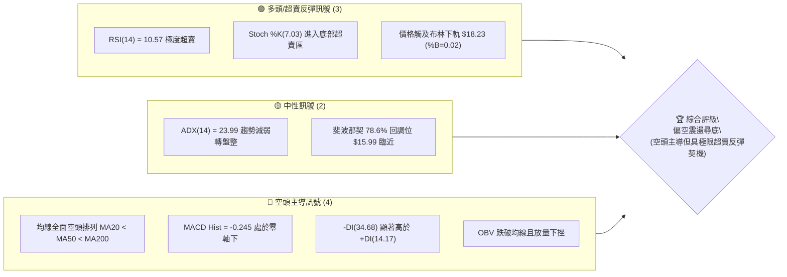
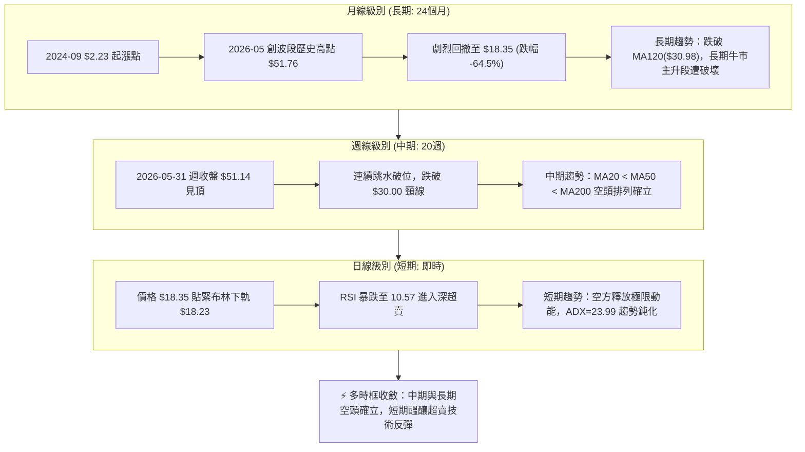
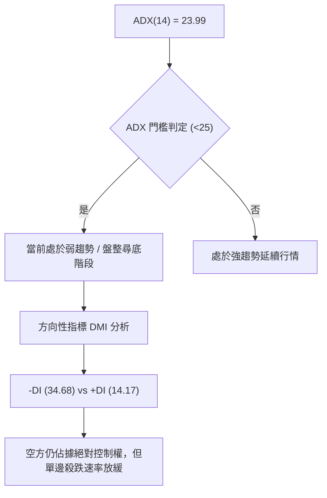
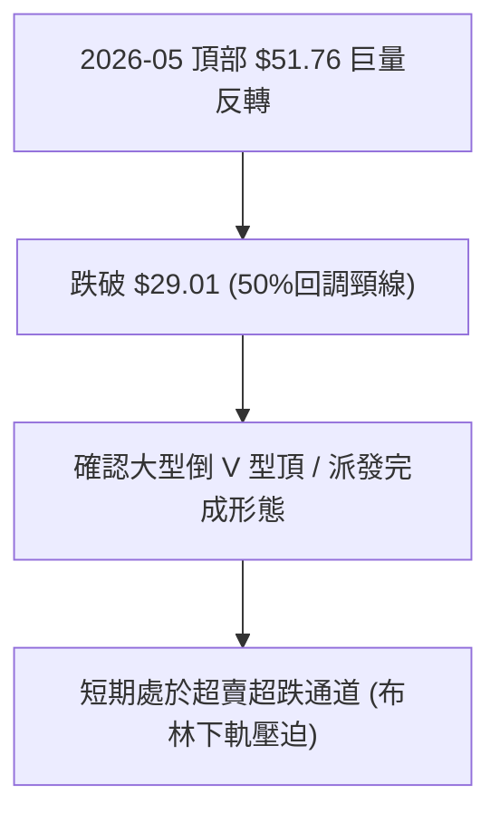
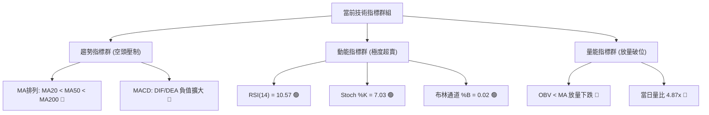
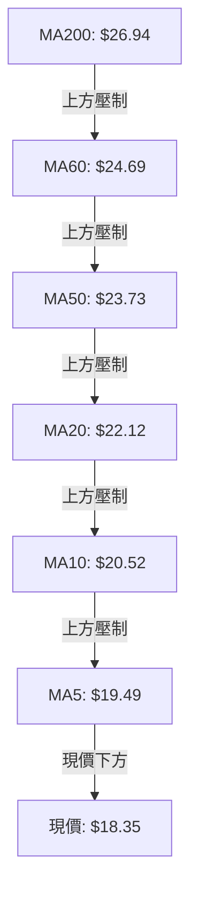
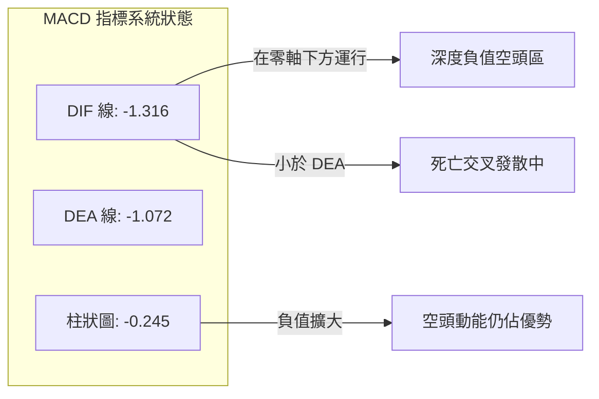
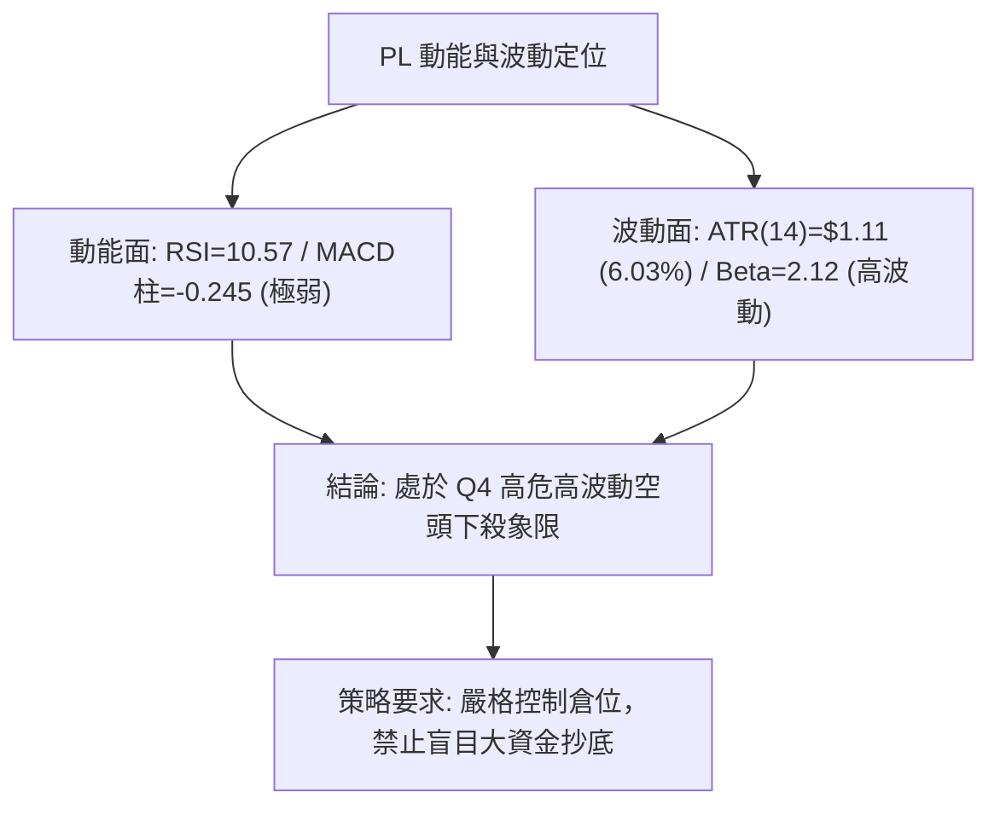
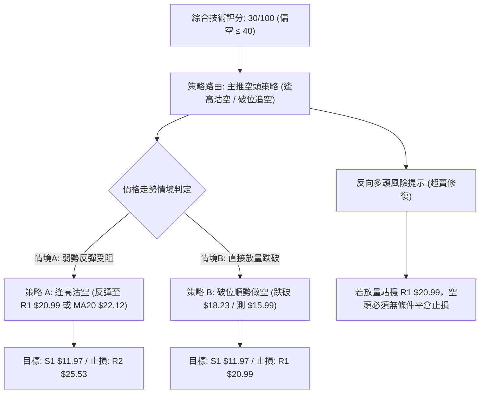
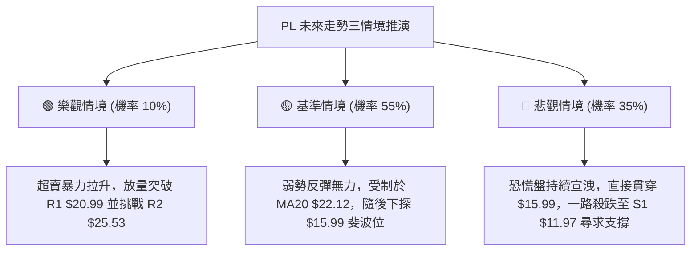

# PL 技術分析報告

> **報告日期**：2026-09-03 ｜ **語言**：繁體中文 ｜ **數據來源**：Yahoo Finance ｜ **當前價格**：$18.35

---

## 目錄

| 章節 | 內容 |
|------|------|
| [1. 技術面概覽](#1-技術面概覽) | 訊號儀表板、核心指標、評分卡 |
| [2. 趨勢分析](#2-趨勢分析) | 多時框趨勢、長中短期走勢 |
| [3. 圖表形態分析](#3-圖表形態分析) | 形態識別、K線組合、目標價 |
| [4. 支撐與阻力](#4-支撐與阻力) | 關鍵價位、斐波那契回調 |
| [5. 技術指標深度解讀](#5-技術指標深度解讀) | MA/RSI/MACD/布林/成交量 |
| [6. 動能與波動率](#6-動能與波動率) | 動能評估、ATR、Beta |
| [7. 多時框架總結](#7-多時框架總結) | 時框架評分矩陣 |
| [8. 交易策略建議](#8-交易策略建議) | 多空策略、風險報酬比 |
| [9. 風險提示與監控](#9-風險提示與監控) | 監控指標、風險場景 |

---

## 1. 技術面概覽

### 🎯 技術訊號儀表板



### 📊 核心指標速覽表

| 指標類別 | 指標名稱 | 當前數值 | 訊號 | 解讀 |
|----------|----------|----------|------|------|
| **價格** | 當前價格 | $18.35 | 🔴 | 位於 52 週區間下緣 (26.6%)，跌破短中長期所有主要均線 |
| **均線** | MA20 | $22.12 | 🔴 | 價格低於 MA20 達 -17.04%，短期下行趨勢嚴峻 |
| **均線** | MA50 | $23.73 | 🔴 | 價格低於 MA50 達 -22.67%，中期空方控盤 |
| **均線** | MA200 | $26.94 | 🔴 | 均線形成典型空頭排列 (MA20 < MA50 < MA200)，長期走勢轉弱 |
| **動能** | RSI(14) | 10.57 | 🟢 | 極度超賣區間 (<30)，短線下殺動能消耗殆盡，具技術性修復需求 |
| **動能** | MACD(12,26,9) | -1.316 / -1.072 | 🔴 | DIF 與 DEA 雙雙位於負值區，柱狀圖 -0.245 維持擴散偏空 |
| **動能** | Stoch %K / %D | 7.03 / 7.98 | 🟢 | 雙線低於 10 進入超深超賣區，隨時可能出現低檔黃金交叉 |
| **趨勢** | ADX(14) / DMI | 23.99 | 🟡 | ADX < 25 表明單邊暴跌趨勢開始減速，-DI(34.68) 仍強於 +DI(14.17) |
| **通道** | 布林通道 %B | 0.02 | 🟢 | 貼近布林下軌 $18.23，短線存在向中軌 $22.12 回歸之均值回歸拉力 |
| **量能** | 當日量 / 20日均量 | 31.49M / 6.47M | 🔴 | 量比達 4.87x，放量下跌顯示籌碼恐慌拋售，OBV 跌破均線 |
| **波動** | ATR(14) | $1.11 | 🟡 | 日波動率達 6.03%，波動維持中高水位，需嚴格設定止損幅距 |

### 🏆 技術評分卡

```
╔══════════════════════════════════════════════════════════════╗
║                 技術評分卡 — PL (2026-09-03)                 ║
╠══════════════════════════════════════════════════════════════╣
║ 趨勢強度 (Trend)     ██████░░░░░░░░░░░░░░  30/100  🔴 空頭排列║
║ 動能指標 (Momentum)  ████████░░░░░░░░░░░░  40/100  🟡 極端超賣║
║ 支撐穩定度 (Support) ██████░░░░░░░░░░░░░░  30/100  🔴 逼近下軌║
║ 成交量配合 (Volume)  ████░░░░░░░░░░░░░░░░  20/100  🔴 放量下殺║
║ 形態完整度 (Pattern) ████████░░░░░░░░░░░░  40/100  🟡 頭部確立║
║ 均線架構 (MA Align)  ████░░░░░░░░░░░░░░░░  20/100  🔴 死亡排列║
╠══════════════════════════════════════════════════════════════╣
║ 綜合技術評分         ██████░░░░░░░░░░░░░░  30/100  🔴 強烈偏空║
╚══════════════════════════════════════════════════════════════╝
```

---

## 2. 趨勢分析

### 🌐 多時框趨勢分析



### 📈 長期趨勢 — 12個月走勢圖（Unicode）

```
PL 月線走勢圖（2025-10 至 2026-09）
價格軸 ($)
$52.00 ┤                                     ● $51.14 (2026-05 波段頂部)
$46.00 ┤                                    ╱ ╲
$40.00 ┤                                   ╱   ╲
$34.00 ┤                                  ●     ● $33.13 (2026-06 破位)
$28.00 ┤                            ●    ╱       ╲
$22.00 ┤                      ●    ╱ ╲  ╱         ● $20.48 (2026-07)
$16.00 ┤          ●     ●    ╱ ╲  ╱   ╲╱           ● $19.85 ───● $18.35 (現在)
$10.00 ┤    ●    ╱ ╲   ╱ ╲  ╱   ╲╱
 $4.00 ┤───●────╱───╲─╱───╲╱──────────────────────────────────────
       └────┬─────┬─────┬─────┬─────┬─────┬─────┬─────┬─────┬─────┬─────┬─────
          10月  11月  12月   1月   2月   3月   4月   5月   6月   7月   8月   9月
         2025  2025  2025  2026  2026  2026  2026  2026  2026  2026  2026  2026
```

#### 走勢特徵分析表格

| 階段區間 | 時間跨度 | 起訖價格 | 區間漲跌幅 | 走勢特徵與結構分析 |
|----------|----------|----------|------------|--------------------|
| **初升築底段** | 2024-09 ~ 2025-08 | $2.23 → $7.09 | +217.9% | 低檔箱體震盪吸籌，突破前高後量能逐步溫和放大 |
| **主升加速段** | 2025-09 ~ 2026-05 | $12.98 → $51.14 | +293.9% | 連續單邊噴出，月線級別呈現大陽線推進，創下 52 週高點 $51.76 |
| **崩跌退潮段** | 2026-06 ~ 2026-07 | $51.14 → $20.48 | -59.9% | 頂部放量跳水，直接灌破短期與中期均線支撐，形態迅速瓦解 |
| **弱勢尋底段** | 2026-08 ~ 2026-09 | $19.85 → $18.35 | -7.5% | 跌勢減速但未見有效買盤，逼近斐波那契 78.6% 回調位 $15.99 |

### 📊 中期趨勢（週線分析）

```
中期壓力與支撐結構示意圖 (週線層級)
════════════════════════════════════════════════════════════════════════════
$51.76 ── 52週最高點 (天花板阻力)
          │
$27.57 ── R3 (波段反彈高點阻力 / 2026-03 突破平台)
          │
$25.53 ── R2 (強阻力 / 密集成交區)
          │
$20.99 ── R1 (短線第一道關鍵阻力 / 8月反彈高點聚類)
──────────┼─────────────────────────────────────────────────────────────
$18.35 ── 當前收盤價 (落於布林下軌 $18.23 邊緣)
──────────┼─────────────────────────────────────────────────────────────
$15.99 ── 斐波那契 78.6% 黃金回調支撐位
          │
$11.97 ── S1 支撐位 (近一年波段低點聚類)
          │
$10.52 ── S2 強支撐位 (2025年Q3起漲平台低點聚類)
════════════════════════════════════════════════════════════════════════════
```

### ⚡ 趨勢強度評估（ADX 解讀）



#### ADX 強度對照表

| 指標名稱 | 數值 | 評估區間 | 趨勢性質解讀 |
|----------|------|----------|--------------|
| **ADX(14)** | 23.99 | 20 - 25 (弱趨勢/趨勢減弱) | 單邊主跌段動能減退，空頭殺戮進入衰竭與區間震盪階段 |
| **+DI(14)** | 14.17 | < 20 (多方極度疲弱) | 買盤動能嚴重不足，無主動攻擊意願 |
| **-DI(14)** | 34.68 | > 30 (空方主導) | 空方力量仍顯著佔優，壓制任何未放量之反彈 |

---

## 3. 圖表形態分析

### 🔍 形態識別系統



#### 形態識別與信心度評估表

| 形態名稱 | 信心度 (%) | 判斷依據（引用數據） | 完成度 (%) | 目標價推算與計算式 |
|----------|------------|----------------------|------------|--------------------|
| **大型頭部派發 (倒V頂)** | 85% | 2026-05 創頂 $51.76 後連續 4 週巨量下跌，跌破 50% 頸線 $29.01 | 100% | 跌破頸線 $29.01，量測跌幅至 S1 $11.97 |
| **短期下降通道超賣** | 70% | 價格連續觸及日線布林下軌 $18.23，RSI(14) 跌至 10.57 | 90% | 均值回歸反彈目標為 BB中軌(MA20) = $22.12 |
| **雙底形態 (潛在)** | 25% | 目前僅形成第一隻腳 ($18.35)，尚未出現右底與確認訊號 | 20% | 訊號不足，僅做指標型解讀，不預先假設雙底完成 |

### 🕯️ 重要K線形態分析

| 月份 | 收盤價 | K線形態 | 解讀 | 訊號 |
|------|--------|---------|------|------|
| **2026-05** | $51.14 | 長上影流星線 (高點 $51.76) | 創 52 週新高後多頭力竭，高檔獲利了結賣壓湧現 | 🔴 空頭反轉 |
| **2026-06** | $33.13 | 巨量長黑實體破位棒 | 一舉貫穿 MA20 與短期上升趨勢線，多頭結構瓦解 | 🔴 強烈看空 |
| **2026-07** | $20.48 | 空頭續跌大黑K | 跌破 MA60 與 MA120，空方全面主導盤面 | 🔴 空頭延續 |
| **2026-08** | $19.85 | 低檔下影十字星線 | 殺跌動能首度放緩，多空於 $20 關卡展開激烈拉鋸 | 🟡 多空僵持 |
| **2026-09** | $18.35 | 放量下探實體黑K | 跌破 8 月盤整低點，測試布林下軌與 $18 關卡 | 🔴 空方再測底 |

### 📉 ASCII 走勢形態示意圖

```
PL 頂部派發與下降通道結構圖
$51.76 ─────── 頂部反轉點 (2026-05)
               ╲
                ╲ 派發急跌段 (2026-06 週成交破億股)
                 ╲
$29.01 ─────────── 50% 頸線破位位
                   ╲
                    ╲
$22.12 ────────────── MA20 / 布林中軌 (反彈強阻力)
                      ╲
$18.35 ──────────────── ● 現價 (布林下軌 $18.23 超賣支撐處)
                       │
$15.99 ────────────────┴── 斐波那契 78.6% 回調關鍵支撐
```

### 🎯 形態目標價計算

1. **頭部頸線跌破量測目標**：
   - 頂部高點：$51.76
   - 形態頸線（50% 斐波那契位）：$29.01
   - 跌破後等幅測量滿足點計算：
     $$\text{理論目標價} = 29.01 - (51.76 - 29.01) = 29.01 - 22.75 = \$6.26 \text{ (恰為 52W Low)}$$
2. **短期均值回歸反彈目標**：
   - 現價 $18.35 若在布林下軌 $18.23 與斐波那契 78.6% ($15.99) 獲得超賣修復動能，向上第一反彈目標為阻力位 **R1 ($20.99)**，第二反彈目標為布林中軌 / MA20 **($22.12)**。

---

## 4. 支撐與阻力

### 🗺️ 關鍵價位分布圖（Unicode）

```
PL 價位結構分布圖
══════════════════════════════════════════════════════════════════════════
$27.57 ║████████████████████████████████████████║ 強阻力 R3 (波段高點聚類)
$25.53 ║██████████████████████████████          ║ 中期阻力 R2 (MA60阻力區)
$20.99 ║████████████████████████                ║ 近期關鍵阻力 R1 (反彈頸線)
───────╫────────────────────────────────────────╢
$18.35 ╠════════════════════════════════════════╣ ◄ 現價 ($18.35)
───────╫────────────────────────────────────────╢
$15.99 ║▓▓▓▓▓▓▓▓▓▓▓▓▓▓▓▓▓▓▓▓                    ║ 斐波那契 78.6% 黃金支撐位
$11.97 ║████████████████████████████████        ║ 關鍵支撐 S1 (波段低點聚類)
$10.52 ║████████████████████████████████████████║ 強支撐 S2 (波段起漲聚類)
══════════════════════════════════════════════════════════════════════════
```

### 🚧 阻力位分析表

| 阻力級別 | 價位 | 形成原因 | 突破難度 | 重要性 |
|----------|------|----------|----------|--------|
| **R1** | $20.99 | 近一年波段高點聚類，8月下旬反彈受阻高點區 (+14.39%) | 中等 | 🟢 短期多空分水嶺，站上此處方能化解單邊下殺 |
| **R2** | $25.53 | 近一年密集成交波段高點，接近 MA60 ($24.69) (+39.13%) | 極高 | 🟡 中期強阻力，堆積大量套牢籌碼 |
| **R3** | $27.57 | 近一年波段高點聚類，跌破前的多頭平台核心 (+50.24%) | 極高 | 🔴 中長期多頭防線翻轉之重壓區 |

### 🛡️ 支撐位分析表

| 支撐級別 | 價位 | 形成原因 | 守住機率 | 重要性 |
|----------|------|----------|----------|--------|
| **斐波支撐** | $15.99 | 52週區間 ($6.26 → $51.76) 之 78.6% 斐波那契回調位 | 65% | 🟢 短線多頭最後防線，超跌反彈關鍵觸發區 |
| **S1** | $11.97 | 近一年波段低點聚類，2025年9月主升段起漲缺口平台 (-34.77%) | 80% | 🟡 中期核心結構支撐，具備強大籌碼沉澱 |
| **S2** | $10.52 | 近一年波段低點聚類，歷史多重底部平台密集區 (-42.67%) | 90% | 🔴 長期戰略底線，不容有失之極限支撐 |

### 📐 斐波那契回調位分析

依據 52 週區間最高價 **$51.76** 至最低價 **$6.26** 完整計算回調序列：

```
斐波那契回調層級分布 ($6.26 → $51.76)
  0.0% (52W High)  ── $51.76 
 23.6%             ── $41.02 
 38.2%             ── $34.38 
 50.0%             ── $29.01 (中期多空分水嶺，已跌破)
 61.8%             ── $23.64 (黃金分割位，已轉化為強阻力)
 78.6%             ── $15.99 ◄── 【當前現價 $18.35 逼近此區間】
100.0% (52W Low)   ── $ 6.26 
```

- **位置解讀**：現價 **$18.35** 目前處於 **61.8% ($23.64)** 與 **78.6% ($15.99)** 回調區間內，且已深度跌破 50% ($29.01) 及 61.8% 關鍵防線。
- **技術意涵**：在技術分析中，回調跌破 61.8% 代表原先由 $6.26 漲至 $51.76 的多頭主升趨勢已被徹底瓦解，走勢退化為「深幅回撤尋底」格局。當前下檔唯一的斐波那契緩衝帶為 **78.6% ($15.99)**，若該位置失守，價格將面臨回測 100% 起漲點 **$6.26** 的高度風險。

---

## 5. 技術指標深度解讀

### 🎛️ 指標訊號總覽



### 📈 移動平均線排列分析



#### 均線數據明細表

| 均線名稱 | 數值 | 距現價差距 (%) | 走勢狀態 | 多空訊號 |
|----------|------|----------------|----------|----------|
| **MA5** | $19.49 | -5.83% | 短期均線極速下彎 | 🔴 空頭壓制 |
| **MA10** | $20.52 | -10.56% | 持續發散下行 | 🔴 空頭壓制 |
| **MA20** | $22.12 | -17.04% | 扣高走低，下行斜率陡峭 | 🔴 空頭主導 |
| **MA50** | $23.73 | -22.67% | 中期生命線失守 | 🔴 中期偏空 |
| **MA60** | $24.69 | -25.68% | 季線下行阻力沉重 | 🔴 中期偏空 |
| **MA120** | $30.98 | -40.78% | 半年線下彎，主升段被否定 | 🔴 長期偏空 |
| **MA200** | $26.94 | -31.89% | 年線失守，均線形成標準空頭排列 | 🔴 長期看空 |

### 📉 RSI(14) 分析

```
RSI(14) 當前強度：10.57
[███░░░░░░░░░░░░░░░░░░░░░░░░░░░░░░░░░░░░░░░] 10.57% (極度超賣 <30)
 0             30                      70            100
 └─ 極度超賣區 ─┴────── 中性常態區 ────┴─ 極度超買區 ─┘
```

- **超賣狀況解讀**：RSI(14) 來到 **10.57**，為近 24 個月以來最極端超賣讀數（遠低於 30 門檻），顯示短期空方拋壓已經處於情緒化宣洩的尾端，隨時存在均值回歸的技術性報復反彈需求。
- **背離分析判斷**：
  - **日線級別**：數據顯示「RSI 背離：無明顯背離」。價格創新低，RSI 亦同步下探至極低點，未形成典型底背離，說明拋盤為實質籌碼外逃，非虛跌。
  - **週線級別**：2026-07-26 週收盤 $20.47 時週 RSI 為 10.2；最新 2026-09-06 收盤 $18.35 時週 RSI 為 10.6。價格微破前低但 RSI 數值基本持平，出現**潛在弱底背離雛形**，但仍需等待一根陽線放量確認。

### 📊 MACD(12/26/9) 訊號解讀



- **MACD 數值**：DIF (-1.316) 低於 DEA (-1.072)，處於零軸下方且形成空頭排列。
- **柱狀圖動態**：MACD Hist 為 **-0.245**，負柱持續向下拉伸，顯示目前空方並未收手。在 MACD 柱狀圖收斂至 0 軸或出現低檔黃金交叉前，不可盲目重倉抄底。

### 📦 布林通道分析

```
布林通道 (BB 20, 2) 結構示意圖
$26.01 ───────────────────────────────── BB 上軌
        │
        │
$22.12 ───────────────────────────────── BB 中軌 (MA20)
        │
$18.35 ─────────── ◄ 現價 (BB %B = 0.02，已貼近極限邊界)
$18.23 ───────────────────────────────── BB 下軌
```

- **帶寬與位置**：BB 上軌為 **$26.01**，BB 中軌為 **$22.12**，BB 下軌為 **$18.23**。現價 **$18.35** 距離下軌僅 $0.12，**%B 數值僅為 0.02**。
- **極值意義**：%B 接近 0.00 代表價格已觸及正態分佈統計學的負二倍標準差下界，此處通常會誘發統計套利的短線多頭買盤，下軌 **$18.23** 具備強烈短線防守意涵。

### 💹 成交量分析（量價配合度）

```
成交量放大情況 (量價背離分析)
當日成交量:  31,495,212 股 [████████████████████████████████████] (量比: 4.87x)
20日均成交量: 6,468,026 股 [███████░░░░░░░░░░░░░░░░░░░░░░░░░░░░]
50日均成交量: 8,411,194 股 [█████████░░░░░░░░░░░░░░░░░░░░░░░░░░]
```

- **量能特徵**：最新單日成交量高達 3,149.5 萬股，較 20 日均量放大 **4.87 倍**，屬於顯著的「放量長黑破位」。
- **OBV 趨勢**：OBV < MA，能量潮指標持續下行，顯示量能結構呈現「出貨大於吸籌」，大資金尚未出現規模化翻多承接跡象，目前放量主要來自恐慌盤與融資止損盤的被動釋放。

---

## 6. 動能與波動率

### ⚡ 動能評估四象限

| 象限 | 動能維度 | 波動率維度 | 當前狀態判定 | 交易策略與風險含義 |
|------|----------|------------|--------------|--------------------|
| **Q1 (最佳動能)** | 強動能 (多頭) | 低波動 (穩定) | — | 趨勢穩健上行，適合順勢做多持股 |
| **Q2 (盤整觀望)** | 弱動能 (中性) | 低波動 (壓縮) | — | 區間震盪收斂，等待方向突破 |
| **Q3 (強勢投機)** | 強動能 (單邊) | 高波動 (劇烈) | — | 單邊大行情，適合突破追價與嚴格風控 |
| **Q4 (高危尋底)** | **弱動能 (空方)** | **高波動 (劇烈)** | **✓ (PL 目前落在此區間)** | **空方宣洩、波動劇烈、左側交易高風險區** |



### 📊 ATR 波動率分析

- **ATR(14) 數值**：**$1.11**，佔目前股價的 **6.03%**。
- **波動特性解讀**：每日平均震幅超過 6%，意味著持股隨機噪聲較大，極易觸發過於狹窄的止損點。
- **風控距離建議**：
  - 短線交易止損幅距應至少設定為 **1.5 × ATR = $1.67**。
  - 波段交易止損幅距應設定為 **2.0 × ATR = $2.22**。

### 📐 Beta 與市場相關性

- **Beta 係數**：**2.123**。
- **市場敏感度**：PL 的股價波動敏感度為大盤（S&P 500）的 2.12 倍，屬於典型的高彈性、高貝塔成長/航太科技股。在美股大盤回調或風險偏好下降時，該股跌幅往往加劇；但在市場流動性修復時，其反彈動能亦極具爆發力。

---

## 7. 多時框架總結

### 📋 時框架評分表

| 時框架 | 趨勢方向 | 動能狀態 | 均線排列 | 形態結構 | 綜合評分 | 操作建議 |
|--------|----------|----------|----------|----------|----------|----------|
| **長期 (月線)** | 🔴 空頭破位 | 弱化下行 | 跌破 MA120 | 頂部倒V派發完成 | 25/100 | 減倉觀望，嚴控長期多頭部位 |
| **中期 (週線)** | 🔴 空頭主導 | 負值發散 | MA20<50<200 | 下降階梯下行破位 | 30/100 | 反彈遇均線阻力逢高減碼 |
| **短期 (日線)** | 🟡 極端超賣 | RSI=10.57 | 全面空頭壓制 | 觸及布林下軌尋底 | 35/100 | 僅限激進投資者小倉位博反彈 |

### 🔲 綜合訊號矩陣

```
時框與指標訊號矩陣對照
┌──────────┬──────────┬──────────┬──────────┬──────────┬──────────┐
│ 時框架   │ 均線系統 │ RSI/KD   │ MACD     │ 布林通道 │ 量能(OBV)│
├──────────┼──────────┼──────────┼──────────┼──────────┼──────────┤
│ 長期月線 │  🔴 空頭 │  🔴 下行 │  🔴 轉弱 │  🔴 下軌 │  🔴 流出 │
│ 中期週線 │  🔴 空頭 │  🟡 低檔 │  🔴 負向 │  🔴 擴張 │  🔴 疲弱 │
│ 短期日線 │  🔴 空頭 │  🟢 超賣 │  🔴 綠柱 │  🟢 觸底 │  🔴 放量 │
└──────────┴──────────┴──────────┴──────────┴──────────┴──────────┘
```

### ⚖️ 多時框收斂結論

依據多時框收斂規則（規則 14）：
1. **行情性質判定**：當前日線 **ADX(14) = 23.99 (<25)**，顯示主跌段最猛烈的單邊趨勢動能開始減退，行情正由單邊暴跌轉入**「盤整尋底與震盪築底」**階段。
2. **時框優先級權重**：依規則，在中長期均線（MA50 $23.73、MA200 $26.94）全面呈空頭排列的背景下，長期與中期趨勢明確偏空。日線雖出現 RSI=10.57 與布林下軌 ($18.23) 的極端超賣，但**僅能視為反彈契機，不能定性為多頭趨勢反轉**。
3. **唯一收斂結論**：**整體趨勢「強烈偏空」（綜合評分 30/100）**。主策略鎖定為**「順應中長期空頭趨勢的空頭防守與逢高做空／破位跟進」**；超賣反彈僅供超短線激進資金小注參與，不可作為主要操作方向。

---

## 8. 交易策略建議

### 🗺️ 策略決策流程圖



### 🧭 策略路由

> **當前主策略方向 = 主推空頭策略（依綜合評分 30/100 確立）**

依據評分體系（評分 30 ≤ 40），中長期技術面由空方完全掌控。任何技術性超賣引發的上漲均應視為「逢高佈局空單」或「多頭部位減碼解套」的機會，嚴格禁止逆勢重倉做多。

### 🎯 價格情境階梯（Price Scenarios）

| 觸發條件 | 下一目標 | 後續延伸 | 情境含義 |
|----------|----------|----------|----------|
| **強勢突破 R1 ($20.99)** | R2 ($25.53) | R3 ($27.57) | 短線超賣反彈升級為波段級別均線修復，空頭部位需減碼避險 |
| **跌破布林下軌 ($18.23)** | 斐波那契 78.6% ($15.99) | S1 ($11.97) | 弱勢尋底延伸，空頭動能再度釋放，加速向下測試支撐 |
| **跌破關鍵支撐 S1 ($11.97)** | S2 ($10.52) | 52W Low ($6.26) | 中期結構徹底崩潰，進入極端深水區漫長探底 |

### 📊 情境機率分佈

| 價格情境 | 發生機率 | 主要依據與指標支撐 |
|----------|----------|--------------------|
| **弱勢回落 / 再探底** | **55%** | 均線空頭排列 (MA20<50<200)、MACD 負向擴散、OBV 放量下殺，空頭主導 |
| **區間震盪 / 超賣修復** | **35%** | ADX=23.99 (<25) 趨勢減速、RSI(14)=10.57 極度超賣、布林 %B=0.02 緊貼下軌 |
| **強勢反轉 / 連續大漲** | **10%** | 上方套牢籌碼沉重 (R1/R2)，需極大基本面利多刺激，短期機率極低 |

### 🔴 主策略詳情（空頭主導策略）

| 策略要素 | 策略 A：反彈受阻沽空 (主策略) | 策略 B：破位順勢做空 (次策略) |
|----------|--------------------------------|--------------------------------|
| **進場條件** | 價格超賣反彈至 R1 遇阻收上影線黑K | 放量跌破布林下軌 $18.23 並收於下方 |
| **進場價格** | **$20.99** (阻力位 R1 處) | **$18.23** (布林下軌破位確認) |
| **目標價 T1** | **$15.99** (斐波那契 78.6% 回調位) | **$15.99** (斐波那契 78.6% 回調位) |
| **目標價 T2** | **$11.97** (關鍵波段支撐位 S1) | **$11.97** (關鍵波段支撐位 S1) |
| **止損價格** | **$23.73** (站上 MA50 中期均線) | **$20.99** (假跌破反抽站回阻力 R1) |
| **風險報酬比** | **3.29 : 1** (獲利 $9.02 / 風險 $2.74) | **2.27 : 1** (獲利 $6.26 / 風險 $2.76) |
| **成功機率** | **65%** | **55%** |
| **建議倉位** | **15% - 20%** | **10% - 15%** |

### 🟢 反向風險觸發點（對沖提示）

- **觸發價位**：收盤價強勢收復 **$20.99 (R1)** 且伴隨 RSI 回升至 40 以上。
- **對沖處置**：若此條件成立，意味極端超賣引發強烈的「均值回歸」，空頭必須立即執行**平倉止損**或建置**等量多頭對沖**；激進多頭方可在此時以 **$20.99** 為進場點，止損設於 **$18.23**，短線博弈反彈目標 **$25.53 (R2)**。

### ⭐ 整體訊號強度評星

```
╔══════════════════════════════════════════════════════════════╗
║ 做多訊號強度：★☆☆☆☆  (1.5/5星 — 僅有技術超賣支撐，無結構確認)
║ 做空訊號強度：★★★★☆  (4.0/5星 — 均線與量價全盤偏空，順勢為王)
║ 整體可信度：  ★★★★☆  (4.0/5星 — 價位由 OHLCV 精確計算無矛盾)
╚══════════════════════════════════════════════════════════════╝
```

---

## 9. 風險提示與監控

### ✅ 關鍵監控指標 Checklist

```
╔══════════════════════════════════════════════════════════════╗
║                PL 每日交易關鍵監控 Checklist                 ║
╠══════════════════════════════════════════════════════════════╣
║ [ ] 監控項 1: 布林下軌 $18.23 是否具備實質買盤支撐           ║
║ [ ] 監控項 2: RSI(14) 能否自 10.57 脫離超賣區 (向上穿越 30)   ║
║ [ ] 監控項 3: 成交量能否收斂 (跌破 6.46M 均量表示恐慌盤止血)  ║
║ [ ] 監控項 4: MACD 柱狀圖 (-0.245) 是否開始向上收斂抽腳       ║
║ [ ] 監控項 5: 空頭防守線：收盤價是否突破阻力位 R1 ($20.99)   ║
║ [ ] 監控項 6: 空頭目標線：是否向斐波那契 78.6% ($15.99) 靠攏  ║
╚══════════════════════════════════════════════════════════════╝
```

### ⚠️ 風險場景分析



### 🛡️ 風險管理重要提醒

1. **高 Beta 波動風險控制**：
   - 本標的 Beta 高達 **2.123**，ATR 佔比達 **6.03%**，禁止使用高槓桿工具操作。單筆交易最大虧損額度不得超過總資金的 **1.0% - 1.5%**。
2. **極端超賣鈍化風險**：
   - RSI = 10.57 雖然極端，但強烈空頭趨勢中指標容易出現「低檔鈍化（即股價持續下跌而 RSI 長期趴在 10-20 之間）」。絕對不可單憑 RSI 超賣即進行左側無止損抄底。
3. **空頭部位移動停利機制**：
   - 若執行策略 A 或策略 B 空單獲利，當價格跌破 **$15.99** 時，應立即將止損點下移至進場保本價位，鎖定既有收益。

---

## 📋 報告總結

```
╔══════════════════════════════════════════════════════════════════╗
║                    PL 技術分析報告總結                          ║
╠══════════════════════════════════════════════════════════════════╣
║ 報告日期：2026-09-03                                             ║
║ 當前價格：$18.35                                                 ║
║ 分析評級：🔴 強烈偏空 / 弱勢尋底 (技術評分 30/100)               ║
║                                                                  ║
║ 關鍵結論：                                                       ║
║ ├─ 長期趨勢：🔴 空頭排列，跌破 MA120($30.98) 與年線 MA200($26.94)║
║ ├─ 中期趨勢：🔴 倒V頂確立，MA20<MA50<MA200 形成標準死亡空頭     ║
║ ├─ 短期趨勢：🟡 RSI(14)=10.57 處於極端超賣，面臨布林下軌技術拉力 ║
║ ├─ 關鍵阻力：R1: $20.99 │ R2: $25.53 │ R3: $27.57               ║
║ ├─ 關鍵支撐：斐波78.6%: $15.99 │ S1: $11.97 │ S2: $10.52        ║
║ └─ 分析師目標價：共識均價 $38.73 (區間 $25.00 - $53.00)          ║
║                                                                  ║
║ 最優策略組合：                                                   ║
║ 1. 🥇 最佳機會：逢高沽空 (策略 A) — 反彈至 $20.99 遇阻建空，     ║
║                 目標 $15.99 / $11.97，止損設 $23.73 (風報比 3.29)║
║ 2. 🥈 次選機會：破位做空 (策略 B) — 放量跌破 $18.23 追空，       ║
║                 目標 $15.99 / $11.97，止損設 $20.99 (風報比 2.27)║
║ 3. 🥉 保守選擇：空倉觀望 — 等待價格回落至 S1 $11.97 築底完成，  ║
║                 或出現明確放量突破 R1 $20.99 之右側訊號再行介入   ║
╚══════════════════════════════════════════════════════════════════╝
```

---

> ⚠️ **免責聲明**：本報告為技術分析研究，所有數據、圖表及價位推算均嚴格基於所提供之歷史價格與技術指標資訊。本報告**僅供學術研究與投資分析參考**，**不構成任何形式的實盤買賣要約或投資建議**。金融市場具高度風險，投資人應獨立判斷並自負盈虧。

---

*報告生成時間：2026-09-03 ｜ 數據來源：Yahoo Finance ｜ 分析框架：資深多時框技術分析架構*