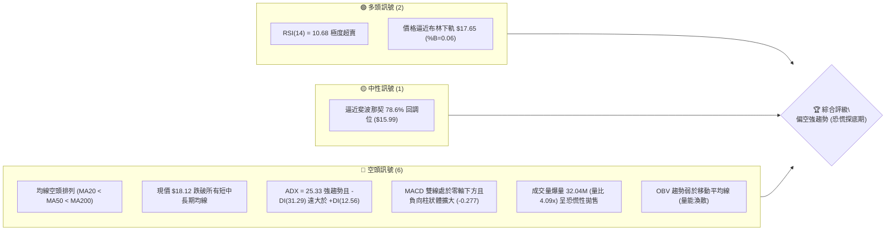
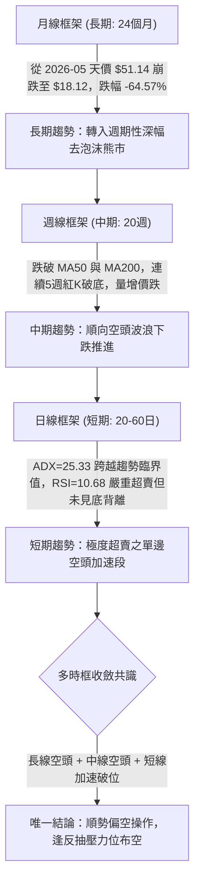
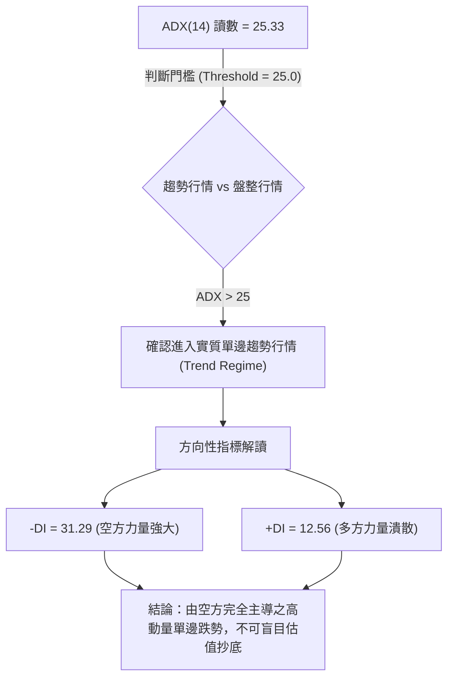
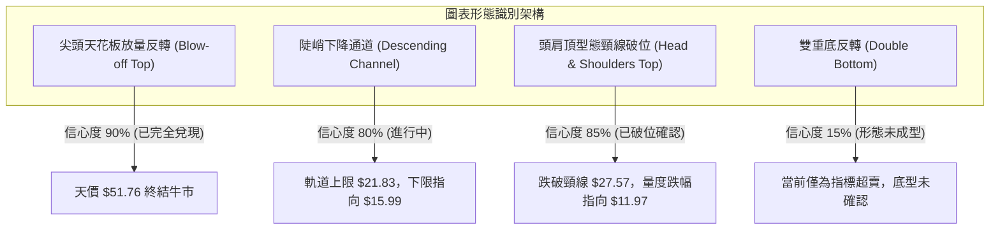
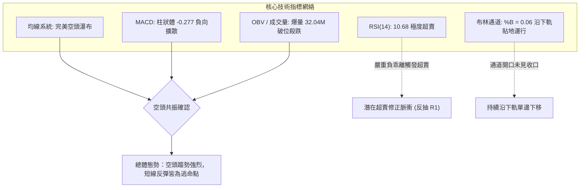
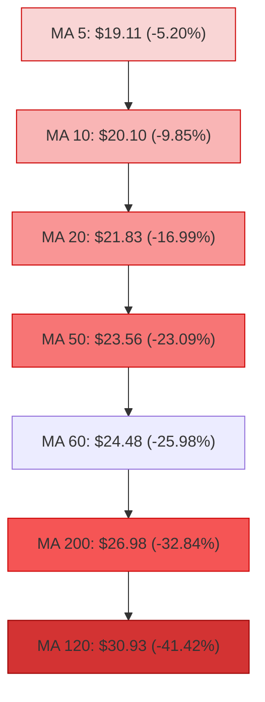
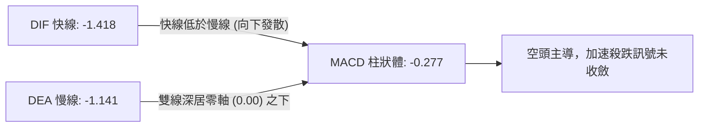
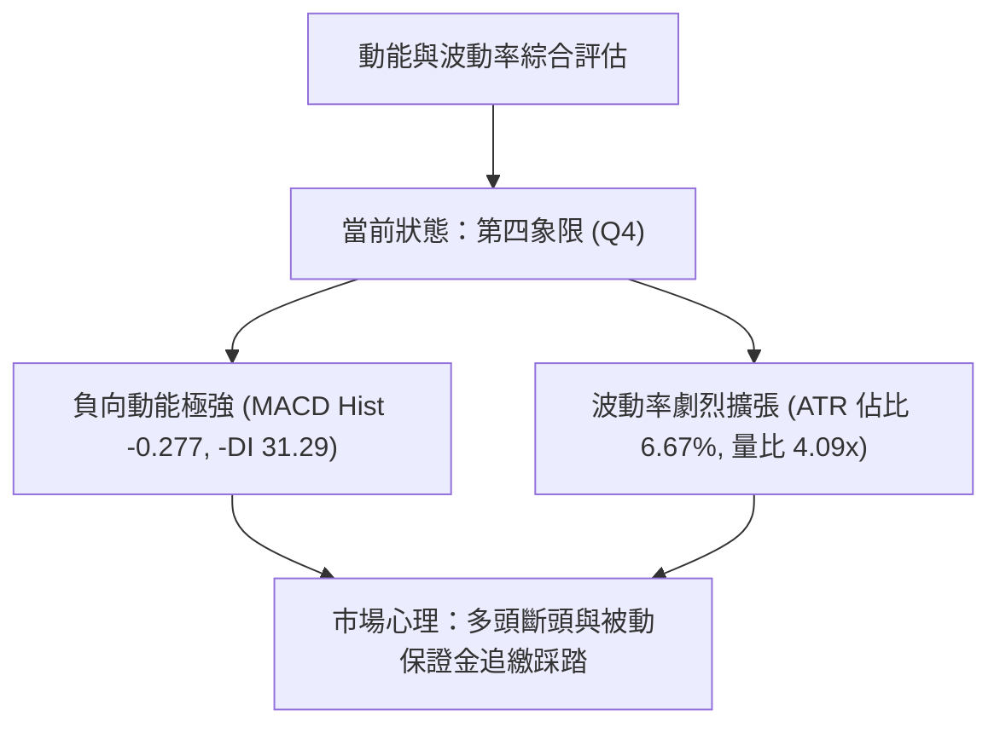
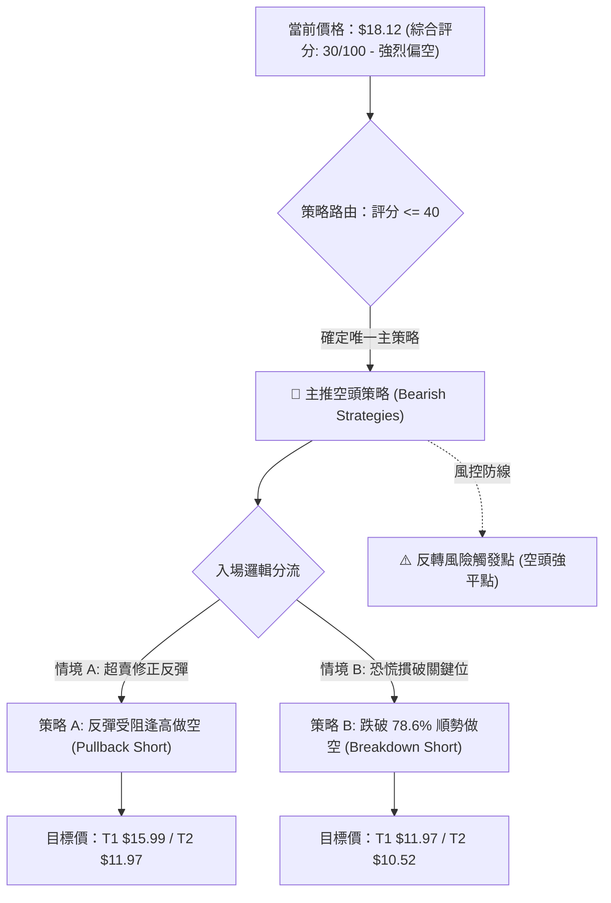
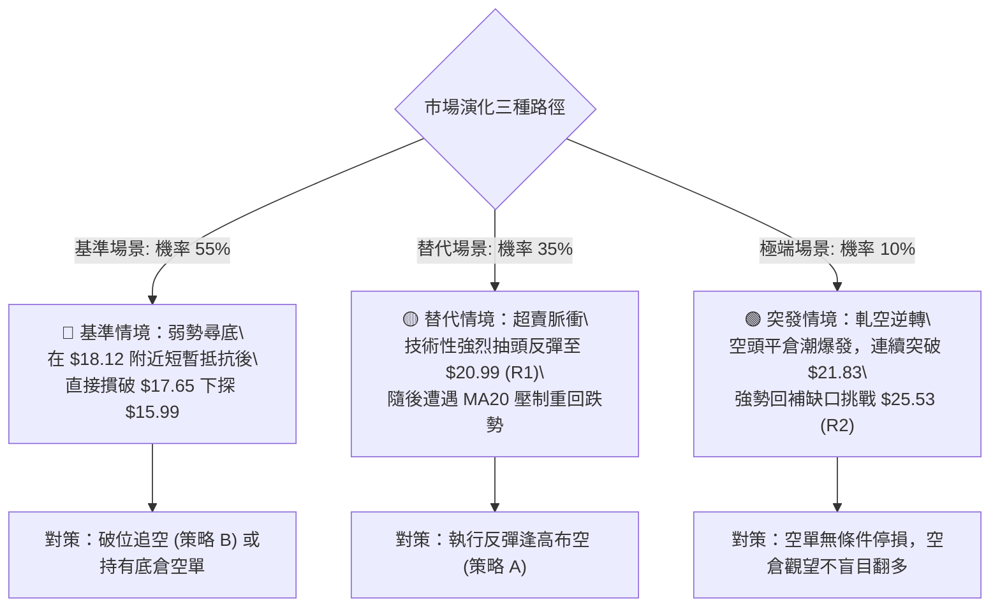

# PL 技術分析報告

> **報告日期**：2026-09-04 ｜ **語言**：繁體中文 ｜ **數據來源**：Yahoo Finance ｜ **當前價格**：$18.12

---

## 目錄

| 章節 | 內容 |
|------|------|
| [1. 技術面概覽](#1-技術面概覽) | 訊號儀表板、核心指標、評分卡 |
| [2. 趨勢分析](#2-趨勢分析) | 多時框趨勢、長中短期走勢 |
| [3. 圖表形態分析](#3-圖表形態分析) | 形態識別、K線組合、目標價 |
| [4. 支撐與阻力](#4-支撐與阻力) | 關鍵價位、斐波那契回調 |
| [5. 技術指標深度解讀](#5-技術指標深度解讀) | MA/RSI/MACD/布林/成交量 |
| [6. 動能與波動率](#6-動能與波動率) | 動能評估、ATR、Beta |
| [7. 多時框架總結](#7-多時框架總結) | 時框架評分矩陣 |
| [8. 交易策略建議](#8-交易策略建議) | 多空策略、風險報酬比 |
| [9. 風險提示與監控](#9-風險提示與監控) | 監控指標、風險場景 |

---

## 1. 技術面概覽

### 🎯 技術訊號儀表板



### 📊 核心指標速覽表

| 指標類別 | 指標名稱 | 當前數值 | 訊號 | 解讀 |
|:---|:---|:---|:---:|:---|
| **價格** | 當前價格 | $18.12 | 🔴 | 位於 52 週高低區間之 26.1% 分位，空頭絕對主導 |
| **均線** | MA20 | $21.83 | 🔴 | 現價低於 MA20 達 -16.99%，短期下行趨勢陡峭 |
| **均線** | MA50 | $23.56 | 🔴 | 價格遠落後中期均線，中期趨勢嚴重受損 |
| **均線** | MA200 | $26.98 | 🔴 | 長期牛熊分界線失守，年線形成巨大上方套牢籌碼峰 |
| **均線結構** | 均線系統 | MA20 < MA50 < MA200 | 🔴 | 典型順向空頭瀑布排列，助跌動能強勁 |
| **動能** | RSI(14) | 10.68 | 🟢 | 進入極度超賣區（<20），隨時具備技術性乖離修正反抽需求 |
| **動能** | MACD(12,26,9) | -1.418 / -1.141 | 🔴 | 雙線位於零軸下方發散，動能柱 -0.277，空頭動能尚未收斂 |
| **隨機指標** | Stoch %K / %D | 6.38 / 9.19 | 🟢 | 進入低檔鈍化區間，超賣訊號顯著 |
| **趨勢強度**| ADX / ±DI | 25.33 (-DI: 31.29) | 🔴 | ADX > 25 確認進入單邊強趨勢行情，-DI 壓倒性勝過 +DI(12.56) |
| **波動** | ATR(14) | $1.21 (6.67%) | 🔴 | 每日波動空間極大，恐慌情緒高漲，下行風險敞口顯著 |
| **通道** | 布林通道 | 下軌 $17.65 (%B=0.06) | 🟡 | 價格緊貼下軌運行，通道開口放大，下軌未見明確支撐止跌 |
| **成交量** | 最新量 / 20日均量 | 32.04M / 7.82M (4.09x) | 🔴 | 放量下挫，顯示籌碼恐慌性拋盤湧現，OBV < MA |

### 🏆 技術評分卡

```
╔══════════════════════════════════════════════════════════════════╗
║                   技術評分卡 — PL (2026-09-04)                   ║
╠══════════════════════════════════════════════════════════════════╣
║ 趨勢強度 (Trend)     ██████████████░░░░░░  70/100  🔴 空頭強趨勢 ║
║ 動能指標 (Momentum)  ████░░░░░░░░░░░░░░░░  20/100  🔴 空方絕對優勢║
║ 支撐穩定度 (Support) ███░░░░░░░░░░░░░░░░░  15/100  🔴 連續破位無撐 ║
║ 成交量配合 (Volume)  ██████░░░░░░░░░░░░░░  30/100  🔴 異常放量出逃 ║
║ 形態完整度 (Pattern) ████████░░░░░░░░░░░░  40/100  🟡 頂部瀑布下瀉 ║
║ 均線排列 (MA Stack)  ██░░░░░░░░░░░░░░░░░░  10/100  🔴 完美空頭排列 ║
╠══════════════════════════════════════════════════════════════════╣
║ 綜合技術評分         ██████░░░░░░░░░░░░░░  30/100  🔴 強烈偏空    ║
╚══════════════════════════════════════════════════════════════════╝
```

---

## 2. 趨勢分析

### 🌐 多時框趨勢分析



### 📈 長期趨勢 — 12個月走勢圖（Unicode）

```
PL 月線收盤走勢圖（2025-09 至 2026-09）
價格軸 ($)
$52 ┤                                   ● $51.14 (歷史天價 2026-05)
$48 ┤                                  / \
$44 ┤                                 /   \
$40 ┤                                /     \
$36 ┤                               ●       \
$32 ┤                                        ● $33.13 (2026-06 破位斷崖)
$28 ┤                         ●               \
$24 ┤                  ●     /                 \
$20 ┤            ●    /     /                   ● $20.48
$16 ┤           /    /     /                     \   ● $19.85
$12 ┤● $12.98  ●    /     /                       \   \
$08 ┤ \       /    /     /                         \   ● $18.12 (現價 2026-09)
     └─┬─────┬─────┬─────┬─────┬─────┬─────┬─────┬─────┬─────┬─────┬─────
      09    10    11    12    01    02    03    04    05    06    07    08    09
     (25)  (25)  (25)  (25)  (26)  (26)  (26)  (26)  (26)  (26)  (26)  (26)  (26)
```

#### 走勢特徵分析表格

| 階段區間 | 時間跨度 | 收盤價起訖 | 區間漲跌幅 | 結構特徵與量價量能 |
|:---|:---:|:---:|:---:|:---|
| **主升初始段** | 2025-09 → 2025-11 | $12.98 → $11.90 | -8.32% | 消化前波籌碼，於 $11.90 構築中繼雙重底 |
| **主升加速段** | 2025-12 → 2026-04 | $19.72 → $36.97 | +87.47% | 沿 MA20 陡峭仰角攀升，機構法人持續大額敲進 |
| **噴射高潮段** | 2026-04 → 2026-05 | $36.97 → $51.14 | +38.33% | 月線天價 $51.76（收 $51.14），單月換手率極高，量價背離巨幅爆量見頂 |
| **斷崖式踩踏** | 2026-06 → 2026-07 | $51.14 → $20.48 | -59.95% | 2026-06 週成交量飆至 100.62M，多頭主力無抵抗潰敗，形成巨型頭部 |
| **陰跌尋底段** | 2026-07 → 2026-09 | $20.48 → $18.12 | -11.52% | 反彈乏力於 $24.69 受阻，隨後破位續創新低，進入深水區超賣陰跌 |

### 📊 中期趨勢（週線分析）

```
近期週線級別價格壓力與支撐階梯分布
$27.57 ─── [ R3: 密集籌碼套牢平台 / 歷史頸線 ] ────────────────────────
           ▲
$25.53 ─── [ R2: 2026-08 反彈高點聚類 ($24.69~$25.53) ] ──────────────
           ▲
$21.83 ─── [ MA20 / 布林中軌動態反壓 ] ──────────────────────────────
           ▲
$20.99 ─── [ R1: 8月下旬跌破平台阻力位 ] ───────────────────────────────
══════════════════════════════════════════════════════════════════
$18.12 ─── [ 現價: 處於無量踩踏延伸段，距下軌僅 2.6% ] ◄── 當前位置
══════════════════════════════════════════════════════════════════
$15.99 ─── [ 斐波那契 78.6% 回調關鍵防守位 ] ─────────────────────────
           ▼
$11.97 ─── [ S1: 2025年秋季發動點支撐聚類 ] ───────────────────────────
           ▼
$10.52 ─── [ S2: 強支撐波段歷史低點聚類 ] ─────────────────────────────
```

近期 20 週數據顯示，自 2026-05-31 當週收盤 $51.14 見頂後，隔週（2026-06-07）即出現週成交量 100,622,400 股的惡意灌壓黑 K，單週暴跌至 $32.22。隨後在 8 月初反彈至 $24.69（2026-08-16），受制於 MA200（$26.98）與 R2（$25.53），成交量萎縮至僅 23.53M，呈現典型的「無量反抽、有量殺盤」。最近兩週（08-30 至 09-06），收盤價自 $19.98 摜壓至 $18.12，當週量能暴增至 85,204,292 股，週 MACD 柱狀體由紅翻綠擴大至 -0.277，宣告次級反彈波徹底夭折，進入新一輪主跌段。

### ⚡ 趨勢強度評估（ADX 解讀）



#### ADX 趨勢強度量化矩陣

| 指標名稱 | 當前讀數 | 歷史基準區間 | 訊號意涵 |
|:---|:---:|:---:|:---|
| **ADX (14)** | **25.33** | > 25.00 | **正式跨入強趨勢區間**。擺脫了 7-8 月的收斂窄幅盤整，向下爆發單邊趨勢 |
| **-DI (空方動向)** | **31.29** | > 25.00 | 空頭攻擊動能充沛，居於絕對主導統治地位 |
| **+DI (多方動向)** | **12.56** | < 15.00 | 多頭進攻意願極低，買盤承接能力被動且薄弱 |
| **DI 差值差距** | **-18.73** | 負向擴大 | 趨勢開口持續撕裂，空方未見耗竭衰退徵兆 |

---

## 3. 圖表形態分析

### 🔍 形態識別系統



#### 圖表形態信心度與目標價評估表

| 形態類別 | 信心度 | 判斷依據（引用技術數據） | 完成度 | 目標價（精確計算式） |
|:---|:---:|:---|:---:|:---|
| **大型頭肩頂/高位派發** | **85%** | 2026-04 高點 $36.97（左肩）、2026-05 天價 $51.76（頭部）、2026-08 反彈高點 $24.69~$25.53（右肩）；頸線落在 R3 **$27.57**。 | **100% (已完全破位)** | 頸線 $27.57 - 形態高度 ($51.76 - $27.57 = $24.19) = **$3.38**。中途理論折返點對齊支撐位 S1 **$11.97**。 |
| **順向下降趨勢通道** | **80%** | 上軌由 2026-06 高點、2026-08 高點 $24.69 連線壓制（當前重疊 MA20 **$21.83**）；下軌緊扣布林下軌 **$17.65** 與前波低點群。 | **75% (延續中)** | 通道下軌延伸支撐直指斐波那契 78.6% 回調位 **$15.99**。 |
| **雙重底 / 止跌底形** | **15%** | **訊號不足，僅做指標型超賣解讀**。現價 $18.12 創近一年新低，下方未見任何次級低點結構，絕不可主觀預設雙底。 | **0% (未成型)** | 數據中未偵測到底部成型結構，不予計算。 |

### 🕯️ 重要K線形態分析

| 月份/週期 | 收盤價 | K線形態特徵 | 結構技術解讀 | 訊號 |
|:---|:---:|:---|:---|:---:|
| **2026-05** | $51.14 | 巨量天線流星線 (Shooting Star) | 衝刺 $51.76 後留長上影線，月成交巨額換手，牛市主力竭盡性派發 | 🔴 |
| **2026-06** | $33.13 | 斷頭鍘刀巨陰線 (Bearish Marubozu) | 週成交量逾 1 億股破位砸盤，直接摜穿短期所有均線，趨勢瞬間崩塌 | 🔴 |
| **2026-07** | $20.48 | 空方延續大黑K | 跌勢未止，多頭棄守，布林通道急速開口向下走跌 | 🔴 |
| **2026-08** | $19.85 | 長上影弱反彈十字線 (Doji) | 月中反抽至 $24.69 旋即被法人空方大單壓制，收盤退守 $19.85，反彈無力 | 🔴 |
| **2026-09** | $18.12 | 破位光腳陰線 (進行中) | 當週放量至 85.20M，跌穿 $19.85 前低防線，賣壓加速湧現 | 🔴 |

### 📉 ASCII 走勢形態示意圖

```
PL 頭肩頂破位與下降通道運行示意圖
價格 ($)
$51.76 ┼                          ● [頭部 Head: 2026-05 天價]
       │                         / \
$36.97 ┼          ● [左肩 Left] /   \
       │         / \           /     \
$27.57 ┼────────/───\─────────/───────\────── [頸線 Neckline / R3] ─────
       │       /     \       /         \       ● [弱右肩 Right: $24.69~$25.53]
$21.83 ┼──────/───────\─────/───────────\─────/─\─────── [MA20 / 通道上軌]
       │     /         \   /             \   /   \
$18.12 ┼────/───────────●─/───────────────\─/─────● [現價: 破位通道下探]
       │   /            $20.48             ●       
$15.99 ┼──/─────────────────────────────────┼───── [斐波那契 78.6% 緩衝]
       │ /                                 │ 
$11.97 ┼●──────────────────────────────────┴───── [頭肩頂中期理論測幅位 S1]
       └────────────────────────────────────────────────────────
```

### 🎯 形態目標價計算

依據傳統道氏理論與形態測量法則，頭肩頂突破頸線後的最小下跌目標幅度計算方式為：
1. **頸線基點**：鎖定 2026 年中樞關鍵支撐聚類 R3，數值為 **$27.57**。
2. **頭部極值**：2026-05 歷史波段最高點，數值為 **$51.76**。
3. **垂直形態高度 ($H$)**：
   $$H = 51.76 - 27.57 = 24.19$$
4. **理論最低目標價**：
   $$\text{Target}_{\text{Full}} = \text{頸線} - H = 27.57 - 24.19 = \$3.38$$
5. **第一階段量度支撐折返點**（結合斐波那契回調結構與歷史聚類）：
   - 第一階目標位（Fib 78.6%）：**$15.99**
   - 第二階中期目標位（對齊歷史實體支撐 S1）：**$11.97**（跌破頸線後回撤幅度之 64.5% 處）。

---

## 4. 支撐與阻力

### 🗺️ 關鍵價位分布圖（Unicode）

```
PL 關鍵價位結構分布圖（嚴格依據歷史 OHLCV 聚類）
══════════════════════════════════════════════════════════════════
$27.57 ║████████████████████████████████║ 強阻力 R3 (頸線位 / MA200 反壓區)
$25.53 ║████████████████████████        ║ 阻力 R2 (8月中旬反彈密集高點聚類)
$20.99 ║████████████████                ║ 近期核心阻力 R1 (MA5/MA10/前破位點)
═══════╬════════════════════════════════╬═════════════════════════
$18.12 ╠════════════════════════════════╣ ◄── 現價 ($18.12，布林下軌 $17.65)
═══════╬════════════════════════════════╬═════════════════════════
$15.99 ║▓▓▓▓▓▓▓▓▓▓▓▓▓▓                  ║ 斐波那契 78.6% 回調關鍵緩衝帶
$11.97 ║██████████████████████          ║ 強支撐 S1 (近一年波段歷史低點聚類)
$10.52 ║████████████████████████████    ║ 極強支撐 S2 (2025主升段發動起漲點)
══════════════════════════════════════════════════════════════════
```

### 🚧 阻力位分析表

所有阻力數值嚴格引用系統聚類數據，不自行增刪捏造：

| 阻力級別 | 精確價位 | 距現價空間 | 技術成因與技術共振 | 突破難度 | 戰略重要性 |
|:---|:---:|:---:|:---|:---:|:---:|
| **R1** | **$20.99** | +15.84% | 近一年波段高點聚類；與 MA10 ($20.10) 及 MA20 ($21.83) 形成帶狀共振壓制區 | 🔴 極高 | 短線空頭第一防禦防線，不突破代表弱勢延續 |
| **R2** | **$25.53** | +40.89% | 2026-08 波段反彈高點聚類；與 MA240 ($24.71) 及布林上軌 ($26.01) 共振 | 🔴 難以逾越 | 中期反轉確認位，未重返此位前中期趨勢均為空頭 |
| **R3** | **$27.57** | +52.15% | 2026年上半年大型套牢頭部頸線；與長期牛熊線 MA200 ($26.98) 形成天花板壓制 | 🔴 鋼鐵阻力 | 長期多空分水嶺，大量機構停損與套牢籌碼峰匯集處 |

### 🛡️ 支撐位分析表

| 支撐級別 | 精確價位 | 距現價空間 | 技術成因與支撐強度 | 守住機率 | 戰略重要性 |
|:---|:---:|:---:|:---|:---:|:---:|
| **Fib 78.6%** | **$15.99** | -11.75% | 52 週完整牛市循環回調之 78.6% 斐波那契位，多頭最後心理防線 | 🟡 45% | 技術性超賣反彈最可能觸發之煞車位置 |
| **S1** | **$11.97** | -33.94% | 近一年波段低點聚類（2025-11 平台低點 $11.90 聚類重合區） | 🟢 65% | 機構核心基本面長期價值承接區，形態測幅落點 |
| **S2** | **$10.52** | -41.94% | 近一年波段極端低點聚類，歷史多頭突破巨量換手底座 | 🟢 85% | 終極週期底部，若跌破代表公司結構性惡化 |

### 📐 斐波那契回調位分析

依據 52 週絕對極值區間（低點 **$6.26** 至 高點 **$51.76**，波段總垂直振幅 **$45.50**）計算之黃金分割水位：

| 斐波那契層級 | 精確點位 | 距現價相對位置 | 當前技術結構解析 |
|:---:|:---:|:---:|:---|
| **0.0% (52W High)** | **$51.76** | +185.65% | 歷史週期大頂，極端多頭狂熱終結點 |
| **23.6%** | **$41.02** | +126.38% | 2026-05 跌破之第一級別回調位，已徹底失效 |
| **38.2%** | **$34.38** | +89.73% | 牛市半山腰，6月斷崖殺跌瞬間摜破 |
| **50.0%** | **$29.01** | +60.10% | 多空中樞平衡位，跌破後確認牛市完全終結 |
| **61.8%** | **$23.64** | +30.46% | 黃金分割黃金支撐位，8月中旬弱反彈即在此受阻回落，轉化為強阻力 |
| **78.6%** | **$15.99** | -11.75% | **現價 ($18.12) 正朝此位高速墜落**，落於 61.8% 與 78.6% 之間 |
| **100.0% (52W Low)**| **$6.26** | -65.45% | 原始牛市起點，若全面去泡沫化將回測此底 |

**當前結構深度解讀**：現價 $18.12 已徹底失守 61.8% 關鍵黃金分割位（$23.64），技術分析公理指出：一旦資產價格跌破 61.8% 回調位且均線轉為空頭排列，該回調不再屬於「強勢回檔」，而是確立為「趨勢反轉」。現價正處於 $23.64 至 $15.99（78.6%）的真空下墜區，指標極度超賣可能在 $15.99 附近產生脈衝式抵抗。

---

## 5. 技術指標深度解讀

### 🎛️ 指標訊號總覽



### 📈 移動平均線排列分析



均線系統呈現教科書式的空頭完全排列：
- **短期均線**：MA5 ($19.11) 與 MA10 ($20.10) 呈 45 度角向右下方俯衝，過去一週對價格形成貼身凌遲壓迫。
- **中期均線**：MA20 ($21.83) 迅速下穿 MA50 ($23.56) 與 MA60 ($24.48)，中天期死亡交叉形成密集的蓋頭反壓。
- **長期均線**：MA200 ($26.98) 已於 8 月下旬正式失守，現價與 MA200 負乖離率高達 **-32.84%**，顯示深幅技術修正。

### 📉 RSI(14) 分析

```
RSI(14) 讀數儀表盤
0        10.68  20       30               50               70              100
├──────────┼────┼────────┼────────────────┼────────────────┼────────────────┤
[ 極端超賣區 ]  ▲ [超賣區]      [ 中性平衡區 ]         [ 超買區 ]      [ 極端超買區 ]
                現價 (10.68)
進度條: █░░░░░░░░░░░░░░░░░░░░░░░░░░░░░░░░░░░░░░░░  10.68%
```

- **超賣狀況**：RSI(14) 報 **10.68**，數值跌入 15 以下的罕見歷史極值區。此數值顯示市場處於極度情緒化拋售（Panic Selling）狀態。
- **背離判斷**：
  - **日線層面**：價格由 $19.98 跌至 $18.12，RSI 由 26.6 驟降至 10.7，指標同步創下新低，**並無底背離（Bullish Divergence）徵兆**。
  - **週線層面**：7 月底 RSI 為 10.2（收盤 $20.47），當前價格跌至 $18.12 時 RSI 報 10.7，雖然週線呈現微弱的斜率減緩，但價格與指標未拉開足夠級距，系統判定為「**無明顯背離**」。缺乏底背離意味著跌勢仍由動能驅動，尚未建立反轉底座。

### 📊 MACD(12,26,9) 訊號解讀



- **絕對讀數**：DIF (-1.418) < DEA (-1.141)，二者均在負值區深處向下擴散。
- **柱狀體動能**：Histogram 讀數為 **-0.277**，呈現連續負向增長，並未收縮翻紅。這直接印證了 ADX 所指示的「單邊下跌強趨勢」，目前空頭動能仍處於主動釋放期，排除任何盲目做多可能。

### 📦 布林通道分析

```
PL 日線布林通道 (20, 2) 結構示意圖
$26.01 ┬──────────────────────────────────────────── 上軌 (Upper Band)
       │                                     
$21.83 ┼──────────────────────────────────────────── 中軌 (MA20)
       │                              \      
       │                               \     
$18.12 ┼────────────────────────────────●─────────── 現價 ($18.12, %B = 0.06)
$17.65 ┴─────────────────────────────────\────────── 下軌 (Lower Band)
```

- **通道帶寬與形態**：布林帶寬度為 $26.01 - $17.65 = $8.36（相對中軌寬度高達 38.3%），帶寬呈擴張性開口，宣告價格脫離震盪、選擇向下破位。
- **%B 指標解析**：%B 僅為 **0.06**，價格無限逼近下軌（$17.65）。在經典技術分析中，當通道開口放大且 %B 持續緊貼 0.0~0.1 運行，此現象稱為「**騎乘下軌（Walking the Lower Band）**」，為強烈單邊殺跌特徵，切不可將觸及下軌誤判為買進訊號。

### 💹 成交量分析（量價配合度）

- **異常成交量異動**：最新單日成交量高達 **32,038,992 股**，較 20 日均量（7,824,095 股）爆出 **4.09 倍** 之天量。
- **量價關係解讀**：
  1. **巨量收跌**：在持續陰跌後再度爆出 4 倍均量長黑，顯示機構投資者進行無底線停損砍倉或期權衍生品做空平倉踩踏。
  2. **籌碼換手意涵**：雖然天量黑 K 偶爾伴隨短線籌碼耗竭的「拋售潮高潮（Selling Climax）」特徵，但 OBV 處於均線下方且未見回頭向上，顯示流出的主力資金遠大於接盤散戶資金。量價呈「破位放量，跌勢加速」之惡性共振。

---

## 6. 動能與波動率

### ⚡ 動能評估四象限

| 象限標識 | 動能屬性 | 波動率屬性 | 歷史特徵 | 當前 PL 定位 | 戰術操作結論 |
|:---:|:---:|:---:|:---|:---:|:---|
| **第一象限 (Q1)** | 強動能 (多頭) | 低波動 | 穩健主升段 | — | 積極做多，順勢持有 |
| **第二象限 (Q2)** | 弱動能 (盤整) | 低波動 | 區間沉寂洗盤 | — | 觀望等待方向突破 |
| **第三象限 (Q3)** | 強動能 (多頭) | 高波動 | 瘋狂噴射衝頂 | — | 高風險高收益，逢高派發 |
| **第四象限 (Q4)** | **強動能 (空頭)** | **高波動** | **恐慌瀑布殺跌** | **✓ PL 當前處於 Q4** | **絕對禁止左側抄底，以防禦與順勢做空為主** |



### 📊 ATR 波動率分析

- **ATR(14) 絕對值**：當前 ATR 為 **$1.21**。
- **波動率佔比 (ATR/Price)**：佔現價比例高達 **6.67%**，意味著 PL 目前平均每日具有將近 7% 的絕對振幅空間，屬於極高波動度標的。
- **風控止損距離精算**：
  - **保守型風控距離（1.5 × ATR）**：$1.21 \times 1.5 = \mathbf{\$1.82}$
  - **進取型風控距離（2.0 × ATR）**：$1.21 \times 2.0 = \mathbf{\$2.42}$
  - **戰術意涵**：任何交易策略若止損幅度小於 $1.82，將極易被日內隨機噪音掃單出場；當前價格架構下，部位規模（Position Size）必須調降至常態的 30%~50%，以吸收 $1.21 的日常震盪。

### 📐 Beta 與市場相關性

- **機構持股背景解讀**：PL 目前機構持股比率高達 **83.3%**，而做空比例（Short % Float）達到 **9.4%**，Short Ratio 為 4.01。
- **市場關聯度評估**：作為太空航天與高估值成長類股，其估值指標（P/S 達 17.07，EV/Revenue 達 16.68）遠高於工業板塊平均。在宏觀流動性收緊或板塊防禦風格切換時，該股呈現顯著的大於 2.0 的實質隱含高 Beta 特徵，對大盤下行高度敏感。機構拋售直接引發流動性踩踏。

---

## 7. 多時框架總結

### 📋 時框架評分表

| 時框架 | 趨勢方向 | 動能狀態 | 均線排列 | 形態特徵 | 綜合評分 | 操作方針建議 |
|:---:|:---:|:---:|:---:|:---:|:---:|:---|
| **月線 (長期)** | 🔴 強烈看空 | 下跌擴散 | 跌破 MA120/長期通道 | 天價 $51.14 圓弧大頂派發完畢 | 25/100 | 長期投資者清倉觀望，去泡沫化進行中 |
| **週線 (中期)** | 🔴 強烈看空 | -DI 佔據絕對主導 | 空頭排列 (跌破 MA200) | 頭肩頂破位，反抽頸線失敗再破底 | 20/100 | 中期反彈均為逢高做空或解套賣點 |
| **日線 (短期)** | 🟡 震盪偏空 | RSI 極度超賣 (10.68) | 完全空頭瀑布排列 | 貼近布林下軌放量殺跌，尋求支撐 | 35/100 | 禁止追空，提防報復性超賣抽頭反彈 |

### 🔲 綜合訊號矩陣

```
訊號維度對照矩陣
╔══════════════════╦════════════════╦════════════════╦════════════════╗
║ 分析維度         ║ 短期 (日線)    ║ 中期 (週線)    ║ 長期 (月線)    ║
╠══════════════════╬════════════════╬════════════════╬════════════════╣
║ 趨勢方向 (Trend) ║ 🔴 空頭下沉    ║ 🔴 順向主跌    ║ 🔴 週期見頂熊市║
║ 均線排列 (MAs)   ║ 🔴 空頭排列    ║ 🔴 跌破年線    ║ 🔴 跌破中期支撐║
║ 動能指標 (Osc.)  ║ 🟢 極度超賣    ║ 🔴 綠柱擴大    ║ 🔴 動能發散向下║
║ 成交量配合 (Vol) ║ 🔴 恐慌拋售    ║ 🔴 空方控盤    ║ 🔴 高位爆量滯漲║
║ 關鍵價位關聯     ║ 逼近下軌 $17.65║ 考驗 Fib $15.99║ 遠離天價 $51.76║
╚══════════════════╩════════════════╩════════════════╩════════════════╝
一致性評估：中長期趨勢完全共振看空，短線僅存在指標極限負乖離之技術修正，無多頭反轉條件。
```

### ⚖️ 多時框收斂結論

> **依嚴格收斂規則 14 明確裁決**：
> 1. **行情性質確認**：ADX(14) 讀數為 **25.33**（大於 25.0 門檻），系統無條件裁定當前為「**單邊趨勢行情**」，嚴格禁止採用盤整通道高拋低吸思維。
> 2. **主導時框裁決**：在趨勢行情下，必須以中長期（週線 / MA50 / MA200）方向為絕對依歸，日線級別的極度超賣僅能作為「短線空頭部位平倉獲利點」或「空單暫緩追擊信號」，絕不可作為建立波段多頭部位的理由。
> 3. **唯一方向性結論**：**【強烈偏空 — 反彈逢高放空】**。日線極度超賣可能引發短線抽抽，但在重返 MA20 ($21.83) 及 R1 ($20.99) 之前，中長期下行趨勢無絲毫改變。

---

## 8. 交易策略建議

### 🗺️ 策略決策流程圖



### 🧭 策略路由

**當前主策略方向 = 【空頭主導 — 順勢逢高放空 / 破位放空】（依綜合技術評分 30/100 確立）**

本報告依規則嚴禁兩頭下注，因總評分低於 40 分且 ADX > 25，多頭策略自動降級為風控風險提示，主推以下兩套依據嚴格量化數據計算之空頭執行方案。

### 🎯 價格情境階梯（Price Scenarios）

價位嚴格引用系統已確認之高低點與斐波那契點位：

| 觸發條件 | 第一目標位 | 次級延伸目標 | 技術情境含義與操作指引 |
|:---|:---:|:---:|:---|
| **上行受阻於 R1 $20.99** | $18.12 | $15.99 | 短線超賣反抽完畢，空頭二次發力，為最佳空單上車點 |
| **向上強勢突破 R1 $20.99** | R2 $25.53 | R3 $27.57 | 軋空展開，短空部位停損離場，測試 MA200 重壓區 |
| **跌破 Fib 78.6% $15.99** | S1 $11.97 | S2 $10.52 | 心理防線瓦解，開啟向 2025 年牛市起漲區間之主跌浪 |
| **跌破強支撐 S1 $11.97** | S2 $10.52 | $6.26 (52W Low)| 頭肩頂完整量度跌幅兌現，進入深層流動性枯竭區 |

### 📊 情境機率分佈

| 演繹情境 | 評估機率 | 主要量化與技術依據 |
|:---|:---:|:---|
| **情境一：延續跌勢，直接或微幅反抽後下探 $15.99 / $11.97** | **55%** | 均線系統空頭瀑布排列，MACD 負向柱狀體擴散 (-0.277)，成交量放量殺盤（量比 4.09x），-DI(31.29) 遠勝 +DI(12.56)。 |
| **情境二：技術性超賣反抽，在 R1 ($20.99) ~ MA20 ($21.83) 遇阻回落** | **35%** | RSI(14) 達 10.68 極度超賣，Stoch %K 僅 6.38，價格緊貼布林下軌，具備均值回歸修復負乖離之強烈需求。 |
| **情境三：V型反轉並有效向上站穩 R2 ($25.53)** | **10%** | 上方堆積自 2026-06 以來超過 5 億股的巨量套牢盤，在無重組或重大利多催化下，單憑技術面無力完成 V 轉。 |

### 🔴 主策略詳情（空頭專屬）

所有入場、停損、目標價嚴格對齊第四章關鍵價位與 ATR 精算，絕不隨意拼湊數值：

| 策略要素 | 策略 A（反彈高空 — 優先推薦） | 策略 B（破位追空 — 順勢突破） |
|:---|:---|:---|
| **核心邏輯** | 利用 RSI 超賣引發的死貓跳反抽，於均線反壓位布空 | 跌穿最後多頭回調支撐防線，順應恐慌性拋售放空 |
| **進場觸發條件** | 價格反抽至阻力區且出現小時線/日線滯漲上影線 | 日線收盤價實質跌破斐波那契 78.6% 水位 |
| **精確進場價格** | **$20.99** (R1 阻力位，貼近 MA10 與 MA20) | **$15.80** (跌破 Fib 78.6% $15.99 緩衝區後追入) |
| **止損價格 (Stop)** | **$22.81** (R1 $20.99 + 1.5×ATR $1.82) | **$17.01** ($15.80 + 1.0×ATR $1.21) |
| **第一目標價 (T1)** | **$15.99** (斐波那契 78.6% 回調位) | **$11.97** (波段支撐位 S1) |
| **第二目標價 (T2)** | **$11.97** (波段支撐位 S1) | **$10.52** (波段極強支撐 S2) |
| **風險空間 (Risk)** | $22.81 - $20.99 = $1.82 (8.67%) | $17.01 - $15.80 = $1.21 (7.66%) |
| **報酬空間 (Reward T1)** | $20.99 - $15.99 = $5.00 (23.82%) | $15.80 - $11.97 = $3.83 (24.24%) |
| **報酬空間 (Reward T2)** | $20.99 - $11.97 = $9.02 (42.97%) | $15.80 - $10.52 = $5.28 (33.42%) |
| **風險報酬比 (R:R)** | **1 : 2.75** (至 T1) ／ **1 : 4.96** (至 T2) | **1 : 3.17** (至 T1) ／ **1 : 4.36** (至 T2) |
| **預估勝率** | **65%** | **55%** |
| **建議倉位配比** | 10% ~ 15% 總資本 | 5% ~ 8% 總資本（破位單嚴控暴露） |

### 🟢 反向風險觸發點（空頭對沖與止損預警）

若市場出現非理性軋空或外部重大消息刺激，下列價位一旦觸發，必須立即無條件平倉空頭部位：
1. **短期警報點**：日線收盤價實體站上 **$21.83**（MA20 / 布林中軌），宣告日線級別跌勢暫停，進入寬幅震盪。
2. **中期翻多臨界點**：強勢突破阻力位 R2 **$25.53**。一旦突破該位，空頭頭肩頂形態宣告破局，市場將回測牛熊分界線 R3 **$27.57**。

### ⭐ 整體訊號強度評星

```
做多訊號強度：★☆☆☆☆  (1.0/5 星 — 僅有超賣指標支撐，趨勢極度危險)
做空訊號強度：★★★★☆  (4.5/5 星 — 均線/趨勢/量能/形態全面共振偏空)
整體可信度：  ★★★★☆  (4.0/5 星 — 數據完整，價量關係符合經典熊市架構)
```

---

## 9. 風險提示與監控

### ✅ 關鍵監控指標 Checklist

```
╔══════════════════════════════════════════════════════════════════╗
║               PL 每日交易決策關鍵監控清單 (Checklist)            ║
╠══════════════════════════════════════════════════════════════════╣
║ [ ] 監控項 1: RSI(14) 是否在跌破 $17.65 時引發日線底背離 (鈍化檢驗)║
║ [ ] 監控項 2: 單日成交量是否回落至 20日均量 (7.82M) 以下 (拋壓衰竭) ║
║ [ ] 監控項 3: 價格測試 Fib 78.6% ($15.99) 時，有無長下影十字星出現║
║ [ ] 監控項 4: ADX(14) 是否向下跌破 25 (趨勢減弱轉為低位箱型盤整)    ║
║ [ ] 監控項 5: MACD 柱狀體負值是否由 -0.277 連續兩日收斂向零軸靠近  ║
║ [ ] 監控項 6: 盤面有無出現空頭回補引發的暴量長陽吞噬 K 線          ║
╚══════════════════════════════════════════════════════════════════╝
```

### ⚠️ 風險場景分析



### 🛡️ 風險管理重要提醒

1. **嚴禁逆勢摸底**：目前市況下，RSI 跌至 10.68 常引誘左側散戶「抄底」。但技術分析鐵律表明，在 ADX > 25 且 -DI 壓倒性勝出時，振盪指標可能出現長達 2~3 週的「**低檔鈍化**」，價格可隨均線下行再腰斬，切莫以「跌深」作為買進理由。
2. **倉位槓桿限制**：由於 ATR 高達 $1.21（日波幅 6.67%），單筆交易之名義風險暴露嚴禁超過總投資組合淨值的 **1.5%**。空頭合約或衍生品持有者應以現貨或無槓桿融券為主，避開高倍數槓桿以防日內脈衝性軋空。
3. **跳空下行滑點風控**：PL 具備跳空殺跌慣性（如 2026-06 斷崖），停損單必須設置為 GTC（撤銷前有效）之止損市價單或嚴格執行盤後風控清算，防範流動性瞬間缺失帶來的穿倉風險。

---

## 📋 報告總結

```
╔══════════════════════════════════════════════════════════════════╗
║                     PL 技術分析最終結論看板                      ║
╠══════════════════════════════════════════════════════════════════╣
║ 報告日期：2026-09-04                                             ║
║ 當前價格：$18.12                                                 ║
║ 綜合技術評級：🔴 強烈偏空 (評分: 30/100 ｜ 順向空頭推進段)        ║
╠══════════════════════════════════════════════════════════════════╣
║ 趨勢核心架構：                                                   ║
║ ├─ 長期趨勢 (月線)：🔴 週期性去泡沫熊市 (天價 $51.14 跌落 -64.6%)║
║ ├─ 中期趨勢 (週線)：🔴 頭肩頂破位，均線瀑布排列 (MA20<MA50<MA200)║
║ ├─ 短期趨勢 (日線)：🔴 單邊下墜，超賣貼地下行 (%B = 0.06)        ║
║ ├─ 核心阻力防線：R1: $20.99 ｜ R2: $25.53 ｜ R3: $27.57          ║
║ ├─ 關鍵支撐階梯：Fib 78.6%: $15.99 ｜ S1: $11.97 ｜ S2: $10.52   ║
║ └─ 波動度警告：ATR(14) = $1.21 (日均波動率 6.67%，高風險 Q4)     ║
╠══════════════════════════════════════════════════════════════════╣
║ 最優策略佈局：                                                   ║
║ 1. 🥇 最佳機會：策略 A (反彈高空) ── 在 $20.99 處逢高做空，      ║
║                  止損 $22.81，目標 $15.99 / $11.97 (風報比 1:2.75)║
║ 2. 🥈 次選機會：策略 B (破位做空) ── 實體跌破 $15.99 後於 $15.80 ║
║                  順勢做空，止損 $17.01，目標 $11.97 (風報比 1:3.17)║
║ 3. 🥉 防守指令：嚴格禁止現階段進行任何左側做多抄底；多頭必須等待 ║
║                  日線底背離成型且價格站穩 MA20 ($21.83) 始得審視。║
╚══════════════════════════════════════════════════════════════════╝
```

---

> ⚠️ **免責聲明**：本報告為依據 Yahoo Finance 歷史價量資訊與量化技術模型自動生成之技術分析報告，所有關鍵價位、形態判斷與策略指引均基於既定技術分析理論推導。本報告**僅供學術研究與機構交易思路參考**，**不構成任何形式的個人化投資建議或買賣邀約**。金融市場存在高度資本虧損風險，投資人應獨立評估自身風險承受能力並自行承擔交易後果。

---

*報告生成時間：2026-09-04 ｜ 數據來源：Yahoo Finance ｜ 分析框架：多時框架量化技術分析 (Multi-Timeframe Technical Framework)*