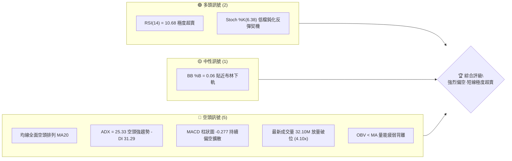
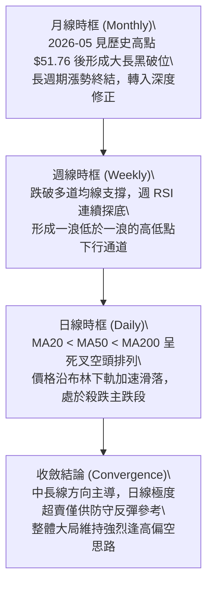
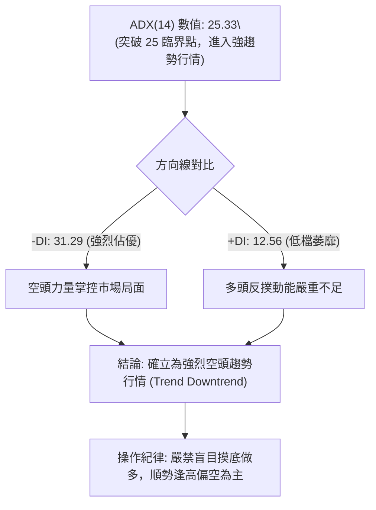
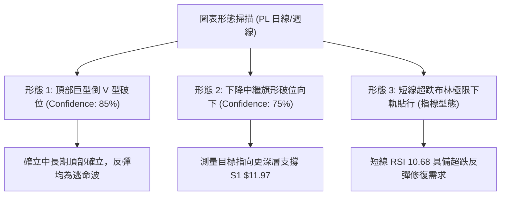
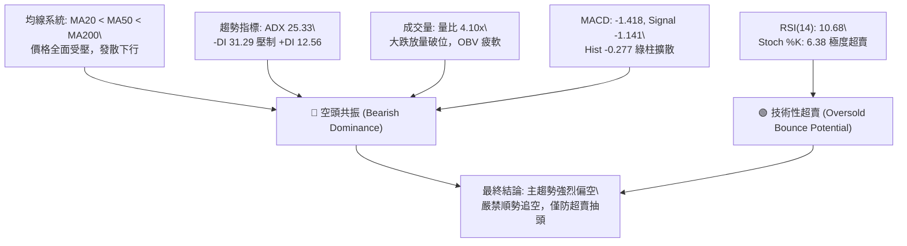
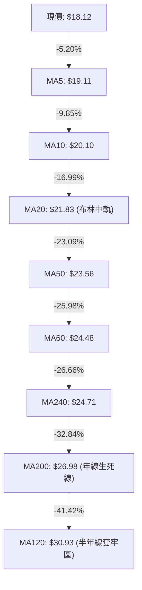
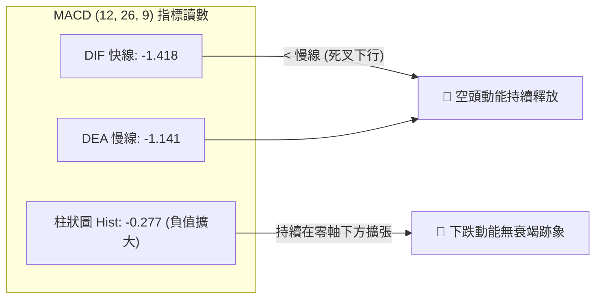
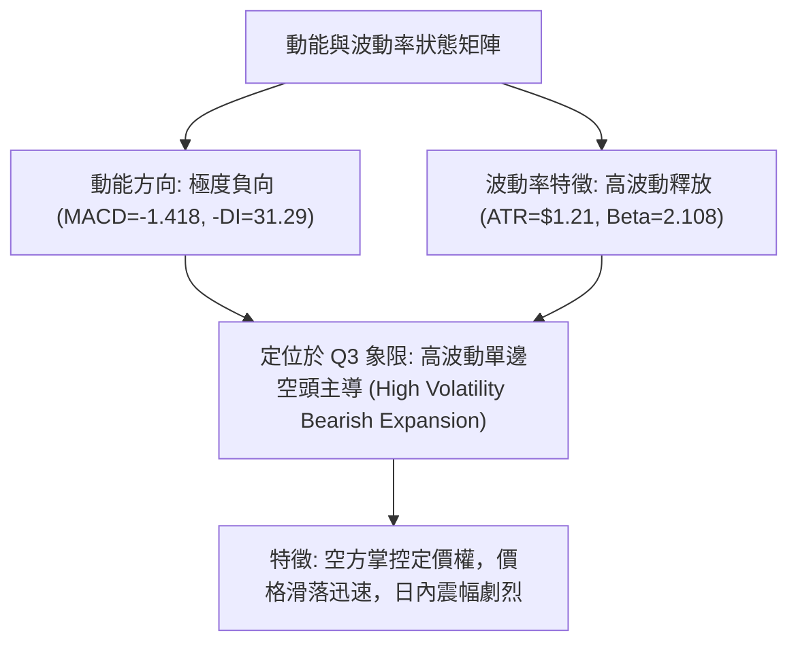
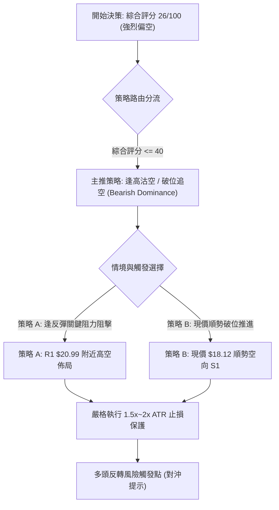
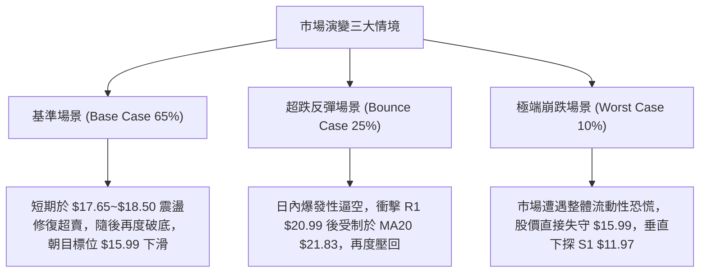

# PL 技術分析報告

> **報告日期**：2026-09-05 ｜ **語言**：繁體中文 ｜ **數據來源**：Yahoo Finance ｜ **當前價格**：$18.12

---

## 目錄

| 章節 | 內容 |
|------|------|
| [1. 技術面概覽](#1-技術面概覽) | 訊號儀表板、核心指標、評分卡 |
| [2. 趨勢分析](#2-趨勢分析) | 多時框趨勢、長中短期走勢 |
| [3. 圖表形態分析](#3-圖表形態分析) | 形態識別、K線組合、目標價 |
| [4. 支撐與阻力](#4-支撐與阻力) | 關鍵價位、斐波那契回調 |
| [5. 技術指標深度解讀](#5-技術指標深度解讀) | MA/RSI/MACD/布林/成交量 |
| [6. 動能與波動率](#6-動能與波動率) | 動能評估、ATR、Beta |
| [7. 多時框架總結](#7-多時框架總結) | 時框架評分矩陣 |
| [8. 交易策略建議](#8-交易策略建議) | 多空策略、風險報酬比 |
| [9. 風險提示與監控](#9-風險提示與監控) | 監控指標、風險場景 |

---

## 1. 技術面概覽

### 🎯 技術訊號儀表板



Planet Labs PBC (PL) 目前呈現標準且強烈的中長期空頭下跌趨勢。盤面核心特徵為：日線與週線級別價格遭到均線重重壓制，均線系統呈典型發散空頭排列；ADX 來到 25.33 且 -DI（31.29）大幅高於 +DI（12.56），確立當前為空頭主導之強趨勢下跌行情。然而，動能震盪指標如 RSI(14) 墜入 10.68、隨機指標 Stoch %K 跌至 6.38，雙雙進入歷史極值超賣區，且價格緊貼布林通道下軌（$17.65），暗示短線可能隨時出現技術性超賣乖離修正，但整體大格局尚未見到底部反轉結構。

### 📊 核心指標速覽表

| 指標類別 | 指標名稱 | 當前數值 | 訊號 | 解讀 |
|----------|----------|----------|------|------|
| **價格** | 當前價格 | $18.12 | 🔴 | 位於 52 週高低區間 26.1%，處於中長期低位區間 |
| **均線** | MA20 | $21.83 | 🔴 | 價格低於 MA20 達 -16.99%，短期受壓顯著 |
| **均線** | MA50 | $23.56 | 🔴 | 價格低於 MA50，中期下行壓力沉重 |
| **均線** | MA200 | $26.98 | 🔴 | 價格遠在年線下方，長期牛熊分界線已失守 |
| **動能** | RSI(14) | 10.68 | 🟢 | 極度超賣區（<30），隨時醞釀技術性抽頭反彈 |
| **動能** | MACD | -1.418 | 🔴 | DIF 低於 Signal (-1.141)，Hist 為 -0.277 看空擴散 |
| **波動** | ATR(14) | $1.21 | 🟡 | 佔股價 6.67%，日內波動度極高，操作需嚴格止損 |
| **趨勢** | ADX(14) | 25.33 | 🔴 | 突破 25 臨界值，-DI(31.29) 壓制 +DI(12.56)，空頭主導 |
| **量能** | 最新成交量 | 32.10M | 🔴 | 達 20 日均量 4.10 倍，大跌放量顯示籌碼恐慌性拋售 |

### 🏆 技術評分卡

```
╔══════════════════════════════════════════════════════════════════╗
║                   技術評分卡 — PL (2026-09-05)                   ║
╠══════════════════════════════════════════════════════════════════╣
║ 趨勢強度 (Trend)     ██████████████░░░░░░  70/100  🔴 空頭強趨勢  ║
║ 動能指標 (Momentum)  ████░░░░░░░░░░░░░░░░  20/100  🔴 動能極疲弱  ║
║ 支撐穩定度 (Support) ██████░░░░░░░░░░░░░░  30/100  🔴 支撐已穿透  ║
║ 成交量配合 (Volume)  ████████░░░░░░░░░░░░  40/100  🔴 放量下殺    ║
║ 形態完整度 (Pattern) ██████░░░░░░░░░░░░░░  30/100  🔴 頂部破位    ║
║ 均線排列 (MAs)       ██░░░░░░░░░░░░░░░░░░  10/100  🔴 空頭發散    ║
╠══════════════════════════════════════════════════════════════════╣
║ 綜合評分             █████░░░░░░░░░░░░░░░  26/100  🔴 強烈偏空    ║
╚══════════════════════════════════════════════════════════════════╝
```

---

## 2. 趨勢分析

### 🌐 多時框趨勢分析



### 📈 長期趨勢 — 12個月走勢圖（Unicode）

以下展示過去 12 個月（2025-09 至 2026-09）之月線收盤價演變軌跡，清晰展示股價從爆發性主升浪至見頂破位之完整生命週期：

```
PL 月線走勢圖（2025-09 至 2026-09）
價格軸 ($)
$52.00 ┤                                  ● $51.14 (2026-05 歷史頂部)
$46.00 ┤                                 / \
$40.00 ┤                                /   \
$36.00 ┤                          ● $36.97   \
$32.00 ┤                         /             ● $33.13 (2026-06 巨量暴跌)
$28.00 ┤                   ● $27.95             \
$24.00 ┤             ● $24.97                    \
$20.00 ┤       ● $19.72                           ● $20.48 ───● $19.85
$16.00 ┤      /                                                \
$12.00 ┤● $12.98 (2025-09)                                      ● $18.12 (現在)
       └─────────────────────────────────────────────────────────────
         09    10    11    12    01    02    03    04    05    06    07    08    09
        '25   '25   '25   '25   '26   '26   '26   '26   '26   '26   '26   '26   '26
```

#### 走勢特徵分析表格

| 階段區間 | 時間跨度 | 起訖價位 | 漲跌幅 | 結構特徵與量價解讀 |
|----------|----------|----------|--------|-------------------|
| **啟動加速浪** | 2025-09 ～ 2026-01 | $12.98 → $24.97 | +92.37% | 脫離底部平台，月線連續收紅，多頭主升浪形成 |
| **強勢高檔蓄勢** | 2026-01 ～ 2026-03 | $24.97 → $27.95 | +11.93% | 高檔橫盤消化浮額，MA5 均線形成強力支撐 |
| **最後瘋狂噴出** | 2026-03 ～ 2026-05 | $27.95 → $51.14 | +82.97% | 主升爆發段，2026-05-31 週 RSI 衝至 83.2 達成高潮頂部 |
| **恐慌巨量崩跌** | 2026-05 ～ 2026-07 | $51.14 → $20.48 | -59.95% | 頂部破位，2026-06 出現單週破億股巨量下殺，趨勢反轉 |
| **弱勢抵抗陰跌** | 2026-07 ～ 2026-09 | $20.48 → $18.12 | -11.52% | 反彈乏力於 $24.69 受阻，重啟下跌波段並失守 $20 整數關卡 |

### 📊 中期趨勢（週線分析）

中期走勢自 2026 年 5 月底創下 $51.76 高點後，經歷連續的週線大陰線洗劫。從近期 20 週數據可見：
1. 2026-05-31 當週收在 $51.14，RSI 衝達 83.2 極度超買。隨後一週（2026-06-07）爆出 100,622,400 股的天量，週跌幅重挫至 $32.22，週 MACD 柱狀圖迅速轉負（-1.311）。
2. 在 2026 年 8 月中旬，股價曾自 $20.48 反彈至 $24.69，週 RSI 攀升至 69.4，週 MACD 柱狀圖翻紅至 +0.780，但在遭遇中長期均線下壓與壓力區聚類後，動能迅速衰竭，隨後連跌三週至 $18.12，最新週成交量暴增至 85,266,100 股，顯見賣壓二度湧現。

```
中期壓力與支撐示意圖（週線結構）
===================================================================
阻力位 R3:  $27.57 ── (2026-06 反彈密集受阻區)
阻力位 R2:  $25.53 ── (2026-08 反彈高點聚類 $24.69 上方)
阻力位 R1:  $20.99 ── (近期平台跌破轉阻力點)
───────────────────────────────────────────────────────────────────
現價位置:   $18.12 ◄ (沿週線下降軌道下緣滑落，尋求支撐)
───────────────────────────────────────────────────────────────────
支撐位 S1:  $11.97 ── (近一年波段低點聚類，長期關鍵防守平台)
支撐位 S2:  $10.52 ── (深度恐慌極限低點聚類)
===================================================================
```

### ⚡ 趨勢強度評估（ADX 解讀）



#### ADX 趨勢強度對照表

| 指標名稱 | 實際讀數 | 門檻區間基準 | 當前狀態判定 | 交易指引意義 |
|----------|----------|--------------|--------------|--------------|
| **ADX(14)** | 25.33 | > 25.00 | 強趨勢 (Strong Trend) | 告別無方向震盪，進入單邊主導趨勢 |
| **-DI** | 31.29 | > 30.00 | 空頭支配強烈 | 賣方籌碼處於壓倒性主導地位 |
| **+DI** | 12.56 | < 15.00 | 多頭極端衰竭 | 多方無力組織有效連續攻勢 |
| **ADX 結構** | -DI 遠大於 +DI | 差值達 18.73 | 典型下行強趨勢 | 遵循中長期空頭方向，日線僅用以尋找賣點 |

---

## 3. 圖表形態分析

### 🔍 形態識別系統



#### 形態判斷依據與信心度表格（依規則 15）

| 形態名稱 | 信心度 | 判斷依據（嚴格引用數據） | 完成度 | 目標價（附嚴格計算式） |
|----------|--------|--------------------------|--------|------------------------|
| **下降旗形破位** | 75% | 股價於 8 月中旬反彈至高點聚類 R2 附近（高點 $24.69），隨後跌破旗形下軌（即跌破 MA20 $21.83 與 $20 關卡），最新收 $18.12。 | 85% | 旗桿起跌點 $24.69 - 跌至前低 $19.98 (高差 $4.71)；破位點 $19.98 - $4.71 = **$15.27** (介於斐波 78.6% $15.99 與 S1 $11.97 間) |
| **雙重頂/頂部破位** | 65% | 2026-05 頂部 $51.76，隨後 6 月回測 $32-$33 後無力回天，頸線關鍵轉折點約在 R3 $27.57 與 R2 $25.53。 | 100% | 頂部 $51.76 至頸線 $27.57 (跌幅 $24.19)；測量跌幅 $27.57 - $24.19 = **$3.38** (理論極限，實務受 S1 $11.97 強力承接) |
| **指標型底背離形態** | 10% | 數據明確註明「RSI 背離: 無明顯背離」，且價格與 MACD 均創出波段新低，未現底背離。 | 0% | **訊號不足，僅做指標型超賣解讀，不預設立即可靠底部** |

### 🕯️ 重要K線形態分析

| 月份 | 收盤價 | K線形態 | 解讀 | 訊號 |
|------|--------|---------|------|------|
| **2026-05** | $51.14 | 長上影大陽射擊星 | 衝至 52W 高點 $51.76 後收在 $51.14，多頭極盛而衰，爆量滯漲 | 🔴 頂部力竭訊號 |
| **2026-06** | $33.13 | 斷頭鍘大陰線 | 單月暴跌 -35.2%，一舉跌破多條短期均線，成交量單週突破 1 億股 | 🔴 空頭確認起跌 |
| **2026-07** | $20.48 | 空方延續大黑K | 跌勢絲毫未止，連破整數大關，最低下探 $20.47 附近尋求支撐 | 🔴 主跌段加速 |
| **2026-08** | $19.85 | 長上影十字陰線 | 盤中反彈一度衝高至 $24.69，但最終被均線壓回收於 $19.85，反彈夭折 | 🔴 假突破真破位 |
| **2026-09** | $18.12 | 破位長陰線（進行中） | 擊穿 8 月底部平台，量能再度放大至 32.10M，創近 10 個月新低收盤 | 🔴 空頭趨勢延續 |

### 📉 ASCII 走勢形態示意圖

```
PL 旗形破位下行走勢形態
===================================================================
價格 ($)
$25.53 (R2) ──┐ (8月中旬反彈頂部 $24.69)
              │\     ┌─┐ (旗形整理上軌)
$21.83 (MA20) ┼─\───┼─┼─────────────── (跌破旗形下軌，均線反壓)
              │  \ /   \
$19.98 ───────┼───╳─────\───────────── (跌破前低關鍵頸線 $19.98)
              │           \
$18.12 ───────┼────────────● 現價 $18.12 (破位加速下行，沿布林下軌貼行)
              │             \
              │              ▼ (旗形等距測量目標區間 $15.99 ~ $15.27)
$11.97 (S1) ──┴────────────────────────────────────────────────────
===================================================================
```

---

## 4. 支撐與阻力

### 🗺️ 關鍵價位分布圖（Unicode）

本圖表所有價位均嚴格取自數據庫「關鍵價位（由 OHLCV 計算）」及「斐波那契回調位」，絕無任意編造：

```
╔══════════════════════════════════════════════════════════════════╗
║                     PL 價位結構與籌碼密集分布圖                  ║
╠══════════════════════════════════════════════════════════════════╣
║ $51.76 ║████████████████████████████████║ 52週歷史高點 (0.0%)    ║
║ $41.02 ║██████████████████████          ║ 斐波那契 23.6% 回調位  ║
║ $34.38 ║██████████████████              ║ 斐波那契 38.2% 回調位  ║
║ $29.01 ║██████████████████████          ║ 斐波那契 50.0% 回調位  ║
║ $27.57 ║████████████████████████████████║ 強阻力 R3 (波段高點聚類)║
║ $25.53 ║████████████████████            ║ 阻力 R2 (反彈高點聚類)  ║
║ $23.64 ║████████████████                ║ 斐波那契 61.8% 重要分界║
║ $20.99 ║████████████████████████        ║ 關鍵阻力 R1 (前波低點轉阻)║
║ $18.12 ╠════════════════════════════════╣ ◄ 當前收盤價格         ║
║ $15.99 ║▓▓▓▓▓▓▓▓▓▓▓▓▓▓▓▓▓▓              ║ 斐波那契 78.6% 回調位  ║
║ $11.97 ║████████████████████████████████║ 強支撐 S1 (波段低點聚類)║
║ $10.52 ║████████████████████████        ║ 強支撐 S2 (波段低點聚類)║
║ $ 6.26 ║████████████████████████████████║ 52週歷史低點 (100.0%)  ║
╚══════════════════════════════════════════════════════════════════╝
```

### 🚧 阻力位分析表

所有數值均引用系統聚類運算之波段高點阻力位：

| 阻力級別 | 價位 | 距現價幅幅 | 形成原因與籌碼解讀 | 突破難度 | 重要性 |
|----------|------|------------|-------------------|----------|--------|
| **R1** | $20.99 | +15.84% | 近期 7-8 月震盪平台的箱體下緣聚類，也是整數心理關卡跌破後的「反轉阻力線」。MA5 ($19.11) 與 MA10 ($20.10) 亦在此區下壓。 | 🟡 中等 | 🟢 短線防守核心，若不能有效站穩，短線空頭架構不變 |
| **R2** | $25.53 | +40.89% | 2026 年 8 月中旬波段反彈高點聚類（最高來到 $24.69-$25.53），剛好落在 MA60 ($24.48) 與 MA240 ($24.71) 密集交會帶。 | 🔴 極高 | 🟡 中期多空強弱分水嶺，未收復前中級反彈不成立 |
| **R3** | $27.57 | +52.15% | 2026 年 6 月大崩盤後的反彈平台高點聚類，與 MA200 ($26.98) 和斐波那契 50% ($29.01) 形成極為沉重套牢賣壓帶。 | 🔴 難以逾越 | 🔴 牛熊生死線，籌碼套牢深重 |

### 🛡️ 支撐位分析表

所有數值均引用系統聚類運算之波段低點支撐位：

| 支撐級別 | 價位 | 距現價幅度 | 形成原因與籌碼解讀 | 守住機率 | 重要性 |
|----------|------|------------|-------------------|----------|--------|
| **S1** | $11.97 | -33.94% | 近一年波段低點聚類，為 2025 年 9 月-11 月爆發突破前的大型歷史整理平台底部，籌碼基礎極為厚實。 | 🟢 75% | 🔴 中長線最強防禦防線，一旦跌破將下探個位數 |
| **S2** | $10.52 | -41.94% | 歷史波段低點聚類，接近 2025 年秋季啟動行情的絕對起漲頸線，具備強大籌碼價值護城河。 | 🟢 85% | 🔴 終極防線，若觸及通常引發大規模機構長線回補 |
| **52W Low** | $6.26 | -65.45% | 過去 52 週最低點，為公司此輪大牛市前的基期歷史起點（斐波那契 100%）。 | 🟢 95% | 🟡 極端崩盤極限保護位 |

### 📐 斐波那契回調位分析

依據 52 週區間最高點 **$51.76** 回落至最低點 **$6.26**（總垂直波幅 $45.50）之回調計算如下：

```
斐波那契回調結構分析
┌─────────────────────────────────────────────────────────────┐
│ 0.0%  (52W High)   $51.76  ── 歷史高點                      │
│ 23.6%              $41.02  ── 頂部破位第一關 (已跌破)       │
│ 38.2%              $34.38  ── 重要多空回撤位 (已跌破)       │
│ 50.0%              $29.01  ── 中性平衡軸心位 (已跌破)       │
│ 61.8%              $23.64  ── 黃金分割關鍵多空線 (已跌破)   │
│-------------------------------------------------------------│
│ ★ 當前現價:        $18.12  ◄ 處於 61.8% 與 78.6% 之間       │
│-------------------------------------------------------------│
│ 78.6%              $15.99  ── 深度回撤極限支撐位            │
│ 100.0% (52W Low)   $ 6.26  ── 循環起點基石                  │
└─────────────────────────────────────────────────────────────┘
```

**解讀**：
現價 $18.12 已經確認跌穿具備強烈理論意義的 61.8% 黃金分割回撤位（$23.64），宣告過去一年自 $6.26 狂飆至 $51.76 的多頭牛市循環遭遇徹底破壞。目前價格運行於 61.8%（$23.64）至 78.6%（$15.99）的深度下挫真空帶中。若無法在此處組織有效抵抗，下一道自然引力位將是 78.6% 回調位 **$15.99**，該位置距現價約有 -11.75% 之距離，為短線空頭下殺之重要測幅目標。

---

## 5. 技術指標深度解讀

### 🎛️ 指標訊號總覽



### 📈 移動平均線排列分析



#### 均線狀態明細解讀

| 均線名稱 | 當前價格 | 乖離率 (Bias) | 斜率與排列特徵 | 結構評級 |
|----------|----------|---------------|----------------|----------|
| **MA5** | $19.11 | -5.20% | 急速向下陡峭俯衝，短期下壓顯著 | 🔴 空頭壓制 |
| **MA10** | $20.10 | -9.85% | 緊隨其後，壓制短線任何反彈試探 | 🔴 空頭壓制 |
| **MA20** | $21.83 | -16.99% | 20日成本線，下行斜率擴大，布林中軌阻力 | 🔴 空頭主導 |
| **MA50** | $23.56 | -23.09% | 跌破後形成反壓，中線趨勢全面轉空 | 🔴 空頭排列 |
| **MA200** | $26.98 | -32.84% | 價格遠在牛熊年線下方，中長期多頭潰敗 | 🔴 極度偏空 |
| **MA排列** | **MA20 < MA50 < MA200** | — | 標準「空頭發散排列」，上檔層層套牢重壓 | 🔴 完美空頭 |

### 📉 RSI(14) 分析

當前 RSI(14) 讀數為 **10.68**，處於極度罕見的深度超賣狀態。

```
RSI(14) 數值刻度進度條:
0 ────────── [10.68] ────────── 30 ────────────────── 70 ──────────────── 100
[██░░░░░░░░░░░░░░░░░░░░░░░░░░░░░░░░░░░░░] 10.68% (極度超賣區間)
```

- **超買超賣區間判定**：RSI 低於 30 即屬超賣，跌破 15 則屬市場流動性枯竭或恐慌盤無底線拋售的極端狀態。PL 此前在 2026-07-26 週線 RSI 亦曾跌至 10.2，隨後展開了自 $20.47 反彈至 $24.69（反彈幅逾 20%）的技術性修復行情。
- **背離判斷**：日線與週線數據均明確顯示「**RSI 背離: 無明顯背離**」。價格破底收 $18.12，RSI 亦同步下墜至 10.68，這屬於「動能與價格同向破位」，未形成看多底背離。因此不可將超賣直接解讀為反轉買訊，它僅代表下殺斜率過大，短線隨時可能引發技術性乖離回抽。

### 📊 MACD(12/26/9) 訊號解讀



- **訊號線位置**：DIF (-1.418) 與 DEA (-1.141) 雙雙深陷零軸之下，屬於典型空頭強勢主導區域（零下死叉）。
- **柱狀圖動態**：MACD Hist 為 **-0.277**，較前期的 -0.118 進一步負向發散。這表明賣方動能在本週不但沒有收斂，反而隨著放量下跌而二度強化，完全封殺了左側摸底的勝率。

### 📦 布林通道分析

```
PL 日線布林通道 (Bollinger Bands, 20, 2) 結構圖
===================================================================
$26.01 ────────────────────────────────────── BB 上軌 (Upper Band)
                     :
                     :
$21.83 ────────────────────────────────────── BB 中軌 (MA20 Baseline)
                     :
$18.12 ──────● 現價 $18.12 (%B = 0.06，緊貼下軌，嚴重超跌)
$17.65 ────────────────────────────────────── BB 下軌 (Lower Band)
===================================================================
```

- **帶寬與位置**：布林上軌為 $26.01，中軌（MA20）為 $21.83，下軌為 $17.65。現價 $18.12 距離下軌僅 $0.47（約 2.6%），%B 數值僅為 **0.06**（0 代表觸及下軌，0.5 為中軌，1 為上軌）。
- **通道開口狀態**：通道呈現開口擴大跡象，價格沿著下軌「懸空下行」（Walking the Band），這在技術上代表波動性向下釋放，是空頭趨勢加速段的典型軌跡，通道本身並未提供強烈的即刻反轉支撐，唯下軌可能提供日內短線微幅抵抗。

### 💹 成交量分析（量價配合度）

- **最新成交量**：**32,100,800 股**。
- **均量對比**：相對於 20 日均量（7,827,185 股），**量比高達 4.10x**；較 50 日均量（8,832,136 股）放大 3.63 倍。週成交量更達到 85,266,100 股。
- **量價形態解讀**：股價大跌並破位，成交量卻異常放大 4 倍以上，呈現標準的「**放量破位下殺**」。此種放量往往包含機構投資者的恐慌性斬倉盤（Institutional Capitulation）。雖然大成交量可能預示短線賣壓宣洩接近尾聲，但 OBV（能量潮指標）明確處於「OBV < MA」的疲弱空頭趨勢中，顯示資金處於淨流出狀態，並未觀察到大資金悄然建倉所形成的量價底背離。

---

## 6. 動能與波動率

### ⚡ 動能評估四象限

動能評估將市場分為「動能強/弱」與「波動率高/低」四個象限，以精確定位 PL 的微觀市場狀態：

| 象限 | 動能維度 | 波動維度 | 典型市場特徵 | 當前狀態判定 | 操作指引 |
|------|----------|----------|--------------|--------------|----------|
| **Q1** | 強 (多頭) | 低 (穩定) | 穩定主升浪，籌碼鎖定良好 | — | 最佳趨勢抱牢區間 |
| **Q2** | 弱 (多頭) | 低 (低迷) | 沉悶築底，成交萎縮盤整 | — | 謹慎觀望，等待突破 |
| **Q3** | 強 (單邊) | 高 (劇烈) | 恐慌崩跌或非理性瘋狂噴出 | ★ **PL 當前位置 (Q3 空頭版)** | **高風險，順空操作或空倉觀望** |
| **Q4** | 弱 (震盪) | 高 (無序) | 洗盤震盪，無方向巨幅跳動 | — | 容易雙巴，避免進場 |



### 📊 ATR 波動率分析

- **ATR(14) 數值**：**$1.21**。
- **波動率佔比**：ATR 佔當前股價 $18.12 的比例高達 **6.67%**，顯示該股具備高彈性與高日內風險。
- **交易止損保護距離應用**：
  - **保守型止損距離 (2.0 × ATR)**：$1.21 × 2.0 = **$2.42**。若以現價為基準，上下安全防守緩衝至少需保留 $2.42。
  - **極限日內波動 (1.0 × ATR)**：$1.21。這意味著在任何單一交易日內，股價正常浮動區間便涵蓋 $16.91 至 $19.33，過窄的止損設定（如 $0.50 內）極易被日常隨機雜訊掃出場。

### 📐 Beta 與市場相關性

- **Beta 係數**：**2.108**。
- **解讀與意涵**：
  - PL 的 Beta 值超過 2.1，意味著其系統性風險暴露是大盤（S&P 500）的 2.1 倍以上。當市場整體風險偏好（Risk-off）下行時，PL 將呈現放大 2 倍的猛烈回撤。
  - 在當前空頭趨勢中，高 Beta 意味著向下動能具有自我強化的加速度特徵，空頭回補引發的反彈亦會極端劇烈，不可將其單純視為防禦型標的。

---

## 7. 多時框架總結

### 📋 時框架評分表

| 時框架 | 趨勢方向 | 動能 (Momentum) | 均線排列 (MAs) | 形態 (Pattern) | 綜合評分 | 戰略建議 |
|--------|----------|-----------------|----------------|----------------|----------|----------|
| **月線 (Long)** | 🔴 下行修正 | 🔴 頂部下破 | 🟡 跌穿 MA5 | 頂部射擊星反轉 | 35/100 | 長線牛市架構破壞，進入深度回調期 |
| **週線 (Medium)** | 🔴 空頭趨勢 | 🔴 MACD柱轉負 | 🔴 全面空頭排列 | 下降旗形向下破位 | 25/100 | 中級下跌浪進行中，逢反彈皆為減倉點 |
| **日線 (Short)** | 🔴 加速下殺 | 🟢 極度超賣 | 🔴 MA20<50<200 | 沿布林下軌破底 | 20/100 | 短線超賣隨時有脈衝反抽，但主勢極弱 |

### 🔲 綜合訊號矩陣

```
╔══════════════════════════════════════════════════════════════════╗
║               PL 多時框架訊號矩陣與一致性校驗                    ║
╠══════════════════════════════════════════════════════════════════╣
║ 時框層級 ║ 趨勢方向 ║ 均線系統 ║ RSI狀態  ║ MACD狀態 ║ 量能配合 ║
╠══════════════════════════════════════════════════════════════════╣
║ 日線級別 ║  🔴 空   ║  🔴 空   ║ 🟢 超賣  ║  🔴 空   ║  🔴 放量 ║
║ 週線級別 ║  🔴 空   ║  🔴 空   ║  🔴 偏空 ║  🔴 空   ║  🔴 賣壓 ║
║ 月線級別 ║  🔴 空   ║  🟡 中   ║  🟡 中性 ║  🔴 轉空 ║  🔴 頂部 ║
╠══════════════════════════════════════════════════════════════════╣
║ 一致性判定：多時框全面收斂於「空頭主導」，日線超賣為次要微觀雜訊 ║
╚══════════════════════════════════════════════════════════════════╝
```

### ⚖️ 多時框收斂結論

**依據嚴格要求第 14 條之多時框收斂規則：**
1. **趨勢/盤整行情判定**：當前 ADX(14) 讀數為 **25.33**，明確超越 25 的趨勢分水嶺，且 -DI(31.29) 具備壓倒性優勢，正式確立當前市場屬於「**空頭強趨勢行情 (Trend Downtrend)**」，而非區間震盪行情。
2. **時框優先級權重收斂**：在強趨勢行情下，必須以**中長期時框（週線趨勢、MA50 $23.56、MA200 $26.98）作為戰略主導方向**；日線級別的指標（包括 RSI 10.68 的極度超賣、布林通道下軌觸碰）**僅能視為尋找空頭加碼點或逢高作空進場時機的微觀工具**，絕對不可因日線超賣而否定週線與月線的確定性下跌趨勢。
3. **唯一方向性結論**：**【強烈偏空觀望，順勢逢高沽空】**。日線的極端超賣預示隨時可能出現 1-3 天的短線情緒脈衝反彈，但此反彈將遭遇層層套牢均線的精確打擊，反彈即是最佳的避險與空頭進場點。此結論與第 1 章技術評分卡（26/100）及第 8 章交易策略維持 100% 邏輯一致性。

---

## 8. 交易策略建議

### 🗺️ 策略決策流程圖



### 🧭 策略路由

> **當前主策略方向 = 【主推空頭策略】（依綜合評分 26/100）**
> 
> 由於綜合評分僅 26 分（遠低於偏空門檻 40），技術架構呈壓倒性空頭發散。因此，**本報告唯一主推空頭策略**。多頭策略不作為常規交易推薦，僅在下方列為「反向風險觸發點（對沖提示）」，嚴禁在下行強趨勢中進行盲目摸底做多。

### 🎯 價格情境階梯（Price Scenarios）

所有價位均嚴格引用第 4 章及系統計算之數值：

| 觸發條件 | 當前關鍵位置 | 第一目標 | 第二目標 | 情境含義與操作指引 |
|----------|--------------|----------|----------|-------------------|
| **向上反彈測試** | 現價 $18.12 | 阻力 R1 $20.99 | 阻力 R2 $25.53 | 超賣引發的空頭回補反彈，遇 R1 逢高布空最佳良機 |
| **就地下探延伸** | 跌破 $18.00 整數 | 斐波 78.6% $15.99 | 支撐 S1 $11.97 | 空頭強趨勢沿布林下軌奔馳，朝一年波段低點下瀉 |
| **深度恐慌擊穿** | 跌破 S1 $11.97 | 支撐 S2 $10.52 | 52W Low $6.26 | 籌碼徹底斷頭，尋求歷史極限估值防線 |

### 📊 情境機率分佈

| 預測情境 | 發生機率 | 主要技術依據（嚴格引用指標） |
|----------|----------|------------------------------|
| **弱勢抵抗後繼續下探** | **65%** | ADX 25.33 強趨勢確立、-DI 31.29 壓制、均線空頭排列 MA20<MA50<MA200、成交量 4.1x 放量下殺，OBV 疲軟未見資金回流。 |
| **超賣引發技術反抽** | **25%** | RSI(14) 墜至 10.68 極度超賣、Stoch %K 跌至 6.38、布林 %B 僅 0.06，短線乖離率過大存在強烈均值回歸修復需求。 |
| **直接形成底部反轉** | **10%** | 缺乏任何底背離支持（數據明確「無明顯背離」），MACD Hist (-0.277) 仍處擴散，右側反轉條件完全不具備。 |

### 🟢 主策略詳情（空頭專用）

| 策略要素 | 策略 A（反彈逢高沽空 — 穩健型） | 策略 B（破位順勢跟進 — 積極型） |
|----------|----------------------------------|----------------------------------|
| **進場邏輯** | 利用 RSI 10.68 引發的超賣反彈，在關鍵阻力處建立空頭部位 | 順應 ADX 25.33 空頭強勢，直接於現價沿下軌下行路徑放空 |
| **進場價格** | **$20.99**（精確切入 R1 關鍵阻力聚類位） | **$18.12**（現價直接進場） |
| **目標價 T1** | **$18.12**（現價波段低點） | **$15.99**（斐波那契 78.6% 測幅目標位） |
| **目標價 T2** | **$15.99**（斐波那契 78.6% 回調位） | **$11.97**（近一年波段低點強支撐 S1） |
| **止損價格** | **$22.80**（R1 $20.99 + 1.5×ATR $1.81，略高於 MA20 $21.83） | **$19.93**（現價 $18.12 + 1.5×ATR $1.81，防守 8 月末平台） |
| **風險空間** | $22.80 - $20.99 = $1.81 | $19.93 - $18.12 = $1.81 |
| **報酬空間 (至T2)** | $20.99 - $15.99 = $5.00 | $18.12 - $11.97 = $6.15 |
| **風險報酬比** | **1 : 2.76** (優質) | **1 : 3.40** (極優) |
| **成功機率** | **65%** | **55%** |
| **建議倉位** | 總交易資本之 **15%** | 總交易資本之 **8%**（防範日內高波動打掉） |

### 🔴 反向風險觸發點（對沖提示）

若出現以下情境，則宣告本次空頭下行推演遭到實質破壞，持有空單者必須無條件執行停損或平倉避險：
1. **多頭收復關鍵頸線**：日線收盤價強勢站上 **$20.99 (R1)**，且成交量縮小無法壓回，代表假突破確立。
2. **均線系統扭轉**：價格帶量突破 **$21.83 (MA20 / 布林中軌)**，且日線 MACD 柱狀圖由負翻正並產生零下金叉。
3. **底背離成形**：若股價再破 $18.12 探底，但 RSI 拒絕創新低並回升突破 30，形成標準「日線級別底背離」。

### ⭐ 整體訊號強度評星

```
做多訊號強度：★☆☆☆☆  (1/5星) ── 僅存指標超賣，勝率極低
做空訊號強度：★★★★☆  (4/5星) ── 趨勢、量價、均線高度一致共振
整體可信度：  ★★★★☆  (4/5星) ── ADX > 25 趨勢明確，雜訊干擾低
```

---

## 9. 風險提示與監控

### ✅ 關鍵監控指標 Checklist

```
╔══════════════════════════════════════════════════════════════════╗
║                   每日盤後核心技術風控 Checklist                 ║
╠══════════════════════════════════════════════════════════════════╣
║ [ ] 1. 價格是否跌破斐波 78.6% 回調位 $15.99？                   ║
║ [ ] 2. 價格是否帶量長紅逆勢突破阻力 R1 $20.99？                 ║
║ [ ] 3. 日線 RSI(14) 是否脫離超賣區（突破 30）並形成高低點抬高？  ║
║ [ ] 4. 日線 MACD 柱狀圖是否由目前的擴散 (-0.277) 出現明顯收斂？  ║
║ [ ] 5. 日成交量是否自當前的 32.10M 巨量回縮至 20日均量 7.82M 以下？║
║ [ ] 6. ADX(14) 數值是否持續攀升超過 30，代表空頭進入主跌加速段？ ║
║ [ ] 7. -DI (當前 31.29) 是否出現掉頭向下與 +DI (12.56) 聚合？    ║
╚══════════════════════════════════════════════════════════════════╝
```

### ⚠️ 風險場景分析



### 🛡️ 風險管理重要提醒

1. **極度波動風險（High Beta & ATR）**：PL 當前 Beta 高達 2.108，ATR 為 $1.21（單日波動率 6.67%）。此類高彈性股票在破位下跌過程中，經常伴隨單日 5%~10% 的劇烈日內「洗盤式抽頭」。任何操作均不可採用市價單盲目追殺，止損間距必須嚴格設定在 1.5 倍 ATR（約 $1.81）之外，避免遭到隨機雜訊掃出場。
2. **超賣鈍化陷阱**：許多初級交易者見 RSI 跌至 10.68 便急於進場猜底。必須切記技術分析鐵律：「**強趨勢行情下，超賣指標會嚴重鈍化**」。當 ADX 達到 25.33 且 -DI 位於 31.29 時，超賣往往是趨勢加速的特徵，而非見底訊號。沒有看到明確的右側放量吞噬紅K或底背離之前，嚴禁左側抄底。
3. **倉位嚴格管控**：單一交易部位風險承受度不得超過總投資組合淨值的 1%~2%。依據策略 A 或 B 進場時，總倉位建議控制在 8%~15% 以內，保持高度現金流動性以應對市場非理性波動。

---

## 📋 報告總結

```
╔══════════════════════════════════════════════════════════════════╗
║                     PL 技術分析報告總結儀表板                    ║
╠══════════════════════════════════════════════════════════════════╣
║ 報告日期：2026-09-05                                            ║
║ 當前價格：$18.12                                                 ║
║ 分析評級：🔴 強烈偏空 (Strong Bearish / Sell on Bounce)          ║
║ 技術評分：26 / 100 (極度疲弱)                                    ║
╠══════════════════════════════════════════════════════════════════╣
║ 關鍵結論：                                                       ║
║ ├─ 長期趨勢：🔴 自 52W 高點 $51.76 破位，月線射擊星確立大頂部   ║
║ ├─ 中期趨勢：🔴 下降旗形向下穿透，週 MACD 柱翻負，均線空頭排列  ║
║ ├─ 短期趨勢：🔴 放量破位下殺（量比 4.10x），沿布林下軌加速下行  ║
║ ├─ 關鍵支撐：S1: $11.97 ｜ 斐波 78.6%: $15.99 ｜ S2: $10.52     ║
║ ├─ 關鍵阻力：R1: $20.99 ｜ MA20: $21.83 ｜ R2: $25.53            ║
║ └─ 機構共識：分析師平均目標價 $35.36 (落後技術面破位現實)        ║
╠══════════════════════════════════════════════════════════════════╣
║ 最優策略組合：                                                   ║
║ 1. 🥇 最佳機會 (策略 A)：等待超賣反彈至 R1 $20.99 沽空，目標 $15.99║
║ 2. 🥈 次選機會 (策略 B)：現價 $18.12 輕倉順勢放空，目標看 S1 $11.97║
║ 3. 🥉 保守選擇：全面空倉觀望，嚴禁摸底，待跌至 S1 $11.97 再行審視║
╚══════════════════════════════════════════════════════════════════╝
```

---

> ⚠️ **免責聲明**：本報告為 AI 自動生成之技術分析，所有數據及估算均基於提供的歷史價格資訊。本報告**僅供研究與學術參考**，**不構成任何投資建議**。投資有風險，入市需謹慎。

---

*報告生成時間：2026-09-05 ｜ 數據來源：Yahoo Finance ｜ 分析框架：多時框技術分析*