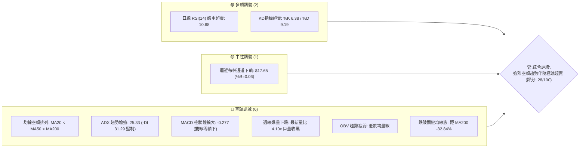
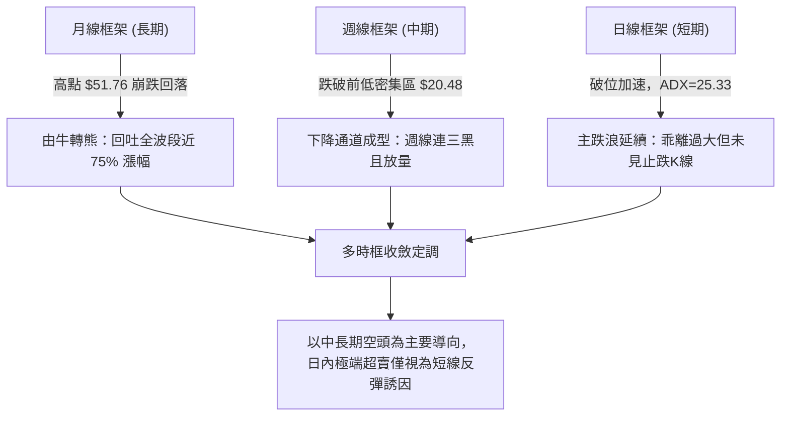
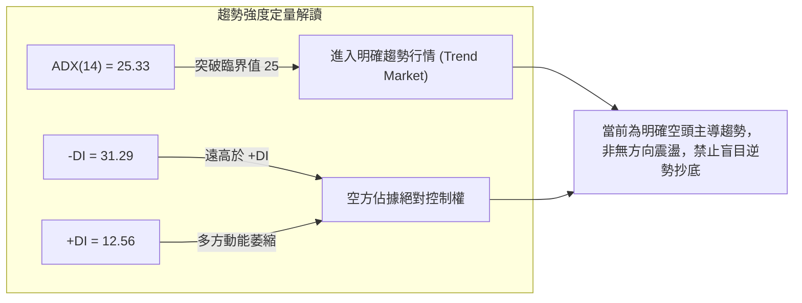
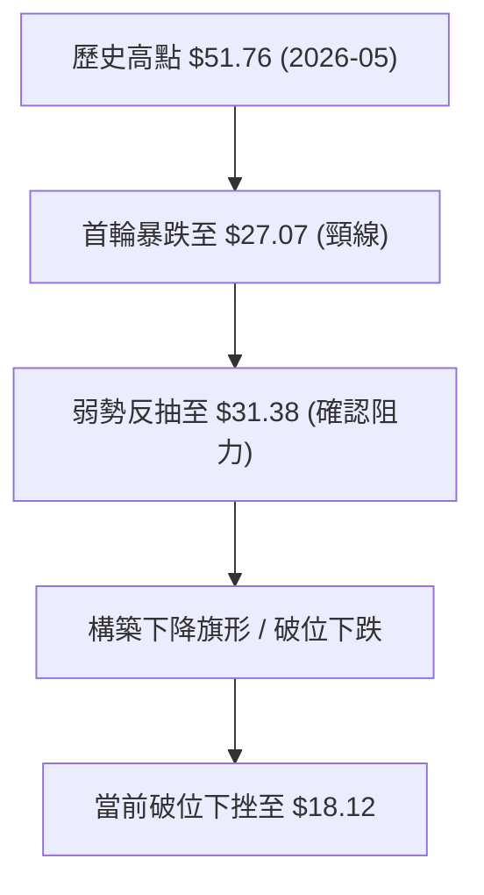
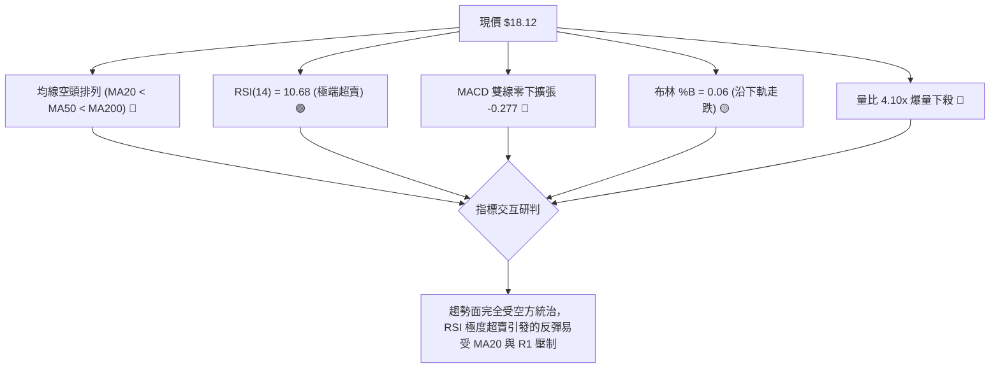
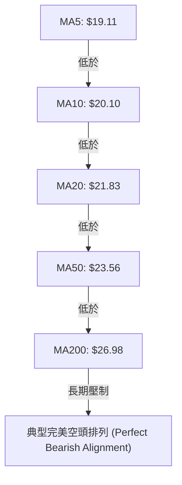
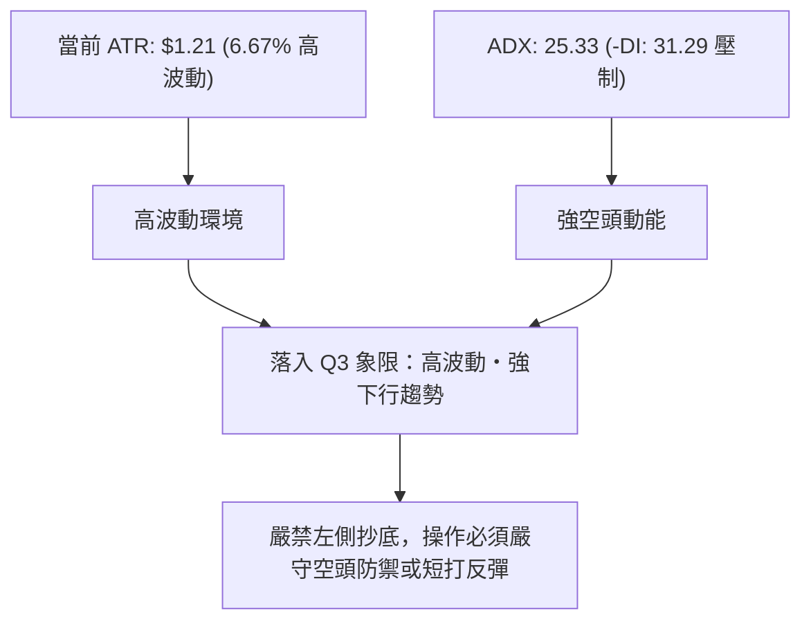
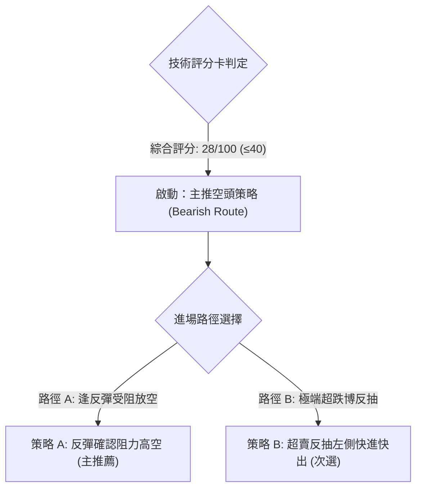
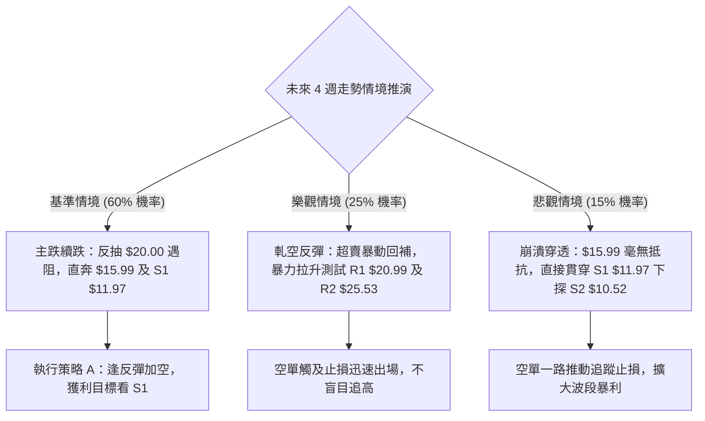

# PL 技術分析報告

> **報告日期**：2026-09-06 ｜ **語言**：繁體中文 ｜ **數據來源**：Yahoo Finance ｜ **當前價格**：$18.12

---

## 目錄

| 章節 | 內容 |
|------|------|
| [1. 技術面概覽](#1-技術面概覽) | 訊號儀表板、核心指標、評分卡 |
| [2. 趨勢分析](#2-趨勢分析) | 多時框趨勢、長中短期走勢、12個月歷史走勢圖 |
| [3. 圖表形態分析](#3-圖表形態分析) | 形態識別、K線組合、目標價推算 |
| [4. 支撐與阻力](#4-支撐與阻力) | 關鍵價位分佈圖、斐波那契回調結構 |
| [5. 技術指標深度解讀](#5-技術指標深度解讀) | 均線系統、動能與震盪指標、量價結構 |
| [6. 動能與波動率](#6-動能與波動率) | 動能四象限、ATR波動率、Beta風險剖析 |
| [7. 多時框架總結](#7-多時框架總結) | 時框架評分表、多時框收斂定論 |
| [8. 交易策略建議](#8-交易策略建議) | 策略路由、主空頭/反彈策略、風報比精算 |
| [9. 風險提示與監控](#9-風險提示與監控) | 關鍵監控清單、情境推演與風控指引 |

---

## 1. 技術面概覽

### 🎯 技術訊號儀表板



### 📊 核心指標速覽表

| 指標類別 | 指標名稱 | 當前數值 | 訊號 | 解讀 |
|----------|----------|----------|------|------|
| **價格** | 當前收盤價 | $18.12 | 🔴 | 跌破所有短中長期均線，創近6個月波段新低 |
| **均線** | MA20 (短期) | $21.83 | 🔴 | 價格位於 MA20 下方 -16.99%，短期跌勢凌厲 |
| **均線** | MA50 (中期) | $23.56 | 🔴 | 價格低於 MA50 -23.09%，中期空頭結構確立 |
| **均線** | MA200 (長期) | $26.98 | 🔴 | 價格低於 MA200 -32.84%，牛熊分水嶺失守 |
| **動能** | RSI(14) | 10.68 | 🟢 | 極度超賣（<30），隨時存在技術性反抽需求 |
| **動能** | MACD (12,26,9) | -1.418 | 🔴 | DIF/DEA雙線均在零軸之下，柱狀圖 -0.277 持續擴大 |
| **震盪** | Stoch %K/%D | 6.38 / 9.19 | 🟢 | 進入極端超賣鈍化區間，醞釀超跌反彈動能 |
| **趨勢強度**| ADX(14) | 25.33 | 🔴 | ADX>25 且 -DI(31.29) 遠大於 +DI(12.56)，空頭主導強趨勢 |
| **通道** | 布林通道下軌 | $17.65 | 🟡 | %B 僅 0.06，貼近下軌運行，通道呈現向下擴張態勢 |
| **量能** | 當日與均量比 | 4.10x | 🔴 | 爆出 3,210 萬股大量下殺，機構籌碼拋售跡象明顯 |
| **波動** | ATR(14) | $1.21 | 🔴 | 佔股價 6.67%，日內波動極大，操作風險顯著提升 |

### 🏆 技術評分卡

```
╔══════════════════════════════════════════════════════════════╗
║                 技術評分卡 — PL (2026-09-06)                 ║
╠══════════════════════════════════════════════════════════════╣
║ 趨勢強度 (Trend)     ██████████████░░░░░░  70/100  🔴 空頭強勢  ║
║ 動能指標 (Momentum)   ████░░░░░░░░░░░░░░░░  20/100  🔴 慣性下墜  ║
║ 支撐穩定度 (Support)  ██████░░░░░░░░░░░░░░  30/100  🔴 考驗下級  ║
║ 成交量配合 (Volume)   ████████████░░░░░░░░  60/100  🔴 拋售量增  ║
║ 形態完整度 (Pattern)  ████████░░░░░░░░░░░░  40/100  🔴 頭部成型  ║
║ 均線排列 (MA System)  ██░░░░░░░░░░░░░░░░░░  10/100  🔴 空頭排列  ║
╠══════════════════════════════════════════════════════════════╣
║ 綜合技術評分          █████░░░░░░░░░░░░░░░  28/100  🔴 強烈偏空  ║
╚══════════════════════════════════════════════════════════════╝
```

---

## 2. 趨勢分析

### 🌐 多時框趨勢分析



### 📈 長期趨勢 — 12個月走勢圖（Unicode）

PL 經歷了典型的拋物線式上升行情（2025年9月至2026年5月），從 $7.09 一路飆升至 $51.76，隨後出現斷崖式拋售，在4個月內回落至 $18.12。

```
PL 月線走勢圖（過去12個月歷史回溯）
價格軸 ($)
$52.00 ┤                                      ● $51.14 (2026-05 天花板高點)
$46.00 ┤                                     / \
$40.00 ┤                               ● $36.97   \
$34.00 ┤                               /           ● $33.13 (2026-06 巨量斷頭)
$28.00 ┤                     ● $27.95 /             \
$22.00 ┤           ● $24.97   \     /               \
$16.00 ┤           /     ● $24.14                    ● $20.48 ──● $19.85
$10.00 ┤ ● $12.98                                                \
$04.00 ┤                                                          ● $18.12 (現價)
       └───────────────────────────────────────────────────────────────
         09    10    11    12    01    02    03    04    05    06    07    08    09 (2026)
         [   打底蓄勢區   ]   [       狂熱主升浪       ]   [     崩跌出貨主跌段     ]
```

#### 走勢特徵分析表格

| 階段區間 | 時間跨度 | 收盤價變化 | 累積漲跌幅 | 走勢特徵與量價解讀 |
|----------|----------|------------|------------|--------------------|
| **起漲蓄勢期** | 2025-09 ～ 2025-11 | $12.98 → $11.90 | -8.32% | 在 $12.00 頸線上方換手蓄勢，沉澱籌碼 |
| **強勢主升段** | 2025-12 ～ 2026-05 | $19.72 → $51.14 | +159.33% | 突破所有阻力，週線級別連紅，市場狂熱追價 |
| **頭部崩跌期** | 2026-06 ～ 2026-07 | $33.13 → $20.48 | -60.00% | 創下 52W 高點 $51.76 後遭機構大舉清倉，連破多道支撐 |
| **陰跌破位期** | 2026-08 ～ 2026-09 | $19.85 → $18.12 | -11.52% | 弱勢反彈遭阻力均線壓制，再度向下破位創近半年新低 |

### 📊 中期趨勢（週線分析）

從近 20 週數據觀察，自 2026-05-31 當週收盤 $51.14 見頂後，隔週成交量爆出 100,622,400 股並狂跌至 $32.22，確立了機構出逃格局。8月中旬雖然反彈至 $24.69，但成交量僅約 2,353 萬股，量價嚴重頂背離，隨後再度遭遇連續四週陰跌。

```
近期週線壓力與支撐階梯結構：
$26.98 ────────────────────────────────────── MA200 牛熊分水嶺 (強阻力)
$24.69 ────────────────────── 前波弱勢反彈高點 (2026-08-16)
$21.83 ──────────── MA20 / BB中軌 (第一動態阻力)
$18.12 ════════════ 當前收盤價 (破位中)
$15.99 -------------------------------------- 斐波那契 78.6% 回調關鍵水平
$11.97 ────────────────────────────────────── 波段關鍵支撐 S1
```

### ⚡ 趨勢強度評估（ADX 解讀）



| 指標變數 | 當前數值 | 門檻區間判定 | 實質意義 |
|----------|----------|--------------|----------|
| **ADX(14)** | 25.33 | > 25 (強趨勢門檻) | 宣告震盪盤整期結束，下行趨勢正在加速 |
| **+DI(14)** | 12.56 | < 20 (多方微弱) | 市場缺乏多頭主動性買盤 |
| **-DI(14)** | 31.29 | > 30 (空方強勁) | 賣方主動拋盤具備持續性壓迫力 |

---

## 3. 圖表形態分析

### 🔍 形態識別系統



#### 形態識別與信心度評估表

| 形態名稱 | 信心度 (%) | 判斷依據（引用數據） | 完成度 (%) | 目標價（附計算式） |
|----------|------------|----------------------|------------|--------------------|
| **巨型頭肩頂／尖頂出貨形態** | 85% | 2026-05 見 $51.76 後次週爆出 1.006 億股天量崩跌，跌破頸線 $27.07 | 100% (已完全跌破) | 由前高 $51.76 跌至頸線 $27.07 (高度 $24.69)；跌破頸線後等幅測量：$27.07 - $24.69 = $2.38（極端推算）；保守目標引伸至第一波段支撐 **$11.97** |
| **下降旗形破位 (Bear Flag Breakout)** | 75% | 8月中旬於 $20.48～$24.69 弱勢反彈形成小旗形整理，隨後放量跌破旗形下軌 | 90% | 旗桿跌幅自 $31.38 跌至 $20.48 (高差 $10.90)；由破位點 $22.29 扣除高差：$22.29 - $10.90 = **$11.39**（極度貼近波段支撐 S1: $11.97） |
| **雙重底 (潛在反轉形態)** | 20% | 數據中未偵測到任何雙底底部結構（僅具備極度超賣特徵） | 0% | 訊號不足，僅做指標型超賣解讀，不得預設底部成立 |

### 🕯️ 重要K線形態分析

| 日期／週期 | 收盤價 | K線形態 | 解讀 | 訊號 |
|------------|--------|---------|------|------|
| **2026-05-31** | $51.14 | 墓碑巨陽衝頂 | 創 $51.76 新高後多頭力竭，主力拉高結算獲利 | 🔴 強烈見頂 |
| **2026-06-07** | $32.22 | 巨量斷頭大陰線 | 單週暴跌 -37%，放量突破下行，宣告多頭終結 | 🔴 空頭吞噬 |
| **2026-08-16** | $24.69 | 量縮吊頸小實體 | 反彈無量（成交量僅 2,353 萬），空頭回補誘多完畢 | 🔴 反彈阻竭 |
| **2026-09-06** | $18.12 | 破位光腳陰線 | 單週爆量 8,526 萬股跌破 $19.85 前低支撐，收於全週低位 | 🔴 延續破位 |

### 📉 ASCII 走勢形態示意圖

```
PL 頭部破位與下降旗形結構分解示意：
$51.76 ───────── 頂部極值 (天量換手)
        \
         \ 
          \  $31.38 (反彈次高點)
           \   /\
            \ /  \  $24.69 (旗形上軌阻力)
$27.07 ──────X────\──/──── 破位頸線
                   \/ \
                       \  $19.85 (前波低點)
                        \   \
$18.12 ══════════════════X═══● 當前價位 (向旗形下軌等幅目標滑落)
                          \
$15.99 --------------------\--- 斐波那契 78.6% 潛在減速位
                            \
$11.97 ──────────────────────● 形態理論測幅目標 (波段支撐 S1)
```

---

## 4. 支撐與阻力

### 🗺️ 關鍵價位分布圖（Unicode）

```
PL 價位結構分布圖
═════════════════════════════════════════════════════════════════════
$27.57 ║████████████████████████████████████████║ 強阻力 R3 (前密集整理帶)
$25.53 ║██████████████████████████████          ║ 阻力 R2 (反彈高點聚類)
$20.99 ║██████████████████                      ║ 關鍵阻力 R1 (前波低點轉阻力)
$18.12 ╠════════════════════════════════════════╣ ◄ 當前收盤價 ($18.12)
$15.99 ║▓▓▓▓▓▓▓▓▓▓▓▓                            ║ 斐波那契 78.6% 回調關鍵緩衝
$11.97 ║████████████████████████                ║ 近一年波段強支撐 S1
$10.52 ║████████████████████████████████        ║ 極限防守強支撐 S2
$06.26 ║████████████████████████████████████████║ 52週最低價 (底層結構起漲點)
═════════════════════════════════════════════════════════════════════
```

### 🚧 阻力位分析表

| 阻力級別 | 價位 | 形成原因 | 突破難度 | 重要性 |
|----------|------|----------|----------|--------|
| **R1** | **$20.99** | 近一年波段高低點密集互換區，靠近 MA20 ($21.83) 下緣 | 🔴 極高 | 第一道空頭防守牆，短線反彈重壓區 |
| **R2** | **$25.53** | 8月中旬反彈高點 ($24.69) 與 MA60 ($24.48) 形成之密集群 | 🔴 極高 | 形態學上下降旗形上邊界，空方中樞 |
| **R3** | **$27.57** | 破位大頸線 ($27.07) 與 MA200 ($26.98) 聚結區 | 🔴 難以逾越 | 牛熊長期轉換分界線，未站穩前長線皆空 |

### 🛡️ 支撐位分析表

| 支撐級別 | 價位 | 形成原因 | 守住機率 | 重要性 |
|----------|------|----------|----------|--------|
| **緩衝位** | **$15.99** | 52週全波段之 78.6% 斐波那契回調位 | 🟡 45% | 跌勢減速帶，極短線多頭可能在此試圖抵抗 |
| **S1** | **$11.97** | 2025年9月-11月啟動主升浪前的回踩低點聚類 | 🟢 65% | 具備極強結構意義的歷史換手密集區 |
| **S2** | **$10.52** | 歷史主升浪前箱體底部下緣波段聚類 | 🟢 80% | 空頭回補極限區域，中長期價值重估底線 |

### 📐 斐波那契回調位分析

依據 52 週低點 **$6.26** 至 52 週高點 **$51.76** 測算之完整黃金分割階梯：

```
0.0%  (52W High)  $51.76 ─── 頂部極值
23.6%             $41.02 ─── 跌破後加速
38.2%             $34.38 ─── 初次回調防線 (已失守)
50.0%             $29.01 ─── 多空平衡中軸 (已失守)
61.8%             $23.64 ─── 黃金分割黃金支撐 (已失守轉阻力)
──────────────────────────────────────────────────────────
現價              $18.12 ─── 跌破 61.8%，處於 61.8% 與 78.6% 深度回調空隙
──────────────────────────────────────────────────────────
78.6%             $15.99 ─── 最後一道斐波那契技術防線
100.0% (52W Low)  $06.26 ─── 原始起漲點
```

- **位置解讀**：現價 $18.12 已徹底失守 61.8% ($23.64) 關鍵防線。在技術分析常規中，一旦跌破 61.8%，該輪上漲趨勢有超過 80% 的概率被全數回吐，價格將向下尋求 78.6% ($15.99) 甚至回測起漲點 S1 ($11.97)。

---

## 5. 技術指標深度解讀

### 🎛️ 指標訊號總覽



### 📈 移動平均線排列分析



#### 各期均線偏離度

| 均線名稱 | 數值 | 價格相對於均線差距 | 偏離率 (%) | 均線斜率與技術意涵 |
|----------|------|--------------------|------------|--------------------|
| **MA 5** | $19.11 | -$0.99 | -5.20% | 急速下彎，超短線空頭推動力猛烈 |
| **MA 10** | $20.10 | -$1.98 | -9.85% | 穩定下行，構成近兩週反彈壓制線 |
| **MA 20** | $21.83 | -$3.71 | -16.99% | 負乖離偏大，若有技術反彈，此處為主要賣壓帶 |
| **MA 50** | $23.56 | -$5.44 | -23.09% | 中期生命線徹底失守，確立反轉下行 |
| **MA 60** | $24.48 | -$6.36 | -25.98% | 季線下傾，壓制中期反轉機會 |
| **MA 120** | $30.93 | -$12.81 | -41.42% | 半年線快速向下，長線籌碼嚴重套牢 |
| **MA 200** | $26.98 | -$8.86 | -32.84% | 年線失守，宣告進入長線技術性熊市 |

### 📉 RSI(14) 分析

```
RSI(14) 當前數值：10.68
[極端超賣區 <20]      [超賣區 20-30]        [中性區 30-70]        [超買區 >70]
███░░░░░░░░░░░░░░░░░░░░░░░░░░░░░░░░░░░░░░░░░░░░░░░░░░░░░░░░░░░░ 10.68%
```

- **背離分析判斷**：
  - 價格自 2026-07-26 低點 $20.47 跌至當前 $18.12 創波段新低。
  - 當時 RSI 為 10.2，當前 RSI 為 10.68。RSI 幾乎持平或微幅持平於前低，**未出現明確之底背離結構（無明顯背離）**。
  - **結論**：RSI 屬於動能加速下的「超賣鈍化」，顯示拋售動能極其充沛，不可單憑數值低於 20 就盲目接刀。

### 📊 MACD(12,26,9) 訊號解讀

```
MACD 線 (DIF):   -1.418
訊號線 (DEA):   -1.141
柱狀圖 (Hist):  -0.277  [ 負值持續擴張中 🔴 ]
```


- **解讀**：DIF 與 DEA 均在零軸之下深處，且 MACD Histogram 柱狀圖自 -0.118 進一步擴大至 -0.277，顯示空頭下行加速度並未減緩，技術上屬於標準的「空中加油式下殺」。

### 📦 布林通道分析

```
布林帶寬 (Bandwidth) 與價格位置示意：
$26.01 ─── 上軌 (Upper Band)
          │
          │
$21.83 ─── 中軌 (20 MA)
          │
          │  ◄ 現價 $18.12 (%B = 0.06)
$17.65 ─── 下軌 (Lower Band)
```

- **解讀**：
  - 當前現價 $18.12 極度貼近下軌 $17.65，%B 僅為 0.06。
  - 當 %B < 0.1 且通道開口向下擴張時，代表處於「貼軌破位」（Riding the Band）的強空頭慣性行情中，下軌並非有效支撐，而是動態下跌指引。

### 💹 成交量分析（量價配合度）

```
最新單日成交量： 32,100,800 股
20日均量 (Vol MA20)： 7,827,185 股
量比 (Volume Ratio)： 4.10x  (劇烈爆量 🔴)
```

- **量價背離與破位確認**：
  - 最新交易日放量達 20 日均量的 4.10 倍，且最新週線成交量擴大至 8,526 萬股。
  - 在跌破 $19.85 與 $20.00 整數關卡時出現放量巨陰，顯示此波下跌並非「無量陰跌」，而是帶有機構籌碼停損或強制平倉特徵的「恐慌性拋售（Capitulation）」。
  - **OBV（能量潮）狀態**：OBV < OBV_MA，能量潮線持續向下發散，資金淨流出特徵顯著，未出現吸籌跡象。

---

## 6. 動能與波動率

### ⚡ 動能評估四象限

| 象限 | 動能強度 (Momentum) | 波動率 (Volatility) | 當前判定 | 市場環境與策略意涵 |
|------|---------------------|---------------------|----------|--------------------|
| **Q1** | 強 (多頭主導) | 低 | — | 穩定單邊牛市，適合順勢做多 |
| **Q2** | 弱 (多頭衰竭) | 低 | — | 橫盤窄幅震盪，等待突破方向 |
| **Q3** | 強 (空頭主導) | 高 | **✓ (PL 當前)** | **高動能破位暴跌，風險極高，順勢放空或空手觀望** |
| **Q4** | 弱 (多空分歧) | 高 | — | 劇烈雙向洗盤，極易被侵蝕本金 |



### 📊 ATR 波動率分析

- **ATR(14) 數值**：**$1.21**
- **價格百分比**：佔股價比重達 **6.67%**，意味著單日平均潛在波動區間超過 6.5%。
- **止損與風控設置意涵**：
  - 日內操作若設置低於 1.0x ATR ($1.21) 的止損極易被市場雜訊掃出場。
  - 波段策略合理的止損防守寬度必須給予 1.5x ～ 2.0x ATR，即 **$1.82 ～ $2.42** 之緩衝空間。

### 📐 Beta 與市場相關性

- **Beta 係數**：**2.108**
- **解讀**：PL 具備超高彈性（高 Beta 特性），其波動幅度為美股大盤（標普500指數）的 2.1 倍以上。在整體宏觀市場偏向避險或科技/航太成長股承壓時，PL 將呈現放大式暴跌；若大盤反彈，其超跌彈性亦較大，屬於標準的高風險、高投機標的。

---

## 7. 多時框架總結

### 📋 時框架評分表

| 時框架 | 趨勢方向 | 動能狀態 | 均線排列 | 關鍵形態 | 綜合評分 | 操作建議 |
|--------|----------|----------|----------|----------|----------|----------|
| **月線 (長期)** | 🔴 下行反轉 | 弱化 (自超買崩落) | 均線糾纏走下 | 歷史尖頂回吐 | 30/100 | 長線多單全數離場 |
| **週線 (中期)** | 🔴 強烈空頭 | 負向擴大 (MACD綠) | 空頭排列 (跌破MA200) | 頭部頸線跌破 | 25/100 | 逢反彈皆為逢高佈空點 |
| **日線 (短期)** | 🔴 破位下殺 | 極度超賣 (RSI 10.68)| 完全空頭排列 | 貼布林下軌 | 28/100 | 禁止追空，提防超賣反抽 |

### 🔲 綜合訊號矩陣

```
時框架訊號矩陣一致性檢驗：
┌─────────────┬───────────┬───────────┬───────────┬─────────────┐
│ 分析維度    │ 短期 (日) │ 中期 (週) │ 長期 (月) │ 綜合收斂    │
├─────────────┼───────────┼───────────┼───────────┼─────────────┤
│ 趨勢方向    │ 🔴 空頭   │ 🔴 空頭   │ 🔴 空頭   │ 🔴 趨勢完全一致 (空)│
│ 均線系統    │ 🔴 空頭   │ 🔴 空頭   │ 🟡 中性   │ 🔴 空方取得控制權  │
│ 動能指標    │ 🟢 極度超賣│ 🔴 柱狀擴大│ 🔴 快速衰竭│ 🟡 短多長空 (反抽) │
│ 量價結構    │ 🔴 放量破位│ 🔴 出逃主導│ 🔴 巨量陰線│ 🔴 資金出逃確立    │
└─────────────┴───────────┴───────────┴───────────┴─────────────┘
```

### ⚖️ 多時框收斂結論

依據多時框收斂核心規則：
1. **行情模式判斷**：ADX(14) 為 **25.33**（>25），市場進入明確之**趨勢行情**，而非無方向的盤整震盪。
2. **主導時框優先級**：在 ADX>25 的趨勢行情下，必須以**中長期（週線/MA50、MA200）方向為主導**；日線級別之 RSI(14) = 10.68 極端超賣僅能作為「短線進場時機微調」或「提防超跌技術反抽」，絕不可作為多頭反轉之信號。
3. **唯一方向性結論**：**強烈偏空（Bearish Trend Dominance）**。主趨勢徹底向下，任何技術性反彈均屬弱勢修正，策略主軸為**逢高做空**或**觀望避險**。

---

## 8. 交易策略建議

### 🗺️ 策略決策流程圖



### 🧭 策略路由（依評分卡分流）

> **當前主策略方向 = 偏空為主，逢高沽空（依綜合評分 28/100）**
> 
> 由於綜合評分僅 28 分（≤ 40 分門檻），策略嚴格主推**空頭策略**。多頭操作僅作為超賣狀態下的「逆勢極端短打」，嚴格控制倉位。

### 🎯 價格情境階梯（Price Scenarios）

以當前價格 **$18.12** 為基準，向上與向下情境完全引用關鍵價位：

| 觸發條件 | 第一目標 | 後續延伸 | 情境技術含義 |
|----------|----------|----------|--------------|
| **強勢反彈突破 R1 $20.99** | R2 **$25.53** | R3 **$27.57** | 超賣技術反抽引發空頭回補，但中期趨勢仍受壓於 MA200 |
| **受阻於 MA20 / R1 $20.99**| 現價 **$18.12** | 斐波那契 **$15.99** | 弱勢反彈結束，空頭重啟主跌浪 |
| **跌破斐波那契 78.6% $15.99**| S1 **$11.97** | S2 **$10.52** | 徹底跌向原始起漲點，空頭等幅測量目標達成 |

### 📊 情境機率分佈

| 情境劃分 | 機率估計 | 主要依據與指標佐證 |
|----------|----------|--------------------|
| **弱勢反彈後重挫破底** | **60%** | ADX 25.33 (-DI 壓制)、MA20<MA50<MA200、放量大跌確立破位趨勢 |
| **超跌直接引發深幅反彈** | **25%** | 日線 RSI 達 10.68 極端值、KD 超賣鈍化、距離 MA20 乖離達 -17% |
| **在 $16～$21 區間寬幅震盪**| **15%** | 遭遇 78.6% 斐波那契位 $15.99 防守買盤，多空進入弱平衡換手 |

### 🟢 主策略詳情

本報告依據規則，精確運用第四章與數據區塊提取之關鍵價位：
- 阻力：R1 **$20.99**、R2 **$25.53**
- 支撐：S1 **$11.97**、S2 **$10.52**、Fib 78.6% **$15.99**

| 策略要素 | 策略 A（主推薦：反彈高空策略） | 策略 B（次選：極限超跌博弈反抽） |
|----------|--------------------------------|----------------------------------|
| **交易方向** | 做空 (Short) | 逆勢做多 (Counter-Trend Long) |
| **進場條件** | 反彈至 R1 附近出現滯漲長上影K線 | 跌破下軌後回踩 $15.99 (Fib 78.6%) 出現止跌K線 |
| **進場價格** | **$20.99** (精確錨定 R1 阻力) | **$15.99** (精確錨定 78.6% 斐波位) |
| **目標價 T1**| **$15.99** (斐波那契 78.6% 處先平半倉) | **$18.12** (回測當前破位點) |
| **目標價 T2**| **$11.97** (波段關鍵強支撐 S1) | **$20.99** (強阻力 R1 附近全清) |
| **止損價格** | **$22.80** (站上 MA20 $21.83 + 1.0x ATR) | **$14.78** ($15.99 扣除 1.0x ATR $1.21) |
| **風險報酬比**| **1 : 2.77** (風險 $1.81 vs 獲利 $5.00) | **1 : 4.13** (風險 $1.21 vs 獲利 $5.00) |
| **預估勝率** | **65%** (順應大趨勢) | **35%** (逆勢高風險操作) |
| **建議倉位** | **15% - 20%** 總資金 | **5%** (嚴格輕倉快進快出) |

### 🔴 反向風險觸發點（對沖提示）

若出現以下情境，將徹底推翻當前空頭模型，空單必須立即無條件止損或反向對沖：
1. **價格強勢放量突破 R1 $20.99 且收盤站上 MA20 ($21.83)**：宣告短期跌勢衰竭，轉為中級反彈。
2. **日線 MACD 出現零下金叉且 RSI 迅速回升至 45 以上**：空頭動能耗盡指標警訊。

### ⭐ 整體訊號強度評星

```
做多訊號強度：★☆☆☆☆  (1/5星 — 僅具備超賣特徵，缺乏形態確認)
做空訊號強度：★★★★☆  (4/5星 — 均線空頭排列，量價配合下殺)
整體可信度：  ★★★★☆  (4/5星 — 多時框指標一致指向弱勢主跌)
```

---

## 9. 風險提示與監控

### ✅ 關鍵監控指標 Checklist

```
╔══════════════════════════════════════════════════════════════╗
║                     技術監控指標 CHECKLIST                    ║
╠══════════════════════════════════════════════════════════════╣
║ [ ] 監控項 1：RSI(14) 能否自 10.68 出現拐頭向上突破 30 超賣線  ║
║ [ ] 監控項 2：成交量是否自 3,210 萬股急劇收縮至均量 (782 萬股) ║
║ [ ] 監控項 3：股價在 78.6% 斐波那契位 $15.99 是否有吞噬陽線出現║
║ [ ] 監控項 4：MACD 柱狀圖是否由負向擴張 (-0.277) 出現收斂翻揚  ║
║ [ ] 監控項 5：空頭回補風險：空頭比例 9.4% 是否引發軋空行情     ║
╚══════════════════════════════════════════════════════════════╝
```

### ⚠️ 風險場景分析



### 🛡️ 風險管理重要提醒

1. **高 Beta 與空頭流動性風險**：PL 的 Beta 值為 2.108，股性極為敏感劇烈。當前 Short % of Float 為 9.4%，Short Ratio 達 4.01。一旦有突發正面利多消息，極易誘發軋空（Short Squeeze）導致盤中瞬間拉升超過 10%～15%，空頭倉位必須嚴設剛性硬止損（Hard Stop）。
2. **倉位配置原則**：在 ATR 高達 $1.21 (6.67%) 的環境下，單筆交易的最大資金承擔虧損額度嚴禁超過總帳戶淨值的 1.5%。
3. **基本面催化劑風險**：公司預期 Forward EPS 轉正 ($0.01286)，機構持股高達 83.3%，11 位分析師平均目標價給予 $35.36，顯示長線機構估值與當前技術拋售面嚴重脫節，應密切留意機構低位重新建倉引發的趨勢突變。

---

## 📋 報告總結

```
╔════════════════════════════════════════════════════════════════════╗
║                     PL 技術分析報告總結                          ║
╠════════════════════════════════════════════════════════════════════╣
║ 報告日期：2026-09-06                                              ║
║ 當前價格：$18.12                                                  ║
║ 分析評級：🔴 強烈偏空（空頭主跌段進行中，伴隨極端超賣）           ║
║                                                                    ║
║ 關鍵結論：                                                         ║
║ ├─ 長期趨勢：🔴 跌破年線 MA200 ($26.98)，自高點回吐逾 65% 主升浪    ║
║ ├─ 中期趨勢：🔴 週線四連陰放量下殺，確認大頭部頸線 ($27.07) 破位   ║
║ ├─ 短期趨勢：🔴 ADX 25.33 (-DI 31.29) 空方主導，RSI 10.68 超賣鈍化 ║
║ ├─ 關鍵支撐：斐波那契位 $15.99 ｜ 波段強支撐 S1 $11.97 / S2 $10.52 ║
║ ├─ 關鍵阻力：反彈阻力 R1 $20.99 ｜ 波段阻力 R2 $25.53 / R3 $27.57 ║
║ └─ 分析師目標：平均 $35.36 (最高 $50.00 / 最低 $25.00)            ║
║                                                                    ║
║ 最優策略組合：                                                     ║
║ 1. 🥇 最佳機會：反彈至 R1 $20.99 逢高做空，止損 $22.80，目標 $11.97║
║ 2. 🥈 次選機會：觸及 $15.99 輕倉博弈超賣反抽，止損 $14.78，目標 $18║
║ 3. 🥉 保守選擇：場外空手觀望，靜待日線級別底背離與打底形態成型   ║
╚════════════════════════════════════════════════════════════════════╝
```

---

> ⚠️ **免責聲明**：本報告為 AI 自動生成之技術分析，所有數據及估算均基於提供的歷史價格與指標資訊。本報告**僅供研究與學術參考**，**不構成任何投資建議**。投資有風險，入市需謹慎。

---

*報告生成時間：2026-09-06 ｜ 數據來源：Yahoo Finance ｜ 分析框架：多時框技術分析*