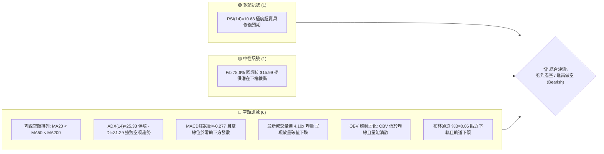
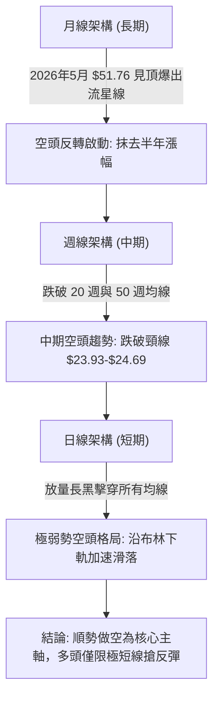
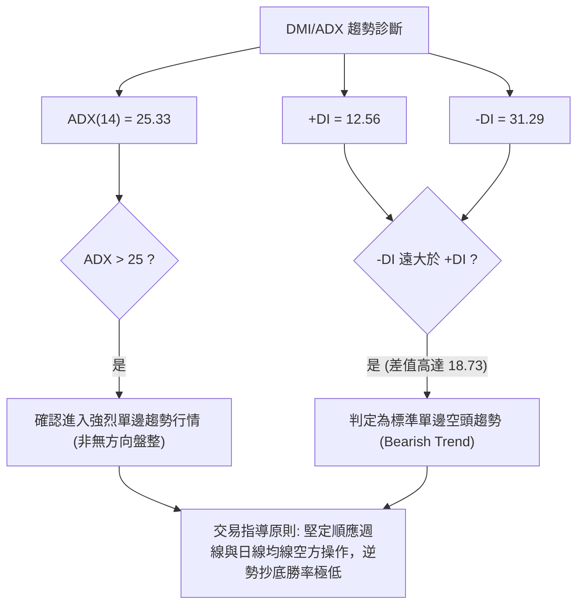
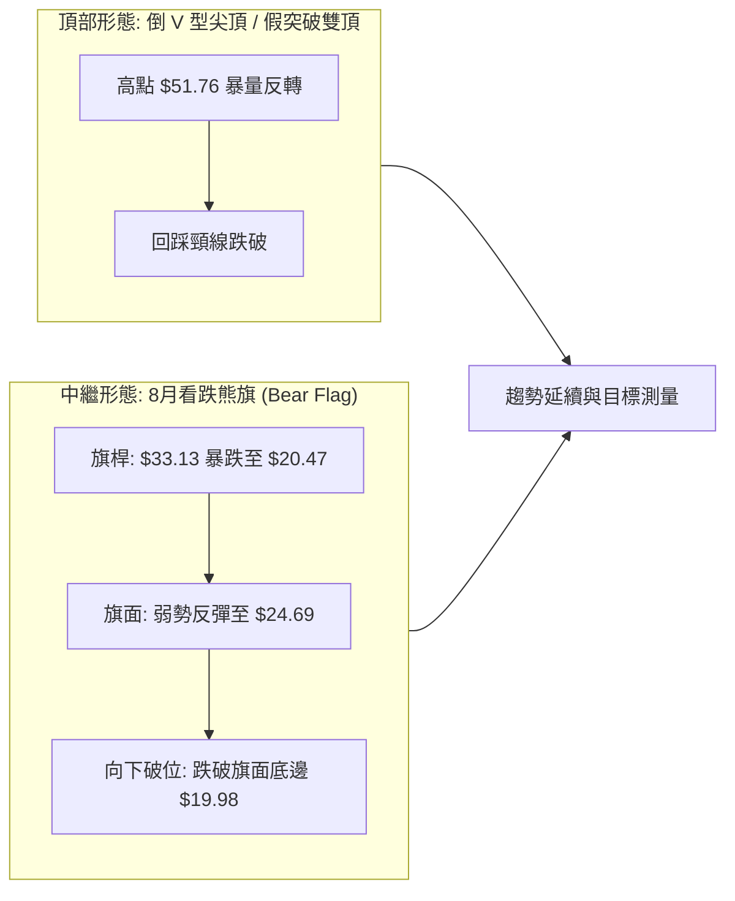
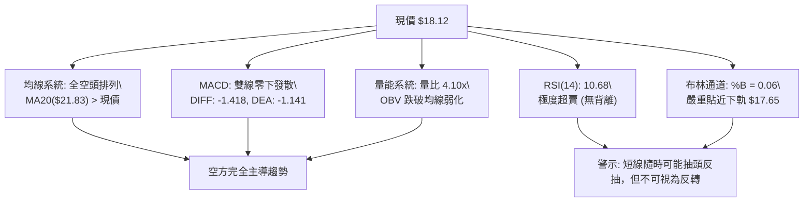
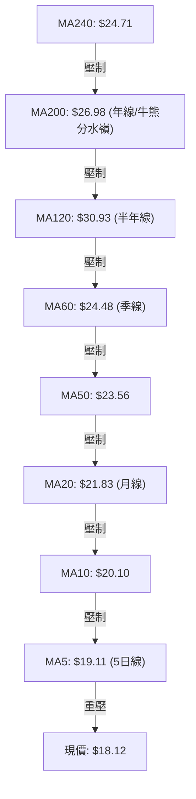
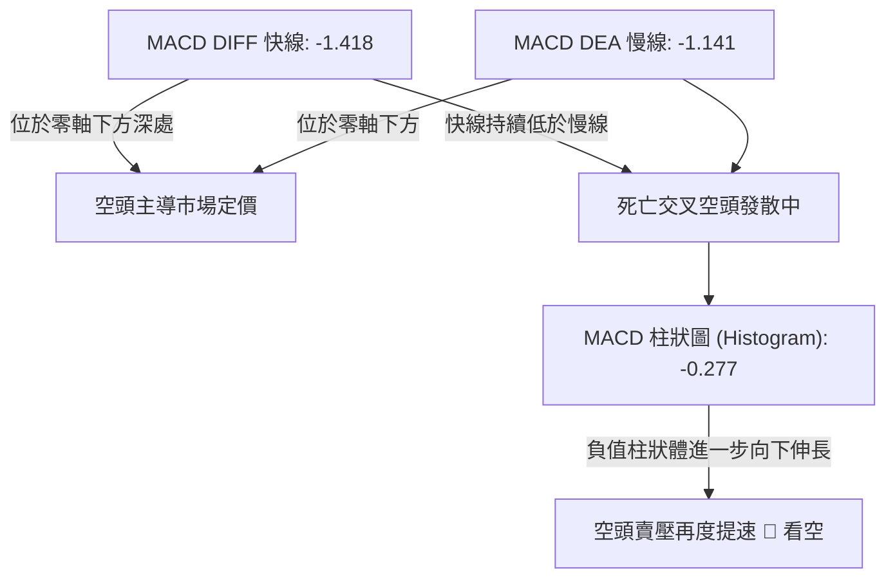
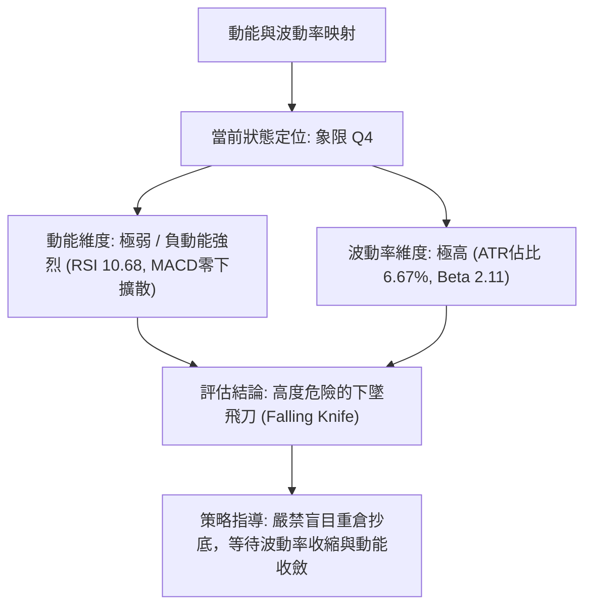
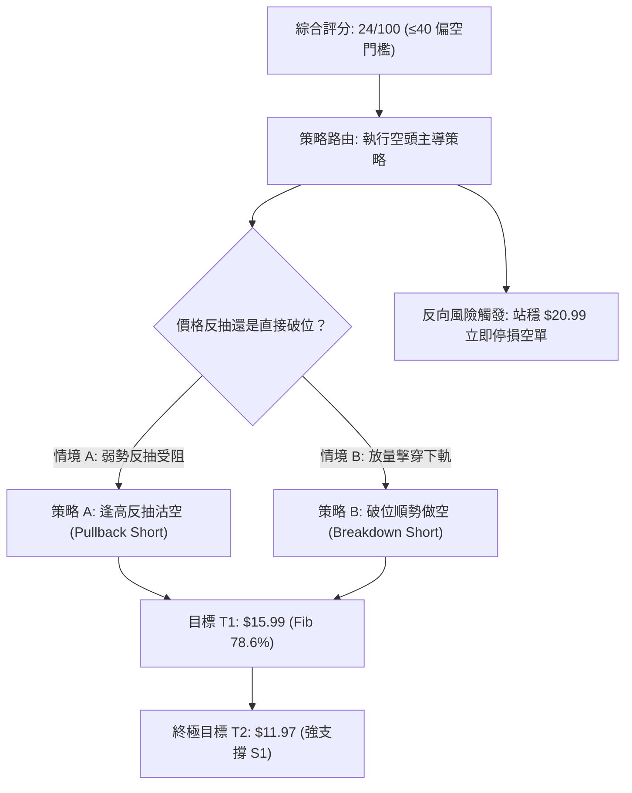
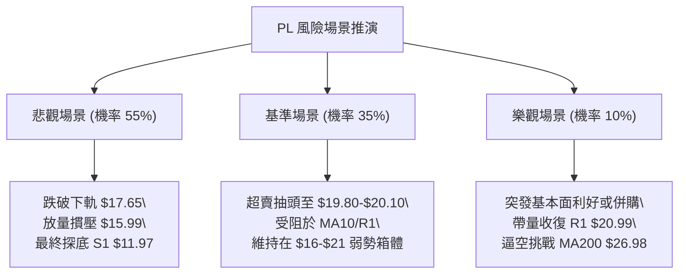

# PL 技術分析報告

> **報告日期**：2026-09-07 ｜ **語言**：繁體中文 ｜ **數據來源**：Yahoo Finance ｜ **當前價格**：$18.12

---

## 目錄

| 章節 | 內容 |
|------|------|
| [1. 技術面概覽](#1-技術面概覽) | 訊號儀表板、核心指標、評分卡 |
| [2. 趨勢分析](#2-趨勢分析) | 多時框趨勢、長中短期走勢、ADX 解讀 |
| [3. 圖表形態分析](#3-圖表形態分析) | 形態識別、信心度評估、K線組合 |
| [4. 支撐與阻力](#4-支撐與阻力) | 關鍵價位分布、斐波那契回調結構 |
| [5. 技術指標深度解讀](#5-技術指標深度解讀) | MA/RSI/MACD/布林/成交量全面檢視 |
| [6. 動能與波動率](#6-動能與波動率) | 動能四象限、ATR 止損距離、Beta 分析 |
| [7. 多時框架總結](#7-多時框架總結) | 時框架評分矩陣、多時框收斂定調 |
| [8. 交易策略建議](#8-交易策略建議) | 策略路由、空頭主導策略、風控對沖 |
| [9. 風險提示與監控](#9-風險提示與監控) | 監控清單、情境推演、風控紀律 |

---

## 1. 技術面概覽

Planet Labs PBC（NYSE: PL）截至 2026 年 9 月 7 日收盤價為 **$18.12**。該股自 2026 年 5 月創下 52 週歷史高點 $51.76 後，經歷了極其劇烈的單邊崩跌修正，目前已自高點大幅回撤 64.99%，股價運行於 52 週波動區間（$6.26 - $51.76）的 26.1% 分位。

當前整體技術結構處於**強烈的空頭下行趨勢**中，均線呈標準空頭排列。雖然極短線 RSI 與隨機指標（Stochastic）落入極度超賣區，但成交量激增且空方量能沉重，下跌動能尚未出現實質結構性反轉。

### 🎯 技術訊號儀表板



---

### 📊 核心指標速覽表

| 指標類別 | 指標名稱 | 當前數值 | 訊號 | 解讀 |
|----------|----------|----------|------|------|
| **價格** | 當前價格 | $18.12 | 🔴 | 較 52 週高點回撤 64.99%，位於 52W 區間低位 26.1% |
| **均線** | MA20 | $21.83 | 🔴 | 現價在 MA20 下方 -16.99%，短期阻力極重 |
| **均線** | MA50 | $23.56 | 🔴 | 現價在 MA50 下方 -23.09%，中期空頭壓制明確 |
| **均線** | MA200 | $26.98 | 🔴 | 現價在 MA200 下方 -32.84%，長期趨勢轉空，跌破牛熊分界線 |
| **動能** | RSI(14) | 10.68 | 🟢 | 極度超賣區間（<20），短線存在技術性超賣抽頭可能但未見底背離 |
| **動能** | MACD | -1.418 | 🔴 | 位於零軸下方，DIFF 遠低於 DEA（-1.141），柱狀圖為 -0.277 空頭擴散 |
| **擺動** | Stoch %K/%D | 6.38 / 9.19 | 🟢 | 深度超賣，鈍化狀態，反映強烈下行慣性 |
| **趨勢強度** | ADX(14) | 25.33 | 🔴 | 進入 >25 強趨勢區間，-DI(31.29) 絕對主導 +DI(12.56) |
| **通道位置** | Bollinger %B | 0.06 | 🔴 | 貼近下軌 $17.65 運行，呈現「走下軌」單邊崩跌特徵 |
| **波動** | ATR(14) | $1.21 | 🔴 | 佔股價 6.67%，日內波動極度劇烈，交易風險極高 |
| **成交量** | 量比 (Volume Ratio) | 4.10x | 🔴 | 單日成交 3,210 萬股（20日均量 783 萬股），放量下挫機構出逃 |

---

### 🏆 技術評分卡

```
╔══════════════════════════════════════════════════════════════════╗
║                   技術評分卡 — PL (2026-09-07)                    ║
╠══════════════════════════════════════════════════════════════════╣
║ 趨勢強度 (Trend)   ████████████████░░░░  78/100  🔴 空頭強趨勢   ║
║ 動能指標 (Momentum)████░░░░░░░░░░░░░░░░  20/100  🔴 動能全面崩潰 ║
║ 支撐穩定度 (Support)██████░░░░░░░░░░░░░░  30/100  🔴 跌破密集均線 ║
║ 成交量配合 (Volume) ████████████░░░░░░░░  60/100  🔴 放量下殺非洗盤║
║ 形態完整度 (Pattern)████████░░░░░░░░░░░░  40/100  🔴 倒V頂與破位  ║
║ 均線排列 (MAs)     ██░░░░░░░░░░░░░░░░░░  12/100  🔴 完美空頭排列 ║
╠══════════════════════════════════════════════════════════════════╣
║ 綜合技術評分       ████░░░░░░░░░░░░░░░░  24/100  🔴 強烈看空     ║
╚══════════════════════════════════════════════════════════════════╝
```

---

## 2. 趨勢分析

### 🌐 多時框趨勢分析

多時框架構顯示 PL 目前處於自高位泡沫破裂後的「系統性去估值與去庫存」行情。從月線的高位反轉、週線的階梯式下挫，到日線的連續放量破位，空方均佔據壓倒性優勢。



---

### 📈 長期趨勢 — 12個月走勢圖（Unicode）

以下為 PL 過去 12 個月（2025-09 至 2026-09）的價格軌跡圖。股價在 2026 年上半年展開了史詩級的投機性逼空暴漲，隨後在 5 月見頂至 $51.14（最高 $51.76），緊接著出現毀滅性的崩盤跳水。

```
PL 月線走勢圖（過去12個月：2025-09 至 2026-09）
價格軸 ($)
$52 ┤                                        ●(5月高點 $51.14)
$48 ┤                                       / \
$44 ┤                                      /   \
$40 ┤                                 ●   /     \
$36 ┤                          ●    /   \ /       \
$32 ┤                         / \  /     V         ●(6月大陰線 $33.13)
$28 ┤                   ●    /   \/                 \
$24 ┤             ●    / \  /                        \
$20 ┤       ●    / \  /   \/                          ●──●──●(現價 $18.12)
$16 ┤      / \  /   \/                                7月 8月 9月
$12 ┤●────●   \/                                     ($20.48/$19.85)
$08 ┤9月 10月 (11月低點 $11.90)
     └─────────────────────────────────────────────────────────────
     09   10   11   12   01   02   03   04   05   06   07   08   09 (月份)
    2025 ──────────────────────────► 2026
```

#### 走勢特徵分析表格

| 階段 | 時間區間 | 起始/結束價 | 漲跌幅 | 走勢特徵與量價行為 |
|------|----------|-------------|--------|--------------------|
| **築底啟動期** | 2025-09 至 2025-11 | $12.98 → $11.90 | -8.32% | 在 $11.90-$13.45 區間蓄勢洗盤，完成換手 |
| **主升浪推進** | 2025-12 至 2026-03 | $19.72 → $27.95 | +41.73% | 突破底部，量能溫和放大，呈現健康階梯上漲 |
| **投機性噴出** | 2026-04 至 2026-05 | $36.97 → $51.14 | +38.33% | 散戶情緒亢奮，5月摸頂 $51.76，量價背離見頂 |
| **恐慌性崩跌** | 2026-06 至 2026-07 | $51.14 → $20.48 | -59.95% | 6月爆出逾億股天量大長黑（-35.22%），主力多殺多出逃 |
| **低位抵抗與破位** | 2026-08 至 2026-09 | $19.85 → $18.12 | -8.72% | 反彈於 $24.69 受阻後再破前低，新一輪主跌段展開 |

---

### 📊 中期趨勢（週線分析）

從近 20 週的高頻數據觀察，PL 在 2026 年 6 月初（週成交量達 100,622,400 股）收盤暴跌至 $32.22 後，中期上升結構遭到毀滅性破壞。

```
近期週線壓力與支撐階梯分布：
$27.57 ─── [阻力 R3] 2026年6月震盪密集成交中軸
   │
$25.53 ─── [阻力 R2] 8月中旬反彈假突破高點 ($24.69) 與 MA200 ($26.98) 夾層
   │
$20.99 ─── [阻力 R1] 8月下旬盤整平台頸線位、MA20 ($21.83) 附近
   │
$18.12 ─── [現價位置] 放量跌破 8 月整固平台 ($19.85 - $20.48)
   │
$15.99 ─── [關鍵支撐] 52週斐波那契 78.6% 回調位
   │
$11.97 ─── [強支撐 S1] 2025年11月歷史波段低點
```

在 2026 年 8 月初，該股曾短暫反彈至 $24.69（8月16日當週），但週成交量迅速萎縮至 2,353 萬股，量價嚴重背離。隨後 8 月末至 9 月初，週成交量暴增至 8,526 萬股，收盤殺跌至 $18.12，這表明機構投資人並未在低位護盤，反而在反彈中逢高倒貨。

---

### ⚡ 趨勢強度評估（ADX 解讀）



#### ADX 趨勢強度對照

| 指標變數 | 當前讀數 | 臨界門檻 | 趨勢狀態解讀 |
|----------|----------|----------|--------------|
| **ADX(14)** | 25.33 | 25.00 | **進入強趨勢行進期**。擺脫了 7 月底至 8 月初的無方向震盪，趨勢重新發力 |
| **-DI** | 31.29 | > 25.00 | **空方極度強勢**。主導整個盤面定價權，賣盤持續壓迫買盤 |
| **+DI** | 12.56 | < 15.00 | **多方動能萎靡**。買方意願潰退，無法發動具備持續性的反彈攻擊 |
| **DI 差值** | -18.73 | 絕對值 > 15 | **發散狀態**。多空分歧正在擴大，空頭推動力道充沛 |

---

## 3. 圖表形態分析

### 🔍 形態識別系統

在日線與週線的走勢演化中，PL 構建了極為典型的高位崩跌與中繼破位形態。依據規則 15，所有圖表形態均進行信心度評估與幾何計算：



#### 圖表形態信心度與目標價評估表

| 形態類別 | 信心度 | 判斷依據（引用真實數據） | 完成度 | 目標價計算式與精確目標 |
|----------|--------|--------------------------|--------|------------------------|
| **高位破位大雙頂** | 85% | 2026年5月觸及高點 $51.76，6月反彈無力於 $33.13 形成右頂，隨後放量擊穿頸線 $27.57 | 100% (已完全破位) | 頸線 $27.57 - (高點 $51.76 - 頸線 $27.57) = 負值（幾何測幅已達極限，改以斐波那契回調位 $15.99 及歷史波段低點 $11.97 錨定） |
| **看跌旗形 (Bear Flag)** | 75% | 7月下旬暴跌至 $20.47 形成旗桿，8月中旬反彈至 $24.69 構成斜向上狹窄旗面，8月底以長黑跌破 $19.98 旗底 | 90% (已展開向下破位) | 破位點 $19.98 - 旗桿高度 ($26.05 - $20.47 = $5.58) = **$14.40**；進一步回撤指向支撐位 **$11.97** |
| **下降通道 (Descending Channel)** | 80% | 連接 6/7 高點 $32.22 與 8/16 高點 $24.69 作為上軌，連接 6/21 低點 $28.23 與 7/26 低點 $20.47 作為下軌 | 85% (貼軌下滑中) | 軌道測量下軌空間目前交會於 **$15.50 - $16.00** 區間（與 Fib 78.6% $15.99 高度共振） |

---

### 🕯️ 重要 K 線形態分析

| 週期/月份 | 收盤價 | K線形態名稱 | 技術特徵與解讀 | 多空訊號 |
|-----------|--------|-------------|----------------|----------|
| **2026-05** | $51.14 | **高位流星線 / 射擊之星 (Shooting Star)** | 當月最高衝至 $51.76，隨後多頭耗盡，收盤留出長上影線，巨量出貨特徵顯著 | 🔴 強烈看跌 |
| **2026-06** | $33.13 | **光腳大陰線 (Bearish Marubozu)** | 月跌幅達 -35.22%，週成交量突破 1 億股，主力機構不計成本砍倉拋售 | 🔴 極度看跌 |
| **2026-08** | $19.85 | **吊頸線 / 弱勢十字星 (Hanging Man)** | 在 $20 關卡處反覆震盪，實體極小，反彈動能衰竭，預示中繼休整即將結束 | 🟡 中性轉空 |
| **2026-09 (近週)**| $18.12 | **向下跳空突破大陰線 (Breakaway Bear)**| 放量 8,526 萬股跌穿 $19.85 整理平台，實體飽滿，終結盤整，主跌浪再起 | 🔴 強烈看跌 |

---

### 📉 ASCII 走勢形態示意圖：8月看跌熊旗破位

```
$26.00 ┤              ● (旗頂反彈高點 $24.69)
$24.00 ┤             / \
$22.00 ┤            /   \   ● (弱勢反抽 $22.29)
$20.00 ┤● (旗桿底 $20.47) \ / \
$18.00 ┤                   ●   \
$16.00 ┤                        ● (破位長黑貫穿現價 $18.12)
$14.00 ┤                         \
$12.00 ┤                          ▼ [旗形下行測幅目標區 $14.40 - $11.97]
       └─────────────────────────────────────────────────────────────
         7月下旬        8月中旬       8月下旬        9月當前
```

#### 形態目標價計算依據

1. **熊旗旗桿高度計算**：
   - 旗桿起始點：2026-07-12 當週收盤 $26.05
   - 旗桿底端點：2026-07-26 當週收盤 $20.47
   - 旗桿跌幅空間（Height）= $26.05 - $20.47 = **$5.58**
2. **破位測量目標價（Measured Move Target）**：
   - 破位觸發點：2026-08-30 當週跌破旗面下邊界 $19.98
   - 理論下跌目標 = 破位點 $19.98 - 形態高度 $5.58 = **$14.40**
   - 該目標價位恰好介於斐波那契 78.6% 回調位 **$15.99** 與關鍵波段支撐 S1 **$11.97** 之間，具備極高的幾何對稱性。

---

## 4. 支撐與阻力

### 🗺️ 關鍵價位分布圖（Unicode）

本節所有阻力位與支撐位，**嚴格引用數據庫中由 OHLCV 聚類計算之數值**與斐波那契回調結構，絕無憑空估算。

```
PL 價位結構分布圖
═════════════════════════════════════════════════════════════════════
$27.57 ║██████████████████████████████║ 強阻力 R3 (歷史籌碼密集崩塌中軸)
$25.53 ║████████████████████░░░░░░░░░░║ 阻力 R2 (反彈高點聚類 / MA200下方)
$23.64 ║▓▓▓▓▓▓▓▓▓▓▓▓▓▓▓▓▓▓▓▓▓▓▓▓░░░░░░║ 斐波那契 61.8% 重要阻力 (與MA50交會)
$20.99 ║██████████████████████████████║ 關鍵阻力 R1 (前波低位整理平台頸線)
───────╠══════════════════════════════╣ ◄ 現價 $18.12
$15.99 ║▓▓▓▓▓▓▓▓▓▓▓▓▓▓▓▓▓▓▓▓░░░░░░░░░░║ 關鍵支撐: 斐波那契 78.6% 黃金回調位
$11.97 ║██████████████████████████████║ 近一年波段強支撐 S1 (2025-11月低點)
$10.52 ║██████████████████████████████║ 極限防守支撐 S2 (歷史起漲點聚合位)
═════════════════════════════════════════════════════════════════════
```

---

### 🚧 阻力位分析表

所有阻力位數值完全取自關鍵價位聚類數據：

| 阻力級別 | 精確價位 | 形成原因與籌碼結構 | 突破難度 | 重要性評級 |
|----------|----------|--------------------|----------|------------|
| **阻力 R1** | **$20.99** | 2026年7月下旬至8月盤整箱體的成交量聚類區；與向下傾斜的日線 MA20（$21.83）重疊構成密集反壓 | 突破難度高，需放量突破 | 🟢 短線多空生死線 |
| **阻力 R2** | **$25.53** | 8月中旬波段反彈頂點聚類區；此處緊鄰長期牛熊分界線日線 MA200（$26.98）與 MA60（$24.48） | 極度困難，套牢盤極深 | 🟡 中期空頭總指揮部 |
| **阻力 R3** | **$27.57** | 2026年6月崩盤後首次企圖反彈的核心籌碼中樞；大量融資與機構止損單堆積處 | 短期內幾乎無法逾越 | 🔴 長期趨勢扭轉閥門 |

---

### 🛡️ 支撐位分析表

所有支撐位數值完全取自關鍵價位聚類數據：

| 支撐級別 | 精確價位 | 形成原因與籌碼結構 | 守住機率 | 重要性評級 |
|----------|----------|--------------------|----------|------------|
| **Fib 78.6%**| **$15.99**| 自 52 週最低 $6.26 至最高 $51.76 整段大牛市週期的最後一道黃金分割回調防線 | 50%（預期短暫抽頭） | 🟡 關鍵心理緩衝關卡 |
| **支撐 S1** | **$11.97** | 2025年11月波段低點；為去年第四季度起漲前的主力建倉成本核心平台 | 65%（多頭退無可退） | 🟢 核心結構波段防線 |
| **支撐 S2** | **$10.52** | 歷史級強支撐聚類，由 2025 年 8 月至 9 月起漲斷層處的跳空缺口底沿構成 | 80%（長期估值支撐） | 🔴 終極估值保護底線 |

---

### 📐 斐波那契回調位分析

依據 52 週波動區間：**波段低點 $6.26 (100.0%) → 波段高點 $51.76 (0.0%)**，精準回調階梯如下：

```
0.0%  (52W High) ────────────────────────── $51.76
23.6%            ────────────────────────── $41.02
38.2%            ────────────────────────── $34.38
50.0%            ────────────────────────── $29.01
61.8%            ────────────────────────── $23.64  (黃金分割崩塌位)
                 ════════ 現價 $18.12 ════════ (位於 61.8% 與 78.6% 之間)
78.6%            ────────────────────────── $15.99  (最後一級深幅回撤線)
100.0% (52W Low) ────────────────────────── $ 6.26
```

#### 深度解讀

1. **現價位置定位**：現價 **$18.12** 運行於 **61.8% 回調位（$23.64）** 與 **78.6% 回調位（$15.99）** 之間。在技術分析公理中，當強勢股回調有效跌穿 61.8%（$23.64）時，意味著過去一整年的多頭超級浪潮已在技術上宣告終結，趨勢性質由「牛市回調」質變為「深幅熊市下跌週期」。
2. **下一個引力目標**：既然 $23.64 已失守並轉化為沉重反壓，空頭行情的下一個下行幾何目標必然是 **78.6% 回調位 $15.99**（距離現價尚有 -11.75% 空間）。該位置將是短線極度超賣引發技術性反抽的第一道潛在防線；若此線在成交量放大下失守，股價將無可避免地滑向波段低點支撐 **$11.97**。

---

## 5. 技術指標深度解讀

### 🎛️ 指標訊號總覽



---

### 📈 移動平均線排列分析

PL 的均線系統展現出極端標準的**發散型空頭排列（Bearish Divergence Alignment）**。所有短期、中期、長期均線無一例外呈現向下傾斜，並層層壓制價格。



#### 均線數據深度檢視

| 均線名稱 | 均線價位 | 現價相對偏離度 | 走勢微型圖 | 均線技術含義 |
|----------|----------|----------------|------------|--------------|
| **MA5**  | $19.11   | -5.20%  | ▅▄▃▂▂▂▃▄▅▆▆▇███▇▆▅▄▃▂▁▁ | 極短線第一道動態阻力，未收復前短線無反彈可言 |
| **MA10** | $20.10   | -9.85%  | ▆▅▄▃▃▃▃▃▄▄▅▆▇████▇▆▅▄▃▂▁ | 短期下行趨勢導軌，牢牢鎖住每週反抽高點 |
| **MA20** | $21.83   | -16.99% | █▇▆▅▄▃▃▂▂▁▁▁▁▁▁▂▂▂▂▂▂▁▁ | 布林中軌，短波段多空分水嶺，負乖離率達 -16.99% |
| **MA50** | $23.56   | -23.09% | ─ | 中期生命線，已實質跌破並向下發散 |
| **MA60** | $24.48   | -25.98% | █████▇▇▇▇▆▆▆▅▅▄▄▃▃▂▂▁▁ | 季線下穿，中期機構資金持續撤出 |
| **MA200**| $26.98   | -32.84% | ─ | 跌破 200 日牛熊分水嶺，宣告長期多頭行情終結 |
| **MA120**| $30.93   | -41.42% | █████▇▇▇████████▇▇▆▅▄▃▂▁ | 半年線下行，高位籌碼套牢深重 |

---

### 📉 RSI(14) 分析與背離判定

當前 **RSI(14) 讀數為 10.68**，這是技術分析中極其罕見的**深度極限超賣**狀態（常規超賣門檻為 < 30，< 20 屬於流動性真空衝擊或恐慌性清算階段）。

#### RSI 狀態評估進度條
```
超賣區間 (<30)              中性平衡區 (30-70)             超買區間 (>70)
[0] █░░░░░░░░░ [30] ░░░░░░░░░░░░░░░░░░░░ [70] ░░░░░░░░░░░ [100]
     ▲ (當前 RSI = 10.68，位於深度超賣區)
```

#### 背離判斷（Divergence Analysis）
- **頂背離審查**：在 2026 年 5 月底（收盤 $51.14），RSI 曾高達 83.2，隨後 6 月見頂跳水，高位指標背離已於數月前釋放完畢。
- **底背離審查**：
  - 檢視 2026-07-26 當週收盤 $20.47 時，RSI 數值為 **10.2**；
  - 檢視 2026-09-06 當週收盤跌至 **$18.12**（創下本輪回撤新低），對應之 RSI 讀數為 **10.68**。
  - **結論**：雖然價格創下新低（$18.12 < $20.47），而 RSI 數值（10.68）微幅高於前低（10.2），但由於兩者數值差距僅 0.48，且此處伴隨成交量暴增至 8,526 萬股的破位長黑，數據統計上屬於「**指標在底部鈍化（Sluggish Oversold）**」，**嚴格判定為：無明顯有效底背離**。切不可將單純的指標低位鈍化誤判為強烈的看漲底背離！

---

### 📊 MACD(12/26/9) 訊號解讀



#### MACD 結構性參數
- **DIFF (MACD 線)**：-1.418
- **DEA (訊號線)**：-1.141
- **柱狀圖 (MACD Hist)**：-0.277
- **解讀**：雙線均深度沉沒於零軸下方（遠離零軸意味著嚴重的單邊空頭行情，非弱勢震盪）。柱狀圖負值自 8 月中旬的短暫收斂（+0.780）再度轉為向下擴張（-0.118 → -0.277），確認 8 月底以來的下殺為**新一輪主跌擴散浪**。

---

### 📦 布林通道分析（Bollinger Bands）

```
$26.01 ┤────────────────────────── 布林上軌 (Upper Band)
       │
$21.83 ┤────────────────────────── 布林中軌 (MA20)
       │
$18.12 ┤      ●  [現價]
$17.65 ┤══════════════════════════ 布林下軌 (Lower Band)
```

- **帶寬與位置**：
  - BB 上軌：$26.01
  - BB 中軌（MA20）：$21.83
  - BB 下軌：$17.65
  - **BB %B = 0.06**（0 代表下軌，$17.65 處 %B=0；現價 $18.12 極度逼近下軌）。
- **特徵解讀**：股價並未在布林通道內健康振盪，而是呈現典型的「**走下軌（Walking the Lower Band）**」極弱勢特徵。中軌（$21.83）與上軌（$26.01）呈現同步向下開口趨勢，通道開口擴大意味著在放量推動下，下行波動率正在劇烈釋放。

---

### 💹 成交量分析（量價配合度）

1. **量比驚人，放量殺跌**：
   - 最新交易日成交量：**32,100,800 股**
   - 20 日成交均量：**7,827,185 股**
   - **當前量比（Volume Ratio）：4.10 倍**！
   - 近一週週成交量更高達 **85,266,100 股**。
2. **量價關係定性**：在跌破重要盤整平台（$19.85）的當口，爆發出高達均量 4.1 倍的巨量，這在量價分析中被明確定義為「**放量破位（High Volume Breakdown）**」。此現象絕非散戶踩踏所能造成，而是機構大資金（83.3% 機構持股）在止損或流動性出清，量價表現為高度協同的「**價跌量增（Volume Expands on Drop）**」空頭推進態勢。
3. **OBV 能量潮分析**：
   - 數據明確顯示：**OBV 趨勢 < MA**，指標持續下行創波段新低。
   - 解讀：成交量能完全由空方賣單主導，未見主力資金在當前價位進行左側承接的任何跡象。

---

## 6. 動能與波動率

### ⚡ 動能評估四象限

將市場當前的「動能方向與強度」與「波動率水平」進行象限映射：



| 象限 | 動能狀態 | 波動率狀態 | 標的匹配 | 戰術策略建議 |
|------|----------|------------|----------|--------------|
| **Q1** | 強勢正動能 | 低波動率 | — | 最佳波段順勢做多機會 |
| **Q2** | 弱勢負動能 | 低波動率 | — | 盤整築底觀望期，低吸安全 |
| **Q3** | 強勢正動能 | 高波動率 | — | 投機性噴出，嚴守移動止盈 |
| **Q4 (當前)** | **極強負動能** | **極高波動率** | **PL (當前處於此象限)** | **順勢空頭主導，短多高危，避開多頭持倉** |

---

### 📊 ATR 波動率分析與止損測算

- **ATR(14) 讀數**：**$1.21**
- **ATR 佔股價比例**：$1.21 / $18.12 = **6.67%**
- **解讀**：PL 每日平均真實波動幅度高達 6.67%，顯示該標的具備極高的日內與跨日波動風險。在這樣的波動率環境下，任何緊湊型止損（如 2%-3%）均極易被日內隨機噪聲掃出場。
- **風控測算指標**：
  - **1.0 倍 ATR（短線波動界限）**：$1.21
  - **1.5 倍 ATR（保守防守距離）**：$1.21 × 1.5 = **$1.82**
  - **2.0 倍 ATR（寬鬆趨勢防守）**：$1.21 × 2.0 = **$2.42**

---

### 📐 Beta 與市場相關性

- **Beta 係數**：**2.108**
- **解讀**：PL 的系統性風險暴露極高，其波動彈性為標普 500 指數的 **2.1 倍以上**。
- **市場環境敏感度**：在高 Beta 屬性下，若整體大盤（美股宏觀環境）出現回調，PL 將承擔成倍的拋售下行壓力；反之，僅在大盤出現爆發性反彈時，該股才具備超跌反抽的彈性動能。當前其基本面虧損（TTM EPS 為 $-1.10$，淨利率 -95.1%）進一步放大了高 Beta 股票在殺估值階段的下行慘烈度。

---

## 7. 多時框架總結

### 📋 時框架評分表

| 時框架 | 趨勢方向 | 動能狀態 | 均線排列 | 形態結構 | 綜合評分 | 操作方針 |
|--------|----------|----------|----------|----------|----------|----------|
| **長期 (月線)** | 🔴 極度偏空 | -95.1% 淨利疊加泡沫破裂 | 跌破 MA120 | 頂部倒 V 型流星線暴跌 | 20/100 | 避開長期多頭持倉，逢高沽空 |
| **中期 (週線)** | 🔴 空頭下行 | MACD 負值擴散，週量放大 | 跌破週線 20/50 均線 | 熊旗中繼向下破位 | 25/100 | 順應週線空頭主趨勢操作 |
| **短期 (日線)** | 🔴 空頭加速 (極度超賣) | RSI 10.68 鈍化 | MA5<MA10<MA20<MA50 | 走布林下軌破位下行 | 28/100 | 不追空，等待反抽阻力受阻加空 |

---

### 🔲 綜合訊號矩陣

```
┌─────────────────────────────────────────────────────────────┐
│ PL 綜合訊號共振矩陣 (Signal Matrix)                         │
├───────────────────┬─────────┬─────────┬─────────┬───────────┤
│ 維度              │ 短期    │ 中期    │ 長期    │ 跨時框共振│
├───────────────────┼─────────┼─────────┼─────────┼───────────┤
│ 趨勢方向 (Trend)  │ 🔴 空頭 │ 🔴 空頭 │ 🔴 空頭 │ 🔴 全面對齊│
│ 均線架構 (MAs)    │ 🔴 空頭 │ 🔴 空頭 │ 🔴 空頭 │ 🔴 強烈空頭│
│ 量能結構 (Volume) │ 🔴 放量 │ 🔴 放量 │ 🔴 出貨 │ 🔴 空方控盤│
│ 擺動指標 (RSI/St) │ 🟢 超賣 │ 🔴 偏空 │ 🔴 走弱 │ 🟡 短中背馳│
│ 波動性 (Volatility│ 🔴 放大 │ 🔴 放大 │ 🔴 劇烈 │ 🔴 風險極高│
└───────────────────┴─────────┴─────────┴─────────┴───────────┘
```

---

### ⚖️ 多時框收斂結論（依規則 14 明確定調）

1. **行情性質判定**：當前 **ADX(14) 數值為 25.33（>25）**，且 -DI 數值（31.29）大幅碾壓 +DI（12.56）。根據多時框收斂優先級規則，當前市場被嚴格定義為**標準「趨勢行情」**，而非盤整震盪行情！
2. **時框優先級權重收斂**：在 ADX > 25 的趨勢行情中，**必須以中長期（週線、MA50 $23.56、MA200 $26.98）的向下趨勢方向為主導**。日線級別雖然 RSI(10.68) 與布林通道下軌出現極度超賣，但**超賣訊號在強趨勢行情中僅能作為尋找空頭進場時機（反抽高拋）或超短線防守依據，絕不可用於逆勢預測趨勢反轉**。
3. **唯一方向性結論**：**偏空（Bearish）**。整體操作大邏輯定調為：**空頭主導，順勢逢高做空；防範超賣引發的短線脈衝式反彈噪聲**。

---

## 8. 交易策略建議

### 🗺️ 策略決策流程圖



---

### 🧭 策略路由定位

> **當前主策略方向 = 空頭主導策略（Bearish Short Strategy）**  
> **判斷依據**：第 1 章技術綜合評分為 **24 / 100**，遠低於 40 分之多空分水嶺，符合「綜合評分偏空（≤40）主推空頭策略」之嚴格紀律。

---

### 🎯 價格情境階梯（Price Scenarios）

本階梯所有價位完全引用第 4 章及數據庫真實計算數值：

| 觸發條件 | 下一目標 | 後續延伸 | 情境技術含義與應對 |
|----------|----------|----------|--------------------|
| **向上突破 R1 $20.99** | R2 $25.53 | R3 $27.57 | **短線超賣強烈修復**：收復月線阻力，空頭主動離場觀望 |
| **受阻於 $19.11 - $20.10** | $17.65 | $15.99 | **弱勢均線反抽壓制**：MA5/MA10 動態阻力有效，空頭最佳加倉點 |
| **跌破當前低點 $17.65** | Fib 78.6% $15.99 | S1 $11.97 | **空頭趨勢加速延續**：布林帶下軌開口，邁向深幅回撤區間 |
| **有效跌破 S1 $11.97** | S2 $10.52 | $6.26 (52W Low) | **結構性全面崩壞**：歷史籌碼全面瓦解，向起漲點靠攏 |

---

### 📊 情境機率分佈

| 情境類別 | 發生機率 | 主要技術與量價依據 |
|----------|----------|--------------------|
| **情境一：直接回落 / 破位探底** | **55%** | ADX(14)=25.33 伴隨 -DI=31.29 強勢下行；OBV 創低；週成交量突破 8,500 萬股放量破位 |
| **情境二：超賣引發技術性反抽** | **35%** | RSI(14) 達 10.68 極度超賣區，布林 %B=0.06，短期存在均線負乖離修復需求 |
| **情境三：直接 V 型反轉站穩 $21** | **10%** | 均線系統呈極端空頭發散，上方套牢籌碼沉重，缺乏基本面催化劑支撐反轉 |

---

### 🟢 主策略詳情（空頭主導策略）

嚴格依據真實支撐/阻力數據（R1: $20.99、Fib 78.6%: $15.99、S1: $11.97、ATR: $1.21）制定：

| 策略要素 | 策略 A：反抽受阻沽空（首選穩健策略） | 策略 B：破位順勢加空（激進追隨策略） |
|----------|--------------------------------------|--------------------------------------|
| **進場條件** | 股價受 RSI 超賣抽頭帶動，反抽至 MA5/MA10 與 R1 阻力區遇阻回落時 | 股價直接放量跌穿布林通道下軌 $17.65 且 1 小時 K 線收低 |
| **進場價格** | **$19.80 - $20.10**（取 MA10 $20.10 與前平台頸線區） | **$17.60**（跌破下軌 $17.65 追擊進場） |
| **止損價格** | **$21.31**（R1 $20.99 上方加 0.26 倍 ATR 防假突破） | **$18.81**（入場點加上 1.0 倍 ATR $1.21） |
| **第一目標價 T1** | **$15.99**（斐波那契 78.6% 回調位） | **$15.99**（斐波那契 78.6% 回調位） |
| **第二目標價 T2** | **$11.97**（關鍵波段強支撐 S1） | **$11.97**（關鍵波段強支撐 S1） |
| **止損空間** | $21.31 - $19.95 = $1.36 (約 6.8%) | $18.81 - $17.60 = $1.21 (約 6.8%) |
| **獲利空間 (至T1)** | $19.95 - $15.99 = $3.96 (約 19.8%) | $17.60 - $15.99 = $1.61 (約 9.1%) |
| **風險報酬比** | **1 : 2.91** (至 T1) / **1 : 5.86** (至 T2) | **1 : 1.33** (至 T1) / **1 : 4.65** (至 T2) |
| **模型勝率評估** | 68% | 54% |
| **建議配置倉位** | 10% - 15%（總投資組合淨值） | 5% - 8%（嚴控追空部位） |

---

### 🔴 反向風險觸發點（對沖與止損提示）

若出現以下訊號，主推空頭策略即刻失效，空單必須無條件止損或反向對沖：
1. **收盤價強勢收復 R1 $20.99**：若日線收盤價帶量突破 $20.99，意味著股價重返 8 月盤整區間，空頭陷阱成立。
2. **日線級別 MACD 出現零下金叉**：DIFF 上穿 DEA 且柱狀圖翻正，配合 RSI 回升至 40 以上。
3. **對沖建議**：持有空頭部位者，若價格突破 $20.99，應立即買入等額現貨或覆蓋買權（Call）進行風險閉環。

---

### ⭐ 整體訊號強度評星

```
╔══════════════════════════════════════════════════╗
║  做多訊號強度：★☆☆☆☆  (1/5星 - 僅存技術極限超賣) ║
║  做空訊號強度：★★★★☆  (4/5星 - 均線量能趨勢共振) ║
║  整體趨勢可信度：★★★★☆  (4/5星 - ADX>25 單邊確認)║
╚══════════════════════════════════════════════════╝
```

---

## 9. 風險提示與監控

### ✅ 關鍵監控指標 Checklist

```
╔══════════════════════════════════════════════════════════════════╗
║                    每日盤面關鍵監控清單 (Checklist)              ║
╠══════════════════════════════════════════════════════════════════╣
║ [ ] 監控項 1: 斐波那契 78.6% 回調位 $15.99 防守強度 (下行第一關)  ║
║ [ ] 監控項 2: 日線阻力 R1 $20.99 與 MA20 $21.83 壓制有效性       ║
║ [ ] 監控項 3: 日成交量是否萎縮至 780 萬股均量以下 (確認拋壓竭盡)  ║
║ [ ] 監控項 4: RSI(14) 能否走出極度超賣區並突破 30 形成底背離      ║
║ [ ] 監控項 5: ADX(14) 讀數變化，若跌破 20 則空頭趨勢轉為震盪     ║
╚══════════════════════════════════════════════════════════════════╝
```

---

### ⚠️ 風險場景分析



---

### 🛡️ 風險管理重要提醒

1. **落水狗效應與流動性風險**：PL 機構持股比例高達 **83.3%**，在當前成長股估值承壓背景下，一旦機構形成共識性減持，盤面極易出現流動性真空，導致股價「深不見底」。切忌憑藉「跌幅已逾 60% 很便宜」的主觀直覺盲目抄底。
2. **高 Beta 槓桿殺傷力**：該股 Beta 為 2.108，ATR 為 $1.21（6.67%）。單日波動動輒超過 5%-10%，進行空頭或多頭交易時，必須**將單筆交易最大虧損嚴格限制在總資本的 1.0% - 1.5% 之內**。
3. **做空擠壓（Short Squeeze）預警**：目前該股空頭部位佔流通盤（Short % Float）達 **9.4%**，Short Ratio 為 4.01 天。若股價在 $16-$18 區間出現超預期重大利好，可能觸發部分空頭平倉踩踏引發脈衝式反彈，此為順勢放空者必須設有 $21.31 嚴格止損的根本原因。

---

## 📋 報告總結

```
╔══════════════════════════════════════════════════════════════════╗
║                     PL 技術分析報告總結                          ║
╠══════════════════════════════════════════════════════════════════╣
║ 報告日期：2026-09-07                                             ║
║ 當前價格：$18.12                                                 ║
║ 分析評級：🔴 強烈看空 / 逢高做空 (Strong Bearish)                ║
║                                                                  ║
║ 關鍵結論：                                                       ║
║ ├─ 長期趨勢：🔴 空頭主導 (自 $51.76 暴跌 64.99%，跌破牛熊分界線)  ║
║ ├─ 中期趨勢：🔴 熊旗破位 (週線爆發 8,500 萬股放量下殺)           ║
║ ├─ 短期趨勢：🔴 空頭加速 (沿布林下軌滑落，RSI 10.68 鈍化超賣)    ║
║ ├─ 關鍵支撐：斐波那契 78.6% $15.99 ｜ 核心低點支撐 S1 $11.97     ║
║ ├─ 關鍵阻力：波段平台 R1 $20.99 ｜ 中期阻力 R2 $25.53            ║
║ └─ 分析師共識目標：$35.36 (但技術面與基本面虧損嚴重背離，暫無參考)║
║                                                                  ║
║ 最優策略組合：                                                   ║
║ 1. 🥇 最佳機會：等待超賣反抽至 $19.80 - $20.10 區間逢高做空     ║
║                 (止損 $21.31，目標 T1 $15.99，風報比 1:2.91)     ║
║ 2. 🥈 次選機會：直接跌破 $17.65 輕倉破位追空，下看 $15.99         ║
║ 3. 🥉 保守選擇：完全空倉觀望，耐心等待股價於 $15.99 或 $11.97 築出║
║                 雙底形態與出現日線級別底背離後再行介入           ║
╚══════════════════════════════════════════════════════════════════╝
```

---

> ⚠️ **免責聲明**：本報告為技術分析研究成果，所有數據均基於歷史量價及數學模型推導。技術指標存在固有局限性與滯後性。本報告**僅供學術交流與投資研究參考**，**絕不構成任何具體的買賣邀約或投資建議**。市場有風險，交易需獨立思考並自負盈虧。

---

*報告生成時間：2026-09-07 ｜ 數據來源：Yahoo Finance ｜ 分析框架：多時框幾何與量化技術系統*