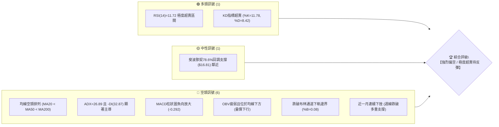
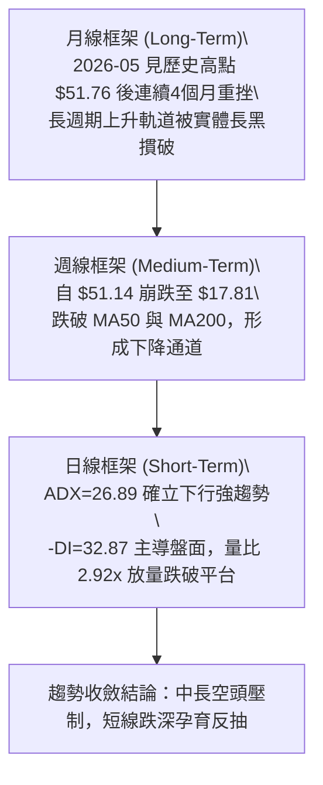
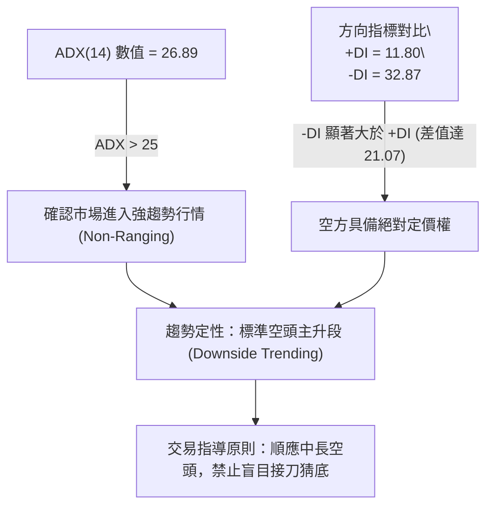
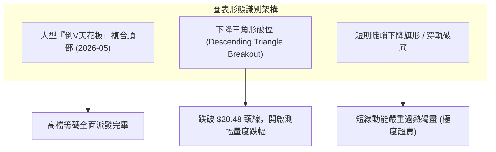
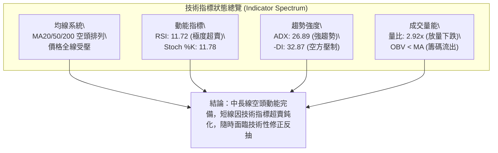
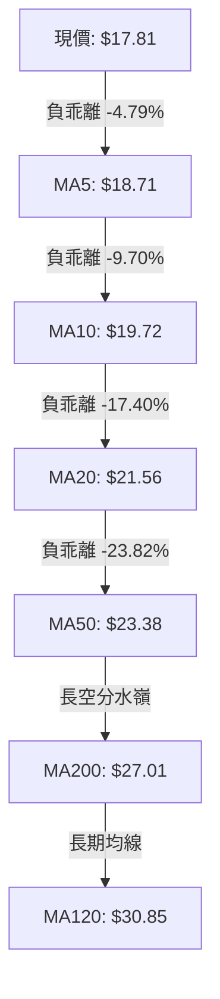
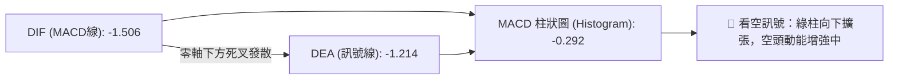
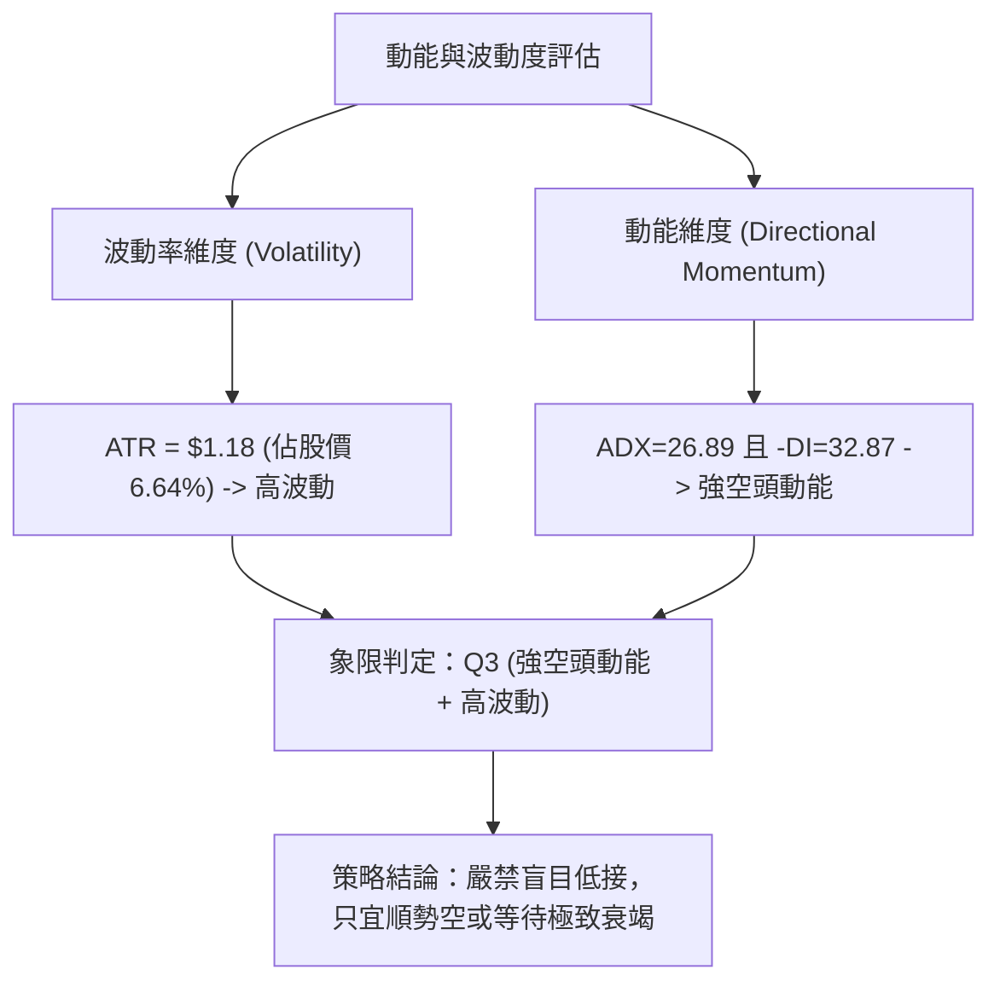
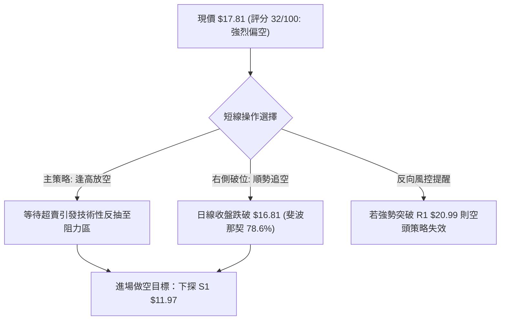
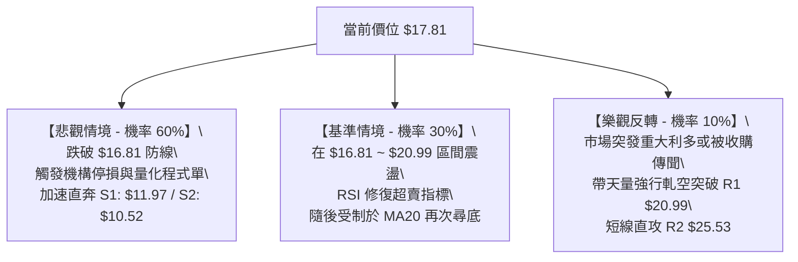

# PL 技術分析報告

> **報告日期**：2026-09-08 ｜ **語言**：繁體中文 ｜ **數據來源**：Yahoo Finance ｜ **當前價格**：$17.81

---

## 目錄

| 章節 | 內容 |
|------|------|
| [1. 技術面概覽](#1-技術面概覽) | 訊號儀表板、核心指標、評分卡 |
| [2. 趨勢分析](#2-趨勢分析) | 多時框趨勢、長中短期走勢 |
| [3. 圖表形態分析](#3-圖表形態分析) | 形態識別、K線組合、目標價 |
| [4. 支撐與阻力](#4-支撐與阻力) | 關鍵價位、斐波那契回調 |
| [5. 技術指標深度解讀](#5-技術指標深度解讀) | MA/RSI/MACD/布林/成交量 |
| [6. 動能與波動率](#6-動能與波動率) | 動能評估、ATR、Beta |
| [7. 多時框架總結](#7-多時框架總結) | 時框架評分矩陣 |
| [8. 交易策略建議](#8-交易策略建議) | 多空策略、風險報酬比 |
| [9. 風險提示與監控](#9-風險提示與監控) | 監控指標、風險場景 |

---

## 1. 技術面概覽

### 🎯 技術訊號儀表板



### 📊 核心指標速覽表

| 指標類別 | 指標名稱 | 當前數值 | 訊號 | 解讀 |
|----------|----------|----------|------|------|
| **價格** | 當前價格 | $17.81 | 🔴 | 位於52週區間下緣 23.7%，空頭絕對壓制 |
| **均線** | MA20 | $21.56 | 🔴 | 價格低於MA20達 -17.40%，短線呈現嚴重負乖離 |
| **均線** | MA50 | $23.38 | 🔴 | 中期生命線下彎，上方形成堅實壓制帶 |
| **均線** | MA200 | $27.01 | 🔴 | 長期牛熊分水嶺失守，長線架構轉空 |
| **動能** | RSI(14) | 11.72 | 🟢 | 極度超賣 (<20)，隨時具備技術性跌深反抽動能 |
| **動能** | MACD | -1.506 / -0.292 | 🔴 | 雙線位於零軸下方發散，柱狀圖持續翻綠擴大 |
| **趨勢** | ADX(14) | 26.89 | 🔴 | ADX > 25 確立強趨勢，-DI(32.87) 遠高於 +DI(11.80) |
| **通道** | 布林通道 | %B = 0.08 | 🔴 | 緊貼下軌 ($17.06)，帶狀開口向下擴張 |
| **成交量** | 20日量比 | 2.92x | 🔴 | 放量下殺 (最新量25.78M vs 均量8.84M)，恐慌盤湧現 |
| **波動** | ATR(14) | $1.18 | 🟡 | 單日波幅達 6.64%，短線波動率劇烈擴張 |

### 🏆 技術評分卡

```
╔══════════════════════════════════════════════════════════════╗
║              技術評分卡 — PL (2026-09-08)                    ║
╠══════════════════════════════════════════════════════════════╣
║ 趨勢強度 (Trend)      ██████████████░░░░░░  70/100  🔴 空頭強勢║
║ 動能指標 (Momentum)    ████░░░░░░░░░░░░░░░░  20/100  🔴 嚴重下挫║
║ 支撐穩定度 (Support)  ██████░░░░░░░░░░░░░░  30/100  🔴 考驗低位║
║ 成交量配合 (Volume)    ████████░░░░░░░░░░░░  40/100  🔴 帶量下殺║
║ 形態完整度 (Pattern)  ████████████░░░░░░░░  60/100  🔴 頂部確立║
║ 均線排列 (Moving Avg) ██░░░░░░░░░░░░░░░░░░  10/100  🔴 完美空頭║
╠══════════════════════════════════════════════════════════════╣
║ 綜合評分              ██████░░░░░░░░░░░░░░  32/100  🔴 強烈偏空║
╚══════════════════════════════════════════════════════════════╝
```

---

## 2. 趨勢分析

### 🌐 多時框趨勢分析



### 📈 長期趨勢 — 12個月走勢圖（Unicode）

```
PL 月線收盤走勢圖（過去12個月：2025-09 至 2026-09）
價格軸 ($)
$52 ┤                                      ● (2026-05: $51.14 / 高點 $51.76)
$48 ┤                                     ╱ ╲
$44 ┤                                    ╱   ╲
$40 ┤                              ●(04)╱     ╲
$36 ┤                             ╱            ╲
$32 ┤                            ╱              ● (2026-06: $33.13)
$28 ┤                      ●(03)╱                ╲
$24 ┤            ●(01)●(02)                            ╲
$20 ┤          ●(12)                                    ●(07) ●(08)
$16 ┤                                                          ╲  ●←現價 $17.81
$12 ┤●(09)●(10)●(11)                                              (2026-09)
    └─┬────┬────┬────┬────┬────┬────┬────┬────┬────┬────┬────┬────
     09   10   11   12   01   02   03   04   05   06   07   08   09
    (--------- 2025 ---------) (---------------- 2026 ---------------)
```

**走勢特徵分析表格**：

| 週期階段 | 月份區間 | 價格區間 | 累計漲跌幅 | 主要走勢特徵 |
|----------|----------|----------|------------|--------------|
| **底部盤整** | 2024-09 ~ 2025-05 | $2.21 ~ $4.62 | +72.2% | 長期底部打底，成交量維持低檔蓄勢 |
| **波段主升** | 2025-06 ~ 2026-01 | $6.10 ~ $24.97 | +309.3% | 量價齊揚，月線連續收紅，開啟大牛市主升段 |
| **末升衝頂** | 2026-02 ~ 2026-05 | $24.14 ~ $51.14 | +111.8% | 2026年5月創下天價 $51.76，極度乖離後出現見頂十字爆量 |
| **崩跌雪崩** | 2026-06 ~ 2026-07 | $51.14 ~ $20.48 | -59.9% | 高檔獲利了結與籌碼踩踏，連續破位 MA20、MA60 |
| **弱勢破底** | 2026-08 ~ 2026-09 | $20.48 ~ $17.81 | -13.0% | 反彈無力（8月高點受阻於 $24.69），9月再次放量下殺破低 |

### 📊 中期趨勢（週線分析）

中期走勢自 2026 年 5 月底創下 $51.14 以來，呈現經典的三波段殺盤結構（A-B-C）。
- **A浪殺跌**：從 $51.14 斷崖式跳水至 6 月 28 日週的 $27.07。
- **B浪反彈**：7 月初反彈至 $31.38 後遇阻回落；8 月中旬再次抽腳至 $24.69，但均無法克服下壓均線。
- **C浪主跌**：自 8 月下旬 $24.69 起跌，9 月首兩週放量長黑擊潰 $20.00 整數關卡，最低收至 $17.81，跌幅持續擴大。

```
近期重要均線阻力層疊壓制示意：
$27.01 ════════════════════════════════════════ MA200 (長期天花板)
$25.53 ──────────────────────────────────────── 密集套牢阻力 R2
$23.38 ════════════════════════════════════════ MA50  (中期強壓)
$21.56 ════════════════════════════════════════ MA20 / BB中軌 (短期下壓線)
$20.99 ──────────────────────────────────────── 關鍵波段阻力 R1
$17.81 ◄══════ 現價 (懸空於下軌邊緣)
$16.81 ┄┄┄┄┄┄┄┄┄┄┄┄┄┄┄┄┄┄┄┄┄┄┄┄┄┄┄┄┄┄┄┄ 斐波那契 78.6% 回調
$11.97 ════════════════════════════════════════ 前期波段強支撐 S1
```

### ⚡ 趨勢強度評估（ADX 解讀）



**ADX 強度對照解析**：
- **ADX 數值**：26.89。高於 25 臨界值，代表當前非震盪整理，而是強烈方向性單邊走勢。
- **方向指標**：+DI 為 11.80，處於歷史極低水準；-DI 高達 32.87，空方動能充沛且全面壓制多方。
- **歷史演變**：伴隨 9 月第一週 85.2M 與本週 25.78M 帶量殺盤，趨勢指標無任何走平或頂背離跡象，顯示下行動能依然在釋放中。

---

## 3. 圖表形態分析

### 🔍 形態識別系統



**形態信心度與測幅目標表**：

| 形態名稱 | 信心度 | 判斷依據（數據引用） | 完成度 | 目標價（附嚴格計算式） |
|----------|--------|----------------------|--------|------------------------|
| **下降通道 / 破位** | 85% | 7-8月兩次低點 $20.47 與 $20.48 形成橫向支撐頸線，於 2026-09-06 週以收盤價 $18.12 實體長黑跌破 | 100% (已確認破位) | 頸線 $20.48 - (反彈高點 $24.69 - 頸線 $20.48 = $4.21) = **$16.27** (接近斐波那契 $16.81) |
| **大型頭肩複合頂** | 75% | 左肩 2026-04 收盤 $36.97、頭部 2026-05 收盤 $51.14、右肩 2026-06 收盤 $33.13。頸線約位於 $27.07 ~ $28.23 區間 | 100% (已完全成型跌破) | 頸線以 $27.57 (R3) 計算，頭部 $51.76，測幅等倍目標 = $27.57 - ($51.76 - $27.57) = 負值無效；轉以下降階梯支撐 **S1: $11.97** 作為量度下壓目標 |
| **超賣底背離形態** | 15% | 數據中 RSI=11.72，但「RSI背離：無明顯背離」；價格與動能同向破底 | 0% (未成型) | **訊號不足，僅做指標型解讀**（不可預設雙底成立） |

### 🕯️ 重要K線形態分析

| 日期 / 月份 | 收盤價 | K線形態 | 解讀與心理意涵 | 訊號 |
|-------------|--------|---------|----------------|------|
| **2026-05-31 (週)** | $51.14 | 天量長上影陽線 | 52週高點 $51.76 現身，成交量 61.48M，主力高檔瘋狂派發籌碼 | 🔴 頂部力竭 |
| **2026-06-07 (週)** | $32.22 | 斷頭巨量大黑K | 創紀錄天量 100.62M，收盤自 $51.14 暴跌至 $32.22 (-37%)，多頭多殺多斷頭 | 🔴 崩盤確立 |
| **2026-08-16 (週)** | $24.69 | 弱勢回抽遇阻長黑 | 反彈量能急縮至 23.53M（無量虛抽），精準遇阻於 MA60 ($24.21) 後重挫 | 🔴 逃命波終結 |
| **2026-09-06 (週)** | $18.12 | 破位爆量長陰棒 | 成交量激增至 85.26M，長陰摜破前低 $20.47 支撐，籌碼再度失血潰敗 | 🔴 破底加速 |
| **2026-09-13 (當前)**| $17.81 | 實體續跌小陰線 | 跌勢稍緩但買盤極度匱乏，布林通道沿下軌貼行，空頭牢固掌控 | 🔴 慣性向下 |

### 📉 ASCII 走勢形態示意圖

```
PL 近五個月頂部崩跌形態示意圖
$51.76 ┬───────────────────▲ 頭部 (2026-05 衝頂爆量)
       │                  ╱ ╲
$40.00 ┼    左肩        ╱   ╲
       │   ┌───┐       ╱     ╲
$32.00 ┼───┘   └───┐  ╱       ╲       ┌───┐ 右肩反抽 (2026-06)
       │           ╲╱         ╲     ╱   └───┐
$27.57 ┼═══════════════════════════╲───╱═════════▼════ 複合頸線 R3 (跌破轉換為強阻力)
       │                            ╲          ╱
$24.69 ┼─────────────────────────────╲────────▲ 弱勢反彈次高點 (2026-08)
       │                              ╲      ╱ ╲
$20.48 ┼┄┄┄┄┄┄┄┄┄┄┄┄┄┄┄┄┄┄┄┄┄┄┄┄┄┄┄┄┄┄▼════▼───╲破位 (2026-08底雙重底頸線宣告失守)
       │                                          ╲
$17.81 ┼───────────────────────────────────────────● 現價 $17.81 (創本輪回調新低)
       │                                            :
$16.81 ┴- - - - - - - - - - - - - - - - - - - - - - ▽ 斐波那契 78.6% 回調關鍵防線
```

---

## 4. 支撐與阻力

### 🗺️ 關鍵價位分布圖（Unicode）

```
PL 價位結構分布圖 (依據 OHLCV 聚類與斐波那契數值精確繪製)
════════════════════════════════════════════════════════════════════════
$51.76 ║████████████████████████████████████████║ 52週最高點 (0.0% 回調)
$41.27 ║████████████████████████████            ║ 斐波那契 23.6% 回調位
$34.77 ║██████████████████████                  ║ 斐波那契 38.2% 回調位
$29.52 ║██████████████████                      ║ 斐波那契 50.0% 中樞平衡位
$27.57 ║████████████████████████████████████    ║ 強阻力 R3 (密集套牢 / MA200 $27.01)
$25.53 ║██████████████████████████              ║ 阻力 R2 (反彈高點聚類)
$24.28 ║████████████████████                    ║ 斐波那契 61.8% 黃金分割位
$20.99 ║████████████████████████████████        ║ 關鍵阻力 R1 (前平台跌破位 / 近MA20)
$17.81 ╠════════════════════════════════════════╣ ◄ 現價 ($17.81)
$16.81 ║▓▓▓▓▓▓▓▓▓▓▓▓▓▓▓▓▓▓▓▓▓▓▓▓                ║ 潛在止跌支撐 (斐波那契 78.6%)
$11.97 ║████████████████████████████████████    ║ 關鍵波段支撐 S1 (2025-11起漲平臺)
$10.52 ║████████████████████████████████████████║ 強支撐 S2 (2025年Q3密集換手區)
$ 7.29 ║████████████████████████████████████████║ 52週最低點 (100.0% 回調)
════════════════════════════════════════════════════════════════════════
```

### 🚧 阻力位分析表

| 阻力級別 | 價位 | 形成原因 | 突破難度 | 重要性 |
|----------|------|----------|----------|--------|
| **R1 (短期阻力)** | **$20.99** (+17.86%) | 8月盤整箱底下緣、前波低點聚類破位轉換位，且與 MA20 ($21.56) 重疊 | ★★★★☆ | 極高。短線反彈首要考驗，不收復此處任何反彈皆屬死貓跳 |
| **R2 (中期阻力)** | **$25.53** (+43.35%) | 8月中旬弱勢反抽高點 ($24.69) 與 MA60 ($24.21) 之上方密集套牢帶 | ★★★★★ | 極大。法人重倉套牢籌碼沉積區，多頭若無重大催化劑難以逾越 |
| **R3 (強阻力)** | **$27.57** (+54.80%) | 6月下旬反覆震盪打底之頸線平台，下方緊鄰 MA200 年線 ($27.01) | ★★★★★ | 戰略級。長期牛熊分水嶺，此價位下方皆定性為技術性熊市 |

### 🛡️ 支撐位分析表

| 支撐級別 | 價位 | 形成原因 | 守住機率 | 重要性 |
|----------|------|----------|----------|--------|
| **S1 (波段關鍵支撐)** | **$11.97** (-32.79%) | 近一年波段低點聚類，對應 2025 年 11 月爆發突破前的橫盤平台收盤價 ($11.90) | 60% | 極高。多頭最後的主力防守大本營，失守將面臨個位數定價 |
| **S2 (極限強支撐)** | **$10.52** (-40.93%) | 2025 年 8-9 月起漲初始籌碼沉積區，結構性換手密集點 | 75% | 戰略級。長線價值重估的最深底限，具備強烈價值錨定效果 |

### 📐 斐波那契回調位分析

依據 52 週低點 **$7.29** 至 52 週高點 **$51.76** 計算：

```
0.0%  (52W High)  $51.76 ── 頂部天花板
23.6%             $41.27 ── 6月第一週崩跌失守
38.2%             $34.77 ── 6月中旬抵抗破位
50.0%             $29.52 ── 多空中樞失守 (轉入實質熊市)
61.8%             $24.28 ── 黃金分割位 (8月反彈高點 $24.69 遇阻點)
-------------------------------------------------------------------------
現價落於區間：   $16.81 ~ $24.28 之間 (現價 $17.81，距離 78.6% 僅剩 $1.00)
-------------------------------------------------------------------------
78.6%             $16.81 ── 深幅回調關鍵極限防線 (當前空頭測試目標)
100.0% (52W Low)  $ 7.29 ── 原始起漲點
```

**解讀**：
現價 $17.81 已經徹底摜破 61.8% ($24.28) 重要防線，且目前正朝 78.6% ($16.81) 加速逼近。在技術分析中，跌破 61.8% 通常宣告原本的中長線上漲趨勢「完全遭到破壞」，行情退化為全回撤格局。$16.81 為多頭最後的斐波那契防線，若日線實體有效跌破 $16.81，下方將直接向近一年低點聚類支撐 **S1: $11.97** 尋求支撐。

---

## 5. 技術指標深度解讀

### 🎛️ 指標訊號總覽



### 📈 移動平均線排列分析



| 均線名稱 | 當前價位 | 現價相對乖離率 | 排列型態 | 趨勢指引 |
|----------|----------|----------------|----------|----------|
| **MA5** | $18.71 | -4.79% | 陡峭向下 | 極短線下壓線，未突破前空單續抱 |
| **MA10** | $19.72 | -9.70% | 陡峭向下 | 5日與10日均線死叉向下發散 |
| **MA20** | $21.56 | -17.40% | 穩定向下 | 月線趨勢下行，布林通道中軌所在 |
| **MA50** | $23.38 | -23.82% | 穩定向下 | 季線空頭，中期趨勢完全被空方主宰 |
| **MA200** | $27.01 | -34.06% | 由平轉下 | 年線失守，長線多頭架構已被瓦解 |

### 📉 RSI(14) 分析

- **RSI(14) 數值**：**11.72**
- **數值進度條**：
  ```
  [██░░░░░░░░░░░░░░░░░░] 11.72% (極度超賣區間 < 20)
  ```
- **超買超賣區間評估**：
  RSI 處於 11.72 的罕見極端低位。常規而言，RSI < 30 即進入超賣，低於 15 往往象徵市場進入情緒性拋售與恐慌斷頭階段。
- **背離診斷**：
  - **頂背離**：無。
  - **底背離**：**無明顯背離**（如官方快照所確認：價格創下 $17.81 新低，RSI 週線從 8 月底的 26.6 一路下滑至 10.7 ~ 11.7，價格與指標同步破底）。
  - **判斷結論**：雖然超賣嚴重，但在強趨勢行情（ADX=26.89）中，RSI 經常出現「**超賣鈍化**」現象，即價格沿著均線持續下滑而指標貼地摩擦，不可單憑 RSI 極低就盲目抄底。

### 📊 MACD(12/26/9) 訊號解讀



- **MACD 線**：-1.506，持續深陷零軸下方。
- **訊號線**：-1.214。
- **柱狀圖**：-0.292。自 8 月下旬的 +0.227 翻綠後，連續四週負向擴張（-0.118 → -0.277 → -0.292），顯示空頭推動力道正在加速，無任何即將黃金交叉的跡象。

### 📦 布林通道分析

```
PL 日線布林通道結構示意圖
$26.06 ┬────────────────────────────────────────────── BB 上軌 (Band Width = $9.00)
       │
$21.56 ┼┄┄┄┄┄┄┄┄┄┄┄┄┄┄┄┄┄┄┄┄┄┄┄┄┄┄┄┄┄┄┄┄┄┄┄┄┄┄┄┄┄┄┄ BB 中軌 (MA20)
       │
$17.81 ┼────────────● 現價 $17.81 (%B = 0.08)
$17.06 ┴────────────────────────────────────────────── BB 下軌 (極度壓迫邊界)
```

- **軌道狀態**：上軌 $26.06、中軌 $21.56、下軌 $17.06。帶寬開口達 $9.00。
- **%B 指標**：**0.08**（緊貼下軌 0.00 臨界點）。
- **特徵解讀**：價格跌破中軌後持續貼著下軌下行，展現「走軌行情（Walking the band）」，此乃單邊強空頭行情的典型態樣，表明空頭壓制極其強勁。

### 💹 成交量分析（量價配合度）

- **最新成交量**：25,786,811 股。
- **基準均量**：20 日均量 8,841,721 股；50 日均量 8,444,588 股。
- **量比**：**2.92x**。
- **OBV 趨勢**：OBV < MA，能量潮指標向下發散。
- **量價配合診斷**：
  2026 年 9 月首週成交量爆出 85,266,100 股摜破平台，本週成交量達 25.78M，量比接近 3 倍。放量下殺印證了這並非技術性假摔，而是法人機構與停損部位的實質倒貨。OBV 位於均線下方且持續創低，反映資金持續淨流出，量價結構完全利於空方。

---

## 6. 動能與波動率

### ⚡ 動能評估四象限

| 象限代號 | 動能狀態 | 波動率狀態 | 典型市場特徵 | PL 當前落點 |
|----------|----------|------------|--------------|-------------|
| **Q1** | 強多頭動能 | 低波動 | 穩健上升趨勢，風險報酬比優異 | ─ |
| **Q2** | 弱多頭動能 | 低波動 | 窄幅盤整，方向不明等待突破 | ─ |
| **Q3** | 強空頭動能 | 高波動 | 恐慌拋售、斷頭殺盤、波動加劇 | **✓ 當前狀態 (落入 Q3)** |
| **Q4** | 衰竭動能 | 高波動 | 趨勢末端劇震，反轉隨時發生 | ─ |



### 📊 ATR 波動率分析

- **當前 ATR(14)**：**$1.18**
- **價格佔比**：**6.64%**（極高波動屬性）。
- **風控與止損建議**：
  - **正常波幅空間**：股票單日正常震盪範圍達 ±$1.18。
  - **技術防守緩衝距離**：短線進場若設置止損，至少須給予 1.5 倍至 2.0 倍 ATR 的容錯空間：
    - $1.5 \times \text{ATR} = \$1.77$
    - $2.0 \times \text{ATR} = \$2.36$
  - **倉位管理警示**：由於單日波動超過 6.6%，單筆交易曝險資金應嚴格限制於總資金的 1.0% 以內，避免在劇烈跳空或連續長黑中遭受重創。

### 📐 Beta 與市場相關性

- **Beta 係數**：**2.108**
- **特性分析**：PL 具備超高 Beta 特質，其波動幅度為標普500大盤的 2.1 倍以上。在美股大盤回調或風險偏好降溫時，該股呈現加倍放大下跌；若遇空頭回補，反彈幅度亦會相當劇烈。
- **籌碼架構**：機構持股佔比高達 83.3%，放量破位顯示中長線機構資金正在持續調降權重；放空比率（Short % Float）達 9.4%，Short Ratio 為 4.01 天，顯示空頭部位集結，但需提防極端超賣下引發的軋空震盪。

---

## 7. 多時框架總結

### 📋 時框架評分表

| 時框架 | 趨勢方向 | 動能狀態 | 均線排列 | 形態結構 | 綜合評分 | 建議 |
|--------|----------|----------|----------|----------|----------|------|
| **月線 (長期)** | 🔴 下行重挫 | RSI 急降 | MA5 下彎壓制 | 高檔天量倒V複合頂 | 25/100 | 長期遠離，持股逢高離場 |
| **週線 (中期)** | 🔴 跌勢加速 | MACD柱續綠 | MA20/50 空頭死叉 | 跌破 $20.48 雙底頸線 | 20/100 | 反彈皆為空點，順勢偏空 |
| **日線 (短期)** | 🟡 超賣竭盡 | RSI=11.72 | 均線空頭發散 | 布林下軌邊緣貼行 | 40/100 | 短線隨時跌深反抽，勿追空 |

### 🔲 綜合訊號矩陣

```
╔══════════════════════════════════════════════════════════════╗
║              PL 綜合訊號一致性診斷矩陣                       ║
╠══════════════════════════════════════════════════════════════╣
║ 維度         短期 (日線)        中期 (週線)        長期 (月線)║
╠══════════════════════════════════════════════════════════════╣
║ 趨勢方向     🔴 空頭主導        🔴 斷崖下跌        🔴 頂部確立║
║ 動能強度     🟢 極端超賣鈍化    🔴 空方加速        🔴 動能衰退║
║ 均線狀態     🔴 完美空頭排列    🔴 全面死叉        🟡 考驗年線║
║ 籌碼量能     🔴 放量殺跌        🔴 機構出逃        🔴 換手失敗║
╠══════════════════════════════════════════════════════════════╣
║ 一致性判定   中長期空頭高度一致；短期因動能超賣存在技術背離矛盾║
╚══════════════════════════════════════════════════════════════╝
```

### ⚖️ 多時框收斂結論

**嚴格依據規則 14 進行收斂判定**：
1. **行情定性**：當前日線 ADX(14) = **26.89 > 25**，市場明確處於「**強趨勢行情**」，絕非區間盤整。
2. **時框主導優先級**：依規則，趨勢行情必須以中長期（週線/月線，MA50、MA200）方向為主導，日線僅用於尋找次級折返進場時機。中長期所有指標（週線 MACD 綠柱、均線空頭死叉、破位大陰棒）均指向空方壓倒性勝利。
3. **唯一的方向性結論**：**【強烈偏空（中長線空頭壓制），短線嚴禁追空、靜待反抽壓力做空】**。
   日線極端超賣（RSI 11.72）僅提示空單不宜在現價追殺，但絕對不足以逆轉週月線等級的巨大空頭趨勢。最終交易策略將以「順應主趨勢逢高做空」作為主要主線。

---

## 8. 交易策略建議

### 🗺️ 策略決策流程圖



### 🧭 策略路由

> **當前主策略方向 = 【空頭主導 — 逢反彈阻力做空】（依綜合評分 32/100，低於 40 分標準門檻）**
> 
> 由於技術評分卡僅給出 32/100，依照交易紀律，主推空頭策略；多頭逆勢搶反彈僅列為極高風險的短線輔助或對沖防護。

### 🎯 價格情境階梯（Price Scenarios）

價位完全採用數據區塊之精確數值：

| 觸發條件 | 第一目標價 | 第二目標價 | 情境含義與操作指引 |
|----------|------------|------------|--------------------|
| **向上反抽突破 R1 $20.99** | R2 **$25.53** | R3 **$27.57** | 超跌強烈修復，若站上 R1 需空單全面止損，短多可看至 MA200 |
| **受阻於 R1 $20.99 或現價震盪** | 斐波 78.6% **$16.81** | S1 **$11.97** | 弱勢抵抗後順應趨勢再破底，主策略最佳發酵情境 |
| **跌破 78.6% 回調 $16.81** | S1 **$11.97** | S2 **$10.52** | 空頭加速擴張，目標直指近一年低點聚類區間 |

### 📊 情境機率分佈

| 情境劃分 | 機率估計 | 主要技術依據 |
|----------|----------|--------------|
| **情境一：直接破底或微幅反抽後下探 (偏空)** | **65%** | ADX=26.89 (-DI=32.87 主導)、均線完美空頭排列、OBV 放量下殺 |
| **情境二：在 $16.81~$20.99 區間震盪築底** | **25%** | RSI=11.72 極度超賣、KD 處於低位，恐慌賣盤短暫竭盡 |
| **情境三：展開強勢 V 型反轉突破 R1 (轉多)** | **10%** | 上方套牢籌碼沉重，無量能與利多支撐下機率極低 |

### 🔴 主策略詳情：空頭逢高佈局（策略 A）與破位追擊（策略 B）

| 策略要素 | 策略 A（反彈高空 — 優選） | 策略 B（破位順勢空 — 次選） |
|----------|----------------------------|------------------------------|
| **進場條件** | 跌深反抽遭遇 R1 阻力出現滯漲K棒 | 實體日K線收盤跌破斐波那契 $16.81 |
| **進場價格** | **$20.50 ~ $20.99** (接近阻力 R1) | **$16.60** (確認跌破 $16.81 後) |
| **目標價 T1** | **$16.81** (斐波那契 78.6% 支撐) | **$11.97** (波段支撐 S1) |
| **目標價 T2** | **$11.97** (波段強支撐 S1) | **$10.52** (極限強支撐 S2) |
| **止損價格** | **$22.74** (進場點 + 1.5×ATR $1.77，跨越MA20) | **$18.37** (進場點 + 1.5×ATR $1.77) |
| **風險報酬比** | **1 : 3.8** (以進場 $20.80、止損 $22.74、T2 $11.97 計) | **1 : 2.6** (以進場 $16.60、止損 $18.37、T1 $11.97 計) |
| **成功機率** | **65%** | **55%** |
| **建議倉位** | **10% ~ 15%** (總帳戶風險權重) | **5% ~ 8%** (破位易引發雙巴，輕倉操作) |

### 🟢 反向風險觸發點（多頭對沖提示）

- **觸發信號**：日線收盤價帶量突破阻力位 **R1: $20.99**，且日線 RSI(14) 站回 35 以上走出底背離。
- **風控處置**：所有空頭部位必須無條件全數平倉或轉為對沖保護。激進型多頭此時方可輕倉試單博取反彈，目標看至 **R2: $25.53**，止損嚴格設於 **$19.50**。

### ⭐ 整體訊號強度評星

```
做多訊號強度：★☆☆☆☆  (1/5星 — 僅超賣指標支撐，趨勢極其不利)
做空訊號強度：★★★★☆  (4/5星 — 均線/趨勢/量能三方確認空頭)
整體可信度：  ★★★★☆  (4/5星 — ADX>25 趨勢明確，雜訊低)
```

---

## 9. 風險提示與監控

### ✅ 關鍵監控指標 Checklist

```
╔══════════════════════════════════════════════════════════════╗
║                每日交易關鍵監控 Checklist                    ║
╠══════════════════════════════════════════════════════════════╣
║ [ ] 監控 $16.81 (斐波 78.6%)：是否出現放量長陰跌破          ║
║ [ ] 監控 $20.99 (阻力 R1)：短線反彈是否在此遇阻縮量滯漲      ║
║ [ ] 監控 RSI(14)：是否自 11.72 脫離超賣區 (<30) 形成回抽鈍化║
║ [ ] 監控 MACD 柱狀圖：負值是否收斂 (-0.292 翻紅為反彈先兆)   ║
║ [ ] 監控成交量比：是否回落至 1.0x 以下，確認殺盤力道衰竭     ║
║ [ ] 監控空頭回補：Short % Float 9.4% 是否引發急速軋空抽升   ║
╚══════════════════════════════════════════════════════════════╝
```

### ⚠️ 風險場景分析



### 🛡️ 風險管理重要提醒

1. **嚴禁主觀猜底接刀**：
   當前 RSI(14)=11.72 固然極度便宜，但在 ADX=26.89 的強趨勢下，技術指標鈍化殺傷力極大。2026 年 6 月從 $51 下跌過程中，RSI 在 20 附近亦曾多次短暫橫盤後再度崩跌 30% 以上。
2. **波動率放大的倉位壓縮**：
   ATR 高達 $1.18（單日波幅 6.64%），在槓桿或保證金交易中極易被震盪洗出場。單次操作止損幅度需留足 1.5 倍 ATR（約 $1.77），相應地，**頭寸規模必須較常態縮減 30% ~ 50%**。
3. **軋空震盪風險**：
   目前做空比率達 9.4%，Short Ratio 達 4.01 天。若市場出現突發性消息導致價格跳空越過 $20.99，可能誘發空頭被迫回補潮，空單必須嚴格執行止損紀律，切勿凹單。

---

## 📋 報告總結

```
╔══════════════════════════════════════════════════════════════╗
║                   PL 技術分析報告總結                        ║
╠══════════════════════════════════════════════════════════════╣
║ 報告日期：2026-09-08                                         ║
║ 當前價格：$17.81                                             ║
║ 分析評級：🔴 強烈偏空 / 謹慎防禦 (Bearish / Oversold)       ║
║                                                              ║
║ 關鍵結論：                                                   ║
║ ├─ 長期趨勢：🔴 頂部崩跌破位，年線 MA200 ($27.01) 失守宣告熊市║
║ ├─ 中期趨勢：🔴 下降通道展開，週線 MACD 綠柱放大，量價配合下行║
║ ├─ 短期趨勢：🟡 RSI(14)=11.72 極度超賣，隨時孕育死貓跳反抽  ║
║ ├─ 關鍵支撐：S1: $11.97 ｜ 斐波那契 78.6%: $16.81            ║
║ ├─ 關鍵阻力：R1: $20.99 ｜ R2: $25.53 ｜ R3: $27.57          ║
║ └─ 分析師目標：平均 $35.36 (但短線技術架構與基本面預期嚴重脫節)║
║                                                              ║
║ 最優策略組合：                                               ║
║ 1. 🥇 最佳機會：等待反抽至 R1 ($20.50~$20.99) 遇阻佈局空單  ║
║    目標 T1: $16.81 / T2: $11.97，止損 $22.74 (風報比 1:3.8) ║
║ 2. 🥈 次選機會：實體破位 $16.81 後輕倉順勢追空，下看 $11.97  ║
║ 3. 🥉 保守選擇：空手觀望，靜待日線站穩 R1 或探底 S1 出現底背離║
╚══════════════════════════════════════════════════════════════╝
```

---

> ⚠️ **免責聲明**：本報告為 AI 自動生成之技術分析，所有數據及估算均基於提供的歷史價格資訊。本報告**僅供研究與學術參考**，**不構成任何投資建議**。投資有風險，入市需謹慎。

---

*報告生成時間：2026-09-08 ｜ 數據來源：Yahoo Finance ｜ 分析框架：多時框技術分析*