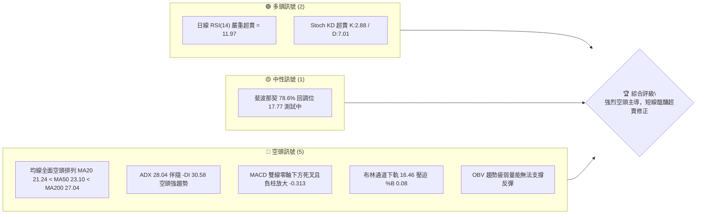
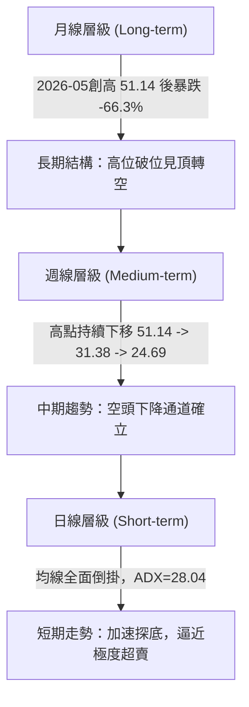
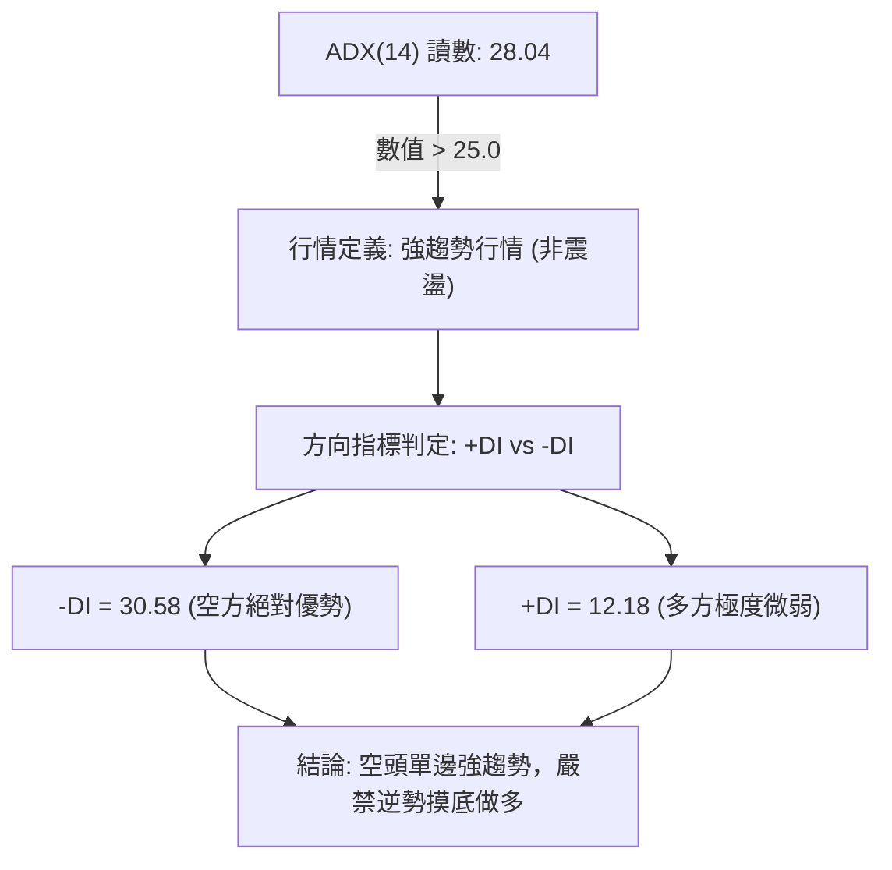
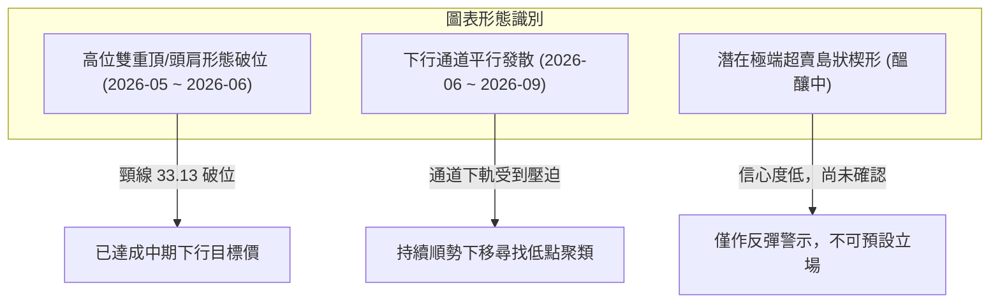
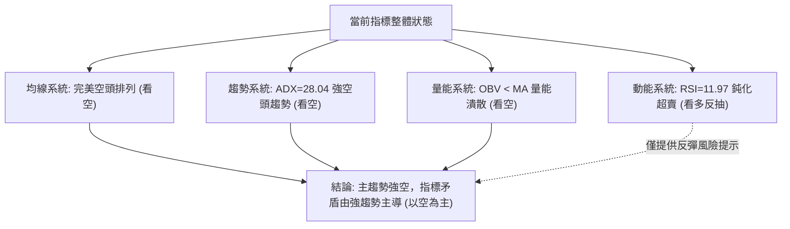
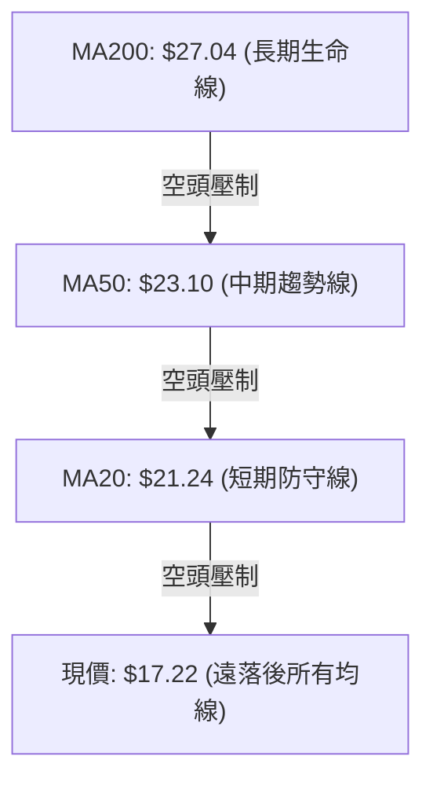
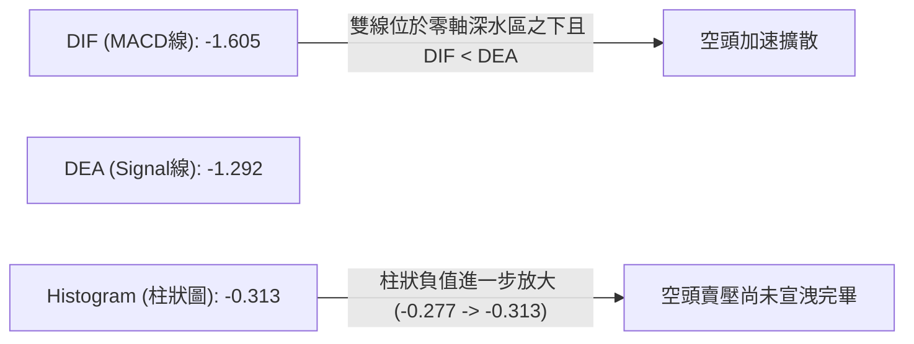
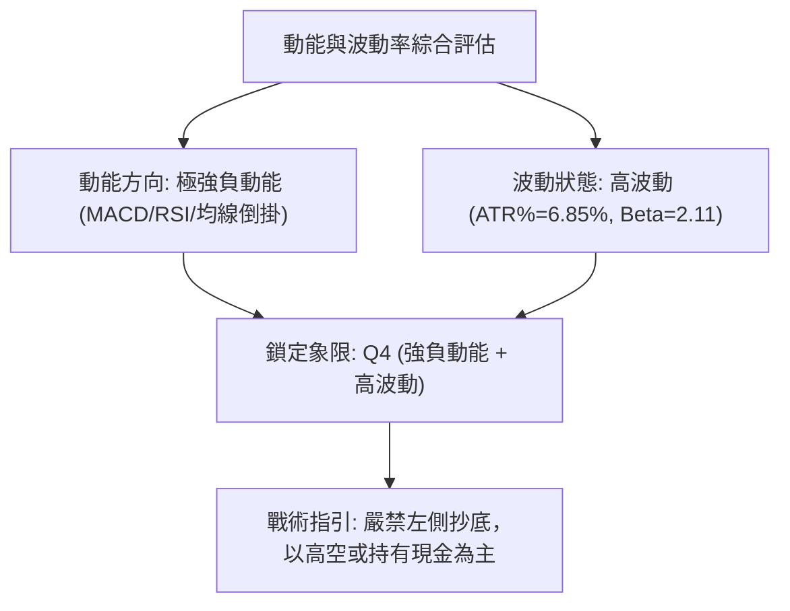
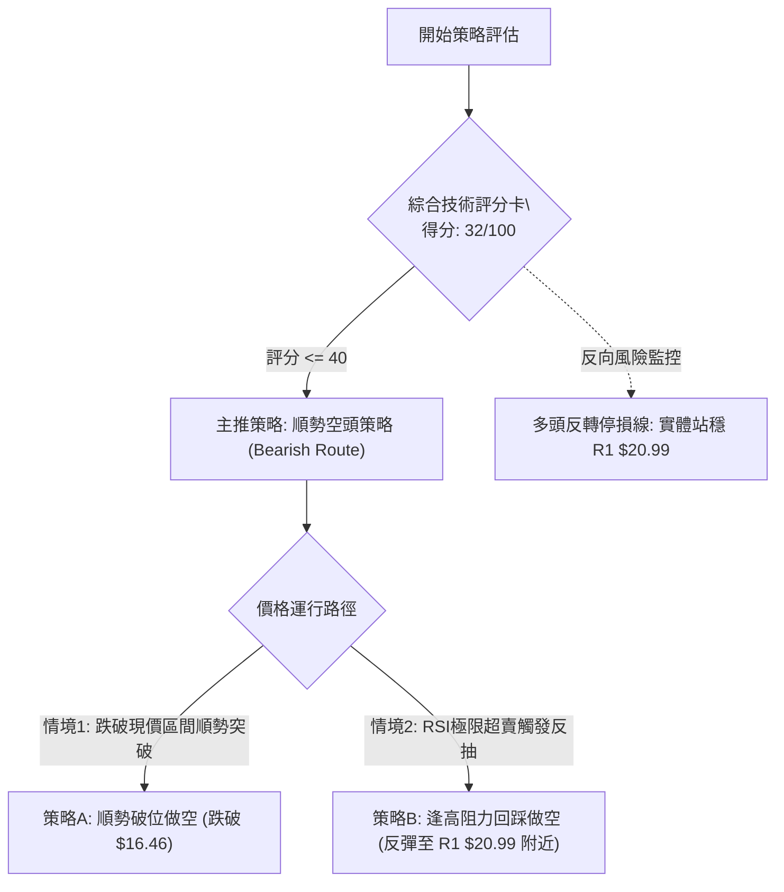
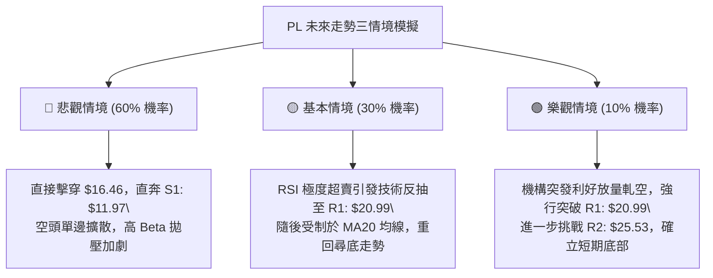

# PL 技術分析報告

> **報告日期**：2026-09-09 ｜ **語言**：繁體中文 ｜ **數據來源**：Yahoo Finance ｜ **當前價格**：$17.22

---

## 目錄

| 章節 | 內容 |
|------|------|
| [1. 技術面概覽](#1-技術面概覽) | 訊號儀表板、核心指標、評分卡 |
| [2. 趨勢分析](#2-趨勢分析) | 多時框趨勢、長中短期走勢 |
| [3. 圖表形態分析](#3-圖表形態分析) | 形態識別、K線組合、目標價 |
| [4. 支撐與阻力](#4-支撐與阻力) | 關鍵價位、斐波那契回調 |
| [5. 技術指標深度解讀](#5-技術指標深度解讀) | MA/RSI/MACD/布林/成交量 |
| [6. 動能與波動率](#6-動能與波動率) | 動能評估、ATR、Beta |
| [7. 多時框架總結](#7-多時框架總結) | 時框架評分矩陣 |
| [8. 交易策略建議](#8-交易策略建議) | 多空策略、風險報酬比 |
| [9. 風險提示與監控](#9-風險提示與監控) | 監控指標、風險場景 |

---

## 1. 技術面概覽

### 🎯 技術訊號儀表板



### 📊 核心指標速覽表

| 指標類別 | 指標名稱 | 當前數值 | 訊號 | 解讀 |
|----------|----------|----------|------|------|
| **價格** | 當前價格 | $17.22 | 🔴 | 跌破所有短中期均線，處於52週區間下緣 20.1% 位置 |
| **均線** | MA20 | $21.24 | 🔴 | 價格低於 MA20 達 -18.92%，短線下行斜率陡峭 |
| **均線** | MA50 | $23.10 | 🔴 | 價格低於 MA50，中期空頭防守線持續下移 |
| **均線** | MA200 | $27.04 | 🔴 | 價格遠落後長期生命線 -36.32%，長線結構受損 |
| **動能** | RSI(14) | 11.97 | 🟢 | 極度超賣區間（<20），空頭動能耗竭，隨時可能技術反抽 |
| **動能** | MACD | -1.605 | 🔴 | 位於 Signal (-1.292) 下方，柱狀圖 -0.313 擴大看空 |
| **波動** | ATR(14) | $1.18 | 🔴 | ATR佔股價 6.85%，屬於高波動單邊下挫環境 |

### 🏆 技術評分卡

```
╔══════════════════════════════════════════════════════════════════╗
║                   技術評分卡 — PL (2026-09-09)                   ║
╠══════════════════════════════════════════════════════════════════╣
║ 趨勢強度 (Trend)      ██████████████░░░░░░  70/100  🔴 (空頭強趨勢)║
║ 動能指標 (Momentum)   ████░░░░░░░░░░░░░░░░  20/100  🔴 (負動能壓制)║
║ 支撐穩定度 (Support)  ██████░░░░░░░░░░░░░░  30/100  🔴 (下探無支撐)║
║ 成交量配合 (Volume)   ████████░░░░░░░░░░░░  40/100  🟡 (殺跌量放大)║
║ 形態完整度 (Pattern)  ████████████░░░░░░░░  60/100  🔴 (下行通道)  ║
║ 均線排列 (MA System)  ██░░░░░░░░░░░░░░░░░░  10/100  🔴 (完全空頭)  ║
╠══════════════════════════════════════════════════════════════════╣
║ 綜合評分              ██████░░░░░░░░░░░░░░  32/100  🔴 強烈偏空   ║
╚══════════════════════════════════════════════════════════════════╝
```

---

## 2. 趨勢分析

### 🌐 多時框趨勢分析



### 📈 長期趨勢 — 12個月走勢圖（Unicode）

```
PL 月線走勢圖（過去12個月：2025-10 至 2026-09）
價格軸 ($)
$52.00 ┤                             ● (2026-05: 51.14 歷史高點)
$46.00 ┤                            ╱ ╲
$40.00 ┤                           ╱   ╲
$34.00 ┤                          ●     ● (2026-06: 33.13)
$28.00 ┤                    ●    ╱       ╲
$22.00 ┤              ●    ╱ ╲  ╱         ● (2026-07: 20.48)
$16.00 ┤        ●    ╱ ╲  ╱   ●            ╲   ●(2026-09: 17.22 現價)
$10.00 ┤  ●───●     ╱   ●                   ● (2026-08: 19.85)
       └─────────────────────────────────────────────────────────────
         10  11  12  01  02  03  04  05  06  07  08  09 (月份)
        [  2025 年主升段  ] [       2026 年主升見頂轉殺跌段       ]
```

#### 走勢特徵分析表格

| 階段區間 | 起止價格 | 漲跌幅 | 核心量價特徵 | 趨勢性質 |
|----------|----------|--------|--------------|----------|
| **主升爆發段** (2025.10–2026.05) | $13.45 → $51.14 | +280.22% | 伴隨量能逐月推升，突破所有均線密集區，突破行情 | 強多頭 |
| **頭部雪崩段** (2026.05–2026.06) | $51.14 → $33.13 | -35.22% | 週成交量突破1億股巨量出貨，形成斷頭鍘刀K線 | 趨勢反轉 |
| **空頭下沉段** (2026.06–2026.09) | $33.13 → $17.22 | -48.02% | 高點反彈不過前高（24.69受阻），連續陰跌破位 | 單邊強空頭 |

### 📊 中期趨勢（週線分析）

中期走勢呈現清晰的「下跌階梯」結構。自 2026-05 頂部以來，反彈高點依序為：
- 頂部第一階：$51.14 (2026-05-31)
- 反抽次高點：$31.38 (2026-07-05)
- 破位反抽點：$24.69 (2026-08-16)

近期週線自 $24.69 下滑至本週 $17.22，週 MACD 柱狀圖在短暫翻紅後重新轉負（-0.118 → -0.277 → -0.313），週量能於 2026-09-06 暴增至 85,360,000 股帶量長黑，說明機構籌碼鬆動，中期下行趨勢無鈍化跡象。

```
中期週線阻力與下行結構示意：
$27.57 ────────────────────────────────────────── [R3 強壓力區間]
           ╲
$24.69 (08-16波段頂) ─── $25.53 ─────────────── [R2 中期防守位]
                         ╲
$20.99 ───────────────────╲─────────────────── [R1 短期反彈極限]
                           ╲
$17.22 (現價) ───────────────●──────────────── [現行價格]
                             │
$11.97 ──────────────────────┴──────────────── [S1 中期回撤第一目標]
```

### ⚡ 趨勢強度評估（ADX 解讀）



#### ADX 趨勢強度對照表

| 指標名稱 | 當前讀數 | 臨界門檻 | 狀態評估 | 操作意義 |
|----------|----------|----------|----------|----------|
| **ADX(14)** | **28.04** | 25.00 | 強趨勢建立 | 趨勢跟隨策略有效，擺動指標失真 |
| **-DI** | **30.58** | 20.00 | 空頭主導 | 賣方力量強盛且持續主控盤面 |
| **+DI** | **12.18** | 20.00 | 多頭潰散 | 買盤缺乏承接意願，多頭無組織性反抗 |
| **DI差值值** | **-18.40** | 0.00 | 極度發散 | 下跌動能尚未衰竭，尋底行情延續中 |

---

## 3. 圖表形態分析

### 🔍 形態識別系統



#### 形態識別信心度與目標價評估表

| 形態識別 | 信心度 | 判斷依據（引用數據） | 完成度 | 目標價（附精確計算式） |
|----------|--------|----------------------|--------|------------------------|
| **下行通道** | **85%** | 高點下移（$51.14 → $31.38 → $24.69）；低點下移（$33.13 → $20.47 → $17.22） | 90% | 跌破通道中軸，下探數據支撐 **S1: $11.97** |
| **頭肩頂破位** | **90%** | 頭部 $51.14，左肩 $44.35，右肩 $39.04，頸線破位點 $33.13 (2026-06收盤) | 100% (已兌現) | 頸線 $33.13 - (頭部 $51.14 - 頸線 $33.13) = **$15.12**（目前已逼近此目標區） |
| **雙底形態** | **15%** | 數據中未偵測到底部結構，當前無雙重底形態特徵 | 0% | 訊號不足，僅做指標型解讀，嚴禁預判雙底 |

### 🕯️ 重要K線形態分析

| 月份 | 收盤價 | K線形態 | 解讀 | 訊號 |
|------|--------|---------|------|------|
| **2026-05** | $51.14 | 長上影流星線 (52W高點 $51.76) | 多頭極致消耗，買盤於 $50 以上力竭，主力巨量出貨 | 🔴 強烈見頂 |
| **2026-06** | $33.13 | 大陰吞沒斷頭鍘刀 | 一舉跌破 MA20，週量放大至 1 億股，宣告牛市終結 | 🔴 空頭崩塌 |
| **2026-07** | $20.48 | 空頭續跌長黑實體 | 跌破所有短期均線支撐，破位下殺加速 | 🔴 空頭延續 |
| **2026-08** | $19.85 | 弱勢紡錘收斂線 | 盤中反抽無力受阻於 MA20 ($21.24)，反彈遭逢解套賣壓 | 🟡 弱勢抵抗 |
| **2026-09** | $17.22 | 破位空頭中長黑 | 跌破前低 $19.85，再創波段新低，空頭下壓未見止跌K線 | 🔴 探底進行 |

### 📉 ASCII 走勢形態示意圖

```
PL 日/週線級別 下行通道示意圖：
價格
$32.00 ┤            上軌壓制線 (Upper Bound)
$28.00 ┤             ╲
$24.00 ┤              ● (2026-08 高點 $24.69)
$20.00 ┤               ╲        ╲
$16.00 ┤                ╲        ● $17.22 (當前價格，逼近通道下軌)
$12.00 ┤                 ╲        ╲
       └──────────────────●─────────●──────────────
                         下軌支撐線 (Lower Bound 往 S1 $11.97 延伸)
```

### 🎯 形態目標價計算

根據 2026-06 確認破位之大級別頭肩頂/區間頂部：
- **頂部最高點 (Head)**：$51.76 (52W High)
- **頸線支撐位 (Neckline)**：$33.13 (2026-06 破位月收盤價)
- **形態垂直高度 (Height)**：$51.76 - $33.13 = $18.63
- **理論等幅最小測幅目標價**：$33.13 - $18.63 = **$14.50**
- **數據比對**：此測幅目標價落在數據庫計算之近期低點聚類支撐 **S1: $11.97** 與當前價位之間，說明跌勢在 $17.22 尚未完全釋放所有空頭測幅目標。

---

## 4. 支撐與阻力

### 🗺️ 關鍵價位分布圖（Unicode）

```
PL 價位結構分布圖
═════════════════════════════════════════════════════════════════════
$27.57 ║██████████████████████████████║ 強阻力 R3 (近一年波段高點聚類)
$27.04 ╟──────────────────────────────╢ 長期均線 MA200 反壓
$25.53 ║████████████████████          ║ 阻力 R2 (反彈高點聚類)
$25.03 ╟──────────────────────────────╢ 斐波那契 61.8% 重要壓力位
$21.24 ╟──────────────────────────────╢ 布林中軌 / MA20 均線壓力
$20.99 ║████████████████████████      ║ 關鍵阻力 R1 (前波破位防守點)
$17.77 ╟──────────────────────────────╢ 斐波那契 78.6% 回調位 (已失守)
$17.22 ╠══════════════════════════════╣ ◄ 現價 ($17.22)
$16.46 ╟──────────────────────────────╢ 布林通道下軌
$11.97 ║▓▓▓▓▓▓▓▓▓▓▓▓▓▓▓▓              ║ 近期支撐 S1 (波段低點聚類)
$10.52 ║████████████████████████      ║ 強支撐 S2 (深層波段低點)
$08.51 ╟──────────────────────────────╢ 52週最低價 (52W Low / 斐波 100%)
═════════════════════════════════════════════════════════════════════
```

### 🚧 阻力位分析表

所有阻力數值嚴格引用自「關鍵價位」區塊：

| 阻力級別 | 精確價位 | 距離現價 | 形成原因 | 突破難度 | 重要性 |
|----------|----------|----------|----------|----------|--------|
| **R1** | **$20.99** | +21.89% | 近一年波段高點聚類，與布林中軌 MA20 ($21.24) 重疊共振 | 極高 | 🔴 短線空頭生命線 |
| **R2** | **$25.53** | +48.26% | 2026年8月中旬反彈高點聚類，與斐波那契 61.8% ($25.03) 形成強阻力帶 | 極高 | 🔴 中期多空分水嶺 |
| **R3** | **$27.57** | +60.10% | 近一年波段密集高點聚類，重疊長期均線 MA200 ($27.04) | 極致困難 | 🔴 長期趨勢轉折位 |

### 🛡️ 支撐位分析表

所有支撐數值嚴格引用自「關鍵價位」區塊：

| 支撐級別 | 精確價位 | 距離現價 | 形成原因 | 守住機率 | 重要性 |
|----------|----------|----------|----------|----------|--------|
| **S1** | **$11.97** | -30.49% | 近一年波段低點聚類，歷史換手平台底部 | 60% | 🟢 下行第一承接帶 |
| **S2** | **$10.52** | -38.91% | 近一年深層波段低點聚類，整數關卡防線 | 75% | 🟢 次級強防守核心 |
| **52W Low**| **$8.51** | -50.58% | 52週週期歷史最低價，斐波那契 100% 終極支撐 | 90% | 🟢 終極估值底線 |

*註：除 S1、S2 及 52W Low 外，數據中未偵測到其他有效波段支撐點位。*

### 📐 斐波那契回調位分析

依據基準 52週區間：高點 **$51.76** → 低點 **$8.51** 進行回調位精確比對：

```
斐波那契回調層級分布：
 0.0% (52W High) : $51.76 ── 歷史峰值
23.6%            : $41.55 ── 第一回調破位點
38.2%            : $35.24 ── 頭部頸線區
50.0%            : $30.13 ── 多空均衡軸心
61.8%            : $25.03 ── 黃金分割關鍵反壓位 (接近 R2: $25.53)
78.6%            : $17.77 ── 極限回調支撐位 (當前剛剛跌破)
================ [現價 $17.22 位於 78.6% 與 100.0% 之間] ================
100.0% (52W Low) : $8.51  ── 週期起漲終極低點
```

#### 現價位置深度解讀：
當前價格 **$17.22** 已實質性跌破 78.6% 斐波那契關鍵回調位 **$17.77**。在技術分析幾何學中，跌破 78.6% 意味著整輪從 $8.51 至 $51.76 的多頭推進運動被全數摧毀，行情已經不是常規的「多頭回調」，而是轉化為「尋找歷史底部」的完整熊市週期。下一有效幾何支撐位直指關鍵價位 **S1: $11.97** 與 100.0% 回調位 **$8.51**。

---

## 5. 技術指標深度解讀

### 🎛️ 指標訊號總覽



### 📈 移動平均線排列分析



#### 均線數據深度矩陣

| 均線名稱 | 當前價格 | 乖離距離 | 乖離百分比 | 均線歷史軌跡與斜率 | 訊號狀態 |
|----------|----------|----------|------------|--------------------|----------|
| **MA5** | $18.30 | -$1.08 | -5.89% | 短期直線向下俯衝，斜率極為陡峭 | 🔴 極度看空 |
| **MA10** | $19.29 | -$2.07 | -10.73% | 穩健下行，形成日線級別第一下壓軌道 | 🔴 極度看空 |
| **MA20** | $21.24 | -$4.02 | -18.92% | 自 $24 區間加速下扣，中期壓力巨大 | 🔴 極度看空 |
| **MA60** | $23.98 | -$6.76 | -28.18% | 呈現典型的長期空頭弧形頂發散 | 🔴 極度看空 |
| **MA120** | $30.79 | -$13.57 | -44.07% | 半年線持續向下，套牢籌碼極度沉重 | 🔴 極度看空 |
| **MA240** | $24.75 | -$7.53 | -30.43% | 年線向下拐頭，跌破年線代表長期走熊 | 🔴 極度看空 |

**解讀**：均線系統呈現「空頭排列」（MA20 < MA50 < MA200 且 MA5 < MA10 < MA20 < MA60 < MA120）。現價與 MA20 負乖離高達 -18.92%，屬於技術性嚴重超賣，但歷史數據表明，在 ADX > 25 的強空頭趨勢中，負乖離通常以「橫盤陰跌」或「微幅反抽後再破位」來修復，而非 V 型反轉。

### 📉 RSI(14) 分析

- **當前讀數**：`11.97`
- **狀態展示**：
  ```
  RSI(14) 讀數強度: [██░░░░░░░░░░░░░░░░░░] 11.97 (極限嚴重超賣區 <20)
  ```
- **超買超賣分析**：RSI 跌至 11.97 屬於過去兩年歷史罕見的超賣極值（週線 RSI 亦跌至 12.0）。隨時存在空頭回補誘發的技術性反抽。
- **背離判斷**：
  - **日線 RSI**：價格創下 $17.22 波段新低，RSI 讀數 11.97 亦同步創下波段新低，**無底背離**。
  - **週線 RSI**：自 2026-07-26 的 RSI 10.2（收盤 $20.47）到當前收盤 $17.22（RSI 12.0），雖有微弱點位差異，但週 MACD 柱同步走弱，且日線完全順勢下跌，**確認無實質性底背離存在**。
  - **結論**：指標指示動能強烈向下，超賣只代表下行速度過快，不代表趨勢反轉。

### 📊 MACD(12/26/9) 訊號解讀



- **MACD 線**：-1.605
- **訊號線 (Signal)**：-1.292
- **MACD 柱狀圖 (Hist)**：-0.313 (看空 🔴)
- **解讀**：雙線深處於零軸下方（零軸下死叉），且柱狀圖由前週的 -0.277 進一步走闊至 -0.313，證明下行動能並無衰減現象，市場仍在空方掌控之中。

### 📦 布林通道分析

```
PL 布林通道結構示意圖 (日線級別)
$26.01 ┤────────────────────────────── 上軌 (Upper Band)
       │
$21.24 ┤────────────────────────────── 中軌 MA20 (Middle Band)
       │
$17.22 ┤        ● 現價 ($17.22)
$16.46 ┤────────────────────────────── 下軌 (Lower Band)
       └──────────────────────────────
```

- **BB 上軌**：$26.01
- **BB 中軌 (MA20)**：$21.24
- **BB 下軌**：$16.46
- **BB %B**：`0.08`（處於極端超賣區域）
- **帶寬與狀態**：布林帶寬開口向下擴張，現價極度貼近下軌（%B = 0.08），走勢呈現典型的「沿下軌滑行（Riding the Band）」形態，此乃單邊下行趨勢中最為致命的空頭特徵。

### 💹 成交量分析（量價配合度）

- **最新成交量**：13,224,407 股
- **20日均量**：9,298,555 股
- **量比 (Volume Ratio)**：`1.42x`（顯著放量下挫）
- **OBV (能量潮指標)**：`OBV < MA`，能量潮曲線處於均線下方且斜率向下。
- **量價形態解讀**：
  - 在股價持續下跌的過程中，最新單日成交量放大至 20日均量的 1.42倍，伴隨 2026-09-06 週量能高達 85,360,000 股，反映出市場出現「恐慌性拋盤（Capitulation Selling）」，但下方並未出現帶長下影線的吸收盤。
  - OBV 指標疲弱走低，表明機構資金以淨流出為主，量價呈現「放量下跌、空頭確認」格局。

---

## 6. 動能與波動率

### ⚡ 動能評估四象限

| 象限 | 動能維度 | 波動率維度 | PL 當前落點 | 狀態診斷與操作策略 |
|------|----------|------------|-------------|--------------------|
| **Q1 (最佳擴張)** | 強正動能 | 低波動 | — | 趨勢穩健上行，多頭持股 |
| **Q2 (震盪整固)** | 弱動能 | 低波動 | — | 區間無趨勢，觀望或網格交易 |
| **Q3 (風險飆升)** | 強正動能 | 高波動 | — | 投機狂熱，警惕見頂風險 |
| **Q4 (空頭宣洩)** | **強負動能** | **高波動** | **✓ PL 當前位置** | **空頭單邊主導，波動劇烈，逆勢做多極其危險** |



### 📊 ATR 波動率分析

- **ATR(14) 數值**：`$1.18`
- **ATR 佔比 (ATR / Price)**：`6.85%`（屬於極高波動資產）
- **止損與風控距離建議**：
  - **日內交易緩衝**：1.0 × ATR = **$1.18**
  - **波段保護止損**：1.5 × ATR = **$1.77**
  - **寬鬆趨勢防守**：2.0 × ATR = **$2.36**
  - **操作含義**：每日平均波動區間接近 $1.20，任何操作必須給予至少 $1.50 以上的空間以規避噪音清洗，嚴禁高槓桿重倉操作。

### 📐 Beta 與市場相關性

- **Beta 係數**：`2.108`
- **市場屬性解讀**：
  - PL 的波動性是大盤（S&P 500）的 2.11 倍，屬於超高彈性的小盤航太成長股。
  - 當前市場整體處於避險氛圍時，高 Beta 股往往遭遇無差別流動性折價與拋售。其強烈的高貝塔屬性放大了空頭趨勢中的下跌幅度。

---

## 7. 多時框架總結

### 📋 時框架評分表

| 時框架 | 趨勢方向 | 動能強度 | 均線排列 | 圖表形態 | 綜合評分 | 戰術建議 |
|--------|----------|----------|----------|----------|----------|----------|
| **月線 (Long)** | 🔴 空頭破位 | 🔴 弱（歷史頂部回落） | 🟡 中性走壞（跌破MA240） | 頭肩頂破位 | 25/100 | 長期投資減倉避險 |
| **週線 (Medium)**| 🔴 下降通道 | 🔴 弱（MACD負柱加劇） | 🔴 空頭倒掛 | 階梯式下跌 | 20/100 | 反彈皆為中線賣點 |
| **日線 (Short)** | 🔴 加速下探 | 🟢 極度超賣醞釀反抽 | 🔴 完美空頭排列 | 沿布林下軌滑落 | 35/100 | 順勢逢高沽空 |

### 🔲 綜合訊號矩陣

```
時框與指標共振分析矩陣：
┌───────────┬──────────┬──────────┬──────────┬──────────┬──────────┐
│  時框架   │ 均線系統 │ RSI 指標 │ MACD動能 │ ADX 趨勢 │ 量能配合 │
├───────────┼──────────┼──────────┼──────────┼──────────┼──────────┤
│ 月線層級  │  🔴 看空 │  🔴 看空 │  🔴 看空 │  🔴 看空 │  🔴 放量 │
│ 週線層級  │  🔴 看空 │  🔴 看空 │  🔴 看空 │  🔴 看空 │  🔴 增量 │
│ 日線層級  │  🔴 看空 │  🟢 超賣 │  🔴 看空 │  🔴 強趨 │  🔴 放量 │
└───────────┴──────────┴──────────┴──────────┴──────────┴──────────┘
訊號收斂一致性：86.7% 偏空共振，僅日線 RSI 出現極端數值背離提示。
```

### ⚖️ 多時框收斂結論

依據技術分析多時框收斂規則第 14 條：
1. **行情定性**：當前日線 ADX(14) 讀數為 **28.04 > 25**，市場被嚴格判定為**單邊強趨勢行情**（非震盪盤整行情）。
2. **時框優先級**：在強趨勢中，**以中長期（週線、MA50 $23.10、MA200 $27.04）之方向為主導**，日線指標（RSI=11.97、Stoch=2.88 超賣）僅能視為超跌反抽之微結構訊號，絕對不可作為逆勢做多翻轉的依據。
3. **方向性最終結論**：**唯一方向性結論為【強烈偏空】**。日線的極限超賣不可抵消中長期的單邊下行趨勢，任何因超賣產生的技術性反抽，均視為空頭防守點位（R1: $20.99）前的逢高建空契機。

---

## 8. 交易策略建議

### 🗺️ 策略決策流程圖



### 🧭 策略路由

**當前主策略方向 = 【主推空頭策略】（依據綜合評分 32/100，處於 ≤40 之強烈偏空區間）**

### 🎯 價格情境階梯（Price Scenarios）

價位嚴格引用關鍵價位與數據庫實際計算值：

| 觸發條件 | 下一目標 | 後續延伸 | 情境含義 |
|----------|----------|----------|----------|
| 向上實體突破 **R1 $20.99** | **R2 $25.53** | **R3 $27.57** | 短線空頭衰竭，啟動中期修復反彈 |
| 弱勢維持於 **$16.46 ～ $17.77** 區間 | — | — | 弱勢築底失敗，以陰跌修復指標 |
| 向下跌破布林下軌 **$16.46** | **S1 $11.97** | **S2 $10.52** | 空頭加速宣洩，進入深水區主跌浪 |

### 📊 情境機率分佈

| 情境劇本 | 機率 | 主要依據 |
|----------|------|----------|
| **下行加速再探底** | **60%** | ADX 28.04 趨勢強勁，-DI 30.58 壓制，均線完全空頭排列，跌破斐波 78.6% |
| **超跌弱勢反抽** | **30%** | RSI 11.97 極度超賣，Stoch KD 鈍化，短線空頭有部分回補獲利需求 |
| **強勢 V 型反轉** | **10%** | 缺乏任何底部結構支撐，量能無吸籌跡象，上方均線重重壓制 |

### 🔴 主策略詳情（空頭主導）

所有價位點位嚴格引用自「關鍵價位」區塊之數據數值：

| 策略要素 | 策略 A：順勢跌破跟空 (Breakdown Short) | 策略 B：超賣反抽逢高做空 (Fade the Rally) |
|----------|----------------------------------------|------------------------------------------|
| **策略邏輯** | 跌破布林通道下軌，加速下探 S1 | 借助 RSI 超賣反彈至 R1 關鍵壓力處布空 |
| **進場條件** | 跌破布林下軌 $16.46 且 15分K確認收低 | 價格反抽至阻力位 R1 $20.99 遇阻收上影線 |
| **進場價格** | **$16.46** | **$20.99** |
| **止損價格** | **$17.77** (斐波那契 78.6% 回調位上方) | **$22.76** (R1 $20.99 + 1.5×ATR $1.77) |
| **止損空間** | $1.31 (7.96%) | $1.77 (8.43%) |
| **目標價 T1** | **$11.97** (關鍵價位支撐 S1) | **$17.22** (當前波段破位低點) |
| **目標價 T2** | **$10.52** (關鍵價位支撐 S2) | **$11.97** (關鍵價位支撐 S1) |
| **風險報酬比**| **3.43 : 1** (以 T1 計算)               | **2.13 : 1** (以 T1 計算) / **5.10 : 1** (T2) |
| **成功機率** | **65%**                                | **60%**                                  |
| **建議倉位** | **10% ~ 15%** (高 Beta 資產輕倉)        | **15% ~ 20%**                            |

### 🟢 反向風險觸發點（對沖提示）

若出現以下事件，主推之空頭策略將被全面推翻，需立即執行空頭停損對沖：
1. **價位突破信號**：日線收盤價強勢突破關鍵阻力 **R1: $20.99**，且連續 2 個交易日站穩於 MA20 ($21.24) 之上。
2. **指標共振信號**：MACD 出現零軸下二次金叉，且日線 RSI 回升突破 50 中軸榮枯線。
3. **對沖操作建議**：觸發時空單全數平倉，保守者持有現金觀望，激進者可輕倉嘗試多頭波段博弈，上看阻力位 **R2: $25.53**。

### ⭐ 整體訊號強度評星

```
做多訊號強度：★☆☆☆☆  (1.0/5星 — 僅超賣技術指標，無結構支持)
做空訊號強度：★★★★☆  (4.5/5星 — 趨勢、均線、動能全面共振)
整體可信度：  ★★★★☆  (4.0/5星 — 數據邏輯嚴密，多時框收斂)
```

---

## 9. 風險提示與監控

### ✅ 關鍵監控指標 Checklist

```
╔══════════════════════════════════════════════════════════════════╗
║               PL 每日交易決策關鍵監控清單 (Checklist)              ║
╠══════════════════════════════════════════════════════════════════╣
║ [ ] 監控下軌動態：日線收盤是否跌破布林下軌 $16.46 進入加速階段   ║
║ [ ] 監控阻力測試：盤中反抽是否於 R1 $20.99 遭遇賣壓並回落         ║
║ [ ] RSI 動能修復：RSI(14) 是否脫離 <20 極端區並形成隱性頂背離    ║
║ [ ] 成交量能變化：是否出現日成交量 > 20,000,000 的爆量吸收長下影 ║
║ [ ] 趨勢強度指標：ADX(14) 是否持續維持在 25 以上維持單邊走勢     ║
║ [ ] 止損紀律執行：空單嚴格以 $17.77 或 $22.76 為離場防守標準     ║
╚══════════════════════════════════════════════════════════════════╝
```

### ⚠️ 風險場景分析



### 🛡️ 風險管理重要提醒

1. **極度波動性警示**：PL 當前 Beta 值為 **2.108**，ATR 佔比達 **6.85%**，單日波動極其劇烈。在弱勢下行環境中，絕對倉位必須控制在總資產的 15% 以內，避免高槓桿被異常波動清洗。
2. **超賣鈍化風險**：嚴禁「因為 RSI 跌至 11.97 極低而盲目進場抄底」。歷史走勢表明，在 ADX > 25 的單邊行情中，RSI 可以在 10–25 的超賣區間維持數週之久，期間股價仍可持續再跌 30% 以上（正如月線自 33 跌至 17 期間多次超賣鈍化）。
3. **空頭擠壓 (Short Squeeze) 防範**：當前 PL 空頭回補天數 (Short Ratio) 為 4.01，空頭浮盈較大。若市場出現突發大額採購合約或防務利多，易誘發暴力軋空反彈，因此做空必須嚴格設定保護性止損（如策略設定之 $17.77 / $22.76），堅決杜絕無止損抗單。

---

## 📋 報告總結

```
╔══════════════════════════════════════════════════════════════════╗
║                    PL 技術分析報告總結                           ║
╠══════════════════════════════════════════════════════════════════╣
║ 報告日期：2026-09-09                                             ║
║ 當前價格：$17.22                                                 ║
║ 分析評級：🔴 強烈看空 (綜合評分: 32/100)                         ║
║                                                                  ║
║ 關鍵結論：                                                       ║
║ ├─ 長期趨勢：🔴 空頭主導，52W頂部 $51.76 回撤已深，跌破年線     ║
║ ├─ 中期趨勢：🔴 下降通道完好，反彈高點依序降低，量能呈現拋售    ║
║ ├─ 短期趨勢：🔴 空頭排列，但日線 RSI=11.97 醞釀隨時之技術反抽  ║
║ ├─ 關鍵支撐：S1: $11.97 ｜ S2: $10.52 ｜ 52W Low: $8.51         ║
║ ├─ 關鍵阻力：R1: $20.99 ｜ R2: $25.53 ｜ R3: $27.57             ║
║ └─ 分析師目標：均價 $34.00 (與當前技術盤面嚴重脫節，以走勢為準)  ║
║                                                                  ║
║ 最優策略組合：                                                   ║
║ 1. 🥇 最佳機會：等待反抽 R1 $20.99 受阻布空 (盈虧比 2.13~5.10)   ║
║ 2. 🥈 次選機會：順勢跌破布林下軌 $16.46 追空下看 S1 $11.97      ║
║ 3. 🥉 保守選擇：空倉觀望，嚴禁左側抄底，等待日線結構性底背離確認 ║
╚══════════════════════════════════════════════════════════════════╝
```

---

> ⚠️ **免責聲明**：本報告為 AI 自動生成之技術分析，所有數據及估算均基於提供的歷史價格資訊。本報告**僅供研究與學術參考**，**不構成任何投資建議**。投資有風險，入市需謹慎。

---

*報告生成時間：2026-09-09 ｜ 數據來源：Yahoo Finance ｜ 分析框架：多時框技術分析*