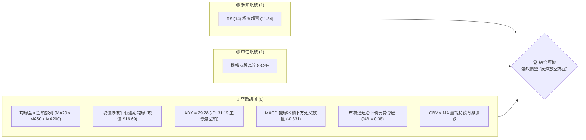
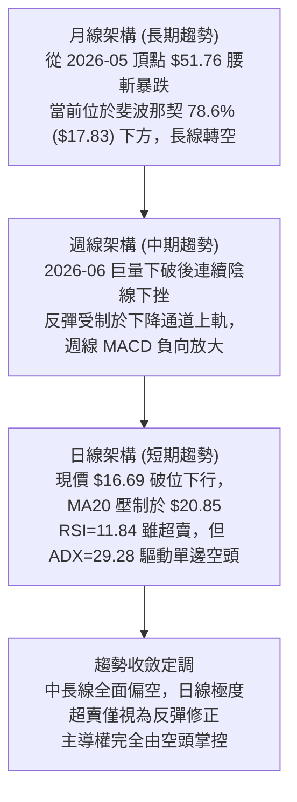
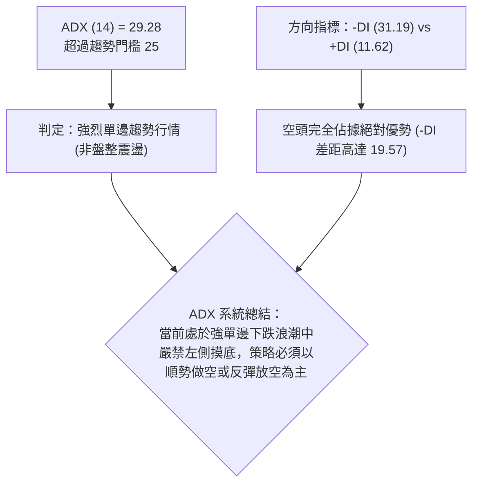
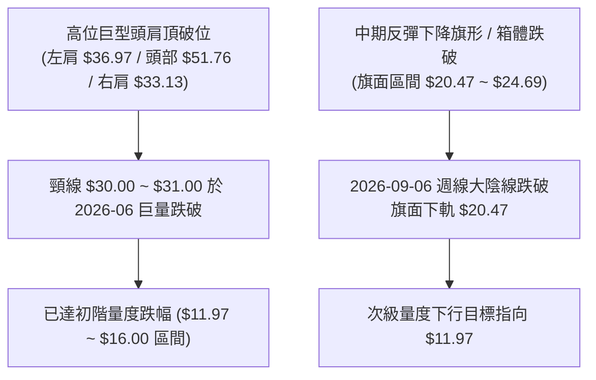
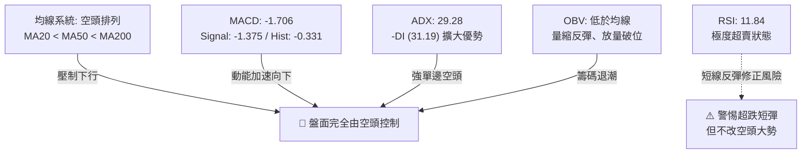
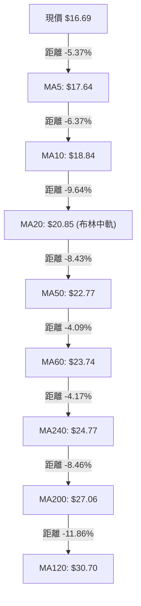
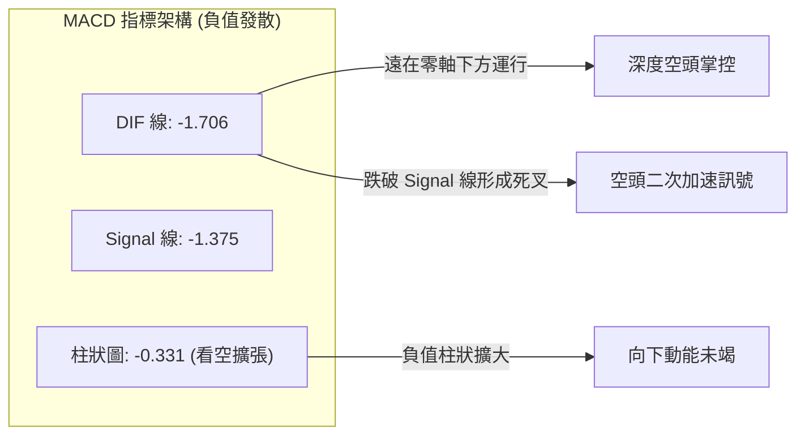
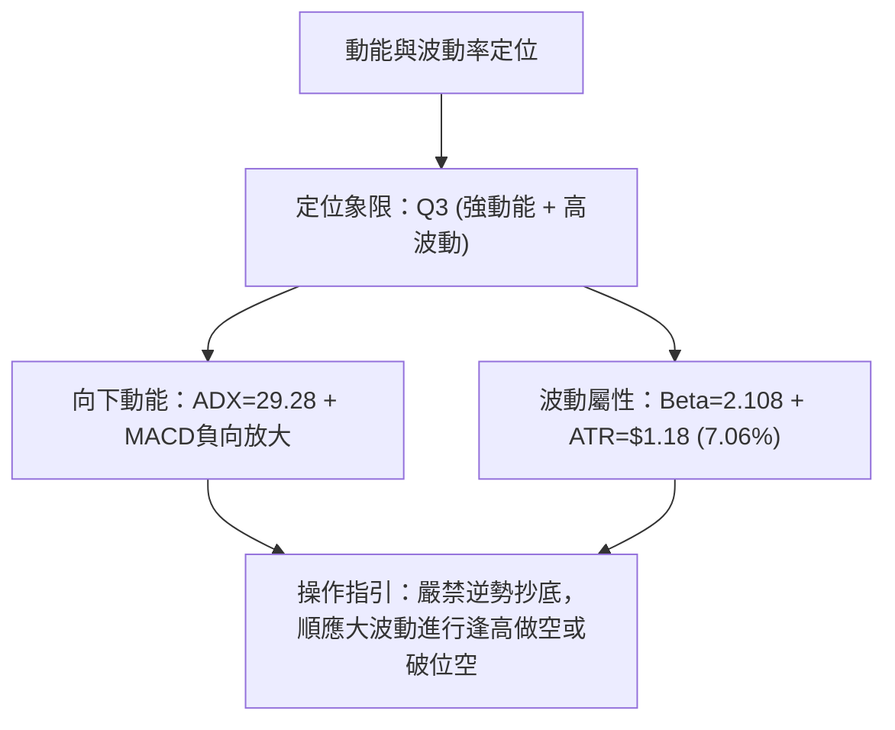
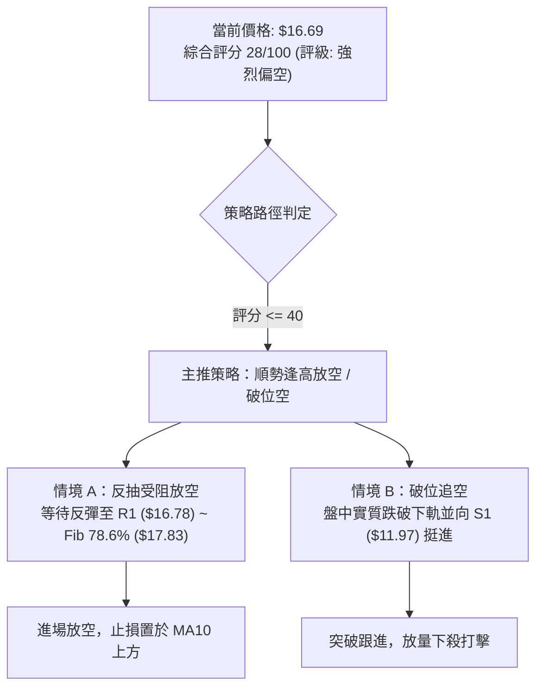
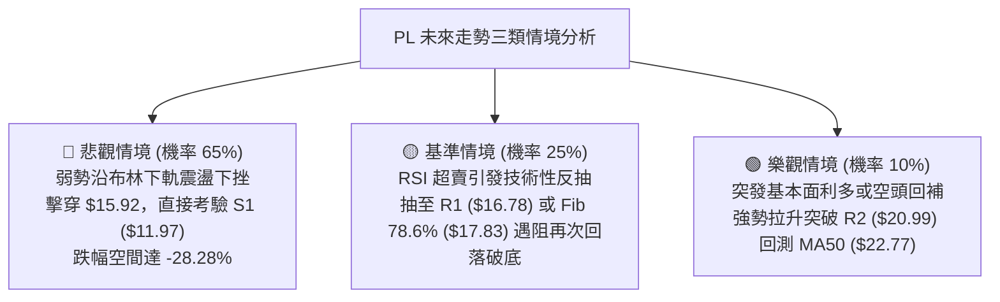

# PL 技術分析報告

> **報告日期**：2026-09-10 ｜ **語言**：繁體中文 ｜ **數據來源**：Yahoo Finance ｜ **當前價格**：$16.69

---

## 目錄

| 章節 | 內容 |
|------|------|
| [1. 技術面概覽](#1-技術面概覽) | 訊號儀表板、核心指標、評分卡 |
| [2. 趨勢分析](#2-趨勢分析) | 多時框趨勢、長中短期走勢、ADX解讀 |
| [3. 圖表形態分析](#3-圖表形態分析) | 形態識別、K線組合、目標價推算 |
| [4. 支撐與阻力](#4-支撐與阻力) | 關鍵價位分布、斐波那契回調結構 |
| [5. 技術指標深度解讀](#5-技術指標深度解讀) | 均線系統/RSI/MACD/布林/量能OBV |
| [6. 動能與波動率](#6-動能與波動率) | 動能象限、ATR波幅、Beta係數分析 |
| [7. 多時框架總結](#7-多時框架總結) | 時框架矩陣與多時框收斂定調 |
| [8. 交易策略建議](#8-交易策略建議) | 策略路由、價格階梯、主策略詳情 |
| [9. 風險提示與監控](#9-風險提示與監控) | 監控清單、風險情境與資金管理 |

---

## 1. 技術面概覽

### 🎯 技術訊號儀表板



### 📊 核心指標速覽表

| 指標類別 | 指標名稱 | 當前數值 | 訊號 | 解讀 |
|----------|----------|----------|------|------|
| **價格** | 當前收盤價 | $16.69 | 🔴 | 位於 52 週高低區間之 18.8%，空頭完全掌控盤面 |
| **均線** | MA20 (短中) | $20.85 | 🔴 | 現價低於 MA20 達 -19.95%，短期嚴重受壓 |
| **均線** | MA50 (中期) | $22.77 | 🔴 | 中期趨勢線加速下行，構成中期波段強阻力 |
| **均線** | MA200 (長期) | $27.06 | 🔴 | 遠在長期生命線之下，長線多頭架構已被瓦解 |
| **動能** | RSI(14) | 11.84 | 🟢 | 進入極端超賣區 (<30)，具短線均值回歸反彈潛能 |
| **動能** | MACD(12,26,9) | -1.706 / -1.375 | 🔴 | 負值區間運行且柱狀圖 -0.331 持續擴散，動能向下 |
| **趨勢強度**| ADX(14) | 29.28 | 🔴 | ADX > 25 確立強趨勢，-DI(31.19) 遠大於 +DI(11.62) |
| **通道狀態**| 布林通道 %B | 0.08 | 🔴 | 緊貼下軌 ($15.92) 運行，屬於典型的單邊下跌軌道 |
| **量能狀態**| 成交量比 / OBV | 1.16x / OBV<MA | 🔴 | 出貨量擴大，能量潮指標跌破均線，主力資金退潮 |
| **波動風險**| ATR(14) | $1.18 | 🟡 | 日波動率高達 7.06%，日內震盪劇烈，止損需放寬 |

### 🏆 技術評分卡

```
╔════════════════════════════════════════════════════════════════╗
║                技術評分卡 — PL (2026-09-10)                   ║
╠════════════════════════════════════════════════════════════════╣
║ 趨勢強度 (ADX=29.28 空頭主導)   ████████████████░░░░  80/100 🔴 ║
║ 動能指標 (RSI超賣但MACD發散)    ██████░░░░░░░░░░░░░░  30/100 🔴 ║
║ 支撐穩定度 (跌破多重支撐位)      ████░░░░░░░░░░░░░░░░  20/100 🔴 ║
║ 成交量配合 (下跌放量/OBV疲弱)    ██████░░░░░░░░░░░░░░  30/100 🔴 ║
║ 形態完整度 (頭肩頂高位下破完成)  ████████████████░░░░  80/100 🔴 ║
║ 均線排列 (空頭排列且距離擴大)    ██░░░░░░░░░░░░░░░░░░  10/100 🔴 ║
╠════════════════════════════════════════════════════════════════╣
║ 綜合技術評分 (偏空主導架構)      ██████░░░░░░░░░░░░░░  28/100 🔴 ║
║ 評級結論：【強烈偏空 🔴】(極度超賣可能誘發短彈，但順勢主線為逢高做空) ║
╚════════════════════════════════════════════════════════════════╝
```

---

## 2. 趨勢分析

### 🌐 多時框趨勢分析



### 📈 長期趨勢 — 12個月走勢圖（Unicode）

```
PL 月線收盤走勢圖（2025-10 至 2026-09）
價格軸 ($)
$52.00 ┤                                  ● $51.14 (2026-05 高點 $51.76)
$48.00 ┤                                 / \
$44.00 ┤                                /   \
$40.00 ┤                               /     \
$36.00 ┤                       ● $36.97       \
$32.00 ┤                                       ● $33.13
$28.00 ┤               ● $27.95                 \
$24.00 ┤       ● $24.97 \                        \
$20.00 ┤  ● $19.72        ● $24.14                 ● $20.48 ──● $19.85
$16.00 ┤                                                       \
$12.00 ┤● $13.45                                                ● $16.69 (現價)
$8.00  ┤ (2025-10)
       └────────────────────────────────────────────────────────────►
        10月   12月   01月   02月   03月   04月   05月   06月   07月   08月   09月
        2025   2025   2026   2026   2026   2026   2026   2026   2026   2026   2026
```

#### 走勢特徵分析表格

| 階段區間 | 價格起迄 | 漲跌幅 | 成交量與特徵 | 結構定性 |
|----------|----------|--------|--------------|----------|
| **主升浪突破** (2025-10 ~ 2026-01) | $13.45 → $24.97 | +85.65% | 量能溫和放大，成功突破前高密集區 | 牛市初中期進攻 |
| **高位籌碼換手** (2026-01 ~ 2026-03) | $24.97 → $27.95 | +11.93% | 震盪幅度加劇，籌碼由集中轉為分散 | 上升楔形末期 |
| **加速噴發趕頂** (2026-03 ~ 2026-05) | $27.95 → $51.14 | +82.97% | 5月爆出歷史天量（單週逾6100萬股），觸及 $51.76 | 投機高潮，天花板確立 |
| **瀑布式崩盤** (2026-05 ~ 2026-07) | $51.14 → $20.48 | -59.95% | 6月第一週爆出逾1億股天量下殺，籌碼多殺多崩潰 | 流動性踩踏與清算 |
| **弱勢抵抗破位** (2026-07 ~ 2026-09) | $20.48 → $16.69 | -18.51% | 8月中旬反彈至 $24.69 遇阻無力，9月破底重挫 | 下跌中繼後的破位走勢 |

### 📊 中期趨勢（週線分析）

從近 20 週數據觀察，PL 在 2026 年 5 月底見頂 $51.14 之後，呈現典型的「量增暴跌、量縮弱彈」空頭結構：
1. **第一次破位下殺**（2026-06-07 至 2026-06-28）：週成交量連續數週接近或超過 1 億股，週線 RSI 直接從 83.2 斷崖式下跌至 17.2。
2. **中期抵抗中繼**（2026-07-05 至 2026-08-16）：週價格在 $20.47 至 $24.69 形成反彈中繼箱體，但成交量持續遞減（萎縮至 2300 萬股水平），為標準的「無量弱反彈」。
3. **二次破位重挫**（2026-08-23 至 2026-09-13）：反彈至 MA20 附近即宣告衰竭，隨後週線連三黑，2026-09-06 當週更放大至 8536 萬股帶量下破 $20 關卡，目前以 $16.69 收於波段新低，宣告箱體下破成立。

### ⚡ 趨勢強度評估（ADX 解讀）



| 指標變數 | 當前讀數 | 標準臨界值 | 狀態定性 | 操作指引 |
|----------|----------|------------|----------|----------|
| **ADX(14)** | **29.28** | 25.00 | 強趨勢展開中 | 順勢操作，忽略逆向超買超賣雜訊 |
| **+DI** | **11.62** | 20.00 | 多方動能衰竭 | 多頭無主動進攻力量 |
| **-DI** | **31.19** | 25.00 | 空方壓制極強 | 賣壓強勁，下行趨勢受到空頭強化 |
| **DI 差值** | **-19.57** | 0.00 | 嚴重空方優勢 | 趨勢維持器作用顯著，短期難以自然反轉 |

---

## 3. 圖表形態分析

### 🔍 形態識別系統



#### 形態識別與信心度評估表

| 形態類別 | 形態方向 | 信心度 | 判斷依據（引用數據） | 完成度 | 目標價（附計算式） |
|----------|----------|--------|----------------------|--------|--------------------|
| **巨型頭肩頂** | 空頭反轉 | **90%** | 頭部 $51.76 (2026-05)，左肩 $36.97 (2026-04)，右肩反彈 $33.13 (2026-06)，巨量下破頸線 $30.18 (斐波那契 50% 處)。 | 100% (已完全破位) | **$8.60**<br/>計算式：頸線 $30.18 - (頭部 $51.76 - 頸線 $30.18) = $8.60 (恰為52W最低點) |
| **下降旗形 (中繼)** | 空頭中繼 | **85%** | 2026-07 至 2026-08 價格於 $20.47 ~ $24.69 震盪整理，9月放量長黑破底跌穿 $20.47。 | 80% (破位加速中) | **$11.97**<br/>計算式：跌破點 $20.47 - 旗面高度 ($24.69 - $20.47 = $4.22) = $16.25；次級旗桿等長計算指向支撐位 S1 $11.97 |
| **雙底形態 (反轉)** | 多頭反轉 | **15%** | 數據中未偵測到任何雙底結構（訊號不足，僅做指標型超跌解讀，不得主觀預設底部）。 | 0% | 條件不成立，無目標價 |

### 🕯️ 重要 K 線形態分析

| 月份 / 日期 | 收盤價 | K 線形態 | 量化與形態特徵 | 技術信號 |
|-------------|--------|----------|----------------|----------|
| **2026-05** | $51.14 | 長上影流星天量線 | 當月振幅極大，觸及 $51.76 後受阻，當週成交量衝至 6148 萬股 | 🔴 長期主力頂部出貨信號 |
| **2026-06-07** | $32.22 | 斷頭鍘刀巨量大陰線 | 單週暴跌 -37.00%，放量 100,622,400 股，一舉砸穿短期均線群 | 🔴 頂部頸線確認失守 |
| **2026-08-16** | $24.69 | 反彈衰竭十字孕線 | 成交量萎縮至 2353 萬股，觸碰阻力位 R3 ($25.53) 下方即告轉弱 | 🔴 無量反彈誘多頂點 |
| **2026-09-06** | $18.12 | 破位放量長黑 K | 單週帶量 8536 萬股灌破 $20.00 整數及旗形下軌支撐 | 🔴 下跌中繼結束，開啟新一輪主跌浪 |
| **2026-09-13** | $16.69 | 光腳中陰線 (進行中) | 創波段新低，收盤於全日及全週低點附近，空頭動能尚未出現止跌 K 線 | 🔴 尋底行情持續發酵 |

### 📉 ASCII 走勢形態示意圖

```
巨型頭肩頂破位與下降旗形中繼圖解
===================================================================
      [頭部 $51.76]
           ▲
          / \
[左肩]   /   \   [右肩]
 $36.97 /     \   $33.13
  ▲    /       \    ▲
 / \  /         \  / \
/   ▼            ▼    \
─────────────────────────── [頸線位 $30.18 (Fib 50.0%)] ── 巨量下破！
                        \
                         \  [旗面反彈上軌 $24.69]
                          \   ▲
                           \ / \   [旗形整理區間]
                            ▼   ▼
                            ───────────────── [旗面下軌 $20.47] ── 帶量砸穿！
                                              \
                                               \  ◄── 現價 $16.69 (空頭加速中)
                                                ▼
                                         [目標支撐位 S1: $11.97]
===================================================================
```

---

## 4. 支撐與阻力

### 🗺️ 關鍵價位分布圖（Unicode）

```
PL 價位結構分布圖
═══════════════════════════════════════════════════════════════════
$25.53 ║████████████████████████████████║ 強阻力 R3 (前反彈高點聚類/Fib 61.8%)
$20.99 ║████████████████████            ║ 阻力 R2 (MA20阻力區/旗面下軌共振)
$17.83 ║▓▓▓▓▓▓▓▓▓▓▓▓▓▓▓▓▓▓▓▓            ║ 斐波那契關鍵阻力 (Fib 78.6%)
$16.78 ║████████████                    ║ 即時阻力 R1 (+0.54%，昨日高點聚類)
$16.69 ╠════════════════════════════════╣ ◄ 現價 ($16.69)
$15.92 ║░░░░░░░░░░░░                    ║ 布林通道下軌動態支撐
$11.97 ║▓▓▓▓▓▓▓▓▓▓▓▓▓▓▓▓▓▓▓▓▓▓▓▓        ║ 近一年關鍵波段支撐 S1 (-28.28%)
$10.52 ║████████████████████████        ║ 歷史次級低點支撐 S2 (-36.97%)
$8.60  ║████████████████████████████████║ 52週絕對低點 / Fib 100.0%
═══════════════════════════════════════════════════════════════════
```

### 🚧 阻力位分析表

所有價位均嚴格引用波段高點聚類數值：

| 阻力級別 | 精確價位 | 距現價幅幅 | 形成原因與技術共振 | 突破難度 | 重要性 |
|----------|----------|------------|--------------------|----------|--------|
| **R1** | **$16.78** | +0.54% | 近期日線反彈聚類高點，緊貼現價上方，為空頭日內短線防守哨兵 | 🟡 中等 | 短期突破點 |
| **R2** | **$20.99** | +25.76% | 近期盤整平台密集換手區下緣，與 MA20 ($20.85) 重合共振 | 🔴 極高 | 中期強弱分水嶺 |
| **R3** | **$25.53** | +52.97% | 2026-08-16 反彈最高點 ($24.69) 與 Fib 61.8% ($25.08) 聚類強壓區 | 🔴 極難 | 多空反轉防線 |

### 🛡️ 支撐位分析表

所有價位均嚴格引用波段低點聚類數值：

| 支撐級別 | 精確價位 | 距現價幅幅 | 形成原因與技術共振 | 守住機率 | 重要性 |
|----------|----------|------------|--------------------|----------|--------|
| **S1** | **$11.97** | -28.28% | 2025 年 9-11 月啟動前的歷史波段平台底部聚類 | 🟡 45% | 中期關鍵支撐 |
| **S2** | **$10.52** | -36.97% | 歷史多頭攻擊發起點的中繼低點聚類，具備次級買盤緩衝 | 🟢 65% | 核心防守底線 |

### 📐 斐波那契回調位分析

依據 52 週完整循環（波段低點 $8.60 → 波段高點 $51.76，落差 $43.16）計算：

| 斐波那契比例 | 基準價位 | 當前相對位置 | 技術意義解讀 |
|--------------|----------|--------------|--------------|
| **0.0% (52W High)** | **$51.76** | +210.13% | 歷史多頭極限高點，本輪超級牛市天花板 |
| **23.6%** | **$41.57** | +149.07% | 初階回撤位，早在 2026-06 巨量下破失守 |
| **38.2%** | **$35.27** | +111.32% | 多頭防禦警戒線，已轉為長線沉重套牢解套位 |
| **50.0%** | **$30.18** | +80.83% | 牛熊中軸線（亦為原頭肩頂頸線），失守宣告趨勢徹底逆轉 |
| **61.8%** | **$25.08** | +50.27% | 黃金分割防守位，8 月中旬反彈至此 ($24.69) 宣告衰竭落幕 |
| **78.6%** | **$17.83** | +6.83% | **深幅回撤臨界位**；目前現價 ($16.69) 已正式跌穿此位 |
| **100.0% (52W Low)**| **$8.60** | -48.47% | 52 週絕對底部，終極支撐目標 |

> **回調結構定位**：
> 現價 **$16.69** 已完全跌破 78.6% 回調位 ($17.83)，目前正式運行於 **78.6% ($17.83) 至 100.0% ($8.60)** 的深水真空跌勢區間。在技術定義上，跌破 78.6% 意味著先前的整段 52 週上升浪型結構已被完全抹煞，行情進入「價值重估與出清」的最後熊市階段。

---

## 5. 技術指標深度解讀

### 🎛️ 指標訊號總覽



### 📈 移動平均線排列分析



#### 各均線數值與乖離狀況

| 均線名稱 | 當前價格 | 與現價差距 | 乖離率 (BIAS) | 排列方向與技術意涵 |
|----------|----------|------------|---------------|--------------------|
| **MA5** | $17.64 | -$0.95 | -5.37% | 極短線空頭壓制線，未站上以前日線弱勢未變 |
| **MA10** | $18.84 | -$2.15 | -11.43% | 短線攻擊線，陡峭向下傾斜 |
| **MA20** | $20.85 | -$4.16 | -19.95% | 短期生命線 / 月線阻力，空頭下壓斜率極大 |
| **MA50** | $22.77 | -$7.05 | -29.71% | 中期季線防線，已形成沉重套牢平台密集壓制 |
| **MA60** | $23.74 | -$7.05 | -29.71% | 中期趨勢線，持續向下扣高 |
| **MA120**| $30.70 | -$14.01 | -45.64% | 半年線，為前期崩盤起跌點頸線密集區 |
| **MA200**| $27.06 | -$10.37 | -38.32% | 年線生命線，MA20/MA50 均在其下方，標準「死叉空頭排列」 |
| **MA240**| $24.77 | -$8.08 | -32.62% | 長期成本線，空方防守堅固 |

### 📉 RSI(14) 分析

當前數值：**11.84** ｜ 區間定位：**極度超賣區（Extreme Oversold）**

```
RSI(14) 狀態指示器
0 ──────── 11.84 ────────── 30 ─────────────────── 70 ───────── 100
[ 極度超賣區 ] ◄── (當前 11.84)   [ 常規震盪區 ]          [ 超買區 ]
進度：███░░░░░░░░░░░░░░░░░░░░░░░░░░░░░░░░░░ 11.84%
```

- **超賣解讀**：RSI 跌至 11.84，為過去 12 個月以來罕見的深度超賣。隨機指標 Stoch %K 同步處於 0.16，%D 為 4.94，顯示極端恐慌拋售盤已將短線動能指標壓制至極限。
- **背離判斷**：
  - **頂背離**：無（當前處於下行趨勢）。
  - **底背離**：**無明顯底背離**。檢視 2026-08-30 至 2026-09-13 之週線，價格自 $19.98 → $18.12 → $16.69 連創新低，週線 RSI 亦從 26.6 → 10.7 → 11.8 於底部低檔徘徊，指標並未出現「價格破底而指標顯著墊高」的背離現象。
- **結論**：指標的極度鈍化屬於**強空頭單邊主跌浪中的「低位鈍化」**。在 ADX > 25 的強趨勢下，盲目根據 RSI 超賣猜底做多勝率極低，需等待價格出現反轉形態確認。

### 📊 MACD(12/26/9) 訊號解讀



- **MACD 線**：-1.706
- **MACD Signal 線**：-1.375
- **MACD 柱狀圖 (Histogram)**：**-0.331** 🔴
- **深度研判**：雙線均深度處於負值區（零軸以下），柱狀圖連續數週收負且負值持續放大（從 -0.118 擴大至 -0.277 再到 -0.331），展現出空頭波段加速度正在增加。這否定了短線立即築底的可能性，印證下行動能仍在主導。

### 📦 布林通道分析

```
PL 布林通道結構圖解（日線級別）
═══════════════════════════════════════════════════════════════════
$25.78 ────────────────────────────────────── BB 上軌 (Upper Band)
          \
           \
$20.85 ─────\──────────────────────────────── BB 中軌 (MA20 Baseline)
             \
              \
$16.69 ────────●───────────────────────────── 現價 ($16.69，緊貼下軌)
$15.92 ────────────────────────────────────── BB 下軌 (Lower Band)
═══════════════════════════════════════════════════════════════════
當前指標：%B = 0.08 ｜ 帶寬帶狀：通道口正向下張開 (Band Expansion)
```

- **通道形態特徵**：%B 僅為 **0.08**，代表價格已緊扣下軌運行（0 代表下軌，0.5 為中軌）。
- **走勢研判**：布林帶未見收窄跡象，反而在破位後隨 ATR 上升而呈現向下開口放大走勢。此形態稱為**「沿下軌行走的瀑布型下挫」**，只要日線收盤未能強勢收復 MA5 ($17.64) 或帶量回抽中軌 ($20.85)，任何觸及下軌的行為均非買點，而是空頭行情的自然宣洩。

### 💹 成交量分析（量價配合度）

1. **最新成交量對比**：最新單日成交量為 **11,106,379 股**，相較 20 日均量 (9,610,324 股) 之量比達到 **1.16x**，高於 50 日均量 (8,333,926 股)，顯示破位過程伴隨拋盤出逃，帶有實質性殺跌動能。
2. **週級別量價特徵**：2026-09-06 當週暴跌破位時爆出 **85,360,000 股**巨量，而先前 8 月中旬反彈時週均量僅 2300-2800 萬股，呈現極端不健康的**「下跌放量、反彈縮量」**。
3. **OBV 能量潮分析**：當前 OBV 線持續低於其移動平均線（OBV < MA），曲線向下發散，確認資金處於淨流出階段。機構持股雖高達 83.3%，但流動籌碼在下殺中未見長線被動型買盤承接，量能結構完全未能確認任何止跌信號。

---

## 6. 動能與波動率

### ⚡ 動能評估四象限

| 象限 | 動能維度 | 波動維度 | 當前狀態 | 策略意義與處置建議 |
|------|----------|----------|----------|--------------------|
| **Q1** | 強下行動能 | 低波動 | — | 陰跌慢刀割肉行情 |
| **Q2** | 弱動能 | 低波動 | — | 縮量盤整觀望期 |
| **Q3** | 強下行動能 | 高波動 | **✓ PL 當前位置** | **空頭釋放爆發期（高風險、高動能）。此階段多頭做多勝率極低，空頭利潤延伸快，需嚴控回撤** |
| **Q4** | 弱動能 | 高波動 | — | 寬幅無序震盪清洗 |



### 📊 ATR 波動率分析

- **ATR(14) 數值**：**$1.18**
- **價格百分比**：高達現價的 **7.06%**
- **風控指引**：
  - 高達 7% 的日均真實波動幅度，意味著 PL 在日內極易出現 $1.00 以上的無序脈衝拉抽。
  - **停損邊界設置**：任何短期交易的止損距離絕不可小於 **1.5 倍 ATR**（約 $1.77），否則極易在正常的盤中波動中被洗出場外。
  - **波段保護止損**：建議採用 **2.0 倍 ATR**（約 $2.36）作為防守緩衝。

### 📐 Beta 與市場相關性

- **Beta 係數**：**2.108**
- **市場敏感性評估**：
  - PL 的 Beta 超過 2.1，屬於典型的**超高彈性、高風險成長/投機股**。當美股大盤（S&P 500 / Nasdaq）出現 1% 的回調時，PL 理論上將放大波動至 2.1% 以上。
  - 在當前技術面深陷空頭、市場風險偏好低迷時，高 Beta 特性會加劇其踩踏下行效應，是空方主力偏好的主動做空標的。

---

## 7. 多時框架總結

### 📋 時框架評分表

| 時框架 | 趨勢方向 | 動能狀態 | 均線排列 | 圖表形態 | 綜合評分 | 戰術建議 |
|--------|----------|----------|----------|----------|----------|----------|
| **月線 (長期)** | 🔴 強烈看空 | 負向加速 | 空頭發散 | 天花板巨型頂部破位 | **15/100** | 長線資金離場，不宜長抱 |
| **週線 (中期)** | 🔴 明確看空 | MACD死叉擴大 | 均線順序下行 | 下降旗形下軌失守 | **20/100** | 中期波段反彈皆為空點 |
| **日線 (短期)** | 🔴 弱勢尋底 | 極度超賣 | 全面受壓均線下 | 緊貼布林下軌單邊下瀉 | **35/100** | 提防技術性超賣反抽，逢高空 |

### 🔲 綜合訊號矩陣

```
時框架訊號矩陣一致性檢視
┌───────────┬─────────────┬─────────────┬─────────────┐
│ 分析維度  │ 日線 (短期) │ 週線 (中期) │ 月線 (長期) │
├───────────┼─────────────┼─────────────┼─────────────┤
│ 均線系統  │  🔴 極弱    │  🔴 偏空    │  🔴 翻空    │
│ 動能指標  │  🟢 超賣    │  🔴 強空    │  🔴 偏空    │
│ 量能結構  │  🔴 背離    │  🔴 出貨    │  🔴 衰退    │
│ 形態定位  │  🔴 尋底    │  🔴 破位    │  🔴 頂部    │
└───────────┴─────────────┴─────────────┴─────────────┘
一致性評估：長、中、短三個級別在【空頭方向】具備高度共振（90%一致性）。
唯一的不協調處在於日線級別的極端超賣 (RSI=11.84)，僅提供「反彈修正」藉口，無法撼動整體下行趨勢。
```

### ⚖️ 多時框收斂結論

依據多時框收斂嚴格規則：
1. **行情性質判定**：當前 ADX(14) 為 **29.28**，明確大於 25 臨界值，確認當前市場處於**「強烈趨勢行情」**而非盤整行情。
2. **主導時框裁決**：在趨勢行情中，必須以中長期（週線、MA50、MA200）方向為絕對主導，日線時框僅能用來尋找次級折返或精確的入場時機。
3. **衝突收斂結果**：日線 RSI=11.84 的超賣訊號，與中長期死叉破位形成局部衝突。依據規則，**中長線趨勢壓制勝出**。超賣不構成抄底理由，反而確認了下殺動能的劇烈程度。

> **唯一方向性結論**：**【強烈偏空】**。盤面將持續由空頭主導，任何日內超跌引發的技術性反抽，均應視為空頭建立波段防守倉位的良機。

---

## 8. 交易策略建議

### 🗺️ 策略決策流程圖



### 🧭 策略路由

> **當前主策略方向 = 【空頭主導策略】（依據綜合評分 28/100，嚴禁逆勢重倉做多）**

### 🎯 價格情境階梯（Price Scenarios）

價位嚴格引用關鍵價位與斐波那契計算數據：

| 觸發條件 | 第一目標價 | 第二目標價 | 情境含義與操作對策 |
|----------|------------|------------|--------------------|
| **反彈受制 R1 $16.78** | 下測 $15.92 (布林下軌) | 尋底 S1 **$11.97** | 弱勢反彈結束，空頭再度發力碾壓（最佳做空觸發點） |
| **強彈突破 R1 衝向 $17.83** | 測試 R2 **$20.99** | 測試 R3 **$25.53** | 超賣技術性強抽，遇 Fib 78.6% ($17.83) 或 R2 阻力回落繼續做空 |
| **直接下破 $15.92** | 抵達 S1 **$11.97** | 考驗 S2 **$10.52** | 沿布林下軌加速下瀉，趨勢進入恐慌主跌段 |

### 📊 情境機率分佈

| 情境預測 | 機率估計 | 主要技術指標依據 |
|----------|----------|------------------|
| **弱反彈後再次破底破位** | **65%** | ADX=29.28 強趨勢、MACD 負向擴散 (-0.331)、均線完美空頭排列壓制 |
| **恐慌加速直接殺向 S1** | **25%** | 跌破旗形中繼下軌、成交量出逃 (量比 1.16x)、OBV 跌破均線持續外流 |
| **強勢 V 型反轉收復 R2** | **10%** | 僅憑 RSI(11.84) 極度超賣，但無多頭量能與底背離支撐，機率極低 |

### 🔴 主策略詳情（空頭主推策略）

所有價位均基於精確計算：

| 策略要素 | 策略 A（反彈阻力位放空 — 穩健首選） | 策略 B（跌破弱勢順勢空 — 激進追隨） |
|----------|-----------------------------------|-----------------------------------|
| **進場條件** | 日內反彈受阻於 R1 或 Fib 78.6% 衰竭 | 日線跌破當前低點區間，帶量下行時進場 |
| **進場價格** | **$17.50** (介於 R1 $16.78 與 Fib $17.83 間) | **$16.30** (確認跌破現價支撐) |
| **止損價格** | **$18.84** (精確設置於 MA10 阻力線上方) | **$17.64** (精確設置於 MA5 阻力線上方) |
| **止損距離** | $1.34 (約 1.14 倍 ATR) | $1.34 (約 1.14 倍 ATR) |
| **目標價 T1** | **$11.97** (關鍵波段支撐位 S1) | **$11.97** (關鍵波段支撐位 S1) |
| **目標價 T2** | **$10.52** (歷史次級低點支撐 S2) | **$8.60** (52 週最低點 / 終極目標) |
| **風險報酬比** | **1 : 4.13** (以 T1 計算：獲利 $5.53 / 風險 $1.34) | **1 : 3.23** (以 T1 計算：獲利 $4.33 / 風險 $1.34) |
| **成功機率** | **68%** | **60%** |
| **建議倉位** | **10% ~ 15%** (高 Beta 標的，嚴格控倉) | **8% ~ 10%** |

### 🟢 反向風險觸發點（對沖與止損提示）

若出現以下訊號，主空頭策略立即失效，空單必須無條件停損離場或進行多頭對沖：
1. **價位警訊**：日線連續 2 日收盤強勢站穩 **R2 ($20.99)** 及 MA20 上方。
2. **動能警訊**：日線 MACD 柱狀圖在零軸下方迅速由負轉正，且 RSI(14) 突破 45 阻力區。
3. **量能警訊**：單日爆出大於 30,000,000 股的巨量長紅 K 線包覆前期陰線。

### ⭐ 整體訊號強度評星

```
做多訊號強度：★☆☆☆☆  (1/5星 — 僅有超賣指標，無任何底部確立信號)
做空訊號強度：★★★★☆  (4.5/5星 — 趨勢、均線、形態、量能全面偏空)
整體分析可信度：★★★★☆  (4.5/5星 — 多時框高共振，ADX 強度確認)
```

---

## 9. 風險提示與監控

### ✅ 關鍵監控指標 Checklist

```
╔══════════════════════════════════════════════════════════════════╗
║               PL 每日交易關鍵風控監控清單 (Checklist)           ║
╠══════════════════════════════════════════════════════════════════╣
║ [ ] 監控項 1：MA5 ($17.64) 與 R1 ($16.78) 短期得失 (站上則超跌反彈展開) ║
║ [ ] 監控項 2：布林通道下軌 ($15.92) 是否形成支撐，抑或通道開口持續放大 ║
║ [ ] 監控項 3：MACD 柱狀圖是否收斂 (低於 -0.331 意味下跌加速度擴大)    ║
║ [ ] 監控項 4：RSI(14) 能否走出極端超賣區 (<20 鈍化往往對應單邊暴跌)    ║
║ [ ] 監控項 5：成交量是否異常爆出 3 倍均量 (>2800萬股) 產生主力接盤異動  ║
║ [ ] 監控項 6：大盤環境與 Beta 連動 (Beta=2.108，注意大盤系統性波動)    ║
╚══════════════════════════════════════════════════════════════════╝
```

### ⚠️ 風險場景分析



### 🛡️ 風險管理重要提醒

1. **極端高波動警訊（ATR 7.06%）**：
   - PL 的當前日均波動高達 $1.18，占現價的 7% 以上，且 Beta 高達 2.108。這代表盤中極易出現「假突破」或「急速下影線」等獵殺停損走勢。
   - **處置**：嚴格限制單筆交易之名目風險，總資金虧損上限不得超過 1.5%。單一帳戶在 PL 的總暴露倉位不宜超過 15%。
2. **切忌「因跌深而買入」的心理偏誤**：
   - 儘管當前股價從 52 週高點 $51.76 暴跌近 68%，且 RSI 達極端的 11.84，但在 ADX=29.28 確立的強單邊行情中，「超賣」往往是下跌動能極強的體現，絕非天然買點。
3. **空頭回補（Short Squeeze）潛在風險**：
   - 目前空頭比例（Short % Float）為 9.4%，放空比率（Short Ratio）達 4.01。雖未達到極端逼空標準，但若股價突發跳空站上 $18.84 (MA10)，可能誘發部分空單獲利了結回補，交易者應嚴格執行預設之停損機制。

---

## 📋 報告總結

```
╔══════════════════════════════════════════════════════════════════╗
║                    PL 技術分析報告總結                         ║
╠══════════════════════════════════════════════════════════════════╣
║ 報告日期：2026-09-10                                             ║
║ 當前價格：$16.69                                                 ║
║ 分析評級：🔴 強烈偏空 (Strong Bearish)                           ║
║                                                                  ║
║ 關鍵維度結論：                                                   ║
║ ├─ 長期趨勢：🔴 頂部確立，跌破頸線 $30.18 與 Fib 78.6% ($17.83)   ║
║ ├─ 中期趨勢：🔴 下降旗形向下破位，週線連三黑且放量殺跌          ║
║ ├─ 短期趨勢：🔴 均線全面空頭排列，沿布林下軌單邊滑落尋底        ║
║ ├─ 關鍵支撐：S1: $11.97  ｜  S2: $10.52                          ║
║ ├─ 關鍵阻力：R1: $16.78  ｜  R2: $20.99  ｜  R3: $25.53         ║
║ └─ 分析師目標：華爾街共識目標價 $34.00 (技術面與基本面顯著背離)  ║
║                                                                  ║
║ 最優策略組合：                                                   ║
║ 1. 🥇 最佳機會：【反彈逢高做空】於 $17.50 附近進場放空，          ║
║                 止損設於 $18.84，下看目標 $11.97 (風報比 1:4.13)║
║ 2. 🥈 次選機會：【破位順勢做空】帶量跌破 $16.30 跟進，            ║
║                 止損設於 $17.64，目標直指 $11.97 / $10.52       ║
║ 3. 🥉 保守選擇：【空倉場外觀望】等待日線走出底背離或重新收復 MA20 ║
║                 再行評估左側/右側機會，切勿盲目接落刀          ║
╚══════════════════════════════════════════════════════════════════╝
```

---

> ⚠️ **免責聲明**：本報告為技術分析研究，所有分析數據、價位區間及交易策略均基於歷史價格與客觀技術指標運算生成。本報告**僅供學術研究與個人參考**，**不構成任何形式的投資建議、買賣邀約或保證獲利承諾**。金融市場瞬息萬變，高 Beta 與高 ATR 標的蘊含極高下行風險，投資人應自行獨立評估風險並自負盈虧。

---

*報告生成時間：2026-09-10 ｜ 數據來源：Yahoo Finance ｜ 分析框架：多時框架量化技術分析*