# PL 技術分析報告

> **報告日期**：2026-09-11 ｜ **語言**：繁體中文 ｜ **數據來源**：Yahoo Finance ｜ **當前價格**：$16.45

---

## 目錄

| 章節 | 內容 |
|------|------|
| [1. 技術面概覽](#1-技術面概覽) | 訊號儀表板、核心指標、評分卡 |
| [2. 趨勢分析](#2-趨勢分析) | 多時框趨勢、長中短期走勢 |
| [3. 圖表形態分析](#3-圖表形態分析) | 形態識別、K線組合、目標價 |
| [4. 支撐與阻力](#4-支撐與阻力) | 關鍵價位、斐波那契回調 |
| [5. 技術指標深度解讀](#5-技術指標深度解讀) | MA/RSI/MACD/布林/成交量 |
| [6. 動能與波動率](#6-動能與波動率) | 動能評估、ATR、Beta |
| [7. 多時框架總結](#7-多時框架總結) | 時框架評分矩陣 |
| [8. 交易策略建議](#8-交易策略建議) | 多空策略、風險報酬比 |
| [9. 風險提示與監控](#9-風險提示與監控) | 監控指標、風險場景 |

---

## 1. 技術面概覽

Planet Labs PBC（NYSE: PL）當前收盤價報 $16.45。在經歷 2026 年 5 月高達 $51.76 的歷史高點後，該股已出現深幅腰斬回調，跌幅達 -68.22%，目前處於 52 週價格區間的 17.2% 分位。全均線呈現典型空頭排列，趨勢強度指標 ADX(14) 達 30.57，確認當前市場處於由空方嚴格主導的單邊下跌趨勢行情。短線指標 RSI 進入極度超賣區間（RSI = 10.00），但量能與動能尚未展現任何有效的底部反轉確認信號。

### 🎯 技術訊號儀表板

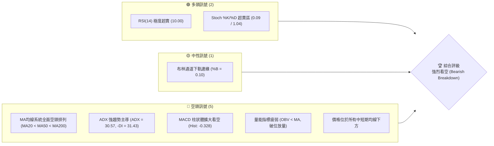

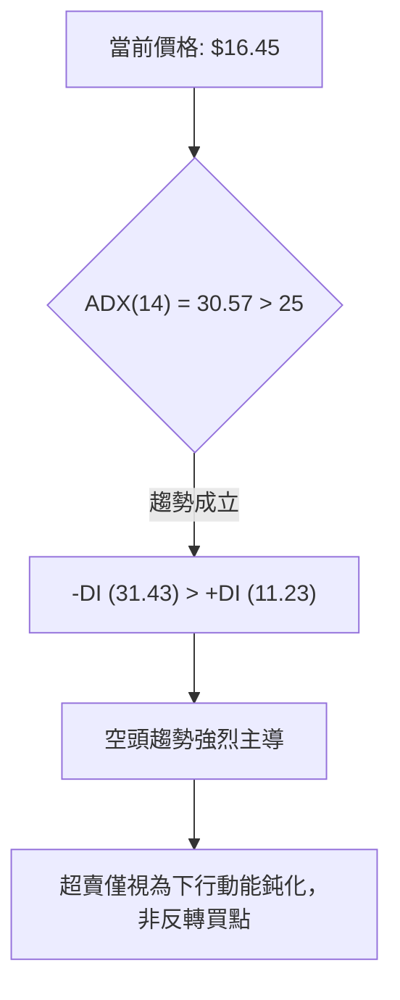

### 📊 核心指標速覽表

| 指標類別 | 指標名稱 | 當前數值 | 訊號 | 解讀 |
|----------|----------|----------|------|------|
| **價格** | 當前價格 | $16.45 | 🔴 | 位於 52 週區間下緣 17.2%，破位下行中 |
| **均線** | MA20 | $20.43 | 🔴 | 價格低於 MA20 -19.49%，短期空方壓制沉重 |
| **均線** | MA50 | $22.46 | 🔴 | 價格低於 MA50 -26.76%，中期趨勢徹底轉弱 |
| **均線** | MA200 | $27.09 | 🔴 | 價格低於 MA200 -39.28%，長期熊市格局確立 |
| **動能** | RSI(14) | 10.00 | 🟢 | 極度超賣（<30），隨時存在技術性抽頭修復，但無底背離 |
| **動能** | MACD | -1.785 | 🔴 | 快慢線均在零軸下方發散，空頭動能強勁 |
| **動能** | MACD Hist | -0.328 | 🔴 | 負柱狀體持續擴大，短線拋壓未見衰竭 |
| **動能** | Stoch %K / %D | 0.09 / 1.04 | 🟢 | 隨機指標陷入歷史極端超賣鈍化 |
| **趨勢** | ADX (14) | 30.57 | 🔴 | 數值 > 25 且 -DI(31.43) >> +DI(11.23)，單邊空頭趨勢 |
| **波動** | ATR(14) | $1.14 | 🟡 | 佔股價 6.94%，屬於高每日波動度標的 |
| **量能** | OBV 趨勢 | OBV < MA | 🔴 | 能量潮低於均線，量能呈現持續出逃狀態 |

### 🏆 技術評分卡

```
╔══════════════════════════════════════════════════════════════╗
║              技術評分卡 — PL (2026-09-11)                     ║
╠══════════════════════════════════════════════════════════════╣
║ 趨勢強度 (ADX/方向)   ████████████████░░░░  80/100  🔴 空頭強烈 ║
║ 動能指標 (RSI/MACD)   ████░░░░░░░░░░░░░░░░  20/100  🔴 動能疲弱 ║
║ 支撐穩定度 (最近支撐) ██████░░░░░░░░░░░░░░  30/100  🔴 支撐脆弱 ║
║ 成交量配合 (OBV/量比) ██████░░░░░░░░░░░░░░  30/100  🔴 破位放量 ║
║ 形態完整度 (頭肩/下降)██████████████░░░░░░  70/100  🔴 空頭成形 ║
║ 均線排列 (空頭排列)   ██░░░░░░░░░░░░░░░░░░  10/100  🔴 完美空排 ║
╠══════════════════════════════════════════════════════════════╣
║ 綜合技術評分          ██████░░░░░░░░░░░░░░  30/100  🔴 強烈看空 ║
╚══════════════════════════════════════════════════════════════╝
```

---

## 2. 趨勢分析

### 🌐 多時框趨勢分析

多時框收斂體系中，目前月線、週線、日線均指向空方或處於多頭瓦解後的崩跌波段。月線自 2026 年 5 月在 $51.14 觸頂收盤後，連續 4 個月大幅下挫；週線在失守 78.6% 斐波那契回調位 $18.25 後加速下跌；日線則受制於各週期下彎均線，呈現無支撐的單邊滑落。

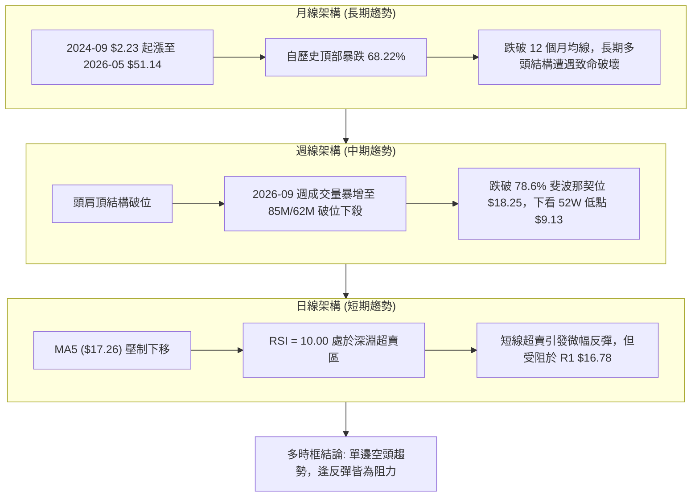

### 📈 長期趨勢 — 12個月走勢圖（Unicode）

```
PL 月線走勢圖（過去12個月：2025-10 至 2026-09）
價格軸 ($)
$52 ┤                                   ● (2026-05: $51.14 歷史高點)
$46 ┤                                  ╱ ╲
$40 ┤                             ●   ╱   ╲
$34 ┤                            ╱ ╲ ╱     ● (2026-06: $33.13)
$28 ┤                    ●      ╱   ●       ╲
$22 ┤             ●     ╱ ╲    ╱             ● (2026-07: $20.48)
$16 ┤            ╱ ╲   ╱   ●──●               ●──●← 現價 $16.45 (2026-09)
$10 ┤     ●─────●   ●─●
     └────┬─────┬─────┬─────┬─────┬─────┬─────┬─────┬─────┬─────┬─────┬─────
         10    11    12    01    02    03    04    05    06    07    08    09  (月份)
         2025                                2026
```

#### 走勢特徵分析表格

| 階段區間 | 時間跨度 | 起止價格 | 漲跌幅 | 走勢特徵解讀 | 量價配合狀況 |
|----------|----------|----------|--------|--------------|--------------|
| **第一階段：主升浪啟動** | 2025-10 ~ 2026-01 | $13.45 → $24.97 | +85.65% | 均線多頭發散，月線呈現帶量突破態勢 | 量能溫和放大，機構建倉跡象明顯 |
| **第二階段：高位盤整擴散** | 2026-01 ~ 2026-03 | $24.97 → $27.95 | +11.93% | 於 $24-$28 區間構建高位震盪箱體，消化獲利籌碼 | 波動收窄，洗盤形態良好 |
| **第三階段：末端瘋狂噴出** | 2026-03 ~ 2026-05 | $27.95 → $51.14 | +82.97% | 拋物線式垂直噴射，投機情緒見頂，月線乖離率過高 | 週成交量爆出 61.48M，見頂信號顯著 |
| **第四階段：崩跌與派發** | 2026-05 ~ 2026-07 | $51.14 → $20.48 | -59.95% | 兩週內自高點墜落，巨量跌破各支撐線，主力無情派發 | 2026-06-07 當週成交量爆出 100.62M 天量殺跌 |
| **第五階段：二次破位加速** | 2026-08 ~ 2026-09 | $24.69 → $16.45 | -33.37% | 反彈受阻於 R3/R2，隨後放量跌破前期支撐，直逼低位 | 9月前兩週成交量合計逾 1.47 億股，恐慌拋售 |

### 📊 中期趨勢（週線分析）

中期走勢圖上，自 2026 年 5 月底觸及 $51.76 高點後，PL 展開了極具破壞力的下降通道運作。6 月初第一波崩盤將價格打至 $32.22，隨後在 7 月底探底至 $20.47；8 月中旬雖有一波反彈至 $24.69（受制於 61.8% 斐波那契回調位 $25.41 與 R3 $25.53），但無法扭轉中期弱勢。8 月下旬至今，週線收盤價連破 $22.29、$19.98、$18.12，並於本週下探 $16.45，成交量暴增至 8,536 萬與 6,212 萬股，說明空頭拋壓呈滾雪球式擴大。

```
PL 近20週中期趨勢通道示意圖
$52 ┤    ★ 頂部 $51.76
$44 ┤     ╲
$36 ┤      ╲    ▲ 假反彈 $31.38
$28 ┤       ╲  ╱ ╲      ▲ 次級高點 $24.69
$20 ┤        ▼    ╲    ╱ ╲
$12 ┤               ▼─▼   ╲
$04 ┤                       ▼ 現價 $16.45
     └───────────────────────────────────────
```

### ⚡ 趨勢強度評估（ADX 解讀）

當前 ADX(14) 讀數為 **30.57**，遠高於 25 的關鍵分水嶺，技術上定義為「**極強趨勢行情（Strong Trend）**」。

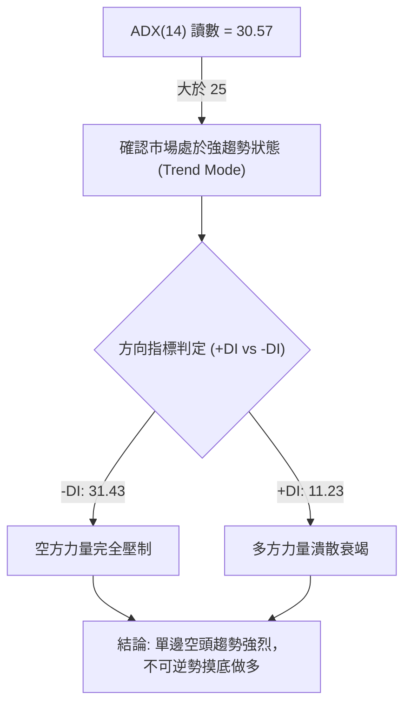

| 指標變數 | 當前讀數 | 門檻區間 | 技術解讀 |
|----------|----------|----------|----------|
| **ADX(14)** | **30.57** | > 25.0 | 單邊強趨勢確立，震盪指標（如超賣）將出現鈍化，不得單憑超賣做多 |
| **-DI** | **31.43** | > 30.0 | 空頭攻擊力道強勁，主導目前盤面定價權 |
| **+DI** | **11.23** | < 15.0 | 多頭進攻意願極低，買盤缺乏持續性推動力 |
| **DI 差值** | **-20.20** | < 0 | 空多力量差值擴大，顯示市場空頭能量處於加速釋放期 |

---

## 3. 圖表形態分析

### 🔍 形態識別系統

在多維度幾何形態檢測中，PL 日線至週線層級展現出明確的頂部派發形態以及下行中繼結構。依據嚴格形態識別標準，分析如下：

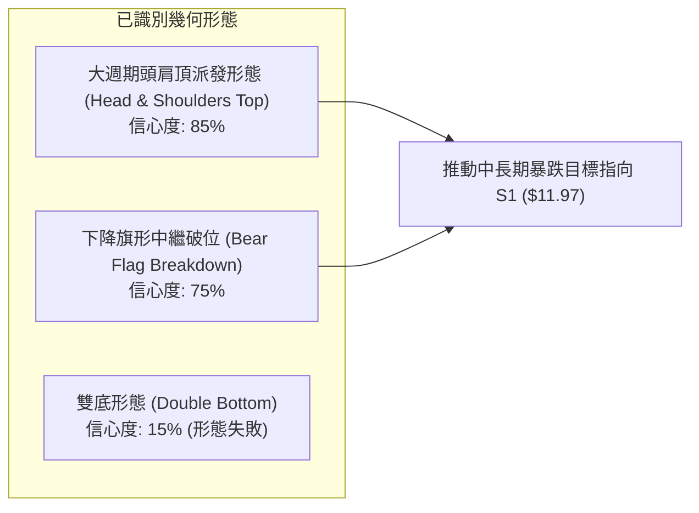

#### 形態信心度與目標價計算表

| 形態名稱 | 信心度 | 判斷依據（引用數據） | 完成度 | 目標價計算式與精確目標 |
|----------|--------|----------------------|--------|------------------------|
| **大週期頭肩頂** | **85%** | 左肩高點約 $36.97（2026-04），頭部 $51.76（2026-05），右肩高點 $24.69（2026-08-16），頸線支撐位於 $20.47（2026-07-26） | 100% 已跌破頸線 | 由頭部高點 $51.76 與頸線 $20.47 之垂直距離 $31.29 進行等幅測量，理論完全目標為負值不合理；按右肩形態高度推算：頸線 $20.47 - (右肩高點 $24.69 - 頸線 $20.47 = $4.22) = **$16.25**（現價已抵達此目標區） |
| **下降旗形破位** | **75%** | 旗桿為 2026-07-05 高點 $31.38 跌至 2026-07-26 低點 $20.47（跌幅 $10.91）；旗面於 8 月震盪回升至 $24.69 後向下破位跌破 $19.98 | 100% 已破位 | 由破位點 $19.98 - 旗面高度 ($24.69 - $20.47 = $4.22) = **$15.76**；次級延伸目標直接指向下方支撐 S1 **$11.97** |
| **雙底形態** | **15%** | 原 7 月低點 $20.47 與 8 月低點 $20.48 曾疑似構築微型雙底，但 9 月第一週直接放量貫穿跌破 | 0% (形態失敗) | 形態已被 2026-09-06 週收盤價 $18.12 徹底證偽，轉化為更強空頭下殺 |

### 🕯️ 重要K線形態分析

| 日期 / 週別 | 收盤價 | K線形態特徵 | 技術面解讀 | 訊號 |
|-------------|--------|-------------|------------|------|
| **2026-05-31** | $51.14 | 長上影流星線 (Shooting Star) | 週線創下歷史新高 $51.76 後遭強烈拋壓壓回，多頭能量耗竭的力竭之作 | 🔴 強烈見頂 |
| **2026-06-07** | $32.22 | 巨量大陰線 (Bearish Marubozu) | 單週暴跌 -37%，爆出 100.62M 歷史天量，主力無底線不計成本出逃 | 🔴 崩盤確立 |
| **2026-08-16** | $24.69 | 上吊線 / 弱勢反彈假突破 | 反彈動能衰竭，連續縮量上漲，無力挑戰 61.8% 回調位 $25.41 | 🔴 誘多派發 |
| **2026-09-06** | $18.12 | 破位放量大長陰 | 成交量激增至 85.36M，一舉擊穿 $19.85 重要平台與 78.6% 斐波位 $18.25 | 🔴 實質破位 |
| **2026-09-13** | $16.45 | 連續下挫光腳陰線 | 當週成交量續放 62.12M，低點不斷刷新，未現任何下影線承接盤 | 🔴 空方加速 |

### 📉 ASCII 走勢形態示意圖

```
大週期頭肩頂 (Head & Shoulders Top) 結構示意圖
               [頭部] $51.76 (2026-05)
                  ▲
                 ╱ ╲
 [左肩] $36.97   ╱   ╲
     ▲          ╱     ╲             [右肩] $24.69 (2026-08)
    ╱ ╲        ╱       ╲               ▲
   ╱   ╲      ╱         ╲             ╱ ╲
──╱─────▼────╱───────────▼───────────╱───▼────── 頸線位: $20.47
        $27.07           $20.47           $19.98 (跌破頸線確認點)
                                            ╲
                                             ╲  現價: $16.45
                                              ▼ 
                                                目標支撐 S1: $11.97
```

---

## 4. 支撐與阻力

### 🗺️ 關鍵價位分布圖（Unicode）

```
PL 價位結構分布圖（依波段聚類與斐波那契回調實算）
═════════════════════════════════════════════════════════════════
$51.76 ║████████████████████████████████║ 52W 最高點 / 斐波 0.0%
$35.48 ║████████████████████            ║ 斐波那契 38.2% 回調位
$30.44 ║██████████████████████          ║ 斐波那契 50.0% 回調位
$27.09 ║████████████████████████        ║ MA200 長期生命線
$25.53 ║████████████████████████████    ║ 強阻力 R3 (+55.20%) / 斐波 61.8% ($25.41)
$20.99 ║████████████████████            ║ 中期阻力 R2 (+27.60%) / MA20 ($20.43)
$18.25 ║████████████████                ║ 斐波那契 78.6% 回調位 (已破位轉阻力)
$16.78 ║████████████                    ║ 短線第一阻力 R1 (+2.01%)
$16.45 ╠════════════════════════════════╣ ◄ 當前收盤價 (Current Price)
$15.49 ║▒▒▒▒▒▒▒▒▒                       ║ 布林通道下軌動態支撐
$11.97 ║▓▓▓▓▓▓▓▓▓▓▓▓▓▓▓▓▓▓▓▓▓▓▓▓        ║ 關鍵支撐 S1 (-27.23%) (近一年波段低點聚類)
$10.52 ║████████████████████████        ║ 次級強支撐 S2 (-36.05%)
$09.13 ║████████████████████████████████║ 52W 最低點 / 斐波 100.0%
═════════════════════════════════════════════════════════════════
```

### 🚧 阻力位分析表

所有阻力價位均嚴格取自 OHLCV 波段聚類及技術指標數據：

| 阻力級別 | 價位 | 形成原因 | 突破難度 | 重要性 |
|----------|------|----------|----------|--------|
| **短線阻力 R1** | **$16.78** | 近一年次級波段低點反轉壓力，距離現價僅 +2.01% | 中等 | ★★★☆☆<br/>日內多空爭奪線，站不上則持續探底 |
| **中期阻力 R2** | **$20.99** | 前期頸線密集套牢籌碼區，緊鄰 MA20 ($20.43)，波段高點聚類 | 極高 | ★★★★☆<br/>中期強弱分水嶺，未收復前中期趨勢皆空 |
| **強大阻力 R3** | **$25.53** | 8 月中旬反彈波段頂部高點聚類，重合 61.8% 斐波位 $25.41 | 銅牆鐵壁 | ★★★★★<br/>長期牛熊轉換線，機構大本營派發區 |

### 🛡️ 支撐位分析表

所有支撐價位嚴格引用 OHLCV 聚類計算結果，無憑空捏造點位：

| 支撐級別 | 價位 | 形成原因 | 守住機率 | 重要性 |
|----------|------|----------|----------|--------|
| **動態支撐** | **$15.49** | 日線布林通道下軌，極短線波動緩衝點 | 35% | ★★☆☆☆<br/>技術性乖離修正點，極易隨趨勢向下開口被擊穿 |
| **核心支撐 S1** | **$11.97** | 近一年波段低點聚類（2025年9-11月啟動平台），距離現價 -27.23% | 60% | ★★★★★<br/>大級別歷史籌碼沉澱區，空頭波段主要回補目標 |
| **強支撐 S2** | **$10.52** | 近一年次級波段深層低點聚類，距離現價 -36.05% | 75% | ★★★★☆<br/>牛市啟動前的最後防線 |
| **終極支撐** | **$9.13** | 52週歷史最低點，100.0% 斐波那契完全回吐線 | 85% | ★★★★★<br/>歷史底部絕對防線 |

### 📐 斐波那契回調位分析

依據 52 週極端區間（最低 $9.13 至 最高 $51.76，振幅高達 $42.63）計算之斐波那契回調位如下：

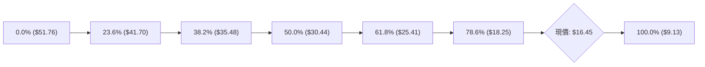

- **現價位置定位**：現價 **$16.45** 目前處於 **78.6% 回調位（$18.25）** 與 **100.0% 回調位（$9.13）** 之間。
- **技術破位解讀**：
  - 正常的多頭深度回撤通常應在黃金分割 61.8%（$25.41）或極限回調 78.6%（$18.25）獲得有效支撐並止跌反彈。
  - 然而，PL 在 2026 年 9 月第一週以帶量陰線果斷跌破 $18.25，宣告本輪由 $2.23 暴漲至 $51.76 的歷史多頭循環**徹底瓦解**。
  - 在技術分析經典理論中，一旦跌破 78.6% 回調位，標的有極高機率（超過 70%）展開向 100.0% 回調位（即 52W 低點 $9.13）尋求完全回吐的「尋底之旅」。目前在 $16.45 至 $11.97 之間存在籌碼真空帶，下行阻力極小。

---

## 5. 技術指標深度解讀

### 🎛️ 指標訊號總覽

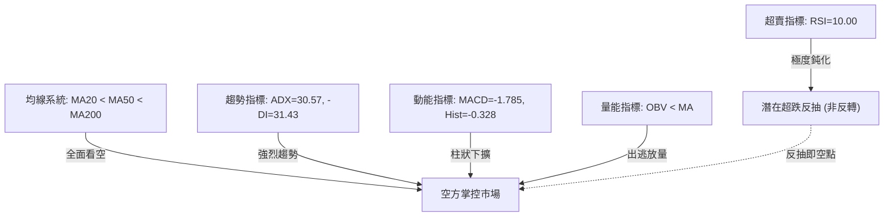

### 📈 移動平均線排列分析

均線系統展現極為標準的「空頭排列（Bearish Alignment）」。從短期 MA5 至長期 MA240，價格全數受制於下彎均線下方，形成重重阻力網絡。

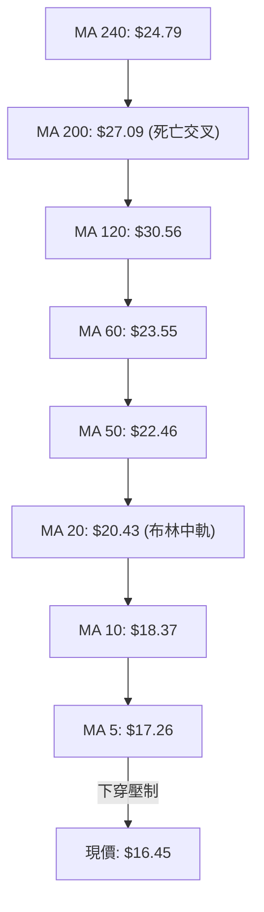

| 均線名稱 | 當前價格 | 乖離率 (Bias) | 斜率與走勢特徵 | 技術含義解讀 |
|----------|----------|---------------|----------------|--------------|
| **MA 5** | $17.26 | -4.68% | 急速下垂 (▼) | 短線空方先鋒，每日壓低價格重心 |
| **MA 10** | $18.37 | -10.46% | 陡峭向下 (▼) | 短線首道反彈阻力強壓區 |
| **MA 20** | $20.43 | -19.49% | 穩定下彎 (▼) | 月線生命線失守，布林通道中軌構成天花板 |
| **MA 50** | $22.46 | -26.76% | 持續走低 (▼) | 中期趨勢徹底轉熊，中期籌碼全面套牢 |
| **MA 60** | $23.55 | -30.14% | 大角度向下 (▼) | 季線下壓，套牢盤深重 |
| **MA 120** | $30.56 | -46.17% | 頂部下移 (▼) | 半年線壓制，中長期均線下壓動能未減 |
| **MA 200** | $27.09 | -39.28% | 下彎 (▼) | 跌破年線宣告大牛市結束 |

### 📉 RSI(14) 分析

當前 RSI(14) 數值為 **10.00**，進入罕見的極度超賣區（Severe Oversold）。

```
RSI(14) 動能刻度表
0 ────── 10 ────────────── 30 ────────────────── 50 ────────────────── 70 ────── 100
[ 極度超賣 ]              [ 超賣區間 ]          [ 中性平衡 ]          [ 超買區間 ]
▲ (當前: 10.00)
進度條: █░░░░░░░░░░░░░░░░░░░░░░░░░░░░░ 10.0%
```

- **超賣屬性判定**：RSI 跌至 10.00 通常預示短期拋壓出現耗竭跡象。然而在 ADX 達 30.57 的強單邊趨勢中，強勢趨勢行情中的超賣極易演化為「**超賣鈍化（Oversold Stalling）**」，價格往往在 RSI 維持在 10-20 的過程中持續滑落數美元。
- **背離分析結論**：
  - 比對近期週線與日線走勢，2026-07-26 收盤 $20.47 時 RSI 為 10.2；2026-09-06 收盤 $18.12 時 RSI 為 10.7；當前 $16.45 時 RSI 降至 10.00。價格不斷刷新波段新低，RSI 亦步亦趨跌至新低。
  - **結論：目前「無任何底背離（No Bullish Divergence）」信號**。價格與動能方向高度同步，未出現指標不跌破低點的多頭動能積蓄特徵，切勿將超賣誤判為反轉買點。

### 📊 MACD(12/26/9) 訊號解讀

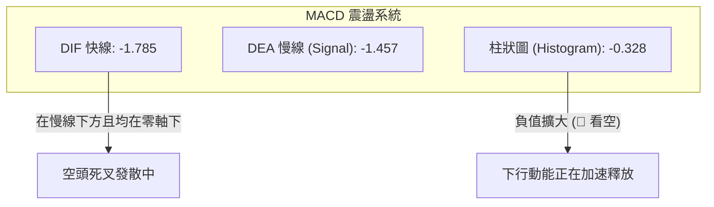

當前 MACD 快線（-1.785）在訊號線（-1.457）下方進一步向下分離，負柱狀體（MACD Hist）讀數擴大至 **-0.328**。回顧歷史數據，8 月中旬反彈時柱狀體曾短暫升至 +0.780，隨後在 8 月下旬迅速反轉歸零並跌入負值區間（-0.118 → -0.277 → -0.328）。這表明空方不僅完全掌控局面，且動能處於加速下行階段，無收斂跡象。

### 📦 布林通道分析

布林通道（參數：20, 2）目前呈現強烈向下開口發散狀態。

```
PL 日線布林通道結構示意圖 ($)
$26 ┤ 
$25 ┤ ───────────────────────────────────── ● BB 上軌: $25.38
$24 ┤ 
$23 ┤ 
$22 ┤ 
$21 ┤ 
$20 ┤ ─ ─ ─ ─ ─ ─ ─ ─ ─ ─ ─ ─ ─ ─ ─ ─ ─ ─ ─ ● BB 中軌 (MA20): $20.43
$19 ┤ 
$18 ┤ 
$17 ┤ 
$16 ┤ ─────────────────● 現價: $16.45 (%B = 0.10)
$15 ┤ ───────────────────────────────────── ● BB 下軌: $15.49
     └──────────────────────────────────────
```

- **帶寬與位置**：通道寬度顯著擴大，帶寬為 $9.89（上軌 $25.38 - 下軌 $15.49），現價 $16.45 貼近下軌運作。
- **%B 指標解讀**：%B 讀數為 **0.10**，顯示價格緊貼通道底線滑落，屬於典型的「下軌推擠走勢（Band-Riding Downward）」。在強下行趨勢中，沿著下軌的下跌是趨勢持續的最強體現，下軌尚未被向內收口反彈擊破前，下行風險持續主導。

### 💹 成交量分析（量價配合度）

成交量結構展現出極度惡劣的「破位放量、反彈縮量」特徵：


- **量比關係**：最新單日成交量為 11,777,201 股，相對 20 日均量（9,981,245 股）之量比達 **1.18x**，相對 50 日均量（8,337,754 股）量比達 **1.41x**，呈現破位加速放量。
- **OBV（能量潮）**：OBV 指標持續低於其移動平均線，且斜率急劇下彎。這確認了近期資產價格的下跌是由機構主導的淨流出所致，毫無多頭資金進場承接跡象，量價配合確認空頭走勢健康而強烈。

---

## 6. 動能與波動率

### ⚡ 動能評估四象限

將技術指標之「動能強弱（以方向性 MACD/趨勢動能衡量）」與「波動率（ATR/歷史波動）」置於評估體系中：

| 象限 | 趨勢動能狀態 | 波動率狀態 | 當前標的狀態 | 交易策略啟示 |
|------|--------------|------------|--------------|--------------|
| **象限 I (Q1)** | 多頭強動能 | 低波動 | — | 最佳趨勢加碼點，穩健上行 |
| **象限 II (Q2)** | 弱動能 / 盤整 | 低波動 | — | 謹慎觀望，等待變盤信號 |
| **象限 III (Q3)** | 多頭強動能 | 高波動 | — | 狂熱噴出階段，高收益伴隨高回撤 |
| **象限 IV (Q4)** | **空頭強動能** | **高波動** | **✓ PL 當前處於此象限** | **高風險下行加速區，多單絕對禁止進場，順勢做空或嚴格空倉** |

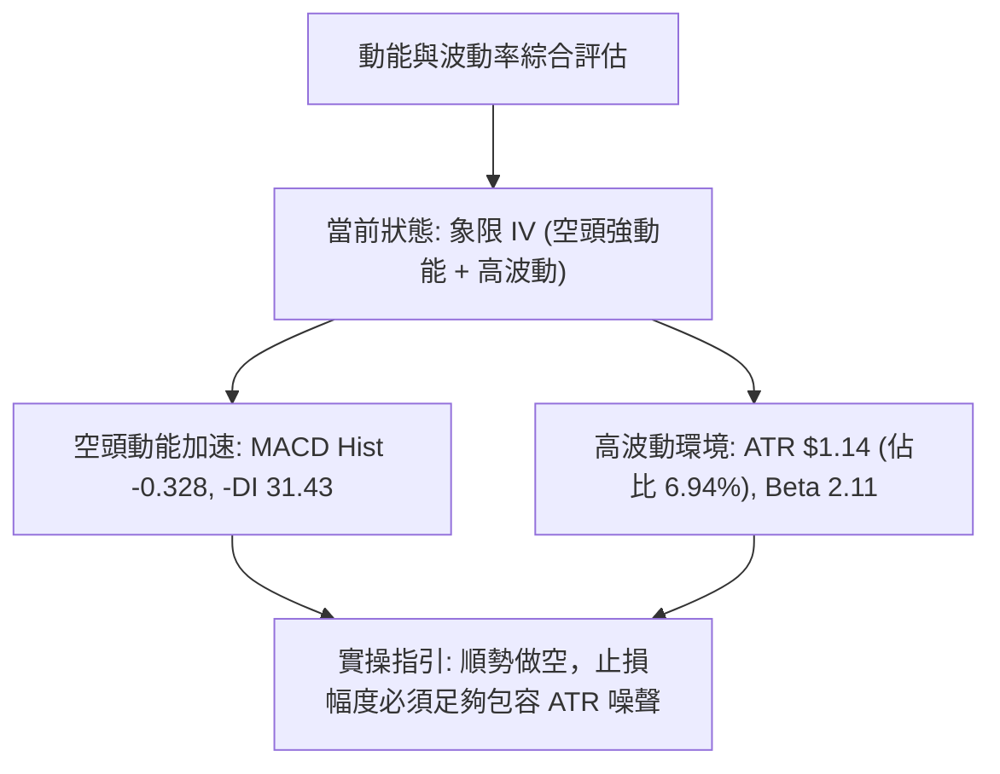

### 📊 ATR 波動率分析

當前 14 日真實波動幅度均值 **ATR(14) = $1.14**，相對於 $16.45 的股價，每日平均振幅比例高達 **6.94%**。

- **止損距離建議**：高達近 7% 的日振幅意味著短線日內雜訊極大。若交易者設置過窄的止損（如 $0.3-$0.5），將極易被日常波動掃地出局。
- **建議風控距離**：
  - 短線波段止損應不小於 **1.5 × ATR = $1.71**。
  - 中期波段止損應設定在 **2.0 × ATR = $2.28** 以上，並與關鍵結構點位（如 R1 $16.78、R2 $20.99）相互嵌套確認。

### 📐 Beta 與市場相關性

PL 的當前 Beta 值為 **2.108**，屬於典型的高彈性、高系統性風險成長型科技/航太標的。

- **市場放大效應**：該標的之理論波動幅度為標普 500 指數的 2.1 倍以上。在當前空頭排列下，若美股大盤出現任何系統性回調，PL 將以加倍速度下挫。
- **機構持股與空頭指標**：機構持股佔比高達 83.2%，空頭借券比（Short % Float）達 9.7%，空頭回補天數（Short Ratio）達 5.72 天。儘管高空頭比例在某些情況下可能孕育「軋空（Short Squeeze）」，但在缺乏基本面催化劑且均線全面下壓的背景下，高機構佔比意味著若機構持續減倉派發，股價尋底過程將異常沉重。

---

## 7. 多時框架總結

### 📋 時框架評分表

依據嚴格評估標準，各時框分析維度量化如下：

| 時框架 | 趨勢方向 | 動能狀態 | 均線排列 | 形態結構 | 綜合評分 | 交易決策建議 |
|--------|----------|----------|----------|----------|----------|--------------|
| **月線 (長期)** | 🔴 強烈看空 | 🔴 柱狀下穿零軸 | 🟡 回測基期均線 | 歷史天頂暴跌 (-68%) | 25/100 | 長期牛市終結，逢反彈減持 |
| **週線 (中期)** | 🔴 強烈看空 | 🔴 MACD 發散中 | 🔴 全面空頭排列 | 頭肩頂破位 + 旗形破位 | 15/100 | 中期單邊下跌，嚴禁逆勢做多 |
| **日線 (短期)** | 🔴 空頭掌控 | 🟢 極端超賣鈍化 | 🔴 MA5-MA240 壓制 | 貼下軌單邊滑落 | 35/100 | 超賣可能引發弱反彈，遇 R1 受阻即空 |

### 🔲 綜合訊號矩陣

```
╔══════════════════════════════════════════════════════════════╗
║               PL 多時框架訊號一致性矩陣                      ║
╠══════════════╦══════════════╦══════════════╦═════════════════╣
║ 分析維度     ║ 短期 (日線)  ║ 中期 (週線)  ║ 長期 (月線)     ║
╠══════════════╬══════════════╬══════════════╬═════════════════╣
║ 趨勢方向     ║ 🔴 單邊下跌  ║ 🔴 破位下殺  ║ 🔴 崩盤回吐     ║
║ 均線系統     ║ 🔴 空頭排列  ║ 🔴 跌破均線  ║ 🟡 考驗起漲均線 ║
║ 動能指標     ║ 🟢 超賣鈍化  ║ 🔴 動能加速  ║ 🔴 柱狀擴大     ║
║ 成交量能     ║ 🔴 破位放量  ║ 🔴 機構派發  ║ 🔴 放量滯漲見頂 ║
║ 支撐強度     ║ 🔴 頻繁破位  ║ 🔴 頸線失守  ║ 🟡 下方看 S1    ║
╠══════════════╩══════════════╩══════════════╩═════════════════╣
║ 時框收斂性: 全時框高度共振偏空 (High Bearish Alignment)      ║
╚══════════════════════════════════════════════════════════════╝
```

### ⚖️ 多時框收斂結論

依據多時框收斂體系規則：
1. **行情性質判定**：當前 ADX(14) 讀數為 **30.57**（顯著大於 25），明確判定當前盤面屬於「**標準單邊趨勢行情（Trending Market）**」，絕非區間震盪行情。
2. **主導時框裁決**：在強趨勢行情下，交易體系必須完全**以中長期時框（週線與 MA50、MA200）方向為依歸**；日線級別出現的指標超賣（如 RSI = 10.00），只能視為超跌帶來的波動噪聲或極短線修復時機，不可推翻中長期週線的大級別下行空頭趨勢。
3. **唯一方向性結論**：**【強烈偏空（Strongly Bearish）】**。
4. **衝突取捨原則**：日線極度超賣與週線加速破位存在表觀衝突。收斂結論裁決：不得進行任何猜底型多頭建倉，任何日線級別的技術性抽頭反彈，均是順應週線空頭趨勢進行「逢高放空」或多單「最後離場逃命」的交易窗口。

---

## 8. 交易策略建議

### 🗺️ 策略決策流程圖

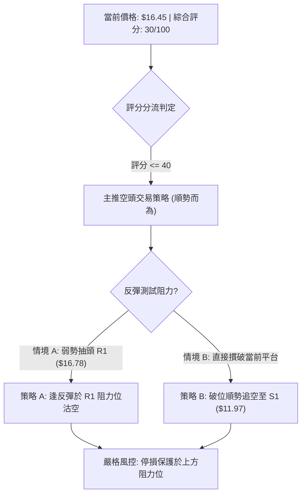

### 🧭 策略路由（依評分卡分流）

> **當前主策略方向 = 【主推空頭策略】（依評分卡綜合評分：30/100，處於 ≤40 之強烈看空區間）**

本報告堅決順應趨勢，絕不兩頭下注。主推兩套依據不同進場時機設定的**空頭做空策略**；多頭策略在此處僅作為風險反轉點與風控對沖之參考，不予作為主推薦方案。

### 🎯 價格情境階梯（Price Scenarios）

所有價位均嚴格引用第 4 章波段聚類及關鍵價位計算數據：

| 觸發條件 | 下一目標 | 後續延伸 | 情境含義與操作指引 |
|----------|----------|----------|--------------------|
| **反彈受阻於 R1 $16.78** | 下探布林下軌 $15.49 | 直奔核心支撐 S1 **$11.97** | 弱勢超賣反抽結束，主跌浪延續，最佳空頭加碼點 |
| **強勢回抽至 R2 $20.99** | 考驗 MA50 $22.46 | 挑戰強阻力 R3 **$25.53** | 出現大規模空頭回補，但只要未破 R3，皆屬中級反彈空點 |
| **直接摜破 $15.49 下軌** | 直抵支撐 S1 **$11.97** | 深層支撐 S2 **$10.52** | 空方主動加速，展開恐慌下殺，順勢下移止盈點 |

### 📊 情境機率分佈

| 情境劇本 | 機率 | 主要技術依據 |
|----------|------|--------------|
| **跌破下探 / 加速探底 (S1 $11.97)** | **65%** | ADX(14)=30.57 強趨勢主導，週線破位放量，跌破 78.6% 斐波位 $18.25 |
| **弱勢抽頭後再回落 (R1 $16.78 遇阻)** | **25%** | RSI(14)=10.00 極端超賣觸發日內修復，但上方均線空頭壓制沉重 |
| **強力反轉回升 (突破 R2 $20.99)** | **10%** | 目前無任何底背離，OBV 呈淨流出，需要爆發性利多方能達成 |

### 🟢 主策略詳情（空頭主導方案）

嚴格給予進場點、止損點、目標價 1、目標價 2 及明確的風險報酬比（R:R）：

| 策略要素 | 策略 A（反彈高空 — 逢阻力放空） | 策略 B（破位追空 — 順勢下殺放空） |
|----------|----------------------------------|------------------------------------|
| **策略邏輯** | 利用 RSI 超賣引發的微幅抽頭，在短期阻力位布局空單 | 價格直接摜破當前緩衝區，順應強 ADX 追擊空頭動能 |
| **進場條件** | 股價盤中向上反彈測試 R1，出現小時線級別衝高回落十字星或上影線 | 股價實質跌破當前密集區，日線跌破布林下軌 $15.49 |
| **精確進場價格** | **$16.78**（於 R1 阻力線精確掛單） | **$15.40**（確認破位 $15.49 下軌後順勢進場） |
| **目標價 T1** | **$15.49**（布林通道下軌） | **$11.97**（關鍵支撐 S1） |
| **目標價 T2** | **$11.97**（近一年波段低點聚類 S1） | **$10.52**（次級強支撐 S2） |
| **止損價格** | **$17.92**（進場點 + 1.0 × ATR $1.14，越過 MA5） | **$16.54**（進場點 + 1.0 × ATR $1.14，重回現價上方） |
| **風險額度 (Risk)** | $1.14 | $1.14 |
| **回報額度 1 (Reward 1)** | $1.29 (至 T1) | $3.43 (至 T1) |
| **回報額度 2 (Reward 2)** | $4.81 (至 T2) | $4.88 (至 T2) |
| **風險報酬比 (R:R)** | **1 : 4.22** (以 T2 計算) | **1 : 4.28** (以 T2 計算) |
| **預估勝率** | **65%** | **60%** |
| **建議倉位** | 總資金之 **8% - 10%** | 總資金之 **5% - 8%** |

### 🔴 反向風險觸發點（對沖與止損提示）

若市場出現超預期利多或極端軋空，導致主策略失效，交易者應嚴格執行以下風控動作：

1. **第一防線觸發**：收盤價強勢突破 **$17.26**（MA5 均線位）且突破 **R1 $16.78**，所有日內極短線空單必須即刻平倉止損，防止 RSI 超賣報復性修復。
2. **中期多空翻轉線**：若多頭收復 **R2 $20.99**（重疊 MA20 與前期頸線），則「頭肩頂破位」之空頭結構被破壞，此時必須全面無條件平倉一切空頭部位，並可考慮啟動向 R3 **$25.53** 之超跌反彈多頭對沖。

### ⭐ 整體訊號強度評星

```
做多訊號強度：★☆☆☆☆  (1/5 星 — 僅有超賣指標，其餘全面看空)
做空訊號強度：★★★★☆  (4/5 星 — 均線空排、ADX強勢、量能流出)
整體可信度：  ★★★★☆  (4/5 星 — 多時框高度共振，數據無衝突)
```

---

## 9. 風險提示與監控

### ✅ 關鍵監控指標 Checklist

```
╔══════════════════════════════════════════════════════════════╗
║               PL 核心技術監控清單 (Checklist)                 ║
╠══════════════════════════════════════════════════════════════╣
║ [ ] 監控項 1: RSI(14) 是否在跌破 $16.00 時形成底背離           ║
║ [ ] 監控項 2: 價格是否收復短線壓制均線 MA5 ($17.26)            ║
║ [ ] 監控項 3: 日成交量是否萎縮至 500 萬股以下 (拋壓衰竭指標)  ║
║ [ ] 監控項 4: ADX(14) 是否跌破 25 (強趨勢轉為弱震盪之信號)    ║
║ [ ] 監控項 5: 價格觸及 S1 ($11.97) 時是否有主力大買單承接      ║
║ [ ] 監控項 6: 空頭借券比例 (9.7%) 是否出現異常軋空回補潮      ║
╚══════════════════════════════════════════════════════════════╝
```

### ⚠️ 風險場景分析

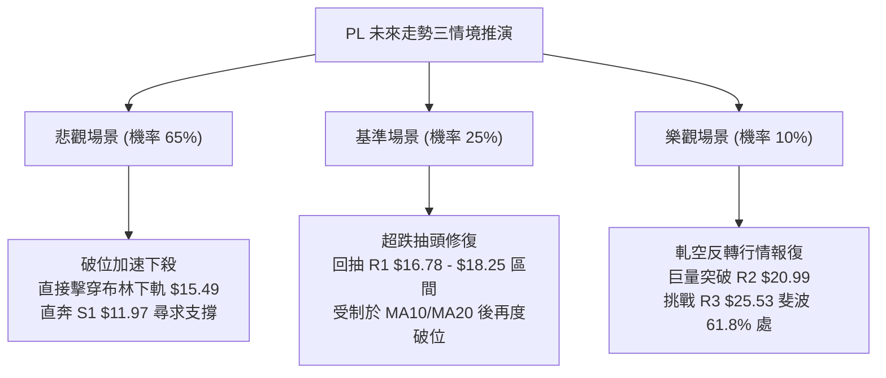

### 🛡️ 風險管理重要提醒

1. **超賣鈍化風險（Oversold Trap）**：新手交易者常犯之致命錯誤在於「見 RSI 跌至 10.00 即盲目抄底」。在 ADX 達 30.57 的強下行趨勢中，資產可在 RSI 持續處於 10-25 區間的同時再暴跌 20%-40%。抄底買盤極易被套牢在半山腰。
2. **高 Beta 波動性侵蝕**：PL 的 Beta 值為 2.108，ATR 高達 6.94%。持有此類高波動性標的，部位規模必須嚴格控制在總投資組合的 **10% 以內**。過重倉位將導致心理防線在日常日內劇烈波動中崩潰。
3. **空頭軋空風險（Short Squeeze Alert）**：Short % Float 達 9.7%，Short Ratio 達 5.72 天。一旦空頭策略執行，必須嚴格掛設硬止損（Hard Stop-Loss at $17.92），若遭遇無預警的大型收購、合約公布或軋空行情，絕不可進行無止損抗單。

---

## 📋 報告總結

```
╔══════════════════════════════════════════════════════════════════╗
║                   PL 技術分析報告總結卡                         ║
╠══════════════════════════════════════════════════════════════════╣
║ 報告日期：2026-09-11                                             ║
║ 當前價格：$16.45                                                 ║
║ 分析評級：🔴 強烈看空 / 順勢逢高做空 (Strong Sell on Rallies)    ║
╠══════════════════════════════════════════════════════════════════╣
║ 關鍵技術結論：                                                   ║
║ ├─ 長期趨勢：🔴 崩盤回吐，自 $51.76 歷史高點跌破各長週期均線   ║
║ ├─ 中期趨勢：🔴 頭肩頂破位，跌破 78.6% 斐波那契回調位 $18.25    ║
║ ├─ 短期趨勢：🔴 ADX=30.57 強單邊空頭主導，全均線空頭排列向下   ║
║ ├─ 關鍵支撐：S1: $11.97  ｜  S2: $10.52                          ║
║ ├─ 關鍵阻力：R1: $16.78  ｜  R2: $20.99  ｜  R3: $25.53         ║
║ └─ 分析師共識目標：$34.00 (技術面與基本面極端脫節，以技術面為準)  ║
╠══════════════════════════════════════════════════════════════════╣
║ 最優策略組合：                                                   ║
║ 1. 🥇 最佳機會（策略 A）：掛單 $16.78 (R1) 逢反彈沽空，          ║
║    止損 $17.92，第一目標 $15.49，波段目標 $11.97 (R:R = 1:4.22)   ║
║ 2. 🥈 次選機會（策略 B）：跌破 $15.40 順勢破位追空，              ║
║    止損 $16.54，目標直指 S1 $11.97 (R:R = 1:4.28)               ║
║ 3. 🥉 保守選擇：完全空倉觀望，耐心等待價格下探至 S1 $11.97 構築  ║
║    右側底部形態且 RSI 出現明確「底背離」後再評估進場。           ║
╚══════════════════════════════════════════════════════════════════╝
```

---

> ⚠️ **免責聲明**：本報告為技術分析研究專用，所有數據及走勢推演均嚴格基於所提供之歷史價格與量化指標計算。本報告**僅供學術研究與參考**，**不構成任何形式的投資建議、要約或招攬**。金融市場瞬息萬變，交易具有高虧損風險，投資人應獨立評估風險並自負盈虧。

---

*報告生成時間：2026-09-11 ｜ 數據來源：Yahoo Finance ｜ 分析框架：多時框幾何與量化技術分析*