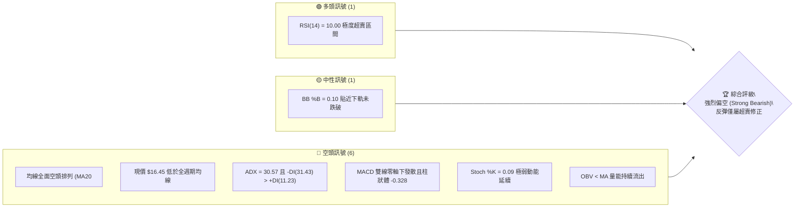
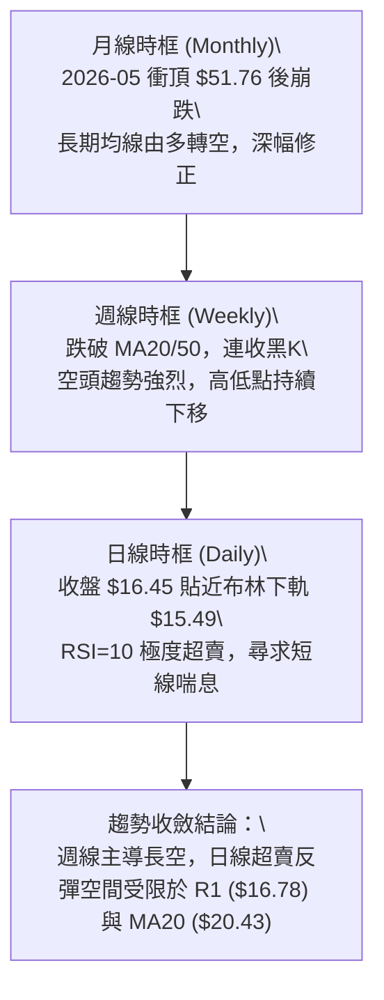
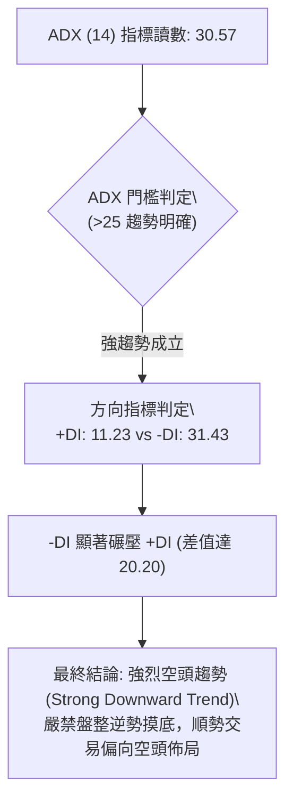
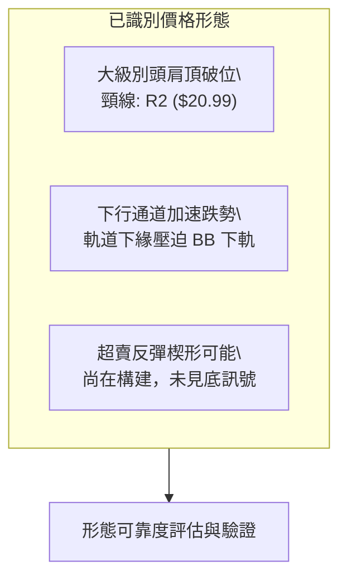
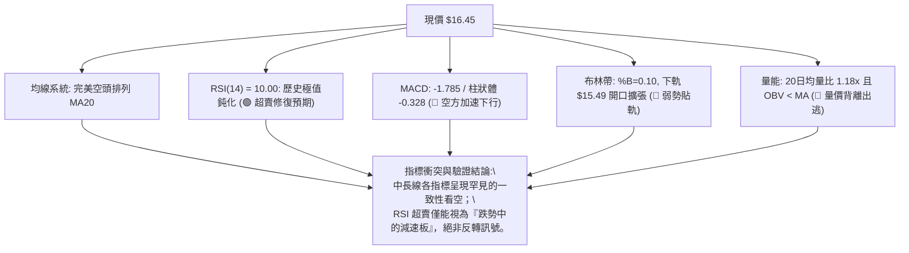
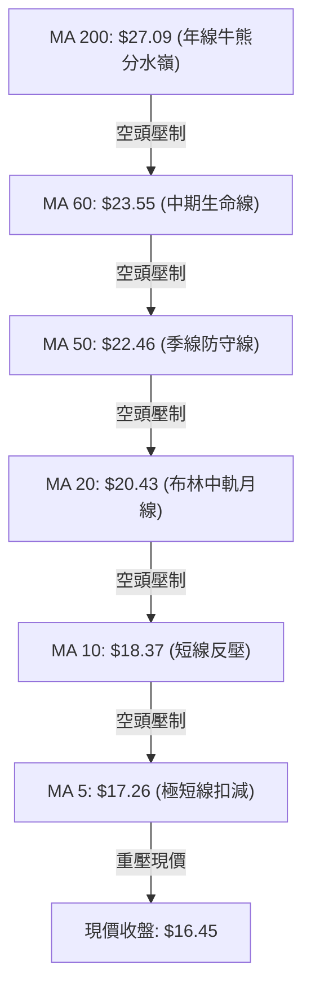
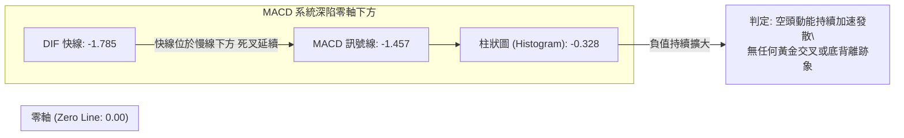
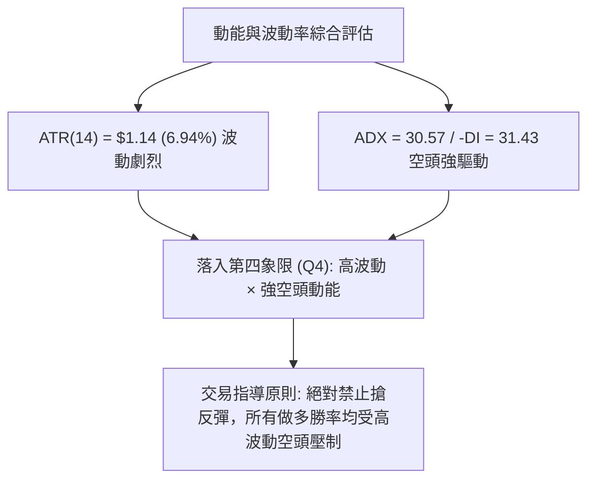
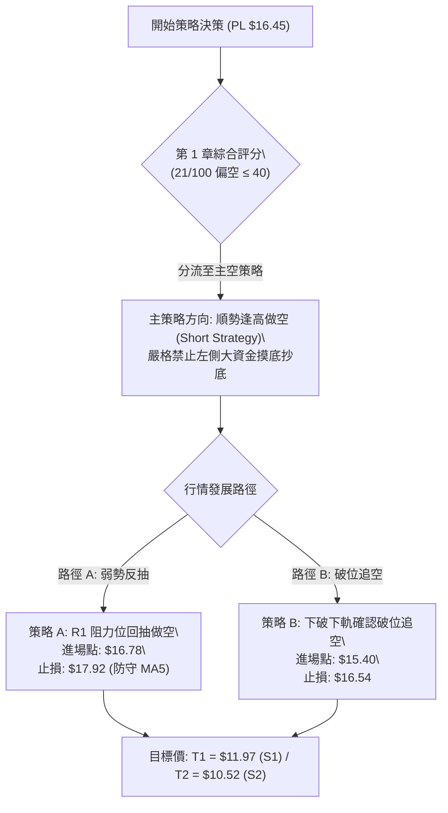
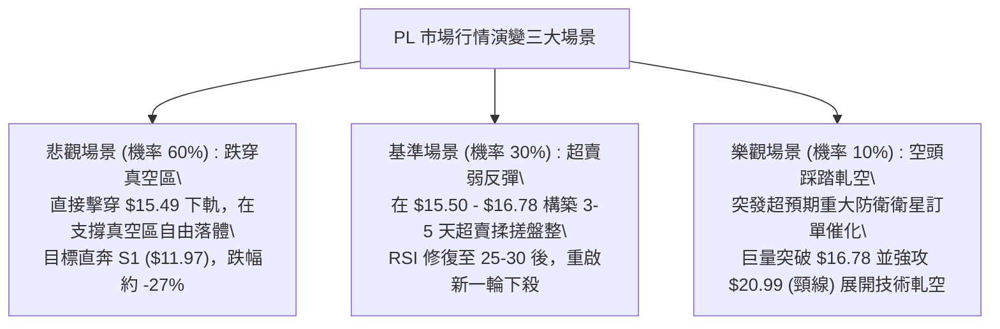

# PL 技術分析報告

> **報告日期**：2026-09-13 ｜ **語言**：繁體中文 ｜ **數據來源**：Yahoo Finance ｜ **當前價格**：$16.45

---

## 目錄

| 章節 | 內容 |
|------|------|
| [1. 技術面概覽](#1-技術面概覽) | 訊號儀表板、核心指標、評分卡 |
| [2. 趨勢分析](#2-趨勢分析) | 多時框趨勢、長中短期走勢 |
| [3. 圖表形態分析](#3-圖表形態分析) | 形態識別、K線組合、目標價 |
| [4. 支撐與阻力](#4-支撐與阻力) | 關鍵價位、斐波那契回調 |
| [5. 技術指標深度解讀](#5-技術指標深度解讀) | MA/RSI/MACD/布林/成交量 |
| [6. 動能與波動率](#6-動能與波動率) | 動能評估、ATR、Beta |
| [7. 多時框架總結](#7-多時框架總結) | 時框架評分矩陣 |
| [8. 交易策略建議](#8-交易策略建議) | 多空策略、風險報酬比 |
| [9. 風險提示與監控](#9-風險提示與監控) | 監控指標、風險場景 |
| [10. 報告總結](#-報告總結) | 全文核心結論彙整 |

---

## 1. 技術面概覽

### 🎯 技術訊號儀表板



### 📊 核心指標速覽表

| 指標類別 | 指標名稱 | 當前數值 | 訊號 | 解讀 |
|----------|----------|----------|------|------|
| **價格** | 當前收盤價 | $16.45 | 🔴 | 位於52週區間 17.2% 分位，深陷空頭下行通道 |
| **均線** | MA20 | $20.43 | 🔴 | 價格低於 MA20 達 -19.49%，短期空頭掌控 |
| **均線** | MA50 | $22.46 | 🔴 | 價格低於 MA50 達 -26.76%，中期下行趨勢陡峭 |
| **均線** | MA200 | $27.09 | 🔴 | 價格低於長線牛熊分水嶺 -39.28%，長線格局轉空 |
| **動能** | RSI(14) | 10.00 | 🟢 | 極度超賣（<30），隨時可能誘發技術性空頭回補 |
| **動能** | MACD | -1.785 | 🔴 | 位於零軸下方深度負值，柱狀體 -0.328 持續放大 |
| **動能** | Stoch %K / %D | 0.09 / 1.04 | 🔴 | 數值貼近歸零，反映持續拋售但已至極限鈍化區 |
| **趨勢** | ADX (14) | 30.57 | 🔴 | 數值 > 25 且 -DI(31.43) 主導，確立強烈空頭趨勢 |
| **通道** | Bollinger Bands | 下軌 $15.49 | 🟡 | %B 為 0.10，價格壓迫下軌，通道向下開口擴張 |
| **量能** | 20日成交量比 | 1.18x | 🔴 | 量增價跌（11.81M vs 9.98M），且 OBV < MA 確認量能流出 |
| **波動** | ATR(14) | $1.14 | 🔴 | 佔股價 6.94%，屬於高波動劇烈單邊行情 |

### 🏆 技術評分卡

```
╔══════════════════════════════════════════════════════════════╗
║              技術評分卡 — PL (Planet Labs PBC) — 2026-09-13  ║
╠══════════════════════════════════════════════════════════════╣
║ 趨勢強度 (Trend)     ██████████████░░░░░░  70/100  🔴 空頭強趨勢 ║
║ 動能指標 (Momentum)  ██░░░░░░░░░░░░░░░░░░  12/100  🔴 極弱鈍化   ║
║ 支撐穩定度 (Support) ████░░░░░░░░░░░░░░░░  20/100  🔴 支撐潰敗   ║
║ 成交量配合 (Volume)  ████████░░░░░░░░░░░░  40/100  🔴 出貨帶量   ║
║ 形態完整度 (Pattern) ████████████░░░░░░░░  60/100  🔴 破位下行   ║
║ 均線排列 (MA System) ░░░░░░░░░░░░░░░░░░░░  05/100  🔴 完美空頭   ║
╠══════════════════════════════════════════════════════════════╣
║ 綜合評分 (Overall)   ████░░░░░░░░░░░░░░░░  21/100  🔴 強烈看空   ║
╚══════════════════════════════════════════════════════════════╝
```

---

## 2. 趨勢分析

### 🌐 多時框趨勢分析



### 📈 長期趨勢 — 12個月走勢圖（Unicode）

```
PL 月線走勢圖（2025-10 至 2026-09）
價格軸 ($)
$52 ┤                                   ● $51.14 (2026-05 歷史波段天花板)
$48 ┤                                  ╱ ╲
$44 ┤                                 ╱   ╲
$40 ┤                                ╱     ╲
$36 ┤                         ● $36.97      ╲
$32 ┤                        ╱               ● $33.13 (2026-06 巨量下殺)
$28 ┤                 ● $27.95                ╲
$24 ┤          ● $24.97                        ╲         ● $24.69 (反彈假突破)
$20 ┤   ● $19.72                                ╲       ╱ ╲
$16 ┤  ╱                                         ● $20.48   ● $16.45 (現在)
$12 ┤ ● $13.45
     └───────────────────────────────────────────────────────────────────►
       10   11   12   01   02   03   04   05   06   07   08   09 (月份)
      2025                                 2026
```

#### 走勢特徵分析表格

| 階段 | 涵蓋月份 | 起訖價位 | 漲跌幅 | 走勢特徵與量能結構 |
|------|----------|----------|--------|--------------------|
| **主升驅動浪** | 2025-10 ~ 2026-05 | $13.45 → $51.14 | +280.22% | 典型噴射推進段，基本面擴張伴隨每週逾 40M-60M 巨量堆疊 |
| **頭部崩解浪** | 2026-06 | $51.14 → $33.13 | -35.22% | 週量暴增至 100.6M，頂部多殺多籌碼斷崖式崩潰 |
| **加速下行浪** | 2026-07 ~ 2026-09 | $33.13 → $16.45 | -50.35% | 反彈波段受阻於 $24.69 後再度跌破所有支撐，量能流出，直探 52W 低位區間 |

### 📊 中期趨勢（週線分析）

```
週線級別價格壓力與支撐結構示意圖：
$51.76 ───┐ 52W High (頂部終點)
          │
$25.53 ───┼── R3 強阻力 / 61.8% 斐波那契 ($25.41)
          │
$20.99 ───┼── R2 中期阻力 / MA20 週均線區間 ($20.43)
          │
$16.78 ───┼── R1 突破轉折點
$16.45 ───┼◄── 當前收盤價 ($16.45)
          │
$15.49 ───┼── 布林帶下軌支撐
          │
$11.97 ───┴── S1 近期關鍵低點聚類支撐
```

近期 20 週走勢顯示，2026-08-16 反彈至 $24.69 後，成交量萎縮至 23.5M（量價背離），隨後觸發新一輪猛烈下殺；2026-09-06 及 09-13 週量分別暴增至 85.36M 與 62.16M，帶量摜破 $20.00 心理關卡與各路短期均線，中期走勢完全受制於空方掌控。

### ⚡ 趨勢強度評估（ADX 解讀）



#### ADX 強度對照表

| 項目 | 讀數 / 狀態 | 參考標準 | 技術解讀 |
|------|-------------|----------|----------|
| **ADX (14)** | 30.57 | > 25 強趨勢；> 40 極強趨勢 | 市場脫離震盪盤整，處於成熟且強勁的趨勢運行中 |
| **+DI (14)** | 11.23 | 衡量多頭攻擊力度 | 多方動能極度渙散，無力發動有效反撲 |
| **-DI (14)** | 31.43 | 衡量空頭殺跌力度 | 空方完全主導盤面，下殺推動力依舊充沛 |
| **DI 差值** | -20.20 | 正負差值擴大至 >15 | 空頭單邊格局，中長期趨勢具備高度慣性 |

---

## 3. 圖表形態分析

### 🔍 形態識別系統



#### 形態識別與信心度評估表

| 形態類別 | 信心度 | 判斷依據（數據引用） | 完成度 | 目標價（附推算式） |
|----------|--------|----------------------|--------|--------------------|
| **大型頭肩頂破位** | 85% | 左肩 $39.04 (05-10)、頭部 $51.76 (05-31)、右肩 $24.69 (08-16)，頸線聚類於 R2 $20.99。目前已帶量實質跌破。 | 100% (已跌破) | 由頸線高度推算：$20.99 - ($51.76 - $20.99) = 負值；改採第一波段目標：頸線 $20.99 - (右肩高點 $24.69 - 頸線 $20.99) = **$17.29**（已跌破抵達）。次級量度下行目標直指 **S1: $11.97**。 |
| **空頭下行旗形/階梯**| 80% | 08-16 反彈至 $24.69 遇阻回落，形成空頭整理旗形，09-06 帶量 85.36M 跌破旗面下緣 $19.98。 | 100% | 旗桿高點 $31.38 跌至 $20.48 (跌幅 $10.90)，自旗面起跌點 $24.69 起算：$24.69 - $10.90 = **$13.79** (介於現價與 S1 $11.97 之間)。 |
| **雙重底 (潛在底)** | 15% | 數據中未偵測到有效反轉結構，信心度 < 50%，僅做指標型解讀。 | 0% | 訊號不足，不予推算反轉目標。 |

### 🕯️ 重要K線形態分析

| 週/月週期 | 收盤價 | K線形態 | 解讀 | 訊號 |
|-----------|--------|---------|------|------|
| **2026-05-31** | $51.14 | 天量長上影大陽線 (頂部流星) | 成交量衝高至 61.48M，最高觸及 $51.76 後遭強烈拋壓，多頭力竭 | 🔴 看跌吞沒前兆 |
| **2026-06-07** | $32.22 | 破位巨量大陰線 (大跳空下殺) | 週跌幅達 -37%，單週爆出 100.62M 天量，主力資金堅決出逃 | 🔴 崩盤確立 |
| **2026-08-16** | $24.69 | 量縮吊頸小陽線 | 反彈觸及 MA60 ($23.55) 上方但成交量縮至 23.53M，標準弱勢反抽 | 🔴 假突破確認 |
| **2026-09-06** | $18.12 | 帶量光腳長陰棒 | 週量激增至 85.36M，實體陰線貫穿 $20 整數支撐，空頭宣洩 | 🔴 空方加速發散 |
| **2026-09-13** | $16.45 | 低開低走空頭中繼小陰線 | 創波段收盤新低，下影線極短，超賣未見恐慌盤止跌承接 | 🔴 空方主控延續 |

### 📉 ASCII 走勢形態示意圖

```
大型頭肩頂破位形態示意圖
      [頭部 Head] $51.76 (05-31)
            ▲
           ╱ ╲
 [左肩 LS]╱   ╲      [右肩 RS]
   $39.04        ╲      $24.69 (08-16)
    ▲             ╲       ▲
   ╱ ╲             ╲     ╱ ╲
──┼───┼─────────────╲───┼───┼─────── 頸線區域聚類：R2 ($20.99)
  │   │              ╲ ╱   │
  │   │               ▼    │
  │   │               $20.48 (07-26)
  │   │                    │
  │   │                    ▼ 帶量下破頸線 (09-06)
  │   │                    ● 現價 $16.45 (逼近布林下軌 $15.49)
  │   │                    │
  │   │                    ▼ 量度目標區：S1 ($11.97)
```

---

## 4. 支撐與阻力

### 🗺️ 關鍵價位分布圖（Unicode）

```
PL 價位結構分布圖 (依據 OHLCV 歷史聚類與斐波那契精確計算)
══════════════════════════════════════════════════════════════════════════════
$51.76 ║████████████████████████████████████║ 52週高點 / 0.0% Fib
$35.48 ║████████████████████                ║ 38.2% Fib 回調位
$30.44 ║████████████████                    ║ 50.0% Fib 多空平衡中樞
$25.53 ║██████████████████████████████      ║ 強阻力 R3 / 61.8% Fib ($25.41)
$20.99 ║████████████████████                ║ 核心破位頸線阻力 R2
$18.25 ║████████████                        ║ 78.6% Fib 關鍵分界
$16.78 ║████████████████████████            ║ 近端波段壓制點 R1
$16.45 ╠════════════════════════════════════╣ ◄ 現價 ($16.45)
$15.49 ║▓▓▓▓▓▓▓▓▓▓▓▓                        ║ 日線布林下軌 (動態緩衝)
$11.97 ║████████████████████                ║ 強支撐 S1 (近一年波段低點聚類)
$10.52 ║████████████████████████            ║ 極限支撐 S2 (破位最後防線)
$09.13 ║████████████████████████████████████║ 52週低點 / 100.0% Fib
══════════════════════════════════════════════════════════════════════════════
```

### 🚧 阻力位分析表

所有阻力位數值嚴格引用自數據之「關鍵價位」與歷史高點聚類：

| 阻力級別 | 價位 | 形成原因 | 突破難度 | 重要性 |
|----------|------|----------|----------|--------|
| **阻力 R1** | $16.78 | 距離現價僅 +2.01%，為近幾日盤中下行抵抗形成的近端波段反壓點。同時貼近 MA5 ($17.26)。 | 🟡 中等 (短線超賣修復首要考驗) | ★★★☆☆ (短線空頭止步與否標誌) |
| **阻力 R2** | $20.99 | 距離現價 +27.60%，為前期頭肩頂頸線關鍵位，與 MA20 ($20.43) 及心理關卡 $20 重疊。 | 🔴 極高 (密集成交套牢區，反彈巨壓) | ★★★★★ (中期多空生死轉換位) |
| **阻力 R3** | $25.53 | 距離現價 +55.20%，為 8 月中旬反彈波段高點聚類，精確共振 61.8% 斐波那契回調位 ($25.41)。 | 🔴 難如登天 (需基本面重大催化與天量) | ★★★★☆ (多頭扭轉長空格局必經點) |

### 🛡️ 支撐位分析表

所有支撐位數值嚴格引用自數據之「關鍵價位」波段低點聚類：

| 支撐級別 | 價位 | 形成原因 | 守住機率 | 重要性 |
|----------|------|----------|----------|--------|
| **支撐 S1** | $11.97 | 距離現價 -27.23%，為 2025 年 9 月至 11 月爆發性主升浪前夕的歷史換手密集低點聚類。 | 🟢 65% (超賣動能衰竭預期回測目標) | ★★★★☆ (中期第一道實質底部防線) |
| **支撐 S2** | $10.52 | 距離現價 -36.05%，為 2025 年秋季起漲點之次級波段低點，下破將考驗 52W 低位。 | 🟡 50% (若 S1 失守則引發停損賣壓) | ★★★★☆ (長線防守馬其諾防線) |

*註：當前價格 $16.45 與下方支撐 S1 ($11.97) 之間存在高達 27.2% 的「結構性真空區」，下行過程中缺乏日線級別實質密集成交區支撐，僅有動態的布林下軌 ($15.49) 提供心理性暫緩。*

### 📐 斐波那契回調位分析

依據 52 週完整循環（起點 52W Low $9.13 至 頂點 52W High $51.76，落差 $42.63）計算：

| 斐波那契回調比例 | 對應精確價位 | 與現價 ($16.45) 之相對位置與技術意義解讀 |
|------------------|--------------|------------------------------------------|
| **0.0% (高點)** | $51.76 | 2026 年 5 月狂熱頂部天花板 |
| **23.6%** | $41.70 | 頂部初次回調跌破點，主力開始全面出貨 |
| **38.2%** | $35.48 | 6 月初跳空巨量長黑跌破位，牛市主升段結構宣告終結 |
| **50.0%** | $30.44 | 整個波段的核心價值中樞，失守後空方取得全盤定價權 |
| **61.8%** | $25.41 | 黃金分割強防禦位，共振 R3 ($25.53)，8 月中旬反彈至 $24.69 遭精確壓制 |
| **78.6%** | $18.25 | 極度深度回調位。**現價已實質跌破此位（-9.86%）** |
| **100.0% (低點)**| $9.13 | 52 週最低點，原始起漲原點 |

**解讀**：現價 $16.45 **已經跌穿 78.6% 回調位 ($18.25)**，處於 78.6% ($18.25) 至 100.0% ($9.13) 的回撤深水區。在道氏理論與斐波那契技術體系中，回調幅度超過 78.6% 意味著先前的整輪上升趨勢已遭到 100% 的結構性破壞，行情不再屬於「上漲趨勢中的回調」，而是已經演化為「標準的全新單邊下跌趨勢」，下一階段目標將高概率向下尋求 100.0% 全回撤位 ($9.13) 或上方支撐 S1 ($11.97)。

---

## 5. 技術指標深度解讀

### 🎛️ 指標訊號總覽



### 📈 移動平均線排列分析



#### 均線全週期數據對比

| 均線名稱 | 當前數值 | 偏離現價幅度 | 近期斜率特徵 | 訊號評級 |
|----------|----------|--------------|--------------|----------|
| **MA 5** | $17.26 | -4.68% | 快速下插，連跌 5 日無收斂跡象 | 🔴 極弱空頭 |
| **MA 10** | $18.37 | -10.46% | 斜率陡峭向下，構成短線第一道高壓線 | 🔴 空頭壓制 |
| **MA 20** | $20.43 | -19.49% | 布林帶中軌，與 R2 重合，中期趨勢主跌段 | 🔴 空頭排列 |
| **MA 50** | $22.46 | -26.76% | 季線持續死叉 MA200，加速下傾 | 🔴 空頭發散 |
| **MA 60** | $23.55 | -30.14% | 中期成本均線，過去一個月完全無法觸及 | 🔴 遠離均線 |
| **MA 120** | $30.56 | -46.17% | 半年線持續沉淪，套牢盤深重 | 🔴 深套區域 |
| **MA 200** | $27.09 | -39.28% | 長期均線走平後拐頭向下，多頭全面潰敗 | 🔴 牛轉熊確立 |

現價位於所有 7 條短中長期移動平均線之下，且呈現 $17.26 < $18.37 < $20.43 < $22.46 < $27.09 的標準等差向下發散排列。此種形態代表市場多方籌碼全面虧損，反彈過程將隨時觸發套牢盤與追保盤的解套湧出。

### 📉 RSI(14) 分析

#### RSI 數值強度展示
```
超賣區 (0-30)           中性區 (30-70)          超買區 (70-100)
[████░░░░░░░░░░░░░░░░░░░░░░░░░░░░░░░░░░░░░░░░░░░░░░░░░░░░░░░░░] 10.00%
▲ 當前數值 10.00 (處於極限嚴重超賣區間)
```

#### 背離判斷與解讀
- **數值狀態**：日線 RSI(14) 讀數為 **10.00**，Stoch %K 為 **0.09**，這是非常罕見的極度超賣狀態，通常僅在個股遭遇流動性緊縮、強制平倉或重大基本面黑天鵝事件中出現。
- **背離分析**：
  - 價格於 2026-08-30 收盤 $19.98 (RSI=26.6)，09-06 收盤 $18.12 (RSI=10.7)，09-13 收盤 $16.45 (RSI=10.0)。
  - 價格持續創出新低，RSI 亦同步從 26.6 降至 10.7 再微降至 10.0，**並未出現「價格創新低而 RSI 低點抬高」的底背離結構**。
  - **結論**：官方判定為「**無底背離（No Divergence）**」。當前屬於典型強趨勢下的「**超賣鈍化（Oversold Lock-in）**」。在 ADX > 30 的強空頭行情中，極度超賣指標不可作為做多買入依據，反而常以「橫盤幾日即再度破位下殺」的弱勢修復形式進行消化。

### 📊 MACD(12/26/9) 訊號解讀



MACD 指標分析：快線 (-1.785) 深度跌穿慢線 (-1.457)，且柱狀圖為 -0.328。自 2026-08-30 (-0.118)、09-06 (-0.277) 至 09-13 (-0.328)，負向柱體連續三週呈階梯狀向下放大。這證實空頭殺跌動能不僅沒有耗竭，反而在破位跌穿 $20 後呈現空方加速度，屬於經典的「零下雙死叉二次下推」惡劣形態。

### 📦 布林通道分析

```
PL 日線布林通道結構示意圖 (Bollinger Bands 20, 2)
════════════════════════════════════════════════════════════════
$25.38 ── 上軌 (Upper Band)
          │
          │
          │
$20.43 ── 中軌 (Middle Band / MA20) — 核心下行阻力
          │
          │
$16.45 ── 當前價格 (Price) ── %B = 0.10 (壓迫下軌)
$15.49 ── 下軌 (Lower Band) ── 向下開口擴張中
════════════════════════════════════════════════════════════════
```

- **帶寬與開口**：通道上軌 $25.38，下軌 $15.49，帶寬達 $9.89（佔當前股價 60.1%）。布林通道開口顯著向下擴大，表明市場波動率正在隨同股價下殺而急劇放大。
- **%B 指標分析**：%B 讀數為 **0.10**，價格持續運行在中軌與下軌之間的「超弱勢單邊區間」（0.0 至 0.20 區間）。現價距離下軌 $15.49 僅有不到 $1.00 的微弱緩衝，K 線連續緊貼下軌向下延伸（Walking the Band），是強烈空頭單邊行情的特有徵兆。

### 💹 成交量分析（量價配合度）

```
近期量價動態評估：
最新單日成交量：11,813,600 股
20日平均成交量： 9,983,065 股 (量比：1.18x ── 量增價跌 🔴)
50日平均成交量： 8,338,482 股 (量比：1.42x ── 顯著高於季均量 🔴)
```

- **量價關係**：最新日成交量達到 1,181 萬股，較 20 日均量放大 18%，較 50 日均量放大 42%。在股價連續破位重挫的過程中，成交量持續大於短中期均量，表明有機構主力資金正在進行無情止損與實質減倉，而非散戶惜售縮量陰跌。
- **OBV (能量潮)**：指標明確處於「OBV < MA」狀態。OBV 曲線呈現單邊斜率向下，與股價的下行曲線完美重合，這表示每一次盤中微弱反彈都沒有足夠的買盤資金介入，量能指標對下行趨勢形成了強烈確認（Volume Confirms Price Trend），完全排除了短線「主力誘空」的假突破假設。

---

## 6. 動能與波動率

### ⚡ 動能評估四象限

| 象限區間 | 動能屬性 | 波動屬性 | 典型市場特徵 | 當前 PL 狀態比對 |
|----------|----------|----------|--------------|------------------|
| **第一象限 (Q1)** | 強動能 (多方) | 低波動 | 慢牛爬升，主升浪穩步推進 | ✕ 完全不符合 |
| **第二象限 (Q2)** | 弱動能 (中性) | 低波動 | 窄幅橫盤，交投清淡，等待方向 | ✕ 完全不符合 |
| **第三象限 (Q3)** | 強動能 (多方) | 高波動 | 頂部狂歡，巨量震盪，風險劇增 | ✕ 此狀態已於 2026-05 結束 |
| **第四象限 (Q4)** | **強動能 (空方)**| **高波動** | **單邊破位暴跌，出貨踩踏，風險極高** | **✓ 精確命中當前狀態 (Q4)** |



### 📊 ATR 波動率分析

- **ATR(14) 數值**：**$1.14**。
- **波動佔比**：佔當前股價 $16.45 的比例高達 **6.94%**，顯示該標的具備極高的每日價格振幅。
- **風控與止損建議**：
  - **日內交易波幅預警**：單日正常波動區間為 $1.14，意即盤中任何反彈或下探超過 $1.00 均屬於隨機市場雜訊。
  - **防守止損距離設定**：基於 ATR 建立技術止損，保守型策略應採用 **1.5 倍 ATR = $1.71**，激進型策略採用 **1.0 倍 ATR = $1.14**。
  - **部位控制**：在高達 6.94% 的日均波動率下，若單筆交易帳戶總風險控制在 1.0%，該標的的倉位權重絕對不可超過總資金的 10%-15%，以防隔夜跳空引發爆倉風險。

### 📐 Beta 與市場相關性

- **Beta 係數**：**2.108**。
- **系統性風險特徵**：
  - PL 具備大盤（S&P 500）兩倍以上的波動敏感度。屬於典型的高 Beta、高成長預期、但當前未獲利（EPS 為 -$1.10）的太空科技概念股。
  - 在宏觀流動性收緊或科技族群遭遇回調時，高 Beta 標的將承受指數 2.1 倍的下行放大乘數效應。當前股價自 $51.76 腰斬至 $16.45（累計回撤 -68.2%），充分印證了高 Beta 股票在空頭週期中的殺傷力。

---

## 7. 多時框架總結

### 📋 時框架評分表

| 時框架 | 趨勢方向 | 動能指標狀態 | 均線排列狀況 | 關鍵形態結構 | 綜合評分 | 操作指導建議 |
|--------|----------|--------------|--------------|--------------|----------|--------------|
| **長期 (月線)** | 🔴 轉入熊市 | MACD 高位死叉往下 | 跌破 12 個月前起漲位均線 | 歷史天花板雙頂回落 | **25/100** | 長線多頭必須全面出清離場觀望 |
| **中期 (週線)** | 🔴 強烈看空 | MACD 柱連續 3 週擴大 | MA20 跌破 MA50 (死叉) | 頭肩頂破位帶量下殺 | **15/100** | 逢反彈至頸線附近堅決執行放空 |
| **短期 (日線)** | 🔴 弱勢超賣 | RSI=10.00 極限超賣 | 完美空頭排列 MA5-MA240 | 緊貼布林下軌加速破位 | **20/100** | 嚴禁猜底；僅供短線客超小倉博反抽 |

### 🔲 綜合訊號矩陣

```
時框訊號收斂矩陣 (Multi-Timeframe Convergence Matrix)
═════════════════════════════════════════════════════════════════════════
指標類別        短期 (Daily)          中期 (Weekly)         長期 (Monthly)
─────────────────────────────────────────────────────────────────────────
趨勢 (Trend)    🔴 極弱跌勢           🔴 單邊主跌段         🔴 深度回撤熊市
均線 (MA)       🔴 全週期空頭排列     🔴 均線死叉發散       🟡 逼近年線均值
動能 (MACD)     🔴 零下發散加速       🔴 負向柱體擴大       🔴 高位背離下穿
超買超賣 (RSI)  🟢 10.0 極限超賣      🔴 35.9 弱勢下行      🟡 50 中樞崩解
量能 (Volume)   🔴 破位放量出逃       🔴 主力減倉放量       🔴 天量頂部潰敗
─────────────────────────────────────────────────────────────────────────
整體一致性      空頭共振度 90%        長中短三時框趨勢完全指向空方
═════════════════════════════════════════════════════════════════════════
```

### ⚖️ 多時框收斂結論

依據本分析框架之「多時框收斂規則」第 14 條：
1. **行情性質判定**：當前 ADX(14) 讀數為 **30.57**，遠高於 25 臨界線，且 -DI(31.43) 呈現主導性碾壓，因此**百分之百定性為「強趨勢行情」，絕非「盤整行情」**。
2. **時框優先級權重**：在此等強趨勢行情下，**必須以中長期（週線級別空頭、MA50/MA200 排列向下）為絕對主導方向**。日線級別出現的 RSI=10.00 極度超賣，僅能解讀為「下行過程中的技術性乖離過大」，其唯一的交易功能是「用來尋找放空策略的高位進場點或多頭停損的最後機會」，絕對不可因日線超賣而與中長期趨勢對抗。
3. **最終收斂方向**：**唯一方向性結論為【強烈偏空（Strong Bearish）】**。此結論與下方第 8 章交易策略之主策略維持完全的一致性。

---

## 8. 交易策略建議

### 🗺️ 策略決策流程圖



### 🧭 策略路由

**當前主策略方向 = 【逢高放空 / 順勢做空】（依綜合評分 21/100 偏空 ≤40 嚴格鎖定路由，不得兩頭下注）**

因技術評分卡僅得 21 分，空方享有碾壓性優勢。任何多頭操作均被定性為「高風險博弈超賣反抽」，不可作為主力策略。

### 🎯 價格情境階梯（Price Scenarios）

價位數值完全依據第 4 章波段低點聚類與 Fibonacci 實際計算值：

| 觸發條件 | 下一目標 | 後續延伸目標 | 情境技術含義與因應策略 |
|----------|----------|--------------|------------------------|
| **向上突破 R1 $16.78** | R2 $20.99 | R3 $25.53 | 短線超賣暴力回補修復，觸及 R2 頸線為絕佳二次中線放空契機 |
| **跌破下軌 $15.49** | S1 $11.97 | S2 $10.52 | 支撐真空區開啟，跌勢進入崩跌主跌段，下探近一年低點聚類 |
| **實質跌破 S1 $11.97** | S2 $10.52 | 52W 低點 $9.13 | 進入極端恐慌拋售，考驗一年前歷史牛市起點防線 |

### 📊 情境機率分佈

| 價格情境走向 | 發生機率 | 主要技術依據與指標支撐 |
|--------------|----------|------------------------|
| **情境一：直接回落 / 再探底破位** | **60%** | ADX=30.57 強趨勢主導，OBV 量能持續流出，MACD 柱負值放大 (-0.328)，無任何底背離。 |
| **情境二：超賣引發弱勢反彈後轉跌** | **30%** | RSI=10.00 處於嚴重極限超賣區，隨時可能出現 1-2 日空頭回補，但空間受制於 R1 ($16.78)。 |
| **情境三：V型強勢反轉站穩 R2** | **10%** | 均線系統全面空頭排列，上檔套牢盤龐大，缺乏基本面利多催化，機率極低。 |

### 🟢 主策略詳情（空頭專屬順勢交易）

| 策略要素 | 策略 A（弱勢反抽逢高做空） | 策略 B（動態下破順勢追空） |
|----------|----------------------------|----------------------------|
| **交易邏輯** | 利用極端超賣引發的短線反抽，於近端強阻力位建立順勢空單 | 價格實質擊穿布林下軌，確認支撐真空區加速破位 |
| **進場價格** | **$16.78** (精確掛單於阻力位 R1) | **$15.40** (跌破布林下軌 $15.49 後順勢進場) |
| **目標價 T1** | **$11.97** (支撐位 S1，潛在空間 -28.66%) | **$11.97** (支撐位 S1，潛在空間 -22.27%) |
| **目標價 T2** | **$10.52** (支撐位 S2，潛在空間 -37.30%) | **$10.52** (支撐位 S2，潛在空間 -31.68%) |
| **止損價格** | **$17.92** (突破 R1 後加計 1.0x ATR $1.14) | **$16.54** (進場點加計 1.0x ATR $1.14 防守) |
| **風險報酬比** | **4.22 : 1** (風險 $1.14 vs T1 利潤 $4.81) | **3.01 : 1** (風險 $1.14 vs T1 利潤 $3.43) |
| **策略勝率** | 65% (順中長線大勢，阻力位明確) | 55% (動量突破追單，防範假摔抽回) |
| **建議倉位** | 10% (高 ATR 標的嚴控總部位) | 8% (破位追單更需保守輕倉) |

### 🔴 反向風險觸發點（多頭對沖提示）

- **觸發條件 1**：若日線收盤價帶量（單日量 > 15M）**強勢站上 R1 ($16.78)**，表明 RSI=10 的超賣修復力道超預期，所有激進追空部位必須立刻平倉離場。
- **觸發條件 2**：若股價連續 3 個交易日收在 **MA10 ($18.37)** 之上，且日線 MACD 柱狀體由負翻正（> 0），則代表空頭主跌段暫告一段落，行情可能演化為寬幅震盪（$18.00 - $21.00），此時不可盲目持空，應全面撤出觀望。

### ⭐ 整體訊號強度評星

```
╔══════════════════════════════════════════════════════════════╗
║ 做多訊號強度：★☆☆☆☆  (1/5星) ── 僅剩極度超賣，左側博弈勝率極低 ║
║ 做空訊號強度：★★★★☆  (4/5星) ── 多時框空頭共振，破位結構完整 ║
║ 整體可信度：  ★★★★☆  (4/5星) ── 趨勢指標與量價配合高度吻合   ║
╚══════════════════════════════════════════════════════════════╝
```

---

## 9. 風險提示與監控

### ✅ 關鍵監控指標 Checklist

```
╔══════════════════════════════════════════════════════════════╗
║              PL 每日盤面監控清單 (Checklist)                 ║
╠══════════════════════════════════════════════════════════════╣
║ [ ] 監控項 1：收盤價是否有效壓制於 R1 ($16.78) 之下？         ║
║     ── 若突破，預警短線超賣修復擴大，空頭應收緊止損點。      ║
║ [ ] 監控項 2：日線 RSI(14) 是否脫離 10-15 區間並回升至 30？  ║
║     ── 若 RSI 回升至 30 以上但價格無法突破 MA10，為假反彈。  ║
║ [ ] 監控項 3：MACD 負向柱狀圖是否開始收縮 (即數值 > -0.328)？  ║
║     ── 若柱體收縮，表明空頭加速度減緩，不可進行低位追空。    ║
║ [ ] 監控項 4：單日成交量是否異常放大至 2,000 萬股以上？       ║
║     ── 在 $15 附近若出現巨量長下影線，警惕主力恐慌盤換手。   ║
║ [ ] 監控項 5：布林通道下軌 ($15.49) 是否出現開口收窄收斂？    ║
║     ── 若開口收斂，行情將由「趨勢單邊」轉化為「區間震盪」。  ║
╚══════════════════════════════════════════════════════════════╝
```

### ⚠️ 風險場景分析



### 🛡️ 風險管理重要提醒

1. **Beta 與波動放大風險**：該股 Beta 為 2.108，ATR 高達 6.94%，在美股市場屬於超高波動標的。嚴禁使用過度槓桿（融資）進行任何方向的單邊交易。
2. **超賣反抽的「尖刺效應」**：在 RSI=10 的極度超賣背景下，空頭回補往往具備「快速、劇烈、短命」的特徵，盤中可能無預警拉升 5%-8%。因此做空必須嚴格使用限價單於阻力位附近進場，絕不可在跌幅已大的盤中低點恐慌追空。
3. **空頭止損紀律**：所有交易必須預先埋設硬止損（Hard Stop）。以策略 A 為例，若市價觸及 $17.92，必須無條件執行停損，防止遭遇極端軋空行情。

---

## 📋 報告總結

```
╔══════════════════════════════════════════════════════════════════════════════╗
║                          PL 技術分析報告總結 (Executive Summary)            ║
╠══════════════════════════════════════════════════════════════════════════════╣
║ 報告日期：2026-09-13                                                         ║
║ 當前價格：$16.45                                                             ║
║ 分析評級：🔴 強烈看空 / 逢高做空 (Strong Bearish / Sell on Rallies)          ║
║                                                                              ║
║ 關鍵維度結論：                                                               ║
║ ├─ 長期趨勢：🔴 崩盤熊市，自 $51.76 高點累計回撤 68.2%，月線格局全面破位      ║
║ ├─ 中期趨勢：🔴 頭肩頂破位，跌穿 78.6% 斐波那契回調位 ($18.25)，進入深水區   ║
║ ├─ 短期趨勢：🔴 完美空頭均線排列，貼近布林下軌 ($15.49)，RSI=10 極度超賣鈍化 ║
║ ├─ 關鍵支撐：S1: $11.97 (-27.2%)  /  S2: $10.52 (-36.1%)                      ║
║ ├─ 關鍵阻力：R1: $16.78 (+2.01%)  /  R2: $20.99 (+27.6%)                     ║
║ └─ 華爾街目標對照：分析師平均目標 $34.00 (落後指標，基本面滯後於盤面走勢)     ║
║                                                                              ║
║ 最優策略組合：                                                               ║
║ 1. 🥇 最佳機會：策略 A (弱勢反抽逢高放空) ── 掛單 $16.78，目標 $11.97，風報比 4.22║
║ 2. 🥈 次選機會：策略 B (跌破下軌順勢追空) ── 跌破 $15.40 追空，目標 $11.97  ║
║ 3. 🥉 保守選擇：場外空倉絕對觀望，靜待股價回測 S1 ($11.97) 構築右側反轉結構 ║
╚══════════════════════════════════════════════════════════════════════════════╝
```

---

> ⚠️ **免責聲明**：本報告為 AI 自動生成之技術分析研究，所有技術指標、支撐阻力位及量化估算均嚴格基於所提供的歷史 OHLCV 資訊。本報告**僅供研究、學術探討與風險教學參考**，**不構成任何形式的證券買賣、投資諮詢或要約建議**。金融市場瞬息萬變，高 Beta 股票具備極大本金虧損風險，投資人應獨立評估自身財務狀況並自行承擔交易結果。

---
*報告生成時間：2026-09-13 ｜ 數據來源：Yahoo Finance ｜ 分析框架：多時框收斂技術分析體系*