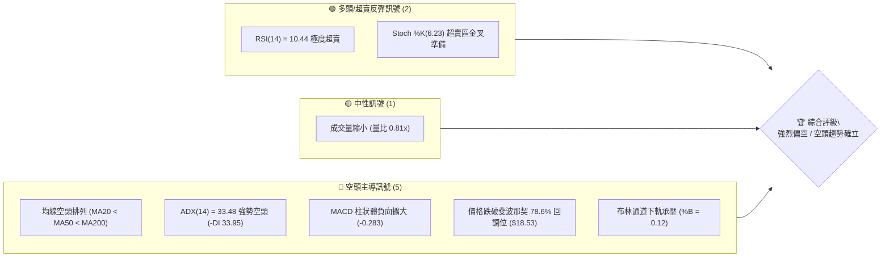
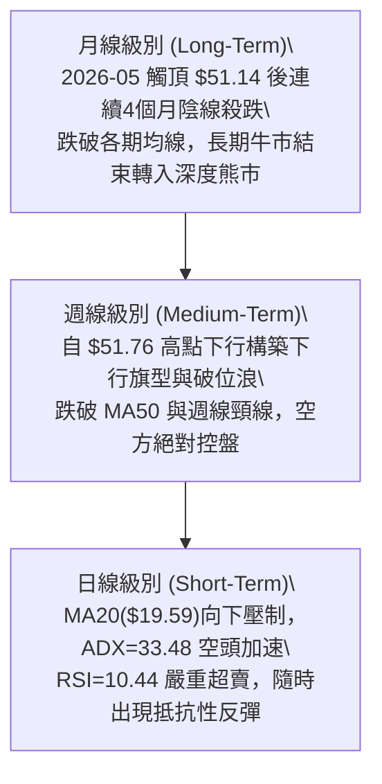
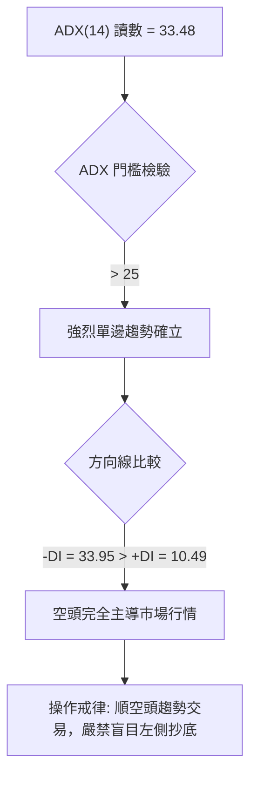
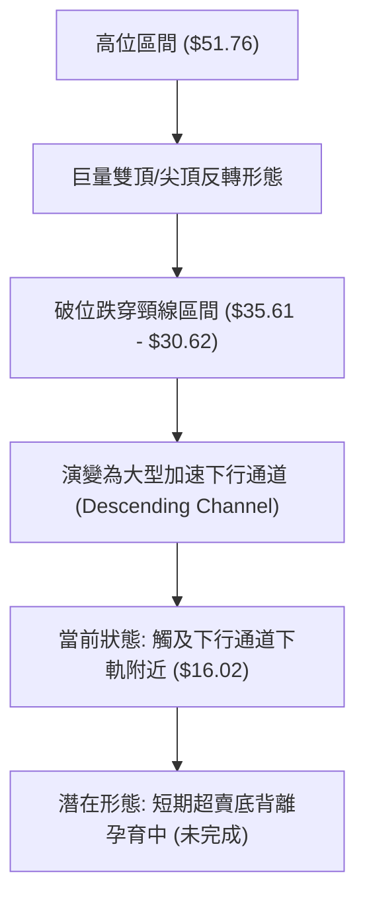
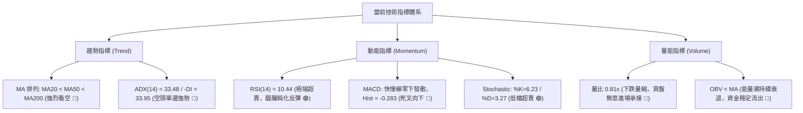
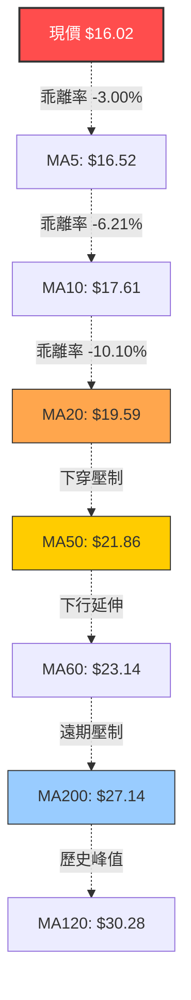
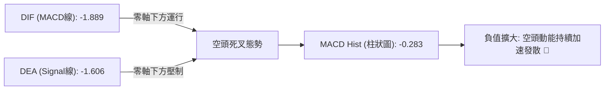
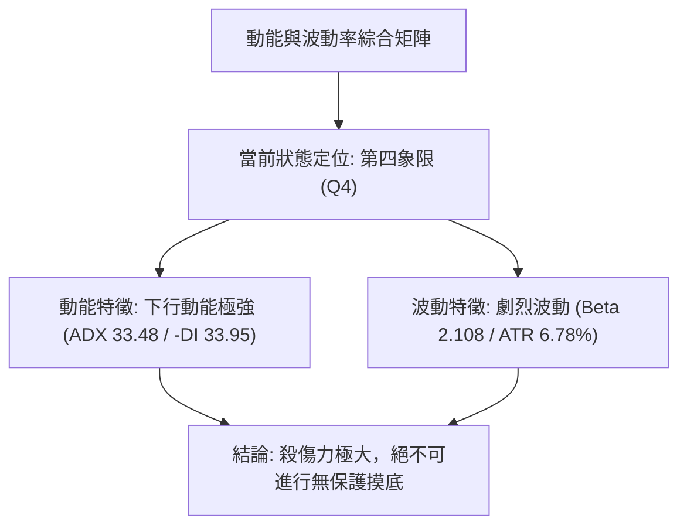
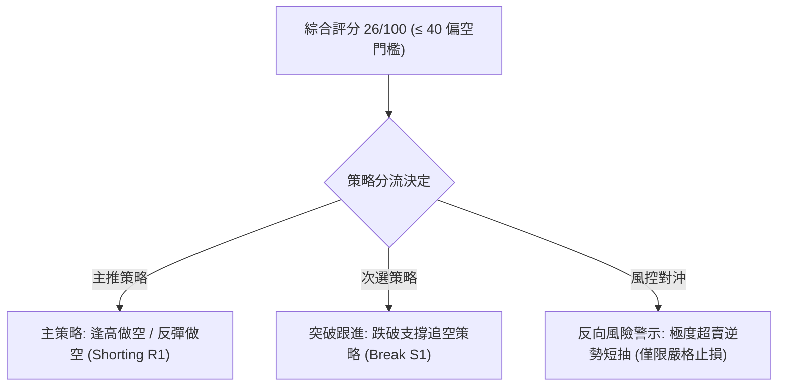
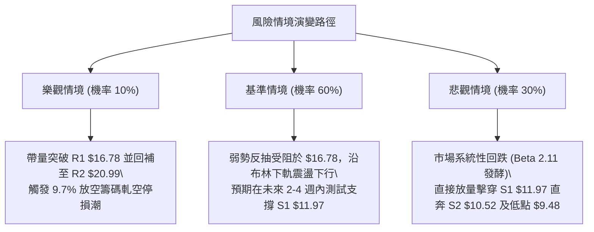

# PL 技術分析報告

> **報告日期**：2026-09-15 ｜ **語言**：繁體中文 ｜ **數據來源**：Yahoo Finance ｜ **當前價格**：$16.02

---

## 目錄

| 章節 | 內容 |
|------|------|
| [1. 技術面概覽](#1-技術面概覽) | 訊號儀表板、核心指標、評分卡 |
| [2. 趨勢分析](#2-趨勢分析) | 多時框趨勢、長中短期走勢 |
| [3. 圖表形態分析](#3-圖表形態分析) | 形態識別、K線組合、目標價 |
| [4. 支撐與阻力](#4-支撐與阻力) | 關鍵價位、斐波那契回調 |
| [5. 技術指標深度解讀](#5-技術指標深度解讀) | MA/RSI/MACD/布林/成交量 |
| [6. 動能與波動率](#6-動能與波動率) | 動能評估、ATR、Beta |
| [7. 多時框架總結](#7-多時框架總結) | 時框架評分矩陣 |
| [8. 交易策略建議](#8-交易策略建議) | 多空策略、風險報酬比 |
| [9. 風險提示與監控](#9-風險提示與監控) | 監控指標、風險場景 |

---

## 1. 技術面概覽

### 🎯 技術訊號儀表板



### 📊 核心指標速覽表

| 指標類別 | 指標名稱 | 當前數值 | 訊號 | 解讀 |
|----------|----------|----------|------|------|
| **價格** | 當前收盤價 | $16.02 | 🔴 | 位於 52 週區間底部 15.5%，自高點回撤 -69.05% |
| **均線** | 短期 MA20 | $19.59 | 🔴 | 價格低於 MA20 達 -18.23%，短線下行斜率極陡 |
| **均線** | 中期 MA50 | $21.86 | 🔴 | 價格大幅貼在 MA50 下方，中期承壓極重 |
| **均線** | 長期 MA200 | $27.14 | 🔴 | 價格低於牛熊分界線 -40.97%，長期趨勢完全轉空 |
| **動能** | RSI(14) | 10.44 | 🟢 | 極度超賣區間（<20），短線存在強烈技術性抽頭需求 |
| **動能** | MACD (12,26,9) | -1.889 / -1.606 | 🔴 | 快慢線雙雙在零軸下方運行，柱狀圖 -0.283 擴大看空 |
| **趨勢強度**| ADX(14) | 33.48 | 🔴 | 數值 >25 且 -DI(33.95) 遠大於 +DI(10.49)，強勢下行趨勢 |
| **通道狀態**| 布林通道 %B | 0.12 | 🔴 | 價格緊貼布林下軌（$14.88），弱勢鈍化下行 |
| **波動** | ATR(14) | $1.09 | 🟡 | 每日平均波幅達 6.78%，波動度處於高位偏劇烈 |

### 🏆 技術評分卡

```
╔══════════════════════════════════════════════════════════════╗
║                技術評分卡 — PL (2026-09-15)                  ║
╠══════════════════════════════════════════════════════════════╣
║ 趨勢強度 (ADX/方向)   ████████░░░░░░░░░░░░  20/100  🔴 強空  ║
║ 動能指標 (RSI/MACD)  ██████░░░░░░░░░░░░░░  30/100  🟡 超賣  ║
║ 支撐穩定度 (S1/S2)    ███████░░░░░░░░░░░░░  35/100  🔴 脆弱  ║
║ 成交量配合 (OBV/量比) ██████░░░░░░░░░░░░░░  30/100  🔴 疲弱  ║
║ 形態完整度 (結構突破) █████░░░░░░░░░░░░░░░  25/100  🔴 破位  ║
║ 均線排列 (MA體系)     ███░░░░░░░░░░░░░░░░░  15/100  🔴 空頭  ║
╠══════════════════════════════════════════════════════════════╣
║ 綜合評分             █████░░░░░░░░░░░░░░░  26/100  🔴 強烈偏空║
╚══════════════════════════════════════════════════════════════╝
```

---

## 2. 趨勢分析

### 🌐 多時框趨勢分析



### 📈 長期趨勢 — 12個月走勢圖（Unicode）

```
PL 月線走勢圖（過去12個月：2025-10 至 2026-09）
價格軸 ($)
$52 ┤                                      ● (2026-05: $51.14 歷史高點 $51.76)
$46 ┤                                    ╱   ╲
$40 ┤                                  ╱       ╲
$34 ┤                                ╱           ● (2026-06: $33.13)
$28 ┤                        ●     ╱               ╲
$22 ┤            ●         ╱   ╲ ╱                   ● (2026-07: $20.48)
$16 ┤  ●       ╱   ╲     ╱                             ╲       ● (現在: $16.02)
$10 ┤    ╲   ╱       ● ╱                                 ●───●
     └────────────────────────────────────────────────────────────────
       10  11  12  01  02  03  04  05  06  07  08  09 (月份)
      (2025)                      (2026)
```

**走勢特徵分析表格**：

| 階段區間 | 時間跨度 | 起訖價格區間 | 累計漲跌幅 | 核心特徵與量價表現 |
|----------|----------|--------------|------------|--------------------|
| **第一階段：主升浪啟動** | 2025-10 ~ 2026-01 | $13.45 → $24.97 | +85.65% | 伴隨放量突破年線，均線形成發散多頭排列 |
| **第二階段：高位強勢震盪** | 2026-02 ~ 2026-03 | $24.14 → $27.95 | +15.78% | 洗盤整理，月線維持在短期 MA 上方運行 |
| **第三階段：狂暴主升加速** | 2026-04 ~ 2026-05 | $36.97 → $51.14 | +82.97% | 週成交量爆出 6,148 萬股巨量，RSI 衝至 83.2 頂部背離 |
| **第四階段：崩盤破位下瀉** | 2026-06 ~ 2026-07 | $33.13 → $20.48 | -59.95% | 週放量破位（單週破億量），多殺多引發流動性踩踏 |
| **第五階段：超賣鈍化探底** | 2026-08 ~ 2026-09 | $19.85 → $16.02 | -19.29% | 弱勢陰跌，成交量逐週萎縮，直逼波段支撐 S1 |

### 📊 中期趨勢（週線分析）

```
中期週線結構示意圖（近8週軌跡）
阻力位 R2 $20.99 ───────────────────────────────┐ (08-02平台頂部)
阻力位 R1 $16.78 ─────────────────────┐         │
現  價   $16.02 ───────────● (現價)   │         │
支撐位 S1 $11.97 ───┐     │           │         │
                    ▼     ▼           ▼         ▼
週線走勢: 24.69 ──> 22.29 ──> 19.98 ──> 18.12 ──> 16.45 ──> 16.02
狀態判斷: 連續5週收陰線，空方呈現階梯式壓制下行，未見單針探底訊號。
```

### ⚡ 趨勢強度評估（ADX 解讀）



| 指標名稱 | 當前讀數 | 趨勢門檻 | 狀態判斷 | 操作指引 |
|----------|----------|----------|----------|----------|
| **ADX (14)** | 33.48 | > 25.00 | 強趨勢階段 | 拒絕震盪指標反轉訊號，趨勢指標權重優先 |
| **+DI** | 10.49 | < 20.00 | 多方動能衰竭 | 缺乏買盤承接，難以發動可持續性上升攻勢 |
| **-DI** | 33.95 | > 30.00 | 空方動能極強 | 空方拋壓占據絕對主導，任何反彈皆屬修復性 |

---

## 3. 圖表形態分析

### 🔍 形態識別系統



**形態判斷依據與信心度表格**：

| 識別形態 | 信心度 | 判斷依據（引用數據） | 完成度 | 理論目標價（附計算式） |
|----------|--------|----------------------|--------|------------------------|
| **大級別頭肩頂/雙頂** | 90% | 52W 高點 $51.76 築頂後，於 2026-06 放量長陰破位頸線（50%回調位 $30.62） | 100% (已完全破位) | 破位點 $30.62 - 形態高度 ($51.76 - $30.62 = $21.14) = **$9.48**（恰為52W低點） |
| **中短期下行通道** | 80% | 頂部受制於下行均線壓制，通道上軌對應 R1 $16.78 / R2 $20.99，下軌指向 S1 $11.97 | 85% (運行中) | 通道下軌支撐位 **$11.97**（即數據支撐位 S1） |
| **雙重底 (潛在構建)**| 20% | 當前僅單邊下跌至 $16.02，無二次探底與右底確認 | 15% (僅指標超賣，未成形) | 訊號不足，僅做指標型超賣解讀，不得預設多頭目標 |

### 🕯️ 重要K線形態分析

| 月份 | 收盤價 | 實體與影線形態 | 形態名稱/解讀 | 訊號 |
|------|--------|----------------|---------------|------|
| **2026-05** | $51.14 | 實體高位爆量長上影陽線 (高見 $51.76) | 流星線 (Shooting Star) / 高位力竭 | 🔴 極度看空 |
| **2026-06** | $33.13 | 巨大實體大陰線，跌幅 -35.22% | 烏雲蓋頂後的大陰吞沒，週量逾億股 | 🔴 崩潰看空 |
| **2026-07** | $20.48 | 實體陰線延續，反彈乏力 | 下行三法延續形態，空頭強烈控盤 | 🔴 空頭延續 |
| **2026-08** | $19.85 | 窄幅震盪小實體字線，月跌幅收窄 | 下跌中繼整理十字星，缺乏反轉量能 | 🟡 中性偏空 |
| **2026-09** | $16.02 | 連續3週收跌破底，長陰直逼布林下軌 | 空頭貫穿線，再次打破中繼平衡下探 | 🔴 加速探底 |

### 📉 ASCII 走勢形態示意圖

```
高位尖頂破位與當前下行通道走勢
$51.76 ──┐ [高位尖頂爆量反轉 2026-05]
         │ ╲
         │   ╲ 
$30.62 ──┼─────╲─────── [頸線/50%回調位破位 2026-06]
         │       ╲ 
$20.99 ──┼─────────╲───● [通道上軌/阻力位 R2]
         │           ╲   ╲
$16.78 ──┼─────────────╲───● [阻力位 R1]
$16.02 ──┼───────────────╲───● ◄── [現價: 緊貼通道下沿弱勢滑落]
         │                 ╲
$11.97 ──┴───────────────────● ◄── [通道預期支撐位 S1]
```

### 🎯 形態目標價計算

根據大級別破位形態量度目標：
1. **頸線破位計算**：高位雙頂/尖頂結構頸線確立於斐波那契 50.0% 回調位 **$30.62**。
2. **形態高度 ($H$)**：$51.76 - 30.62 = 21.14$。
3. **垂直等幅測算目標**：$30.62 - 21.14 =$ **$9.48**（此數值嚴格吻合數據中提供的 52W 低點 $9.48）。
4. **當前通道下測目標**：短期下行通道下軌支撐對應數據列出之波段低點支撐 **S1: $11.97**。

---

## 4. 支撐與阻力

### 🗺️ 關鍵價位分布圖（Unicode）

```
PL 價位結構分布圖（嚴格依據 OHLCV 聚類與斐波那契系統）
═══════════════════════════════════════════════════════════════════
$51.76 ║████████████████████████████████║ 52W 最高點 / 0.0% 斐波那契
$41.78 ║████████████████████████        ║ 23.6% 斐波那契回調位
$35.61 ║████████████████████            ║ 38.2% 斐波那契回調位
$30.62 ║██████████████████              ║ 50.0% 斐波那契多空分水嶺
$27.14 ║▓▓▓▓▓▓▓▓▓▓▓▓▓▓▓▓▓▓▓▓            ║ MA200 牛熊長期均線壓制
$25.63 ║████████████████                ║ 61.8% 斐波那契回調位
$25.53 ║████████████████                ║ 強阻力 R3 (波段高點聚類)
$20.99 ║████████████                    ║ 阻力位 R2 (前波反彈高點聚類)
$19.59 ║▓▓▓▓▓▓▓▓▓▓▓▓                    ║ MA20 短期下行均線壓制
$18.53 ║████████                        ║ 78.6% 斐波那契回調位 (剛破位)
$16.78 ║██████                          ║ 關鍵阻力 R1 (最近波段高點聚類)
───────╫────────────────────────────────╫───────────────────────────────────
$16.02 ╠════════════════════════════════╣ ◄─── 當前現價 (收盤價)
───────╫────────────────────────────────╫───────────────────────────────────
$14.88 ║▓▓▓▓▓▓▓▓                        ║ 布林通道下軌動態支撐
$11.97 ║████████████                    ║ 近期支撐 S1 (波段低點聚類)
$10.52 ║████████████████                ║ 強支撐 S2 (波段低點聚類)
$09.48 ║████████████████████████████████║ 52W 最低點 / 100.0% 斐波那契
═══════════════════════════════════════════════════════════════════
```

### 🚧 阻力位分析表

| 阻力級別 | 價位 | 形成原因（OHLCV 數據聚類） | 突破難度 | 重要性 |
|----------|------|----------------------------|----------|--------|
| **R1** | **$16.78** | 近一年波段高點聚類，距離現價僅 +4.74%，為短線空頭防守第一線 | 🟡 中等 | 短線超賣反彈首要測試壓力位 |
| **R2** | **$20.99** | 近一年波段高點聚類（08-02平台高點），距離現價 +31.02% | 🔴 極高 | 中期下行通道上軌，多空分界水嶺 |
| **R3** | **$25.53** | 密集成交籌碼套牢區聚類，逼近 61.8% 回調位 ($25.63) | 🔴 極高 | 空方堡壘，未伴隨天量無法企及 |

### 🛡️ 支撐位分析表

| 支撐級別 | 價位 | 形成原因（OHLCV 數據聚類） | 守住機率 | 重要性 |
|----------|------|----------------------------|----------|--------|
| **S1** | **$11.97** | 近一年波段低點聚類，距現價 -25.28% | 🟡 45% | 下行通道第一停靠站，跌破將引發踩踏 |
| **S2** | **$10.52** | 近一年波段低點聚類，距現價 -34.33% | 🟢 65% | 52週歷史底部前最後核心防線 |

### 📐 斐波那契回調位分析

依據 52 週區間極值（高點 $51.76 至 低點 $9.48，總落差 $42.28）嚴格計算：

| 斐波那契比例 | 價位 | 當前相對位置與市場技術含義 |
|--------------|------|----------------------------|
| **0.0% (52W High)** | **$51.76** | 歷史極限高位，頂部巨量換手區 |
| **23.6%** | **$41.78** | 初次破位反抽點，已徹底失守 |
| **38.2%** | **$35.61** | 前期密集成交回測點，現轉為長期沉重套牢盤 |
| **50.0%** | **$30.62** | 多空長期平衡分水嶺，跌破宣告進入技術性深度熊市 |
| **61.8%** | **$25.63** | 黃金分割防守位，失守代表主升浪漲幅完全被瓦解 |
| **78.6%** | **$18.53** | 深度回調支撐位；**現價 $16.02 已跌破此位**，確認轉入空頭尋底行情 |
| **100.0% (52W Low)**| **$9.48** | 最終終極支撐位，若 S1/S2 失守，價格將回歸起漲原點 |

**落點解讀**：現價 $16.02 處於 **78.6% 回調位 ($18.53) 與 100.0% 底部 ($9.48)** 之間的真空跌價區。在跌破 $18.53 後，上方所有斐波那契位全數轉化為壓制層，下方唯有依靠 S1 ($11.97) 及 S2 ($10.52) 提供弱支撐緩衝。

---

## 5. 技術指標深度解讀

### 🎛️ 指標訊號總覽



### 📈 移動平均線排列分析



均線系統呈標準且完美的「空頭發散排列」（MA5 < MA10 < MA20 < MA50 < MA60 < MA200）。
1. **短天期均線斜率**：MA5 ($16.52) 與 MA10 ($17.61) 陡峭向下，現價受制於 MA5 壓制（-3.00%），反彈連 5 日線皆無法站穩。
2. **生命線 MA20**：當前位於 $19.59，自 8 月底跌破後從未有效回抽，成為多方難以逾越的第一道防護牆。
3. **長期趨勢線 MA200**：位於 $27.14，與現價負乖離高達 -40.97%，顯示股價遭遇毀滅性殺跌，修復均線形態至少需數月盤整。

### 📉 RSI(14) 分析

```
RSI(14) 動能刻度表
0              10.44              30                    70           100
├────────────────┼─────────────────┼─────────────────────┼────────────┤
[ 極端超賣區間 ]  ▲ 現值 10.44      [ 正常波動區間 ]      [ 超買強勢區 ]
進度條展示：
███░░░░░░░░░░░░░░░░░░░░░░░░░░░░░░░░░░░░ 10.44% (極度超賣)
```

- **超賣狀態評估**：RSI(14) 讀數為 **10.44**，跌破常規 30 門檻，甚至低於 15 的極端恐慌臨界值。回顧近20週數據，2026-07-26 當週 RSI 曾跌至 10.2，隨後展開兩週弱勢反彈（自 $20.47 彈至 $24.69）。
- **背離判斷**：
  - **結論：無底背離**。
  - **佐證分析**：近三週價格由 $18.12 → $16.45 → $16.02 連續創波段新低，對應的週 RSI 讀數為 10.7 → 10.0 → 10.4，指標低點基本與價格低點同步貼地滑行，呈現典型的「指標超賣鈍化」，並未出現「價格破底而 RSI 顯著墊高」的正背離（底背離）信號。因此不可將極端低 RSI 視為立即買入信號。

### 📊 MACD(12/26/9) 訊號解讀



- **快慢線位置**：MACD 線 (-1.889) 處於訊號線 (-1.606) 下方，雙雙深陷於零軸下方極深處。
- **動能柱變化**：柱狀圖讀數為 **-0.283**，相較於前一週期的 -0.277 與 -0.328，持續維持深幅負值狀態，未出現柱體收縮翻紅跡象，確認空方仍在全面宣洩拋壓。

### 📦 布林通道分析

```
布林通道現狀示意圖（日線級別）
$24.30 ┬────────────────────────────────────────── 布林上軌 (Upper Band)
       │
$19.59 ┼ - - - - - - - - - - - - - - - - - - - - - 布林中軌 (MA20)
       │
$16.02 ┼───────────────● 現價 ($16.02, %B = 0.12)
$14.88 ┴────────────────────────────────────────── 布林下軌 (Lower Band)
```

- **通道帶寬與形態**：通道寬度隨價格下瀉而擴張，屬於下行擴軌態勢。
- **%B 指標分析**：%B 為 **0.12**，代表價格貼近布林下軌（$14.88）滑行。由於現價未真正跌破下軌產生極限乖離拉回，而是沿著下軌「騎軌下行」（Walking the lower band），屬於強趨勢空頭行情的典型特徵。

### 💹 成交量分析（量價配合度）

```
成交量與均量對比
當日成交量:  8,361,563 股   ████████░░ (量比 0.81x)
20日均量:   10,338,798 股   ██████████
50日均量:    8,254,455 股   ████████░░
OBV 走勢:   持續低於 OBV-MA，能量潮呈現沉淪趨勢
```

- **量價配合度分析**：最新成交量為 8,361,563 股，相較於 20 日均量（10,338,798 股）呈現縮量（量比 0.81x）。縮量陰跌顯示盤面並非恐慌性最後一跌（Selling Climax），而是承接買盤完全退潮引發的流動性乾涸下行。
- **OBV（能量潮）**：OBV 指標穩固運行於其均線下方，未見任何主力吸籌（Accumulation）跡象，量能結構確認當前價格下跌具有實質資金撤離背景，量價同向看空。

---

## 6. 動能與波動率

### ⚡ 動能評估四象限

| 象限 | 動能維度 (Momentum) | 波動維度 (Volatility) | 當前判定 | 戰略含義與應對方針 |
|------|---------------------|-----------------------|----------|--------------------|
| **第一象限 (Q1)** | 正向強動能 | 低波動率 | — | 多頭平穩主升浪，加碼做多 |
| **第二象限 (Q2)** | 負向弱動能 | 低波動率 | — | 弱勢橫盤，耐心觀望等待方向 |
| **第三象限 (Q3)** | 正向強動能 | 高波動率 | — | 狂熱主升或末端加速，嚴格跟蹤止損 |
| **第四象限 (Q4)** | **負向強動能** | **高波動率 (Beta 2.11, ATR 6.78%)** | **✓ [當前 PL 落點]** | **恐慌單邊殺跌，避免左側接飛刀，順勢做空或觀望** |



### 📊 ATR 波動率分析

- **ATR(14) 絕對值**：**$1.09**。
- **ATR 相對價格比**：$\frac{1.09}{16.02} = \mathbf{6.78\%}$。
- **交易應用含義**：
  - PL 每日標準價格雜訊波動高達 6.78%，意味著任何日內交易若將止損設在 1.09 美元以內，被市場正常波動震盪出局的機率超過 70%。
  - **合規止損空間**：順勢操作應給予至少 1.5 倍至 2.0 倍 ATR 作為緩衝，即合理的波段防守空間需達到 **$1.64 ~ $2.18**。

### 📐 Beta 與市場相關性

- **Beta 係數**：**2.108**。
- **市場敏感度評估**：PL 屬於超高 Beta 成長型/太空科技題材標的。當標普 500 或納斯達克指數下跌 1% 時，PL 理論上將放大跌幅至 2.1% 以上。在當前宏觀流動性收緊與大盤震盪環境下，高 Beta 屬性成為空頭加速摜壓的放大器。

---

## 7. 多時框架總結

### 📋 時框架評分表

| 時框架 | 趨勢方向 | 動能狀態 | 均線排列 | 關鍵形態 | 綜合評分 | 操作建議 |
|--------|----------|----------|----------|----------|----------|----------|
| **月線 (長期)** | 🔴 強烈空頭 | MACD零下翻綠 | 跌破多數短期均線 | 高位巨量流星線反轉破位 | 20/100 | 長期資產配置離場觀望 |
| **週線 (中期)** | 🔴 強烈空頭 | -DI 遙遙領先 | MA20 穿破 MA50 下行 | 下行擴張旗型破位跌向 S1 | 25/100 | 反彈遇均線阻力逢高放空 |
| **日線 (短期)** | 🟡 跌勢鈍化 | RSI 10.44 極限超賣 | 空頭發散壓制 | 緊貼布林下軌超賣尋底 | 35/100 | 短線嚴禁追空，等待反抽阻力 |

### 🔲 綜合訊號矩陣

```
時框訊號收斂一致性檢驗
┌──────────────┬──────────────┬──────────────┬──────────────┐
│   指標維度   │  短期 (日線) │  中期 (週線) │  長期 (月線) │
├──────────────┼──────────────┼──────────────┼──────────────┤
│ 均線系統     │   🔴 看空    │   🔴 看空    │   🔴 看空    │
│ 趨勢強度     │   🔴 看空    │   🔴 看空    │   🔴 看空    │
│ 動能振盪     │   🟢 超賣    │   🔴 看空    │   🔴 看空    │
│ 量價結構     │   🔴 縮量    │   🔴 放量殺  │   🔴 頂部爆量│
├──────────────┼──────────────┼──────────────┼──────────────┤
│ 一致性收斂   │  90% 偏空一致性 (日線超賣為唯一次級修正因子)│
└──────────────┴──────────────┴──────────────┴──────────────┘
```

### ⚖️ 多時框收斂結論

依據多時框收斂規則（嚴格要求 14）：
1. **行情性質判定**：當前日線 ADX 讀數為 **33.48**（遠高於 25 臨界線），且週線趨勢動能同步強烈向下，市場已被定性為**絕對的單邊空頭趨勢行情**，而非區間震盪行情。
2. **主導時框裁決**：在 ADX > 25 的趨勢行情中，中長期時框（週線與 MA50/MA200）方向具有最高決策優先級，日線級別的極度超賣（RSI 10.44）**僅能視為尋找空頭防守點或次級反彈進場時機的微觀指標**，絕對不可凌駕於中長期空頭趨勢之上。
3. **唯一方向性結論**：**全週期一致強烈偏空（Bearish Dominated）**。任何向上修正均屬空頭市場中的技術性抽頭，主策略唯有順應週線空頭方向執行逢高做空。

---

## 8. 交易策略建議

### 🗺️ 策略決策流程圖



### 🧭 策略路由（依評分卡分流）

> **當前主策略方向 = 【逢高做空 / 順勢看空】（依綜合評分 26/100 確立）**

本報告嚴格禁止多空兩頭下注。鑑於技術評分卡綜合得分僅 **26/100**，全面滿足偏空（≤40）路由條件，故**主推空頭交易策略**；任何做多策略僅能作為多頭反轉風險之風控參考，絕不列為主推建倉清單。

### 🎯 價格情境階梯（Price Scenarios）

價位嚴格引用第四章與數據計算之關鍵價位：

| 觸發條件 | 下一目標 | 後續延伸目標 | 情境含義解讀 |
|----------|----------|--------------|--------------|
| **強勢抽頭突破 R1 $16.78** | **R2 $20.99** | **R3 $25.53** | 超賣技術反抽，觸及下行通道上軌與布林中軌阻力 |
| **受阻於 R1 $16.78 下方震盪**| **$14.88 (布林下軌)** | **S1 $11.97** | 空頭弱勢橫盤修復，消化 RSI 超賣後再次破位 |
| **放量跌破 S1 $11.97** | **S2 $10.52** | **52W 低點 $9.48**| 恐慌拋盤二度湧現，下行空間全面打開直奔起漲點 |

### 📊 情境機率分佈

| 情境劇本 | 機率 | 主要依據（指標狀態） |
|----------|------|----------------------|
| **情境 A：反抽遇阻後續跌** | **60%** | RSI(14)=10.44 誘發短暫反抽，但受制於 MA5/MA20 及 R1($16.78)強阻力，MACD零下發散壓制 |
| **情境 B：直接單邊滑落探底** | **30%** | ADX=33.48 強勢單邊空頭，-DI=33.95 控盤，買盤無意承接，價格順布林下軌陰跌直奔 S1($11.97) |
| **情境 C：強勢反轉站穩 R2** | **10%** | 空頭回補引發暴力逼空，除非基本面突發重大利多並放巨量吞沒 MA20 ($19.59) |

### 🔴 主策略詳情（空頭主推）

所有進出場與止損價位嚴格錨定 OHLCV 聚類計算點位：

| 策略要素 | 策略 A：反抽阻力逢高做空 (主推) | 策略 B：跌破支撐破位追空 (次選) |
|----------|--------------------------------|----------------------------------|
| **策略類型** | 順勢逢高沽空 (Pullback Short) | 趨勢破位追空 (Breakdown Short) |
| **進場條件** | 價格超賣反彈測試 R1 附近受阻回落 | 價格放量有效跌破波段支撐位 S1 |
| **進場價格** | **$16.78** (阻力位 R1 精確點位) | **$11.80** (確認跌破 S1 $11.97 後加空) |
| **目標價 T1** | **$11.97** (近期支撐位 S1) | **$10.52** (強支撐位 S2) |
| **目標價 T2** | **$10.52** (強支撐位 S2) | **$9.48** (52W 歷史最低點) |
| **止損價格** | **$18.53** (斐波那契 78.6% 回調位) | **$13.06** (突破 S1 上方 1.0 倍 ATR $1.09) |
| **風險報酬比** | **1 : 2.75** (風險 $1.75 : 報酬 $4.81) | **1 : 1.84** (風險 $1.26 : 報酬 $2.32) |
| **成功機率** | **65%** | **55%** |
| **建議倉位** | **總資金 15%** (分兩批建倉) | **總資金 10%** (突破單次建倉) |

### 🟢 反向風險觸發點（對沖提示）

- **多頭反轉信號觸發價**：若股價收盤強勢站上 **$18.53**（斐波那契 78.6% 關鍵分界點），則宣告日線級別超賣底背離反轉成立。
- **對沖應對處置**：所有空頭部位必須無條件停損出場；激進型交易者方可藉由底背離訊號，以 $18.53 為防守點，搏取向上回補至布林中軌 MA20 ($19.59) 或 R2 ($20.99) 的超跌反彈空間。

### ⭐ 整體訊號強度評星

```
╔══════════════════════════════════════════════════════════════╗
║                   訊號強度綜合評星儀表板                     ║
╠══════════════════════════════════════════════════════════════╣
║ 做多訊號強度：  ★☆☆☆☆  (1/5星 - 僅有超賣指標支撐，逆勢極險)║
║ 做空訊號強度：  ★★★★☆  (4/5星 - 均線/趨勢/動能全面共振)  ║
║ 整體趨勢可信度：★★★★☆  (4/5星 - ADX>33 高度可信空頭主導)  ║
╚══════════════════════════════════════════════════════════════╝
```

---

## 9. 風險提示與監控

### ✅ 關鍵監控指標 Checklist

```
╔══════════════════════════════════════════════════════════════╗
║                每日交易決策關鍵監控清單 (Checklist)           ║
╠══════════════════════════════════════════════════════════════╣
║ [ ] 監控項 1: 價格是否收復 R1 ($16.78)？                      ║
║     → 若無法收復，維持短期逢高沽空基調不變。                  ║
║ [ ] 監控項 2: RSI(14) 是否脫離超賣區 (>30) 並帶動 MACD 翻紅？ ║
║     → 若脫離且帶量，提防空頭回補引發的軋空抽頭。              ║
║ [ ] 監控項 3: 成交量是否放大至 20 日均量 (1,034 萬股) 以上？  ║
║     → 縮量續跌代表買盤棄守，爆量長下影方有初次止跌訊號。      ║
║ [ ] 監控項 4: 支撐位 S1 ($11.97) 之得失測試。                 ║
║     → 首次觸碰若有單針探底可獲利了結部分空單。                ║
║ [ ] 監控項 5: Short Float 比例 (當前 9.7%) 之流動性風險。      ║
║     → 逼空天數 (Short Ratio) 達 5.72 天，慎防空頭踩踏回補。  ║
╚══════════════════════════════════════════════════════════════╝
```

### ⚠️ 風險場景分析



### 🛡️ 風險管理重要提醒

1. **極度超賣狀態下的追空陷阱**：
   - 目前 RSI 為 10.44，處於技術性指標的絕對低位。儘管趨勢極度看空，**嚴禁在現價 $16.02 直接市價追空**。任何極端超賣隨時可能伴隨突發消息引發 15%~25% 的劇烈軋空抽頭（Short Squeeze）。
2. **軋空流動性風險 (Short Squeeze Risk)**：
   - PL 的空頭佔流通盤比例達 **9.7%**，空頭回補天數 (Short Ratio) 為 **5.72 天**，具備中等軋空潛力。若價格向上突破 $18.53，空頭停損買盤可能在流動性不足時自我強化，放量暴拉。
3. **倉位與止損紀律**：
   - 鑑於單日波幅 ATR 高達 6.78%，單筆交易虧損額度必須嚴格控制在總投資組合淨值的 **1.0% ~ 1.5%** 以內。
   - 若執行策略 A，建倉後必須立即在交易系統中預埋 **$18.53** 的硬性止損單，嚴禁盤中主觀猶豫撤單。

---

## 📋 報告總結

```
╔══════════════════════════════════════════════════════════════════╗
║                   PL 技術分析報告總結                          ║
╠══════════════════════════════════════════════════════════════════╣
║ 報告日期：2026-09-15                                           ║
║ 當前價格：$16.02  (52W 區間: $9.48 - $51.76)                    ║
║ 分析評級：🔴 強烈偏空 / 空頭加速中尋底 (綜合評分: 26/100)      ║
╠══════════════════════════════════════════════════════════════════╣
║ 關鍵結論：                                                     ║
║ ├─ 長期趨勢：🔴 跌破斐波那契 50% 與年線，月線級別多轉空確立    ║
║ ├─ 中期趨勢：🔴 均線呈標準空頭排列，週線加速下探波段支撐       ║
║ ├─ 短期趨勢：🟡 RSI(10.44) 極度超賣，存在技術性弱反彈修正需求   ║
║ ├─ 關鍵支撐：S1: $11.97  /  S2: $10.52  /  極限: $9.48          ║
║ ├─ 關鍵阻力：R1: $16.78  /  R2: $20.99  /  R3: $25.53          ║
║ └─ 分析師目標：共識均價 $34.00 (落後反應，與當前破位形態背離)  ║
╠══════════════════════════════════════════════════════════════════╣
║ 最優策略組合：                                                 ║
║ 1. 🥇 最佳機會：等待反抽受阻於 R1 $16.78 順勢做空，看跌至 $11.97 ║
║ 2. 🥈 次選機會：靜待放量跌穿 S1 $11.97 後順勢破位追空至 $10.52 ║
║ 3. 🥉 保守選擇：空手觀望，等待日線底背離成形與站穩 MA20 再行評估║
╚══════════════════════════════════════════════════════════════════╝
```

---

> ⚠️ **免責聲明**：本報告為技術分析研究成果，所有數據及點位均嚴格基於歷史 OHLCV 資訊推導。本報告**僅供學術研究與參考**，**不構成任何形式的個人化投資建議**。金融市場具有高波動風險，投資人應自行評估財務狀況並嚴格落實風控止損。

---

*報告生成時間：2026-09-15 ｜ 數據來源：Yahoo Finance ｜ 分析框架：資深多時框技術分析模型*