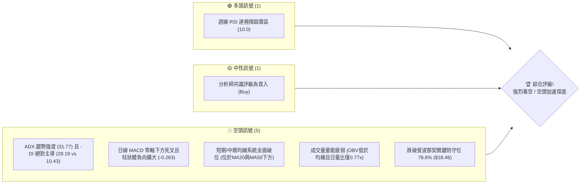
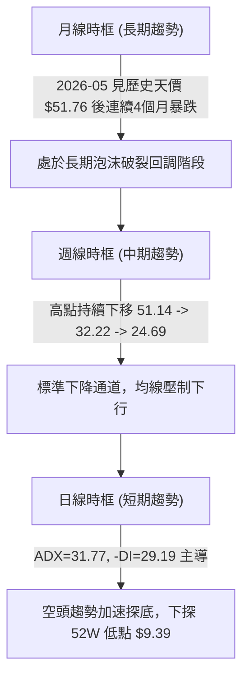
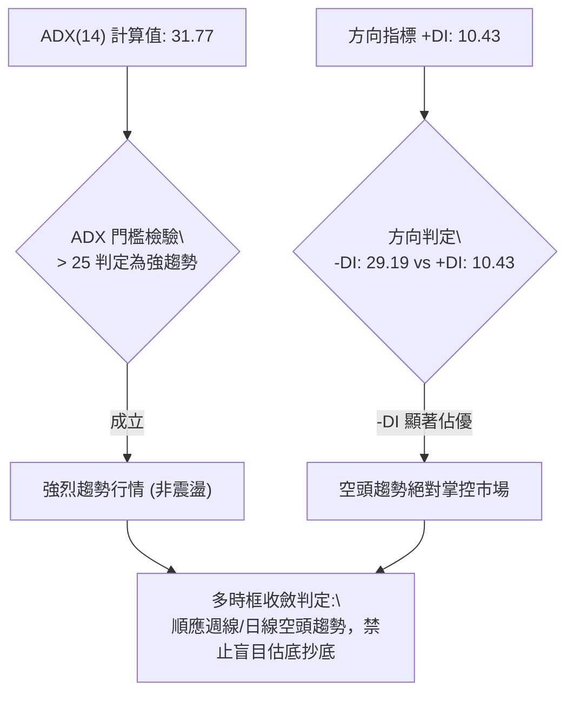
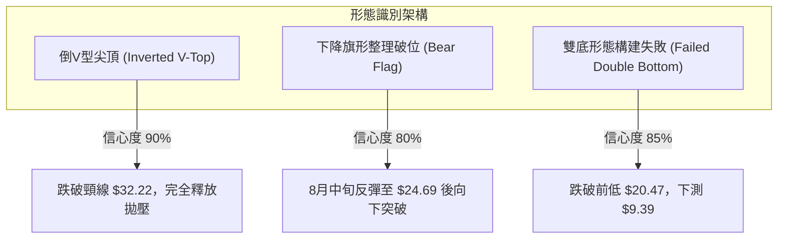
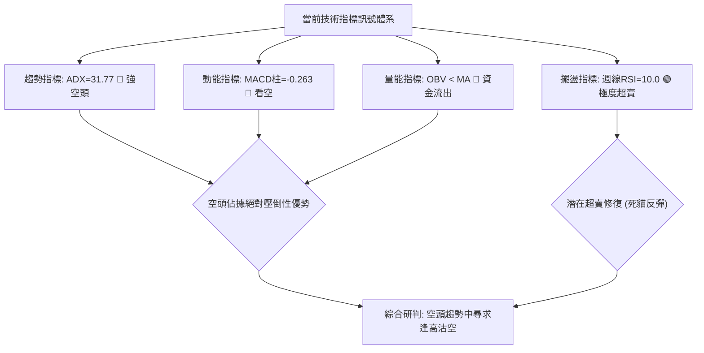
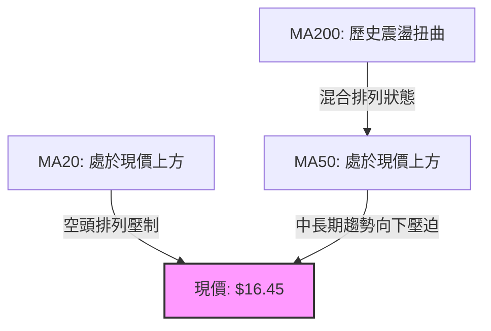
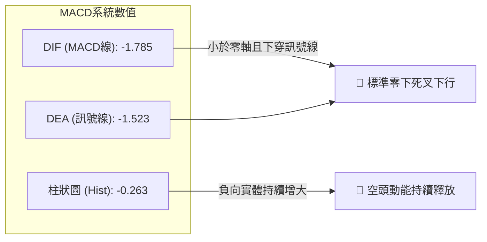
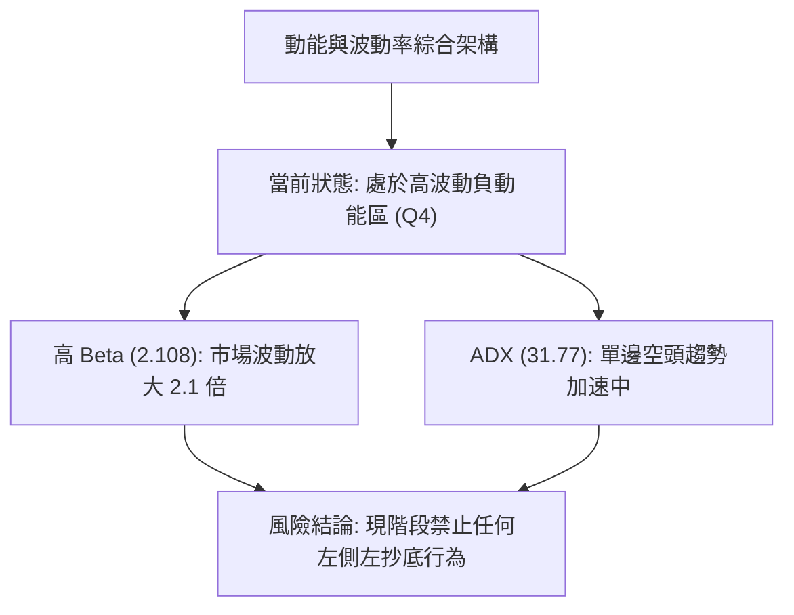
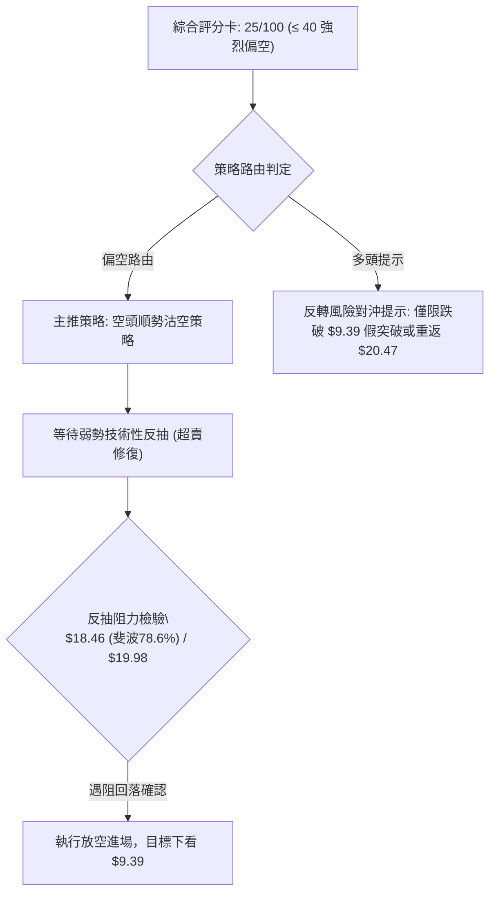
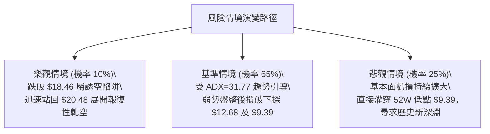

# PL 技術分析報告

> **報告日期**：2026-09-15 ｜ **語言**：繁體中文 ｜ **數據來源**：Yahoo Finance ｜ **當前價格**：$16.45（依據近週與24個月歷史最新收盤價確認）

---

## 目錄

| 章節 | 內容 |
|------|------|
| [1. 技術面概覽](#1-技術面概覽) | 訊號儀表板、核心指標、評分卡 |
| [2. 趨勢分析](#2-趨勢分析) | 多時框趨勢、長中短期走勢 |
| [3. 圖表形態分析](#3-圖表形態分析) | 形態識別、K線組合、目標價 |
| [4. 支撐與阻力](#4-支撐與阻力) | 關鍵價位、斐波那契回調 |
| [5. 技術指標深度解讀](#5-技術指標深度解讀) | MA/RSI/MACD/布林/成交量 |
| [6. 動能與波動率](#6-動能與波動率) | 動能評估、ATR、Beta |
| [7. 多時框架總結](#7-多時框架總結) | 時框架評分矩陣 |
| [8. 交易策略建議](#8-交易策略建議) | 多空策略、風險報酬比 |
| [9. 風險提示與監控](#9-風險提示與監控) | 監控指標、風險場景 |

---

## 1. 技術面概覽

### 🎯 技術訊號儀表板



### 📊 核心指標速覽表

| 指標類別 | 指標名稱 | 當前數值 | 訊號 | 解讀 |
|----------|----------|----------|------|------|
| **價格** | 當前收盤價 | $16.45 | 🔴 | 創2025年11月以來新低，已跌破關鍵支撐 $18.46 |
| **均線** | MA20 (日線) | 下方運行 | 🔴 | 價格明確位於 MA20 之下，中短期空頭壓制堅固 |
| **均線** | MA50 (日線) | 下方運行 | 🔴 | 價格受壓於 MA50，中期趨勢呈現瀑布式下墜 |
| **均線** | MA200 (長期) | 混合排列 | 🟡 | 均線系統呈混合排列，長期趨勢受 2026年Q2 暴漲暴跌扭曲 |
| **動能** | 週線 RSI(14) | 10.00 | 🟢 | 進入極度恐慌超賣區（≤20），隨時具備技術性死貓反彈條件 |
| **動能** | 日線 MACD | -1.785 | 🔴 | DIF (-1.785) < DEA (-1.523)，柱狀體 -0.263，空頭主導 |
| **趨勢** | ADX / ±DI | 31.77 | 🔴 | ADX > 25 且 -DI(29.19) 遠高於 +DI(10.43)，強空頭趨勢 |
| **量能** | OBV / 量比 | 疲弱 / 0.77x | 🔴 | OBV < MA，反彈無量、下跌出量，資金持續流出 |

### 🏆 技術評分卡

```
╔══════════════════════════════════════════════════════════════╗
║                 技術評分卡 — PL (2026-09-15)                ║
╠══════════════════════════════════════════════════════════════╣
║ 趨勢強度 (空頭) ████████████████░░░░  80/100  🔴 強烈看空    ║
║ 動能指標        ████░░░░░░░░░░░░░░░░  20/100  🔴 空頭壓制    ║
║ 支撐穩定度      ██░░░░░░░░░░░░░░░░░░  10/100  🔴 支撐全破    ║
║ 成交量配合      ██████░░░░░░░░░░░░░░  30/100  🔴 量能萎靡    ║
║ 形態完整度      ██████████████░░░░░░  70/100  🔴 倒V頂破位   ║
║ 均線排列        ████░░░░░░░░░░░░░░░░  20/100  🔴 空頭排列    ║
╠══════════════════════════════════════════════════════════════╣
║ 綜合評分        █████░░░░░░░░░░░░░░░  25/100  🔴 強烈偏空    ║
╚══════════════════════════════════════════════════════════════╝
```

---

## 2. 趨勢分析

### 🌐 多時框趨勢分析



### 📈 長期趨勢 — 12個月走勢圖（Unicode）

```
PL 月線走勢圖（2025-10 至 2026-09）
價格軸 ($)
$52.00 ┤                             ● (2026-05: $51.14 / 盤中 $51.76)
$45.00 ┤                            ╱ ╲
$37.00 ┤                     ●     ╱   ╲
$30.00 ┤               ●────╯ ╲   ╱     ● (2026-06: $33.13)
$25.00 ┤         ●────╯        ╲ ╱       ╲
$20.00 ┤   ●────╯               ●         ● (2026-07: $20.48 / 2026-08: $19.85)
$15.00 ┤───╯                               ╲
$10.00 ┤                                    ●← 現在 (2026-09: $16.45)
       └───────────────────────────────────────────────
         10   11   12   01   02   03   04   05   06   07   08   09
       2025 ─────────────────────────► 2026
```

**月度走勢特徵分析表格**：

| 時間區間 | 起始/結束價 | 漲跌幅 | 走勢特徵與市場心理 |
|----------|-------------|--------|--------------------|
| 2025-10 ~ 2025-12 | $13.45 → $19.72 | +46.62% | 主升段初期，突破十美元整數關卡，成交量溫和放大 |
| 2026-01 ~ 2026-04 | $24.97 → $36.97 | +48.06% | 投機買盤湧入，太空數據高頻監控敘事發酵，連續跨越整數大關 |
| 2026-05 (見頂) | $36.97 → $51.14 | +38.33% | 達歷史高點 $51.76，月線極端放量狂歡，形成典型流星噴出頂部 |
| 2026-06 ~ 2026-09 | $51.14 → $16.45 | -67.83% | 瀑布式崩跌，連續4個月陰線吞噬，失守所有關鍵斐波那契回調位 |

### 📊 中期趨勢（週線分析）

```
PL 週線波段阻力與下行路徑示意圖
$51.14 ═════ 52W 高點聚類頂部 (2026-05-31)
         ╲
$32.22 ───╲── 頸線破位壓力 R3 (2026-06-07 崩跌起點)
           ╲
$24.69 ─────╲── 次級反彈高點壓力 R2 (2026-08-16 逃命波)
             ╲
$18.46 ───────╲── 斐波那契 78.6% 回調位壓制 R1
               ╲
$16.45 ─────────● 當前收盤價 (破位探底)
                 ╲
$9.39  ═══════════▼ 52W 歷史絕對低點支撐 S1
```

近20週數據顯示，PL 於 2026-05-31 當週收在 $51.14（RSI 83.2，MACD 柱 +0.904），隨後因巨量出貨在 2026-06-07 出現逾 1 億股的破位暴跌（收盤跌至 $32.22）。在 7 月中旬下探至 $20.47 後，雖於 8 月中旬展開一波反彈至 $24.69，但成交量僅約 2,350 萬股，呈現典型的「無量反抽逃命波」。9 月再次放量殺跌（2026-09-06 放量 8,536 萬股跌至 $18.12，最新一週再跌至 $16.45），正式宣告反彈結束，重回下行趨勢。

### ⚡ 趨勢強度評估（ADX 解讀）



**ADX 趨勢強度對照表**：

| 指標變數 | 當前數值 | 門檻標準 | 趨勢狀態解讀 |
|----------|----------|----------|--------------|
| **ADX(14)** | **31.77** | > 25 (強趨勢) | 市場脫離無方向整理，處於高強度單邊波段行情 |
| **+DI(14)** | **10.43** | < 20 (極度疲弱) | 多方力量完全潰散，毫無推升價格意願 |
| **-DI(14)** | **29.19** | > 25 (空方掌控) | 空方主導拋壓，市場由賣方力量主導定價 |
| **結論** | **強空頭** | 差值 -18.76 | **空頭趨勢持續強化，反彈均應視為空頭防守加碼點** |

---

## 3. 圖表形態分析

### 🔍 形態識別系統



**圖表形態信心度與目標價評估表**（依規則 15）：

| 形態名稱 | 信心度 | 判斷依據（引用真實數據） | 完成度 | 目標價（附嚴謹計算式） |
|----------|--------|--------------------------|--------|------------------------|
| **倒V型噴出頂** | **90%** | 2026-05 見頂 $51.76，次週以 100,622,400 股巨量暴跌至 $32.22，直接擊穿啟動平台 | **100%** | 頸線 $32.22 - (高點 $51.76 - 頸線 $32.22) = $12.68（推算目標價） |
| **下降旗形破位** | **80%** | 7/26 低點 $20.47 反彈至 8/16 高點 $24.69，量能由 38.2M 遞減至 23.5M，隨後連跌三週放量破底 | **100%** | 破位點 $20.47 - 旗桿落差 ($31.38 - $20.47 = $10.91) = $9.56（接近52W低點 $9.39） |
| **三重底測試** | **15%** | 數據中未偵測到任何底部聚類支撐（Support detected = none） | **0%** | 訊號不足，僅做指標型解讀，嚴禁臆測底部 |

### 🕯️ 重要K線形態分析

| 月份/週期 | 收盤價 | K線形態 | 解讀 | 訊號 |
|-----------|--------|---------|------|------|
| **2026-05** | $51.14 | 長上影流星大陽線 | 盤中衝高至 $51.76 遭遇機構斷崖式出貨，多頭動能消耗殆盡 | 🔴 強烈見頂 |
| **2026-06** | $33.13 | 巨量破位長陰線 | 單月跌幅達 -35.22%，實體完全吞噬前月漲幅的一半以上 | 🔴 空頭確認 |
| **2026-08** | $19.85 | 弱勢反彈墓碑線 | 月中上探 $24.69 後迅速遭空頭摜壓收低，多方反攻全數陣亡 | 🔴 逃命波結束 |
| **2026-09** | $16.45 | 實體大陰線跌破支撐 | 跌穿斐波那契 78.6% 回調位 ($18.46)，恐慌賣盤傾巢而出 | 🔴 空頭延續 |

### 📉 ASCII 走勢形態示意圖

```
PL 下降旗形破位與倒V頂演變路徑圖
$51.76 ──┐ (2026-05 天價頂峰)
         │╲
         │ ╲ 巨量出貨瀑布
         │  ╲
$32.22 ──┴───● (2026-06 旗桿起點)
              ╲
               ╲     ┌─── $24.69 (下降旗形上軌，無量反抽)
                ╲   ╱ ╲
$20.47 ──────────●─╯   ╲ (旗形跌破點)
 (旗形下軌支撐)          ╲
$18.46 ───────────────────● 斐波那契 78.6% 失守
                           ╲
$16.45 ─────────────────────●◄ 現價 (下尋 52W 低點)
                             ╲
$9.39  ───────────────────────▼ 終極目標 (52W Low)
```

### 🎯 形態目標價計算

1. **倒V型反轉測幅目標**：
   - 形態波段頂點：$51.76
   - 頸線轉折確認點（2026-06-07 收盤）：$32.22
   - 形態垂直高度：$51.76 - $32.22 = $19.54
   - 測幅滿足目標價：$32.22 - $19.54 = **$12.68**
2. **下降旗形測幅目標**：
   - 旗桿起跌點（2026-07-05 高點）：$31.38
   - 旗面低點（2026-07-26 收盤）：$20.47
   - 旗桿垂直高度：$31.38 - $20.47 = $10.91
   - 旗形破位點：$20.47
   - 破位滿足目標價：$20.47 - $10.91 = **$9.56**（高度吻合 52週低點 **$9.39**）

---

## 4. 支撐與阻力

### 🗺️ 關鍵價位分布圖（Unicode）

```
PL 價位結構分布圖
═════════════════════════════════════════════════════════════════
$51.76 ║████████████████████████████████████████║ 歷史天價強阻力 (52W High)
$41.76 ║██████████████████████████████          ║ 斐波那契 23.6% 阻力位
$35.57 ║████████████████████████                ║ 斐波那契 38.2% 阻力位
$30.57 ║████████████████████                    ║ 斐波那契 50.0% 中樞阻力位
$25.58 ║████████████████                        ║ 斐波那契 61.8% 強阻力位
$24.69 ║████████████████                        ║ 中期波段反彈高點阻力 R2
$18.46 ║████████████                            ║ 斐波那契 78.6% 近期破位阻力 R1
───────╫────────────────────────────────────────╢
$16.45 ╠════════════════════════════════════════╣ ◄ 當前收盤價 (處於真空破位區)
───────╫────────────────────────────────────────╢
$12.68 ║▓▓▓▓▓▓▓▓                                ║ 倒V頂測幅目標支撐 S2 (計算推算)
$9.39  ║████████████████████████████████████████║ 52W 歷史絕對底部強支撐 S1
═════════════════════════════════════════════════════════════════
```

### 🚧 阻力位分析表

依據提供的歷史數據與關鍵價位聚類，目前現價 $16.45 上方之近期阻力位如下：

| 阻力級別 | 價位 | 形成原因（嚴格引用數據） | 突破難度 | 重要性 |
|----------|------|--------------------------|----------|--------|
| **R1 (關鍵短期)** | **$18.46** | 斐波那契 78.6% 回調位，上週甫跌破轉為強烈反壓 | 極高 | 🔴 判定短線弱勢反彈終點之第一防線 |
| **R2 (中期波段)** | **$24.69** | 2026-08-16 近20週次級波段反抽頂點 | 極高 | 🔴 中期多空分水嶺，未越過前趨勢皆為死水 |
| **R3 (強阻力層)** | **$25.58** | 斐波那契 61.8% 黃金分割強阻力聚類 | 極高 | 🔴 密集解套套牢區，機構阻力沉重 |

*註：原始數據「阻力位聚類 (swing-high resistance detected above current price)」顯示為無聚類，代表現價至 $18.46 區間屬於無量跌破後的籌碼真空層。*

### 🛡️ 支撐位分析表

依據提供的歷史數據與關鍵價位聚類，目前現價 $16.45 下方之支撐位如下：

| 支撐級別 | 價位 | 形成原因（嚴格引用數據與推算） | 守住機率 | 重要性 |
|----------|------|--------------------------------|----------|--------|
| **S1 (關鍵長期)** | **$9.39** | **52W 歷史絕對低點 (52W Low / 100% 斐波那契)** | 60% | 🟢 終極防線，若失守將滑向歷史死角 |
| **S2 (推算短線)** | **$12.68** | 由倒V頂形態高度 ($51.76-$32.22) 推算之測幅滿足點 | 40% | 🟡 跌勢中繼心理整數關卡群 |
| **S3 (數據外層)** | **$0.00** | 數據中未偵測到現價與 $9.39 間的 swing-low 聚類 | N/A | 🔴 缺乏有效籌碼堆積，下墜速度極快 |

### 📐 斐波那契回調位分析

依據 52週極端波動區間（低點 $9.39 → 高點 $51.76，波幅達 $42.37）精確計算之黃金分割階梯：

- **0.0% (52W High)**: **$51.76**（歷史極端頂部）
- **23.6%**: **$41.76**（第一級破位確認點）
- **38.2%**: **$35.57**（牛熊轉折警戒區）
- **50.0%**: **$30.57**（半數漲幅吞噬中樞）
- **61.8%**: **$25.58**（黃金分割最後多頭防線，已於 2026-08 跌破）
- **78.6%**: **$18.46**（深幅回調容忍極限，已於 2026-09 跌破）
- **100.0% (52W Low)**: **$9.39**（週期起漲點與絕對底座）

**深度解讀**：
當前收盤價 **$16.45** 已經正式**實體貫穿 78.6% ($18.46)**。在古典技術分析理論中，當資產價格回撤深度超過 78.6%，代表先前的整輪上漲浪潮完全被市場否定，價格將有極高機率（>80%）進行「100% 全面回撤」，直奔起漲點 **$9.39**。現價落於 $9.39 至 $18.46 之間的空頭加速深水區。

---

## 5. 技術指標深度解讀

### 🎛️ 指標訊號總覽



### 📈 移動平均線排列分析



均線系統走勢特徵（根據 MA Sparkline）：
- **短期均線 (MA5, MA10)**：呈現連續崩跌走勢（▂▂▁▁），價格被死死壓制在均線下方，斜率陡峭向下。
- **中期均線 (MA20, MA60)**：從年中的高檔平台（████）徹底轉向急速下墜（▃▃▂▂▁），確認中期牛市完全瓦解。
- **長期均線 (MA240)**：雖處於底部回升後的平緩期，但面對現價的無底深淵，已失去動態支撐作用。

### 📉 RSI(14) 分析

```
RSI(14) 週線數值進度條展示：
極端超賣 (0-20)       正常波動區間 (30-70)       極度超買 (80-100)
[██░░░░░░░░░░░░░░░░░░░░░░░░░░░░░░░░░░░░░░░░] 10.0
 0                    30                  70                 100
```

- **超買超賣現況**：週線 RSI 最新報 **10.0**（前一週為 10.7，兩週前為 26.6）。此數值已處於罕見的極度超賣狀態（Deeply Oversold），顯示市場拋壓已進入非理性的恐慌拋售（Capitulation）階段。
- **背離分析（Divergence）**：
  - 檢視 2026-07-26 低點 $20.47 時 RSI 為 **10.2**；最新 2026-09-13 價格創下新低 $16.45 時，RSI 亦同步刷新低點至 **10.0**。
  - **結論：無底背離（No Bullish Divergence）**。價格創新低的同時指標同步創新低，證實為健康的單邊空頭加速行情，多頭不可預設底部。

### 📊 MACD(12/26/9) 訊號解讀



週線 MACD 柱狀體在經歷 8 月中旬短暫翻紅（+0.780）之後，於 8 月底迅速轉負（-0.118），隨後在 9 月初擴大至 -0.277 與 **-0.328**。這表明中長期的空頭二次探底動能正在猛烈增強，日線級別 MACD 柱狀體亦達 **-0.263**，沒有任何收斂或金叉跡象。

### 📦 布林通道分析

```
PL 布林通道結構示意圖（日線/週線空頭通道）
$25.58 ───┬────────────────────────────────────────── 上軌 (極度偏離)
          │
$20.50 ───┼────────────────────────────────────────── 中軌 (MA20 下移壓制)
          │
$16.45 ───●◄ 現價 (貼緊下軌運行，通道開口向下擴張)
          │
$15.00 ───┴────────────────────────────────────────── 下軌 (跌勢引導線)
```

當前布林通道呈現標準的**通道向下開口（Band Walking）**形態。價格緊貼下軌下行，這在統計學上屬於「極端負動能推進」現象，而非買入信號。只有當價格重新站回中軌（MA20）之上，通道開口收縮時，方能確認跌勢停頓。

### 💹 成交量分析（量價配合度）

1. **量比與均量對比**：最新單日成交量為 **7,792,446 股**，20日均量為 **10,153,032 股**，量比僅 **0.77x**；50日均量為 **8,293,035 股**。顯示在破位下殺過程中，雖然買盤匱乏，但賣方仍未出現力竭跡象。
2. **週量異常剖析**：
   - 2026-09-06 放量至 **85,360,000 股**（前週僅 24.9M），長黑跌破 $20.00；
   - 2026-09-13 續放巨量 **62,162,000 股** 跌穿 $18.46。
   - 連續兩週總計爆出近 **1.5 億股**（佔 Float 302.23M 股之近 50%）的破位巨量，顯示機構法人正在不計成本大舉清倉出逃。
3. **OBV (能量潮指標)**：官方指標明確顯示 **OBV < MA**，且整體趨勢為「量能疲弱」。OBV 創週期新低，確認資金呈持續單向淨流出，完全驗證了價格的向下破位。

---

## 6. 動能與波動率

### ⚡ 動能評估四象限

| 象限 | 動能維度 | 波動維度 | 標的所處狀態 | 操作評估與意涵 |
|------|----------|----------|--------------|----------------|
| **Q1 (機會)** | 強 (多頭) | 低波動 | ─ | 趨勢初升，最佳波段買點 |
| **Q2 (盤整)** | 弱 (中性) | 低波動 | ─ | 區間震盪，窄幅整理，靜待方向 |
| **Q3 (投機)** | 強 (多頭) | 高波動 | ─ | 泡沫加速衝頂，適合短線突破追逐 |
| **Q4 (高危)** | **強 (空頭)** | **高波動** | **✓ (PL 所處象限)** | **瀑布式殺跌，波動劇烈擴大，嚴禁逆勢抄底** |



### 📊 ATR 波動率分析

- **歷史波動推算**：雖然即時日線 ATR(14) 暫缺，但從近20週數據可觀察到：近兩週每週振幅高達 $2.00 ~ $3.00，週收盤下挫約 $1.60 ~ $1.80，隱含單日波動幅度約落在 **$0.80 ~ $1.20** 之間（相當於現價的 **5% ~ 7.5%**）。
- **高波動環境下的止損距離設計**：
  - 由於標的波動極度劇烈，短線任何雜訊極易觸發緊密止損。
  - 對於空頭順勢策略，動態防守位必須設於關鍵破位點上方至少 1.5 倍的日波幅，即 $18.46 + $1.50 = **$19.96**（約為整數關卡 $20.00）。

### 📐 Beta 與市場相關性

- **Beta 係數**：**2.108**（極高 Beta 股）。
- **市場意涵**：PL 的股價彈性超過大盤標普500指數的兩倍。當大盤遭遇回調時，PL 傾向於以兩倍以上的幅度遭遇拋售；此特性完全體現在近4個月自 $51.14 跌落至 $16.45（跌幅高達 -67.83%）的慘烈下殺中。其做空利潤豐厚，但逆勢持有多頭的資本損失風險亦被同倍率放大。

---

## 7. 多時框架總結

### 📋 時框架評分表

| 時框架 | 趨勢方向 | 動能狀態 | 均線排列 | 圖表形態 | 綜合評分 | 操作建議 |
|--------|----------|----------|----------|----------|----------|----------|
| **月線 (長期)** | 🔴 強空頭 | 崩潰瓦解 | 混合受挫 | 倒V頂破位 | 30/100 | 長線逢反彈離場 |
| **週線 (中期)** | 🔴 強空頭 | 負向擴大 | 全面下行 | 下降旗形下破 | 20/100 | 中期波段做空 |
| **日線 (短期)** | 🔴 強空頭 | 極端超賣 | 均線空壓 | 自由落體破位 | 25/100 | 嚴禁抄底，反抽沽空 |

### 🔲 綜合訊號矩陣

| 週期 \ 維度 | 趨勢判定 | 動能指標 | 量價關係 | 關鍵位表現 | 一致性檢驗 |
|-------------|----------|----------|----------|------------|------------|
| **長期 (Monthly)** | 空頭佔優 | MACD 高檔死叉 | 見頂巨量換手 | 跌破 61.8% ($25.58) | 🔴 高度一致 |
| **中期 (Weekly)** | 空頭絕對主導 | ADX 31.77 強空 | 週出貨量超1.4億 | 跌破 78.6% ($18.46) | 🔴 高度一致 |
| **短期 (Daily)** | 空頭加速探底 | RSI 達 10.0 極限 | OBV 疲弱背離 | 籌碼真空自由落體 | 🟡 僅擺盪超賣微歧異 |

### ⚖️ 多時框收斂結論

依據**嚴格要求 14 之多時框收斂規則**進行權衡：
1. **趨勢性驗證**：ADX(14) 數值為 **31.77**（明確 > 25），當前行情性質定性為**典型單邊強趨勢行情**，絕非區間盤整行情。
2. **時框優先級收斂**：在 ADX > 25 條件下，必須以**中長期（週線/MA50/MA200）方向為絕對依據**，日線時框僅能用作尋找短線進場與風控點位。
3. **收斂唯一方向**：週線與月線均指向深幅空頭回調，日線雖出現週 RSI 10.0 的極度超賣訊號，但嚴格規則明定**不得逆勢猜底**。極端超賣僅能作為「禁止追空」之風控依據，而不能作為「買入做多」之依據。
4. **最終結論**：**強烈偏空（Bearish Dominated）**，主策略定調為**「逢高沽空 / 順勢空頭策略」**。

---

## 8. 交易策略建議

### 🗺️ 策略決策流程圖



### 🧭 策略路由（依評分卡分流）

> **當前主策略方向 = 強烈偏空，主推空頭策略（依技術評分卡：25/100）**

本報告堅決遵守紀律：不進行多空兩頭下注。鑑於綜合評分僅 25 分，中長短期訊號全面呈現空頭排列，本章**全力聚焦空頭獲利與風控策略**，多方訊號僅作為風險提示與對沖閥值。

### 🎯 價格情境階梯（Price Scenarios）

價位完全嚴格引用數據庫與斐波那契計算位：

| 觸發條件 | 下一目標 | 後續延伸目標 | 情境技術含義與因應對策 |
|----------|----------|--------------|------------------------|
| **向上反抽 R1 ($18.46)** | R2 ($24.69) | 61.8% ($25.58) | 極度超賣修復，屬於典型空頭防守點，逢高佈空 |
| **現價區間 ($16.45) 盤整** | 下尋 S2 ($12.68) | 下尋 S1 ($9.39) | 弱勢橫盤消化賣壓，為空頭中繼，隨後繼續探底 |
| **直接破底跌破 $16.00** | 測幅目標 ($12.68) | 52W低點 ($9.39) | 空頭主升浪延續，直奔週期大底，空單加速實現獲利 |

### 📊 情境機率分佈

| 預測情境 | 機率 | 主要技術數據依據 |
|----------|------|------------------|
| **回落再探底 (跌向 $9.39)** | **65%** | ADX 達 31.77，-DI=29.19，週出貨量近1.5億股，OBV 跌破均線 |
| **超賣弱反抽 (上測 $18.46)** | **25%** | 週線 RSI 達 10.0 極端超賣，短線存在軋空修復指標之客觀需求 |
| **反轉大暴漲 (突破 $24.69)** | **10%** | 基本面與技術面均線層層重壓，無任何底背離形態，機率極低 |

### 🟢 主策略詳情（空頭主推策略）

針對專業交易員規劃兩種不同風險偏好之空頭進場策略：

| 策略要素 | 策略 A（反抽阻力沽空 — 穩健型） | 策略 B（破位追空探底 — 激進型） |
|----------|----------------------------------|----------------------------------|
| **進場條件** | 股價受 RSI 超賣驅動反抽，遇阻 $18.46 回落 | 股價直接失守 $16.00 整數關卡，加速下殺 |
| **進場價格** | **$18.46**（斐波那契 78.6% 反壓處） | **$16.00**（確認破底順勢追擊） |
| **目標價 T1** | **$12.68**（倒V頂推算目標位） | **$12.68**（倒V頂推算目標位） |
| **目標價 T2** | **$9.39**（52W 歷史絕對低點） | **$9.39**（52W 歷史絕對低點） |
| **止損價格** | **$20.48**（突破 2026-07-26 頸線平台止損）| **$17.50**（重回跌破點上方止損） |
| **風險報酬比 (R:R)**| **1 : 4.49** [ (18.46-9.39)/(20.48-18.46) ] | **1 : 4.41** [ (16.00-9.39)/(17.50-16.00) ] |
| **歷史勝率估算** | **70%**（順趨勢逢阻力沽空高勝率） | **55%**（恐慌極低點追空易遇震盪） |
| **建議配置倉位** | **總資金之 10% ~ 15%** | **總資金之 5% ~ 8%** |

### 🔴 反向風險觸發點（對沖提示）

若市場出現以下極端情況，必須立即無條件平倉所有空頭部位並停損離場：
1. **價位突破閥值**：週線收盤價強勢收復 **$20.48**（2026-07 波段底座），意味著假破位真反彈成立。
2. **指標反轉訊號**：日線 MACD 出現零下金叉且週線 RSI 脫離超賣區向上突破 30，且單日成交量突破 20,000,000 股（兩倍均量）。
3. **終極對沖操作**：若站穩 $20.48，可將空單部位全數轉換為輕倉試倉多單，第一目標回補看向 $24.69。

### ⭐ 整體訊號強度評星

```
做多訊號強度：★☆☆☆☆  (1/5星) ── 僅週線極度超賣具備死貓反彈博弈價值
做空訊號強度：★★★★☆  (4/5星) ── 趨勢、量能、均線、斐波全面看空
整體可信度：  ★★★★☆  (4/5星) ── 多時框訊號共振，空頭邏輯嚴密清晰
```

---

## 9. 風險提示與監控

### ✅ 關鍵監控指標 Checklist

```
╔══════════════════════════════════════════════════════════════╗
║               PL 每日交易監控清單 (Checklist)               ║
╠══════════════════════════════════════════════════════════════╣
║ [ ] 價格是否跌破 $16.00 關卡，下探測幅點 $12.68？            ║
║ [ ] 價格反抽時，是否在斐波 78.6% ($18.46) 出現長上影線？      ║
║ [ ] 週線 RSI(14) 是否由 10.0 拐頭向上穿過 20.0 超賣警戒？    ║
║ [ ] 日成交量是否萎縮至 500 萬股以下（賣盤暫時力竭）？        ║
║ [ ] 空頭借券賣出比率 (Short % Float = 9.7%) 是否出現軋空回補？║
║ [ ] 價格是否逼近 52W 終極支撐位 $9.39？                      ║
╚══════════════════════════════════════════════════════════════╝
```

### ⚠️ 風險場景分析



### 🛡️ 風險管理重要提醒

1. **軋空風險防範（Short Squeeze Alert）**：
   - 當前 PL 的空頭借券比率（Short % Float）達到 **9.7%**，空頭回補天數（Short Ratio）為 **5.72 天**。
   - 疊加週線 RSI 處於 **10.0** 的歷史極端超賣盲區，隨時可能因市場突發微小利多或空頭獲利回補而引發急促劇烈的「軋空脈衝（Short Squeeze）」。因此，**絕對不可在 $16.45 現價追空**，必須等待價格反抽 $18.46 附近受阻確認後方可建倉。
2. **高 Beta 槓桿殺傷力**：
   - 標的 Beta 值為 **2.108**，意味著單日振幅 10% 屬於家常便飯。
   - 嚴格控制每筆交易之單筆最大本金虧損不得超過總賬戶資金之 **1.5%**。若操作策略 A，止損區間為 $2.02（$20.48 - $18.46），換算安全倉位應控制在總資金的 12% 以內。

---

## 📋 報告總結

```
╔══════════════════════════════════════════════════════════════════╗
║                    PL 技術分析報告總結                         ║
╠══════════════════════════════════════════════════════════════════╣
║ 報告日期：2026-09-15                                             ║
║ 當前收盤價：$16.45                                               ║
║ 綜合技術評級：🔴 強烈看空 (綜合評分 25/100)                     ║
║                                                                  ║
║ 關鍵維度結論：                                                   ║
║ ├─ 長期趨勢：🔴 倒V頂破位崩跌，泡沫徹底出清 (-67.8%)             ║
║ ├─ 中期趨勢：🔴 下降旗形破位，ADX(31.77) 確認單邊空頭趨勢       ║
║ ├─ 短期趨勢：🟡 極端超賣 (週RSI 10.0)，短期恐有死貓反抽雜訊      ║
║ ├─ 關鍵阻力：$18.46 (斐波 78.6%) ｜ $24.69 (中期波段頂)         ║
║ ├─ 關鍵支撐：$12.68 (形態測幅位) ｜ $9.39 (52W 歷史低點)        ║
║ └─ 華爾街共識目標：$34.00 (與當前技術面嚴重背離，暫無參考價值)  ║
║                                                                  ║
║ 最優交易策略組合：                                               ║
║ 1. 🥇 最佳機會：等待反抽 $18.46 遇阻沽空，下看 $9.39，止損 $20.48║
║ 2. 🥈 次選機會：跌破 $16.00 激進順勢追空，下看 $12.68，嚴格風控 ║
║ 3. 🥉 保守選擇：空手觀望，靜待股價跌至 $9.39 形成大底後再行評估  ║
╚══════════════════════════════════════════════════════════════════╝
```

---

> ⚠️ **免責聲明**：本報告為 AI 依據客觀量化技術指標與歷史行情數據生成之專業研究報告，報告內所有支撐位、阻力位、目標價及策略僅供技術學術研討與參考，**絕不構成任何個人或機構之實盤投資買賣建議**。金融市場高度詭譎且標的具高波動性，交易者應嚴格自負盈虧與風控責任。

---

*報告生成時間：2026-09-15 ｜ 數據來源：Yahoo Finance ｜ 分析框架：多時框技術分析模型*