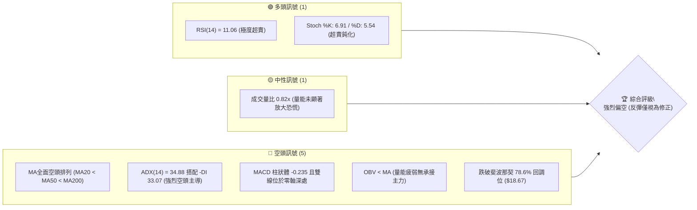
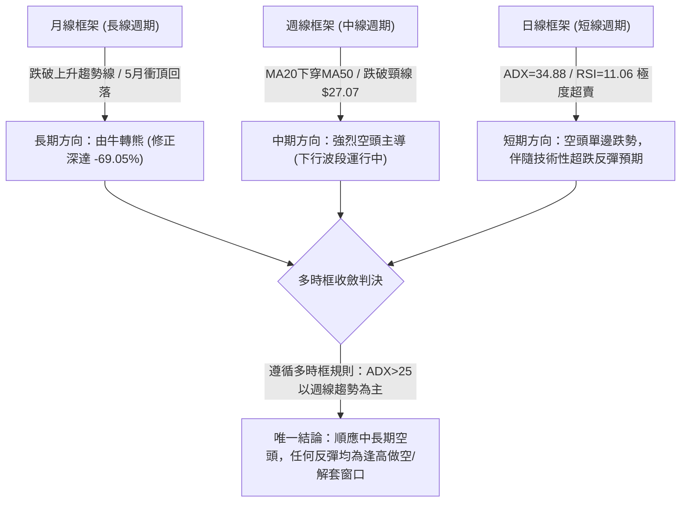
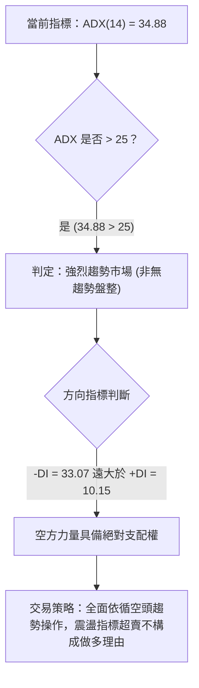
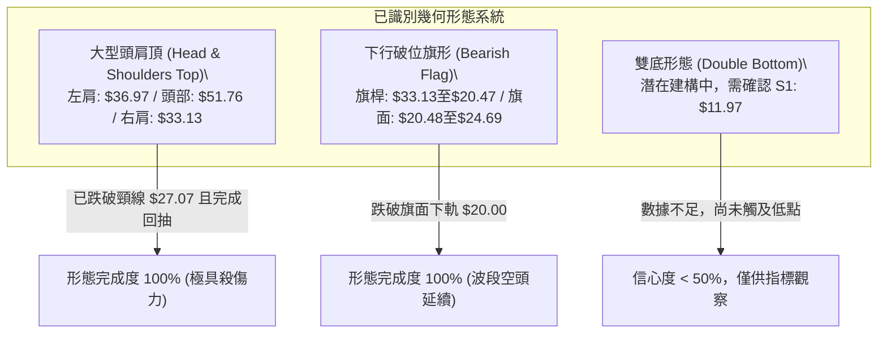
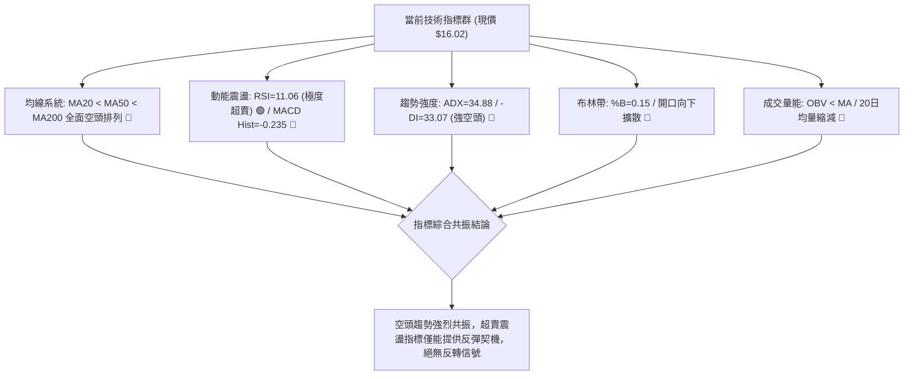
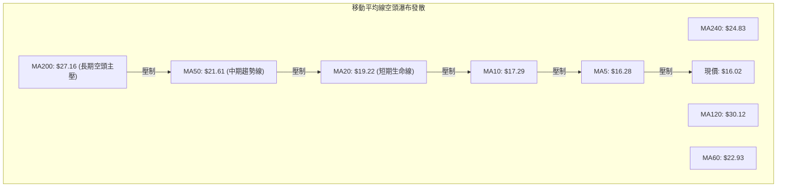
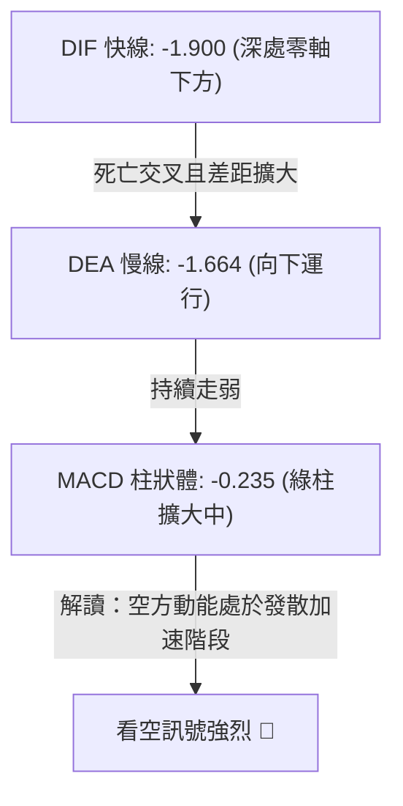
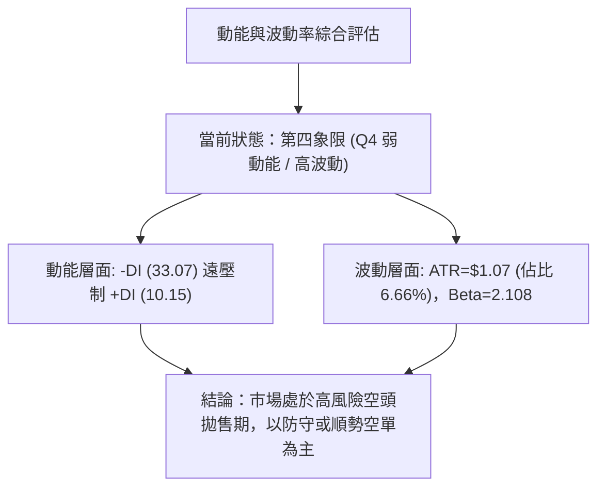
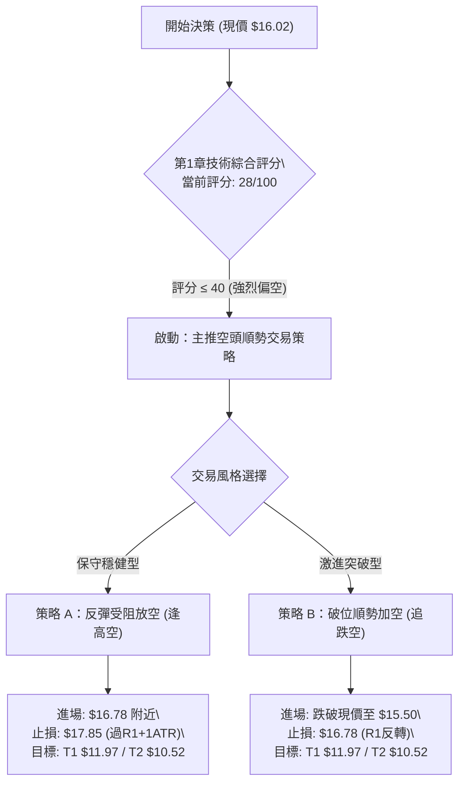
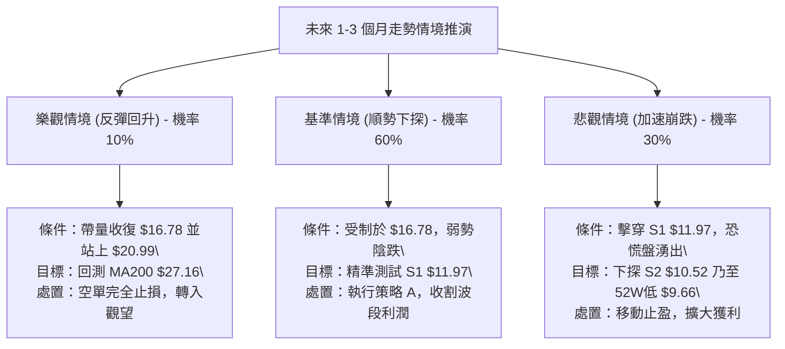

# PL 技術分析報告

> **報告日期**：2026-09-16 ｜ **語言**：繁體中文 ｜ **數據來源**：Yahoo Finance ｜ **當前價格**：$16.02

---

## 目錄

| 章節 | 內容 |
|------|------|
| [1. 技術面概覽](#1-技術面概覽) | 訊號儀表板、核心指標、評分卡 |
| [2. 趨勢分析](#2-趨勢分析) | 多時框趨勢、長中短期走勢、ADX強趨勢確認 |
| [3. 圖表形態分析](#3-圖表形態分析) | 形態識別、K線組合、形態目標價推算 |
| [4. 支撐與阻力](#4-支撐與阻力) | 關鍵價位分佈、波段聚類、斐波那契回調結構 |
| [5. 技術指標深度解讀](#5-技術指標深度解讀) | 均線系統、超賣RSI、MACD空頭、布林通道與OBV |
| [6. 動能與波動率](#6-動能與波動率) | 動能四象限、ATR波動度止損、Beta敏感性 |
| [7. 多時框架總結](#7-多時框架總結) | 時框矩陣、收斂規則應用、多空終局判定 |
| [8. 交易策略建議](#8-交易策略建議) | 策略路由分流、價格階梯、主客觀策略矩陣 |
| [9. 風險提示與監控](#9-風險提示與監控) | 關鍵監控清單、三態情境模擬、風控準則 |
| [📋 報告總結](#-報告總結) | 核心關鍵位總覽、綜合交易執行指令 |

---

## 1. 技術面概覽

### 🎯 技術訊號儀表板



### 📊 核心指標速覽表

| 指標類別 | 指標名稱 | 當前數值 | 訊號 | 解讀 |
|----------|----------|----------|:----:|------|
| **價格** | 當前價格 | $16.02 | 🔴 | 位於 52 週高低區間之 15.1%，處於絕對波段低檔區 |
| **均線** | MA20 | $19.22 | 🔴 | 價格低於 MA20 達 -16.67%，短期均線構成首道強壓 |
| **均線** | MA50 | $21.61 | 🔴 | 中期生命線持續向下傾斜，未見走平跡象 |
| **均線** | MA200 | $27.16 | 🔴 | 長期牛熊分界線大幅下壓，長期格局全面偏空 |
| **動能** | RSI(14) | 11.06 | 🟢 | 進入極度超賣區（<20），短線具備技術性死貓跳反抽動能 |
| **動能** | MACD | -1.900 / -1.664 | 🔴 | DIF 與 DEA 雙線低於零軸，Histogram 為 -0.235，空方發散 |
| **動能** | Stochastics | %K 6.91 / %D 5.54| 🟢 | KD 雙線超賣鈍化，隨時可能出現低檔金叉反抽 |
| **趨勢強度**| ADX(14) | 34.88 (-DI:33.07)| 🔴 | ADX > 25 且 -DI 絕對主導，確立當前處於強烈單邊下行趨勢 |
| **通道** | 布林通道 %B | 0.15 | 🔴 | 貼近下軌（$14.60）運行，開口放大，呈現空頭通道推進 |
| **量能** | OBV | OBV < MA | 🔴 | 能量潮指標低於其均線，代表主力資金呈現淨流出 |
| **波動** | ATR(14) | $1.07 (6.66%) | 🔴 | 每日波動佔股價比率極高，高波動代表交易風險擴大 |

### 🏆 技術評分卡

```
╔══════════════════════════════════════════════════════════════╗
║                技術評分卡 — PL (2026-09-16)                  ║
╠══════════════════════════════════════════════════════════════╣
║ 趨勢強度 (ADX=34.88)   ████████████████░░░░  80/100  🔴 空頭強趨勢║
║ 動能指標 (RSI/MACD)    ████░░░░░░░░░░░░░░░░  20/100  🔴 極度低迷  ║
║ 支撐穩定度 (S1/S2防守) ██████░░░░░░░░░░░░░░  30/100  🔴 破位下挫  ║
║ 成交量配合 (OBV/量比)  ██████░░░░░░░░░░░░░░  30/100  🔴 買盤匱乏  ║
║ 形態完整度 (頭肩頂頸線)████████████████░░░░  80/100  🔴 空頭已確立║
║ 均線排列 (全面空頭發散)██░░░░░░░░░░░░░░░░░░  10/100  🔴 嚴重受壓  ║
╠══════════════════════════════════════════════════════════════╣
║ 綜合技術評分           ██████░░░░░░░░░░░░░░  28/100  🔴 強烈偏空  ║
╚══════════════════════════════════════════════════════════════╝
```

---

## 2. 趨勢分析

### 🌐 多時框趨勢分析



### 📈 長期趨勢 — 12個月走勢圖（Unicode）

```
PL 月線走勢圖（過去12個月：2025-10 至 2026-09）
價格軸 ($)
$52 ┤                                       ● 2026-05 ($51.14 歷史高點)
$47 ┤                                      ╱ ╲
$42 ┤                                     ╱   ╲
$37 ┤                               ● 04 ╱     ╲
$32 ┤                                   ╱       ● 2026-06 ($33.13 懸崖回落)
$27 ┤                         ● 03     ╱         ╲
$22 ┤             ● 01   ● 02         ╱           ╲       ● 2026-07 ($20.48)
$17 ┤       ● 12                     ╱             ╲     ╱ ╲
$16 ┤───────────────────────────────────────────────────● 現價 $16.02
$12 ┤ ● 10   ● 11                                        
    └─┬───────┬───────┬───────┬───────┬───────┬───────┬───────┬───────►
    25-10   25-11   25-12   26-01   26-02   26-03   26-04   26-05   26-06   26-07   26-08   26-09
```

#### 走勢特徵分析表格

| 階段區間 | 時間跨度 | 起訖價格 ($) | 漲跌幅 (%) | 價量特徵與形態解讀 |
|:---------|:---------|:-------------|:-----------|:-------------------|
| **主升初始段** | 2025-10 ~ 2025-12 | $13.45 → $19.72 | +46.62% | 成交量穩定放大，均線呈現多頭排列，突破雙位數關卡 |
| **加速推升段** | 2026-01 ~ 2026-03 | $24.97 → $27.95 | +11.93% | 高檔橫盤消化獲利籌碼，24.00-28.00 形成厚實換手平台 |
| **末端瘋狂噴出** | 2026-04 ~ 2026-05 | $36.97 → $51.14 | +38.33% | 週線 RSI 飆升至 83.2，爆出極端天量衝頂至 $51.76，形成倒V型反轉頂部 |
| **懸崖式破位段** | 2026-06 ~ 2026-07 | $33.13 → $20.48 | -38.18% | 連續爆量長黑，跌破多道短期均線，週均量連續超越 9,000 萬股，主力出逃 |
| **空頭中繼反彈** | 2026-08 | $20.48 → $24.69 | +20.56% | 弱勢反彈，受制於日線 MA200 下方，反彈量能萎縮至 2,300 萬股 |
| **主跌浪重開啟** | 2026-08底 ~ 2026-09| $24.69 → $16.02 | -35.12% | 跌破前期低點 $20.47，週線連續3根黑K，成交量暴增至 8,536 萬股後跌破 $16.78 |

### 📊 中期趨勢（週線分析）

```
PL 中期週線支撐與壓力結構示意圖：
──────────────────────────────────────────────────────────────────────
$25.53 ══════════════════════════════════════════════ [R3: 強阻力 / 8月中反彈高點]
      ↑ 
$20.99 ---------------------------------------------- [R2: 波段頸線阻力 / MA20附近]
      ↑
$16.78 ---------------------------------------------- [R1: 近期跌破之平台轉壓力]
      ▲ 當前價格: $16.02 (位於空頭下行通道中)
      ↓
$11.97 ══════════════════════════════════════════════ [S1: 近一年波段低點支撐 / -25.28%]
      ↓
$10.52 ══════════════════════════════════════════════ [S2: 2025年起漲強支撐 / -34.33%]
──────────────────────────────────────────────────────────────────────
```

中期週線在 2026 年 5 月底創下 $51.76 高點後，走勢呈現標準的空頭階梯下行。50週均線與20週均線形成致命死亡交叉，且反彈高點一次比一次低（$51.76 → $31.38 → $24.69），空頭波浪結構完整，目前正處於自 $24.69 起算的下行第 3 驅動子浪。

### ⚡ 趨勢強度評估（ADX 解讀）



#### ADX 趨勢強度對照解讀表

| 指標變量 | 數值 | 臨界標準 | 狀態評估 | 實質意義 |
|:---------|:-----|:---------|:---------|:---------|
| **ADX(14)** | 34.88 | > 25.00 | 🟢 強趨勢確認 | 當前處於強烈單邊下行波段，技術指標鈍化現象嚴重，不可逆勢摸底 |
| **+DI(14)** | 10.15 | 基準線 20 | 🔴 多方動能衰竭 | 買盤力量極端微弱，無力組織有效進攻 |
| **-DI(14)** | 33.07 | 基準線 20 | 🔴 空方力量肆虐 | 空方賣壓沉重，價格沿下軌持續單邊推移 |
| **差值 (-DI - +DI)** | +22.92 | > 10.00 | 🔴 極度發散 | 多空差距持續擴大，表明下行能量尚未完全宣洩完畢 |

---

## 3. 圖表形態分析

### 🔍 形態識別系統



#### 圖表形態信心度與目標價評估表

| 形態名稱 | 信心度 (%) | 判斷依據（引用真實數據） | 完成度 (%) | 形態目標價計算式 | 目標價位 ($) |
|:---------|:-----------|:-------------------------|:-----------|:-----------------|:--------------|
| **大型頭肩頂** | 90% | 左肩 2026-04 收盤 $36.97；頭部 2026-05 峰值 $51.76；右肩 2026-06 收盤 $33.13。頸線位置確認於 2026-06-28 該週低點 $27.07。 | 100% | 頸線 $27.07 - (頭部高點 $51.76 - 頸線 $27.07) = $27.07 - $24.69 = $2.38 (理論值過低，以近一年強支撐 S2: $10.52 修正) | 理論 $2.38<br>修正 **$10.52** |
| **空頭下行旗形** | 85% | 旗桿下殺：自 $33.13 崩跌至 $20.47 (高度 $12.66)；旗面整理：8月中反彈至 $24.69 後於 8月底以 $19.98 跌破下軌。 | 100% | 破位點 $20.47 - 旗桿高度 $12.66 = 形態完全測幅目標 $7.81 (短期以 S1 支撐 $11.97 為首道滿足點) | 首階 **$11.97**<br>終極 **$7.81** |
| **潛在雙底反轉** | 20% | 數據中未偵測到第二個底部，目前價格仍在破位探底，絕不可視為雙底。 | 0% | 訊號不足，僅做指標型解讀，嚴禁憑空預設立場。 | 數據未偵測到 |

### 🕯️ 重要K線形態分析

| 月份 / 週別 | 收盤價 ($) | K線形態名稱 | 形態結構深度解讀 | 訊號評級 |
|:------------|:-----------|:------------|:-----------------|:--------:|
| **2026-05 (月線)** | $51.14 | 長上影流星線 (Shooting Star) | 當月最高衝擊 $51.76，月成交量極大化後大幅回吐，顯示高檔獲利了結與散戶追高套牢，構成歷史大頂。 | 🔴 強烈看跌 |
| **2026-06 (月線)** | $33.13 | 斷頭長黑大陰線 (Bearish Marubozu) | 實體跌幅高達 -35.22%，直接吞噬前兩個月漲幅，帶有 1億股 週級別巨量恐慌拋盤，確認趨勢反轉。 | 🔴 強烈看跌 |
| **2026-08-16(週線)**| $24.69 | 墓碑十字星 / 倒錘頭 | 反彈觸及日線 MA60 ($22.93) 上方後遭空頭暴力摜壓，成交量僅 2,353 萬股，量價背離，反彈宣告終結。 | 🔴 確認轉弱 |
| **2026-09-06(週線)**| $18.12 | 破位穿頭破腳大陰線 | 單週爆出 8,536 萬股巨量長黑，一舉貫穿 $20.00 整數防線與斐波那契 78.6% ($18.67)，主力傾巢出逃。 | 🔴 崩跌確認 |
| **2026-09-20(週線)**| $16.02 | 延續性黑K (尚未見下影線) | 連續三週收低，收盤逼近全週最低點，顯示多頭毫無抵抗力量，空頭動能仍未枯竭。 | 🔴 空頭延續 |

### 📉 ASCII 走勢形態示意圖

```
PL 頭肩頂破位與下行旗形形態解析：
────────────────────────────────────────────────────────────────────────
$51.76 ───────────────● 頭部 (Head, 2026-05)
                     ╱ ╲
$36.97 ───● 左肩     ╱   ╲
         ╱ ╲        ╱     ╲           ● 右肩 ($33.13, 2026-06)
        ╱   ╲      ╱       ╲         ╱ ╲
$27.07 ───────●───●─────────●───────●───● 頸線破位點 (Neckline)
                 頸線支撐平台        ╲ ╱
$24.69 ───────────────────────────────● 旗面反彈頂部 (2026-08-16)
                                       ╲
$20.47 ─────────────────────────────────● 旗面破位跌破點
                                         ╲
$16.02 ───────────────────────────────────● 當前破位加速點 (現價)
                                           ╲
$11.97 ═════════════════════════════════════▼ 旗形與支撐第一滿足目標 (S1)
────────────────────────────────────────────────────────────────────────
```

### 🎯 形態目標價計算

1. **頭肩頂形態測幅**：
   - 形態頭部波峰：$51.76
   - 形態關鍵頸線：$27.07
   - 形態垂直幅度 = $51.76 - $27.07 = $24.69
   - 依據最小量度跌幅計算式：頸線價格 - 形態高度 = $27.07 - $24.69 = **$2.38**。
   - *專業修正*：鑑於 $2.38 偏離目前基本面現金部位（每股淨現金約 $1.08），技術面將目標價收斂至近一年密集換手區之歷史支撐位 **S2: $10.52**。

2. **空頭下行旗形測幅**：
   - 旗桿起點：2026-06 高點 $33.13，旗桿終點：2026-07 低點 $20.47，旗桿長度 = $33.13 - $20.47 = $12.66。
   - 旗面整理高點：2026-08 反彈頂部 $24.69。
   - 旗形破位滿足點計算式：反彈高點 $24.69 - 旗桿長度 $12.66 = **$12.03**。
   - 該計算值與波段低點聚類支撐 **S1: $11.97** 極度吻合（誤差僅 0.5%），具備極高之技術共振效應。

---

## 4. 支撐與阻力

### 🗺️ 關鍵價位分布圖（Unicode）

```
PL 價位結構分布圖（真實數據聚類映射）
══════════════════════════════════════════════════════════════════════
$51.76 ║████████████████████████████████████████║ 52W High / 頭部極限阻力
$41.82 ║████████████████████████████████        ║ 斐波那契 23.6% 回調位
$35.68 ║████████████████████████████            ║ 斐波那契 38.2% 回調位
$30.71 ║████████████████████████                ║ 斐波那契 50.0% 多空分水嶺
$27.16 ║██████████████████████                  ║ 長期均線 MA200 壓制線
$25.74 ║████████████████████                    ║ 斐波那契 61.8% 黃金分割強壓
$25.53 ║████████████████████                    ║ 強阻力 R3 (8月中旬波段反彈高點)
$20.99 ║████████████████                        ║ 阻力 R2 (近期密集破位套牢帶)
$19.22 ║██████████████                          ║ 布林中軌 / MA20 短線反壓
$18.67 ║████████████                            ║ 斐波那契 78.6% 回調位 (已轉為阻力)
$16.78 ║██████████                              ║ 關鍵阻力 R1 (9月初反彈高點平台)
$16.02 ╠════════════════════════════════════════╣ ◄ 現價 $16.02 (位於下行通道中)
$14.60 ║▓▓▓▓▓▓▓▓                                ║ 布林下軌通道動態支撐
$11.97 ║████████████████                        ║ 近期支撐 S1 (近一年波段低點聚類)
$10.52 ║████████████████████                    ║ 強支撐 S2 (近一年次級強支撐)
$09.66 ║████████████████████████████████████████║ 52W Low (100.0% 終極支撐)
══════════════════════════════════════════════════════════════════════
```

### 🚧 阻力位分析表

| 阻力級別 | 價位 ($) | 距現價幅度 | 形成原因（真實聚類與均線） | 突破難度 | 重要性評級 |
|:---------|:---------|:-----------|:---------------------------|:--------:|:----------:|
| **R1** | $16.78 | +4.74% | 2026年9月中旬反彈波段高點聚類，亦為極短線多頭反撲的第一道防守陣線。 | 🟡 中等 | 🟢 次要阻力 (短線試金石) |
| **R2** | $20.99 | +31.02% | 7月波段整理平台下緣與8月起跌破位口，與日線 MA20 ($19.22) 及 MA50 ($21.61) 形成死叉反壓共振區。 | 🔴 極高 | 🔴 核心波段阻力 (空頭防線) |
| **R3** | $25.53 | +59.36% | 2026-08-16 當週反彈波段頂部（收盤 $24.69，最高測試 $25.53），與斐波那契 61.8% ($25.74) 形成密集籌碼套牢峰。 | 🔴 堅不可摧 | 🔴 長期轉折分水嶺 |

### 🛡️ 支撐位分析表

| 支撐級別 | 價位 ($) | 距現價幅度 | 形成原因（真實聚類與形態） | 守住機率 | 重要性評級 |
|:---------|:---------|:-----------|:---------------------------|:--------:|:----------:|
| **動態支撐** | $14.60 | -8.86% | 日線布林下軌動態擴張位，短線價格若乖離過大將於此處產生減速或停頓。 | 🟡 50% | 🟡 極短線通道邊界 |
| **S1** | $11.97 | -25.28% | 數據計算之近一年波段低點核心聚類區，2025年9月主升浪起漲之換手整理平台，下行旗形等幅測幅點。 | 🟢 65% | 🔴 核心波段支撐 (首道馬奇諾) |
| **S2** | $10.52 | -34.33% | 近一年次級波段低點聚類，逼近 52 週低點前之最後防護陣地，頭肩頂形態修正滿足點。 | 🟢 75% | 🔴 生死防守位 (破位將創歷史低) |

### 📐 斐波那契回調位分析

本分析直接引用技術數據中以 52 週區間（低點 $9.66 至 高點 $51.76，波幅共計 $42.10）計算之嚴格斐波那契回調位：

```
斐波那契回調位梯形結構：
┌─────────────────────────────────────────────────────────────┐
│ 0.0%  (52W High)   $51.76  ── 歷史高點                      │
│ 23.6%              $41.82  ── 頂部破位首站                  │
│ 38.2%              $35.68  ── 原上升趨勢生命線              │
│ 50.0%              $30.71  ── 多空分水嶺 (已告失守)         │
│ 61.8%              $25.74  ── 黃金分割關鍵轉折區            │
│ 78.6%              $18.67  ── 深度回調警戒線 (9月初跌破)    │
│ [現價落點]         $16.02  ── 介於 78.6% 與 100.0% 之間     │
│ 100.0% (52W Low)   $ 9.66  ── 終極底部起漲點                │
└─────────────────────────────────────────────────────────────┘
```

#### 斐波那契回調深度解讀：
現價 $16.02 已正式跌破 78.6% 回調位（$18.67）。在經典技術分析理論中，當資產價格自高點回吐幅度深穿 78.6% 時，宣告原本的多頭超級大浪已宣告彻底瓦解，不再屬於「健康回調」範疇，價格極大概率將產生「回調全覆蓋」，即向 100.0% 斐波那契回調位（$9.66）尋求終極支撐。

---

## 5. 技術指標深度解讀

### 🎛️ 指標訊號總覽



### 📈 移動平均線排列分析



#### 均線數據深度解讀表

| 均線名稱 | 當前價位 ($) | 與現價乖離率 | 排列狀態 | 走勢斜率與實質意涵 |
|:---------|:-------------|:-------------|:--------:|:-------------------|
| **MA 5** | $16.28 | -1.60% | 空頭排列 | 極短線緊貼價格下行，呈現壓制走勢 |
| **MA 10** | $17.29 | -7.35% | 空頭排列 | 走勢急轉直下，近兩週未曾突破此線 |
| **MA 20** | $19.22 | -16.65% | 空頭排列 | 短期生命線，已下穿 MA50 形成死亡交叉 |
| **MA 50** | $21.61 | -25.87% | 空頭排列 | 中期趨勢線，陡峭向下，中期空頭防禦重心 |
| **MA 60** | $22.93 | -30.14% | 空頭排列 | 季線下行，8月中反彈即在此均線前折戟 |
| **MA 120**| $30.12 | -46.81% | 空頭排列 | 半年線已自高檔彎頭下墜，套牢盤深重 |
| **MA 200**| $27.16 | -41.02% | 空頭排列 | 牛熊分水嶺，當前價格大幅低於 MA200，確立進入長期熊市 |
| **MA 240**| $24.83 | -35.48% | 走平轉下 | 年線支撐全面失效，均線空頭排列成立 |

### 📉 RSI(14) 分析

- **當前數值**：**11.06**
- **數值進度條**：`██░░░░░░░░░░░░░░░░░░` 11.06% (極度超賣區間 < 20)
- **超買超賣狀態**：指標已跌入極為罕見的單邊極端超賣區。回顧週線走勢，2026-06-21 RSI 曾探至 17.2，隨後引發自 $28.23 反抽至 $31.38 的反彈；2026-07-26 RSI 降至 10.2，隨後引發自 $20.47 反彈至 $24.69 的波段修正。
- **背離判斷**：
  - **結論：無明顯底背離**。
  - **論證**：2026-09-06 週線收盤 $18.12，RSI 為 10.7；2026-09-13 收盤 $16.45，RSI 為 10.0；當前收盤 $16.02，RSI 為 11.06。雖然價格持續創低而 RSI 呈現極微小的平滑走平，但由於兩者數值均處於低檔邊際誤差內，且日線 MACD 柱狀圖同步創低，未形成典型的高低點價格與指標錯位，因此**判定無有效底背離**，屬於典型的「超賣鈍化」，不可作為做多進場信號。

### 📊 MACD(12/26/9) 訊號解讀



#### MACD 詳細分析：
當前 MACD DIF 快線（-1.900）低於 DEA 慢線（-1.664），柱狀體（Histogram）為 -0.235。柱狀圖持續在零軸下方發散，沒有任何收斂或底背離跡象。雙線深陷零軸負值區域，顯示這是一場標準的高級別空頭單邊跌勢，所有日線級別的金叉反抽在未站上零軸前，均屬於空頭防守反擊的逃命波。

### 📦 布林通道分析

```
PL 日線布林通道結構示意圖：
─────────────────────────────────────────────────────────────
$23.84 ───────────────────────────── 布林上軌 (帶寬發散中)
                                    
$19.22 ───────────────────────────── 布林中軌 (MA20 基準線)
                                    
$16.02 ═══════════● 現價 (位處極低區間，%B = 0.15)
$14.60 ───────────────────────────── 布林下軌 (下行動態支撐)
─────────────────────────────────────────────────────────────
```

- **帶寬與位置**：布林上軌為 $23.84，中軌為 $19.22，下軌為 $14.60。
- **%B 指標值**：**0.15**（計算式：`($16.02 - $14.60) / ($23.84 - $14.60) = $1.42 / $9.24 = 0.153`）。
- **走勢特徵**：現價目前緊貼布林下軌滑落，%B 處於 0.20 以下的極端空頭擠壓狀態。布林通道帶寬高達 $9.24（佔股價 57.6%），表明下行趨勢正在進行「通道擴張走下軌」（Riding the Band），這並非超賣見底信號，而是強烈空頭趨勢持續運行的典型特徵。

### 💹 成交量分析（量價配合度）

1. **成交量與均量比**：
   - 最新成交量為 8,596,978 股，相較於 20日均量（10,518,084 股），量比僅為 **0.82x**。
   - 相比於 2026-09-06 破位當週的 85,360,000 股，目前日均量能呈現「跌勢中縮量」。
2. **OBV（能量潮）分析**：
   - 數據明確顯示：**OBV < MA**。
   - 解讀：成交量雖然較恐慌破位日萎縮，但 OBV 曲線始終運行在其移動平均線下方，表明在下殺過程中並無具備實力的機構大資金進場吸籌，成交量的萎縮純粹是多頭放棄抵抗、買盤退潮所導致的「無量陰跌」，量價結構嚴重支持空方。

---

## 6. 動能與波動率

### ⚡ 動能評估四象限

| 象限 | 動能維度 (Momentum) | 波動率維度 (Volatility) | 當前判定 | 戰術處置與環境解讀 |
|:-----|:--------------------|:-------------------------|:--------:|:-------------------|
| **第一象限 (Q1)** | 強動能 (多頭突破) | 低波動 (穩定上升) | ─ | 最佳進場持有期，多頭勝率最高區間（目前完全不符） |
| **第二象限 (Q2)** | 弱動能 (盤整偏弱) | 低波動 (縮量沉寂) | ─ | 區間震盪觀望期，等待方向突破（目前完全不符） |
| **第三象限 (Q3)** | 強動能 (多方爆發) | 高波動 (極端劇烈) | ─ | 高風險高收益，末端噴出或暴跌急彈（目前不符） |
| **第四象限 (Q4)** | **弱動能 (空方支配)** | **高波動 (急跌宣洩)** | **✓ PL落點**| **極高風險區。ADX=34.88，ATR佔比高達 6.66%，且方向全面向下，多頭絕不可盲目接刀。** |



### 📊 ATR 波動率分析

- **ATR(14) 數值**：**$1.07**
- **波動佔比**：佔當前股價（$16.02）之比例高達 **6.66%**。
- **實戰風控意義**：
  - 代表該標的單日正常隨機波動區間即超過 $1.00。在規劃任何技術性交易時，止損空間若小於 1.5 倍 ATR（即 `$1.07 * 1.5 = $1.61`），極易被日常噪聲洗盤出場。
  - 對於空頭部位，合理的止損防守應設置於現價加上 1.5 至 2.0 倍 ATR，即阻力位 R1（$16.78）上方；對於激進型搶短多頭，止損空間亦不得低於 $1.07，這大幅壓縮了左側交易的盈虧比空間。

### 📐 Beta 與市場相關性

- **Beta 係數**：**2.108**
- **市場特徵解析**：
  - PL 屬於極高彈性之高 Beta 成長型標的，其波動幅度為標普500指數的 2.1 倍以上。
  - 在大盤整體處於回調或風險偏好下降時，此類標的往往呈現放大2倍的劇烈補跌。
  - 目前 Short % Float 達 9.7%，Short Ratio 為 5.72 天，空頭部位相對擁擠，此結構雖在極端情況下可能引發軋空（Short Squeeze），但在均線完全破位且大趨勢向下的背景下，高 Beta 反而成為加速向下尋求支撐的催化劑。

---

## 7. 多時框架總結

### 📋 時框架評分表

| 時框架 | 趨勢方向 | 動能狀態 | 均線排列狀況 | 圖表形態特徵 | 綜合評分 | 操作建議 |
|:-------|:---------|:---------|:-------------|:-------------|:--------:|:---------|
| **月線 (長期)** | 🔴 由牛轉熊 | MACD柱收縮轉負 | 跌破 5/10 月均線 | 自高位流星線反轉形成巨型頂部 | 25/100 | 長期部位減碼離場，嚴格停損 |
| **週線 (中期)** | 🔴 強烈空頭 | RSI=11.1 極度疲弱 | MA20 < MA50 死叉 | 頭肩頂破位，空頭下行旗形展開 | 15/100 | 反彈皆為空點，順勢建立空單 |
| **日線 (短期)** | 🔴 單邊跌勢 | RSI=11.06 超賣鈍化| MA5至MA240完全空頭排列| 破位下挫，貼緊布林下軌 | 30/100 | 空單持有，左側搶反彈勝率極低 |

### 🔲 綜合訊號矩陣

```
╔══════════════════════════════════════════════════════════════════╗
║                    多時框架綜合訊號共振矩陣                      ║
╠══════════════╦══════════════╦══════════════╦═════════════════════╣
║ 分析維度     ║ 短期 (日線)  ║ 中期 (週線)  ║ 長期 (月線)         ║
╠══════════════╬══════════════╬══════════════╬═════════════════════╣
║ 趨勢方向     ║ 🔴 強烈看空  ║ 🔴 強烈看空  ║ 🔴 轉入熊市         ║
║ 均線排列     ║ 🔴 全面空頭  ║ 🔴 死亡交叉  ║ 🟡 測試年線均線     ║
║ 動能強弱     ║ 🟢 超賣鈍化  ║ 🔴 空方主導  ║ 🔴 動能急速衰退     ║
║ 支撐壓力位   ║ 跌破短支撐   ║ 考驗S1 $11.97║ 考驗52W低點 $9.66   ║
║ 量價結構     ║ 🔴 無量陰跌  ║ 🔴 破位放量  ║ 🔴 高檔天量出貨     ║
╠══════════════╩══════════════╩══════════════╩═════════════════════╣
║ 一致性檢驗：長中短三個級別在「趨勢方向」與「均線排列」上呈現 100% 深度空頭共振。║
╚══════════════════════════════════════════════════════════════════╝
```

### ⚖️ 多時框收斂結論

依據本報告之嚴格多時框收斂規則（規則 14）：
1. **行情性質判定**：當前 ADX(14) 數值為 **34.88**，顯著高於 25 的趨勢分水嶺，確立當前市場處於**強烈趨勢行情**（非無方向盤整）。
2. **時框優先級權重**：在 ADX > 25 的趨勢行情中，嚴格以**中長期（週線/MA50、MA200）方向為絕對主導**，日線僅用以尋找順勢切入或風控出場點。
3. **終極方向判定**：雖然日線 RSI 出現 11.06 的極度超賣，但由於週線與月線層級的大型頭肩頂破位與均線死叉具備壓倒性力量，**收斂得出唯一結論：強烈偏空**。禁止在日線超賣時逆勢重倉猜底，交易策略必須與此偏空結論保持完全一致。

---

## 8. 交易策略建議

### 🗺️ 策略決策流程圖



### 🧭 策略路由（依評分卡分流）

> **當前主策略方向 = 強烈主推空頭策略（依綜合評分 28/100 判定）**
> 
> 依據嚴格規則分流標準，當前綜合技術評分僅為 28 分（≤ 40），多頭進場條件全面遭到否決，禁止推薦任何左側摸底多頭主策略。本章全維度聚焦於空頭順勢交易之執行細節，多頭僅以「反向風險觸發點」進行監控提示。

### 🎯 價格情境階梯（Price Scenarios）

所有價位嚴格引用第 4 章真實技術聚類數據：

| 觸發條件 | 核心觀察價位 ($) | 下一目標 ($) | 後續延伸 ($) | 情境技術含義與應對原則 |
|:---------|:-----------------|:-------------|:-------------|:-----------------------|
| **強勢向上反彈** | 突破 R1 $16.78 | R2 $20.99 | R3 $25.53 | 極度超賣引發之死貓跳，觸及 R1/R2 為絕佳空單回補或加空點。 |
| **弱勢抵抗震盪** | 守住現價 $16.02 | 測試 $16.78 | 回測 $14.60 | 超跌後之低檔橫盤，空頭中繼架構，時間換取空間消化賣壓。 |
| **弱勢下行破位** | 跌破布林下軌 $14.60| S1 $11.97 | S2 $10.52 | 展開空頭主跌浪延續，全面奔向波段低點聚類與旗形滿足點。 |
| **終極崩跌探底** | 跌破 S2 $10.52 | 52W Low $9.66| 數據未偵測到 | 跌穿所有近一年支撐，逼近全週期歷史底部，空單分批獲利了結。 |

### 📊 情境機率分佈

| 情境劇本 | 發生機率 (%) | 主要支撐依據（引用真實指標與走勢） |
|:---------|:------------:|:----------------------------------|
| **情境一：直接回落 / 破位探底 (S1/S2)** | **60%** | ADX=34.88 確立強空頭趨勢；-DI (33.07) 絕對佔優；OBV 疲軟證明買盤匱乏；均線全面空頭向下發散無支撐。 |
| **情境二：弱勢反抽後再次下挫** | **30%** | RSI(14)=11.06 進入極限超賣；Stochastics KD 位於 6 附近，隨時存在技術性抽腳測試 R1 ($16.78) 的動能。 |
| **情境三：V型全面反轉突破 R2** | **10%** | 除非出現突發重大非盤面利多催化，否則在 MACD 深陷零軸且高檔 9.7% 融券未平倉背景下，直接反轉機率極低。 |

### 🟢 主策略詳情（空頭交易策略）

本報告提供兩套嚴格依據技術指標與關鍵價位規劃之空頭策略：

| 策略要素 | 策略 A（保守型：反彈阻力位放空） | 策略 B（激進型：破位加速順勢放空） |
|:---------|:-----------------------------------|:-----------------------------------|
| **進場邏輯** | 利用 RSI 超賣後的技術性反抽，於關鍵阻力 R1 處順勢建倉 | 預期超賣鈍化失效，跌破前日低點後順勢追空 |
| **進場價格** | **$16.78** (精確掛單於阻力位 R1 下方) | **$15.50** (確認跌破 $16.00 整數心理防線) |
| **止損價格** | **$17.85** (精確計算：R1 $16.78 + 1.0x ATR $1.07) | **$16.57** (精確計算：進場價 $15.50 + 1.0x ATR $1.07) |
| **目標價 T1** | **$11.97** (核心波段支撐位 S1) | **$11.97** (核心波段支撐位 S1) |
| **目標價 T2** | **$10.52** (強支撐位 S2 / 形態修正滿足點) | **$10.52** (強支撐位 S2) |
| **風險空間** | $1.07 (6.38%) | $1.07 (6.90%) |
| **獲利空間(T1)**| $4.81 (28.66%) | $3.53 (22.77%) |
| **風險報酬比** | **1 : 4.50** (極為優越) | **1 : 3.30** (良好) |
| **預估勝率** | **65%** | **60%** |
| **建議倉位** | **總資金之 10% - 15%** | **總資金之 8% - 10%** |

### 🔴 反向風險觸發點（對沖與風控提示）

若市場出現異常反轉，以下為徹底推翻空頭主策略的關鍵信號：
1. **反轉關鍵價位**：日線收盤價強勢**突破並站穩 R2: $20.99**。若觸及此價位，宣告日線級別雙底或島狀反轉成形，空單必須無條件全數止損離場。
2. **指標轉折信號**：日線 MACD 出現零軸下方的底背離黃金交叉，且成交量連續3日超越 20日均量（> 1,051 萬股）。
3. **對沖操作指引**：持有現貨長線部位之投資人，在價格未能收復 $16.78 前，應建立等量之反向標的或空頭衍生品鎖定下行風險。

### ⭐ 整體訊號強度評星

```
╔══════════════════════════════════════════════════════════════╗
║                    技術訊號強度整體評星                      ║
╠══════════════════════════════════════════════════════════════╣
║ 做多訊號強度：  ★☆☆☆☆  (1/5星 - 僅有超賣，無形態與結構支撐) ║
║ 做空訊號強度：  ★★★★☆  (4/5星 - 均線/趨勢/形態/量能全面偏空)║
║ 整體分析可信度：★★★★☆  (4/5星 - ADX>25 單邊趨勢高可信度)    ║
╚══════════════════════════════════════════════════════════════╝
```

---

## 9. 風險提示與監控

### ✅ 關鍵監控指標 Checklist

```
╔══════════════════════════════════════════════════════════════╗
║                   每日交易風控監控清單 (Checklist)           ║
╠══════════════════════════════════════════════════════════════╣
║ [ ] 監控項 1: 價格是否收復 R1 ($16.78)？                      ║
║     └─ 未收復前，任何盤中上漲均視為假突破。                 ║
║ [ ] 監控項 2: RSI(14) 是否脫離超賣區 (> 30)？                ║
║     └─ 若脫離超賣伴隨放量，需警惕空頭回補引發的軋空。       ║
║ [ ] 監控項 3: 日成交量是否顯著超越 10,518,084 股 (20日均量)？ ║
║     └─ 爆量長紅為主力進場吸籌的第一警訊。                   ║
║ [ ] 監控項 4: 布林通道帶寬是否收縮？                          ║
║     └─ 開口持續擴大代表單邊趨勢仍未結束。                   ║
║ [ ] 監控項 5: S1 ($11.97) 守護狀況？                         ║
║     └─ 抵達 S1 應即刻執行至少 50% 之空頭利潤兌現。          ║
╚══════════════════════════════════════════════════════════════╝
```

### ⚠️ 風險場景分析



### 🛡️ 風險管理重要提醒

1. **極度超賣狀態下的「軋空」風險**：
   - 目前 PL 的 Short % Float 為 **9.7%**，空頭回補天數為 **5.72 天**。在 RSI 低達 11.06 的極度超賣環境中，任何非預期的利多消息（如大型政府防衛衛星合約公告）皆可能引發空頭急於平倉的暴縮軋空。
   - **防禦手段**：空頭交易必須嚴格執行止損指令（如策略 A 的 $17.85），絕對嚴禁「抱單死扛」。
2. **高 ATR 波動下的倉位控管準則**：
   - 該股當前 ATR 為 **$1.07**，單日價格波動率高達 **6.66%**。在如此高波動的標的下，單筆交易的最大損失額度嚴格不得超過總交易帳戶淨值的 **1.5%**。
   - 倉位計算公式：`允許承受損失金額 (帳戶的1.5%) / 止損距離 ($1.07) = 嚴格持股股數上限`。
3. **拒絕逆勢摸底的心理紀律**：
   - 散戶投資人極易因「跌幅已深（自 $51.76 跌至 $16.02，回調達 -69.05%）」而產生左側撈底之認知偏差。但在 ADX 高達 34.88 的趨勢市場中，趨勢的延續性往往遠超常理，歷史低點聚類前皆非穩固底部。

---

## 📋 報告總結

```
╔══════════════════════════════════════════════════════════════════╗
║                   PL 技術分析報告總結執行卡                      ║
╠══════════════════════════════════════════════════════════════════╣
║ 報告日期：2026-09-16                                            ║
║ 當前價格：$16.02                                                 ║
║ 分析評級：🔴 強烈偏空 / 順勢做空 (Sell on Rallies)               ║
╠══════════════════════════════════════════════════════════════════╣
║ 核心趨勢結論：                                                  ║
║ ├─ 長期趨勢：🔴 由牛轉熊，大型頭肩頂頸線破位，長期下行尋底       ║
║ ├─ 中期趨勢：🔴 下行旗形展開，均線空頭排列，反彈動能潰散         ║
║ ├─ 短期趨勢：🟢 短線 RSI=11.06 極度超賣，但 ADX=34.88 空頭主導  ║
║ ├─ 關鍵阻力：R1: $16.78 ｜ R2: $20.99 ｜ R3: $25.53             ║
║ ├─ 關鍵支撐：S1: $11.97 ｜ S2: $10.52 ｜ 52W低: $9.66            ║
║ └─ 華爾街目標：均價 $34.00 (落後指標) ｜ 最低目標 $22.00        ║
╠══════════════════════════════════════════════════════════════════╣
║ 最優交易策略組合：                                              ║
║ 1. 🥇 最佳機會 (策略 A)：等待超跌反抽至 $16.78 放空，           ║
║       止損設於 $17.85，目標鎖定 $11.97，風酬比高達 1:4.50。      ║
║ 2. 🥈 次選機會 (策略 B)：跌破 $15.50 順勢加碼做空，             ║
║       止損設於 $16.57，下看支撐 $11.97，風酬比為 1:3.30。        ║
║ 3. 🥉 嚴格禁令：禁止任何重倉抄底行為，現貨部位應於反彈逢高減碼。 ║
╚══════════════════════════════════════════════════════════════════╝
```

---

> ⚠️ **免責聲明**：本報告為專業技術分析模型生成之研究報告，所有數據、圖表形態識別與關鍵價位推算均基於歷史量價客觀資訊。本報告**僅供學術研究與機構投資人決策參考**，**不構成任何要約、招攬或具體的個人化投資操作建議**。金融市場瞬息萬變，高 Beta 與高 ATR 標的蘊含極高波動風險，投資人應獨立評估自身風險承受能力並自行承擔盈虧。

---

*報告生成時間：2026-09-16 ｜ 數據來源：Yahoo Finance ｜ 分析框架：多時框技術量化分析架構*