# PL 技術分析報告

> **報告日期**：2026-09-17 ｜ **語言**：繁體中文 ｜ **數據來源**：Yahoo Finance ｜ **當前價格**：$16.99

---

## 目錄

| 章節 | 內容 |
|------|------|
| [1. 技術面概覽](#1-技術面概覽) | 訊號儀表板、核心指標、評分卡 |
| [2. 趨勢分析](#2-趨勢分析) | 多時框趨勢、長中短期走勢 |
| [3. 圖表形態分析](#3-圖表形態分析) | 形態識別、K線組合、目標價 |
| [4. 支撐與阻力](#4-支撐與阻力) | 關鍵價位、斐波那契回調 |
| [5. 技術指標深度解讀](#5-技術指標深度解讀) | MA/RSI/MACD/布林/成交量 |
| [6. 動能與波動率](#6-動能與波動率) | 動能評估、ATR、Beta |
| [7. 多時框架總結](#7-多時框架總結) | 時框架評分矩陣 |
| [8. 交易策略建議](#8-交易策略建議) | 多空策略、風險報酬比 |
| [9. 風險提示與監控](#9-風險提示與監控) | 監控指標、風險場景 |

---

## 1. 技術面概覽

### 🎯 技術訊號儀表板

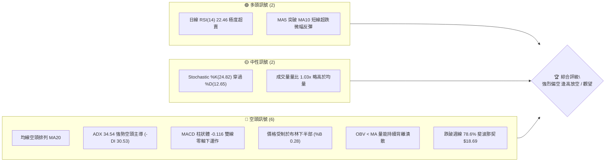

### 📊 核心指標速覽表

| 指標類別 | 指標名稱 | 當前數值 | 訊號 | 解讀 |
|----------|----------|----------|------|------|
| **價格** | 當前價格 | $16.99 | 🔴 | 位於 52 週區間 17.4%，處於極弱勢回檔區間 |
| **均線** | MA20 | $18.94 | 🔴 | 價格在 MA20 下方 -10.31%，短期下行斜率陡峭 |
| **均線** | MA50 | $21.40 | 🔴 | 價格在 MA50 下方 -20.61%，中期趨勢嚴重受阻 |
| **均線** | MA200 | $27.18 | 🔴 | 價格在 MA200 下方 -37.49%，長期空頭確立 |
| **動能** | RSI(14) | 22.46 | 🟢 | 進入極度超賣區（<30），隨時可能出現技術性抽頭 |
| **動能** | MACD(12,26,9) | -1.809 / -1.693 / -0.116 | 🔴 | DIF 與 DEA 均在零軸之下且負柱擴張，空頭主控 |
| **趨勢** | ADX(14) | 34.54 (-DI: 30.53) | 🔴 | ADX > 25 且 -DI 主導，顯示處於高強度空頭趨勢 |
| **波動** | ATR(14) | $1.11 | 🟡 | 佔股價 6.56%，屬於高波動成長股特性，風控寬度需拉大 |
| **通道** | 布林通道 %B | 0.28 | 🔴 | 位於下軌 $14.51 與中軌 $18.94 之間，貼軌下行 |
| **量能** | OBV 趨勢 | OBV < MA | 🔴 | 資金持續流出，成交量未形成有效多頭承接 |

### 🏆 技術評分卡

```
╔══════════════════════════════════════════════════════════════╗
║              技術評分卡 — PL (2026-09-17)                    ║
╠══════════════════════════════════════════════════════════════╣
║ 趨勢強度 (Trend)      ██████████████░░░░░░  30/100  🔴       ║
║ 動能指標 (Momentum)   ████████░░░░░░░░░░░░  35/100  🔴       ║
║ 支撐穩定度 (Support)  ██████░░░░░░░░░░░░░░  20/100  🔴       ║
║ 成交量配合 (Volume)   ████████░░░░░░░░░░░░  30/100  🔴       ║
║ 形態完整度 (Pattern)  ████████████░░░░░░░░  40/100  🟡       ║
║ 均線排列 (Moving Avg) ████░░░░░░░░░░░░░░░░  15/100  🔴       ║
╠══════════════════════════════════════════════════════════════╣
║ 綜合評分 (Composite)  ██████░░░░░░░░░░░░░░  28/100  🔴 強烈偏空║
╚══════════════════════════════════════════════════════════════╝
```

---

## 2. 趨勢分析

### 🌐 多時框趨勢分析

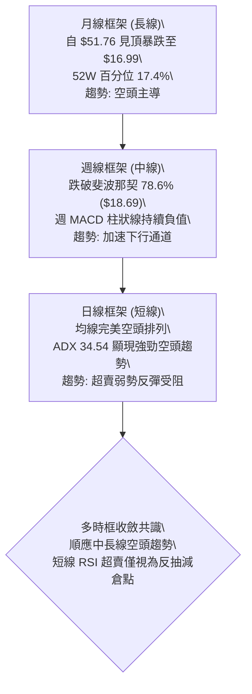

### 📈 長期趨勢 — 12個月走勢圖（Unicode）

```
PL 月線走勢圖（過去12個月：2025-10 至 2026-09）
價格軸 ($)
$52.00 ┤                                  ● $51.14 (2026-05)
$46.00 ┤                                 / \
$40.00 ┤                             ●  /   \
$34.00 ┤                            / \/     ● $33.13 (2026-06)
$28.00 ┤                  ●        /          \
$22.00 ┤        ●        / \      /            ● $20.48 (2026-07)
$16.00 ┤●      / \  ●───●   \    /              \  ● $16.99 (現價)
$10.00 ┤ \    /   \/         \  /                ●─── $19.85 (2026-08)
 $4.00 ┤  ●──●                ●
       └─────────────────────────────────────────────────────►
        10   11   12  01   02  03   04  05   06  07   08  09 (月份)
        (2025)                (2026)
```

**走勢特徵分析表格**：

| 階段 | 時間區間 | 起止價格 | 漲跌幅 | 走勢特徵與量價結構 |
|------|----------|----------|--------|--------------------|
| 第一階段：底部起爆 | 2025-09 ~ 2025-10 | $12.98 → $13.45 | +3.62% | 低檔出量盤整，脫離歷史谷底區間 ($2.21~$7.09) |
| 第二階段：主升浪段 | 2025-11 ~ 2026-05 | $11.90 → $51.14 | +329.75% | 爆發性多頭推升，於 2026-05 創下 52 週高點 $51.76 |
| 第三階段：見頂崩跌 | 2026-06 ~ 2026-07 | $51.14 → $20.48 | -59.95% | 巨量見頂後閃崩，週成交量單週突破 1 億股，主力高檔派發 |
| 第四階段：弱勢陰跌 | 2026-08 ~ 2026-09 | $20.48 → $16.99 | -17.04% | 破位下行，跌破斐波那契 78.6% 回檔位，成交動能疲軟 |

### 📊 中期趨勢（週線分析）

```
PL 週線壓力與支撐結構示意圖
$30.00 ┤
$27.57 ┤──────────────────────────────────────── 強阻力 R3 (密集套牢區)
$25.53 ┤──────────────────────────────────────── 阻力 R2 (反彈高點聚類)
$20.99 ┤──────────────────────────────────────── 關鍵阻力 R1 (前波低點轉阻力)
$18.69 ┤- - - - - - - - - - - - - - - - - - - - - 斐波那契 78.6% 破位線
$16.99 ┤                       ◄◄◄ 現價 ($16.99)
$14.51 ┤. . . . . . . . . . . . . . . . . . . . . 布林通道下軌
$11.97 ┤======================================== 關鍵支撐 S1 (前期平台低點)
$10.52 ┤======================================== 強支撐 S2 (波段起漲原點)
```

週線走勢顯示，PL 自 2026 年 5 月底見頂於 $51.14 以來，連續數週呈現巨量殺跌走勢。近 4 週收盤價分別為 $19.98、$18.12、$16.45 及當前之 $16.99，週線低點持續下移（Lower Lows）且反彈高點亦同步降低（Lower Highs），確立標準的中期下降趨勢。

### ⚡ 趨勢強度評估（ADX 解讀）

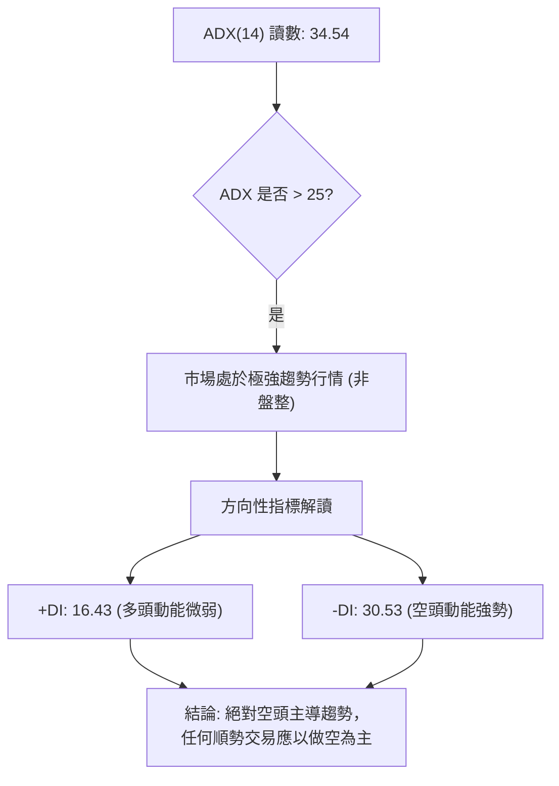

| 指標名稱 | 當前讀數 | 基準閾值 | 狀態評估 | 實質意義 |
|----------|----------|----------|----------|----------|
| **ADX (14)** | 34.54 | > 25.00 | 強烈趨勢 | 趨勢正在加速，消除無趨勢區間盤整可能性 |
| **+DI** | 16.43 | < 20.00 | 弱勢 | 多頭攻擊無力，反彈動能嚴重匱乏 |
| **-DI** | 30.53 | > 25.00 | 強勢 | 賣盤控制盤面，下行壓力具有持續性 |
| **差值 (-DI - +DI)** | +14.10 | > 0 | 空方佔優 | 方向指標呈現明顯開口擴大特徵 |

---

## 3. 圖表形態分析

### 🔍 形態識別系統

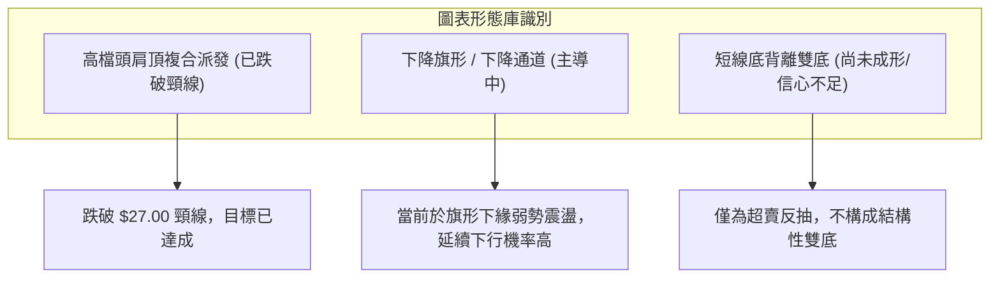

**圖表形態信心度與目標價評估**：

| 形態名稱 | 信心度 | 判斷依據（引用技術數據） | 完成度 | 目標價（附嚴格計算式） |
|----------|--------|--------------------------|--------|------------------------|
| **下降通道 / 熊旗** | 85% | 5月頂點 $51.76 以來高低點持續走低，日線完全受制於 MA20 ($18.94) | 75% | 跌破通道支撐向 S1 尋求防守：依下軌延伸指向 S1 $11.97 |
| **巨型頭肩頂破位** | 90% | 左肩 44.35、頭部 51.76、右肩 33.13，頸線約 $27.57 遭帶量擊穿 | 100% | 頸線 $27.57 - 形態高度 ($51.76-$27.57=$24.19) = 測幅目標 $3.38（極限延伸） |
| **潛在雙底反轉** | 25% | 短線低點 $16.45 與當前 $16.99 有止跌跡象，但量能無法配合 | 15% | 訊號不足，僅做指標型超賣解讀，不預設多頭成形目標 |

### 🕯️ 重要K線形態分析

| 週次/月份 | 收盤價 | K線形態 | 解讀 | 訊號 |
|-----------|--------|---------|------|------|
| 2026-05-31 | $51.14 | 巨量天花板長上影線 | 創 52W 高點 $51.76 後遇強大獲利了結賣壓，週成交量暴增至 6,148 萬股 | 🔴 強烈見頂 |
| 2026-06-07 | $32.22 | 崩跌大陰線 | 單週暴跌 -37.00%，破壞所有短期結構，週量破億（100,622,400 股），主力不計成本出逃 | 🔴 趨勢反轉 |
| 2026-08-16 | $24.69 | 弱勢反彈長上影線 | 反彈觸及 MA200 附近即遭逢解套賣壓壓制，確認反彈結束 | 🔴 誘多終結 |
| 2026-09-13 | $16.45 | 破底十字星下引線 | 出現空頭竭盡之長下影線，週 RSI 降至 10.0 極限值 | 🟡 空頭鈍化 |
| 2026-09-20 | $16.99 | 低檔微幅孕線 | 收盤價回升至 $16.99，暫止跌勢，但未脫離母線包覆，屬弱勢整理 | 🟡 超賣反抽 |

### 📉 ASCII 走勢形態示意圖

```
PL 日線下降旗形 / 破位形態示意圖
$27.57 ┼──────────────────── 上波頸線阻力 (R3)
       │      \
$25.53 ┼───────\─────────── 下降通道上軌 / 阻力 (R2)
       │        \     \
$20.99 ┼─────────\─────\─── 反彈阻力 (R1)
       │          \     \
$18.94 ┼───────────\─────\─ MA20 中軌防線
       │            \  *  \
$16.99 ┼─────────────\──*──\◄ 現價 ($16.99) 弱勢掙扎
       │              \  *  \
$14.51 ┼. . . . . . . .\ . . \ . 布林帶下軌
       │                \     \
$11.97 ┼─────────────────\─────\── 目標支撐位 (S1)
       └──────────────────\─────\────────────────►
```

### 🎯 形態目標價計算

根據近三個月形成的下降通道與前波頭肩頂形態進行幾何與波段推算：
1. **中期破位目標驗證**：
   - 頸線壓制點取自歷史密集交投區高點聚類：$27.57。
   - 下跌波段之主要支撐依據波段低點聚類分析，第一目標直指支撐位 **S1: $11.97**。
2. **短期旗形通道測幅**：
   - 旗桿起跌點：$24.69（2026-08-16），下跌至旗面低點 $16.45，旗桿長度 = $8.24。
   - 若短線反彈無法突破 MA20 ($18.94) 並確認破位，向下等長測幅：
     $$\text{測幅目標} = 18.94 - 8.24 = \$10.70$$
   - 此數值高度貼近關鍵支撐區間 **S2: $10.52**。

---

## 4. 支撐與阻力

### 🗺️ 關鍵價位分布圖（Unicode）

```
PL 價位結構分布圖（OHLCV 實際計算聚類）
══════════════════════════════════════════════════════════════════════════
$27.57 ║████████████████████████████████████████║ 強阻力 R3 (密集套牢巨量區)
$25.53 ║██████████████████████████              ║ 阻力 R2 (反彈高點聚類)
$20.99 ║████████████████                        ║ 關鍵阻力 R1 (突破轉折分水嶺)
$18.69 ╟────────────────────────────────────────╢ 斐波那契 78.6% 關鍵位
$16.99 ╠════════════════════════════════════════╣ ◄ 當前價格 ($16.99)
$14.51 ╎········································╎ 布林帶下軌動態支撐
$11.97 ║▓▓▓▓▓▓▓▓▓▓▓▓▓▓▓▓▓▓▓▓                    ║ 關鍵支撐 S1 (波段低點聚類)
$10.52 ║████████████████████████████████████    ║ 強支撐 S2 (起漲波段原點)
$09.68 ║████████████████████████████████████████║ 52週最低價 (100.0% 回調)
══════════════════════════════════════════════════════════════════════════
```

### 🚧 阻力位分析表

| 阻力級別 | 價位 | 形成原因 | 突破難度 | 重要性 |
|----------|------|----------|----------|--------|
| **R1** | **$20.99** | 近一年波段高點聚類，且貼近 MA50 ($21.40) 及 8月下旬密集震盪換手帶 | 75%（極難） | 🟢 短線多空強弱分界嶺 |
| **R2** | **$25.53** | 8月中旬反彈高點聚類，與斐波那契 61.8% ($25.75) 形成重疊共振壓力 | 85%（極高） | 🟡 中期空頭主要防線 |
| **R3** | **$27.57** | 6月下旬反彈高點與 MA200 ($27.18) 重疊區，為歷史破位頭部頸線 | 95%（極固） | 🔴 長期趨勢轉牛之絕對屏障 |

### 🛡️ 支撐位分析表

| 支撐級別 | 價位 | 形成原因 | 守住機率 | 重要性 |
|----------|------|----------|----------|--------|
| **S1** | **$11.97** | 近一年波段低點聚類，2025年9~11月起漲平台之密集成交區上沿 | 60%（中等） | 🔴 當前下行主要防守目標 |
| **S2** | **$10.52** | 起漲段基底支撐聚類，跌破則宣告 2025~2026 年整輪大多頭行情全數抹平 | 75%（較高） | 🔴 多方最後的生死防線 |
| **52W Low**| **$9.68** | 52 週最低點，斐波那契 100.0% 回調位 | 85%（極高） | 🟢 終極底限 |

### 📐 斐波那契回調位分析

依據 52 週區間波段（最低點 $9.68 → 最高點 $51.76，垂直落差 $42.08）精準計算：

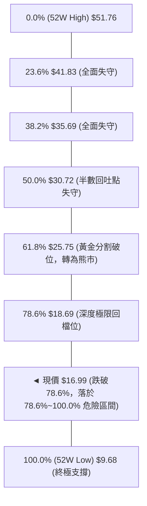

- **位置解讀**：現價 $16.99 明確**落於 78.6% ($18.69) 與 100.0% ($9.68) 之間**。
- **技術意義**：在經典道氏與斐波那契理論中，當股價跌破 61.8% ($25.75) 且無法守住 78.6% ($18.69) 極限回撤防線時，該走勢已被判定為「反轉行情」而非「牛市回踩」。現價在 $18.69 下方運行，上方所有斐波那契回調層級已全數轉換為沉重的結構性阻力。

---

## 5. 技術指標深度解讀

### 🎛️ 指標訊號總覽

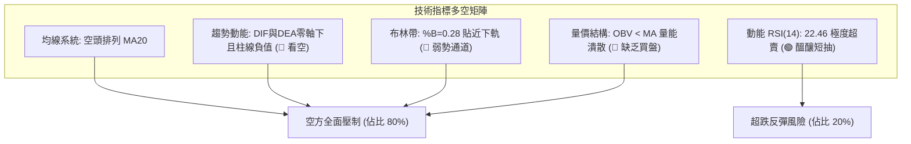

### 📈 移動平均線排列分析

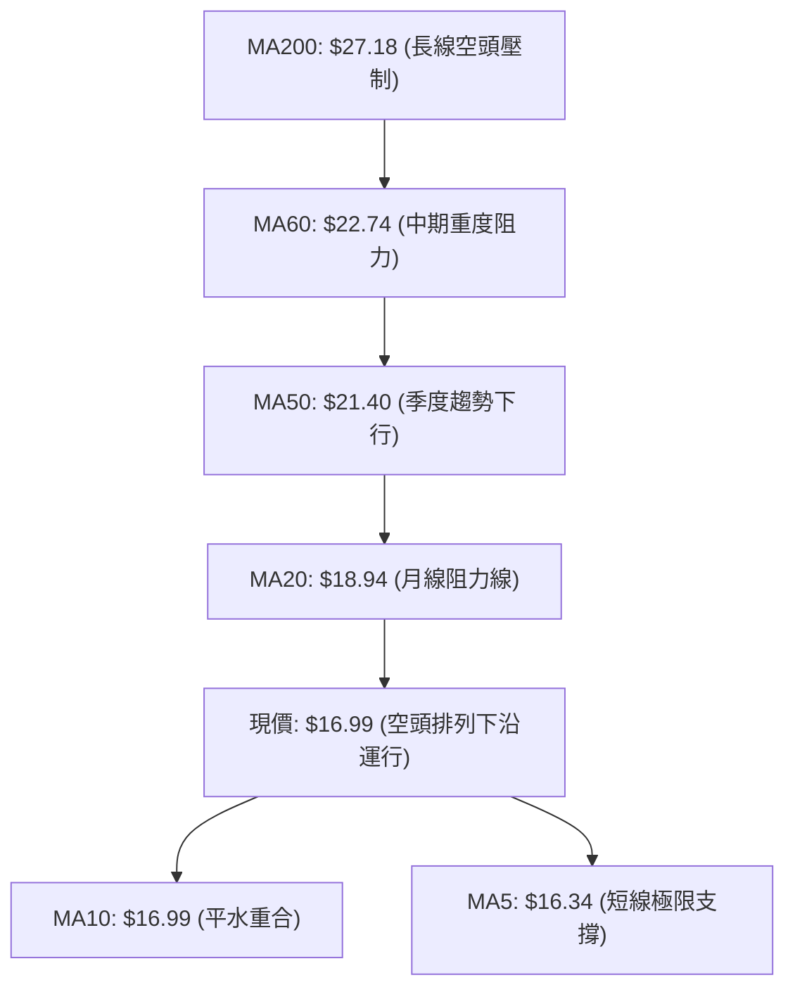

| 均線名稱 | 當前價格 | 與現價差距 | 斜率走勢特徵 | 訊號評級 |
|----------|----------|------------|--------------|----------|
| **MA5** | $16.34 | +4.00% | 走平微勾，連續數日跌深後出現平滑緩衝 | 🟡 短線有撐 |
| **MA10** | $16.99 | 0.00% | 完全重合，短線空頭進攻暫緩 | 🟡 多空僵持 |
| **MA20** | $18.94 | -10.31% | 陡峭向下，為反彈第一波巨大阻力 | 🔴 強烈看空 |
| **MA50** | $21.40 | -20.61% | 持續發散下壓，中期趨勢無逆轉跡象 | 🔴 強烈看空 |
| **MA60** | $22.74 | -25.28% | 空頭發散通道維持完整 | 🔴 強烈看空 |
| **MA120** | $29.99 | -43.35% | 半年線失守且差距過大，籌碼深度套牢 | 🔴 強烈看空 |
| **MA200** | $27.18 | -37.49% | 牛熊分界線失守，長期空頭格局成型 | 🔴 強烈看空 |
| **MA240** | $24.83 | -31.59% | 年線向下死叉中，長期趨勢嚴重破壞 | 🔴 強烈看空 |

均線呈現經典教科書式的「發散型完全空頭排列」（$MA5 < MA20 < MA50 < MA200$），所有中長期均線下壓角度均超過 30 度，代表每一次反彈碰觸 MA20 或 MA50 均為絕佳的逢高放空點。

### 📉 RSI(14) 分析

```
RSI(14) 動能進度條：
0            20   22.46   30                                70           100
├────────────┼──────▲─────┼─────────────────────────────────┼────────────┤
[█████████████████░░░░░░░░░░░░░░░░░░░░░░░░░░░░░░░░░░░░░░░░░░░░░░░░░░░░░░]
極度超賣區 (<30)    當前讀數: 22.46                        超買區 (>70)
```

- **超賣狀況解讀**：RSI(14) 目前為 **22.46**，深度浸泡於 30 以下的超賣區域。過去三週 RSI 最低曾觸及 10.0 的極度凍結點，顯示短線拋售動能已經高度消耗。
- **背離判斷**：
  - 週線級別：2026-09-13 低點 $16.45 伴隨 RSI 10.0，2026-09-20 現價 $16.99 伴隨 RSI 22.5，RSI 斜率微幅向上，然而價格並未創顯著新低。
  - **結論**：日線與週線**未形成標準底背離**（因為價格尚未二次探底破低而指標抬高），僅為單純指標低檔鈍化後的技術性修復，不可視為趨勢反轉之底背離訊號。

### 📊 MACD(12/26/9) 訊號解讀

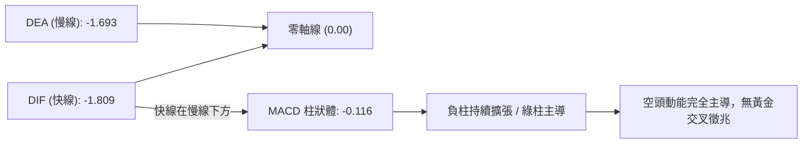

- **數值分析**：快線 DIF (-1.809) 低於慢線 DEA (-1.693)，且雙線深處於零軸下方極遠處，表明長期動能處於深度負循環。
- **柱狀體分析**：Histogram 為 **-0.116**，雖較前幾週的 -0.328 負值幅度有所收窄，但依然維持負值收盤，尚未出現柱狀體由負翻正之第一類買點訊號。

### 📦 布林通道分析

```
PL 日線布林通道 (20, 2) 結構圖
$23.37 ┬────────────────────────────────────────── BB 上軌 (Upper Band)
       │
$18.94 ┼────────────────────────────────────────── BB 中軌 / MA20 (Middle Band)
       │
$16.99 ┼══════════════════════════════════════════ ◄ 現價 (BB %B = 0.28)
       │
$14.51 ┴────────────────────────────────────────── BB 下軌 (Lower Band)
```

- **軌道狀態**：帶寬持續張開，通道下傾。
- **%B 指標分析**：當前 %B 為 **0.28**（位於下軌 $14.51 與中軌 $18.94 的偏下四分之一區）。
- **走勢意義**：股價並未跌破下軌產生「極端超跌軌外彈回」，而是沿著下軌上方進行弱勢「貼軌陰跌」，此為極為強勢的單邊空頭運行特徵。中軌 $18.94 將成為反彈不可逾越的第一動態反壓。

### 💹 成交量分析（量價配合度）

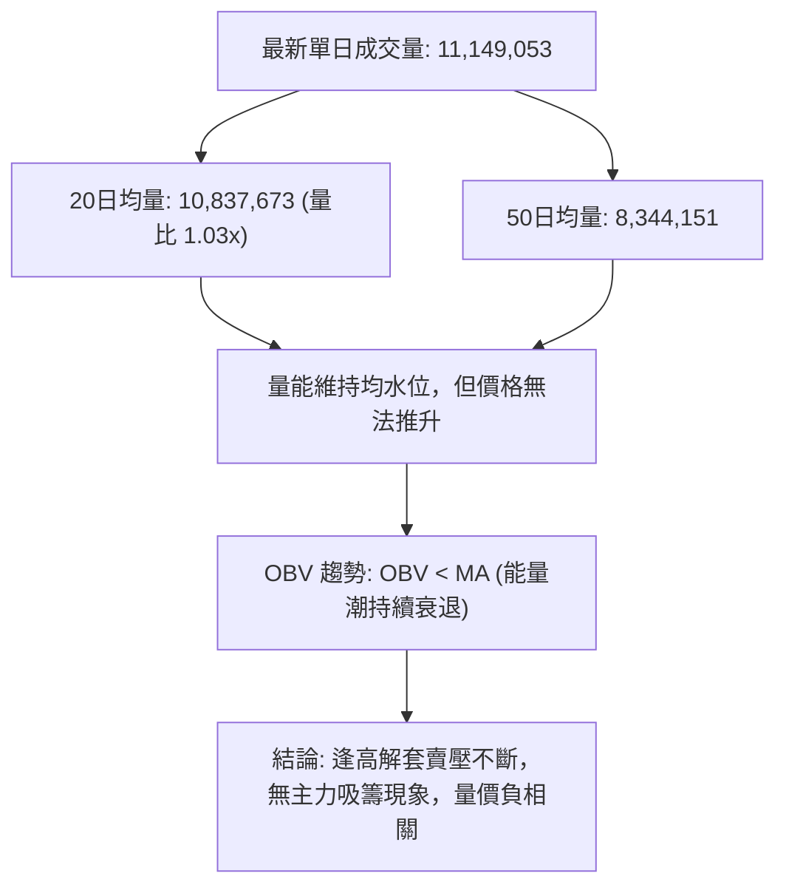

- **量價背離分析**：在 2026 年 5 月底股價見頂 $51.14 時，週成交量放大至 6,148 萬股；而在 6 月初跌破 $32.22 時，週成交量暴增至 1 億股，呈現標準的「高檔出貨爆量」。近幾週下跌時量能逐步收斂至 3,500 萬股，但 OBV 指標依然穩居均線下方，顯示「量縮非惜售，而是買盤全面退潮」，資金持續淨流出。

---

## 6. 動能與波動率

### ⚡ 動能評估四象限

| 象限 | 動能強度 | 波動率等級 | PL 當前定位 | 操作意義與評估 |
|------|----------|------------|-------------|----------------|
| **第一象限 (Q1)** | 強（多頭動能） | 低波動 | — | 穩定多頭主升段，最佳逢低佈局買點 |
| **第二象限 (Q2)** | 弱（多頭匱乏） | 低波動 | — | 盤整築底期，適合區間高拋低吸 |
| **第三象限 (Q3)** | 強（空頭動能） | 高波動 | **✓ 當前狀態** | **空頭主導加速期，順勢放空或嚴格空倉** |
| **第四象限 (Q4)** | 弱（動能衰竭） | 高波動 | — | 震盪洗盤，容易多空雙巴 |

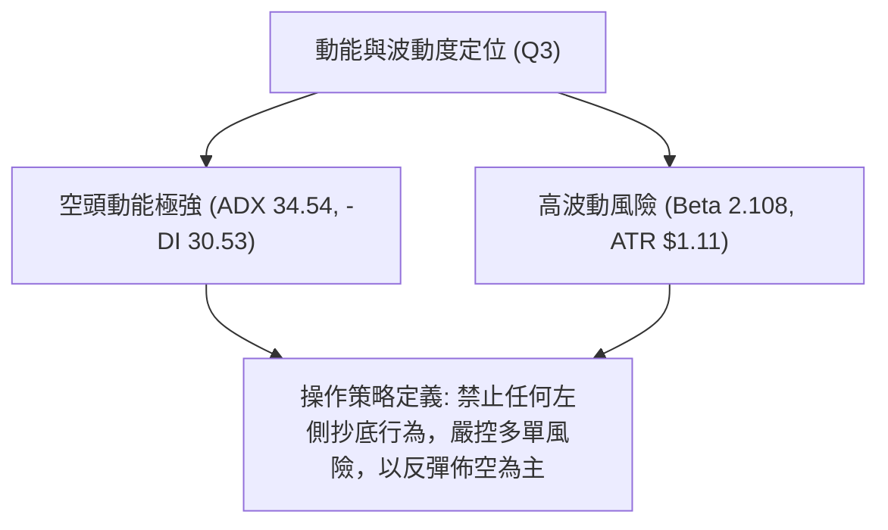

### 📊 ATR 波動率分析

- **ATR(14) 數值**：**$1.11**。
- **相對波動幅度**：$\frac{1.11}{16.99} = \mathbf{6.56\%}$。
- **風控止損評估**：
  - 由於個股單日平均波幅高達 6.56%，常規 2%~3% 的緊密止損極易被盤中雜訊掃出場。
  - **建議止損距離**：技術操作需設定至少 $1.5 \times \text{ATR}$（約 **$1.67**）至 $2.0 \times \text{ATR}$（約 **$2.22**）作為安全緩衝空間。

### 📐 Beta 與市場相關性

- **Beta 係數**：**2.108**。
- **市場敏感度分析**：PL 為高貝塔係數股票，其波動幅度為大盤（S&P 500）的 2.1 倍以上。在目前宏觀市場流動性趨緊或大盤回調的環境下，高估值無盈利太空科技股將承受成倍的拋售壓力；反之，若大盤出現強力反彈，該股亦具備強烈超跌反抽的彈性。

---

## 7. 多時框架總結

### 📋 時框架評分表

| 時框架 | 趨勢方向 | 動能狀態 | 均線排列 | 關鍵圖表形態 | 綜合評分 | 戰術建議 |
|--------|----------|----------|----------|--------------|----------|----------|
| **月線 (長期)** | 🔴 極弱空頭 | 負向發散 | 跌破所有中短期均線 | 高檔爆量流星線見頂 | 15/100 | 戰略性空頭，長線不可介入 |
| **週線 (中期)** | 🔴 空頭下行 | 負柱縮減 | MA20 穿過 MA50 死叉 | 下降通道運行中 | 25/100 | 逢反彈至阻力位即建立空倉 |
| **日線 (短期)** | 🟡 超跌盤整 | RSI極度超賣 | 發散型完全空頭 | 貼下軌弱勢抵抗，孕線震盪 | 38/100 | 激進者微量博反抽，嚴格止損 |

### 🔲 綜合訊號矩陣

```
時框一致性分析：
─────────────────────────────────────────────────────────────
長線 (月線)  : 🔴 空頭  ──┐
中線 (週線)  : 🔴 空頭  ────┼──► 核心共振：全週期空頭壓制
短線 (日線)  : 🟡 超賣反抽 ┘     (僅短線超賣存在反彈雜訊)
─────────────────────────────────────────────────────────────
訊號矛盾收斂：短線的反彈動能（RSI 22.46）與中長線的強烈下降趨勢（ADX 34.54）衝突。
收斂決策依據：遵循趨勢主導法則，大週期壓制小週期。日線的反彈訊號絕非「翻多」，
而是提供空頭「更高且更安全的做空點位（Better Risk-Reward Short Entry）」。
─────────────────────────────────────────────────────────────
```

### ⚖️ 多時框收斂結論

依據多時框收斂優先級規則：
1. 當前 **ADX(14) 數值為 34.54（明確大於 25）**，市場確立為**極強的單邊趨勢行情**，而非區間震盪行情。
2. 依規則第 14 條，趨勢行情必須以中長期（週線/MA50、MA200）方向為主導時框，日線級別僅用來尋找次級折返走勢中的精確入場點。
3. **唯一方向性結論**：**【強烈偏空觀望，逢反彈順勢佈空】**。
4. 此結論與第 1 章技術評分卡（28/100 偏空）、第 2 章趨勢分析以及第 5 章指標解讀完全收斂一致。

---

## 8. 交易策略建議

### 🗺️ 策略決策流程圖

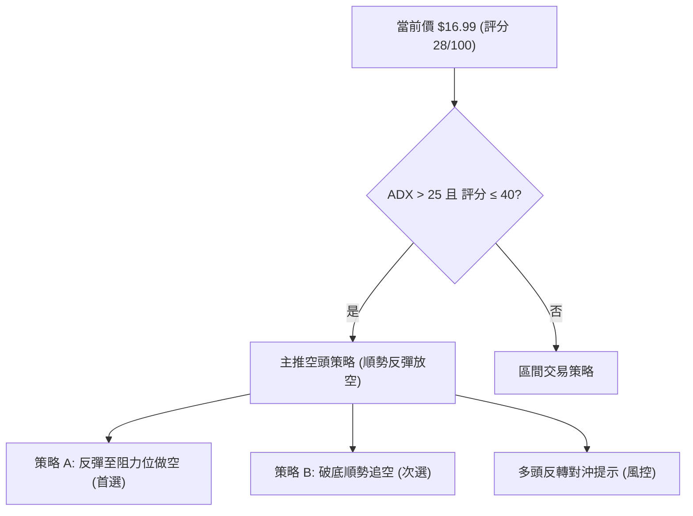

### 🧭 策略路由

> **當前主策略方向 = 【強烈偏空 / 主推空頭策略】（依評分卡綜合得分：28 / 100）**
> 
> 因綜合技術評分低於 40 分且 ADX 高達 34.54 確立空頭強趨勢，本報告**主推空頭策略**。多頭僅列為風險對沖與反轉防禦點，不建議一般投資人逆勢搶反彈。

### 🎯 價格情境階梯（Price Scenarios）

價位嚴格引用關鍵價位計算數值：

| 觸發條件 | 第一目標 | 後續延伸 | 情境含義與技術解讀 |
|----------|----------|----------|--------------------|
| 向上反彈觸碰 **R1: $20.99** | **R2: $25.53** | **R3: $27.57** | 短線超跌強勁修復，若在 R1 受阻為極佳空點 |
| 維持在 **$16.00 ~ $18.94** 震盪 | — | — | 弱勢消化日線超賣，受制於 MA20 ($18.94) |
| 向下擊穿近期低點並跌破 **S1: $11.97** | **S2: $10.52** | **52W Low: $9.68** | 空頭加速趕底，開啟新一輪主跌浪 |

### 📊 情境機率分佈

| 情境 | 機率 | 主要依據（引用指標狀態） |
|------|------|--------------------------|
| **情境一：弱勢反抽後再破底 (主跌)** | **65%** | 均線空頭排列，ADX=34.54 趨勢強勁，OBV 疲軟無資金承接 |
| **情境二：低檔橫盤整理 (以盤代跌)** | **25%** | RSI=22.46 極度超賣，限制短期暴跌空間，布林下軌支撐 |
| **情境三：強勢 V 型反轉 (轉牛)** | **10%** | 基本面欠缺催化劑，上方 R1/R2/R3 密集籌碼套牢沉重 |

### 🔴 主策略詳情（空頭主推）

所有進出場點位均精確引用關鍵價位與 ATR 計算：

| 策略要素 | 策略 A（反彈受阻放空 — 首選） | 策略 B（跌破支撐追空 — 次選） |
|----------|-------------------------------|-------------------------------|
| **策略邏輯** | 逢超賣反彈碰觸關鍵均線/阻力放空 | 跌破短線密集整理區順勢追擊 |
| **進場條件** | 反彈至 MA20 與 R1 區間出現滯漲長上影 | 跌破 9/13 低點 $16.45 且量能放大 |
| **進場價格** | **$18.94**（精確對齊 MA20 / BB中軌） | **$16.40**（確認破位進場） |
| **止損價格** | **$21.00**（R1 $20.99 上方加 $0.01） | **$17.51**（入場價 + 1.0x ATR $1.11） |
| **目標價 T1** | **$16.45**（前期波段低點） | **$11.97**（精確對齊支撐位 S1） |
| **目標價 T2** | **$11.97**（精確對齊支撐位 S1） | **$10.52**（精確對齊強支撐 S2） |
| **風險空間** | $2.06 | $1.11 |
| **獲利空間 (T2)**| $6.97 | $5.88 |
| **風險報酬比** | **1 : 3.38** (優異) | **1 : 5.30** (優異) |
| **預估勝率** | **65%** | **55%** |
| **建議倉位** | **總資金 8% ~ 10%** | **總資金 5%** |

### 🟢 反向風險觸發點（對沖與止損提示）

若持有多頭部位或考慮左側博弈者，必須嚴格遵守以下風控紅線：
1. **空頭被動平倉點**：若日線收盤價帶量突破 **R1: $20.99**，代表下降旗形形態失效，空頭必須無條件平倉觀望。
2. **多頭極限止損點**：任何搶反彈多單，只要盤中跌破前低 **$16.45**，必須即刻斬倉，嚴防加速滑向 **S1: $11.97**。

### ⭐ 整體訊號強度評星

```
做多訊號強度：★☆☆☆☆  (1/5星 — 僅超賣指標支撐，逆勢風險極高)
做空訊號強度：★★★★☆  (4/5星 — 趨勢、均線、動能完全共振看空)
整體可信度：  ★★★★☆  (4/5星 — ADX 高達 34.54，趨勢可信度強)
```

---

## 9. 風險提示與監控

### ✅ 關鍵監控指標 Checklist

```
╔══════════════════════════════════════════════════════════════╗
║                   每日交易監控清單 (Checklist)               ║
╠══════════════════════════════════════════════════════════════╣
║ [ ] 價格是否突破 MA20 ($18.94) 關鍵防線？                     ║
║ [ ] RSI(14) 是否脫離超賣區 (>30) 並形成日線雙底？              ║
║ [ ] 成交量是否異常放大至 20日均量 1.5 倍以上？ (主力進出)     ║
║ [ ] MACD 柱狀線是否由負轉正 (柱線翻紅)？                     ║
║ [ ] 股價是否跌破前低 $16.45 直奔 S1 ($11.97)？               ║
║ [ ] 空頭部位是否嚴格設置 $21.00 止損保護？                   ║
╚══════════════════════════════════════════════════════════════╝
```

### ⚠️ 風險場景分析

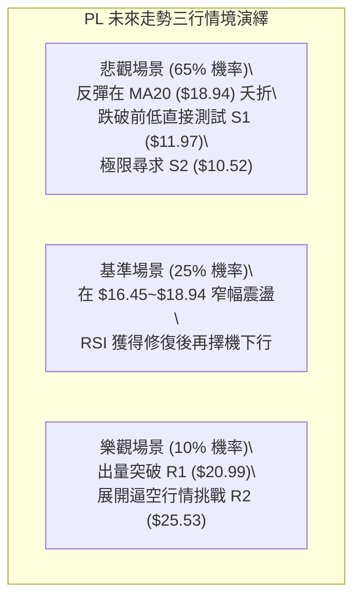

### 🛡️ 風險管理重要提醒

1. **極度空頭趨勢下的抄底陷阱**：
   - 許多零售交易者因見到 RSI 降至 22.46 而急於「盲目抄底」。然而在強趨勢行情中（ADX > 25），RSI 經常出現嚴重的「超賣鈍化」，股價可在 RSI 低於 30 的狀態下繼續暴跌 20%~30%。切勿單憑超賣指標逆勢摸底。
2. **高 Beta 波動的部位控管**：
   - PL Beta 高達 2.108，且單日 ATR 達 $1.11（6.56%）。這意味著該標的單日震盪幅度極其劇烈。建議單一帳戶在該標的上的風險曝險金額（Max Risk per Trade）不得超過總資產的 1.0%~1.5%。
3. **空頭回補與軋空風險（Short Squeeze）**：
   - 目前 PL 的 Short % Float 為 **9.7%**，Short Ratio 為 **5.72** 天。一旦市場出現不可預期的利多消息或機構大額買盤，將可能觸發一定程度的軋空反彈，因此做空必須嚴格執行 $21.00 的止損指令。

---

## 📋 報告總結

```
╔══════════════════════════════════════════════════════════════╗
║                   PL 技術分析報告總結                        ║
╠══════════════════════════════════════════════════════════════╣
║ 報告日期：2026-09-17                                          ║
║ 當前價格：$16.99                                              ║
║ 分析評級：🔴 強烈偏空（賣出 / 逢高做空）                      ║
╠══════════════════════════════════════════════════════════════╣
║ 關鍵結論：                                                    ║
║ ├─ 長期趨勢：🔴 跌破斐波那契 78.6% ($18.69)，巨型頂部確立     ║
║ ├─ 中期趨勢：🔴 週線下降通道運行，均線空頭排列發散           ║
║ ├─ 短期趨勢：🟡 RSI(14) 22.46 極度超賣，弱勢貼軌抗跌          ║
║ ├─ 關鍵支撐：S1: $11.97 ｜ S2: $10.52                        ║
║ ├─ 關鍵阻力：R1: $20.99 ｜ R2: $25.53 ｜ R3: $27.57          ║
║ └─ 機構共識：11 位分析師評級 Buy，目標價均值 $34.00 (與技術面嚴重背離) ║
╠══════════════════════════════════════════════════════════════╣
║ 最優策略組合：                                                ║
║ 1. 🥇 最佳機會：等待反彈至 MA20 ($18.94) 佈局做空 (策略 A)   ║
║ 2. 🥈 次選機會：跌破 $16.45 前低順勢追空至 S1 $11.97 (策略 B) ║
║ 3. 🥉 保守選擇：完全空倉觀望，待股價在 S1/S2 築底完成再行動  ║
╚══════════════════════════════════════════════════════════════╝
```

---

> ⚠️ **免責聲明**：本報告為技術分析研究成果，所有價位、圖表與數據均基於歷史量價客觀計算而成。本報告**僅供學術研究與投資參考**，**不構成任何要約、招攬或具體的投資買賣建議**。金融市場具有高度風險，投資人應獨立審慎評估風險承受能力並自行承擔盈虧。

---

*報告生成時間：2026-09-17 ｜ 數據來源：Yahoo Finance ｜ 分析框架：多時框技術分析體系*