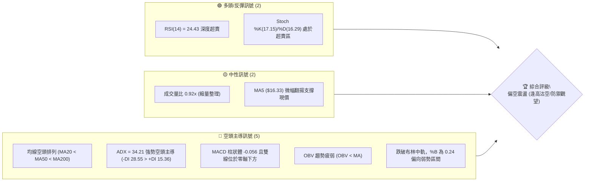
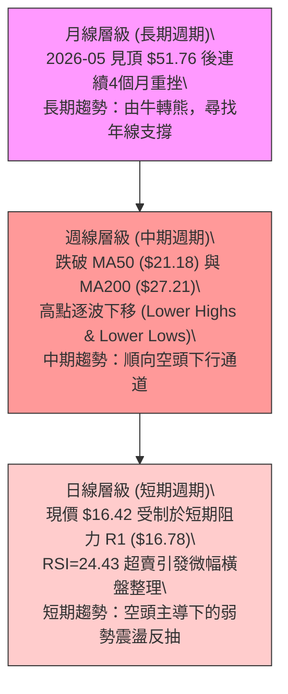
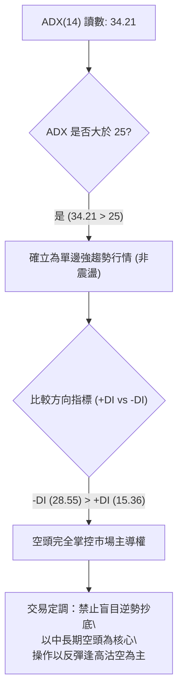
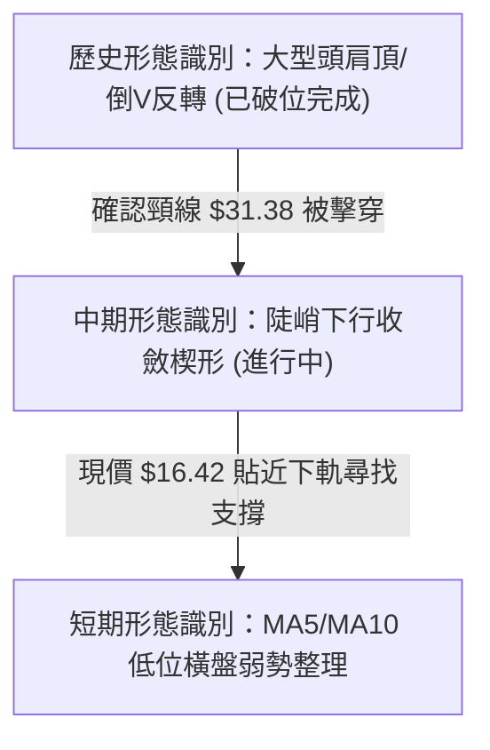
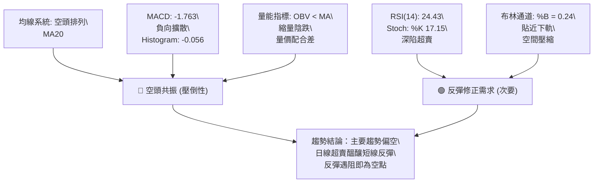
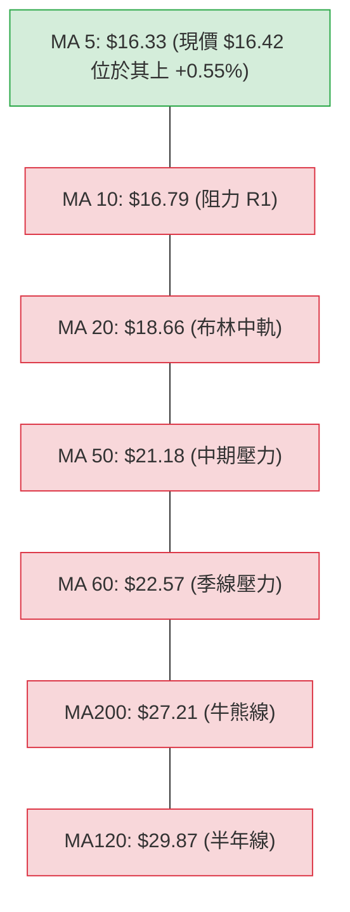
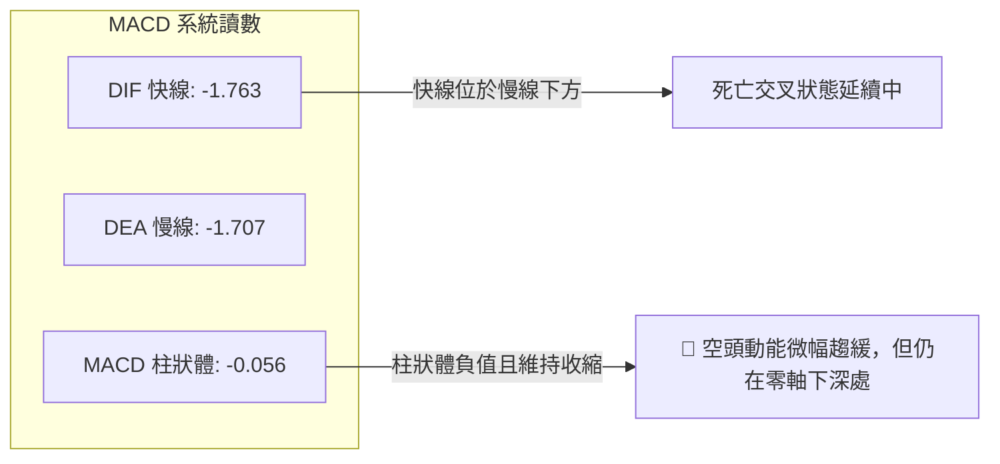
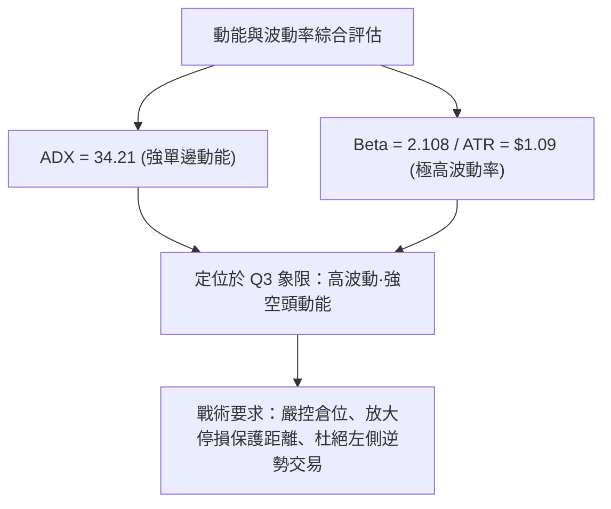
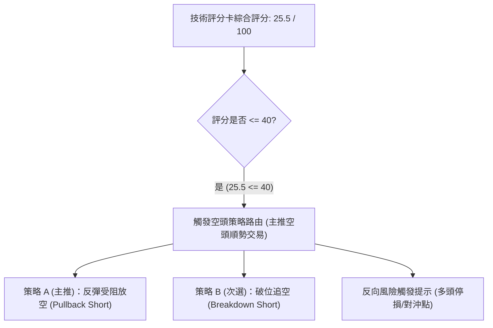
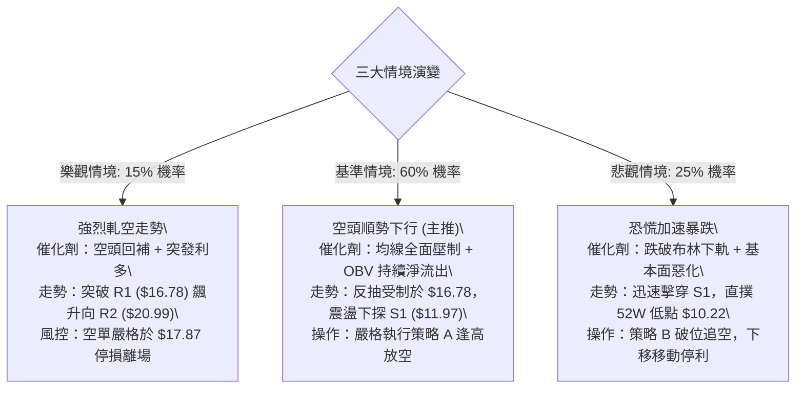

# PL 技術分析報告

> **報告日期**：2026-09-18 ｜ **語言**：繁體中文 ｜ **數據來源**：Yahoo Finance ｜ **當前價格**：$16.42

---

## 目錄

| 章節 | 內容 |
|------|------|
| [1. 技術面概覽](#1-技術面概覽) | 訊號儀表板、核心指標、評分卡 |
| [2. 趨勢分析](#2-趨勢分析) | 多時框趨勢、長中短期走勢 |
| [3. 圖表形態分析](#3-圖表形態分析) | 形態識別、K線組合、目標價 |
| [4. 支撐與阻力](#4-支撐與阻力) | 關鍵價位、斐波那契回調 |
| [5. 技術指標深度解讀](#5-技術指標深度解讀) | MA/RSI/MACD/布林/成交量 |
| [6. 動能與波動率](#6-動能與波動率) | 動能評估、ATR、Beta |
| [7. 多時框架總結](#7-多時框架總結) | 時框架評分矩陣 |
| [8. 交易策略建議](#8-交易策略建議) | 多空策略、風險報酬比 |
| [9. 風險提示與監控](#9-風險提示與監控) | 監控指標、風險場景 |
| [📋 報告總結](#-報告總結) | 核心結論與策略彙整 |

---

## 1. 技術面概覽

### 🎯 技術訊號儀表板



### 📊 核心指標速覽表

| 指標類別 | 指標名稱 | 當前數值 | 訊號 | 解讀 |
|:---|:---|:---|:---:|:---|
| **價格** | 當前收盤價 | $16.42 | 🔴 | 位於 52 週區間底部 14.9% 位置，深陷空頭修正 |
| **均線** | MA20 | $18.66 | 🔴 | 股價低於 MA20 達 -11.98%，短期趨勢向下承壓 |
| **均線** | MA50 | $21.18 | 🔴 | 中期關鍵防線已失守，均線形成下彎反壓 |
| **均線** | MA200 | $27.21 | 🔴 | 遠低於牛熊分界線 -39.65%，長期走勢確立轉空 |
| **動能** | RSI(14) | 24.43 | 🟢 | 進入極度超賣區（<30），隨時具備技術性反抽動能 |
| **動能** | MACD (12,26,9) | -1.763 / -1.707 | 🔴 | 負值區弱勢，柱狀體為 -0.056，空頭動能尚未反轉 |
| **趨勢** | ADX (14) | 34.21 | 🔴 | ADX > 25 且 -DI(28.55) > +DI(15.36)，單邊空頭趨勢強烈 |
| **通道** | 布林通道 %B | 0.24 | 🔴 | 位於下軌 ($14.36) 與中軌 ($18.66) 間，貼近弱勢通道 |
| **波動** | ATR(14) | $1.09 | 🟡 | 日波動幅度達 6.67%，日內震盪加劇，需放寬停損空間 |

### 🏆 技術評分卡

```
╔══════════════════════════════════════════════════════════════════╗
║                 技術評分卡 — PL (2026-09-18)                      ║
╠══════════════════════════════════════════════════════════════════╣
║ 趨勢強度 (ADX=34.21)    ██████████████░░░░░░  30/100  🔴 空頭單邊 ║
║ 動能指標 (RSI/MACD)     ████████░░░░░░░░░░░░  25/100  🔴 負向疲弱 ║
║ 支撐穩定度 (S1/S2距離)  ██████████░░░░░░░░░░  35/100  🟡 距離支撐遠 ║
║ 成交量配合 (OBV<MA)     ████████░░░░░░░░░░░░  28/100  🔴 缺乏買盤 ║
║ 形態完整度 (頭肩/破位)  ██████░░░░░░░░░░░░░░  20/100  🔴 築底未成 ║
║ 均線排列 (空頭發散)     ████░░░░░░░░░░░░░░░░  15/100  🔴 極度劣勢 ║
╠══════════════════════════════════════════════════════════════════╣
║ 綜合評分                ██████░░░░░░░░░░░░░░  25.5/100 🔴 強烈偏空 ║
╚══════════════════════════════════════════════════════════════════╝
```

---

## 2. 趨勢分析

### 🌐 多時框趨勢分析



### 📈 長期趨勢 — 12個月走勢圖（Unicode）

```
PL 月線走勢圖（過去12個月：2025-10 至 2026-09）
價格軸 ($)
$55 ┤                                  ● $51.14 (2026-05 高點 $51.76)
$50 ┤                                 ╱ ╲
$45 ┤                                ╱   ╲
$40 ┤                               ╱     ╲
$35 ┤                         ●    ╱       ● $33.13 (2026-06)
$30 ┤                        ╱ ╲  ╱         ╲
$25 ┤                  ●    ●   ╲╱           ╲
$20 ┤            ●    ╱ ╲  ╱                  ● $20.48 (2026-07)
$15 ┤      ●    ╱ ╲  ╱   ╲╱                    ╲    ● $19.85 (2026-08)
$10 ┤●    ╱ ╲  ╱   ╲╱                           ╲  ╱ ╲
 $5 ┤ ╲  ╱   ╲╱                                  ●    ● $16.42 (現價)
    └─┬───┬───┬───┬───┬───┬───┬───┬───┬───┬───┬───┬───
     10  11  12  01  02  03  04  05  06  07  08  09 (月份)
    (2025年) ───────────────► (2026年)
```

#### 走勢特徵分析表格

| 階段區間 | 起止月份 | 價格變動 | 區間漲跌幅 | 量價特徵與趨勢結構解讀 |
|:---|:---:|:---:|:---:|:---|
| **第一階段：初段主升** | 2025-10 → 2025-12 | $13.45 → $19.72 | +46.62% | 放量突破長期底部，突破均線集結帶，多頭發起第一波擴張。 |
| **第二階段：中段加速** | 2026-01 → 2026-05 | $24.97 → $51.14 | +104.81% | 拋物線式推升，於 2026-05 觸及歷史最高 $51.76，量能激增見投機狂熱。 |
| **第三階段：斷崖式崩落** | 2026-06 → 2026-07 | $51.14 → $20.48 | -59.95% | 單月重挫逾 35%，連破 MA20 與 MA50，機構資金大規模出逃，形成倒 V 反轉。 |
| **第四階段：破位陰跌** | 2026-08 → 2026-09 | $19.85 → $16.42 | -17.28% | 反彈乏力受制於 MA20 ($18.66)，跌破 78.6% 斐波那契位 ($19.11)，步入空頭尾段。 |

### 📊 中期趨勢（週線分析）

```
PL 近 20 週關鍵結構示意圖
$51.76 ── 頂部爆量十字反轉（2026-05-31 週成交量 61.48M）
          │
          ▼ 崩跌破頸線 $31.38（2026-06-07 週成交量飆至 100.62M，恐慌盤湧出）
$31.38 ── 前期雙頂頸線壓制位
          │
          ▼ 中繼破位下行，反彈高點受制於 R2 ($20.99)
$20.99 ── 近期波段次高點聚類（阻力 R2）
          │
$16.78 ── 短期均線壓制位（阻力 R1）
$16.42 ── [現價位置]：處於 10 週均量下方的縮量尋底階段
          │
$11.97 ── 關鍵支撐 S1（-27.10%）
$10.52 ── 關鍵支撐 S2 / 52W 低點 $10.22 密集防禦帶
```

### ⚡ 趨勢強度評估（ADX 解讀）



#### ADX 強度對照與量化特徵表

| 指標變量 | 數值 | 狀態評定 | 交易含義與收斂原則 |
|:---|:---:|:---:|:---|
| **ADX(14)** | **34.21** | 🟢 強趨勢 (>25) | 行情擺脫無方向盤整，進入具備強烈慣性的趨勢軌道，趨勢交易策略優先度高於擺盪策略。 |
| **+DI (14)** | **15.36** | 🔴 多頭動能衰竭 | 多方力量持續低於 20 基準線，表明每一次盤中反彈皆缺乏機構增量買盤介入。 |
| **-DI (14)** | **28.55** | 🔴 空頭力量強盛 | 空方佔據絕對壓倒性優勢，高於 +DI 達 13.19 個點位，確認下行拋壓主導走勢。 |
| **多時框收斂判定** | **趨勢主導** | 依據規則 14 | **ADX > 25 判定為趨勢行情**。依照優先級，必須服從週線與長期均線（MA50/MA200）方向，日線超賣僅能視為技術反抽修正，不可作為趨勢反轉依據。 |

---

## 3. 圖表形態分析

### 🔍 形態識別系統



#### 形態識別與信心度矩陣表（依規則 15）

| 形態名稱 | 信心度 | 判斷依據（引用精確數據） | 完成度 | 目標價計算式與精確點位 |
|:---|:---:|:---|:---:|:---|
| **中期下行楔形 / 下跌通道** | **70%** | 週線高點由 $24.69(08-16) $\to$ $22.29(08-23) $\to$ $19.98(08-30) $\to$ 現價 $16.42，斜率陡峭，下測 BB 下軌 $14.36。 | **85%** | 由楔形上軌阻力 R1 **$16.78** 反推跌破；若破位，量度目標指向支撐 S1 **$11.97**。 |
| **大型頭肩頂破位（歷史量度）** | **85%** | 頭部 $51.76，左肩約 $36.97，右肩 $33.13，頸線聚類於 $31.38。 | **100% (已達成)** | 頸線 $31.38 - 形態高度 ($51.76 - 31.38 = 20.38) = 理論量度目標 **$11.00**（高度吻合 S1 **$11.97** 與 S2 **$10.52** 支撐區間）。 |
| **潛在雙底打底形態** | **25%** | 目前僅見單一低點 $16.42，缺乏第二次回踩打底結構，成交量未見放大。 | **15%** | **數據不足，信心度 < 50%**。依規則註明：訊號不足，不成立幾何形態，僅作指標超賣之指標型解讀。 |

### 🕯️ 重要K線形態分析

| 週期/日期 | 收盤價 | K線形態 | 量能狀態 | 解讀與技術訊號 |
|:---:|:---:|:---|:---:|:---|
| **2026-05 (月線)** | $51.14 | 長上影流星線 (Shooting Star) | 61.48M (週峰值) | 🔴 多頭力竭見頂，在創下 52W 高點 $51.76 後遭遇毀滅性拋壓，反轉訊號極強。 |
| **2026-06 (月線)** | $33.13 | 巨量大陰線 (Bearish Marubozu) | 100.62M (天量) | 🔴 實體大陰線吞沒前 2 個月漲幅，機構主力堅決出貨，確認中期反轉成立。 |
| **2026-08-16 (週線)**| $24.69 | 弱勢反彈十字星 | 23.53M (縮量) | 🟡 反彈量能嚴重背離，受制於 MA200 ($27.21)，確認為空頭逃命波。 |
| **2026-09-06 (週線)**| $18.12 | 破位長黑K | 85.36M (爆量) | 🔴 帶量擊穿 $20 整數關卡與斐波那契 78.6% 回調位 ($19.11)，空方再度加速。 |
| **2026-09-20 (當週)**| $16.42 | 低檔十字星/孕線雛形 | 46.26M (量縮) | 🟡 跌勢於 MA5 ($16.33) 附近暫時放緩，空方拋壓微幅減弱，醞釀超跌反抽。 |

### 📉 ASCII 走勢形態示意圖

```
PL 近期走勢結構與阻力支撐位剖析
      $24.69 (08-16 高點)
        ▲
       ╱ ╲
      ╱   ▼ $22.29 (08-23 次高點)
     ╱     ╲
    ╱       ▲ $20.99 (阻力 R2)
   ╱         ╲
  ╱           ▼ $19.98 (08-30)
 ╱             ╲
╱               ▼ $18.12 (09-06 長黑破位)
                 ╲
                  ▲ $16.78 (短期反壓 R1 / MA10)
                   ╲
                    ● $16.42 [現價：弱勢貼地整理]
                     │
                     ┊ 潛在下行空間
                     ▼
                    ──────────────── $14.36 (布林下軌支撐)
                     │
                     ▼
                    ════════════════ $11.97 (強支撐 S1)
```

### 🎯 形態目標價計算

根據大型頭肩頂破位之量度跌幅計算規則：
1. **頭部最高點**：$51.76
2. **有效破位頸線**：$31.38（2026-07-05 當週破位反抽之波段頸線高點）
3. **形態垂直高度**：$H = 51.76 - 31.38 = \$20.38$
4. **理論量度跌幅目標價**：
   $$\text{Target} = \text{頸線} - H = 31.38 - 20.38 = \$11.00$$
5. **數值驗證與收斂**：計算出的理論目標價 $\$11.00$ 與 OHLCV 歷史數據集算出的關鍵支撐區間 **S1 ($11.97)** 與 **S2 ($10.52)** 極度吻合。證明當前價格 $16.42 仍處於朝向該目標運行的空頭慣性路徑之中。

---

## 4. 支撐與阻力

### 🗺️ 關鍵價位分布圖（Unicode）

```
PL 價位結構分布圖（嚴格依據 OHLCV 聚合計算數據）
═══════════════════════════════════════════════════════════════════
$27.21 ║████████████████████████████████║ 牛熊生死線 MA200
$26.09 ║████████████████████████████    ║ 斐波那契 61.8% 強阻力
$25.53 ║██████████████████████████████  ║ 強阻力 R3 (+55.48%)
$21.18 ║████████████████████            ║ 中期均線 MA50 壓力
$20.99 ║██████████████████████          ║ 波段阻力 R2 (+27.83%)
$19.11 ║████████████████                ║ 斐波那契 78.6% 回調位
$18.66 ║██████████████                  ║ 布林中軌 / MA20 關鍵動態壓力
$16.78 ║████████████████████████████████║ 短期阻力 R1 (+2.19%) / MA10
───────╫────────────────────────────────╫───────────────────────────
$16.42 ╠════════════════════════════════╣ ◄◄ 現價位置 (ATR = $1.09)
───────╫────────────────────────────────╫───────────────────────────
$14.36 ║▓▓▓▓▓▓▓▓▓▓▓▓                    ║ 布林下軌動態支撐
$11.97 ║████████████████████████████    ║ 近一年波段強支撐 S1 (-27.10%)
$10.52 ║████████████████████████████████║ 核心支撐 S2 (-35.93%)
$10.22 ║████████████████████████████████║ 52週歷史低點 (斐波那契 100.0%)
═══════════════════════════════════════════════════════════════════
```

### 🚧 阻力位分析表

| 阻力級別 | 精確價位 | 距現價空間 | 形成原因與技術共振 | 突破難度 | 重要性評級 |
|:---|:---:|:---:|:---|:---:|:---:|
| **R1 (短期)** | **$16.78** | +2.19% | 近一年波段高點聚類、MA10 ($16.79) 密集下壓共振位。 | 🟡 中等 | ★★★☆☆ |
| **R2 (中期)** | **$20.99** | +27.83% | 2026年7-8月多個波段反彈高點聚類，接近 MA50 ($21.18) 與整數關卡。 | 🔴 極高 | ★★★★☆ |
| **R3 (強阻力)**| **$25.53** | +55.48% | 波段頂部密集套牢區聚類，上方緊鄰 MA200 ($27.21) 與斐波那契 61.8% ($26.09)。 | 🔴 極難突破 | ★★★★★ |

### 🛡️ 支撐位分析表

| 支撐級別 | 精確價位 | 距現價空間 | 形成原因與技術共振 | 守住機率 | 重要性評級 |
|:---|:---:|:---:|:---|:---:|:---:|
| **動態支撐** | **$14.36** | -12.55% | 日線布林通道下軌極限支撐，通常引發通道內的均值回歸。 | 60% | ★★★☆☆ |
| **S1 (波段強支撐)**| **$11.97** | -27.10% | 近一年密集波段低點聚類，頭肩頂形態理論量度目標區間之首道屏障。 | 75% | ★★★★☆ |
| **S2 (核心底線)** | **$10.52** | -35.93% | 歷史起漲點強支撐聚類，緊鄰 52 週最低價 **$10.22**。此處為多方最後退路。 | 85% | ★★★★★ |

### 📐 斐波那契回調位分析

依據 52 週區間波段低點 **$10.22** 至歷史最高點 **$51.76** 計算斐波那契黃金分割水準：

| 回調比例 | 精確價位 | 與現價關係 | 技術意義與多空心理學解讀 |
|:---:|:---:|:---:|:---|
| **0.0% (52W High)** | **$51.76** | +215.2% | 歷史極限高點，本輪多頭狂熱行情的終點。 |
| **23.6%** | **$41.96** | +155.5% | 第一道回調支撐（失守後引發第一輪多殺多）。 |
| **38.2%** | **$35.89** | +118.6% | 弱勢回調分界線（迅速遭放量大陰線擊穿）。 |
| **50.0%** | **$30.99** | +88.7% | 多空力量中樞，頸線聚類區間（失守確立轉熊）。 |
| **61.8%** | **$26.09** | +58.9% | 黃金分割關鍵防線，反彈失敗後轉為中期沉重天花板。 |
| **78.6%** | **$19.11** | +16.4% | 深幅回調警戒線；**現價 ($16.42) 已實質跌破此位**，表明跌勢超出一般回調範疇。 |
| **100.0% (52W Low)**| **$10.22** | -37.8% | 原始起漲點，若無法在 S1 ($11.97) 止跌，價格將全面回歸起漲基準點。 |

> **回調狀態解讀**：現價 **$16.42** 目前運行於 **78.6% ($19.11)** 與 **100.0% ($10.22)** 之間，屬於**極深幅度的回調結構**。跌破 78.6% 意味著先前的上漲浪潮結構遭到徹底破壞，股價大概率向下尋求 100% 原始低點區域的支撐。

---

## 5. 技術指標深度解讀

### 🎛️ 指標訊號總覽



### 📈 移動平均線排列分析



#### 均線量化矩陣

| 均線名稱 | 數值 | 偏離度 (與現價) | 趨勢斜率 | 技術意涵解讀 |
|:---|:---:|:---:|:---:|:---|
| **MA 5** | $16.33 | +0.55% | ▲ 走平微揚 | 跌勢暫時緩解，為當前唯一提供日內支撐的極短期均線。 |
| **MA 10** | $16.79 | -2.23% | ▼ 陡峭向下 | 與阻力 R1 ($16.78) 完全重合，為多方短線反抽的首道硬天花板。 |
| **MA 20** | $18.66 | -11.98% | ▼ 持續下彎 | 月線級別反壓，短期空頭防守核心點，未站上此前弱勢不改。 |
| **MA 50** | $21.18 | -22.47% | ▼ 加速下墜 | 季線級別中長期趨勢反壓，判定中期走勢處於空頭市場。 |
| **MA 200**| $27.21 | -39.65% | ▼ 拐頭向下 | 長期牛熊分界線，股價遠離 MA200 呈現嚴重負乖離。 |

### 📉 RSI(14) 分析

#### RSI 數值強度展示
```
RSI(14) 當前讀數：24.43
0 ─────── 20 ──────── 30 ──────────────────────── 70 ─────── 100
[ 極度超賣區 ] ◄ 24.43      [ 中性常態區 ]         [ 超買區 ]
██████░░░░░░░░░░░░░░░░░░░░░░░░░░░░░░░░░░░░░░░░░░░░░░░░░░░░░ 24.4%
```

- **超買超賣狀態**：RSI(14) 讀數為 **24.43**，處於明確的超賣區間（<30），且隨機指標 Stoch %K (17.15) 與 %D (16.29) 同樣低於 20。此訊號表示短線拋售已達情緒極端，做空邊際效益遞減，空頭容易遭遇技術性軋空回補。
- **背離分析判斷**：
  - 比對週線價格走勢：價格從 2026-09-06 的 $18.12 跌至 2026-09-20 的 $16.42（創新低）；
  - 比對 RSI 數值：週線 RSI 由 10.7 回升至 24.4；但檢視日線層級，官方數據明確標記 **「RSI 背離: 無明顯背離」**。
  - **權威結論**：當前並無標準的多頭底背離結構，目前的超賣僅屬於單邊下跌途中的「鈍化型超賣」，不能作為趨勢反轉信號，僅能預期弱勢的均值回歸修復。

### 📊 MACD(12/26/9) 訊號解讀



- **訊號解析**：MACD 線 (-1.763) 位於訊號線 (-1.707) 下方，雙線均處於負值深水區（遠離零軸）。柱狀體數值為 **-0.056**，顯示下行加速度略有收斂，但多頭並未形成有效「黃金交叉」。在雙線未穿越零軸前，任何 MACD 翻紅皆僅能視為空頭中繼反彈。

### 📦 布林通道分析

```
PL 日線布林通道結構示意圖（帶寬 20, 2）
$22.95 ───────────────────────────────── BB 上軌 (Upper Band)
        │
        │
$18.66 ─┼─ ─ ─ ─ ─ ─ ─ ─ ─ ─ ─ ─ ─ ─ ─ ─ BB 中軌 (MA20 基準線)
        │
$16.42 ─┼─► [現價位置: %B = 0.24]
        │
$14.36 ───────────────────────────────── BB 下軌 (Lower Band)
```

- **通道讀數剖析**：
  - **布林上軌**：$22.95
  - **布林中軌 (MA20)**：$18.66
  - **布林下軌**：$14.36
  - **當前 %B 數值**：**0.24**
- **位置與帶寬含義**：%B 讀數 0.24 表明現價落在下半通道，且正朝下軌逼近。通道開口呈現擴張態勢，顯示波動度在下行方向展開。由於價格未跌破下軌極值 0.00，空頭仍有下行慣性，若回抽無法站穩中軌 $18.66，通道將持續向下引導走勢。

### 💹 成交量分析（量價配合度）

```
量價對比分析
當日成交量:  10,249,745  ████████████████████░░░░ (0.92x 20日均量)
20日均量:    11,134,062  ██████████████████████░░ (基準線 1.00x)
50日均量:     8,410,307  ████████████████░░░░░░░░ (中期量能參考)
OBV 走勢狀態: OBV < MA (量能疲弱，資金持續淨流出)
```

- **量價關係解讀**：
  1. **縮量下行與買盤匱乏**：最新成交量約 1,025 萬股，量比為 0.92x，在跌破多道關鍵防線後並未引發大規模「恐慌拋售潮」（Capitulation Volume），但也未見抄底機構買盤介入，走勢呈現典型的「縮量陰跌」格局。
  2. **OBV 指標疲軟**：OBV 持續低於其移動平均線，資金流向呈現淨流出。量能無法有效放大確認價格回升，意味著缺乏推動多頭反轉的實質燃料。

---

## 6. 動能與波動率

### ⚡ 動能評估四象限

| 象限 | 動能維度 | 波動維度 | 狀態特徵 | PL 當前落點判定 |
|:---:|:---:|:---:|:---|:---:|
| **Q1 (高動能·低波動)** | 強多頭/強空頭 | 低波動 | 穩定單邊趨勢，極佳順勢波段機會 | — |
| **Q2 (弱動能·低波動)** | 震盪無方向 | 低波動 | 窄幅盤整，流動性枯竭 | — |
| **Q3 (強動能·高波動)** | **強勢下行** | **高波動** | **空頭單邊暴跌，劇烈震盪，高風險** | **★ PL 當前所屬象限 (Q3)** |
| **Q4 (弱動能·高波動)** | 假突破頻繁 | 高波動 | 混沌震盪洗盤，容易觸發雙向停損 | — |



### 📊 ATR 波動率分析

- **ATR(14) 當前數值**：**$1.09**
- **價格百分比佔比**：**6.67%**（單日典型波動幅度高達股價的 6.67%，屬於極高波動度標的）。
- **停損與風控距離量化設定**：
  - **保守型保護停損距離 (2.0 × ATR)**：$2.0 \times 1.09 = \mathbf{\$2.18}$（防止日內隨機噪音掃單）。
  - **進取型動態追蹤距離 (1.5 × ATR)**：$1.5 \times 1.09 = \mathbf{\$1.64}$。
  - **日內交易波動預警**：日內正常上下震盪區間為 $16.42 \pm \$1.09$（即 $15.33 \sim \$17.51$），任何在此區間內的起伏均屬隨機波動，切勿過度解讀為趨勢反轉。

### 📐 Beta 與市場相關性

- **Beta 係數**：**2.108**
- **市場敏感度評估**：
  - PL 的波動彈性為標普 500 指數的 **2.1 倍以上**。
  - 屬於典型的高貝塔、高風險成長型科技/航太防務標的。當整體大盤（S&P 500 / 納斯達克）出現回檔時，PL 容易面臨雙倍以上的拋壓；若大盤強勢反彈，其超跌彈性亦相對可觀。
- **放空比率 (Short Interest)**：
  - Short % of Float 達 **9.7%**，Short Ratio 為 **5.72 天**。空頭部位相當集中，一旦遭遇重大基本面利多或突破 R1 ($16.78)，具備潛在軋空爆發力。

---

## 7. 多時框架總結

### 📋 時框架評分表

| 時框架 | 趨勢方向 | 動能狀態 | 均線排列 | 關鍵圖表形態 | 綜合評分 | 建議操作維度 |
|:---|:---:|:---:|:---:|:---|:---:|:---|
| **月線 (長期)** | 🔴 強烈看空 | 弱勢下行 | 跌破 12 個月高點 | 歷史頭肩頂崩落 | 20/100 | 戰略性減倉 / 規避長期多頭持有 |
| **週線 (中期)** | 🔴 空頭主導 | MACD 零下擴散 | 跌破 MA50/MA200 | 下行收斂通道中繼 | 25/100 | 主策略逢高沽空 / 順勢操作 |
| **日線 (短期)** | 🟡 弱勢整理 | RSI 深度超賣 | 均線空頭排列 | 低位橫盤抗跌 | 35/100 | 僅供超短線高敏捷反彈博弈 |

### 🔲 綜合訊號矩陣

| 評估維度 | 日線訊號 (短期) | 週線訊號 (中期) | 月線訊號 (長期) | 多時框共振結論 |
|:---|:---:|:---:|:---:|:---|
| **趨勢方向** | 橫盤抗跌 (🟡) | 順勢下跌 (🔴) | 破位崩跌 (🔴) | 🔴 長中期空頭方向完全共振 |
| **動能結構** | 超賣反抽 (🟢) | 空頭主導 (🔴) | 動能衰竭 (🔴) | 🔴 短期超賣難以逆轉中長期頹勢 |
| **均線系統** | MA5 翻揚 (🟢) | 均線死叉 (🔴) | 遠離高位 (🔴) | 🔴 均線層層反壓，反彈空間受限 |
| **成交量能** | 縮量橫盤 (🟡) | 巨量出逃 (🔴) | 天量見頂 (🔴) | 🔴 主力出貨完畢，目前處於散戶無序盤整 |

### ⚖️ 多時框收斂結論

> **依據「嚴格要求 14」執行多時框優先級判定**：
> 1. **趨勢/盤整判定**：當前 **ADX(14) 讀數為 34.21**，遠高於 25 的趨勢門檻值，且 -DI (28.55) 顯著高於 +DI (15.36)。**行情確立為單邊趨勢行情（空頭趨勢）**，而非盤整震盪市。
> 2. **優先級收斂原則**：在趨勢行情下，必須以**中長期（週線、MA50 $21.18、MA200 $27.21）所指向的空頭方向為主導**；日線級別的 RSI(14)=24.43 深度超賣，僅能用作尋找空頭部位最佳進場點（反彈逢高沽空）或極短線超跌反抽的離場時機，嚴禁作為扭轉大級別趨勢的翻多信號。
> 3. **唯一方向性結論**：**【全面偏空（Sell on Rallies 逢高沽空）】**。

---

## 8. 交易策略建議

### 🗺️ 策略決策流程圖



### 🧭 策略路由

- **綜合評分判定**：依據第 1 章技術評分卡，綜合評分為 **25.5 / 100**（$\le 40$ 強烈偏空）。
- **當前主策略方向**：**【主推空頭策略 — 順應週線趨勢反彈沽空】**。
  - 多頭操作僅列為風控反轉觸發提示，不作為主推建倉方案。

### 🎯 價格情境階梯（Price Scenarios）

價位嚴格引用第 4 章「關鍵價位」與 OHLCV 聚類計算數據：

| 觸發條件 | 下一目標 | 後續延伸目標 | 情境技術含義 |
|:---|:---:|:---:|:---|
| **強勢升破 R1 $16.78** | R2 **$20.99** | R3 **$25.53** | 短線空頭回補軋空，挑戰 MA50 中期關鍵壓力位。 |
| **承壓於 R1 且受阻回落** | 布林下軌 **$14.36** | 支撐 S1 **$11.97** | 順應中長期趨勢，延續下行通道下探支撐（高機率情境）。 |
| **跌破下軌並擊穿 S1 $11.97** | S2 **$10.52** | 52W Low **$10.22** | 空頭全面加速，達成大型頭肩頂歷史量度目標。 |

### 📊 情境機率分佈

```
情境機率分佈圖
繼續破位下行 (空頭延續)  ████████████████████████████░░  60%
低位弱勢區間震盪整理    █████████████░░░░░░░░░░░░░░░░  25%
強勢反轉向上突破 R1     ████████░░░░░░░░░░░░░░░░░░░░  15%
```

| 情境劇本 | 機率 | 主要技術依據與數據驗證 |
|:---|:---:|:---|
| **情境一：反抽受阻，重啟跌勢** | **60%** | ADX=34.21 強空頭趨勢、均線系統全面空頭排列、OBV < MA 資金流出。 |
| **情境二：低位底背離前震盪** | **25%** | RSI=24.43 深度超賣引發空頭回補，但缺乏成交量支持，維持 $14.36 $\sim$ $16.78 區間拉鋸。 |
| **情境三：V型反轉突破反彈** | **15%** | Short Float 達 9.7%，若有非預期重大利多引發短線暴力軋空突破 R1 ($16.78)。 |

### 🟢 主策略詳情（空頭主導策略）

嚴格引用數據集之數值與形態推算點位：

| 策略要素 | 策略 A（主推：反彈受阻做空） | 策略 B（次選：跌破下軌追空） |
|:---|:---|:---|
| **交易邏輯** | 順應 MA20 下行趨勢，於 R1 阻力處逢高沽空 | 跌破布林下軌弱勢支撐，順勢追擊空頭量度空間 |
| **進場條件** | 價格反抽至 R1 遇阻收上影線，且 RSI < 40 | 日K收盤價實質跌破布林下軌 $14.36 |
| **進場價格** | **$16.78** (阻力位 R1 精確點位) | **$14.36** (布林下軌破位點) |
| **目標價 T1** | **$14.36** (布林下軌，報酬 +14.4%) | **$11.97** (支撐位 S1，報酬 +16.6%) |
| **目標價 T2** | **$11.97** (關鍵支撐 S1，報酬 +28.7%) | **$10.52** (關鍵支撐 S2，報酬 +26.7%) |
| **停損價格** | **$17.87** ($16.78 + 1.0 \times ATR $1.09) | **$15.45** ($14.36 + 1.0 \times ATR $1.09) |
| **風險報酬比** | **1 : 2.64** (以 T1/T2 綜合計算) | **1 : 2.45** (以 T2 綜合計算) |
| **成功機率** | **65%** | **55%** |
| **建議倉位** | **15%** 總投資資金 | **10%** 總投資資金 |

### 🔴 反向風險觸發點（對沖提示）

若出現以下訊號，代表空頭結構遭遇重大破壞，空單必須無條件止損並啟動對沖：
1. **關鍵價位失守**：日K線帶量收盤價**實質站上 R1 ($16.78)**，代表短期空頭防線崩潰。
2. **均線轉強訊號**：日線強勢突破 **MA20 ($18.66)**，且 MACD 形成零軸下方的低位黃金交叉（柱狀體轉為顯著正值）。
3. **對沖操作建議**：若突破 $16.78，空單平倉離場；可考慮以 5% 倉位小額介入博弈反彈，目標上看 R2 ($20.99)。

### ⭐ 整體訊號強度評星

```
╔══════════════════════════════════════════════════════════════════╗
║ 做多訊號強度：★☆☆☆☆  (1/5星 — 僅具備超賣反抽動能，逆勢風險極高) ║
║ 做空訊號強度：★★★★☆  (4/5星 — 長中短期趨勢空頭共振，勝率較高) ║
║ 整體可信度：  ★★★★☆  (4/5星 — 指標與價位共振良好，依據扎實) ║
╚══════════════════════════════════════════════════════════════════╝
```

---

## 9. 風險提示與監控

### ✅ 關鍵監控指標 Checklist

```
╔══════════════════════════════════════════════════════════════════╗
║               PL 每日交易監控清單 (Monitoring Checklist)         ║
╠══════════════════════════════════════════════════════════════════╣
║ [ ] 價位是否觸及阻力位 R1 ($16.78)？(空單潛在進場/加碼點)       ║
║ [ ] RSI(14) 是否脫離 30 以下超賣區並向上回抽？                  ║
║ [ ] MACD 柱狀體是否翻正？(若翻正，空單應收緊移動停利至進場點)   ║
║ [ ] 單日成交量是否突破 20 日均量 (1,113 萬股)？(放量代表轉折)   ║
║ [ ] 價格是否跌破布林下軌 ($14.36)？(觸發策略 B 追空路徑)        ║
║ [ ] 大盤 Beta 傳導效應：留意納指劇烈波動對 PL 造成的雙倍槓桿衝擊 ║
╚══════════════════════════════════════════════════════════════════╝
```

### ⚠️ 風險場景分析



### 🛡️ 風險管理重要提醒

1. **ATR 波動保護**：PL 的當前 ATR 高達 **$1.09 (6.67%)**，盤中跳空或劇烈洗盤屬常態現象。單筆交易之停損幅度絕不可小於 $1.09，否則極易被日內噪聲無效洗出場。
2. **倉位配置上限**：鑑於其 **Beta 係數高達 2.108** 且 Net Profit Margin 為 -95.1%，該標的投機屬性極強。在技術指標未完全築底（出現至少 3 週以上的日線底背離）之前，總持倉暴露建議嚴格限制在總投資組合資產的 **10% ~ 15%** 以內。
3. **軋空風險防範**：Short Float 達 9.7%，在深幅超賣（RSI=24.43）背景下，嚴禁使用市價單在毫無反彈的情況下盲目重倉追空，務必採取「限價於阻力位附近掛單」之策略。

---

## 📋 報告總結

```
╔══════════════════════════════════════════════════════════════════╗
║                     PL 技術分析報告總結                          ║
╠══════════════════════════════════════════════════════════════════╣
║ 報告日期：2026-09-18                                            ║
║ 當前價格：$16.42                                                 ║
║ 分析評級：🔴 強烈偏空（逢高沽空 / 規避做多）                    ║
║                                                                  ║
║ 關鍵結論：                                                       ║
║ ├─ 長期趨勢：🔴 熊市格局（歷史頭肩頂破位，自 $51.76 崩跌）       ║
║ ├─ 中期趨勢：🔴 空頭主導（MA50 $21.18 與 MA200 $27.21 下彎死叉）║
║ ├─ 短期趨勢：🟡 超賣弱勢整理（RSI=24.43，受制於 R1 $16.78）     ║
║ ├─ 關鍵支撐：S1: $11.97  /  S2: $10.52 (歷史底線: $10.22)       ║
║ ├─ 關鍵阻力：R1: $16.78  /  R2: $20.99  /  R3: $25.53          ║
║ └─ 分析師目標：均價 $34.00 (市場共識落後於當前空頭技術破位盤面)  ║
║                                                                  ║
║ 最優策略組合：                                                   ║
║ 1. 🥇 最佳機會：策略 A — 反抽 R1 ($16.78) 受阻時順勢放空         ║
║    (進場: $16.78 ｜ 停損: $17.87 ｜ 目標: $14.36 / $11.97)     ║
║ 2. 🥈 次選機會：策略 B — 帶量實質跌破布林下軌 ($14.36) 順勢追空   ║
║    (進場: $14.36 ｜ 停損: $15.45 ｜ 目標: $11.97 / $10.52)     ║
║ 3. 🥉 保守選擇：場外觀望，靜待股價回踩 S1 ($11.97) 出現明確雙底  ║
╚══════════════════════════════════════════════════════════════════╝
```

---

> ⚠️ **免責聲明**：本報告為 AI 自動生成之技術分析，所有數據及估算均基於提供的歷史價格與量化技術指標資訊。本報告**僅供研究與學術參考**，**不構成任何投資建議或交易要約**。金融市場投資具有極高風險，投資人應獨立評估自身風險承受能力，入市需極度謹慎。

---

*報告生成時間：2026-09-18 ｜ 數據來源：Yahoo Finance ｜ 分析框架：多時框架量化技術分析*