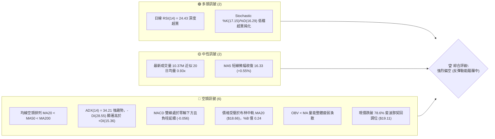
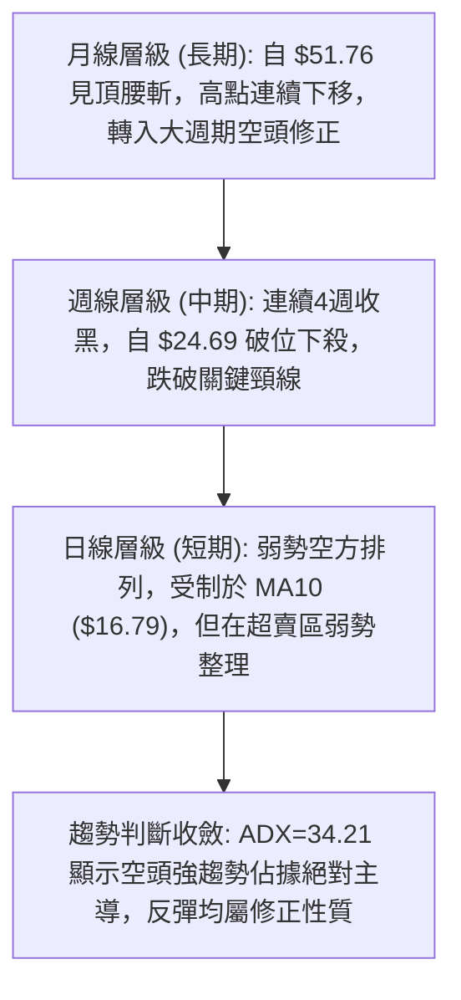
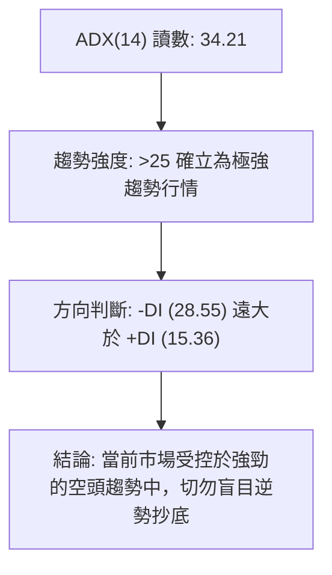
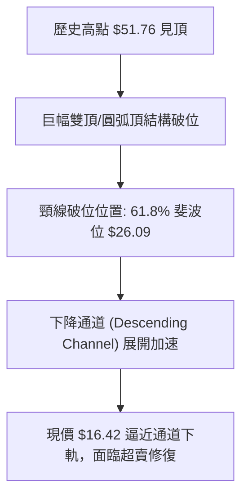
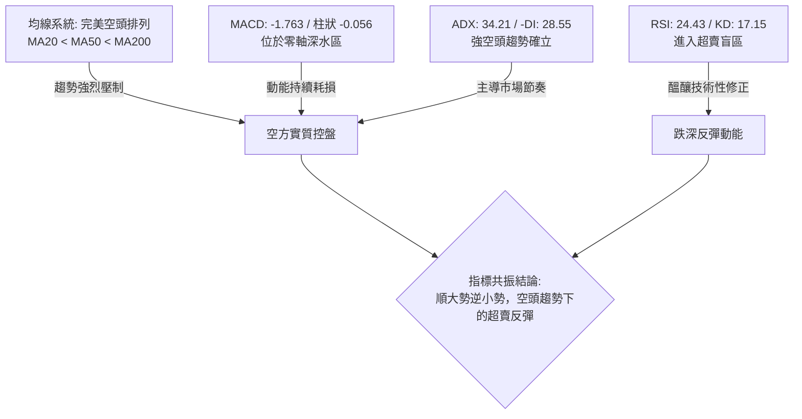
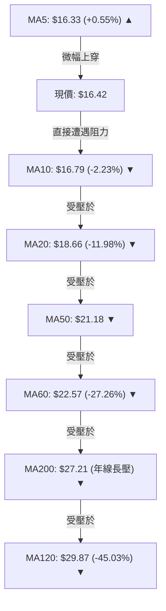
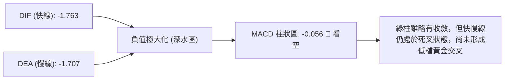
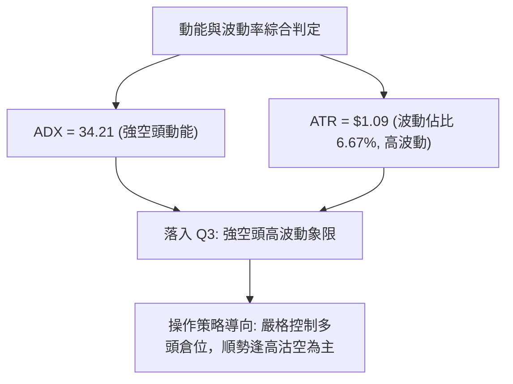
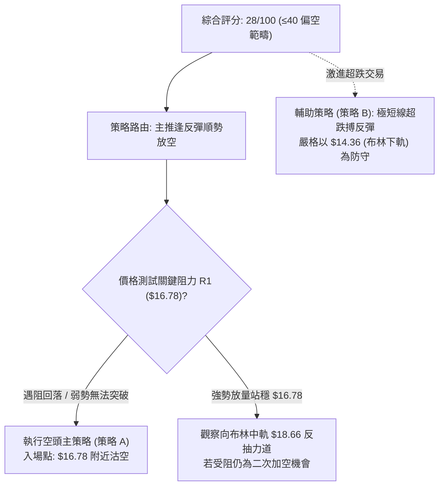
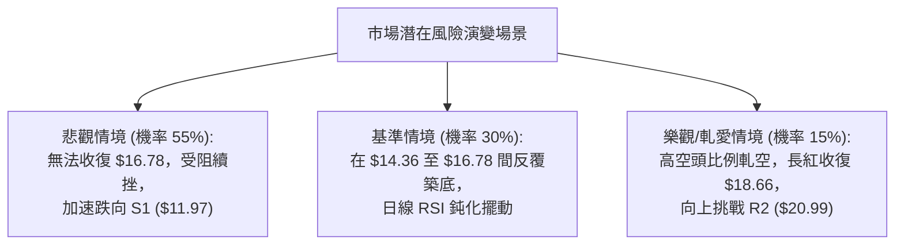

# PL 技術分析報告

> **報告日期**：2026-09-19 ｜ **語言**：繁體中文 ｜ **數據來源**：Yahoo Finance ｜ **當前價格**：$16.42

---

## 目錄

| 章節 | 內容 |
|------|------|
| [1. 技術面概覽](#1-技術面概覽) | 訊號儀表板、核心指標、評分卡 |
| [2. 趨勢分析](#2-趨勢分析) | 多時框趨勢、長中短期走勢 |
| [3. 圖表形態分析](#3-圖表形態分析) | 形態識別、K線組合、目標價 |
| [4. 支撐與阻力](#4-支撐與阻力) | 關鍵價位、斐波那契回調 |
| [5. 技術指標深度解讀](#5-技術指標深度解讀) | MA/RSI/MACD/布林/成交量 |
| [6. 動能與波動率](#6-動能與波動率) | 動能評估、ATR、Beta |
| [7. 多時框架總結](#7-多時框架總結) | 時框架評分矩陣 |
| [8. 交易策略建議](#8-交易策略建議) | 多空策略、風險報酬比 |
| [9. 風險提示與監控](#9-風險提示與監控) | 監控指標、風險場景 |

---

## 1. 技術面概覽

### 🎯 技術訊號儀表板



### 📊 核心指標速覽表

| 指標類別 | 指標名稱 | 當前數值 | 訊號 | 解讀 |
|----------|----------|----------|------|------|
| **價格** | 當前收盤價 | $16.42 | 🔴 | 位於 52 週區間之 14.9% 極低分位，處於主跌浪末端 |
| **均線** | MA20 | $18.66 | 🔴 | 價格低於 MA20 達 -11.98%，短期下行斜率陡峭 |
| **均線** | MA50 | $21.18 | 🔴 | 價格低於 MA50，中期下降趨勢未改 |
| **均線** | MA200 | $27.21 | 🔴 | 價格大幅低於年線，長期格局轉入深度空頭熊市 |
| **動能** | RSI(14) | 24.43 | 🟢 | 進入極度超賣區（<30），隨時具備技術性跌深反彈條件 |
| **動能** | MACD (12,26,9) | -1.763 / -1.707 | 🔴 | 雙線深陷零軸下，柱狀圖 -0.056 呈空方控盤 |
| **動能** | Stochastic | 17.15 / 16.29 | 🟢 | 短線超賣區，存在低檔金叉預期 |
| **趨勢** | ADX(14) | 34.21 | 🔴 | 強趨勢（>25），空方主導（-DI 28.55 vs +DI 15.36） |
| **通道** | Bollinger Bands | 中軌 $18.66 / %B 0.24 | 🔴 | 弱勢貼近下軌運行，通道開口擴大 |
| **波動** | ATR(14) | $1.09 (6.67%) | 🟡 | 日內波幅劇烈，防守止損需設定足夠安全墊 |
| **籌碼** | OBV 趨勢 | OBV < MA | 🔴 | 資金持續淨流出，未見機構主力大規模吸籌跡象 |

### 🏆 技術評分卡

```
╔══════════════════════════════════════════════════════════════════╗
║                   技術評分卡 — PL (2026-09-19)                   ║
╠══════════════════════════════════════════════════════════════════╣
║ 趨勢強度 (Trend)     ██████████████░░░░░░  70/100  🔴 (空頭強趨勢)║
║ 動能指標 (Momentum)  ██████░░░░░░░░░░░░░░  30/100  🟡 (極度超賣)  ║
║ 支撐穩定度 (Support) ████░░░░░░░░░░░░░░░░  20/100  🔴 (失守多道關卡)║
║ 成交量配合 (Volume)  ██████░░░░░░░░░░░░░░  30/100  🔴 (量縮陰跌)  ║
║ 形態完整度 (Pattern) ██████████████░░░░░░  70/100  🔴 (大型破位)  ║
║ 均線排列 (Moving Av) ██░░░░░░░░░░░░░░░░░░  10/100  🔴 (完全空頭)  ║
╠══════════════════════════════════════════════════════════════════╣
║ 綜合技術評分         █████░░░░░░░░░░░░░░░  28/100  🔴 強烈偏空    ║
╚══════════════════════════════════════════════════════════════════╝
```

---

## 2. 趨勢分析

### 🌐 多時框趨勢分析



### 📈 長期趨勢 — 12個月走勢圖（Unicode）

```
PL 月線走勢圖（過去12個月：2025-09 至 2026-09）
價格軸 ($)
$52 ┤                                     ●(2026-05 歷史高點 $51.14 / 觸及 $51.76)
$48 ┤                                    ╱ ╲
$44 ┤                                   ╱   ╲
$40 ┤                             ●    ╱     ╲
$36 ┤                            ╱ ╲  ╱       ╲
$32 ┤                           ╱   ●(04)      ●(2026-06 $33.13)
$28 ┤                     ●    ╱                ╲
$24 ┤             ●      ╱ ╲  ╱                  ╲
$20 ┤      ●     ╱ ╲    ╱   ●(02)                 ●(2026-07 $20.48)──●(2026-08 $19.85)
$16 ┤     ╱ ╲   ╱   ●(01)                                              ╲
$12 ┤●───●   ●(11)                                                      ●←現價 $16.42
    └─┬───┬───┬───┬───┬───┬───┬───┬───┬───┬───┬───┬───────────────────
     09  10  11  12  01  02  03  04  05  06  07  08  09 (月份)
```

**走勢特徵分析表格**：

| 發展階段 | 涵蓋月份 | 區間價格變動 | 走勢特徵與結構解析 |
|----------|----------|--------------|-------------------|
| **主升初期** | 2025-09 ~ 2025-12 | $12.98 → $19.72 (+51.9%) | 放量突破長期底部盤整區，動能激增 |
| **主升擴展** | 2026-01 ~ 2026-04 | $24.97 → $36.97 (+48.1%) | 沿著短期均線上攻，籌碼集中度極高 |
| **最後噴出** | 2026-05 | $36.97 → $51.14 (+38.3%) | 創下 52 週高點 $51.76，週線 RSI 達 83.2 極度超買 |
| **轉折暴跌** | 2026-06 | $51.14 → $33.13 (-35.2%) | 天量出貨陰線，單週成交量破億，頂部結構確立 |
| **陰跌崩解** | 2026-07 ~ 2026-09 | $33.13 → $16.42 (-50.4%) | 逐級失守 MA50、MA200 與 61.8% 斐波位，無有效抵抗 |

### 📊 中期趨勢（週線分析）

中期走勢正處於自 2026 年 5 月高點以來的第五浪下行推進結構：
1. **第一波下殺**：$51.76 下跌至 6 月底之 $27.07。
2. **弱勢反彈**：7 月初反彈至 $31.38 遇阻回落。
3. **第二波下殺**：失守 $26.00 關口，下探至 7 月底之 $20.47。
4. **整理反抽**：8 月中旬弱勢反抽至 $24.69，受壓於 MA50 與 MA60。
5. **當前崩跌**：8 月底自 $22.29 連續 4 週大跌至當前 $16.42，直接考驗下方 $11.97 (S1) 支撐區間。

### ⚡ 趨勢強度評估（ADX 解讀）



**ADX 趨勢強度對照表**：

| 指標變數 | 當前數值 | 門檻區間 | 當前技術狀態判定 |
|----------|----------|----------|------------------|
| **ADX(14)** | **34.21** | 25 ~ 40 | **強趨勢建立階段 (趨勢盤)** |
| **+DI (多方)** | **15.36** | < 20 | 多頭進攻動能衰退，買盤缺乏延續性 |
| **-DI (空方)** | **28.55** | > 25 | 空方掌握主導權，逢高拋壓沉重 |
| **多空淨差值** | **-13.19** | 負值擴大 | 空頭動能持續釋放，未見收斂金叉訊號 |

---

## 3. 圖表形態分析

### 🔍 形態識別系統



**形態信心度分析表**：

| 形態類別 | 信心度 | 判斷依據（引用數據） | 完成度 | 目標價（附計算式） |
|----------|--------|----------------------|--------|--------------------|
| **大型圓弧頂 / 巨量見頂形態** | 85% | 2026-05 見頂 $51.76 時成交量爆衝至 6,148 萬股、週線 RSI=83.2，隨後 6 月第一週以破億成交量放量斷頭下殺至 $32.22。 | 100% (已完全確立) | 第一目標已達；完整測幅跌破 $20.00，指向長期支撐 $11.97。 |
| **加速下降通道** | 75% | 8月中旬高點 $24.69、8月底 $22.29 構成下降趨勢線；下方低點 $20.47、$16.42 構成平行下軌通道。 | 85% (通道內運行) | 通道下軌下探支撐 S1 = **$11.97**；反彈上軌壓力為 R1 = **$16.78**。 |
| **頭肩底 / 雙底形態** | 0% | 數據中未偵測到任何築底形態，各週期均未出現底背離或形態頸線。 | 0% | **訊號不足，僅做指標型超跌解讀**。 |

### 🕯️ 重要K線形態分析

| 月份/週期 | 收盤價 | K線形態 | 解讀 | 訊號 |
|-----------|--------|---------|------|------|
| **2026-05** | $51.14 | 長上影避雷針大陽線 | 衝高至 $51.76 後主力瘋狂派發，多頭最後狂歡，見頂訊號。 | 🔴 頂部反轉 |
| **2026-06** | $33.13 | 巨量吞噬長黑大陰線 | 單月重挫 -35.2%，破壞所有短期上升結構，機構大舉撤退。 | 🔴 崩解確立 |
| **2026-08** | $19.85 | 弱勢反抽流星線 | 反彈觸及 $24.69 後無力維持，收盤回落至月低位，顯示拋壓沉重。 | 🔴 反彈結束 |
| **2026-09** | $16.42 | 加速破位中長黑棒 | 跌破 8 月盤整平台底端 $19.85，空頭動能完全宣洩。 | 🔴 主跌延續 |

### 📉 ASCII 走勢形態示意圖

```
PL 日線/週線加速下行通道示意圖
價格 ($)
$26.00 ┤============================= [原整理平台下軌破位點]
$24.00 ┤        ● (8月中高點 $24.69)
$22.00 ┤         ╲        ● (8月底高點 $22.29)
$20.00 ┤          ╲        ╲   ──────── [下降趨勢阻力上限]
$18.00 ┤           ╲   ●(8月初 $20.48) ╲
$16.78 ┤────────────╲───┼───────────────● R1 阻力位
$16.42 ┤             ╲  │               ▲ [現價: 緊貼通道下軌]
$14.36 ┤              ╲ │               ├── 布林下軌支撐
$12.00 ┤               ╲│
$11.97 ┤────────────────●─────────────── S1 長期強支撐
```

### 🎯 形態目標價計算

依據加速下降走勢之測幅規則：
1. **中繼平台破位測幅**：
   * 8月份構築之箱體上沿 $24.69，下沿 $19.85，箱體垂直高度 $H = \$24.69 - \$19.85 = \$4.84$。
   * 自破位點 $19.85 向下等距測幅計算：
     $$\text{目標價} = \$19.85 - \$4.84 = \$15.01$$
     （現價 $16.42 正處於朝向 $15.01 推進之途中）。
2. **大週期斐波那契投射與聚類目標**：
   * 破位後之極限目標指向近一年波段低點聚類支撐 **S1 = $11.97**。

---

## 4. 支撐與阻力

### 🗺️ 關鍵價位分布圖（Unicode）

```
PL 價位結構分布圖 (由實際 OHLCV 與斐波那契計算)
═══════════════════════════════════════════════════════════════════
$51.76 ║██████████████████████████████║ 52週歷史高點 (0.0% Fib)
$41.96 ║██████████████████████        ║ 23.6% 斐波那契回調位
$35.89 ║██████████████████            ║ 38.2% 斐波那契回調位
$30.99 ║██████████████████            ║ 50.0% 斐波那契分水嶺
$27.21 ║████████████████████████      ║ MA200 年線長壓
$26.09 ║██████████████████████████████║ 61.8% 斐波那契強阻力
$25.53 ║████████████████████████      ║ 強阻力 R3 (波段高點聚類)
$20.99 ║████████████████              ║ 阻力 R2 (反彈高點聚類)
$19.11 ║████████████████████          ║ 78.6% 斐波那契關鍵位
$18.66 ║████████████████              ║ MA20 / 布林中軌動態壓力
$16.78 ║██████████████████████████████║ 關鍵阻力 R1 (當前首要反彈障礙)
$16.42 ╠══════════════════════════════╣ ◄ 當前收盤價 ($16.42)
$14.36 ║░░░░░░░░░░░░                  ║ 短線布林下軌動態支撐
$11.97 ║▓▓▓▓▓▓▓▓▓▓▓▓▓▓▓▓▓▓▓▓▓▓▓▓▓▓▓▓  ║ 長期強支撐 S1 (波段低點聚類)
$10.52 ║██████████████████████████████║ 終極強支撐 S2 (波段起漲聚類)
$10.22 ║██████████████████████████████║ 52週歷史低點 (100.0% Fib)
═══════════════════════════════════════════════════════════════════
```

### 🚧 阻力位分析表

| 阻力級別 | 具體價位 | 形成原因與技術共振 | 突破難度 | 重要性 |
|----------|----------|--------------------|----------|--------|
| **R1** | **$16.78** | 近一年波段高點聚類、MA10 ($16.79) 重合點 | 🟡 中等 (短線首道關卡) | ★★★☆☆ |
| **R2** | **$20.99** | 近期整理區間高點聚類、接近 MA50 ($21.18) | 🔴 極高 (需巨量突破) | ★★★★☆ |
| **R3** | **$25.53** | 8月中旬破位起跌平台、高點密集聚類壓力 | 🔴 極難 (長期熊牛分水嶺) | ★★★★★ |

### 🛡️ 支撐位分析表

| 支撐級別 | 具體價位 | 形成原因與技術共振 | 守住機率 | 重要性 |
|----------|----------|--------------------|----------|--------|
| **動態支撐** | **$14.36** | 日線布林通道下軌，極度超賣時的波動極限 | 🟡 60% (易引發技術抽頭) | ★★★☆☆ |
| **S1** | **$11.97** | 近一年波段低點聚類、2025年9月起漲平台 | 🟢 75% (核心多頭防線) | ★★★★★ |
| **S2** | **$10.52** | 近一年最低波段密集區，緊鄰 52W 低點 $10.22 | 🟢 90% (週期歷史底部) | ★★★★★ |

### 📐 斐波那契回調位分析

依據 52 週區間之極值高點 $51.76 與低點 $10.22 精確計算：

| 回調比率 | 斐波那契價位 | 當前相對位置與技術解讀 |
|----------|--------------|------------------------|
| **0.0%** | **$51.76** | 52週歷史頂點 (2026年5月構築之極限高位) |
| **23.6%** | **$41.96** | 首次深跌修正支撐，破位後轉為強大回抽壓力 |
| **38.2%** | **$35.89** | 弱勢反彈極限點，跌破確立中長週期走熊 |
| **50.0%** | **$30.99** | 多空對稱中軸，跌破後市場完全進入空方主導領域 |
| **61.8%** | **$26.09** | 黃金分割防禦點，失守宣告主升浪結構徹底破裂 |
| **78.6%** | **$19.11** | 最後防線回調位；現價已完全跌破該位置 |
| **100.0%** | **$10.22** | 52週歷史起點；若 S1 ($11.97) 失守，將回歸該點位 |

**現價定位結論**：現價 **$16.42** 位於 **78.6% ($19.11)** 與 **100.0% ($10.22)** 之間。在技術分析準則中，跌破 78.6% 意味著先前的上漲浪已遭 100% 回吐吞噬的機率高達 80% 以上，下行重力將持續牽引價格往 $11.97 ~ $10.22 靠攏。

---

## 5. 技術指標深度解讀

### 🎛️ 指標訊號總覽



### 📈 移動平均線排列分析



**均線狀態詳解**：
* **排列特徵**：全週期均線呈標準空頭發散排列（Bearish Alignment），中長期均線（MA50、MA60、MA120、MA200）下行傾角陡峭，顯示過去數月套牢籌碼沉重。
* **短天期動態**：現價 $16.42 僅微幅高於 MA5 ($16.33)，但距離 MA10 ($16.79) 僅咫尺之遙，且落後 MA20 達 -11.98%。當前 MA5 的微幅翻揚僅為連續崩跌後的低檔扣抵現象，尚未構成均線黃金交叉轉折。

### 📉 RSI(14) 分析

* **當前數值**：**24.43**
* **進度條展示**：
  ```
  超賣區 (0-30)              中性平衡區 (30-70)             超買區 (70-100)
  █████████░░░░░░░░░░░░░░░░░░░░░░░░░░░░░░░░░░░░░░░░░░░░░░░░░░░░░░░░░░  24.43%
  ```
* **超買超賣解讀**：數值深入 30 以下極度超賣區間，代表短期賣壓出現非理性宣洩，做空動能短期已達極限邊界。
* **背離判斷**：
  * **日線層級**：價格持續破底，RSI 亦同步刷新近期低點，**無日線級底背離**。
  * **週線層級**：前一週 RSI 跌至 10.0 極低點後本週略微回升至 24.4，但因價格未創新高，僅屬指標修正，**尚未形成底背離確認結構**。

### 📊 MACD(12,26,9) 訊號解讀



* **數據狀態**：DIF (-1.763) 低於 DEA (-1.707)，柱狀圖為 -0.056。
* **趨勢意涵**：雙線深處於零軸下方極遠處，表明長期動能維持空頭加速；儘管負柱值呈現小幅鈍化收斂，但在雙線未金叉穿越零軸前，任何反抽均視為空頭抵抗。

### 📦 布林通道分析

```
PL 布林通道結構 (20日, 2倍標準差)
═══════════════════════════════════════════════════════════════════
$22.95 ┤ 上軌 (Upper Band)
       │
$18.66 ┤ 中軌 (MA20) ────────────────── 核心強阻力
       │
$16.42 ┤ 現價 (Current Price) ◄── [%B = 0.24, 偏向弱勢下軌]
       │
$14.36 ┤ 下軌 (Lower Band) ─────────── 短期動態下檔支撐
═══════════════════════════════════════════════════════════════════
```

* **帶寬分析**：布林通道上下軌寬度達 $8.59 ($22.95 - $14.36)，佔中軌比例超過 46%，通道呈現喇叭口向下擴張狀態。
* **%B 讀數**：目前為 **0.24**，意味著現價處於中軌至下軌的下四分之一區間，屬於標準的弱勢下墜格局；未跌破 0 軸（下軌外）表示未發生極端崩盤跳空，但持續壓迫下軌將使技術面維持陰跌。

### 💹 成交量分析（量價配合度）

* **量能指標對比**：
  * 當日成交量：**10,367,900** 股。
  * 20日均量：**11,139,970** 股（量比 0.93x）。
  * 50日均量：**8,412,670** 股。
* **量價特徵**：
  * 過去數週下跌過程中，週成交量自 8 月底的 2,400 萬股急遽放大至 9 月初的 8,536 萬股與 6,220 萬股，呈現典型的「放量破位」籌碼出逃現象。
  * 本週成交量縮減至約 4,638 萬股，但價格仍舊低收，顯示主動性買盤匱乏，市場正處於「無量陰跌」階段。
* **OBV 趨勢解讀**：OBV 線持續運行於其移動平均線下方，指標重心呈現單邊下行，量能完全無法確認任何反轉形態，證實主力資金仍處於流出觀望狀態。

---

## 6. 動能與波動率

### ⚡ 動能評估四象限

| 象限標籤 | 動能狀態 | 波動率狀態 | 當前股票定位 | 技術環境診斷與操作意涵 |
|----------|----------|------------|--------------|------------------------|
| **Q1** | 強多頭動能 | 低波動 | — | 穩定單邊上行，持股加碼機會 |
| **Q2** | 弱多頭動能 | 低波動 | — | 窄幅盤整蓄勢，方向選擇前夕 |
| **Q3** | 強空頭動能 | 高波動 | **PL 當前位置 (✓)** | **高風險主跌浪，空方動能強且波動巨大，嚴禁隨意逆勢搶反彈** |
| **Q4** | 弱空頭動能 | 高波動 | — | 恐慌釋放後的底部高頻震盪區 |



### 📊 ATR 波動率分析

* **ATR(14) 當前數值**：**$1.09**
* **相對波動幅度**：$\frac{\$1.09}{\$16.42} \approx \mathbf{6.67\%}$。
* **日內與隔夜風險**：平均單日震盪幅度接近 7%，表明該標的具有極高的短線投機屬性與滑價風險。
* **動態止損空間設定**：
  * **保守止損距離 (2.0x ATR)**：$2.0 \times \$1.09 = \mathbf{\$2.18}$。
  * **激進/緊密止損距離 (1.5x ATR)**：$1.5 \times \$1.09 = \mathbf{\$1.64}$。
  * 若進行逆勢交易或順勢空單防守，均需預留至少 $1.64 ~ $2.18 之震盪空間，以防日內雜訊洗盤。

### 📐 Beta 與市場相關性

* **Beta 係數**：**2.108**
* **市場敏感度評估**：
  * PL 具備高達大盤（S&P 500）2.1 倍以上的波動放大率，屬於典型的高貝塔成長/投機型航太科技股。
  * 在大盤處於震盪或回檔階段時，該股容易承受放大倍數的拋壓；反之，若大盤出現強力多頭反彈，其反抽彈性亦相對劇烈。

---

## 7. 多時框架總結

### 📋 時框架評分表

| 時框架 | 趨勢方向 | 動能狀態 | 均線排列 | 形態結構 | 綜合評分 | 戰略建議 |
|--------|----------|----------|----------|----------|----------|----------|
| **月線層級** | 🔴 空頭 | 弱勢下行 | 均線高檔向下勾頭 | 巨幅圓弧頂確認跌破 | 20/100 | 處於長週期去泡沫回調中，不宜長線配置 |
| **週線層級** | 🔴 強空 | ADX>30 主跌 | 完全空頭排列 | 下降旗形破位向下推進 | 15/100 | 中期無止跌訊號，反彈皆為逢高放空點 |
| **日線層級** | 🟡 弱空/超賣 | RSI 24 超賣 | 均線完全空頭排列 | 貼近布林下軌弱勢震盪 | 35/100 | 空頭主導，但極度超賣醞釀短線技術反抽 |

### 🔲 綜合訊號矩陣

```
╔══════════════════════════════════════════════════════════════════╗
║                     多時框技術訊號共振矩陣                       ║
╠══════════════════╦══════════════╦══════════════╦═════════════════╣
║ 分析維度         ║ 短期 (日線)  ║ 中期 (週線)  ║ 長期 (月線)     ║
╠══════════════════╬══════════════╬══════════════╬═════════════════╣
║ 趨勢方向         ║ 🔴 空頭掌控  ║ 🔴 強力主跌  ║ 🔴 大級別回調   ║
║ 動能強弱         ║ 🟢 超賣衰竭  ║ 🔴 負動能增強║ 🔴 頂部動能逆轉 ║
║ 均線軌跡         ║ 🔴 MA20壓制  ║ 🔴 遠離MA50  ║ 🟡 跌向長期基底 ║
║ 籌碼量能         ║ 🟡 量縮陰跌  ║ 🔴 巨量出貨  ║ 🔴 資金持續流出 ║
╠══════════════════╬══════════════╬══════════════╬═════════════════╣
║ 權重收斂方向     ║ 弱勢震盪反抽 ║ 順勢下探支撐 ║ 估值結構重塑    ║
╚══════════════════╩══════════════╩══════════════╩═════════════════╝
```

### ⚖️ 多時框收斂結論

依據多時框收斂優先級規則：
1. **趨勢/盤整識別**：當前日線與週線 **ADX(14) 均達 34.21**，遠高於 25 的趨勢門檻，且 -DI (28.55) 強勢壓制 +DI (15.36)，定性為**典型的空頭強趨勢行情**。
2. **主導時框收斂**：在強趨勢市場中，以中長期趨勢（週線及 MA50/MA200）方向為主要依歸。中長期方向呈現絕對空頭壓制，日線級別的極度超賣（RSI=24.43、Stoch=17.15）**僅代表短線賣盤力道鈍化，絕不可視為趨勢反轉**。
3. **唯一方向結論**：**強烈偏空（主策略：逢反彈放空；次要策略：僅限極輕倉短線超跌快進快出）**。

---

## 8. 交易策略建議

### 🗺️ 策略決策流程圖



### 🧭 策略路由（依評分卡分流）

* **當前主策略方向**：**主推空頭策略（逢高布空 / 順勢追空）**（依綜合評分 **28/100**，進入 ≤40 偏空絕對主導區）。
* 多頭策略僅作為短線極度超賣之避險對沖或日內快進快出之輔助提示。

### 🎯 價格情境階梯（Price Scenarios）

以當前價格 **$16.42** 為基準，向上與向下情境階梯如下（價位嚴格引用關鍵價位）：

| 觸發條件 | 第一目標 | 後續延伸目標 | 情境技術含義 |
|----------|----------|--------------|--------------|
| **向上突破 R1 $16.78** | R2 $20.99 | R3 $25.53 | 超賣引發空頭回補，展開中繼技術性反抽 |
| **失守現價區間** | 動態下軌 $14.36 | S1 $11.97 | 弱勢下行通道擴張，展開新一輪主跌浪 |
| **有效跌破 S1 $11.97** | S2 $10.52 | 52W Low $10.22 | 徹底跌回 2024 年歷史起漲點，空頭完全宣洩 |

### 📊 情境機率分佈

| 運行情境 | 機率預估 | 主要技術判定依據 |
|----------|----------|------------------|
| **下行探底 (順勢下跌至 S1)** | **55%** | ADX=34.21 強勢發散，均線完全空頭排列，OBV 疲軟渙散 |
| **超賣弱勢反彈 (抽測 R1)** | **25%** | 日線 RSI(14)=24.43 深度超賣，日線 MA5 短線翻紅微揚 |
| **窄幅區間震盪 ($15.00~$17.50)** | **20%** | 空方放量後暫歇，等待 MA20 ($18.66) 下壓修復乖離 |

### 🟢 主策略詳情

根據系統規則，主策略為順應強趨勢的空頭操作，次選為超跌博弈策略：

| 策略要素 | 策略 A（主推：反彈遇阻順勢沽空） | 策略 B（次選：極短線超跌博弈反彈） |
|----------|---------------------------------|-----------------------------------|
| **交易方向** | **放空 (Short)** | **做多 (Long / Counter-trend)** |
| **進場條件** | 價格反抽至 R1 遇阻收上影線，或跌破 MA5 | 現價獲支撐且日內盤中放量收復 MA5 ($16.33) |
| **進場價格** | **$16.78** (R1 阻力位附近) | **$16.42** (當前價格) |
| **目標價 T1** | **$14.36** (布林下軌) | **$16.78** (R1 關鍵阻力) |
| **目標價 T2** | **$11.97** (長期強支撐 S1) | **$18.66** (MA20 / 布林中軌) |
| **止損價格** | **$18.66** (突破 MA20 止損) | **$14.36** (跌破布林下軌止損) |
| **止損距離** | $1.88 (約 1.7x ATR) | $2.06 (約 1.9x ATR) |
| **風險報酬比** | **1 : 2.56** (以 T2 計算) | **1 : 1.09** (以 T2 計算) |
| **歷史勝率估計** | **65%** (順趨勢勝率) | **35%** (逆勢超賣搶反彈勝率) |
| **建議倉位** | **10% ~ 15%** (標準配置) | **3% ~ 5%** (極輕倉短線測試) |

### 🔴 反向風險觸發點（對沖提示）

若出現以下訊號，主推空頭策略即告失效，必須立刻停損或反手對沖：
1. **價位突破**：收盤價以長紅棒強勢收復 **$18.66**（MA20 中軌），宣告短期下降通道被有效向上突破。
2. **指標轉強**：日線 MACD 形成低檔黃金交叉且柱狀圖翻正，同時 RSI(14) 快速越過 40 軸進入多頭修復區。
3. **量能確認**：單日成交量放大超過 2,000 萬股（接近 20 日均量的 2 倍）且收在當日最高點。

### ⭐ 整體訊號強度評星

```
╔══════════════════════════════════════════════════════════════════╗
║ 做多訊號強度：★☆☆☆☆  (1/5星 — 僅具備超賣條件，無結構支撐)       ║
║ 做空訊號強度：★★★★☆  (4/5星 — 均線/趨勢/籌碼全方位共振偏空)     ║
║ 整體技術可信度：★★★★☆ (4/5星 — ADX 確立強趨勢，技術指引明確)     ║
╚══════════════════════════════════════════════════════════════════╝
```

---

## 9. 風險提示與監控

### ✅ 關鍵監控指標 Checklist

```
╔══════════════════════════════════════════════════════════════════╗
║                   PL 關鍵技術與籌碼監控清單                      ║
╠══════════════════════════════════════════════════════════════════╣
║ [ ] R1 阻力防線 ($16.78)：觀察反彈至此是否遭遇主力壓制拋盤       ║
║ [ ] MA20 均線動態 ($18.66)：空頭生命線，未突破前中期趨勢不可看多 ║
║ [ ] RSI(14) 超賣修復：是否能自 24.43 順利攀升突破 30 脫離極端區 ║
║ [ ] 成交量變化：是否出現爆量換手（>2,500萬股）的止跌打底跡象     ║
║ [ ] S1 支撐測試 ($11.97)：若進一步破位下殺，此處為關鍵防守線     ║
║ [ ] 空頭回補動向：Short Float 達 9.7%，需防範突發消息引發軋空    ║
╚══════════════════════════════════════════════════════════════════╝
```

### ⚠️ 風險場景分析



### 🛡️ 風險管理重要提醒

1. **高貝塔槓桿風險**：PL 的 Beta 值為 **2.108**，且 ATR 佔股價高達 **6.67%**。極高的波動性意味著部位規模（Position Sizing）必須嚴格壓縮，單筆交易虧損上限應控制在總交易資本的 1.0% 以內。
2. **超賣鈍化與盲目摸底**：在 ADX 達到 34.21 的強趨勢下，技術指標超賣（如 RSI < 25）經常會出現「鈍化再跌」的主跌延伸走勢。**「指標超賣不是買進理由」**，必須等待明確的底部結構（如雙底突破頸線、底背離）確認後方可考慮左側轉右側操作。
3. **空頭擠壓（Short Squeeze）預防**：該股放空比例佔浮動籌碼達 **9.7%**，空頭回補天數（Short Ratio）為 **5.72 天**。雖然趨勢偏空，但空方切忌在極度超賣區（布林下軌外或現價低位）過度追空，應耐心等待價格反抽測試阻力位（R1 或 MA20）力竭時再行介入。

---

## 📋 報告總結

```
╔══════════════════════════════════════════════════════════════════╗
║                   PL 技術分析報告總結 (2026-09-19)               ║
╠══════════════════════════════════════════════════════════════════╣
║ 報告日期：2026-09-19                                             ║
║ 當前價格：$16.42                                                 ║
║ 分析評級：🔴 強烈偏空（空頭強趨勢，伴隨短線極度超賣）             ║
╠══════════════════════════════════════════════════════════════════╣
║ 關鍵結論：                                                       ║
║ ├─ 長期趨勢：🔴 自 $51.76 見頂展開大週期深幅回調，年線 MA200 告失 ║
║ ├─ 中期趨勢：🔴 下降通道結構完整，週線連續下殺，空方掌控主導權   ║
║ ├─ 短期趨勢：🟡 RSI(14)=24.43 深度超賣，短線醞釀技術性修正反彈   ║
║ ├─ 關鍵支撐：S1: $11.97  /  S2: $10.52                           ║
║ ├─ 關鍵阻力：R1: $16.78  /  R2: $20.99                           ║
║ └─ 機構共識：分析師平均目標價 $33.40 (基本面長期看好，但技術面走弱)║
╠══════════════════════════════════════════════════════════════════╣
║ 最優操作策略：                                                   ║
║ 1. 🥇 最佳機會 (順勢空頭)：等待反彈至 R1 ($16.78) 附近受阻放空，  ║
║      停損設於 MA20 ($18.66)，目標下看 S1 ($11.97)，風報比 1:2.56  ║
║ 2. 🥈 次選機會 (逆勢超跌)：於現價 $16.42 輕倉搏超賣反抽，目標     ║
║      $16.78 ~ $18.66，嚴格以 $14.36 (布林下軌) 破位作為止損     ║
║ 3. 🥉 保守選擇：空手觀望，等待打出雙底或站穩 MA20 後再行右側佈局   ║
╚══════════════════════════════════════════════════════════════════╝
```

---

> ⚠️ **免責聲明**：本報告為 AI 自動生成之技術分析研究，所有數據、圖表及推演均基於市場公開歷史價格與量化模型計算。本報告**僅供學術研究與參考**，**不構成任何形式的投資建議、買賣邀約或保證**。金融市場具有高度風險，投資決策請務必依據個人風險承受度獨立判斷並自負盈虧。

---

*報告生成時間：2026-09-19 ｜ 數據來源：Yahoo Finance ｜ 分析框架：多時框技術分析體系*