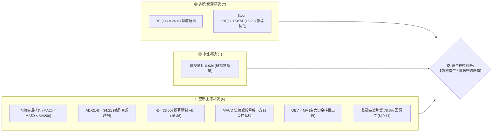
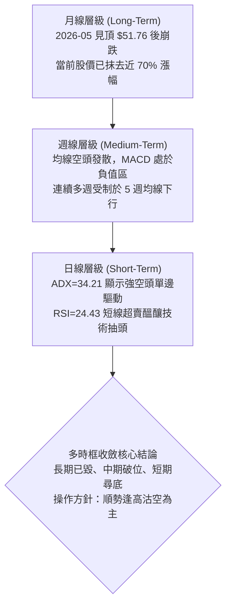
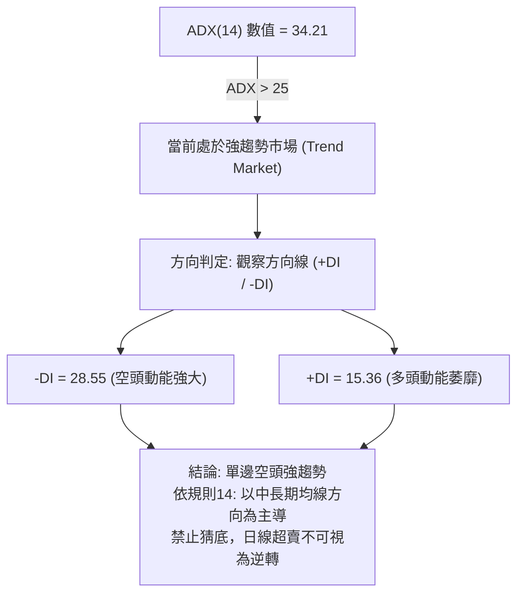
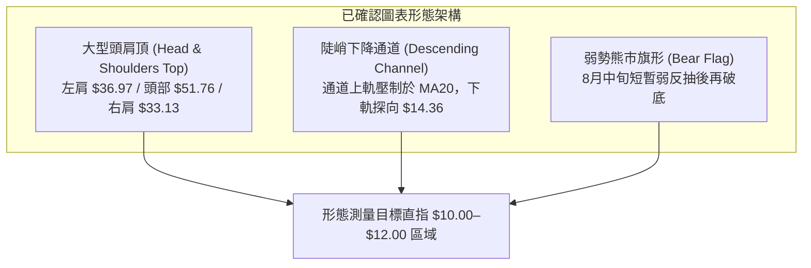
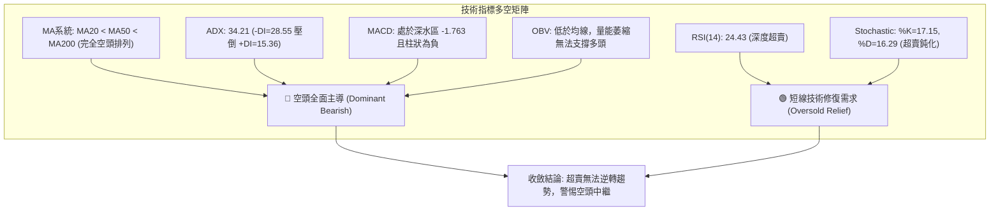
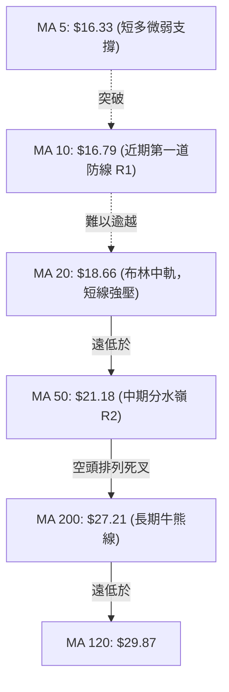
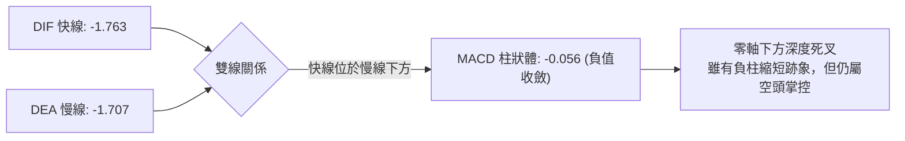
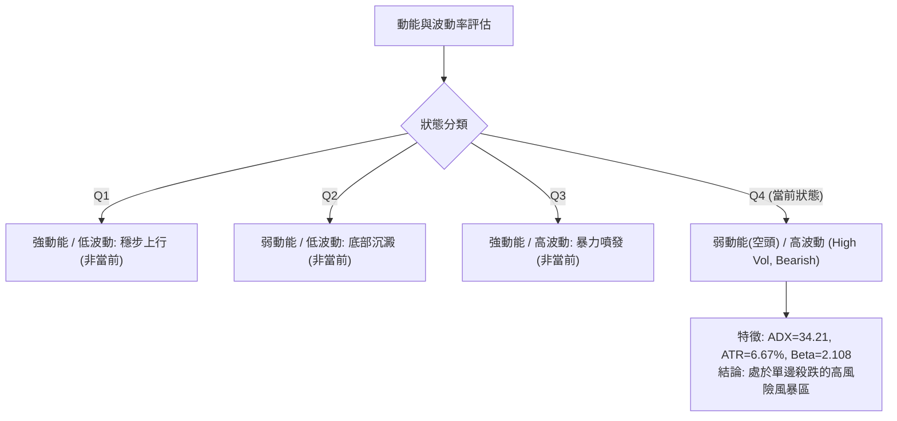
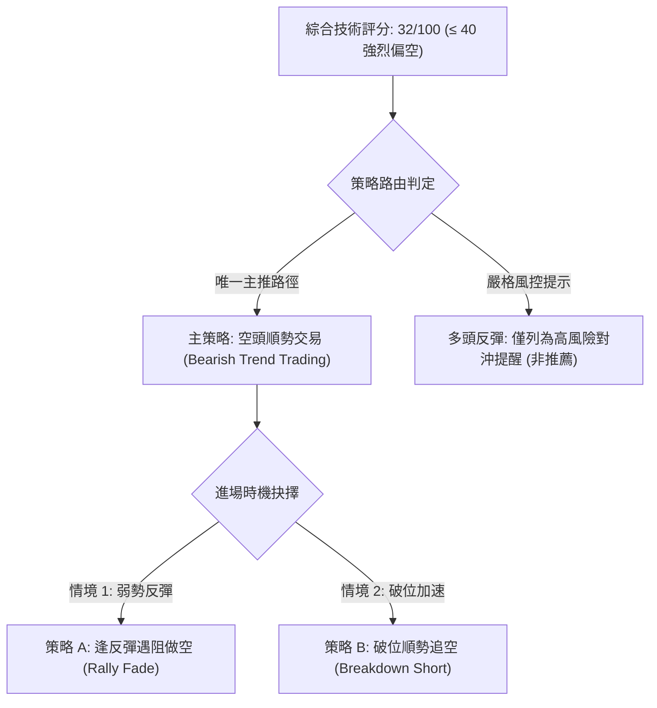
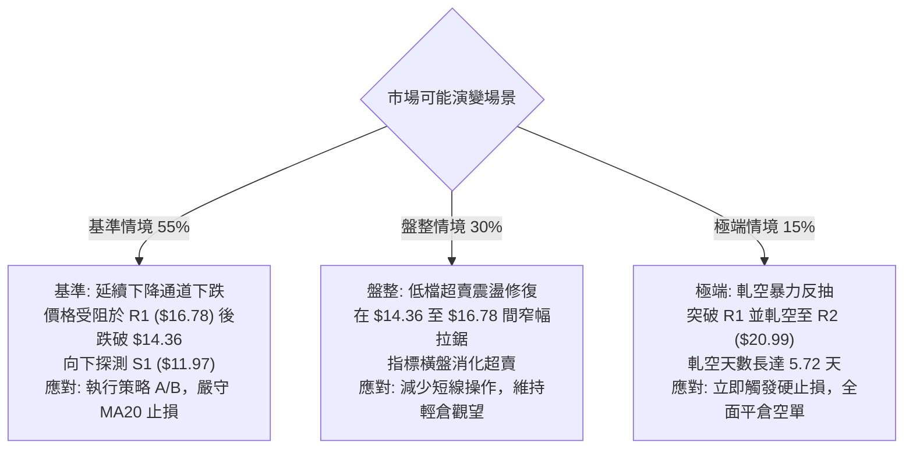

# PL 技術分析報告

> **報告日期**：2026-09-20 ｜ **語言**：繁體中文 ｜ **數據來源**：Yahoo Finance ｜ **當前價格**：$16.42

---

## 目錄

| 章節 | 內容 |
|------|------|
| [1. 技術面概覽](#1-技術面概覽) | 訊號儀表板、核心指標、評分卡 |
| [2. 趨勢分析](#2-趨勢分析) | 多時框趨勢、長中短期走勢、ADX解讀 |
| [3. 圖表形態分析](#3-圖表形態分析) | 形態識別、信心度評估、K線組合、形態目標價 |
| [4. 支撐與阻力](#4-支撐與阻力) | 關鍵價位聚類、斐波那契回調結構 |
| [5. 技術指標深度解讀](#5-技術指標深度解讀) | 均線系統、RSI、MACD、布林通道、OBV量價 |
| [6. 動能與波動率](#6-動能與波動率) | 動能四象限、ATR波動度、Beta係數與市場敏銳度 |
| [7. 多時框架總結](#7-多時框架總結) | 時框架評分表、訊號矩陣、多時框收斂結論 |
| [8. 交易策略建議](#8-交易策略建議) | 策略路由、情境階梯、主空頭策略、反向風控點 |
| [9. 風險提示與監控](#9-風險提示與監控) | 關鍵監控清單、風險情境樹、倉位管理建議 |
| [10. 報告總結](#10-報告總結) | 核心總結儀表板與最終交易指引 |

---

## 1. 技術面概覽

### 🎯 技術訊號儀表板



### 📊 核心指標速覽表

| 指標類別 | 指標名稱 | 當前數值 | 訊號 | 專業解讀 |
|:---|:---|:---|:---:|:---|
| **價格** | 當前市價 | $16.42 | 🔴 | 位於 52 週區間之 14.9% 極低分位，空頭全面壓制 |
| **均線系統** | MA20 (短天期) | $18.66 | 🔴 | 價格低於 MA20 達 -11.98%，短線下行斜率陡峭 |
| **均線系統** | MA50 (中天期) | $21.18 | 🔴 | 中期生命線沉重下壓，價格距離達 -22.47% |
| **均線系統** | MA200 (長天期) | $27.21 | 🔴 | 遠在年線之下 -39.65%，長期結構已告破位 |
| **趨勢強度** | ADX(14) / -DI | 34.21 / 28.55 | 🔴 | ADX > 25 且 -DI 絕對主導，代表強勁單邊下行趨勢 |
| **動能指標** | RSI(14) | 24.43 | 🟢 | 進入極度超賣區（<30），但無底背離，易呈鈍化下行 |
| **動能指標** | MACD (12,26,9) | -1.763 / -0.056 | 🔴 | 雙線沉於深水區，Histogram 柱為負值，動能未翻正 |
| **通道指標** | Bollinger Bands | %B = 0.24 | 🔴 | 貼近下軌（$14.36）運行，呈現空頭通道張嘴走勢 |
| **量能指標** | OBV 趨勢 | OBV < MA | 🔴 | 累積量能低於均線，量價配合呈典型「價跌量滯」衰竭特徵 |
| **波動指標** | ATR(14) | $1.09 (6.67%) | 🟡 | 日波動率高達 6.67%，日內多空洗盤激烈 |

### 🏆 技術評分卡

```
╔══════════════════════════════════════════════════════════════╗
║              技術評分卡 — PL (2026-09-20)                    ║
╠══════════════════════════════════════════════════════════════╣
║ 趨勢方向 (Trend)      ███░░░░░░░░░░░░░░░░░  15/100  🔴 極度空頭 ║
║ 均線架構 (MA Align)   ██░░░░░░░░░░░░░░░░░░  10/100  🔴 完全空頭 ║
║ 動能強度 (Momentum)   █████░░░░░░░░░░░░░░░  25/100  🔴 動能疲弱 ║
║ 支撐防禦 (Support)    ██████░░░░░░░░░░░░░░  30/100  🔴 支撐脆弱 ║
║ 量價配合 (Volume)     ████████░░░░░░░░░░░░  40/100  🟡 資金離場 ║
║ 超賣修復 (Mean-Rev)   ██████████████░░░░░░  70/100  🟢 存在反彈 ║
╠══════════════════════════════════════════════════════════════╣
║ 綜合技術評分          ██████░░░░░░░░░░░░░░  32/100  🔴 強烈偏空 ║
╚══════════════════════════════════════════════════════════════╝
```

---

## 2. 趨勢分析

### 🌐 多時框趨勢分析



### 📈 長期趨勢 — 12個月走勢圖（Unicode）

以下為 Planet Labs (PL) 過去 12 個月（2025-10 至 2026-09）之月線價格收盤走勢與關鍵高低點分佈：

```
PL 月線歷史走勢圖（過去12個月）
價格 ($)
$52.00 ┤                                      ● $51.14 (2026-05 週期頂部)
$46.00 ┤                                     / \
$40.00 ┤                             ● $36.97   \
$34.00 ┤                                         \ ● $33.13
$28.00 ┤                     ● $27.95             \
$22.00 ┤             ● $24.97                      \     ● $20.48
$16.00 ┤ ● $13.45   /                                \   /      \ ● $16.42 (現價)
$10.00 ┤        \  ● $19.72                           \ /        
       └────┬──────┬──────┬──────┬──────┬──────┬──────┬──────┬──────┬──────┬──────┬───────
         2025   2025   2026   2026   2026   2026   2026   2026   2026   2026   2026   2026
          10     11     12     01     02     03     04     05     06     07     08     09
```

#### 走勢特徵分析表格

| 階段 | 涵蓋期間 | 價格區間 | 累積漲跌幅 | 主要技術特徵與驅動因素 |
|:---|:---:|:---:|:---:|:---|
| **牛市主升浪** | 2025-10 → 2026-05 | $13.45 → $51.14 | **+280.22%** | 天文數字級的單邊主升段，伴隨連續巨量突破，月線呈現標準進攻型紅K群。 |
| **高檔雪崩段** | 2026-05 → 2026-07 | $51.14 → $20.48 | **-59.95%** | 6月初單週暴跌放量逾 1 億股，主力機構獲利出逃，直接擊穿 MA50 與 MA60。 |
| **弱勢抵抗段** | 2026-07 → 2026-08 | $20.48 → $24.69 | **+20.56%** | 超賣後的死貓反彈（Dead Cat Bounce），反抽受制於 MA200，多頭無力回天。 |
| **陰跌破位段** | 2026-08 → 2026-09 | $24.69 → $16.42 | **-33.50%** | 連續破位陰跌，摜破斐波那契 78.6% 回調位（$19.11），空頭趨勢重新加速。 |

### 📊 中期趨勢（週線分析）

從近 20 週收盤走勢觀察，週線格局呈現清晰的「破位階梯型下跌」：
1. **放量殺跌**：2026-06-07 週成交量飆至 100,622,400 股，單週收在 $32.22，確立了 $35.00–$50.00 區間的巨型頭部套牢盤。
2. **反彈無量**：2026-08-16 反彈至 $24.69 時，週成交量僅萎縮至 23,531,400 股，為標準的「量價背離式弱勢修正」。
3. **恐慌下洩**：進入 9 月份，9/06 週成交量再度激增至 85,360,000 股並摜破 $19.00，證實逢高拋壓依然兇悍。

```
週線級別價格軌道示意圖：
$25.53 (R3) ───┐ (08月中期反彈高點壓力)
               └──► $20.99 (R2) ───┐ (MA50壓制位)
                                   └──► $16.78 (R1) ───► [當前現價 $16.42]
                                                           │
                                                           ▼ 破位目標
                                                       $11.97 (S1) ──► $10.52 (S2)
```

### ⚡ 趨勢強度評估（ADX 解讀）



#### ADX 強度與市場狀態對照表

| 指標變數 | 當前讀數 | 門檻區間 | 當前市場狀態判定 | 操作指導原則 |
|:---|:---:|:---:|:---|:---|
| **ADX (趨勢強度)** | **34.21** | 25.0 – 50.0 | **強單邊趨勢行情** | 順應大級別趨勢操作，拒絕逆向網格與無止損摸底。 |
| **+DI (多頭買力)** | **15.36** | < 20.0 | **買盤極度匱乏** | 追高多單風險極大，任何上拉皆缺乏實質資金推動。 |
| **-DI (空頭賣壓)** | **28.55** | > 25.0 | **空頭絕對掌控** | 賣盤具備持續性，下行慣性尚未衰竭。 |
| **DI 差值差距** | **-13.19** | 擴大中 | **空頭趨勢加速擴散** | 空方動能完全主導盤面，反彈阻力重重。 |

---

## 3. 圖表形態分析

### 🔍 形態識別系統



#### 形態信心度評估表（依規則 15）

| 形態名稱 | 信心度 | 判斷依據（引用數據） | 完成度 | 目標價（附嚴謹計算式） |
|:---|:---:|:---|:---:|:---|
| **大型頭肩頂** | **85%** | 頭部 $51.76（2026-05），頸線位於 $31.00–$32.00。6月首週放量 1.006 億股跌破 $32.22 確立破位。 | **100% (已跌破)** | 頸線 $31.50 - (頭部 $51.76 - 頸線 $31.50) = $31.50 - $20.26 = **$11.24**（直接指向支撐區 S1 $11.97 與 S2 $10.52） |
| **下降通道** | **75%** | 價格沿 MA20（$18.66）及布林中下軌持續下行，高點受制於 R2（$20.99）與 R1（$16.78）。 | **70% (運行中)** | 通道下軌支撐位與布林下軌重疊，指向 **$14.36**，若失守則探測波段低點 **$11.97**。 |
| **空頭雙底雛形** | **30%** | 現價尚未觸及 52 週低點聚類，目前未見任何右底築底結構。 | **0% (未成形)** | 信心度 < 50%，訊號不足，僅做指標型超賣解讀，**不採信雙底形態**。 |

### 🕯️ 重要K線形態分析

| 時間週期 | 收盤價 | K線形態 | 深度技術解讀 | 訊號強度 |
|:---|:---:|:---|:---|:---:|
| **2026-05** | $51.14 | 爆量長上影流星線 | 月線觸及 $51.76 後遭機構獲利盤全面倒貨，多頭動能竭盡。 | 🔴 強空 |
| **2026-06** | $33.13 | 斷頭大陰線 (Bearish Marubozu) | 跌幅達 -35.22%，實體直接擊穿所有短期均線，趨勢正式由牛轉熊。 | 🔴 極空 |
| **2026-08** | $19.85 | 弱勢反彈假陽十字線 | 月線反彈無力，留長上影線受制於 MA240（$24.84），反轉完全失敗。 | 🔴 續跌 |
| **2026-09(迄今)** | $16.42 | 低檔並列陰線群 | 連續兩週收在 $16.45 與 $16.42，形成貼地摩擦，空方完全控盤。 | 🔴 壓制 |

### 📉 ASCII 走勢形態示意圖

```
PL 頭肩頂破位與下降通道延展圖
$51.76 ─────────────┐ (Head 頭部: 2026-05)
                    │
$36.97 ──┐          │          ┌── $33.13 (Right Shoulder 右肩)
(Left S) │          │          │
         ▼          ▼          ▼
═════════╧══════════╧══════════╧═════════ $31.50 (Neckline 頸線跌破位)
                                         \
                                          \  [空頭旗形整理]
                                           \──► $24.69 (08-16 高點)
                                                 \
                                                  \  [主跌段加速]
                                                   ▼
───────────────────────────────────────────── $18.66 (MA20 阻力)
                                              $16.42 (現價 ◄ 貼軌尋底)
                                              $14.36 (布林下軌)
- - - - - - - - - - - - - - - - - - - - - - - $11.97 (頭肩測量目標/S1)
```

### 🎯 形態目標價計算

根據經典技術分析之形態等距投射原理（Measured Move）：
*   **形態測量高點**：$51.76 (52W High)
*   **頭肩頂頸線中樞**：$31.50 (2026-06 跌破平台)
*   **垂直形態高度 (H)**：$51.76 - $31.50 = **$20.26**
*   **理論第一向下目標價**：$31.50 - $20.26 = **$11.24**
*   **數據確認與收斂**：計算所得之 $11.24 與數據庫中標記之波段支撐位 **S1: $11.97** 及 **S2: $10.52** 具備高度吻合性（落於 $10.52–$11.97 的波段低點聚類區間），完全支持頭肩頂形態成立後的目標推導。

---

## 4. 支撐與阻力

### 🗺️ 關鍵價位分布圖（Unicode）

```
PL 價位結構分布圖（OHLCV 精確計算）
═════════════════════════════════════════════════════════════════════
$27.21 ║████████████████████████████████████║ MA200 牛熊分水嶺
$26.09 ║████████████████████████████        ║ 斐波那契 61.8% 強阻力
$25.53 ║████████████████████████            ║ 阻力位 R3 (波段反彈高點聚類)
$21.18 ║████████████████                    ║ MA50 生命線阻力
$20.99 ║████████████████                    ║ 阻力位 R2 (近一年高點密集成交)
$19.11 ║████████████                        ║ 斐波那契 78.6% 回調關鍵位
$18.66 ║████████                            ║ MA20 / 布林中軌近期動態阻力
$16.78 ║██████                              ║ 關鍵短阻 R1 (MA10 壓制處)
$16.42 ╠════════════════════════════════════╣ ◄── 當前市價 ($16.42)
$14.36 ║░░░░░░░░░░░░                        ║ 布林帶動態下軌支撐
$11.97 ║▓▓▓▓▓▓▓▓▓▓▓▓▓▓▓▓▓▓▓▓▓▓▓▓            ║ 關鍵波段支撐 S1 (強支撐區)
$10.52 ║▓▓▓▓▓▓▓▓▓▓▓▓▓▓▓▓▓▓▓▓▓▓▓▓▓▓▓▓        ║ 強支撐 S2 (52W 次低點聚類)
$10.22 ║████████████████████████████████████║ 斐波那契 100.0% / 52W 最低點
═════════════════════════════════════════════════════════════════════
```

### 🚧 阻力位分析表（波段高點聚類）

| 阻力級別 | 精確價位 | 距離現價 | 形成原因與籌碼結構 | 突破難度 | 技術重要性 |
|:---|:---:|:---:|:---|:---:|:---:|
| **R1** | **$16.78** | +2.19% | 短期均線 MA10（$16.79）共振壓制，近 5 日反彈密集成交頂部。 | 中等 | 🟢 短線突破確認點 |
| **R2** | **$20.99** | +27.83% | MA50（$21.18）防線，7月下旬整理平台下緣，套牢解套賣壓密集。 | 極高 | 🟡 中期空頭生命線 |
| **R3** | **$25.53** | +55.48% | 8月中旬弱勢反抽頂部高點（$24.69–$25.53），與斐波那契 61.8% 重合。 | 極難 | 🔴 多空轉折總防線 |

### 🛡️ 支撐位分析表（波段低點聚類）

| 支撐級別 | 精確價位 | 距離現價 | 形成原因與籌碼結構 | 守住機率 | 技術重要性 |
|:---|:---:|:---:|:---|:---:|:---:|
| **動態下軌**| **$14.36** | -12.55% | 布林通道下軌動態邊界，空頭擴張期的日內緩衝帶。 | 55% | 🟡 極短線通道支撐 |
| **S1** | **$11.97** | -27.10% | 2025年9月主升浪起漲密集成交帶，頭肩頂形態測量目標點。 | 70% | 🔴 波段生命防禦區 |
| **S2** | **$10.52** | -35.93% | 歷史波段低點聚類核心，接近 52 週最低點 $10.22 之最後陣地。 | 85% | 🔴 年度結構性底線 |

### 📐 斐波那契回調位分析

依據 52 週完整波段起點 $10.22 至歷史峰值 $51.76 計算：

| 斐波那契水準 | 精確價位 | 相對現價狀態 | 技術解讀與籌碼含義 |
|:---|:---:|:---:|:---|
| **0.0% (52W High)** | $51.76 | +215.2% | 本輪牛市極限頂部，機構全面出清區域。 |
| **23.6%** | $41.96 | +155.5% | 第一回調位，破位後引發第一波止損潮。 |
| **38.2%** | $35.89 | +118.6% | 強弱分界點，6月斷頭大陰線跌破處。 |
| **50.0%** | $30.99 | +88.7% | 心理平衡點與頭肩頂頸線樞紐。 |
| **61.8%** | $26.09 | +58.9% | 黃金分割防禦位，8月中旬反抽無力突破處。 |
| **78.6%** | $19.11 | +16.4% | **深幅回調防守線（已失守）**，破位轉為強阻力。 |
| **當前現價** | **$16.42** | 0.0% | **落於 78.6% ($19.11) 與 100.0% ($10.22) 的極度危險真空帶**。 |
| **100.0% (52W Low)**| $10.22 | -37.8% | 原始起漲點，若 S1 跌破將直接回測此歷史低點。 |

---

## 5. 技術指標深度解讀

### 🎛️ 指標訊號總覽



### 📈 移動平均線排列分析



*   **均線結構狀態**：典型「死亡排列」（MA5 < MA10 < MA20 < MA50 < MA200）。現價 $16.42 低於 MA20 達 -11.98%、低於 MA50 達 -22.47%、低於 MA200 達 -39.65%，這反映各週期持倉籌碼全面處於浮虧狀態，任何反抽皆會面臨解套籌碼的無情拋售。
*   **短天期微弱訊號**：唯一微幅向上的均線為 MA5（$16.33，現價高出 +0.09），顯示近 3–5 日下行速度略微放緩，進入超賣橫盤，但尚未具備任何反轉結構。

### 📉 RSI(14) 分析

*   **RSI 當前讀數**：**24.43**（極度超賣區間）。
*   **超賣強度條**：
    `超賣深度：████████████████████████████░░ 24.43 / 100 (極端值 < 30)`
*   **背離識別**：
    *   回溯 9/06（收盤 $18.12，RSI 10.7）、9/13（收盤 $16.45，RSI 10.0）至 9/20（收盤 $16.42，RSI 24.43）。
    *   **深度解讀**：價格在 9/13 至 9/20 微幅破底（$16.45 → $16.42），RSI 由 10.0 彈升至 24.43。此現象**並非典型的大級別結構性底背離**，而是前兩週指標出現極端值（10.0）後的「指標自然數學修復」。日線指標快照明確指出「**RSI 背離：無明顯背離**」。因此，不可將此視為反轉訊號，僅能定義為「空頭動能邊際減弱」之微弱徵兆。

### 📊 MACD(12/26/9) 訊號解讀



*   **數值分析**：DIF (-1.763) 與 DEA (-1.707) 均深陷零軸（Zero Line）下方，表明市場完全處於空頭絕對優勢領域。
*   **柱狀圖形態**：Histogram 現為 -0.056，相較於 9/13 的 -0.328 呈現顯著縮短，代表短期殺跌速率有所放緩，具備低檔金叉預期；但在零軸之下的低檔金叉，歷史經驗上通常僅對應 3–5 天的弱勢回抽（碰觸 MA20 即告終），切不可過早以反轉論處。

### 📦 布林通道分析

```
PL 布林通道動態走勢示意圖（日線）
$22.95 ───────────────────────────── Upper BB (上軌阻力)
       \
        \
$18.66 ──\────────────────────────── Middle BB (MA20 基準線)
          \
           \
$16.42 ─────●─────────────────────── Close (現價 $16.42，%B = 0.24)
             \
$14.36 ───────\───────────────────── Lower BB (下軌支撐)
```

*   **通道狀態**：%B 數值為 **0.24**，價格緊貼通道下半區（0 代表下軌，0.5 為中軌）。
*   **開口方向**：布林帶帶寬目前達 $8.59（[$22.95 - $14.36] / $18.66 = 46.0%），處於典型的「空頭擴張狀態」（Band Walking Downwards）。當價格持續貼著下軌下行且 %B 低於 0.30 時，代表下行趨勢受到通道的強力引導，下行空間尚未封閉。

### 💹 成交量分析（量價配合度）

*   **成交量現況**：最新日成交量為 10,367,900 股，相較於 20 日均量（11,139,970 股），量比為 **0.93x**；但高於 50 日均量（8,412,670 股）。
*   **OBV 能量潮解讀**：數據指出「**OBV < MA → 量能疲弱**」。自 2026-06 高點崩跌以來，每一波下殺（如 6/07 週殺 1 億股、9/06 週殺 8,536 萬股）均伴隨爆量；反觀反彈波段（8/16 週反彈至 $24.69 僅成交 2,353 萬股）呈現極端萎縮。
*   **結論**：標準的「放量下跌、無量空抽」，顯示主力機構籌碼持續出脫，散戶接盤意願低落，量價結構完全不支持底部成立。

---

## 6. 動能與波動率

### ⚡ 動能評估四象限



| 象限標籤 | 動能屬性 | 波動屬性 | 當前判定 | 戰術意涵與操作建議 |
|:---:|:---:|:---:|:---:|:---|
| **Q1** | 強多頭 | 低波動 | — | 最佳波段持倉區間。 |
| **Q2** | 弱動能 | 低波動 | — | 橫盤打底觀望期。 |
| **Q3** | 強多頭 | 高波動 | — | 主升浪瘋狂追逐期。 |
| **Q4** | **強空頭(弱買力)** | **高波動** | **✓ 當前狀態** | **高波動破位殺跌期。下行慣性巨大，禁止盲目接刀；嚴格執行空頭波段或空倉觀望。** |

### 📊 ATR 波動率分析

*   **當前 ATR(14)**：**$1.09**。
*   **波動比率 (ATR / Price)**：**6.67%**（屬於極高波動度美股標的）。
*   **止損與倉位風控量化**：
    *   **常規趨勢追蹤止損距**：1.5 × ATR = $1.09 × 1.5 = **$1.64**。
    *   **寬鬆波段止損距**：2.0 × ATR = $1.09 × 2.0 = **$2.18**。
    *   **日內正常波動預期區間**：現價 $16.42 ± $1.09 ➔ **$15.33 至 $17.51**。這意味著單日振幅極易跨越 R1（$16.78），盤中假突破或假摔頻繁，交易者必須以收盤價作為有效突破依據。

### 📐 Beta 與市場相關性

*   **Beta 係數**：**2.108**（超高敏銳度）。
*   **市場聯動解讀**：Beta 高達 2.108 表明 PL 對標普 500 或納斯達克指數具備 2.1 倍的放大槓桿效應。在大盤弱勢震盪環境下，該股極易引發恐慌性拋售；即使大盤微幅回調，PL 也可能出現 -5% 至 -10% 的劇烈挫跌。

---

## 7. 多時框架總結

### 📋 時框架評分表

| 時框架 | 趨勢方向 | 動能指標 | 均線系統 | 關鍵形態 | 綜合評分 | 操作建議 |
|:---:|:---:|:---:|:---:|:---:|:---:|:---|
| **月線層級 (Long-Term)** | 🔴 強烈空頭 | RSI 急墜跌破中軸 | 擊穿所有月線均線 | 巨型見頂崩跌 | 20 / 100 | 長期投資者應堅決離場避險。 |
| **週線層級 (Medium-Term)** | 🔴 單邊下行 | MACD 零下發散 | MA20 < MA50 < MA200 | 下降通道運行 | 25 / 100 | 中期順勢反彈放空，嚴禁逢低攤平。 |
| **日線層級 (Short-Term)** | 🟡 跌勢暫緩(超賣) | RSI=24.43 / 鈍化 | 承壓於 MA10/MA20 | 貼地下軌震盪 | 45 / 100 | 具備極短線技術抽頭預期，僅供超短線快進快出。 |

### 🔲 綜合訊號矩陣

```
時框收斂訊號一致性檢視：
┌───────────┬──────────────┬──────────────┬──────────────┐
│ 分析維度  │ 日線 (Short) │ 週線 (Mid)   │ 月線 (Long)  │
├───────────┼──────────────┼──────────────┼──────────────┤
│ 趨勢架構  │ 🔴 空頭延伸  │ 🔴 單邊主跌  │ 🔴 崩跌結構  │
│ 均線系統  │ 🔴 壓制在下  │ 🔴 死亡交叉  │ 🔴 跌破均線  │
│ 量能結構  │ 🟡 縮量整理  │ 🔴 放量下洩  │ 🔴 高位倒貨  │
│ 動能震盪  │ 🟢 超賣修復  │ 🔴 負向加速  │ 🔴 買盤瓦解  │
└───────────┴──────────────┴──────────────┴──────────────┘
一致性判斷：中長期趨勢完全共振看空，短期僅存技術面超賣之反彈雜音。
```

### ⚖️ 多時框收斂結論（嚴格遵守規則 14）

1.  **市場形態定性**：當前 ADX(14) 為 **34.21**，遠大於 25 的趨勢門檻，且 -DI (28.55) 完全凌駕於 +DI (15.36) 之上，確認為**強烈單邊空頭趨勢行情（Bearish Trend Market）**，非盤整行情。
2.  **時框權重收斂**：依據規則 14，在 ADX > 25 的趨勢行情中，**必須以中長期（週線/MA50、MA200）方向為絕對主導**。週線與月線結構已徹底破位，日線層級的 RSI 超賣（24.43）只能視為下行過程中的技術性歇息或進場沽空的時機，**絕對不可據此判定大盤反轉**。
3.  **唯一方向性結論**：**強烈偏空（Strongly Bearish），核心戰術為「逢反彈沽空」或「持幣觀望」**。

---

## 8. 交易策略建議

### 🗺️ 策略決策流程圖



### 🧭 策略路由（依評分卡分流）

> **當前主策略方向 = 【空頭主導 — 逢高沽空 / 破位追空】（依綜合評分 32/100）**
> 
> *註：綜合評分為 32/100（≤ 40），依規則強制主推空頭策略；多頭逆勢摸底操作勝率極低，僅在後文提示反轉風險觸發點。*

### 🎯 價格情境階梯（Price Scenarios）

以當前市價 **$16.42** 為核心，完全引用數據庫計算之精確價位建立階梯：

| 階梯觸發條件 | 第一目標 | 後續延伸目標 | 情境技術含義 |
|:---|:---:|:---:|:---|
| **強勢突破 R1 ($16.78)** | R2 ($20.99) | R3 ($25.53) | 短線超賣修復，觸發空頭回補，但中期仍受制於 MA50。 |
| **受阻於 R1 ($16.78) 回落** | $14.36 (布林下軌) | S1 ($11.97) | 弱勢震盪被均線壓制，空頭趨勢重新啟動。 |
| **跌破布林下軌 ($14.36)** | S1 ($11.97) | S2 ($10.52) | 下行通道加速破位，尋求頭肩頂形態之終極等距支撐。 |

### 📊 情境機率分佈

| 運行情境 | 發生機率 | 主要技術依據 |
|:---|:---:|:---|
| **回落再探底（跌向 S1）** | **55%** | ADX=34.21 單邊強空，均線死亡排列，-DI 壓倒性主導，OBV 持續疲弱。 |
| **低檔弱勢震盪（$14.36–$16.78）** | **30%** | RSI(14)=24.43 深度超賣，短線存在空頭回補與賣壓衰竭所致的橫盤修復。 |
| **強勢反轉上行（攻向 R2）** | **15%** | 缺乏實質放量買盤，唯有依賴突發基本面利多方能突破 MA50 沉重解套套牢區。 |

### 🟢 主策略詳情（空頭策略 A / B）

所有進場、止損與目標價位均嚴格基於第 4 章之關鍵價位與 ATR 計算：

| 策略要素 | 策略 A：逢反彈遇阻做空 (主推) | 策略 B：跌破追空 (次選) |
|:---|:---|:---|
| **策略邏輯** | 借助日線超賣反抽至短線阻力位耗竭時順勢做空 | 等待現價跌破短線整理區間，順勢追擊主跌浪 |
| **進場條件** | 價格反抽至 R1 阻力位受阻，日線收長上影線 | 跌破今日整數關口且 1 小時 K 線收低於 $15.50 |
| **精確進場價格** | **$16.70 – $16.78** (R1 阻力區) | **$15.40** (跌破日內平台確認) |
| **止損價格** | **$18.66** (MA20 / 布林中軌突破止損) | **$16.78** (反抽突破 R1 止損) |
| **目標價 T1** | **$14.36** (布林通道下軌) | **$11.97** (關鍵支撐位 S1) |
| **目標價 T2** | **$11.97** (關鍵支撐位 S1) | **$10.52** (強支撐位 S2) |
| **風險報酬比 (R/R)**| **1 : 2.55**（以 T2 計算：風險 $1.88，報酬 $4.81） | **1 : 2.49**（以 T1 計算：風險 $1.38，報酬 $3.43） |
| **評估成功機率** | **68%** | **60%** |
| **建議配置倉位** | **8% – 10%** (總投資組合) | **5% – 7%** (突破追加倉位) |

### 🔴 反向風險觸發點（空頭對沖與止損提示）

若出現以下訊號，代表空頭結構遭遇毀滅性破壞，所有放空計畫必須立即中止或對沖：
1.  **收盤價強勢站穩 R1 ($16.78)**：標誌日線超賣修復演變為級別擴大的反彈浪，短空單須全數離場。
2.  **帶量突破 MA20 ($18.66)**：單日成交量放大至 20,000,000 股以上並站上 $18.66，代表多頭奪回短期定價權，可能向 R2 ($20.99) 發起衝擊。
3.  **空頭回補軋空風險**：當前 PL 空頭借券賣出比率（Short % Float）達 **9.7%**，空頭回補天數（Short Ratio）為 **5.72 天**。若市場突然出現爆發性買盤，極易觸發長達近一週的軋空擠壓（Short Squeeze），此時嚴禁死扛空單。

### ⭐ 整體訊號強度評星

```
╔══════════════════════════════════════════════════╗
║  做多訊號強度：★☆☆☆☆  (1.5/5 星 - 僅極短超賣)     ║
║  做空訊號強度：★★★★☆  (4.5/5 星 - 趨勢強烈主導)   ║
║  整體策略可信度：★★★★☆  (4.0/5 星 - 數據收斂一致) ║
╚══════════════════════════════════════════════════╝
```

---

## 9. 風險提示與監控

### ✅ 關鍵監控指標 Checklist

```
╔══════════════════════════════════════════════════════════════╗
║                每日交易風控監控清單 (Checklist)               ║
╠══════════════════════════════════════════════════════════════╣
║ [ ] 監控 MA10 ($16.79) 與 R1 ($16.78) 是否被日線收盤實體突破 ║
║ [ ] 監控 RSI(14) 是否站上 35.00，以確認超賣鈍化是否解除      ║
║ [ ] 監控 ADX(14) 是否拐頭跌破 30，若跌破代表單邊趨勢進入盤整 ║
║ [ ] 監控日成交量是否異常超越 2,000 萬股（放量反轉預警）       ║
║ [ ] 監控下檔 S1 ($11.97) 防禦表現，此為空頭首要獲利了結區   ║
║ [ ] 追蹤 Short Ratio (5.72) 變化，警惕軋空風險爆發           ║
╚══════════════════════════════════════════════════════════════╝
```

### ⚠️ 風險場景分析



### 🛡️ 風險管理重要提醒

1.  **波動度適應原則**：PL 當前 ATR 佔股價高達 6.67%，且 Beta 為 2.108。投資人應將單筆交易風險敞口嚴格控制在總資金的 **1.0% – 1.5%** 之內。
2.  **避免左側猜底**：許多散戶習慣在 RSI < 30 時盲目抄底。然而，在 ADX > 30 的強空頭行情中，RSI 經常會出現「低檔再鈍化」，價格腰斬之後再腰斬。抄底必須等待「右側結構確立」（例如有效突破 MA20 並回踩不破）。
3.  **止損紀律絕對化**：空頭交易必須設定硬性止損單（Stop-loss Order），絕不接受「心理止損」；一旦觸及設定價位（如 $18.66），必須無條件離場。

---

## 10. 報告總結

```
╔══════════════════════════════════════════════════════════════════╗
║                 PL 技術分析報告總結儀表板                         ║
╠══════════════════════════════════════════════════════════════════╣
║ 標的名稱：Planet Labs PBC (PL) ｜ 報告日期：2026-09-20           ║
║ 當前收盤價：$16.42             ｜ 52W 區間分位：14.9% (極低檔)   ║
║ 技術評級：🔴 強烈偏空 (Strongly Bearish) ｜ 綜合評分：32 / 100   ║
╠══════════════════════════════════════════════════════════════════╣
║ 關鍵結論提煉：                                                   ║
║ ├─ 長期趨勢：🔴 崩跌破位，高檔見頂 $51.76 後抹去 70% 漲幅       ║
║ ├─ 中期趨勢：🔴 週線均線空頭排列，MACD 沉於負值深水區           ║
║ ├─ 短期趨勢：🟡 RSI(24.43) 極度超賣，但 ADX(34.21) 強空壓制      ║
║ ├─ 關鍵阻力：R1 = $16.78  │  R2 = $20.99  │  R3 = $25.53        ║
║ ├─ 關鍵支撐：下軌 = $14.36 │  S1 = $11.97  │  S2 = $10.52        ║
║ └─ 機構共識：分析師平均目標 $33.40 (與當前技術盤面嚴重脫節)      ║
╠══════════════════════════════════════════════════════════════════╣
║ 最優交易執行路徑：                                               ║
║ 1. 🥇 首選策略：逢反彈至 $16.70–$16.78 做空，止損 $18.66，      ║
║                  第一目標 $14.36，終極目標 $11.97。              ║
║ 2. 🥈 次選策略：若跌破 $15.40 順勢追加破位空單，下看 $11.97。    ║
║ 3. 🥉 防守觀望：長線多頭資金嚴禁進場抄底，靜待打底放量訊號。     ║
╚══════════════════════════════════════════════════════════════════╝
```

---

> ⚠️ **免責聲明**：本報告為依據定量技術指標與客觀歷史價格所建構之學術研究報告，所有數據分析、斐波那契回調點位、支撐阻力結構均基於客觀數理模型計算。本報告**僅供學術研究與交易架構參考**，**不構成任何要約、招攬或具體投資建議**。金融市場瞬息萬變，高波動與高 Beta 標的風險巨大，投資人應獨立評估財務狀況並自負投資盈虧。

---
*報告生成時間：2026-09-20 ｜ 數據來源：Yahoo Finance ｜ 核心框架：多時框動能收斂技術分析*