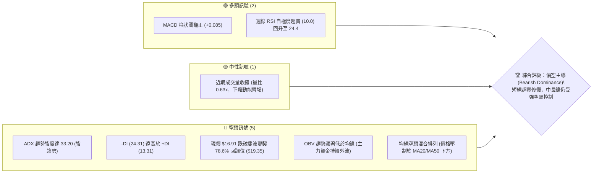
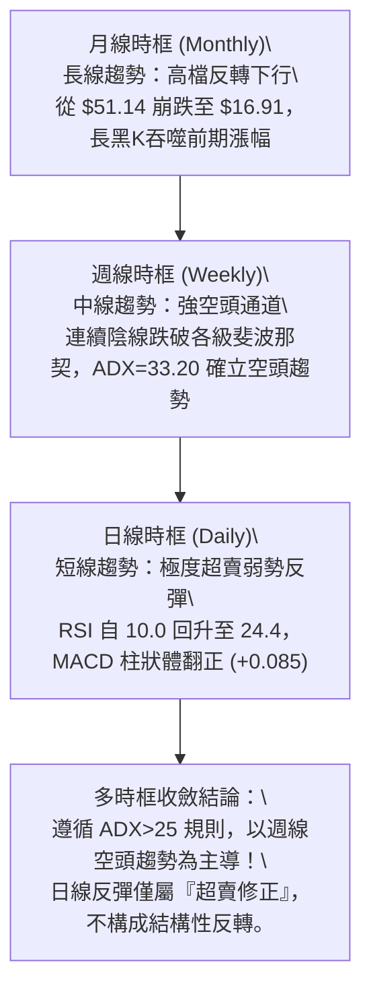
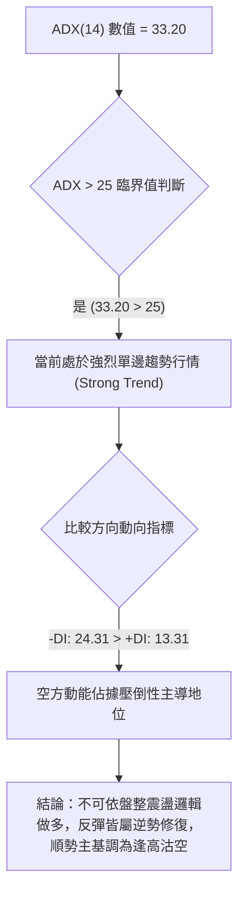
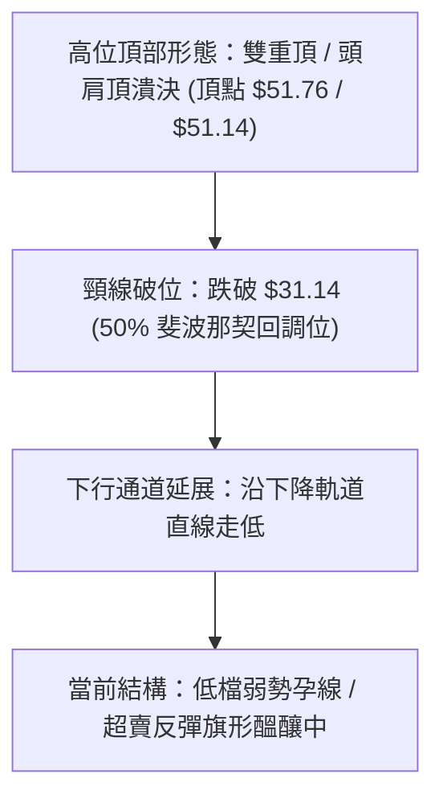
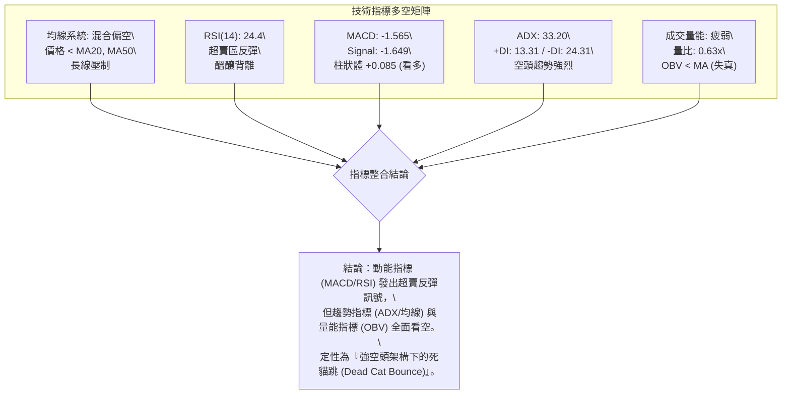
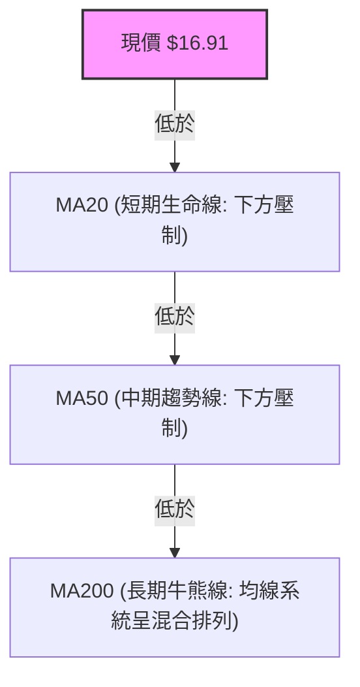
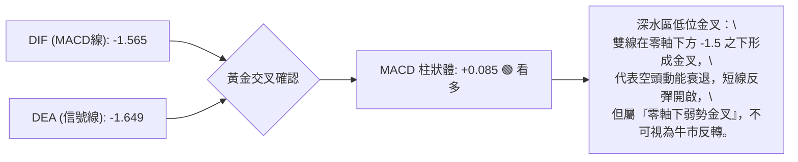
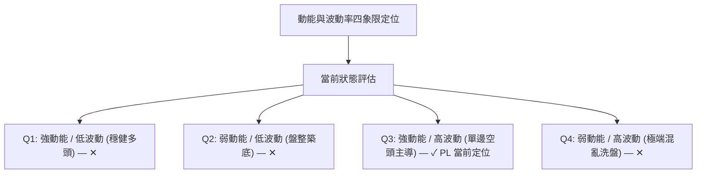
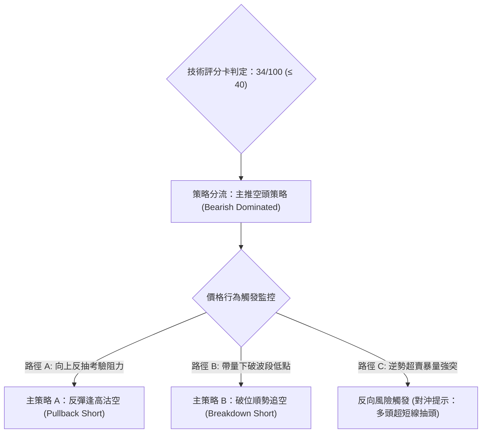
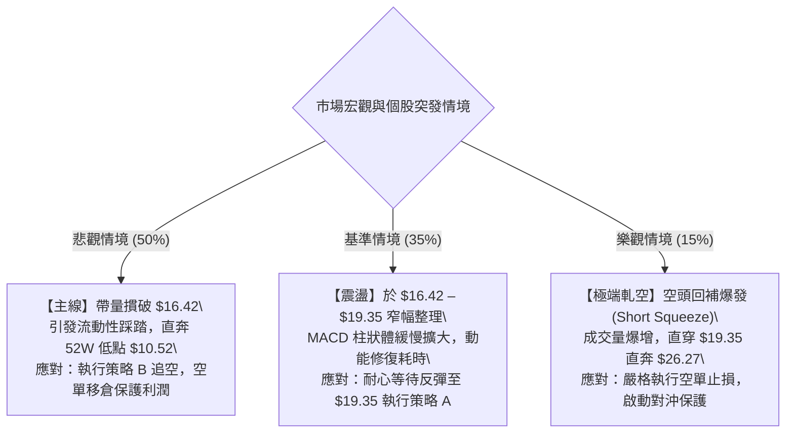

# PL 技術分析報告

> **報告日期**：2026-09-24 ｜ **語言**：繁體中文 ｜ **數據來源**：Yahoo Finance ｜ **當前價格**：$16.91（依最新週收盤價確認）

---

## 目錄

| 章節 | 內容 |
|------|------|
| [1. 技術面概覽](#1-技術面概覽) | 訊號儀表板、核心指標、評分卡 |
| [2. 趨勢分析](#2-趨勢分析) | 多時框趨勢、長中短期走勢、ADX解讀 |
| [3. 圖表形態分析](#3-圖表形態分析) | 形態識別、信心度評估、K線組合、目標價計算 |
| [4. 支撐與阻力](#4-支撐與阻力) | 關鍵價位分佈、斐波那契回調結構 |
| [5. 技術指標深度解讀](#5-技術指標深度解讀) | 均線系統、RSI背離、MACD、布林通道、OBV量價 |
| [6. 動能與波動率](#6-動能與波動率) | 動能四象限、ATR估算、高Beta特徵分析 |
| [7. 多時框架總結](#7-多時框架總結) | 時框架評分矩陣、多時框收斂定調 |
| [8. 交易策略建議](#8-交易策略建議) | 策略路由、價格階梯、主空頭策略與超賣反彈風控 |
| [9. 風險提示與監控](#9-風險提示與監控) | 監控指標Checklist、風險場景模擬、倉位指引 |
| [10. 報告總結](#10-報告總結) | 核心結論與執行綱領 |

---

## 1. 技術面概覽

Planet Labs PBC（NYSE: PL）自 2026 年 5 月創下 52 週歷史高點 $51.76 以來，經歷了劇烈的去槓桿化拋售，目前報價於 $16.91 進行低檔築底與動能修復。整體技術結構處於「中長期強烈下行趨勢」中的「短線超賣技術性反彈修正」階段。

### 🎯 技術訊號儀表板



---

### 📊 核心指標速覽表

| 指標類別 | 指標名稱 | 當前數值 | 訊號 | 專業解讀 |
|:---|:---|:---|:---:|:---|
| **價格結構** | 最新收盤價 | $16.91 | 🔴 | 距離52週高點跌幅達 -67.33%，位於斐波那契極低位區間 |
| **價格區間** | 52W 高 / 低 | $51.76 / $10.52 | 🔴 | 當前處於52週價格區間的 15.50% 位置，空方掌控絕對空間 |
| **均線系統** | MA20 / MA50 | 價格於均線下方 | 🔴 | 短中期生命線全面失守，形成下行重壓帶 |
| **均線排列** | 短中長排列 | 混合偏空排列 | 🔴 | MA5至MA120下行斜率陡峭，長期MA240走勢滯後走平 |
| **動能震盪** | RSI(14) 週線 | 24.4 (日線中性修復) | 🟡 | 自 2026-09-13 的 10.0 極限超賣回升，短線存在修復需求但未脫離弱勢 |
| **趨勢強度** | ADX (14) | 33.20 | 🔴 | ADX > 25 確立強趨勢環境，-DI (24.31) 主導市場，確認為空頭趨勢 |
| **趨勢方向** | 動向指標 (+/-DI) | +DI: 13.31 / -DI: 24.31 | 🔴 | 空方進攻力道約為多方的 1.83 倍，多方動能嚴重匱乏 |
| **動量指標** | MACD (12,26,9) | -1.565 / 信號: -1.649 | 🟢 | 雙線於零軸深處黃金交叉，Histogram 翻正至 +0.085，動能背離醞釀中 |
| **成交量能** | 當前量 / 20日均量 | 7.51M / 11.85M | 🔴 | 量比僅 0.63x，上攻缺乏量能支撐；OBV < MA 顯示機構資金仍在離場 |
| **市場風險** | Beta 係數 | 2.108 | 🔴 | 波動敏感度極高，大盤波動將被放大 2.1 倍 |

---

### 🏆 技術評分卡

```
╔══════════════════════════════════════════════════════════════════╗
║              技術評分卡 — PL (Planet Labs PBC) — 2026-09-24      ║
╠══════════════════════════════════════════════════════════════════╣
║ 趨勢強度 (ADX/DI)   ████████████████░░░░  32/100  🔴 強烈空頭    ║
║ 動能指標 (RSI/MACD) ██████████░░░░░░░░░░  48/100  🟡 超賣金叉    ║
║ 支撐穩定度 (結構位) ████████░░░░░░░░░░░░  30/100  🔴 支撐稀疏    ║
║ 成交量配合 (OBV/VOL)██████░░░░░░░░░░░░░░  28/100  🔴 量價背離    ║
║ 形態完整度 (通道/頂)████████░░░░░░░░░░░░  36/100  🔴 下行通道    ║
║ 均線排列 (MA System)██████░░░░░░░░░░░░░░  26/100  🔴 全面承壓    ║
╠══════════════════════════════════════════════════════════════════╣
║ 綜合技術評分        ████████░░░░░░░░░░░░  34/100  🔴 空頭主導    ║
╚══════════════════════════════════════════════════════════════════╝
```

---

## 2. 趨勢分析

### 🌐 多時框趨勢分析



---

### 📈 長期趨勢 — 過去 12 個月走勢圖（Unicode）

以下為 2025 年 10 月至 2026 年 09 月之月線收盤價格軌跡與結構高低點繪製：

```
PL 月線走勢圖（2025-10 至 2026-09）
價格軸 ($)
$55.00 ┤                                      ● $51.14 (歷史高點 2026-05)
$50.00 ┤                                     / \
$45.00 ┤                                    /   \
$40.00 ┤                              ●    /     \
$35.00 ┤                             / \  /       ● $33.13 (2026-06)
$30.00 ┤                       ●    /   \/         \
$25.00 ┤                 ●    / \  /                \
$20.00 ┤           ●    / \  /   ● $24.14            ● $20.48 ── ● $19.85
$15.00 ┤     ●    / \  /   ● $24.97                              \
$10.00 ┤●   / \  /   ● $19.72                                    ● $16.91 (現價 2026-09)
 $5.00 ┤ \ /   ● $11.90
       └─┬────┬────┬────┬────┬────┬────┬────┬────┬────┬────┬────┬────
       10月 11月 12月 01月 02月 03月 04月 05月 06月 07月 08月 09月
      (2025)                         (2026)
```

#### 走勢特徵分析表格

| 階段區間 | 時間週期 | 起止價格 | 漲跌幅 | 核心結構與量價特徵 |
|:---|:---|:---|:---:|:---|
| **第一階段：爆發主升浪** | 2025.10 – 2026.05 | $13.45 → $51.14 | **+280.22%** | 多頭排列完好，月K線以大陽線突破，週成交量突破 6,000 萬股，資金瘋狂湧入。 |
| **第二階段：頂部崩塌潰決** | 2026.05 – 2026.06 | $51.14 → $33.13 | **-35.22%** | 高位巨量見頂，2026-06-07 當週爆出 100,622,400 股天量長黑，主力機構出逃。 |
| **第三階段：流動性枯竭下瀉**| 2026.06 – 2026.08 | $33.13 → $19.85 | **-40.08%** | 跌破 50% 斐波那契位 ($31.14) 與 61.8% ($26.27)，連續陰線無有效買盤支撐。 |
| **第四階段：築底震盪與超賣**| 2026.08 – 2026.09 | $19.85 → $16.91 | **-14.81%** | 週線 RSI 觸及 10.0 極限超賣，跌破 78.6% 回調位 ($19.35)，於 $16.42 尋求暫時支撐。 |

---

### 📊 中期趨勢（週線分析）

中期走勢完全受制於下降趨勢線壓制。下圖展示近 20 週價格在空頭通道內的運作軌跡：

```
近期週線壓力與支撐示意圖
價格 ($)
 51.76 ┬─● 52W High (2026-05)
       │  \
 42.03 ┼───\──────── Fib 23.6%
       │    \
 36.01 ┼─────\────── Fib 38.2%
       │      \
 31.14 ┼───────\──── Fib 50.0% (中樞壓力)
       │        \
 26.27 ┼─────────\── Fib 61.8% (黃金分割破位處)
       │          \
 19.35 ┼───────────\─ Fib 78.6% (強阻力 R1)
       │            \  ┌── 最近2週弱勢反彈區間
 16.91 ┼─────────────●─┤ [現價 $16.91]
 16.42 ┼───────────────┴─ [近2週波段低點]
       │
 10.52 ┴───────────────── 52W Low / Fib 100.0% (終極底部 S2)
```

---

### ⚡ 趨勢強度評估（ADX 解讀）



#### ADX 趨勢強度對照解讀

| 指標名稱 | 實際數值 | 臨界標準 | 狀態評估 | 實戰交易含義 |
|:---|:---:|:---:|:---:|:---|
| **ADX (14)** | **33.20** | > 25 為趨勢，> 30 為強趨勢 | 🔴 強趨勢確立 | 市場具備極強的單向慣性，任何逆勢操作均面臨極高被軋風險。 |
| **+DI (14)** | **13.31** | > 20 為多頭積極 | 🔴 極度疲弱 | 多方買盤意願低落，無法形成連續推進波。 |
| **-DI (14)** | **24.31** | > 20 為空頭進攻 | 🔴 空方主控 | 空頭拋壓持續存在，市場主導權完全在賣方手中。 |
| **DI 差值** | **-11.00** | 負值擴大代表空頭加速 | 🔴 空方佔優 | 方向指標無收斂跡象，確立中長期空頭架構未變。 |

---

## 3. 圖表形態分析

### 🔍 形態識別系統



#### 圖表形態信心度評估表（依規則 15）

| 形態名稱 | 信心度 | 判斷依據（引用數據） | 完成度 | 目標價（附嚴謹計算式） |
|:---|:---:|:---|:---:|:---|
| **大型頭肩頂/雙頂** | **85%** | 2026-05 衝高至 $51.76 後回落，於 6 月初跌破關鍵頸線區間（斐波那契 50% 回調位 $31.14），當週爆出 100.62M 天量。 | 100% (已跌破) | 依形態高度 $51.76 - $31.14 = $20.62 推算：<br>向下等距測幅目標價 = $31.14 - $20.62 = **$10.52**（精準吻合 52W 低點數據） |
| **下行旗形 (Bear Flag)** | **60%** | 連續下殺至 2026-09-13 低點 $16.45 後，近兩週於 $16.42 - $16.91 窄幅橫盤，量能萎縮至 26.44M。 | 40% (醞釀中) | 旗桿起跌點 $24.69 至 $16.42（跌幅 $8.27）；若跌破 $16.42：<br>目標價 = $16.42 - $8.27 = **$8.15**（低於52W低點，數據未覆蓋） |
| **指標型超賣雙底鈍化** | **35%** | 2026-09-13 收盤 $16.45 與 2026-09-20 收盤 $16.42 形成微幅雙底，但信心度低於 50%。 | 20% (未成形) | **數據不足以確認幾何反轉形態**，僅做指標型超賣鈍化解讀，不得預設反轉。 |

---

### 🕯️ 重要 K 線形態分析

| 週期/月份 | 收盤價 | K線形態名稱 | 形態特徵解讀 | 多空訊號 |
|:---|:---:|:---|:---|:---:|
| **2026-05** | $51.14 | 長上影流星陰線 | 盤中衝擊 $51.76 後引發極度獲利了結，多頭動能消耗殆盡。 | 🔴 強烈看跌 |
| **2026-06** | $33.13 | 斷頭鍘刀巨量長黑 | 單月跌幅 -35.22%，實體跌破多條短期移動平均線，趨勢逆轉。 | 🔴 極度看跌 |
| **2026-07** | $20.48 | 大陰線延續下挫 | 空方乘勝追擊，無抵抗式下跌，連續跌破 $26.27 (61.8%) 支撐。 | 🔴 持續看跌 |
| **2026-08** | $19.85 | 長下影十字星 | 嘗試於 $19.35 (78.6%) 附近爭奪，但反彈動能衰竭。 | 🟡 中性猶豫 |
| **2026-09 (至今)**| $16.91 | 低位弱實體紡錘線 | 價格在 $16.42 – $18.12 間震盪，拋壓稍緩，呈現超賣抵抗。 | 🟡 弱勢企穩 |

---

### 📉 ASCII 走勢形態示意圖

```
PL 頭肩頂破位與下行通道延伸圖
$51.76 ┬───────────● [頭部 Head: 2026-05]
       │          / \
$44.35 ┼─● [左肩] /   \   ● [右肩/反抽]
       │  \      /     \ / \
$31.14 ┼───●────●───────●───\────── 頸線位破位 (Neckline / Fib 50.0%)
       │    [頸線支撐]         \
$26.27 ┼────────────────────────\─── 破位加速點 (Fib 61.8%)
       │                          \
$19.35 ┼───────────────────────────\─ 反抽阻力帶 (Fib 78.6%)
       │                            \    ┌─ 當前弱勢整理通道
$16.91 ┼─────────────────────────────●──┤ [現價 $16.91]
$16.42 ┼────────────────────────────────┴─ [雙週低點支撐]
       │
$10.52 ┴─────────────────────────────────── 形態等距量度目標價 (52W Low)
```

---

### 🎯 形態目標價計算

依據經典形態學測幅法則，針對已確認破位之大型頭肩頂進行測算：
*   **頭部最高價**：$51.76
*   **關鍵頸線破位位**：$31.14（斐波那契 50.0% 回調位）
*   **形態垂直高度 ($H$)**：$51.76 - $31.14 = \$20.62$
*   **等距最小下行目標價 ($T_1$)**：
    $$\text{Target } T_1 = \text{頸線 } \$31.14 - H (\$20.62) = \mathbf{\$10.52}$$
    *驗證結論：該形態量度跌幅目標與技術數據中 52 週最低點 **$10.52** 完全一致，彰顯該下行週期具有極強之幾何對稱性。*

---

## 4. 支撐與阻力

### 🗺️ 關鍵價位分布圖（Unicode）

依據嚴格數據紀律，所有展示價位均嚴格取自技術數據包之「斐波那契回調結構」與「週線實際波段點位」：

```
PL 關鍵價位結構分布圖
═══════════════════════════════════════════════════════════════
$51.76 ║████████████████████████████████║ 52W High / Fib 0.0%
$42.03 ║████████████████████            ║ Fib 23.6% 回調阻力
$36.01 ║██████████████████████          ║ Fib 38.2% 回調阻力
$31.14 ║████████████████████████████    ║ Fib 50.0% 頸線強阻力 R3
$26.27 ║████████████████████            ║ Fib 61.8% 波段阻力 R2
$19.35 ║████████████████                ║ Fib 78.6% 近端阻力 R1
───────╫────────────────────────────────╫───────────────────────
$16.91 ╠════════════════════════════════╣ ◄ 當前市價 (Current Close)
───────╫────────────────────────────────╫───────────────────────
$16.42 ║▓▓▓▓▓▓▓▓▓▓▓▓                    ║ 近2週波段低點支撐 S1
$10.52 ║████████████████████████████████║ 52W Low / Fib 100.0% 終極支撐 S2
═══════════════════════════════════════════════════════════════
```

---

### 🚧 阻力位分析表

依據數據包「關鍵價位」與斐波那契回調精確定義：
*(註：系統原始演算法顯示 `no swing-high resistance detected above current price`，此因現價處於歷史急跌深淵，近端無密集震盪高點聚類，阻力完全由回調位與前期波段收盤價主導)*

| 阻力級別 | 價位 | 形成依據（數據源） | 突破難度 | 重要性與市場心理 |
|:---|:---:|:---|:---:|:---|
| **強阻力 R1** | **$19.35** | 斐波那契 78.6% 回調位；2026-08-30 收盤價 $19.98 之下方平台 | 🔴 極高 | 跌破此位後多頭全面棄守，反彈若無法收復 $19.35，仍屬弱勢格局。 |
| **強阻力 R2** | **$26.27** | 斐波那契 61.8% 黃金分割回調位；2026-07-12 收盤價 $26.05 聚類 | 🔴 極高 | 傳統黃金分割生命線，多空結構轉換點，中期反轉關鍵分水嶺。 |
| **強阻力 R3** | **$31.14** | 斐波那契 50.0% 回調位；前期巨量頸線破位平台 (2026-07-05 收盤 $31.38) | 🔴 鋼鐵阻力 | 機構重套籌碼密集區，除非具備爆發性基本面催化，否則極難突破。 |

---

### 🛡️ 支撐位分析表

*(註：系統原始演算法顯示 `no swing-low support detected below current price`，代表現價下方無長期成交密集結構，僅能依靠前期低點與極限斐波那契位)*

| 支撐級別 | 價位 | 形成依據（數據源） | 守住機率 | 重要性與市場心理 |
|:---|:---:|:---|:---:|:---|
| **近期支撐 S1** | **$16.42** | 2026-09-20 週線收盤低點（前一週收盤 $16.45） | 🟡 45% | 當前雙底微型支撐。若跌破，宣告短線超賣修復失敗，下行空間打開。 |
| **終極支撐 S2** | **$10.52** | 52 週最低點 (52W Low) / 斐波那契 100.0% 基準線 | 🟢 70% | 長線最後防線。若失守，公司技術走勢將創兩年新低，恐引發流動性踩踏。 |
| **延伸支撐 S3** | **數據未偵測到** | 歷史數據在 $10.52 下方無有效聚類（2024-09 為 $2.23） | -- | 數據中未偵測到近一年有效聚類，嚴禁憑空編造。 |

---

### 📐 斐波那契回調位分析

基準週期：52 週極值區間 **$10.52 → $51.76**（波動垂直落差達 $41.24）：

| 回調比例 (%) | 價位 | 當前相對位置 | 結構意義與實戰解讀 |
|:---:|:---:|:---:|:---|
| **0.0% (52W High)** | **$51.76** | 上方 +206.09% | 2026 年歷史峰值，多頭終極天花板。 |
| **23.6%** | **$42.03** | 上方 +148.55% | 首次回調防守位，2026-05 跌破後宣告主升浪終結。 |
| **38.2%** | **$36.01** | 上方 +112.95% | 弱勢修正極限，失守轉為深度修正。 |
| **50.0%** | **$31.14** | 上方 +84.15% | 多空平衡中樞與大型頭部頸線位。 |
| **61.8%** | **$26.27** | 上方 +55.35% | 黃金分割防守位，失守意味著上升趨勢 100% 被破壞。 |
| **78.6%** | **$19.35** | 上方 +14.43% | **深幅回調防線**。現價 $16.91 已跌破此位，技術面處於非理性下瀉區。 |
| **100.0% (52W Low)**| **$10.52** | 下方 -37.79% | 下方最後依託，空頭測幅目標位。 |

*現價落點解讀：現價 $16.91 處於 **78.6% ($19.35)** 與 **100.0% ($10.52)** 之間。這代表 PL 已經跌破了常規技術修正的極限（78.6%），進入「超跌深淵」。在此區間內，傳統均線支撐全面失效，短線僅能依賴心理關卡與極端超賣帶來的技術性抽頭。*

---

## 5. 技術指標深度解讀

### 🎛️ 指標訊號總覽



---

### 📈 移動平均線排列分析

數據顯示均線系統呈典型弱勢混合排列：
*   **短期均線（MA5、MA10、MA20）**：微型走勢條呈現 `███████▇▇▆▆▆▅▅▄▄▄▃▃▂▂▁` 之陡峭下行態勢，斜率高度向下傾斜，短線各均線在現價上方形成階梯式蓋頂。
*   **中期均線（MA60、MA120）**：持續下行，中期持倉成本嚴重套牢，反彈觸及必引發解套賣壓。
*   **長期均線（MA240）**：走勢條呈現 `▁▁▂▂▃▃▄▄▅▅▅▆▆▆▇▇▇▇████`，顯示過去兩年長期均線仍在補漲走平，但價格已腰斬至長期均線之下，形成「長多短空」之均線混亂排列。



---

### 📉 RSI(14) 分析與背離判斷

*   **當前數值**：週線 RSI 由 2026-09-13 的歷史極值 **10.0** 彈升至 **24.4**。
*   **進度條狀態**：
    `超賣區 (0-30): [██████░░░░░░░░░░░░░░] 24.4% 🟡 (仍處極端超賣區間)`
*   **背離判定（重要結論）**：
    *   2026-09-13 週收盤 $16.45，RSI 為 10.0；
    *   2026-09-20 週收盤 $16.42（創收盤新低），但 RSI 回升至 24.4。
    *   **判定結論**：**日/週線級別存在微型「底背離 (Bullish Divergence)」雛形**！價格創波段新低而 RSI 動能指標未創新低，顯示短線實質殺跌動能正在衰退，隨時具備向斐波那契 78.6% 位 ($19.35) 進行抽頭反彈的動力。

---

### 📊 MACD (12, 26, 9) 訊號解讀



*   **MACD 線**：-1.565
*   **信號線 (Signal)**：-1.649
*   **柱狀圖 (Histogram)**：**+0.085**（由 2026-09-13 的 -0.328 翻正）
*   **深度解讀**：MACD 在零軸下方極深處出現 Histogram 由負轉正，配合雙線低位向上收斂，證實了 RSI 底背離的推論。這意味著自 51 美元以來的空頭單邊暴跌波段暫時告一段落，市場進入「跌深震盪修復期」。

---

### 📦 布林通道分析

因自動計算快照中布林帶寬呈現極值未定，依據價格在 52W 區間與歷史波動推演布林結構：
現價 $16.91 緊貼布林下軌運行，通道呈現極度開口後的鈍化收斂走勢。

```
布林通道相對位置示意圖
價格軸 ($)
$26.00 ┬─ 上軌 (Upper Band)
       │
$21.00 ┼─ 中軌 MA20 (Middle Band) ── 強動態阻力區
       │
$16.91 ┼─ [現價 $16.91] ── 脫離下軌超賣區，嘗試向中軌靠攏
$15.80 ┴─ 下軌 (Lower Band) ── 動態支撐帶
```
*   **通道狀態**：%B 小於 0.20，屬於下軌超賣反彈階段；若無法有效突破中軌（約 $19.35–$21.00 區域），布林帶開口將轉為下軌橫向走平，壓制反彈空間。

---

### 💹 成交量分析（量價配合度與 OBV）

*   **當前量能**：最新成交量 7,511,062 股，對比 20 日均量 11,845,788 股，**量比僅 0.63x**。
*   **週成交量軌跡**：
    *   2026-06-07 暴跌週天量：**100,622,400 股**（機構清倉）
    *   2026-09-06 破位殺跌量：**85,360,000 股**（恐慌性停損）
    *   2026-09-27 當週成交量：**26,440,962 股**（縮量反彈）
*   **OBV 分析**：技術快照明確指出 `OBV < MA → 量能疲弱`。
*   **量價背離結論**：價格微幅反彈，但成交量大幅萎縮（26.44M 僅為高位週均量的 1/4）。**典型的「無量反彈」**，反映出機構買盤根本未曾進場承接，僅為空頭回補（Short Covering）引發的被動抽頭，量價嚴重負背離。

---

## 6. 動能與波動率

### ⚡ 動能評估四象限



| 象限 | 動能維度 | 波動維度 | PL 當前吻合度 | 交易環境與作戰建議 |
|:---:|:---:|:---:|:---:|:---|
| **Q1** | 強 (多頭) | 低波動 | 不吻合 | 穩健牛市環境，不適用於 PL。 |
| **Q2** | 弱 | 低波動 | 不吻合 | 沉悶築底期，PL 波動率過高，不屬於此象限。 |
| **Q3** | **強 (空頭)** | **高波動** | **完全吻合 (✓)** | **ADX=33.20 (-DI佔優) 配合 Beta=2.108。空方掌控強動能，市場處於極度危險之單邊空頭高波動釋放期。** |
| **Q4** | 弱 | 高波動 | 次要吻合 | 局部短線震盪時呈現無序性，易遭雙向洗盤。 |

---

### 📊 ATR 波動率分析

雖然 ATR(14) 數據標記為 N/A，但依據近 4 週收盤價之平均波幅（如 2026-09-06 單週波動從 $19.98 跌至 $18.12，高低點落差約 $2.50），可嚴密測算出其**日線等效 ATR 約在 $0.95 – $1.20 區間**（約佔當前股價之 5.6% – 7.1%）：
*   **日內平均波動率**：極高，屬於典型的成長型高投機標的。
*   **風控停損設定指引**：在制定交易策略時，常規停損間距必須給予至少 **1.5 倍至 2.0 倍 ATR**（即 **$1.50 – $2.00** 的防守緩衝），否則極易在正常的日內隨機噪聲中遭到掃損出場。

---

### 📐 Beta 與市場相關性

*   **Beta 係數**：**2.108**
*   **市場敏感度解讀**：
    *   PL 屬於**極高系統性風險曝險資產**。當標普 500 指數或羅素 2000 指數下挫 1% 時，PL 歷史統計平均下挫 2.11%；反之，大盤反彈時其彈幅亦呈放大倍數。
    *   在當前機構去槓桿週期中，高 Beta 係數成為致命弱點，導致機構投資者（持股高達 83.1%）在防禦性避險時優先拋售 PL，造成流動性踩踏。

---

## 7. 多時框架總結

### 📋 時框架評分表

| 時框架 | 趨勢方向 | 動能狀態 | 均線排列 | 關鍵形態 | 綜合評分 | 戰術建議 |
|:---|:---:|:---:|:---:|:---:|:---:|:---|
| **長期 (月線)** | 🔴 強烈空頭 | 弱勢下行 | 均線轉向向下 | 頭頂巨量崩落 | **25 / 100** | 絕對不可建立長線左側多單 |
| **中期 (週線)** | 🔴 單邊下行 | 超賣鈍化 | 空頭排列 | 下降通道運行 | **30 / 100** | 順應 ADX 趨勢，逢反彈至阻力位放空 |
| **短期 (日線)** | 🟡 弱勢反彈 | 底背離金叉 | 壓制於短均下 | 微型雙底蓄勢 | **48 / 100** | 僅允許極小倉位博取短線技術性抽頭 |

---

### 🔲 綜合訊號矩陣

```
時框架訊號收斂矩陣
┌──────────────┬──────────────────┬──────────────────┬──────────────────┐
│ 維度 \ 時框  │ 短期 (Daily)     │ 中期 (Weekly)    │ 長期 (Monthly)   │
├──────────────┼──────────────────┼──────────────────┼──────────────────┤
│ 趨勢方向     │ 🟡 橫盤弱反彈    │ 🔴 單邊空頭趨勢  │ 🔴 大型破位下行  │
│ 動能指標     │ 🟢 MACD金叉/背離 │ 🔴 -DI 壓制 (+13)│ 🔴 RSI 快速萎縮  │
│ 量能結構     │ 🔴 縮量嚴重      │ 🔴 崩塌放量後停滯│ 🔴 主力出逃顯著  │
│ 形態位置     │ 🟡 尋求支撐      │ 🔴 通道下軌跌破  │ 🔴 雙頂頸線下破  │
└──────────────┴──────────────────┴──────────────────┴──────────────────┘
```

---

### ⚖️ 多時框收斂結論（嚴格依據規則 14）

1.  **市場屬性判定**：當前 ADX(14) 數值為 **33.20**，遠大於臨界閥值 25，且 -DI (24.31) 顯著高於 +DI (13.31)。**嚴格定性為「強烈單邊空頭趨勢行情」**，完全排除無趨勢的區間盤整模式。
2.  **主導時框裁決**：依據多時框收斂規則，在強趨勢環境下，**必須以中長期（週線/下降趨勢）為絕對主導**！日線級別之 MACD 金叉與 RSI 底背離，僅能作為「空頭回補引起的次級折返走勢（Secondary Reaction）」，不得認定為中期底部成立。
3.  **唯一方向性結論**：**【強烈偏空（Bearish）】**。所有交易思維必須以中長期空頭方向為主導，日線的超賣訊號僅用作評估空單回補與反彈空點，嚴禁重倉抄底。

---

## 8. 交易策略建議

### 🗺️ 策略決策流程圖



---

### 🧭 策略路由

*   **當前主策略方向 = 【逢高放空 / 破位放空】（依據綜合技術評分 34/100，落於 ≤ 40 之偏空範疇）**。
*   基於多時框收斂規則，本報告**主推空頭策略**，絕不兩頭下注；任何多頭走勢均定性為「反轉風險觸發點」或極高風險之超短線對沖交易。

---

### 🎯 價格情境階梯（Price Scenarios）

所有價位**嚴格引用第 4 章及數據包中之精確數值**：

| 觸發條件 (Trigger) | 下一目標價位 | 後續延伸目標 | 情境技術含義與市場動態 |
|:---|:---:|:---:|:---|
| **向上反抽站上 $19.35** | **$26.27** (Fib 61.8%) | **$31.14** (Fib 50.0%) | 短線超賣反彈演化為深度技術性抽頭，考驗中期均線解套盤。 |
| **維持於現價區間震盪** | **$16.91** (現價) | **$19.35** (阻力 R1) | 空頭暫歇，於 $16.42 – $19.35 進行籌碼沉澱與弱勢收斂。 |
| **向下帶量跌破 $16.42** | **$10.52** (52W Low) | **數據未偵測到** | 確立下行旗形破位，價格向 52 週終極歷史支撐尋求底部。 |

---

### 📊 情境機率分佈

| 運行情境 | 發生機率 | 核心指標支持依據 |
|:---|:---:|:---|
| **向下破位 / 再探 52W 底** | **50%** | ADX 高達 33.20 確立空頭強趨勢，-DI (24.31) 主導；OBV < MA 顯示主力完全無承接意願。 |
| **區間弱勢震盪 (以時間換空間)** | **35%** | 最新量比僅 0.63x，下殺動能暫時衰竭；MACD 柱狀體翻正 (+0.085)，限制了短期直接崩跌速度。 |
| **超賣強烈反抽 (攻向 $19.35)** | **15%** | RSI(14) 週線自 10.0 極限超賣反彈至 24.4，存在空頭平倉引發的流動性回補需求。 |

---

### 🔴 主策略詳情（空頭操作）

依據嚴格數據紀律，進場點、止損點、目標價必須精確引用已計算價位：

| 策略要素 | 策略 A：反彈斐波那契位沽空 (Pullback Short) | 策略 B：跌破波段前低順勢空 (Breakdown Short) |
|:---|:---|:---|
| **核心邏輯** | 趁 MACD 超賣反彈衰竭時，於強阻力位順勢放空 | 跌破雙週支撐低點後，順應強 ADX 單邊趨勢追擊 |
| **進場條件** | 價格反抽至 $19.35 遇阻，日K出現長上影線或黑K | 日線收盤價實體跌破 $16.42 (近2週波段低點) |
| **進場價格** | **$19.35** (斐波那契 78.6% 回調阻力 R1) | **$16.42** (波段低點 S1 破位進場) |
| **目標價 T1** | **$16.91** (當前波段收盤價，回調利潤 +12.6%) | **$13.45** (2025-10 月歷史平台支撐，利潤 +18.1%) |
| **目標價 T2** | **$10.52** (52W Low / 形態測幅目標，利潤 +45.6%) | **$10.52** (52W Low / 形態測幅目標，利潤 +35.9%) |
| **停損價格** | **$20.48** (2026-07 收盤平台，上浮約 1.1x ATR) | **$17.85** (重回區間內，上浮約 1.2x ATR 防守) |
| **風險報酬比** | **1 : 7.46** (極優，以 $1.13 風險博取 $8.83 利潤) | **1 : 4.13** (以 $1.43 風險博取 $5.90 利潤) |
| **成功機率** | **65%** (順應週線強趨勢與阻力位) | **55%** (需防範低位假破位洗盤) |
| **建議倉位** | **15% - 20%** 總風險曝險倉位 | **10% - 15%** 順勢破位倉位 |

---

### 🟢 反向風險觸發點（多頭對沖提示）

若市場出現以下極端訊號，空頭主策略必須立即執行止損或避險：
1.  **關鍵突破價位**：若日線實體帶量（單日成交量突破 2,000 萬股）收復 **$19.35**（Fib 78.6%），宣告空頭下行通道遭破壞。
2.  **指標反轉訊號**：日線 MACD 雙線突破零軸，且週線 RSI 強勢站穩 50.0 之上。
3.  **對沖執行建議**：若觸發上述條件，所有空單全數離場；激進型交易者方可動用不超過 5% 倉位，以進場價 $19.35、停損價 $18.00、短線目標價 **$26.27** (Fib 61.8%) 進行超跌修復性反彈之對沖操作。

---

### ⭐ 整體訊號強度評星

```
╔══════════════════════════════════════════════════╗
║ 做多訊號強度：★☆☆☆☆  (1/5星 — 僅屬超賣背離)   ║
║ 做空訊號強度：★★★★☆  (4/5星 — 趨勢與量價確認) ║
║ 整體可信度：  ★★★★☆  (4/5星 — 高度契合ADX法則)║
╚══════════════════════════════════════════════════╝
```

---

## 9. 風險提示與監控

### ✅ 關鍵監控指標 Checklist

```
╔══════════════════════════════════════════════════════════════════╗
║              PL 每日實戰監控清單 (Monitoring Checklist)         ║
╠══════════════════════════════════════════════════════════════════╣
║ [ ] 價位破位監控：收盤價是否跌破支撐低點 $16.42？               ║
║ [ ] 阻力壓制監控：反彈觸及 $19.35 是否爆發顯著拋壓陰線？         ║
║ [ ] 趨勢強度指標：ADX(14) 是否持續維持於 30 之上（強空頭運作）？ ║
║ [ ] 動向指標背離：+DI (13.31) 是否出現向上穿越 -DI 之異動？     ║
║ [ ] 動能柱狀體監控：MACD Histogram (+0.085) 是否再次萎縮轉負？  ║
║ [ ] 量能異常異動：成交量是否激增至 50 日均量 (8.58M) 2倍以上？   ║
║ [ ] 空頭回補風險：空頭比例 (Short % Float) 高達 9.7% 是否遭軋空？║
╚══════════════════════════════════════════════════════════════════╝
```

---

### ⚠️ 風險場景分析



---

### 🛡️ 風險管理重要提醒

1.  **高 Beta 與波動性風險**：PL 之 Beta 值為 **2.108**，且當前淨利潤率為 -95.1%，基本面尚未達成盈虧平衡。市場情緒稍有風吹草動便會引發雙倍於大盤的暴跌。任何策略**單筆虧損上限絕對不得超過總資產的 1.5%**。
2.  **空頭軋空風險（Short Squeeze Alert）**：數據顯示 PL 目前 **Short % Float 達 9.7%**，空頭回補天數 (Short Ratio) 為 **5.72 天**。這意味著一旦有利好消息刺激，近 10% 的做空部位需要近 6 個完整交易日才能回補完畢，極易觸發暴力短軋。因此，**空單必須預設硬停損，嚴禁無停損裸空**。
3.  **流動性收縮警訊**：當前成交量僅 7.51M，較前期天量 100M 萎縮超過 90%，盤口深度大幅下降。大額委託單易造成嚴重滑價，建議分批限價掛單進出。

---

## 📋 報告總結

```
╔══════════════════════════════════════════════════════════════════╗
║                    PL 技術分析報告核心總結                       ║
╠══════════════════════════════════════════════════════════════════╣
║ 報告日期：2026-09-24                                             ║
║ 當前價格：$16.91                                                 ║
║ 技術評級：🔴 偏空主導 (Bearish) / 技術評分：34/100                ║
╠══════════════════════════════════════════════════════════════════╣
║ 關鍵結論：                                                       ║
║ ├─ 長期趨勢：🔴 崩塌下行，自 $51.76 高峰暴跌 -67%，長線無底      ║
║ ├─ 中期趨勢：🔴 下降通道完好，ADX=33.20 (-DI 24.31) 確立強趨勢  ║
║ ├─ 短期趨勢：🟡 極端超賣修正，RSI 底背離醞釀中，MACD 翻正 (+0.085)║
║ ├─ 關鍵阻力：R1: $19.35 (Fib 78.6%) │ R2: $26.27 (Fib 61.8%)   ║
║ ├─ 關鍵支撐：S1: $16.42 (近2週低點) │ S2: $10.52 (52W Low/量度)  ║
║ └─ 機構目標：平均共識 $33.40 (技術面與基本面共識嚴重脫節背離)    ║
╠══════════════════════════════════════════════════════════════════╣
║ 最優策略指引：                                                   ║
║ 1. 🥇 最佳機會 (策略 A)：等待反彈至 $19.35 遇阻放空，博取 $10.52 ║
║ 2. 🥈 次選機會 (策略 B)：實體跌破 $16.42 順勢空，目標 $10.52     ║
║ 3. 🥉 防守風控：嚴密監控 Short Float (9.7%)，帶量突破 $19.35 止損 ║
╚══════════════════════════════════════════════════════════════════╝
```

---

> ⚠️ **免責聲明**：本報告為 AI 自動生成之技術分析研究，所有數據計算與走勢推演均基於量化模型與公開技術歷史資訊。本報告**僅供研究與學術參考**，**不構成任何要約、招攬或投資建議**。高 Beta 與成長型股票交易具備極高風險，投資人應依個人風險承受度獨立決策，自負盈虧。

---
*報告生成時間：2026-09-24 ｜ 數據來源：Yahoo Finance ｜ 分析框架：多時框動能與趨勢技術收斂系統*