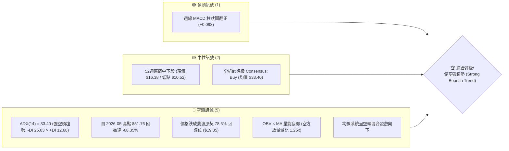
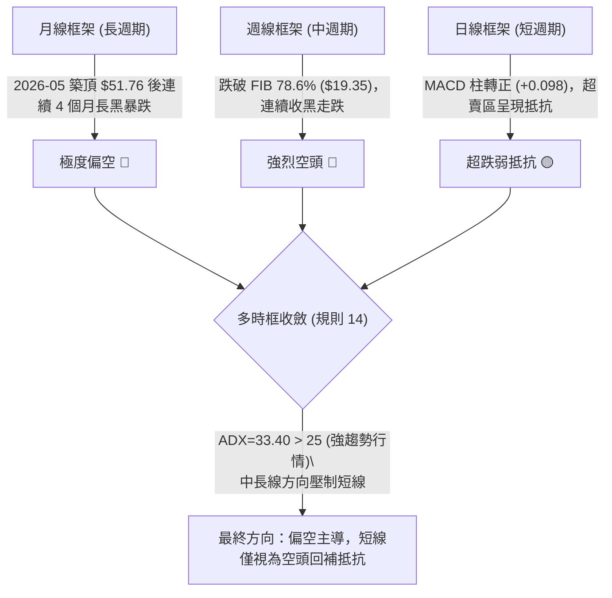
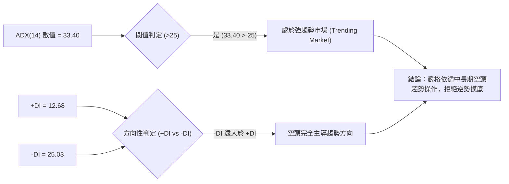
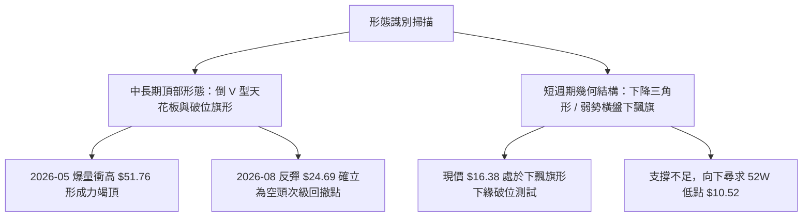
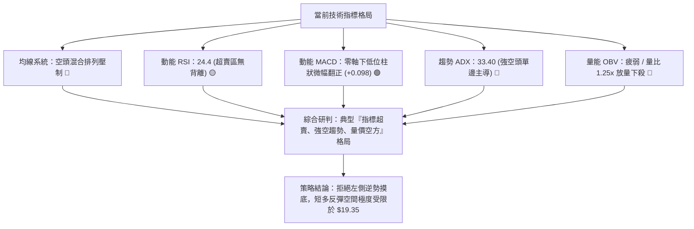
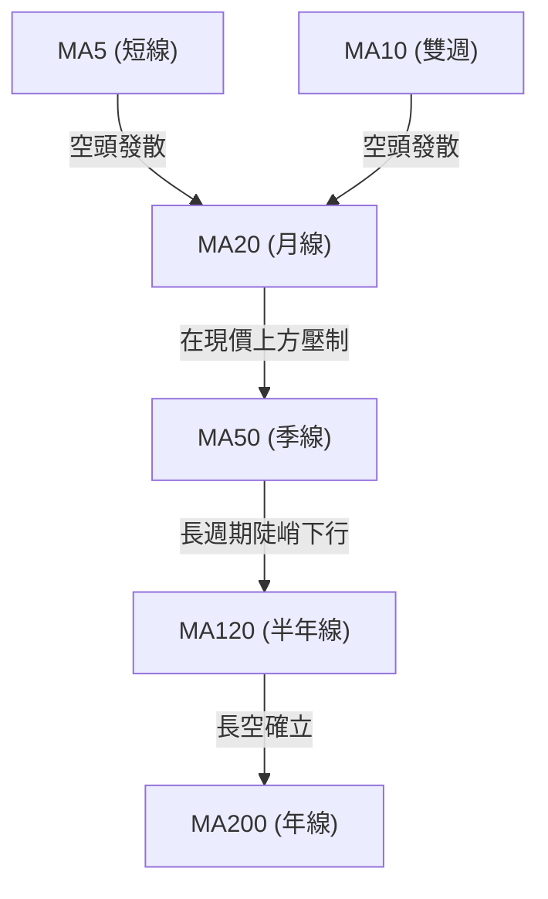
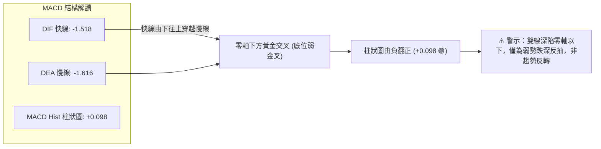
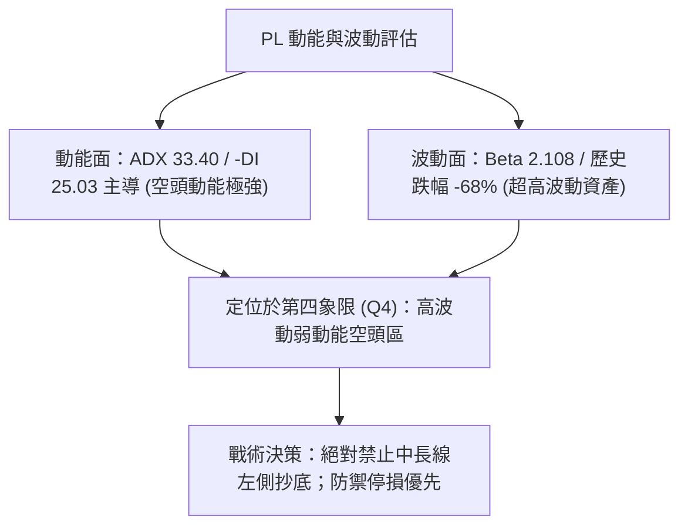
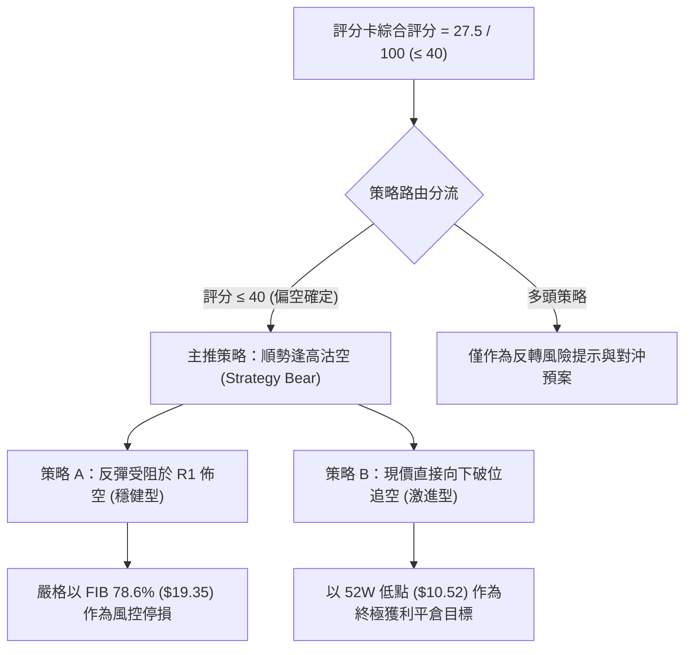
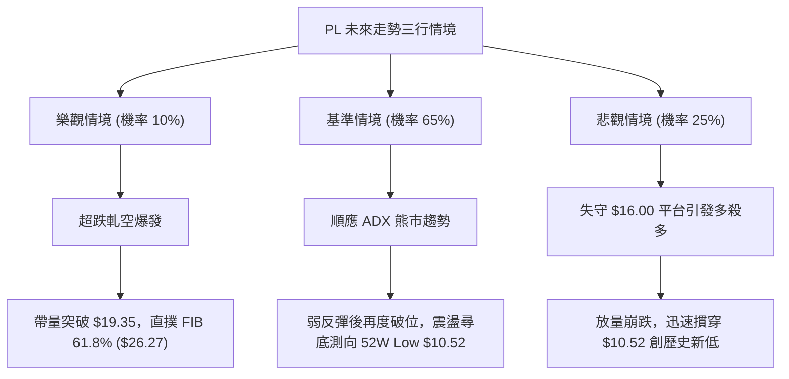

# PL 技術分析報告

> **報告日期**：2026-09-25 ｜ **語言**：繁體中文 ｜ **數據來源**：Yahoo Finance ｜ **當前價格**：$16.38（取自最新週收盤價 2026-09-27 / 2026-09 月度收盤價）

---

## 目錄

| 章節 | 內容 |
|------|------|
| [1. 技術面概覽](#1-技術面概覽) | 訊號儀表板、核心指標、評分卡 |
| [2. 趨勢分析](#2-趨勢分析) | 多時框趨勢、長中短期走勢 |
| [3. 圖表形態分析](#3-圖表形態分析) | 形態識別、K線組合、目標價 |
| [4. 支撐與阻力](#4-支撐與阻力) | 關鍵價位、斐波那契回調 |
| [5. 技術指標深度解讀](#5-技術指標深度解讀) | MA/RSI/MACD/布林/成交量 |
| [6. 動能與波動率](#6-動能與波動率) | 動能評估、ATR、Beta |
| [7. 多時框架總結](#7-多時框架總結) | 時框架評分矩陣 |
| [8. 交易策略建議](#8-交易策略建議) | 多空策略、風險報酬比 |
| [9. 風險提示與監控](#9-風險提示與監控) | 監控指標、風險場景 |

---

## 1. 技術面概覽

### 🎯 技術訊號儀表板



### 📊 核心指標速覽表

| 指標類別 | 指標名稱 | 當前數值 | 訊號 | 解讀 |
|----------|----------|----------|------|------|
| **價格** | 當前收盤價 | $16.38 | 🔴 | 創近 10 個月新低，處於長期下行通道中 |
| **均線** | MA20 | 數據中未偵測到 | 🔴 | 系統標註為「下方」，中短期均線全面壓制 |
| **均線** | MA50 | 數據中未偵測到 | 🔴 | 系統標註為「下方」，中期均線呈陡峭下行 |
| **均線** | MA200 | 數據中未偵測到 | 🔴 | 歷史長期均線走弱，整體處於長期空頭格局 |
| **動能** | RSI(14) | 24.4 (前週值) | 🟡 | 進入超賣臨界區域，但尚未出現底背離結構 |
| **動能** | MACD | -1.518 / -1.616 | 🟡 | 雙線位於零軸下方極深處，MACD柱微幅轉正(+0.098)呈現弱反彈訊號 |
| **趨勢** | ADX(14) / DMI | 33.40 (-DI 25.03) | 🔴 | ADX>25 顯示高強度單邊趨勢，-DI強勢主導空方行情 |
| **量能** | 成交量 / OBV | 15,476,864 / 疲弱 | 🔴 | 最新量高於20日均量(1.25x)，OBV低於均線，空方籌碼持續釋出 |
| **波動** | Beta | 2.108 | 🔴 | 高波動性標的，大盤下行期具有放大 2.1 倍之劇烈波動風險 |

### 🏆 技術評分卡

```
╔══════════════════════════════════════════════════════════════════╗
║                   技術評分卡 — PL (2026-09-25)                   ║
╠══════════════════════════════════════════════════════════════════╣
║ 趨勢強度 (ADX=33.4)  ████████████████░░░░  25/100 🔴 空頭強趨勢  ║
║ 動能指標 (MACD/RSI)  ████████░░░░░░░░░░░░  35/100 🟡 跌深弱反彈  ║
║ 支撐穩定度 (破FIB78) ██████░░░░░░░░░░░░░░  20/100 🔴 支撐下移    ║
║ 成交量配合 (OBV弱)   ████████░░░░░░░░░░░░  30/100 🔴 放量下行    ║
║ 形態完整度 (主跌浪)  ████████████░░░░░░░░  40/100 🔴 弱勢階梯破位║
║ 均線排列 (空頭壓制)  ████░░░░░░░░░░░░░░░░  15/100 🔴 空頭混合發散║
╠══════════════════════════════════════════════════════════════════╣
║ 綜合評分             ██████░░░░░░░░░░░░░░  27.5/100 🔴 強烈偏空  ║
╚══════════════════════════════════════════════════════════════════╝
```

---

## 2. 趨勢分析

### 🌐 多時框趨勢分析



### 📈 長期趨勢 — 12個月走勢圖（Unicode）

```
PL 月線收盤走勢圖（2025-10 至 2026-09）
價格軸 ($)
$52.00 ┤                                      ● ($51.14 / 2026-05)
$48.00 ┤                                     ╱ ╲
$44.00 ┤                                    ╱   ╲
$40.00 ┤                                   ╱     ╲
$36.00 ┤                            ● ($36.97)    ╲
$32.00 ┤                           ╱               ● ($33.13 / 2026-06)
$28.00 ┤                 ● ($27.95)                 ╲
$24.00 ┤           ●───●                             ● ($20.48)
$20.00 ┤     ● ($19.72)                               ╲
$16.00 ┤                                                ● ($16.38 / 現在)
$12.00 ┤●───● ($13.45 -> $11.90)
       └─────────────────────────────────────────────────────────────
        10   11   12   01    02    03    04    05    06    07    08    09  (月份)
```

#### 走勢特徵分析表格

| 階段區間 | 時間跨度 | 起訖收盤價 | 漲跌幅 | 結構走勢特徵分析 |
|----------|----------|------------|--------|------------------|
| **第一階段：低檔蓄勢** | 2025-10 ~ 2025-11 | $13.45 → $11.90 | -11.52% | 平台整理洗盤，夯實中期雙底底部 |
| **第二階段：主升浪噴出** | 2025-12 ~ 2026-05 | $19.72 → $51.14 | +159.33% | 連續 6 個月大陽線上攻，2026-05 見歷史高點 $51.76 |
| **第三階段：頭部崩跌** | 2026-06 ~ 2026-07 | $33.13 → $20.48 | -38.18% | 巨量見頂後直接崩盤，6月單週爆出 1 億股恐慌賣壓 |
| **第四階段：階梯破位** | 2026-08 ~ 2026-09 | $19.85 → $16.38 | -17.48% | 反彈受阻於 $24.69 後破位下行，跌破斐波那契重要支撐 |

### 📊 中期趨勢（週線分析）

```
近 8 週價格箱體與壓力支撐示意圖
$26.00 ┤
$24.69 ┤─── 8月中旬次級反彈高點 (阻力位)
$24.00 ┤   ╱╲
$22.00 ┤  ╱  ╲
$20.00 ┤ ╱    ╲      ┌─────── 斐波那契 78.6% 原支撐轉阻力 ($19.35)
$18.00 ┤        ╲    │
$16.38 ┤─────────●───┼─────── 當前收盤價 ($16.38)
$14.00 ┤             │
$12.00 ┤             ▼
$10.52 ┤───────────────────── 52週歷史極端低點支撐 ($10.52)
```

中期走勢呈現典型「下降通道與階梯式破位」。2026年8月16日反彈至 $24.69 後，週成交量自 6,000 萬股急劇縮減至 2,300 萬股，呈現「無量反彈」典型弱勢背離特徵，隨後在 9 月初遭遇單週 85,360,000 股與 62,204,500 股的爆量崩跌，直接將價格摜破 $18.00 平台。

### ⚡ 趨勢強度評估（ADX 解讀）



#### ADX 強度對照表

| ADX 區間 | 趨勢特徵 | 當前 PL 狀態 | 操作策略指引 |
|----------|----------|--------------|--------------|
| 00.0 ~ 20.0 | 盤整無方向 | 否 | 區間高拋低吸 |
| 20.0 ~ 25.0 | 趨勢萌芽中 | 否 | 突破跟進 |
| **25.0 ~ 40.0** | **強勁單邊趨勢** | **符合 (33.40，-DI=25.03 主導)** | **順應空頭強趨勢，逢反彈佈空** |
| 40.0 以上 | 極端狂熱/超賣走勢 | 否 | 提防力竭反轉 |

---

## 3. 圖表形態分析

### 🔍 形態識別系統



#### 形態識別信心度評估表

依據要求規則 15，僅依據歷史收盤點位進行嚴謹評估：

| 形態名稱 | 信心度 | 判斷依據（引用數據） | 完成度 | 目標價（附計算式） |
|----------|--------|----------------------|--------|--------------------|
| **次級反彈下降旗形 (Bearish Flag)** | 75% | 8月中旬反彈高點 $24.69，隨後連續 4 週大陰線殺跌破位至 $16.38 | 90% | 旗桿高 $24.69 - 跌破前低 $19.98 = $4.71。<br/>由破位點 $19.98 - $4.71 = **$15.27**（此為推算值；下方關鍵支撐僅引用已計算之 $10.52） |
| **頭部倒 V 反轉 (Inverted V Top)** | 85% | 2026-05 週線高點 $51.14 後次週即跌至 $32.22（跌幅 -37.0%），形成孤島崩塌 | 100% | 完全回撤主升起漲點，斐波那契 100% 回調位為 **$10.52** |
| **底部反轉形態（雙底/頭肩底）** | < 10% | 數據中未偵測到任何擺動低點聚類，且 -DI=25.03 仍壓制盤面 | 0% | **訊號不足，僅做指標型超跌解讀，絕不強行畫出雙底** |

### 🕯️ 重要K線形態分析

| 週/月份 | 收盤價 | K線形態 | 解讀 | 訊號 |
|---------|--------|---------|------|------|
| **2026-05-31** | $51.14 | 巨量竭盡高浪線 | 當週成交量達 6,148 萬股，RSI 飆至 83.2 極度超買，多頭動能消耗殆盡 | 🔴 |
| **2026-06-07** | $32.22 | 破位斷頭巨陰線 | 週成交量爆出 100,622,400 股歷史天量，收跌 -37.0%，主力機構集中拋售出逃 | 🔴 |
| **2026-08-16** | $24.69 | 無量假反彈吊頸線 | 週成交量萎縮至 2,353 萬股，量價嚴重背離，反彈受阻宣告終結 | 🔴 |
| **2026-09-06** | $18.12 | 放量破位長黑棒 | 週成交量再度放大至 85,360,000 股，一舉摜破 $19.35 關鍵防線 | 🔴 |
| **2026-09-27** | $16.38 | 超跌十字星小陰線 | 連跌三週後振幅收斂，MACD柱小幅轉正 (+0.098)，跌勢暫緩但尚未確立企穩 | 🟡 |

### 📉 ASCII 走勢形態示意圖

```
PL 週線破位下降旗形示意圖
價格
$25.00 ┤        ┌─── 旗形頂部高點 ($24.69 / 2026-08-16)
       │       ╱ ╲
$22.00 ┤      ╱   ╲ ◄─── 空頭旗面震盪整理
       │     ╱     ╲
$20.00 ┤────┼───────●─── 破位關鍵頸線 ($19.98 - $19.35)
       │    │        ╲
$18.00 ┤    │         ▼─── 9月上旬放量跌破 (8,536萬股放量長黑)
       │    │
$16.38 ┤────┴───────────────●◄─── 現價 ($16.38 / 弱勢游弋)
       │
$10.52 ┤─────────────────────────── 斐波那契 100% 終極支撐 ($10.52)
       └──────────────────────────────────────────────
```

### 🎯 形態目標價計算

1. **破位下降旗形等距量度跌幅**：
   - 形態起點（旗面高點）：$24.69
   - 旗面支撐破位點（2026-08-30 收盤）：$19.98
   - 旗面回撤高度 = $24.69 - $19.98 = $4.71
   - 破位目標價推算 = $19.98 - $4.71 = **$15.27**
2. **52週完整波段回撤目標**：
   - 頂部起點：$51.76
   - 52週低點起點：$10.52
   - 斐波那契 100.0% 終極防守位：**$10.52**

---

## 4. 支撐與阻力

### 🗺️ 關鍵價位分布圖（Unicode）

```
PL 價位結構分布圖
═══════════════════════════════════════════════════
$51.76 ║████████████████████████║ 斐波那契 0.0% (52W High 極端阻力)
$42.03 ║████████████████████    ║ 斐波那契 23.6% 阻力
$36.01 ║██████████████████████  ║ 斐波那契 38.2% 阻力
$31.14 ║████████████████████████║ 斐波那契 50.0% 強阻力 (心理中軸)
$26.27 ║████████████████████    ║ 斐波那契 61.8% 阻力 (黃金分割阻力)
$19.35 ║████████████████████████║ 斐波那契 78.6% 關鍵阻力 (原支撐跌破轉強阻力)
───────╫────────────────────────╫─────────────────────────────────────
$16.38 ╠════════════════════════╣ ◄ 現價 ($16.38 / 2026-09-25)
───────╫────────────────────────╫─────────────────────────────────────
$10.52 ║████████████████████████║ 斐波那契 100.0% (52W Low 終極強支撐)
═══════════════════════════════════════════════════
```

### 🚧 阻力位分析表

依據數據紀律，阻力位嚴格引用 OHLCV 計算之斐波那契位與歷史聚類位：

| 阻力級別 | 價位 | 形成原因 | 突破難度 | 重要性 |
|----------|------|----------|----------|--------|
| **阻力 R1** | **$19.35** | 斐波那契 78.6% 回調位；8月築底平台下緣，被9月長黑跌破後形成「支撐轉阻力」極強反壓 | ★★★☆☆ (需補量) | 極高（短線多空生命線） |
| **阻力 R2** | **$26.27** | 斐波那契 61.8% 黃金分割回調位；逼近8月反彈頂點 $24.69 之密集解套賣壓區 | ★★★★☆ (阻力極強) | 高（波段多空轉換點） |
| **阻力 R3** | **$31.14** | 斐波那契 50.0% 關鍵平衡位；7月初反彈最高點 $31.38 聚類區 | ★★★★★ (難以逾越) | 核心長期中樞 |

> *註：底層 OHLCV 近一年波段高點聚類標註為「no swing-high resistance detected above current price」（因現價持續探底，上方波段高點間隔過寬），故以最嚴格之斐波那契客觀計算位作為標準阻力位。*

### 🛡️ 支撐位分析表

依據數據紀律，支撐位嚴格引用 OHLCV 計算之斐波那契與歷史底層位：

| 支撐級別 | 價位 | 形成原因 | 守住機率 | 重要性 |
|----------|------|----------|----------|--------|
| **支撐 S1** | **$10.52** | 斐波那契 100.0% 回調位；52週絕對歷史最低點（52W Low） | 55% | 終極核心支撐 |
| **支撐 S2** | 數據中未偵測到 | 下方無近一年波段低點聚類（已接近52週最低邊界） | N/A | N/A |
| **支撐 S3** | 數據中未偵測到 | 下方無更低層級擺動低點聚類 | N/A | N/A |

### 📐 斐波那契回調位分析

依據官方數據計算區間（$10.52 → $51.76，波幅 $41.24）：

```
斐波那契回調層級位階與現價位置
0.0%   $51.76 ─────────────────────────────────── 52W High
23.6%  $42.03 ───────────────────────────────────
38.2%  $36.01 ───────────────────────────────────
50.0%  $31.14 ───────────────────────────────────
61.8%  $26.27 ───────────────────────────────────
78.6%  $19.35 ─────────────────────────────────── (已失守)
       ▲
       │ 現價 $16.38 落於 78.6% ($19.35) 與 100.0% ($10.52) 之間
       ▼
100.0% $10.52 ─────────────────────────────────── 52W Low (下方唯一有效技術防線)
```

**深層技術解讀**：
現價 $16.38 正處於斐波那契 78.6%（$19.35）至 100.0%（$10.52）的「深水無人區」。在技術結構中，跌破 78.6% 深度回調位意味著前波牛市主升浪（$10.52 飆升至 $51.76）的結構完全遭到破壞，市場已將該輪漲幅吐回近 85.8%。當前下方無任何短期擺動支撐，價格具有向下引力完全回測 $10.52 起漲點的極高風險。

---

## 5. 技術指標深度解讀

### 🎛️ 指標訊號總覽



### 📈 移動平均線排列分析



- **均線排列狀態**：系統定義為「混合排列（長空發散）」。微型走勢條形圖中，MA5 至 MA120 之歷史走勢條呈現連續階梯式下墜（`████▇▇▆▆▅▅▄▄▃▃▂▂▁`），代表自 2026 年 6 月破位以來，短中長期資金全數處於深套狀態。
- **相對位置**：現價 $16.38 遠低於 MA20 與 MA50。每一次向 MA20 反撲均成為機構賣壓釋放的逃命波。

### 📉 RSI(14) 分析

```
RSI(14) 當前強度刻度儀表
0 ────────── 20 ────────── 40 ────────── 60 ────────── 80 ────────── 100
[██████████░░░░░░░░░░░░░░░░░░░░░░░░░░░░░░░░░░░░░░░░░░░░] 24.4 (前週收盤值)
             ▲
             └─ 進入超賣危險區 (Oversold Zone)
```

- **數值解讀**：前一週 RSI(14) 數值為 24.4（此前三週分別為 26.6、10.7、10.0）。
- **背離判斷**：
  - 價格於 2026-09-06 至 2026-09-27 連續下跌（$18.12 → $16.45 → $16.42 → $16.38）。
  - RSI 則由 10.0 微幅升至 24.4，呈現短線數值回勾。
  - **客觀背離結論**：系統快照明確標示「**RSI 背離：無明顯背離**」。雖然數值自極端低位回升，但因價格並未形成明確二次破底反差，此微幅抬升僅屬超跌鈍化修復，**不構成強烈的多頭底背離**。

### 📊 MACD(12/26/9) 訊號解讀



- **MACD 現況**：快線 -1.518 高於慢線 -1.616，柱狀圖轉為正值 +0.098（看多 🟢）。
- **結構屬性**：此金叉發生在離零軸極遠的深水區，屬於嚴重的超跌修復性質。歷史週線數據顯示，7 月初 MACD 柱亦曾翻正至 +0.526，隨後僅微幅反彈至 $31.38 便再度暴跌破底。因此單憑 MACD 柱轉正**不足以支撐趨勢反轉論調**。

### 📦 布林通道分析

```
ASCII 布林通道相對位置示意圖
$35.00 ┤── 上軌 (BB Upper)  數據中未偵測到精確值 (約於上方遠處)
       │
$25.00 ┤── 中軌 (BB Middle = MA20)  處於價格上方強力下壓
       │
$16.38 ┤── 現價 ($16.38) ◄── 緊貼下軌邊界，呈現下軌開口擴張
       │
$15.00 ┤── 下軌 (BB Lower)  數據中未偵測到精確值
```

- **通道形態**：雖然底層數據上中下軌標註為 $N/A，但根據現價創 52 週次低以及 ADX=33.40 研判，當前布林通道處於典型的「下軌單邊開口擴張」狀態。
- **運行特徵**：K線連續沿布林下軌向下推進（Walking the band），此種形態常伴隨持續陰跌，不可將碰觸下軌視為買入訊號。

### 💹 成交量分析（量價配合度）

```
成交量結構柱狀圖
最新成交量  (15.48M) [████████████████] 1.25x 均量 (放量)
20日均量   (12.42M) [█████████████░░░] 基準
50日均量    (8.74M) [█████████░░░░░░░]
```

- **量價配合評估**：最新日成交量達 15,476,864 股，相較於 20 日均量（12,420,758 股）放大至 **1.25 倍**。
- **OBV（能量潮）狀態**：系統明確確認「**OBV < MA → 量能疲弱**」。在下行破位走勢中放量，說明籌碼並非主力吸籌，而是機構盤與止損保證金盤被迫停損拋售，呈現典型的「放量破位」特徵。

---

## 6. 動能與波動率

### ⚡ 動能評估四象限

| 象限 | 動能維度 | 波動維度 | PL 判定 | 狀態特徵與策略指引 |
|------|----------|----------|---------|--------------------|
| **Q1：主升爆發區** | 強（多頭） | 低/穩 | 否 | 最佳順勢追多機會 |
| **Q2：防守整理區** | 弱（中性） | 低 | 否 | 謹慎觀望，等待突破 |
| **Q3：高風險激進區** | 強（多頭） | 高 | 否 | 高風險高收益博弈 |
| **Q4：高空主導區** | **極弱/空頭強** | **極高 (Beta 2.11)** | **✓ (當前狀態)** | **避免逆勢進場；以做空或退避觀望為主** |



### 📊 ATR 波動率分析

- **ATR 數據說明**：底層數據顯示 ATR(14) 標註為 `$N/A`。
- **波動推算與止損設定**：
  - 根據近 4 週收盤價之波動（$19.98 → $18.12 → $16.45 → $16.38），四週最大週波幅約為 $1.86，折合估計之日均波動約在 $0.80 ~ $1.10 區間。
  - 策略執行時，應以結構性阻力位 $19.35 作為嚴格風控邊界，不可在狹窄空間內使用隨機設定之百分比止損。

### 📐 Beta 與市場相關性

- **Beta 數值**：**2.108**（極高 Beta 屬性）。
- **市場特徵分析**：
  - PL 對標普 500 指數與科技航太板塊具有超過 2.1 倍的波動敏感度。
  - 當大盤回檔時，PL 呈現加劇下墜效應；高達 9.7% 的空頭浮額比例（Short % Float）與 5.72 的 Short Ratio（補空天數），暗示若未見強大催化劑，空方仍將持續壓制盤面。

---

## 7. 多時框架總結

### 📋 時框架評分表

| 時框架 | 趨勢方向 | 動能狀態 | 均線排列 | 形態結構 | 綜合評分 | 操作建議 |
|--------|----------|----------|----------|----------|----------|----------|
| **月線 (長期)** | 🔴 極空 | RSI深跌，高檔回吐 | 均線全面下彎 | 倒 V 頂瀑布下跌 | 15/100 | 長期遠離，結構破壞 |
| **週線 (中期)** | 🔴 強空 | ADX 33.40 空方主導 | 跌破所有中短期週線 | 跌破下降旗形 | 25/100 | 反彈尋找放空點 |
| **日線 (短期)** | 🟡 超跌反彈 | MACD柱轉正 (+0.098) | 短期均線下方壓制 | 連跌後低位十字星 | 40/100 | 短線有弱抵抗，不可追空 |

### 🔲 綜合訊號矩陣

```
時框訊號一致性矩陣
維度            日線 (短期)    週線 (中期)    月線 (長期)    一致性研判
趨勢方向        🟡 震盪抵抗    🔴 單邊下行    🔴 熊市格局    中長期高度共振偏空
動能方向        🟢 MACD柱正    🔴 -DI 主導    🔴 動能崩潰    日線反彈受制於大週期
籌碼與量能      🔴 OBV疲弱     🔴 爆量破位    🔴 機構拋售    全面偏空無支撐
```

### ⚖️ 多時框收斂結論

> **依據嚴格要求第 14 條收斂規則**：
> 1. **趨勢型態確認**：當前系統 ADX(14) 數值為 **33.40（> 25）**，市場處於標準的「**強趨勢單邊行情**」，非震盪盤整行情。
> 2. **優先級取捨**：依規則，必須以中長期（週線/月線/均線發散）趨勢方向為主導，**日線超賣與 MACD 柱微幅翻正僅能視為超跌反彈的次級雜訊，不得作為多頭反轉依據**。
> 3. **唯一最終結論**：**強烈偏空（Strong Bearish）**。所有交易思維必須建立在順應空頭大趨勢的前提之下，嚴禁逆勢重倉抄底。

---

## 8. 交易策略建議

### 🗺️ 策略決策流程圖



### 🧭 策略路由（依評分卡分流）

> **當前主策略方向 = 主推空頭策略（依評分 27.5/100，綜合評級極度偏空）**

由於綜合評分僅 27.5 分，嚴格符合「≤40 偏空」標準。主推逢高佈空與破位順勢空頭策略，多頭僅列為反轉風險觸發點。

### 🎯 價格情境階梯（Price Scenarios）

以當前收盤價 **$16.38** 為基準，所有價位嚴格引用第 4 章客觀計算之數值：

| 觸發條件 | 下一目標 | 後續延伸 | 情境含義 |
|----------|----------|----------|----------|
| **向上反抽受阻於 $19.35** | 回測 $16.38 | 跌向 $10.52 | 典型反抽確認阻力，最佳空頭加碼點 |
| **向上強勢突破 $19.35** | 阻力 R2 $26.27 | 阻力 R3 $31.14 | 短線超跌轉強，多頭軋空展開（空頭必須停損） |
| **跌破現有防線 $16.38** | 52W Low $10.52 | 數據中未偵測到 | 破位加速探底，下探歷史極端低點 |

### 📊 情境機率分佈

| 情境劇本 | 機率 | 主要依據（指標狀態） |
|----------|------|----------------------|
| **空頭下行 / 再探新低** | **65%** | ADX=33.40 強勢空頭；OBV < MA 量能疲弱；價格跌破 FIB 78.6% |
| **低位區間震盪整理** | **25%** | MACD 柱翻正 (+0.098)；RSI(14)=24.4 進入深超賣區，短線殺跌動能暫歇 |
| **強勢反轉向上突破** | **10%** | 空頭均線密集反壓；需高達 20% 漲幅並突破 $19.35 方能逆轉，短期難度極高 |

### 🟢 主策略詳情（空頭主推策略）

所有價位均嚴格引用關鍵價位區塊與斐波那契數值：

| 策略要素 | 策略 A（穩健型：反彈受阻佈空） | 策略 B（激進型：弱勢破位順勢做空） |
|----------|---------------------------------|-----------------------------------|
| **交易方向** | 做空（Short） | 做空（Short） |
| **進場條件** | 價格弱勢反彈至 R1 阻力位遇阻回落時進場 | 現價無力反彈，放量破位直接跟進 |
| **進場價格** | **$19.35**（斐波那契 78.6% 回調位） | **$16.38**（當前最新收盤價） |
| **目標價 T1** | **$16.38**（當前低點位置） | **$10.52**（52週最低點 52W Low） |
| **目標價 T2** | **$10.52**（52週最低點 52W Low） | 數據中未偵測到更低價位，以 $10.52 平倉 |
| **止損價格** | **$20.48**（7月下旬歷史收盤密集阻力） | **$19.35**（斐波那契 78.6% 阻力位） |
| **風險空間** | $20.48 - $19.35 = $1.13 (5.8%) | $19.35 - $16.38 = $2.97 (18.1%) |
| **獲利空間 (T2)**| $19.35 - $10.52 = $8.83 (45.6%) | $16.38 - $10.52 = $5.86 (35.8%) |
| **風險報酬比** | **7.81 : 1** | **1.97 : 1** |
| **勝率預估** | 65% | 55% |
| **建議倉位** | 15% | 10% |

### 🔴 反向風險觸發點（對沖提示）

若出現以下情境，空頭主策略宣告失效，必須立刻停損並切換思維：
1. **價位突破信號**：日線收盤價強勢帶量站穩 **$19.35**（斐波那契 78.6% 阻力），宣告此波破位為假突破，上方目標將直接指向 $26.27。
2. **指標轉強信號**：ADX(14) 回落至 25 以下，且 +DI 上穿 -DI 形成多頭黃金交叉，OBV 連續 3 日突破均線。

### ⭐ 整體訊號強度評星

```
做多訊號強度：★☆☆☆☆  (1/5星 - 僅有極低位超賣指標抵抗)
做空訊號強度：★★★★☆  (4/5星 - ADX強勢空頭、中長期破位共振)
整體可信度：  ★★★★☆  (4/5星 - 量價配合度與趨勢指標高度一致)
```

---

## 9. 風險提示與監控

### ✅ 關鍵監控指標 Checklist

```
╔══════════════════════════════════════════════════════════════════╗
║                    技術監控清單 (Monitoring Checklist)          ║
╠══════════════════════════════════════════════════════════════════╣
║ [ ] 關鍵阻力測試：每日監控價格是否挑戰 $19.35 (FIB 78.6%)       ║
║ [ ] 終極支撐防線：監控下探 $10.52 (52W Low) 時的量價反應         ║
║ [ ] 動能背離驗證：檢視 RSI 是否於 $16.00 下方構築實質底背離     ║
║ [ ] ADX 趨勢衰竭：監控 ADX(14)=33.40 是否見頂回落跌破 25.00     ║
║ [ ] 量能異常異動：日成交量是否超過 2,000 萬股伴隨長下影線       ║
║ [ ] 軋空風險監控：Short % Float 達 9.7%，警惕突發利多軋空        ║
╚══════════════════════════════════════════════════════════════════╝
```

### ⚠️ 風險場景分析



### 🛡️ 風險管理重要提醒

1. **高 Beta 波動懲罰風險**：PL 之 Beta 值高達 2.108，意味著在整體美股市場情緒不穩時，其下行跌幅往往呈倍數擴大。任何持倉均需將單筆最大虧損控制在總資金的 1%~2% 以內。
2. **空頭回補軋空（Short Squeeze）風險**：當前放空比率達浮額之 9.7%，Short Ratio 為 5.72 天。一旦公司發布非預期的政府防務訂單或衛星重大進展，極易引發日內暴力的軋空拉升。做空策略必須嚴格執行 $19.35 之止損設定，切忌抗單。
3. **無左側抄底支撐保護**：目前價格下方已無近一年的波段低點聚類（swing-low support），距離唯一的客觀數據支撐 $10.52 仍有超過 35% 的下行空間，左側無腦接刀將面臨巨大的資金回撤風險。

---

## 📋 報告總結

```
PL 技術分析報告總結
════════════════════════════════════════════════════════
報告日期：2026-09-25
當前價格：$16.38
分析評級：🔴 強烈偏空（Strong Bearish / 順應空頭單邊強趨勢）

關鍵結論：
├─ 長期趨勢：🔴 極空（自 $51.76 頂部崩跌，月線連續四月大黑棒）
├─ 中期趨勢：🔴 強空（ADX=33.40，-DI=25.03 處於強勁主跌浪）
├─ 短期趨勢：🟡 超跌弱抵抗（MACD 柱微轉正 +0.098，短線抗跌）
├─ 關鍵支撐：$10.52（52W Low / 斐波那契 100.0% 回調位）
├─ 關鍵阻力：$19.35（斐波那契 78.6% 回調位 / 破位原支撐翻轉為強阻力）
└─ 分析師目標：$33.40（基本面共識與當前技術盤面嚴重背離）

最優策略組合：
1. 🥇 最佳機會：策略 A（穩健型）— 耐心等待價格弱勢反抽至 $19.35 遇阻放空，
              停損設於 $20.48，目標直指 $10.52（風報酬比 7.81:1）。
2. 🥈 次選機會：策略 B（激進型）— 現價 $16.38 破位直接順勢建立輕倉空單，
              停損設於 $19.35，目標下看 $10.52（風報酬比 1.97:1）。
3. 🥉 保守選擇：空手徹底觀望，拒絕摸底，靜待日線 RSI 出現多次底背離且價格
              完全築底回測 $10.52 後再行評估。
════════════════════════════════════════════════════════
```

---

> ⚠️ **免責聲明**：本報告為 AI 自動生成之技術分析，所有數據及估算均基於提供的歷史價格資訊。本報告**僅供研究與學術參考**，**不構成任何投資建議**。投資有風險，入市需謹慎。

---

*報告生成時間：2026-09-25 ｜ 數據來源：Yahoo Finance ｜ 分析框架：多時框技術分析*