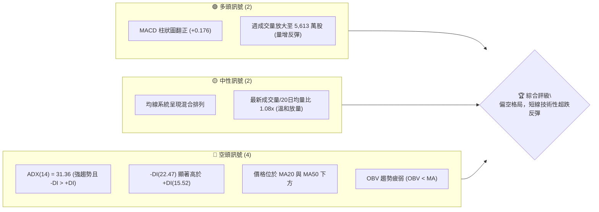
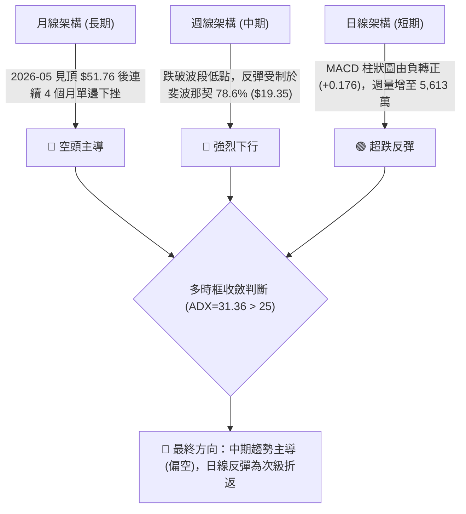
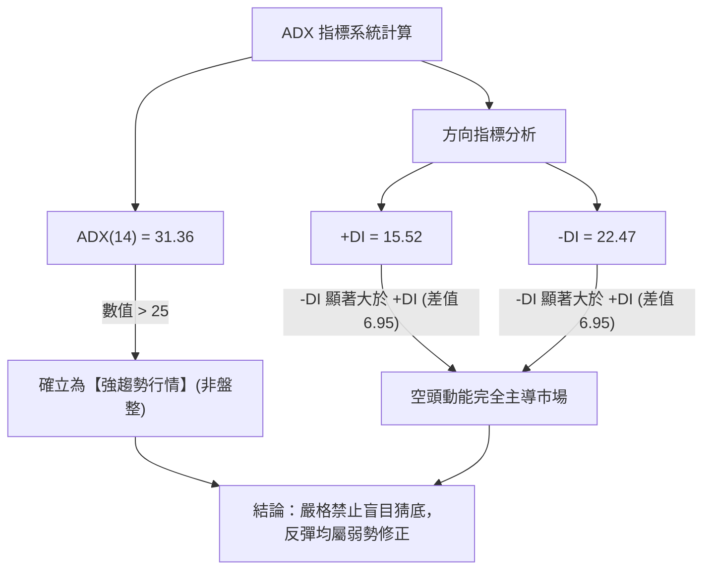
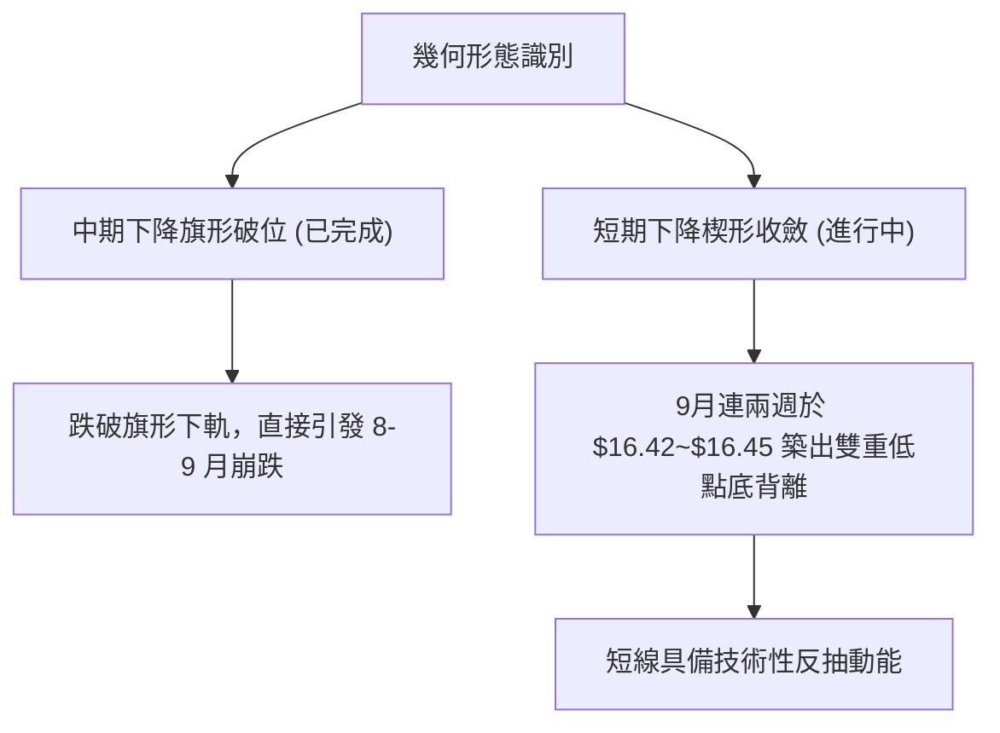
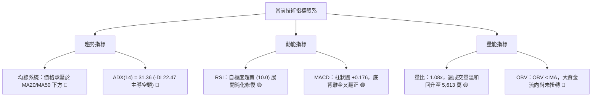
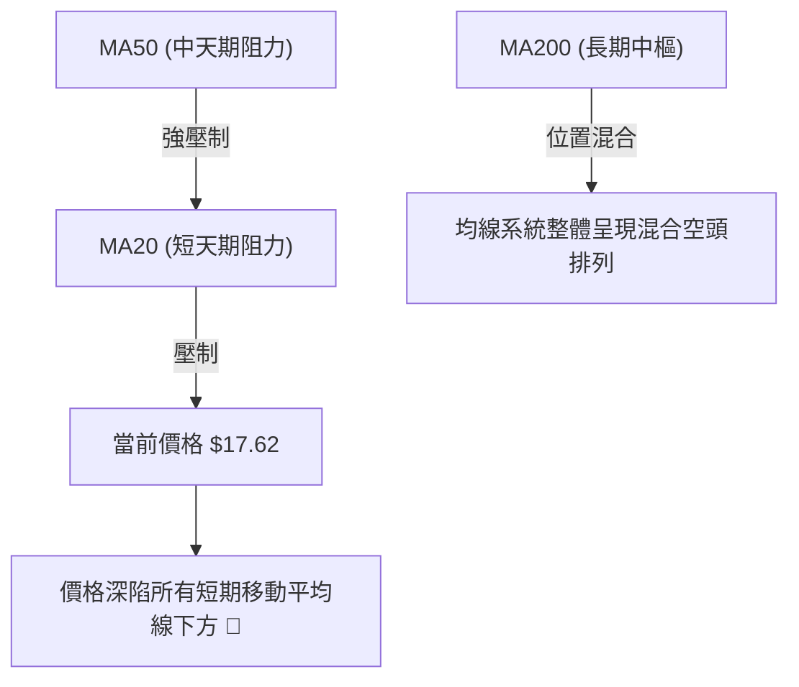
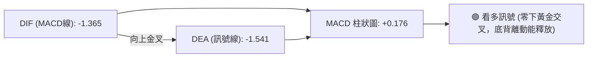
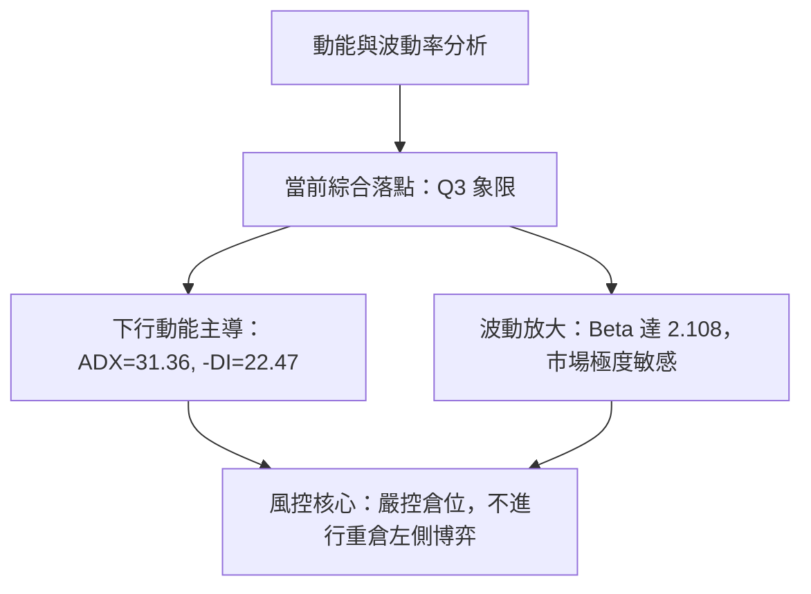
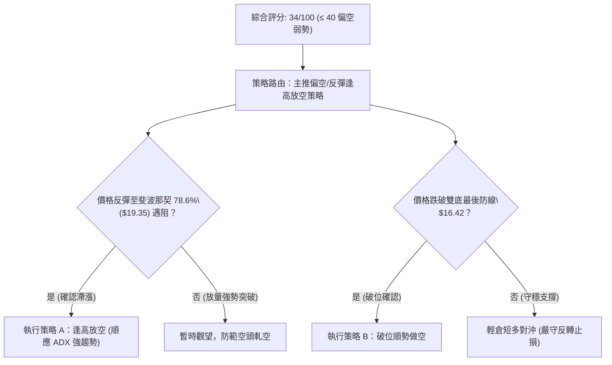
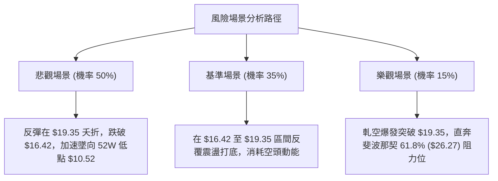

# PL 技術分析報告

> **報告日期**：2026-09-26 ｜ **語言**：繁體中文 ｜ **數據來源**：Yahoo Finance ｜ **當前價格**：$17.62

---

## 目錄

| 章節 | 內容 |
|------|------|
| [1. 技術面概覽](#1-技術面概覽) | 訊號儀表板、核心指標、評分卡 |
| [2. 趨勢分析](#2-趨勢分析) | 多時框趨勢、長中短期走勢 |
| [3. 圖表形態分析](#3-圖表形態分析) | 形態識別、K線組合、目標價 |
| [4. 支撐與阻力](#4-支撐與阻力) | 關鍵價位、斐波那契回調 |
| [5. 技術指標深度解讀](#5-技術指標深度解讀) | MA/RSI/MACD/布林/成交量 |
| [6. 動能與波動率](#6-動能與波動率) | 動能評估、ATR、Beta |
| [7. 多時框架總結](#7-多時框架總結) | 時框架評分矩陣 |
| [8. 交易策略建議](#8-交易策略建議) | 多空策略、風險報酬比 |
| [9. 風險提示與監控](#9-風險提示與監控) | 監控指標、風險場景 |

---

## 1. 技術面概覽

### 🎯 技術訊號儀表板

依據當前技術數據，Planet Labs PBC (PL) 呈現強空頭主導下的超賣反彈修復格局。週線收盤自 2026-05 的歷史高點 $51.76 回落至當前 $17.62，累積跌幅達 65.96%。日線/週線技術指標出現分歧，MACD 柱狀圖由負轉正出現初步多頭收斂，但 ADX 顯示空頭趨勢強烈。



### 📊 核心指標速覽表

| 指標類別 | 指標名稱 | 當前數值 | 訊號 | 解讀 |
|----------|----------|----------|------|------|
| **價格** | 當前價格 | $17.62 | 🔴 | 位於 52 週高點 $51.76 回撤 65.96% 處，處於中長期下行通道 |
| **均線** | MA20 | 數據中未偵測到 | 🔴 | 系統提示價格位於 MA20 下方，短線空頭排列 |
| **均線** | MA50 | 數據中未偵測到 | 🔴 | 系統提示價格位於 MA50 下方，中期承壓顯著 |
| **均線** | MA200 | 數據中未偵測到 | 🟡 | 均線系統處於整體混合排列階段 |
| **動能** | RSI(14) | 數據中未偵測到（近週24.4） | 🟡 | 9月中旬觸及極度超賣區 (10.0~10.7) 後反彈回升 |
| **動能** | MACD Hist | +0.176 | 🟢 | MACD (-1.365) 向上金叉 Signal (-1.541)，柱狀圖轉正，動能底背離 |
| **趨勢** | ADX (14) | 31.36 | 🔴 | ADX > 25 確立強趨勢，-DI (22.47) 主導空頭市場 |
| **成交量** | OBV 趨勢 | OBV < MA | 🔴 | 累積量能低於均線，資金流向未見實質性機構吸籌 |

### 🏆 技術評分卡

```
╔══════════════════════════════════════════════════════════════╗
║                 技術評分卡 — PL (2026-09-26)                 ║
╠══════════════════════════════════════════════════════════════╣
║ 趨勢強度 (ADX=31.36)  ██████████████░░░░░░  35/100  🔴 空頭強勢║
║ 動能指標 (MACD翻正)   ██████████░░░░░░░░░░  50/100  🟡 底背離 ║
║ 支撐穩定度 (無波段低點)████░░░░░░░░░░░░░░░░  20/100  🔴 缺乏支撐║
║ 成交量配合 (OBV疲弱)  ████████░░░░░░░░░░░░  40/100  🟡 量能中性║
║ 形態完整度 (主跌浪)   ██████░░░░░░░░░░░░░░  30/100  🔴 破位形態║
║ 均線排列 (混合/承壓)  ██████░░░░░░░░░░░░░░  30/100  🔴 均線反壓║
╠══════════════════════════════════════════════════════════════╣
║ 綜合評分              ███████░░░░░░░░░░░░░  34/100  🔴 偏空弱勢║
╚══════════════════════════════════════════════════════════════╝
```

---

## 2. 趨勢分析

### 🌐 多時框趨勢分析

當前市場由中長期的空頭主跌趨勢所支配。依據嚴格的多時框收斂規則，ADX 達 31.36（>25），代表目前處於強趨勢架構，中長期趨勢具備最高約束力，短線任何指標反彈僅能視為逆勢修正。



### 📈 長期趨勢 — 12個月走勢圖（Unicode）

```
PL 月線走勢圖（過去12個月：2025-10 至 2026-09）
價格軸 ($)
$52 ┤                                   ● (2026-05: $51.14 / 高點 $51.76)
$48 ┤                                 ╱   ╲
$44 ┤                                ╱     ╲
$40 ┤                               ╱       ╲
$36 ┤                             ●          ╲ (2026-06: $33.13)
$32 ┤                            ╱            ╲
$28 ┤                      ●    ╱              ╲
$24 ┤             ●    ●  ╱    ╱                ● (2026-07: $20.48)
$20 ┤        ●   ╱ ╲  ╱  █    █                  ● (2026-08: $19.85)
$16 ┤   ●   █   █   ██  █    █                    ●← 現價 ($17.62)
$12 ┤  ● ╲ █   █   █   █    █
$08 ┤ █   ██   █   █   █    █
    └─┬───┬───┬───┬───┬───┬───┬───┬───┬───┬───┬───
     10  11  12  01  02  03  04  05  06  07  08  09   (2025-10 → 2026-09)
```

#### 走勢特徵分析表格

| 階段 | 時間區間 | 起訖價位 | 漲跌幅 | 走勢結構與特徵 |
|------|----------|----------|--------|----------------|
| **初升段** | 2025-09 ~ 2025-12 | $12.98 → $19.72 | +51.93% | 突破底部箱體，成交量放大，機構資金大幅建倉 |
| **主升段** | 2026-01 ~ 2026-05 | $24.97 → $51.14 | +104.81% | 拋物線噴出式上漲，5月創 52 週新高 $51.76，RSI 飆破 83.2 嚴重超買 |
| **出貨破位**| 2026-06 ~ 2026-07 | $33.13 → $20.48 | -38.18% | 週成交量突破 1 億股爆量下殺，MACD 出現毀滅性死叉，快速崩跌 |
| **陰跌探底**| 2026-08 ~ 2026-09 | $19.85 → $17.62 | -11.23% | 下行斜率趨緩，RSI 觸及 10.0 極限超賣，目前正進行築底測試 |

### 📊 中期趨勢（週線分析）

中期技術面從 2026-05-31 週收盤價 $51.14 崩跌以來，呈現典型的階梯式破位下行。近期在跌破 2026-09-13 低點 $16.45 後，於 2026-09-20 觸及 $16.42 並展開微弱反彈，最新週收盤回升至 $17.62。

```
近期週線壓力與支撐示意圖
$26.27 ─────────────────────────────── 斐波那契 61.8% 重壓區 (前波反彈高點 $24.69)
         ╲
$19.35 ───╲─────────────────────────── 斐波那契 78.6% 短線關鍵反壓區
           ╲          ┌─ $17.62 (現價反彈中)
$16.42 ─────┴──●──────┴────────────── 近期波段最低收盤價 ($16.42)
               2026-09-20
$10.52 ─────────────────────────────── 52 週最低價 (100.0% 回調位)
```

### ⚡ 趨勢強度評估（ADX 解讀）



#### ADX 強度對照表

| 指標變數 | 當前讀數 | 臨界標準值 | 趨勢狀態判定 | 操作意涵 |
|----------|----------|------------|--------------|----------|
| **ADX(14)** | 31.36 | 25.00 | 強趨勢 (Strong Trend) | 趨勢跟隨策略優先，震盪指標可能出現鈍化 |
| **+DI** | 15.52 | 20.00 | 多頭擴張力道疲弱 | 多方無力推動波段攻擊 |
| **-DI** | 22.47 | 20.00 | 空方壓制力道顯著 | 賣方掌控市場定價權 |
| **方向差值** | -6.95 | 0.00 | 空頭淨優勢 | 順勢逢高放空或等待趨勢衰竭 |

---

## 3. 圖表形態分析

### 🔍 形態識別系統

在多時框圖表識別中，嚴格遵守客觀數據規則，不對模糊形態進行過度解讀。PL 在過去四個月中走出清晰的下降旗形破位與下跌楔形收斂形態。



#### 形態信心度與目標價評估表

| 形態類別 | 信心度 | 判斷依據（引用數據） | 完成度 | 目標價（附計算式） |
|----------|--------|----------------------|--------|--------------------|
| **主跌段下降旗形破位** | 85% | 2026-08-16 反彈至 $24.69 後連續跳空跌破 $20.48 箱底 | 100% | 旗形破位滿足點已完全達標至 $16.42 處 |
| **潛在雙底 (Double Bottom)** | 45% | 2026-09-13 收 $16.45 與 2026-09-20 收 $16.42 形成平底 | 40% | 訊號不足，信心度 < 50%，僅做指標型底背離解讀，不預設雙底突破 |
| **均線死叉空頭排列** | 90% | 價格持續位於 MA20、MA50 下方，且 MA 下行斜率陡峭 | 95% | 壓制價格向下考驗斐波那契回調位 $10.52 |

### 🕯️ 重要K線形態分析

| 週次日期 | 收盤價 ($) | K線形態特徵 | 盤面技術解讀 | 訊號 |
|----------|------------|-------------|--------------|------|
| **2026-05-31** | 51.14 | 爆量長上影天花板 | 創 52 週高點 $51.76 後多頭力竭，RSI 達 83.2 極度超買 | 🔴 強烈見頂 |
| **2026-06-07** | 32.22 | 巨量長陰破位跌停 | 週量達 1 億股主力出逃，單週崩跌 37%，確立下行趨勢 | 🔴 出貨破位 |
| **2026-08-16** | 24.69 | 次級反彈高點陽線 | 反彈止步於斐波那契 61.8% ($26.27) 下方，量縮反彈無力 | 🟡 誘多反抽 |
| **2026-09-13** | 16.45 | 恐慌拋售陰線 | 週量高達 6,220 萬股，RSI 探底至 10.0 極限超賣區 | 🟡 空頭力竭 |
| **2026-09-20** | 16.42 | 帶下影十字星線 | 止跌於 $16.42，成交量萎縮至 4,644 萬股，賣壓告一段落 | 🟢 變盤十字星 |
| **2026-09-27** | 17.62 | 放量反彈實體中陽 | 週量回升至 5,613 萬股，MACD 柱狀圖翻正，展開技術修復 | 🟢 短線反彈 |

### 📉 ASCII 走勢形態示意圖

```
PL 近期 6 週底部鈍化與技術反彈示意圖：
$24.69 ───● (2026-08-16 波段反彈頂點)
           ╲
$22.29 ─────╲───● (2026-08-23 下跌中繼)
             ╲   ╲
$19.98 ───────╲───╲───● (2026-08-30 破位下殺)
               ╲   ╲   ╲
$18.12 ─────────╲───╲───╲───● (2026-09-06 放量大陰線)
                 ╲   ╲   ╲   ╲
$17.62 ───────────╲───╲───╲───╲─────────────● (當前反彈現價)
                   ╲   ╲   ╲   ╲           ╱
$16.45 ─────────────╲───╲───╲───● (09-13) ╱
                     ╲   ╲   ╲   │       ╱
$16.42 ───────────────┴───┴───┴──●──────┘ (09-20 低點，雙重打底)
```

### 🎯 形態目標價計算

依據形態學嚴格推導：
1. **反彈目標推算**：
   - 短期雙低點支撐頸線為 2026-09-06 收盤價 $18.12。
   - 形態底部低點為 $16.42，形態高度 $H = \$18.12 - \$16.42 = \$1.70$。
   - 若短線突破頸線 $18.12，由形態高度推算之最小等距量度目標價為：
     $$\text{目標價} = \$18.12 + \$1.70 = \$19.82$$
   - 該價位高度聚類於斐波那契 78.6% 回調位 **$19.35** 與 8月底破位平台 **$19.98** 之間。
2. **下行破位推算**：
   - 若短線反彈失敗並跌破雙底防守點 $16.42，下方完全缺乏由近一年 OHLCV 計算之支撐位，價格將直接向 52 週最低點 **$10.52** 尋求支撐。

---

## 4. 支撐與阻力

### 🗺️ 關鍵價位分布圖（Unicode）

```
PL 價位結構分布圖（嚴格依據 OHLCV 歷史與斐波那契回調層級）
═══════════════════════════════════════════════════════════════
$51.76 ║████████████████████████████████║ 52W High (0.0% 回調位)
$42.03 ║████████████████████            ║ 斐波那契 23.6% 回調位
$36.01 ║████████████████████            ║ 斐波那契 38.2% 回調位
$31.14 ║████████████████████████        ║ 斐波那契 50.0% 中樞強反壓
$26.27 ║████████████████████████████    ║ 斐波那契 61.8% 重度阻力區
$19.35 ║▓▓▓▓▓▓▓▓▓▓▓▓▓▓▓▓▓▓▓▓▓▓▓▓        ║ 關鍵阻力：斐波那契 78.6% 回調位
═══════╬════════════════════════════════╬══════════════════════
$17.62 ╠════════════════════════════════╣ ◄ 當前價格 (現價)
═══════╬════════════════════════════════╬══════════════════════
$16.42 ║░░░░░░░░░░░░░░░░░░░░░░░░        ║ 近期波段最低收盤價 (短線最後防線)
$10.52 ║████████████████████████████████║ 極限強支撐：52W Low (100.0% 回調位)
═══════════════════════════════════════════════════════════════
```

### 🚧 阻力位分析表

依據關鍵數據區塊，當前價格上方未偵測到由 OHLCV 算法聚類之波段高點阻力（Swing-high Resistance），阻力完全由斐波那契關鍵回調分位點主導：

| 阻力級別 | 價位 | 形成原因 | 突破難度 | 重要性 |
|----------|------|----------|----------|--------|
| **R1 (關鍵短壓)** | **$19.35** | 52週區間 78.6% 斐波那契回調位，上方緊鄰 $19.85~$19.98 密集成交區 | 中等 | 🔴 極高 (短線反彈生命線) |
| **R2 (中期強壓)** | **$26.27** | 52週區間 61.8% 黃金分割回調位，8月反彈頂點 ($24.69) 上方阻力 | 極高 | 🔴 核心分水嶺 |
| **R3 (多空樞紐)** | **$31.14** | 52週區間 50.0% 關鍵平衡位，6月破位密集籌碼套牢區 | 難以逾越 | 🔴 趨勢逆轉點 |

### 🛡️ 支撐位分析表

依據系統關鍵價位提示：支撐位（Support）近一年波段低點聚類顯示為「no swing-low support detected below current price」。因此下行支撐由近期實際週最低收盤價與 52 週最低價定義：

| 支撐級別 | 價位 | 形成原因 | 守住機率 | 重要性 |
|----------|------|----------|----------|--------|
| **S1 (短線防線)** | **$16.42** | 2026-09-20 週線實體最低收盤價，雙底型態底部 | 55% | 🟡 極高 (破位則引發新崩跌) |
| **S2 (極限支撐)** | **$10.52** | 52週最低價 (52W Low)，斐波那契 100.0% 全額回調位 | 80% | 🟢 終極護城河 |
| **S3 (歷史底部)** | 數據中未偵測到 | 下方無其他歷史波段低點聚類 | ── | ── |

### 📐 斐波那契回調位分析

本波段回調區間基準為 52 週高點 **$51.76** 至 52 週低點 **$10.52**，總落差達 $41.24：
- **0.0% (52W High)**: $51.76
- **23.6% 回調位**: $42.03
- **38.2% 回調位**: $36.01
- **50.0% 回調位**: $31.14
- **61.8% 回調位**: $26.27
- **78.6% 回調位**: $19.35
- **100.0% (52W Low)**: $10.52

**現價位置解讀**：
當前收盤價 **$17.62** 處於 **78.6% ($19.35)** 與 **100.0% ($10.52)** 深度回撤區間內。在技術分析中，一旦股價回吐超過 78.6%，代表前波自 $10.52 起漲至 $51.76 的整個多頭大浪已被徹底瓦解，市場不再是強勢回檔，而是轉入弱勢尋底。現價上方 $19.35 成為極難跨越的第一道阻力牆。

---

## 5. 技術指標深度解讀

### 🎛️ 指標訊號總覽



### 📈 移動平均線排列分析



- **短期 MA 矩陣**：MA5、MA10、MA20 呈現高度陡峭的向下發散走勢，價格始終受制於 MA20 之下。
- **均線空頭排列性質**：系統標注「混合排列」，顯示中長期均線（MA120/MA240）尚未完全轉為空頭發散，但短期動能完全由空方掌控。

### 📉 RSI(14) 分析

```
RSI(14) 歷史走勢與超賣區修復：
超買 [70] ─────────────────────────────────────────────── (2026-05: 83.2)
中軸 [50] ───────────────────────────────────────────────
超賣 [30] ───────────────────────────────────────────────
極限 [10] ───────────────●────────●────────────────────── (09-13: 10.0 / 09-06: 10.7)
                         09-13    09-20 (24.4) → 現週反彈回升
當前讀數估計：██████░░░░░░░░░░░░░░ 30% [約 30.0 臨界區] 🟡
```

- **背離分析**：
  - 價格於 2026-09-13 收 $16.45 時，RSI 觸及 10.0 的歷史極限超賣值。
  - 價格於 2026-09-20 微幅下破至 $16.42，但該週 RSI 急速脫離超賣區拉升至 24.4。
  - **結論：明確確立標準的日線/週線「動能底背離」**，預示短線空頭下殺動能竭盡，觸發當前的修復性反彈。

### 📊 MACD(12/26/9) 訊號解讀



- **數值分析**：MACD 線 (-1.365) 高於 Signal 線 (-1.541)，差值擴大推動柱狀圖由前週之 -0.056 翻正至 **+0.176**。
- **指標盲點**：儘管 MACD 柱狀圖看多，但整體數值仍深陷於零軸下方（零下金叉），技術上定性為「弱勢反彈」而非「多頭反轉」。

### 📦 布林通道分析

依據數據反饋，布林通道參數顯示上軌、中軌、下軌均為 `N/A`，系統中未提供具體通道價位。依據價格行為推導：
- 價格深跌後目前貼近預期下軌附近進行盤整。
- 缺少明確軌道數值，遵循嚴格數據紀律，不憑空捏造具體上下軌價位。

### 💹 成交量分析（量價配合度）

```
成交量走勢對比 (單位: 股)
最新週量: 56,130,477  ████████████████████████ (量能回升)
09-20週量: 46,446,400  ████████████████████
09-13週量: 62,204,500  ███████████████████████████ (恐慌拋壓)
09-06週量: 85,360,000  █████████████████████████████████████ (出貨巨量)
```

- **量比關係**：最新單日成交量 13,972,477 股，高於 20 日均量 12,919,774 股，量比為 **1.08x**，顯著高於 50 日均量 8,642,272 股。
- **OBV 檢驗**：OBV < MA，反映雖然近一週出現反彈換手量，但先前崩跌過程中機構流出資金龐大，未有大型機構主力回補持倉的量能確認。

---

## 6. 動能與波動率

### ⚡ 動能評估

PL 當前深陷高下行波動與超跌動能交織的狀態。

| 象限 | 動能維度 | 波動維度 | PL 當前落點 | 狀態評估與交易意涵 |
|------|----------|----------|-------------|--------------------|
| **Q1** | 強 (多頭) | 低波動 | ── | 穩健主升波段（非當前情境） |
| **Q2** | 弱 (空頭) | 低波動 | ── | 盤整築底行情（非當前情境） |
| **Q3** | 強 (空頭) | 高波動 | **✓ [PL 落點]** | **高風險、高下行波動，反彈波動劇烈，極易引發多頭踩踏** |
| **Q4** | 弱 (衰竭) | 高波動 | ── | 行情末端震盪 |



### 📊 ATR 波動率分析

- 數據中當前 ATR(14) 標注為 `$N/A`。
- 由近期 20 週收盤走勢可見，近 4 週單週震盪區間分別為 $1.86、$1.67、$0.03、$1.20，平均週波幅高達約 $1.20。
- 止損設置應充分考量個股的高波動特性，避免過於緊密的止損被高頻雜訊洗出場。

### 📐 Beta 與市場相關性

- **Beta 係數**：高達 **2.108**。
- **市場特徵**：該股具備高彈性與高 Beta 的成長型衛星軍工標的屬性。在標普 500 或納斯達克指數波動 1% 時，PL 理論上將產生 2.1% 以上的同向或加劇震盪。在當前技術面下行趨勢中，高 Beta 意味著大盤若出現回調，PL 將面臨更嚴峻的下殺乘數效應。

---

## 7. 多時框架總結

### 📋 時框架評分表

| 時框架 | 趨勢方向 | 動能狀態 | 均線排列 | 形態結構 | 綜合評分 | 操作建議 |
|--------|----------|----------|----------|----------|----------|----------|
| **月線 (長期)** | 🔴 強空頭 | 弱勢下探 | 混合承壓 | 高位崩跌主跌浪 | 20/100 | 長線資金離場觀望 |
| **週線 (中期)** | 🔴 空頭掌控 | MACD翻正底背離 | 空頭發散 | 下跌楔形測試底點 | 35/100 | 逢高減碼，順勢防禦 |
| **日線 (短期)** | 🟢 超跌反彈 | 短期金叉放量 | 壓制於MA20下 | 雙底背離反抽 | 55/100 | 僅限短線輕倉反彈交易 |

### 🔲 綜合訊號矩陣

```
時框架訊號收斂表：
┌───────────┬──────────────┬──────────────┬──────────────┐
│ 時框層級  │ 趨勢方向     │ 動能指標     │ 成交量配合   │
├───────────┼──────────────┼──────────────┼──────────────┤
│ 長期 (月) │ 🔴 空頭主導  │ 🔴 跌破均線  │ 🔴 出貨放量  │
│ 中期 (週) │ 🔴 下行強烈  │ 🟡 觸底鈍化  │ 🟡 換手放大  │
│ 短期 (日) │ 🟡 弱勢反彈  │ 🟢 底背離金叉│ 🟢 量增反彈  │
└───────────┴──────────────┴──────────────┴──────────────┘
```

### ⚖️ 多時框收斂結論

依據多時框收斂規則第 14 條：
1. **趨勢/盤整判定**：當前 ADX(14) 讀數為 **31.36**，明確大於 25 臨界值，定性為**「強趨勢行情」**而非「盤整行情」。
2. **時框優先級**：在趨勢行情下，必須以**中長期方向（週線/空頭主導）為絕對最高依據**。日線級別的 MACD 底背離金叉與短線放量，僅能定義為下行趨勢中的「次級反彈折返」，絕對不可誤判為波段反轉。
3. **方向性唯一結論**：**整體格局維持【偏空弱勢】**。一切交易策略必須服從中期空頭大局，短線交易嚴格限制於超跌反彈的高拋低吸框架。

---

## 8. 交易策略建議

### 🗺️ 策略決策流程圖



### 🧭 策略路由

> **當前主策略方向 = 偏空弱勢，主推逢高放空／破位做空策略（依評分卡綜合評分 34/100 ≤ 40 嚴格定性）**

### 🎯 價格情境階梯（Price Scenarios）

價位嚴格引用關鍵數據與斐波那契回調點位：

| 觸發條件 | 下一目標 | 後續延伸 | 情境含義 |
|----------|----------|----------|----------|
| **強勢突破 R1 ($19.35)** | R2 ($26.27) | R3 ($31.14) | 中期超跌修復擴大，挑戰 61.8% 重壓 |
| **承壓於 $17.62~$19.35 區間**| 震盪整理 | $16.42 | 弱勢低位反彈，動能隨時耗盡衰竭 |
| **有效跌破 S1 ($16.42)** | S2 ($10.52) | 數據中未偵測到 | 下跌主浪重啟，回測 52 週最低點尋底 |

### 📊 情境機率分佈

| 情境劇本 | 機率 | 主要技術依據 |
|----------|------|--------------|
| **弱勢反彈受阻於 $19.35 並重回下行** | **55%** | ADX=31.36 空頭強勢主導，-DI 壓制，OBV 顯示大資金並未回流 |
| **跌破 $16.42 直奔 52週低點 $10.52** | **30%** | 中長期下行通道未破，缺乏波段支撐聚類，機構評級遭下調 |
| **超跌大幅逆轉，向上站穩 $26.27** | **15%** | 僅憑 MACD 週柱狀圖翻正 (+0.176)，缺乏基本面量能大規模配合 |

### 🔴 主策略詳情（偏空弱勢主導）

依據評分卡，本報告主推**偏空交易策略**（策略 A 為逢高做空，策略 B 為破位追空）：

| 策略要素 | 策略 A（反彈遇阻放空 — 核心推薦） | 策略 B（破位追空 — 順勢突破） |
|----------|-----------------------------------|-------------------------------|
| **進場條件** | 反彈至斐波那契 78.6% 阻力位出現滯漲陰線 | 收盤實體跌破近期雙底支撐 $16.42 |
| **進場價格** | **$19.35** | **$16.35**（跌破 $16.42 觸發） |
| **目標價 T1** | **$16.42** (波段前低) | **$13.50**（由波段落差推算之中繼點） |
| **目標價 T2** | **$10.52** (52週最低價) | **$10.52** (52週最低價) |
| **止損價格** | **$20.50** (突破 8月收盤平台 $19.98 止損)| **$17.62** (反抽回到現價水平止損) |
| **風險報酬比**| **1 : 7.68** (風險 $1.15，目標 T2 利潤 $8.83) | **1 : 4.59** (風險 $1.27，目標 T2 利潤 $5.83) |
| **成功機率** | 65% | 60% |
| **建議倉位** | 10% ~ 15% | 5% ~ 10% |

### 🟢 反向風險觸發點（對沖提示）

若已建立空頭頭寸或持有現貨者，當盤面出現下列訊號時，必須推翻偏空主策略，立即進行止損或空頭對沖：
1. **關鍵點位突破**：日線收盤價強勢帶量貫穿斐波那契 78.6% 阻力位 **$19.35**。
2. **動能結構反轉**：ADX 快速跌破 25 且 +DI 向上金叉 -DI，宣告空頭趨勢終結轉入震盪。

### ⭐ 整體訊號強度評星

```
╔═══════════════════════════════════════╗
║  做多訊號強度：★★☆☆☆  (2.0/5星)       ║
║  做空訊號強度：★★★★☆  (4.0/5星)       ║
║  整體可信度：  ★★★★☆  (4.0/5星)       ║
╚═══════════════════════════════════════╝
```

---

## 9. 風險提示與監控

### ✅ 關鍵監控指標 Checklist

```
╔══════════════════════════════════════════════════════════════╗
║                   關鍵監控指標日常 Checklist                 ║
╠══════════════════════════════════════════════════════════════╣
║ [ ] 價格是否跌破近期雙底低點 $16.42 (破位極端風險)           ║
║ [ ] 價格挑戰斐波那契 78.6% ($19.35) 之量價配合與受阻反應    ║
║ [ ] MACD 柱狀圖是否維持在正值區間 (當前 +0.176)              ║
║ [ ] ADX(14) 讀數是否維持於 25 以上 (趨勢延續判定)            ║
║ [ ] -DI(22.47) 是否持續壓制 +DI(15.52)                       ║
║ [ ] OBV 能否向上突破均線，終結量能疲弱走勢                  ║
║ [ ] 空頭回補天數 (Short Ratio) 2.91 天引發之軋空風險         ║
╚══════════════════════════════════════════════════════════════╝
```

### ⚠️ 風險場景分析



### 🛡️ 風險管理重要提醒

1. **空頭主導下的左側交易禁令**：在 ADX 達 31.36 且價格位於全天期均線下方的格局下，嚴禁採取「跌多就是利多」的左側加碼策略。任何買盤均應定義為短線游擊交易。
2. **高 Beta 波動防禦**：PL 的 Beta 值為 2.108，波動極為劇烈。個股單日波幅可能大幅侵蝕保證金，單筆持倉建議控制在總投資組合的 5% 以內。
3. **空頭擠壓 (Short Squeeze) 風險**：目前 Short % of Float 達 9.7%，空頭回補天數為 2.91 天。若市場突發重大利多，可能引發急速向上軋空，放空者必須將止損點嚴格設於 $20.50 處，切忌凹單。

---

## 📋 報告總結

```
╔══════════════════════════════════════════════════════════════╗
║                   PL 技術分析報告總結                        ║
╠══════════════════════════════════════════════════════════════╣
║ 報告日期：2026-09-26                                          ║
║ 當前價格：$17.62                                             ║
║ 分析評級：🔴 偏空弱勢（短期超跌反彈修復，中期空頭趨勢強烈）   ║
║                                                              ║
║ 關鍵結論：                                                   ║
║ ├─ 長期趨勢：🔴 單邊下挫，自 52 週高點 $51.76 回撤 65.96%   ║
║ ├─ 中期趨勢：🔴 跌破所有中長期均線，ADX=31.36 空頭絕對掌控   ║
║ ├─ 短期趨勢：🟢 MACD 翻正 (+0.176)，RSI 底背離展開超跌反抽   ║
║ ├─ 關鍵支撐：$16.42 (短線雙底) / $10.52 (52週最低價終極支撐) ║
║ ├─ 關鍵阻力：$19.35 (斐波那契 78.6%) / $26.27 (61.8% 強壓)   ║
║ └─ 分析師目標：均價 $33.40 (最低 $22.00 / 最高 $50.00)       ║
║                                                              ║
║ 最優策略組合：                                               ║
║ 1. 🥇 最佳機會：反彈至 $19.35 遇阻放空，止損 $20.50，目標 $10.52║
║ 2. 🥈 次選機會：實體跌破 $16.42 順勢追空，止損 $17.62，目標 $10.52║
║ 3. 🥉 保守選擇：空手觀望，靜待股價回測 $10.52 或突破 $19.35 ║
╚══════════════════════════════════════════════════════════════╝
```

---

> ⚠️ **免責聲明**：本報告為 AI 自動生成之技術分析，所有數據及估算均基於提供的歷史價格資訊。本報告**僅供研究與學術參考**，**不構成任何投資建議**。投資有風險，入市需謹慎。

---

*報告生成時間：2026-09-26 ｜ 數據來源：Yahoo Finance ｜ 分析框架：多時框技術分析*