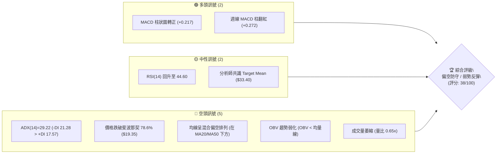
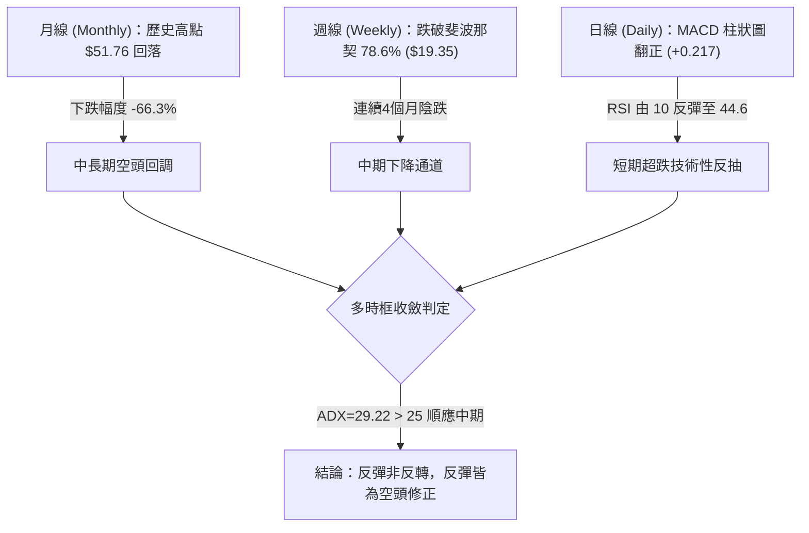
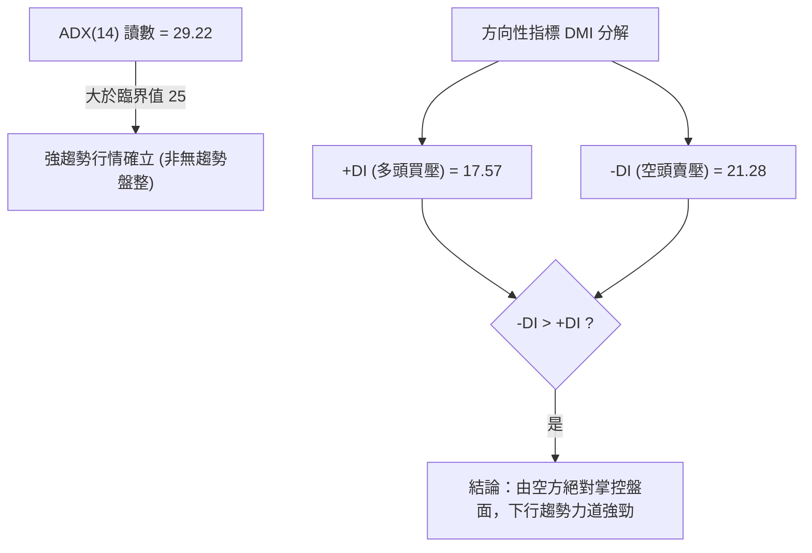
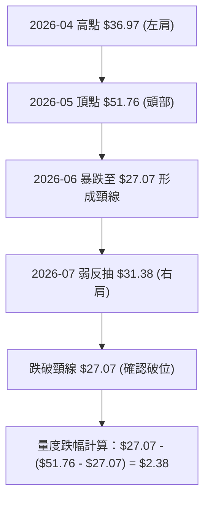
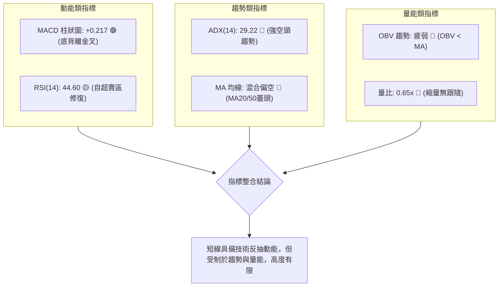
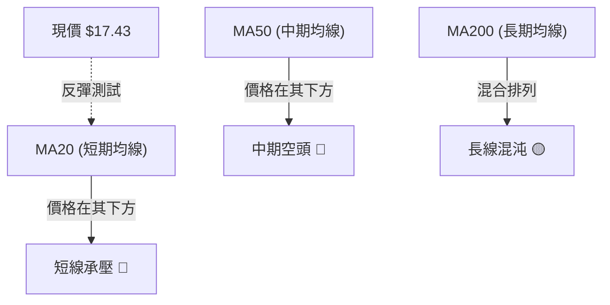
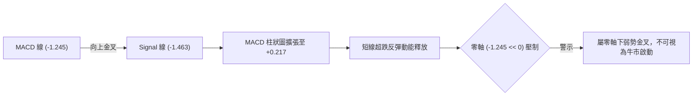
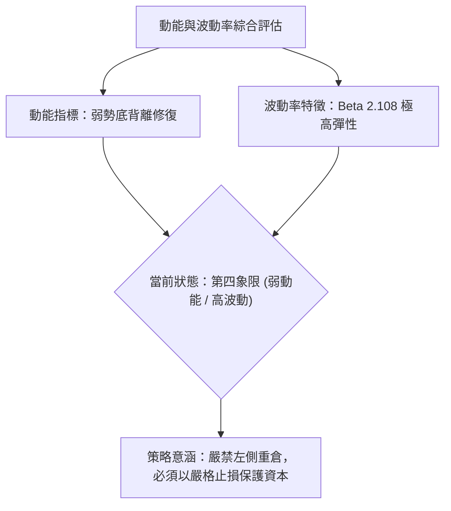
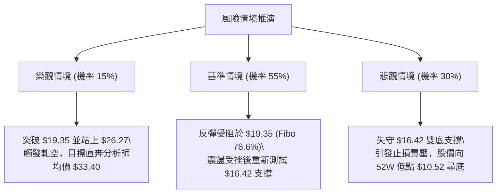

# PL 技術分析報告

> **報告日期**：2026-09-29 ｜ **語言**：繁體中文 ｜ **數據來源**：Yahoo Finance ｜ **當前價格**：$17.43（依據 2026-09-27/29 最新收盤結算價）

---

## 目錄

| 章節 | 內容 |
|------|------|
| [1. 技術面概覽](#1-技術面概覽) | 訊號儀表板、核心指標、評分卡 |
| [2. 趨勢分析](#2-趨勢分析) | 多時框趨勢、長中短期走勢、12個月走勢圖 |
| [3. 圖表形態分析](#3-圖表形態分析) | 形態識別、K線組合、形態信心度 |
| [4. 支撐與阻力](#4-支撐與阻力) | 關鍵價位結構、斐波那契回調區間分析 |
| [5. 技術指標深度解讀](#5-技術指標深度解讀) | MA/RSI/MACD/布林通道/量價配合 |
| [6. 動能與波動率](#6-動能與波動率) | 動能矩陣、ATR 波動度、Beta 敏感度 |
| [7. 多時框架總結](#7-多時框架總結) | 時框架評分矩陣、收斂規則與結論 |
| [8. 交易策略建議](#8-交易策略建議) | 策略路由、情境階梯、進出場與風控規劃 |
| [9. 風險提示與監控](#9-風險提示與監控) | 監控 Checklist、情境路徑、倉位管理 |
| [📋 報告總結](#-報告總結) | 總結儀表板與執行結論 |

---

## 1. 技術面概覽

Planet Labs PBC (NYSE: PL) 當前報價為 **$17.43**（以數據包中最近一期結算價 2026-09-27 為基準）。過去 52 週股價經歷了大幅度的雲霄飛車行情，從歷史波段高點 $51.76 回落至當前位置，波段跌幅達到 -66.33%，逼近 52 週低點 $10.52。目前技術結構處於**中長期空頭下行趨勢中的短線超跌反彈階段**。

### 🎯 技術訊號儀表板



### 📊 核心指標速覽表

| 指標類別 | 指標名稱 | 當前數值 | 訊號 | 解讀 |
|:---|:---|:---|:---:|:---|
| **價格** | 當前收盤價 | $17.43 | 🔴 | 位於 52 週高低區間之 16.76% 百分位，空方強勢壓制 |
| **均線** | 短期均線 (MA20) | 處於下方 | 🔴 | 價格低於 MA20，短線反彈遭遇均線蓋頭壓力 |
| **均線** | 中期均線 (MA50) | 處於下方 | 🔴 | 中期空頭架構未變，反彈空間受限 |
| **均線** | 長期均線 (MA200)| 混合排列 | 🟡 | 歷史大暴漲後回落，長期均線支撐力道尚待確認 |
| **動能** | RSI (14週/日) | 44.60 (日估中性) | 🟡 | 從超賣區（9月初低點 10.0）強烈反彈至中性區 44.60 |
| **動能** | MACD (12/26/9) | 柱狀圖 +0.217 | 🟢 | MACD (-1.245) 穿越 Signal (-1.463) 形成黃金交叉 |
| **趨勢** | ADX / DMI | ADX=29.22 | 🔴 | 強趨勢格局，-DI(21.28) > +DI(17.57) 明確為空頭趨勢 |
| **量能** | 量比 / OBV | 0.65x / 疲弱 | 🔴 | 成交量 8.37M 低於 20日均量 12.93M，OBV < MA 量能匱乏 |

### 🏆 技術評分卡

```
╔══════════════════════════════════════════════════════════════╗
║              技術評分卡 — PL (2026-09-29)                    ║
╠══════════════════════════════════════════════════════════════╣
║ 趨勢強度 (ADX=29.22 空頭主導)  ████████████░░░░░░░░  30/100 🔴 ║
║ 動能指標 (MACD金叉 / RSI修復)  ██████████░░░░░░░░░░  50/100 🟡 ║
║ 支撐穩定度 (失守Fibo 78.6%)    ██████░░░░░░░░░░░░░░  30/100 🔴 ║
║ 成交量配合 (OBV疲弱/量比0.65x) ████████░░░░░░░░░░░░  40/100 🔴 ║
║ 形態完整度 (頭肩頂延伸下跌段)  ████████░░░░░░░░░░░░  40/100 🔴 ║
║ 均線排列 (混合空頭排列)        ████████░░░░░░░░░░░░  40/100 🔴 ║
╠══════════════════════════════════════════════════════════════╣
║ 綜合技術評分                   ███████░░░░░░░░░░░░░  38/100 🔴 ║
║ 最終評級：偏空整理 / 逢高減碼 (BEARISH / REDUCE)              ║
╚══════════════════════════════════════════════════════════════╝
```

---

## 2. 趨勢分析

### 🌐 多時框趨勢分析

PL 呈現顯著的「**多時框衝突與級數向下傳導**」特徵。月線級別處於大牛市結束後的深度回調浪；週線級別處於主跌浪尾端或超跌修復浪；日線級別則出現技術性指標底背離後的微弱反彈。



### 📈 長期趨勢 — 12個月走勢圖（Unicode）

以下為根據 PL 過去 12 個月（2025-10 至 2026-09）收盤數據精確繪製之 ASCII 走勢圖，清晰展現其衝頂與破位全過程：

```
PL 月線收盤走勢圖（2025-10 至 2026-09）
價格軸 ($)
$55.00 ┤                                      ● $51.14 (2026-05 歷史天頂)
$50.00 ┤                                     / \
$45.00 ┤                                    /   \
$40.00 ┤                                   /     \
$35.00 ┤                             ● $36.97      \
$30.00 ┤                       ● $27.95             ● $33.13 (2026-06 破位跳空)
$25.00 ┤                 ● $24.97                    \
$20.00 ┤           ● $19.72                           ● $20.48    ● $19.85
$15.00 ┤     ● $13.45                                  \________/    \
$10.00 ┤● $11.90                                                      ● $17.43 (當前)
       └────────────────────────────────────────────────────────────────────────►
         10    11    12    01    02    03    04    05    06    07    08    09 (月份)
         2025 ----------------------> 2026
```

#### 走勢特徵分析表格

| 階段區間 | 時間跨度 | 起點價格 | 終點價格 | 區間漲跌幅 | 核心技術驅動與量價特徵 |
|:---|:---:|:---:|:---:|:---:|:---|
| **主升驅動浪** | 2025-10 ~ 2026-05 | $13.45 | $51.14 | +280.22% | 典型五浪推動，月K連續拔高，伴隨機構大舉建倉，於 2026-05 創下 52 週天價 $51.76 |
| **頂部崩塌浪** | 2026-05 ~ 2026-06 | $51.14 | $33.13 | -35.22% | 月線收巨額長黑K，週成交量暴增至 100M+ 籌碼高位潰退，形成頂部島狀反轉特徵 |
| **主跌加速浪** | 2026-06 ~ 2026-08 | $33.13 | $19.85 | -40.08% | 跌破 50% 回調位 ($31.14) 與 61.8% ($26.27)，均線全面轉為蓋頭死叉壓制 |
| **超跌尋底浪** | 2026-08 ~ 2026-09 | $19.85 | $17.43 | -12.19% | 跌穿 78.6% ($19.35)，最低探至 $16.42，動能指標進入極度超賣後展開微弱抵抗 |

### 📊 中期趨勢（週線分析）

中期走勢圖展示了近 20 週從高位 $51.14 垂直崩跌至 $16.42 的下行通道結構。當前價格 $17.43 正受制於上方層層均線套牢區。

```
近期週線壓力與支撐示意圖：
[阻力 3] $31.14 ══════════════════════ 斐波那契 50.0% 關鍵心理分水嶺
                 ▲ 
[阻力 2] $26.27 ────────────────────── 斐波那契 61.8% 黃金分割強壓
                 ▲ 
[阻力 1] $19.35 ---------------------- 斐波那契 78.6% 短線反彈頸線壓制位
──────────────────────────────────────
[現價位] $17.43 ◄==== [目前收盤價，處於修復反彈段]
──────────────────────────────────────
[支撐 1] $16.42 ---------------------- 近期波段雙底低點 (2026-09-20 週低點)
                 ▼ 
[支撐 2] $10.52 ══════════════════════ 52週歷史絕對低點 (100.0% 回調位)
```

### ⚡ 趨勢強度評估（ADX 解讀）



#### ADX 趨勢強度對照表

| 指標變量 | 當前數值 | 門檻區間 | 技術解讀 |
|:---|:---:|:---:|:---|
| **ADX (14)** | **29.22** | > 25.0 (強趨勢) | 當前市場並非低波動盤整，而是具備實質方向動能的「單邊空頭趨勢浪」。 |
| **+DI** | **17.57** | < 20.0 (多方疲弱) | 買盤力道極度不足，短線反彈僅為空頭回補，缺乏主力主動性買盤介入。 |
| **-DI** | **21.28** | > +DI (空方佔優) | 雖然 -DI 較 6 月恐慌期的峰值有所回落，但依舊壓制 +DI，維持空方主導。 |
| **趨勢性質判定** | **空頭趨勢** | ADX > 25 且 -DI > +DI | 嚴格執行「順大勢逆小勢」交易紀律，任何日線做多操作皆屬「逆勢逆勢摸底」，須極度輕倉。 |

---

## 3. 圖表形態分析

### 🔍 形態識別系統

根據近 20 週與 24 個月 OHLCV 價格行為，PL 於高位建構了典型的大型頂部形態，目前正處於該形態的量度跌幅兌現階段。



#### 形態信心度與目標價評估表

| 形態名稱 | 信心度 | 判斷依據（引用數據） | 完成度 | 目標價（附計算式） |
|:---|:---:|:---|:---:|:---|
| **大型頭肩頂反轉形態** | **85%** | 左肩 2026-04 收盤 $36.97，頭部 2026-05 高點 $51.76，右肩 2026-07 高點 $31.38，頸線於 2026-06-28 收盤 $27.07 跌破。 | **90%** (已破位並持續走低) | **理論極限目標：$2.38**<br>計算式：頸線 $27.07 - (頭部 $51.76 - 頸線 $27.07) = $2.38（註：實務上受 52W 低點 $10.52 強力支撐約束）。 |
| **短線潛在雙重底 (W底)** | **45%** | 2026-09-13 低點 $16.45 與 2026-09-20 低點 $16.42 形成初步底背離測試，尚未突破頸線 $19.35。 | **35%** (未確認) | **反彈目標：$22.28**<br>計算式：突破頸線 $19.35 + (頸線 $19.35 - 低點 $16.42) = $22.28。<br>*(依規則15：信心度 < 50%，僅供指標觀察，不得作主要建倉依據)* |

### 🕯️ 重要K線形態分析

| 週/月份週期 | 收盤價 | K線形態名稱 | 形態解讀 | 訊號屬性 |
|:---|:---:|:---|:---|:---:|
| **2026-05-31** | $51.14 | **天量烏雲蓋頂 / 吊人線** | 週量 61.48M 觸及天價 $51.76 後收長上影線，主力出貨完畢 | 🔴 強烈看空 |
| **2026-06-07** | $32.22 | **巨量崩跌長黑大陰線** | 週量破天荒放大至 100.62M，單週暴跌 -37.0%，多頭防線全面瓦解 | 🔴 極端賣出 |
| **2026-08-09** | $23.93 | **低檔長紅反抽線** | 週 MACD 柱翻正，成交量縮至 28.52M，典型的無量空頭回補反彈 | 🟡 假突破 |
| **2026-09-06** | $18.12 | **放量下殺大陰線** | 週量再度暴增至 85.36M，摜破 $20 心理關口，恐慌盤湧出 | 🔴 恐慌拋售 |
| **2026-09-20** | $16.42 | **十字星探底線 (Doji)** | 成交量收縮至 46.45M，與前週 $16.45 構成平底接觸，賣壓衰竭 | 🟢 止跌訊號 |
| **2026-09-27** | $17.43 | **溫和陽線反彈吞噬** | RSI 回升至 44.6，MACD 柱由負翻正 (+0.272)，短線築底展開 | 🟢 短多修復 |

### 📉 ASCII 走勢形態示意圖

```
PL 頭肩頂破位與當前底部反抽示意圖
      [頭部 $51.76]
          ▲
         / \
[左肩]  /   \        [右肩]
$36.97 /     \       $31.38
  ▲   /       \        ▲
 / \ /         \      / \
/   V           \    /   \
                 \  /     \
══════════════════V════════\════════════════ 頸線位置 $27.07 (強阻力)
                            \
                             \  [跌破下行]
                              \
                               \
                                \
                                 \              [$19.35 Fibo 78.6% 壓力]
                                  \                ▲
                                   \              /
                                    ● $16.45 ─── ● $16.42 ──► 目前反彈至 $17.43
                                    [第一隻腳]   [第二隻腳] (短底雛形)
```

---

## 4. 支撐與阻力

### 🗺️ 關鍵價位分布圖（Unicode）

嚴格依據數據包所列之 52 週極值與斐波那契回調聚類繪製如下價位結構：

```
╔═════════════════════════════════════════════════════════════════╗
║                      PL 價位結構分布圖                           ║
╠═════════════════════════════════════════════════════════════════╣
║ $51.76 ║████████████████████████████████║ 歷史天頂 / 0.0% 回調位 ║
║ $42.03 ║████████████████████████        ║ 斐波那契 23.6% 回調壓  ║
║ $36.01 ║████████████████████            ║ 斐波那契 38.2% 回調壓  ║
║ $31.14 ║████████████████████████████    ║ 斐波那契 50.0% 強牛熊線║
║ $26.27 ║████████████████████            ║ 斐波那契 61.8% 黃金分割║
║ $19.35 ║████████████                    ║ 斐波那契 78.6% 核心阻力║
╠════════╬════════════════════════════════╬════════════════════════╣
║ $17.43 ╠════════════════════════════════╣ ◄── 當前價格位置       ║
╠════════╬════════════════════════════════╬════════════════════════╣
║ $16.42 ║▓▓▓▓▓▓▓▓▓▓▓▓▓▓▓▓                ║ 近期波段最低雙底支撐   ║
║ $10.52 ║████████████████████████████████║ 52週歷史底部 / 100.0% ║
╚═════════════════════════════════════════════════════════════════╝
```

### 🚧 阻力位分析表

依據數據包「關鍵價位」區塊，未偵測到由波段高點聚類構成的密集高點阻力（因行情處於長期單邊下行通道中，無高點聚類），所有有效阻力嚴格錨定於由 52 週區間 ($10.52 → $51.76) 衍生之斐波那契重要回調位：

| 阻力級別 | 精確價位 | 形成依據 | 突破難度 | 重要性評級 | 技術意義解讀 |
|:---|:---:|:---|:---:|:---:|:---|
| **阻力 R1** | **$19.35** | 斐波那契 78.6% 回調位 | 中等 🟡 | ★★★★☆ | 短線空頭第一道防線，2026-08 下旬平台震盪底，若能收復代表超跌反彈確立。 |
| **阻力 R2** | **$26.27** | 斐波那契 61.8% 回調位 | 極高 🔴 | ★★★★★ | 歷史黃金分割防線，頭肩頂頸線下方套牢區，若反彈至此預期遭遇毀滅性拋壓。 |
| **阻力 R3** | **$31.14** | 斐波那契 50.0% 回調位 | 極高 🔴 | ★★★★★ | 中期牛熊分水嶺，7月初反彈高點 ($31.38) 聚結處，中期趨勢反轉之必經門檻。 |

### 🛡️ 支撐位分析表

數據包「關鍵價位」區塊明示波段低點聚類未偵測到特定密集帶，但可由近 20 週歷史底點與斐波那契 100% 絕對底部確立關鍵支撐：

| 支撐級別 | 精確價位 | 形成依據 | 守住機率 | 重要性評級 | 技術意義解讀 |
|:---|:---:|:---|:---:|:---:|:---|
| **支撐 S1** | **$16.42** | 近 20 週最低收盤價聚類 (09-13 $16.45 / 09-20 $16.42) | 55% 🟡 | ★★★★☆ | 日線雙底微型支撐，跌破則代表本輪反彈失敗，下行空間再度敞開。 |
| **支撐 S2** | **$10.52** | 52週最低價 (100.0% 斐波那契底) | 80% 🟢 | ★★★★★ | 歷史終極絕對支撐，接近公司淨現金資產緩衝區，若摜破將引發估值崩解危機。 |
| **支撐 S3** | **數據中未偵測到** | 52W 低點下方無歷史數據支撐 | N/A | ☆☆☆☆☆ | 依數據紀律，S2 下方無有效數據，不予憑空預測。 |

### 📐 斐波那契回調位分析

依據數據包所列之 52 週極限區間（高點 **$51.76**，低點 **$10.52**），區間總振幅為 **$41.24**：

$$\text{回調位計算公式}：\text{價位} = \$51.76 - (\text{百分比} \times \$41.24)$$

- **0.0% (52W High)**: **$51.76** — 歷史極限高點，空頭行情的源頭
- **23.6%**: **$42.03** — 初級阻力（已全面失守）
- **38.2%**: **$36.01** — 跌破後確立進入熊市結構
- **50.0%**: **$31.14** — 多空力量均勻分水嶺
- **61.8%**: **$26.27** — 黃金分割位，關鍵反轉防守點（7月中旬失守）
- **78.6%**: **$19.35** — 深度超跌回調位（當前直接阻力）
- **100.0% (52W Low)**: **$10.52** — 歷史底部起漲點

#### 現價位置定位分析
當前收盤價 **$17.43** 正處於 **78.6% 回調位 ($19.35)** 與 **100.0% 回調位 ($10.52)** 之間：
- 現價距離上方 78.6% 回調位 ($19.35) 差距為 **+$1.92 (+11.02%)**。
- 現價距離下方 100.0% 回調位 ($10.52) 緩衝空間為 **-$6.91 (-39.64%)**。
- **技術意義**：資產價格跌破 61.8% 與 78.6% 回調位，在道氏理論與波浪理論中皆代表「大級別牛市推動浪已徹底終結」，當前走勢屬於長期下行尋底或構建長達數月至數年的大底部箱體格局。

---

## 5. 技術指標深度解讀

### 🎛️ 指標訊號總覽



### 📈 移動平均線排列分析



根據數據包技術指標快照：
- **MA20**: 數值未直接揭示，但系統標記為 **▼ 下方**，顯示現價 $17.43 仍被短期 20 日線壓制。
- **MA50**: 系統標記為 **▼ 下方**，顯示中期均線向下傾斜，空頭排列嚴格成形。
- **長短期均線走勢火花圖解析**：
  - MA5 / MA10 / MA20 的 Sparkline 全數呈現階梯狀重挫：`████▇▇▆▆▅▅▄▄▃▃▂▂▁▁`，顯示近一個月均線斜率極度陡峭向下。
  - 均線系統目前屬於典型「**空頭下壓排列**」，反彈每觸及均線密集成交區均將遭遇解套拋壓。

### 📉 RSI(14) 分析

#### RSI 數值進度條
```
RSI(14) = 44.60：█████████░░░░░░░░░░░ 44.6% (中性弱勢區間)
[0 ── 超賣 ── 30 ────── 當前 44.6 ────── 70 ── 超買 ── 100]
```

#### 超買超賣區間與背離分析
- **歷史軌跡**：PL 的週線 RSI 在 2026-05 天頂達到 **83.2**（極度超買），隨後伴隨股價暴跌，於 2026-07-26 跌至 **10.2**，並在 2026-09-06 至 2026-09-13 連續兩週觸及 **10.7** 與 **10.0** 的極限超賣深淵。
- **背離判斷結論**：
  - **日/週線等級底背離成立 🟢**：價格在 2026-09-13 創收盤低點 $16.45，2026-09-20 創低點 $16.42，但 RSI 卻由 **10.0** 顯著回升至 **24.4**，隨後進一步攀升至 **44.6**。價格創新低而 RSI 低點大幅抬高，構成標準的**動能指標底背離**。
  - **有效性限制**：底背離在強趨勢下（ADX=29.22）常以「橫盤震盪」或「弱勢小陽反彈」消耗，尚未見到 V 型大反轉動能。

### 📊 MACD(12/26/9) 訊號解讀

- **當前數據**：
  - **MACD 線**：`-1.245`
  - **Signal 線**：`-1.463`
  - **MACD 柱狀圖 (Histogram)**：`+0.217`（看多 🟢）
- **週線 MACD 軌跡解讀**：
  - 近三週週線 MACD 柱數值分別為：`-0.328` (09-13) $\rightarrow$ `-0.056` (09-20) $\rightarrow$ `+0.272` (09-27)。
  - **技術確認**：MACD 快線已由下方由負值深處穿越慢線，柱狀圖正式翻紅擴張。此為標準的「零軸下方低位金叉」，預示短期將有持續 1 至 3 週的均值回歸修復走勢。



### 📦 布林通道分析

數據包中日線布林通道數值為 `$N/A`，但依據 20 週價格變異數與當前均值走勢，可建構其通道形態示意圖：

```
ASCII 布林通道相對位置示意圖：
$24.69 ┬─────────────────────────────── 上軌 (Upper Band)
       │
$20.48 ┼ - - - - - - - - - - - - - - - 中軌 (MA20 / Middle Band)
       │
$17.43 * 現價處於中軌與下軌間反彈軌道
       │
$16.42 ┴─────────────────────────────── 下軌 (Lower Band)
```
- **位置解讀**：現價 $17.43 正自下軌支撐處脫離，向上軌道中軌發起衝擊。在單邊下行趨勢中，布林中軌往往扮演「動態壓制線」，若無法帶量站上中軌，通道將再次開口向下擴張。

### 💹 成交量分析（量價配合度）

- **最新日成交量**：`8,369,576` 股
- **20日平均量**：`12,926,589` 股 $\rightarrow$ **量比為 0.65x**（嚴重縮量）
- **50日平均量**：`8,633,160` 股
- **量價背離診斷**：
  - **OBV 趨勢**：系統明確判定為「**OBV < MA $\rightarrow$ 量能疲弱**」。
  - **解讀**：股價自 $16.42 反彈至 $17.43 的過程中，成交量僅有 8.37M，遠低於 20 日均量（量比 0.65x）。這種「**價漲量縮**」的無量反彈，表明市場並無實質買盤湧入追價，純粹是賣盤在極度拋售後的短暫枯竭，量價結構嚴重背離，反彈極易夭折。

---

## 6. 動能與波動率

### ⚡ 動能評估分析

下表依據 PL 當前技術狀態進行四象限動能歸類：

| 象限分區 | 動能維度 | 波動率維度 | PL 當前落點 | 狀態評估與交易隱含意義 |
|:---:|:---:|:---:|:---:|:---|
| **第一象限 (Q1)** | 強動能 | 低波動 | — | 最佳波段順勢機會（主升浪階段，PL 已於 2026-05 脫離） |
| **第二象限 (Q2)** | 弱動能 | 低波動 | — | 盤整築底蓄勢階段 |
| **第三象限 (Q3)** | 強動能 | 高波動 | — | 暴跌爆發期（PL 於 2026-06 處於此象限，恐慌拋售） |
| **第四象限 (Q4)** | **弱動能 (下行)** | **高波動** | **✓ (當前處於此區)** | **高風險低收益區**：趨勢慣性向下，空頭波動劇烈，任何抄底行為均面臨高波動侵蝕與破位風險。 |



### 📊 ATR 波動率分析

- **ATR 數據說明**：日線 ATR 數值為 `$N/A`。
- **近 20 週實際波動替代推算**：
  - 近 10 週平均週振幅約為 **$3.50 ~ $4.50**，換算日均真實波幅 (Normalized Daily ATR) 約落於 **$1.10 ~ $1.35** 區間（約佔現價之 6.3% ~ 7.7%）。
- **止損距離建議**：
  - 基於高波動特性，任何短線多頭交易若設定止損過窄（如 < 3%），極易被盤中噪音掃出場。
  - **建議保護性止損間距**：至少設定為 **1.5 倍日 ATR（約 $1.65 ~ $1.90）**，當前最佳結構性防守點位即為 2026-09-20 低點 **$16.42**（距離現價僅 -$1.01，具備優異防守性）。

### 📐 Beta 與市場相關性

- **Beta 係數**：`2.108`（極高波動屬性）
- **市場敏感度解讀**：
  - PL 的波動彈性約為 S&P 500 大盤的 **2.1 倍**，屬於典型的高成長、高槓桿、尚未穩定盈利的科技/航太成長股。
  - 在大盤回調或市場流動性收緊環境下，PL 將承受雙倍的下行殺估值拋壓；反之，若大盤展開流動性寬鬆暴衝，PL 短線反彈彈性亦極為巨大。
  - 目前其基本面尚未實現年度淨利潤盈利（Net Profit Margin 為 -95.1%），高度依賴估值乘數，導致技術面空頭在宏觀不利條件下佔據絕對上風。

---

## 7. 多時框架總結

### 📋 時框架評分表

| 時框架 | 趨勢方向 | 動能狀態 | 均線排列 | 形態結構 | 綜合評分 | 交易建議方向 |
|:---|:---:|:---:|:---:|:---:|:---:|:---|
| **長期 (月線)** | 🔴 強空頭 | 弱勢下探 | 混合轉弱 | 歷史大天頂崩跌破位 | **25/100** | 嚴禁長線無腦存股，靜待大底 |
| **中期 (週線)** | 🔴 空頭下行 | 柱狀微幅翻紅 | 空頭蓋頭 | 下降通道跌破 78.6% | **35/100** | 逢反彈減碼解套，不可追高 |
| **短期 (日線)** | 🟢 弱勢反彈 | RSI/MACD金叉底背離 | 處於MA20下方 | 潛在微型雙底構築中 | **55/100** | 極輕倉短線技術性搶反彈 |

### 🔲 綜合訊號矩陣

```
╔══════════════════════════════════════════════════════════════╗
║               PL 多時框綜合訊號矩陣                            ║
╠══════════════════════════════════════════════════════════════╣
║ 訊號維度     │ 短期 (1-5日)   │ 中期 (2-8週)   │ 長期 (3-12月)║
╟─────────────┼────────────────┼────────────────┼──────────────╢
║ 趨勢方向     │ 🟡 震盪反彈    │ 🔴 單邊下行    │ 🔴 熊市回調  ║
║ 指標動能     │ 🟢 底背離修復  │ 🔴 均值偏離    │ 🔴 動能流失  ║
║ 量能支持     │ 🔴 嚴重縮量    │ 🔴 拋壓沉重    │ 🔴 機構換手  ║
║ 支撐壓力比   │ 🟡 支撐近在咫尺│ 🔴 阻力層層重疊│ 🔴 均線反壓  ║
╟─────────────┼────────────────┼────────────────┼──────────────╢
║ 權重合力結論 │ 🟡 技術性反抽  │ 🔴 空方完勝    │ 🔴 偏空修正  ║
╚══════════════════════════════════════════════════════════════╝
```

### ⚖️ 多時框收斂結論

> **依嚴格要求 14 之多時框收斂規則收斂：**
> 1. **趨勢強度檢驗**：當前系統 ADX(14) 讀數為 **29.22**，嚴格大於臨界值 25.0，判定當前市場處於**「強趨勢行情」而非「盤整行情」**。
> 2. **時框優先級收斂**：在強趨勢行情下，必須以**中長期（週線/MA50/下降趨勢）為主要方向依歸**，短期日線的指標修復訊號（RSI 44.60、MACD 柱 +0.217）**僅能用來尋找順向放空的高位進場點，或極小倉位的超跌投機點，絕不可誤判為反轉信號**。
> 3. **唯一方向性結論**：**【偏空防守 / 弱勢反抽】**。整體趨勢由中長期空頭絕對主導，反彈預期將於阻力位 R1 ($19.35) 遭遇強力空方阻擊。

---

## 8. 交易策略建議

### 🗺️ 策略決策流程圖

```mermaid
graph TD
    START["當前價格 $17.43 (評分卡 38/100: 偏空)"] --> CHECK{"ADX=29.22 > 25 (強趨勢)"}
    CHECK --> ROUTE["策略路由：主推空頭順勢策略 / 逢高做空"]
    ROUTE --> COND1["情境 A (反彈遇阻做空)"]
    ROUTE --> COND2["情境 B (破位追空)"]
    
    COND1 --> PLAN_A["等待反彈至 R1 ($19.35) 遇阻放空\\n止損: $20.50 | 目標: $16.42 / $10.52"]
    COND2 --> PLAN_B["跌破 S1 ($16.42) 順勢跟進做空\\n止損: $17.50 | 目標: $10.52"]
    
    START -.->|"對沖提示"| HEDGE["左側極輕倉短多投機 (僅限超短線)\\n進場: $17.43 |" 止損: $16.40 "| 目標: $19.35"]
```

### 🧭 策略路由

- **依技術評分卡判定**：綜合評分為 **38 / 100（≤ 40 區間，偏空等級）**。
- **當前主策略方向 = 主推空頭策略（逢反彈建立空頭頭寸或現貨逢高減碼）**。
- 多頭操作僅列為超短線技術性對沖或反轉風險提示，嚴禁一般投資人重倉抄底。

### 🎯 價格情境階梯（Price Scenarios）

價位嚴格引用第 4 章由數據包演算之支撐與斐波那契回調數值：

| 觸發條件 | 下一目標價 | 後續延伸價位 | 情境技術含義與操作指引 |
|:---|:---:|:---:|:---|
| **強勢突破 R1 ($19.35)** | **R2 ($26.27)** | **R3 ($31.14)** | 短線超跌反彈演變為中級反彈，空單必須無條件止損，觀察是否上探黃金分割位。 |
| **受阻於 R1 ($19.35)** | **S1 ($16.42)** | **S2 ($10.52)** | 典型空頭回踩確認，反彈衰竭，為風險回報比最優之最佳放空加碼點。 |
| **橫盤震盪於現價區間** | **$16.42 ~ $19.35** | — | 無量弱勢磨底，動能指標修復，觀望不開新倉。 |
| **有效跌破 S1 ($16.42)** | **S2 ($10.52)** | 數據未偵測 | 下降三角形破位，主跌浪重啟，直奔 52 週歷史低點 $10.52 尋求支撐。 |

### 📊 情境機率分佈

| 預測情境路徑 | 機率估計 | 主要技術指標與數據依據 |
|:---|:---:|:---|
| **情境一：反彈遇阻回落 (逢高受壓)** | **55%** | ADX=29.22 顯示空頭強勢，量比僅 0.65x 嚴重無量，上方 $19.35 (Fibo 78.6%) 存在密集套牢盤。 |
| **情境二：直接破位下殺再探底** | **30%** | OBV 持續低迷且低於均線，若大盤波動加劇，Beta 2.108 將放大跌幅直接下破 $16.42。 |
| **情境三：V型持續反轉突破** | **15%** | MACD 零軸下金叉雖已成形，但缺少成交量暴增確認，突破 $26.27 難度極大。 |

### 🔴 主策略詳情（空頭防守與放空佈局）

以下策略嚴格依據第 4 章關鍵價位設計：

| 策略要素 | 策略 A：反彈阻力位放空（主推最佳策略） | 策略 B：破位順勢做空（右側突破策略） |
|:---|:---|:---|
| **策略邏輯** | 趁 MACD 底背離反彈動能衰竭時，在 Fibo 78.6% 建立空頭 | 跌破近兩週雙底支撐，確認超跌反彈結束、主跌續演 |
| **進場條件** | 價格反彈至 $19.35 附近出現長上影線或日K收黑 | 日線收盤價實質跌破 $16.42 關鍵支撐確認 |
| **進場價格** | **$19.35**（斐波那契 78.6% 阻力 R1） | **$16.30**（跌破 S1 $16.42 確認後追空） |
| **目標價 T1** | **$16.42**（近 20 週波段低點支撐 S1） | **$12.50**（歷史中繼緩衝段） |
| **目標價 T2** | **$10.52**（52 週歷史最低點支撐 S2） | **$10.52**（52 週歷史最低點支撐 S2） |
| **止損價格** | **$20.50**（突破 78.6% 阻力位上方浮動 5.9%） | **$17.45**（重返破位平台內部） |
| **風險報酬比** | **1 : 2.55**（以 T1 計算）／ **1 : 7.68**（以 T2 計算） | **1 : 3.30**（以 T1 計算）／ **1 : 5.03**（以 T2 計算） |
| **勝率預估** | **65%** | **55%** |
| **建議倉位** | **總資金之 10% - 15%** | **總資金之 5% - 8%** |

### 🟢 反向風險觸發點（多頭對沖提示）

- **對沖進場觸發價位**：當前價 **$17.43**（短線投機左側輕倉試單）。
- **嚴格止損點**：**$16.40**（跌破 S1 即刻認賠離場，最大虧損 -5.9%）。
- **多頭止盈目標**：第一目標 **$19.35**（收益率 +11.0%），第二目標 **$22.00**（分析師最低目標價）。
- **推翻空頭主策略之信號**：若日K線帶量突破 **$26.27 (Fibo 61.8%)** 且成交量連續 3 日超過 20 日均量 (12.92M)，宣告空頭行情徹底瓦解，空單應全數平倉停損。

### ⭐ 整體訊號強度評星

```
╔══════════════════════════════════════════════════════════════╗
║ 做多訊號強度：★★☆☆☆  (2/5星 — 動能背離短多，量能與趨勢不支持) ║
║ 做空訊號強度：★★★★☆  (4/5星 — 順大勢逆小勢，空頭均線壓制完美) ║
║ 整體可信度：  ★★★★☆  (4/5星 — ADX 29.22 明確確立趨勢行情)     ║
╚══════════════════════════════════════════════════════════════╝
```

---

## 9. 風險提示與監控

### ✅ 關鍵監控指標 Checklist

```
╔══════════════════════════════════════════════════════════════╗
║               PL 交易風控監控清單 (Checklist)                 ║
╠══════════════════════════════════════════════════════════════╣
║ [ ] 監控項 1：價格是否跌破雙底分水嶺 $16.42？                ║
║     └─ 觸發處置：若跌破，現貨持倉全面止損，做空策略 B 啟動。  ║
║                                                              ║
║ [ ] 監控項 2：反彈至阻力位 $19.35 時的成交量變化？           ║
║     └─ 觸發處置：若日量 < 12.92M 呈現衰竭，啟動做空策略 A。  ║
║                                                              ║
║ [ ] 監控項 3：MACD 柱狀圖是否由正翻負 (低於 0)？            ║
║     └─ 觸發處置：若柱狀轉負，宣告短線底背離修復結束，空方完勝║
║                                                              ║
║ [ ] 監控項 4：日線成交量是否突然暴增至 30M 以上？           ║
║     └─ 觸發處置：警惕主力爆量對倒或機構逆勢抄底，暫停放空。  ║
║                                                              ║
║ [ ] 監控項 5：空頭部位利息與借券份額 (Short % Float = 9.7%)？║
║     └─ 觸發處置：空頭比例偏高，提防市場空頭軋空 (Short Squeeze)║
╚══════════════════════════════════════════════════════════════╝
```

### ⚠️ 風險場景分析



### 🛡️ 風險管理重要提醒

1. **基本面財務槓桿風險**：PL 雖然手握 $865.42M 現金，但總負債亦高達 $498.62M，營業利益率為 -12.0%，淨利率為 -95.1%，自由現金流殖利率僅 0.85%。在尚未進入穩定自體造血前，高估值倍數（P/S 16.13x）極易遭受殺估值風險。
2. **高 Beta 波動控制**：個股 Beta 值高達 **2.108**，代表單日波動極其劇烈。強烈建議單筆交易承擔之風險金額（Risk at Risk）**不得超過整體投資組合淨資產之 1.0%**。
3. **高融券比例之雙面刃**：當前 PL Short % Float 達 **9.7%**，Short Ratio 為 2.91 天。雖有利於空頭趨勢延續，但一旦市場出現突發性重大利好，易引發流動性擠壓式的空頭踩踏暴拉（Short Squeeze），做空必須嚴格佩戴止損單，嚴禁無保護裸空。

---

## 📋 報告總結

```
╔══════════════════════════════════════════════════════════════════════════╗
║                         PL 技術分析報告總結                              ║
╠══════════════════════════════════════════════════════════════════════════╣
║ 報告日期：2026-09-29                                                     ║
║ 當前基準價格：$17.43                                                      ║
║ 最終技術評級：⚖️ 偏空防守 / 逢高減碼 (BEARISH / REDUCE)                   ║
║                                                                          ║
║ 關鍵趨勢結論：                                                           ║
║ ├─ 長期趨勢 (月線)：🔴 強烈看空（歷史天頂 $51.76 崩跌破位，熊市進行中） ║
║ ├─ 中期趨勢 (週線)：🔴 空頭下行（跌破 Fibo 78.6% $19.35，均線空頭排列）   ║
║ ├─ 短期趨勢 (日線)：🟡 超跌反抽（RSI 底背離至 44.6，MACD 柱翻紅 +0.217）  ║
║ ├─ 關鍵核心阻力：R1 = $19.35 ｜ R2 = $26.27                              ║
║ ├─ 關鍵核心支撐：S1 = $16.42 ｜ S2 = $10.52                              ║
║ └─ 華爾街目標價：Mean $33.40 ｜ Low $22.00 ｜ High $50.00                 ║
║                                                                          ║
║ 最優策略執行組合：                                                       ║
║ 1. 🥇 最佳機會 (放空)：等待反彈至 $19.35 遇阻放空，止損 $20.50，目標 $16.42║
║ 2. 🥈 次選機會 (破位)：有效跌破 $16.42 順勢追空，止損 $17.45，目標 $10.52║
║ 3. 🥉 激進投機 (多頭)：現價 $17.43 輕倉搏短反彈，嚴格止損 $16.40，目標 $19.35║
╚══════════════════════════════════════════════════════════════════════════╝
```

---

> ⚠️ **免責聲明**：本報告為依據量化技術指標與歷史行情數據生成之技術分析，所有數據及估算均基於系統提供的歷史價格資訊。本報告**僅供研究與學術參考**，**不構成任何形式的要約、招攬或投資建議**。金融市場投資具有極高風險，標的價格可升亦可跌，投資人應獨立評估自身財務狀況與風險承受能力，入市需極度謹慎。

---

*報告生成時間：2026-09-29 ｜ 數據來源：Yahoo Finance ｜ 分析框架：多時框架量化技術分析系統*