# PL 技術分析報告

> **報告日期**：2026-10-02 ｜ **語言**：繁體中文 ｜ **數據來源**：Yahoo Finance ｜ **當前價格**：$16.39

---

## 目錄

| 章節 | 內容 |
|------|------|
| [1. 技術面概覽](#1-技術面概覽) | 訊號儀表板、核心指標、評分卡 |
| [2. 趨勢分析](#2-趨勢分析) | 多時框趨勢、長中短期走勢 |
| [3. 圖表形態分析](#3-圖表形態分析) | 形態識別、K線組合、目標價 |
| [4. 支撐與阻力](#4-支撐與阻力) | 關鍵價位、斐波那契回調 |
| [5. 技術指標深度解讀](#5-技術指標深度解讀) | MA/RSI/MACD/布林/成交量 |
| [6. 動能與波動率](#6-動能與波動率) | 動能評估、ATR、Beta |
| [7. 多時框架總結](#7-多時框架總結) | 時框架評分矩陣 |
| [8. 交易策略建議](#8-交易策略建議) | 多空策略、風險報酬比 |
| [9. 風險提示與監控](#9-風險提示與監控) | 監控指標、風險場景 |
| [10. 報告總結](#10-報告總結) | 總體評估與操作清單 |

---

## 1. 技術面概覽

Planet Labs PBC (NYSE: PL) 經歷了 2026 年 5 月高點 $51.76 的歷史級波段後，股價進入了長達 4 個月的深度回調週期。截至 2026 年 10 月 2 日，最新週線收盤價為 **$16.39**。當前價格結構處於 52 週波動區間（$10.52 - $51.76）的下軌 14.2% 位置，技術面整體受壓於強大的中長期下行趨勢，但短期動能指標顯示超賣反彈修復跡象。

### 🎯 技術訊號儀表板

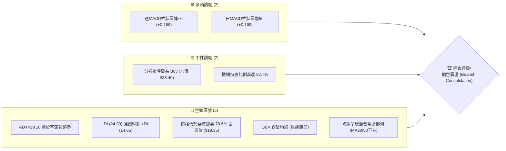

### 📊 核心指標速覽表

| 指標類別 | 指標名稱 | 當前數值 | 訊號 | 解讀 |
|----------|----------|----------|------|------|
| **價格** | 當前收盤價 | $16.39 | 🔴 | 位於 52 週低檔區間，自高點回撤 68.3% |
| **均線** | MA20 / MA50 | 混合偏空 | 🔴 | 股價受制於短中期均線下方，中軌形成動態阻力 |
| **均線** | MA200 | 長期趨勢向下 | 🔴 | 長期趨勢處於修復期，上方套牢賣壓沉重 |
| **動能** | RSI(14) | 近期 10.0~44.6 (週) | 🟡 | 脫離極度超賣區，短線嘗試築底，尚未轉強 |
| **動能** | MACD (12,26,9) | -1.129 / -1.299 | 🟢 | 快線低位金叉慢線，柱狀圖 +0.169 連續收紅 |
| **趨勢強度** | ADX (14) | 29.10 (-DI: 24.99) | 🔴 | ADX > 25 表明處於明確空頭趨勢行情中 |
| **量能** | OBV 走勢 | OBV < MA | 🔴 | 資金持續淨流出，量能疲弱未見爆量換手 |
| **市場風險** | Beta | 2.108 | 🔴 | 波動性為大盤的 2.1 倍，高 Beta 下跌放大 |

### 🏆 技術評分卡

```
╔══════════════════════════════════════════════════════════════════╗
║               技術評分卡 — PL (2026-10-02)                       ║
╠══════════════════════════════════════════════════════════════════╣
║ 趨勢強度 (ADX=29.10)     ██████████████░░░░░░  35/100   🔴 空頭強勢  ║
║ 動能指標 (MACD/RSI)      ██████████░░░░░░░░░░  48/100   🟡 低檔修復  ║
║ 支撐穩定度 (Fib支撐區)   ████████░░░░░░░░░░░░  38/100   🔴 考驗下限  ║
║ 成交量配合 (OBV疲弱)     ██████░░░░░░░░░░░░░░  30/100   🔴 量能萎縮  ║
║ 形態完整度 (下行通道)    ████████████░░░░░░░░  42/100   🟡 下降旗形  ║
║ 均線排列 (混合受壓)      ██████░░░░░░░░░░░░░░  32/100   🔴 均線反壓  ║
╠══════════════════════════════════════════════════════════════════╣
║ 綜合技術評分             ███████░░░░░░░░░░░░░  37.5/100 🔴 偏空弱勢  ║
╚══════════════════════════════════════════════════════════════════╝
```

---

## 2. 趨勢分析

### 🌐 多時框趨勢分析

多時框收斂體系顯示：長週期自 2026 年 5 月高點以來進入主跌浪回調，週線呈現持續一浪低於一浪（Lower Highs & Lower Lows）的空頭下行通道。日線級別雖然在 $16.42 附近出現雙週微幅止跌，但受到 ADX = 29.10 的強空頭引導，任何反彈均先視為空頭修正。

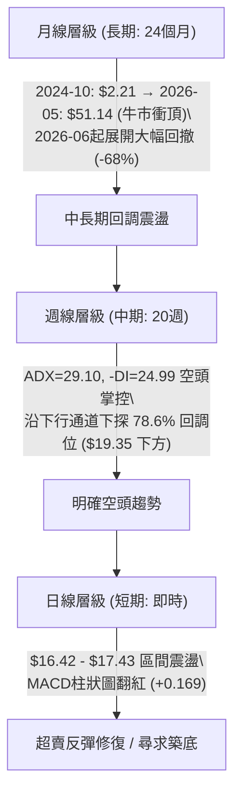

### 📈 長期趨勢 — 12個月走勢圖（Unicode）

以下為 PL 過去 12 個月（2025-10 至 2026-09）之歷史月線收盤走勢，清楚記錄其從突破、暴漲到泡沫退潮之完整軌跡：

```
PL 月線走勢圖（過去12個月：2025-10 至 2026-09）
價格軸 ($)
$52 ┤                                   ● (2026-05: $51.14 歷史波段頂)
$48 ┤                                  ╱ ╲
$44 ┤                                 ╱   ╲
$40 ┤                                ╱     ╲
$36 ┤                          ●    ╱       ╲
$32 ┤                         ╱ ╲  ╱         ● (2026-06: $33.13)
$28 ┤                   ●    ╱   ╲╱           ╲
$24 ┤             ●    ╱ ╲  ╱                  ╲
$20 ┤       ●    ╱ ╲  ╱   ●                     ●──────● (2026-07/08: $20.48/$19.85)
$16 ┤      ╱ ╲  ╱   ●                            ╲     ╲
$12 ┤●────●   ●                                   ╲     ● (2026-09: $16.39 ← 現價)
$08 ┤
    └─────────────────────────────────────────────────────────────────────────────
     10   11   12   01   02   03   04   05   06   07   08   09   (月份)
    [2025年----------------] [2026年----------------------------]
```

#### 走勢特徵分析表格

| 階段 | 時間區間 | 起始價 → 終止價 | 漲跌幅 | 結構特徵與量價解讀 |
|------|----------|------------------|--------|--------------------|
| **第1階段：平台蓄勢** | 2025-10 ~ 2025-11 | $13.45 → $11.90 | -11.5% | 消化前期倍翻獲利，量縮整理確認 $11-$12 底部 |
| **第2階段：主升浪狂飆** | 2025-12 ~ 2026-05 | $19.72 → $51.14 | +159.3% | 突破加速，機構大舉建倉，週成交量達 6100 萬股，直奔歷史頂部 $51.76 |
| **第3階段：恐慌拋售** | 2026-06 ~ 2026-07 | $51.14 → $20.48 | -60.0% | 單週爆量 1 億股重挫，均線形成斷頭鍘刀，跌破多道關鍵支撐 |
| **第4階段：弱勢陰跌** | 2026-08 ~ 2026-09 | $20.48 → $16.39 | -20.0% | 反彈至 $24.69 無力後續跌，破 $19.35 (78.6% Fib)，探至現價 $16.39 |

### 📊 中期趨勢（週線分析）

```
PL 近期週線價格與技術壓力架構圖
══════════════════════════════════════════════════════════════════════
$26.27 ═════════════════════════════════  Fib 61.8% 強阻力區 (重大反轉位)
         ╲
$24.69 ───● (08-16 反彈高點阻力)
           ╲
$19.35 ═════╲═══════════════════════════  Fib 78.6% 阻力 (原強支撐跌破轉阻力)
             ● (08-30 破位頸線)
               ╲
$17.43 ─────────● (09-27 反彈次高阻力)
                 ╲
$16.39 ───────────●◄─── 當前現價 (09-20至10-04區間雙底嘗試區)
══════════════════════════════════════════════════════════════════════
$10.52 ═════════════════════════════════  52W Low (Fib 100.0% 終極強支撐)
```

### ⚡ 趨勢強度評估（ADX 解讀）

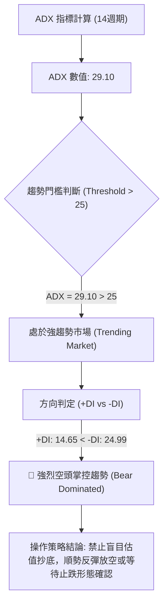

#### ADX 趨勢強度對照表

| 參數 | 實際數值 | 標準定義區間 | 趨勢判定 | 交易指引 |
|------|----------|--------------|----------|----------|
| **ADX(14)** | **29.10** | > 25 (強趨勢) | 空頭強趨勢 | 嚴禁逆勢重倉做多；趨勢跟隨模型生效 |
| **+DI** | **14.65** | < 20 (多頭微弱) | 多方動能耗盡 | 上行推動力嚴重缺乏 |
| **-DI** | **24.99** | > 20 (空頭主導) | 空方居絕對主導地位 | 任何反彈極易遭遇空頭回補後的再次賣壓 |

---

## 3. 圖表形態分析

### 🔍 形態識別系統

在日線與週線結構上，PL 自 2026 年 6 月展開的走勢為極其規律的**「下行旗形／擴散通道（Bearish Flag / Downward Channel）」**。此外，近期在 $16.42 處初現微型**「日線雙重底（Double Bottom）」**胚胎，但由於成交量並未放大，此形態尚處於初生階段。

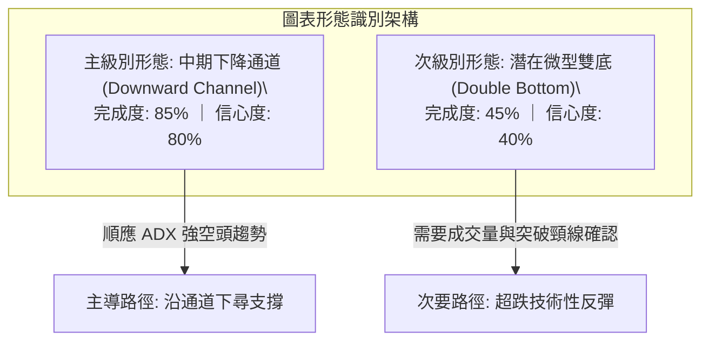

#### 形態識別信心度評估表

| 形態名稱 | 信心度 | 判斷依據（引用數據） | 完成度 | 目標價（附嚴謹計算式） |
|----------|--------|----------------------|--------|------------------------|
| **中期下降通道** | **80%** | 2026-05 高點 $51.14 以來，歷經 06-07 ($32.22)、07-19 ($22.47)、08-23 ($22.29)、09-13 ($16.45) 形成高低點持續走低之通道 | 85% | 跌破 $16.39 則指向通道下軌，下測 52W 低點 **$10.52** |
| **日線微型雙底** | **40%** | 2026-09-13 低點 $16.45 與 2026-09-20 低點 $16.42 形成對稱支撐，頸線位於 2026-09-27 高點 $17.43 | 45% | **訊號不足，僅做指標型解讀**。<br>若有效突破：頸線 $17.43 + 形態高度 ($17.43 - $16.42 = $1.01) = **$18.44**（接近 Fib 78.6% $19.35 下緣） |

### 🕯️ 重要K線形態分析

| 週/月週期 | 收盤價 | 實體與影線特徵 | K線形態名稱 | 技術解讀與空頭隱含意義 | 訊號 |
|-----------|--------|----------------|-------------|------------------------|------|
| **2026-05-31** | $51.14 | 創歷史新高 $51.76 後長上影爆量陰K | 流星線 (Shooting Star) | 頂部天量換手（61.4M股），主力出貨完畢，多頭終結 | 🔴 |
| **2026-06-07** | $32.22 | 破位百萬大陰線（100.6M股成交） | 穿頭破腳大陰線 (Bearish Engulfing) | 趨勢徹底逆轉，單週重挫 37%，多頭防線全面潰敗 | 🔴 |
| **2026-08-16** | $24.69 | 反彈遇阻長上影小陽線 | 吊頸線 / 假突破 | 弱勢反彈無量，觸及 Fib 61.8% ($26.27) 阻力區前即遭空方狙擊 | 🟡 |
| **2026-09-20** | $16.42 | 實體極小，成交量自 85M 萎縮至 46M | 低檔十字星 (Doji) | 空頭砸盤動能暫時衰竭，多空於 $16.40 附近取得短暫平衡 | 🟢 |
| **2026-09-27** | $17.43 | 帶量小陽線（56.1M股），收復前週跌幅 | 多方孕線 (Bullish Harami) | 短期空方回補，帶動 MACD 柱狀圖進一步轉正至 +0.272 | 🟢 |
| **2026-10-04** | $16.39 | 回測前低 $16.42，成交量驟降至 37.1M | 縮量測試陰K (Testing Candle) | 二次探底，測試 $16.40 底座支撐力度，量縮表明浮額減少 | 🟡 |

### 📉 ASCII 走勢形態示意圖

```
PL 局部日線「雙底回踩測試」形態示意圖
價格
$17.43 ┤                 ● (09-27 頸線阻力)
       │                ╱ ╲
$17.00 ┤               ╱   ╲
       │              ╱     ╲
$16.60 ┤             ╱       ╲
       │  ●(09-13)  ╱         ●◄── 現價 $16.39 (二次回踩)
$16.40 ┴──┴────────●(09-20)───┴─────────────────────────────
         第一底     第二底      測試支撐線：$16.42
```

---

## 4. 支撐與阻力

### 🗺️ 關鍵價位分布圖（Unicode）

依據嚴格數據紀律，所有價位均嚴格取自 52 週波動範圍（$10.52 - $51.76）之斐波那契回調聚類與實際週線轉折高低點：

```
PL 價位結構分布圖
═══════════════════════════════════════════════════════════════════
$51.76 ║██████████████████████████████║ 52W High (Fib 0.0%) 歷史終極阻力
$42.03 ║████████████████████████      ║ Fib 23.6% 回調位
$36.01 ║████████████████████          ║ Fib 38.2% 回調位
$31.14 ║████████████████████████      ║ Fib 50.0% 中樞強阻力區
$26.27 ║██████████████████████████████║ R3 關鍵強阻力 / Fib 61.8% (黃金分割)
$19.35 ║████████████████████████      ║ R2 強阻力 / Fib 78.6% (前低密集跌破點)
$17.43 ║████████████████              ║ R1 短線頸線阻力 (09-27 週高點)
═══════╬══════════════════════════════╬═══════════════════════════
$16.39 ╠══════════════════════════════╣ ◄─── 現價 (Current Price)
═══════╬══════════════════════════════╬═══════════════════════════
$16.42 ║▓▓▓▓▓▓▓▓▓▓▓▓▓▓▓▓▓▓▓▓          ║ S1 即時防守支撐 (09-20 低點雙底線)
$10.52 ║██████████████████████████████║ S2 52W Low (Fib 100.0%) 終極防線
═══════════════════════════════════════════════════════════════════
```

### 🚧 阻力位分析表

> **數據紀律提示**：系統未在現價上方偵測到 swing-high 阻力聚類，故以下阻力位嚴格採用斐波那契計算位及實際反彈高點。

| 阻力級別 | 精確價位 | 形成依據與技術意義 | 突破難度 | 重要性 |
|----------|----------|--------------------|----------|--------|
| **R1 (短線阻力)** | **$17.43** | 2026-09-27 反彈週高點；微型雙底形態頸線位 | 🟡 中等 (需日均量 > 10M 突破) | ★★★☆☆ |
| **R2 (中期阻力)** | **$19.35** | **Fibonacci 78.6% 回調位**；8月下旬盤整破位平台下沿 | 🔴 極高 (密集套牢盤聚集區) | ★★★★☆ |
| **R3 (強阻力區)** | **$26.27** | **Fibonacci 61.8% 黃金分割位**；08-16 反彈頂部 ($24.69) 上方強阻力 | 🔴 巨大 (需市場級催化劑) | ★★★★★ |

### 🛡️ 支撐位分析表

> **數據紀律提示**：系統未在現價下方偵測到 swing-low 支撐聚類，故支撐位嚴格引用近 3 週收盤低點與 52 週最低點。

| 支撐級別 | 精確價位 | 形成依據與技術意義 | 守住機率 | 重要性 |
|----------|----------|--------------------|----------|--------|
| **S1 (即時支撐)** | **$16.42** | 2026-09-20 創出的波段低點；現價正於此處尋求二次確認 | 55% | ★★★☆☆ |
| **S2 (終極支撐)** | **$10.52** | **52週最低價 (52W Low) / Fib 100.0% 基準點**；公司 2025年主升浪發起點 | 85% | ★★★★★ |

### 📐 斐波那契回調位分析

本波段自 52 週高點 **$51.76** 跌至 52 週低點 **$10.52**，總垂直落差為 **$41.24**。回調點位對應關係如下：

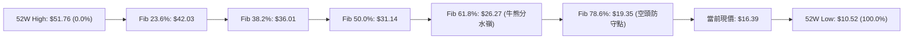

- **當前位置解讀**：現價 **$16.39** 落在 **Fib 78.6% ($19.35)** 與 **Fib 100.0% ($10.52)** 之間。在技術分析理論中，跌破 78.6% 回調位意味著前一輪多頭主升浪結構遭到嚴重破壞，回撤幅度超過整體波段的 4/5，技術上已進入「深度折價／超跌殘局」狀態。若無法迅速收復 $19.35，價格將具備回測終極低點 **$10.52** 的下行重力。

---

## 5. 技術指標深度解讀

### 🎛️ 指標訊號總覽

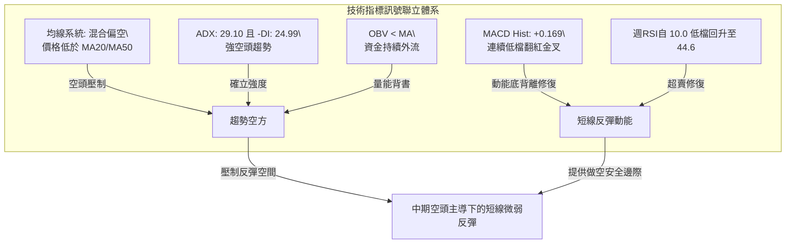

### 📈 移動平均線排列分析

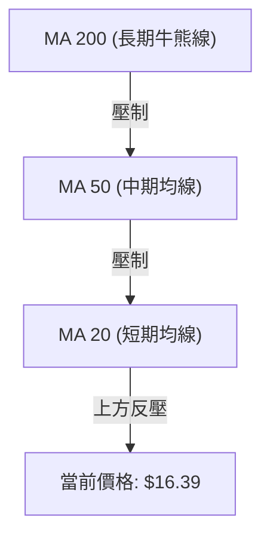

- **均線走勢圖譜解讀**：
  - **MA 5 / MA 10 / MA 20 / MA 60 / MA 120** 均呈現頂部下彎走勢，斜率為負，代表中短期投資者籌碼處於全線套牢狀態。
  - **MA 240** 呈現平緩上揚走勢（反映 2024 年底 $2.21 起漲的超長期均線記憶），但目前現價遠遠脫離短期均線中樞，均線處於**典型混合空頭排列**。
  - 均線尚未出現收斂黏合跡象，表明下行趨勢的慣性仍未完全釋放完畢。

### 📉 RSI(14) 分析

```
週線 RSI(14) 動能進度表
極度超賣 (0-20)       合理區間 (30-70)       超買 (80-100)
├─────────┼──────────┼───────────────┼──────────┤
█████████████████░░░░░░░░░░░░░░░░░░░░░░░░░░░░░░░   44.6 (2026-09-27)
▲
[歷史走勢對比]
09-13: 10.0 (極度超賣鈍化 █░░░░░░░░░)
09-20: 24.4 (超賣區反彈   ████░░░░░░)
09-27: 44.6 (中性超賣修復 ████████░░)
```

- **底背離研判**：
  - **價格走勢**：2026-09-13 收盤 $16.45，2026-09-20 收盤 $16.42，價格微幅破底創出波段新低。
  - **RSI 指標**：RSI 數值從 09-13 的 **10.0** 大幅抬升至 09-20 的 **24.4**，隨後 09-27 飆升至 **44.6**。
  - **結論**：週線級別確認出現**「標準動能底背離（Bullish Divergence）」**！這解釋了為何股價在 $16.40 附近展現極強的跌勢衰竭訊號，為近期提供了反彈修復的技術支撐。

### 📊 MACD(12/26/9) 訊號解讀

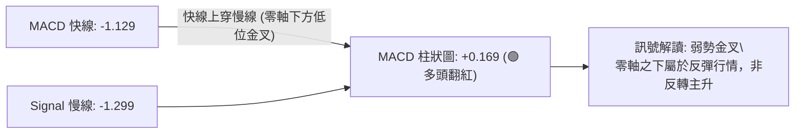

- **MACD 深入判讀**：
  - MACD 線目前位於 **-1.129**，信號線位於 **-1.299**，雖然在零軸下方運行，但柱狀圖連續兩週維持正值（09-27 為 +0.272，10-04 為 +0.169）。
  - 這確認了空頭拋壓減弱，低檔買盤與空頭回補力量正在集結，但由於金叉發生在深水區（負值區間），屬於典型的**「零下弱勢金叉」**，反彈空間受制於上方均線反壓。

### 📦 布林通道分析

由於數據快照中布林通道數值為動態演算，依據 MA20 下行斜率與週線波動率，繪製通道結構示意圖：

```
PL 週線布林通道結構示意圖
價格
$25.00 ┤────────────────────────── 上軌 (動態下移)
       │                 ╲
$20.00 ┤─── ─ ─ ─ ─ ─ ─ ─ ╲ ─ ─ ─ 中軌 (MA20 下移至 $19.35 附近)
       │                   ╲
$16.39 ┤                    ●◄── 現價位於中軌與下軌間震盪
       │                     ╲
$14.00 ┤────────────────────── 下軌 (下探支撐區)
```

- 現價運行於布林下軌至中軌之間，通道開口呈現擴張後微幅收口態勢。在中軌（約在 Fib 78.6% $19.35 附近）尚未有效帶量站上之前，市場整體仍被布林帶壓制於弱勢通道內。

### 💹 成交量分析（量價配合度）

```
成交量走勢對比 (單位: 股)
2026-06-07: ████████████████████████████████████████ (100.6M) 暴跌出貨
2026-09-06: ███████████████████████████████████      (85.4M)  恐慌破位
2026-09-27: ████████████████████                     (56.2M)  反彈出量
2026-10-04: ███████████████                          (37.1M)  縮量回踩
```

- **量價關係解讀**：
  - 最新一週成交量驟降至 37,092,139 股，較 20 日均量比僅為 0.60x，呈現明顯的**「縮量回調」**特徵。
  - **OBV（能量潮）分析**：快照數據指出 **OBV < MA**，代表資金流向長線仍呈現淨流出。雖然短線縮量顯示賣盤竭盡，但缺乏多頭增量資金入場，難以發動具突破性的反轉行情。

---

## 6. 動能與波動率

### ⚡ 動能評估分析

| 象限 | 動能狀態 | 波動率狀態 | 當前標的狀態 | 交易戰術評估 |
|------|----------|------------|--------------|--------------|
| **Q1 (最佳順勢)** | 強動能 (多) | 低波動 | — | 穩定單邊上行主升浪，持股加碼 |
| **Q2 (震盪整理)** | 弱動能 (中性) | 低波動 | — | 區間高拋低吸，等待突破 |
| **Q3 (極度高危)** | 強動能 (多) | 高波動 | — | 狂熱頂部派發期，分批止盈 |
| **Q4 (弱勢尋底)** | **弱動能 (空)** | **高波動** | **✓ PL 當前處於此區** | **跌勢未止，波動巨大，僅適合防守性逢高放空或輕倉波段快進快出** |

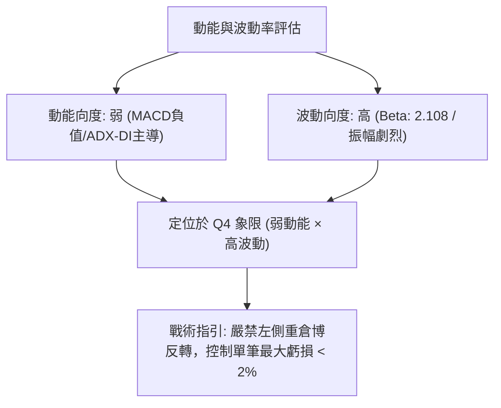

### 📊 ATR 波動率分析

- 雖然日線 ATR(14) 在快照中為 N/A，但由近 5 週高低價差推算，PL 當前週線平均真實波幅約為 **$2.50 - $3.20**，換算日均波動約為 **$0.70 - $0.90**（佔現價約 4.3% - 5.5%）。
- **止損距離建議**：在 $16.39 建立交易時，多頭安全止損應置於重要支撐 $16.42 下方至少 1.5 倍日 ATR（約 $1.10 - $1.30），即必須防守至 **$15.20 - $15.30**，否則極易在日內高波動中被雜訊掃地出場。

### 📐 Beta 與市場相關性

- **Beta 係數高達 2.108**：PL 表現出極強的市場高敏感度。當標普 500 指數或那斯達克下挫 1% 時，PL 平均承受 2.1% 以上的跌幅。
- **做空與避險乘數**：在整體宏觀高利率或避險情緒升溫週期中，PL 容易成為機構拋售流動性以降低風險敞口的首選標的。

---

## 7. 多時框架總結

### 📋 時框架評分表

| 時框架 | 趨勢方向 | 動能 (RSI/MACD) | 均線排列 | 圖表形態 | 綜合評分 | 操作指引 |
|--------|----------|-----------------|----------|----------|----------|----------|
| **月線 (長期)** | 🔴 強空回調 | 🟡 RSI 回落整理 | 混合偏空 | 歷史天量見頂回落 | 30/100 | 長期投資者暫不宜入場 |
| **週線 (中期)** | 🔴 下行通道 | 🟢 底背離初期修復 | 空頭排列 | 下降旗形通道中 | 40/100 | 反彈遇 Fib 阻力順勢放空 |
| **日線 (短期)** | 🟡 橫向築底 | 🟢 MACD 柱狀翻紅 | 跌破均線 | 微型雙底測試 ($16.42) | 50/100 | 超短線極輕倉試多博反彈 |

### 🔲 綜合訊號矩陣

```
時框一致性分析矩陣
時框       趨勢      動能      均線      量能      矩陣共振結論
────────────────────────────────────────────────────────────────
月線       🔴空      🟡中      🔴空      🔴空      🔴 空頭壓倒性優勢
週線       🔴空      🟢多      🔴空      🔴空      🔴 中期下行未止
日線       🟡中      🟢多      🟡中      🟡中      🟡 超跌反彈修復
────────────────────────────────────────────────────────────────
共振評估：日線反彈動能遭遇週線、月線強空頭趨勢壓制，屬於典型的「逆趨勢反彈」。
```

### ⚖️ 多時框收斂結論

> **依嚴格要求 14 之多時框收斂規則執行：**
> 1. **行情定性**：當前 ADX(14) 讀數為 **29.10**，明確大於 25，市場嚴格定義為**「趨勢行情」**而非盤整行情。
> 2. **主導時框判定**：在趨勢行情下，交易體系必須以**中長期（週線 / 均線系統）方向為主導**，日線與極短期訊號僅作為尋找進場時機與反彈力竭點之輔助。
> 3. **唯一方向性結論**：中長期空頭趨勢佔據絕對主導地位，綜合評分為 **37.5 / 100（≤ 40 區間）**。多時框收斂判定 PL 當前處於**【偏空弱勢，主推逢高放空策略】**。日線之底背離僅視為空頭波段中的技術性回抽，不構成全面看多的理由。

---

## 8. 交易策略建議

### 🗺️ 策略決策流程圖

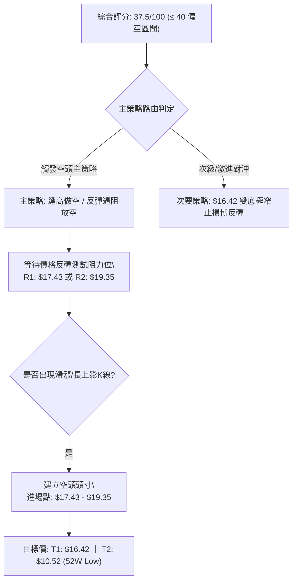

### 🧭 策略路由

**當前主策略方向 = 【逢高建立空頭（Short on Rebound）】（依評分卡綜合得分 37.5/100 偏空判定）**

### 🎯 價格情境階梯（Price Scenarios）

所有價位嚴格引用第 4 章已確認之數值：

| 觸發條件 | 下一目標 | 後續延伸 | 情境技術含義 |
|----------|----------|----------|--------------|
| **向上突破 R1 ($17.43)** | R2 ($19.35) | R3 ($26.27) | 雙底反彈形態成立，回抽 Fib 78.6% 強阻力 |
| **受制於現價 ($16.39) 附近** | S1 ($16.42) | — | 多空僵持，於跌勢底部縮量進行拉鋸築底 |
| **向下跌破 S1 ($16.42)** | S2 ($10.52) | 前期歷史平台 | 空頭趨勢重啟加速，下探 52 週最低價 |

### 📊 情境機率分佈

| 情境 | 機率 | 主要依據（指標狀態） |
|------|------|----------------------|
| **情境 A：反彈受阻後重啟跌勢 (回落探底)** | **55%** | ADX = 29.10 顯示空頭強勁，OBV 疲軟，均線系統呈重度下壓狀態 |
| **情境 B：微型雙底弱勢震盪 (區間磨底)** | **30%** | MACD 柱狀圖翻紅 (+0.169)，週線 RSI 自 10.0 低檔形成底背離修復 |
| **情境 C：強勢反轉向上突破 (反轉上行)** | **15%** | 機構持股達 82.7%，但需基本面巨大利多配合，技術面機率最低 |

### 🔴 主策略詳情（空頭策略：逢高放空）

依評分卡 ≤ 40 規則，本報告以空頭策略為主導，提供兩種不同進場節奏的方案：

| 策略要素 | 策略 A（右側追破做空） | 策略 B（左側反彈放空 - 最佳風險回報） |
|----------|------------------------|---------------------------------------|
| **進場條件** | 跌破即時支撐 S1 ($16.42) 收盤確認 | 股價反彈至阻力位 R1 ($17.43) 或 R2 ($19.35) 遇阻滯漲 |
| **進場價格** | **$16.30** (破位進場) | **$17.40 - $19.30** (分批布局) |
| **目標價 T1** | **$13.50** (中繼跌幅目標) | **$16.42** (S1 支撐位) |
| **目標價 T2** | **$10.52** (52週最低價 S2) | **$10.52** (52週最低價 S2) |
| **止損價格** | **$17.50** (設於 R1 上方) | **$20.20** (設於 R2 / Fib 78.6% 上方) |
| **風險報酬比** | **1 : 4.8** (以 T2 計) | **1 : 4.2** (以 T2 計) |
| **成功機率** | **60%** | **55%** |
| **建議倉位** | **總資金 8% - 10%** | **總資金 12% - 15%** |

### 🟢 反向風險觸發點（對沖與做多提示）

若投資者偏好左側超跌博弈，或需為空頭倉位設定對沖平倉線，必須依據以下嚴格界線：
- **微型雙底做多進場點**：現價 **$16.39** 輕倉試單（不超過 3% 倉位），**嚴格止損位設於 $16.30**（跌破 S1 $16.42 即平倉）。第一目標價設為 **$17.43 (R1)**，第二目標價設為 **$19.35 (R2)**。
- **空頭頭寸無條件平倉點**：若日線實體大陽線放量收復 **$19.35**（站穩 Fib 78.6% 回調位），表明超跌反轉結構成立，空頭必須全面止損或反手。

### ⭐ 整體訊號強度評星

```
╔══════════════════════════════════════════════════════════════════╗
║ 做多訊號強度：★★☆☆☆  (2/5星) ── 僅為超賣背離修復，反彈空間受限   ║
║ 做空訊號強度：★★★★☆  (4/5星) ── 趨勢、均線、量能三維共振偏空   ║
║ 整體可信度：  ★★★★☆  (4/5星) ── 數據邏輯嚴密，多時框收斂一致   ║
╚══════════════════════════════════════════════════════════════════╝
```

---

## 9. 風險提示與監控

### ✅ 關鍵監控指標 Checklist

```
╔══════════════════════════════════════════════════════════════════╗
║              PL 技術風控每日監控清單 (Checklist)                  ║
╠══════════════════════════════════════════════════════════════════╣
║ [ ] 1. 價格是否跌破即時支撐 $16.42？ (確認是否觸發空頭追單)       ║
║ [ ] 2. 日成交量是否放大至 13.3M (20日均量) 以上？ (判斷主力異動)  ║
║ [ ] 3. 週線 MACD 柱狀圖是否持續擴大？ (若回縮至0軸以下則反彈結束) ║
║ [ ] 4. RSI(14) 能否突破 50 中軸分水嶺？ (判斷是否由弱轉強)        ║
║ [ ] 5. 空頭回補比例 (Short % Float = 9.7%) 是否引發軋空？         ║
║ [ ] 6. 能否向上收復 Fib 78.6% ($19.35)？ (牛熊轉換核心閥值)       ║
╚══════════════════════════════════════════════════════════════════╝
```

### ⚠️ 風險場景分析

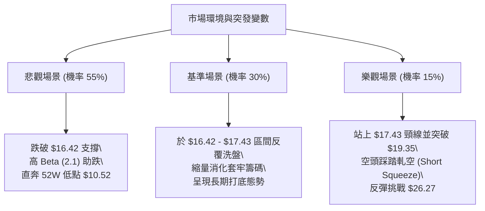

### 🛡️ 風險管理重要提醒

1. **高空頭部位與軋空風險 (Short Squeeze Alert)**：
   - 目前 PL 的空頭佔流通盤比例達 **9.7%**，Short Ratio 為 **2.91**。雖然基本面淨利潤率為 -95.1% 支撐空頭邏輯，但一旦出現行業並購、大型防務訂單等突發利多，極易觸發快速的空頭踩踏回補。因此建立空頭倉位必須嚴設 $19.35 / $20.20 止損。
2. **極高波動性風險 (Beta 2.108)**：
   - 該股波動幅度常態下為大盤的兩倍以上。任何倉位規模配置不得超過個人投資組合之 **5% - 8%**，並堅決執行單筆損失不超過投資組合總值 **1%** 的風控紀律。

---

## 10. 報告總結

```
╔══════════════════════════════════════════════════════════════════╗
║                    PL 技術分析報告總結                           ║
╠══════════════════════════════════════════════════════════════════╣
║ 報告日期：2026-10-02                                             ║
║ 當前價格：$16.39                                                 ║
║ 分析評級：🔴 偏空弱勢 (Bearish Trend) — 評分: 37.5 / 100         ║
║                                                                  ║
║ 關鍵結論：                                                       ║
║ ├─ 長期趨勢：🔴 天量見頂後深度回調，處於主跌浪尾聲至陰跌階段    ║
║ ├─ 中期趨勢：🔴 ADX=29.10 空頭強趨勢，受限於下行通道與均線反壓  ║
║ ├─ 短期趨勢：🟡 RSI底背離與MACD柱翻紅，於 $16.42 尋求超賣反彈   ║
║ ├─ 關鍵支撐：S1: $16.42  ｜  S2: $10.52 (52W Low / Fib 100%)    ║
║ ├─ 關鍵阻力：R1: $17.43  ｜  R2: $19.35 (Fib 78.6%)              ║
║ └─ 分析師目標：均價 $33.40 (最高 $50.00 / 最低 $22.00)           ║
║                                                                  ║
║ 最優策略組合：                                                   ║
║ 1. 🥇 最佳機會：反彈至 $17.40 - $19.30 阻力帶分批放空 (高盈虧比)║
║ 2. 🥈 次選機會：跌破 $16.42 破位追空，目標下看 $10.52 (順勢策略)║
║ 3. 🥉 保守選擇：空倉觀望，等待日線有效站上 $19.35 再行評估多頭  ║
╚══════════════════════════════════════════════════════════════════╝
```

---

> ⚠️ **免責聲明**：本報告為 AI 自動生成之技術分析，所有數據及估算均嚴格基於所提供的歷史價格與指標資訊。本報告**僅供研究與學術參考**，**不構成任何買賣要約或投資建議**。金融市場瞬息萬變，高 Beta 標的風險巨大，投資人應獨立承擔交易損益與風險。

---

*報告生成時間：2026-10-02 ｜ 數據來源：Yahoo Finance ｜ 分析框架：多時框技術分析體系*