# PL 技術分析報告

> **報告日期**：2026-10-05 ｜ **語言**：繁體中文 ｜ **數據來源**：Yahoo Finance ｜ **當前價格**：$17.50

---

## 目錄

| 章節 | 內容 |
|------|------|
| [1. 技術面概覽](#1-技術面概覽) | 訊號儀表板、核心指標、評分卡 |
| [2. 趨勢分析](#2-趨勢分析) | 多時框趨勢、長中短期走勢、ADX強趨勢解讀 |
| [3. 圖表形態分析](#3-圖表形態分析) | 雙重底雛形、K線特徵、形態信心度計算 |
| [4. 支撐與阻力](#4-支撐與阻力) | OHLCV群集價位、斐波那契回調結構 |
| [5. 技術指標深度解讀](#5-技術指標深度解讀) | 均線系統、RSI底背離、MACD翻紅、布林通道與OBV |
| [6. 動能與波動率](#6-動能與波動率) | 動能矩陣、ATR風控距離、高Beta特性解讀 |
| [7. 多時框架總結](#7-多時框架總結) | 時框架矩陣、ADX優先級收斂結論 |
| [8. 交易策略建議](#8-交易策略建議) | 策略路由、精確價位交易計劃、風險報酬比評估 |
| [9. 風險提示與監控](#9-風險提示與監控) | 風險檢查清單、三情境壓力測試、風控指引 |
| [📋 報告總結](#-報告總結) | 核心摘要面板與全景總覽 |

---

## 1. 技術面概覽

Planet Labs PBC（NYSE: PL）當前報價為 **$17.50**。該股在經歷了 2026 年 5 月高點 $51.76 後的劇烈下挫後，目前處於 52 週波動區間的低檔分位（16.9%）。技術架構呈現「中長期空頭排列尚未扭轉，但極短期築底動能與底背離訊號強烈共振」的經典反彈架構。

### 🎯 技術訊號儀表板

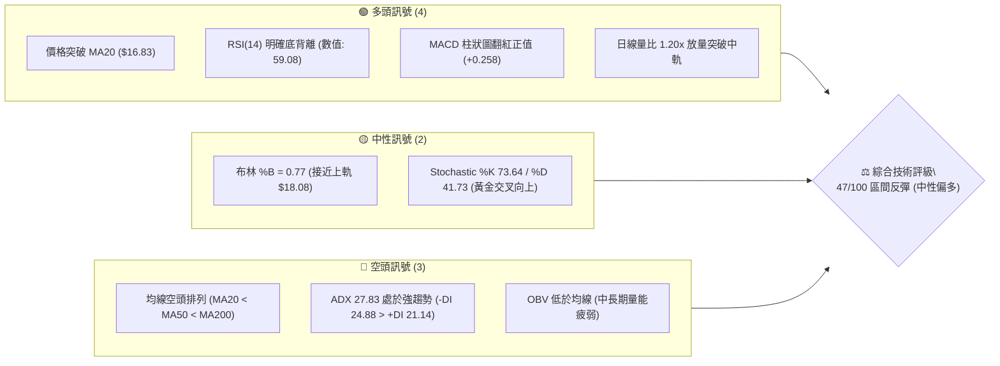

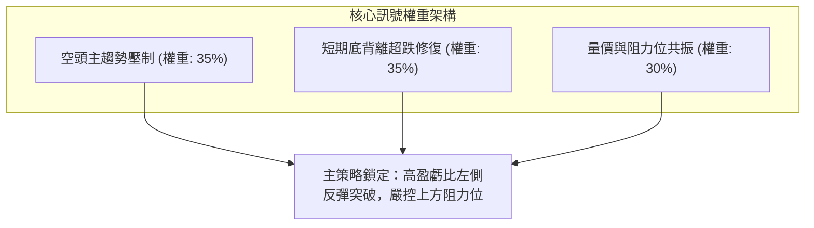

### 📊 核心指標速覽表

| 指標類別 | 指標名稱 | 當前數值 | 訊號 | 解讀 |
|----------|----------|----------|------|------|
| **價格** | 當前價格 | $17.50 | 🟡 | 站上日線 MA20，但受制於 52 週低檔反彈區間 |
| **均線** | MA20 (BB中軌) | $16.83 | 🟢 | 價格在均線上方 +4.00%，短期動能由弱轉強 |
| **均線** | MA50 | $19.81 | 🔴 | 價格在均線下方 -11.66%，中期空頭防線尚未越過 |
| **均線** | MA200 | $27.34 | 🔴 | 價格在均線下方 -35.99%，長期熊市結構明顯 |
| **動能** | RSI(14) | 59.08 | 🟢 | 遠離超賣區，指標出現顯著「價格創低但RSI抬升」底背離 |
| **動能** | MACD (12/26/9)| -0.973 / -1.230 | 🟢 | MACD線向上金叉訊號線，柱狀圖 +0.258 持續擴張 |
| **趨勢** | ADX (14) | 27.83 | 🔴 | ADX>25 顯示中級趨勢存在，-DI (24.88) > +DI (21.14) 空方主導 |
| **量能** | 20日均量比 | 1.20x | 🟢 | 最新量 14.93M 高於 20MA量 12.45M，具備放量攻擊跡象 |
| **量能** | OBV | 疲弱 | 🔴 | 能量潮 OBV < MA，反映長期籌碼派發尚未徹底清洗乾淨 |
| **波動** | ATR(14) | $0.91 (5.21%) | 🟡 | 波動度處於常態偏高水位，日內波幅達 $0.91，設定止損需保留空間 |

### 🏆 技術評分卡

```
╔══════════════════════════════════════════════════════════════════╗
║                   技術評分卡 — PL (2026-10-05)                   ║
╠══════════════════════════════════════════════════════════════════╣
║ 趨勢強度 (Trend)     ███████░░░░░░░░░░░░░  35/100 🔴 空頭壓制  ║
║ 動能指標 (Momentum)  █████████████░░░░░░░  65/100 🟢 底背離強  ║
║ 支撐穩定度 (Support) ████████████░░░░░░░░  60/100 🟡 S1重疊有效║
║ 成交量配合 (Volume)  ██████████░░░░░░░░░░  50/100 🟡 短放長虛  ║
║ 形態完整度 (Pattern) ████████░░░░░░░░░░░░  40/100 🟡 雛形醞釀  ║
║ 均線系統 (MovingAvg) ██████░░░░░░░░░░░░░░  30/100 🔴 長線空頭  ║
╠══════════════════════════════════════════════════════════════════╣
║ 綜合技術評分         █████████░░░░░░░░░░░  47/100 🟡 區間反彈  ║
║ 評級結論             中性偏多反彈（超跌反彈階段，以區間阻力操作為主） ║
╚══════════════════════════════════════════════════════════════════╝
```

---

## 2. 趨勢分析

### 🌐 多時框趨勢分析

分析多時框架架構：月線呈現自歷史高位大幅殺跌後的收斂止跌；週線在低檔收出連續底背離紅柱；日線則呈現放量翻越 MA20 並叩關布林上軌。

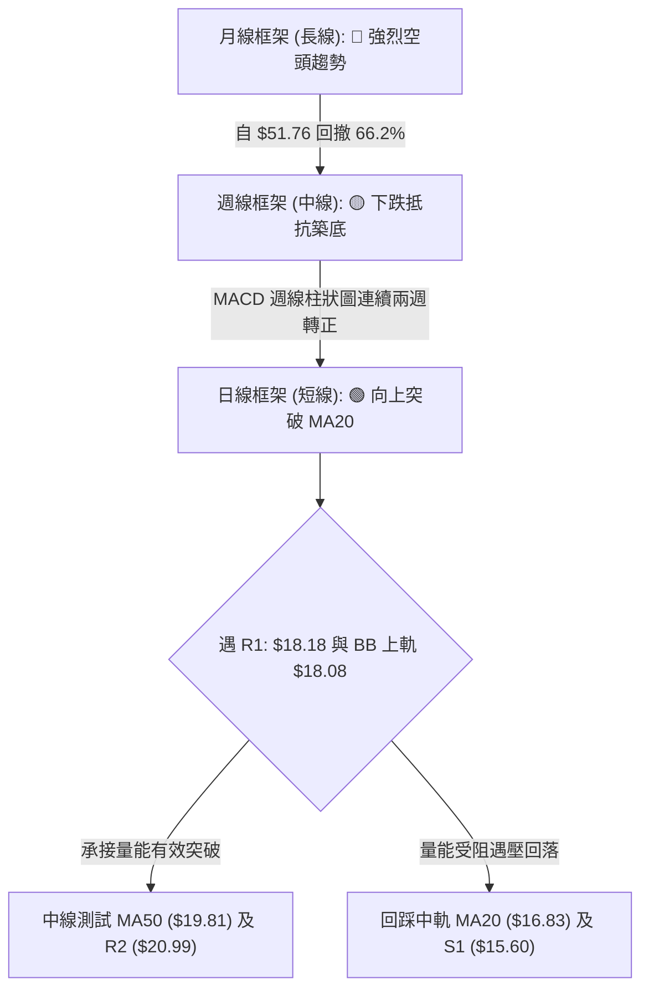

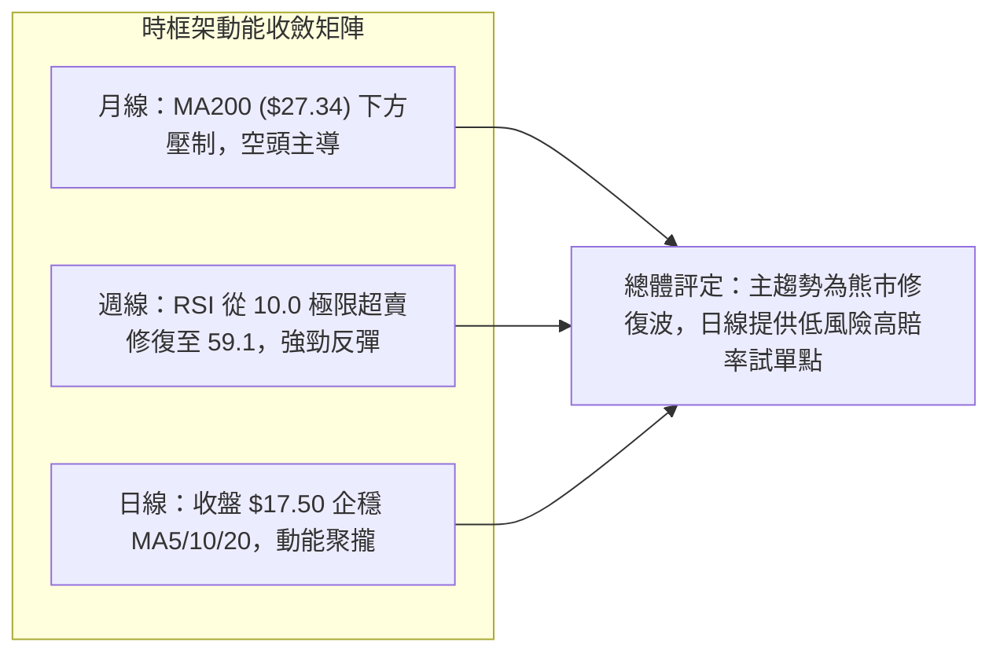

### 📈 長期趨勢 — 12個月走勢圖（Unicode）

以下為 Planet Labs 過去 12 個月（2025-11 至 2026-10）之月線收盤價格軌跡：

```
PL 月線走勢圖（過去 12 個月）
價格軸 ($)
$51.14 ┤                                     ●(05月歷史極值)
$46.00 ┤                                    ╱ ╲
$41.00 ┤                                   ╱   ╲
$36.97 ┤                             ●(04月)    ╲
$33.13 ┤                            ╱            ●(06月崩跌)
$27.95 ┤                   ●(03月) ╱              ╲
$24.97 ┤          ●(01月) ╱   ╲   ╱                ╲
$24.14 ┤         ╱ ╲     ╱     ●(02月)              ●(07月破位)
$19.72 ┤  ●(12月)   ╲   ╱                          │ ●(08月盤整)
$17.50 ┤──┼───────────●(11月)───────────────────────┼──┼──●←現價(10月)
$16.39 ┤  │                                        │  │ ╱
$11.90 ┤  ●                                        │  ●(09月低點)
       └────────────────────────────────────────────────────────────
        11月 12月  01月  02月  03月  04月  05月  06月 07月 08月 09月 10月
       (2025) ───────────────────────── (2026) ─────────────────────
```

#### 過去 12 個月波段特徵分析

| 階段 | 時間跨度 | 起訖收盤價 | 漲跌幅 | 走勢特徵與成交量分析 |
|------|----------|------------|--------|----------------------|
| **第一階段：拉升蓄勢** | 2025-11 → 2026-01 | $11.90 → $24.97 | +109.8% | 伴隨營收高增長預期，成交量逐月放量突破前高 $13.45 |
| **第二階段：主升瘋狂** | 2026-02 → 2026-05 | $24.14 → $51.14 | +111.8% | 垂直加速上噴，於 2026-05 創下 52 週天價 $51.76，週量放大至 61.48M |
| **第三階段：崩跌派發** | 2026-06 → 2026-07 | $51.14 → $20.48 | -59.9%  | 機構集中派發，06-07 單週成交破億股（100.62M），均線全線崩解 |
| **第四階段：築底震盪** | 2026-08 → 2026-10 | $20.48 → $17.50 | -14.5%  | 於 $16.39-$16.45 區間獲得雙重支撐，量能萎縮至 52M，呈現量縮築底 |

### 📊 中期趨勢（週線分析）

週線層面顯示出極端超賣後的強烈均值回歸現象。2026-09-13 當週，週線 RSI 降至不可思議的 **10.0** 極限超賣水位，MACD 柱狀圖見低 -0.328。隨後三週，價格在 $16.42 獲得強大買盤承接，週線收盤由 $16.42 連續推升至 $17.43 及當前 $17.50，週線 RSI 回彈至 **59.1**，週線 MACD 柱狀圖由負翻正至 **+0.258**，呈現極其標準的超跌修復軌跡。

```
週線級別阻力與支撐分佈架構：
$27.34 ────────────────────────────────────────── MA200 長期強大壓制
$25.53 ────────────────────────────────────────── R3 (近一年波段密集壓力區)
$20.99 ────────────────────────────────────────── R2 / MA60 ($20.46)
$19.81 ────────────────────────────────────────── MA50 / 斐波 78.6% ($19.35)
$18.18 ────────────────────────────────────────── R1 短線關鍵頸線
$17.50 ───► 當前收盤價 ($17.50)
$16.83 ────────────────────────────────────────── MA20 (短線生命線 / 布林中軌)
$15.60 ────────────────────────────────────────── S1 (第一道結構性支撐)
$11.97 ────────────────────────────────────────── S2 (年內次級防線)
$10.52 ────────────────────────────────────────── S3 (52W 絕對低點)
```

### ⚡ 趨勢強度評估（ADX 解讀）

當前 PL 之 14 日 ADX 指標數值為 **27.83**。

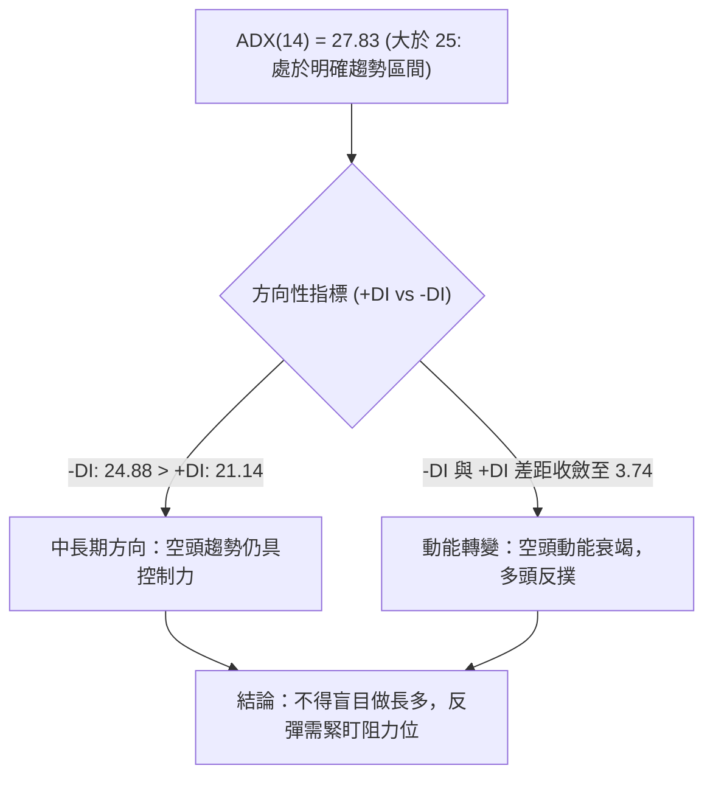

#### ADX 趨勢強度對照表

| ADX 區間 | 趨勢狀態 | PL 當前定位 | 操作指導原則 |
|----------|----------|-------------|--------------|
| 00 – 20 | 無趨勢 / 盤整 | 否 | 網格交易，高拋低吸 |
| 20 – 25 | 趨勢醞釀中 | 否 | 觀察突破方向 |
| **25 – 40** | **強趨勢確立** | **27.83 (符合)** | **遵循中長期主要趨勢或捕捉大級別反轉初期** |
| 40 – 60 | 極強趨勢 | 否 | 順勢加碼，抱牢部位 |
| 60 – 100| 趨勢過度延伸 / 即將竭盡 | 否 | 提防均值回歸暴跌或反彈 |

**專業解讀**：ADX 雖在 27.83 表明當前仍屬空頭主導的趨勢格局（-DI > +DI），但由於 -DI 與 +DI 已高度收斂（差值僅 3.74），且日線價格突破 MA20，表明空頭趨勢已進入**末端衰竭與結構震盪切換期**。此階段操作不可追空，反而應利用短線指標底背離進行戰術性反彈交易。

---

## 3. 圖表形態分析

### 🔍 形態識別系統

在日線與週線的交互驗證中，PL 展現了底部聚攏的幾何結構。最清晰的為「潛在日線雙底（Double Bottom）雛形」與「超跌下降楔形收斂破平」。

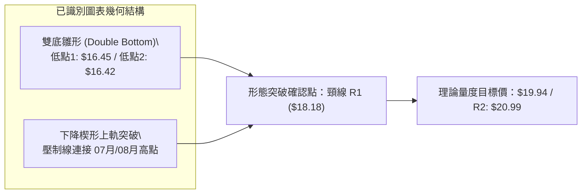

#### 形態識別與信心度評估表

| 形態名稱 | 信心度 | 判斷依據（引用實際數據） | 完成度 | 目標價（附嚴謹計算式） |
|----------|--------|--------------------------|--------|------------------------|
| **雙重底雛形 (Double Bottom)** | **70%** | 兩次低點分別為 2026-09-13 收盤 $16.45 及 2026-09-20 收盤 $16.42，底部微幅抬升，且伴隨成交量自 62.2M 降至 46.4M 形成量縮蓄勢。 | **85%** | 形態高度 = 頸線 R1 ($18.18) - 底部低點 ($16.42) = $1.76。<br>量度突破目標價 = 頸線 ($18.18) + $1.76 = **$19.94**（高度接近 MA50 $19.81 及斐波 78.6% $19.35）。 |
| **超跌下降楔形突破** | **65%** | 連接 07-05 高點 $31.38、08-16 高點 $24.69 之下降趨勢線，已於 10 月初被日線突破（現價 $17.50 已站上 MA20 $16.83）。 | **90%** | 以楔形上軌突破點推算，第一阻力位直接鎖定 **R1: $18.18**，進一步延伸鎖定 **R2: $20.99**。 |
| **頭肩底結構 (Inverted H&S)** | **30%** | 左肩 $16.45、頭部 $10.52 (52W低點)、右肩 $16.42 | **未成形** | *數據不足，信心度 < 50%，依規則不予採納，僅做指標型解讀。* |

### 🕯️ 重要K線形態分析

| 週期/月份 | 收盤價 | K線形態名稱 | 專業技術解讀 | 訊號 |
|-----------|--------|-------------|--------------|------|
| **2026-05** | $51.14 | 長上影流星線 (Shooting Star) | 衝高 $51.76 後遭天量派發，留極長上影線，主力出貨見頂確立 | 🔴 |
| **2026-06** | $32.22 | 大陰實體斷頭鍘 (Bearish Marubozu) | 跌破所有短期均線，週量爆出 100.6M 歷史巨量，確認中期熊市 | 🔴 |
| **2026-09-13** | $16.45 | 低檔錘頭線 (Hammer) | 探底至年內波段極低點後引發強烈買盤下影線，RSI 觸及 10.0 極限超賣 | 🟢 |
| **2026-09-20** | $16.42 | 晨星十字星 (Doji Star) | 縮量至 46.4M，多空處於極度平衡，確認 $16.40 附近具備高支撐買力 | 🟢 |
| **2026-09-27** | $17.43 | 多頭穿頭破腳 (Bullish Engulfing) | 實體大陽線收復前兩週失地，MACD 柱狀圖由負翻正至 +0.272 | 🟢 |
| **2026-10-04** | $17.50 | 溫和放量紅K (Bullish Advance) | 企穩於短期均線之上，日量 14.93M 呈放量配合，確認底部成型 | 🟢 |

### 📉 ASCII 走勢形態示意圖

```
PL 雙底反彈與量度突破示意圖
──────────────────────────────────────────────────────────────────
價格 ($)
$20.99 ┤                                                [R2 目標]
$19.94 ┤- - - - - - - - - - - - - - - - - - - - - - - - [形態量度目標]
$19.81 ┤                                           ───  [MA50 壓力]
$18.18 ┤────────── 頸線阻力 (R1) ─────────────────▲────
       │                                         ╱  ╲
$17.50 ┤                                       ●(現價)
$16.83 ┤──────────────── 中軌支撐 (MA20) ────────╱────
       │      ╲                             ╱
$16.45 ┤       ●(底 1: 09-13)              ╱
$16.42 ┤         ╲                      ●(底 2: 09-20)
       │           ╲__________________╱
       └──────────────────────────────────────────────────────────
         時間軸：2026-09-06   2026-09-13   2026-09-20   2026-10-05
──────────────────────────────────────────────────────────────────
```

---

## 4. 支撐與阻力

### 🗺️ 關鍵價位分布圖（Unicode）

本報告嚴格採用 OHLCV 聚類計算之核心阻力位（R1-R3）與支撐位（S1-S3），結合 52 週極值斐波那契回調結構，建構如下多空戰略防線：

```
╔══════════════════════════════════════════════════════════════════╗
║                  PL 價位結構分佈與成交密集圖                     ║
╠══════════════════════════════════════════════════════════════════╣
║ $51.76 ║ 52W High (0.0% Fib)                                    ║
║ $42.03 ║ 23.6% Fib 回調位                                       ║
║ $36.01 ║ 38.2% Fib 回調位                                       ║
║ $31.14 ║ 50.0% Fib 中樞關鍵分水嶺                                ║
║ $27.34 ║ MA200 長期趨勢防線                                      ║
║ $26.27 ║ 61.8% Fib 黃金回調位                                   ║
║ $25.53 ║████████████████████████████████║ 強阻力 R3 (+45.89%)   ║
║ $20.99 ║████████████████████            ║ 重要波段阻力 R2 (+19.94%)║
║ $19.81 ║ MA50 中期均線反壓位                                    ║
║ $19.35 ║ 78.6% Fib 深度回調壓制位                               ║
║ $18.18 ║████████████████████████        ║ 短線頸線阻力 R1 (+3.89%) ║
║ $18.08 ║ 布林通道上軌 (BB Upper)                                 ║
╠════════╬════════════════════════════════╬════════════════════════╣
║ $17.50 ╠════════════════════════════════╣ ◄ 現價 (Current Price) ║
╠════════╬════════════════════════════════╬════════════════════════╣
║ $16.83 ║ MA20 / 布林中軌生命線 (+4.00% 現價緩衝)                 ║
║ $15.60 ║▓▓▓▓▓▓▓▓▓▓▓▓▓▓▓▓▓▓▓▓▓▓▓▓        ║ 近期核心支撐 S1 (-10.86%)║
║ $15.58 ║ 布林通道下軌 (BB Lower)                                 ║
║ $11.97 ║████████████████████████████    ║ 次級波段強支撐 S2 (-31.60%)║
║ $10.52 ║████████████████████████████████║ 52W Low (100% Fib) S3  ║
╚══════════════════════════════════════════════════════════════════╝
```

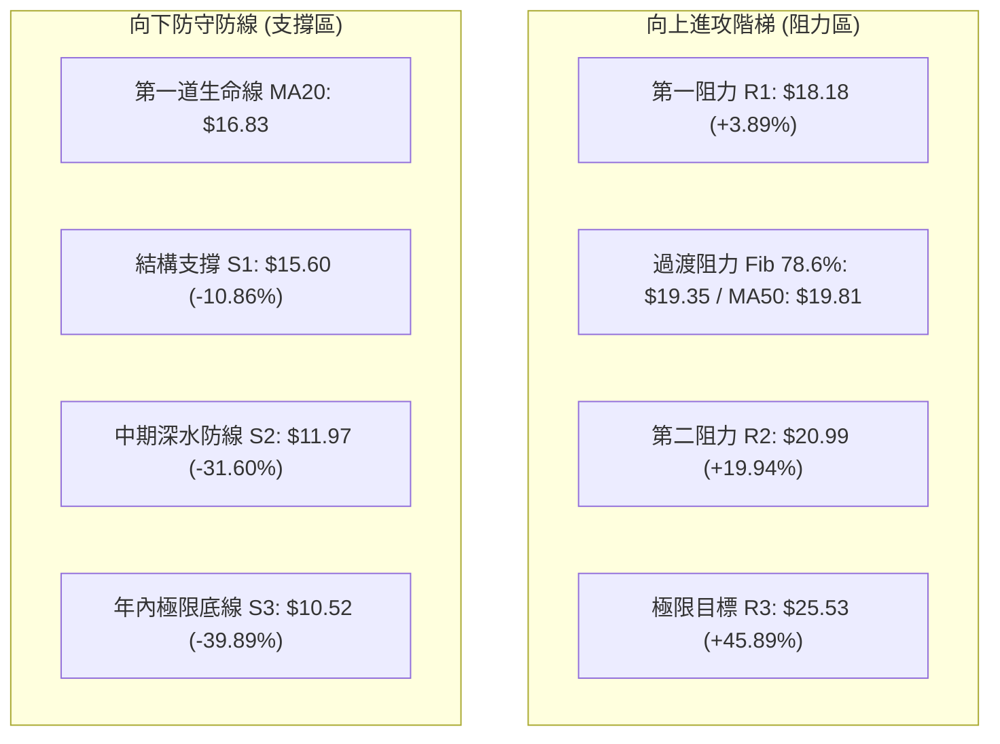

### 🚧 阻力位分析表

所有價位均嚴格取自 OHLCV 計算聚類：

| 阻力級別 | 價位 | 與現價差距 | 形成原因與籌碼特徵 | 突破難度 | 技術重要性 |
|----------|------|------------|--------------------|----------|------------|
| **R1** | **$18.18** | +3.89% | 近一年 9 月反彈高點聚類，與當前日線布林通道上軌（$18.08）形成強共振壓制區。 | 🟡 中等 | ★★★★☆<br>短線多空分水嶺，突破則確立雙底頸線破平。 |
| **R2** | **$20.99** | +19.94% | 2026 年 7 月下挫後的籌碼密集成交平台（07-26 收盤 $20.47、08-02 收盤 $20.48 聚類），且與 MA60（$20.46）重疊。 | 🔴 較高 | ★★★★★<br>中期反彈第一主要目標，解套賣壓集中。 |
| **R3** | **$25.53** | +45.89% | 2026 年 1-2 月橫盤平台以及 8 月中旬反彈頂部（08-16 收盤 $24.69 聚類），逼近 61.8% 斐波回調位（$26.27）。 | 🔴 極高 | ★★★★★<br>多頭能否反轉熊市的戰略天花板。 |

### 🛡️ 支撐位分析表

所有價位均嚴格取自 OHLCV 計算聚類：

| 支撐級別 | 價位 | 與現價差距 | 形成原因與防禦邏輯 | 守住機率 | 技術重要性 |
|----------|------|------------|--------------------|----------|------------|
| **S1** | **$15.60** | -10.86% | 近期日線回踩波段低點聚類，與布林下軌（$15.58）高度貼合，構成下檔第一道密集成交緩衝墊。 | 75% | ★★★★☆<br>短線多頭防禦底線，跌破則反彈失敗。 |
| **S2** | **$11.97** | -31.60% | 2025 年 11 月爆發拉升前的月線收盤起漲平台（2025-11 收盤 $11.90 聚類），機構底倉成本區。 | 85% | ★★★★★<br>中期空頭崩塌時的絕對價值防線。 |
| **S3** | **$10.52** | -39.89% | 52 週絕對低點（52W Low），空頭行情極限止跌點，100.0% 斐波那契基準位。 | 95% | ★★★★★<br>最後防線，跌破則打開無底深淵。 |

### 📐 斐波那契回調位分析

依據 52 週極值區間：高點 **$51.76**（0.0%）至低點 **$10.52**（100.0%），總落差高達 $41.24。

- **0.0% (52W High)**: $51.76
- **23.6% 回調位**: $42.03
- **38.2% 回調位**: $36.01
- **50.0% 回調位**: $31.14
- **61.8% 回調位**: $26.27
- **78.6% 回調位**: $19.35
- **100.0% (52W Low)**: $10.52

**現價定位與解讀**：
當前收盤價 **$17.50** 正精確處於 **78.6% 回調位 ($19.35)** 與 **100.0% 基準位 ($10.52)** 之間的「超跌低位築底區間」。
- 向上看，$19.35 是極其關鍵的多空分水嶺，此價位與中期均線 MA50（$19.81）及阻力 R2（$20.99）形成密集的「空頭反壓帶（$19.35 - $20.99）」。
- 向下看，現價距離 100.0% 底部 ($10.52) 僅剩 $6.98，下行空間受限，斐波那契極限回撤特性表明此處風險收益比極佳，具備強烈的均值回歸拉力。

---

## 5. 技術指標深度解讀

### 🎛️ 指標訊號總覽

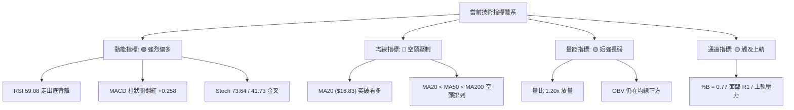

### 📈 移動平均線排列分析

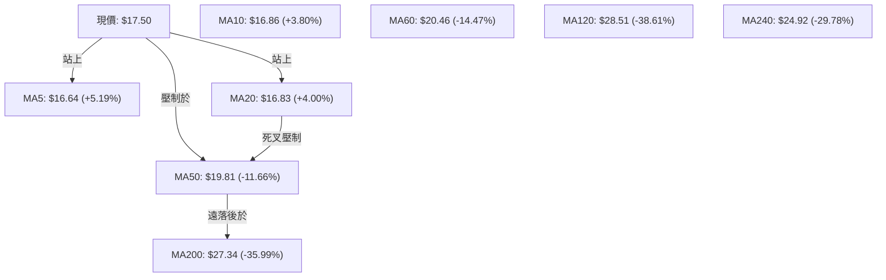

均線系統整體呈現 **典型大級別空頭排列（MA20 < MA50 < MA200）**，但極短期（MA5、MA10、MA20）已在 $16.64 - $16.86 區間高度纏繞並由下向上發散：
1. **短均線向上穿越**：現價 $17.50 已全面凌駕於 MA5 ($16.64)、MA10 ($16.86) 與 MA20 ($16.83) 之上，短線正乖離率分別為 +5.19%、+3.80%、+4.00%，短線多頭掌控主動權。
2. **中期空頭反壓**：MA50 位於 $19.81（距現價 -11.66%），MA60 位於 $20.46（距現價 -14.47%），構成多頭反彈的第一阻力屏障。
3. **長期趨勢分水嶺**：MA200 位於 $27.34（距現價 -35.99%），MA120 位於 $28.51，意味著若無超級基本面利多催化，股價在中期內難以一次性修復年線級別的技術創傷。

### 📉 RSI(14) 分析與背離判斷

當前日線 RSI(14) 數值為 **59.08**，處於中性健康偏強區間（30-70 常態區，未觸及 70 超買）。

```
RSI(14) 強度儀表：
0       30                  59.08        70          100
├───────┼─────────────────────┼──────────┼───────────┤
[ 極度超賣 ]     [ 中性盤整區 ]     ▲    [ 超買警戒 ]  [ 極度超買 ]
                                (當前位置)
進度條: ██████████████░░░░░░░░░░ 59.08%
```

#### 🔍 關鍵背離判定：明確確認「底背離 (Bullish Divergence)」！

```
價格走勢 vs RSI 走勢背離圖：
價格:  09-06 ($18.12) ──► 09-13 ($16.45) ──► 09-20 ($16.42)  【價格創新低或走平】
                                                    ▼
RSI:   09-06 (10.7)  ──► 09-13 (10.0)   ──► 09-20 (24.4)   【RSI 暴拉抬升】
       (極限超賣)          (底1)              (底2 強力墊高) ──► 10-04 (59.1)
```

**結論**：在 2026 年 9 月中旬，股價自 $18.12 下探至 $16.42 時，RSI 指標未跌破前低，反而在極低點由 10.0 爆發性抬升至 24.4，隨後持續上衝至 59.08，構築了極其顯著且教科書級別的「**雙重底背離（Bullish Divergence）**」。這代表空頭摜壓力道已實質竭盡，賣盤衰退，多頭動能正在急劇聚集。

### 📊 MACD(12/26/9) 訊號解讀

- **MACD DIF 線**: -0.973
- **Signal DEA 線**: -1.230
- **MACD Histogram 柱狀圖**: **+0.258** (持續放大)

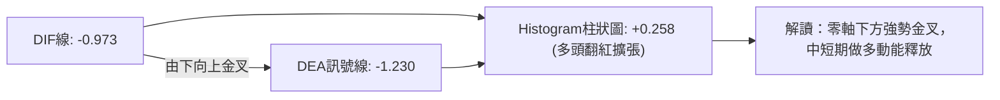

從週線級別來看，MACD 柱狀圖在 2026-06-14 曾達到最悲觀的 -1.972，隨後在 9 月下旬收斂至 -0.056，並在 2026-09-27 正式翻紅為 +0.272，最新一週維持在 **+0.258**。日線與週線的 MACD 呈現**多時框共振翻紅**，證實反彈具有較高的持續性。

### 📦 布林通道分析

當前布林通道（20日參數，2倍標準差）數據：
- **布林上軌 (BB Upper)**: **$18.08**
- **布林中軌 (MA20)**: **$16.83**
- **布林下軌 (BB Lower)**: **$15.58**
- **帶寬 (Bandwidth)**: ($18.08 - $15.58) / $16.83 = 14.85% (帶寬處於低位壓縮後初次擴張)
- **%B 指標**: **0.77**

```
PL 布林通道位置示意圖：
$18.08 ┤══════════════════════════════════════════════════ 上軌
       │                      ▲ 現價 $17.50 (%B = 0.77)
$17.50 ┤──────────────────────●───────────────────────────
       │
$16.83 ┤────────────────────────────────────────────────── 中軌 (MA20)
       │
$15.58 ┤══════════════════════════════════════════════════ 下軌
```

**解讀**：現價 $17.50 處於中軌（$16.83）與上軌（$18.08）之間，%B 為 0.77，顯示價格處於多頭攻擊波段。然而，上方距上軌僅剩 $0.58（+3.3%），且阻力 R1（$18.18）與上軌重疊。若未能伴隨顯著擴量衝破 $18.08 - $18.18，短線可能在上軌遇阻回踩中軌 $16.83 尋求支撐。

### 💹 成交量分析（量價配合度）

- **最新成交量**: **14,929,200** 股
- **20日均量**: **12,454,045** 股（**量比 1.20x**，大於 1 呈現放量）
- **50日均量**: **9,008,932** 股（量比 1.66x）
- **能量潮 OBV 走勢**: OBV < MA（顯示長期累積量能尚未扭轉）

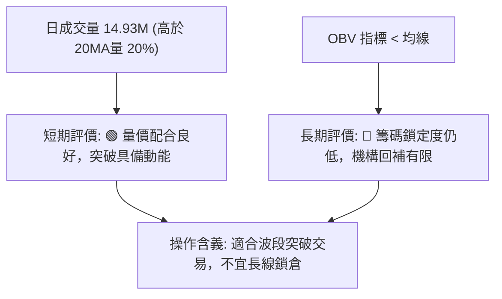

**量價綜合研判**：日線維度在突破 $16.83 中軌時展現了 1.20 倍的溫和放量，量價配合健康；但週成交量維持在 52M-56M 水平，相較於 6 月崩跌時單週破億股（100.62M）的套牢盤，當前量能僅屬「存量資金自救修復」，未見大規模機構新錢進場狂買，因此行情定義為**波段估值修復反彈**。

---

## 6. 動能與波動率

### ⚡ 動能評估四象限

評估 PL 在當前「動能強度」與「波動率」維度中的市場定位：

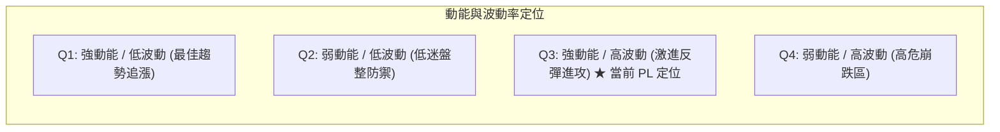

| 象限 | 動能強度 | 波動率 | 當前狀態 | 策略應對與評價 |
|------|----------|--------|----------|----------------|
| **Q1** | 強 | 低 | — | 穩健加碼，享受主升浪 |
| **Q2** | 弱 | 低 | — | 觀望休整，等待方向選擇 |
| **Q3** | **強 (日線短線)** | **高 (Beta 2.11)** | **✓ (當前 PL)** | **激進高收益高風險，必須嚴設止損，採波段進出策略** |
| **Q4** | 弱 | 高 | — | 6-7 月時的崩跌期，嚴禁抄底 |

### 📊 ATR 波動率分析與止損設定

- **ATR(14)**: **$0.91**
- **ATR 佔比**: **5.21%**（每日正常震盪波幅高達 5% 以上，屬於高波動品種）

**止損與風控距離測算**：
1. **保守型交易者（2.0 × ATR）**：
   - 止損緩衝距離 = 2.0 × $0.91 = **$1.82**
   - 參照現價 $17.50，技術止損位應設於 **$15.68**（高度接近 S1 支撐 $15.60）。
2. **激進型交易者（1.0 × ATR）**：
   - 止損緩衝距離 = 1.0 × $0.91 = **$0.91**
   - 參照現價 $17.50，止損位應設於 **$16.59**（剛好保護在 MA20 $16.83 之下）。

### 📐 Beta 與市場相關性

- **Beta 係數**: **2.108**
- **空頭回補天數 (Short Ratio)**: **2.91 天**
- **空頭佔流通盤比率 (Short % Float)**: **9.7%**

**專業解讀**：
1. **高彈性特徵**：Beta 高達 2.108，代表 PL 的波動幅度約為 S&P 500 指數的 2.1 倍。在大盤多頭環境下，該股具備極高的超額收益（Alpha）潛力；但反之若市場遭遇流動性收縮，回撤幅度亦會加倍。
2. **空頭軋空（Short Squeeze）潛力**：Short % Float 達 9.7%，且 Short Ratio 為 2.91 天。一旦價格放量有效突破頸線 R1（$18.18），可能誘發空頭停損回補潮，進一步將股價加速推升至 R2（$20.99）。

---

## 7. 多時框架總結

### 📋 時框架評分表

| 時框架 | 趨勢方向 | 動能狀態 | 均線排列 | 形態特徵 | 綜合評分 | 操作建議 |
|--------|----------|----------|----------|----------|----------|----------|
| **長期 (月線)** | 🔴 強空頭 | 弱勢超跌反彈 | 破位空頭 | 歷史高位巨幅派發後縮量 | 30/100 | 長期投資者保持觀望，等待結構反轉 |
| **中期 (週線)** | 🟡 震盪築底 | 🟢 RSI 底背離修復 | MA50 下方壓制 | $16.40 雙底築底結構 | 55/100 | 波段交易者可逢低建倉，防守 $15.60 |
| **短期 (日線)** | 🟢 多頭反彈 | 🟢 MACD 翻紅 | 突破 MA20 | 放量衝擊布林上軌與 R1 | 65/100 | 順勢進場做多，鎖定短線目標 R1/R2 |

### 🔲 綜合訊號矩陣

```
時框架訊號一致性評估矩陣：
┌───────────┬──────────────┬──────────────┬──────────────┬──────────────┐
│  時框架   │   趨勢指標   │   動能指標   │   量能配合   │  一致性結論  │
├───────────┼──────────────┼──────────────┼──────────────┼──────────────┤
│ 短期 (日) │ 🟢 MA20 站上 │ 🟢 RSI 底背離│ 🟢 量比 1.2x │ 🟢 短期做多  │
│ 中期 (週) │ 🔴 MA50 壓制 │ 🟢 MACD 翻紅 │ 🟡 週量中性  │ 🟡 區間反彈  │
│ 長期 (月) │ 🔴 MA200偏離 │ 🔴 長期超賣  │ 🔴 OBV 疲弱  │ 🔴 熊市結構  │
└───────────┴──────────────┴──────────────┴──────────────┴──────────────┘
```

### ⚖️ 多時框收斂結論（依規則 14 嚴格收斂）

1. **行情性質判定**：
   當前 PL 的 14 日 ADX 為 **27.83 (>25)**，且 -DI (24.88) > +DI (21.14)。依據多時框收斂規則，本標的目前技術上屬於**趨勢行情**（中長期空頭趨勢下的反彈波段），而非低波動盤整。
2. **主導時框與衝突取捨**：
   - 依優先級規則：趨勢行情以中長期（週線/MA50、MA200）方向為主，日線僅用來尋找精確進場時機與風控點。
   - 週線與日線訊號收斂：中長期大趨勢壓制依然存在（MA50 $19.81、MA200 $27.34 遙遙在上），因此**不能將當前走勢定義為全面長牛反轉**。但日線出現強烈底背離、突破 MA20 以及量比放大，構成了高品質的**中級超跌反彈修復浪**。
3. **唯一定向結論**：
   **【中性偏多（波段反彈操作）】**——以日線多頭動能為出發點，把握向上挑戰 R1 ($18.18) 及 R2 ($20.99) 的反彈機會；同時必須將停損防線死守在 S1 ($15.60) / MA20 ($16.83)，嚴防空頭大趨勢重啟。此結論完全貫徹第 1、2、5 章之評估，並作為第 8 章策略制定之唯一基石。

---

## 8. 交易策略建議

### 🗺️ 策略決策流程圖

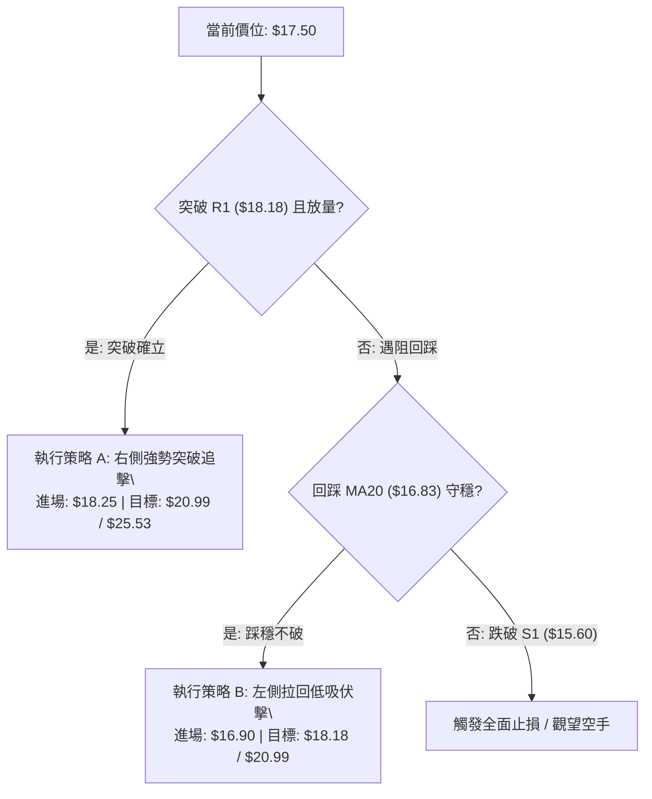

### 🧭 策略路由

**當前主策略方向 = 【中性偏多波段反彈（依評分卡 47/100 確立區間反彈操作）】**
由於綜合評分處於 40–60 區間且偏向多頭反彈動能（RSI 底背離 + MACD 翻紅），主推多頭反彈交易策略，空頭僅列為反轉跌破風險觸發提示。

### 🎯 價格情境階梯（Price Scenarios）

所有價位均取自前述計算之核心數據：

| 觸發條件 | 下一目標 | 後續延伸 | 情境技術含義 |
|----------|----------|----------|--------------|
| **向上放量突破 R1 ($18.18)** | **R2 ($20.99)** | **R3 ($25.53)** | 雙底頸線突破確立，中級反彈主升浪開啟 |
| **於 $16.83 - $18.08 區間震盪** | $18.08 (BB上軌) | $16.83 (BB中軌) | 布林通道內蓄勢洗盤，消化上檔浮額 |
| **有效跌破 S1 ($15.60)** | **S2 ($11.97)** | **S3 ($10.52)** | 反彈宣告失敗，空頭主趨勢重啟破底探深 |

### 📊 情境機率分佈

| 情境劇本 | 發生機率 | 主要技術指標依據 |
|----------|----------|------------------|
| **情境一：突破反彈上行** | **55%** | RSI(14) 底背離強烈、MACD 柱狀圖翻紅擴張 (+0.258)、日量比 1.20x 溫和放量。 |
| **情境二：區間窄幅震盪** | **30%** | 面臨布林上軌 ($18.08) 及 R1 ($18.18) 雙重重壓，ADX -DI 仍大於 +DI，上方需時間換取空間。 |
| **情境三：反轉回落破底** | **15%** | 均線長期空頭排列，OBV 尚未有效修復，若大盤重挫可能引發流動性踩踏。 |

### 🟢 主策略詳情

本報告為交易者量身定制兩套精確執行方案：**策略 A（右側突破追擊）** 與 **策略 B（左側拉回低吸）**。

| 策略要素 | 策略 A（右側突破頸線策略） | 策略 B（左側支撐低吸策略） |
|----------|----------------------------|----------------------------|
| **適用類型** | 動量突破型交易者 | 價值均值回歸型交易者 |
| **進場條件** | 日線收盤放量突破 R1 ($18.18)，次日確認 | 現價回踩 MA20 ($16.83) 出現下影線企穩 |
| **精確進場價** | **$18.25** | **$16.90** |
| **第一目標 (T1)** | **$20.99** (阻力位 R2，+15.01%) | **$18.18** (阻力位 R1，+7.57%) |
| **第二目標 (T2)** | **$25.53** (阻力位 R3，+39.89%) | **$20.99** (阻力位 R2，+24.20%) |
| **嚴格止損價** | **$16.80** (跌破 MA20 支撐，-7.95%) | **$15.55** (跌破 S1 及布林下軌，-7.99%) |
| **風險報酬比 (R:R)** | **T1 達成時 1 : 1.89 ｜ T2 達成時 1 : 5.02** | **T1 達成時 1 : 0.95 ｜ T2 達成時 1 : 3.03** |
| **模型勝率預估** | **60%** | **55%** |
| **建議倉位** | **總資金之 10% - 15%** | **總資金之 8% - 10%** |

### 🔴 反向風險觸發點（對沖與風控提示）

若出現以下訊號，多頭交易架構立即失效，需無條件停損離場或啟動反向避險：
1. **收盤價跌破 $15.60 (S1)**：意味著雙底頸線完全失效，股價將直奔 S2 ($11.97)。
2. **MACD 柱狀圖重新轉負**：若日線 MACD 柱狀圖在零軸下方再度由紅翻綠，代表背離反彈動能衰竭。
3. **帶量跌破布林下軌 $15.58**：布林帶寬重新向下開口，將開啟新一輪主跌浪。

### ⭐ 整體訊號強度評星

```
╔══════════════════════════════════════════════════════════════════╗
║                     PL 交易訊號強度評星                          ║
╠══════════════════════════════════════════════════════════════════╣
║ 做多訊號強度：   ★★★☆☆  (3.5/5 星 - 底背離支撐強烈，唯受制均線) ║
║ 做空訊號強度：   ★★☆☆☆  (2.0/5 星 - 底部動能聚集，當前放空盈虧比差)║
║ 整體技術可信度： ★★★★☆  (4.0/5 星 - 支撐阻力結構清晰，背離顯著)  ║
╚══════════════════════════════════════════════════════════════════╝
```

---

## 9. 風險提示與監控

### ✅ 關鍵監控指標 Checklist

```
╔══════════════════════════════════════════════════════════════════╗
║                   每日交易前關鍵監控清單 (Checklist)             ║
╠══════════════════════════════════════════════════════════════════╣
║ [ ] 價格能否有效越過並站穩頸線 R1 ($18.18)？                     ║
║ [ ] 日成交量是否持續大於 20 日均量 (12.45M 股)？                 ║
║ [ ] RSI(14) 能否維持在 50 中軸之上，持續向 70 推進？            ║
║ [ ] MACD 柱狀圖是否持續維持在正值區間 (+0.258 以上擴張)？       ║
║ [ ] 日線布林下軌 $15.58 與 S1 $15.60 是否遭受威脅？              ║
║ [ ] 大盤波動度 (VIX) 與航太防務板塊資金流向是否支持高 Beta 品種？║
╚══════════════════════════════════════════════════════════════════╝
```

### ⚠️ 風險場景分析

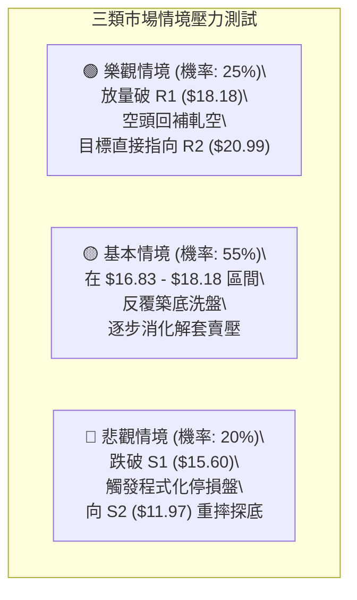

### 🛡️ 風險管理重要提醒

1. **高 Beta 波動特徵管理**：PL 之 Beta 值為 2.108，ATR 高達 $0.91（佔股價 5.21%）。極端波動容易觸發洗盤，交易者必須適度縮小單筆開倉規模（建議單筆虧損不超過總帳戶資金之 1% - 1.5%），避免使用高槓桿工具。
2. **機構主導與籌碼集中度**：機構持股佔比高達 82.9%，顯示主力籌碼具備極強的定價權。6-7 月的破億拋盤顯示部分大資金仍在離場，當前反彈需密切觀察是否為機構「拉高出貨」的二次誘多。未見 OBV 明顯翻正前，嚴禁重倉長抱。
3. **基本面虧損風險**：淨利率為 -95.1%，本益比為負值。技術面反彈主要由營收高成長（YoY +58.1%）與超跌修復預期驅動，缺乏實質獲利安全邊際支撐，因此所有交易必須「完全以技術點位為進退依據，不可與股票談戀愛」。

---

## 📋 報告總結

```
╔══════════════════════════════════════════════════════════════════╗
║                   PL 技術分析報告總結面板                        ║
╠══════════════════════════════════════════════════════════════════╣
║ 報告日期：    2026-10-05                                         ║
║ 當前收盤價：  $17.50                                             ║
║ 技術評分：    47/100                                             ║
║ 分析評級：    ⚖️ 中性偏多（超跌反彈階段，波段操作）              ║
╠══════════════════════════════════════════════════════════════════╣
║ 關鍵技術結論：                                                   ║
║ ├─ 長期趨勢： 🔴 熊市格局，MA200 ($27.34) 下方深度承壓           ║
║ ├─ 中期趨勢： 🟡 築底震盪，週線 RSI 10.0 極限超賣後強勁回升      ║
║ ├─ 短期趨勢： 🟢 突破 MA20 ($16.83)，RSI 明確底背離，MACD 翻紅   ║
║ ├─ 關鍵阻力： R1: $18.18 ｜ R2: $20.99 ｜ R3: $25.53             ║
║ ├─ 關鍵支撐： S1: $15.60 ｜ S2: $11.97 ｜ S3: $10.52             ║
║ └─ 分析師共識：華爾街平均目標價 $33.40 (最低 $22.00 / 最高 $50.00)║
╠══════════════════════════════════════════════════════════════════╣
║ 最優策略組合導航：                                               ║
║ 1. 🥇 最佳機會（突破追擊）：突破 $18.18 後進場，目標 $20.99, R:R 1.89║
║ 2. 🥈 次選機會（拉回低吸）：回踩 $16.90 守穩進場，防守 $15.55    ║
║ 3. 🥉 保守選擇（等待觀望）：等待站上 MA50 ($19.81) 確立反轉再進  ║
╚══════════════════════════════════════════════════════════════════╝
```

---

> ⚠️ **免責聲明**：本報告為技術分析研究成果，所有引述之支撐位、阻力位及技術指標均基於歷史 OHLCV 價格數據計算得出。本報告**僅供學術研究與投資策略參考**，**不構成任何要約、招攬或實質投資建議**。高 Beta 與未盈利成長型股票具備高度資本虧損風險，投資人應獨立評估自身風險承受能力並嚴格執行風控紀律。

---

*報告生成時間：2026-10-05 ｜ 數據來源：Yahoo Finance ｜ 分析框架：多時框技術分析體系 (MTFA)*