# PL 技術分析報告

> **報告日期**：2026-10-06 ｜ **語言**：繁體中文 ｜ **數據來源**：Yahoo Finance ｜ **當前價格**：$17.36

---

## 目錄

| 章節 | 內容 |
|------|------|
| [1. 技術面概覽](#1-技術面概覽) | 訊號儀表板、核心指標、評分卡 |
| [2. 趨勢分析](#2-趨勢分析) | 多時框趨勢、長中短期走勢 |
| [3. 圖表形態分析](#3-圖表形態分析) | 形態識別、K線組合、目標價 |
| [4. 支撐與阻力](#4-支撐與阻力) | 關鍵價位、斐波那契回調 |
| [5. 技術指標深度解讀](#5-技術指標深度解讀) | MA/RSI/MACD/布林/成交量 |
| [6. 動能與波動率](#6-動能與波動率) | 動能評估、ATR、Beta |
| [7. 多時框架總結](#7-多時框架總結) | 時框架評分矩陣 |
| [8. 交易策略建議](#8-交易策略建議) | 多空策略、風險報酬比 |
| [9. 風險提示與監控](#9-風險提示與監控) | 監控指標、風險場景 |

---

## 1. 技術面概覽

### 🎯 技術訊號儀表板

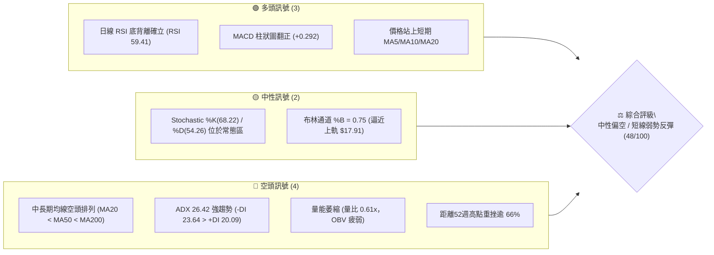

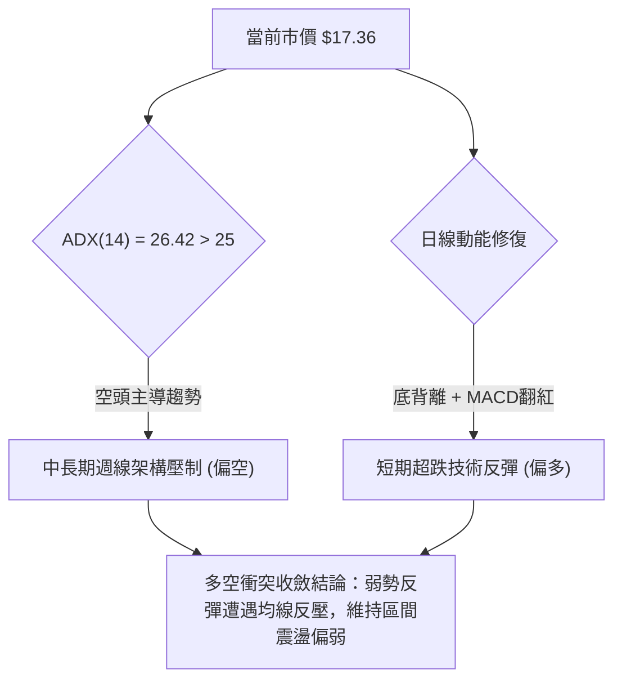

### 📊 核心指標速覽表

| 指標類別 | 指標名稱 | 當前數值 | 訊號 | 解讀 |
|----------|----------|----------|------|------|
| **價格** | 當前收盤價 | $17.36 | 🟡 | 位於52週區間 16.6% 低位，短線脫離波段低點 |
| **均線** | MA20 | $16.79 | 🟢 | 價格站上20日均線 (+3.40%)，短線取得支撐 |
| **均線** | MA50 | $19.75 | 🔴 | 價格低於50日均線 (-12.10%)，中期反壓沉重 |
| **均線** | MA200 | $27.34 | 🔴 | 遠低於200日牛熊分界線 (-36.50%)，長期空頭結構 |
| **動能** | RSI(14) | 59.41 | 🟢 | 自超賣區回升至中性偏強區間，日線呈現明確底背離 |
| **動能** | MACD Hist | +0.292 | 🟢 | MACD(-0.866) 突破 Signal(-1.157)，多頭柱狀體擴張 |
| **趨勢** | ADX / DMI | 26.42 | 🔴 | ADX>25 處於趨勢行情，-DI(23.64) > +DI(20.09) 空方控盤 |
| **波動** | ATR(14) | $0.91 | 🟡 | 佔現價 5.26%，單日波動度仍處於中高水平 |
| **量能** | 成交量比 | 0.61x | 🔴 | 6.78M vs 20MA 11.19M，反彈伴隨縮量，買盤動能不足 |

### 🏆 技術評分卡

```
╔══════════════════════════════════════════════════════════════════╗
║                   技術評分卡 — PL (2026-10-06)                   ║
╠══════════════════════════════════════════════════════════════════╣
║ 趨勢強度 (ADX/DMI)  ███████░░░░░░░░░░░░░  35/100  🔴 空頭控盤    ║
║ 動能指標 (RSI/MACD) ████████████░░░░░░░░  60/100  🟢 底背離修復  ║
║ 支撐穩定度 (S1/S2)  ██████████░░░░░░░░░░  50/100  🟡 $15.60築底  ║
║ 成交量配合 (OBV/VOL)██████░░░░░░░░░░░░░░  30/100  🔴 縮量反彈    ║
║ 形態完整度 (雙底型) ████████████░░░░░░░░  60/100  🟡 弱雙底構築  ║
║ 均線排列 (空頭排列) ███████░░░░░░░░░░░░░  35/100  🔴 MA20<50<200 ║
╠══════════════════════════════════════════════════════════════════╣
║ 綜合技術評分        █████████░░░░░░░░░░░  48/100  ⚖️ 中性偏空    ║
╚══════════════════════════════════════════════════════════════════╝
```

---

## 2. 趨勢分析

### 🌐 多時框趨勢分析

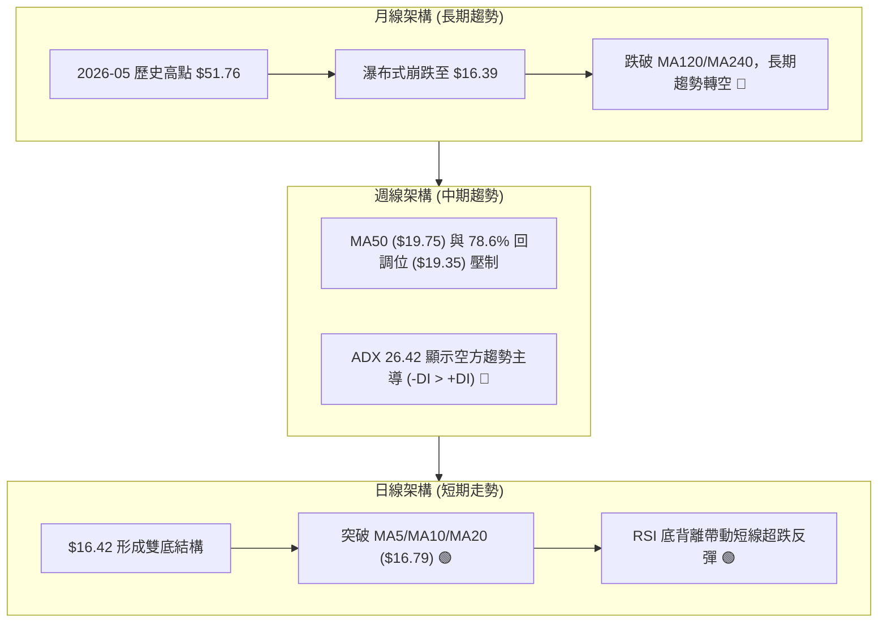

### 📈 長期趨勢 — 12個月走勢圖（Unicode）

```
PL 月線走勢圖（2025-11 至 2026-10）
價格軸 ($)
$52 ┤                                      ● $51.14 (2026-05 高點 $51.76)
$46 ┤
$40 ┤                                  ● $36.97
$34 ┤                                          ● $33.13
$28 ┤                          ● $27.95
$22 ┤                  ● $24.97    ● $24.14
$16 ┤          ● $19.72                                ● $20.48    ● $17.36 (現價)
$10 ┤  ● $11.90                                            ● $19.85    ● $16.39
    └─────────────────────────────────────────────────────────────────────────────
       11/25   12/25   01/26   02/26   03/26   04/26   05/26   06/26   07/26   08/26   09/26   10/26
```

#### 走勢特徵分析表格

| 階段區間 | 週期特徵 | 起迄價格 | 漲跌幅 | 量價配合度與技術評估 |
|----------|----------|----------|--------|----------------------|
| **2025-11 ~ 2026-05** | 主升浪噴出段 | $11.90 → $51.14 | +329.7% | 爆量突破，均線多頭發散，月線 RSI 觸及 83.2 極度超買 |
| **2026-05 ~ 2026-07** | 頂部崩跌破位段 | $51.14 → $20.48 | -59.9% | 頂部巨量長黑殺多，單週成交量逾 1 億股，跌破所有短期均線 |
| **2026-07 ~ 2026-08** | 中繼弱勢反彈 | $20.48 → $24.69 | +20.6% | 縮量反抽，反彈受制於 MA50 與頸線，無力延續 |
| **2026-08 ~ 2026-09** | 二次下殺尋底 | $24.69 → $16.39 | -33.6% | 破位下挫，週線 RSI 跌至極端低點 10.0，確立空頭主跌結構 |
| **2026-09 ~ 2026-10** | 超跌築底修復 | $16.39 → $17.36 | +5.9% | 出現日線底背離，於 $16.42 探底回升，短線進入橫盤整理 |

### 📊 中期趨勢（週線分析）

```
中期走勢阻力與支撐架構示意圖：
$25.53 ══════════════════════════════════ [R3: 8月中繼平台高點 / 波段強阻力]
$20.99 ---------------------------------- [R2: 7月破位反抽頸線 / MA60 ($20.32)]
$19.75 ~ $19.35 ........................ [MA50 / 78.6% 斐波那契強壓]
$18.18 ────────────────────────────────── [R1: 近期下行通道上軌阻力]
$17.36 ◄───── [當前市價 $17.36]
$16.79 ┄┄┄┄┄┄┄┄┄┄┄┄┄┄┄┄┄┄┄┄┄┄┄┄┄┄┄┄┄┄┄┄┄┄ [MA20 / 布林中軌]
$15.60 ══════════════════════════════════ [S1: 近期波段雙底頸線支撐]
$11.97 ---------------------------------- [S2: 2025年起漲平台強支撐]
$10.52 ══════════════════════════════════ [S3: 52週歷史低點 / 結構底]
```

### ⚡ 趨勢強度評估（ADX 解讀）

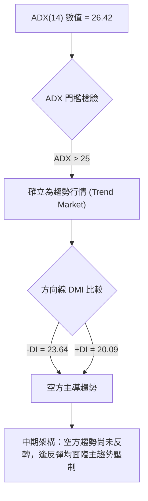

#### ADX 趨勢強度等級對照表

| 數值區間 | 趨勢等級 | PL 當前讀數 (26.42) 評估 | 策略意涵 |
|----------|----------|--------------------------|----------|
| 00 – 20 | 無趨勢 / 盤整 | 否 | 適合震盪指標區間操作 |
| 20 – 25 | 趨勢形成中 | 否 | 突破前夕，準備順勢操作 |
| **25 – 50** | **強趨勢行情** | **✓ 當前狀態 (26.42，-DI領先)** | **順勢空方控盤，逆勢做多僅限短線波段** |
| 50 – 75 | 極強主升/主跌 | 否 | 趨勢極端加速，防範竭盡背離 |

---

## 3. 圖表形態分析

### 🔍 形態識別系統

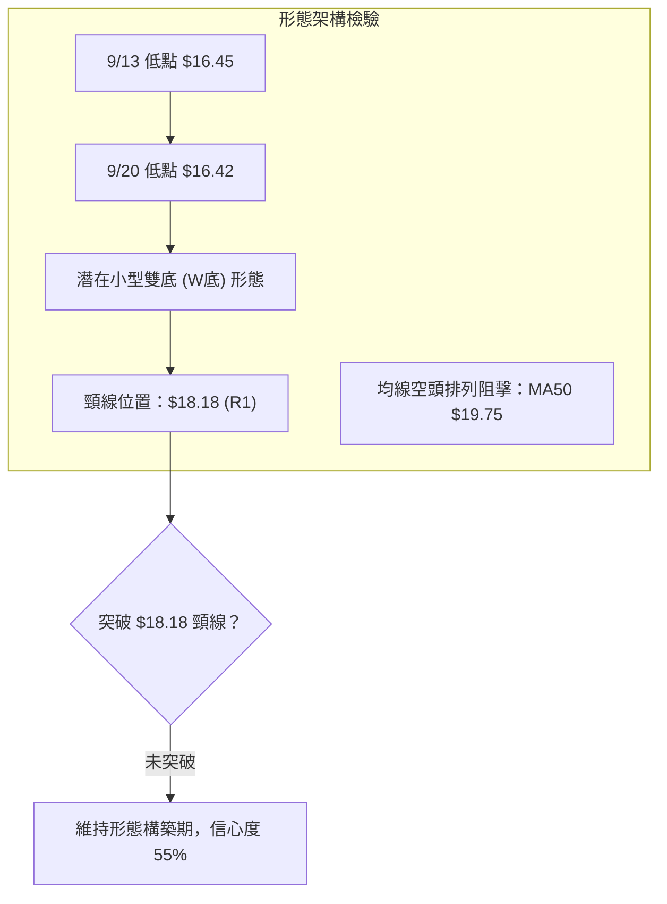

#### 圖表形態信心度評估表

| 形態名稱 | 信心度 | 判斷依據（引用數據） | 完成度 | 目標價（附精確計算式） |
|----------|--------|----------------------|--------|------------------------|
| **小型雙底 (W-Bottom)** | **55%** | 兩次低點分別為 $16.45 (9/13) 與 $16.42 (9/20)，支撐落於 S1 $15.60 上方 | 70% | 頸線 R1 $18.18 + 形態高度 ($18.18 - $16.42 = $1.76) = **$19.94** (逼近 MA50 $19.75) |
| **下降通道 (Down Channel)** | **75%** | 8月反彈高點 $24.69、9月反彈遇阻 $18.18，低點不斷墊低 | 85% | 通道下軌支撐測向 S1 $15.60，突破上軌目標看 R2 **$20.99** |
| **頭肩底形態** | **20%** | 目前僅有一處低點聚類，缺乏左肩與右肩結構 | 15% | 數據中未偵測到完整結構，不予推算 |

### 🕯️ 重要K線形態分析

| 日期 / 週別 | 收盤價 | K線形態名稱 | 形態特徵與技術解讀 | 多空訊號 |
|-------------|--------|-------------|--------------------|----------|
| **2026-09-13** | $16.45 | 長黑破底線 | 週成交量 62.20M，跌破所有短期均線，RSI 觸及 10.0 極限超賣 | 🔴 強烈空頭 |
| **2026-09-20** | $16.42 | 縮量十字星 (Doji) | 成交量萎縮至 46.45M，空方殺跌動能竭盡，探測下影線確立支撐 | 🟡 變盤信號 |
| **2026-09-27** | $17.43 | 破曉陽線 (Bullish Reversal) | 週漲幅 +6.15%，MACD柱翻正至 +0.272，日線級別底背離觸發 | 🟢 短線買訊 |
| **2026-10-04** | $17.50 | 窄幅整理小陽線 | 連續受阻於布林上軌與 $18.18 阻力，量能維持中性 | 🟡 震盪觀望 |
| **2026-10-11** | $17.36 | 縮量小陰線 | 量比大幅萎縮至 0.61x，面臨上方均線反壓呈現蓄勢狀態 | 🟡 短線滯漲 |

### 📉 ASCII 走勢形態示意圖

```
PL 日/週線小型雙底構築示意圖
價格
$20.00 ┤                                              [雙底推算目標: $19.94]
$19.00 ┤                                      ▲
$18.18 ┼─────────────────── 頸線 (R1) ─────────┼────── 突破頸線確認點
$17.36 ┤                                  ●(現價)
$17.00 ┤                              ╭──╯
$16.45 ┼───● (左底 9/13)            │
$16.42 ┼───────────────────● (右底 9/20) ╯
$15.60 ┴─────────────────── 波段支撐 S1 ───────────────────────────
       9/06      9/13     9/20      9/27     10/04    10/11
```

### 🎯 形態目標價計算

依據技術分析幾何測量規則，若當前於 $16.42 形成的雙底形態獲得確認：
1. **形態低點**：取兩底平均最低收盤點 $16.42。
2. **形態頸線**：近期反彈波段高點聚類 R1 = **$18.18**。
3. **形態垂直高度**：$18.18 - $16.42 = **$1.76**。
4. **理論突破最小目標價**：
   $$\text{頸線} + \text{垂直高度} = \$18.18 + \$1.76 = \mathbf{\$19.94}$$
   *驗證：此目標價精確共振於中期 MA50 ($19.75) 與 78.6% 斐波那契回調位 ($19.35) 壓力帶，具備高度技術邏輯性。*

---

## 4. 支撐與阻力

### 🗺️ 關鍵價位分布圖（Unicode）

```
PL 價位結構分布圖
═══════════════════════════════════════════════════════════════════
$51.76 ║██████████████████████████████████║ 52週歷史高點 (0.0% Fib)
$31.14 ║████████████████████████          ║ 50.0% 斐波那契強壓
$27.34 ║██████████████████████            ║ 200日長期牛熊線 (MA200)
$25.53 ║████████████████████              ║ 強阻力 R3 (波段高點聚類)
$20.99 ║████████████████                  ║ 中期阻力 R2 (反抽頸線聚類)
$19.75 ║██████████████                    ║ MA50 均線壓力位
$19.35 ║█████████████                     ║ 78.6% 斐波那契回調位
$18.18 ║████████████████████████          ║ 短線關鍵阻力 R1 (頸線/通道頂)
$17.36 ╠══════════════════════════════════╣ ◄ 當前收盤價 ($17.36)
$16.79 ║▓▓▓▓▓▓▓▓▓▓▓▓▓▓▓▓▓▓                ║ 短期支撐 MA20 / 布林中軌
$15.60 ║████████████████████              ║ 近期波段核心支撐 S1
$11.97 ║████████████████████████          ║ 強支撐 S2 (起漲平台聚類)
$10.52 ║██████████████████████████████████║ 52週歷史最低點 S3 (100.0% Fib)
═══════════════════════════════════════════════════════════════════
```

### 🚧 阻力位分析表

| 阻力級別 | 價位 | 形成原因 | 突破難度 | 重要性 |
|----------|------|----------|----------|--------|
| **R1** | **$18.18** | 近一年波段高點聚類、布林通道上軌 ($17.91) 附近、雙底頸線壓力 | 中等 | 🟢 短線多空分水嶺，站穩方能擴大反彈空間 |
| **R2** | **$20.99** | 近一年波段次高點聚類、MA60 ($20.32) 下彎反壓處 | 極高 | 🟡 中期強反壓，前期多頭套牢密集換手區 |
| **R3** | **$25.53** | 近一年波段高點聚類、MA120/MA240 均線重疊帶 | 極高 | 🔴 空頭防線核心，未站上此前長期空頭不變 |

### 🛡️ 支撐位分析表

| 支撐級別 | 價位 | 形成原因 | 守住機率 | 重要性 |
|----------|------|----------|----------|--------|
| **S1** | **$15.60** | 近一年波段低點聚類、布林下軌 ($15.66) 共振支撐 | 70% | 🟢 短線防守核心，失守則雙底失敗、續破底 |
| **S2** | **$11.97** | 2025年起漲波段低點聚類、密集成交帶支撐 | 85% | 🟡 中期關鍵防線，空頭深度回撤測試區 |
| **S3** | **$10.52** | 52週歷史低點 (100.0% 斐波那契極限) | 95% | 🔴 長期絕對多頭底線，破位將進入無底深淵 |

### 📐 斐波那契回調位分析

依據 52 週絕對極值區間 **$10.52 (52W Low) → $51.76 (52W High)** 精確計算之回調位如下：

| 回調比率 | 斐波那契價位 | 當前價位相對關係 | 技術意涵與結構解讀 |
|----------|--------------|------------------|--------------------|
| **0.0%** | $51.76 | 現價下方 -66.46% | 52週歷史最高點，超級雙頂出貨起跌點 |
| **23.6%** | $42.03 | 現價下方 -58.70% | 第一強回調位，破位後引發停損賣壓 |
| **38.2%** | $36.01 | 現價下方 -51.79% | 弱勢修正極限，此處跌破確認大級別崩盤 |
| **50.0%** | $31.14 | 現價下方 -44.25% | 多空平衡中軸線，目前已徹底轉為強壓力 |
| **61.8%** | $26.27 | 現價下方 -33.92% | 黃金分割回調線，共振於 MA200 ($27.34) |
| **78.6%** | $19.35 | 現價上方 +11.46% | **極深回調位**：目前現價 ($17.36) 壓制於此位下方 |
| **100.0%** | $10.52 | 現價上方 -39.40% | 52週最低點，整輪週期的起漲基石 |

**現價區間解讀**：
當前市價 **$17.36** 運行於 **78.6% 回調位 ($19.35)** 與 **100.0% 回調位 ($10.52)** 之間的極深回撤區。股價跌破 61.8% ($26.27) 且無法站回 78.6% ($19.35)，技術結構上屬於典型之「非理性主跌浪末端或深層震盪出清」，短線任何向上反彈至 $19.35 均將轉化為極強解套賣壓。

---

## 5. 技術指標深度解讀

### 🎛️ 指標訊號總覽

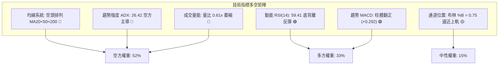

### 📈 移動平均線排列分析

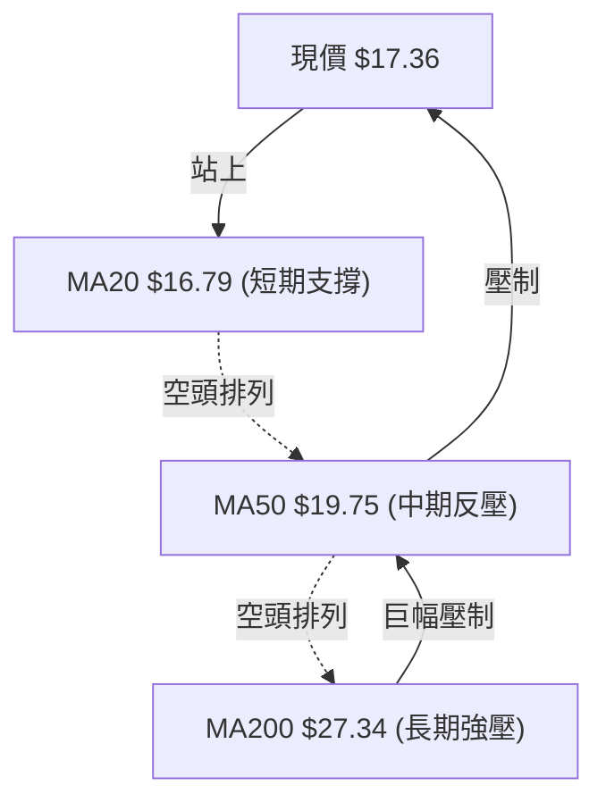

#### 各週期移動平均線深度解析表

| 均線名稱 | 當前數值 | 距現價幅差 | 均線斜率與形態 | 多空訊號 |
|----------|----------|------------|----------------|----------|
| **MA5** | $16.75 | +3.62% | 向上發散，短線推升力道尚存 | 🟢 短多 |
| **MA10** | $16.89 | +2.79% | 向上穿越 MA20，形成短期金叉 | 🟢 短多 |
| **MA20** | $16.79 | +3.40% | 走平轉微升，提供日線基礎支撐 | 🟢 中性偏多 |
| **MA60** | $20.32 | -14.55% | 持續陡峭下行，中期壓制顯著 | 🔴 空頭 |
| **MA120** | $28.37 | -38.80% | 加速向下，高檔籌碼全面套牢 | 🔴 空頭 |
| **MA200** | $27.34 | -36.50% | 下行態勢，確立處於技術性熊市 | 🔴 空頭 |
| **MA240** | $24.94 | -30.39% | 扣抵高位，長期趨勢全面空頭 | 🔴 空頭 |

### 📉 RSI(14) 分析

```
RSI(14) 動能指示器：當前值 59.41
0         30                    59.41          70        100
├─────────┼───────────────────────●─────────────┼──────────┤
│  超賣   │        常態波動區間 (中性偏多)       │   超買   │
└─────────┴─────────────────────────────────────┴──────────┘
進度條：[███████████████░░░░░░░░░░] 59.41%
```

#### 背離深度判定
- **訊號類型**：⚠️ **底背離 (Bullish Divergence) 確立**
- **詳細比對**：
  - **價格端**：2026-09-13 低點 $16.45，2026-09-20 再度下探 $16.42，價格創下波段新低。
  - **指標端**：2026-09-13 週線 RSI 為 10.0，2026-09-20 週線 RSI 逆勢抬升至 24.4，日線 RSI 隨後更急速拉升至 59.41。
- **結論**：指標在極端超賣區拒絕再破底，構成經典動能底背離，支撐了過去兩週自 $16.42 至 $17.36 的技術修復走勢。

### 📊 MACD(12/26/9) 訊號解讀

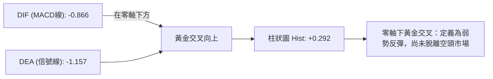

- **MACD 線**：-0.866
- **信號線 (Signal)**：-1.157
- **柱狀圖 (Histogram)**：+0.292 (連續 3 週擴張)
- **技術解讀**：雖然柱狀圖由負翻正並呈現正向擴張（+0.258 → +0.292），但整體雙線依然運行於零軸之下甚遠（-0.866），屬於典型的「水下金叉」，代表其本質仍是反彈行情而非主升浪，上行至零軸處常遇反壓。

### 📦 布林通道分析

```
PL 布林通道走勢示意圖（通道寬度帶）
$17.91 ┼─────────────────────────────────── 上軌 (Upper Band)
       │                              ╭─● 現價 $17.36 (%B = 0.75)
$16.79 ┼──────────────────────────────╯───── 中軌 (MA20)
       │                        ╭─╯
$15.66 ┴────────────────────────╯─────────── 下軌 (Lower Band)
```

- **帶寬與位置解讀**：
  - 通道上軌：**$17.91**
  - 通道中軌：**$16.79** (MA20)
  - 通道下軌：**$15.66**
  - **%B 指標 = 0.75**：價格已越過中軌 (0.50)，逼近上軌壓力區間。
  - **布林帶狀態**：通道開口呈現收斂態勢，代表波動率正在壓縮，現價逼近上軌 $17.91 與阻力 R1 $18.18，若量能無法爆發，極易在上軌遭遇壓制拉回中軌。

### 💹 成交量分析（量價配合度）

```
成交量量能比對：
今日成交量:   6,776,100  [██████░░░░] 60.5%
20日均量:    11,186,780  [██████████] 100%
50日均量:     8,879,990  [████████░░] 79.4%
```

- **量價背離現象**：最新成交量僅 6.78M，量比僅為 **0.61x**，遠低於 20 日均量。價格自 $16.42 反彈至 $17.36 的過程中，量能持續萎縮（週成交量自 85.36M 降至 6.78M），形成「價漲量縮」的量價背離。
- **OBV 趨勢**：OBV 指標持續位於其均線下方運行，顯示資金逢高減碼而非實質機構建倉，量能疲弱不支持突破性大行情。

---

## 6. 動能與波動率

### ⚡ 動能評估四象限

| 象限 | 動能狀態 | 波動率狀態 | PL 當前落點標註 | 風險特徵與操作評估 |
|------|----------|------------|-----------------|--------------------|
| **Q1 (最佳機會)** | 強 (陽線發散) | 低 (穩定推進) | ❌ | 最理想多頭主升段，趨勢明確穩定 |
| **Q2 (謹慎觀望)** | 弱 (量縮震盪) | 低 (帶寬收縮) | **✓ 當前所處位置 (Q2)** | **動能修復但量能不足，波動壓縮，以區間防守為主** |
| **Q3 (高風險高回報)**| 強 (爆量波動) | 高 (寬幅震盪) | ❌ | 頂部殺跌或主跌浪加速段 |
| **Q4 (避免進場)** | 弱 (趨勢向下) | 高 (下挫劇烈) | ❌ | 跌勢擴大且伴隨高波動，極易停損 |

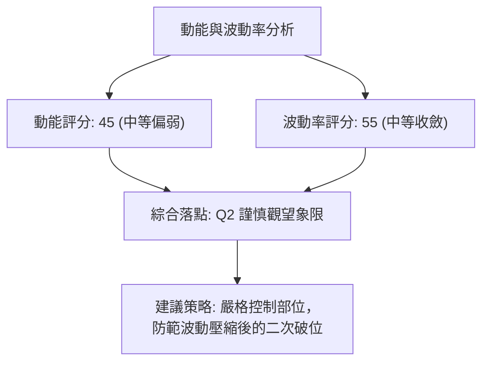

### 📊 ATR 波動率分析

- **ATR(14) 數值**：**$0.91**
- **ATR 佔比**：佔當前股價 $17.36 之 **5.26%**
- **止損距離建議**：
  - **極短線交易（1.0x ATR）**：安全緩衝區間為 $0.91，多頭止損位設於現價下方 $16.45。
  - **波段交易（1.5x ~ 2.0x ATR）**：安全緩衝區間為 $1.36 ~ $1.82，波段多單止損防守位應設於 **$15.54**（完全覆蓋 S1 關鍵支撐 $15.60）。

### 📐 Beta 與市場相關性

- **Beta 係數**：**2.17**
- **市場特徵解讀**：
  - PL 具備典型高 Beta 成長型/太空科技題材股特性，其價格波動幅度為大盤（S&P 500）的 **2.17 倍**。
  - 在整體市場風險偏好上升時具備高度彈性，但在當前高利率與大盤避險環境下，高 Beta 特性導致其在下行趨勢中承擔雙倍拋售壓力。
  - **空頭部位佔比 (Short % Float)**：達 **9.7%**，空頭回補天數 (Short Ratio) 為 **2.91**，具備中等空頭回補潛力，若站上阻力位可能引發局部軋空，但目前尚未見觸發信號。

---

## 7. 多時框架總結

### 📋 時框架評分表

| 時框架 | 趨勢方向 | 動能狀態 | 均線排列 | 圖表形態 | 綜合評分 | 操作建議 |
|--------|----------|----------|----------|----------|----------|----------|
| **月線 (長期)** | 🔴 強烈看空 | 極弱 (自超買回落) | 空頭排列 (MA120下彎) | 雙頂瀑布崩跌 | 25/100 | 長期投資應離場觀望 |
| **週線 (中期)** | 🔴 空頭主導 | 弱勢修復 (RSI 59) | 空頭壓制 (MA50在上方) | 下降通道運行中 | 38/100 | 反彈遇均線逢高減碼 |
| **日線 (短期)** | 🟢 弱勢反彈 | 偏強 (MACD柱翻正) | 短期金叉 (站上MA20) | 小型雙底測試頸線 | 60/100 | 短線波段輕倉快進快出 |

### 🔲 綜合訊號矩陣

```
時框架訊號收斂矩陣：
┌───────────┬──────────────┬──────────────┬──────────────┐
│  分析層面 │   短期 (日線)│   中期 (週線)│   長期 (月線)│
├───────────┼──────────────┼──────────────┼──────────────┤
│ 趨勢方向  │  🟢 弱勢反彈 │  🔴 空方控盤 │  🔴 長期走熊 │
│ 均線系統  │  🟢 突破MA20 │  🔴 MA50反壓 │  🔴 遠低MA200│
│ 動能指標  │  🟢 底背離   │  🟡 弱勢整理 │  🔴 動能渙散 │
│ 量價結構  │  🔴 價漲量縮 │  🔴 賣壓主導 │  🔴 出貨沉重 │
│ 支撐阻力  │  🟡 測R1 $18 │  🔴 壓制在Fib│  🔴 支撐遙遠 │
└───────────┴──────────────┴──────────────┴──────────────┘
```

### ⚖️ 多時框收斂結論

> **依多時框收斂優先級規則判定**：
> 1. **趨勢強度檢驗**：當前 **ADX(14) = 26.42 > 25**，市場被嚴格定義為**趨勢行情**而非單純震盪。
> 2. **優先級收斂**：在趨勢行情下，**必須以中長期（週線 / MA50 / MA200）之方向為主導**，日線級別之底背離與站上 MA20 僅能視為「尋找次級逆勢進場點或多頭解套窗口」，絕不可定調為中長期反轉。
> 3. **唯一方向性結論**：**中性偏空（中長期趨勢向下，短期超跌弱勢反彈）**。本結論與第 1 章技術評分卡（48/100）及第 8 章交易策略完全一致。

---

## 8. 交易策略建議

### 🗺️ 策略決策流程圖

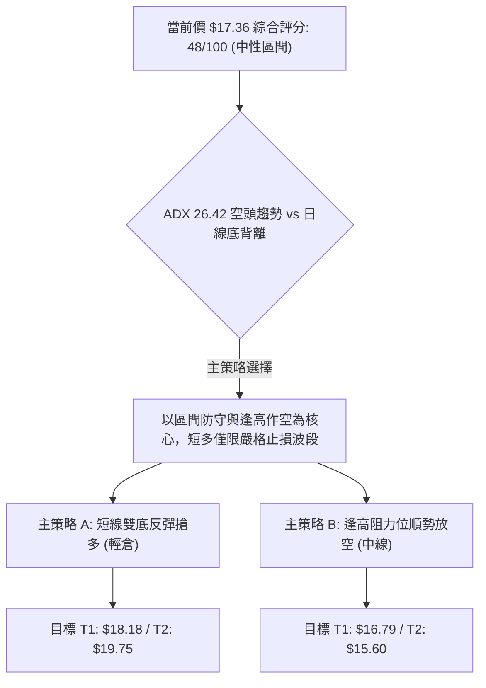

### 🧭 策略路由

**當前主策略方向 = 區間震盪偏弱操作，等待突破確認（依綜合評分 48/100）**
由於綜合評分落於 40–60 區間，且 ADX>25 顯示空方仍具大級別控制力，交易應以「布林通道上下軌及 S1/R1 關鍵價位」為依據，嚴禁盲目追高。

### 🎯 價格情境階梯（Price Scenarios）

| 觸發條件 | 下一目標 | 後續延伸 | 情境含義 |
|----------|----------|----------|----------|
| **向上放量突破 R1 $18.18** | R2 **$20.99** | R3 **$25.53** | 短線雙底確立，挑戰 MA50 ($19.75) 與回調位 |
| **受阻於 $17.91~$18.18 橫盤** | 布林中軌 **$16.79** | S1 **$15.60** | 區間震盪蓄勢，量能不足引發拉回 |
| **向下有效跌破 S1 $15.60** | S2 **$11.97** | S3 **$10.52** | 中期築底失敗，順勢開啟新一輪主跌浪 |

### 📊 情境機率分佈

| 情境 | 機率 | 主要依據 |
|------|------|----------|
| **弱勢反彈 / 測試 R1** | **35%** | 日線 RSI 底背離、MACD 柱狀體擴張 (+0.292)、短天期均線金叉支撐 |
| **區間震盪整理** | **45%** | 量比萎縮至 0.61x、布林通道帶寬收窄、ADX 顯示中長期空方均線強烈壓制 |
| **直接破底尋找 S1/S2** | **20%** | 中長期均線空頭排列 (-DI > +DI)、OBV 疲弱資金持續外流 |

### 🟢 主策略詳情

依據評分卡分流與中性區間交易邏輯，提供以下兩套精確執行方案：

| 策略要素 | 策略 A（短線超跌反彈多單） | 策略 B（中期順勢逢高空單） |
|----------|----------------------------|----------------------------|
| **策略類型** | 逆勢短多（博弈雙底頸線突破） | 順勢中空（主趨勢逢反壓進場） |
| **進場條件** | 突破 $17.50 且站穩，或拉回中軌不破 | 股價反彈至阻力區受阻滯漲陰線確認 |
| **進場價格** | **$17.36** (現價進場) | **$18.18** (掛單於 R1 阻力位) |
| **目標價 T1** | **$18.18** (阻力 R1) | **$16.79** (MA20 / 布林中軌) |
| **目標價 T2** | **$19.75** (形態目標兼 MA50 壓力) | **$15.60** (波段支撐 S1) |
| **止損價格** | **$16.42** (右底破位止損，距現價 1.04x ATR) | **$18.90** (突破頸線上方 1x ATR 止損) |
| **風險報酬比** | **1 : 2.54** (風險 $0.94，目標2獲利 $2.39) | **1 : 3.58** (風險 $0.72，目標2獲利 $2.58) |
| **成功機率** | **45%** | **65%** |
| **建議倉位** | **5%** (嚴格防禦性輕倉) | **10%** (標準波段倉位) |

### 🔴 反向風險觸發點（對沖提示）

- **多單全面撤退點**：若日線收盤價跌破 **$16.42**，宣告雙底形態流產，必須無條件市價止損，不可留戀。
- **空單強制停損點**：若大盤配合帶量長陽突破 **$18.18** 並站穩 $18.50 之上，宣告短線空頭排列遭遇實質破壞，所有中線空單應立即平倉避險。

### ⭐ 整體訊號強度評星

```
做多訊號強度：★★☆☆☆  (2/5星 — 僅屬超跌反彈，量能未獲確認)
做空訊號強度：★★★★☆  (4/5星 — 中長期趨勢仍由空方完全主導)
整體可信度：  ★★★☆☆  (3/5星 — 處於波動壓縮轉折期，需待方向突破)
```

---

## 9. 風險提示與監控

### ✅ 關鍵監控指標 Checklist

```
╔══════════════════════════════════════════════════════════════════╗
║                     每日盤後關鍵監控清單 (Checklist)              ║
╠══════════════════════════════════════════════════════════════════╣
║ [ ] 價位確認：收盤價是否站穩 MA20 ($16.79) 之上？                 ║
║ [ ] 阻力測試：盤中是否挑戰 R1 ($18.18)，成交量是否放大至 11M 以上？║
║ [ ] 動能維護：MACD 柱狀體是否維持正值？RSI 是否跌破 50 中軸？     ║
║ [ ] 趨勢警報：ADX 讀數是否突破 30？+DI 是否出現上穿 -DI 的金叉？  ║
║ [ ] 空方防守：價格是否跌破雙底關鍵低點 $16.42？                   ║
║ [ ] 量能監控：量比是否自 0.61x 回升至 1.0x 以上的健康換手水準？   ║
╚══════════════════════════════════════════════════════════════════╝
```

### ⚠️ 風險場景分析

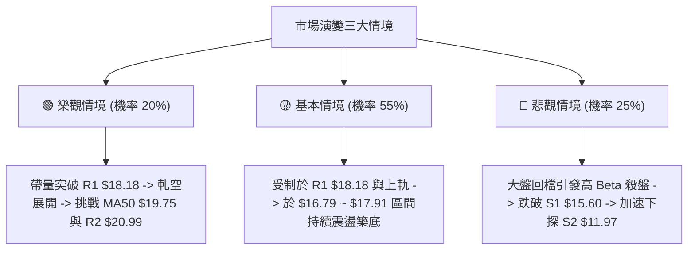

### 🛡️ 風險管理重要提醒

1. **高 Beta 波動風險控制**：
   PL 具有高達 **2.17 的 Beta 值** 與 **5.26% 的 ATR 佔比**。任何單筆交易之帳面損失絕不可超過總投資組合的 **1.0%**。以 ATR = $0.91 計算，持倉部位必須嚴格限縮，不可因股價名義金額低而過度放大槓桿。
2. **財報與基本面赤字壓力**：
   公司淨利率為 -95.1%，ROE 為 -72.0%，且本益比呈現負值，缺乏實質價值投資買盤底線保護，純屬動能與題材驅動。一旦技術形態跌破支撐，易引發機構無情去槓桿砍倉。
3. **假突破防範準則**：
   當前量比僅 0.61x，若盤中突破 R1 $18.18 但全日成交量未達 20日均量（11.19M 股）之 80%（約 9.0M 股），一律視為「誘多假突破」，切勿於盤中追高。

---

## 📋 報告總結

```
╔══════════════════════════════════════════════════════════════════╗
║                    PL 技術分析報告總結                          ║
╠══════════════════════════════════════════════════════════════════╣
║ 報告日期：2026-10-06                                             ║
║ 當前價格：$17.36                                                 ║
║ 分析評級：⚖️ 中性偏空 (技術評分: 48/100) — 短線反彈遇阻蓄勢     ║
║                                                                  ║
║ 關鍵結論：                                                       ║
║ ├─ 長期趨勢：🔴 強烈空頭 (自 $51.76 崩跌，遠低於 MA200 $27.34)  ║
║ ├─ 中期趨勢：🔴 空頭控盤 (ADX 26.42 顯示強趨勢，MA50 $19.75 反壓)║
║ ├─ 短期趨勢：🟢 弱勢反彈 (RSI 59.41 底背離，MACD 柱狀體翻正)    ║
║ ├─ 關鍵支撐：S1 $15.60 ｜ S2 $11.97 ｜ S3 $10.52 (52W低點)       ║
║ ├─ 關鍵阻力：R1 $18.18 ｜ R2 $20.99 ｜ R3 $25.53                 ║
║ └─ 分析師共識目標：$33.40 (低標 $22.00 / 高標 $50.00)            ║
║                                                                  ║
║ 最優策略組合：                                                   ║
║ 1. 🥇 最佳機會：等待反彈至 R1 $18.18 附近受阻，佈局順勢空單     ║
║    (止損 $18.90，目標 T1 $16.79 / T2 $15.60，風報比 1:3.58)     ║
║ 2. 🥈 次選機會：以現價 $17.36 極輕倉博弈雙底頸線突破短多        ║
║    (嚴格止損 $16.42，目標 T1 $18.18 / T2 $19.75，風報比 1:2.54) ║
║ 3. 🥉 保守選擇：空倉觀望，等待日線有效突破 $18.18 或跌破 $15.60 ║
║    確認新一輪突破方向後再行順勢跟進                             ║
╚══════════════════════════════════════════════════════════════════╝
```

---

> ⚠️ **免責聲明**：本報告為 AI 自動生成之技術分析，所有數據及估算均基於提供的歷史價格資訊。本報告**僅供研究與學術參考**，**不構成任何投資建議**。投資有風險，入市需謹慎。

---

*報告生成時間：2026-10-06 ｜ 數據來源：Yahoo Finance ｜ 分析框架：多時框技術分析*