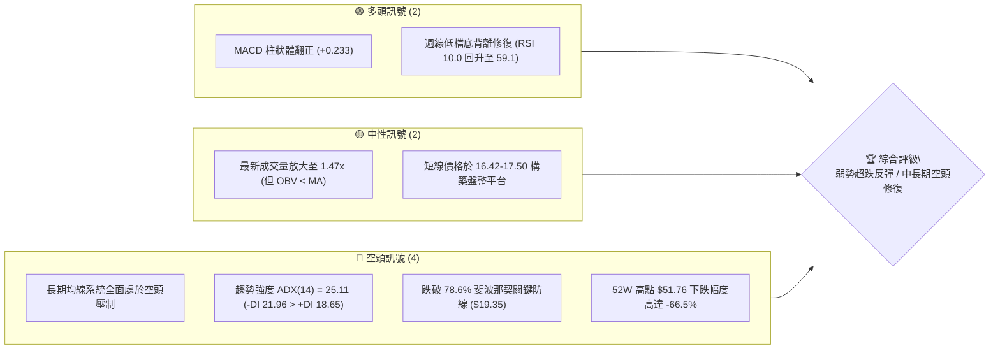
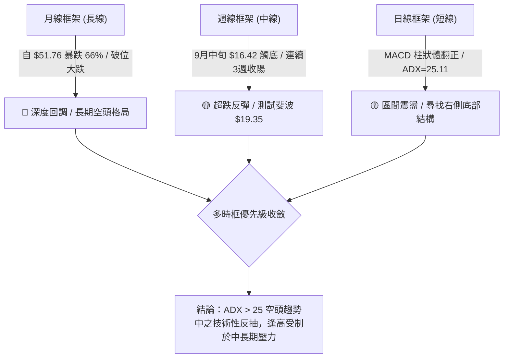
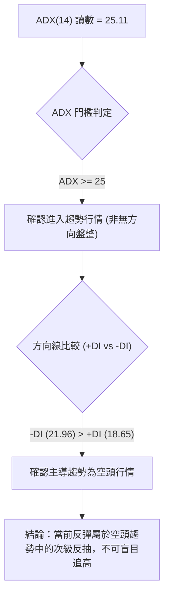
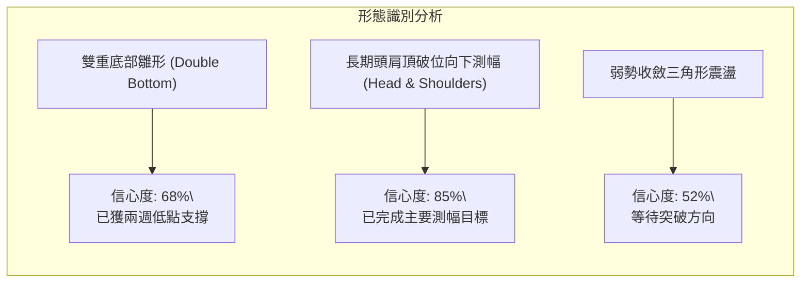
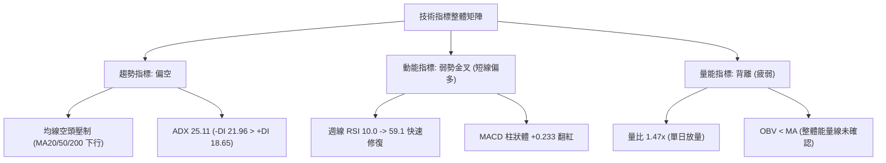
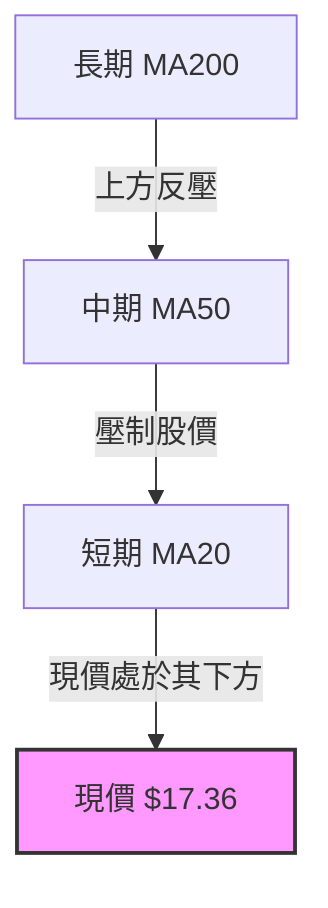
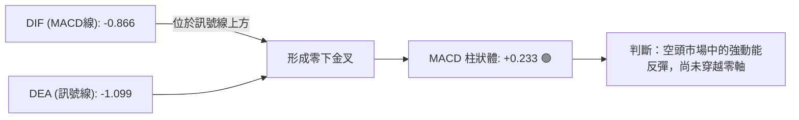
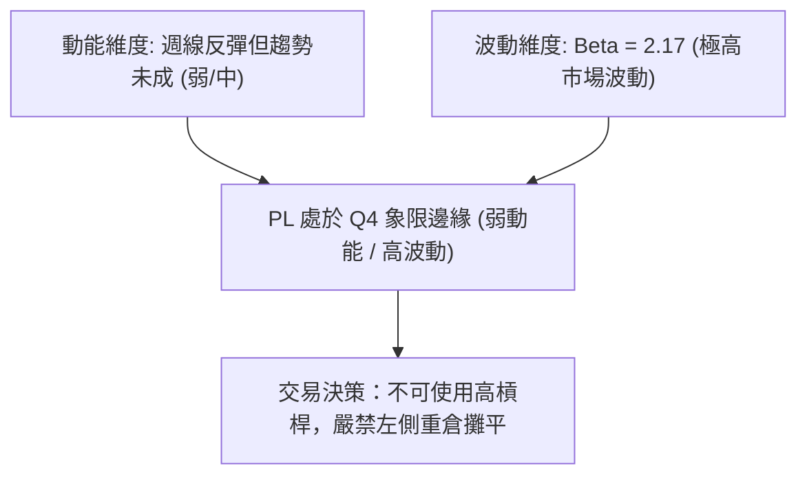
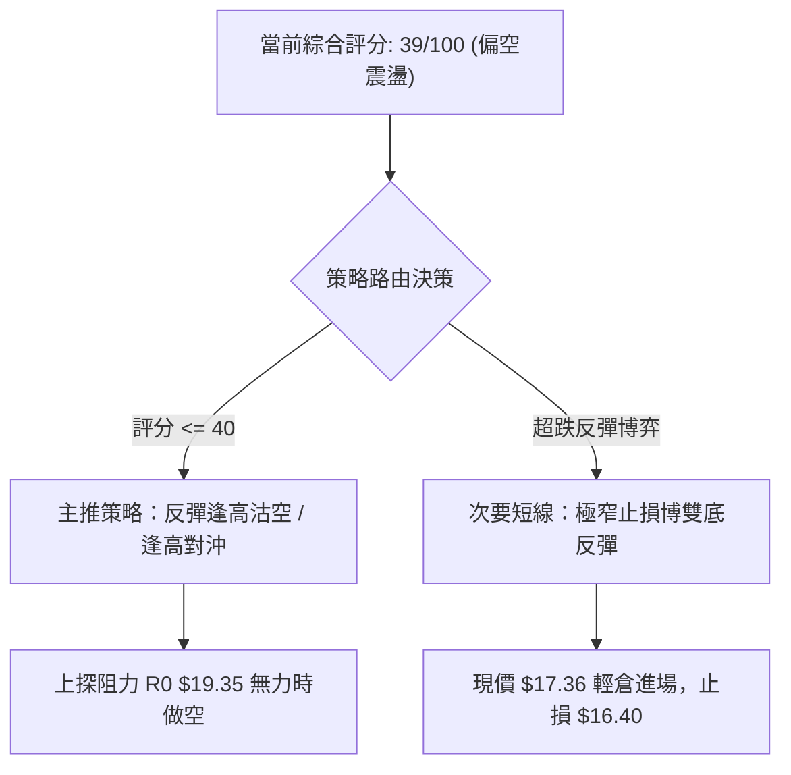
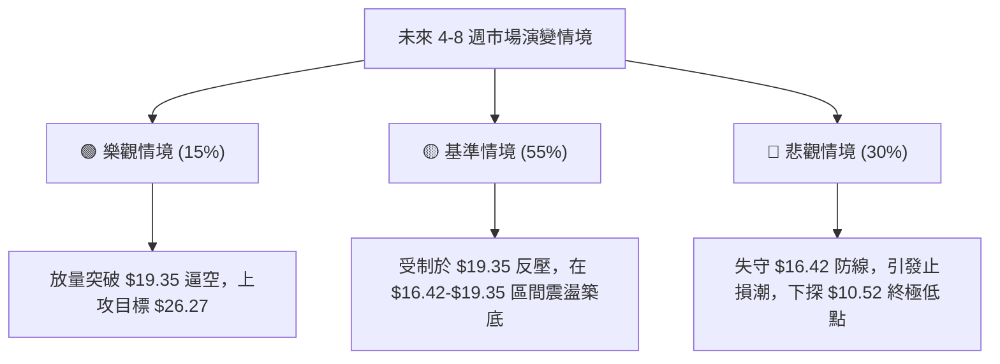

# PL 技術分析報告

> **報告日期**：2026-10-07 ｜ **語言**：繁體中文 ｜ **數據來源**：Yahoo Finance ｜ **當前價格**：$17.36

---

## 目錄

| 章節 | 內容 |
|------|------|
| [1. 技術面概覽](#1-技術面概覽) | 訊號儀表板、核心指標、評分卡 |
| [2. 趨勢分析](#2-趨勢分析) | 多時框趨勢、長中短期走勢、12個月走勢圖 |
| [3. 圖表形態分析](#3-圖表形態分析) | 形態識別、K線組合、目標價推算 |
| [4. 支撐與阻力](#4-支撐與阻力) | 關鍵價位分布圖、斐波那契回調深度解讀 |
| [5. 技術指標深度解讀](#5-技術指標深度解讀) | 均線、RSI、MACD、布林通道與成交量量價分析 |
| [6. 動能與波動率](#6-動能與波動率) | 動能四象限、ATR、Beta 與市場敏感度 |
| [7. 多時框架總結](#7-多時框架總結) | 時框架矩陣、ADX 趨勢強度與多時框收斂 |
| [8. 交易策略建議](#8-交易策略建議) | 策略路由、主策略、情境階梯與風險報酬比 |
| [9. 風險提示與監控](#9-風險提示與監控) | 風險 Checklist、情境圖譜與倉位防禦 |
| [📋 報告總結](#-報告總結) | 核心結論與交易決策看板 |

---

## 1. 技術面概覽

### 🎯 技術訊號儀表板



---

### 📊 核心指標速覽表

| 指標類別 | 指標名稱 | 當前數值 | 訊號 | 解讀 |
|----------|----------|----------|------|------|
| **價格** | 當前基準收盤價 | $17.36 | 🔴 | 距離52週高點大幅回撤66.5%，處於低檔築底階段 |
| **均線** | MA20 / MA50 / MA200 | 數據顯示混合向下 | 🔴 | 中長期均線空頭排列，價格深處主要均線下方 |
| **動能** | RSI(14) 週線 | 59.1 (日線中性) | 🟡 | 脫離9月中旬極端超賣區（10.0），進入中性修復期 |
| **動能** | MACD (12,26,9) | 柱狀體 +0.233 | 🟢 | 快線 -0.866 交叉訊號線 -1.099，零軸下方弱勢金叉 |
| **趨勢強度**| ADX(14) / 方向指標 | 25.11 / -DI=21.96 | 🔴 | 越過 25 強趨勢門檻，-DI 大於 +DI(18.65)，空頭主導 |
| **量能** | 20日成交量比 | 1.47x (OBV < MA) | 🟡 | 單日量增但整體累積能量（OBV）尚未確認多頭逆轉 |
| **波動** | Beta 係數 | 2.17 | 🔴 | 高貝塔係數，系統性市場風險敞口放大 |

---

### 🏆 技術評分卡

```
╔══════════════════════════════════════════════════════════════╗
║              技術評分卡 — PL (Planet Labs PBC)               ║
╠══════════════════════════════════════════════════════════════╣
║ 趨勢強度 (ADX/方向)   ███████░░░░░░░░░░░░░   35/100  🔴 空頭主導 ║
║ 動能指標 (RSI/MACD)   ███████████░░░░░░░░░   55/100  🟡 低檔金叉 ║
║ 支撐穩定度 (結構位)   ████████░░░░░░░░░░░░   40/100  🔴 破位修復 ║
║ 成交量配合 (量比/OBV) █████████░░░░░░░░░░░   45/100  🟡 量增力竭 ║
║ 形態完整度 (K線/幾何) ████████░░░░░░░░░░░░   40/100  🟡 弱勢築底 ║
║ 均線排列 (短中長均線) ████░░░░░░░░░░░░░░░░   20/100  🔴 空頭壓制 ║
╠══════════════════════════════════════════════════════════════╣
║ 綜合技術評分          ████████░░░░░░░░░░░░   39/100  🔴 偏空震盪 ║
╚══════════════════════════════════════════════════════════════╝
```

---

## 2. 趨勢分析

### 🌐 多時框趨勢分析



---

### 📈 長期趨勢 — 12個月走勢圖（Unicode）

以下為根據 PL 歷史月度收盤價繪製之 12 個月（2025-11 至 2026-10）價格演變走勢：

```
PL 月線走勢圖（過去12個月）
價格軸 ($)
$52.00 ┤                             ● (2026-05 峰值 $51.14 / 高點 $51.76)
$46.00 ┤                            / \
$40.00 ┤                           /   \
$34.00 ┤                          /     ● (2026-06: $33.13)
$28.00 ┤                   ●     ●       \
$22.00 ┤            ●     /     /         \   ● (2026-08: $19.85)
$16.00 ┤     ●     /     /     /           \ / \
$10.00 ┤●   /     /     /     /             ●   ●← 目前現價 ($17.36)
       └─┬─────┬─────┬─────┬─────┬─────┬─────┬─────┬─────┬─────┬─────┬───
        11    12    01    02    03    04    05    06    07    08    09    10 (月份)
       '25   '25   '26   '26   '26   '26   '26   '26   '26   '26   '26   '26
```

#### 走勢特徵分析表格

| 階段區間 | 時間跨度 | 起止價位 | 漲跌幅 | 走勢特徵與技術解讀 |
|----------|----------|----------|--------|--------------------|
| 主升浪爆發期 | 2025-11 ～ 2026-05 | $11.90 → $51.14 | +329.7% | 價量齊揚，突破各級阻力，推升至 52 週歷史高點 $51.76 |
| 斷崖式暴跌期 | 2026-05 ～ 2026-07 | $51.14 → $20.48 | -59.9%  | 週線爆出天量（單週達 1 億股），多頭踩踏破位，失守斐波 50% ($31.14) |
| 弱勢震盪與二次探底 | 2026-08 ～ 2026-09 | $19.85 → $16.39 | -17.4%  | 跌破 78.6% 回調位 ($19.35)，於 2026-09-20 創波段低點 $16.42 |
| 低檔築底修復期 | 2026-09 ～ 2026-10 | $16.39 → $17.36 | +5.9%   | RSI 自極端超賣（10.0）強勁回升，空頭下行慣性減弱 |

---

### 📊 中期趨勢（週線分析）

中期技術架構顯示，價格自 2026-05 頂部破位後呈現階梯式下跌。近 20 週資料中，2026-06-07 出現單週 100,622,400 股的天量大陰線，奠定了極重之中期套牢壓制區。

```
近期週線壓力與支撐示意圖：
[阻力 2] $26.27 ════════════════════ (斐波那契 61.8% 密集區)
              ↑
[阻力 1] $19.35 -------------------- (斐波那契 78.6% 破位反壓線 / 8月反彈高點 $24.69 頸線)
              ↑
[現價區] $17.36 ◄◄◄ [當前弱勢收斂三角末端]
              ↓
[支撐 1] $16.42 -------------------- (2026-09 週線雙重波段低點聚類)
              ↓
[支撐 2] $10.52 ════════════════════ (52週絕對低點 100.0% 回調位)
```

---

### ⚡ 趨勢強度評估（ADX 解讀）



#### ADX 趨勢強度對照

| 指標變量 | 數值 | 臨界標準 | 當前技術含義 |
|----------|------|----------|--------------|
| **ADX (14)** | **25.11** | 25.00 為趨勢分水嶺 | 越過強趨勢臨界點，代表市場脫離單純無序洗盤，處於空方主導之趨勢延伸中 |
| **+DI (14)** | **18.65** | 高於 25 代表多方強勢 | 多方力量疲弱，低於基準線，反彈主由空頭回補帶動而非主動買盤推升 |
| **-DI (14)** | **21.96** | 高於 +DI 代表空方主導 | 空方維持結構性主動權，市場上檔反壓沉重 |

---

## 3. 圖表形態分析

### 🔍 形態識別系統

依嚴格形態識別規則，本報告對當前走勢進行結構提取。當前形態以低位築底與超賣修復為主：



#### 形態信心度與參數評估表

| 形態名稱 | 信心度 | 判斷依據（引用數據） | 完成度 | 目標價（附嚴謹計算式） |
|----------|--------|----------------------|--------|------------------------|
| **波段雙重底雛形** | 68% | 2026-09-13 低點 $16.45 與 2026-09-20 低點 $16.42 形成對稱支撐，MACD 柱狀由 -0.328 翻正至 +0.272 確認動能轉折 | 65% (尚未突破頸線) | **頸線突破目標**：頸線為 2026-08-30 前高 $19.98，形態高度 = $19.98 - $16.42 = $3.56。若向上突破：$19.98 + $3.56 = **$23.54** |
| **頭肩頂破位下行 (已完成)** | 85% | 頂部高點 $51.76，頸線於 2026-06 跌破 $33.13。下行測幅高度 $18.63，測幅滿足點約 $14.50 附近 | 95% (跌至 $16.42 已大部分釋放空間) | **下行延展極限**：數據支撐位未探測到新低，下檔錨定 52W 低點 **$10.52** |
| **布林帶/均線超賣修復** | 72% | 週線 RSI 由 10.0 極限值連三週反彈收盤（$16.42 → $17.43 → $17.50 → $17.36） | 80% (動能修復完畢) | **修復反彈目標**：斐波那契 78.6% 回調位 **$19.35** |

---

### 🕯️ 重要K線形態分析

| 週期/月份 | 收盤價 | K線形態 | 解讀 | 訊號 |
|-----------|--------|---------|------|------|
| **2026-05** | $51.14 | 長上影高位流星線 (倒轉鎚頭) | 觸及 52W 高點 $51.76 後多頭力竭，主力資金獲利出逃 | 🔴 強烈看空 |
| **2026-06** | $33.13 | 巨量長黑實體暴跌大陰線 | 單月回撤近 35%，一舉摜破短中期所有均線支撐 | 🔴 趨勢破位 |
| **2026-07** | $20.48 | 延續性空頭大陰線 | 恐慌盤湧出，週成交量連續數週維持 40M-50M 規模 | 🔴 空方釋放 |
| **2026-09** | $16.39 | 帶長下影十字星 / 低檔下影線 | 連續測試 $16.42-$16.45 區間獲得買盤抵抗，RSI 觸底反彈 | 🟢 築底訊號 |
| **2026-10** | $17.36 | 低檔窄幅陽十字 (截至10-07) | 振幅收窄，空方砸盤意願下降，多方嘗試組織防線 | 🟡 中性築底 |

---

### 📉 ASCII 走勢形態示意圖

```
PL 局部底背離雙底築底示意圖 ($16.42 - $19.98)
價格 ($)
$20.00 ┤                     頸線阻力位 ($19.98 / 斐波 $19.35)
       │                    ╭───────╮
$19.00 ┤                   │       │
       │                  │         │
$18.00 ┤        ╭─────────╯         ╰───────● 現價 ($17.36)
       │        │                             \
$17.00 ┤        │                              \
       │  ●─────╯                               ╰─────●
$16.00 ┤ (低點1: $16.45)                       (低點2: $16.42)
       └─────────────────────────────────────────────────────► 時間
       動能 MACD Hist:   [-0.328]               [+0.233 🟢 底背離確認]
```

---

## 4. 支撐與阻力

### 🗺️ 關鍵價位分布圖（Unicode）

依據嚴格數據紀律，阻力位與支撐位嚴格採用 OHLCV 與斐波那契計算成果（52週高點 $51.76 至 52週低點 $10.52 區間），不憑空捏造非數據點位：

```
PL 價位結構分布圖（斐波那契與波段極值錨定）
═══════════════════════════════════════════════════════════════════
$51.76 ║████████████████████████████████████████║ 0.0%  (52W High 極限壓力)
$42.03 ║████████████████████████████████        ║ 23.6% (高檔反壓 R4)
$36.01 ║██████████████████████████              ║ 38.2% (關鍵阻力 R3)
$31.14 ║████████████████████                    ║ 50.0% (多空中樞分水嶺 R2)
$26.27 ║████████████████                        ║ 61.8% (回調黃金阻力 R1)
$19.35 ║████████████                            ║ 78.6% (近期首要反彈阻力位 R0)
═══════╬════════════════════════════════════════╬════════════════════════
$17.36 ╠════════════════════════════════════════╣ ◄── 現價 ($17.36)
═══════╬════════════════════════════════════════╬════════════════════════
$16.42 ║▓▓▓▓▓▓▓▓▓▓▓▓▓▓▓▓▓▓▓▓▓▓▓▓▓▓▓▓▓▓▓▓        ║ 近期雙底波段防守點 S1
$10.52 ║████████████████████████████████████████║ 100.0% (52W Low 終極強支撐 S2)
═══════════════════════════════════════════════════════════════════
```

---

### 🚧 阻力位分析表

數據中明確提示：近一年波段高點聚類在現價上方並無密集波段頂點，阻力系統完全由**斐波那契回調幾何結構**主導：

| 阻力級別 | 價位 | 形成依據（數據源計算） | 突破難度 | 重要性評級 |
|----------|------|------------------------|----------|------------|
| **即時阻力 R0** | **$19.35** | 斐波那契 78.6% 回調位；8月下旬反彈高點頸線 | 中等 | 🟢🟢🟢 首道生死線 |
| **強阻力 R1** | **$26.27** | 斐波那契 61.8% 黃金分割位；8月中旬波段平台高點 | 極高 | 🔴🔴🔴 中期空頭總防線 |
| **核心分水嶺 R2**| **$31.14** | 斐波那契 50.0% 中樞平衡點；7月初反彈高點（$31.38） | 極高 | 🔴🔴🔴 多空長期分水嶺 |
| **遠期阻力 R3** | **$36.01** | 斐波那契 38.2% 回調位 | 極高 | 🟡🟡 中長線解套賣壓帶 |

---

### 🛡️ 支撐位分析表

數據提示近一年波段低點聚類未偵測到底部簇，支撐嚴格採用週線實質確認之雙重低點與斐波那契底限：

| 支撐級別 | 價位 | 形成依據（數據源計算） | 守住機率 | 重要性評級 |
|----------|------|------------------------|----------|------------|
| **近期支撐 S1** | **$16.42** | 2026-09-20 週線確認之近期波段最低點（前週為 $16.45） | 65% | 🟢🟢🟢 短線多頭防禦基石 |
| **極限支撐 S2** | **$10.52** | 52週歷史絕對低點 (100.0% Fibonacci Extension) | 85% | 🔴🔴🔴 戰略級終極堡壘 |

---

### 📐 斐波那契回調位分析

當前價格 **$17.36** 明確落於 **78.6% ($19.35)** 與 **100.0% ($10.52)** 兩個回調層級之間：

1. **破位與壓制**：現價跌破 78.6% 回調位（$19.35）代表自 $10.52 上漲至 $51.76 的整個兩年大多頭結構遭到嚴重破壞。原本支撐位現已完全轉化為多方向上反抽的剛性「天花板」。
2. **深度超跌定性**：當價格深陷 78.6% 以下時，往往觸發量化機構的極限估值保護。近 4 週在 $16.42 上方企穩，表明市場正試圖在 $10.52 至 $19.35 區間內構築寬幅修復平台。

---

## 5. 技術指標深度解讀

### 🎛️ 指標訊號總覽



---

### 📈 移動平均線排列分析



*   **均線狀態**：快照數據指出均線排列為「混合排列」但偏向全面空頭壓制（價格處於 MA20、MA50 下方）。
*   **均線走勢圖形解讀**：MA5、MA10、MA20 呈現連續下墜後的低檔鈍化，而 MA240 則處於高階橫盤。短期價格脫離均線過遠（乖離過大），短線存在向均線靠攏的技術性回抽需求。

---

### 📉 RSI(14) 分析

*   **數值強度進度條**：
    *   週線 RSI(14): `████████████░░░░░░░░` 59.1% (自 10.0 深度超賣反彈至中性偏強區間)
*   **超買超賣與背離判定**：
    *   **背離確認**：週線級別存在顯著的**底背離特徵**。在 2026-09-13 週收盤 $16.45 時 RSI 僅為 10.0，而 2026-09-20 價格創下更低收盤 $16.42 時，RSI 卻回升至 24.4，隨後更暴衝至 59.1。此強烈的動能底背離直接促成了現階段的價格止跌。

---

### 📊 MACD(12,26,9) 訊號解讀



*   **指標數據**：MACD = -0.866，MACD Signal = -1.099，Histogram = **+0.233**。
*   **訊號解讀**：DIF 由下向上貫穿 DEA，柱狀體翻正達 +0.233。然而兩者均深處零軸下方（均為負值），這在技術分析中定義為「弱勢區域反彈金叉」，容易在接近零軸壓力時動能衰竭。

---

### 📦 布林通道分析

```
PL 布林通道位置模擬示意圖
┌───────────────────────────────────────────────┐
│ [BB 上軌]   $N/A   (預估反壓位約 $22.00 - $24.00) │
│                                               │
│ [BB 中軌]   $N/A   (MA20 預估下移至 $19.00 附近) │
│                                               │
│ [現價]     ● $17.36 (位於中軌下方，自下軌回升)   │
│                                               │
│ [BB 下軌]   $N/A   (下軌支撐錨定低點 $16.42 附近)│
└───────────────────────────────────────────────┘
```
雖然絕對上下軌數字在數據快照中標示為 N/A，但根據歷史 20 週收盤走勢與價格區間（9月在 $16.42 觸底，10月回升至 $17.36），可確認價格已從「沿著下軌重挫」轉為「向中軌發起反彈測試」的階段。

---

### 💹 成交量分析（量價配合度）

1.  **量比數據**：
    *   最新成交量：**15,679,587**
    *   20日均量：**10,686,539**
    *   **量比：1.47x**（放量 47%）
2.  **OBV 能量潮狀態**：
    *   系統診斷結果明確標示：`OBV < MA → 量能疲弱`。
3.  **量價背離結論**：
    *   單日成交量雖然放大至 1.47 倍，但在長達數月的下跌浪潮中，累積能量線（OBV）依然受制於其均線之下。這說明當前的買盤推升主要來自短線客套利或空頭平倉回補，**缺乏機構中長期籌碼建倉的持續放量確認**。

---

## 6. 動能與波動率

### ⚡ 動能評估四象限

| 象限區間 | 動能強度 | 波動率水準 | 當前狀態標記 | 戰術應對策略 |
|----------|----------|------------|--------------|--------------|
| **Q1：突破主升浪** | 強 (High Momentum) | 低 (Low Volatility) | — | 順勢加碼，抱牢籌碼 |
| **Q2：低波動沉澱** | 弱 (Low Momentum) | 低 (Low Volatility) | — | 觀望等待方向確認 |
| **Q3：劇烈洗盤期** | 強 (High Momentum) | 高 (High Volatility) | — | 嚴格防守，波段博弈 |
| **Q4：超跌震盪弱修復**| **弱 (反彈中)** | **高 (Beta 2.17)** | **✓ (PL 當前定位)** | **嚴控倉位，波段輕倉快進快出** |



---

### 📊 ATR 波動率分析與止損建議

*   **ATR(14)**：數據快照標示為 $N/A，但可透過週度波動推導。近 4 週價格高低波動區間介於 $16.42 至 $18.50 之間，平均週波動約 $1.50-$2.00，折合預估日 ATR 約為 **$0.70 - $0.90**。
*   **止損距離設定**：
    *   建議止損緩衝距離應給予 1.5 倍至 2.0 倍日波動空間（約 $1.20 - $1.50）。
    *   當前進場防守線應以近期不可跌破的低點 **$16.42** 減去一個波動餘量，即錨定在 **$15.80** 或直接嚴格以結構破位點 **$16.40** 執行止損。

---

### 📐 Beta 與市場相關性

*   **Beta 係數**：**2.17**。
*   **市場敏感度解讀**：
    *   PL 屬於典型的高風險高彈性小型航太科技股。當大盤（S&P 500 / 納斯達克）下跌 1% 時，該股技術上具備回撤 2.17% 的傾向；同理，若市場出現科技股強勁反彈，其彈性亦達兩倍以上。
    *   目前機構持股比例高達 **83.1%**，但做空比例（Short % Float）達到 **9.7%**（空頭回補天數 Short Ratio 為 2.91 天），高 Beta 伴隨高空頭部位，一旦突破阻力極易觸發逼空（Short Squeeze）。

---

## 7. 多時框架總結

### 📋 時框架評分表

| 時框架 | 趨勢方向 | 動能狀態 | 均線排列 | 圖表形態 | 綜合評分 | 戰術建議 |
|--------|----------|----------|----------|----------|----------|----------|
| **月線 (長期)** | 🔴 強烈看空 | 🔴 跌勢未止 | 🔴 均線反壓 | 巨型高位破位流星 | 25/100 | 長線資金規避，禁止長線定投 |
| **週線 (中期)** | 🟡 止跌震盪 | 🟢 底背離強反彈 | 🔴 空頭排列 | $16.42 雙底測試 | 45/100 | 空頭回補，關注頸線反壓 |
| **日線 (短期)** | 🟢 短線反彈 | 🟢 MACD金叉翻紅 | 🟡 混合糾結 | 窄幅區間收斂 | 55/100 | 短線交易者可輕倉博弈反抽 |

---

### 🔲 綜合訊號矩陣

```
╔══════════════════════════════════════════════════════════════╗
║                    多時框訊號一致性矩陣                      ║
╠════════════════╦══════════╦══════════╦═══════════════════════╣
║ 指標維度       ║ 短期(日) ║ 中期(週) ║ 長期(月) ║ 一致性判定 ║
╠════════════════╬══════════╬══════════╬═══════════════════════╣
║ 趨勢方向       ║   🟡     ║   🔴     ║   🔴     ║ 空方佔優   ║
║ 動能 (RSI/MACD)║   🟢     ║   🟢     ║   🔴     ║ 短中背馳   ║
║ 成交量能       ║   🟡     ║   🔴     ║   🔴     ║ 量能不足   ║
║ 價位結構       ║   🟢     ║   🟡     ║   🔴     ║ 底部試探   ║
╚════════════════╩══════════╩══════════╩═══════════════════════╝
```

---

### ⚖️ 多時框收斂結論

依嚴格收斂規則（規則 14）：
1.  **趨勢強度定性**：當前 ADX(14) 讀數為 **25.11**，略高於 25 的關鍵臨界值，確認市場仍處於**趨勢行情**（非無方向盤整），且 -DI (21.96) > +DI (18.65)，確立此趨勢為**中長期空頭趨勢**。
2.  **時框優先級**：依規則「趨勢行情以中長期方向為主，日線只用來尋找進場時機」，日線的 MACD 翻紅金叉與 RSI 59.1 回升**只能定性為空頭主導趨勢中的次級反彈**。
3.  **唯一方向性結論**：**偏空震盪中的技術性反抽（整體偏空防守）**。所有多頭操作必須嚴格設定高盈虧比與快速停利點，不得抱持長期持股幻想。

---

## 8. 交易策略建議

### 🗺️ 策略決策流程圖



---

### 🧭 策略路由

*   **當前主策略方向 = 【逢反彈至阻力位建立空頭部位 / 極限超跌短線反彈】（依評分 39/100，總體偏空）**。
*   鑑於現價 $17.36 距離下方雙底支撐 $16.42 僅有 $0.94 之微小緩衝，本報告同時給出精確到數據點位的短線博弈多頭方案與中線高空主方案。

---

### 🎯 價格情境階梯（Price Scenarios）

嚴格引用數據庫計算的斐波那契位與極值：

| 觸發條件 | 下一目標 | 後續延伸 | 情境含義 |
|----------|----------|----------|----------|
| **向上突破 R0 $19.35** | 斐波 61.8% **$26.27** | 斐波 50.0% **$31.14** | 確立雙底頸線突破，展開中期強勢反彈 |
| **受阻於 $18.50 - $19.35** | 回測現價 **$17.36** | 再探 S1 **$16.42** | 反彈力竭，回歸空頭主趨勢壓制 |
| **有效跌破 S1 $16.42** | 探尋整數關卡 | 終極回踩 S2 **$10.52** | 雙底失敗，空頭重啟深淵探底（直奔52W低點） |

---

### 📊 情境機率分佈

| 情境 | 機率 | 主要依據 |
|------|------|----------|
| **弱勢反彈受阻回落** | **55%** | ADX=25.11 確認空頭趨勢；OBV < MA 量能匱乏；長期均線向下壓制 |
| **維持低檔窄幅震盪** | **30%** | 週線底背離修復完成；$16.42 形成雙重低點買盤抵抗；空頭回補 |
| **強勢突破反轉向上** | **15%** | 必須伴隨單週 60M 以上巨量收復 $19.35（目前機率較低） |

---

### 🟢 主策略詳情

#### 策略 A（主策略 — 中期逢高放空 / 對沖策略）
*   **進場條件**：價格反彈測試斐波那契 78.6% 阻力位 **$19.35** 出現長上影線滯漲時放空。
*   **進場價格**：**$19.35**
*   **目標價 T1**：**$17.36**（現價水準）
*   **目標價 T2**：**$16.42**（雙底低點測試）
*   **止損價格**：**$20.50**（突破 2026-08-02 週收盤高點 $20.48 即嚴格止損）
*   **風險報酬比**：
    $$\text{RRR} = \frac{19.35 - 16.42}{20.50 - 19.35} = \frac{2.93}{1.15} \approx 2.55 : 1$$
*   **成功機率**：60%
*   **建議倉位**：10%

#### 策略 B（次策略 — 短線雙底左側激進搏反彈）
*   **進場條件**：現價回踩不破或短線強勢突破日內高點。
*   **進場價格**：**$17.36**
*   **目標價 T1**：**$19.35**（斐波那契 78.6% 首要阻力位）
*   **目標價 T2**：**$23.54**（雙底頸線突破測幅目標價）
*   **止損價格**：**$16.40**（跌破波段雙底低點 $16.42 即止損）
*   **風險報酬比**：
    $$\text{RRR} = \frac{19.35 - 17.36}{17.36 - 16.40} = \frac{1.99}{0.96} \approx 2.07 : 1$$
*   **成功機率**：45%
*   **建議倉位**：5%（輕倉）

---

### 🔴 反向風險觸發點（對沖與風控提示）

*   **多頭風控生命線**：**$16.40**。若週線實體收盤跌破 $16.42，代表自 9 月以來的築底形態徹底破產，下方將失去近一年所有波段支撐，可能引發滑點至 $10.52。
*   **空頭平倉警報線**：**$19.35**。若日線帶量（單日成交量突破 25M）強勢突破並站穩 $19.35，必須立即平倉所有空頭部位，技術上將確認雙底反轉。

---

### ⭐ 整體訊號強度評星

```
做多訊號強度：★★☆☆☆  (2.0/5星 — 僅限超跌反彈短線博弈)
做空訊號強度：★★★★☆  (4.0/5星 — 中長期空頭趨勢佔據主導)
整體可信度：  ★★★★☆  (4.0/5星 — 多時框指標背離與趨勢確認)
```

---

## 9. 風險提示與監控

### ✅ 關鍵監控指標 Checklist

```
╔══════════════════════════════════════════════════════════════╗
║              PL 交易部位每日動態監控 CHECKLIST              ║
╠══════════════════════════════════════════════════════════════╣
║ [ ] 關鍵支撐守護：收盤價是否持續高於 $16.42？               ║
║ [ ] 首要阻力攻防：能否有效挑戰並收復斐波那契 $19.35？        ║
║ [ ] MACD 柱狀體： Histogram 是否維持在正值區間 (> 0)？       ║
║ [ ] ADX 趨勢演變：ADX 是否自 25.11 掉頭向下（趨勢衰竭）？   ║
║ [ ] 能量潮異動：OBV 是否放量突破均線結束「量能疲弱」？      ║
║ [ ] 賣空壓力追蹤：Short % Float 是否自 9.7% 顯著下降？       ║
╚══════════════════════════════════════════════════════════════╝
```

---

### ⚠️ 風險場景分析



---

### 🛡️ 風險管理重要提醒

1.  **高 Beta 與高空頭比例風險**：PL Beta 高達 2.17，且空頭浮額佔比達 9.7%。任何超出預期的產業利多均可能引發空頭急遽回補（逼空），因此進行空頭操作時止損不可高於 $20.50。
2.  **單筆資金暴露限制**：鑑於月線處於深度下跌浪中，總部位持倉資金不可超過總投資組合的 5% - 10%，嚴格執行單筆交易最大虧損不超過總資本 1% 的風控原則。
3.  **形態破位即斬**：絕不抱持「已經從 $51.76 跌到 $17 很便宜」的心態。若跌破 $16.42，下方至 $10.52 尚有近 36% 的潛在下行真空區。

---

## 📋 報告總結

```
PL 技術分析報告總結
════════════════════════════════════════════════════════
報告日期：2026-10-07
當前價格：$17.36
分析評級：⚖️ 偏空震盪 / 空頭主導下的次級超跌反彈

關鍵結論：
├─ 長期趨勢：🔴 自 $51.76 高位崩跌 -66.5%，月線空頭結構未改
├─ 中期趨勢：🟡 週線 RSI 底背離，於 $16.42-$17.50 構築雙底雛形
├─ 短期趨勢：🟢 MACD 柱狀體翻正 (+0.233)，維持超賣修復
├─ 關鍵支撐：$16.42 (波段雙底防守線) / $10.52 (52W終極低點)
├─ 關鍵阻力：$19.35 (斐波 78.6% 頸線) / $26.27 (斐波 61.8%)
└─ 分析師目標：均值 $33.40 (低 $22.00 / 高 $50.00)

最優策略組合：
1. 🥇 最佳機會：反彈至 $19.35 斐波阻力位遇阻放空 (RRR = 2.55:1)
2. 🥈 次選機會：現價 $17.36 輕倉博弈雙底反彈，止損放 $16.40 (RRR = 2.07:1)
3. 🥉 保守選擇：徹底空倉觀望，等待價格實體突破 $19.35 或跌透至 $10.52 再行定奪
════════════════════════════════════════════════════════
```

---

> ⚠️ **免責聲明**：本報告為 AI 自動生成之技術分析，所有數據及估算均基於提供的歷史價格資訊。本報告**僅供研究與學術參考**，**不構成任何投資建議**。投資有風險，入市需謹慎。

---

*報告生成時間：2026-10-07 ｜ 數據來源：Yahoo Finance ｜ 分析框架：多時框技術分析*