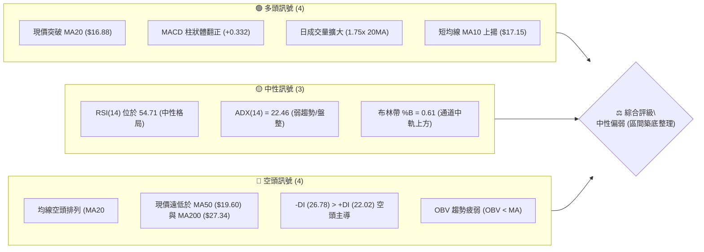
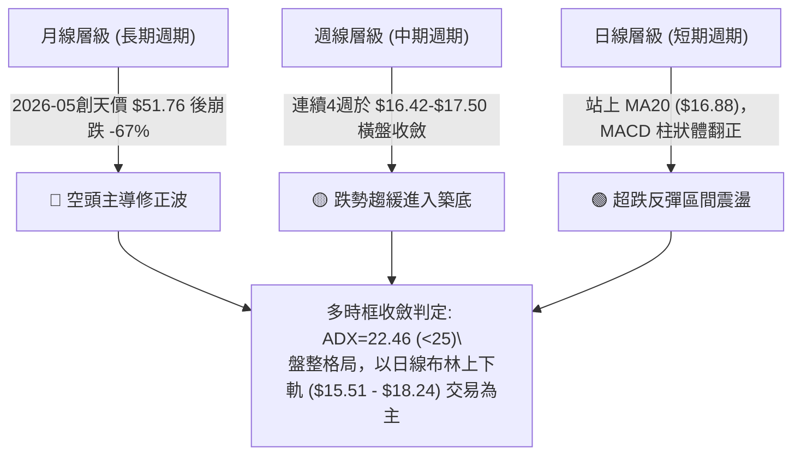
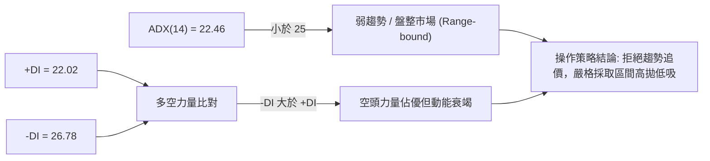
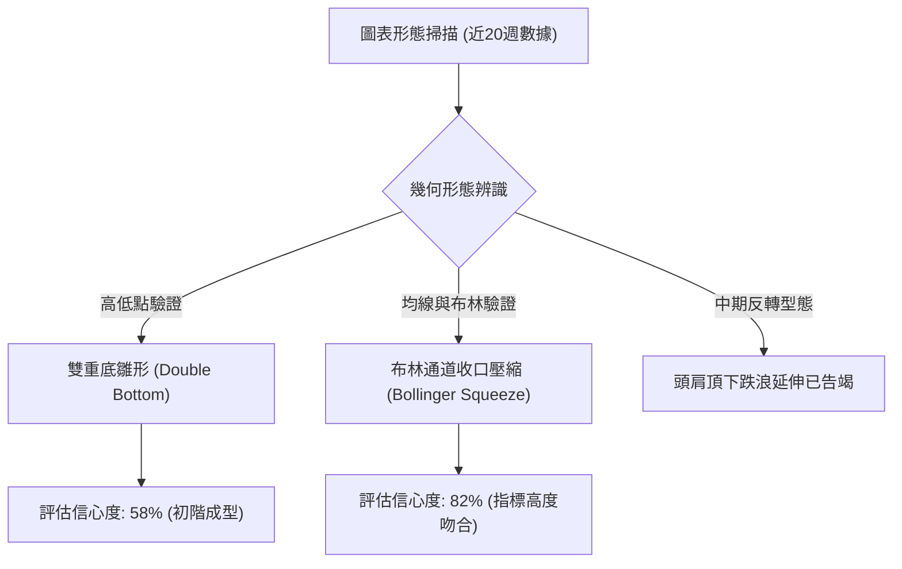
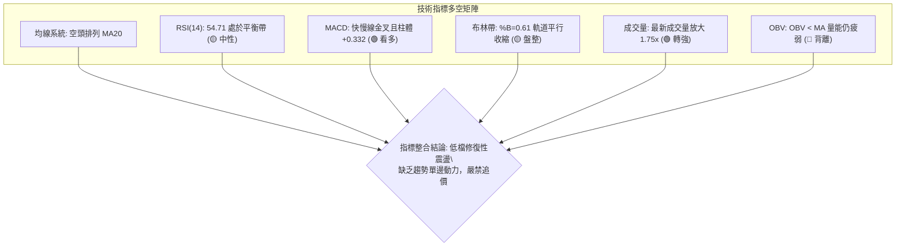
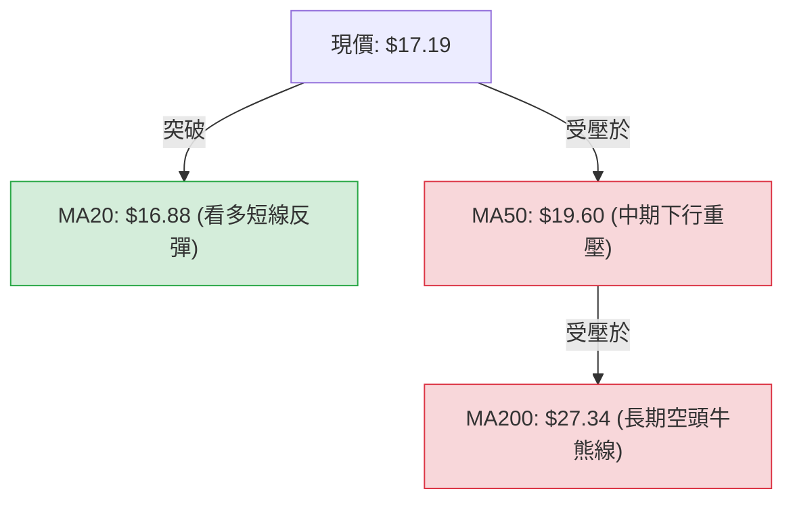
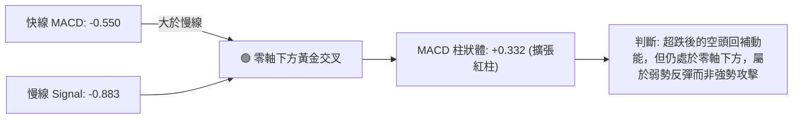
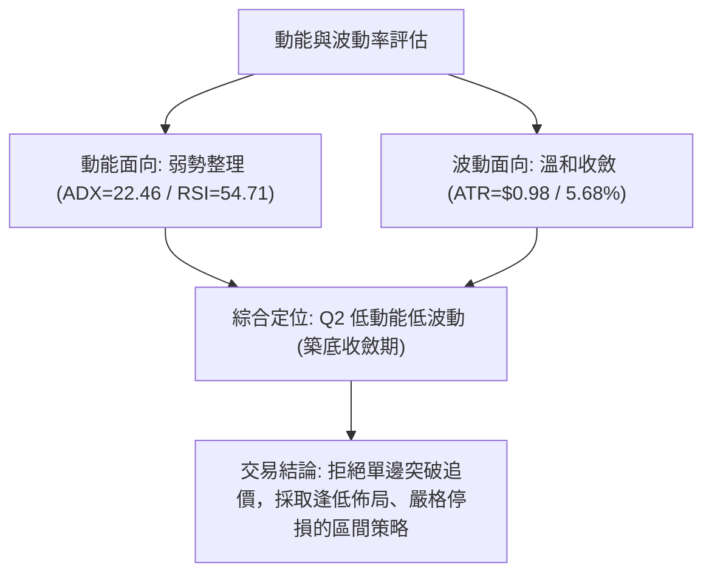
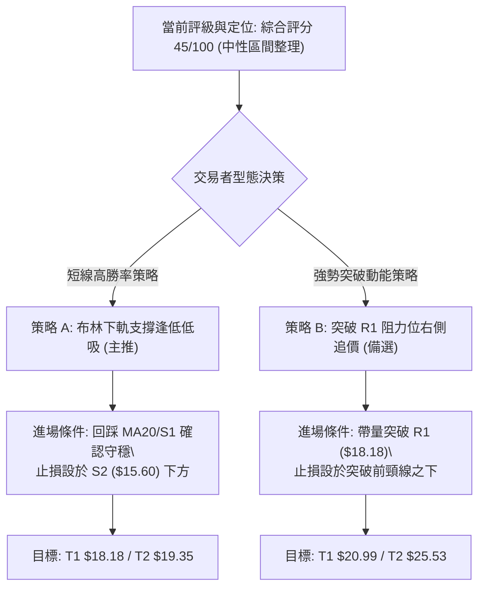
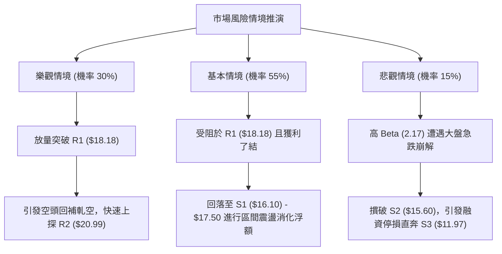

# PL 技術分析報告

> **報告日期**：2026-10-09 ｜ **語言**：繁體中文 ｜ **數據來源**：Yahoo Finance ｜ **當前價格**：$17.19

---

## 目錄

| 章節 | 內容 |
|------|------|
| [1. 技術面概覽](#1-技術面概覽) | 訊號儀表板、核心指標、評分卡 |
| [2. 趨勢分析](#2-趨勢分析) | 多時框趨勢、長中短期走勢 |
| [3. 圖表形態分析](#3-圖表形態分析) | 形態識別、K線組合、目標價 |
| [4. 支撐與阻力](#4-支撐與阻力) | 關鍵價位、斐波那契回調 |
| [5. 技術指標深度解讀](#5-技術指標深度解讀) | MA/RSI/MACD/布林/成交量 |
| [6. 動能與波動率](#6-動能與波動率) | 動能評估、ATR、Beta |
| [7. 多時框架總結](#7-多時框架總結) | 時框架評分矩陣 |
| [8. 交易策略建議](#8-交易策略建議) | 多空策略、風險報酬比 |
| [9. 風險提示與監控](#9-風險提示與監控) | 監控指標、風險場景 |

---

## 1. 技術面概覽

### 🎯 技術訊號儀表板



### 📊 核心指標速覽表

| 指標類別 | 指標名稱 | 當前數值 | 訊號 | 解讀 |
|----------|----------|----------|------|------|
| **價格** | 當前價格 | $17.19 | 🟡 | 位於52週區間 16.2% 處，處於深度修正後的低檔震盪帶 |
| **均線** | MA20 | $16.88 | 🟢 | 現價站上短期月線，短線微幅偏多，支撐短多節奏 |
| **均線** | MA50 | $19.60 | 🔴 | 現價低於季線 -12.3%，中期下行壓力沉重，反彈空間受限 |
| **均線** | MA200 | $27.34 | 🔴 | 現價低於年線 -37.1%，長期技術格局依然屬於空頭控盤 |
| **動能** | RSI(14) | 54.71 | 🟡 | 位於中性平衡區，未出現超買或超賣，短線動能溫和修復 |
| **動能** | MACD | -0.550 | 🟢 | 快線位於慢線 (-0.883) 之上，柱狀圖為 +0.332，形成低檔金叉 |
| **波動** | ATR(14) | $0.98 | 🟡 | 佔股價 5.68%，波動性適中，顯示近月拋售潮暫告段落 |

### 🏆 技術評分卡

```
╔══════════════════════════════════════════════════════════════╗
║                技術評分卡 — PL (2026-10-09)                   ║
╠══════════════════════════════════════════════════════════════╣
║ 趨勢強度 (ADX/方向)   █████░░░░░░░░░░░░░░░  28/100  🔴 空頭主導║
║ 動能指標 (RSI/MACD)   ███████████░░░░░░░░░  56/100  🟡 短多修復║
║ 支撐穩定度 (S1/S2)    ████████████░░░░░░░░  62/100  🟢 低檔有撐║
║ 成交量配合 (Volume)   █████████░░░░░░░░░░░  48/100  🟡 增量未續║
║ 形態完整度 (區間整理) ██████████░░░░░░░░░░  52/100  🟡 築底雛形║
║ 均線系統 (排列結構)   ████░░░░░░░░░░░░░░░░  24/100  🔴 空頭排列║
╠══════════════════════════════════════════════════════════════╣
║ 綜合評分             █████████░░░░░░░░░░░  45/100  ⚖️ 區間震盪║
╚══════════════════════════════════════════════════════════════╝
```

---

## 2. 趨勢分析

### 🌐 多時框趨勢分析



### 📈 長期趨勢 — 12個月走勢圖（Unicode）

```
PL 月線走勢圖（2025-11 至 2026-10）
價格軸 ($)
$52 ┤                                      ● (5/26: $51.14 高點)
$46 ┤                                     / \
$40 ┤                                    /   \
$34 ┤                             ●     /     ● (6/26: $33.13)
$28 ┤                      ●     /     /       \
$22 ┤               ●     /     /     /         ● (7/26: $20.48)
$18 ┤        ●     /     /     /     /           \     ●←現價 $17.19
$16 ┤       /     /     /     /     /             \   /
$12 ┤●─────●     /     /     /     /               ● (9/26: $16.39 低點)
$06 ┤
     └─────────────────────────────────────────────────────────────
      11    12    01    02    03    04    05    06    07    08    09    10
     2025  2025  2026  2026  2026  2026  2026  2026  2026  2026  2026  2026
```

**走勢特徵分析表格**：

| 階段區間 | 月份週期 | 起訖價格區間 | 累積漲跌幅 | 結構特徵與技術解讀 |
|----------|----------|--------------|------------|--------------------|
| 主升浪攻擊 | 2025-11 → 2026-05 | $11.90 → $51.14 | +329.7% | 帶量突破歷史平台，均線多頭發散，月線連6紅創歷史新高 $51.76 |
| 斷崖式暴跌 | 2026-05 → 2026-07 | $51.14 → $20.48 | -59.95% | 獲利了結伴隨空頭摜壓，週線連續跳水跌破 MA50，形成流星拋物線崩解 |
| 弱勢陰跌段 | 2026-07 → 2026-09 | $20.48 → $16.39 | -20.00% | 跌勢減速但缺乏主力買盤承接，週線 RSI 降至 10.0 極端超賣區 |
| 低檔盤整期 | 2026-09 → 2026-10 | $16.39 → $17.19 | +4.88% | 於 S1 ($16.10) 上方止跌橫盤，均線降速，呈現超跌後技術性收斂 |

### 📊 中期趨勢（週線分析）

中期走勢圖示近期關鍵壓力與支撐的壓縮帶：

```
中期週線結構示意圖
$24.69 ┬─ 週線前波反彈高點 (2026-08-16) ────────────────── (中期強阻力)
       │       ╲
$20.99 ┼─── R2 阻力區 (近一年波段聚類高點) ─────────────── (波段反轉頸線)
       │           ╲
$18.18 ┼─── R1 阻力位 (近期反彈高點聚類 / BB上軌 $18.24) ── (第一道反壓)
$17.19 ┼─── [當前現價區間：高低點收斂中]
$16.10 ┼─── S1 支撐位 (近一年波段低點聚類) ─────────────── (短線下限)
$15.60 ┼─── S2 支撐位 (布林下軌 $15.51 重合區) ─────────── (強支撐底線)
       ┴
```

### ⚡ 趨勢強度評估（ADX 解讀）



**ADX 指標強度對照解析表**：

| 指標變數 | 當前讀數 | 門檻區間 | 狀態評估 | 實戰指導含義 |
|----------|----------|----------|----------|--------------|
| **ADX** | 22.46 | < 25 | 弱趨勢/盤整 | 宣告單邊空頭下殺告一段落，進入日線級別布林震盪盤 |
| **+DI** | 22.02 | 基準對照 | 買盤動能溫和 | 雖然低檔回升，但尚未跨越 25 強勢多頭警戒線 |
| **-DI** | 26.78 | 基準對照 | 賣壓相對主導 | 空頭雖佔上風，但數值已自 9 月極值顯著回落 |
| **方向差 (DIFF)** | -4.76 | 負值收窄 | 熊市減速 | 拋售壓力持續遞減，有利於價格在支撐位上方構築箱型 |

---

## 3. 圖表形態分析

### 🔍 形態識別系統



**圖表形態信心度與目標價評估表**：

| 形態名稱 | 信心度 | 判斷依據（引用數據） | 完成度 | 目標價（附計算式） |
|----------|--------|----------------------|--------|--------------------|
| **雙重底雛形** | 58% | 2026-09-13 低點 $16.45 與 2026-09-20 低點 $16.42 形成對稱支撐，接近 S1 ($16.10) | 65% | 頸線為 10-04 高點 $17.50，形態高度 = $17.50 - $16.42 = $1.08。<br>突破目標價 = $17.50 + $1.08 = **$18.58**（受限於 R1 $18.18 壓制） |
| **布林壓縮整理** | 82% | BB 上軌 $18.24、下軌 $15.51，寬度僅 $2.73，ADX 22.46，成交量萎縮後突放 1.75x | 90% | 上下軌邊界即為目標：區間上緣目標 **$18.24**，下緣防守 **$15.51** |
| **頭肩頂幾何浪** | <40% | 2026-05 天價後的複合頭肩頂跌幅已滿足波段目標，現階段幾何結構不完整 | 100% (已失效) | 訊號不足，僅做指標型解讀，不預設延伸目標 |

### 🕯️ 重要K線形態分析

| 週次日期 | 收盤價 | K線形態 | 解讀 | 訊號強度 |
|----------|--------|---------|------|----------|
| 2026-05-31 | $51.14 | 長上影線高檔吊人線 | 52週最高點 $51.76 見頂，多頭精疲力竭，主力資金獲利出逃 | 🔴 強力看空 |
| 2026-06-07 | $32.22 | 崩跌大陰線 (放量 100M) | 跌破所有短期均線，引發保證金斷頭與停損賣壓 | 🔴 極度看空 |
| 2026-09-13 | $16.45 | 探底長下影錘頭線 | 週線 RSI 跌至 10.0 極限超賣，低檔買盤首度介入測試 S1 | 🟢 看多反彈 |
| 2026-09-20 | $16.42 | 低檔十字星 (Doji) | 空方摜壓力道衰竭，成交量縮至 46.4M，確認底部支撐形成 | 🟡 變盤訊號 |
| 2026-09-27 | $17.43 | 帶量長陽反轉線 | 一舉吞噬前兩週收盤價，MACD 柱狀體翻正 (+0.272)，確立反彈 | 🟢 轉強確認 |
| 2026-10-11 | $17.19 | 高檔小陰十字線 | 逼近 MA5 ($17.67) 與 R1 ($18.18) 遭遇解套賣壓，短線拉回整理 | 🟡 震盪整理 |

### 📉 ASCII 走勢形態示意圖

```
PL 雙重底雛形與布林收斂走勢示意圖
$18.50 ┤                                       [預估目標 $18.58]
$18.18 ┤─────────────────────────────────────── R1 關鍵頸線阻力
       │                   ┌──┐
$17.50 ┼───────────────────┤  ├─── 頸線測試位 (10-04: $17.50)
$17.19 ┼─── 現價 ───────────┼──┼─────────────── 現價收盤 $17.19
       │                   │  │  ▲
       │        ╲         ┌┘  └─┐│
$16.45 ┼─────────●────────┘     └●───────────── 第一底 ($16.45) / 第二底 ($16.42)
$16.10 ┼─────────── S1 支撐位 ────────────────── 強力結構性防守線
$15.60 ┼─────────── S2 支撐位 ────────────────── 破底停損防線
       └─────────────────────────────────────────
              2026-09-13        2026-09-20     2026-10-09
```

### 🎯 形態目標價計算

根據雙重底幾何推算：
1. **頸線確認位**：以 2026-10-04 收盤高點 **$17.50** 定義為反彈波段頸線。
2. **底部支撐位**：取波段雙底低點聚類平均值 **$16.42**。
3. **形態垂直高度**：$17.50 - $16.42 = **$1.08**。
4. **理論突破目標價**：$17.50 + $1.08 = **$18.58**。
   - *註*：該理論價位落於阻力位 R1 ($18.18) 與布林上軌 ($18.24) 之上方，暗示若要達成完全量度目標，必須先帶量攻克 R1 ($18.18)。

---

## 4. 支撐與阻力

### 🗺️ 關鍵價位分布圖（Unicode）

```
PL 價位結構分布圖 (由歷史 OHLCV 聚類計算)
════════════════════════════════════════════════════════════════
$25.53 ║████████████████████████████████║ 強阻力 R3 (年線 MA200 下方重壓)
$20.99 ║████████████████████            ║ 中期阻力 R2 (反彈波段頂部)
$19.35 ║▓▓▓▓▓▓▓▓▓▓▓▓▓▓▓▓▓▓▓▓            ║ 斐波那契 78.6% 回調關鍵反壓
$18.18 ║████████████████████████        ║ 關鍵阻力 R1 (布林上軌 $18.24 共振區)
$17.19 ╠════════════════════════════════╣ ◄ 現價 ($17.19，處於 S1 與 R1 夾層)
$16.10 ║▓▓▓▓▓▓▓▓▓▓▓▓▓▓▓▓▓▓              ║ 近期波段支撐 S1 (雙底底部防線)
$15.60 ║████████████████████████        ║ 強支撐 S2 (布林下軌 $15.51 重合區)
$11.97 ║████████████████████████████████║ 終極保守支撐 S3 (歷史起漲點聚類)
════════════════════════════════════════════════════════════════
```

### 🚧 阻力位分析表

所有阻力數值嚴格引用關鍵價位區塊波段高點聚類數值：

| 阻力級別 | 價位 | 形成原因 | 突破難度 | 重要性 |
|----------|------|----------|----------|--------|
| **R1** | **$18.18** | 近一年波段高點聚類，與當前日線布林上軌 ($18.24) 形成共振壓制區 | 🟡 中等 (需日量 > 15M 確認) | ★★★★☆ 短線反彈天花板 |
| **R2** | **$20.99** | 近一年波段高點聚類，接近 2026-07 跌破之平台套牢頸線 | 🔴 極高 (面臨解套籌碼海嘯) | ★★★★★ 中期牛熊轉換分水嶺 |
| **R3** | **$25.53** | 近一年波段高點聚類，逼近 MA200 ($27.34) 與斐波那契 61.8% ($26.27) | 🔴 極難 (需基本面營收轉正) | ★★★★☆ 長期空頭反壓堡壘 |

### 🛡️ 支撐位分析表

所有支撐數值嚴格引用關鍵價位區塊波段低點聚類數值：

| 支撐級別 | 價位 | 形成原因 | 守住機率 | 重要性 |
|----------|------|----------|----------|--------|
| **S1** | **$16.10** | 近一年波段低點聚類，9月中旬雙底低點密集成交防守區間 | 🟢 70% (近期拋壓大幅放緩) | ★★★★☆ 短線多頭防守底線 |
| **S2** | **$15.60** | 近一年波段低點聚類，與當前布林帶下軌 ($15.51) 構成雙重護城河 | 🟢 85% (超賣動能將強力介入) | ★★★★★ 波段結構生命線 |
| **S3** | **$11.97** | 近一年波段低點聚類，接近 52週歷史低點 $10.52 緩衝帶 | 🟢 95% (極端悲觀清算價位) | ★★★☆☆ 長期價值終極支撐 |

### 📐 斐波那契回調位分析

依據 52 週完整區間 **$10.52 (52W Low)** 至 **$51.76 (52W High)** 計算：

```
斐波那契回調階梯與現價定位
$51.76 ─── 0.0%  (52W High)
$42.03 ─── 23.6%
$36.01 ─── 38.2%
$31.14 ─── 50.0%
$26.27 ─── 61.8% (黃金分割位，接近 MA200 $27.34)
$19.35 ─── 78.6% (關鍵防守修復位)
═════════════════════════════════════════════════════════════
$17.19 ─── [現價落於 78.6% ($19.35) 與 100.0% ($10.52) 之間]
═════════════════════════════════════════════════════════════
$10.52 ─── 100.0% (52W Low)
```

**斐波那契深度解讀**：
- 現價 **$17.19** 跌破了代表多頭最後防線的 78.6% 回調位 ($19.35)，顯示這波自 $51.76 回落的走勢已經完全回吐了先前牛市漲幅的大部分，技術架構從「牛市拉回」正式變異為「低檔超跌重建期」。
- 當前上方第一大斐波那契障礙為 78.6% 水準之 **$19.35**，恰好與 MA50 ($19.60) 形成密集阻力帶。任何未帶量的反彈若受阻於 $19.35，皆屬技術性死貓跳。

---

## 5. 技術指標深度解讀

### 🎛️ 指標訊號總覽



### 📈 移動平均線排列分析



**均線明細數據分析**：
- **MA5 ($17.67)**：現價位於 MA5 下方 (-2.74%)，顯示短線 3-5 天出現衝高回落壓力。
- **MA10 ($17.15)** 與 **MA20 ($16.88)**：現價雙雙站上，MA10 與 MA20 形成短期扣低上揚態勢，為下方提供第一道動態緩衝。
- **MA60 ($19.93)**、**MA120 ($27.87)**、**MA200 ($27.34)**：各中長天期均線呈標準空頭發散，中長期趨勢完全受制於均線反壓。

### 📉 RSI(14) 分析

```
RSI(14) 讀數儀表板
0 ──────── 30 ──────────────── 54.71 ─────────────── 70 ─────── 100
[ 極端超賣 ]    [ 弱勢區間 ]       ▲  [ 強勢區間 ]     [ 極端超買 ]
                                (當前位置: 中性偏多)
進度條展示: ██████████░░░░░░░░░░ 54.71%
```

- **區間與型態解讀**：RSI 自 9 月初的極端超賣值 10.0–10.7（超賣極值）迅速回升至當前 54.71，表明空頭殺跌動能已經出清，盤面進入多空拉鋸的平衡區。
- **背離判斷**：
  - **結論**：目前日線 **無明顯頂背離或底背離**。
  - **細節**：9月中旬價格創低 $16.42 時，週線 RSI 讀數為 24.4（相較 9-13 之 10.0 呈現微幅底背離反彈），但當前進入日線 54.71 後，指標與價格走勢同步走平，未見進一步背離訊號。

### 📊 MACD(12/26/9) 訊號解讀



- **柱狀體連續性**：近 4 週 MACD 柱狀體由 -0.056 翻正至 +0.272、+0.258，本週進一步提升至 +0.332，顯示低檔多頭抵抗動能穩健延續，具備支撐現價不致破底的功能。

### 📦 布林通道分析

```
日線布林通道 (20, 2) 結構示意圖
$18.24 ┬── 上軌 (BB Upper) ─────────────── $18.24  (短線衝高強壓力)
       │         ▲
$17.19 ┼── 現價 (位於中上軌之間, %B = 0.61) ─ $17.19
       │         ▼
$16.88 ┼── 中軌 (MA20) ────────────────── $16.88  (動態第一支撐)
       │
$15.51 ┴── 下軌 (BB Lower) ─────────────── $15.51  (區間下限極限防守)
```

- **通道帶寬與特徵**：通道上下軌間距僅為 $2.73 (15.8%)，呈現顯著的「布林壓縮（Squeeze）」狀態。
- **%B 指標分析**：當前 %B 數值為 **0.61**，代表股價位於中軌 ($16.88) 與上軌 ($18.24) 之間的溫和多頭偏向區域，短線若未能放量突破上軌 $18.24，將拉回測試中軌 $16.88。

### 💹 成交量分析（量價配合度）

- **量能突增**：最新單日成交量為 **19,133,800 股**，相對於 20 日均量 (10,932,305 股) 之量比高達 **1.75 倍**，且高於 50 日均量 (9,339,818 股)。
- **量價背離隱憂**：雖然單日量能擴大推升價格站上 $17.00，但從累積成交量指標觀察，**OBV 趨勢仍低於其移動平均線 (OBV < MA)**，顯示長線大戶與法人資金（機構持股佔比 83.1%）尚未展開系統性大規模建倉，目前放量主要來自短線空頭回補與日內投機買盤。

---

## 6. 動能與波動率

### ⚡ 動能評估四象限

| 象限 | 動能強度 | 波動率水準 | PL 當前落點 | 狀態評估與實戰對策 |
|------|----------|------------|-------------|--------------------|
| **Q1 (高動能·低波動)** | 強 | 低 | — | 穩定多頭主升趨勢，最適抱波段 |
| **Q2 (低動能·低波動)** | 弱 | 低 | **✓ (PL 落點)** | **築底盤整期：ADX=22.46 且 ATR收斂，建議嚴控部位區間操作** |
| **Q3 (高動能·高波動)** | 強 | 高 | — | 狂暴主升或恐慌破位，突破追單 |
| **Q4 (低動能·高波動)** | 弱 | 高 | — | 劇烈洗盤震盪，極易洗盤停損，觀望為主 |



### 📊 ATR 波動率分析

- **ATR(14) 讀數**：**$0.98**（佔現價 $17.19 之比例為 **5.68%**）。
- **日內波動區間推估**：以當前收盤價計算，次一交易日合理正常波動區間為 **$16.21 至 $18.17**。
- **止損距離建議**：
  - 短線突破交易止損：1.0 × ATR = **$0.98**（建議止損位設於進場點下方約 $1.00）。
  - 波段防守止損：1.5 × ATR = **$1.47**，以現價計算為 **$15.72**（恰好座落於 S2 $15.60 之上）。

### 📐 Beta 與市場相關性

- **Beta 係數**：**2.17**（高貝塔特性）。
- **市場敏感度解讀**：PL 具備大盤科技類股 2 倍以上的波動敏感度。當標普500或那斯達克指數波動 1% 時，PL 理論上將產生約 2.17% 的同向波動。
- **空頭部位佔比**：流通股放空比例 (Short % Float) 為 **9.7%**，空頭回補天數 (Short Ratio) 為 **2.91 天**。高 Beta 搭配近 10% 的放空比例，意味一旦價格衝破阻力位 R1 ($18.18)，極易引發軋空行情（Short Squeeze）。

---

## 7. 多時框架總結

### 📋 時框架評分表

| 時框架 | 趨勢方向 | 動能指標 | 均線排列 | 圖表形態 | 綜合評分 | 建議操作節奏 |
|--------|----------|----------|----------|----------|----------|--------------|
| **月線 (長期)** | 🔴 強烈空頭 | RSI 疲弱、跌破歷史均線 | 空頭排列 (年線下行) | 拋物線頂部崩解 | 20/100 | 長期投資者保持觀望 |
| **週線 (中期)** | 🔴 偏空盤整 | MACD 柱體微弱翻正 | 跌破 MA50 下行 | 雙底打底中 | 42/100 | 波段持有者逢高減碼 |
| **日線 (短期)** | 🟢 震盪偏多 | RSI=54.71、MACD 金叉 | 突破 MA20 | 布林收口震盪 | 58/100 | 短線交易者區間操作 |

### 🔲 綜合訊號矩陣

```
綜合訊號矩陣分析
────────────────────────────────────────────────────────────────
時框維度     均線訊號     動能訊號     量價訊號     型態訊號     綜合方向
────────────────────────────────────────────────────────────────
短期 (日線)    🟢 看多      🟢 看多      🟡 中性      🟢 看多      🟢 偏多反彈
中期 (週線)    🔴 看空      🟡 中性      🔴 看空      🟡 中性      🟡 弱勢整理
長期 (月線)    🔴 看空      🔴 看空      🔴 看空      🔴 看空      🔴 空頭格局
────────────────────────────────────────────────────────────────
一致性檢驗：短多與長空衝突，確認為典型「下行趨勢中的低檔技術性修復」。
────────────────────────────────────────────────────────────────
```

### ⚖️ 多時框收斂結論

依據多時框收斂規則第 14 條：
1. **趨勢/盤整定性**：當前 ADX(14) 讀數為 **22.46 (< 25)**，嚴格判定當前市場處於**「盤整行情」**。
2. **主導層級歸屬**：在盤整行情中，中長期均線（MA50/MA200）方向退居二線，**以日線布林通道上下軌 ($15.51 - $18.24) 為主導交易區間**。
3. **唯一方向性結論**：**中性觀望偏區間短多**。第 8 章之核心策略將完全收斂於「布林通道區間操作」，在 $16.10 支撐上方低吸，於 $18.18 阻力位前止盈。

---

## 8. 交易策略建議

### 🗺️ 策略決策流程圖



### 🧭 策略路由

- **綜合評分定位**：**45 / 100**（落在 40–60 中性區間）。
- **當前主策略方向**：**區間操作（Range Trading），以布林通道與波段高低點為界，在震盪箱體內採取高拋低吸，嚴格等待突破確認。**

### 🎯 價格情境階梯（Price Scenarios）

價位嚴格引用關鍵價位聚類與斐波那契數值：

| 觸發條件 | 下一目標 | 後續延伸 | 情境含義 |
|----------|----------|----------|----------|
| **帶量突破 R1 ($18.18)** | **R2 ($20.99)** | **R3 ($25.53)** | 短線轉強，軋空動能啟動，挑戰斐波那契 78.6% ($19.35) 與季線 |
| **站穩現價 ($17.19)** | **BB上軌 ($18.24)** | **S1 ($16.10)** | 區間震盪，在 $16.10 - $18.18 箱體內反覆洗盤築底 |
| **跌破 S1 ($16.10)** | **S2 ($15.60)** | **S3 ($11.97)** | 中期轉弱，雙底破位，價格向 52 週低點 $10.52 尋求終極支撐 |

### 📊 情境機率分佈

| 情境 | 機率 | 主要依據（指標狀態） |
|------|------|----------------------|
| **區間震盪整理** | **55%** | ADX=22.46 確立無單邊趨勢、布林帶寬收窄、RSI=54.71 處於平衡帶 |
| **向上反彈突破** | **30%** | MACD 柱狀體翻正 (+0.332)、日成交量擴大至 1.75x、空頭部位 9.7% 具軋空潛力 |
| **向下破底重挫** | **15%** | 均線長空格局未改、OBV 量能尚未全面回流、大盤若系統性回檔將拖累高 Beta 股 |

### 🟢 主策略詳情（區間操作與防守分流）

| 策略要素 | 策略 A：箱底低吸多頭策略 (主推) | 策略 B：突破追多動能策略 (右側確認) |
|----------|----------------------------------|--------------------------------------|
| **策略類型** | 逆勢逢低分批佈局 (勝率優先) | 順勢右側突破買進 (動能優先) |
| **進場條件** | 價格拉回至 MA20 或 S1 附近獲得確認支撐 | 日K收盤價突破 R1，且單日成交量 > 15M 股 |
| **進場價格** | **$16.50** (介於現價與 S1 之間) | **$18.25** (突破 R1 $18.18 確立) |
| **目標價 T1** | **$18.18** (阻力位 R1 / 預期報酬 +10.18%) | **$20.99** (阻力位 R2 / 預期報酬 +15.01%) |
| **目標價 T2** | **$19.35** (斐波 78.6% / 預期報酬 +17.27%) | **$25.53** (阻力位 R3 / 預期報酬 +39.89%) |
| **止損價格** | **$15.50** (跌破 S2 $15.60 及布林下軌) | **$17.15** (跌破 MA10 均線防守) |
| **風險報酬比** | **1 : 1.68** (至 T1) / **1 : 2.85** (至 T2) | **1 : 2.49** (至 T1) / **1 : 6.62** (至 T2) |
| **成功機率** | **65%** | **45%** |
| **建議倉位** | **8% - 10%** 總投資資金 | **5%** 總投資資金 |

### 🔴 反向風險觸發點（對沖與風控提示）

- **多頭反轉失效點**：若日K收盤價有效跌破 **S1 ($16.10)**，應立即將多頭部位砍半；若進一步灌破 **S2 ($15.60)**，必須無條件全部止損出場。
- **空頭避險觸發點**：對於中長線持股者，若價格觸及阻力位 **R1 ($18.18)** 但 RSI 出現 70 超買且成交量萎縮，可於 **$18.10 - $18.20** 區間建立保護性空單對沖，防範重回下軌風險。

### ⭐ 整體訊號強度評星

```
做多訊號強度：★★★☆☆  (3/5星，短線指標偏多但受制於長期均線)
做空訊號強度：★★☆☆☆  (2/5星，短期拋壓衰竭，不宜盲目追空)
整體可信度：  ★★★★☆  (4/5星，布林壓縮與技術價位重合度高)
```

---

## 9. 風險提示與監控

### ✅ 關鍵監控指標 Checklist

```
╔══════════════════════════════════════════════════════════════╗
║                 日常關鍵監控指標 CHECKLIST                     ║
╠══════════════════════════════════════════════════════════════╣
║ [ ] 價格收盤是否跌破 MA20 ($16.88) 動態生命線？              ║
║ [ ] 價格是否成功收在阻力 R1 ($18.18) 上方？                  ║
║ [ ] RSI(14) 是否向下跌破 50 中性格局轉為弱勢？               ║
║ [ ] MACD 柱狀體數值是否開始收斂遞減（自當前 +0.332 下降）？  ║
║ [ ] 日成交量是否連續兩天低於 20MA (10.93M 股) 顯示量能萎縮？ ║
║ [ ] ADX(14) 是否向上突破 25 啟動單邊趨勢？                   ║
║ [ ] 價格是否觸及波段止損防線 S2 ($15.60)？                   ║
╚══════════════════════════════════════════════════════════════╝
```

### ⚠️ 風險場景分析



### 🛡️ 風險管理重要提醒

1. **高 Beta 波動性控管**：PL 的 Beta 值高達 **2.17**，單日波動極劇烈。任何單筆持倉建議嚴格控制在總投資組合的 **5% - 8%** 以內，嚴禁在高波動盤整期實施高倍數槓桿交易。
2. **基本面虧損風險**：公司淨利率為 -95.1%，本益比為負值，且 Forward P/E 亦顯示虧損。當前反彈純屬技術面超跌修復與衛星題材，缺乏基本面本益比支撐，一旦技術支撐破位絕不可進行「越跌越買」的攤平操作。
3. **區間破位風控紀律**：目前 ADX = 22.46 定義為盤整，但在布林通道收縮尾聲，市場必然迎來方向性選擇。若向下破位觸及止損點 **$15.50**，必須毫不猶豫執行紀律退場，防範下探 S3 ($11.97) 的潛在 30% 虧損風險。

---

## 📋 報告總結

```
╔══════════════════════════════════════════════════════════════╗
║                  PL 技術分析報告總結                          ║
╠══════════════════════════════════════════════════════════════╣
║ 報告日期：2026-10-09                                          ║
║ 當前價格：$17.19                                              ║
║ 分析評級：⚖️ 中性觀望 (區間築底整理)                          ║
╠══════════════════════════════════════════════════════════════╣
║ 關鍵結論：                                                    ║
║ ├─ 長期趨勢：🔴 空頭主導 (現價遠低於 MA200 $27.34)            ║
║ ├─ 中期趨勢：🟡 跌勢收斂 (週線連續打底，MACD柱狀翻正)         ║
║ ├─ 短期趨勢：🟢 區間偏多 (站上 MA20 $16.88，量能回溫)         ║
║ ├─ 關鍵支撐：S1: $16.10  /  S2: $15.60                        ║
║ ├─ 關鍵阻力：R1: $18.18  /  R2: $20.99                        ║
║ └─ 分析師目標：共識均價 $33.40 (最低 $22.00 / 最高 $50.00)    ║
╠══════════════════════════════════════════════════════════════╣
║ 最優策略組合：                                                ║
║ 1. 🥇 最佳機會：等待拉回 $16.50 逢低佈局，止損 $15.50，       ║
║                 目標 $18.18 (風險報酬比 1:1.68)              ║
║ 2. 🥈 次選機會：帶量突破 R1 ($18.18) 右側追多，目標 $20.99    ║
║ 3. 🥉 保守選擇：在 ADX 突破 25 前全面空倉觀望，等待底型確立  ║
╚══════════════════════════════════════════════════════════════╝
```

---

> ⚠️ **免責聲明**：本報告為 AI 自動生成之技術分析，所有數據及估算均基於提供的歷史價格資訊。本報告**僅供研究與學術參考**，**不構成任何投資建議**。投資有風險，入市需謹慎。

---

*報告生成時間：2026-10-09 ｜ 數據來源：Yahoo Finance ｜ 分析框架：多時框技術分析*