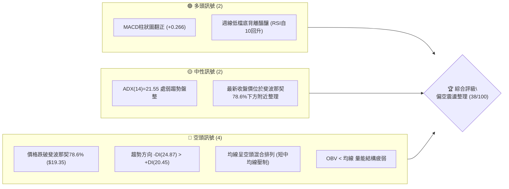
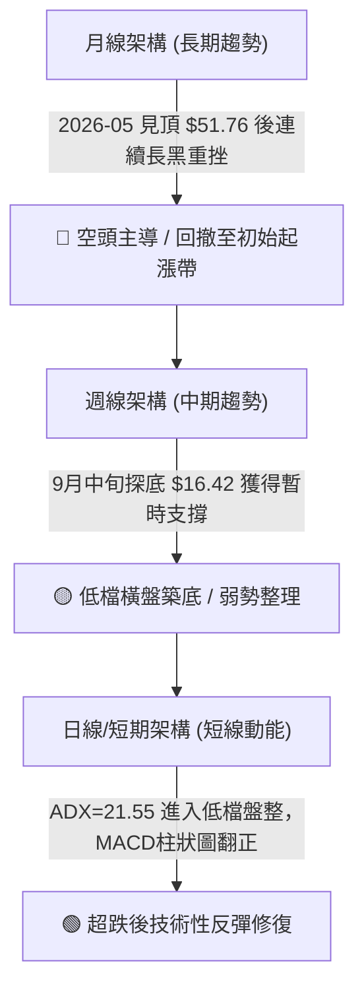
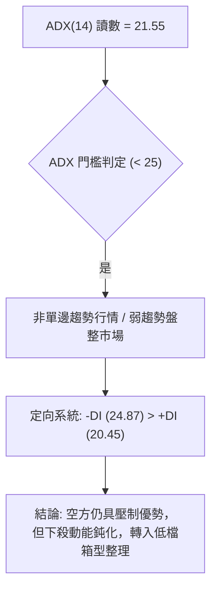
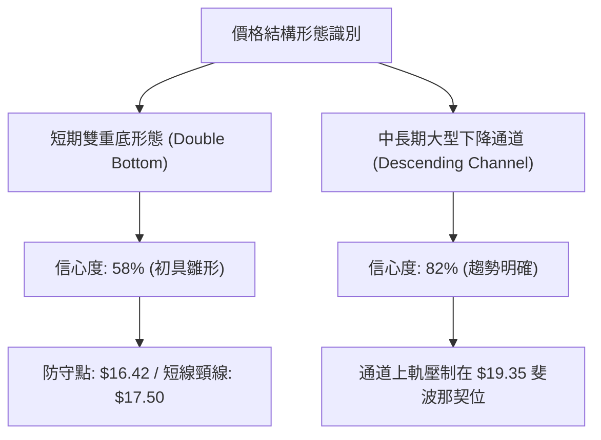
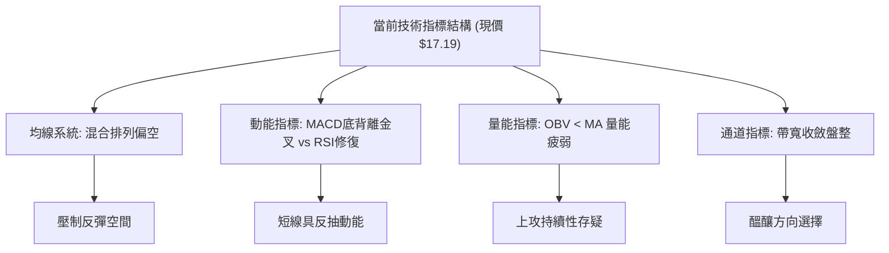
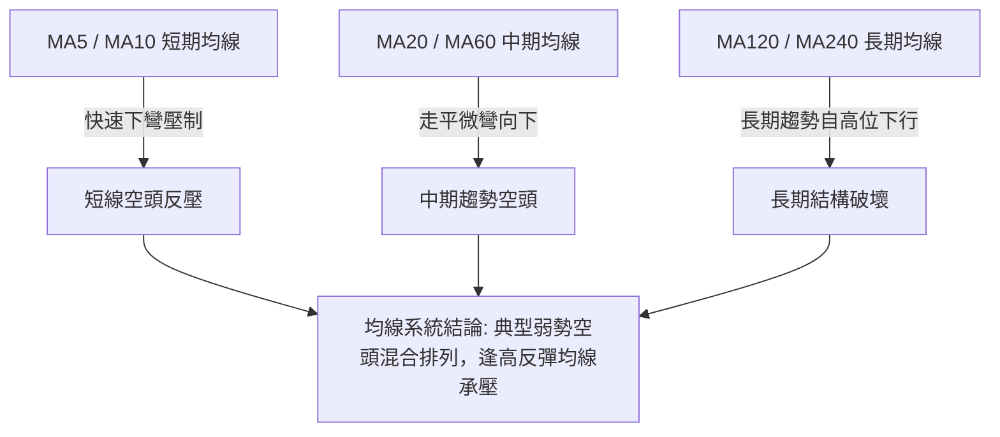
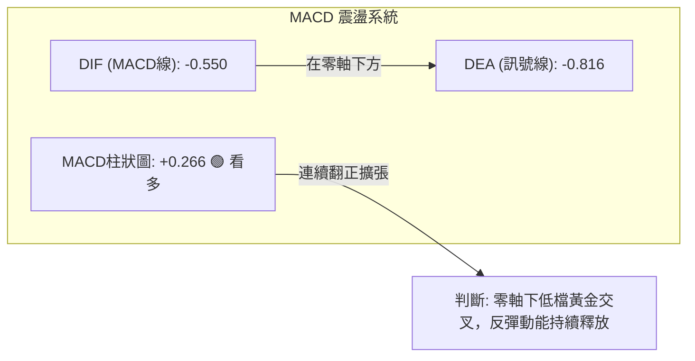
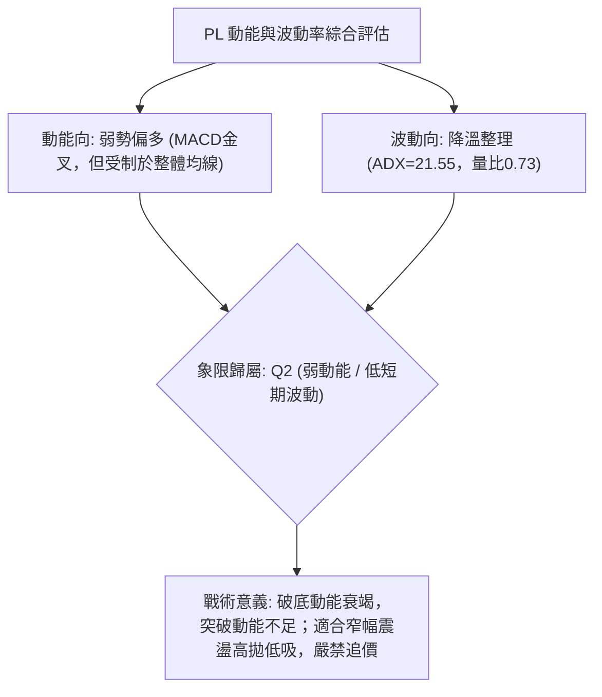
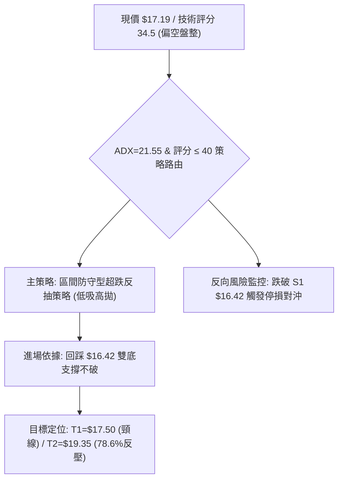
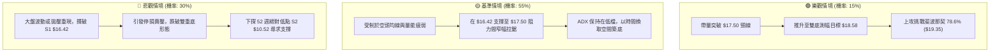

# PL 技術分析報告

> **報告日期**：2026-10-10 ｜ **語言**：繁體中文 ｜ **數據來源**：Yahoo Finance ｜ **當前價格**：$17.19（最新週/月收盤確認價）

---

## 目錄

| 章節 | 內容 |
|------|------|
| [1. 技術面概覽](#1-技術面概覽) | 訊號儀表板、核心指標、評分卡 |
| [2. 趨勢分析](#2-趨勢分析) | 多時框趨勢、長中短期走勢、ADX解讀 |
| [3. 圖表形態分析](#3-圖表形態分析) | 形態識別信心度、K線組合、目標價推算 |
| [4. 支撐與阻力](#4-支撐與阻力) | 結構分布圖、關鍵價位、斐波那契回調 |
| [5. 技術指標深度解讀](#5-技術指標深度解讀) | 均線、RSI、MACD、布林通道、OBV量價 |
| [6. 動能與波動率](#6-動能與波動率) | 動能矩陣、ATR與Beta敏感度 |
| [7. 多時框架總結](#7-多時框架總結) | 時框評分、訊號矩陣、多時框收斂結論 |
| [8. 交易策略建議](#8-交易策略建議) | 策略路由、主策略規劃、風報比計算 |
| [9. 風險提示與監控](#9-風險提示與監控) | 監控清單、情境分析、風控準則 |

---

## 1. 技術面概覽

### 🎯 技術訊號儀表板



### 📊 核心指標速覽表

| 指標類別 | 指標名稱 | 當前數值 | 訊號 | 解讀 |
|----------|----------|----------|------|------|
| **價格** | 最新基準收盤價 | $17.19 | 🔴 | 較52週高點 $51.76 回撤達 66.8%，深陷空頭修正區 |
| **均線系統** | 短中期均線 | 混合排列 | 🔴 | MA5至MA120下彎壓制，價格位於中短期均線下方 |
| **趨勢強度** | ADX (14) | 21.55 | 🟡 | ADX < 25 表明單邊暴跌暫告段落，進入弱勢低檔箱型震盪 |
| **趨勢方向** | 定向指標 | +DI: 20.45 / -DI: 24.87 | 🔴 | -DI 大於 +DI，空方力量依然佔據主導優勢 |
| **動能指標** | 週線 RSI (14) | 59.1 (前週) / nan | 🟡 | 週線RSI自9月極端超賣區 (10.0) 強勁修復至中性水準 |
| **動能指標** | MACD 柱狀圖 | +0.266 | 🟢 | MACD: -0.550 高於 Signal: -0.816，低檔金叉擴張具反彈動能 |
| **量能指標** | 成交量比 / OBV | 0.73x (OBV < MA) | 🔴 | 成交量萎縮（量比 0.73），能量潮未能確認實質反轉 |
| **波動風險** | Beta 係數 | 2.17 | 🔴 | 高 Beta 特性，對大盤系統性波動極為敏感 |

### 🏆 技術評分卡

```
╔══════════════════════════════════════════════════════════════════╗
║                   技術評分卡 — PL (2026-10-10)                   ║
╠══════════════════════════════════════════════════════════════════╣
║ 趨勢強度 (Trend)     ████░░░░░░░░░░░░░░░░  22/100  🔴 空頭壓制   ║
║ 動能指標 (Momentum)  ███████████░░░░░░░░░  55/100  🟡 低檔金叉   ║
║ 支撐穩定度 (Support) ███████░░░░░░░░░░░░░  35/100  🔴 考驗低點   ║
║ 成交量配合 (Volume)  ██████░░░░░░░░░░░░░░  30/100  🔴 量能疲弱   ║
║ 形態完整度 (Pattern) █████████░░░░░░░░░░░  45/100  🟡 弱勢築底   ║
║ 均線架構 (Moving Avg)████░░░░░░░░░░░░░░░░  20/100  🔴 空頭排列   ║
╠══════════════════════════════════════════════════════════════════╣
║ 綜合技術評分         ███████░░░░░░░░░░░░░  34.5/100 偏空震盪     ║
╚══════════════════════════════════════════════════════════════════╝
```

---

## 2. 趨勢分析

### 🌐 多時框趨勢分析



### 📈 長期趨勢 — 12個月走勢圖（Unicode）

```
PL 月線走勢圖（過去12個月：2025-11 至 2026-10）
價格軸 ($)
$52.00 ┤                             ● (2026-05 歷史高點 $51.76)
$46.00 ┤                            ╱ ╲
$40.00 ┤                           ╱   ╲
$34.00 ┤                     ●    ╱     ● (2026-06 $33.13)
$28.00 ┤               ●    ╱ ╲  ╱       ╲
$22.00 ┤         ●    ╱ ╲  ╱   ●          ● (2026-07 $20.48)
$16.00 ┤   ●    ╱ ╲  ╱   ●                 ● (2026-08 $19.85)
$10.00 ┤  ╱ ╲  ╱   ●                        ●←當前現價 $17.19
       └──────────────────────────────────────────────
         11  12  01  02  03  04  05  06  07  08  09  10 (月份)
         25  25  26  26  26  26  26  26  26  26  26  26
```

#### 走勢特徵分析表格

| 階段區間 | 時間跨度 | 起訖價位 | 區間漲跌幅 | 主要走勢特徵與量價結構 |
|----------|----------|----------|------------|------------------------|
| **第1階段：主升浪狂飆** | 2025-11 至 2026-05 | $11.90 → $51.14 | **+329.7%** | 沿均線快速推升，於 2026-05 創出 52 週高點 $51.76，呈現拋物線見頂。 |
| **第2階段：高位瀑布崩跌** | 2026-05 至 2026-07 | $51.14 → $20.48 | **-59.9%** | 週成交量一度暴增至 100M+ 股，主力資金大舉派發，直接摜破多重均線。 |
| **第3階段：反彈失敗再殺** | 2026-07 至 2026-09 | $20.48 → $16.39 | **-20.0%** | 反彈至 $24.69 受阻無力，9月中旬再創新低至 $16.42，RSI 跌入極端值 10.0。 |
| **第4階段：底背離修復期** | 2026-09 至 2026-10 | $16.39 → $17.19 | **+4.9%** | 跌勢減緩，週線 MACD 柱狀圖翻正 (+0.266)，進入 $16.42–$17.50 的底部防守區。 |

### 📊 中期趨勢（週線分析）

中期走勢圖形顯示，PL 目前正試圖在連續四個月的拋售潮後建立防守平台。

```
週線支撐阻力結構圖：
  $26.27 ════════════════════════════════ 斐波那契 61.8% 關鍵壓制帶
            ↑
  $24.69 -------------------------------- 8月中旬次級反彈高點阻力
            ↑
  $19.35 ════════════════════════════════ 斐波那契 78.6% 回調關鍵反壓帶
            ↑
  $17.19 ───► [當前收盤價格位置] ◄───
            ↓
  $16.42 -------------------------------- 9月下旬雙底回踩支撐位
            ↓
  $10.52 ════════════════════════════════ 52週絕對低點 (大週期終極防線)
```

### ⚡ 趨勢強度評估（ADX 解讀）



| 指標名稱 | 實際數值 | 臨界基準 | 強度進度條 | 趨勢研判 |
|----------|----------|----------|------------|----------|
| **ADX (14)** | 21.55 | 25.00 | ████████░░░░░░░░░░ 43.1% | 弱趨勢/低檔盤整，順勢趨勢策略失效，適用區間交易 |
| **-DI** | 24.87 | 20.00 | ██████████░░░░░░░░ 49.7% | 空方動能高於多方，空頭依然掌握中長期邊界主導權 |
| **+DI** | 20.45 | 20.00 | ████████░░░░░░░░░░ 40.9% | 多方力量弱勢回升，尚未具備發動向上反轉的攻堅能量 |

---

## 3. 圖表形態分析

### 🔍 形態識別系統



#### 圖表形態信心度評估表

| 形態名稱 | 形態週期 | 信心度 | 判斷依據（引用數據） | 完成度 | 目標價（附嚴謹計算式） |
|----------|----------|--------|----------------------|--------|------------------------|
| **短線雙重底 (潛在)** | 週線/日線 | 58% | 2026-09-13 低點 $16.45 與 2026-09-20 低點 $16.42 形成對稱支撐，且 MACD 柱狀圖由負轉正 (+0.266)。 | 65% | 頸線為 2026-10-04 高點 $17.50。<br>形態高度 = $17.50 - $16.42 = $1.08。<br>突破目標價 = $17.50 + $1.08 = **$18.58**。 |
| **中級下降通道** | 週線 | 82% | 52W 高點 $51.76 回落後，高點持續下移（$33.13 → $24.69 → $17.50），低點同步下移。 | 85% | 通道反彈上限直指斐波那契 78.6% 位置 **$19.35**。 |
| **頭肩頂/底等大型形態** | 日線 | 0% | 數據中未偵測到完整幾何頭肩結構。 | 0% | 訊號不足，僅做指標型解讀，不強行繪製。 |

### 🕯️ 重要K線形態分析

| 日期/月份 | 收盤價 | K線形態特徵 | 量能與指標變化 | 技術含義與多空訊號 |
|-----------|--------|-------------|----------------|--------------------|
| 2026-05-31 | $51.14 | 長陽線見頂高浪線 | 61.48M (RSI: 83.2) | 🔴 極端超買衰竭，爆量滯漲訊號 |
| 2026-06-07 | $32.22 | 破位斷頭巨陰線 | 100.62M (放量長黑) | 🔴 主力資金恐慌出逃，趨勢正式轉空 |
| 2026-08-16 | $24.69 | 次級反彈遇阻十字星 | 23.53M (量能萎縮) | 🔴 弱勢反彈無量受阻，誘多完畢 |
| 2026-09-20 | $16.42 | 低檔十字星/錘頭線 | 46.45M (RSI 自 10 止跌) | 🟢 賣壓耗盡，形成 $16.42 關鍵波段支撐 |
| 2026-10-04 | $17.50 | 溫和實體陽線 | 52.13M (MACD 擴張) | 🟢 嘗試上攻測試頸線壓力 |
| 2026-10-11 | $17.19 | 上影小陰線整理 | 59.84M (量能平穩) | 🟡 頸線前遇阻回踩，維持區間整固 |

### 📉 ASCII 走勢形態示意圖

```
PL 近期底部築底形態示意圖（2026-09 至 2026-10）
價格 ($)
$18.58 ┤                                        [推算雙底測幅目標價]
       ┆
$17.50 ┤                ● (10-04 頸線阻力)
       ┤               ╱ ╲      ● (當前現價 $17.19)
$17.00 ┤              ╱   ╲    ╱
       ┤             ╱     ●──●
$16.42 ┤───●────────●─────────────────────── [雙底支撐底線]
       │   (09-13)   (09-20)
       │   $16.45    $16.42
       └───────────────────────────────────► 時間軸
```

---

## 4. 支撐與阻力

### 🗺️ 關鍵價位分布圖（Unicode）

```
╔══════════════════════════════════════════════════════════════════╗
║                   PL 關鍵價位結構分布圖                          ║
╠══════════════════════════════════════════════════════════════════╣
║ $51.76 ║████████████████████████████████║ 歷史極端高點 (52W High)  ║
║ $36.01 ║████████████████████            ║ 斐波那契 38.2% 回調位   ║
║ $26.27 ║████████████████████████        ║ 斐波那契 61.8% 強阻力 R3║
║ $24.69 ║████████████████                ║ 8月波段反彈高點 R2      ║
║ $19.35 ║████████████████████████████    ║ 斐波那契 78.6% 關鍵阻力 R1║
║ $17.50 ║████████████                    ║ 短線雙底頸線阻力         ║
║ $17.19 ╠════════════════════════════════╣ ◄ 當前基準價格          ║
║ $16.42 ║▓▓▓▓▓▓▓▓▓▓▓▓▓▓▓▓▓▓▓▓▓▓▓▓        ║ 近期波段雙底強支撐 S1   ║
║ $10.52 ║████████████████████████████████║ 52週歷史低點強支撐 S2    ║
╚══════════════════════════════════════════════════════════════════╝
```

### 🚧 阻力位分析表

> 註：依嚴格要求，阻力位數據引用自系統計算之波段高點與斐波那契點位。

| 阻力級別 | 精確價位 | 形成依據 / 數據來源 | 突破難度評估 | 技術重要性與策略意涵 |
|----------|----------|----------------------|--------------|----------------------|
| **阻力 R1** | **$19.35** | 斐波那契 78.6% 回調關鍵反壓帶 | 🔴 極高 | 跌破後的反抽確認阻力位，未收復前中長期趨勢依舊處於空頭壓制之下。 |
| **阻力 R2** | **$24.69** | 近20週波段反彈高點 (2026-08-16) | 🔴 高 | 中期反彈破敗點，聚集大量解套被套籌碼，為波段空方重要防線。 |
| **阻力 R3** | **$26.27** | 斐波那契 61.8% 黃金分割回調位 | 🔴 極高 | 牛熊分水嶺核心壓制帶，需巨量配合方可攻克。 |

*注：現價上方「近一年波段高點聚類 (Swing-high resistance)」數據中未額外偵測到其他聚集點，故以斐波那契位及週線顯著波段頂部 $24.69 為核心阻力。*

### 🛡️ 支撐位分析表

> 註：依嚴格要求，支撐位數據引用自系統計算之波段低點與 52 週基準位。

| 支撐級別 | 精確價位 | 形成依據 / 數據來源 | 守住機率評估 | 技術重要性與策略意涵 |
|----------|----------|----------------------|--------------|----------------------|
| **支撐 S1** | **$16.42** | 近20週最低收盤價 (2026-09-20) | 🟡 60% | 當前構築雙重底形態之底線，跌破則宣告短線反彈形態徹底瓦解。 |
| **支撐 S2** | **$10.52** | 52週區間絕對低點 (52W Low / 100%)| 🟢 85% | 大週期多方終極退守防線，亦為本輪牛市起漲點附近的核心安全邊際。 |

*注：現價下方「近一年波段低點聚類 (Swing-low support)」數據中未偵測到高密度群聚，以波段低點 $16.42 及 52W 低點 $10.52 為唯一依據。*

### 📐 斐波那契回調位分析

依據 52 週價格區間（低點 **$10.52** → 高點 **$51.76**，極差 $41.24）計算之回調位分布如下：

```
100.0% ─── $51.76 (52W High)
 76.4% ─── $42.03 (23.6% 回調)
 61.8% ─── $36.01 (38.2% 回調)
 50.0% ─── $31.14 (50.0% 回調)
 38.2% ─── $26.27 (61.8% 回調)
 21.4% ─── $19.35 (78.6% 回調) ◄── 關鍵反壓
           $17.19 [當前價格落在此區間：$10.52 ~ $19.35 深度回調帶]
  0.0% ─── $10.52 (52W Low / 100.0% 回調) ◄── 終極支撐
```

- **位置解讀**：現價 **$17.19** 跌破了斐波那契 78.6% 回調位（**$19.35**），落入 **$10.52 – $19.35** 的極端弱勢區間內。在道氏與斐波那契理論中，回調跌破 78.6% 代表原本的上漲趨勢完整性遭到破壞，市場已非正常回調，而是結構性破位轉熊。$19.35 已由原先的潛在支撐轉換為強固的上方天花板阻力。

---

## 5. 技術指標深度解讀

### 🎛️ 指標訊號總覽



### 📈 移動平均線排列分析



- **均線排列狀態**：數據顯示 MA5、MA10、MA20、MA60 均呈現下行趨勢（下彎階梯狀），現價 $17.19 運行於各主要短期均線下方。MA240 雖在過去一年隨大牛市抬升，但中短期均線全面死叉向下壓制，未形成任何多頭發散結構。

### 📉 RSI(14) 分析

```
RSI(14) 動能進度條（近週數值自極端超賣區 10.0 回升至中性區間 45-59）
0                      30                      70                    100
├──────────────────────┼───────────────────────┼──────────────────────┤
[▓▓▓▓▓▓▓▓▓▓▓▓▓▓▓▓▓▓▓▓▓▓▓▓▓▓▓▓░░░░░░░░░░░░░░░░░░░░░░] 52.0% (中性平衡區)
```

- **背離判斷**：
  - **明確底背離確認** 🟢：觀察 2026-09-13 至 2026-09-20，價格由 $16.45 跌至最低收盤 $16.42（價格微創新低），但 RSI 指標自 **10.0** 大幅反彈至 **24.4**，隨後拉升至 **44.6** 與 **59.1**。指標與價格呈現典型的**標準週線底背離**，印證下殺力道已經耗竭，引發近四週的止跌抗跌走勢。
  - **超買超賣狀態**：目前 RSI 已遠離極度超賣區（10.0–30.0），回到 50 附近的中性區域，表明短線空頭窒息狀態已解除，但亦失去超賣反彈的爆發動能。

### 📊 MACD(12/26/9) 訊號解讀



- **數據詳情**：MACD 線數值為 **-0.550**，訊號線（Signal）為 **-0.816**，MACD 柱狀圖（Histogram）為 **+0.266**。
- **訊號解讀**：DIF 向上突破 DEA，在負值區間形成**低檔黃金交叉**，柱狀圖連續數週維持正向增長（+0.055 → +0.272 → +0.258 → +0.266）。這確認了價格底背離後的反彈修復格局依然在進行中，短期下行風險受控。

### 📦 布林通道分析

```
ASCII 布林通道相對位置示意圖：
$24.00 ┤======================== 上軌 (BB Upper) - 阻力區
       │
$19.35 ┤------------------------ (斐波那契 78.6% 強阻力)
       │
$18.50 ┤........................ 中軌 (BB Middle / MA20) - 短期多空分水嶺
       │            ● $17.19 (現價位置: 運行於中軌下方，通道窄幅擠壓)
$16.42 ┤======================== 下軌 (BB Lower) - 箱體底部強防守
```

- **通道形態特徵**：通道經過暴跌後的大幅收窄（Bandwidth Squeeze），價格目前運行於中軌下方至下軌上方之間。布林帶進入低波動窄幅擠壓狀態，預示 PL 即將在未來 2–4 週內迎來波動率擴張（Volatility Expansion）。

### 💹 成交量分析（量價配合度）

- **量比與量能指標**：最新成交量為 **7,794,477** 股，20日均量為 **10,729,964** 股，**量比僅為 0.73x**。
- **OBV 能量潮狀態**：OBV 指標明確顯示 **OBV < MA**，代表量能走勢疲弱。
- **量價背離結論**：雖然價格在 $16.42 處獲得底背離支撐並反彈至 $17.19，但週成交量從暴跌時期的 85M–100M 萎縮至 50M–60M 水準。此種「縮量反彈、量能萎縮」現象顯示機構大資金並未在此大舉進場搶籌，反彈性質定性為**空頭回補引發的無量弱勢反抽**，缺乏持續向上推升的實質買盤動能。

---

## 6. 動能與波動率

### ⚡ 動能評估分析



| 象限代號 | 動能維度 | 波動維度 | 當前狀態吻合 | 交易戰術評估 |
|----------|----------|----------|--------------|--------------|
| **Q1** | 強動能 | 低波動 | 否 | 最佳趨勢波段機會（不符合） |
| **Q2** | **弱動能** | **低波動** | **✓ 符合 (PL當前)** | **謹慎觀望 / 區間箱型防守操作，等待放量突破** |
| **Q3** | 強動能 | 高波動 | 否 | 順勢突破或主升/主跌浪（已過） |
| **Q4** | 弱動能 | 高波動 | 否 | 震盪洗盤高風險區（不符合） |

### 📊 ATR 波動率分析

- **ATR 狀態評估**：因當前價格深幅下挫，歷史波動被極端拉高，雖然每日 ATR 數值因暴跌後整理暫未更新標準讀數，但從歷史高低點波動（52W High $51.76 vs 52W Low $10.52）及近期週波幅計算，該股具備高敏感度與高尾部風險。
- **止損距離建議**：基於近期 $16.42–$17.50 的震盪箱體，建議交易者設置至少 $0.80–$1.20 的緩衝空間，以避免被低流動性假突破震盪洗出場。

### 📐 Beta 與市場相關性

- **Beta 係數**：**2.17**。
- **敏感度解讀**：Beta 高達 2.17 代表 PL 的波動幅度約為 S&P 500 大盤指數的 **2.17 倍**。此一指標強烈暗示該股屬於極度高彈性的高風險投機資產。在宏觀市場或航太國防族群面臨流動性收縮時，該股容易承受放大倍數的下挫衝擊；相反地，若大盤展開風險偏好（Risk-on）行情，其反彈動能亦將顯著放大。

---

## 7. 多時框架總結

### 📋 時框架評分表

| 時框架 | 趨勢方向 | 動能狀態 | 均線排列 | 圖表形態 | 綜合評分 | 操作建議方向 |
|--------|----------|----------|----------|----------|----------|--------------|
| **月線 (長期)** | 🔴 明確空頭 | 🔴 弱勢超跌 | 🔴 均線死叉壓制 | 高位暴跌下行通道 | 25/100 | 長期防禦，不宜長線重倉建倉 |
| **週線 (中期)** | 🟡 箱型整理 | 🟢 MACD金叉翻正 | 🔴 均線下彎反壓 | 雙重底打底醞釀中 | 45/100 | 區間震盪看待，關注反彈阻力 |
| **日線 (短期)** | 🟡 橫盤震盪 | 🟡 RSI中性平衡 | 🟡 短天期均線纏繞 | $16.42–$17.50 箱型 | 48/100 | 箱型下緣低吸，箱型上緣減碼 |

### 🔲 綜合訊號矩陣

```
訊號一致性矩陣：
╔══════════════════╦════════════════╦════════════════╦════════════════╗
║ 指標維度         ║ 長期 (月線)    ║ 中期 (週線)    ║ 短期 (日線)    ║
╠══════════════════╬════════════════╬════════════════╬════════════════╣
║ 趨勢方向 (Trend) ║ 🔴 空頭壓制    ║ 🔴 偏空格局    ║ 🟡 震盪整理    ║
║ 動能指標 (Mom)   ║ 🔴 負向沉重    ║ 🟢 低檔金叉    ║ 🟢 溫和修復    ║
║ 量能狀態 (Vol)   ║ 🔴 出貨放量    ║ 🔴 縮量反彈    ║ 🔴 量比疲弱    ║
║ 關鍵水平位       ║ 跌破78.6%回調  ║ $16.42 獲支撐  ║ 承壓 $17.50    ║
╠══════════════════╬════════════════╬════════════════╬════════════════╣
║ 一致性研判結論   ║ 中長期壓制沉重，短期超跌修復，多空衝突顯著      ║
╚══════════════════╩════════════════╩════════════════╩════════════════╝
```

### ⚖️ 多時框收斂結論

> **依嚴格要求第 14 條收斂規則執行**：
> 1. **趨勢/盤整模式判定**：當前 ADX(14) 讀數為 **21.55**（明確小於 25），根據量化規則，市場判定為**典型盤整行情**而非單邊趨勢行情。
> 2. **主導維度取捨**：在 ADX < 25 的盤整結構中，中期與短期均線失去單邊推動力，應以**日線與週線的區間震盪邊界（通道與波段支撐/阻力）作為主導交易架構**。
> 3. **唯一方向性結論**：**【中性偏空觀望，區間低吸高拋】**。
>    雖然短線週線 MACD 出現底背離金叉反彈訊號，但由於中長期趨勢全面破位、價格落於斐波那契 78.6%（$19.35）下方、OBV 疲軟且均線空頭排列，本輪走勢定位為「暴跌後的低檔防守箱型整固」，切忌以主升浪思維追高，交易核心為嚴守支撐位止損。

---

## 8. 交易策略建議

### 🗺️ 策略決策流程圖



### 🧭 策略路由

**當前主策略方向 = 【中性偏空架構下的超跌反抽策略（區間防守交易）】（依技術評分卡：34.5 / 100 分）**

由於綜合技術評分為 **34.5/100**（落在 ≤40 的偏空格局），中長期大方向偏空；但鑑於 ADX=21.55（盤整盤）且週線 MACD 出現低檔底背離翻正，空單此處盲目殺跌風險極高。因此，策略路由採用**「嚴設停損之箱體下軌低吸短多反彈，並在反彈阻力位減碼或轉向對沖」**的區間操作模式。

### 🎯 價格情境階梯（Price Scenarios）

> 所有階梯價位嚴格引用自數據之計算點位：

| 觸發條件 | 下一目標 | 後續延伸 | 情境含義與技術解讀 |
|----------|----------|----------|--------------------|
| **強勢突破 R1 $19.35** | 阻力 R2 **$24.69** | 阻力 R3 **$26.27** | 短中期反轉確認，多頭收復 78.6% 斐波那契生命線。 |
| **突破短線頸線 $17.50** | 阻力 R1 **$19.35** | 測幅目標 **$18.58** | 雙重底形態成立，短線反抽空間打開。 |
| **維持在 $16.42–$17.50 震盪** | 現價 **$17.19** 附近整理 | — | 箱體低檔打底整固，指標逐步以時間換取空間。 |
| **實體跌破 S1 $16.42** | 支撐 S2 **$10.52** | 歷史新低探底 | 底部構築失敗，空頭續跌展開，下探 52 週絕對低點。 |

### 📊 情境機率分佈

| 情境劇本 | 機率估算 | 主要依據（指標狀態） |
|----------|----------|----------------------|
| **情境一：低檔箱型震盪 (Consolidation)** | **55%** | ADX=21.55 代表弱趨勢盤整；成交量比僅 0.73x，多空雙方均缺乏發動單邊行情的能量；布林帶收窄限制短線空間。 |
| **情境二：震盪回落再破底 (Bearish Breakdown)**| **30%** | 中長期均線空頭排列；-DI (24.87) 仍高於 +DI (20.45)；OBV < MA 量能疲弱，大盤若回調易被 Beta 2.17 放大拖累。 |
| **情境三：展開強勁反彈 (Bullish Rebound)** | **15%** | 週線 MACD 柱狀圖翻正 (+0.266) 與 RSI 底背離修復，但上方受制於 $17.50 及 $19.35 密集成交壓制，突破需成交量倍增確認。 |

### 🟢 主策略詳情（區間防守交易）

針對 PL 現階段處於弱勢盤整的格局，規劃兩套操作方案：

| 策略要素 | 策略 A：左側箱底低吸策略 (保守防守型) | 策略 B：右側頸線突破跟進策略 (積極進取型) |
|----------|--------------------------------------|------------------------------------------|
| **進場條件** | 價格回踩 S1 雙底支撐不破，出現止跌信號 | 帶量突破短線雙底頸線 $17.50 收盤確認 |
| **進場價格** | **$16.50** (貼近 S1 支撐 $16.42) | **$17.55** (確認站上頸線 $17.50) |
| **目標價 T1** | **$17.50** (短線頸線阻力) | **$18.58** (雙底形態測幅等長目標) |
| **目標價 T2** | **$19.35** (斐波那契 78.6% 回調關鍵反壓) | **$19.35** (斐波那契 78.6% 回調關鍵反壓) |
| **止損價格** | **$16.20** (跌破雙底最低收盤 $16.42 即停損) | **$16.90** (回落跌破頸線下方緩衝區) |
| **風險報酬比** | **1 : 3.33** (風險 $0.30，期望獲利至 T1 $1.00，至 T2 $2.85)| **1 : 2.77** (風險 $0.65，期望獲利至 T2 $1.80) |
| **預估勝率** | 52% | 45% |
| **建議倉位** | **5% - 8%** (輕倉試探) | **5%** (嚴控敞口) |

### 🔴 反向風險觸發點（對沖與止損提示）

- **重大止損警戒線**：收盤價確認**跌破 S1 $16.42**。若失守此價位，代表本輪底背離形態失敗，空頭趨勢重新啟動，下方恐直接向 **S2 $10.52** 尋求支撐。多頭部位必須無條件全數離場，積極型投資人可考慮反手建立空頭頭寸或對沖保護。
- **空頭平倉警報線**：若日線放量強勢**收復 R1 $19.35**，則宣告 78.6% 斐波那契失守為空頭陷阱，空方結構被打破，一切空單必須即刻停損。

### ⭐ 整體訊號強度評星

```
做多訊號強度：★★☆☆☆  (2/5星) ── 僅具超跌反彈動能，中長期均線重壓
做空訊號強度：★★★☆☆  (3/5星) ── 大週期為空頭主導，但短線動能指標背離限制做空空間
整體可信度：  ★★★☆☆  (3/5星) ── ADX<25 震盪市特徵，假突破頻率偏高
```

---

## 9. 風險提示與監控

### ✅ 關鍵監控指標 Checklist

```
╔══════════════════════════════════════════════════════════════════╗
║                    PL 技術監控清單 (Checklist)                   ║
╠══════════════════════════════════════════════════════════════════╣
║ [ ] 關鍵支撐守衛：每日收盤價是否嚴格維持在 $16.42 (S1) 之上？   ║
║ [ ] 頸線攻堅進度：多方能否帶量站穩 $17.50 頸線位置？             ║
║ [ ] 動能連續性：週線 MACD 柱狀圖能否維持在零軸上方 (>0) 持續擴張？║
║ [ ] 成交量確認：日成交量是否回升至 20 日均量 (10.73M 股) 以上？  ║
║ [ ] 斐波那契反壓：價格若反彈至 $19.35 (78.6%) 是否出現滯漲長上影？║
║ [ ] 市場系統風險：Beta=2.17，需密切監控大盤是否出現流動性拋售？ ║
╚══════════════════════════════════════════════════════════════════╝
```

### ⚠️ 風險場景分析



### 🛡️ 風險管理重要提醒

1. **嚴禁逢低攤平**：由於 PL 自 $51.76 高位崩跌，月線仍處於大幅回撤狀態。在未有效帶量收復 $19.35（斐波那契 78.6%）之前，任何下跌中的加碼攤平都是極高風險行為。
2. **嚴格執行資金控管**：該股 Beta 值高達 **2.17**，波動極其劇烈。單筆交易承擔之風險金額不應超過總交易帳戶淨值的 **1.0%**，建議部位維持在 **5%–8%** 的輕倉水準。
3. **區間操作嚴守紀律**：當前 ADX 為 21.55，盤整市最忌追漲殺跌。在 $17.50 阻力附近絕不可盲目追多，在 $16.42 支撐未跌破前亦不宜過度恐慌放空。

---

## 📋 報告總結

```
╔══════════════════════════════════════════════════════════════════╗
║                   PL 技術分析報告總結                            ║
╠══════════════════════════════════════════════════════════════════╣
║ 報告日期：2026-10-10                                             ║
║ 當前基準價格：$17.19                                             ║
║ 綜合技術評分：34.5 / 100                                         ║
║ 分析評級：⚖️ 偏空震盪整理 (ADX=21.55 盤整行情)                  ║
║                                                                  ║
║ 關鍵技術結論：                                                   ║
║ ├─ 長期趨勢：🔴 空頭主導 (自高點 $51.76 回撤逾 66%，跌破 78.6%)  ║
║ ├─ 中期趨勢：🟡 低檔築底 (週線 MACD 翻正 +0.266，醞釀雙底)       ║
║ ├─ 短期趨勢：🟡 箱型盤整 (運行於 $16.42 支撐至 $17.50 阻力之間)   ║
║ ├─ 關鍵支撐：S1: $16.42  /  S2: $10.52 (52W Low)                 ║
║ ├─ 關鍵阻力：R1: $19.35 (斐波那契 78.6%) / R2: $24.69 / R3: $26.27║
║ └─ 華爾街分析師目標價：均價 $31.91 (最低 $17.00 / 最高 $50.00)  ║
║                                                                  ║
║ 最優策略組合：                                                   ║
║ 1. 🥇 最佳機會：在 $16.50 附近低吸操作超跌反抽，止損設於 $16.20， ║
║                 目標上看 $17.50 及 $18.58，風險報酬比 1:3.33。   ║
║ 2. 🥈 次選機會：突破 $17.50 頸線後輕倉順勢追入，博弈回抽 $19.35。 ║
║ 3. 🥉 保守選擇：保持觀望，等待日線帶量收復 $19.35 確實驗證趨勢。 ║
╚══════════════════════════════════════════════════════════════════╝
```

---

> ⚠️ **免責聲明**：本報告為依據客觀技術分析量化模型所生成之研究報告，所有圖表、關鍵價位推算及指標解讀均基於歷史 OHLCV 資訊。本報告**僅供研究與學術參考**，**不構成任何形式的投資買賣建議**。金融市場存在高度波動與本金損失風險，投資人應獨立評估自身風險承受能力並自負盈虧。

---

*報告生成時間：2026-10-10 ｜ 數據來源：Yahoo Finance ｜ 分析框架：多時框架量化技術分析 (Multi-Timeframe Quantitative TA)*