<details>
<summary>📊 靜態圖表 (點擊展開)</summary>

</details>

<html>
<head><meta charset="utf-8" /></head>
<body>
    <div style="height:500px; width:100%;">                        <script>window.PlotlyConfig = {MathJaxConfig: 'local'};</script>
        <script charset="utf-8" src="https://cdn.plot.ly/plotly-3.7.0.min.js" integrity="sha256-jvTGqxNp8AGWEcvNLVuKr+8j5dGe9Yw51LQkmDH+IYA=" crossorigin="anonymous"></script>                <div id="candlestick-chart" class="plotly-graph-div" style="height:100%; width:100%;"></div>            <script>                window.PLOTLYENV=window.PLOTLYENV || {};                                if (document.getElementById("candlestick-chart")) {                    Plotly.newPlot(                        "candlestick-chart",                        [{"close":{"dtype":"f8","bdata":"AAAAoJnRZkAAAACA63FmQAAAAADXY2ZAAAAAgD0yZkAAAAAghVtmQAAAAKBwzWZAAAAAYGYeZ0AAAACgmWFnQAAAAIA9omVAAAAAwPVwZkAAAACgcMVmQAAAAIDr8WZAAAAAQAovZ0AAAACAFO5lQAAAAGC4JmZAAAAAIK53ZkAAAAAA13NmQAAAAADXQ2ZAAAAAwMxEZkAAAABA4bJmQAAAAOBRsGZAAAAAIK7vZUAAAAAgXI9mQAAAAAApFGdAAAAAgMKlZ0AAAABAM7NnQAAAAIDr2WhAAAAAoJlRaEAAAABACg9pQAAAAIDC5WlAAAAAIK7XZ0AAAADAzHxnQAAAAKCZ4WVAAAAAgMI9ZkAAAAAghTNoQAAAAGC43mdAAAAAoHAFZ0AAAADgeoRlQAAAAOBRwGVAAAAAAABoZUAAAABgj+pkQAAAAKBwrWRAAAAAANd3Y0AAAABAM1tjQAAAAAAASGRAAAAAoJlxZEAAAADgo7hkQAAAAGBmDmVAAAAAIK7vZEAAAACAFFZlQAAAAGCPAmZAAAAAoHA9ZkAAAADgUbhmQAAAACCur2ZAAAAAQOG6ZkAAAADAHn1nQAAAAKBHcWdAAAAAgD3yZkAAAAAAAOhmQAAAAAAAeGdAAAAAoEcpZkAAAACAFDZnQAAAAAApLGhAAAAAIFw\u002faEAAAAAAKURoQAAAAKBwRWhAAAAAYLiWZ0AAAACAwgVnQAAAAEDhmmZAAAAAAAA4ZkAAAAAghftkQAAAAKBHwWVAAAAAYLh2ZkAAAACAwrVmQAAAACCFG2ZAAAAAIK4vZkAAAADAHm1mQAAAAGC4XmZAAAAAwMxMZkAAAACAPSJmQAAAAGC4XmVAAAAAwPUQZUAAAABgj6pkQAAAAMDMvGRAAAAAQDMzZUAAAABACu9kQAAAAGBmtmRAAAAAQDOrY0AAAAAghftiQAAAAEDhUmJAAAAA4FF4YkAAAAAAKbxjQAAAAKBHcWFAAAAA4FFAYEAAAADAzPxgQAAAAMAe3WFAAAAA4FFwYUAAAACAwvVgQAAAAAApJGBAAAAAwB5tYEAAAADgo6BgQAAAAAAp7GBAAAAA4HrcYEAAAAAgrudgQAAAAEAzU2BAAAAAQOEaYEAAAACAFMZgQAAAAIAU\u002fmBAAAAAgBQmYUAAAACgcCViQAAAAEAKZ2JAAAAAgBQmY0AAAACgcBVjQAAAAMAepWNAAAAAgMKNY0AAAADgeuRiQAAAAEAz82JAAAAAAAAwY0AAAABgZt5iQAAAAEAKF2NAAAAAYI9iY0AAAADgoxhjQAAAAIDCdWNAAAAAgMLVYkAAAABA4RpkQAAAAMD1WGNAAAAAYLheY0AAAACA63FiQAAAAIDr4WFAAAAAoJkxYUAAAADA9UhiQAAAACCuT2JAAAAAYLiOYkAAAACAwn1iQAAAAIA9wmJAAAAA4FGYYUAAAAAgrk9gQAAAAIDrAWBAAAAAANeLYEAAAABgZvZgQAAAAMDMxGFAAAAA4FHYYUAAAADgekxiQAAAAOB6PGJAAAAAQAo\u002fYkAAAAAA1xNjQAAAAIA9smFAAAAAQOHiYUAAAABAM+NhQAAAAIDCpWFAAAAAQAo\u002fYUAAAAAghWNhQAAAAIA9AmJAAAAAwPVAYkAAAADAHv1gQAAAAKBHuWBAAAAAoJkhYUAAAACgmTlhQAAAAOB6HGFAAAAAAAAAYUAAAACgmUFgQAAAACBct2BAAAAAIK6\u002fYEAAAADgeuRgQAAAAOBR6GBAAAAAwMwkYUAAAACgRy1hQAAAAAApHGFAAAAAQDMTYUAAAADgUZBgQAAAAEDh6mFAAAAAoEeRY0AAAADAzBRkQAAAAKBwBWNAAAAAYGbGYUAAAABgZrZhQAAAAMD18GBAAAAAQAoPYUAAAACAPYJgQAAAAGC4RmBAAAAAYI9iYEAAAAAgXP9fQAAAAGC41mBAAAAAAACoYEAAAAAAKVRgQAAAAEAKD2BAAAAAAADgXUAAAADAzCxdQAAAAAAAYFxAAAAAoEfRWkAAAAAghTtcQAAAAMDM7FxAAAAAQOEqXUAAAABguG5fQAAAAKCZKWBAAAAAoEeRYEAAAAAA18tgQAAAAEAKh2BAAAAAoEchYEAAAABgj7JfQA=="},"high":{"dtype":"f8","bdata":"AAAAAAA4Z0AAAABAMxtnQAAAAIA9CmdAAAAAANeDZkAAAAAgXK9mQAAAAOCj2GZAAAAAwPVIZ0AAAABgZoZnQAAAAEDhWmdAAAAAYGbeZkAAAACAwkVnQAAAAOBRCGdAAAAAANdzZ0AAAABAM2NnQAAAAEAKZ2ZAAAAAQOHKZkAAAABAMwtnQAAAAIA9GmdAAAAAQOGyZkAAAABA4eJmQAAAAMByzGZAAAAAYLjGZkAAAACA67FmQAAAAKBwRWdAAAAAYI8aaEAAAADA9fhnQAAAAEAz+2hAAAAAoHD1aEAAAACAwoVpQAAAAOCj8GlAAAAAYGZ2aEAAAACAPcpnQAAAAEDh4mdAAAAAYGZWZkAAAACAwl1oQAAAAKCZHWhAAAAAYI\u002fSZ0AAAABgZtZmQAAAAKBHKWZAAAAAIK7HZUAAAABgj5plQAAAAEAzM2VAAAAAgD3SZUAAAAAghcNjQAAAAKBwpWRAAAAAwMyUZEAAAAAg2QplQAAAAKCZGWVAAAAAQDMjZUAAAAAAAPhlQAAAAMAePWZAAAAAgBROZkAAAABg5cRmQAAAAAAp\u002fGZAAAAAQDPbZkAAAADgesxnQAAAAKCZgWdAAAAAwMxQZ0AAAADA9XhnQAAAAAAAkGdAAAAAAAB4Z0AAAABgj2pnQAAAAAAAYGhAAAAAACncaEAAAAAA12toQAAAAKBwZWhAAAAAQDOLaEAAAABgZmZnQAAAAABUF2dAAAAAwPWwZkAAAABAM6tmQAAAAIA9+mVAAAAAgBSGZkAAAADA9WhnQAAAAMAeNWdAAAAAQApXZkAAAAAAANBmQAAAAEAzo2ZAAAAA4CKzZkAAAABAM5NmQAAAAIDCzWZAAAAAQAp\u002fZUAAAAAgri9lQAAAAAAAIGVAAAAAAACAZUAAAABA4VJlQAAAAIAULmVAAAAAoHChZEAAAAAAKbRjQAAAAAAA4GJAAAAAwMzsYkAAAAAAf6JkQAAAAEAze2NAAAAAIFw\u002fYUAAAADg+zVhQAAAAADXO2JAAAAAgOsxYkAAAAAAAGhhQAAAAOB6\u002fGBAAAAAgOuxYEAAAACAPcpgQAAAAODQnmFAAAAAwB4FYUAAAABguAZhQAAAAKBHgWBAAAAAIK5HYEAAAABA4QJhQAAAAOBRMGFAAAAAQDNDYUAAAADgemRiQAAAAAAAcGJAAAAA4KNQY0AAAAAAKYxjQAAAAGBmLmRAAAAAgBTOY0AAAAAgBpVjQAAAAIBoJWNAAAAAACl8Y0AAAACA61FjQAAAACCFO2NAAAAAAACYY0AAAACAFJZjQAAAAMDMhGNAAAAAwMyUY0AAAABgjyJkQAAAAMDMTGRAAAAA4KMIZEAAAAAA1yNjQAAAAGC4PmJAAAAAANcDYkAAAAAghXtiQAAAAKCZiWJAAAAA4FGQYkAAAAAghdNiQAAAAOCjyGJAAAAAwPWIY0AAAACgR3FhQAAAAGBmJmBAAAAAoHDNYEAAAACAPUJhQAAAAGCP0mFAAAAAoJkxYkAAAADA9YhiQAAAAGBmZmJAAAAAANe7YkAAAACAwhVjQAAAAKBHyWJAAAAAYI\u002fqYUAAAACAPSJiQAAAAEAz+2FAAAAA4FF4YUAAAABgZoZhQAAAAIAUTmJAAAAA4Hq0YkAAAAAgXN9hQAAAAGBm9mBAAAAAYGaeYUAAAAAAKTxhQAAAAOB6JGFAAAAAgMItYUAAAAAgrh9hQAAAACBcz2BAAAAA4Hr0YEAAAACA6\u002f1gQAAAAEAKL2FAAAAAIK4nYUAAAACgmVFhQAAAAOCjYGFAAAAAgMJVYUAAAAAgXPdgQAAAAAAAIGJAAAAAoO24Y0AAAABgZnZkQAAAAKCZ8WNAAAAAgML1YkAAAAAA10tiQAAAAEAKv2FAAAAA4FE4YUAAAAAgrh9hQAAAAIDrpWBAAAAA4KNwYEAAAABA4WJgQAAAACBc32BAAAAAQOHSYEAAAABAMwNhQAAAAIDCbWBAAAAAANcbYEAAAAAAKTxeQAAAAAAAgF1AAAAAoJkJXEAAAADAHoVcQAAAAMAexV1AAAAAwMysXUAAAAAAAAhgQAAAAAApnGBAAAAAQDXCYEAAAADAzFxhQAAAAOB6jGBAAAAAgBQmYEAAAADgo4hgQA=="},"hovertemplate":"\u003cb\u003e%{x|%Y-%m-%d}\u003c\u002fb\u003e\u003cbr\u003e\u958b: $%{open:.2f}\u003cbr\u003e\u9ad8: $%{high:.2f}\u003cbr\u003e\u4f4e: $%{low:.2f}\u003cbr\u003e\u6536: $%{close:.2f}\u003cextra\u003e\u003c\u002fextra\u003e","low":{"dtype":"f8","bdata":"AAAA4FEgZkAAAAAA1yNmQAAAAKBHyWVAAAAAwB7dZUAAAADAHiVmQAAAAEAKR2ZAAAAAAABwZkAAAABgZt5mQAAAAOCjWGVAAAAAYI86ZkAAAACgcG1mQAAAAGBmpmZAAAAAYGZ+ZkAAAADA9bBlQAAAAGBmrmVAAAAAgD1aZUAAAADgowBmQAAAAGBmDmZAAAAAYGa+ZUAAAACAFC5mQAAAAMDMVGZAAAAAoHAtZUAAAADgUeBlQAAAAEAz22ZAAAAA4KNwZ0AAAADA9VhnQAAAACCuz2dAAAAAANdDaEAAAACgcL1oQAAAAIA9OmlAAAAAgOsxZ0AAAABguKZmQAAAAMD10GVAAAAAwB4dZUAAAADgo\u002fBmQAAAAAApZGdAAAAAwMyMZkAAAABgZFdlQAAAAAAAkGRAAAAAgML1ZEAAAAAAALBkQAAAAKBwTWRAAAAA4KNMY0AAAACA63FiQAAAAAAAoGNAAAAAgMKRY0AAAAAAKXxkQAAAAAAAvGRAAAAAANdjZEAAAABA4TJlQAAAAGCPGmVAAAAAgMLNZUAAAADAHiVmQAAAAKBHcWZAAAAAACmMZkAAAAAAANhmQAAAAGC4hmZAAAAAIFg1ZkAAAADA9YBmQAAAAECLpGZAAAAAAAAQZkAAAADgUbBmQAAAACBcV2dAAAAAgMINaEAAAAAghfdnQAAAAGCPGmhAAAAAANeTZ0AAAADgevRmQAAAAGBmlmZAAAAAAAAoZkAAAABAM8tkQAAAAKBHeWVAAAAA4KPYZUAAAADAHjVmQAAAAADXy2VAAAAAAADYZUAAAABA4QpmQAAAAOB6BGZAAAAAYGa+ZUAAAADA9RBmQAAAAOBRQGVAAAAAIK7HZEAAAAAghSNkQAAAAGBmnmRAAAAAoJnJZEAAAABgZupkQAAAAIAUlmRAAAAAIK6nY0AAAAAA12NiQAAAAMByJGJAAAAAoO1UYkAAAAAA1yNjQAAAAIDC9WBAAAAAgD0KYEAAAABAM4tgQAAAAADV2GBAAAAA4KM4YUAAAABgZp5gQAAAAADXo19AAAAAgOmOX0AAAABgj9JfQAAAAADX22BAAAAA4FFgYEAAAACgcGVgQAAAAMD12F9AAAAAIK6XX0AAAACAwiVgQAAAAAAplGBAAAAAIFy\u002fYEAAAADgo5BhQAAAAGBmRmFAAAAAgOuBYkAAAAAghbNiQAAAAKBHyWJAAAAAQAofY0AAAADgesRiQAAAAGCPqmJAAAAAIFzfYkAAAABgj5JiQAAAAKBw5WJAAAAAANcDY0AAAAAghRNjQAAAAAAA0GJAAAAAQOGiYkAAAAAgridjQAAAAOB69GJAAAAAIFxbY0AAAAAAAGhiQAAAAIDrsWFAAAAAoJkJYUAAAABACl9hQAAAAEAKD2JAAAAAIK4\u002fYUAAAAAgMVRiQAAAAGBmDmJAAAAAoHBlYUAAAABACg9gQAAAACCFq15AAAAAwMwkYEAAAAAAAMBgQAAAAIDC3WBAAAAAwPVwYUAAAACgmelhQAAAAGCP+mFAAAAAwPf\u002fYUAAAADAHm1iQAAAAKBwfWFAAAAAgMJdYUAAAADgUaBhQAAAAKBwjWFAAAAAgMLVYEAAAADAzBRhQAAAAOB6rGFAAAAAQDMnYkAAAABACtdgQAAAAMDMZGBAAAAAwPXYYEAAAADgo6BgQAAAAACsmGBAAAAAYLiuYEAAAAAAABhgQAAAAGBmLmBAAAAAoEeJYEAAAABgj2pgQAAAAEAzs2BAAAAAoHCNYEAAAACgcO1gQAAAAKCZyWBAAAAAoJmpYEAAAAAAKXRgQAAAAAAAoGBAAAAAoEc5YkAAAAAAKXxjQAAAAKCZuWJAAAAAAACoYUAAAABAtIhhQAAAAMDMwGBAAAAAwPXoYEAAAABgZtZfQAAAAKCZGWBAAAAAQOHKX0AAAACgmalfQAAAAGBmNmBAAAAAANczYEAAAACgcD1gQAAAAOCjQF9AAAAAwMzMXUAAAAAghQtdQAAAAAAAEFxAAAAAIK6XWkAAAACAFB5bQAAAAMDMrFxAAAAA4HqkXEAAAABgZtZdQAAAAMDM\u002fF9AAAAAwPWoX0AAAABguG5gQAAAAKBwrV9AAAAAANczX0AAAACgR3FfQA=="},"name":"\u50f9\u683c","open":{"dtype":"f8","bdata":"AAAA4FHQZkAAAADAHv1mQAAAAKCZ+WVAAAAAoJlhZkAAAADgenRmQAAAACBcX2ZAAAAAgD2qZkAAAABgZlZnQAAAAMDMTGdAAAAAgMJlZkAAAACA64lmQAAAAKCZ2WZAAAAAYI\u002fyZkAAAACgcCVnQAAAAIDCVWZAAAAAAAAAZkAAAADA9bRmQAAAAMD1uGZAAAAAAAA4ZkAAAAAgrm9mQAAAAIDrwWZAAAAAgMK9ZkAAAACAPe5lQAAAAAAp3GZAAAAAQAqfZ0AAAAAgXK9nQAAAAGCP4mdAAAAAoJnNaEAAAABgZuZoQAAAAKBwoWlAAAAAgD0CaEAAAAAAAKBnQAAAACCuf2dAAAAAwMykZUAAAACA6wlnQAAAAGC4ymdAAAAAYI\u002fSZ0AAAABA4bZmQAAAAEAz32RAAAAAwPVQZUAAAAAA1wtlQAAAAKCZ+WRAAAAAgD2CZUAAAADgUYBjQAAAAEAKr2NAAAAAgD0CZEAAAABAM9tkQAAAAOBR+GRAAAAAAACgZEAAAABA4TJlQAAAAOB6RGVAAAAAIK4LZkAAAAAgXEdmQAAAAGC4xmZAAAAAQAqfZkAAAABgZh5nQAAAAKCZGWdAAAAAgOs5Z0AAAABgjyJnQAAAAMD1tGZAAAAAQOF2Z0AAAADgUbBmQAAAACCuV2dAAAAAoEdhaEAAAABgZhpoQAAAAMAeJWhAAAAA4HpgaEAAAABAM1tnQAAAAEAzC2dAAAAAACmkZkAAAACgmalmQAAAAAAp3GVAAAAA4FH4ZUAAAACgmXlmQAAAACCuM2dAAAAA4KMgZkAAAACA6zVmQAAAAAAAXGZAAAAAAABEZkAAAABguFZmQAAAACCFa2ZAAAAAAAD0ZEAAAAAg3QxlQAAAAKCZHWVAAAAA4KPoZEAAAABguAZlQAAAACBc72RAAAAAwMyMZEAAAAAAKbRjQAAAAKCZwWJAAAAAgBTeYkAAAACgmaFkQAAAAMAebWNAAAAAgD0aYUAAAABgj+pgQAAAAGCPEmFAAAAAQOEeYkAAAADAzGBhQAAAACCF62BAAAAAoJn5X0AAAADgoxxgQAAAAOB6\u002fGBAAAAAgOuJYEAAAAAgrotgQAAAAKBHgWBAAAAAACkgYEAAAAAghVNgQAAAAEAKu2BAAAAAgD3CYEAAAADAzJhhQAAAAEAzw2FAAAAAgMKNYkAAAACAFB5jQAAAAIAUzmJAAAAAgBR2Y0AAAAAgrn9jQAAAAAAp7GJAAAAA4FEgY0AAAACgmSljQAAAAGBmDmNAAAAAwPUMY0AAAACAPV5jQAAAAEAzI2NAAAAAYGZmY0AAAAAgridjQAAAAIA9AmRAAAAAoHCtY0AAAACAwiFjQAAAAAApPGJAAAAA4KPoYUAAAADgo4BhQAAAAAAAYGJAAAAAIIXvYUAAAAAghYtiQAAAAGA5XGJAAAAA4HpYY0AAAADgo2xhQAAAACBcD2BAAAAAIFxHYEAAAAAAqs1gQAAAAKBHGWFAAAAAoEcJYkAAAACAFCpiQAAAAAAAIGJAAAAAgOtZYkAAAAAghYtiQAAAAGBmtmJAAAAAYLjeYUAAAAAAAKhhQAAAAKCZyWFAAAAA4FF4YUAAAABAM09hQAAAAAAA6GFAAAAAAAB4YkAAAACgcIlhQAAAAGC4tmBAAAAAQDPjYEAAAAAgrvtgQAAAAMAe3WBAAAAAQDMTYUAAAAAgMcBgQAAAAMDMNGBAAAAAoJmZYEAAAAAAAJBgQAAAAKBw5WBAAAAA4KPEYEAAAACgmflgQAAAAKCZLWFAAAAAwB4FYUAAAACgmalgQAAAAMAepWBAAAAAYGZ6YkAAAAAgXP9jQAAAAIAUlmNAAAAAYGa2YkAAAABguC5iQAAAAGBmimFAAAAAgML1YEAAAAAA19tgQAAAAGBmKmBAAAAAwPUYYEAAAACgR11gQAAAAOCjQGBAAAAAQOHSYEAAAADgUXhgQAAAAEDhWmBAAAAAIFxvX0AAAACgmQleQAAAACCuh1xAAAAA4FHYW0AAAABgj0JbQAAAAGC4Dl1AAAAAwMy8XEAAAABAMwNeQAAAACCuH2BAAAAAIFzPX0AAAAAgXLdgQAAAACCuL2BAAAAAgBTuX0AAAADgeoRgQA=="},"x":["2025-09-23T00:00:00-04:00","2025-09-24T00:00:00-04:00","2025-09-25T00:00:00-04:00","2025-09-26T00:00:00-04:00","2025-09-29T00:00:00-04:00","2025-09-30T00:00:00-04:00","2025-10-01T00:00:00-04:00","2025-10-02T00:00:00-04:00","2025-10-03T00:00:00-04:00","2025-10-06T00:00:00-04:00","2025-10-07T00:00:00-04:00","2025-10-08T00:00:00-04:00","2025-10-09T00:00:00-04:00","2025-10-10T00:00:00-04:00","2025-10-13T00:00:00-04:00","2025-10-14T00:00:00-04:00","2025-10-15T00:00:00-04:00","2025-10-16T00:00:00-04:00","2025-10-17T00:00:00-04:00","2025-10-20T00:00:00-04:00","2025-10-21T00:00:00-04:00","2025-10-22T00:00:00-04:00","2025-10-23T00:00:00-04:00","2025-10-24T00:00:00-04:00","2025-10-27T00:00:00-04:00","2025-10-28T00:00:00-04:00","2025-10-29T00:00:00-04:00","2025-10-30T00:00:00-04:00","2025-10-31T00:00:00-04:00","2025-11-03T00:00:00-05:00","2025-11-04T00:00:00-05:00","2025-11-05T00:00:00-05:00","2025-11-06T00:00:00-05:00","2025-11-07T00:00:00-05:00","2025-11-10T00:00:00-05:00","2025-11-11T00:00:00-05:00","2025-11-12T00:00:00-05:00","2025-11-13T00:00:00-05:00","2025-11-14T00:00:00-05:00","2025-11-17T00:00:00-05:00","2025-11-18T00:00:00-05:00","2025-11-19T00:00:00-05:00","2025-11-20T00:00:00-05:00","2025-11-21T00:00:00-05:00","2025-11-24T00:00:00-05:00","2025-11-25T00:00:00-05:00","2025-11-26T00:00:00-05:00","2025-11-28T00:00:00-05:00","2025-12-01T00:00:00-05:00","2025-12-02T00:00:00-05:00","2025-12-03T00:00:00-05:00","2025-12-04T00:00:00-05:00","2025-12-05T00:00:00-05:00","2025-12-08T00:00:00-05:00","2025-12-09T00:00:00-05:00","2025-12-10T00:00:00-05:00","2025-12-11T00:00:00-05:00","2025-12-12T00:00:00-05:00","2025-12-15T00:00:00-05:00","2025-12-16T00:00:00-05:00","2025-12-17T00:00:00-05:00","2025-12-18T00:00:00-05:00","2025-12-19T00:00:00-05:00","2025-12-22T00:00:00-05:00","2025-12-23T00:00:00-05:00","2025-12-24T00:00:00-05:00","2025-12-26T00:00:00-05:00","2025-12-29T00:00:00-05:00","2025-12-30T00:00:00-05:00","2025-12-31T00:00:00-05:00","2026-01-02T00:00:00-05:00","2026-01-05T00:00:00-05:00","2026-01-06T00:00:00-05:00","2026-01-07T00:00:00-05:00","2026-01-08T00:00:00-05:00","2026-01-09T00:00:00-05:00","2026-01-12T00:00:00-05:00","2026-01-13T00:00:00-05:00","2026-01-14T00:00:00-05:00","2026-01-15T00:00:00-05:00","2026-01-16T00:00:00-05:00","2026-01-20T00:00:00-05:00","2026-01-21T00:00:00-05:00","2026-01-22T00:00:00-05:00","2026-01-23T00:00:00-05:00","2026-01-26T00:00:00-05:00","2026-01-27T00:00:00-05:00","2026-01-28T00:00:00-05:00","2026-01-29T00:00:00-05:00","2026-01-30T00:00:00-05:00","2026-02-02T00:00:00-05:00","2026-02-03T00:00:00-05:00","2026-02-04T00:00:00-05:00","2026-02-05T00:00:00-05:00","2026-02-06T00:00:00-05:00","2026-02-09T00:00:00-05:00","2026-02-10T00:00:00-05:00","2026-02-11T00:00:00-05:00","2026-02-12T00:00:00-05:00","2026-02-13T00:00:00-05:00","2026-02-17T00:00:00-05:00","2026-02-18T00:00:00-05:00","2026-02-19T00:00:00-05:00","2026-02-20T00:00:00-05:00","2026-02-23T00:00:00-05:00","2026-02-24T00:00:00-05:00","2026-02-25T00:00:00-05:00","2026-02-26T00:00:00-05:00","2026-02-27T00:00:00-05:00","2026-03-02T00:00:00-05:00","2026-03-03T00:00:00-05:00","2026-03-04T00:00:00-05:00","2026-03-05T00:00:00-05:00","2026-03-06T00:00:00-05:00","2026-03-09T00:00:00-04:00","2026-03-10T00:00:00-04:00","2026-03-11T00:00:00-04:00","2026-03-12T00:00:00-04:00","2026-03-13T00:00:00-04:00","2026-03-16T00:00:00-04:00","2026-03-17T00:00:00-04:00","2026-03-18T00:00:00-04:00","2026-03-19T00:00:00-04:00","2026-03-20T00:00:00-04:00","2026-03-23T00:00:00-04:00","2026-03-24T00:00:00-04:00","2026-03-25T00:00:00-04:00","2026-03-26T00:00:00-04:00","2026-03-27T00:00:00-04:00","2026-03-30T00:00:00-04:00","2026-03-31T00:00:00-04:00","2026-04-01T00:00:00-04:00","2026-04-02T00:00:00-04:00","2026-04-06T00:00:00-04:00","2026-04-07T00:00:00-04:00","2026-04-08T00:00:00-04:00","2026-04-09T00:00:00-04:00","2026-04-10T00:00:00-04:00","2026-04-13T00:00:00-04:00","2026-04-14T00:00:00-04:00","2026-04-15T00:00:00-04:00","2026-04-16T00:00:00-04:00","2026-04-17T00:00:00-04:00","2026-04-20T00:00:00-04:00","2026-04-21T00:00:00-04:00","2026-04-22T00:00:00-04:00","2026-04-23T00:00:00-04:00","2026-04-24T00:00:00-04:00","2026-04-27T00:00:00-04:00","2026-04-28T00:00:00-04:00","2026-04-29T00:00:00-04:00","2026-04-30T00:00:00-04:00","2026-05-01T00:00:00-04:00","2026-05-04T00:00:00-04:00","2026-05-05T00:00:00-04:00","2026-05-06T00:00:00-04:00","2026-05-07T00:00:00-04:00","2026-05-08T00:00:00-04:00","2026-05-11T00:00:00-04:00","2026-05-12T00:00:00-04:00","2026-05-13T00:00:00-04:00","2026-05-14T00:00:00-04:00","2026-05-15T00:00:00-04:00","2026-05-18T00:00:00-04:00","2026-05-19T00:00:00-04:00","2026-05-20T00:00:00-04:00","2026-05-21T00:00:00-04:00","2026-05-22T00:00:00-04:00","2026-05-26T00:00:00-04:00","2026-05-27T00:00:00-04:00","2026-05-28T00:00:00-04:00","2026-05-29T00:00:00-04:00","2026-06-01T00:00:00-04:00","2026-06-02T00:00:00-04:00","2026-06-03T00:00:00-04:00","2026-06-04T00:00:00-04:00","2026-06-05T00:00:00-04:00","2026-06-08T00:00:00-04:00","2026-06-09T00:00:00-04:00","2026-06-10T00:00:00-04:00","2026-06-11T00:00:00-04:00","2026-06-12T00:00:00-04:00","2026-06-15T00:00:00-04:00","2026-06-16T00:00:00-04:00","2026-06-17T00:00:00-04:00","2026-06-18T00:00:00-04:00","2026-06-22T00:00:00-04:00","2026-06-23T00:00:00-04:00","2026-06-24T00:00:00-04:00","2026-06-25T00:00:00-04:00","2026-06-26T00:00:00-04:00","2026-06-29T00:00:00-04:00","2026-06-30T00:00:00-04:00","2026-07-01T00:00:00-04:00","2026-07-02T00:00:00-04:00","2026-07-06T00:00:00-04:00","2026-07-07T00:00:00-04:00","2026-07-08T00:00:00-04:00","2026-07-09T00:00:00-04:00","2026-07-10T00:00:00-04:00"],"type":"candlestick"},{"hovertemplate":"MA30: $%{y:.2f}\u003cextra\u003e\u003c\u002fextra\u003e","line":{"color":"#2196F3","dash":"dash","width":2},"mode":"lines","name":"MA30","x":["2025-09-23T00:00:00-04:00","2025-09-24T00:00:00-04:00","2025-09-25T00:00:00-04:00","2025-09-26T00:00:00-04:00","2025-09-29T00:00:00-04:00","2025-09-30T00:00:00-04:00","2025-10-01T00:00:00-04:00","2025-10-02T00:00:00-04:00","2025-10-03T00:00:00-04:00","2025-10-06T00:00:00-04:00","2025-10-07T00:00:00-04:00","2025-10-08T00:00:00-04:00","2025-10-09T00:00:00-04:00","2025-10-10T00:00:00-04:00","2025-10-13T00:00:00-04:00","2025-10-14T00:00:00-04:00","2025-10-15T00:00:00-04:00","2025-10-16T00:00:00-04:00","2025-10-17T00:00:00-04:00","2025-10-20T00:00:00-04:00","2025-10-21T00:00:00-04:00","2025-10-22T00:00:00-04:00","2025-10-23T00:00:00-04:00","2025-10-24T00:00:00-04:00","2025-10-27T00:00:00-04:00","2025-10-28T00:00:00-04:00","2025-10-29T00:00:00-04:00","2025-10-30T00:00:00-04:00","2025-10-31T00:00:00-04:00","2025-11-03T00:00:00-05:00","2025-11-04T00:00:00-05:00","2025-11-05T00:00:00-05:00","2025-11-06T00:00:00-05:00","2025-11-07T00:00:00-05:00","2025-11-10T00:00:00-05:00","2025-11-11T00:00:00-05:00","2025-11-12T00:00:00-05:00","2025-11-13T00:00:00-05:00","2025-11-14T00:00:00-05:00","2025-11-17T00:00:00-05:00","2025-11-18T00:00:00-05:00","2025-11-19T00:00:00-05:00","2025-11-20T00:00:00-05:00","2025-11-21T00:00:00-05:00","2025-11-24T00:00:00-05:00","2025-11-25T00:00:00-05:00","2025-11-26T00:00:00-05:00","2025-11-28T00:00:00-05:00","2025-12-01T00:00:00-05:00","2025-12-02T00:00:00-05:00","2025-12-03T00:00:00-05:00","2025-12-04T00:00:00-05:00","2025-12-05T00:00:00-05:00","2025-12-08T00:00:00-05:00","2025-12-09T00:00:00-05:00","2025-12-10T00:00:00-05:00","2025-12-11T00:00:00-05:00","2025-12-12T00:00:00-05:00","2025-12-15T00:00:00-05:00","2025-12-16T00:00:00-05:00","2025-12-17T00:00:00-05:00","2025-12-18T00:00:00-05:00","2025-12-19T00:00:00-05:00","2025-12-22T00:00:00-05:00","2025-12-23T00:00:00-05:00","2025-12-24T00:00:00-05:00","2025-12-26T00:00:00-05:00","2025-12-29T00:00:00-05:00","2025-12-30T00:00:00-05:00","2025-12-31T00:00:00-05:00","2026-01-02T00:00:00-05:00","2026-01-05T00:00:00-05:00","2026-01-06T00:00:00-05:00","2026-01-07T00:00:00-05:00","2026-01-08T00:00:00-05:00","2026-01-09T00:00:00-05:00","2026-01-12T00:00:00-05:00","2026-01-13T00:00:00-05:00","2026-01-14T00:00:00-05:00","2026-01-15T00:00:00-05:00","2026-01-16T00:00:00-05:00","2026-01-20T00:00:00-05:00","2026-01-21T00:00:00-05:00","2026-01-22T00:00:00-05:00","2026-01-23T00:00:00-05:00","2026-01-26T00:00:00-05:00","2026-01-27T00:00:00-05:00","2026-01-28T00:00:00-05:00","2026-01-29T00:00:00-05:00","2026-01-30T00:00:00-05:00","2026-02-02T00:00:00-05:00","2026-02-03T00:00:00-05:00","2026-02-04T00:00:00-05:00","2026-02-05T00:00:00-05:00","2026-02-06T00:00:00-05:00","2026-02-09T00:00:00-05:00","2026-02-10T00:00:00-05:00","2026-02-11T00:00:00-05:00","2026-02-12T00:00:00-05:00","2026-02-13T00:00:00-05:00","2026-02-17T00:00:00-05:00","2026-02-18T00:00:00-05:00","2026-02-19T00:00:00-05:00","2026-02-20T00:00:00-05:00","2026-02-23T00:00:00-05:00","2026-02-24T00:00:00-05:00","2026-02-25T00:00:00-05:00","2026-02-26T00:00:00-05:00","2026-02-27T00:00:00-05:00","2026-03-02T00:00:00-05:00","2026-03-03T00:00:00-05:00","2026-03-04T00:00:00-05:00","2026-03-05T00:00:00-05:00","2026-03-06T00:00:00-05:00","2026-03-09T00:00:00-04:00","2026-03-10T00:00:00-04:00","2026-03-11T00:00:00-04:00","2026-03-12T00:00:00-04:00","2026-03-13T00:00:00-04:00","2026-03-16T00:00:00-04:00","2026-03-17T00:00:00-04:00","2026-03-18T00:00:00-04:00","2026-03-19T00:00:00-04:00","2026-03-20T00:00:00-04:00","2026-03-23T00:00:00-04:00","2026-03-24T00:00:00-04:00","2026-03-25T00:00:00-04:00","2026-03-26T00:00:00-04:00","2026-03-27T00:00:00-04:00","2026-03-30T00:00:00-04:00","2026-03-31T00:00:00-04:00","2026-04-01T00:00:00-04:00","2026-04-02T00:00:00-04:00","2026-04-06T00:00:00-04:00","2026-04-07T00:00:00-04:00","2026-04-08T00:00:00-04:00","2026-04-09T00:00:00-04:00","2026-04-10T00:00:00-04:00","2026-04-13T00:00:00-04:00","2026-04-14T00:00:00-04:00","2026-04-15T00:00:00-04:00","2026-04-16T00:00:00-04:00","2026-04-17T00:00:00-04:00","2026-04-20T00:00:00-04:00","2026-04-21T00:00:00-04:00","2026-04-22T00:00:00-04:00","2026-04-23T00:00:00-04:00","2026-04-24T00:00:00-04:00","2026-04-27T00:00:00-04:00","2026-04-28T00:00:00-04:00","2026-04-29T00:00:00-04:00","2026-04-30T00:00:00-04:00","2026-05-01T00:00:00-04:00","2026-05-04T00:00:00-04:00","2026-05-05T00:00:00-04:00","2026-05-06T00:00:00-04:00","2026-05-07T00:00:00-04:00","2026-05-08T00:00:00-04:00","2026-05-11T00:00:00-04:00","2026-05-12T00:00:00-04:00","2026-05-13T00:00:00-04:00","2026-05-14T00:00:00-04:00","2026-05-15T00:00:00-04:00","2026-05-18T00:00:00-04:00","2026-05-19T00:00:00-04:00","2026-05-20T00:00:00-04:00","2026-05-21T00:00:00-04:00","2026-05-22T00:00:00-04:00","2026-05-26T00:00:00-04:00","2026-05-27T00:00:00-04:00","2026-05-28T00:00:00-04:00","2026-05-29T00:00:00-04:00","2026-06-01T00:00:00-04:00","2026-06-02T00:00:00-04:00","2026-06-03T00:00:00-04:00","2026-06-04T00:00:00-04:00","2026-06-05T00:00:00-04:00","2026-06-08T00:00:00-04:00","2026-06-09T00:00:00-04:00","2026-06-10T00:00:00-04:00","2026-06-11T00:00:00-04:00","2026-06-12T00:00:00-04:00","2026-06-15T00:00:00-04:00","2026-06-16T00:00:00-04:00","2026-06-17T00:00:00-04:00","2026-06-18T00:00:00-04:00","2026-06-22T00:00:00-04:00","2026-06-23T00:00:00-04:00","2026-06-24T00:00:00-04:00","2026-06-25T00:00:00-04:00","2026-06-26T00:00:00-04:00","2026-06-29T00:00:00-04:00","2026-06-30T00:00:00-04:00","2026-07-01T00:00:00-04:00","2026-07-02T00:00:00-04:00","2026-07-06T00:00:00-04:00","2026-07-07T00:00:00-04:00","2026-07-08T00:00:00-04:00","2026-07-09T00:00:00-04:00","2026-07-10T00:00:00-04:00"],"y":{"dtype":"f8","bdata":"AAAAAAAA+H8AAAAAAAD4fwAAAAAAAPh\u002fAAAAAAAA+H8AAAAAAAD4fwAAAAAAAPh\u002fAAAAAAAA+H8AAAAAAAD4fwAAAAAAAPh\u002fAAAAAAAA+H8AAAAAAAD4fwAAAAAAAPh\u002fAAAAAAAA+H8AAAAAAAD4fwAAAAAAAPh\u002fAAAAAAAA+H8AAAAAAAD4fwAAAAAAAPh\u002fAAAAAAAA+H8AAAAAAAD4fwAAAAAAAPh\u002fAAAAAAAA+H8AAAAAAAD4fwAAAAAAAPh\u002fAAAAAAAA+H8AAAAAAAD4fwAAAAAAAPh\u002fAAAAAAAA+H8AAAAAAAD4fwAAAKDT8mZAq6qqCpD7ZkCrqqpqdQRnQJqZmQkeAGdAZmZmVoAAZ0AiIiISPBBnQAAAABBYGWdAIiIiEoMYZ0BVVVWlmwhnQDMzM1OcCWdAVVVVVccAZ0BmZmYG8\u002fBmQImIiJiZ3WZAAAAAsOS9ZkDv7u4+7qdmQKuqqir5l2ZAd3d3N7SGZkDv7u4+7ndmQBEREbGdbWZA3t3dzT5iZkARERFhnlZmQBEREaHTUGZA3t3dLWtTZkBERES0yFRmQGZmZkZvUWZAd3d395pJZkC8u7t7zUdmQFVVVQXIO2ZAAAAAwBEwZkCrqqqKsx1mQLy7u9v5CGZAvLu7G6H6ZUAiIiKiRfhlQCIiIvLSC2ZAq6qqqvEcZkCamZmpfx1mQERERDTsIGZA3t3d7cMlZkBmZmammzJmQCIiIrLkOWZAERERodNAZkCrqqpaZEFmQAAAADCWSmZAvLu7OyZkZkC8u7ubxIBmQM3MzBxakGZAmpmZqTifZkCrqqpKxa1mQJqZmTn7uGZAERERYZ7EZkC8u7uLbMtmQCIiInL2xWZAmpmZWfK7ZkDe3d3da6pmQBEREcHKmWZAvLu7a7yMZkAAAADw7nZmQJqZmSmjX2ZAq6qqWqtDZkCrqqrKLyJmQN7d3V1I9mVAVVVVtcjWZUCamZm5HrllQAAAANCwf2VAzczMvHQ7ZUAAAAAQWP1kQKuqqqqqxmRAiYiIyC+SZEDNzMwMdF5kQGZmZsZLJ2RA3t3d3d31Y0CamZk5tNBjQImIiHh3p2NA7+7unqh3Y0CJiIhoH0ZjQImIiFjHFGNAZmZmpuLgYkAzMzOTprBiQO\u002fu7j7DgmJAvLu7K85WYkB3d3dXxzRiQM3MzLx0G2JAVVVV5RcLYkDv7u7elv1hQFVVVUVE9GFAq6qq+jfmYUDNzMzMzNRhQAAAAJDCxWFAERERQafBYUAzMzPDrsBhQJqZmak4x2FAMzMzgwfPYUBEREQklMlhQAAAAHDL2mFAmpmZudfwYUAiIiICcgtiQO\u002fu7k4bGGJAERERMZYoYkCamZk5QjViQKuqqgoeRGJAvLu7q6pKYkCJiIiIz1hiQN7d3U2pZGJAIiIi0iJzYkCJiIgIrIBiQERERKRwlWJAiYiImCeiYkAAAABANZ5iQLy7u3vNlWJAzczMTKmQYkC8u7tbj4ZiQImIiOgmgWJAIiIi0gZ2YkBmZmb2U29iQAAAAIBOY2JAmpmZOSZYYkDNzMxculliQBEREYEHT2JAERER4exDYkDv7u5OjTtiQN7d3R0+L2JAIiIi8v0cYkCrqqraaw5iQN7d3Y0JAmJAvLu7yxP9YUDv7u4+fOJhQDMzM5MYzGFAMzMz8\u002f24YUAiIiLSlK5hQAAAAAAAqGFA7+7uvlimYUAAAADgCJVhQKuqqopsh2FARERERP13YUDv7u6+WGphQAAAAKCMWmFAq6qq2rJWYUBmZmbWFV5hQJqZmUl+Z2FAzczMXAFsYUB3d3dHmmhhQKuqqjrfaWFAZmZmFpJ4YUBEREQEyIdhQAAAAOB6jmFAmpmZaXWKYUBmZmaGz35hQDMzMzNeeGFAAAAAgE5xYUAzMzOTimVhQJqZmQnXWWFAvLu7m31SYUAzMzMboUZhQLy7uzOlPGFAERERaQMvYUBmZmaeYSlhQAAAAOi0I2FA3t3dlfwQYUCJiIjgevpgQBEREdmH4WBAREREpOLCYEBVVVW9n7BgQBEREVlknWBAzczM1OqKYEBmZmZG4YBgQM3MzMyFemBAZmZm9pp1YECamZl5W3JgQLy7u\u002ftibWBAiYiImFJlYEAAAACoOF9gQA=="},"type":"scatter"},{"hovertemplate":"MA60: $%{y:.2f}\u003cextra\u003e\u003c\u002fextra\u003e","line":{"color":"#9C27B0","dash":"dash","width":2},"mode":"lines","name":"MA60","x":["2025-09-23T00:00:00-04:00","2025-09-24T00:00:00-04:00","2025-09-25T00:00:00-04:00","2025-09-26T00:00:00-04:00","2025-09-29T00:00:00-04:00","2025-09-30T00:00:00-04:00","2025-10-01T00:00:00-04:00","2025-10-02T00:00:00-04:00","2025-10-03T00:00:00-04:00","2025-10-06T00:00:00-04:00","2025-10-07T00:00:00-04:00","2025-10-08T00:00:00-04:00","2025-10-09T00:00:00-04:00","2025-10-10T00:00:00-04:00","2025-10-13T00:00:00-04:00","2025-10-14T00:00:00-04:00","2025-10-15T00:00:00-04:00","2025-10-16T00:00:00-04:00","2025-10-17T00:00:00-04:00","2025-10-20T00:00:00-04:00","2025-10-21T00:00:00-04:00","2025-10-22T00:00:00-04:00","2025-10-23T00:00:00-04:00","2025-10-24T00:00:00-04:00","2025-10-27T00:00:00-04:00","2025-10-28T00:00:00-04:00","2025-10-29T00:00:00-04:00","2025-10-30T00:00:00-04:00","2025-10-31T00:00:00-04:00","2025-11-03T00:00:00-05:00","2025-11-04T00:00:00-05:00","2025-11-05T00:00:00-05:00","2025-11-06T00:00:00-05:00","2025-11-07T00:00:00-05:00","2025-11-10T00:00:00-05:00","2025-11-11T00:00:00-05:00","2025-11-12T00:00:00-05:00","2025-11-13T00:00:00-05:00","2025-11-14T00:00:00-05:00","2025-11-17T00:00:00-05:00","2025-11-18T00:00:00-05:00","2025-11-19T00:00:00-05:00","2025-11-20T00:00:00-05:00","2025-11-21T00:00:00-05:00","2025-11-24T00:00:00-05:00","2025-11-25T00:00:00-05:00","2025-11-26T00:00:00-05:00","2025-11-28T00:00:00-05:00","2025-12-01T00:00:00-05:00","2025-12-02T00:00:00-05:00","2025-12-03T00:00:00-05:00","2025-12-04T00:00:00-05:00","2025-12-05T00:00:00-05:00","2025-12-08T00:00:00-05:00","2025-12-09T00:00:00-05:00","2025-12-10T00:00:00-05:00","2025-12-11T00:00:00-05:00","2025-12-12T00:00:00-05:00","2025-12-15T00:00:00-05:00","2025-12-16T00:00:00-05:00","2025-12-17T00:00:00-05:00","2025-12-18T00:00:00-05:00","2025-12-19T00:00:00-05:00","2025-12-22T00:00:00-05:00","2025-12-23T00:00:00-05:00","2025-12-24T00:00:00-05:00","2025-12-26T00:00:00-05:00","2025-12-29T00:00:00-05:00","2025-12-30T00:00:00-05:00","2025-12-31T00:00:00-05:00","2026-01-02T00:00:00-05:00","2026-01-05T00:00:00-05:00","2026-01-06T00:00:00-05:00","2026-01-07T00:00:00-05:00","2026-01-08T00:00:00-05:00","2026-01-09T00:00:00-05:00","2026-01-12T00:00:00-05:00","2026-01-13T00:00:00-05:00","2026-01-14T00:00:00-05:00","2026-01-15T00:00:00-05:00","2026-01-16T00:00:00-05:00","2026-01-20T00:00:00-05:00","2026-01-21T00:00:00-05:00","2026-01-22T00:00:00-05:00","2026-01-23T00:00:00-05:00","2026-01-26T00:00:00-05:00","2026-01-27T00:00:00-05:00","2026-01-28T00:00:00-05:00","2026-01-29T00:00:00-05:00","2026-01-30T00:00:00-05:00","2026-02-02T00:00:00-05:00","2026-02-03T00:00:00-05:00","2026-02-04T00:00:00-05:00","2026-02-05T00:00:00-05:00","2026-02-06T00:00:00-05:00","2026-02-09T00:00:00-05:00","2026-02-10T00:00:00-05:00","2026-02-11T00:00:00-05:00","2026-02-12T00:00:00-05:00","2026-02-13T00:00:00-05:00","2026-02-17T00:00:00-05:00","2026-02-18T00:00:00-05:00","2026-02-19T00:00:00-05:00","2026-02-20T00:00:00-05:00","2026-02-23T00:00:00-05:00","2026-02-24T00:00:00-05:00","2026-02-25T00:00:00-05:00","2026-02-26T00:00:00-05:00","2026-02-27T00:00:00-05:00","2026-03-02T00:00:00-05:00","2026-03-03T00:00:00-05:00","2026-03-04T00:00:00-05:00","2026-03-05T00:00:00-05:00","2026-03-06T00:00:00-05:00","2026-03-09T00:00:00-04:00","2026-03-10T00:00:00-04:00","2026-03-11T00:00:00-04:00","2026-03-12T00:00:00-04:00","2026-03-13T00:00:00-04:00","2026-03-16T00:00:00-04:00","2026-03-17T00:00:00-04:00","2026-03-18T00:00:00-04:00","2026-03-19T00:00:00-04:00","2026-03-20T00:00:00-04:00","2026-03-23T00:00:00-04:00","2026-03-24T00:00:00-04:00","2026-03-25T00:00:00-04:00","2026-03-26T00:00:00-04:00","2026-03-27T00:00:00-04:00","2026-03-30T00:00:00-04:00","2026-03-31T00:00:00-04:00","2026-04-01T00:00:00-04:00","2026-04-02T00:00:00-04:00","2026-04-06T00:00:00-04:00","2026-04-07T00:00:00-04:00","2026-04-08T00:00:00-04:00","2026-04-09T00:00:00-04:00","2026-04-10T00:00:00-04:00","2026-04-13T00:00:00-04:00","2026-04-14T00:00:00-04:00","2026-04-15T00:00:00-04:00","2026-04-16T00:00:00-04:00","2026-04-17T00:00:00-04:00","2026-04-20T00:00:00-04:00","2026-04-21T00:00:00-04:00","2026-04-22T00:00:00-04:00","2026-04-23T00:00:00-04:00","2026-04-24T00:00:00-04:00","2026-04-27T00:00:00-04:00","2026-04-28T00:00:00-04:00","2026-04-29T00:00:00-04:00","2026-04-30T00:00:00-04:00","2026-05-01T00:00:00-04:00","2026-05-04T00:00:00-04:00","2026-05-05T00:00:00-04:00","2026-05-06T00:00:00-04:00","2026-05-07T00:00:00-04:00","2026-05-08T00:00:00-04:00","2026-05-11T00:00:00-04:00","2026-05-12T00:00:00-04:00","2026-05-13T00:00:00-04:00","2026-05-14T00:00:00-04:00","2026-05-15T00:00:00-04:00","2026-05-18T00:00:00-04:00","2026-05-19T00:00:00-04:00","2026-05-20T00:00:00-04:00","2026-05-21T00:00:00-04:00","2026-05-22T00:00:00-04:00","2026-05-26T00:00:00-04:00","2026-05-27T00:00:00-04:00","2026-05-28T00:00:00-04:00","2026-05-29T00:00:00-04:00","2026-06-01T00:00:00-04:00","2026-06-02T00:00:00-04:00","2026-06-03T00:00:00-04:00","2026-06-04T00:00:00-04:00","2026-06-05T00:00:00-04:00","2026-06-08T00:00:00-04:00","2026-06-09T00:00:00-04:00","2026-06-10T00:00:00-04:00","2026-06-11T00:00:00-04:00","2026-06-12T00:00:00-04:00","2026-06-15T00:00:00-04:00","2026-06-16T00:00:00-04:00","2026-06-17T00:00:00-04:00","2026-06-18T00:00:00-04:00","2026-06-22T00:00:00-04:00","2026-06-23T00:00:00-04:00","2026-06-24T00:00:00-04:00","2026-06-25T00:00:00-04:00","2026-06-26T00:00:00-04:00","2026-06-29T00:00:00-04:00","2026-06-30T00:00:00-04:00","2026-07-01T00:00:00-04:00","2026-07-02T00:00:00-04:00","2026-07-06T00:00:00-04:00","2026-07-07T00:00:00-04:00","2026-07-08T00:00:00-04:00","2026-07-09T00:00:00-04:00","2026-07-10T00:00:00-04:00"],"y":{"dtype":"f8","bdata":"AAAAAAAA+H8AAAAAAAD4fwAAAAAAAPh\u002fAAAAAAAA+H8AAAAAAAD4fwAAAAAAAPh\u002fAAAAAAAA+H8AAAAAAAD4fwAAAAAAAPh\u002fAAAAAAAA+H8AAAAAAAD4fwAAAAAAAPh\u002fAAAAAAAA+H8AAAAAAAD4fwAAAAAAAPh\u002fAAAAAAAA+H8AAAAAAAD4fwAAAAAAAPh\u002fAAAAAAAA+H8AAAAAAAD4fwAAAAAAAPh\u002fAAAAAAAA+H8AAAAAAAD4fwAAAAAAAPh\u002fAAAAAAAA+H8AAAAAAAD4fwAAAAAAAPh\u002fAAAAAAAA+H8AAAAAAAD4fwAAAAAAAPh\u002fAAAAAAAA+H8AAAAAAAD4fwAAAAAAAPh\u002fAAAAAAAA+H8AAAAAAAD4fwAAAAAAAPh\u002fAAAAAAAA+H8AAAAAAAD4fwAAAAAAAPh\u002fAAAAAAAA+H8AAAAAAAD4fwAAAAAAAPh\u002fAAAAAAAA+H8AAAAAAAD4fwAAAAAAAPh\u002fAAAAAAAA+H8AAAAAAAD4fwAAAAAAAPh\u002fAAAAAAAA+H8AAAAAAAD4fwAAAAAAAPh\u002fAAAAAAAA+H8AAAAAAAD4fwAAAAAAAPh\u002fAAAAAAAA+H8AAAAAAAD4fwAAAAAAAPh\u002fAAAAAAAA+H8AAAAAAAD4f97d3b3mfWZAMzMzkxh7ZkBmZmaGXX5mQN7d3X34hWZAiYiIALmOZkDe3d3d3ZZmQCIiIiIinWZAAAAAgCOfZkDe3d2lm51mQKuqqoLAoWZAMzMze82gZkCJiIiwK5lmQEREROQXlGZA3t3ddQWRZkBVVVVtWZRmQLy7u6MplGZAiYiIcPaSZkDNzMzE2ZJmQFVVVXVMk2ZAd3d3l26TZkBmZmZ2BZFmQJqZmQlli2ZAvLu7w66HZkARERFJmn9mQLy7uwOddWZAmpmZsStrZkDe3d01Xl9mQHd3d5e1TWZAVVVVjd45ZkCrqqqq8R9mQM3MzByh\u002f2VAiYiI6LToZUDe3d0tsthlQBEREeHBxWVAvLu7MzOsZUDNzMzca41lQHd3d2\u002fLc2VAMzMz2\u002flbZUCamZnZh0hlQERERDyYMGVAd3d3v1gbZUAiIiJKDAllQERERNQG+WRAVVVVbeftZEAiIiICcuNkQKuqqrqQ0mRAAAAAqA3AZEDv7u7uNa9kQERERDzfnWRAZmZmRraNZECamZnxGYBkQHd3d5e1cGRAd3d3H4VjZEBmZmZeAVRkQDMzM4MHR2RAMzMzM3o5ZEBmZmbe3SVkQM3MzNyyEmRA3t3dTakCZEDv7u5Gb\u002fFjQLy7u4PA3mNAREREHOjSY0Dv7u5uWcFjQAAAACA+rWNAMzMzOyaWY0AREREJZYRjQM3MzPxib2NAzczM\u002fGJdY0AzMzMj20ljQImIiOi0NWNAzczMREQgY0ARERHhwRRjQDMzM2MQBmNAiYiIuGX1YkCJiIi4ZeNiQGZmZv4b1WJAd3d3H4XBYkCamZnpbadiQFVVVV1IjGJAREREvLtzYkCamZlZq11iQKuqqtJNTmJAvLu7W49AYkCrqqpqdTZiQKuqqmLJK2JAIiIiGi8fYkDNzMyUQxdiQImIiAhlCmJAEREREcoCYkAREREJHv5hQLy7u2M7+2FAq6qqugL2YUB3d3f\u002f\u002f+thQO\u002fu7n5q7mFAq6qqwvX2YUCJiIgg9\u002fZhQBEREfEZ8mFAIiIiEsrwYUDe3d2F6\u002fFhQFVVVQUP9mFAVVVVtYH4YUBEREQ07PZhQEREROwK9mFAMzMzC5D1YUC8u7tjgvVhQCIiIqL+92FAmpmZOW38YUAzMzOLJf5hQKuqquKl\u002fmFAzczMVFX+YUCamZnRlPdhQJqZmRGD9WFAREREdEz3YUBVVVX9jfthQAAAALDk+GFAmpmZ0U3xYUCamZnxROxhQCIiItqy42FAiYiIsJ3aYUARERHxi9BhQLy7u5OKxGFA7+7uxr23YUDv7u56hqphQM3MzGBXn2FAZmZmmguWYUCrqqru7oVhQJqZmb3md2FAiYiIRP1kYUBVVVXZh1RhQImIiOzDRGFAmpmZsZ00YUCrqqpO1CJhQN7d3XFoEmFAiYiIDHQBYUCrqqoCnfVgQGZmZjaJ6mBAiYiI6CbmYEAAAACoOOhgQKuqqqJw6mBAq6qq+qnoYEC8u7t36eNgQA=="},"type":"scatter"},{"hovertemplate":"MA200: $%{y:.2f}\u003cextra\u003e\u003c\u002fextra\u003e","line":{"color":"#FF6F00","dash":"solid","width":2},"mode":"lines","name":"MA200","x":["2025-09-23T00:00:00-04:00","2025-09-24T00:00:00-04:00","2025-09-25T00:00:00-04:00","2025-09-26T00:00:00-04:00","2025-09-29T00:00:00-04:00","2025-09-30T00:00:00-04:00","2025-10-01T00:00:00-04:00","2025-10-02T00:00:00-04:00","2025-10-03T00:00:00-04:00","2025-10-06T00:00:00-04:00","2025-10-07T00:00:00-04:00","2025-10-08T00:00:00-04:00","2025-10-09T00:00:00-04:00","2025-10-10T00:00:00-04:00","2025-10-13T00:00:00-04:00","2025-10-14T00:00:00-04:00","2025-10-15T00:00:00-04:00","2025-10-16T00:00:00-04:00","2025-10-17T00:00:00-04:00","2025-10-20T00:00:00-04:00","2025-10-21T00:00:00-04:00","2025-10-22T00:00:00-04:00","2025-10-23T00:00:00-04:00","2025-10-24T00:00:00-04:00","2025-10-27T00:00:00-04:00","2025-10-28T00:00:00-04:00","2025-10-29T00:00:00-04:00","2025-10-30T00:00:00-04:00","2025-10-31T00:00:00-04:00","2025-11-03T00:00:00-05:00","2025-11-04T00:00:00-05:00","2025-11-05T00:00:00-05:00","2025-11-06T00:00:00-05:00","2025-11-07T00:00:00-05:00","2025-11-10T00:00:00-05:00","2025-11-11T00:00:00-05:00","2025-11-12T00:00:00-05:00","2025-11-13T00:00:00-05:00","2025-11-14T00:00:00-05:00","2025-11-17T00:00:00-05:00","2025-11-18T00:00:00-05:00","2025-11-19T00:00:00-05:00","2025-11-20T00:00:00-05:00","2025-11-21T00:00:00-05:00","2025-11-24T00:00:00-05:00","2025-11-25T00:00:00-05:00","2025-11-26T00:00:00-05:00","2025-11-28T00:00:00-05:00","2025-12-01T00:00:00-05:00","2025-12-02T00:00:00-05:00","2025-12-03T00:00:00-05:00","2025-12-04T00:00:00-05:00","2025-12-05T00:00:00-05:00","2025-12-08T00:00:00-05:00","2025-12-09T00:00:00-05:00","2025-12-10T00:00:00-05:00","2025-12-11T00:00:00-05:00","2025-12-12T00:00:00-05:00","2025-12-15T00:00:00-05:00","2025-12-16T00:00:00-05:00","2025-12-17T00:00:00-05:00","2025-12-18T00:00:00-05:00","2025-12-19T00:00:00-05:00","2025-12-22T00:00:00-05:00","2025-12-23T00:00:00-05:00","2025-12-24T00:00:00-05:00","2025-12-26T00:00:00-05:00","2025-12-29T00:00:00-05:00","2025-12-30T00:00:00-05:00","2025-12-31T00:00:00-05:00","2026-01-02T00:00:00-05:00","2026-01-05T00:00:00-05:00","2026-01-06T00:00:00-05:00","2026-01-07T00:00:00-05:00","2026-01-08T00:00:00-05:00","2026-01-09T00:00:00-05:00","2026-01-12T00:00:00-05:00","2026-01-13T00:00:00-05:00","2026-01-14T00:00:00-05:00","2026-01-15T00:00:00-05:00","2026-01-16T00:00:00-05:00","2026-01-20T00:00:00-05:00","2026-01-21T00:00:00-05:00","2026-01-22T00:00:00-05:00","2026-01-23T00:00:00-05:00","2026-01-26T00:00:00-05:00","2026-01-27T00:00:00-05:00","2026-01-28T00:00:00-05:00","2026-01-29T00:00:00-05:00","2026-01-30T00:00:00-05:00","2026-02-02T00:00:00-05:00","2026-02-03T00:00:00-05:00","2026-02-04T00:00:00-05:00","2026-02-05T00:00:00-05:00","2026-02-06T00:00:00-05:00","2026-02-09T00:00:00-05:00","2026-02-10T00:00:00-05:00","2026-02-11T00:00:00-05:00","2026-02-12T00:00:00-05:00","2026-02-13T00:00:00-05:00","2026-02-17T00:00:00-05:00","2026-02-18T00:00:00-05:00","2026-02-19T00:00:00-05:00","2026-02-20T00:00:00-05:00","2026-02-23T00:00:00-05:00","2026-02-24T00:00:00-05:00","2026-02-25T00:00:00-05:00","2026-02-26T00:00:00-05:00","2026-02-27T00:00:00-05:00","2026-03-02T00:00:00-05:00","2026-03-03T00:00:00-05:00","2026-03-04T00:00:00-05:00","2026-03-05T00:00:00-05:00","2026-03-06T00:00:00-05:00","2026-03-09T00:00:00-04:00","2026-03-10T00:00:00-04:00","2026-03-11T00:00:00-04:00","2026-03-12T00:00:00-04:00","2026-03-13T00:00:00-04:00","2026-03-16T00:00:00-04:00","2026-03-17T00:00:00-04:00","2026-03-18T00:00:00-04:00","2026-03-19T00:00:00-04:00","2026-03-20T00:00:00-04:00","2026-03-23T00:00:00-04:00","2026-03-24T00:00:00-04:00","2026-03-25T00:00:00-04:00","2026-03-26T00:00:00-04:00","2026-03-27T00:00:00-04:00","2026-03-30T00:00:00-04:00","2026-03-31T00:00:00-04:00","2026-04-01T00:00:00-04:00","2026-04-02T00:00:00-04:00","2026-04-06T00:00:00-04:00","2026-04-07T00:00:00-04:00","2026-04-08T00:00:00-04:00","2026-04-09T00:00:00-04:00","2026-04-10T00:00:00-04:00","2026-04-13T00:00:00-04:00","2026-04-14T00:00:00-04:00","2026-04-15T00:00:00-04:00","2026-04-16T00:00:00-04:00","2026-04-17T00:00:00-04:00","2026-04-20T00:00:00-04:00","2026-04-21T00:00:00-04:00","2026-04-22T00:00:00-04:00","2026-04-23T00:00:00-04:00","2026-04-24T00:00:00-04:00","2026-04-27T00:00:00-04:00","2026-04-28T00:00:00-04:00","2026-04-29T00:00:00-04:00","2026-04-30T00:00:00-04:00","2026-05-01T00:00:00-04:00","2026-05-04T00:00:00-04:00","2026-05-05T00:00:00-04:00","2026-05-06T00:00:00-04:00","2026-05-07T00:00:00-04:00","2026-05-08T00:00:00-04:00","2026-05-11T00:00:00-04:00","2026-05-12T00:00:00-04:00","2026-05-13T00:00:00-04:00","2026-05-14T00:00:00-04:00","2026-05-15T00:00:00-04:00","2026-05-18T00:00:00-04:00","2026-05-19T00:00:00-04:00","2026-05-20T00:00:00-04:00","2026-05-21T00:00:00-04:00","2026-05-22T00:00:00-04:00","2026-05-26T00:00:00-04:00","2026-05-27T00:00:00-04:00","2026-05-28T00:00:00-04:00","2026-05-29T00:00:00-04:00","2026-06-01T00:00:00-04:00","2026-06-02T00:00:00-04:00","2026-06-03T00:00:00-04:00","2026-06-04T00:00:00-04:00","2026-06-05T00:00:00-04:00","2026-06-08T00:00:00-04:00","2026-06-09T00:00:00-04:00","2026-06-10T00:00:00-04:00","2026-06-11T00:00:00-04:00","2026-06-12T00:00:00-04:00","2026-06-15T00:00:00-04:00","2026-06-16T00:00:00-04:00","2026-06-17T00:00:00-04:00","2026-06-18T00:00:00-04:00","2026-06-22T00:00:00-04:00","2026-06-23T00:00:00-04:00","2026-06-24T00:00:00-04:00","2026-06-25T00:00:00-04:00","2026-06-26T00:00:00-04:00","2026-06-29T00:00:00-04:00","2026-06-30T00:00:00-04:00","2026-07-01T00:00:00-04:00","2026-07-02T00:00:00-04:00","2026-07-06T00:00:00-04:00","2026-07-07T00:00:00-04:00","2026-07-08T00:00:00-04:00","2026-07-09T00:00:00-04:00","2026-07-10T00:00:00-04:00"],"y":{"dtype":"f8","bdata":"AAAAAAAA+H8AAAAAAAD4fwAAAAAAAPh\u002fAAAAAAAA+H8AAAAAAAD4fwAAAAAAAPh\u002fAAAAAAAA+H8AAAAAAAD4fwAAAAAAAPh\u002fAAAAAAAA+H8AAAAAAAD4fwAAAAAAAPh\u002fAAAAAAAA+H8AAAAAAAD4fwAAAAAAAPh\u002fAAAAAAAA+H8AAAAAAAD4fwAAAAAAAPh\u002fAAAAAAAA+H8AAAAAAAD4fwAAAAAAAPh\u002fAAAAAAAA+H8AAAAAAAD4fwAAAAAAAPh\u002fAAAAAAAA+H8AAAAAAAD4fwAAAAAAAPh\u002fAAAAAAAA+H8AAAAAAAD4fwAAAAAAAPh\u002fAAAAAAAA+H8AAAAAAAD4fwAAAAAAAPh\u002fAAAAAAAA+H8AAAAAAAD4fwAAAAAAAPh\u002fAAAAAAAA+H8AAAAAAAD4fwAAAAAAAPh\u002fAAAAAAAA+H8AAAAAAAD4fwAAAAAAAPh\u002fAAAAAAAA+H8AAAAAAAD4fwAAAAAAAPh\u002fAAAAAAAA+H8AAAAAAAD4fwAAAAAAAPh\u002fAAAAAAAA+H8AAAAAAAD4fwAAAAAAAPh\u002fAAAAAAAA+H8AAAAAAAD4fwAAAAAAAPh\u002fAAAAAAAA+H8AAAAAAAD4fwAAAAAAAPh\u002fAAAAAAAA+H8AAAAAAAD4fwAAAAAAAPh\u002fAAAAAAAA+H8AAAAAAAD4fwAAAAAAAPh\u002fAAAAAAAA+H8AAAAAAAD4fwAAAAAAAPh\u002fAAAAAAAA+H8AAAAAAAD4fwAAAAAAAPh\u002fAAAAAAAA+H8AAAAAAAD4fwAAAAAAAPh\u002fAAAAAAAA+H8AAAAAAAD4fwAAAAAAAPh\u002fAAAAAAAA+H8AAAAAAAD4fwAAAAAAAPh\u002fAAAAAAAA+H8AAAAAAAD4fwAAAAAAAPh\u002fAAAAAAAA+H8AAAAAAAD4fwAAAAAAAPh\u002fAAAAAAAA+H8AAAAAAAD4fwAAAAAAAPh\u002fAAAAAAAA+H8AAAAAAAD4fwAAAAAAAPh\u002fAAAAAAAA+H8AAAAAAAD4fwAAAAAAAPh\u002fAAAAAAAA+H8AAAAAAAD4fwAAAAAAAPh\u002fAAAAAAAA+H8AAAAAAAD4fwAAAAAAAPh\u002fAAAAAAAA+H8AAAAAAAD4fwAAAAAAAPh\u002fAAAAAAAA+H8AAAAAAAD4fwAAAAAAAPh\u002fAAAAAAAA+H8AAAAAAAD4fwAAAAAAAPh\u002fAAAAAAAA+H8AAAAAAAD4fwAAAAAAAPh\u002fAAAAAAAA+H8AAAAAAAD4fwAAAAAAAPh\u002fAAAAAAAA+H8AAAAAAAD4fwAAAAAAAPh\u002fAAAAAAAA+H8AAAAAAAD4fwAAAAAAAPh\u002fAAAAAAAA+H8AAAAAAAD4fwAAAAAAAPh\u002fAAAAAAAA+H8AAAAAAAD4fwAAAAAAAPh\u002fAAAAAAAA+H8AAAAAAAD4fwAAAAAAAPh\u002fAAAAAAAA+H8AAAAAAAD4fwAAAAAAAPh\u002fAAAAAAAA+H8AAAAAAAD4fwAAAAAAAPh\u002fAAAAAAAA+H8AAAAAAAD4fwAAAAAAAPh\u002fAAAAAAAA+H8AAAAAAAD4fwAAAAAAAPh\u002fAAAAAAAA+H8AAAAAAAD4fwAAAAAAAPh\u002fAAAAAAAA+H8AAAAAAAD4fwAAAAAAAPh\u002fAAAAAAAA+H8AAAAAAAD4fwAAAAAAAPh\u002fAAAAAAAA+H8AAAAAAAD4fwAAAAAAAPh\u002fAAAAAAAA+H8AAAAAAAD4fwAAAAAAAPh\u002fAAAAAAAA+H8AAAAAAAD4fwAAAAAAAPh\u002fAAAAAAAA+H8AAAAAAAD4fwAAAAAAAPh\u002fAAAAAAAA+H8AAAAAAAD4fwAAAAAAAPh\u002fAAAAAAAA+H8AAAAAAAD4fwAAAAAAAPh\u002fAAAAAAAA+H8AAAAAAAD4fwAAAAAAAPh\u002fAAAAAAAA+H8AAAAAAAD4fwAAAAAAAPh\u002fAAAAAAAA+H8AAAAAAAD4fwAAAAAAAPh\u002fAAAAAAAA+H8AAAAAAAD4fwAAAAAAAPh\u002fAAAAAAAA+H8AAAAAAAD4fwAAAAAAAPh\u002fAAAAAAAA+H8AAAAAAAD4fwAAAAAAAPh\u002fAAAAAAAA+H8AAAAAAAD4fwAAAAAAAPh\u002fAAAAAAAA+H8AAAAAAAD4fwAAAAAAAPh\u002fAAAAAAAA+H8AAAAAAAD4fwAAAAAAAPh\u002fAAAAAAAA+H8AAAAAAAD4fwAAAAAAAPh\u002fAAAAAAAA+H\u002fXo3Bns5ljQA=="},"type":"scatter"}],                        {"template":{"data":{"barpolar":[{"marker":{"line":{"color":"rgb(17,17,17)","width":0.5},"pattern":{"fillmode":"overlay","size":10,"solidity":0.2}},"type":"barpolar"}],"bar":[{"error_x":{"color":"#f2f5fa"},"error_y":{"color":"#f2f5fa"},"marker":{"line":{"color":"rgb(17,17,17)","width":0.5},"pattern":{"fillmode":"overlay","size":10,"solidity":0.2}},"type":"bar"}],"carpet":[{"aaxis":{"endlinecolor":"#A2B1C6","gridcolor":"#506784","linecolor":"#506784","minorgridcolor":"#506784","startlinecolor":"#A2B1C6"},"baxis":{"endlinecolor":"#A2B1C6","gridcolor":"#506784","linecolor":"#506784","minorgridcolor":"#506784","startlinecolor":"#A2B1C6"},"type":"carpet"}],"choropleth":[{"colorbar":{"outlinewidth":0,"ticks":""},"type":"choropleth"}],"contourcarpet":[{"colorbar":{"outlinewidth":0,"ticks":""},"type":"contourcarpet"}],"contour":[{"colorbar":{"outlinewidth":0,"ticks":""},"colorscale":[[0.0,"#0d0887"],[0.1111111111111111,"#46039f"],[0.2222222222222222,"#7201a8"],[0.3333333333333333,"#9c179e"],[0.4444444444444444,"#bd3786"],[0.5555555555555556,"#d8576b"],[0.6666666666666666,"#ed7953"],[0.7777777777777778,"#fb9f3a"],[0.8888888888888888,"#fdca26"],[1.0,"#f0f921"]],"type":"contour"}],"heatmap":[{"colorbar":{"outlinewidth":0,"ticks":""},"colorscale":[[0.0,"#0d0887"],[0.1111111111111111,"#46039f"],[0.2222222222222222,"#7201a8"],[0.3333333333333333,"#9c179e"],[0.4444444444444444,"#bd3786"],[0.5555555555555556,"#d8576b"],[0.6666666666666666,"#ed7953"],[0.7777777777777778,"#fb9f3a"],[0.8888888888888888,"#fdca26"],[1.0,"#f0f921"]],"type":"heatmap"}],"histogram2dcontour":[{"colorbar":{"outlinewidth":0,"ticks":""},"colorscale":[[0.0,"#0d0887"],[0.1111111111111111,"#46039f"],[0.2222222222222222,"#7201a8"],[0.3333333333333333,"#9c179e"],[0.4444444444444444,"#bd3786"],[0.5555555555555556,"#d8576b"],[0.6666666666666666,"#ed7953"],[0.7777777777777778,"#fb9f3a"],[0.8888888888888888,"#fdca26"],[1.0,"#f0f921"]],"type":"histogram2dcontour"}],"histogram2d":[{"colorbar":{"outlinewidth":0,"ticks":""},"colorscale":[[0.0,"#0d0887"],[0.1111111111111111,"#46039f"],[0.2222222222222222,"#7201a8"],[0.3333333333333333,"#9c179e"],[0.4444444444444444,"#bd3786"],[0.5555555555555556,"#d8576b"],[0.6666666666666666,"#ed7953"],[0.7777777777777778,"#fb9f3a"],[0.8888888888888888,"#fdca26"],[1.0,"#f0f921"]],"type":"histogram2d"}],"histogram":[{"marker":{"pattern":{"fillmode":"overlay","size":10,"solidity":0.2}},"type":"histogram"}],"mesh3d":[{"colorbar":{"outlinewidth":0,"ticks":""},"type":"mesh3d"}],"parcoords":[{"line":{"colorbar":{"outlinewidth":0,"ticks":""}},"type":"parcoords"}],"pie":[{"automargin":true,"type":"pie"}],"scatter3d":[{"line":{"colorbar":{"outlinewidth":0,"ticks":""}},"marker":{"colorbar":{"outlinewidth":0,"ticks":""}},"type":"scatter3d"}],"scattercarpet":[{"marker":{"colorbar":{"outlinewidth":0,"ticks":""}},"type":"scattercarpet"}],"scattergeo":[{"marker":{"colorbar":{"outlinewidth":0,"ticks":""}},"type":"scattergeo"}],"scattergl":[{"marker":{"line":{"color":"#283442"}},"type":"scattergl"}],"scattermapbox":[{"marker":{"colorbar":{"outlinewidth":0,"ticks":""}},"type":"scattermapbox"}],"scattermap":[{"marker":{"colorbar":{"outlinewidth":0,"ticks":""}},"type":"scattermap"}],"scatterpolargl":[{"marker":{"colorbar":{"outlinewidth":0,"ticks":""}},"type":"scatterpolargl"}],"scatterpolar":[{"marker":{"colorbar":{"outlinewidth":0,"ticks":""}},"type":"scatterpolar"}],"scatter":[{"marker":{"line":{"color":"#283442"}},"type":"scatter"}],"scatterternary":[{"marker":{"colorbar":{"outlinewidth":0,"ticks":""}},"type":"scatterternary"}],"surface":[{"colorbar":{"outlinewidth":0,"ticks":""},"colorscale":[[0.0,"#0d0887"],[0.1111111111111111,"#46039f"],[0.2222222222222222,"#7201a8"],[0.3333333333333333,"#9c179e"],[0.4444444444444444,"#bd3786"],[0.5555555555555556,"#d8576b"],[0.6666666666666666,"#ed7953"],[0.7777777777777778,"#fb9f3a"],[0.8888888888888888,"#fdca26"],[1.0,"#f0f921"]],"type":"surface"}],"table":[{"cells":{"fill":{"color":"#506784"},"line":{"color":"rgb(17,17,17)"}},"header":{"fill":{"color":"#2a3f5f"},"line":{"color":"rgb(17,17,17)"}},"type":"table"}]},"layout":{"annotationdefaults":{"arrowcolor":"#f2f5fa","arrowhead":0,"arrowwidth":1},"autotypenumbers":"strict","coloraxis":{"colorbar":{"outlinewidth":0,"ticks":""}},"colorscale":{"diverging":[[0,"#8e0152"],[0.1,"#c51b7d"],[0.2,"#de77ae"],[0.3,"#f1b6da"],[0.4,"#fde0ef"],[0.5,"#f7f7f7"],[0.6,"#e6f5d0"],[0.7,"#b8e186"],[0.8,"#7fbc41"],[0.9,"#4d9221"],[1,"#276419"]],"sequential":[[0.0,"#0d0887"],[0.1111111111111111,"#46039f"],[0.2222222222222222,"#7201a8"],[0.3333333333333333,"#9c179e"],[0.4444444444444444,"#bd3786"],[0.5555555555555556,"#d8576b"],[0.6666666666666666,"#ed7953"],[0.7777777777777778,"#fb9f3a"],[0.8888888888888888,"#fdca26"],[1.0,"#f0f921"]],"sequentialminus":[[0.0,"#0d0887"],[0.1111111111111111,"#46039f"],[0.2222222222222222,"#7201a8"],[0.3333333333333333,"#9c179e"],[0.4444444444444444,"#bd3786"],[0.5555555555555556,"#d8576b"],[0.6666666666666666,"#ed7953"],[0.7777777777777778,"#fb9f3a"],[0.8888888888888888,"#fdca26"],[1.0,"#f0f921"]]},"colorway":["#636efa","#EF553B","#00cc96","#ab63fa","#FFA15A","#19d3f3","#FF6692","#B6E880","#FF97FF","#FECB52"],"font":{"color":"#f2f5fa"},"geo":{"bgcolor":"rgb(17,17,17)","lakecolor":"rgb(17,17,17)","landcolor":"rgb(17,17,17)","showlakes":true,"showland":true,"subunitcolor":"#506784"},"hoverlabel":{"align":"left"},"hovermode":"closest","mapbox":{"style":"dark"},"paper_bgcolor":"rgb(17,17,17)","plot_bgcolor":"rgb(17,17,17)","polar":{"angularaxis":{"gridcolor":"#506784","linecolor":"#506784","ticks":""},"bgcolor":"rgb(17,17,17)","radialaxis":{"gridcolor":"#506784","linecolor":"#506784","ticks":""}},"scene":{"xaxis":{"backgroundcolor":"rgb(17,17,17)","gridcolor":"#506784","gridwidth":2,"linecolor":"#506784","showbackground":true,"ticks":"","zerolinecolor":"#C8D4E3"},"yaxis":{"backgroundcolor":"rgb(17,17,17)","gridcolor":"#506784","gridwidth":2,"linecolor":"#506784","showbackground":true,"ticks":"","zerolinecolor":"#C8D4E3"},"zaxis":{"backgroundcolor":"rgb(17,17,17)","gridcolor":"#506784","gridwidth":2,"linecolor":"#506784","showbackground":true,"ticks":"","zerolinecolor":"#C8D4E3"}},"shapedefaults":{"line":{"color":"#f2f5fa"}},"sliderdefaults":{"bgcolor":"#C8D4E3","bordercolor":"rgb(17,17,17)","borderwidth":1,"tickwidth":0},"ternary":{"aaxis":{"gridcolor":"#506784","linecolor":"#506784","ticks":""},"baxis":{"gridcolor":"#506784","linecolor":"#506784","ticks":""},"bgcolor":"rgb(17,17,17)","caxis":{"gridcolor":"#506784","linecolor":"#506784","ticks":""}},"title":{"x":0.05},"updatemenudefaults":{"bgcolor":"#506784","borderwidth":0},"xaxis":{"automargin":true,"gridcolor":"#283442","linecolor":"#506784","ticks":"","title":{"standoff":15},"zerolinecolor":"#283442","zerolinewidth":2},"yaxis":{"automargin":true,"gridcolor":"#283442","linecolor":"#506784","ticks":"","title":{"standoff":15},"zerolinecolor":"#283442","zerolinewidth":2}}},"xaxis":{"rangeslider":{"visible":false},"title":{"text":"\u65e5\u671f"}},"font":{"size":11},"title":{"text":"PLTR  |  MA(30\u002f60\u002f200)  |  \u6700\u8fd1200\u4ea4\u6613\u65e5"},"yaxis":{"title":{"text":"\u80a1\u50f9 (USD)"}},"hovermode":"x unified","height":500},                        {"responsive": true}                    )                };            </script>        </div>
</body>
</html>

# PLTR 技術分析報告

> **報告日期**：2026-07-11 ｜ **語言**：繁體中文 ｜ **數據來源**：Yahoo Finance ｜ **當前價格**：$126.79

---

## 目錄

| 章節 | 內容 |
|------|------|
| [1. 技術面概覽](#1-技術面概覽) | 訊號儀表板、核心指標、評分卡 |
| [2. 趨勢分析](#2-趨勢分析) | 多時框趨勢、長中短期走勢 |
| [3. 圖表形態分析](#3-圖表形態分析) | 形態識別、K線組合、目標價 |
| [4. 支撐與阻力](#4-支撐與阻力) | 關鍵價位、斐波那契回調 |
| [5. 技術指標深度解讀](#5-技術指標深度解讀) | MA/RSI/MACD/布林/成交量 |
| [6. 動能與波動率](#6-動能與波動率) | 動能評估、ATR、Beta |
| [7. 多時框架總結](#7-多時框架總結) | 時框架評分矩陣 |
| [8. 交易策略建議](#8-交易策略建議) | 多空策略、風險報酬比 |
| [9. 風險提示與監控](#9-風險提示與監控) | 監控指標、風險場景 |

---

## 1. 技術面概覽

### 🎯 技術訊號儀表板

本節透過 Mermaid 圖表整合 PLTR 當前的關鍵技術訊號，提供直觀的多空傾向概覽。

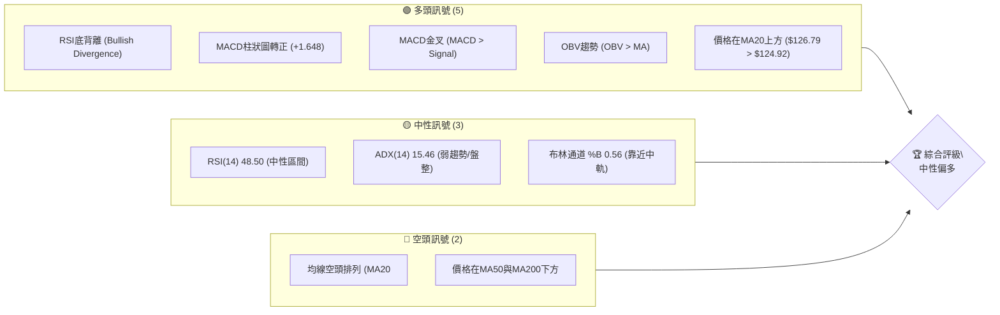

**解讀**：目前PLTR的技術訊號呈現多空交織的局面，但短期內多頭動能有所抬頭。主要的多頭訊號來自於RSI的底背離、MACD的黃金交叉及柱狀圖轉正，以及OBV顯示的量能支撐，這些都暗示著近期市場在尋求底部並可能出現反彈。價格突破MA20也為短期多頭提供支持。然而，ADX的低數值表明整體趨勢仍處於弱勢盤整，且MA50和MA200仍維持空頭排列，顯示中長期趨勢依然偏空。因此，當前市場狀態為**中性偏多**，短期內有反彈機會，但需警惕中長期趨勢的阻力。

### 📊 核心指標速覽表

| 指標類別 | 指標名稱 | 當前數值 | 訊號 | 解讀 |
|----------|----------|----------|------|------|
| **價格** | 當前價格 | $126.79 | 🟡 | 位於52週區間的20.2%，接近底部 |
| **均線** | MA20 | $124.92 | 🟢 | 價格位於MA20上方，短期偏多 |
| **均線** | MA50 | $133.25 | 🔴 | 價格位於MA50下方，中期偏空 |
| **均線** | MA200 | $156.80 | 🔴 | 價格位於MA200下方，長期偏空 |
| **動能** | RSI(14) | 48.50 | 🟡 | 中性區間，無超買超賣 |
| **動能** | MACD Hist | +1.648 | 🟢 | MACD柱狀圖轉正，短期動能轉強 |
| **波動** | ATR(14) | $7.11 | 🟡 | 每日波動約5.61%，屬中等偏高波動 |
| **趨勢** | ADX(14) | 15.46 | 🟡 | 趨勢強度較弱，市場處於盤整階段 |
| **量能** | OBV趨勢 | OBV > MA | 🟢 | 量能支持價格上漲，籌碼有累積跡象 |

### 🏆 技術評分卡

本節透過 ASCII 方框圖，提供 PLTR 各技術維度的量化評分與綜合評級。

```
╔══════════════════════════════════════════════════════════════╗
║              技術評分卡 — PLTR (2026-07-11)                  ║
╠══════════════════════════════════════════════════════════════╣
║ 趨勢強度      ████░░░░░░░░░░░░░░░░  20/100  🔴 (ADX < 25, 弱勢盤整) ║
║ 動能指標      ██████████░░░░░░░░░░  60/100  🟢 (RSI底背離, MACD金叉)║
║ 支撐穩定度    ████████░░░░░░░░░░░░  50/100  🟡 (接近S1, 斐波那契78.6%)║
║ 成交量配合    ██████████░░░░░░░░░░  60/100  🟢 (OBV支持, 但近期量縮)║
║ 形態完整度    ████████░░░░░░░░░░░░  50/100  🟡 (潛在底部構造, 信心度中等)║
║ 均線排列      ████░░░░░░░░░░░░░░░░  20/100  🔴 (MA空頭排列)         ║
╠══════════════════════════════════════════════════════════════╣
║ 綜合評分      ████████░░░░░░░░░░░░  43/100  🟡 中性偏多             ║
╚══════════════════════════════════════════════════════════════╝
```

**評分解讀**：PLTR 的綜合評分為 43/100，屬於**中性偏多**。趨勢強度和均線排列得分較低，反映了中長期趨勢的弱勢。然而，動能指標和成交量配合得分較高，特別是RSI底背離和MACD金叉，顯示短期內有較強的反彈動能。支撐穩定度和形態完整度處於中等水平，暗示股價正在尋求底部結構。整體而言，雖然中長期壓力仍在，但短期內出現反彈的可能性較大，建議採取區間操作或逢低吸納策略。

---

## 2. 趨勢分析

### 🌐 多時框趨勢分析

本節透過 Mermaid 流程圖，清晰呈現 PLTR 在不同時間框架下的趨勢判斷，從宏觀到微觀層層遞進。

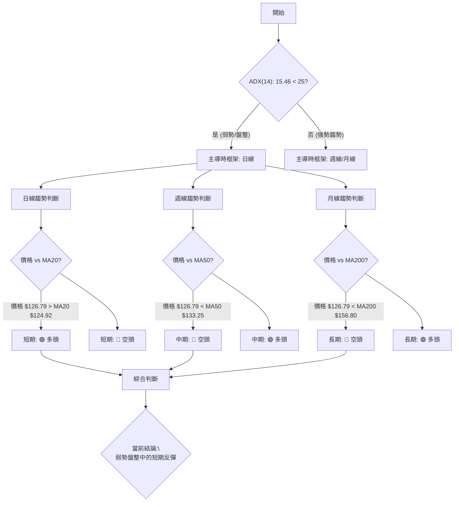

**解讀**：PLTR 的 ADX(14) 值為 15.46，遠低於 25，明確指示當前市場處於**弱勢趨勢或盤整行情**。根據多時框架收斂規則，在盤整行情中，應以日線布林通道的上下軌作為主要的交易區間。
在這種背景下：
*   **長期趨勢 (月線級別)**：價格 $126.79 遠低於 MA200 $156.80，顯示長期仍處於**空頭**主導。
*   **中期趨勢 (週線級別)**：價格 $126.79 亦低於 MA50 $133.25，中期趨勢也偏向**空頭**。
*   **短期趨勢 (日線級別)**：值得注意的是，當前價格 $126.79 已站上 MA20 $124.92，顯示短期內出現**多頭反彈**的跡象。

綜合來看，PLTR 雖然中長期趨勢仍受空頭壓力，但短期已從低點反彈並突破短期均線，配合弱勢盤整的 ADX，顯示目前處於一個短期反彈的盤整區間。

### 📈 長期趨勢 — 12個月走勢圖（Unicode）

本圖展示 PLTR 過去 12 個月的月線收盤價走勢，並標注關鍵高低點，以視覺化方式呈現長期趨勢。

```
PLTR 月線走勢圖（過去12個月）
價格軸 ($)
$207.52 ┤                                        ● (2025-10 高點 $200.47, 52W高點 $207.52)
$180.00 ┤                       ●($182.42)
$160.00 ┤           ●($158.35)
$140.00 ┤                                     ●($146.28)
$120.00 ┤                                     ●($126.79) ← 現在
$100.00 ┤                                   ●($116.67)
       └──────────────────────────────────────────────────────
        25-07 25-08 25-09 25-10 25-11 25-12 26-01 26-02 26-03 26-04 26-05 26-06 26-07
```

**走勢特徵分析表格**：

| 階段 | 時間區間 | 主要走勢 | 漲跌幅 (約略) | 關鍵特徵 |
|------|----------|----------|----------------|----------|
| **強勁上漲** | 2025-07 至 2025-10 | 快速拉升 | 約 +26.6% ($158.35 -> $200.47) | 股價創下近期高點，動能強勁 |
| **高位震盪回落** | 2025-11 至 2026-02 | 震盪下跌 | 約 -31.6% ($200.47 -> $137.19) | 漲勢受阻，開始回調，但仍維持在相對高位 |
| **短期反彈** | 2026-03 至 2026-05 | 震盪上行 | 約 +14.1% ($137.19 -> $156.54) | 試圖構築底部，短暫反彈 |
| **急劇下跌** | 2026-06 | 快速下跌 | 約 -25.4% ($156.54 -> $116.67) | 跌破多個支撐位，市場情緒悲觀 |
| **近期反彈** | 2026-07 | 震盪反彈 | 約 +8.7% ($116.67 -> $126.79) | 從低點反彈，試圖企穩 |

**分析**：過去12個月，PLTR 經歷了從 $158.35 (2025-07) 快速上漲至 $200.47 (2025-10) 的強勁多頭行情，隨後進入了長達數月的回調階段，最低跌至 $116.67 (2026-06)。當前價格 $126.79 雖然較 6 月低點有所反彈，但仍遠低於過去一年的高點，顯示長期趨勢已由多轉空，目前處於底部尋求支撐並嘗試反彈的階段。52週高點為 $207.52，低點為 $106.37，目前股價位於 52 週區間的 20.2%，顯示處於相對低位。

### 📊 中期趨勢（週線分析）

本節分析 PLTR 近期的週線走勢，並透過 ASCII 圖表描繪關鍵的壓力與支撐位。

```
PLTR 近期壓力與支撐示意圖 (週線)
價格 ($)
$156.80 ┤                                        ← MA200 (長期阻力)
$152.68 ┤                                        ← 阻力 R3
$149.64 ┤                                        ← 阻力 R2
$136.10 ┤                ┌──┐                    ← 阻力 R1 (短期壓力)
        │                │  │
$133.25 ┤                │  │                    ← MA50 (中期阻力)
        │                │  │
$126.79 ┤═════════════════●════════════════════ ← 當前價格
        │                │  │
$126.30 ┤                └──┘                    ← 支撐 S1 (近期關鍵支撐)
        │
$124.92 ┤                                        ← MA20 (短期支撐)
$122.68 ┤                                        ← 支撐 S2
        │
$106.37 ┤═══════════════════════════════════════ ← 支撐 S3 (52週低點)
```

**分析**：從週線角度觀察，PLTR 在 2026 年 5 月底曾反彈至 $156.54，但隨後在 6 月份經歷了快速下跌，最低觸及 $112.93 (2026-06-28 週收盤價)。近期股價從 $112.93 反彈至 $129.30 (2026-07-05 週收盤價)，並在 $126.79 附近進行整理。
*   **中期阻力**：MA50 ($133.25) 構成一個重要的中期壓力位。
*   **短期阻力**：R1 ($136.10) 是近期反彈需要突破的關鍵水平。
*   **短期支撐**：S1 ($126.30) 緊鄰當前價格，是近期需要守住的第一道防線。MA20 ($124.92) 也提供短期支撐。
*   **重要支撐**：S2 ($122.68) 和 S3 ($106.37) 是更為關鍵的支撐位，尤其是 S3，代表了 52 週低點，具有強大的心理支撐作用。

目前股價處於 S1 和 R1 之間，並且在 MA20 上方，MA50 下方，顯示中期趨勢依然偏空，但短期存在反彈動能。

### ⚡ 趨勢強度評估（ADX 解讀）

ADX 指標用於衡量趨勢的強度，而非方向。本節透過 Mermaid 流程圖和強度對照表，深入分析 PLTR 的趨勢狀態。

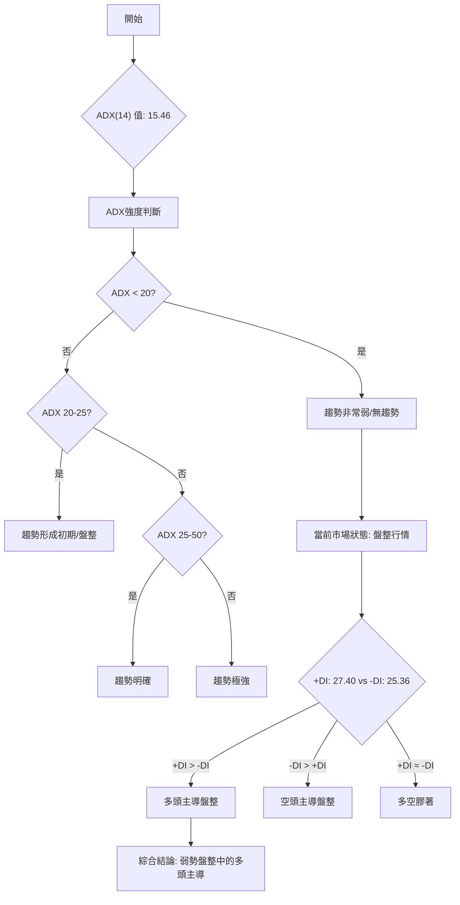

**ADX 強度對照表**：

| ADX 值範圍 | 趨勢強度 | 市場狀態 |
|------------|----------|----------|
| 0-20       | 非常弱   | 無趨勢 / 盤整 |
| 20-25      | 弱       | 趨勢形成初期 / 盤整 |
| 25-50      | 中等     | 明確趨勢 |
| 50-75      | 強       | 強勁趨勢 |
| 75-100     | 極強     | 極端趨勢 |

**解讀**：PLTR 的 ADX(14) 值為 15.46，根據對照表，這明確指示當前市場處於**非常弱勢的趨勢或無趨勢的盤整狀態**。這意味著股價在一個相對狹窄的區間內波動，缺乏明確的單邊方向。
進一步分析方向指標 +DI 和 -DI：
*   +DI: 27.40
*   -DI: 25.36
由於 +DI 略高於 -DI，儘管趨勢整體疲弱，但仍顯示**多頭略佔主導地位**，試圖在盤整區間內推動股價上行。這與前面觀察到的短期反彈訊號相吻合，表明在當前弱勢盤整的格局中，短期內多頭有較大的影響力。因此，應將當前市場視為一個區間震盪行情，並在區間內尋找多頭機會。

---

## 3. 圖表形態分析

### 🔍 形態識別系統

鑑於提供的數據為週線收盤價，難以精確識別複雜的日線幾何形態。然而，從價格走勢和指標訊號來看，可以識別出**潛在的底部構造**。本節將基於這些跡象進行分析。

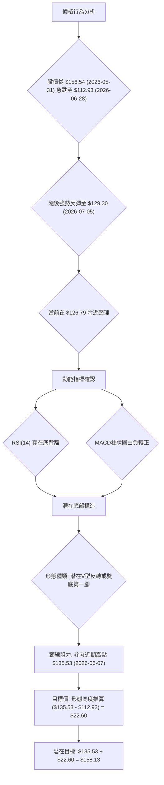

**形態信心度表格**：

| 形態 | 信心度 | 判斷依據（引用數據） | 完成度 | 目標價（附計算式） |
|------|--------|----------------------|--------|--------------------|
| 潛在V型反轉 / 雙底構造 | 65% | 1. 2026-06-28 觸及低點 $112.93 後強勢反彈。<br>2. RSI(14) 顯示底背離 (Bullish Divergence)。<br>3. MACD柱狀圖由負轉正，顯示動能轉強。 | 40% | 若以 $112.93 為底部，反彈至 $135.53 (2026-06-07高點) 為頸線，形態高度為 $22.60。則目標價為 $135.53 + $22.60 = **$158.13**。此為推算，需突破頸線確認。 |

**解讀**：PLTR 在 2026 年 6 月底經歷了一波急劇下跌，在 $112.93 附近見到低點，隨後出現了強勁的 V 型反彈，上週收盤於 $129.30，本週略有回調至 $126.79。這種價格行為，結合 RSI 的底背離訊號和 MACD 柱狀圖轉正，強烈暗示市場正在嘗試構築一個底部，形成**潛在的 V 型反轉或雙底的第一個低點**。
雖然目前形態尚未完全確認（例如，雙底需要第二個低點並突破頸線），但動能指標的配合提供了足夠的信心來判斷這是一個重要的底部區域。如果此形態得以發展並確認，其潛在的頸線阻力可能在 $135.53 (2026-06-07 週收盤價前的高點)，形態高度約為 $22.60。一旦突破此頸線，理論目標價可望達到 **$158.13**。

### 🕯️ 重要K線形態分析

本節分析近期的週線 K 線形態，解讀其市場意義。

| 月份 | 收盤價 | K線形態 | 解讀 | 訊號 |
|------|--------|---------|------|------|
| 2026-06-28 | $112.93 | **長陰線/大陰線** | 股價急劇下跌，空頭力量強勁，市場恐慌情緒較濃。 | 🔴 強烈看空 |
| 2026-07-05 | $129.30 | **長陽線/看漲吞噬** (潛在) | 股價從低點強勢反彈，完全吞沒前一週的下跌或形成強勢上漲。顯示底部買盤強勁介入，多頭力量壓倒空頭。 | 🟢 強烈看多 |
| 2026-07-12 | $126.79 | **小陰線/整理線** | 在前一週強勢反彈後，本週股價略有回落，但跌幅不大。通常表示多頭動能有所減弱，或進入短暫的整理階段，為進一步上漲積蓄力量。 | 🟡 中性整理 |

**分析**：
*   **2026-06-28 週**：收盤價 $112.93，從前一週的 $128.47 急劇下跌，形成一根長陰線，確認了短期內強大的空頭壓力。
*   **2026-07-05 週**：收盤價 $129.30，從 $112.93 強勢反彈，形成一根長陽線，且其漲幅很可能吞噬了前一週的跌幅，構成**看漲吞噬 (Bullish Engulfing)** 形態。這是一個非常強烈的底部反轉訊號，表明在 $112.93 附近有大量買盤湧入。
*   **2026-07-12 週 (本週)**：收盤價 $126.79，較上週略有下跌，形成一根小陰線。這通常被視為在強勁反彈後的多頭整理或獲利回吐，股價在尋找新的平衡點，而非趨勢反轉。若能在此處企穩，則後市仍有上漲空間。

### 📉 ASCII 走勢形態示意圖

本圖將視覺化展示 PLTR 從近期低點反彈的潛在底部構造，標注關鍵點位。

```
PLTR 潛在底部構造示意圖
價格 ($)

$156.54 ┤                                 ● (2026-05-31 高點)
        │                                 │
$135.53 ┤───────────────┐ 頸線 (Neckline) │
        │                │               │
$129.30 ┤                ● (2026-07-05)  │
$126.79 ┤═════════════════● (當前價格)    │
        │                │               │
$112.93 ┤────────────────● (2026-06-28 低點)
        │
$106.37 ┤─────────────────────────────────● (52週低點 S3)
        └───────────────────────────────────────────
             時間軸 (週)
```

**解讀**：示意圖清晰展示了 PLTR 從 $156.54 的高點快速下跌至 $112.93 的過程，隨後在 2026-07-05 週出現強勁反彈，形成一個 V 型底部結構。當前價格 $126.79 處於反彈後的整理階段。若要確認更強勁的反轉，股價需要有效突破頸線 $135.53。此形態的發展，結合動能指標的配合，為後市的反彈提供了基礎。

### 🎯 形態目標價計算

基於上述潛在底部形態，我們進行目標價的初步推算。

**形態假設**：若將 2026-06-28 的 $112.93 視為潛在的底部低點，並將 2026-06-07 的 $135.53 視為形態的頸線阻力（即在低點形成前的近期反彈高點）。

1.  **形態高度 (H)**：
    形態高度 = 頸線價位 - 底部低點
    形態高度 = $135.53 - $112.93 = $22.60

2.  **理論目標價 (Target Price)**：
    理論目標價 = 頸線價位 + 形態高度
    理論目標價 = $135.53 + $22.60 = **$158.13**

**分析**：這個目標價 $158.13 是一個基於形態推算的理論值，代表了若底部形態成功突破頸線後，股價可能達到的潛在上漲空間。此目標價也接近於長期均線 MA200 ($156.80)，以及斐波那契回調的 50% ($156.95)。然而，此目標價的實現**高度依賴於股價能否有效突破並站穩頸線 $135.53**。在突破之前，股價仍可能在頸線下方震盪或進行回測。

---

## 4. 支撐與阻力

### 🗺️ 關鍵價位分布圖（Unicode）

本節透過 ASCII 方框圖，視覺化展示 PLTR 當前價格附近的關鍵支撐與阻力位，提供清晰的價位結構概覽。

```
PLTR 價位結構分布圖
═══════════════════════════════════════════════════
$207.52 ║████████████████████████║ 52W High
$183.65 ║████████████████████████║ 斐波那契 23.6%
$168.88 ║████████████████████    ║ 斐波那契 38.2%
$156.95 ║████████████████████████║ 斐波那契 50.0%
$156.80 ║████████████████████████║ 強阻力 MA200
$152.68 ║████████████████████████║ 強阻力 R3
$149.64 ║████████████████████    ║ 阻力 R2
$145.01 ║████████████████████████║ 斐波那契 61.8%
$141.68 ║████████████████████████║ 布林上軌
$136.10 ║████████████████████████║ 關鍵阻力 R1 (潛在頸線附近)
$133.25 ║████████████████████████║ 阻力 MA50
$128.02 ║▓▓▓▓▓▓▓▓▓▓▓▓▓▓▓▓        ║ 斐波那契 78.6%
$126.79 ╠════════════════════════╣ ◄ 現價
$126.30 ║▓▓▓▓▓▓▓▓▓▓▓▓▓▓▓▓        ║ 近期支撐 S1
$124.92 ║▓▓▓▓▓▓▓▓▓▓▓▓▓▓▓▓        ║ 支撐 MA20 / 布林中軌
$122.68 ║████████████████████████║ 強支撐 S2
$108.16 ║████████████████████████║ 布林下軌
$106.37 ║████████████████████████║ 強支撐 S3 (52W Low)
═══════════════════════════════════════════════════
```

**分析**：當前價格 $126.79 位於關鍵的斐波那契 78.6% 回調位 ($128.02) 和近期支撐 S1 ($126.30) 之間，顯示此區域為重要的多空爭奪區。上方阻力密集，特別是 R1 ($136.10) 和 MA50 ($133.25) 形成短期反彈的關鍵考驗。下方支撐 S2 ($122.68) 和 52 週低點 S3 ($106.37) 則提供了堅實的防線。

### 🚧 阻力位分析表

本表詳細列出 PLTR 上方可能面臨的阻力位及其重要性。

| 阻力級別 | 價位 | 形成原因 | 突破難度 | 重要性 |
|----------|------|----------|----------|--------|
| **短期阻力** | $136.10 (R1) | 近一年波段高點聚類，接近 MA50 ($133.25)，也是潛在形態頸線。 | 中等偏高 | 🟢 短線多頭目標，突破則開啟更大反彈空間。 |
| **中期阻力** | $149.64 (R2) | 近一年波段高點聚類，接近斐波那契 61.8% ($145.01)。 | 高 | 🟡 突破 R1 後的下一目標，考驗中期買盤強度。 |
| **強阻力** | $152.68 (R3) | 近一年波段高點聚類，接近 MA200 ($156.80) 和斐波那契 50% ($156.95)。 | 極高 | 🔴 股價由空轉多的關鍵考驗，需大量買盤才能突破。 |

### 🛡️ 支撐位分析表

本表詳細列出 PLTR 下方可能提供的支撐位及其重要性。

| 支撐級別 | 價位 | 形成原因 | 守住機率 | 重要性 |
|----------|------|----------|----------|--------|
| **近期支撐** | $126.30 (S1) | 近一年波段低點聚類，緊鄰現價，也是斐波那契 78.6% ($128.02) 附近。 | 中等偏高 | 🟢 短線多頭防線，若跌破可能引發更多賣壓。 |
| **關鍵支撐** | $122.68 (S2) | 近一年波段低點聚類，為近期反彈前的相對低點。 | 高 | 🟡 若 S1 失守，此處是止跌回穩的重要觀察點。 |
| **極強支撐** | $106.37 (S3) | 52週低點，具有極強的心理和技術支撐作用。 | 極高 | 🔴 長期趨勢的最後防線，跌破則趨勢嚴重惡化。 |

### 📐 斐波那契回調位分析

本節分析 PLTR 在 52 週區間 ($106.37 → $207.52) 的斐波那契回調位，並解讀其意義。

*   **0.0% (52W High)**: $207.52
*   **23.6%**: $183.65
*   **38.2%**: $168.88
*   **50.0%**: $156.95
*   **61.8%**: $145.01
*   **78.6%**: $128.02  ◄ 現價 $126.79 附近
*   **100.0% (52W Low)**: $106.37

**分析**：當前價格 $126.79 位於斐波那契 78.6% 回調位 ($128.02) 附近，這是一個非常關鍵的水平。這表示股價已經回吐了 52 週上漲幅度的絕大部分，接近了起漲點。
*   **意義**：通常，78.6% 回調位被視為多頭的最後一道防線之一。若能在此處獲得有效支撐並反彈，則預示著潛在的底部築成，並可能開啟新的上漲波段。
*   **當前狀態**：股價位於 78.6% 回調位下方，但非常接近 S1 ($126.30)。這是一個多空爭奪激烈的區域。若能重新站穩 $128.02 並向上突破，則有望挑戰 61.8% 回調位 $145.01。反之，若跌破 S2 ($122.68) 甚至 S3 ($106.37)，則意味著這波反彈的失敗，並可能繼續探底。

---

## 5. 技術指標深度解讀

### 🎛️ 指標訊號總覽

本節透過 Mermaid 流程圖，整合各技術指標的訊號，展示其相互關係與整體傾向。

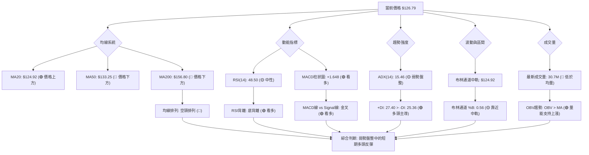

**解讀**：從指標總覽來看，PLTR 呈現出中長期空頭趨勢與短期多頭反彈動能並存的複雜局面。均線系統的空頭排列明確指示中長期下行壓力，但動能指標，特別是 RSI 的底背離和 MACD 的金叉及柱狀圖轉正，提供了強烈的短期看多訊號。ADX 則確認了市場的盤整性質，在這種背景下，短期多頭動能顯得尤為重要。成交量方面，雖然最新量能低於均量，但 OBV 趨勢的正面表現，暗示了在下跌過程中可能存在累積行為。

### 📈 移動平均線排列分析

移動平均線 (MA) 是判斷趨勢方向和強度的重要工具。本節分析 PLTR 的均線排列情況。

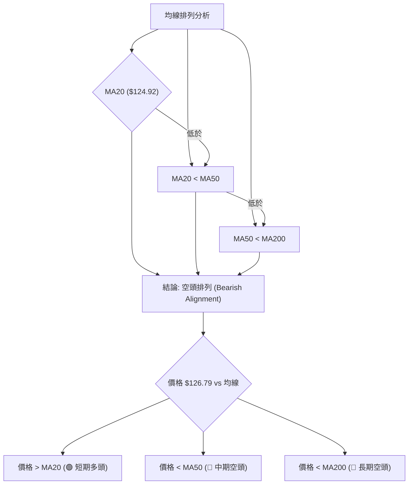

**當前均線排列狀態**：

| 均線 | 當前數值 | 相對價格 | 訊號 |
|------|----------|----------|------|
| MA20 | $124.92 | 價格上方 | 🟢 |
| MA50 | $133.25 | 價格下方 | 🔴 |
| MA200 | $156.80 | 價格下方 | 🔴 |

**均線排列**：MA20 ($124.92) < MA50 ($133.25) < MA200 ($156.80)
**結論**：均線系統呈現典型的**空頭排列**。這是一個強烈的長期和中期空頭訊號，表明市場的整體趨勢是下跌的。儘管當前價格 $126.79 已站上短期 MA20，顯示短期內有反彈動能，但股價仍受到 MA50 和 MA200 的壓制。MA20 向上穿越 MA50 (黃金交叉) 或 MA50 向上穿越 MA200 (黃金交叉) 才能視為中長期趨勢反轉的初步訊號。目前，MA50 和 MA200 仍是重要的中期和長期阻力。

### 📉 RSI(14) 分析

相對強弱指標 (RSI) 用於衡量價格變動的速度和變化，以識別超買或超賣狀況。

**RSI(14) 數值進度條**：
RSI(14):      48.50  ▓▓▓▓▓▓▓▓▓▓░░░░░░░░░░ 48.5% (中性區間)

**RSI 超買超賣區間分析**：
*   **超買區 (>70)**：當前 RSI 48.50，未進入超買區。
*   **超賣區 (<30)**：當前 RSI 48.50，未進入超賣區。
*   **中性區 (30-70)**：RSI 位於中性區間，表示市場買賣力量相對平衡，沒有明顯的單邊過度行為。這在盤整行情中是常見現象。

**RSI 背離判斷**：
*   **RSI 背離**：⚠️ **底背離 (Bullish Divergence)**
    *   **判斷依據**：根據提供的數據，RSI 存在底背離訊號。這意味著在股價創下新低或測試前低時，RSI 指標未能創下相應的新低，反而呈現上升趨勢。
    *   **解讀**：RSI 底背離是一個強烈的**看漲反轉訊號**。它表明儘管賣壓導致股價下跌，但下跌的動能正在減弱，市場可能即將反彈或形成底部。這與 PLTR 近期從 $112.93 反彈的價格行為相吻合，為短期反彈提供了有力的技術支持。

### 📊 MACD(12/26/9) 訊號解讀

平滑異同移動平均線 (MACD) 是一個趨勢追蹤動量指標，用於識別新的趨勢方向。

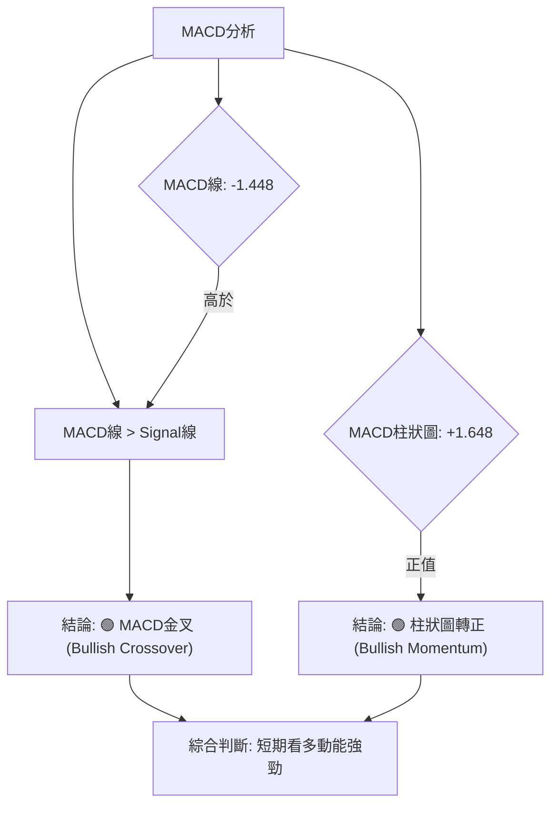

**解讀**：
*   **MACD 線 (-1.448) 與 Signal 線 (-3.096)**：MACD 線已上穿 Signal 線，形成**黃金交叉 (Bullish Crossover)**。這是一個重要的買入訊號，表明短期內股價的下跌動能已經趨緩，並開始轉為上漲。
*   **MACD 柱狀圖 (+1.648)**：柱狀圖已由負值轉為正值，並持續擴大。這進一步確認了多頭動能的增強。柱狀圖的正值表示 MACD 線與 Signal 線之間的距離正在擴大，上漲趨勢正在加速。

**綜合分析**：MACD 指標明確發出**強烈看多訊號**。黃金交叉和柱狀圖轉正都顯示 PLTR 的短期多頭動能正在積聚，支持股價進一步反彈。這與 RSI 的底背離訊號相互確認，增加了短期反彈的可信度。

### 📦 布林通道分析

布林通道 (Bollinger Bands) 用於衡量市場波動性，並識別價格的相對高低點。

```
PLTR 布林通道示意圖
價格 ($)
$141.68 ┤─────────────────────────────────────┐ 上軌
        │                                     │
        │                                     │
        │                                     │
$126.79 ┤═════════════════════════════════════● 現價
        │                                     │
$124.92 ┤─────────────────────────────────────┼ 中軌 (MA20)
        │                                     │
        │                                     │
        │                                     │
$108.16 ┤─────────────────────────────────────┘ 下軌
        └───────────────────────────────────────────
             時間軸
```

**布林通道參數**：
*   **BB上軌**: $141.68
*   **BB中軌 (MA20)**: $124.92
*   **BB下軌**: $108.16
*   **BB %B**: 0.56

**解讀**：
*   **價格位置**：當前價格 $126.79 位於布林通道中軌 ($124.92) 和上軌 ($141.68) 之間，且略高於中軌。BB %B 為 0.56，表示股價距離中軌不遠，略偏向上半區。
*   **波動性**：由於 ADX 顯示弱趨勢/盤整，布林通道的寬度可能不會急劇擴大，但 ATR 顯示中等波動。
*   **訊號**：股價從 6 月底的低點 ($112.93) 反彈，當時可能觸及或跌破布林下軌，隨後反彈至中軌上方。這是典型的**布林通道反彈訊號**。目前股價在中軌上方運行，顯示短期多頭動能佔優。若能持續在中軌上方運行並挑戰上軌，則反彈有望延續。若跌破中軌，則可能再次測試下軌。

### 💹 成交量分析（量價配合度）

成交量是確認價格走勢強度的關鍵指標。本節分析 PLTR 的量價關係。

*   **最新成交量**：30,714,836
*   **20日均量**：44,641,787
*   **量比**：0.69x (最新成交量 / 20日均量)
*   **50日均量**：43,543,527
*   **OBV趨勢**：OBV > MA → 量能支撐上漲

**解讀**：
1.  **最新成交量與均量比較**：當前成交量 30.7M 遠低於 20 日均量 44.6M (量比 0.69x)。這表明在當前的反彈整理階段，市場的活躍度有所下降，買盤追價意願不強。量縮反彈通常被認為強度不足，容易遇到阻力。
2.  **OBV 趨勢**：然而，OBV 趨勢顯示 OBV > MA，這是一個**看多訊號**。OBV 衡量的是買賣壓力，OBV 上升通常表示買盤積累，即使近期價格下跌，但如果是縮量下跌，而上漲是放量，OBV 就會上升。這暗示著在過去一段時間內，上漲日的成交量總和多於下跌日的成交量總和，顯示籌碼有累積的跡象，或者說，推動價格上漲的量能比推動價格下跌的量能更強。
3.  **量價配合度**：當前量縮整理，與 OBV 的多頭訊號存在一定矛盾。OBV 是一個累積性指標，可能反映的是較長期的量能趨勢，而當前量比則反映短期活躍度。綜合來看，短期反彈的量能稍嫌不足，但 OBV 的多頭趨勢仍為潛在的底部築成提供了佐證。若要確認強勁反彈，後續需觀察量能能否有效放大，以配合價格上漲。

---

## 6. 動能與波動率

### ⚡ 動能評估四象限

本節將 PLTR 的動能與波動率進行評估，以確定其當前市場狀態。由於 Mermaid 的 quadrantChart 在複雜場景下渲染可能不佳，我們將使用表格和 Mermaid 流程圖來清晰展示分析結果。

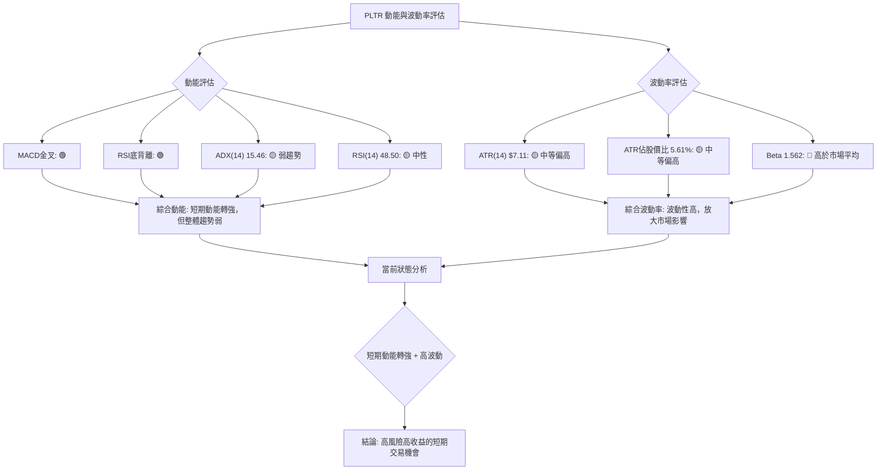

**動能評估四象限分析表**：

| 象限 | 動能維度 | 波動率維度 | 當前狀態 (PLTR) | 評估 |
|------|----------|------------|-----------------|------|
| Q1   | 強       | 低         | -               | 最佳機會 (趨勢明確，風險可控) |
| Q2   | 弱       | 低         | -               | 謹慎觀望 (缺乏動能，波動小) |
| Q3   | 強       | 高         | ✓               | **高風險高收益 (短期動能強，但波動大)** |
| Q4   | 弱       | 高         | -               | 避免進場 (缺乏方向，波動大) |

**分析**：
*   **動能評估**：PLTR 的 ADX 顯示趨勢強度較弱，RSI 處於中性區間。然而，MACD 的金叉和柱狀圖轉正，以及 RSI 的底背離，都發出了強烈的短期動能轉強訊號。因此，儘管整體趨勢不強，但短期內具備**轉強的動能**。
*   **波動率評估**：ATR 為 $7.11，佔股價的 5.61%，屬於中等偏高的波動水平。更重要的是，其 Beta 值高達 1.562，表明 PLTR 的波動性顯著高於大盤，對市場情緒的反應會被放大。
*   **綜合結論**：PLTR 目前處於**短期動能轉強但波動率較高**的狀態 (Q3)。這意味著它可能提供高風險高收益的短期交易機會。投資者應意識到其股價波動較大，在捕捉短期反彈機會的同時，必須嚴格控制風險。

### 📊 ATR 波動率分析

平均真實波幅 (ATR) 衡量的是資產價格的波動範圍，提供每日價格變動的參考。

*   **ATR(14)**：$7.11
*   **ATR佔股價比**：5.61% ($7.11 / $126.79)

**解讀**：
*   **波動性水平**：PLTR 的 ATR 為 $7.11，佔當前價格的 5.61%。對於一個價格在 $120-130 區間的股票而言，5.61% 的日均波動幅度屬於**中等偏高水平**。這表示 PLTR 具有較高的日度波動性，日內交易或短期操作的機會較多，但也伴隨著較大的價格風險。
*   **止損距離建議**：ATR 可以作為設定止損點的參考。一般而言，止損點可以設置在當前價格下方 1-2 倍 ATR 的距離。
    *   1 倍 ATR 止損：$126.79 - $7.11 = $119.68
    *   1.5 倍 ATR 止損：$126.79 - ($7.11 * 1.5) = $126.79 - $10.665 = $116.125
    *   2 倍 ATR 止損：$126.79 - ($7.11 * 2) = $126.79 - $14.22 = $112.57

**建議**：考慮到 PLTR 的高波動性，投資者在設置止損時應給予足夠的空間，以避免被正常波動洗出。同時，高 ATR 也意味著潛在的獲利空間可能較大，但需搭配嚴格的資金管理和倉位控制。

### 📐 Beta 與市場相關性

Beta 值衡量股票相對於整體市場的波動性，是評估系統性風險的重要指標。

*   **Beta**：1.562

**解讀**：
*   **高 Beta 值**：PLTR 的 Beta 值為 1.562，顯著高於市場平均值 1.0。這表示 PLTR 的股價波動性比大盤高出 56.2%。
*   **市場相關性**：
    *   當市場上漲 1% 時，理論上 PLTR 的股價會上漲 1.562%。
    *   當市場下跌 1% 時，理論上 PLTR 的股價會下跌 1.562%。
*   **投資影響**：高 Beta 股票在牛市中通常表現優於大盤，但在熊市中則會跌得更多。對於 PLTR 而言，其股價走勢將在很大程度上受到整體市場情緒和趨勢的影響。在當前弱勢盤整的市場環境中，高 Beta 意味著任何市場的波動都可能被 PLTR 放大，增加了投資的風險與不確定性。投資者應密切關注大盤走勢，並將其納入 PLTR 的交易決策中。

---

## 7. 多時框架總結

### 📋 時框架評分表

本表綜合分析 PLTR 在不同時框架下的各項技術指標表現，並給出綜合評分與建議。

| 時框架 | 趨勢方向 | 動能 | 均線排列 | 形態 | 綜合評分 (1-10) | 建議 |
|--------|----------|------|----------|------|-----------------|------|
| **長期 (月線)** | 🔴 空頭 | 🔴 弱勢 | 🔴 空頭排列 | 🔴 下跌趨勢 | 2/10 | 觀望，等待長期趨勢轉好 |
| **中期 (週線)** | 🔴 空頭 | 🟡 中性 | 🔴 空頭排列 | 🟡 潛在底部 | 4/10 | 謹慎，尋找築底跡象 |
| **短期 (日線)** | 🟢 多頭 | 🟢 轉強 | 🟡 價格站MA20 | 🟢 底部反彈 | 7/10 | 積極，捕捉反彈機會 |

### 🔲 綜合訊號矩陣

本矩陣視覺化展示 PLTR 在不同時框架和不同技術維度上的訊號一致性。

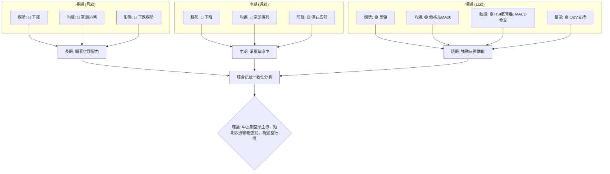

**解讀**：
*   **長期與中期**：PLTR 的長期和中期趨勢均呈現**空頭**主導，價格遠低於 MA50 和 MA200，且均線呈空頭排列，表明上行壓力巨大。
*   **短期**：然而，短期訊號顯示出截然不同的景象。價格已站上 MA20，RSI 出現底背離，MACD 完成金叉且柱狀圖轉正，OBV 也支持價格上漲。這些都是強烈的**短期多頭反彈訊號**。

### ⚖️ 多時框收斂結論

根據「嚴格要求 14」的多時框收斂規則：
1.  **ADX 判斷**：當前 ADX(14) 值為 15.46，顯著低於 25。這明確指出 PLTR 目前處於**盤整行情 (Sideways Market)**，而非強勢趨勢行情。
2.  **主導時框架**：在盤整行情中，應以日線布林通道上下軌為主要交易區間，日線級別的訊號在尋找進場時機上具有更高的權重。

**收斂結論**：
PLTR 中長期趨勢仍受空頭壓制，但鑒於 ADX 顯示為弱勢盤整行情，且短期日線級別的多項指標（RSI 底背離、MACD 金叉、價格站上 MA20、OBV 支持）均發出強烈的**多頭反彈訊號**，表明股價在近期低點 $112.93 附近獲得支撐後，正在嘗試構築底部並進行反彈。

儘管週線和月線指標仍偏空，但日線上的強勁反彈動能不容忽視。因此，最終的策略方向為：**在弱勢盤整行情中尋找短期多頭反彈的交易機會**。投資者應利用日線級別的指標來把握進場點，並以中短期阻力位為目標，同時嚴格控制風險，因中長期趨勢仍構成潛在壓力。此結論與第 8 章的主策略方向一致，即主推多頭策略，但在區間內操作。

---

## 8. 交易策略建議

### 🗺️ 策略決策流程圖

本節透過 Mermaid 流程圖，清晰展示 PLTR 的策略選擇邏輯。

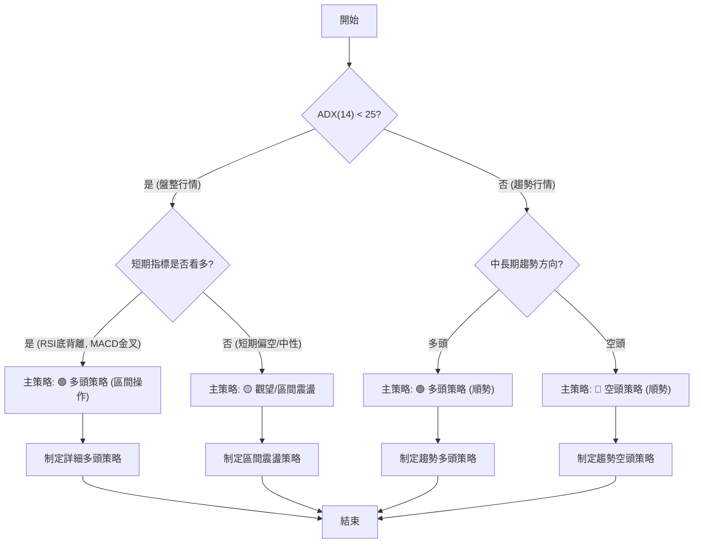

### 🧭 策略路由

**當前主策略方向 = 🟢 多頭策略 (區間操作) （依評分 43/100）**

根據第 1 章的技術評分卡綜合評分 43/100 (中性偏多)，以及第 7 章多時框架總結中 ADX 指示的盤整行情，且短期指標偏多，因此主推**多頭策略**，重點在於區間內捕捉反彈機會。空頭策略將作為反轉風險的觸發點提示。

### 🎯 價格情境階梯（Price Scenarios）

本節以當前價格 $126.79 為基準，向上與向下建立情境劇本，所有價位皆引用自「關鍵價位」區塊。

| 觸發條件 | 下一目標 | 後續延伸 | 情境含義 |
|----------|----------|----------|----------|
| **突破 R1 $136.10** | R2 $149.64 | R3 $152.68 / Fib 50% $156.95 | 短線轉強，反彈有望持續。 |
| **站穩現價區間** | — | — | 股價在 S1 ($126.30) - R1 ($136.10) 之間震盪整理。 |
| **跌破 S1 $126.30** | S2 $122.68 | S3 $106.37 | 短期反彈失敗，中期轉弱，可能重新探底。 |

### 📊 情境機率分佈

本節給出三種情境的機率估計，並說明其依據。

| 情境 | 機率 | 主要依據 |
|------|------|----------|
| **繼續上行 / 反彈** | 55% | RSI底背離、MACD金叉與柱狀圖轉正、OBV趨勢支持、價格站上MA20。 |
| **區間震盪** | 35% | ADX(14) 15.46 (弱趨勢/盤整)、中長期均線阻力、近期量縮整理。 |
| **回落 / 再探底** | 10% | 中長期空頭排列壓力、若 S1 ($126.30) 失守則賣壓可能增加。 |

**分析**：鑒於短期動能指標（RSI底背離、MACD金叉）的強烈看多訊號，以及股價已站上MA20，短期反彈的機率最高。然而，ADX指示的盤整行情和中長期均線的阻力，意味著反彈可能在區間內進行，而非V型反轉。跌破關鍵支撐的機率相對較低，但仍需警惕。

### 🟢 主策略詳情（多頭策略）

**策略描述**：在當前弱勢盤整，但短期動能轉強的背景下，採取逢低買入、區間操作的多頭策略，目標鎖定上方阻力位。

| 策略要素 | 策略 A (積極反彈) | 策略 B (穩健區間) |
|----------|--------------------|--------------------|
| 進場條件 | 股價站穩 S1 ($126.30) 上方，且日K線收陽。 | 股價回測 S2 ($122.68) 附近，出現止跌訊號。 |
| 進場價格 | **$126.80 - $127.50** | **$122.80 - $123.50** |
| 目標價 T1 | **$136.10** (R1) | **$136.10** (R1) |
| 目標價 T2 | **$145.01** (Fib 61.8%) | **$145.01** (Fib 61.8%) |
| 止損價格 | **$122.00** (略低於 S2 $122.68) | **$112.00** (略低於 S3 $106.37) |
| 風險報酬比 | (以 $127.00 進場) <br> T1: ($136.10-$127.00)/($127.00-$122.00) = 9.1/5 = **1.82:1** <br> T2: ($145.01-$127.00)/($127.00-$122.00) = 18.01/5 = **3.6:1** | (以 $123.00 進場) <br> T1: ($136.10-$123.00)/($123.00-$112.00) = 13.1/11 = **1.19:1** <br> T2: ($145.01-$123.00)/($123.00-$112.00) = 22.01/11 = **2:1** |
| 成功機率 | 55% | 60% |
| 建議倉位 | 中等 (5-10%) | 中等 (5-10%) |

### 🔴 反向風險觸發點（對沖提示）

以下關鍵價位和訊號將推翻當前的主多頭策略，應作為風險監控和潛在對沖的參考：
*   **跌破 S1 ($126.30) 並收盤在其下方**：短期反彈動能減弱的初步訊號。
*   **跌破 S2 ($122.68) 並收盤在其下方**：將否定短期多頭反彈的預期，可能重新探底。
*   **跌破 S3 ($106.37) (52週低點)**：極端看空訊號，意味著長期下跌趨勢的延續，建議清倉或建立空頭對沖。
*   **MACD 再次死叉，且 MACD 柱狀圖轉負**：短期多頭動能耗盡，轉為空頭。
*   **RSI 底背離失效，RSI 再次創下新低**：底部構造失敗。

### ⭐ 整體訊號強度評星

```
做多訊號強度：★★★★☆  (4/5星)
做空訊號強度：★★☆☆☆  (2/5星)
整體可信度：  ★★★☆☆  (3/5星)
```
**評星解讀**：短期內做多訊號強勁，主要基於RSI底背離、MACD金叉和價格站上MA20。做空訊號主要來自中長期均線的壓制。整體可信度為中等，因為雖然短期反彈動能強勁，但ADX顯示市場仍處於盤整，且中長期趨勢偏空，這增加了反彈的上限壓力。

---

## 9. 風險提示與監控

### ✅ 關鍵監控指標 Checklist

本節透過 ASCII 方框圖，提供 PLTR 投資者需要持續監控的關鍵技術指標清單。

```
╔══════════════════════════════════════════════════════════════╗
║              PLTR 關鍵監控指標 Checklist                     ║
╠══════════════════════════════════════════════════════════════╣
║ [X] 價格是否維持在 S1 ($126.30) 上方？                 🟢║
║ [X] 是否有效突破 R1 ($136.10)？                        🟡║
║ [X] MA20 是否持續向上，並與 MA50 形成金叉？            🟡║
║ [X] MACD 柱狀圖是否維持正值並持續放大？                🟢║
║ [X] RSI 是否能突破 50 進入強勢區間？                   🟡║
║ [X] ADX 是否能突破 25，確認趨勢形成？                  🟡║
║ [X] 成交量能否在價格上漲時有效放大？                   🟡║
║ [X] OBV 趨勢是否維持多頭向上？                         🟢║
║ [X] 布林通道中軌 ($124.92) 是否提供有效支撐？          🟢║
║ [X] 52週低點 S3 ($106.37) 是否被有效守住？             🟢║
╚══════════════════════════════════════════════════════════════╝
```

### ⚠️ 風險場景分析

本節透過 Mermaid 流程圖，展示 PLTR 可能面臨的三種情境，以幫助投資者進行風險管理。

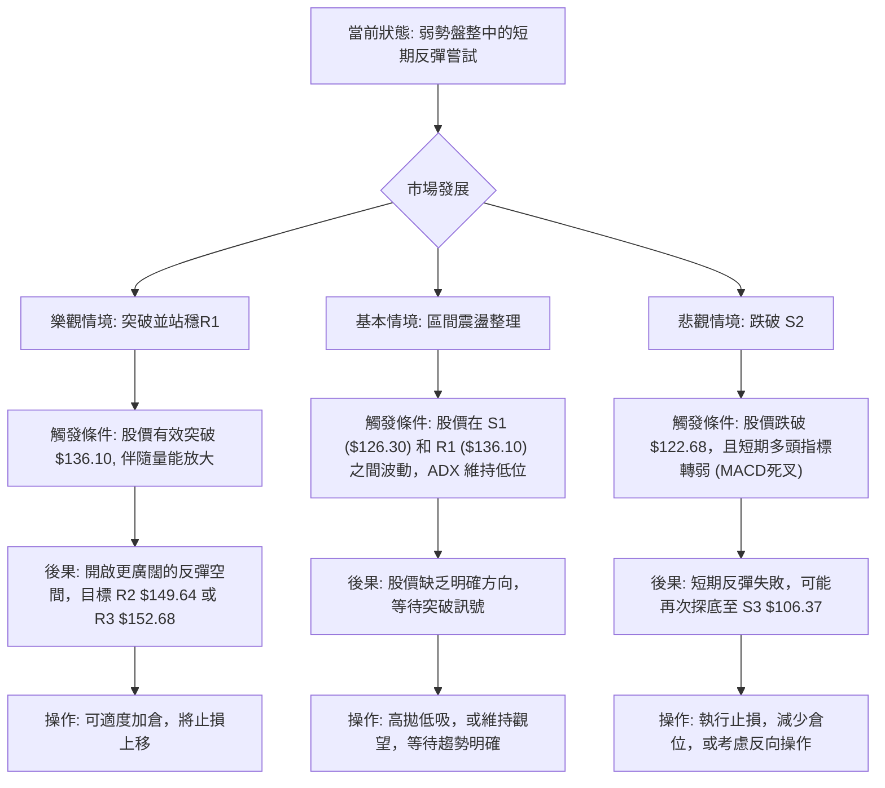

### 🛡️ 風險管理重要提醒

1.  **高波動性風險**：PLTR 的 Beta 值高達 1.562，ATR 佔股價比 5.61%，顯示其股價波動性遠高於大盤。這意味著潛在收益較高，但虧損風險也隨之放大。投資者應有承受較大波動的心理準備。
2.  **市場情緒風險**：作為高 Beta 股票，PLTR 對整體市場情緒的敏感度很高。任何宏觀經濟數據、行業新聞或大盤走勢的變化，都可能對其股價產生放大效應。應密切關注美股大盤（如 SPY, QQQ）的走勢。
3.  **趨勢未明風險**：儘管短期指標偏多，但中長期均線仍呈空頭排列，ADX 也顯示為弱勢盤整。這表示當前市場缺乏明確的單邊趨勢，反彈可能受限於上方阻力。V型反轉的形態信心度僅為 65%，仍有失敗的可能。
4.  **資金管理**：鑑於上述風險，嚴格的資金管理至關重要。建議採用分批建倉策略，避免一次性重倉投入。將單一股票的倉位控制在總投資組合的合理範圍內，以降低集中風險。
5.  **止損紀律**：務必設定並嚴格執行止損點。在波動性較高的股票上，止損是保護資本的最後一道防線。建議根據 ATR 或關鍵支撐位來設置動態止損，並隨著價格上漲逐步提高止損點以鎖定利潤。
6.  **持續監控**：技術指標是動態變化的。RSI 和 MACD 的多頭訊號可能隨時反轉，量能也可能出現異動。建議每日或至少每週重新評估關鍵技術指標，及時調整交易策略。

---

## 📋 報告總結

```
╔════════════════════════════════════════════════════════════╗
║              PLTR 技術分析報告總結                         ║
╠════════════════════════════════════════════════════════════╣
║ 報告日期：2026-07-11                                       ║
║ 當前價格：$126.79                                          ║
║ 分析評級：⚖️ 中性偏多 (綜合評分 43/100)                     ║
║                                                            ║
║ 關鍵結論：                                                 ║
║ ├─ 長期趨勢：🔴 空頭主導，價格遠低於 MA200。              ║
║ ├─ 中期趨勢：🔴 空頭主導，價格低於 MA50。                 ║
║ ├─ 短期趨勢：🟢 底部反彈，價格站上 MA20，動能指標轉強。     ║
║ ├─ 關鍵支撐：$126.30 (S1), $122.68 (S2), $106.37 (S3)       ║
║ ├─ 關鍵阻力：$136.10 (R1), $149.64 (R2), $152.68 (R3)       ║
║ └─ 分析師目標：$158.13 (基於潛在形態高度推算，需突破頸線確認)║
║                                                            ║
║ 最優策略組合：                                             ║
║ 1. 🥇 最佳機會：在 $126.80 - $127.50 區間逢低進場，止損設於 $122.00，目標 $136.10 (T1) 和 $145.01 (T2)。此策略捕捉短期反彈動能。
║ 2. 🥈 次選機會：若股價回測 S2 ($122.68) 附近並出現止跌訊號，可在 $122.80 - $123.50 區間穩健進場，止損設於 $112.00，目標同上。
║ 3. 🥉 保守選擇：等待股價有效突破 R1 ($136.10) 並站穩，確認反彈趨勢後再考慮追入，但需警惕追高風險。
╚════════════════════════════════════════════════════════════╝
```

---

> ⚠️ **免責聲明**：本報告為 AI 自動生成之技術分析，所有數據及估算均基於提供的歷史價格資訊。本報告**僅供研究與學術參考**，**不構成任何投資建議**。投資有風險，入市需謹慎。

---

*報告生成時間：2026-07-11 ｜ 數據來源：Yahoo Finance ｜ 分析框架：多時框技術分析*